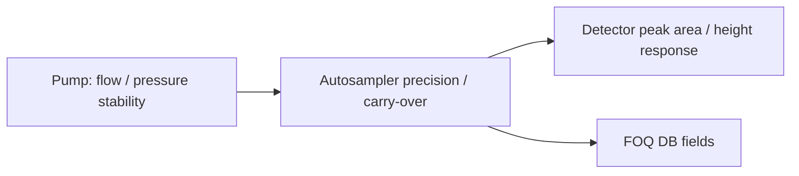

# FOQ Test Description for Vanquish Autosamplers

## Knowledge File Metadata

| Field | Value |
|---|---|
| KB_Version | 1.0 |
| Source_Revision | 8.01 |
| Extraction_Date | 2026-07-09 |
| Extractor | technical-document-knowledge-extractor |
| Source_Path | `C:\ProgramData\CMBX Data Explorer Workspace\KB\FOQ TD\FOQ_Testdescription_VAS.docm` |

## 文档元数据

| Field | Value |
|---|---|
| 文档标题 | FOQ Test Description (FOQ_TD) for Vanquish Autosamplers |
| 文档编号 / Agile Document ID | DOC0000273 |
| 当前版本 | 8.01 |
| 发布日期 / Current Revision Date | 28-Apr-2023 |
| 适用仪器型号 | VH-A10-A, VH-A40-A, VF-A10-A, VF-A40-A, VC-A12-A, VC-A13-A, VA-A12-A |
| 文档负责人 / Document Owner | Dominik Schuler |
| 文件引用 | FOQ_Testdescription_VAS.docm |
| 源文档类型 | FOQ_TD |

## 核心术语与缩写

| Term | Meaning | Knowledge note |
|---|---|---|
| FOQ | Factory Operational Qualification | 自动进样器出厂运行确认，验证规格主文件中的接收标准。 |
| VAS | Vanquish Autosampler | 本 TD 覆盖 VH/VF/VC/VA autosampler variants。 |
| Restriction Capillary | Restrictive fluidic path | 用于泄漏、carry-over、线性/精密度等测试的受控流路。 |
| Leakage Check | Injector pressure/leak test | 通过阻断流路并监测压力/泄漏率确认流路密封。 |
| Carry-over | Residue after high-concentration injection | 高浓度 caffeine 后的 blank/solvent 响应用于 ppm 级残留计算。 |
| MD | Metering Device | 计量驱动相关，linearity extended test 用于覆盖 lead screw 不同区段。 |
| Idle Volume | Metering/head positioning volume setting | 线性测试会改变 idle volume 以覆盖计量机构不同位置。 |
| System Check | Test-system validity check | 避免把标准品、进样精度或流路问题误判为模块失败。 |

## 测试流程概览

Source Table 1 lists FOQ tests in order of performance. Exact applicability differs by model.

| Order | Test / Action | Component / Setup | Applicability summary |
|---:|---|---|---|
| 1 | Cooling performance during burn-in | Autosampler cooling | Most variants; VC-A13-A has model-specific omission in Table 1. |
| 2 | Stop_Burn_In | Sequence state reset | All listed variants. |
| 3 | Factory default | Internal property/default check | All listed variants. |
| 4 | Leakage check | Restriction capillary / pressure setup | All listed variants. |
| 5 | Injection volume precision | Caffeine standard / repeated injections | All listed variants. |
| 6 | Injection volume linearity | Caffeine standards / idle-volume cases | All listed variants, with variant-specific standard/idle-volume setup. |
| 7 | Carry-over with caffeine | Restriction capillary / high caffeine then blank | All listed variants. |
| 8 | Drive functionality | Sampler initialization and drive properties | All listed variants. |
| 9 | Cooling performance | Temperature-controlled autosampler path | Cooling-capable variants. |
| 10 | Relays and inputs | I/O functions | Model/config dependent. |
| 11 | Stop: factory defaults | Internal final default state | All listed variants. |

## 关键测试条件汇总

| Area | Source table / section | Knowledge note |
|---|---|---|
| General chromatographic conditions | Table 10 | Common chromatographic setup; flow rate is adjusted in section 5.8. |
| General autosampler parameters | Table 11 | Common autosampler parameters unless a test overrides them. |
| Standards overview | Table 12 | Includes caffeine standards used by carry-over, precision, and linearity. |
| Acceptance criteria | Tables 13-18 | Split into leak check, precision, linearity, carry-over, cooling, and various checks. |
| Sequence/rack/fluidic overview | Table 19 | Maps injections, fluidic setup, and rack positions. |

## Detailed Test Cards / 详细测试知识卡

### 5.2 Burn-In

**测试目的**

Exercise the autosampler mechanics, fluidics, and cooling before measured FOQ tests. Burn-in reduces the chance that later results reflect transient mechanical or temperature behavior.

**测试步骤简述**

The TD uses burn-in injections and a later Stop_Burn_In injection. Cooling performance during FOQ sequence is also discussed as part of the burn-in/preparation phase.

**关键参数**

| 参数 | 设定值 | 与通用条件的差异 |
|---|---|---|
| Injection family | Burn-in / Stop_Burn_In | Preparation stage rather than final performance result. |
| Cooling | Model-dependent | Cooling performance is part of burn-in/FOQ sequence for supported variants. |

**评估方法与接受标准**

| 判据 | 限值 | 类型 | 备注 |
|---|---:|---|---|
| Burn-in completion | Source-defined | Internal | Exact limit and completion logic require method/report extraction. |

**相关性标注**

Burn-in precedes leakage, precision, linearity, carry-over, and drive tests.

### 5.5 Factory Default Injection

**测试目的**

Verify or restore autosampler factory-default property state before FOQ measurement logic.

**测试步骤简述**

The method sets/checks factory default values. The report/internal checks confirm expected defaults.

**关键参数**

| 参数 | 设定值 | 与通用条件的差异 |
|---|---|---|
| Command family | Factory-default property state | Requires CM command confirmation from method script. |
| Report scope | Internal tests | Not primarily chromatographic. |

**评估方法与接受标准**

| 判据 | 限值 | 类型 | 备注 |
|---|---:|---|---|
| Factory default properties | Source Table 18 / internal checks | Internal | Exact properties require report template extraction. |

**相关性标注**

Related to final Stop: Factory Defaults and to database fields for model/service/default state.

### 6 Automatic Leakage Check

**测试目的**

Confirm the autosampler fluidic/injector path is leak-tight. The test prevents later precision, linearity, and carry-over results from being affected by fluidic leaks.

**测试步骤简述**

The autosampler/pump/valve setup blocks or restricts the flow path and evaluates pressure/leak behavior. The TD identifies leak-check acceptance criteria in Table 13.

**关键参数**

| 参数 | 设定值 | 与通用条件的差异 |
|---|---|---|
| Fluidic setup | Restriction / blocked pressure-test path | Test-specific flow path. |
| Evaluation source | Pressure/leak behavior | Not peak integration. |
| Acceptance table | Table 13 | Leak Check - Acceptance Criteria. |

**评估方法与接受标准**

| 判据 | 限值 | 类型 | 备注 |
|---|---:|---|---|
| Leak check result | See Table 13 | Internal / Type: source table required | Numeric limits should be extracted from Table 13 before method generation. |

**相关性标注**

Leakage failure can invalidate precision, linearity, and carry-over tests because delivered volume and residual behavior may be distorted.

### 7 Carry Over with Caffeine

**测试目的**

Evaluate whether a high-concentration caffeine injection leaves unacceptable residue in subsequent solvent/blank injections.

**测试步骤简述**

The TD uses caffeine standards and a restriction-capillary setup. Carry-over is calculated from reference/background response and response after high concentration exposure.

**关键参数**

| 参数 | 设定值 | 与通用条件的差异 |
|---|---|---|
| Compound | Caffeine | Carry-over standard. |
| Setup | Restriction capillary | Source section 7. |
| Acceptance table | Table 16 | Carry Over - Acceptance Criteria. |

**评估方法与接受标准**

| 判据 | 限值 | 类型 | 备注 |
|---|---:|---|---|
| Carry-over result | See Table 16 | External / Type: source table required | Exact ppm/response criterion needs source table extraction. |

**相关性标注**

Depends on correct flow adjustment, standard quality, and clean fluidic path. Leakage or injection precision issues can propagate into carry-over.

### 8 Drive Functionality

**测试目的**

Verify autosampler drive initialization and movement behavior, including needle, compression, and metering-related drives.

**测试步骤简述**

The method initializes or exercises drive functions and logs drive/state properties for report evaluation.

**关键参数**

| 参数 | 设定值 | 与通用条件的差异 |
|---|---|---|
| Command family | Sampler initialization / drive movement | Requires instrument method command extraction. |
| Evaluation source | Audit/properties | Not chromatographic peak data. |

**评估方法与接受标准**

| 判据 | 限值 | 类型 | 备注 |
|---|---:|---|---|
| Drive function state/deviation | Source section 8 / Table 18 | Internal | Exact properties require report template/method evidence. |

**相关性标注**

Drive function is a prerequisite for reliable injection volume precision and linearity.

### 9 Precision of Inject Volume

**测试目的**

Check repeatability of injected volume by repeatedly injecting the same standard and evaluating response variation.

**测试步骤简述**

The autosampler performs replicate injections under common chromatographic and autosampler conditions. Peak area/height variation is evaluated.

**关键参数**

| 参数 | 设定值 | 与通用条件的差异 |
|---|---|---|
| Compound | Caffeine standard | Source Table 12. |
| Replicate logic | Repeated injections | Precision-specific. |
| Acceptance table | Table 14 | Injection Volume Precision - Acceptance Criteria. |

**评估方法与接受标准**

| 判据 | 限值 | 类型 | 备注 |
|---|---:|---|---|
| Injection precision | See Table 14 | External / Type: source table required | Usually RSD/SD style result; exact criterion must be pulled from Table 14. |

**相关性标注**

Relies on stable leakage/flow and drive functionality. It also protects the validity of linearity and carry-over tests.

### 10 Linearity of Inject Volume

**测试目的**

Verify autosampler metering response is linear over tested injection/idle-volume conditions. Extended linearity is intended to detect errors along metering-device lead screw segments.

**测试步骤简述**

The method injects caffeine standards at multiple volume or idle-volume settings. For extended linearity, the standard linearity workflow is repeated at two or three idle-volume settings depending on autosampler family.

**关键参数**

| 参数 | 设定值 | 与通用条件的差异 |
|---|---|---|
| Compound | Caffeine | Source Table 12. |
| Idle-volume settings | Variant-dependent | Table 30. |
| Extended linearity | VAS-C/-A: two settings; VAS-F/-H: three settings | Tests all lead-screw segments. |
| Acceptance table | Table 15 | Linearity - Acceptance Criteria. |

**评估方法与接受标准**

| 判据 | 限值 | 类型 | 备注 |
|---|---:|---|---|
| Injection-volume linearity | See Table 15 | External / Type: source table required | Regression/slope/RSD details need source table and report extraction. |
| C10/C60 mix-up area check | Source section 10.6 | Internal / warning | Area threshold differs by autosampler family. |

**相关性标注**

Depends on injection precision and drive functionality. Extended idle-volume logic is crucial for future method generation.

### 11 Cooling Performance

**测试目的**

Verify autosampler cooling reaches and maintains the required thermal behavior for sample storage.

**测试步骤简述**

The method controls autosampler cooling and records temperature behavior. Table 17 contains cooling acceptance criteria.

**关键参数**

| 参数 | 设定值 | 与通用条件的差异 |
|---|---|---|
| Temperature source | Autosampler cooling channel/properties | Model-dependent. |
| Acceptance table | Table 17 | Cooling Performance - Acceptance Criteria. |

**评估方法与接受标准**

| 判据 | 限值 | 类型 | 备注 |
|---|---:|---|---|
| Cooling performance | See Table 17 | External / Type: source table required | Exact limits need source-table extraction. |

**相关性标注**

Model applicability differs; missing cooling hardware should be reflected in generation applicability rules.

### 12 Relays and Inputs

**测试目的**

Verify autosampler-related relay and digital input functionality where configured.

**测试步骤简述**

The method toggles or reads relay/input states and the report evaluates expected state changes.

**关键参数**

| 参数 | 设定值 | 与通用条件的差异 |
|---|---|---|
| Signal source | Relay/input properties | Configuration dependent. |

**评估方法与接受标准**

| 判据 | 限值 | 类型 | 备注 |
|---|---:|---|---|
| Relay/input state | Source section 12 | Internal | Exact commands/properties require method extraction. |

**相关性标注**

Depends on CM instrument configuration and external wiring.

## 对比分析

| Topic | VH/VF A10/A40 | VC-A12/A13 | VA-A12 | Generation implication |
|---|---|---|---|---|
| Cooling | Supported per Table 1 except model-specific omissions | VC-A13 has omission marker in extracted table | Supported | Cooling test must branch by model. |
| Linearity idle-volume coverage | F/H variants use more idle-volume settings | C/A variants use fewer settings | A variant follows C/A-like logic | Do not generate a single linearity method for all variants. |
| Standards | Caffeine standards shared | Standard concentration selection may differ | Standard concentration selection may differ | Area mix-up warnings must be model-aware. |

## 故障排除知识库

| Problem | Diagnostic logic | Likely cause | Recommended action |
|---|---|---|---|
| Leakage check fails | Pressure/leak behavior outside Table 13 | Fitting, valve path, seal, capillary, injector fluidics | Inspect fluidic path, repeat leakage-dependent injections after repair. |
| Precision fails | Replicate response variation high | Leak, drive issue, standard/integration issue | Check leakage and drive first; repeat dependent precision/linearity injections. |
| Linearity fails | Regression or area/volume relation outside criteria | Metering drive, lead screw segment, wrong standard, injection precision | Check C10/C60 standard mix-up warning; repeat dependent tests. |
| Carry-over fails | Blank response after high caffeine too high | Contamination, needle/seat/wash issue, fluidic residue | Clean fluidic path and repeat carry-over sequence. |

## 测试逻辑解读

### Why extended linearity exists

🧠 Knowledge Interpretation

The TD states that extended linearity is used to ensure every segment of the metering-device lead screw is tested. Standard linearity alone may not reliably cover the whole metering head capacity with the standard sample loop.

⚙️ Generation Implication

Linearity method generation must parameterize idle-volume settings by autosampler family.

🔓 Open Verification Required

Extract Table 30 and the exact instrument method commands that change idle volume.

## 公式解读

The current extracted text does not expose a clean formula block for VAS calculations. Known report calculations likely include RSD/linearity/carry-over ppm. Exact formulas must be extracted from report templates and CMBX processing/report evidence.

## Cross-Module Dependency Mapping



| Source module | Affected module/test | Dependency | Failure propagation |
|---|---|---|---|
| Pump | VAS precision / linearity / carry-over | Flow and pressure stability influence peak response | Pump instability can look like autosampler precision failure. |
| Detector | VAS chromatographic evaluations | Peak area/height quality | Detector or integration issue can look like injection-volume error. |

## Executable Pseudocode

```python
def run_vas_linearity(params):
    verify_no_leak()
    verify_drive_function()
    for idle_volume in params.idle_volume_settings:
        set_idle_volume(idle_volume)  # CM command requires verification
        for standard in params.caffeine_standards:
            inject(standard, params.volume)
            acquire_peak_area()
    return evaluate_linearity_and_mixup_checks()
```

## Open Verification Required

| Item | Why unresolved | Required evidence |
|---|---|---|
| Numeric criteria from Tables 13-18 | Current KB uses source-table references | Extract source tables or report formulas. |
| Exact sampler commands | TD describes intent but not all CM syntax | Instrument methods from representative CMBX. |
| Carry-over formula | TD sections identify test but clean formula not extracted here | Report template / processing method. |

## Final Validation / Final Knowledge Summary

This TD proves autosampler leak tightness, injection volume precision/linearity, carry-over behavior, drive functionality, cooling, I/O, and default state. Future generation must branch by autosampler family, cooling capability, idle-volume strategy, standards, and fluidic setup.
