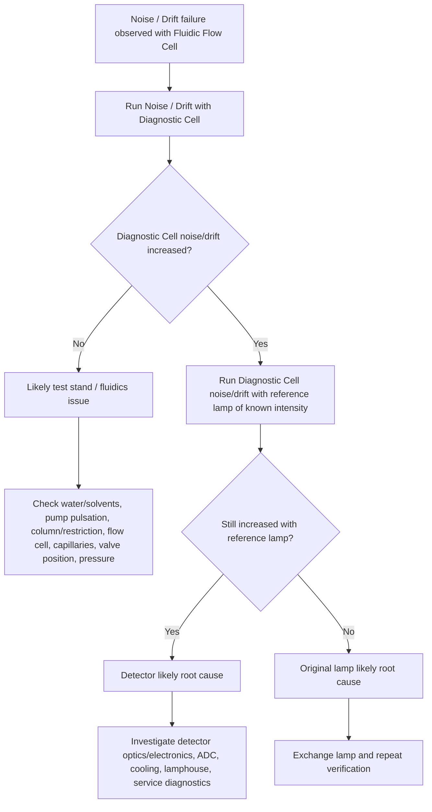

# FOQ Test Description for VDAD-F, VDAD-C and VMWD-C

This knowledge-base note is converted from the TD source document and is intended for structured FOQ knowledge management. It focuses on document identity, key terms, process order, applicability, and shared test conditions.

Source TD:

```text
C:\ProgramData\CMBX Data Explorer Workspace\KB\FOQ TD\FOQ_TestDescription_VDAD-F_VDAD-C_VMWD-C_AgRev_002_00.pdf
```

## 文档元数据

| Field | Value |
|---|---|
| 文档标题 | FOQ Test Description (FOQ_TD) for VDAD-F, VDAD-C and VMWD-C |
| 文档编号 / Agile Document ID | DOC0000731 |
| 当前版本 | 2.00 |
| 发布日期 / Current Revision Date | 26-Aug-2019 |
| 适用仪器型号 | VF-D11-A, VC-D11-A, VC-D12-A |
| 文档负责人 / Document Owner | Veronika Kainhuber |
| 文件引用 | FOQ_TestDescription_VDAD-F_VDAD-C_VMWD-C.docm |
| 受影响部门 | QS-WA |

中文理解：

```text
这份 TD 定义 VDAD-F、VDAD-C、VMWD-C 出厂运行确认测试。测试目标是证明仪器满足
Specification Master Sheet 中列出的接收标准。流程分为两类：使用 Diagnostic Cell 的内部光学
诊断测试，以及使用 Standard Cell 的流通池/标准品/流路相关测试。
```

## 核心术语与缩写

| Term | Meaning | Knowledge note |
|---|---|---|
| FOQ | Factory Operational Qualification | 出厂运行确认。用于确认模块在出厂前满足规格主文件中的接收标准。 |
| VDAD | Vanquish Diode Array Detector | Vanquish 二极管阵列检测器。本文 VDAD-F/VDAD-C 属于 DAD 类检测器。 |
| DAD | Diode Array Detector | 二极管阵列检测器，可测量 time-resolved spectrum，并支持 3D field。 |
| MWD | Multiple Wavelength Detector | 多波长检测器。VMWD-C 不提供 3D field，这是部分测试不适用的根因。 |
| 3D Field | Time-resolved spectrum measured with DAD | 随时间记录的光谱数据。TD 中明确：VMWD-C 不提供 3D field。 |
| Diagnostic Cell | Diagnostic Cell, Standard, TFS P/N 5083.0700 | 玻璃光学诊断池。相比流通池，它排除溶剂杂质等流路因素对光学测试结果的影响。 |
| Standard Cell | Standard flow cell, 13 uL, 10 mm path length, SST, TFS P/N 6083.0510 | 用于标准品、流路、RI、线性、饱和、噪声漂移等测试的流通池。 |
| Response Time / RST | Data smoothing parameter set in control software | TD 用 Response Time 精确定义测试条件。通用条件为 4.4 s，部分测试会覆盖该值。 |
| Time Constant | Noise specification parameter used in SRS | TD 给出的近似换算：Response time = 2.2 x Time constant。因此 Time constant = Response time / 2.2。例：4.4 s response time 约等于 2.0 s time constant。 |
| DCR | Data Collection Rate | 数据采集率。通用条件为 1 Hz，Diagnostic Cell 高 DCR 噪声测试使用更高采集率。 |
| Stray Light | Undesired light contribution, especially VIS-lamp related in this TD | 杂散光升高通常提示光学系统问题，例如光栅或反射镜问题，并会明显影响检测器线性。TD 中 Stray Light Test 仅适用于 VDAD-F 和 VDAD-C。 |
| Dark Current / DC | Dark-current related detector signal/property | 暗电流相关值。Dark Current Drift 测试比较 begin/end 暗电流相关属性的漂移。 |
| HoFi | Inbuilt Holmium Oxide Filter | 内置氧化钬滤光片。用于内部波长准确度/HoFi 相关测试。 |
| D-alpha / Dα | Alpha line of the deuterium spectrum | 氘灯谱线，标称 656.1 nm。用于内部波长准确度和波长重复性。 |
| FWHM | Full Width at Half Magnitude | 半高全宽，用于谱线/光谱分辨率评价。 |
| RI | Refractive Index | 流动相折射率。RI sensitivity 测试通过梯度/溶剂变化观察检测器对 RI 变化的响应。 |

## 测试流程概览

The TD Table 1 lists the tests in order of performance. The sequence starts with the Diagnostic Cell and then changes to the Standard Cell.

| Order | Component | Test / Action | Lamp Configuration | Applicability |
|---:|---|---|---|---|
| 1 | Diagnostic Cell, TFS P/N 5083.0700 | Cell change | - | All listed instruments |
| 2 | Diagnostic Cell | Warm Up | UV+VIS | All listed instruments |
| 3 | Diagnostic Cell | Wavelength calibration / validation | UV+VIS | All listed instruments |
| 4 | Diagnostic Cell | Noise, High DCR | UV+VIS | All listed instruments |
| 5 | Diagnostic Cell | Internal Wavelength Accuracy | UV+VIS | All listed instruments |
| 6 | Diagnostic Cell | Holmium Filter Test | UV+VIS | All listed instruments |
| 7 | Diagnostic Cell | Intensity Test | UV+VIS | All listed instruments; 3D field debug data is not available for VMWD-C |
| 8 | Diagnostic Cell | Stray Light Test | VISonly | VDAD-F and VDAD-C only; not applicable for VMWD-C |
| 9 | Standard Cell, 13 uL, 10 mm, SST, TFS P/N 6083.0510 | Cell change | UVonly | All listed instruments |
| 10 | Standard Cell | Wavelength calibration / validation | UVonly | All listed instruments |
| 11 | Standard Cell | System Check | UVonly | All listed instruments |
| 12 | Standard Cell | Linearity, caffeine at 2.200 and 2.700 AU peak height | UVonly | All listed instruments |
| 13 | Standard Cell | Saturation | UVonly | All listed instruments |
| 14 | Standard Cell | Warm Up | UV+VIS | All listed instruments |
| 15 | Standard Cell | Saturation | UV+VIS | All listed instruments |
| 16 | Standard Cell | Dark Current Drift, Begin | UV+VIS | All listed instruments |
| 17 | Standard Cell | RI Sensitivity | UV+VIS | All listed instruments |
| 18 | Standard Cell | Wavelength Accuracy with standard compounds | UV+VIS | All listed instruments; exact standard usage differs by detector type/test |
| 19 | Standard Cell | Spectral Resolution | UV+VIS | All listed instruments; VDAD-F has additional narrow-slit/erbium details |
| 20 | Standard Cell | Noise and Drift, ASTM | UV+VIS | All listed instruments; 3D spectral modulation amplitude is not available for VMWD-C |
| 21 | Standard Cell | Wavelength Repeatability with D-alpha line | UV+VIS | All listed instruments |
| 22 | Standard Cell | Dark Current Drift, End | UV+VIS | All listed instruments |
| 23 | Standard Cell | PPP check and set | UV+VIS | All listed instruments |

### Tests or Data Not Applicable to VMWD-C

| Item | Reason |
|---|---|
| Stray Light Test in Table 1 | TD footnote: VMWD-C does not provide a 3D field, which is required for this test. |
| 3DField acquisition | VMWD-C does not provide a 3D field. |
| 3D field debug records in Warm Up / Intensity / Noise and Drift | VMWD-C lacks 3D field; the main test may still run if not dependent on 3D field evaluation. |
| UV_VIS_9 and UV_VIS_10 channels | VDAD-C and VMWD-C provide UV_VIS_1 - 8 only. |
| Slit width selection | VDAD-C and VMWD-C have fixed wide slit; narrow-slit variants are VDAD-F-specific. |

## 关键测试条件汇总

These conditions come from TD section 4.2 General Test Conditions and section 4.3 Hardware Requirements. Test-specific sections can override them.

### General Chromatographic Test Conditions

| Parameter | General setting | Notes / applicability |
|---|---|---|
| Mobile phase A | Water, 100% | Online-degassed solvent unless otherwise noted. |
| Mobile phase B | ACN, 100% | HPLC grade; LC/MS grade only if issues are observed. |
| Mobile phase C | Methanol, 100% | Used for standards/tests requiring methanol. |
| Flow rate | 1.0 mL/min | For tests with fluidic flow cell. Pump hardware must also support 0.05 mL/min and 1.0 mL/min. |
| Column oven temperature | 30 °C | TCC/VTCC oven must hold 30 °C. |
| Column oven valve position | 1_2 for all tests except noise/drift and wavelength repeatability | Flow only through restriction capillaries II and III. |
| Column oven valve position | 10_1 for all noise/drift tests and wavelength repeatability | Flow through column I and restriction capillary III. |
| Data collection rate | 1 Hz | Test-specific sections may override, e.g. Diagnostic Cell high DCR noise test. |
| Response time | 4.4 s | Equivalent time constant is approximately 2.0 s using Response time = 2.2 x Time constant. |
| Lamps switched on | Both UV and VIS | Unless a specific test states otherwise. |
| VIS lamp mode | LongLife | Service-level setting; shipped default is LongLife. |
| Slit width | Wide | Not applicable for VDAD-C and VMWD-C because they have fixed wide slit. |
| Bandwidth | 4 nm | General setting. |
| Reference wavelength | Off | General setting. |
| 3DField | 190 - 800 nm | Only selected tests; not available for VMWD-C. |
| Bunchwidth | 1 nm | 3D field related; not available for VMWD-C. |
| 3D reference wavelength | Off | 3D field related. |
| Signals to enable | UV_VIS_1 - 10, 3DFIELD, Temp_Lamphouse | VDAD-C and VMWD-C only provide UV_VIS_1 - 8; VMWD-C has no 3DFIELD. |
| Debug channels | Temp_Cooling, Temp_Ambient, Temp_ADC, Temp_Supply, Lamphouse_Target, Lamphouse_PWM, Lamphouse_Rotations, Lamphouse_Rotation_Target, Fan_PWM, Fan_Rotations | Requires Chromeleon Instrument Configuration Manager in debug mode. |

### Hardware Requirements

| Hardware | Requirement |
|---|---|
| Pump | Vanquish with 400 uL mixing system or UltiMate 3000 pump, preferably 2nd generation with 350 uL mixer. Pump pulsation must be within specification. Required flow rates: 0.05 and 1.0 mL/min. |
| Autosampler | Vanquish sampler VH-A10 or VF-A10. RSD of injector precision for 1 uL injection volume must be better than 0.25%. |
| Thermostatted Column Compartment | VTCC or UltiMate 3000 TCC-3x00(RS). Oven adjustable to 30 °C with temperature accuracy ±0.5 °C and stability <= ±0.1 °C. |
| Valve | Any valve released for the listed fluidic conditions in an UltiMate 3000 column compartment or VTCC. Autosampler and detector connect through a CSV in the column compartment. |
| Flow Cell | Standard, 13 uL, 10 mm path length, SST, TFS P/N 6083.0510. |
| Diagnostic Cell | Diagnostic Cell, Standard, TFS P/N 5083.0700. |
| Column I | Acclaim PA C16, 5 um, 4.6 x 50 mm, TFS P/N 061319. Column length for noise/drift may vary from 50 to 150 mm without affecting test results. |
| Connection capillary II | ViperSST, ID 0.13 mm, L 150 mm, TFS P/N 5040.2315. |
| Restriction capillary III | ViperSST, ID 0.18 mm, L 15 m, TFS P/N 5040.3000. |
| Restriction capillary pressure | About 100 bar ±20% at 1.0 mL/min with water at 30 °C. |
| Required system pressure | At least 70 bar at the given flow rate to keep the pump in an optimal pulsation range. |
| Peak shape requirement for standards | With restriction capillary III and 10 uL injection: peak width at 50% peak height between 3 s and 5 s; asymmetry/skewness at 10% peak height < 1.5. |
| Other module capillaries | Use appropriate Viper system capillaries, ideally ID 0.10 mm. |

## Knowledge Management Notes

This document is now structured enough for later method/report reverse generation:

```text
1. The flow order defines sequence/injection order.
2. Cell type and lamp configuration define method setup state.
3. VMWD-C limitations are mostly caused by missing 3D field and reduced channel count.
4. General conditions define default method parameters; individual test sections override them.
5. Hardware requirements are not optional: they determine whether a generated CMBX can run in CM.
```

Next reverse step:

```text
For each test row in the flow table, align:
TD test purpose -> injection name -> instrument method script -> report sheet/formulas -> DB mapping fields.
```

## 第6节和第7节详细测试知识卡

The following cards convert TD section 6, Tests with Diagnostic Cell, and section 7, Tests with Fluidic Flow Cell, into reusable method/report knowledge. Acceptance criteria are classified as External, Internal, or Internal / For information only according to Table 6 and the wording in the relevant test section.

### 6.1 Warm Up

**测试目的**

Warm Up 用于记录 VDAD-F、VDAD-C、VMWD-C 的预热性能。检测器漂移性能依赖光学温度、灯点亮时间等平衡状态，因此后续噪声、漂移、波长和线性测试都依赖足够稳定的预热状态。

**测试步骤简述**

Instrument Method 按阶段执行：初始阶段点亮 UV+VIS 灯、设置 VIS lamp mode 为 LongLife、设置 AutoZero_Mode 为 ForceZero，并设置 230/254/520 nm 与 3D field。0 到 120 min 采集信号；120 到最多 180 min 持续评估 drift。如果达到接收标准则进入下一 injection；若 180 min 仍不满足，队列中止并报错。

**关键参数**

| Parameter | Value | Difference from general conditions |
|---|---|---|
| Cell | Diagnostic Cell | Uses internal optical diagnostic path, no fluidic flow cell influence. |
| Lamp configuration | UV+VIS | Same as general lamp-on condition. |
| Wavelengths | 230, 254, 520 nm | 254 and 520 nm are used for drift evaluation; 230 nm is debugging only. |
| 3D field | Recorded for debugging | Not available for VMWD-C. |
| DCR | 1 Hz | Same as general condition. |
| RST | 4.4 s | Same as general condition. |
| Runtime | 120 min minimum, 180 min maximum | Warmup stops once drift criterion is met after 120 min. |

**评估方法与接受标准**

The UV signal is evaluated via the DriftEquilibration property after 120 min runtime. Drift must be within the criterion by the last interval before 180 min.

| Criterion | Limit | Type | Notes |
|---|---:|---|---|
| Drift at 254 nm | ±1.000 mAU/h | Internal | Diagnostic Cell tests are listed as internal in Table 6. |
| Drift at 520 nm | ±1.000 mAU/h | Internal | Evaluated under wide slit, 1 Hz, 4.4 s, latest at 180 min. |

**相关性标注**

Warm Up provides the stable optical/lamp state for Diagnostic Cell Noise, Internal Wavelength Accuracy, HoFi-related checks, Intensity, and Stray Light. The TD explicitly requires the detector to be warmed up for at least two hours before the high-DCR noise test.

### 6.2 Noise, High DCR

**测试目的**

This test checks detector noise with Diagnostic Cell at high data collection rates. It isolates detector/electronics noise from fluidic influences.

**测试步骤简述**

After the detector is warmed up for at least two hours, UV signals are recorded for 6 minutes. The test is run with both lamps on and a high DCR specific to detector type.

**关键参数**

| Detector | DCR | RST | Wavelength | Difference from general conditions |
|---|---:|---:|---:|---|
| VDAD-F | 250 Hz | 0.00 s | 230 nm | Overrides general DCR 1 Hz and RST 4.4 s. |
| VDAD-C / VMWD-C | 125 Hz | 0.00 s | 230 nm | Overrides general DCR 1 Hz and RST 4.4 s. |
| Cell | Diagnostic Cell | - | - | Diagnostic optical path. |
| Slit width | Wide | - | - | Fixed wide for VDAD-C/VMWD-C. |

**评估方法与接受标准**

The signal is split into 6 one-minute intervals. The first interval is not evaluated. For each remaining interval, CM calculates a least-squares regression line, then draws parallel lines through the maximum positive and negative deviations from the regression line. The noise is the distance between these parallel lines. The final noise value is the average of the 5 evaluated interval noise values.

| Criterion | Limit | Type | Notes |
|---|---:|---|---|
| Noise, VDAD-F | <= 400.0 uAU | Internal | 250 Hz, 0.00 s, 230 nm, wide. |
| Noise, VDAD-C / VMWD-C | <= 300.0 uAU | Internal | 125 Hz, 0.00 s, 230 nm, wide. |

**相关性标注**

This test depends on 6.1 Warm Up. It is a detector/electronics noise check and is useful for troubleshooting later fluidic noise/drift failures.

### 6.3 Internal Wavelength Accuracy

**测试目的**

This test verifies internal wavelength accuracy without external fluidic or standard-compound influence. It uses the D-alpha line and the internal holmium oxide filter as detector-internal references.

**测试步骤简述**

The test is combined with wavelength calibration/validation and Diagnostic Cell high-DCR noise workflows. The detector runs WavelengthValidation with the internal holmium oxide filter and uses FWFindPeak to locate the D-alpha line at nominal 656.1 nm.

**关键参数**

| Parameter | Value | Difference from general conditions |
|---|---|---|
| Cell | Diagnostic Cell | Internal optical reference path. |
| Lamp configuration | UV+VIS | Required for HoFi/D-alpha workflow. |
| Reference 1 | Holmium oxide filter maxima | Compared to firmware reference values. |
| Reference 2 | D-alpha line, nominal 656.1 nm | Found by FWFindPeak. |
| Slit width | Wide; narrow for VDAD-F-specific D-alpha criterion | Narrow slit does not apply to VDAD-C/VMWD-C. |

**评估方法与接受标准**

HoFi validation results are transmitted to CM and logged automatically in the audit trail. The difference between observed and expected HoFi maxima indicates HoFi wavelength accuracy. The difference between observed and expected D-alpha line wavelength indicates D-alpha wavelength accuracy.

| Criterion | Limit | Type | Notes |
|---|---:|---|---|
| Wavelength accuracy with HoFi | ±1.0 nm | Internal | Internal reference; Diagnostic Cell section. |
| D-alpha line, wide slit | ±0.3 nm | Internal | D-alpha nominal 656.1 nm. |
| D-alpha line, narrow slit | ±0.1 nm | Internal | VDAD-F only. VDAD-C/VMWD-C have fixed wide slit. |

**相关性标注**

This is the internal counterpart to 7.5 Wavelength Accuracy, which checks wavelength accuracy chromatographically with standard compounds across the spectral range.

### 6.4 Holmium Filter Test

**测试目的**

The Holmium Filter Test checks the transmission quality of the internal holmium oxide filter. Poor HoFi transmission could affect internal wavelength validation.

**测试步骤简述**

The detector is set to service level. Absorbance at 254 nm is measured at DCR 5 Hz and RST 4 s. Acquisition starts, auto zero is performed, then the holmium filter is moved into the light beam for 0.5 min via CM CmdString.

**关键参数**

| Parameter | Value | Difference from general conditions |
|---|---|---|
| Cell | Diagnostic Cell | Internal optical path. |
| Wavelength | 254 nm | Specific to HoFi absorbance check. |
| DCR | 5 Hz | Overrides general 1 Hz. |
| RST | 4 s | Slightly different from general 4.4 s. |
| Service level | Required | Needed to move HoFi via command. |
| HoFi in beam duration | 0.5 min | Test-specific. |

**评估方法与接受标准**

Absorbance at 254 nm while the HoFi is in the beam indicates filter transmission. The result must be within the range. The test also verifies that the filter actually entered the beam and that autozero worked.

| Criterion | Limit | Type | Notes |
|---|---:|---|---|
| HoFi absorbance at 254 nm | 0.100 AU <= x <= 1.000 AU | Internal | Ensures adequate filter transmission and movement into beam. |
| Signal minimum after autozero | absolute minimum < 50 mAU | Internal check | Verifies autozero behavior; stated in test evaluation text. |

**相关性标注**

Related to 6.3 Internal Wavelength Accuracy because internal wavelength validation uses HoFi. If HoFi transmission is poor, wavelength validation may become unreliable.

### 6.5 Intensity Test

**测试目的**

The Intensity Test checks detector intensity over the spectrum. It confirms that channel and list intensities are high enough for reliable optical measurements.

**测试步骤简述**

Three channel intensities are logged at variable wavelengths, and nine list intensities are logged at fixed wavelengths from 190 to 800 nm. For VDAD-F/VDAD-C, 3D field data and raw spectral data can also be stored via StoreIntensities for debugging.

**关键参数**

| Parameter | Value | Difference from general conditions |
|---|---|---|
| DCR | 1 Hz | Same as general. |
| RST | 1.0 s | Overrides general 4.4 s. |
| Channel wavelengths | 230, 254, 520 nm | Specific intensity channels. |
| List intensity wavelengths | 190, 230, 300, 350, 400, 500, 600, 700, 800 nm | Fixed list intensities. |
| 3D field / StoreIntensities | Debugging data | Not available for VMWD-C. |

**评估方法与接受标准**

Logged channel intensities and the list intensity at 190 nm must be above the defined criteria.

| Criterion | Limit | Type | Notes |
|---|---:|---|---|
| ChannelIntensity 230 nm | >= 8.5 Mcts/s | Internal | Wide slit. |
| ChannelIntensity 254 nm | >= 5.0 Mcts/s | Internal | Wide slit. |
| ChannelIntensity 520 nm | >= 6.0 Mcts/s | Internal | Wide slit. |
| ListIntensity 190 nm | >= 1.3 Mcts/s | Internal | Wide slit. |

**相关性标注**

Intensity supports the confidence of HoFi, wavelength, noise, and stray-light interpretation. Low intensity may indicate lamp or optical path problems.

### 6.6 Stray Light Test, VDAD-F and VDAD-C Only

**测试目的**

This test checks VIS-lamp-caused stray light in the detector. Increased stray light suggests optical problems such as grating or mirror issues and negatively affects linearity.

**测试步骤简述**

The UV lamp is turned off and the VIS lamp remains on. VIS lamp and ADC board equilibrate for 5 min. A 3D field is recorded for 18 s, raw data are stored with StoreIntensities, and the StrayLightCorrection property is logged. ADC rate is fixed at 200 Hz to improve comparability.

**关键参数**

| Parameter | Value | Difference from general conditions |
|---|---|---|
| Applicability | VDAD-F and VDAD-C only | Not applicable to VMWD-C because it requires 3D field. |
| Lamp configuration | VISonly | Overrides general UV+VIS. |
| DCR | 1 Hz | Same as general signal DCR. |
| RST | 1.0 s | Overrides general 4.4 s. |
| Wavelength | 520 nm | Test-specific signal wavelength. |
| ADC rate | fixed 200 Hz | Overrides default Auto ADC mode. |
| Data used | Stored absorbance data at 12 s | Test-specific evaluation point. |

**评估方法与接受标准**

The stored absorbance data at 12 s are used. The actual VIS stray light amount is calculated from the current correction and averaged UV/VIS intensity ranges:

```text
c_mess = c_def + (100 - c_def) * I_UV / I_VIS

c_mess: actual stray light amount [%]
c_def: currently set stray light correction [%], converted from CM property by factor 100 / 2^16
I_UV: averaged intensity in counts over 190 - 240 nm
I_VIS: averaged intensity in counts over 400 - 800 nm
```

| Criterion | Limit | Type | Notes |
|---|---:|---|---|
| VIS stray light amount | 0.010% <= x <= 0.200% | Internal / For information only | Table 6 states for information only; VDAD-F and VDAD-C only. |

**相关性标注**

Directly related to 7.2 Linearity and 7.3 Saturation because stray light becomes more influential at high absorption / low light intensity.

### 7.1 Dark Current Drift

**测试目的**

Dark current drift negatively affects UV detector linearity. This test measures dark current drift more directly than the linearity test by using firmware properties with sufficient accuracy.

**测试步骤简述**

The dark current statistics are measured twice within the fluidic tests, separated by at least two hours. CM command string `DarkCurrent.Statistics=273` is used. The mean, min, standard deviation, and wavelength result properties are logged.

**关键参数**

| Parameter | Value | Difference from general conditions |
|---|---|---|
| Cell | Standard / fluidic flow cell | Fluidic test section. |
| Wavelength/statistics setting | 273 | Command string `DarkCurrent.Statistics=273`. |
| ADC mode | fixed 200 Hz | Default Auto is overridden for comparability. |
| Wait after ADC mode change | at least 5 min | Allows stable ADC/electronics condition. |
| Measurement count | Two measurements | Minimum 2 h lag between begin and end. |

**评估方法与接受标准**

The change in `DarkCurrent_Statistics_Result_mean` between the two injections indicates drift. Drift is normalized by ADC rate and time between measurements.

| Criterion | Limit | Type | Notes |
|---|---:|---|---|
| Dark current drift | ±140 cts/s/min | Internal / For information only | ADC rate fixed at 200 Hz. |

**相关性标注**

This test provides direct support for 7.2 Linearity, because dark current drift is one of the mechanisms causing detector non-linearity at high absorption.

### 7.2 Linearity, Includes System Check

**测试目的**

Linearity evaluates whether detector response remains linear over the signal range. The TD notes that non-linearity is caused by dark current drift and stray light, especially at high absorption levels. A system check verifies standard quality and injector precision before detector linearity is judged.

**测试步骤简述**

An HPLC system with valve position 1_2 is used. Caffeine is the UV standard compound. The system check injects five caffeine standards with the same injection volume, with two concentrations injected three times each for injector precision. Detector linearity injects five caffeine standards twice: one series covering about 0.1 to 2.2 AU, and one extended series covering about 0.1 to 2.7 AU. Injection volume is automatically adjusted to reach the target peak height ranges.

**关键参数**

| Parameter | Value | Difference from general conditions |
|---|---|---|
| Compound | Caffeine | Standard compound for UV linearity and system check. |
| Wavelength | 273 nm | Test-specific. |
| DCR | 20 Hz | Overrides general 1 Hz. |
| RST | 0.200 s | Overrides general 4.4 s. |
| Lamp configuration | UVonly | Overrides general UV+VIS. |
| Valve position | 1_2 | Flow through restriction capillaries. |
| Signal ranges | 0.1 - 2.2 AU and 0.1 - 2.7 AU | 2.2 AU used for external linearity; 2.7 AU is internal / information-only. |

**评估方法与接受标准**

External evaluation uses peak area and concentration. OQ/PQ-style linear regression gives regression coefficient and RSD for 0.1 to 2.2 AU. ASTM-style evaluation checks deviation of the highest concentrated standard near 2.2 AU. Internal and information-only evaluations additionally use extended 2.7 AU range and peak height.

| Criterion | Limit | Type | Notes |
|---|---:|---|---|
| Regression coefficient r, 2.2 AU range, area | >= 99.970% | External | Caffeine at 273 nm, UVonly. |
| RSD, 2.2 AU range, area | <= 3.00% | External | Based on OQ/PQ area procedure. |
| ASTM deviation, 2.2 AU range, area | -5.0% to +3.0% | External | Highest concentrated standard near 2.2 AU. |
| Peak target height, 2.2 AU range | >= 1980 mAU | External / validity check | If not met, report returns Test failed / Test done message. |
| ASTM deviation, 2.2 AU range, height | -5.0% to +3.0% | Internal | Peak-height based. |
| Regression coefficient r, 2.7 AU range, area | >= 99.950% | Internal / For information only | Extended signal range. |
| RSD, 2.7 AU range, area | <= 5.00% | Internal / For information only | Extended signal range. |
| ASTM deviation, 2.7 AU range, area | -5.0% to +3.0% | Internal / For information only | Extended signal range. |
| ASTM deviation, 2.7 AU range, height | -7.0% to +3.0% | Internal / For information only | Extended signal range. |
| Peak target height, 2.7 AU range | >= 2430 mAU | Internal / For information only | Highest concentrated standard near 2.7 AU. |

System check:

| Criterion | Limit | Type | Notes |
|---|---:|---|---|
| OQ/PQ area/height evaluation for 0.1 - 0.5 AU | For information only | Internal / For information only | Smallest standard around 0.02 AU excluded. |
| ASTM area result of highest concentrated caffeine standard in system check | Must be within Table 6 linearity criteria | Internal | If outside criteria, report fails the linearity test. |

**相关性标注**

Depends on 7.1 Dark Current Drift and 6.6 Stray Light concepts because both are causes of non-linearity. It also prepares context for 7.3 Saturation because both probe high-absorption behavior.

### 7.3 Saturation

**测试目的**

Saturation checks UV stray-light-related behavior under very high absorbance. The test stresses UV and UV+VIS conditions because linearity is strongly affected by stray light at high absorption.

**测试步骤简述**

Using the HPLC system in valve position 1_2, the highest caffeine standard, 2000 ug/mL, is injected at 30 uL. UV_VIS_1 is recorded for UV+VIS and UVonly lamp configurations.

**关键参数**

| Parameter | Value | Difference from general conditions |
|---|---|---|
| Compound | Caffeine, 2000 ug/mL | Highest caffeine standard. |
| Injection volume | 30 uL | Test-specific. |
| Wavelength | 273 nm | Test-specific. |
| DCR | 20 Hz | Overrides general 1 Hz. |
| RST | 0.200 s | Overrides general 4.4 s. |
| Lamp configurations | UV+VIS and UVonly | Both saturation cases are run. |
| Evaluation window | 0.4 - 0.5 min | Saturation signal region. |

**评估方法与接受标准**

The maximum UV_VIS_1 signal between 0.4 and 0.5 min is evaluated in mAU and must be above the acceptance criteria.

| Criterion | Limit | Type | Notes |
|---|---:|---|---|
| Maximum absorption at 273 nm, UV+VIS | >= 2200 mAU | Internal | Main saturation criterion. |
| Maximum absorption at 273 nm, UV+VIS | >= 2600 mAU | Internal / For information only | Additional information-only target. |
| Maximum absorption at 273 nm, UVonly | >= 3150 mAU | Internal / For information only | Additional information-only target. |

**相关性标注**

Related to 6.6 Stray Light Test and 7.2 Linearity because high absorption makes stray-light effects more visible.

### 7.4 RI Sensitivity

**测试目的**

RI Sensitivity checks detector response to refractive-index changes when switching solvent composition. It separates dynamic RI effects during gradient steps from static baseline differences.

**测试步骤简述**

Before the test, an equilibration injection purges solvent lines A and B separately for 10 min each at 1.0 mL/min. The test then runs a gradient from 0% B to 10% B and back to 0% B while recording multiple wavelengths. Injector valve is set to Bypass to minimize dwell volume.

**关键参数**

| Parameter | Value | Difference from general conditions |
|---|---|---|
| Wavelengths | 205, 220, 254, 280, 350, 520, 600, 720 nm | Test-specific multi-wavelength recording. |
| DCR | 20 Hz | Overrides general 1 Hz. |
| RST | 0.200 s | Overrides general 4.4 s. |
| Inject valve | Bypass | Minimizes dwell volume. |
| Gradient | 0% B 0-5 min; 10% B 5.1-10 min; 0% B 10.1-15 min | Test-specific ACN step profile. |
| Flow rate | 1.0 mL/min | Same as general fluidic condition. |

**评估方法与接受标准**

Dynamic RI sensitivity is evaluated as the height of peaks at the 0 -> 10% ACN and 10 -> 0% ACN steps. Static RI sensitivity is evaluated as the baseline difference at the 0 -> 10% ACN step and is for information/debugging.

| Criterion | Limit | Type | Notes |
|---|---:|---|---|
| Dynamic RI effect at 280 nm | <= 4.0 mAU | Internal | Evaluated at gradient steps. |
| Static RI effect at 280 nm | <= 4.0 mAU | Internal / For information only | Debug/information only. |
| Minimum pump pressure | >= 50 bar | Internal validity check | Ensures appropriate flow/pressure state. |
| Pressure difference, avg pressure 10% ACN vs 100% water | >= 4 bar | Internal validity check | Compare 8-9 min vs 3-4 min. |
| Relative pressure difference, max-min over max | <= 25% | Internal validity check | Pressure stability requirement. |
| Absorption difference, avg signal 10% ACN vs 100% water | <= 20 mAU | Internal validity check | Compare 8-9 min vs 3-4 min. |

**相关性标注**

RI sensitivity depends strongly on flow path, flow-cell alignment, pump pressure behavior, and solvent switching. The troubleshooting section points to flow-cell alignment if RI sensitivity is poor.

### 7.5 Wavelength Accuracy with Standard Compounds

**测试目的**

This test checks wavelength accuracy chromatographically over the spectral range, complementing the internal D-alpha/HoFi wavelength check in section 6.3.

**测试步骤简述**

Two analytes with sharp spectral features are injected: pyrene in methanol and erbium(III) perchlorate in water. VDAD-F/VDAD-C determine absorbance maxima from 3DField data. VMWD-C injects each compound once while measuring three wavelengths around each expected maximum: expected maximum -2 nm, nominal maximum, and expected maximum +2 nm.

**关键参数**

| Analyte | Solvent | DCR | RST | Expected maxima | Slit / applicability |
|---|---|---:|---:|---|---|
| Pyrene | Methanol | 10 Hz | 2 s | 272.1, 333.7 nm | Narrow, VDAD-F |
| Pyrene | Methanol | 10 Hz | 2 s | 272.1, 333.4 nm | Wide |
| Er(ClO4)3 | Water | 10 Hz | 2 s | 254.9, 522.5 nm | Narrow, VDAD-F |
| Er(ClO4)3 | Water | 10 Hz | 2 s | 254.9, 522.0 nm | Wide |
| Injection volume | 10 uL | - | - | - | Fixed for wavelength accuracy standards. |
| 3D field | Used by VDAD-F/VDAD-C | - | - | - | VMWD-C uses three discrete wavelengths instead. |

**评估方法与接受标准**

For VDAD-F/VDAD-C, CM determines spectral maxima from 3DField data and compares them to nominal values. For VMWD-C, a second-order polynomial is fitted from three measured wavelength points, and the vertex gives the observed maximum wavelength.

| Criterion | Limit | Type | Notes |
|---|---:|---|---|
| Wavelength accuracy, pyrene | ±1.0 nm | External | Pyrene in methanol; maxima as listed above. |
| Wavelength accuracy, erbium(III) perchlorate | ±1.0 nm | External | Erbium in water; maxima as listed above. |
| Pyrene maximum at 239 nm | Debug only | Internal / For information only | Recorded for VDAD-F/VDAD-C only. |

**相关性标注**

Complements 6.3 Internal Wavelength Accuracy. It also overlaps with 7.6 Spectral Resolution because erbium(III) perchlorate is shared with spectral resolution testing, especially for VDAD-F narrow-slit VIS resolution.

### 7.6 Spectral Resolution

**测试目的**

Spectral resolution describes the detector's ability to distinguish adjacent wavelengths. Benzene is used for UV spectral resolution; VDAD-F additionally uses erbium(III) perchlorate in the VIS range with narrow slit.

**测试步骤简述**

Benzene or erbium(III) perchlorate standards are injected. Benzene injection volume is adjusted so peak height at 255 nm is about 100 mAU. Erbium(III) perchlorate uses fixed 10 uL and target peak height about 150 mAU. VDAD-F/VDAD-C record 3D field and UV signals; VMWD-C records multiple discrete wavelengths around the benzene feature.

**关键参数**

| Detector / analyte | Mobile phase | Wavelengths | DCR | RST | Bandwidth | Injection volume | Slit |
|---|---|---|---:|---:|---:|---|---|
| VDAD-F/VDAD-C, benzene | Methanol | 250, 255 nm | 10 Hz | 2 s | 1 nm | about 5 uL | Wide |
| VDAD-F, Er(ClO4)3 | Water | 255, 379, 522 nm | 10 Hz | 2 s | 1 nm | 10 ± 5 uL | Narrow |
| VMWD-C, benzene | Methanol | 253, 254, 255, 256, 257, 258, 259, 260 nm | 10 Hz | 2 s | 1 nm | about 5 uL | Fixed wide |

**评估方法与接受标准**

For VDAD-F/VDAD-C benzene, spectral resolution is evaluated by relative peak-to-valley difference at about 250 and 255 nm. The absorbance at 225 nm is compared with the 250 nm maximum to detect benzene impurity/test-condition problems. For VMWD-C benzene, a second-order polynomial estimates the maximum and minimum around 255 nm, then peak-to-valley difference is calculated. For VDAD-F erbium, FWHM at 522 nm is calculated by interpolating wavelengths at half maximum.

| Criterion | Limit | Type | Notes |
|---|---:|---|---|
| Benzene, narrow slit, about 250 nm | For information only | Internal / For information only | VDAD-F. |
| Benzene, narrow slit, about 255 nm | >= 48.0% | Internal | VDAD-F. |
| Benzene, wide slit, about 250 nm | For information only | Internal / For information only | VDAD-F and VDAD-C. |
| Benzene, wide slit, about 255 nm | >= 25.0% | Internal | VDAD-F and VDAD-C; VMWD-C evaluated via polynomial peak/valley. |
| Erbium FWHM at 522 nm, narrow slit | <= 6.5 nm | Internal | VDAD-F only; warning level <= 6.0 nm noted in Table 6. |
| Calibration parameter C0, factory-current | ±1.000000 nm | Internal | PPP/calibration-related Table 6 criteria. |
| Calibration parameter C1, factory-current | ±1e-6 nm | Internal | PPP/calibration-related Table 6 criteria. |
| Calibration parameter C2, factory-current | ±1e-10 nm | Internal | PPP/calibration-related Table 6 criteria. |
| Lambda Min | <= 187.5 nm | Internal | Calibration range check. |
| Lambda Max | >= 802.5 nm | Internal | Calibration range check. |
| SettingsWide = SettingsNarrow | Must be true | Internal | VDAD-F condition. |
| SettingsFirmwareDefault <> SettingsFactory | Must be true | Internal | Calibration/default parameter condition. |

**相关性标注**

Shares Er(ClO4)3 standard and spectral information with 7.5 Wavelength Accuracy. Poor spectral resolution may indicate flow-cell alignment or grating adjustment issues.

### 7.7 Noise and Drift, ASTM

**测试目的**

Noise and drift are core UV detector performance parameters. High baseline noise increases detection limits; high drift makes integration less reliable due to unstable baseline.

**测试步骤简述**

UV signals and 3D field are recorded for 21 min to evaluate low-frequency noise according to ASTM-style logic. Noise and drift use the same recorded data but are evaluated differently. Lamps must be on and the detector warmed up for the appropriate time.

**关键参数**

| Parameter | Value | Difference from general conditions |
|---|---|---|
| Cell | Standard / fluidic flow cell | Fluidic noise/drift path. |
| Lamp configuration | UV+VIS | Same as general. |
| Slit width | Wide; narrow for VDAD-F-specific internal test | Narrow does not apply to VDAD-C/VMWD-C. |
| Wavelengths | 230, 254, 520 nm | 230 nm debugging only. |
| DCR | 1 Hz | From general conditions. |
| RST | 4.4 s | From general conditions. |
| Runtime | 21 min | First minute ignored for noise/drift. |
| 3D field | Used for spectral modulation amplitude | Not available for VMWD-C. |

**评估方法与接受标准**

Noise: the signal is split into 21 one-minute intervals; first interval ignored. For each of 20 intervals, CM calculates a regression line, derives noise from the distance between parallel lines through maximum deviations, then averages the 20 noise values.

Drift: evaluated only for wide slit. CM calculates a least-squares regression over 1 to 21 min. The slope is extrapolated from 20 min to 1 h and reported in mAU/h.

Spectral modulation amplitude: for VDAD-F/VDAD-C only, 3D field is used to find max/min absorption in 220 to 270 nm at about 20 min. The delta is debugging only.

| Criterion | Limit | Type | Notes |
|---|---:|---|---|
| Noise at 254 nm, wide slit | <= 12.0 uAU | External | Water, 1.0 mL/min, 1 Hz, 4.4 s. |
| Noise at 520 nm, wide slit | <= 24.0 uAU | External | Water, 1.0 mL/min, 1 Hz, 4.4 s. |
| Noise at 254 nm, narrow slit | <= 16.0 uAU | Internal | VDAD-F only. |
| Drift at 254 nm, wide slit | ±1.000 mAU/h | External | Water, 1.0 mL/min, 1 Hz, 4.4 s. |
| Drift at 520 nm, wide slit | ±1.000 mAU/h | Internal | Same run, internal wavelength channel. |
| Spectral modulation amplitude | No evaluation result | Internal / For information only | Recorded for debugging only; VDAD-F/VDAD-C only. |

**相关性标注**

Related to 6.2 Diagnostic Cell Noise. If fluidic noise/drift fails but Diagnostic Cell noise/drift is normal, troubleshooting points toward test stand/fluidics rather than detector optics/electronics.

### 7.8 Wavelength Repeatability with D-alpha Line

**测试目的**

This test verifies repeatability of internal D-alpha wavelength detection while avoiding external fluidic influence. It addresses slight wavelength shifts caused by detector temperature changes or lamp-position changes.

**测试步骤简述**

The internal FWFindPeak procedure measures the D-alpha line wavelength repeatedly six times in one injection. After each determination, Peak and PeakLinewidth are logged to the audit trail.

**关键参数**

| Parameter | Value | Difference from general conditions |
|---|---|---|
| Reference | D-alpha line | Nominal 656.1 nm. |
| Repetitions | 6 determinations in one injection | Test-specific. |
| Logged properties | Peak, PeakLinewidth | Audit trail. |
| Slit width | Wide | Table 6 criterion is wide. |
| Valve position | 10_1 | General condition for wavelength repeatability routes flow through column and restriction. |

**评估方法与接受标准**

Repeatability is calculated as the maximum absolute deviation of each measured D-alpha wavelength from the mean of all six measurements.

| Criterion | Limit | Type | Notes |
|---|---:|---|---|
| Wavelength repeatability | <= 0.10 nm | External | D-alpha line at 656.1 nm, wide; absolute values are calculated. |

**相关性标注**

Related to 6.3 Internal Wavelength Accuracy. Accuracy checks deviation from nominal; repeatability checks variation among repeated D-alpha measurements.

### 7.9 PPP Check and Set

**测试目的**

PPP Check and Set ensures that qualification and service status properties are set correctly and that detector default/service parameters are in the required state after FOQ.

**测试步骤简述**

The injection checks and sets properties such as Qualification and Service to Done, clears service/qualification intervals or warning periods, sets ADC.Mode to default Auto, VIS lamp mode to LongLife, and AutoZero_Mode to ForceZero. Calibration parameters, general detector parameters, and predictive performance parameters are logged via preconditions and explicitly in the method where needed. The instrument enters Softron level to set `ADC.Mode=-1`, then returns to normal level.

**关键参数**

| Parameter | Value | Difference from general conditions |
|---|---|---|
| Qualification property | Done | Set by instrument method. |
| Service property | Done | Set by instrument method. |
| ADC.Mode | -1 / default auto | Restores default. |
| VIS lamp mode | LongLife | Required final/default state. |
| AutoZero_Mode | ForceZero | Required final/default state. |
| Reference criteria source | DOC0000731, VDADF_C_VMWDC_InternalInspectionValues.xlsx | Detailed parameter limits are external to the TD text. |

**评估方法与接受标准**

Several calibration, detector, and predictive performance parameters are checked against error or warning criteria from the internal inspection values file.

| Criterion | Limit | Type | Notes |
|---|---|---|---|
| Qualification and Service state | Done | Internal | Method sets/checks final state. |
| Service/qualification intervals and warning periods | None set | Internal | TD states no interval or warning period should be set. |
| ADC.Mode | default Auto | Internal | Set using `ADC.Mode=-1`. |
| VIS lamp mode | LongLife | Internal | Required final state. |
| AutoZero_Mode | ForceZero | Internal | Required final state. |
| Calibration/general/predictive parameters | See DOC0000731 internal inspection values | Internal | Exact error/warning limits are in ref. [8]. |

**相关性标注**

This is a final state and metadata consistency check. It is not a chromatographic performance test, but it is essential for closing the FOQ state and for later report/database interpretation.

## Cross-Test Dependency Map

| Dependency | Meaning |
|---|---|
| 6.1 Warm Up -> 6.2 Noise / 6.3 Internal Wavelength Accuracy / 6.5 Intensity / 6.6 Stray Light | Diagnostic optical tests require warmed-up lamps and stable optics. |
| 6.6 Stray Light + 7.1 Dark Current Drift -> 7.2 Linearity | TD identifies stray light and dark current drift as key causes of non-linearity. |
| 7.2 Linearity -> 7.3 Saturation | Both stress high absorption; saturation probes the upper response limit. |
| 6.3 Internal Wavelength Accuracy -> 7.5 Wavelength Accuracy | Internal reference check complements chromatographic wavelength accuracy across spectral range. |
| 7.5 Wavelength Accuracy <-> 7.6 Spectral Resolution | Er(ClO4)3 is shared; VDAD-F narrow-slit VIS spectral resolution overlaps with wavelength standard usage. |
| 6.2 Diagnostic Cell Noise -> 7.7 Fluidic Noise and Drift troubleshooting | Comparing diagnostic-cell and fluidic-cell noise helps separate detector issues from flow-cell/test-stand issues. |
| 7.9 PPP Check and Set -> final FOQ state | Ensures service/qualification properties and detector defaults are set for reporting and database upload. |

## 对比分析

### 表A：仪器型号差异

| Topic | VDAD-F | VDAD-C | VMWD-C | Knowledge meaning |
|---|---|---|---|---|
| Detector family | Diode Array Detector | Diode Array Detector | Multiple Wavelength Detector | VDAD-F/VDAD-C can use DAD-style spectral/3D data. VMWD-C relies on discrete wavelength channels. |
| 3D Field | Supported | Supported | Not supported | Any test or debug calculation requiring 3D field is not applicable to VMWD-C. |
| UV_VIS channels | UV_VIS_1 - 10 | UV_VIS_1 - 8 | UV_VIS_1 - 8 | Mapping and report formulas must not assume channels 9/10 for VDAD-C or VMWD-C. |
| Slit width | Adjustable; wide and narrow conditions exist | Fixed wide slit only | Fixed wide slit only | Narrow-slit criteria and method states are VDAD-F-specific. |
| Stray Light Test | Applicable | Applicable | Not applicable | TD Table 1 states VMWD-C lacks 3D field required for this test. |
| Diagnostic Cell noise DCR | 250 Hz | 125 Hz | 125 Hz | Noise method parameters must branch by detector model. |
| Internal D-alpha narrow-slit criterion | Applies | Not applicable | Not applicable | VDAD-F has additional ±0.1 nm narrow-slit D-alpha criterion. |
| Spectral resolution with benzene | Wide and narrow contexts; 3D-field based | Wide only; 3D-field based | Discrete wavelength polynomial evaluation | Same test intent, different data representation and report calculation path. |
| Spectral resolution with Er(ClO4)3 | Applies for narrow slit VIS FWHM | Not applicable | Not applicable | TD states Er spectral resolution check is VDAD-F-only. |
| Wavelength accuracy method | 3DField maxima | 3DField maxima | Three-wavelength polynomial vertex | VMWD-C report logic must reconstruct maxima from discrete channels. |
| Spectral modulation amplitude | Available from 3D field | Available from 3D field | Not applicable | Debug-only result, but useful for VDAD troubleshooting. |

Key generation rule:

```text
Always identify detector model before selecting report formulas.
The same TD test name can require different channels, parameters, or calculations.
```

### 表B：Diagnostic Cell vs. Fluidic Flow Cell

| Topic | Diagnostic Cell | Fluidic Flow Cell / Standard Cell | Why it matters |
|---|---|---|---|
| Main purpose | Isolate detector optics/electronics from fluidic effects. | Test detector performance under real chromatographic/fluidic conditions. | Diagnostic Cell answers "is the detector itself healthy?" Flow Cell answers "does the detector perform in the system?" |
| Physical influence | Glass optical diagnostic path; no solvent impurity or flow-cell alignment effect. | Includes flow cell, solvent, pump, valve, capillary, column/restriction, standards, and autosampler effects. | Failures with flow cell but not diagnostic cell often point to test stand/fluidics rather than detector core. |
| Typical tests | Warm Up, high-DCR Noise, Internal Wavelength Accuracy, HoFi Test, Intensity, Stray Light. | Dark Current Drift, Linearity, Saturation, RI Sensitivity, Wavelength Accuracy with standards, Spectral Resolution, ASTM Noise/Drift, Repeatability. | Diagnostic tests build internal confidence; fluidic tests validate use-case performance. |
| Data type | Internal optical references, 3D field, intensity, audit/firmware properties. | Chromatographic peaks, solvent-gradient response, baseline noise/drift, standards, pressure behavior. | Report extractor must select very different formulas and dependencies. |
| Why Stray Light uses Diagnostic Cell | It needs VISonly light and 3D field/raw intensity ranges without fluidic/standard influence. | Flow cell would add solvent/cell/alignment effects and obscure pure optical stray-light measurement. | The TD explicitly makes Stray Light VDAD-F/VDAD-C only and Diagnostic Cell based. |
| Failure isolation | Good for detector/lamp/optics/electronics root-cause separation. | Good for complete system and application-like behavior, but harder to isolate root cause. | Troubleshooting uses Diagnostic Cell first to split detector vs. system causes. |

Practical interpretation:

```text
Diagnostic Cell is a root-cause isolation tool.
Fluidic Flow Cell is a performance qualification tool.
Both are needed because detector FOQ must prove internal optical health and real-system chromatographic behavior.
```

## 故障排除知识库

### Noise and Drift Failure Decision Tree



### 问题-原因-解决方案表

| Problem | Diagnostic logic | Likely cause | Recommended action |
|---|---|---|---|
| Fluidic Noise/Drift fails | Repeat noise/drift with Diagnostic Cell. | If Diagnostic Cell passes, detector core is likely OK. | Check fluidics: solvents, water quality, flow cell, column, restriction capillary, pump pulsation, pressure, valve path. |
| Diagnostic Cell Noise/Drift is also high | Repeat with a reference lamp with known good light intensity. | If still high, detector is likely the root cause. | Investigate detector optics/electronics, ADC mode/rate, lamphouse temperature, cooling, fan, internal diagnostics. |
| Diagnostic Cell improves with reference lamp | The detector path is likely OK with a known lamp. | Original lamp likely weak/unstable. | Replace lamp and rerun relevant diagnostic tests. |
| Wavelength calibration or validation fails | Perform wavelength calibration and repeat validation. | Possible diagnostic/flow cell misalignment or detector issue. | Check diagnostic/flow cell alignment; repeat calibration/validation. If still failing, investigate detector. |
| Spectral Resolution is poor | Check flow cell alignment first. | Misalignment can distort spectral shape. | Re-align/check flow cell and repeat spectral resolution. If still failing, investigate detector optics/grating. |
| RI Sensitivity is poor | Check flow cell alignment and system fluidics. | Flow cell alignment or solvent/flow path issue. | Repeat RI test after checking flow cell, pressure, gradient profile, and solvent delivery. |

Important troubleshooting principle:

```text
Diagnostic Cell removes fluidic variables.
Reference lamp removes original-lamp intensity/stability as a variable.
Together, they let the engineer separate:
1. test stand / fluidics
2. lamp
3. detector optics/electronics
```

## 测试逻辑解读

### Why Linearity Includes a System Check

Linearity is intended to judge detector response, but the measured result can be corrupted by non-detector problems: wrong caffeine concentration, poor standard quality, injection imprecision, integration issues, or wrong injection volume. The System Check is therefore a gatekeeper before detector linearity is interpreted.

In the TD logic:

```text
System Check proves the test system is good enough to measure detector linearity.
Linearity then proves the detector response is linear over the intended absorbance range.
```

The System Check uses caffeine standards in a low response range, about 0.1 to 0.5 AU, where detector response is expected to be nearly perfectly linear. It repeats selected concentrations to gather injector precision information. If system behavior is not good, failing the detector for linearity would be misleading.

Key design intent:

```text
Prevent false detector failures caused by standards, injector precision, or test-stand quality.
```

### Why Saturation Uses 2000 ug/mL Caffeine and 30 uL Injection

Saturation intentionally stresses the detector at high absorbance. The TD uses the highest caffeine standard, 2000 ug/mL, and a large injection volume, 30 uL, to push the signal into the saturation region.

This is not normal linear-range operation. It is a stress test:

```text
Linearity checks whether response is proportional across the working range.
Saturation checks whether the detector can reach the expected high-signal behavior and exposes stray-light effects.
```

The test is performed under both UV+VIS and UVonly lamp configurations because VIS-lamp-related stray light can influence UV-range behavior. The high concentration and large volume make the effect visible enough to evaluate.

Key design intent:

```text
Use a deliberately high absorption signal to reveal saturation and stray-light-limited behavior that would be invisible at low concentration.
```

### Why Wavelength Accuracy and Spectral Resolution Share Standards

Wavelength Accuracy asks whether the maximum appears at the correct wavelength. Spectral Resolution asks how well adjacent wavelength features can be separated. Both require compounds with sharp spectral features, so pyrene, benzene, and Er(ClO4)3 appear across related tests.

For VDAD-F/VDAD-C, 3D field lets the report directly analyze spectral shape. For VMWD-C, the same physical question must be approximated with discrete wavelength channels and polynomial fitting.

## 公式解读

### Stray Light Formula

The TD describes the actual VIS stray-light amount as:

```text
c_mess = c_def + (100 - c_def) * I_UV / I_VIS
```

| Parameter | Meaning | How it is obtained |
|---|---|---|
| c_mess | Actual stray light amount in percent | Final calculated result reported by the Stray Light Test. |
| c_def | Currently set stray light correction in percent | Logged from the CM StrayLightCorrection property. The CM property must be converted using factor 100 / 2^16. |
| I_UV | Averaged intensity in the UV range | Average intensity from stored data in the 190 - 240 nm range. |
| I_VIS | Averaged intensity in the VIS range | Average intensity from stored data in the 400 - 800 nm range. |

Natural-language interpretation:

```text
The detector already has a stored/default stray-light correction, c_def.
The test measures how much UV-range intensity appears while only the VIS lamp is intended to contribute.
The ratio I_UV / I_VIS estimates unwanted UV-side signal relative to VIS intensity.
The formula adds that measured contribution to the existing correction baseline.
```

Why the test uses VISonly and Diagnostic Cell:

```text
VISonly makes the unwanted UV-range contribution visible.
Diagnostic Cell removes solvent and flow-cell effects.
3D field/raw intensity data are required to average UV and VIS spectral ranges.
```

### Dark Current Drift Formula

The TD normalizes the change in dark current between two measurements by ADC rate and elapsed time:

```text
DarkCurrentDrift = (DarkCurrent_A - DarkCurrent_B) * ADC / delta_t
```

| Parameter | Meaning | How it is obtained |
|---|---|---|
| DarkCurrent_A / DarkCurrent_B | Mean dark-current statistics result from measurement A/B | Logged from `DarkCurrent_Statistics_Result_mean` after running `DarkCurrent.Statistics=273`. |
| ADC | Fixed ADC rate during the test | Set to fixed 200 Hz to make instruments comparable. |
| delta_t | Time between measurement A and B in minutes | The two fluidic measurements must be separated by at least two hours. |
| DarkCurrentDrift | Drift in cts/s/min | Used as the final dark-current drift value. |

Natural-language interpretation:

```text
The formula asks: how fast does the detector's dark-current baseline change per minute,
after converting the measured count change into a rate using the fixed ADC setting?
```

Why fixed ADC rate matters:

```text
If ADC mode stayed Auto, different light intensities could produce different ADC rates.
Then identical physical dark-current behavior could yield different numerical drift values.
Fixing ADC at 200 Hz makes the comparison meaningful.
```

## Final Knowledge Summary

This TD can be understood as four connected layers:

```text
1. Instrument identity and configuration:
   VDAD-F / VDAD-C / VMWD-C differ in 3D field, channels, slit width, and spectral calculation path.

2. Internal detector health:
   Diagnostic Cell tests isolate lamp, optics, detector electronics, HoFi, D-alpha, intensity, and stray light.

3. Real-system performance:
   Fluidic Flow Cell tests verify linearity, saturation, RI response, chromatographic wavelength accuracy,
   spectral resolution, noise/drift, and repeatability under actual flow and standards.

4. Closure and database readiness:
   PPP Check and Set ensures qualification/service/default properties are correct for final reporting.
```

For method/report generation, the most important rule is:

```text
Do not generate one generic detector method.
First branch by detector model, then by cell type, then by test row, then by report calculation mode.
```
