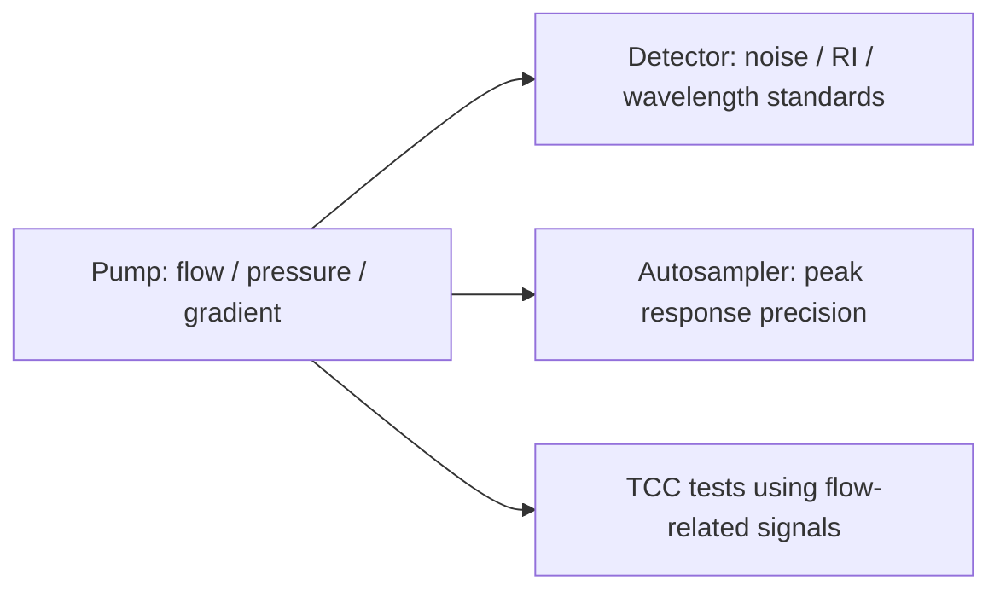

# FOQ Test Description for Vanquish Pumps

## Knowledge File Metadata

| Field | Value |
|---|---|
| KB_Version | 1.0 |
| Source_Revision | 8.02 |
| Extraction_Date | 2026-07-09 |
| Extractor | technical-document-knowledge-extractor |
| Source_Path | `C:\ProgramData\CMBX Data Explorer Workspace\KB\FOQ TD\FOQ_Testdescription_VPump.docm` |

## 文档元数据

| Field | Value |
|---|---|
| 文档标题 | FOQ Test Description (FOQ_TD) for Vanquish Pumps |
| 文档编号 / Agile Document ID | DOC0000271 |
| 当前版本 | 8.02 |
| 发布日期 / Current Revision Date | 31-Aug-2023 |
| 适用仪器型号 | VH-P10-A-02, VF-P20-A, VF-P10-A-01, VF-P32-A-01, VC-P10-A-01, VC-P20-A-01, VC-P21-A-01, VC-P32-A-01, VC-P33-A-01, VC-P40-A-01, VA-P21-A-01 |
| 文档负责人 / Document Owner | Markus Chlup |
| 文件引用 | FOQ_Testdescription_VPump.docm |
| 源文档类型 | FOQ_TD |

## 核心术语与缩写

| Term | Meaning | Knowledge note |
|---|---|---|
| FOQ | Factory Operational Qualification | 泵出厂运行确认。 |
| HPG | High Pressure Gradient Pump | HPG tests include solvent selector and Xvalue/gradient-specific logic. |
| LPG | Low Pressure Gradient Pump | Requires degasser and proportioning-related tests. |
| DGP | Dual Gradient Pump | Some tests are performed per pump unit. |
| Tightness Test | Pressure/leak test | Pump delivers against blocked valve until pressure target; leakage rate is evaluated. |
| Flow Rate Calibration | Calibration of delivered flow | Adjusts flow rate calibration factor using measured flow. |
| Xvalue Calibration | Proportioning calibration | Applies to VF/VC LPG and DGP pump types. |
| Pulsation | Pressure ripple | Affects detector noise and gradient/flow stability. |
| Degasser Pressure Test | Degasser function check | Applies to LPG, HPG, and DGP pumps with degasser. |

## 测试流程概览

| Order | Test / Action | Pump family applicability | Knowledge note |
|---:|---|---|---|
| 1 | Reset Counters | Listed pump families | Predictive performance counters reset before tests. |
| 2 | Purge `<Pump Type>` | All pump families | HPG purges two channels at once; others one channel at a time. |
| 3 | Tightness Test | All, branch by unit/family | DGP uses unit-specific tightness; VH-P10-A has advanced test. |
| 4 | Balance Check / Degasser Check | Pump-family dependent | Uses weight requirements and degasser behavior. |
| 5 | Pressure calibration | VH HPG or VF/VC depending sensor type | Separate pressure transducer/sensor workflows. |
| 6 | Flow Rate Calibration | Applicable pumps | Uses water and calibration factor adjustment. |
| 7 | Xvalue Calibration | VF/VC LPG and DGP | Step gradient prior to gradient accuracy test. |
| 8 | Flow Rate Accuracy and Precision | FOQ performance test | Evaluates delivered flow accuracy/repeatability. |
| 9 | Pulsation / Pressure Sensor / Filter Permeability | FOQ performance test | Evaluates pressure ripple and sensor/filter behavior. |
| 10 | Gradient Accuracy | Gradient-capable pumps | Includes solvent composition, mixer, ripple checks. |
| 11 | Solvent Selector Test | HPG only | Checks solvent selector ports/channels. |
| 12 | Relays and Digital Inputs | Config dependent | I/O state checks. |
| 13 | Qualification Service | All | Final service/qualification state. |
| 14 | Degasser Pressure Test | LPG, HPG, DGP | Degasser pressure/vacuum behavior. |

## 关键测试条件汇总

| Area | Source section/table | Knowledge note |
|---|---|---|
| Hardware requirements | Section 4.3 | Pump test stand, detector, capillaries, restriction, balance, solvents. |
| Solvents | Section 4.4 | Burn-in, FOQ solvents, rear seal wash solution. |
| CM instrument configuration | Section 4.5 | Required device names/configuration. |
| Acceptance criteria | Table 9 | Overview FOQ Acceptance Criteria. |
| Purge settings | Tables 10-11 | HPG vs non-HPG purge branches. |
| Tightness parameters | Table 12 | Pressure targets and leakage details. |
| Balance check weights | Table 13 | Weight/allowed start weight depend on pump type. |
| Flow calibration | Table 14 | Flow rate calibration parameters. |
| Xvalue calibration | Table 15 | Step gradients for proportioning calibration. |
| Dependency tables | Tables 17-19 | Repetition dependencies and repair-measure dependencies. |

## Detailed Test Cards / 详细测试知识卡

### 5.1.2 Reset Logging of Predictive Performance Counters

**测试目的**

Reset predictive performance counters so later FOQ measurements start from a defined service state.

**测试步骤简述**

The method resets logging counters before tightness and other pump performance tests.

**关键参数**

| 参数 | 设定值 | 与通用条件的差异 |
|---|---|---|
| Counter type | Predictive performance counters | Service/diagnostic state, not chromatographic data. |

**评估方法与接受标准**

| 判据 | 限值 | 类型 | 备注 |
|---|---:|---|---|
| Counter reset state | Source-defined | Internal | Exact property list requires method/report extraction. |

**相关性标注**

Precedes tightness and performance tests.

### 5.1.3 Purge Pump

**测试目的**

Purge and equilibrate pump solvent paths to remove air and prepare stable solvents before FOQ tests.

**测试步骤简述**

Flow is switched to waste to avoid overpressure, pump is purged at 3.0 mL/min, then the flow path flushes the test stand and ramps flow up to 2.0 mL/min. Last step uses water channels.

**关键参数**

| 参数 | 设定值 | 与通用条件的差异 |
|---|---|---|
| Initial purge flow | 3.0 mL/min | Preparation-specific. |
| Flush ramp | Stepwise to 2.0 mL/min | Preparation-specific. |
| HPG channel logic | Two channels purged at once | Table 10. |
| Non-HPG logic | One channel at a time, 3 min per channel | Table 11. |

**评估方法与接受标准**

| 判据 | 限值 | 类型 | 备注 |
|---|---:|---|---|
| Purge completion | Source-defined | Internal | Required before flow/gradient tests. |

**相关性标注**

Poor purge can propagate into flow accuracy, gradient accuracy, pulsation, and detector response tests.

### 5.1.4 Tightness Test

**测试目的**

Determine whether the pump is leak tight and meets maximum allowed leakage specification.

**测试步骤简述**

The pump delivers solvent against a blocked VQ MSV until test pressure is reached. Flow is then reduced in steps. The flow rate at which maximum pressure can be monitored is logged as actual leakage rate. VH-P10-A-02 is tested per piston at two pressures plus advanced tightness; DGP pumps are checked per unit.

**关键参数**

| 参数 | 设定值 | 与通用条件的差异 |
|---|---|---|
| Valve state | blocked VQ MSV, Pos7 / encoder position 341 | Test-specific blocked path. |
| Pressures | Source Table 12 | Pump-family specific. |
| Leakage result | Flow rate at maximum pressure signal | Pump-specific calculation. |

**评估方法与接受标准**

| 判据 | 限值 | 类型 | 备注 |
|---|---:|---|---|
| Leakage rate | <= maximum allowed leakage rate | External / Type: source table required | Exact limits in Table 12/Table 9. |

**相关性标注**

Tightness is a prerequisite for flow accuracy and gradient accuracy. Table 17/18 dependency logic controls which later injections must be repeated.

### 5.1.5 Balance Check

**测试目的**

Check pump balance/test-stand weight conditions to ensure collected fluid/weight logic remains valid.

**测试步骤简述**

The TD states total weight must not exceed 80 g. Allowed start weight depends on pump type.

**关键参数**

| 参数 | 设定值 | 与通用条件的差异 |
|---|---|---|
| Total weight | <= 80 g | Queue abort if exceeded. |
| Start weight | Pump-type dependent | Table 13. |

**评估方法与接受标准**

| 判据 | 限值 | 类型 | 备注 |
|---|---:|---|---|
| Total weight | <= 80 g | Internal validity check | Prevents invalid balance measurement. |
| Start weight | See Table 13 | Internal validity check | Pump-type dependent. |

**相关性标注**

Supports flow accuracy/precision and calibration validity.

### 5.2.3 Flow Rate Calibration

**测试目的**

Calibrate delivered flow so measured flow equals nominal flow under defined water/mobile phase conditions.

**测试步骤简述**

Flow rate is measured for defined parameters and the calibration factor is adjusted to match measured and nominal flow.

**关键参数**

| 参数 | 设定值 | 与通用条件的差异 |
|---|---|---|
| Mobile phase | Water | Calibration-specific. |
| Calibration parameters | Table 14 | Pump-family/source defined. |

**评估方法与接受标准**

| 判据 | 限值 | 类型 | 备注 |
|---|---:|---|---|
| Measured vs nominal flow | Match after calibration | Internal / calibration | Exact tolerances require Table 14/report extraction. |

**相关性标注**

Precedes flow accuracy and can affect gradient accuracy.

### 5.2.4 Xvalue Calibration

**测试目的**

Calibrate LPG/DGP proportioning behavior before gradient accuracy evaluation.

**测试步骤简述**

A step gradient of channels A and B is programmed at 2 mL/min with the specified restriction capillary. DGP units are calibrated individually.

**关键参数**

| 参数 | 设定值 | 与通用条件的差异 |
|---|---|---|
| Pump types | VF/VC LPG and DGP | Not HPG-only. |
| Flow rate | 2 mL/min | Calibration-specific. |
| Gradient | Table 15 | Xvalue calibration step gradient. |

**评估方法与接受标准**

| 判据 | 限值 | 类型 | 备注 |
|---|---:|---|---|
| Xvalue calibration result | Source-defined | Internal / calibration | Exact formulas require report/method extraction. |

**相关性标注**

Direct prerequisite for gradient accuracy in LPG/DGP pumps.

### 6.3 Flow Rate Accuracy and Precision

**测试目的**

Verify the pump delivers accurate and repeatable flow.

**测试步骤简述**

The FOQ method measures delivered flow under defined conditions and evaluates accuracy/precision.

**关键参数**

| 参数 | 设定值 | 与通用条件的差异 |
|---|---|---|
| Flow conditions | Source section 6.3.3 | Pump-family dependent. |
| Prior calibration | Flow Rate Calibration | Required for validity. |

**评估方法与接受标准**

| 判据 | 限值 | 类型 | 备注 |
|---|---:|---|---|
| Flow accuracy | See Table 9 | External / Type: source table required | Exact limits need Table 9 extraction. |
| Flow precision | See Table 9 | External / Type: source table required | Exact limits need Table 9 extraction. |

**相关性标注**

Depends on purge, tightness, balance, and calibration. Failure propagates to detector tests using pump flow.

### 6.4 Pulsation, Pressure Sensor Check and Filter Permeability

**测试目的**

Verify pressure ripple, pressure sensor plausibility, and filter permeability under controlled pump conditions.

**测试步骤简述**

Pressure signal is acquired under defined test conditions and evaluated for ripple, sensor behavior, and filter restriction/permeability.

**关键参数**

| 参数 | 设定值 | 与通用条件的差异 |
|---|---|---|
| Signal source | Pump pressure | Performance signal. |
| Test conditions | Section 6.4.3 | Pump-specific. |

**评估方法与接受标准**

| 判据 | 限值 | 类型 | 备注 |
|---|---:|---|---|
| Pulsation | See Table 9 | External / Type: source table required | Pump-family dependent. |
| Pressure sensor check | See Table 9 | External/Internal per source | Exact criteria require source table extraction. |
| Filter permeability | See Table 9 | External/Internal per source | Exact criteria require source table extraction. |

**相关性标注**

Pump pulsation can cause detector noise/drift failures in detector FOQ.

### 6.5 Gradient Accuracy

**测试目的**

Verify solvent proportioning and gradient delivery accuracy.

**测试步骤简述**

Gradient methods deliver defined solvent compositions; results evaluate composition accuracy, mixer performance, and mixing ripple depending on pump type.

**关键参数**

| 参数 | 设定值 | 与通用条件的差异 |
|---|---|---|
| Gradient profile | Source section 6.5 / Table 15 dependency | Pump-family dependent. |
| Static mixer performance | LPG/DGP only | Section 6.5.5. |
| Mixing ripple | VH HPG only | Section 6.5.6. |

**评估方法与接受标准**

| 判据 | 限值 | 类型 | 备注 |
|---|---:|---|---|
| Gradient accuracy | See Table 9 | External | Exact limits require Table 9/report extraction. |
| Solvent composition check | Source section 6.5.4 | Internal/External per source | Requires formula extraction. |
| Static mixer performance | Source section 6.5.5 | Internal | LPG/DGP only. |
| Mixing ripple | Source section 6.5.6 | Internal | VH HPG only. |

**相关性标注**

Depends on Xvalue calibration and stable flow/tightness. Failure can propagate to detector RI and gradient-based tests.

### 6.6 Solvent Selector Test

**测试目的**

Verify HPG solvent selector switching and channel behavior.

**测试步骤简述**

HPG-specific method switches solvent selector states and evaluates expected response/state.

**关键参数**

| 参数 | 设定值 | 与通用条件的差异 |
|---|---|---|
| Pump family | HPG only | Not applicable to non-HPG pumps. |

**评估方法与接受标准**

| 判据 | 限值 | 类型 | 备注 |
|---|---:|---|---|
| Solvent selector behavior | Source section 6.6 | Internal/External per source | Requires method/report extraction. |

**相关性标注**

Related to gradient and solvent-line validity.

### 6.9 Degasser Pressure Test

**测试目的**

Verify degasser pressure behavior for pump types containing degasser functionality.

**测试步骤简述**

The method records degasser pressure/vacuum behavior and evaluates against source criteria.

**关键参数**

| 参数 | 设定值 | 与通用条件的差异 |
|---|---|---|
| Applicability | LPG, HPG, DGP pumps | Not all pump variants. |

**评估方法与接受标准**

| 判据 | 限值 | 类型 | 备注 |
|---|---:|---|---|
| Degasser pressure | Source section 6.9 | Internal/External per source | Exact limits require source extraction. |

**相关性标注**

Poor degassing can affect flow stability, gradient accuracy, and detector baseline behavior.

## 对比分析

| Topic | HPG | LPG | DGP | Generation implication |
|---|---|---|---|---|
| Purge | Two channels at once | One channel at a time | Unit/channel dependent | Purge method must branch by pump type. |
| Tightness | HPG-specific; VH-P10-A advanced | Pump-family dependent | Per pump unit | Repetition dependencies differ. |
| Xvalue calibration | Not the LPG/DGP path | Applies to VF/VC LPG | Applies per unit | Gradient generation must know pump family. |
| Solvent selector | HPG only | Not applicable | Not applicable unless configured | Do not include HPG solvent selector in all methods. |
| Degasser | Applies where present | Applies | Applies | Hardware configuration must be known. |

## 故障排除知识库

| Problem | Diagnostic logic | Likely cause | Recommended action |
|---|---|---|---|
| Tightness fails | Leakage rate > allowed | Leak in piston/seal/path/MSV | Repeat dependent injections after repair per Tables 17-19. |
| Flow accuracy fails | Delivered flow mismatch | Calibration, leak, balance/test stand issue | Repeat calibration and downstream dependent injections. |
| Gradient accuracy fails | Composition/ripple/mixer criteria fail | Xvalue calibration, mixer, solvent line, valve/channel issue | Repeat Xvalue and gradient-dependent tests. |
| Detector FOQ noise fails after pump FOQ issue | Check pump pulsation | Pressure ripple causing baseline noise | Resolve pump pulsation before detector qualification. |

## 测试逻辑解读

### Why dependency tables matter

🧠 Knowledge Interpretation

Pump tests are physically coupled: tightness affects flow accuracy, flow accuracy affects gradient, and repairs can invalidate later measurements.

⚙️ Generation Implication

A generated pump sequence must include dependency metadata or a repeat strategy.

🔓 Open Verification Required

Extract Tables 17-19 into machine-readable dependency rules.

## 公式解读

The TD contains an appendix for Chromeleon signal noise calculation and several flow/gradient evaluations. Exact formulas should be extracted into a formula KB before executable method/report generation.

## Cross-Module Dependency Mapping



## Executable Pseudocode

```python
def run_pump_gradient_accuracy(pump_type, params):
    purge(pump_type)
    verify_tightness(pump_type)
    if pump_type in ["LPG", "DGP"]:
        calibrate_xvalue(params.gradient_profile)
    acquire_gradient_response(params)
    return evaluate_gradient_accuracy(params)
```

## Open Verification Required

| Item | Why unresolved | Required evidence |
|---|---|---|
| Numeric Table 9 criteria | Not fully parsed into this KB | Extract acceptance table. |
| Gradient formulas | Text needs formula-level extraction | Report template / appendix. |
| Exact CM commands | TD describes logic, not complete syntax | Instrument methods from pump CMBX. |

## Final Validation / Final Knowledge Summary

Vanquish Pump FOQ validates tightness, purge/equilibration, flow calibration, flow accuracy, pressure/pulsation, gradient/proportioning, solvent selector, degasser, I/O, and service state. It is highly configuration-dependent and must branch by HPG/LPG/DGP/pump model.
