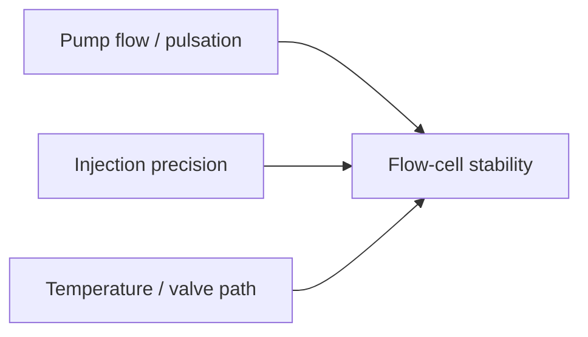

# FOQ Test Description for Vanquish Variable Wavelength Detector (VVWD)

## Knowledge File Metadata

| Field | Value |
|---|---|
| KB_Version | 1.0 |
| Source_Revision | 2.05 |
| Extraction_Date | 2026-07-09 |
| Extractor | technical-document-knowledge-extractor |
| Source_Path | `C:\ProgramData\CMBX Data Explorer Workspace\KB\FOQ TD\FOQ_Testdescription_VVWD.docm` |

## 文档元数据

| Field | Value |
|---|---|
| 文档标题 | FOQ Test Description (FOQ_TD) for Vanquish Variable Wavelength Detector (VVWD) |
| 文档编号 / Agile Document ID | DOC0000395 |
| 当前版本 | 2.05 |
| 发布日期 / Current Revision Date | 27-Apr-2021 |
| 适用仪器型号 | VF-D40-A, VC-D40-A, VA-D40-A |
| 文档负责人 / Document Owner | Veronika Kainhuber |
| 文件引用 | FOQ_TD_VVWD.docm |
| 源文档类型 | FOQ_TD |

## 核心术语与缩写

| Term | Meaning | Knowledge note |
|---|---|---|
| VVWD | Variable Wavelength Detector | Vanquish variable wavelength detector family. |
| Diagnostic Cell | TFS P/N 6077.0190 | Internal optical tests avoid fluidic influences. |
| Standard SST Flow Cell | 10 mm flow cell, TFS P/N 6077.0250 | Used for chromatographic/flow-cell tests. |
| D-alpha | Deuterium alpha line | Used for wavelength accuracy/repeatability. |
| HoFi | Holmium oxide filter | Internal filter for wavelength accuracy and HoFi checks. |
| ASTM Noise/Drift | Baseline performance evaluation | Splits signal into intervals and uses regression/parallel lines. |
| RI Sensitivity | Refractive-index response | Evaluated with solvent composition changes. |

## 测试流程概览

| Order | Component | Test / Action | Applicability |
|---:|---|---|---|
| 1 | Diagnostic Cell | Cell Change | VF-D40-A / VC-D40-A |
| 2 | Diagnostic Cell | Warm Up | VF-D40-A / VC-D40-A |
| 3 | Diagnostic Cell | Noise and Drift UV ASTM single | VF-D40-A / VC-D40-A |
| 4 | Diagnostic Cell | Noise UV High DCR | F: 250 Hz, C: 125 Hz |
| 5 | Diagnostic Cell | Dark Current Drift Begin | VF-D40-A / VC-D40-A |
| 6 | Diagnostic Cell | Stray Light Test | VF-D40-A / VC-D40-A |
| 7 | Diagnostic Cell | Intensity Test | VF-D40-A / VC-D40-A |
| 8 | Diagnostic Cell | Wavelength Accuracy, D-alpha and HoFi | VF-D40-A / VC-D40-A |
| 9 | Diagnostic Cell | Spectral Scan | VF-D40-A / VC-D40-A |
| 10 | Diagnostic Cell | Spectral Resolution | VF-D40-A / VC-D40-A |
| 11 | Diagnostic Cell | Holmium Filter Test | VF-D40-A / VC-D40-A |
| 12 | Diagnostic Cell | Second Order Filter Test | VF-D40-A / VC-D40-A |
| 13 | Flow Cell | Wavelength calibration / verification | Flow-cell tests |
| 14 | Flow Cell | Linearity / saturation / RI / wavelength accuracy / noise drift / repeatability | Flow-cell tests |
| 15 | Final | PPP Check and Set / Stop | Final state |

## 关键测试条件汇总

| Area | Source section/table | Knowledge note |
|---|---|---|
| General Test Conditions | 4.2 | Shared detector/fluidic setup. |
| Hardware Requirements | 4.3 | Pump, sampler, TCC/valve, diagnostic cell, flow cell. |
| Solvents and standards | 4.4 | Caffeine, erbium, pyrene/other standards depending test. |
| Chromeleon configuration | 4.5 | Required signals/properties. |
| Acceptance Criteria | Table 5 | Internal criteria are not listed on customers' FOQ report. |

## Detailed Test Cards / 详细测试知识卡

### 6.1 Warm Up

**测试目的**

Record detector warm-up and confirm optical drift stabilizes before dependent diagnostic and flow-cell tests.

**测试步骤简述**

Lamps are switched on and detector signals are recorded until drift criteria are satisfied or timeout logic applies.

**关键参数**

| 参数 | 设定值 | 与通用条件的差异 |
|---|---|---|
| Cell | Diagnostic Cell | Internal optical path. |
| Evaluation | Drift | Warm-up-specific. |

**评估方法与接受标准**

| 判据 | 限值 | 类型 | 备注 |
|---|---:|---|---|
| Warm-up drift | See Table 5 | Internal | Exact limit requires source table extraction. |

**相关性标注**

Prerequisite for diagnostic noise, wavelength, intensity, and stray-light tests.

### 6.2 Noise and Drift

**测试目的**

Check detector baseline noise and drift with Diagnostic Cell, separating detector/lamp/electronics behavior from fluidics.

**测试步骤简述**

Signals are recorded with Diagnostic Cell. High-DCR noise uses model-specific DCR values, while ASTM-style noise/drift uses interval regression logic.

**关键参数**

| 参数 | 设定值 | 与通用条件的差异 |
|---|---|---|
| High DCR | F: 250 Hz; C: 125 Hz | Model-specific. |
| RST | 0.00 s for high DCR | Overrides general smoothing. |
| Cell | Diagnostic Cell | Internal optical path. |

**评估方法与接受标准**

| 判据 | 限值 | 类型 | 备注 |
|---|---:|---|---|
| Diagnostic noise/drift | See Table 5 | Internal | Exact limits need table extraction. |

**相关性标注**

Useful troubleshooting comparator for flow-cell noise/drift.

### 6.3 Wavelength Accuracy, D-alpha and HoFi Lines

**测试目的**

Verify internal wavelength accuracy using detector-internal references.

**测试步骤简述**

D-alpha line and holmium oxide filter references are measured and compared to expected values.

**关键参数**

| 参数 | 设定值 | 与通用条件的差异 |
|---|---|---|
| References | D-alpha, HoFi | Internal optical references. |
| Cell | Diagnostic Cell | No standard compound. |

**评估方法与接受标准**

| 判据 | 限值 | 类型 | 备注 |
|---|---:|---|---|
| Internal wavelength deviation | See Table 5 | Internal | Exact limits require source table extraction. |

**相关性标注**

Complements flow-cell wavelength accuracy with injected standards.

### 6.4 Dark Current Drift

**测试目的**

Check dark-current stability because drift can affect linearity and low-level signal reliability.

**测试步骤简述**

Dark-current properties are measured and compared over time.

**关键参数**

| 参数 | 设定值 | 与通用条件的差异 |
|---|---|---|
| Signal source | Dark current properties | Firmware/property based. |

**评估方法与接受标准**

| 判据 | 限值 | 类型 | 备注 |
|---|---:|---|---|
| Dark current drift | See Table 5 | Internal | Exact limits require source table extraction. |

**相关性标注**

Supports interpretation of linearity and saturation tests.

### 6.5 Stray Light Test

**测试目的**

Evaluate stray light behavior and optical blocking/filter performance.

**测试步骤简述**

The method uses specific lamp/filter states and records detector response under Diagnostic Cell conditions.

**关键参数**

| 参数 | 设定值 | 与通用条件的差异 |
|---|---|---|
| Cell | Diagnostic Cell | Reduces fluidic interference. |
| Optical setup | Stray-light-specific | Requires exact method extraction. |

**评估方法与接受标准**

| 判据 | 限值 | 类型 | 备注 |
|---|---:|---|---|
| Stray light | See Table 5 | Internal/External per source | Exact criteria require source table extraction. |

**相关性标注**

Stray light can influence linearity and saturation behavior.

### 6.6-6.10 Spectral Scan / Intensity / Spectral Resolution / HoFi / Second Order Filter

**测试目的**

These diagnostic optical tests verify spectral behavior, intensity, resolution, holmium filter quality, and second-order filter behavior.

**测试步骤简述**

The detector records selected wavelengths or scan/filter states, often using internal optical components.

**关键参数**

| 测试 | 关键参数 | 与通用条件的差异 |
|---|---|---|
| Spectral Scan | Scan range / peak features | Test-specific. |
| Intensity | Channel/list intensities | Test-specific wavelengths. |
| Spectral Resolution | Sharp spectral features | Resolution-specific. |
| Holmium Filter | HoFi absorbance/transmission | Internal filter. |
| Second Order Filter | Filter transmission ratios | Internal filter state. |

**评估方法与接受标准**

| 判据 | 限值 | 类型 | 备注 |
|---|---:|---|---|
| Optical diagnostic results | See Table 5 | Internal | Exact limits require source table/report extraction. |

**相关性标注**

These tests isolate optical path, lamp, filter, and wavelength behavior before flow-cell qualification.

### 7.1 Linearity

**测试目的**

Verify detector response linearity over signal range, including system check to avoid false detector failures caused by standards or injection issues.

**测试步骤简述**

Caffeine standards are injected and peak area/height response is evaluated.

**关键参数**

| 参数 | 设定值 | 与通用条件的差异 |
|---|---|---|
| Compound | Caffeine | Standard compound. |
| Component | Flow Cell | Chromatographic evaluation. |

**评估方法与接受标准**

| 判据 | 限值 | 类型 | 备注 |
|---|---:|---|---|
| Linearity | See Table 5 | External/Internal per source | Exact criteria require source table extraction. |

**相关性标注**

Depends on autosampler precision, pump flow stability, and detector dark-current/stray-light health.

### 7.2 Saturation

**测试目的**

Stress high-signal detector response and expose saturation/stray-light-limited behavior.

**测试步骤简述**

High concentration standard is injected and maximum signal is evaluated.

**关键参数**

| 参数 | 设定值 | 与通用条件的差异 |
|---|---|---|
| Signal range | High absorbance | Saturation stress. |

**评估方法与接受标准**

| 判据 | 限值 | 类型 | 备注 |
|---|---:|---|---|
| Saturation response | See Table 5 | Internal/External per source | Exact limits require extraction. |

**相关性标注**

Related to linearity and stray light.

### 7.3 RI Sensitivity

**测试目的**

Evaluate detector response to refractive-index changes from solvent composition changes.

**测试步骤简述**

A solvent-gradient/step profile is run and dynamic/static RI effects are evaluated.

**关键参数**

| 参数 | 设定值 | 与通用条件的差异 |
|---|---|---|
| Solvent change | A/B composition step | RI-specific. |
| Evaluation | Dynamic/static RI peak/baseline | Test-specific. |

**评估方法与接受标准**

| 判据 | 限值 | 类型 | 备注 |
|---|---:|---|---|
| RI sensitivity | See Table 5 | Internal/External per source | Exact limits require source table extraction. |

**相关性标注**

Sensitive to pump gradient behavior, flow cell alignment, and solvent quality.

### 7.4 Wavelength Accuracy with Standard Compounds

**测试目的**

Verify wavelength accuracy using injected standards with known spectral maxima.

**测试步骤简述**

Standard compounds are injected and observed wavelength maxima are compared to reference values.

**关键参数**

| 参数 | 设定值 | 与通用条件的差异 |
|---|---|---|
| Standards | Source section 4.4 | Wavelength standard compounds. |
| Cell | Flow Cell | Chromatographic standard path. |

**评估方法与接受标准**

| 判据 | 限值 | 类型 | 备注 |
|---|---:|---|---|
| Wavelength accuracy | See Table 5 | External | Exact standards/limits require extraction. |

**相关性标注**

Complements internal D-alpha/HoFi wavelength check.

### 7.5 Noise and Drift

**测试目的**

Verify baseline noise and drift with the real flow cell and fluidic setup.

**测试步骤简述**

Signal is recorded over time and evaluated with Chromeleon interval/regression logic.

**关键参数**

| 参数 | 设定值 | 与通用条件的差异 |
|---|---|---|
| Cell | Flow Cell | Includes fluidic effects. |
| Evaluation | Noise and drift | ASTM-style. |

**评估方法与接受标准**

| 判据 | 限值 | 类型 | 备注 |
|---|---:|---|---|
| Noise and drift | See Table 5 | External/Internal per source | Exact limits require source table extraction. |

**相关性标注**

Compare with Diagnostic Cell noise to isolate detector vs fluidic/test-stand causes.

### 7.6 Wavelength Repeatability / 7.7 PPP / 7.8 Stop

**测试目的**

Verify D-alpha repeatability and final detector service/default state.

**测试步骤简述**

Repeat D-alpha peak finding, set/check qualification/service state, then stop/reset detector state.

**关键参数**

| 测试 | 关键参数 | 与通用条件的差异 |
|---|---|---|
| Wavelength Repeatability | D-alpha line | Internal reference. |
| PPP Check and Set | Qualification/service properties | Final state. |
| Stop | Factory/default reset | Closure. |

**评估方法与接受标准**

| 判据 | 限值 | 类型 | 备注 |
|---|---:|---|---|
| Repeatability / final state | See Table 5 and ref. tables | External/Internal per source | Exact limits require source/report extraction. |

**相关性标注**

PPP and Stop support final report/database readiness.

## 对比分析

| Topic | VF-D40-A | VC-D40-A | VA-D40-A | Generation implication |
|---|---|---|---|---|
| Diagnostic Cell workflow | Supported | Supported | Source scope includes VA-D40-A, but Table 1 extraction emphasizes VF/VC | Confirm VA applicability from full Table 1. |
| High DCR noise | F: 250 Hz | C: 125 Hz | Requires confirmation | Branch method parameters by model. |
| Flow-cell tests | Shared | Shared | Requires confirmation | Do not assume all criteria are identical without Table 5. |

## 故障排除知识库

| Problem | Diagnostic logic | Likely cause | Recommended action |
|---|---|---|---|
| Flow-cell noise/drift fails | Compare Diagnostic Cell noise/drift | Fluidic/test stand vs detector | If diagnostic is clean, inspect pump, solvents, flow cell, capillaries. |
| Wavelength accuracy fails | Compare internal and standard-compound checks | Calibration, cell alignment, standards | Repeat calibration/verification, inspect cell alignment. |
| Linearity fails | Check system check first | Standard/injection vs detector nonlinearity | Validate standard quality and injection precision. |

## 测试逻辑解读

🧠 Knowledge Interpretation

VVWD follows the same high-level logic as VDAD/VMWD: diagnostic optical health first, then flow-cell performance, then final service/default state.

⚙️ Generation Implication

Reusable detector generator logic can share sections with VDAD, but model-specific channel/scan/slit behavior must remain separate.

🔓 Open Verification Required

Extract Table 5 numeric criteria and exact method/report formulas.

## Cross-Module Dependency Mapping

## Open Verification Required

| Item | Why unresolved | Required evidence |
|---|---|---|
| VA-D40-A detailed applicability | Table extraction incomplete here | Full Table 1 parsing. |
| Numeric Table 5 criteria | Not fully parsed into this KB | Extract Table 5. |
| Report formulas | TD logic only | Report template from CMBX. |

## Final Validation / Final Knowledge Summary

VVWD FOQ validates optical health with Diagnostic Cell and chromatographic performance with Flow Cell. The method/report generation path can reuse detector-family logic, but must branch by model, DCR, available signals, and exact acceptance criteria.
