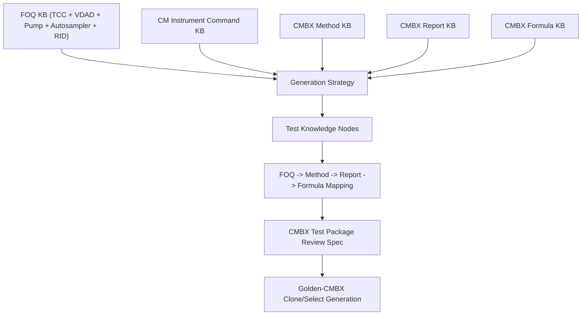

# CMBX Knowledge Index

This index tracks the knowledge-base files used by CMBX Data Explorer and the
FOQ generation workflow. The project copy lives under:

```text
cmbx_data_explorer/docs/KB_INDEX.md
```

The workspace mirror lives under:

```text
C:\ProgramData\CMBX Data Explorer Workspace\KB\KB_INDEX.md
```

Current date: 2026-08-04. Entries dated after this date are treated as planned
target dates rather than completed updates.

## Obsidian Vault

Open the following folder directly as the Obsidian vault:

```text
C:\ProgramData\CMBX Data Explorer Workspace\KB
```

This `KB_INDEX.md` note is the vault entry page. Git-authored engineering plans
remain authoritative under `cmbx_data_explorer\docs`; selected plans are mirrored
into the operational vault for browsing. Parser-generated evidence remains under
`cmbx_data_explorer\knowledge_base` and is not the primary Obsidian reading layer.

Start with [[00_Business_View/00_HOME|Web Business Knowledge Home]] for the
workflow-oriented view. Existing folders remain in place because Method/Report
generation and formula discovery still resolve several legacy paths directly.

The complete Git-managed Markdown inventory is stored under
`cmbx_data_explorer/knowledge_vault`. Use `tools/sync_kb_vault.py` to collect,
verify, and deploy the operational KB, engineering-document mirror, and relevant
Codex skill documentation. Exact duplicates and long-path aliases are recorded in
`knowledge_vault/manifest.json`; runtime-critical legacy copies remain intentional.

## Knowledge Base Versions

| KB Name | Version | Update Date | Coverage | Status | Local File(s) |
|---|---:|---|---|---|---|
| VDAD_KB | 1.0 | 2026-07-08 | VDAD-F/C, VMWD-C | Published | `FOQ/Detector/FOQ_VDAD_VMWD_TD_KNOWLEDGE_MANAGEMENT.md`, `FOQ/Detector/FOQ_VDAD_VMWD_TEST_LOGIC_KNOWLEDGE_BASE.md` |
| TCC_KB | 1.0 | 2026-07-09 | VH/VC/VA-C10-A | Published | `FOQ/TCC/FOQ_TCC_VX_C10_A_TD_KNOWLEDGE_MANAGEMENT.md`, `FOQ/TCC/FOQ_TD_TEST_LOGIC_KNOWLEDGE_BASE.md` |
| Pump_KB | 0.5 | 2026-07-10 target | Vanquish Pump / HPG-related FOQ | In development | `FOQ/Pump/FOQ_VPUMP_TD_KNOWLEDGE_MANAGEMENT.md`, `FOQ/Pump/FOQ_VPUMP_TEST_LOGIC_KNOWLEDGE_BASE.md` |
| Autosampler_KB | 0.5 | 2026-07-09 | Vanquish Autosampler FOQ | Draft | `FOQ/Autosampler/FOQ_VAS_TD_KNOWLEDGE_MANAGEMENT.md`, `FOQ/Autosampler/FOQ_VAS_TEST_LOGIC_KNOWLEDGE_BASE.md` |
| RID_OQ_KB | 1.0 | 2026-07-28 | VC-D60-A and generic `$RI` OQ template; warm-up, linearity, noise/drift, stop/restore, method and report contracts | Published / processing-method partial | `FOQ/RID/RID_OQ_TEST_KNOWLEDGE_BASE.md`, `FOQ/RID/RID_OQ_METHOD_REPORT_EVIDENCE.md`, `cmbx_data_explorer/docs/RID_OQ_TEST_KNOWLEDGE_BASE.md`, `cmbx_data_explorer/docs/RID_OQ_METHOD_REPORT_EVIDENCE.md` |
| CMBX_Methods_Inventory | 2.3 | 2026-06-15 | TCC decoded methods, expandable to all modules | Published / partial local mirror | `knowledge_base/tcc_reverse_probe/**/_embedded_method_flow.tsv`, `cmbx_data_explorer/docs/TCC_METHOD_COMMAND_CONTRACTS.md` |
| CMBX_Reports_Inventory | 2.1 | 2026-06-10 | TCC report templates, expandable to all modules | Published / partial local mirror | `cmbx_data_explorer/docs/TCC_METHOD_REPORT_ALIGNMENT.md`, report template tabs/docs |
| CMBX_Formulas | 1.2 | 2026-06-20 | Report formula and workbook-derived rules | Published / partial local mirror | `cmbx_data_explorer/docs/CM_FORMULA_KNOWLEDGE_BASE.md`, `cmbx_data_explorer/CM_FORMULA_REVERSE_ENGINEERING.md` |
| CMBX_Generation_Strategy | 1.0 | 2026-07-09 | Cross-module generation strategy | Published | `cmbx_data_explorer/docs/CMBX_GENERATION_STRATEGY_KB.md` |
| CM_MethodScriptMdSpec | 2.4 | 2026-08-06 | Strict web-AI MD authoring and Method Script Generator preflight contract, including CM string-literal typing and default `bar` pressure calculations | Published | `cmbx_data_explorer/docs/CM_METHOD_SCRIPT_MD_FORMAT_SPEC.md`, `C:\ProgramData\CMBX Data Explorer Workspace\KB\Method Script Generator\Generator Spec\CM_METHOD_SCRIPT_MD_FORMAT_SPEC.md` |
| MD_To_Standalone_Method_CMBX_Packaging | 1.1 | 2026-07-17 | Structural MD -> standalone instrument-method CMBX packaging, linter, and roundtrip acceptance | Published / structural prototype | `cmbx_data_explorer/docs/MD_TO_STANDALONE_METHOD_CMBX_PACKAGING.md`, `C:\ProgramData\CMBX Data Explorer Workspace\KB\FOQ Template\MD_TO_STANDALONE_METHOD_CMBX_PACKAGING.md` |
| CM_CompilerRules | 1.1 | 2026-07-17 | Method Script Generator compiler-facing reminders; strict SPEC wins on conflict | Published | `C:\ProgramData\CMBX Data Explorer Workspace\KB\FOQ Template\CM Compiler Rules.MD`, `C:\ProgramData\CMBX Data Explorer Workspace\KB\Method Script Generator\Generator Spec\CM Compiler Rules.MD` |
| CM_MethodRenderingContract | 1.0 | 2026-07-17 | CM-like method table rendering, row categories, and stage-time preservation | Published | `cmbx_data_explorer/docs/CM_METHOD_RENDERING_CONTRACT.md` |
| CMBX_ParsingNotes | 1.5 | 2026-07-28 | CMBX container, multi-sequence method links, shared report scope/deduplication, package classification, embedded extraction, large FormulaOne inventories, and validated parsing boundaries | Published | `cmbx_data_explorer/CMBX_PARSING_NOTES.md`, `CMBX读取/CMBX_PARSING_NOTES.md` |
| Web_Workspace_Build_Plan | 1.41+ | 2026-08-04 | Intranet Web workflows, permissions, Method/Report generation, CMBX analysis, FOQ/quality review, and Single Verification features | Active development | `cmbx_data_explorer/docs/WEB_WORKSPACE_BUILD_PLAN.md`, `Web Workspace/WEB_WORKSPACE_BUILD_PLAN.md` |
| TCC_TestKnowledgeNodes | 0.2 | 2026-07-09 | TCC FOQ injection/method/report/DB node model | In development | `FOQ/TCC/TCC_TEST_KNOWLEDGE_NODE_MODEL.md`, `cmbx_data_explorer/docs/TCC_TEST_KNOWLEDGE_NODE_MODEL.md` |
| TCC_BlackBox_Decompositions | 1.3 | 2026-07-10 | Temperature Accuracy, Calibration, Precision/Fan, Stability/PCC, HeatUp/CoolDown, BurnIn, Preheater, Column ID, Valve/Keypad, Liquid Leak, Qualification Service, Factory Default, Error Log Check contracts | In development | `cmbx_data_explorer/docs/TCC_ACCURACY_BLACK_BOX_DECOMPOSITION.md`, `cmbx_data_explorer/docs/TCC_CALIBRATION_BLACK_BOX_DECOMPOSITION.md`, `cmbx_data_explorer/docs/TCC_PRECISION_FAN_BLACK_BOX_DECOMPOSITION.md`, `cmbx_data_explorer/docs/TCC_STABILITY_BLACK_BOX_DECOMPOSITION.md`, `cmbx_data_explorer/docs/TCC_HEATUP_COOLDOWN_BLACK_BOX_DECOMPOSITION.md`, `cmbx_data_explorer/docs/TCC_BURNIN_BLACK_BOX_DECOMPOSITION.md`, `cmbx_data_explorer/docs/TCC_PREHEATER_BLACK_BOX_DECOMPOSITION.md`, `cmbx_data_explorer/docs/TCC_COLUMN_ID_BLACK_BOX_DECOMPOSITION.md`, `cmbx_data_explorer/docs/TCC_VALVE_KEYPAD_BLACK_BOX_DECOMPOSITION.md`, `cmbx_data_explorer/docs/TCC_LIQUID_LEAK_BLACK_BOX_DECOMPOSITION.md`, `cmbx_data_explorer/docs/TCC_QUALIFICATION_SERVICE_BLACK_BOX_DECOMPOSITION.md`, `cmbx_data_explorer/docs/TCC_FACTORY_DEFAULT_BLACK_BOX_DECOMPOSITION.md`, `cmbx_data_explorer/docs/TCC_ERROR_LOG_BLACK_BOX_DECOMPOSITION.md` |
| TCC_MethodRoleContracts | 0.2 | 2026-07-13 | Role-level TCC method-script edit contracts for all TCC FOQ methods and Test Plan generation | Draft | `FOQ/TCC/TCC_METHOD_ROLE_CONTRACTS.md`, `cmbx_data_explorer/docs/TCC_METHOD_ROLE_CONTRACTS.md` |
| TCC_ScriptDescriptions | 0.1 | 2026-07-14 | Human-readable CM method script analysis, starting with TCC Temperature Accuracy trigger/state-machine logic | Draft / useful evidence | `FOQ/TCC/Script Description/Vanquish_TCC_Temperature_Accuracy_Method_Analysis.md` |
| TCC_TestRelationshipModel | 0.1 | 2026-07-10 | TCC inter-test dependencies, shared resources, modifiability, crop/merge impact, failure propagation | In development | `cmbx_data_explorer/docs/TCC_TEST_RELATIONSHIP_MODEL.md` |
| VX_C10_A_TCC_Method_Package | 0.1 | 2026-07-09 | TCC FOQ method package review spec | Draft / review | `cmbx_data_explorer/docs/VX_C10_A_TCC_FOQ_CMBX_METHOD_PACKAGE.md` |
| TCC_CustomMethodScriptCandidates | 0.1 | 2026-07-14 | Manual `cm-method-script-author` candidate outputs for custom TCC method intents | Draft / review | `cmbx_data_explorer/docs/TCC_CUSTOM_ACCURACY_40_60_80_STABILITY_METHOD_SKILL_OUTPUT.md` |
| TechnicalDocumentKnowledgeExtractorSkill | 2.0 | 2026-07-14 | FOQ TD and technical-document extraction into structured Markdown KB | Published | `C:\Users\xiaoshu.guan\.codex\skills\technical-document-knowledge-extractor\SKILL.md` |
| CM_MethodScriptAuthorSkill | 1.1 | 2026-07-17 | Manual expert-mode CM/TCC method-script authoring from intent, method evidence, TD KB, report constraints, and MD compiler preflight rules | Published | `C:\Users\xiaoshu.guan\.codex\skills\cm-method-script-author\SKILL.md`, `C:\Users\xiaoshu.guan\.codex\skills\cm-method-script-author\references\tcc_method_authoring.md` |
| CMBX_MethodScriptGeneratorSkill | deprecated | 2026-07-17 | Compatibility wrapper only; redirects old Method Script Generator prompts to CM_MethodScriptAuthorSkill and current MD preflight workflow | Deprecated / compatibility | `C:\Users\xiaoshu.guan\.codex\skills\cmbx-method-script-generator\SKILL.md` |

## Functional Navigation

The app groups KB entries by what the user is trying to do, not by the file's
technical origin.

| UI Group | Use It For |
|---|---|
| FOQ测试知识 | Understand test purpose, TD logic, model applicability, acceptance criteria, dependencies, and black-box decomposition. |
| 方法脚本知识 | Understand CM commands, method roles, trigger/state-machine logic, strict MD method-script format, rendering rules, and compiler/linter constraints. |
| CMBX读取 | Understand what can be decoded from CMBX packages: package structure, embedded methods/reports, extracted method evidence, and parser boundaries. |
| CMBX生成 | Build or review generated assets: generation strategy, standalone method-CMBX packaging, export rules, and validation requirements. |
| 报告与公式 | Trace report templates, report cells, CM formulas, workbook-derived formulas, DB fields, display precision, and SQL/output contract. |
| Skills | See Codex workflows and the KB/evidence each skill is allowed to use. |

## Cross-Module Dependency Graph



## Repository Map

### Skills / Agent Workflows

- Technical document extraction skill:
  `C:\Users\xiaoshu.guan\.codex\skills\technical-document-knowledge-extractor\SKILL.md`
- CM method script authoring skill:
  `C:\Users\xiaoshu.guan\.codex\skills\cm-method-script-author\SKILL.md`
- TCC method authoring reference:
  `C:\Users\xiaoshu.guan\.codex\skills\cm-method-script-author\references\tcc_method_authoring.md`
- Deprecated compatibility wrapper:
  `C:\Users\xiaoshu.guan\.codex\skills\cmbx-method-script-generator\SKILL.md`

Purpose:

```text
Skills define how Codex should use local KB evidence. The CMBX Data Explorer
Skills tab indexes these workflows and exposes their referenced KB/evidence
files so existing knowledge is not silently ignored.
```

Main topics:

```text
technical-document-knowledge-extractor:
  FOQ TD -> structured module KB Markdown

cm-method-script-author:
  natural intent -> test intent -> CM execution mechanism -> method script
  -> report/config constraints

cmbx-method-script-generator:
  deprecated wrapper only; redirects to cm-method-script-author and MD preflight
```

### CM Instrument Commands

- `CM/Instrument Commands/CM_INSTRUMENT_COMMAND_KNOWLEDGE_BASE_V2.md`
- Project mirror: `cmbx_data_explorer/docs/CM_INSTRUMENT_COMMAND_KNOWLEDGE_BASE_V2.md`

Purpose:

```text
Chromeleon Instrument Setup tree and instrument-method command knowledge.
```

Main topics:

```text
ColumnOven / PumpModule / SamplerModule / Thermometer / UV / Variables / System / End
SET / Wait / Delay / Trigger / RetTimes / AcqOn / Log / Message / AbortQueue / CmdString
```

### CM Method Authoring / MD Compiler

- Strict MD authoring spec: `cmbx_data_explorer/docs/CM_METHOD_SCRIPT_MD_FORMAT_SPEC.md`
- Workspace spec mirror:
  `C:\ProgramData\CMBX Data Explorer Workspace\KB\Method Script Generator\Generator Spec\CM_METHOD_SCRIPT_MD_FORMAT_SPEC.md`
- Standalone method CMBX packaging:
  `cmbx_data_explorer/docs/MD_TO_STANDALONE_METHOD_CMBX_PACKAGING.md`
- Compiler-facing reminders:
  `C:\ProgramData\CMBX Data Explorer Workspace\KB\FOQ Template\CM Compiler Rules.MD`
- Method rendering contract:
  `cmbx_data_explorer/docs/CM_METHOD_RENDERING_CONTRACT.md`

Purpose:

```text
One knowledge path for web-AI-authored method MD:
SPEC -> strict TSV MD -> preview/preflight -> standalone method CMBX packaging
-> CM import/editor validation.
```

Main topics:

```text
Stage rows / Branch rows / Trigger blocks / Run Duration vs Stop Run /
timed comment prohibition / linter errors and warnings / roundtrip acceptance
```

### CMBX Parsing And Extraction

- Project parsing notes: `cmbx_data_explorer/CMBX_PARSING_NOTES.md`
- Workspace functional mirror: `CMBX读取/CMBX_PARSING_NOTES.md`
- CMBX reverse-engineering docs under `cmbx_data_explorer/docs`

Purpose:

```text
Document what the app can decode from CMBX, including package classification,
multi-sequence method bindings, folder/root shared report scope, logical report
deduplication, embedded payload ownership, and boundaries that still require
Chromeleon import/editor validation.
```

### FOQ TCC

- `FOQ/TCC/FOQ_TCC_VX_C10_A_TD_KNOWLEDGE_MANAGEMENT.md`
- `FOQ/TCC/FOQ_TD_TEST_LOGIC_KNOWLEDGE_BASE.md`
- Test Knowledge Node model: `FOQ/TCC/TCC_TEST_KNOWLEDGE_NODE_MODEL.md`
- Project node model mirror: `cmbx_data_explorer/docs/TCC_TEST_KNOWLEDGE_NODE_MODEL.md`
- Black-box decompositions: `cmbx_data_explorer/docs/TCC_ACCURACY_BLACK_BOX_DECOMPOSITION.md`, `cmbx_data_explorer/docs/TCC_CALIBRATION_BLACK_BOX_DECOMPOSITION.md`, `cmbx_data_explorer/docs/TCC_PRECISION_FAN_BLACK_BOX_DECOMPOSITION.md`, `cmbx_data_explorer/docs/TCC_STABILITY_BLACK_BOX_DECOMPOSITION.md`, `cmbx_data_explorer/docs/TCC_HEATUP_COOLDOWN_BLACK_BOX_DECOMPOSITION.md`, `cmbx_data_explorer/docs/TCC_BURNIN_BLACK_BOX_DECOMPOSITION.md`, `cmbx_data_explorer/docs/TCC_PREHEATER_BLACK_BOX_DECOMPOSITION.md`, `cmbx_data_explorer/docs/TCC_COLUMN_ID_BLACK_BOX_DECOMPOSITION.md`, `cmbx_data_explorer/docs/TCC_VALVE_KEYPAD_BLACK_BOX_DECOMPOSITION.md`, `cmbx_data_explorer/docs/TCC_LIQUID_LEAK_BLACK_BOX_DECOMPOSITION.md`, `cmbx_data_explorer/docs/TCC_QUALIFICATION_SERVICE_BLACK_BOX_DECOMPOSITION.md`, `cmbx_data_explorer/docs/TCC_FACTORY_DEFAULT_BLACK_BOX_DECOMPOSITION.md`, `cmbx_data_explorer/docs/TCC_ERROR_LOG_BLACK_BOX_DECOMPOSITION.md`
- Method role contracts for Test Plan edits: `cmbx_data_explorer/docs/TCC_METHOD_ROLE_CONTRACTS.md`
- Script descriptions: `FOQ/TCC/Script Description/Vanquish_TCC_Temperature_Accuracy_Method_Analysis.md`
- Test relationship model: `cmbx_data_explorer/docs/TCC_TEST_RELATIONSHIP_MODEL.md`
- Project review spec: `cmbx_data_explorer/docs/VX_C10_A_TCC_FOQ_CMBX_METHOD_PACKAGE.md`

Main topics:

```text
Column ID
Preheater Connection Test
Valve and Keypad
Burn-In
Temperature Calibration
Temperature Accuracy
Temperature Precision and Fan
Temperature Stability and PCC
HeatUp and CoolDown
Liquid Leak
Qualification Service
Factory Default
Error Log Check
```

### FOQ Detector

- `FOQ/Detector/FOQ_VDAD_VMWD_TD_KNOWLEDGE_MANAGEMENT.md`
- `FOQ/Detector/FOQ_VDAD_VMWD_TEST_LOGIC_KNOWLEDGE_BASE.md`
- `FOQ/Detector/FOQ_VVWD_TD_KNOWLEDGE_MANAGEMENT.md`
- `FOQ/Detector/FOQ_VVWD_TEST_LOGIC_KNOWLEDGE_BASE.md`

Main topics:

```text
Warm Up
Noise and Drift
Wavelength Accuracy
Dark Current Drift
Stray Light
Spectral Scan
Linearity
Saturation
Factory Defaults
```

### FOQ Pump

- `FOQ/Pump/FOQ_VPUMP_TD_KNOWLEDGE_MANAGEMENT.md`
- `FOQ/Pump/FOQ_VPUMP_TEST_LOGIC_KNOWLEDGE_BASE.md`

Main topics:

```text
Burn-In / Purge / Tightness / Balance
Pressure Sensor and Transducer Calibration
Flow Rate Calibration
X-Value Calibration
Flow Accuracy / Pulsation / Filter Permeability
Gradient Accuracy
Solvent Selector
Degasser Pressure Test
```

### FOQ Autosampler

- `FOQ/Autosampler/FOQ_VAS_TD_KNOWLEDGE_MANAGEMENT.md`
- `FOQ/Autosampler/FOQ_VAS_TEST_LOGIC_KNOWLEDGE_BASE.md`

Main topics:

```text
Leakage Check
Carry-Over
Drive Functionality
Injection Volume Precision
Injection Volume Linearity
Cooling Performance
Relays / Digital Inputs
Factory Defaults
```

## Source TD Files

Original source documents remain under:

```text
C:\ProgramData\CMBX Data Explorer Workspace\KB\FOQ TD
```

Derived Markdown knowledge should reference source files but should not overwrite
them.
