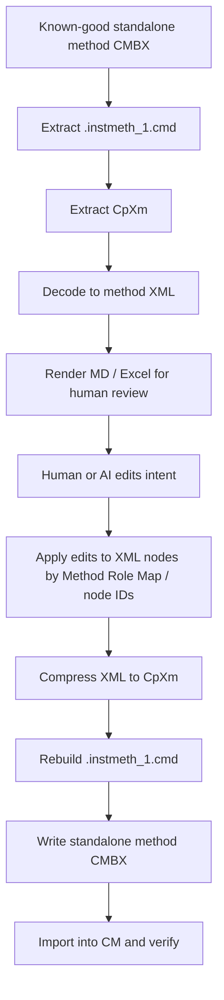

# MD to Standalone Instrument Method CMBX Packaging

KB_Version: 1.1  
Extraction_Date: 2026-07-15  
Last_Validated: 2026-07-22  
Original_Source_CMBX: `C:\ProgramData\CMBX Data Explorer Workspace\KB\FOQ Template\TEMP_HEAT_UP_DOWN_20_50_20.cmbx`  
CM_7_2_Compatible_Carrier: `C:\ProgramData\CMBX Data Explorer Workspace\KB\FOQ Template\TEMPERATURE_CALIBRATION_720.cmbx`  
Source_MD: `C:\ProgramData\CMBX Data Explorer Workspace\KB\FOQ Template\TEMP_HEAT_UP_DOWN_20_50_20.md`

## 1. What Was Inspected

The HEATUP template CMBX is a standalone Chromeleon instrument-method export, not a full sequence package.

Compatibility update, 2026-07-22:

- `TEMP_HEAT_UP_DOWN_20_50_20.cmbx` was exported by CM 7.3.1.6535. Generated methods based on this carrier import in CM 7.3 but are not expected to be accepted by CM 7.2.
- `TEMPERATURE_CALIBRATION_720.cmbx` was exported by CM 7.2.10.31698 and is the preferred carrier when the generated standalone method must be opened in CM 7.2.
- CM 7.3 can open CM 7.2 CMBX files. CM 7.2 cannot open CM 7.3 CMBX files. Therefore the safe default is to generate against the oldest supported carrier, currently CM 7.2.
- A newly compiled method based on `TEMPERATURE_CALIBRATION_720.cmbx` was successfully imported and opened in the CM 7.2 method editor. The CM 7.2 carrier route is therefore validated for standalone method packaging and editor loading.

Package entries:

| Entry | Size | Purpose |
|---|---:|---|
| `TEMP_HEAT_UP_DOWN_20_50_20.instmeth_1.cmd` | 22492 bytes | Binary Chromeleon instrument method command payload |
| `header.xml` | 616 bytes | CMBX element metadata |

`header.xml` contains one element:

| Name | ItemType | Filename |
|---|---|---|
| `TEMP_HEAT_UP_DOWN_20_50_20` | `Dionex.Chromeleon.Data.InstrumentMethod` | `TEMP_HEAT_UP_DOWN_20_50_20.instmeth_1.cmd` |

## 2. Payload Structure

The `.instmeth_1.cmd` file is not plain XML. It is a Chromeleon binary payload with nested length-delimited fields.

Observed structure:

```text
.instmeth_1.cmd
-> top-level protobuf-like fields
-> field 19
-> nested field 11: method payload wrapper
-> method payload field 3: CpXm compressed method body
-> decoded method XML through Dionex.DataCommon.dll XmlCompressor.Uncompress(byte[])
```

The extracted CpXm payload begins with:

```text
CpXm
```

The decoded XML from the HEATUP method is about `297275` characters.

### 2.1 CM 7.2 versus CM 7.3 carrier differences

The CMBX container version alone is not enough to decide compatibility. Both tested standalone method files use `ContainerVersionChromeleon=7.2.3`, but their generator and command payloads differ:

| Carrier | Header `GeneratorVersion` | Top-level field 18 | Nested field 27 | Top field 34 | Opens in |
|---|---|---:|---|---|---|
| `TEMPERATURE_CALIBRATION_720.cmbx` | `7.2.10.31698` | `150` bytes | `7.1.1.1034` | `7.2.10.17` | CM 7.2+ |
| `TEMP_HEAT_UP_DOWN_20_50_20.cmbx` | `7.3.1.6535` | `3216` bytes | `7.3.1.3` | `7.3.1.11` | CM 7.3+ |

Validation status:

| Scope | Status | Evidence |
|---|---|---|
| Preserve CM 7.2 package/wrapper compatibility | Validated | Generated output retained the 7.2 carrier metadata and internal wrapper versions |
| Import generated standalone method into CM 7.2 | Validated | User import test completed successfully on 2026-07-22 |
| Open generated method in CM 7.2 Method Editor | Validated | User editor-open test completed successfully on 2026-07-22 |
| Execute every generated command on connected hardware | Per-method validation required | Depends on script commands, configured devices, symbols, channels, and instrument configuration |

Observed control:

- decoding the 7.2 carrier CpXm and immediately re-encoding it with the local Chromeleon DLL produced byte-identical CpXm;
- compiling a new MD script through the 7.2 carrier preserved the 7.2 header and wrapper fields:
  - `GeneratorVersion=7.2.10.31698`
  - nested field 27 remains `7.1.1.1034`
  - top field 18 remains `150` bytes.

Generation rule:

```text
Need CM 7.2 compatibility
-> use TEMPERATURE_CALIBRATION_720.cmbx as standalone method carrier
-> preserve header/wrapper metadata
-> replace only decoded Method/Children XML and method display name
-> import/open in CM 7.2 (validated packaging route)

Need CM 7.3-only behavior or a 7.3-specific command/control
-> use a CM 7.3 exported carrier that already contains that command/control
```

Do not attempt to make a 7.3-generated standalone method compatible with CM 7.2 by editing `header.xml` version strings only. The `.instmeth_1.cmd` payload carries additional versioned object-model data.

## 3. Validated Round Trip

The local Chromeleon DLL provides both:

| Method | Meaning |
|---|---|
| `XmlCompressor.Uncompress(byte[])` | CpXm -> decoded method XML |
| `XmlCompressor.Compress(string)` | decoded method XML -> CpXm |

Validation results:

| Test | Result |
|---|---|
| Decode original CpXm to XML | OK |
| Compress unmodified XML back to CpXm | OK |
| Recompressed CpXm byte-equal to original | OK |
| Rebuild standalone CMBX from unmodified XML | OK |
| Rebuilt `.instmeth_1.cmd` byte-equal to original | OK |
| Edit a comment in decoded XML, compress, rebuild CMBX | OK |
| Decode edited CMBX and confirm edited comment exists | OK |

This proves the following path:

```text
decoded method XML
-> CpXm
-> .instmeth_1.cmd
-> standalone instrument-method CMBX
```

## 4. What Is Not Yet Proven

The plain MD file is a CM table display/export. It is useful for human editing and Excel rendering, but it is not yet a complete executable source.

Why MD is not enough by itself:

| Missing from plain MD | Why it matters |
|---|---|
| XML node type | A green visual row can be a comment, branch, trigger child, or editor node |
| Node nesting | Triggers contain child command nodes in XML |
| Node IDs | CM may preserve internal editor identity |
| Branch/trigger structure | MD expands trigger rows differently than decoded XML |
| Editor metadata | Some values are not visible in the four display columns |

Observed mismatch:

| Source | Row count |
|---|---:|
| Plain MD / CM display rows | 218 |
| Current decoded XML flow rows | 161 |

The gap mainly comes from trigger rendering:

- CM display expands `Trigger`, condition, `TrueTime`, `Limit`, `Hysteresis`, `AllowImmediateExecution`, trigger actions, and `End Trigger` as multiple rows.
- Decoded XML stores each trigger as a `CommandStepNode` with `SymbolPath=System.Trigger` and child nodes for trigger actions.

Therefore, a safe MD-to-CMBX writer must not treat MD as raw executable text. It needs to patch a decoded XML template.

## 5. Recommended Safe Workflow

Use the exported CMBX as the executable carrier and the MD as a review/edit layer.



## 6. Current Tooling

Validated prototype files:

| File | Purpose |
|---|---|
| `cmbx_data_explorer/chromeleon_method_encoder.py` | Calls local Chromeleon `XmlCompressor.Compress(string)` |
| `cmbx_data_explorer/tools/repack_standalone_instmeth_cmbx.py` | Rebuilds standalone instrument-method CMBX from edited decoded XML |
| `cmbx_data_explorer/cm_method_xml_table.py` | Renders decoded method XML into CM-display-like rows with node IDs and trigger expansion |
| `cmbx_data_explorer/tools/pack_method_md_to_standalone_cmbx.py` | Uses a known-good CMBX XML template plus an edited MD table to patch executable XML nodes and repack a standalone method CMBX |

Useful generated artifacts:

| Artifact | Purpose |
|---|---|
| `artifacts/foq_template_probe/TEMP_HEAT_UP_DOWN_20_50_20/TEMP_HEAT_UP_DOWN_20_50_20.cpxm` | Extracted CpXm |
| `artifacts/foq_template_probe/TEMP_HEAT_UP_DOWN_20_50_20/TEMP_HEAT_UP_DOWN_20_50_20.decoded.xml` | Decoded method XML |
| `artifacts/foq_template_probe/TEMP_HEAT_UP_DOWN_20_50_20/TEMP_HEAT_UP_DOWN_20_50_20.flow.tsv` | Existing readable flow table |
| `artifacts/foq_template_probe/TEMP_HEAT_UP_DOWN_20_50_20/TEMP_HEAT_UP_DOWN_20_50_20.cm_table.tsv` | CM-display-like table with 218 rows and XML node anchors |
| `artifacts/foq_template_probe/TEMP_HEAT_UP_DOWN_20_50_20/TEMP_HEAT_UP_DOWN_20_50_20.repacked.cmbx` | Repacked byte-equivalent CMBX |
| `artifacts/foq_template_probe/TEMP_HEAT_UP_DOWN_20_50_20/TEMP_HEAT_UP_DOWN_20_50_20.comment_edit.cmbx` | Repacked edited-comment proof |
| `artifacts/foq_template_probe/TEMP_HEAT_UP_DOWN_20_50_20/TEMP_HEAT_UP_DOWN_20_50_20.from_md.cmbx` | Original MD packed through template-guided packer; byte-equal to original |
| `artifacts/foq_template_probe/TEMP_HEAT_UP_DOWN_20_50_20/TEMP_HEAT_UP_DOWN_20_50_20.edit_55.cmbx` | Edited MD proof: one `Temperature.Nominal` value patched from 50.0 to 55.0 and decoded back successfully |

## 6.1 Template-Guided MD Packer

The current safe MD-to-CMBX route is template-guided:

```text
source standalone method CMBX
-> decode XML
-> render XML to CM-like table with NodeId anchors
-> parse edited MD table
-> require same row count
-> patch only executable XML fields by row anchor
-> compress XML to CpXm
-> rebuild standalone method CMBX
```

Validated behavior:

| Validation | Result |
|---|---|
| XML renderer row count vs original MD | `218 == 218` |
| Original MD -> CMBX | `.instmeth_1.cmd` byte-identical to source |
| Edited MD, setpoint `50.0` -> `55.0` | one executable `Value` change detected |
| Edited CMBX decode | OK; decoded XML contains `55.0` |

Default patch policy:

| Field | Default behavior | Reason |
|---|---|---|
| Command `Value` | patched | executable and usually intended |
| Branch `Condition` | patched | executable |
| Trigger `Value` | patched as grouped trigger text | executable |
| Comments | not patched by default | avoids encoding/whitespace churn from MD display exports |
| Stage/time structure | not patched by default | changing stage timing requires stronger XML-role validation |

Current command:

```powershell
python -B cmbx_data_explorer\tools\pack_method_md_to_standalone_cmbx.py `
  "C:\ProgramData\CMBX Data Explorer Workspace\KB\FOQ Template\TEMP_HEAT_UP_DOWN_20_50_20.cmbx" `
  "C:\ProgramData\CMBX Data Explorer Workspace\KB\FOQ Template\TEMP_HEAT_UP_DOWN_20_50_20.md" `
  "C:\ProgramData\CMBX Data Explorer Workspace\KB\FOQ Template\TEMP_HEAT_UP_DOWN_20_50_20_from_md.cmbx"
```

This produces a standalone instrument-method CMBX suitable for CM import testing.

For CM 7.2-compatible structural generation, use the 7.2 carrier:

```powershell
python -B cmbx_data_explorer\tools\compile_method_md_to_standalone_cmbx.py `
  "C:\ProgramData\CMBX Data Explorer Workspace\KB\FOQ Template\TEMPERATURE_CALIBRATION_720.cmbx" `
  "C:\ProgramData\CMBX Data Explorer Workspace\KB\FOQ Template\A new test script.MD" `
  "C:\ProgramData\CMBX Data Explorer Workspace\KB\FOQ Template\A_new_test_script_72.cmbx" `
  --method-name "A new test 72"
```

The app's Method Script Generator now prefers `TEMPERATURE_CALIBRATION_720.cmbx` when it exists, and falls back to the original 7.3 heat-up carrier only when the 7.2 carrier is absent.

Important guardrail:

- This packer is safe for **row-preserving edits** against a known-good template.
- It is not yet safe for arbitrary structural edits such as adding/removing trigger blocks, adding new stages, or changing method duration semantics.
- For structural edits, use decoded XML role-map edits, then repack through `repack_standalone_instmeth_cmbx.py`.

## 6.2 Structural MD Compiler Prototype

A second route is now available for **new method-script MD files whose row count and structure do not match the carrier CMBX**:

```text
new CM-style MD table
-> parse stages, time steps, comments, properties, commands, and trigger blocks
-> replace Method/Children syntax tree in a known-good standalone method CMBX carrier
-> compress XML to CpXm
-> rebuild standalone method CMBX
-> decode/render verification
```

Current structural guardrails:

| Guardrail | Behavior |
|---|---|
| Timed prose-only row, e.g. `5.000<TAB>Static measurement starts` | Preflight error. Time anchors must be stages, triggers, or executable command rows. |
| `Run Duration` differs from `Stop Run` time | Preflight error. The authored time axis must be explicit and self-consistent. |
| Run-stage row time is later than `Stop Run` | Preflight error because the script time axis is self-contradictory. |
| Trigger `Limit` is `Infinite`, `inf`, or `unlimited` | Preflight error. Trigger `Limit` must be numeric or blank. |

Prototype command:

```powershell
python -B cmbx_data_explorer\tools\compile_method_md_to_standalone_cmbx.py `
  "C:\ProgramData\CMBX Data Explorer Workspace\KB\FOQ Template\TEMP_HEAT_UP_DOWN_20_50_20.cmbx" `
  "C:\ProgramData\CMBX Data Explorer Workspace\KB\FOQ Template\A new test script.MD" `
  "C:\ProgramData\CMBX Data Explorer Workspace\KB\FOQ Template\A_new_test_script_compiled.cmbx"
```

Validation with `A new test script.MD`:

| Validation | Result |
|---|---|
| Input MD rows | `144` parsed data rows |
| Compiled stages | `5` |
| Compiled time steps | `6` |
| Compiled command/property nodes | `81` |
| Compiled trigger blocks | `4` |
| CMBX package shape | `header.xml` + `.instmeth_1.cmd` |
| Chromeleon DLL decode of compiled CpXm | OK |
| Rendered method rows after decode | `146` |
| Trigger evidence after decode | `T_HOLD_40`, `T_60_ACC`, `T_80_ACC`, `T_80_STAB` present |
| RetTime evidence after decode | `RetTimes.RetTime1` through `RetTimes.RetTime4` present |

Chromeleon import/editor finding:

| Check | Result |
|---|---|
| Import compiled CMBX into Chromeleon | CMBX package imports and item is visible |
| Open imported method in CM method editor | Failed in first prototype |
| CM error | `Failed to load instrument method`; procedural `Method` part cannot be instantiated |
| Interpretation | DLL decode success is not enough; the procedural method object model must match CM's expected node shape |

Prototype v2 correction:

| Fix | Reason |
|---|---|
| Always emit `<Value value="">` for `CommandStepNode` | Original CM XML includes `Value` even for empty-value commands such as `AcqOn` / `AcqOff` |
| Add `StepData/DialogEditorData` for `Wait` commands | Original CM XML uses `DriverId=ChromatographySystem` and `Identifier=System_Wait_Command` for `Wait` |
| Generate a structural-control CMBX from the original HEATUP MD | Separates compiler object-shape problems from new-script command/trigger syntax problems |

Prototype v3 correction:

| Fix | Reason |
|---|---|
| Compile `If / Else If / Else / End If` rows into `IfBlockNode -> IfNode / ElseIfNode / ElseNode` | CM branch rows are structural procedural nodes, not normal command/property rows |
| Emit `System.Trigger` command nodes with `Children` before `NodeType / SymbolPath / Value` | Original CM XML stores trigger action children in that position; preserving node shape may be required by the method editor |
| Keep v3 control sample for import/editor testing | If the control sample opens, the base object model is close enough; if it does not, move to full source-node prototype cloning |

New test files for CM import/editor verification:

| File | Purpose |
|---|---|
| `A_new_test_script_compiled_v2.cmbx` | New script compiled with v2 node-shape corrections |
| `TEMP_HEAT_UP_DOWN_20_50_20_structural_control_v2.cmbx` | Original HEATUP MD compiled by the same structural compiler; control sample |
| `A_new_test_script_compiled_v3.cmbx` | New script compiled with branch/trigger object-shape corrections |
| `TEMP_HEAT_UP_DOWN_20_50_20_structural_control_v3.cmbx` | Original HEATUP MD compiled with branch/trigger object-shape corrections; primary control sample |

Prototype v4 correction:

| Fix | Reason |
|---|---|
| Preserve original `StageNode` objects, order, and `NodeId` values from the carrier CMBX | CM appears to treat stage identity as part of the procedural method object graph; the original HEATUP method uses `Run` stage `NodeId=65537` even though it is not first in display order |
| Rebuild only each stage's internal `TimeStepNode` children | Keeps carrier-level stage object identity while still allowing structural MD scripts |
| Add empty `TimeStepNode` to unused carrier stages | Avoids empty stage procedural containers |

New v4 test files for CM import/editor verification:

| File | Purpose |
|---|---|
| `A_new_test_script_compiled_v4.cmbx` | New script compiled while preserving carrier stage identities |
| `TEMP_HEAT_UP_DOWN_20_50_20_structural_control_v4.cmbx` | Original HEATUP MD compiled while preserving carrier stage identities; superseded by v6 after `SyntaxNodeCollection` preservation fix |

Prototype v5/v6 correction:

| Fix | Reason |
|---|---|
| Deep-clone source XML prototypes for `StageNode`, `TimeStepNode`, `CommandStepNode`, `PropertyStepNode`, `CommmentNode`, `IfBlockNode`, `IfNode`, `ElseIfNode`, and `ElseNode` | Hand-written procedural nodes are not sufficient for CM's DataContract method editor; cloned nodes preserve hidden/default object-shape fields |
| Preserve carrier `StageNode` identities and only replace each stage's child syntax nodes | Keeps method-level stage object graph compatible with the exported CMBX |
| Preserve `Children type="SyntaxNodeCollection"` when clearing and rebuilding child lists | `ET.Element.clear()` removes attributes. Losing this type marker caused CM editor failures around `SyntaxNodeCollection` / `StageNode` deserialization |
| Re-number cloned descendant `NodeId` values and verify there are no duplicates | Prevents copied prototype nodes from colliding with carrier nodes |

New v6 test files for CM import/editor verification:

| File | Purpose |
|---|---|
| `TEMP_HEAT_UP_DOWN_20_50_20_structural_control_v6.cmbx` | Original HEATUP MD compiled using source-node prototype cloning and safe `SyntaxNodeCollection` preservation; current primary control sample |
| `A_new_test_script_compiled_v6.cmbx` | User new script compiled using the same v6 structural compiler |

Local v6 validation:

| Validation | Result |
|---|---|
| Chromeleon DLL decode of v6 CpXm | OK |
| Duplicate `NodeId` values | `0` |
| `Children` elements missing `type="SyntaxNodeCollection"` | `0` |
| Preserved carrier stages | `InstrumentSetup`, `Equilibration`, `InjectPreparation`, `StartRun`, `Run`, `StopRun`, `PostRun` |

Prototype v7 correction:

| Fix | Reason |
|---|---|
| Aggregate expanded MD trigger parameter rows into the parent `System.Trigger` node's `Value` text | In CM, trigger name, condition, `TrueTime`, `Limit`, `Hysteresis`, and `AllowImmediateExecution` are edited through the trigger row's value dropdown as one trigger configuration string. They must not be compiled as independent green comments or property rows. |
| Preserve trigger action rows as `Children` of the `System.Trigger` node | Only executable trigger actions, such as `Protocol`, `RetTimes.*`, or setpoint assignments, belong under the trigger node's child collection. |
| Block `If / Else / End If` branch rows inside a Trigger block | Existing high-confidence TCC CMBX evidence supports simple trigger action lists, but does not establish a safe nested `IfBlockNode` pattern inside trigger actions. Generated files with nested trigger branches can import but appear red in the CM method editor. |
| Add optional generated method name support | Standalone CMBX header `Name`, `Filename`, `Url`, and payload entry name are now updated from the requested/generated method name instead of inheriting the carrier method name. |

New v7 test files for CM import/editor verification:

| File | Purpose |
|---|---|
| `TEMP_HEAT_UP_DOWN_20_50_20_structural_control_v7.cmbx` | Control sample with trigger parameters aggregated into each `System.Trigger.Value` and renamed header/entry |
| `A_new_test_script_compiled_v7.cmbx` | User script compiled with method display name `A new method` and entry `A_new_method.instmeth_1.cmd` |

Local v7 validation:

| Validation | Result |
|---|---|
| Chromeleon DLL decode of v7 CpXm | OK |
| Duplicate `NodeId` values | `0` |
| `Children` elements missing `type="SyntaxNodeCollection"` | `0` |
| First generated trigger value | `"T_HOLD_40",` + condition + `TrueTime=1800.00` + `Limit=1` + `Hysteresis=0.0` + `AllowImmediateExecution=No` |
| First generated trigger children | `Protocol`, `ColumnComp.CC.Temperature.Nominal` |
| Generated CMBX method name | `A new method` |

Prototype v8 correction:

| Fix | Reason |
|---|---|
| Replace the internal standalone method name in `.instmeth_1.cmd` protobuf path `field 19 -> field 28` | CM method editor can display the method name from the binary payload, not only from `header.xml`. Header-only renaming still left the editor showing the carrier method name. |
| Support GPT-style space-aligned MD scripts in addition to tab-delimited CM tables | User-authored / AI-authored MD often uses aligned spaces, for example `Variables.GenericDouble1          40.0`; the compiler now normalizes these rows before generating XML. |
| Fix MD preview stage detection bug | A parser condition treated any non-empty first field as a stage row; `StabVars.TriggerStab1 0` could be previewed as a time row instead of a command assignment. |
| Add UI warning for `Log "text"` rows | CM `Log` is for variables/properties. Text-only event notes should generally use `Protocol` or `Message`; otherwise CM may mark the row red. |

New v8 test file for CM import/editor verification:

| File | Purpose |
|---|---|
| `A_new_method_GPT_compiled_v8.cmbx` | Compiled from `A new method_GPT.MD`; internal payload method name is `A new method GPT` and the carrier HEATUP name is no longer present in `.instmeth_1.cmd` |

Important guardrails:

- This compiler is a **validated standalone packaging path**, not a full CM method validator.
- The CM 7.2 carrier route has passed Chromeleon import and Method Editor open validation.
- That compatibility result does **not** prove that every generated command is semantically valid or runnable on a connected instrument.
- It does **not** redesign report templates or DB mappings. If the MD creates new RetTime semantics or non-standard temperature points, report contract review is still required.
- It currently builds a simplified XML syntax tree and must be expanded with source-node prototype cloning, symbol validation, method-role validation, and CM import feedback.

## 6.3 AI-Generated MD Preflight Validation

The preview UI and standalone CMBX compiler share the same method-MD preflight
linter. The linter is intentionally stricter than CM import because the goal is
to prevent ambiguous web-AI output from being packaged.

| Severity | Example | Result |
|---|---|---|
| Error | Timed comment row | Preview row is red and CMBX generation is blocked |
| Error | Trigger parameter outside Trigger | Preview row is red and CMBX generation is blocked |
| Error | Branch row inside Trigger | Preview row is red and CMBX generation is blocked |
| Error | Run Duration / Stop Run mismatch | CMBX generation is blocked |
| Warning | Placeholder `Valve1...` path | CMBX generation is allowed, but script remains configuration-specific |
| Warning | `Log` with text literal | CMBX generation is allowed, but author should verify source evidence |

## 6.4 Roundtrip Acceptance Criteria

A generated method package is considered structurally acceptable only when all
of the following pass:

1. The authored MD follows `CM_METHOD_SCRIPT_MD_FORMAT_SPEC.md`.
2. The method-MD preflight linter has zero errors.
3. The compiler generates a standalone CMBX without exception.
4. The generated CMBX can be decoded by the local CMBX method decoder.
5. The decoded method renders back to the same CM-style table structure:
   stages, trigger blocks, branch blocks, row order, and Run/Stop timing are
   preserved.
6. Chromeleon can import the CMBX and open the Method Editor.

Warnings are allowed only when they describe known configuration placeholders
or open verification items that the user intentionally accepts.

## 7. Next Engineering Tasks

### 7.1 Trigger-Aware CM Renderer

Implemented as `cm_method_xml_table.py` for the HEATUP template. It renders `System.Trigger` XML nodes like CM UI:

```text
Trigger      "T_UP",
             condition,
             TrueTime=30,
             Limit=1,
             Hysteresis=0,
             AllowImmediateExecution=No
  <child commands>
End Trigger
```

This is required before MD/Excel can be used as a faithful review layer.

### 7.2 Template-Guided MD Patch

Implemented as prototype `pack_method_md_to_standalone_cmbx.py` for row-preserving edits:

1. Decode original CMBX to XML.
2. Render XML to CM-faithful rows with stable row IDs.
3. Let the user edit MD/Excel.
4. Map edited rows back to XML nodes by row ID and Method Role Map.
5. Reject edits that require structural synthesis not supported by the role map.

### 7.3 CM Import Validation

The generated CMBX should be tested in Chromeleon:

| Validation | Status |
|---|---|
| Import unmodified repacked CMBX | Open verification |
| Import comment-edited repacked CMBX | Open verification |
| Import property-value-edited CMBX | Open verification |
| Run on matching TCC configuration | Open verification |

### 7.4 Full Sequence CMBX 7.3 to 7.2 Conversion

Status: **Open engineering item; not started.**

Future capability: convert a complete sequence package exported by CM 7.3 into
a package that CM 7.2 can import and open. This is broader than the validated
standalone instrument-method carrier workflow.

The conversion scope must include and validate:

- sequence and injection metadata;
- instrument and processing methods;
- report templates and embedded FormulaOne workbook payloads;
- channels, raw data, audit trails, custom variables, and linked item IDs;
- every version-bearing wrapper and serialized object graph in package entries;
- cross-entry references, filenames, URLs, checksums, and package header metadata.

Do not treat this as a `header.xml` version-string rewrite. A viable converter
must inventory 7.3-only object types and fields, define their 7.2 equivalents or
explicit rejection rules, rebuild the affected payloads with 7.2-compatible
carriers/serializers, and pass round-trip comparison plus real CM 7.2 import,
open, calculation, and execution tests.

## 8. Current Verdict

`MD -> standalone method CMBX` is now validated for row-preserving executable-field edits against a known-good method CMBX template.

`Decoded XML -> runnable standalone method CMBX` is now technically validated at the package/payload level, but still requires CM import verification.

For practical work, use:

```text
known-good exported method CMBX
-> decoded XML
-> CM-table MD/Excel review
-> row-preserving MD edits or role-map-constrained XML edits
-> repacked standalone method CMBX
-> CM import verification
```
