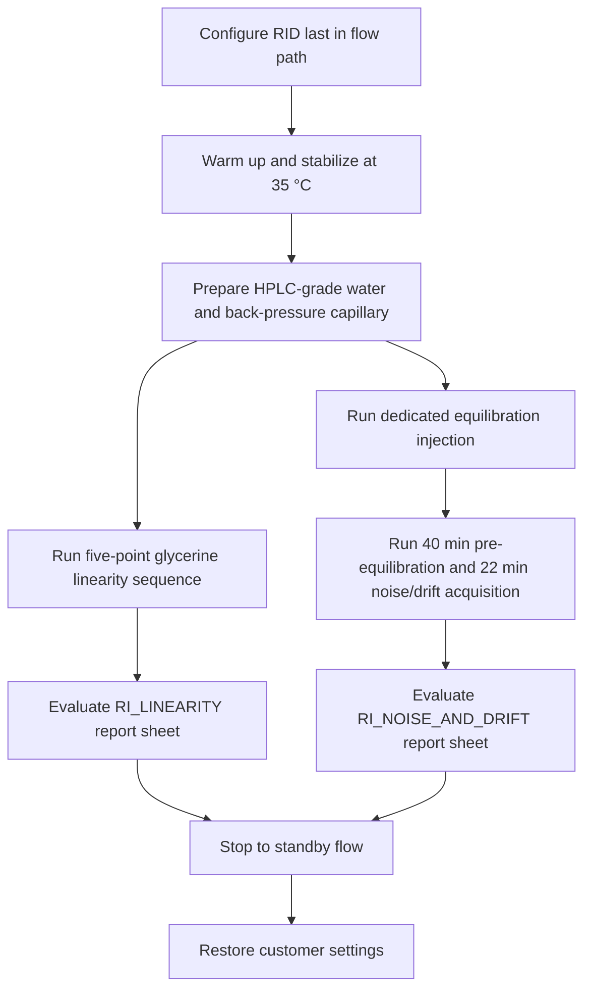
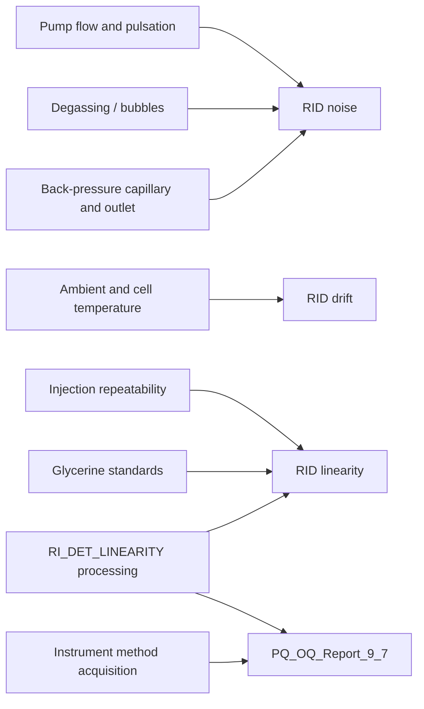

# RID Operational Qualification Knowledge Base

```yaml
KB_Version: 1.0
Source_Revision:
  OQ_CMBX: "PQ/OQ template lineage 9.7; package generated by Chromeleon 7.3.1.6535"
  VC_D60_Manual: "4820.6001-FR Revision 1.1, October 2023"
  RefractoMax521_Manual: "Publication 77-5017-11"
  Product_Specification: "PS000626"
Extraction_Date: 2026-07-28
Module_Family: RID
Primary_Device: "Vanquish Refractive Index Detector C, VC-D60-A"
Evidence_Status: "Method and report formulas decoded; processing-method integration details partial"
```

## 1. Document Metadata

| Field | Value |
|---|---|
| Knowledge title | RID Operational Qualification: test logic, instrument methods, processing methods, and report calculation contract |
| OQ package | `OQ 2026-07-28.cmbx` |
| OQ package date | 2026-07-28 |
| OQ package compatibility metadata | Generator `7.3.1.6535`; container `2.0`; `ContainerVersionChromeleon=7.2.3` |
| Report template | `PQ_OQ_Report_9_7` |
| Current device manual | *Vanquish Détecteur réfractométrique VC-D60*, 4820.6001-FR, Rev. 1.1, October 2023 |
| Legacy detector manual | *RefractoMax521 RI Detector Operator's Manual*, Publication 77-5017-11 |
| Product specification | *Vanquish Refractive Index Detector*, PS000626 |
| Training source | *Vanquish RI Customer Familiarization*, Revision 1.0 |
| Applicable model proven by manual | `VC-D60-A` / orderable detector `VC-D60-A-01` |
| OQ CMBX model binding | Generic `$RI` / `$RI_1` macro contract; exact detector model is read at runtime by `precond.$RI.ModelNo` |
| Document owner | Not explicit in the supplied sources |
| Source directory | `C:\Users\xiaoshu.guan\OneDrive - Thermo Fisher Scientific\Project\RID` |

> Source fact: the instrument methods contain legacy comments for Shodex RI-101 / ERC RefractoMax520, while the supplied manuals cover RefractoMax521 and Vanquish VC-D60. The package is therefore treated as a generic RI qualification template, not as proof that every command is already optimized for VC-D60.

## 2. Scope and Evidence Layers

This KB joins three evidence layers:

1. **Manual and product specification**: explains the detector, safe configuration, purge, stabilization, validation, and published performance.
2. **OQ CMBX execution evidence**: shows the actual sequence rows, method commands, timing, channel acquisition, and processing-method bindings.
3. **Report contract evidence**: shows the active RID report sheets, direct CM formulas, FormulaOne cell calculations, limits, and pass/fail rules.

The supplied OQ package is a **sequence template**. It contains methods and a report template but no completed raw channels or audit trails, so numerical execution results cannot be validated from this package alone.

## 3. Core Terms and Abbreviations

| Term | Meaning in this KB |
|---|---|
| RID / RI detector | Refractive index detector; measures the difference between sample-cell and reference-cell refractive index. |
| RIU | Refractive Index Unit. `µRIU` is 10^-6 RIU; `nRIU` is 10^-9 RIU. |
| Deflection type | Optical measurement based on beam deflection caused by a refractive-index difference. |
| Reference cell | Cell chamber containing representative mobile phase used as the optical reference. |
| Sample cell | Flow-through chamber carrying the column/mobile-phase stream. |
| Purge | Routes fresh mobile phase through the reference cell to remove old solvent and bubbles. |
| Autozero | Optical/electrical zero adjustment of the current RI signal. |
| DCR | Data Collection Rate. The supplied methods use 5 Hz for linearity and 0.67 Hz for noise/drift. |
| Rise Time / Response Time | Detector signal filtering setting. The OQ methods use `RI.Rise_Time = 0.50 s`; the product supports 0.05–6.0 s. |
| Dynamic noise/drift | Noise and drift measured while mobile phase flows through the cell. The report explicitly distinguishes this from published static empty-cell specifications. |
| `chm.noise(a,b)` | CM report formula calculating channel noise over retention-time window `a..b` minutes. |
| `chm.sig_value("drift",a,b)` | CM report signal-statistic drift over `a..b`; this report multiplies by 60 to express an hourly rate. |
| FormulaOne | Embedded workbook layer that performs cell-to-cell calculations, averages, lookups, display logic, and pass/fail decisions. |
| `NOINT` | Processing method used where integration is inhibited/not required. |
| `RI_DET_LINEARITY` processing method | Required processing/calibration method for the five-point glycerine linearity test. Its internal integration parameters remain only partially decoded. |

## 4. Detector Principle and Configuration Contract

### 4.1 Measurement principle

The RID compares light deflection through sample and reference chambers. Any temperature, pressure, composition, or bubble difference between the chambers changes the refractive index and can appear as signal, noise, or drift. This is why the OQ method spends substantial time purging and stabilizing before evaluating a 20-minute window.

### 4.2 Hardware and installation requirements

| Requirement | Source-grounded rule | Test impact |
|---|---|---|
| Flow-path position | RID must be the final detector/module in the analytical flow path. | Downstream backpressure can damage the cell or distort the baseline. |
| Outlet pressure | VC-D60 product specification: 0.05 MPa (0.5 bar, 7 psi). | Keep outlet tubing unrestricted and drain routing correct. |
| Maximum flow | 10 mL/min with water. | Do not exceed during qualification or flushing. |
| Flow cell | Two chambers, 8 µL. | Purge must refresh the reference chamber as well as the sample path. |
| Temperature control | 30–55 °C; active heating only. | Setpoint should be sufficiently above expected ambient; the manual recommends about 10 K margin. |
| Environmental stability | Avoid HVAC drafts, doors/windows, sunlight, vibration, and fast room-temperature changes. | Temperature disturbance propagates directly into noise/drift. |
| Mobile phase | OQ report specifies HPLC-grade water for RID tests. | Degas and use compositionally stable solvent. |
| Back-pressure accessory | 15 m capillary, 0.18 mm ID. | Report and method comments identify this as the OQ pressure regulator. |
| Detector symbols | `RI`, signal `RI_1`. | CM configuration must expose these symbols or map the report macros consistently. |
| Pump and sampler | Required for flowing noise/drift and five-point injections. | Exact pump flow and injection-volume commands are not present in the decoded generic method payload and must be confirmed in the configured system. |

### 4.3 Published VC-D60 performance

| Parameter | Published value | Evidence type |
|---|---:|---|
| RI range | 1.00–1.75 RIU | External product specification |
| Measuring range | ±600 µRIU | External product specification |
| Response time | 0.05, 0.10, 0.25, 0.50, 1.0, 1.5, 2.0, 3.0, 6.0 s | External product specification |
| DCR | Up to 50 Hz | External product specification |
| Noise | ±1.25 nRIU | External product specification; static published condition |
| Drift | ≤0.2 µRIU/h | External product specification; static published condition |
| Linearity range | <5.0% RSD at 600 µRIU | External product specification |

These values are not substituted for the OQ report limits below. The report itself states that its flowing-cell dynamic noise/drift limits differ from published static conditions.

## 5. OQ Process Overview

### 5.1 Logical operating order



The four sequences are stored independently; their physical order in the package header is not a mandatory execution order.

### 5.2 Sequence inventory

| Sequence | Injection(s) | Instrument Method | Processing Method | Purpose |
|---|---|---|---|---|
| `OQ_WARM_UP` | `Warm up` | `WARM_UP` | `NOINT` | Prepare and thermally stabilize the system. |
| `OQ_RI_LINEARITY` | `RI_Detector linearity_1` … `_5` | `RI_DET_LINEARITY` | `RI_DET_LINEARITY` | Five-point glycerine response/calibration linearity. |
| `OQ_RI_NOISE_DRIFT` | `Equilibration` | `EQUILIBRATION_RI_AND RF` | `NOINT` | Establish correct pump/system condition before the measured injection. |
| `OQ_RI_NOISE_DRIFT` | `RI-Detector noise drift` | `RI_DET_NOISE_AND_DRIFT` | `NOINT` | Purge, stabilize, acquire 22 min, evaluate 2–22 min. |
| `OQ_STOP` | `Stop` | `STOP` | `NOINT` | Set standby conditions; method comment states 50 µL/min. |
| `OQ_STOP` | `Restore` | `RESTORE` | `NOINT` | Restore customer settings. |

## 6. Detailed Test Cards

### 6.1 Warm Up

**测试目的**

Prepare the complete LC system and bring the RID flow-cell temperature to a stable qualification condition before performance measurements.

**测试步骤简述**

The generic method writes report macros for installed modules, sets `RI.Temperature.Nominal` to 35 °C, starts `RI_1` acquisition, and ends at 5 min. The method also contains `Protocol "Unsupported detector."`, followed by a comment permitting detector-model-specific commands.

**关键参数**

| Parameter | Setting | Difference / note |
|---|---:|---|
| RID temperature | 35 °C | Within VC-D60 30–55 °C range. |
| Acquired signal | `RI.RI_1` | `AcqOn` at 0.000 min; `AcqOff` at 5.000 min. |
| Run stage duration text | 1.500 min | StopRun occurs at 5.000 min; this timing mismatch requires CM-editor confirmation. |
| Processing | `NOINT` | No peak integration. |

**评估方法与接受标准**

No dedicated RID warm-up result sheet exists in the supplied report. Warm-up is a precondition, not a numerical pass/fail test in this package.

**相关性标注**

Warm-up precedes both linearity and noise/drift. The embedded `Protocol "Unsupported detector."` means this generic method must be reviewed against the actual configured RID before runnable use.

### 6.2 RI Detector Linearity

**测试目的**

Verify that detector response remains linear across five glycerine concentrations by evaluating the calibration correlation coefficient.

**测试步骤简述**

Run five injections using 5, 10, 15, 25, and 35 mg/mL glycerine in HPLC-grade water. Each injection uses the same two-minute RID method and the `RI_DET_LINEARITY` processing method. The report builds a peak-summary table for component `Glycerine` on `$RI_1`, checks that five calibration points exist, and evaluates the correlation coefficient.

**关键参数**

| Parameter | Setting | Difference from general conditions |
|---|---:|---|
| Samples | Glycerine 5, 10, 15, 25, 35 mg/mL | Five required levels. |
| Signal | `RI_1` | Explicit in report and method. |
| DCR | 5 Hz | Higher than noise/drift method. |
| Flow-cell temperature | 35 °C | Method setting. |
| Purge | Off | Method setting during injections. |
| Recorder range | 512.00 | Legacy/generic RID command. |
| Integrator range | 500 | Legacy/generic RID command. |
| Rise time | 0.50 s | Method setting. |
| Polarity | Plus | Opposite to noise/drift method. |
| Baseline shift | 0 | Method setting. |
| Autozero | At 0.000 min before acquisition | Method command. |
| Acquisition | 0.000–2.000 min | `RI_1.AcqOn` / `AcqOff`. |
| Processing method | `RI_DET_LINEARITY` | Required for peak and calibration results. |

**评估方法与接受标准**

| Criterion | Calculation | Limit | Type | Notes |
|---|---|---:|---|---|
| Number of calibration points | `peak.nCalpoints` | Exactly 5 | OQ completeness rule | If not 5, report returns `Test incomplete` / fail. |
| Correlation coefficient | `ROUND(peak.correlation_coefficient,3)` | ≥ 99.9 | Type not explicit in source | OQ report adjusted limit. Do not silently convert to 0.999. |

Formula chain:

```text
Peak summary ($RI_1, Glycerine)
-> B80:E80: calibration type / nCalpoints / offset / slope
-> C84: peak.correlation_coefficient
-> C41: observed value when C80 = 5
-> C86: ok when ROUND(C84,3) >= 99.9
-> F41: Test passed / Test failed
```

**相关性标注**

This test cannot be reproduced from raw data alone without defining integration, component assignment, calibration levels, and regression behavior. Those are owned by the processing method and remain the principal open black box.

### 6.3 Equilibration for Noise and Drift

**测试目的**

Establish the correct pump and thermal state before the measured noise/drift injection, including conditions that must already exist at negative retention time.

**测试步骤简述**

The method documents HPLC-grade water and online degassing, writes module macros, waits for `RI.Ready`, and runs for one minute. It explicitly warns that pump conditions required before sample start must be established before the measured injection.

**关键参数**

| Parameter | Setting | Note |
|---|---:|---|
| Solvent | HPLC-grade water | Online degassing required. |
| Run duration | 1 min | Preparatory injection. |
| Readiness gate | `Wait RI.Ready` | Required before injection. |
| Processing | `NOINT` | Integration inhibited. |

**评估方法与接受标准**

No separate report result. Its acceptance is operational: the following noise/drift method must start from a stable, correctly flowing system.

**相关性标注**

Hard dependency of the measured noise/drift injection. Pump pulsation, degasser performance, tubing restriction, and temperature control can all cause downstream failure.

### 6.4 RI Noise and Drift

**测试目的**

Measure short-window baseline noise and hourly drift under dynamic flowing-cell conditions, then compare the average of 20 one-minute segments with the OQ adjusted limits.

**测试步骤简述**

Set the RID to 35 °C, 0.67 Hz and 0.50 s rise time. Start a 40-minute negative-time equilibration, repeatedly switch purge during the first two minutes, keep purge on until -20 min, turn it off, autozero at -3 min, then acquire `RI_1` from 0 to 22 min. The report ignores the first two acquisition minutes and evaluates twenty windows from 2–22 min.

**关键参数**

| Parameter | Setting | Difference from linearity |
|---|---:|---|
| DCR | 0.67 Hz | Lower than linearity 5 Hz. |
| Flow-cell temperature | 35 °C | Same nominal temperature. |
| Rise time | 0.50 s | Same method filtering. |
| Polarity | Minus | Linearity uses Plus. |
| Negative equilibration | -40.000 to 0.000 min | Includes purge/reference-cell preparation. |
| Purge sequence | On -40; Off -39.5; On -39; Off -38.5; On -38; Off -20 min | Explicit method schedule. |
| Autozero | -40 min and -3 min | Second zero is close to acquisition start. |
| Acquisition | 0–22 min | Report evaluates only 2–22 min. |
| Processing | `NOINT` | Direct raw-signal statistics. |

**评估方法与接受标准**

For segment `k = 2..21` minutes:

```text
Drift_k = chm.sig_value("drift", k, k+1) * 60
Noise_k = chm.noise(k, k+1)
```

FormulaOne converts the signal dimension to nRIU where needed, takes `ABS(Drift_k)`, then computes:

```text
ObservedNoise = ROUND(AVERAGE(Noise_2..Noise_21), 1)
ObservedDrift = ROUND(AVERAGE(ABS(Drift_2)..ABS(Drift_21)), 1)
```

| Criterion | Limit | Type | Notes |
|---|---:|---|---|
| Average dynamic noise | ≤ 50 nRIU | Type not explicit in source | OQ adjusted flowing-cell limit. |
| Average absolute dynamic drift | ≤ 2500 nRIU/h | Type not explicit in source | OQ adjusted flowing-cell limit. |
| Segment completeness | 20 noise and 20 drift values | OQ completeness rule | Otherwise `Test incomplete`. |

The report note explicitly states that these dynamic limits differ from published static empty-cell specifications.

**相关性标注**

Noise/drift is highly sensitive to pump pulsation, inadequate degassing, bubbles, contaminated cells, outlet restriction, and ambient/flow-cell temperature change. The reference-cell purge is a diagnostic and corrective step, not merely preparation.

### 6.5 Stop to Standby

**测试目的**

Place the system into a low-flow standby state after qualification.

**测试步骤简述**

The method comment specifies 50 µL/min and a one-minute run. The decoded generic method contains placeholder comments for pump-specific commands but no concrete pump symbol assignment.

**关键参数**

| Parameter | Setting | Evidence status |
|---|---:|---|
| Intended standby flow | 0.05 mL/min | Comment evidence only. |
| Duration | 1 min | Decoded stage. |
| Processing | `NOINT` | Bound in sequence. |

**评估方法与接受标准**

No numerical report criterion.

**相关性标注**

The configured pump command must be confirmed in CM before treating this method as operationally complete.

### 6.6 Restore Customer Settings

**测试目的**

Return customer-specific system settings after the qualification workflow.

**测试步骤简述**

One-minute generic method with placeholders for complete-system, pump, and column-oven settings.

**评估方法与接受标准**

No numerical report criterion. Successful restoration must be confirmed against the pre-test configuration record.

**相关性标注**

This is an operational safeguard. The supplied generic payload does not prove which customer settings are restored.

### 6.7 Manual Span Validation (Related, Not in This OQ Sequence)

**测试目的**

Validate detector optical response using a known sucrose refractive-index difference.

**测试步骤简述**

The legacy RefractoMax521 manual describes pumping water through both cells at 1 mL/min, requiring baseline stability and drift ≤500 nRIU/h, autozeroing, and introducing sucrose standard directly into the cell.

| Criterion | Limit | Type | Notes |
|---|---:|---|---|
| Span response | 487–537 µRIU | External manual service validation | Equivalent to 512 µRIU ±5%. |

This procedure is not represented by an injection in the supplied OQ package. The training slide and legacy manual differ on stated sucrose concentration; the current model procedure must be confirmed from the applicable VC-D60 service/OQ instruction.

## 7. Method Command Contract

| Method | Critical command contract | Data output |
|---|---|---|
| `WARM_UP` | `RI.Temperature.Nominal=35`; acquire `RI_1`; generic unsupported-detector protocol remains | Warm-up trace, no dedicated result |
| `RI_DET_LINEARITY` | 5 Hz; 35 °C; purge off; ranges; rise 0.5 s; plus polarity; autozero; acquire 0–2 min | Five `RI_1` chromatograms |
| `EQUILIBRATION_RI_AND RF` | Water/degasser precondition; wait `RI.Ready`; 1 min | Establishes start state |
| `RI_DET_NOISE_AND_DRIFT` | 0.67 Hz; 35 °C; minus polarity; -40 min equilibration; purge schedule; autozero -3; acquire 0–22 min | One continuous `RI_1` trace |
| `STOP` | Intended 0.05 mL/min standby; pump command unresolved | Operational state only |
| `RESTORE` | Customer-setting restoration placeholders | Operational state only |

## 8. Processing Method Contract

| Processing Method | Used by | Proven behavior | Open boundary |
|---|---|---|---|
| `NOINT` | Warm Up, Equilibration, Noise/Drift, Stop, Restore | Binary strings state `Inhibit integration`; report uses direct signal formulas for noise/drift. | Exact processing payload is not decoded, but no peak result is required. |
| `RI_DET_LINEARITY` | All five linearity injections | Defines component `Glycerine`; report consumes `peak.area`, `peak.height`, calibration type, number of points, offset, slope, and correlation coefficient. | Peak detection, integration events, amount assignment, calibration model, weighting, origin handling, and reject rules require CM Processing Method inspection/export. |

## 9. Report Template Contract

### 9.1 Applicable report sheets

| Sheet | Injection query | Objects | Direct formulas | Role |
|---|---|---:|---:|---|
| `RI_NOISE_AND_DRIFT` | Injection name ends with `RI-Detector noise drift` | 49 | 47 | Direct signal statistics and pass/fail. |
| `RI_LINEARITY` | Injection name equals `RI_Detector linearity_5` | 17 | 39 formula occurrences | Final five-point calibration result. |
| `SPECIFICATION` | Warm-up query but also hidden shared definition area | 144 | 144 | Model metadata, samples, limits, and OQ/PQ lookup tables. |
| `RESULTS_AND_HEADERS` | Shared hidden workbook sheet | 0 CM objects | FormulaOne only | Standard labels and result strings. |
| `Audit Trail` | Each injection | 18 | 17 | Generic audit presentation. |

### 9.2 Direct CM formulas

| Sheet / range | Formula | Meaning |
|---|---|---|
| `RI_NOISE_AND_DRIFT!F149:F168` | `chm.sig_value("drift", k, k+1)*60` | One-minute drift converted to hourly rate. |
| `RI_NOISE_AND_DRIFT!G149:G168` | `chm.noise(k, k+1)` | One-minute noise statistic. |
| `RI_NOISE_AND_DRIFT!C172` | `chm.sig_dim` | Determines nRIU/µRIU conversion. |
| `RI_LINEARITY!B53:E58` | Peak Summary table | Sample, amount, peak area, peak height for `$RI_1` / Glycerine. |
| `RI_LINEARITY!B80:E80` | `peak.calibration_type`, `peak.nCalpoints`, `peak.offset`, `peak.slope` | Calibration model evidence. |
| `RI_LINEARITY!C84` | `peak.correlation_coefficient` | Observed linearity result. |

The noise/drift direct formulas have no `FixedChannel` attribute in the decoded objects. They therefore depend on the report/injection channel context. Runtime confirmation should verify that the selected channel is `RI_1`.

### 9.3 FormulaOne pass/fail rules

```text
RI Noise:
  C73 = IF(COUNT(C53:C72)<>20,"Test incomplete",ROUND(AVERAGE(C53:C72),1))
  C75 = IF(C73<=C36,"ok","not ok")

RI Drift:
  D73 = IF(COUNT(D53:D72)<>20,"Test incomplete",ROUND(AVERAGE(D53:D72),1))
  D75 = IF(D73<=C37,"ok","not ok")

RI Linearity:
  D41 = IF(C80=5,ROUND(C84,3),"Test incomplete")
  C86 = IF(AND(ISNUMBER(C84),C80=5),IF(ROUND(C84,3)>=C85,"ok","not ok"),"not ok")
```

### 9.4 Definition cells

| Definition cell | Label | OQ value | Formula route |
|---|---|---:|---|
| `SPECIFICATION!C159/D159` | Noise (RI) | 50 | Model lookup in `C393:J394`, selected by detector identity and OQ/PQ mode. |
| `SPECIFICATION!C160/D160` | Drift (RI) | 2500 | Model lookup in `C395:J396`. |
| `SPECIFICATION!C161/D161` | Detector Lin. - Corr. (RI) | 99.9 | Model lookup in `C397:J398`. |

The workbook derives OQ mode from the sequence-name prefix (`OQ`) and selects row 1 (`Adjusted Limits`).

## 10. Model and Source Applicability

| Topic | RefractoMax521 manual | VC-D60 current manual/spec | Supplied OQ CMBX |
|---|---|---|---|
| Device identity | ERC RefractoMax521 | Vanquish RID C `VC-D60-A` | Runtime `$RI.ModelNo`; generic/legacy comments |
| Temperature | 30–55 °C | 30–55 °C | 35 °C |
| Noise reference | ≤2.5 nRIU at 3 s | ±1.25 nRIU published | 50 nRIU dynamic OQ average |
| Drift reference | Manual procedures | ≤200 nRIU/h published | 2500 nRIU/h dynamic OQ average |
| Linearity reference | 600 µRIU range | <5% RSD at 600 µRIU | Correlation coefficient ≥99.9 |
| Span validation | 512 µRIU ±5% | Service validation available | Not included in sequence |

These are different contracts and must not be merged into one acceptance rule.

## 11. Troubleshooting Knowledge Base

| Symptom | Likely cause | Evidence-driven action |
|---|---|---|
| Noise and drift both fail | Bubble, inadequate degassing, dirty flow cell, pump pulsation, outlet restriction, temperature disturbance | Check audit; inspect flow path; purge reference cell with fresh solvent; confirm degasser and capillary; stabilize room/cell; rerun. |
| Drift high, noise acceptable | Slow thermal/compositional equilibration or contaminated reference cell | Extend stabilization; verify 35 °C and ambient margin; purge reference cell; use fresh matched mobile phase. |
| Noise high, drift acceptable | Pump ripple, bubbles, vibration, poor drain routing | Inspect pump pressure trace; degas; remove bubbles; verify detector last and outlet pressure below limit. |
| Linearity incomplete | Fewer than five valid calibration points or missing integrated peak | Verify all five injections, amount levels, component Glycerine, channel `$RI_1`, integration, and calibration assignment. |
| Linearity correlation fails | Incorrect standards, injection variability, saturation/nonlinearity, integration error | Verify 5/10/15/25/35 mg/mL preparation; injection volume; peak boundaries; calibration model; detector range. |
| Low light / failed span | Dirty/damaged cell, bubble, aged lamp, incorrect standard | Purge with fresh solvent, inspect cell and lamp evidence, perform applicable span validation. |
| Leak error | Leak in detector or drain; heater may switch off | Inspect audit trail and leak sensor; remove leak before interpreting noise/drift. |

## 12. Cross-Module Dependency Map



## 13. Generation Implications

### ⚙️ Generation Implication

To recreate this OQ workflow, generation must preserve:

- symbol/macro contract `RI` and `RI_1`;
- method DCR, rise time, temperature, polarity, purge, autozero, and acquisition timing;
- exactly five linearity levels and their processing-method calibration relationship;
- the 2–22 min report window and 20 complete one-minute segments;
- report model lookup, unit conversion, rounding, and adjusted OQ limits;
- setup/restore commands for the actual configured pump, sampler, and detector model.

No generated package should be called runnable until the generic placeholders, unsupported-detector protocol, pump flow commands, sampler injection volume, and processing method are verified in CM.

## 14. Open Verification Required

| ID | Open item | Evidence required | Likely source |
|---|---|---|---|
| RID-OQ-01 | Exact VC-D60 command compatibility of legacy `Recorder_Range`, `Integrator_Range`, `Rise_Time`, and `Polarity` names | Open methods in CM with VC-D60 configuration | CM Instrument Method Editor / audit |
| RID-OQ-02 | Pump flow and composition for linearity/noise tests | Configured instrument methods or OQ work instruction | CM system-specific method / qualification manual |
| RID-OQ-03 | Injection volume and sequence Amount values for five glycerine levels | Sequence custom columns and processing method | CM sequence view |
| RID-OQ-04 | Full integration/calibration contract in `RI_DET_LINEARITY` | Processing Method export/editor evidence | CM Processing Method Editor |
| RID-OQ-05 | Whether noise/drift direct formulas always bind to `RI_1` despite empty `FixedChannel` | Execute completed CMBX and inspect report channel context | Completed OQ run |
| RID-OQ-06 | Warm-up `Run Duration=1.5 min` versus `StopRun=5 min` and unsupported-detector protocol behavior | CM method editor execution | CM method validation |
| RID-OQ-07 | Concrete STOP 0.05 mL/min and RESTORE commands | Configured method before/after comparison | CM method editor and audit trail |
| RID-OQ-08 | Acceptance criterion classification as External vs Internal | Controlled OQ Test Description / SOP | Quality-controlled qualification document |
| RID-OQ-09 | Applicable sucrose concentration for VC-D60 span validation | Current controlled service/OQ procedure | VC-D60 service documentation |
| RID-OQ-10 | Training slide outlet-pressure wording and sucrose concentration conflicts | Controlled source revision | Updated training/service source |

## 15. Validation Checklist

- [x] All four sequences identified.
- [x] All ten injections mapped to instrument and processing methods.
- [x] All six instrument methods decoded from embedded CMBX XML.
- [x] Standalone method exports match the corresponding sequence method structure.
- [x] RID report sheets and query rules identified.
- [x] Direct CM noise/drift and linearity formulas extracted.
- [x] FormulaOne pass/fail and definition lookup formulas extracted.
- [x] OQ adjusted limits and units identified.
- [ ] Processing-method integration/calibration parameters fully decoded.
- [ ] Completed VC-D60 OQ CMBX numerically compared with the CM report.
- [ ] Controlled OQ Test Description used to classify acceptance criteria.

