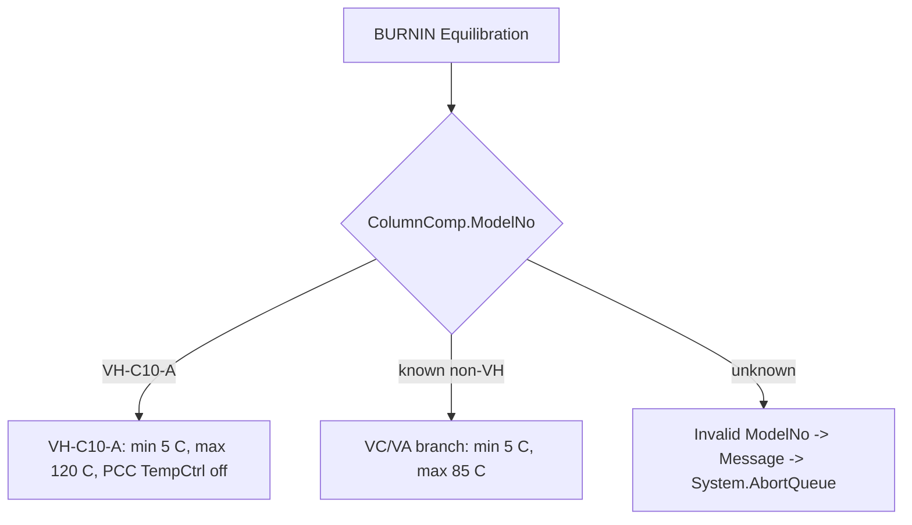

# TCC BurnIn Black Box Decomposition

Extraction date: 2026-07-10

Scope: TCC FOQ `VTCC_BurnIn` injection for `VH-C10-A`, `VC-C10-A`, and
`VA-C10-A`.

---
Test name: VTCC BurnIn
Models: VH-C10-A / VC-C10-A / VA-C10-A
Status: first black-box decomposition complete; exact TD duration/cycle
acceptance wording remains open verification
---

This document decomposes the `VTCC_BurnIn` injection as a generation contract.
BurnIn is a conditioning and stress-history method, not a report-formula-heavy
result test. Its purpose is to exercise the column compartment and temperature
sensor system through high/low/high thermal cycles before downstream precision,
accuracy, stability, and timing tests.

```text
Core method:
  start near 15 C
  acquire internal, debug, external thermometer, environment, and leak channels
  heat to model-dependent maximum
  cool to model-dependent minimum
  heat to maximum again
  hold at high temperature for 7200 s
  abort if external thermometers do not follow the heating behavior
```

The method records no RetTimes and has no DB field mapping in
`FOQResultLocations_V2.83.xls`. Its value is preconditioning and evidence that
the configured thermal/external thermometer setup is plausible.

## Evidence Sources

| Evidence | Source |
|---|---|
| Test intent node | `cmbx_data_explorer/docs/TCC_TEST_KNOWLEDGE_NODE_MODEL.md` |
| Injection workbench notes | `cmbx_data_explorer/docs/TCC_INJECTION_BY_INJECTION_REVERSE_WORKBENCH.md` |
| Required symbols | `cmbx_data_explorer/docs/TCC_REQUIRED_SYMBOL_MANIFEST.md` |
| Method flow, VH | `knowledge_base/tcc_reverse_probe/VH/6000001/BURNIN_embedded_method_flow.txt` |
| Method flow, VC | `knowledge_base/tcc_reverse_probe/VC/3000004/BURNIN_embedded_method_flow.txt` |
| Method flow, VA | `knowledge_base/tcc_reverse_probe/VA/0000003/BURNIN_embedded_method_flow.txt` |
| DB mapping | `foq/FOQResultLocations_V2.83.xls` |

## Executive Answer

1. The injection is `VTCC_BurnIn`.
2. The instrument method is `BURNIN`.
3. Processing method is `NO_INTEGRATION` for VA/VC/VH.
4. VH/VC/VA decoded flows are materially the same; the method itself branches
   internally using `ColumnComp.ModelNo`.
5. VH uses `Variables.GenericDouble1 = 5.0` and
   `Variables.GenericDouble2 = 120.0`.
6. VC/VA use `Variables.GenericDouble1 = 5.0` and
   `Variables.GenericDouble2 = 85.0`.
7. Initial nominal temperature is 15.0 C.
8. The leak sensor is turned off during BurnIn to avoid condensation-triggered
   alarms during fast heat/cool behavior.
9. Internal/debug channels, external thermometers, environment temperature, and
   leak board channels are acquired.
10. Trigger names are `T_Maximum`, `T_Minimum`, and `HoldTemp`.
11. Final high-temperature hold is `Delay 7200.0`.
12. The method aborts if external thermometer signals fail to track CC heating
    within the guard expression.

## Contract 1: Method Command

### 1.1 Device Branch Binding

| Device | Injection | Instrument Method | Processing Method | Report Template | Report Sheets | Status |
|---|---|---|---|---|---|---|
| VH-C10-A | `VTCC_BurnIn` | `BURNIN` | `NO_INTEGRATION` | `Report_VTCC_V2_12` | not mapped | sequence evidence closed |
| VC-C10-A | `VTCC_BurnIn` | `BURNIN` | `NO_INTEGRATION` | `Report_VTCC_V2_12` | not mapped | sequence evidence closed |
| VA-C10-A | `VTCC_BurnIn` | `BURNIN` | `NO_INTEGRATION` | `Report_VATCC_V1_01` | not mapped | sequence evidence closed |

### 1.2 Method Contract Summary

| Contract item | Evidence |
|---|---|
| RetTimes | not used |
| DB fields | not mapped |
| Start setpoint | `ColumnComp.CC.Temperature.Nominal = 15.0` |
| Ready window | `ColumnComp.CC.ReadyTempDelta = 3.0 C`, `ColumnComp.CC.EquilibrationTime = 0.5` |
| Temperature control | `ColumnComp.CC.TempCtrl = On` |
| PCC branch | `ColumnComp.CmdString Cmd="PCC.TempCtrl=0"` when `ColumnComp.ModelNo="VH-C10-A"` |
| Mode | `ColumnComp.CC.Mode = StillAir` |
| Cycle counter | `Variables.GenericFloat1 = 0`, then `GenericFloat1 = GenericFloat1 + 1` |
| VH range | min `5.0`, max `120.0` |
| VC/VA range | min `5.0`, max `85.0` |
| Unknown model behavior | message `Invalid ModelNo!` and `System.AbortQueue` |
| Leak alarm prevention | `ColumnComp.LiquidLeakSensor = Off` |
| High trigger | `System.Trigger "T_Maximum"` |
| Low trigger | `System.Trigger "T_Minimum"` |
| Cycle completion trigger | `System.Trigger "HoldTemp", Variables.GenericFloat1=2` |
| Final hold | `Delay 7200.0` |
| External thermometer guard | abort when external thermometer values do not track CC heating |

### 1.3 Model Branch



### 1.4 Thermal Cycle Flow

```yaml
BURNIN:
  setup:
    - set ReadyTempDelta: 3.0 C
    - set EquilibrationTime: 0.5
    - set TempCtrl: On
    - set CC mode: StillAir
    - set LiquidLeakSensor: Off
    - set initial nominal: 15.0 C
  inject_preparation:
    - Wait CC.TempReady
  start_run:
    - acquire internal CC temperature/debug channels
    - acquire external thermometer channels
    - acquire environment temperature
    - acquire LEDBoard leak channels
  run:
    - set nominal: maximum temperature
    - trigger T_Maximum when CC temperature reaches maximum - 0.5 C
    - set nominal: minimum temperature
    - trigger T_Minimum when CC temperature reaches minimum + 5.0 C
    - set nominal: maximum temperature
    - increment Variables.GenericFloat1
    - trigger HoldTemp when GenericFloat1 = 2
    - set nominal: maximum temperature
    - Delay 7200.0
    - acquisition off
    - End
    - external thermometer guard may abort queue
```

### 1.5 Acquired Channels

| Channel family | Channels |
|---|---|
| Main CC | `ColumnComp.CC_Temp`, `ColumnComp.CC_U_Temp_Actual`, `ColumnComp.CC_L_Temp_Actual`, `ColumnComp.CC_UCTL_TempRear_Actual` |
| PWM/debug | `ColumnComp.PWM_CCU_A`, `ColumnComp.PWM_CCU_B`, `ColumnComp.PWM_CCL_A`, `ColumnComp.PWM_CCL_B` |
| Fan | `ColumnComp.Fan_Rear_ActualRPM` |
| External thermometers | `Thermometer1.ExtTemp_UpperCC`, `Thermometer1.ExtTemp_LowerCC` |
| Environment | `Thermometer.Environment_Temperature` |
| Leak board | `ColumnComp.LEDBoard_LeakDiff`, `ColumnComp.LEDBoard_A13`, `ColumnComp.LEDBoard_A14` |

Data collection rate is set to `20` for the internal/debug/leak board channels
listed in the setup block.

### 1.6 Abort Guard

The method contains a post-cycle external thermometer plausibility check. If the
CC temperature is more than 5 C above either external thermometer signal, it
forces the LED bar color, shows a message about thermometer mounting/config, and
aborts the queue.

```text
CC.Temperature.Value - Thermometer1.ExtTemp_LowerCC.Signal > 5
OR
CC.Temperature.Value - Thermometer1.ExtTemp_UpperCC > 5
```

This is a configuration sanity check. It does not make BurnIn a report-value
calculation, but it is important for later tests because downstream temperature
methods assume the external thermometers are mounted and configured correctly.

## Contract 2: Processing Method

| Device | Processing Method | Meaning |
|---|---|---|
| VH-C10-A | `NO_INTEGRATION` | No integration or IRC processing. |
| VC-C10-A | `NO_INTEGRATION` | No integration or IRC processing. |
| VA-C10-A | `NO_INTEGRATION` | No integration or IRC processing. |

There is no BurnIn-specific IRC path. The method itself handles model branching,
triggering, and abort guard behavior.

## Contract 3: Report Formula

No direct report sheet or DB field is mapped for `VTCC_BurnIn` in the current
TCC contract. The report role is conditioning/audit evidence, not scalar result
calculation.

| Report item | Status |
|---|---|
| Report sheets | not mapped in TKN / DB mapping |
| Formula ID | `FORMULA_NOT_REQUIRED_TCC_BURNIN_CONDITIONING` |
| Direct formula objects | none required for DB contract |
| Workbook-derived result | not expected |

## Contract 4: DB Contract

| DB contract item | Status |
|---|---|
| Device-specific mapped DB fields | none observed |
| SQL type | not applicable |
| Precision/display rule | not applicable |

Current conclusion: `VTCC_BurnIn` has no DB output contract. It influences later
tests by creating a thermal history and validating thermometer behavior.

## Contract 5: Config Requirement

| Requirement | Why it matters |
|---|---|
| `ColumnComp.CC` temperature control available | Required for high/low/high cycling. |
| `ColumnComp.ModelNo` available | Selects 120 C vs 85 C high-limit branch and aborts if unknown. |
| PCC command path for VH | VH branch disables PCC control through `PCC.TempCtrl=0`. |
| External thermometers configured as real channels | Abort guard checks whether external thermometer signals rise with CC temperature. |
| Debug/internal channels available | Method acquires PWM, fan, rear temperature, leak board channels. |
| Leak sensor command available | BurnIn disables leak sensor during fast thermal cycling. |
| Long run duration acceptable | Method includes `Delay 7200.0`; scheduling/runtime must allow this conditioning period. |

## Contract 6: Open Verification

The items below are `Open Verification Required` before using BurnIn as a
parameterized generation template rather than a cloned method.

| # | Open item | Current evidence | Needed evidence | Likely source |
|---|---|---|---|---|
| 1 | Exact TD acceptance / duration wording | Method shows 7200 s high hold and trigger cycle logic | FOQ TD section wording for required BurnIn duration/cycles | FOQ TD |
| 2 | Whether `GenericFloat1=2` means two completed high-temperature events or another CM trigger nuance | Decoded flow increments once in visible Run sequence and trigger has Limit=1 | CM trigger execution semantics for repeated trigger blocks | Chromeleon method editor/help |
| 3 | Whether external thermometer abort guard should execute after `End` in all CM runtimes | Decoded flow lists `End` before the guard block | Runtime semantics of post-End method nodes | CM execution behavior |
| 4 | Whether single-test generated packages can omit BurnIn | Workbench says omit only if definition allows skipping preconditioning | User intent / TD requirement | intent tool rule |

## VH / VC / VA Comparison

| Model | Min | Max | PCC command | Processing | DB mapping | Meaning |
|---|---:|---:|---|---|---|---|
| VH-C10-A | 5 C | 120 C | `PCC.TempCtrl=0` | `NO_INTEGRATION` | none | high-temperature VH conditioning |
| VC-C10-A | 5 C | 85 C | not active unless ModelNo branch matches VH | `NO_INTEGRATION` | none | standard VC conditioning |
| VA-C10-A | 5 C | 85 C | not active unless ModelNo branch matches VH | `NO_INTEGRATION` | none | standard VA conditioning |

## Generation Readiness

| Use case | Readiness | Notes |
|---|---|---|
| Clone/select full FOQ package | reusable | Keep before calibration/accuracy/precision family. |
| Generate single Accuracy 40 C method | optional / usually omit | Omitting changes preconditioning assumptions; intent tool must surface this. |
| Generate stress/conditioning-only method | partial | Core flow known; trigger-cycle semantics and post-End guard need live verification before parameterized rewriting. |
| DB upload/result output | not applicable | No mapped DB result contract. |
