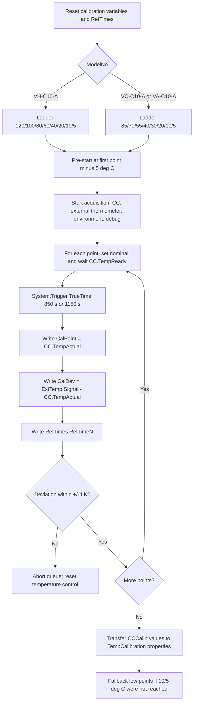
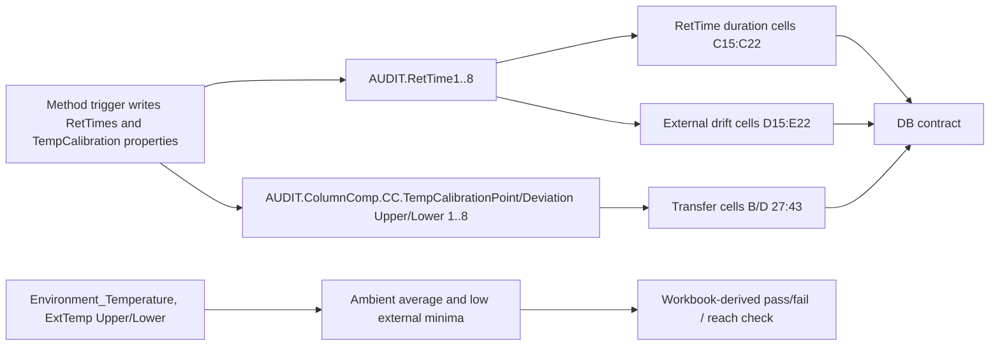
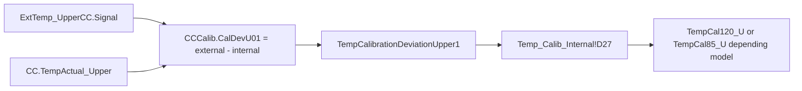

# TCC Temperature Calibration Black Box Decomposition

Extraction date: 2026-07-10

Scope: TCC FOQ Temperature Calibration for `VH-C10-A`, `VC-C10-A`, and `VA-C10-A`.

---
测试名称: Temperature Calibration
型号: VH-C10-A / VC-C10-A / VA-C10-A
状态: 已完成第一轮黑盒拆解，processing method business rows remain open verification
---

This document decomposes the Temperature Calibration test as a generation contract. It follows the same contract style as `TCC_ACCURACY_BLACK_BOX_DECOMPOSITION.md`, but the key distinction is important:

```text
Temperature Accuracy validates the controlled temperature.
Temperature Calibration changes the instrument's internal calibration variables.
```

The calibration method writes calibration point/deviation values into `ColumnComp.CC.TempCalibration...` audit/device properties. The report then checks that those values were transferred and that the low-temperature reach condition is acceptable.

## Evidence Sources

| Evidence | Source |
|---|---|
| Test intent node | `cmbx_data_explorer/docs/TCC_TEST_KNOWLEDGE_NODE_MODEL.md` |
| FOQ TD extracted text | `knowledge_base/foq_td_extracted/FOQ_Testdescription_VX-C10-A.text.txt` |
| Decoded method flow, VH | `knowledge_base/tcc_reverse_probe/VH/6000001/TEMPERATURE_CALIBRATION_embedded_method_flow.txt` |
| Decoded method flow, VC | `knowledge_base/tcc_reverse_probe/VC/3000004/TEMPERATURE_CALIBRATION_embedded_method_flow.txt` |
| Decoded method flow, VA | `knowledge_base/tcc_reverse_probe/VA/0000003/TEMPERATURE_CALIBRATION_embedded_method_flow.txt` |
| Method contract summary | `knowledge_base/tcc_method_contracts/*_method_contracts.tsv` |
| Processing method probe | `knowledge_base/tcc_processing_probe/*/*CORRECT_ACCURACY_INJ_INSERTION*_summary.txt`, `NO_INTEGRATION_summary.txt`, and `knowledge_base/tcc_processing_probe/README.md` |
| Report formula objects | `knowledge_base/tcc_report_formula_objects_vh_6000001_all_sheets.tsv` |
| Formula reverse notes | `cmbx_data_explorer/CM_FORMULA_REVERSE_ENGINEERING.md` |
| DB mapping | `foq/FOQResultLocations_V2.83.xls` |

## Executive Answer

1. Temperature Calibration uses eight calibration setpoints. `VH-C10-A` uses `120, 100, 80, 60, 40, 20, 10, 5 deg C`; `VC-C10-A` and `VA-C10-A` use `85, 70, 55, 40, 30, 20, 10, 5 deg C`.
2. It depends on both internal CC sensors and external calibrated thermometers. The method calculates deviation as `ExtTemp_UpperCC.Signal-CC.TempActual_Upper` and `ExtTemp_LowerCC.Signal-CC.TempActual_Lower`, then writes those values into `CCCalib.CalDevU/Lxx` and finally into `ColumnComp.CC.TempCalibrationDeviationUpper/LowerN`.
3. RetTimes are not used the same way as Accuracy. Accuracy RetTimes anchor stable external averaging windows; Calibration RetTimes mark when each calibration trigger fires and the internal/external calibration values are captured.
4. `VH-C10-A` and `VC-C10-A` sequence rows bind `Temperature Calibration` to `CORRECT_ACCURACY_INJ_INSERTION`; `VA-C10-A` binds it to `NO_INTEGRATION`. The current processing XML extractor exposes layout/context and comments, but not the full SST/IRC action rows, so exact pass-action behavior remains open verification.
5. The report sheet `Temp_Calib_Internal` reads calibration point/deviation audit properties, RetTime durations, external thermometer drift windows, environment temperature, and low external temperature minima. DB fields map mostly to `D27:D43`, `C15:C22`, `D15:D22`, and `E15:E22`.
6. Calibration is a practical prerequisite for later temperature tests because it updates the TCC internal upper/lower calibration variables. The FOQ TD explicitly says large calibration deviations abort and require repeated calibration or repair.

## Contract 1: Method Command

### 1.1 Test Intent

Temperature Calibration calibrates the internal upper and lower column-compartment temperature sensors with external calibrated thermometers at model-specific setpoints.

The FOQ TD states that the calibration parameter is determined for upper and lower compartments individually by comparing internal sensor readings with external calibrated thermometer readings. The decoded CMBX method implements this as:

```text
Upper deviation = ExtTemp_UpperCC.Signal - CC.TempActual_Upper
Lower deviation = ExtTemp_LowerCC.Signal - CC.TempActual_Lower
```

### 1.2 Method Binding

| Model | Injection | Instrument method | Method stages |
|---|---|---|---|
| `VH-C10-A` | `Temperature Calibration` | `TEMPERATURE_CALIBRATION` | `InstrumentSetup`, `Equilibration`, `StartRun`, `Run`, `StopRun` |
| `VC-C10-A` | `Temperature Calibration` | `TEMPERATURE_CALIBRATION` | `InstrumentSetup`, `Equilibration`, `StartRun`, `Run`, `StopRun` |
| `VA-C10-A` | `Temperature Calibration` | `TEMPERATURE_CALIBRATION` | `InstrumentSetup`, `Equilibration`, `StartRun`, `Run`, `StopRun` |

### 1.3 Global Setup

The decoded method initializes readiness, temperature control, acquisition, calibration values, and RetTimes.

| Area | Evidence | Meaning |
|---|---|---|
| Ready threshold | `ColumnComp.CC.ReadyTempDelta = 0.3 [deg C]` | Calibration trigger readiness threshold |
| Ready time | `ColumnComp.CC.EquilibrationTime = 0.1 [min]` | Initial ready timing |
| Temperature control | `ColumnComp.CC.TempCtrl = On` | Enables CC temperature control |
| VH PCC branch | `ColumnComp.CmdString Cmd="PCC.TempCtrl=0"` when `ColumnComp.ModelNo="VH-C10-A"` | Disables PCC temp control for VH calibration |
| Air mode | `ColumnComp.CC.Mode = StillAir` | Sets compartment operating mode |
| Leak sensor | `ColumnComp.LiquidLeakSensor = Off` | Avoids leak false alarms during large temperature swings |
| Calibration points reset | `ColumnComp.CC.TempCalibrationPointUpper1..10 = Off` and lower equivalents | Clears active calibration transfer slots before the run |
| Work variables reset | `CCCalib.CalPointU01..08`, `CalDevU01..08`, `CalPointL01..08`, `CalDevL01..08 = 0` | Clears generated calibration values |
| RetTime reset | `RetTimes.RetTime1..RetTime8 = 0` | Clears all calibration trigger anchors |

### 1.4 Model-Dependent Temperature Ladder

The method fills `Variables.GenericDouble0..8`. `GenericDouble0` is the pre-start temperature used to ensure the first trigger condition is initially false; `GenericDouble1..8` are the actual calibration points.

| Model branch | Pre-start `GenericDouble0` | Point 1 | Point 2 | Point 3 | Point 4 | Point 5 | Point 6 | Point 7 | Point 8 |
|---|---:|---:|---:|---:|---:|---:|---:|---:|---:|
| `VH-C10-A` | 115 | 120 | 100 | 80 | 60 | 40 | 20 | 10 | 5 |
| `VC-C10-A` / `VA-C10-A` | 80 | 85 | 70 | 55 | 40 | 30 | 20 | 10 | 5 |

The method sets `Variables.GenericBool0 = 1` for VH and `0` for VC/VA. The exact downstream use of `GenericBool0` in report/workbook logic is not fully decoded, but it is part of the method contract and appears in method coverage.

### 1.5 Acquisition Channels

The method turns on these key channels in `StartRun`.

| Channel | Role |
|---|---|
| `ColumnComp.CC_Temp` | Main CC temperature signal, used by report `chm.signalValue(...)` |
| `ColumnComp.CC_U_Temp_Actual` | Internal upper actual temperature evidence |
| `ColumnComp.CC_L_Temp_Actual` | Internal lower actual temperature evidence |
| `ColumnComp.CC_UCTL_TempRear_Actual` | Rear/control temperature debug evidence |
| `Thermometer1.ExtTemp_UpperCC` | External upper thermometer, used in calibration deviation and drift |
| `Thermometer1.ExtTemp_LowerCC` | External lower thermometer, used in calibration deviation and drift |
| `Thermometer.Environment_Temperature` | Ambient/environment reference, used by report |
| PWM/fan/leak debug channels | Operational evidence and diagnostic context |

### 1.6 Per-Point Trigger Logic

For each calibration point the method:

1. Sets `ColumnComp.CC.Temperature.Nominal` to the model-specific `Variables.GenericDoubleN`.
2. Waits for `ColumnComp.CC.TempReady`.
3. Runs a `System.Trigger` with point-specific `TrueTime`.
4. Captures internal upper/lower actual temperatures into `CCCalib.CalPointU/Lxx`.
5. Computes deviations using external minus internal temperature.
6. Writes `RetTimes.RetTimeN = System.Retention`.
7. Aborts if any captured deviation is outside the `-4 K` to `+4 K` range.

| Point | VH target | VC/VA target | Trigger name | Trigger true time | Captured RetTime | Calibration values |
|---|---:|---:|---|---:|---|---|
| 1 | 120 | 85 | `T120/85` | 850 s | `RetTimes.RetTime1` | `CCCalib.CalPointU01`, `CalDevU01`, `CalPointL01`, `CalDevL01` |
| 2 | 100 | 70 | `T100/70` | 850 s | `RetTimes.RetTime2` | `CCCalib.CalPointU02`, `CalDevU02`, `CalPointL02`, `CalDevL02` |
| 3 | 80 | 55 | `T80/55` | 850 s | `RetTimes.RetTime3` | `CCCalib.CalPointU03`, `CalDevU03`, `CalPointL03`, `CalDevL03` |
| 4 | 60 | 40 | `T60/40` | 850 s | `RetTimes.RetTime4` | `CCCalib.CalPointU04`, `CalDevU04`, `CalPointL04`, `CalDevL04` |
| 5 | 40 | 30 | `T40/30` | 1150 s | `RetTimes.RetTime5` | `CCCalib.CalPointU05`, `CalDevU05`, `CalPointL05`, `CalDevL05` |
| 6 | 20 | 20 | `T20` | 850 s | `RetTimes.RetTime6` | `CCCalib.CalPointU06`, `CalDevU06`, `CalPointL06`, `CalDevL06` |
| 7 | 10 | 10 | `T10` | 850 s | `RetTimes.RetTime7` | `CCCalib.CalPointU07`, `CalDevU07`, `CalPointL07`, `CalDevL07` |
| 8 | 5 | 5 | `T05` | 850 s | `RetTimes.RetTime8` | `CCCalib.CalPointU08`, `CalDevU08`, `CalPointL08`, `CalDevL08` |

The point-5 true time is longer. The FOQ TD explains this as 1150 s for `40 deg C` on VH or `30 deg C` on VC/VA.

### 1.7 Calibration Transfer and Fallback

After successful capture, the method transfers work variables into device calibration properties:

```text
ColumnComp.CC.TempCalibrationPointUpper1..8 = CCCalib.CalPointU01..08
ColumnComp.CC.TempCalibrationDeviationUpper1..8 = CCCalib.CalDevU01..08
ColumnComp.CC.TempCalibrationPointLower1..8 = CCCalib.CalPointL01..08
ColumnComp.CC.TempCalibrationDeviationLower1..8 = CCCalib.CalDevL01..08
```

The decoded flow includes a fallback block for missing 5 or 10 deg C triggers, most likely at high ambient temperature:

```text
If calibration points 1..6 exist:
  transfer points 1..6
Else:
  abort: "Column oven could not be calibrated at 20 deg C or higher."

If point 7 is missing:
  set point 7 to 10 deg C and reuse the 20 deg C deviation.

If point 8 is missing:
  set point 8 to 5 deg C and reuse the 20 deg C deviation.
```

This matches the FOQ TD statement that when low calibration setpoints cannot be measured directly, the 20 deg C calibration parameter is used because the below-20 deg C relationship is non-linear and should not be extrapolated.

### 1.8 Method Flow Diagram



## Contract 2: Processing Method

### 2.1 Sequence Binding

| Model | Injection | Processing method | Observed meaning |
|---|---|---|---|
| `VH-C10-A` | `Temperature Calibration` | `CORRECT_ACCURACY_INJ_INSERTION` | Context links Calibration and Accuracy; integration inhibited |
| `VC-C10-A` | `Temperature Calibration` | `CORRECT_ACCURACY_INJ_INSERTION` | Context links Calibration and Accuracy; integration inhibited |
| `VA-C10-A` | `Temperature Calibration` | `NO_INTEGRATION` | No data integration; no observed correction-insertion binding on this row |

The `CORRECT_ACCURACY_INJ_INSERTION` summary contains readable context:

```text
Temperature Accuracy_H
ACCURACY_IRC_STOP_H
TEMPERATURE_ACCURACY
...
Temperature Calibration
CORRECT_ACCURACY_INJ_INSERTION
TEMPERATURE_CALIBRATION
Inhibits the integration for all channels
```

### 2.2 Processing Interpretation

The TD gives explicit IRC design intent for `CORRECT_ACCURACY_INJ_INSERTION`.
This is now stronger than a pure CMBX context guess, but it is still not the
same thing as decoding every serialized processing-method action row from the
CMBX payload.

TD-backed expected behavior:

| Item | TD-backed value |
|---|---|
| Source injection | `Temperature Calibration` |
| Processing method | `CORRECT_ACCURACY_INJ_INSERTION` |
| Branch variable | `Variables.GenericBool0` |
| Variable producer | Instrument method `TEMPERATURE_CALIBRATION` |
| VH branch | `GenericBool0 = 1` |
| VC/VA branch | `GenericBool0 = 0` |
| Pass criterion | `GenericBool0 = 1` |
| Pass action | `Insert Injection` |
| Pass inserted injection | `Temperature Accuracy_H` |
| Fail action | `Insert Injection` |
| Fail inserted injection | `Temperature Accuracy_C` |
| Additional sequence | `FOQ_VX-C10_V2_00_AdditionalInjections` |
| Site/config note | Injection assignment must be reassigned when the main sequence template changes at Zollner. |

Current evidence status:

| Statement | Status |
|---|---|
| `CORRECT_ACCURACY_INJ_INSERTION` is associated with `Temperature Calibration` in VH/VC sequence rows. | Verified |
| The processing method inhibits integration for all channels. | Verified from readable comment |
| The processing method is connected to accuracy/correction injection context. | Verified as sequence-context evidence |
| TD says pass/fail inserts `Temperature Accuracy_H/C` from the additional sequence using `GenericBool0`. | Verified from FOQ TD text |
| Current XML inspector sees `SSTGrid` columns but empty `Controls` / zero business row candidates. | Verified as layout-only evidence |
| The exact serialized CMBX pass-action row for this logic is decoded by the current extractor. | Open Verification Required |
| `VA-C10-A` Calibration uses `NO_INTEGRATION` in TKN/sequence evidence. | Verified |

Generation implication:

```text
For cloning an existing FOQ flow, preserve the processing method payload as-is.
For generating a new method package, the intended IRC behavior is now known from
TD, but the serialized CM action-row format still needs manual CM confirmation
or deeper processing-method decoding before claiming runnable generation.
```

## Contract 3: Report Formula

### 3.1 Report Binding

| Model | Report template | Sheet | Role |
|---|---|---|---|
| `VH-C10-A` | `Report_VTCC_V2_12` | `Temp_Calib_Internal` | Calibration report / internal diagnostic sheet |
| `VC-C10-A` | `Report_VTCC_V2_12` | `Temp_Calib_Internal` | Calibration report / internal diagnostic sheet |
| `VA-C10-A` | `Report_VATCC_V1_01` | `Temp_Calib_Internal` | Calibration report / internal diagnostic sheet |

### 3.2 Formula Families

The report formula objects from `Report_VTCC_V2_12` show the following formula families.

| Cell family | Formula pattern | Fixed channel | Meaning |
|---|---|---|---|
| `B15:B21` | `chm.signalValue(AUDIT.RetTimeN(1,"forward"))` | `CC_Temp` | CC temperature signal at RetTime1..7 |
| `J14` | `chm.signalValue(AUDIT.RetTime8(1,"forward")-1)` | `CC_Temp` | CC temperature signal near RetTime8 path |
| `C15:C21` | `AUDIT.RetTimeN - AUDIT.RetTime(N-1)` | none | Duration between calibration triggers; `C15` is absolute RetTime1 |
| `J15` | `AUDIT.RetTime8 - AUDIT.RetTime7` | none | RetTime8 duration |
| `D15:D21` | `chm.drift(AUDIT.RetTimeN-0.5,AUDIT.RetTimeN)` | `ExtTemp_UpperCC` | External upper thermometer drift over final 0.5 min before RetTime1..7 |
| `J16` | `chm.drift(AUDIT.RetTime8-0.5,AUDIT.RetTime8)` | `ExtTemp_UpperCC` | External upper drift before RetTime8 |
| `E15:E21` | same drift pattern | `ExtTemp_LowerCC` | External lower thermometer drift over final 0.5 min before RetTime1..7 |
| `J17` | same drift pattern | `ExtTemp_LowerCC` | External lower drift before RetTime8 |
| `B27:B34` | `audit.ColumnComp.CC.TempCalibrationPointUpperN(1000,"backward")` | mostly none / first object has `ExtTemp_UpperCC` fixed channel artifact | Upper calibration point transferred to device |
| `D27:D34` | `audit.ColumnComp.CC.TempCalibrationDeviationUpperN(1000,"backward")` | none | Upper calibration deviation transferred to device |
| `B36:B43` | `audit.ColumnComp.CC.TempCalibrationPointLowerN(1000,"backward")` | none | Lower calibration point transferred to device |
| `D36:D43` | `audit.ColumnComp.CC.TempCalibrationDeviationLowerN(1000,"backward")` | none | Lower calibration deviation transferred to device |
| `C45` | `chm.sig_value("average")` | `Environment_Temperature` | Average ambient/environment temperature |
| `K45` | `chm.sig_value("min")` | `ExtTemp_UpperCC` | Minimum external upper temperature across the run |
| `K46` | `chm.sig_value("min")` | `ExtTemp_LowerCC` | Minimum external lower temperature across the run |

### 3.3 Formula Meaning

Temperature Calibration report evaluation has three layers:

1. **Trigger timing evidence**: RetTimes and RetTime deltas prove each calibration point was reached and held for the expected trigger window.
2. **External stability evidence**: external upper/lower drift in the final half minute before each RetTime checks the reference thermometer behavior around each transfer.
3. **Transfer evidence**: audit reads of `TempCalibrationPoint...` and `TempCalibrationDeviation...` prove the method actually transferred calibration values into the TCC calibration properties.

The FOQ TD adds a low-temperature reach rule:

```text
The report passes calibration only if the lowest external measured compartment temperatures
are either 5.0 deg C or lower, or 18 deg C below ambient.
If the 5 deg C point was not skipped but deviations were positive, those deviations are
subtracted from the lowest external measured temperatures for this reach check.
```

Open verification: the workbook-derived pass/fail formula for that low-temperature reach rule is not fully normalized into a reusable formula ID yet. The direct SheetObject formulas above are verified.

### 3.4 Report Formula Flow



## Contract 4: DB Contract

### 4.1 VH-C10-A DB Mapping

| Field family | DB fields | Report cells | Source meaning |
|---|---|---|---|
| Calibration deviation, upper | `TempCal120_U`, `TempCal100_U`, `TempCal80_U`, `TempCal60_U`, `TempCal40_U`, `TempCal20_U`, `TempCal10_U`, `TempCal5_U` | `D27:D34` | `TempCalibrationDeviationUpper1..8` |
| Calibration deviation, lower | `TempCal120_L`, `TempCal100_L`, `TempCal80_L`, `TempCal60_L`, `TempCal40_L`, `TempCal20_L`, `TempCal10_L`, `TempCal5_L` | `D36:D43` | `TempCalibrationDeviationLower1..8` |
| Time between points | `TimeCal120`, `TimeCal100`, `TimeCal80`, `TimeCal60`, `TimeCal40`, `TimeCal20`, `TimeCal10`, `TimeCal05` | `C15:C22` | RetTime1 absolute and RetTime deltas through RetTime8 |
| External upper drift | `Slope_Cal120_U`, `Slope_Cal100_U`, `Slope_Cal80_U`, `Slope_Cal60_U`, `Slope_Cal40_U`, `Slope_Cal20_U`, `Slope_Cal10_U`, `Slope_Cal05_U` | `D15:D22` | `ExtTemp_UpperCC` drift windows |
| External lower drift | `Slope_Cal120_L`, `Slope_Cal100_L`, `Slope_Cal80_L`, `Slope_Cal60_L`, `Slope_Cal40_L`, `Slope_Cal20_L`, `Slope_Cal10_L`, `Slope_Cal05_L` | `E15:E22` | `ExtTemp_LowerCC` drift windows |

### 4.2 VC-C10-A / VA-C10-A DB Mapping

| Field family | DB fields | Report cells | Source meaning |
|---|---|---|---|
| Calibration deviation, upper | `TempCal85_U`, `TempCal70_U`, `TempCal55_U`, `TempCal40_U`, `TempCal30_U`, `TempCal20_U`, `TempCal10_U`, `TempCal5_U` | `D27:D34` | `TempCalibrationDeviationUpper1..8` |
| Calibration deviation, lower | `TempCal85_L`, `TempCal70_L`, `TempCal55_L`, `TempCal40_L`, `TempCal30_L`, `TempCal20_L`, `TempCal10_L`, `TempCal5_L` | `D36:D43` | `TempCalibrationDeviationLower1..8` |
| Time between points | `TimeCal85`, `TimeCal70`, `TimeCal55`, `TimeCal40`, `TimeCal30`, `TimeCal20`, `TimeCal10`, `TimeCal05` | `C15:C22` | RetTime1 absolute and RetTime deltas through RetTime8 |
| External upper drift | `Slope_Cal85_U`, `Slope_Cal70_U`, `Slope_Cal55_U`, `Slope_Cal40_U`, `Slope_Cal30_U`, `Slope_Cal20_U`, `Slope_Cal10_U`, `Slope_Cal05_U` | `D15:D22` | `ExtTemp_UpperCC` drift windows |
| External lower drift | `Slope_Cal85_L`, `Slope_Cal70_L`, `Slope_Cal55_L`, `Slope_Cal40_L`, `Slope_Cal30_L`, `Slope_Cal20_L`, `Slope_Cal10_L`, `Slope_Cal05_L` | `E15:E22` | `ExtTemp_LowerCC` drift windows |

### 4.3 DB Contract Interpretation

The `TempCal...` DB fields are deviation values, not the calibration point setpoints. For example:

```text
VH TempCal120_U -> Temp_Calib_Internal!D27
D27 -> audit.ColumnComp.CC.TempCalibrationDeviationUpper1(1000,"backward")
method writes TempCalibrationDeviationUpper1 from CCCalib.CalDevU01
CCCalib.CalDevU01 = ExtTemp_UpperCC.Signal - CC.TempActual_Upper
```

That is the critical source chain for upload validation:



### 4.4 Verified Display Precision

The exported VTCC workbook `Temperature Calibration.xls` provides number-format
evidence for the report-visible and DB-bound calibration values:

| Cell family | Example cell | Exported raw value | Workbook number format | Display / DB contract |
|---|---|---:|---|---|
| Adjusted/calibration point temperatures | `B27`, `B36` | `120.0`, `119.99` | `0.00` | Display to 2 decimals. |
| Calibration deviations | `D27`, `D36` | `-0.02`, `0.56` | `0.00` | Display to 2 decimals. |
| Time between calibration points | `C15` | `16.387` | `0.00" min"` | Display to 2 decimals with min unit. |
| External thermometer drift/slope | `D15`, `E15` | `0.014507...`, `0.008085...` | `0.000` | Display to 3 decimals. |
| Ambient average | `C45` | `23.600000...` | `0.00` | Display to 2 decimals. |
| Low-temperature helper cells | `K45`, `K46` | `4.24`, `4.79` | `General` | Helper cells for reach logic; not primary DB fields. |

Generation implication:

```text
TempCal... deviation fields should follow the report-visible 2-decimal
contract. TimeCal... fields display to 2 decimals with min unit. Slope_Cal...
fields display to 3 decimals. Raw workbook values may retain binary tails, but
DB/review output should follow the report display contract for these fields.
```

## Contract 5: Config Requirement

| Requirement | Required for | Evidence / reason |
|---|---|---|
| `ColumnComp` with `CC` temperature control | All models | Method sets `ColumnComp.CC.TempCtrl`, `Temperature.Nominal`, `TempReady`, actual upper/lower properties |
| External calibrated thermometers configured as `Thermometer1.ExtTemp_UpperCC` and `Thermometer1.ExtTemp_LowerCC` | All models | Method uses external signal minus internal actual temperature for calibration deviations |
| Environment thermometer channel `Thermometer.Environment_Temperature` | All models | Report reads ambient average; FOQ low-temperature reach rule uses ambient relationship |
| Debug/acquisition channels available | All models | Method starts CC, PWM, fan, leak/debug channels; report requires at least temperature/external channels for formulas |
| VH PCC command symbol | `VH-C10-A` | Method sends `PCC.TempCtrl=0` through `ColumnComp.CmdString` for VH |
| Calibration write access to `ColumnComp.CC.TempCalibrationPoint/Deviation...` | All models | Method transfers calibration values into device calibration properties |
| Valid ambient/thermal setup | All models | FOQ TD allows fallback for 10/5 deg C only under high ambient; low-temperature reach is report-checked |
| Processing method payload preservation | VH/VC first-phase clone/generation | `CORRECT_ACCURACY_INJ_INSERTION` business rows not fully decoded |

## Contract 6: Open Verification

### 6.1 Resolved by TD / Workbook Evidence

| Topic | Resolved evidence | Remaining boundary |
|---|---|---|
| Whether VH/VC Calibration automatically inserts Accuracy or only binds correction context | FOQ TD states that `CORRECT_ACCURACY_INJ_INSERTION` uses `Variables.GenericBool0`; pass inserts `Temperature Accuracy_H`, fail inserts `Temperature Accuracy_C` from `FOQ_VX-C10_V2_00_AdditionalInjections`. | The serialized CM processing-method action-row format is still not decoded. |
| Display precision for Calibration DB fields | Exported `Temperature Calibration.xls` number formats show calibration points/deviations and ambient values as `0.00`, time cells as `0.00" min"`, and slope cells as `0.000`. | Static FormulaOne tokens remain open only for binary-equivalent template regeneration. |
| VA `Report_VATCC_V1_01` Calibration sheet parity | Real VA `0000003.cmbx` report XML confirms `Temp_Calib_Internal` is active and applies to `Temperature Calibration`; it exposes the same direct formula-object family, including `B15:B21` CC values, `C15:C21` RetTime deltas, and `D15:D18` / following external thermometer drift cells. | Workbook-derived low-temperature reach pass/fail remains a separate FormulaOne extraction target. |

### 6.2 Remaining Open Verification

| # | Uncertain point | Current evidence | Needed evidence | Likely source |
|---|---|---|---|---|
| 1 | Exact `CORRECT_ACCURACY_INJ_INSERTION` pass-action / insertion rule | Sequence context and comment are visible, but XML payload mostly exposes UI layout | Decode Processing Method SST/IRC rows or inspect in CM UI | `.procmeth` embedded XML, CM processing method editor |
| 2 | Workbook-derived pass/fail formula for low-temperature reach | TD describes rule; direct cells `C45`, `K45`, `K46` are known | FormulaOne workbook extraction for pass/fail cells around `Temp_Calib_Internal` | Report `SpreadSheetData` |
| 3 | `Variables.GenericBool0` downstream role beyond the TD-confirmed branch selector | TD explains its processing-method branch use; any report/workbook use remains unproven | Workbook or method branch reference that consumes it outside the confirmed branch selector | decoded method/report workbook |

## VH / VC / VA Comparison

| Topic | `VH-C10-A` | `VC-C10-A` | `VA-C10-A` |
|---|---|---|---|
| Calibration ladder | 120/100/80/60/40/20/10/5 | 85/70/55/40/30/20/10/5 | 85/70/55/40/30/20/10/5 |
| Pre-start temperature | 115 deg C | 80 deg C | 80 deg C |
| Point with 1150 s true time | 40 deg C | 30 deg C | 30 deg C |
| Processing method | `CORRECT_ACCURACY_INJ_INSERTION` | `CORRECT_ACCURACY_INJ_INSERTION` | `NO_INTEGRATION` |
| Report template | `Report_VTCC_V2_12` | `Report_VTCC_V2_12` | `Report_VATCC_V1_01` |
| DB high fields | `TempCal120`, `TempCal100`, `TempCal80`, `TempCal60` | `TempCal85`, `TempCal70`, `TempCal55`, `TempCal40` | `TempCal85`, `TempCal70`, `TempCal55`, `TempCal40` |
| VH-only behavior | Disables PCC temp control | Not applicable | Not applicable |

## Dependency and Generation Notes

### Relationship to Later Tests

Temperature Calibration is upstream of later temperature tests because it writes the module calibration variables that make internal upper/lower CC temperature signals meaningful.

| Later test | Dependency interpretation |
|---|---|
| Temperature Accuracy | Validates the corrected temperature behavior after Calibration; VH/VC processing context ties Calibration and Accuracy together |
| Temperature Stability | Uses corrected thermal control and external thermometer evidence; depends on trustworthy calibration state |
| Temperature Precision | Uses external thermometer repeatability at repeated setpoints; calibration state affects CC control quality |
| HeatUp / CoolDown | Uses CC readiness and RetTimes during thermal transitions; calibration affects readiness/control correctness |
| PCC, VH-only | Separate PCC channel, but same module environment and VH branch configuration matter |

### Generation Rules

For a future generated Calibration method:

1. Use model source of truth `AUDIT.ColumnComp.ModelNo`; do not infer model from filename.
2. Select ladder by `ModelNo` exactly.
3. Initialize and clear all `CCCalib` and `RetTimes.RetTime1..8`.
4. Acquire external upper/lower thermometer channels throughout the run.
5. Calculate deviation from external calibrated thermometer minus internal actual CC temperature.
6. Abort if any calibration deviation is outside `-4 K` to `+4 K`.
7. Transfer calibration points/deviations into `ColumnComp.CC.TempCalibrationPoint/DeviationUpper/Lower1..8`.
8. Preserve `CORRECT_ACCURACY_INJ_INSERTION` processing payload for VH/VC until its pass-action row format is decoded.
9. Use `Temp_Calib_Internal` report mapping and model-specific DB field family.

### Minimum Answer Checklist

| Question | Answer |
|---|---|
| Temperature Calibration 的温度阶梯是什么？ | VH: 120/100/80/60/40/20/10/5; VC/VA: 85/70/55/40/30/20/10/5 |
| VH / VC / VA 是否有差异？ | Yes: ladder, pre-start temperature, point-5 true time target, processing method, report template |
| Calibration 是否依赖外部温度计？ | Yes. It uses external upper/lower thermometer signal minus internal upper/lower CC actual temperature to calculate calibration deviations. |
| RetTime 锚定逻辑是否与 Accuracy 相同？ | No. Calibration RetTimes anchor trigger/capture moments for calibration transfer and report timing/drift checks; Accuracy RetTimes anchor external averaging windows for observed temperature. |
| Processing Method 是什么？ | VH/VC: `CORRECT_ACCURACY_INJ_INSERTION`; VA: `NO_INTEGRATION`. Exact insertion/pass action remains open verification. |
| Report 公式和 DB 字段映射是什么？ | `Temp_Calib_Internal`: deviations `D27:D43`, times `C15:C22`, slopes `D15:E22`, calibration points `B27:B43`, ambient/min cells `C45/K45/K46`. |
| Calibration 与后续测试的依赖是什么？ | It updates CC calibration variables and is therefore upstream of Accuracy, Stability, Precision, and thermal transition tests. |
