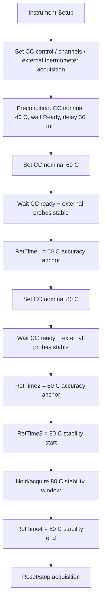

# TCC Custom Method Script Candidate

Skill: `cm-method-script-author`

Date: 2026-07-14

Intent:

```text
温度准确性测试，从40度开始，稳定30分钟后上升到60度，在60度测试准确性，
然后再测80度准确性，在80度同时测稳定性。
```

Correction status:

```text
2026-07-14 review: The original candidate contained two authoring errors.
1. A 30 minute precondition was duplicated as `Delay 30 [min]`; this is wrong.
   The 30 minute hold belongs to the `Equilibration` stage duration.
2. The 60C/80C Accuracy points were reduced to simple wait/RetTime rows; this is
   incomplete. Accuracy requires the full external-temperature stability trigger
   and counter mechanism before RetTime emission.
```

## 1. Intent Interpretation

Assumed device model: `VH-C10-A`.

Operational meaning:

1. Use the TCC temperature-accuracy mechanism as the primary method family.
2. Precondition the column compartment at `40 C` for `30 min` through the
   `Equilibration` stage duration; do not encode this as a simple `Delay 30`.
3. Ramp to `60 C`; after controller readiness and external thermometer stability, log an accuracy RetTime.
4. Ramp to `80 C`; after controller readiness and external thermometer stability, log a second accuracy RetTime.
5. Continue holding/acquiring at `80 C` for a stability window so a redesigned report can calculate stability at 80 C.

This is not the stock `TEMPERATURE_ACCURACY` ladder. It is a composite custom method derived from:

- `TEMPERATURE_ACCURACY` for external thermometer readiness, accuracy RetTime anchors, channel acquisition, and cleanup.
- `TEMPERATURE_STABILITY_AND_PCC_70_H` for the long-hold stability concept and report-window warning.

## 2. Evidence Used

| Evidence | Path |
|---|---|
| Accuracy method script | `C:\ProgramData\CMBX Data Explorer Workspace\KB\CMBX Method Scripts\TCC\knowledge_base\tcc_reverse_probe\VH\6000001\TEMPERATURE_ACCURACY_embedded_method_flow.tsv` |
| Stability/PCC method script | `C:\ProgramData\CMBX Data Explorer Workspace\KB\CMBX Method Scripts\TCC\knowledge_base\tcc_reverse_probe\VH\6000001\TEMPERATURE_STABILITY_AND_PCC_70_H_embedded_method_flow.tsv` |
| Accuracy black-box KB | `cmbx_data_explorer/docs/TCC_ACCURACY_BLACK_BOX_DECOMPOSITION.md` |
| Stability black-box KB | `cmbx_data_explorer/docs/TCC_STABILITY_BLACK_BOX_DECOMPOSITION.md` |
| Method rendering contract | `cmbx_data_explorer/docs/CM_METHOD_RENDERING_CONTRACT.md` |
| Method role map | `cmbx_data_explorer/docs/TCC_METHOD_ROLE_MAP.json` |

## 3. Configuration Checklist

| Requirement | Why |
|---|---|
| `ColumnComp` configured as `VH-C10-A` | Device branch and command symbols rely on VH TCC config. |
| `Thermometer1.ExtTemp_UpperCC` and `Thermometer1.ExtTemp_LowerCC` configured | Accuracy uses external thermometer raw channels. |
| `Thermometer.Environment_Temperature` configured | Existing Accuracy method acquires environment temperature. |
| CC debug channels available | Existing method acquires CC actual/PWM/fan/leak diagnostic channels. |
| `RetTimes.RetTime1..RetTime4` available | Custom report should use RetTime1=60C accuracy, RetTime2=80C accuracy, RetTime3/4=80C stability window. |
| Report template redesigned | Existing VH accuracy DB fields are 20/40/80/120; `60 C` and custom 80C stability window are not closed by stock report. |

## 4. CM Mechanism Plan



## 5. Method Script Candidate

This is a custom method candidate, not yet a copy-paste runnable CM method.
Rows labeled as external stability trigger logic must be expanded from the
verified stock `TEMPERATURE_ACCURACY` method. The earlier simplified
`Wait + RetTime` representation is invalid for a completed Accuracy point.

| # | Kind | Time | Command | Value | Comment |
|---:|---|---|---|---|---|
| 0 | Stage | `{Initial Time}` | Instrument Setup |  | Custom TCC accuracy plus 80C stability candidate |
| 1 | Comment |  | `========================================` |  |  |
| 2 | Comment |  | `Custom: 40C baseline -> 60C accuracy -> 80C accuracy + 80C stability` |  |  |
| 3 | Comment |  | `Derived from TEMPERATURE_ACCURACY and TEMPERATURE_STABILITY_AND_PCC_70_H evidence` |  |  |
| 4 | Stage | `-30.000` | Equilibration | `Duration = 30.000 [min]` | 40C precondition hold |
| 5 | Branch | If |  | `ColumnComp.ModelNo="VH-C10-A"` | VH branch only in this candidate |
| 6 | Command |  | `Variables.GenericLong9` | `12` | Preserve VH report/page variable evidence |
| 7 | Command |  | `Delay` | `1` | Keep source method validation delay |
| 8 | Command |  | `Log` | `GenericLong9` | Preserve source method audit evidence |
| 9 | Branch | Else |  |  |  |
| 10 | Command |  | `Message` | `"Invalid ModelNo! Please reinspect in production!"` |  |
| 11 | Command |  | `System.AbortQueue` |  |  |
| 12 | Branch | End If |  |  |  |
| 13 | Command |  | `ColumnComp.CC.ReadyTempDelta` | `1.0 [C]` | Source setup broad ready delta |
| 14 | Command |  | `ColumnComp.CC.EquilibrationTime` | `0.5 [min]` | Source setup equilibration time |
| 15 | Command |  | `ColumnComp.CC.TempCtrl` | `On` | Enable CC temperature control |
| 16 | Branch | If |  | `ColumnComp.ModelNo="VH-C10-A"` | VH PCC control off during CC accuracy |
| 17 | Command |  | `ColumnComp.CmdString` | `Cmd="PCC.TempCtrl=0"` | Source accuracy VH branch |
| 18 | Branch | Else |  |  |  |
| 19 | Command |  | `ColumnComp.CC.Mode` | `StillAir` | Source accuracy mode |
| 20 | Branch | End If |  |  |  |
| 21 | Command |  | `ColumnComp.LiquidLeakSensor` | `Off` | Avoid false leak alarms during temperature changes |
| 22 | Command |  | `ColumnComp.CC_U_Temp_Actual.Data_Collection_Rate` | `20` | Source debug/acquisition rate |
| 23 | Command |  | `ColumnComp.CC_L_Temp_Actual.Data_Collection_Rate` | `20` | Source debug/acquisition rate |
| 24 | Command |  | `ColumnComp.CC_UCTL_TempRear_Actual.Data_Collection_Rate` | `20` | Source debug/acquisition rate |
| 25 | Command |  | `Thermometer1.ExtTemp_UpperCC.Data_Collection_Rate` | `20` | Required external reference |
| 26 | Command |  | `Thermometer1.ExtTemp_LowerCC.Data_Collection_Rate` | `20` | Required external reference |
| 27 | Command |  | `RetTimes.RetTime1` | `0` | 60C accuracy anchor |
| 28 | Command |  | `RetTimes.RetTime2` | `0` | 80C accuracy anchor |
| 29 | Command |  | `RetTimes.RetTime3` | `0` | 80C stability start |
| 30 | Command |  | `RetTimes.RetTime4` | `0` | 80C stability end |
| 31 | Command |  | `StabVars.TriggerStab1` | `0` | External stability gate reset |
| 32 | Command |  | `StabVars.TriggerStab2` | `0` | External stability gate reset |
| 33 | Command |  | `ColumnComp.CC.Temperature.Nominal` | `40.0 [C]` | Baseline/precondition target |
| 34 | Command |  | `Wait` | `ColumnComp.CC.TempReady` | Wait until baseline controller ready |
| 35 | Comment |  | `40C precondition duration is the Equilibration stage Duration = 30.000 [min]. Do not add Delay 30 here.` |  | Corrected timing contract |
| 36 | Stage | `0.000` | StartRun |  | Start acquisition before measurement targets |
| 37 | Command |  | `ColumnComp.CC_Temp.AcqOn` |  | Source accuracy acquisition |
| 38 | Command |  | `ColumnComp.CC_U_Temp_Actual.AcqOn` |  | Source accuracy acquisition |
| 39 | Command |  | `ColumnComp.CC_L_Temp_Actual.AcqOn` |  | Source accuracy acquisition |
| 40 | Command |  | `ColumnComp.CC_UCTL_TempRear_Actual.AcqOn` |  | Source accuracy acquisition |
| 41 | Command |  | `ColumnComp.PWM_CCU_A.AcqOn` |  | Source accuracy acquisition |
| 42 | Command |  | `ColumnComp.PWM_CCU_B.AcqOn` |  | Source accuracy acquisition |
| 43 | Command |  | `ColumnComp.PWM_CCL_A.AcqOn` |  | Source accuracy acquisition |
| 44 | Command |  | `ColumnComp.PWM_CCL_B.AcqOn` |  | Source accuracy acquisition |
| 45 | Command |  | `ColumnComp.Fan_Rear_ActualRPM.AcqOn` |  | Source accuracy acquisition |
| 46 | Command |  | `Thermometer1.ExtTemp_UpperCC.AcqOn` |  | External reference |
| 47 | Command |  | `Thermometer1.ExtTemp_LowerCC.AcqOn` |  | External reference |
| 48 | Command |  | `Thermometer.Environment_Temperature.AcqOn` |  | Source accuracy acquisition |
| 49 | Command |  | `ColumnComp.LEDBoard_LeakDiff.AcqOn` |  | Source accuracy acquisition |
| 50 | Command |  | `ColumnComp.LEDBoard_A13.AcqOn` |  | Source accuracy acquisition |
| 51 | Command |  | `ColumnComp.LEDBoard_A14.AcqOn` |  | Source accuracy acquisition |
| 52 | Command |  | `ColumnComp.Oven_Gas_MuteTimeRemain.AcqOn` |  | Source accuracy acquisition |
| 53 | Stage | `0.000` | Run |  | Custom measurement sequence |
| 54 | Command |  | `ColumnComp.CC.ReadyTempDelta` | `0.2 [C]` | Source accuracy tighter ready delta |
| 55 | Command |  | `ColumnComp.CC.EquilibrationTime` | `3 [min]` | Source accuracy stability behavior |
| 56 | Comment |  | `Insert/keep the full external stability trigger state machine from stock TEMPERATURE_ACCURACY rows 106-172: Gradient_1, Gradient_2, ExitRange_Upper, ExitRange_Lower, Abort.` |  | Required before any Accuracy RetTime |
| 57 | Comment |  | `60C Accuracy point macro begins: set target, start Gradient_1/2 state machine once, wait CC ready + lower/upper external ready, then write RetTime.` |  | Do not collapse to RetTime-only |
| 58 | Command |  | `ColumnComp.CC.Temperature.Nominal` | `60.0 [C]` | First requested accuracy target |
| 59 | Command |  | `Delay` | `60` | Source transition wait semantics; not the 30 min precondition |
| 60 | Command |  | `StabVars.TriggerStab1` | `1` | Start alternating Gradient_1/Gradient_2 external stability state machine |
| 61 | Command |  | `Wait` | `ColumnComp.CC.TempReady AND StabVars.LowerReady AND StabVars.UpperReady, Run=Continue` | Valid only with trigger block active |
| 62 | Command |  | `RetTimes.RetTime1` | `System.Retention` | 60C accuracy anchor |
| 63 | Comment |  | `80C Accuracy point macro begins: set next target; the already-defined Gradient_1/Gradient_2 state machine continues and ExitRange resets readiness when the temperature leaves the old band.` |  | Do not restart by blind TriggerStab replacement |
| 64 | Command |  | `ColumnComp.CC.Temperature.Nominal` | `80.0 [C]` | Second requested accuracy target and stability hold |
| 65 | Command |  | `Delay` | `60` | Source transition wait semantics |
| 66 | Comment |  | `No blind re-start of TriggerStab1 here. Preserve stock loop behavior unless evidence shows the loop was stopped.` |  | Guardrail |
| 67 | Command |  | `Wait` | `ColumnComp.CC.TempReady AND StabVars.LowerReady AND StabVars.UpperReady, Run=Continue` | Valid only with Gradient_1/2 loop active |
| 68 | Command |  | `RetTimes.RetTime2` | `System.Retention` | 80C accuracy anchor |
| 69 | Command |  | `RetTimes.RetTime3` | `System.Retention` | Start of custom 80C stability window |
| 70 | Comment |  | `Dynamic timing warning: because RetTime2 is reached after an unknown readiness/stability wait, the 80C stability window cannot end at a fixed absolute Run time such as 60.000.` |  | Do not use fixed StopRun time here |
| 71 | Comment |  | `Required design choice: implement a CM-supported relative hold after RetTime3, or split 80C stability into a separate injection/method whose run time starts after 80C readiness.` |  | Open verification required |
| 72 | Comment |  | `RetTimes.RetTime4 must be written after the chosen relative 80C stability window, not at a hard-coded absolute method time.` |  | Stability window anchor |
| 73 | Command |  | `ColumnComp.CC.Temperature.Nominal` | `20.0 [C]` | Source final reset target |
| 74 | Command |  | `StabVars.TriggerStab1` | `0` | Stop external stability trigger logic |
| 75 | Command |  | `StabVars.TriggerStab2` | `0` | Stop external stability trigger logic |
| 76 | Command |  | `Delay` | `2` | Source cleanup delay |
| 77 | Command |  | `ColumnComp.CC_Temp.AcqOff` |  | Cleanup |
| 78 | Command |  | `ColumnComp.CC_U_Temp_Actual.AcqOff` |  | Cleanup |
| 79 | Command |  | `ColumnComp.CC_L_Temp_Actual.AcqOff` |  | Cleanup |
| 80 | Command |  | `ColumnComp.CC_UCTL_TempRear_Actual.AcqOff` |  | Cleanup |
| 81 | Command |  | `ColumnComp.PWM_CCU_A.AcqOff` |  | Cleanup |
| 82 | Command |  | `ColumnComp.PWM_CCU_B.AcqOff` |  | Cleanup |
| 83 | Command |  | `ColumnComp.PWM_CCL_A.AcqOff` |  | Cleanup |
| 84 | Command |  | `ColumnComp.PWM_CCL_B.AcqOff` |  | Cleanup |
| 85 | Command |  | `ColumnComp.Fan_Rear_ActualRPM.AcqOff` |  | Cleanup |
| 86 | Command |  | `Thermometer1.ExtTemp_UpperCC.AcqOff` |  | Cleanup |
| 87 | Command |  | `Thermometer1.ExtTemp_LowerCC.AcqOff` |  | Cleanup |
| 88 | Command |  | `Thermometer.Environment_Temperature.AcqOff` |  | Cleanup |
| 89 | Command |  | `ColumnComp.LEDBoard_LeakDiff.AcqOff` |  | Cleanup |
| 90 | Command |  | `ColumnComp.LEDBoard_A13.AcqOff` |  | Cleanup |
| 91 | Command |  | `ColumnComp.LEDBoard_A14.AcqOff` |  | Cleanup |
| 92 | Command |  | `ColumnComp.Oven_Gas_MuteTimeRemain.AcqOff` |  | Cleanup |
| 93 | End |  | `End` |  |  |

## 6. Report Constraints

| Requested output | Existing VH report status | Required action |
|---|---|---|
| `60 C` accuracy | Blocked for stock VH DB/report: VH stock fields are `TempAcc20`, `TempAcc40`, `TempAcc80`, `TempAcc120` in current contract evidence. | Add/modify report cell and DB field/formula mapping for a 60 C accuracy anchor. |
| `80 C` accuracy | Conceptually supported by stock VH field `TempAcc80`, but RetTime remapping changes from stock ladder position. | Verify report formula can bind to the custom `RetTime2` anchor, or adjust report formula. |
| `80 C` stability | Blocked for stock stability report if it assumes fixed 70 C and fixed 45..60 min absolute windows. | Add custom stability cells using `RetTime3..RetTime4` or a clear 80C absolute window. |

## 7. Open Verification Required

| Item | Why it is unresolved | Evidence needed |
|---|---|---|
| Exact external stability trigger block | The candidate references the verified stock trigger mechanism but does not inline every trigger row. | Copy `TEMPERATURE_ACCURACY` rows that define `Gradient_1`, `Gradient_2`, upper/lower exit range, counters, and readiness flags. |
| Long-duration timing representation | Source rows use stage duration/time axis for long holds and short numeric `Delay` commands for local waits. | Confirm exact CM authoring representation for any non-stock long stability window before copy/paste. |
| Dynamic stability after Accuracy | Accuracy points finish after dynamic waits, so a later stability end cannot be hard-coded as an absolute time such as `60.000`. | Decide between a verified relative hold/trigger after `RetTime3` or a separate 80C stability injection. |
| Report formula for 60 C accuracy | Existing VH report/DB contract does not include 60 C as mapped accuracy point. | Report template edit and DB mapping update. |
| Stability duration/window at 80 C | User requested simultaneous stability but did not state whether to use stock 45..60 min logic or a new duration. | Confirm desired stability acceptance/report window. |
