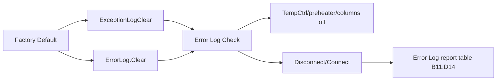

# TCC Error Log Check Black Box Decomposition

Extraction date: 2026-07-10

Scope: TCC FOQ `Error Log Check` injection for `VH-C10-A`, `VC-C10-A`, and
`VA-C10-A`.

---
Test name: Error Log Check
Models: VH-C10-A / VC-C10-A / VA-C10-A
Status: method command and report-table endpoint decomposed; exact pass/fail
criteria remain open verification
---

This document decomposes the `Error Log Check` injection as a generation
contract. It is a final safe-state and audit-table endpoint, not a raw
calculation test. It follows Factory Default, which clears error/exception logs,
and reconnects the device so the final report can expose the final audit/error
log state.

```text
Report evidence:
  Report sheet = Error Log
  Object type = ReportTableObject
  Cell range = B11:D14
  Data source = audittrail
```

No RetTimes, raw channels, or mapped FOQ DB fields are expected for this
injection. The main generation value is its cleanup/safe-state behavior and its
role as the last audit/error-log review point in the TCC FOQ sequence.

## Evidence Sources

| Evidence | Source |
|---|---|
| Test intent node | `cmbx_data_explorer/docs/TCC_TEST_KNOWLEDGE_NODE_MODEL.md` |
| Injection workbench notes | `cmbx_data_explorer/docs/TCC_INJECTION_BY_INJECTION_REVERSE_WORKBENCH.md` |
| Required symbols | `cmbx_data_explorer/docs/TCC_REQUIRED_SYMBOL_MANIFEST.md` |
| Method flow, VH | `knowledge_base/tcc_reverse_probe/VH/6000001/CHECKERRORLOG_embedded_method_flow.txt` |
| Method flow, VC | `knowledge_base/tcc_reverse_probe/VC/3000004/CHECKERRORLOG_embedded_method_flow.txt` |
| Method flow, VA | `knowledge_base/tcc_reverse_probe/VA/0000003/CHECKERRORLOG_embedded_method_flow.txt` |
| Report formula/table objects | `knowledge_base/tcc_report_formula_objects_vh_6000001_all_sheets.tsv` |
| DB mapping | `foq/FOQResultLocations_V2.83.xls` |

## Executive Answer

1. The instrument method is `CHECKERRORLOG`.
2. VH/VC method flows are identical.
3. VA has a smaller method flow: it only turns `ColumnComp.CC.TempCtrl` off and
   reconnects.
4. VH/VC turn both preheater controls off, turn CC temperature control off, and
   set Column A-D active state to `No`.
5. All branches run `ColumnComp.Disconnect` and `ColumnComp.Connect`.
6. No RetTimes are written.
7. No raw channels are acquired.
8. The report sheet is `Error Log`, and the extracted report object is a
   `ReportTableObject` over `B11:D14` with data source `audittrail`.
9. No DB output row is mapped in `FOQResultLocations_V2.83.xls`.
10. Generation should treat this as a final cleanup/audit review injection.

## Contract 1: Method Command

### 1.1 Device Branch Binding

| Device | Injection | Instrument Method | Processing Method | Report Template | Report Sheets | Status |
|---|---|---|---|---|---|---|
| VH-C10-A | `Error Log Check` | `CHECKERRORLOG` | `No_Integration` | `Report_VTCC_V2_12` | `Error Log`, `Internal Use` | sequence evidence closed |
| VC-C10-A | `Error Log Check` | `CHECKERRORLOG` | `CORRECT_ACCURACY_INJ_INSERTION` | `Report_VTCC_V2_12` | `Error Log`, `Internal Use` | sequence evidence closed |
| VA-C10-A | `Error Log Check` | `CHECKERRORLOG` | `No_Integration` | `Report_VATCC_V1_01` | `Error Log`, `Internal Use` | sequence evidence closed |

### 1.2 Method Contract Summary

| Contract item | VH-C10-A | VC-C10-A | VA-C10-A |
|---|---|---|---|
| RetTimes | not used | not used | not used |
| Raw channels | not used | not used | not used |
| Preheater right off | `ColumnComp.PrehtRight.TempCtrl = Off` | same | not present in decoded VA flow |
| Preheater left off | `ColumnComp.PrehtLeft.TempCtrl = Off` | same | not present in decoded VA flow |
| CC temperature control off | `ColumnComp.CC.TempCtrl = Off` | same | same |
| Column A-D active state reset | `Column_A/B/C/D.ActiveColumn = No` | same | not present in decoded VA flow |
| Reconnect cycle | `ColumnComp.Disconnect`, `ColumnComp.Connect` | same | same |

### 1.3 VH / VC Decoded Method Flow

```yaml
CHECKERRORLOG_VH_VC:
  InstrumentSetup:
    - SET ColumnComp.PrehtRight.TempCtrl = Off
    - SET ColumnComp.PrehtLeft.TempCtrl = Off
    - SET ColumnComp.CC.TempCtrl = Off
    - SET ColumnComp.Column_A.ActiveColumn = No
    - SET ColumnComp.Column_B.ActiveColumn = No
    - SET ColumnComp.Column_C.ActiveColumn = No
    - SET ColumnComp.Column_D.ActiveColumn = No
  Run:
    - RUN ColumnComp.Disconnect
    - RUN ColumnComp.Connect
```

### 1.4 VA Decoded Method Flow

```yaml
CHECKERRORLOG_VA:
  InstrumentSetup:
    - SET ColumnComp.CC.TempCtrl = Off
  Run:
    - RUN ColumnComp.Disconnect
    - RUN ColumnComp.Connect
```

### 1.5 Generation Meaning

This method is the final device-safe state after Factory Default. A full FOQ
sequence should keep it as the last injection. A single custom diagnostic
sequence may either include this final injection or include equivalent StopRun
cleanup commands, depending on whether the output needs a report-level Error
Log sheet.

## Contract 2: Processing Method

### 2.1 Binding

| Device | Processing Method | Meaning |
|---|---|---|
| VH-C10-A | `No_Integration` | No integration processing required. |
| VC-C10-A | `CORRECT_ACCURACY_INJ_INSERTION` | Corrective processing binding follows VC sequence pattern. |
| VA-C10-A | `No_Integration` | No integration processing required. |

### 2.2 IRC / Corrective Behavior

No Error-Log-specific IRC insertion was observed. VC keeps the same broader
`CORRECT_ACCURACY_INJ_INSERTION` branch as other late-sequence VC injections.
The error-log method itself has no RetTime or channel output that would drive a
correction.

## Contract 3: Report Formula

### 3.1 Report Table Evidence

| Report template | Sheet | Object type | Cell range | Data source |
|---|---|---|---|---|
| `Report_VTCC_V2_12` | `Error Log` | `ReportTableObject` | `B11:D14` | `audittrail` |

This is important: the `Error Log` sheet is not a
`ReportFormulaObject`-heavy calculation sheet. It renders audit/error-log rows.
Therefore, FormulaOne-style scalar cell formulas are not the primary contract.

### 3.2 Relationship To Factory Default



## Contract 4: DB Contract

| DB contract item | Status |
|---|---|
| `RES_ErrorLog` | listed as possible intent field in alignment, but not mapped in current TCC `FOQResultLocations_V2.83.xls` |
| Device-specific mapped DB fields | none observed |
| SQL type | not applicable |
| Precision/display rule | not applicable |

Current conclusion: there is no closed DB output contract for `Error Log Check`.
Its report contract is audit-table display, not DB field upload.

## Contract 5: Config Requirement

| Requirement | VH-C10-A | VC-C10-A | VA-C10-A | Why it matters |
|---|---|---|---|---|
| `ColumnComp.CC.TempCtrl` | required | required | required | Leaves main column compartment stopped. |
| `ColumnComp.PrehtRight.TempCtrl` | required | required | not used in decoded flow | VH/VC preheater cleanup. |
| `ColumnComp.PrehtLeft.TempCtrl` | required | required | not used in decoded flow | VH/VC preheater cleanup. |
| `ColumnComp.Column_A/B/C/D.ActiveColumn` | required | required | not used in decoded flow | VH/VC column activity cleanup. |
| `ColumnComp.Disconnect` / `Connect` | required | required | required | Refreshes connection/error-log context for final state. |
| Audit trail / error-log report support | required | required | required | Report sheet renders `audittrail`. |

## Contract 6: Open Verification

The items below are `Open Verification Required` before claiming a generated
Error Log report/check is fully equivalent to CM output.

| # | Open item | Current evidence | Needed evidence | Likely source |
|---|---|---|---|---|
| 1 | Exact pass/fail criterion for Error Log Check | Report object is an audit table, DB has no row | Human/report rule for what counts as clean error log | FOQ TD and report workbook layout |
| 2 | Whether VC processing pass action affects final late injections | VC uses `CORRECT_ACCURACY_INJ_INSERTION` | Processing-method pass-action decode | processing method XML |
| 3 | Whether VA should intentionally omit preheater/column cleanup | VA decoded flow omits those symbols | CM configuration / TD applicability confirmation | VA CMBX and TD |
| 4 | Whether a generated single-test package should include Error Log Check | Full FOQ needs it; single diagnostic may not | User intent and generation policy | intent tool rules |

## VH / VC / VA Comparison

| Model | Method flow | Processing branch | Report template | DB mapping | Meaning |
|---|---|---|---|---|---|
| VH-C10-A | full cleanup: preheater + CC + columns + reconnect | `No_Integration` | `Report_VTCC_V2_12` | none | final safe state and audit table |
| VC-C10-A | full cleanup: preheater + CC + columns + reconnect | `CORRECT_ACCURACY_INJ_INSERTION` | `Report_VTCC_V2_12` | none | same cleanup, corrective branch differs |
| VA-C10-A | reduced cleanup: CC + reconnect | `No_Integration` | `Report_VATCC_V1_01` | none | VA config lacks the same decoded preheater/column cleanup path |

## Generation Readiness

| Use case | Readiness | Notes |
|---|---|---|
| Clone/select full FOQ package | reusable | Keep as final injection after Factory Default. |
| Generate single functional test | optional cleanup | Prefer equivalent StopRun cleanup unless an Error Log report page is required. |
| Generate full report package | partial | Report table endpoint known; pass/fail criterion still open. |
| DB upload/result output | not applicable | No mapped DB output contract. |
