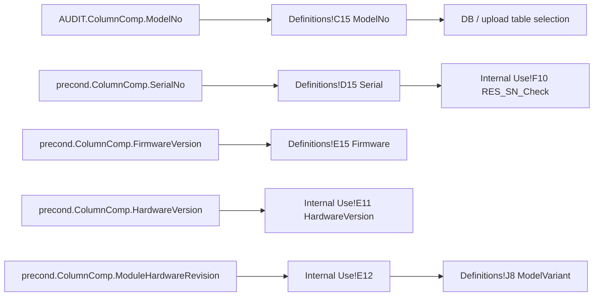

# TCC Factory Default Black Box Decomposition

Extraction date: 2026-07-10

Scope: TCC FOQ `Factory Default` injection for `VH-C10-A`, `VC-C10-A`, and
`VA-C10-A`.

---
Test name: Factory Default
Models: VH-C10-A / VC-C10-A / VA-C10-A
Status: method command and DB metadata contract closed; workbook-derived
`ModelVariant` / serial-check formulas still need FormulaOne-level verification
---

This document decomposes the `Factory Default` injection as a generation
contract. It is a final-state cleanup and metadata verification step. It does
not perform a raw measurement, but it mutates service/default state and supplies
the report/DB identity fields used to decide where a FOQ result belongs.

```text
Method evidence:
  disconnect/connect and wait ready
  enter service code
  disable qualification/service reminder intervals
  log qualification/service metadata
  clear exception/error logs and revision strings
  set final CC state: 20 C, TempCtrl Off, LiquidLeakSensor On
  prompt operator to verify valve covers and thermometer serial/location

Report / DB evidence:
  ModelNo = Definitions!C15 = AUDIT.ColumnComp.ModelNo
  Serial = Definitions!D15 = precond.ColumnComp.SerialNo
  Firmware = Definitions!E15 = precond.ColumnComp.FirmwareVersion
  HardwareVersion = Internal Use!E11 = precond.ColumnComp.HardwareVersion
  ModelVariant = Definitions!J8, workbook-derived from module hardware revision family
  RES_SN_Check = Internal Use!F10, workbook-derived serial/sequence check
```

Factory Default is therefore not interchangeable with a data test. It should be
included only when the requested method package needs full FOQ final cleanup and
database identity output.

## Evidence Sources

| Evidence | Source |
|---|---|
| Test intent node | `cmbx_data_explorer/docs/TCC_TEST_KNOWLEDGE_NODE_MODEL.md` |
| Injection workbench notes | `cmbx_data_explorer/docs/TCC_INJECTION_BY_INJECTION_REVERSE_WORKBENCH.md` |
| Method/report alignment | `cmbx_data_explorer/docs/TCC_METHOD_REPORT_ALIGNMENT.md` |
| Required symbols | `cmbx_data_explorer/docs/TCC_REQUIRED_SYMBOL_MANIFEST.md` |
| Formula reverse notes | `cmbx_data_explorer/CM_FORMULA_REVERSE_ENGINEERING.md` |
| Method flow, VH | `knowledge_base/tcc_reverse_probe/VH/6000001/FACTORYDEFAULT_embedded_method_flow.txt` |
| Method flow, VC | `knowledge_base/tcc_reverse_probe/VC/3000004/FACTORYDEFAULT_embedded_method_flow.txt` |
| Method flow, VA | `knowledge_base/tcc_reverse_probe/VA/0000003/FACTORYDEFAULT_embedded_method_flow.txt` |
| Report formula objects | `knowledge_base/tcc_report_formula_objects_vh_6000001_all_sheets.tsv` |
| DB mapping | `foq/FOQResultLocations_V2.83.xls` |

## Executive Answer

1. The instrument method is `FACTORYDEFAULT`.
2. VH/VC/VA decoded method flows are identical.
3. The method writes final service/default state and clears logs.
4. It records no RetTimes and starts no raw data channels.
5. It uses service-state commands such as `GetServiceCode`,
   `ServiceCode = 87794`, `ExceptionLogClear`, and `ErrorLog.Clear`.
6. It disables qualification/service reminder intervals and logs last date,
   operator, operating hours, and workload.
7. It sets final column compartment state to 20 C, temperature control off, and
   liquid leak sensor on.
8. It prompts the operator to verify valve covers and thermometer serial/location
   custom sequence variables.
9. DB fields for this injection are closed for VH/VC/VA in
   `FOQResultLocations_V2.83.xls`.
10. Device identification must use `AUDIT.ColumnComp.ModelNo`; do not infer the
    device from CMBX filename, folder, or sequence naming.

## Contract 1: Method Command

### 1.1 Device Branch Binding

| Device | Injection | Instrument Method | Processing Method | Report Template | Report Sheets | Status |
|---|---|---|---|---|---|---|
| VH-C10-A | `Factory Default` | `FACTORYDEFAULT` | `No_Integration` | `Report_VTCC_V2_12` | `Definitions`, `Internal Use`, `Factory Default` | sequence evidence closed |
| VC-C10-A | `Factory Default` | `FACTORYDEFAULT` | `CORRECT_ACCURACY_INJ_INSERTION` | `Report_VTCC_V2_12` | `Definitions`, `Internal Use`, `Factory Default` | sequence evidence closed |
| VA-C10-A | `Factory Default` | `FACTORYDEFAULT` | `No_Integration` | `Report_VATCC_V1_01` | `Definitions`, `Internal Use`, `Factory Default` | sequence evidence closed |

### 1.2 Method Contract Summary

| Contract item | Evidence |
|---|---|
| RetTimes | not used |
| Raw channels | not used |
| Connection cycle | `ColumnComp.Disconnect`, `ColumnComp.Connect`, `Wait ColumnComp.Ready` |
| Service access | `ColumnComp.GetServiceCode`, `ColumnComp.ServiceCode = 87794` |
| Qualification defaults | Qualification interval/warning/grace set to `None` |
| Service defaults | Service interval/warning set to `None` |
| Logged wellness values | Qualification last date/operator, service last date, operating hours, workload |
| Log cleanup | `ColumnComp.ExceptionLogClear`, `ColumnComp.CmdString Cmd="ErrorLog.Clear"` |
| Revision cleanup | `CC.ThermoUnitRevision=`, `ModuleRevision=` |
| Final temperature state | `ColumnComp.CC.Temperature.Nominal = 20.00 C`, `ColumnComp.CC.TempCtrl = Off` |
| Final leak sensor state | `ColumnComp.LiquidLeakSensor = On` |
| Operator prompts | valve covers and thermometer serial/location confirmation |

### 1.3 Decoded Method Flow

```yaml
FACTORYDEFAULT:
  InstrumentSetup:
    - comment: "Set predictive performance values and counters visible for the customer."
    - warning: "Do not run for SERVICE instruments."
  Run:
    - order: 1
      command: ColumnComp.Disconnect
      meaning: "Reset computer-control connection path before final service/default actions."
    - order: 2
      command: ColumnComp.Connect
    - order: 3
      command: Wait ColumnComp.Ready
    - order: 4
      command: ColumnComp.GetServiceCode
    - order: 5
      command: Delay 2
    - order: 6
      command: SET ColumnComp.ServiceCode = 87794
      meaning: "Enters the service-code state required by the following commands."
    - order: 7
      command: SET ColumnComp.ColumnComp_Wellness.Qualification.Interval = None
    - order: 8
      command: SET ColumnComp.ColumnComp_Wellness.Qualification.WarningPeriod = None
    - order: 9
      command: SET ColumnComp.ColumnComp_Wellness.Qualification.GracePeriod = None
    - order: 10
      command: Log ColumnComp_Wellness.Qualification.LastDate
    - order: 11
      command: Log ColumnComp_Wellness.Qualification.LastOperator
    - order: 12
      command: SET ColumnComp.ColumnComp_Wellness.Service.Interval = None
    - order: 13
      command: SET ColumnComp.ColumnComp_Wellness.Service.WarningPeriod = None
    - order: 14
      command: Log ColumnComp_Wellness.Service.LastDate
    - order: 15
      command: Log ColumnComp_Wellness.OperatingHours
    - order: 16
      command: Log ColumnComp.ColumnComp_Wellness.Workload_CC
    - order: 17
      command: ColumnComp.ExceptionLogClear
    - order: 18
      command: ColumnComp.CmdString Cmd="ErrorLog.Clear"
    - order: 19
      command: ColumnComp.CmdString Cmd="CC.ThermoUnitRevision="
    - order: 20
      command: Delay 3
    - order: 21
      command: ColumnComp.CmdString "ModuleRevision="
    - order: 22
      command: SET ColumnComp.CC.Temperature.Nominal = 20.00 C
    - order: 23
      command: SET ColumnComp.CC.TempCtrl = Off
    - order: 24
      command: SET ColumnComp.LiquidLeakSensor = On
    - order: 25
      command: ColumnComp.CmdString Cmd="LedBar.ForceColor=1"
    - order: 26
      command: Message
      text: "Please check, that no valves are installed any more, but the corresponding covers!"
    - order: 27
      command: Delay 2
    - order: 28
      command: Message
      text: "Please check if you have choosen the correct serial number of the thermometer and the location from the Custom Sequence Variable list"
    - order: 29
      command: ColumnComp.CmdString Cmd="LedBar.ForceColor=0"
```

### 1.4 Generation Meaning

Factory Default is a destructive/configuration-mutating finalization step. A
single-test generated CMBX should not include it by default. A full FOQ generated
package should include it near the end, after functional tests, because it
normalizes service/default state and provides the metadata contract for DB
upload.

## Contract 2: Processing Method

### 2.1 Binding

| Device | Processing Method | Meaning |
|---|---|---|
| VH-C10-A | `No_Integration` | No integration processing required. |
| VC-C10-A | `CORRECT_ACCURACY_INJ_INSERTION` | Corrective processing binding follows VC sequence pattern. |
| VA-C10-A | `No_Integration` | No integration processing required. |

### 2.2 IRC / Corrective Behavior

Factory Default itself does not emit RetTimes or raw signals and has no known
Factory-Default-specific IRC insertion rule. VC uses
`CORRECT_ACCURACY_INJ_INSERTION` as a sequence-level corrective-processing
binding; the exact pass-action side effect belongs to the broader processing
method black box.

## Contract 3: Report Formula

### 3.1 Direct Formula Object Evidence

| DB / report role | Report sheet | Cell | Formula / source |
|---|---|---|---|
| TimeBase | `Definitions` | `C6` | `seq.timebase` |
| TestDate / SubmitDate | `Definitions` | `C10` | `seq.update_time` |
| ModelNo | `Definitions` | `C15` | `AUDIT.ColumnComp.ModelNo` |
| Serial | `Definitions` | `D15` | `precond.ColumnComp.SerialNo` |
| Firmware | `Definitions` | `E15` | `precond.ColumnComp.FirmwareVersion` |
| HardwareVersion | `Internal Use` | `E11` | `precond.ColumnComp.HardwareVersion` |
| Firmware internal copy | `Internal Use` | `E9` | `precond.ColumnComp.FirmwareVersion` |
| Module hardware revision | `Internal Use` | `E12` | `precond.ColumnComp.ModuleHardwareRevision` |
| CC hardware version | `Internal Use` | `E13` | `precond.ColumnComp.cc.HardwareVersion` |
| PCC hardware version | `Internal Use` | `E14` | `precond.ColumnComp.pcc.HardwareVersion` |

### 3.2 Workbook-Derived Fields

| Field | Mapped report cell | Known source path | Status |
|---|---|---|---|
| `ModelVariant` | `Definitions!J8` | Internal Use / module hardware revision family; known reverse note says model variant is a two-digit code from `ModuleHardwareRevision` | Open Verification Required for exact FormulaOne cell formula |
| `RES_SN_Check` | `Internal Use!F10` | Serial-number check compares `ColumnComp.SerialNo` with sequence naming | Open Verification Required for exact FormulaOne comparison expression |

### 3.3 Formula Flow



Critical rule: `AUDIT.ColumnComp.ModelNo` is the device source of truth. It
drives report/DB branch selection and upload table alignment. A generated or
uploaded DB row must not use folder names, file names, or manual UI guesses as
the authoritative device.

## Contract 4: DB Contract

### 4.1 Verified Mapping

`FOQResultLocations_V2.83.xls` maps the same Factory Default fields for
`VH-C10-A`, `VC-C10-A`, and `VA-C10-A`:

| DB Field | Report file | Sheet | Cell | Source status |
|---|---|---|---|---|
| `TestDate` | `Factory Default.XLS` | `Definitions` | `C10` | direct formula object: `seq.update_time` |
| `Serial` | `Factory Default.XLS` | `Definitions` | `D15` | direct formula object: `precond.ColumnComp.SerialNo` |
| `TimeBase` | `Factory Default.XLS` | `Definitions` | `C6` | direct formula object: `seq.timebase` |
| `ModelNo` | `Factory Default.XLS` | `Definitions` | `C15` | direct formula object: `AUDIT.ColumnComp.ModelNo` |
| `ModelVariant` | `Factory Default.XLS` | `Definitions` | `J8` | workbook-derived; source family known, exact formula open |
| `HardwareVersion` | `Factory Default.XLS` | `Internal Use` | `E11` | direct formula object: `precond.ColumnComp.HardwareVersion` |
| `Firmware` | `Factory Default.XLS` | `Definitions` | `E15` | direct formula object: `precond.ColumnComp.FirmwareVersion` |
| `SubmitDate` | `Factory Default.XLS` | `Definitions` | `C10` | direct formula object: `seq.update_time` |
| `RES_SN_Check` | `Factory Default.XLS` | `Internal Use` | `F10` | workbook-derived serial/sequence check; exact formula open |

### 4.2 Data Type / Display Contract

| Field family | Expected value type | Notes |
|---|---|---|
| Date fields | date/time or Excel serial date depending export path | `seq.update_time` should be treated as report sequence update time, not CMBX package creation time. |
| Serial / ModelNo / Firmware / ModelVariant | text | Preserve leading zeros in `ModelVariant`. |
| HardwareVersion | text or numeric-like text depending DB schema | Existing upload logic treats known metadata fields as text where needed. |
| Result check | pass/fail text | `RES_SN_Check` is a workbook-derived comparison, not a raw method value. |

## Contract 5: Config Requirement

| Requirement | Why it matters |
|---|---|
| `ColumnComp` device present and connected | All commands target ColumnComp. |
| Service-code command path available | Required for `GetServiceCode` and `ServiceCode = 87794`. |
| Wellness properties available | Required to clear intervals and log dates/operator/workload. |
| Exception/error log commands available | Required for `ExceptionLogClear` and `ErrorLog.Clear`. |
| Precondition metadata available | Report/DB fields read `SerialNo`, firmware, hardware, and module revision from `precond.ColumnComp.*`. |
| Audit metadata available | `AUDIT.ColumnComp.ModelNo` is the device source of truth. |
| Custom sequence variables for thermometer serial/location | Operator prompt requires correct values selected before finalization. |
| Valve hardware state known | Operator must confirm valve covers/no valves after test completion. |

## Contract 6: Open Verification

| # | Open item | Current evidence | Needed evidence | Likely source |
|---|---|---|---|---|
| 1 | Exact FormulaOne formula for `Definitions!J8` ModelVariant | Direct source `Internal Use!E12 = ModuleHardwareRevision` known, DB maps `J8` | Workbook cell dependency from `J8` to `Internal Use!E12` and formatting rule | report `SpreadSheetData` / Excel export |
| 2 | Exact FormulaOne formula for `Internal Use!F10` RES_SN_Check | Reverse note says serial check compares `ColumnComp.SerialNo` with `seq.name` | Workbook comparison expression and pass/fail text | report `SpreadSheetData` |
| 3 | Whether `HardwareVersion` should be SQL float or text for every module table | DB schema examples vary by module; metadata fields can look numeric | Target table schema per TCC table | SQL Server metadata |
| 4 | Service-code safety for generated packages | Method contains `ServiceCode = 87794` and warning not to run on service instruments | Live CM/config policy for generated package execution | Chromeleon help / production SOP |
| 5 | VC processing-method side effect | VC binds `CORRECT_ACCURACY_INJ_INSERTION` | Pass-action decode | processing method XML |

## VH / VC / VA Comparison

| Model | Method flow | Processing branch | Report template | DB mapping | Meaning |
|---|---|---|---|---|---|
| VH-C10-A | same | `No_Integration` | `Report_VTCC_V2_12` | closed | final state + metadata |
| VC-C10-A | same | `CORRECT_ACCURACY_INJ_INSERTION` | `Report_VTCC_V2_12` | closed | same method, corrective processing branch differs |
| VA-C10-A | same | `No_Integration` | `Report_VATCC_V1_01` | closed | same final state + metadata, VA report template |

## Generation Readiness

| Use case | Readiness | Notes |
|---|---|---|
| Clone/select full FOQ package | reusable with caution | Preserve as final cleanup/metadata injection. |
| Generate single functional test, such as Accuracy 40 C | exclude by default | It mutates service/default state and is not required for a standalone measurement unless DB metadata output is requested. |
| Generate DB-ready full FOQ package | required | Provides metadata fields and device source-of-truth contract. |
| Generate metadata-only package | partial | Method/DB mapping clear; workbook-derived ModelVariant and SN check formulas still need final workbook verification. |

