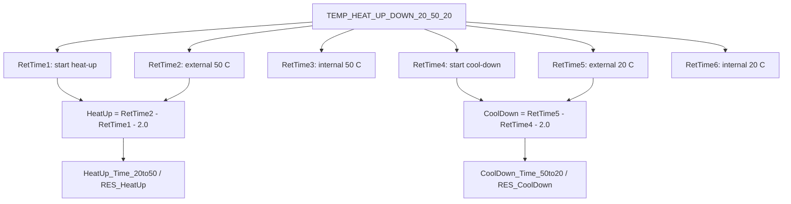
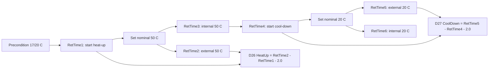

# TCC HeatUp and CoolDown Black Box Decomposition

Extraction date: 2026-07-10

Scope: TCC FOQ HeatUp and CoolDown Time for `VH-C10-A`, `VC-C10-A`, and `VA-C10-A`.

---
Test name: HeatUp and CoolDown
Models: VH-C10-A / VC-C10-A / VA-C10-A
Status: first black-box decomposition complete; row-65/row-66 workbook layout remains open verification
---

This document decomposes the HeatUp and CoolDown test as a generation contract.
The core of this test is RetTime event semantics:

```text
Heat-up performance = RetTime2 - RetTime1 - 2.0 min
Cool-down performance = RetTime5 - RetTime4 - 2.0 min
```

The `2.0 min` subtraction is not an arbitrary formatting correction. It removes
the stable-hold time that is intentionally included by the method triggers.

## Evidence Sources

| Evidence | Source |
|---|---|
| Test intent node | `cmbx_data_explorer/docs/TCC_TEST_KNOWLEDGE_NODE_MODEL.md` |
| FOQ TD extracted KB | `cmbx_data_explorer/docs/FOQ_TCC_VX_C10_A_TD_KNOWLEDGE_MANAGEMENT.md` |
| Injection workbench notes | `cmbx_data_explorer/docs/TCC_INJECTION_BY_INJECTION_REVERSE_WORKBENCH.md` |
| Method/report alignment | `cmbx_data_explorer/docs/TCC_METHOD_REPORT_ALIGNMENT.md` |
| Decoded method contract, VH | `knowledge_base/tcc_method_contracts/VH_6000001_TEMP_HEAT_UP_DOWN_20_50_20_contract.md` |
| Method flow, VH | `knowledge_base/tcc_reverse_probe/VH/6000001/TEMP_HEAT_UP_DOWN_20_50_20_embedded_method_flow.txt` |
| Method flow, VC | `knowledge_base/tcc_reverse_probe/VC/3000004/TEMP_HEAT_UP_DOWN_20_50_20_embedded_method_flow.txt` |
| Method flow, VA | `knowledge_base/tcc_reverse_probe/VA/0000003/TEMP_HEAT_UP_DOWN_20_50_20_embedded_method_flow.txt` |
| Report formula objects | `knowledge_base/tcc_report_formula_objects_vh_6000001_all_sheets.tsv` |
| Formula/evaluator rule | `cmbx_data_explorer/foq_alignment_catalog.py`, `cmbx_data_explorer/report_calculation_map.py`, `cmbx_data_explorer/CM_FORMULA_REVERSE_ENGINEERING.md` |
| DB mapping | `foq/FOQResultLocations_V2.83.xls` |

## Executive Answer

1. All three TCC variants use the same instrument method:
   `TEMP_HEAT_UP_DOWN_20_50_20`.
2. The method starts from a cold/preconditioned state, stabilizes near 20 C,
   heats to 50 C, then cools back to 20 C.
3. Both internal CC temperature and the external upper thermometer are used as
   guards. The exported workbook performance result uses the external upper
   thermometer RetTime anchors: `RetTime2` and `RetTime5`.
4. `RetTime1` is the start of heat-up after both external and internal 20 C
   readiness conditions are satisfied.
5. `RetTime2` is the external upper thermometer 50 C event after the required
   stable-hold period. The heat-up DB value is `RetTime2 - RetTime1 - 2.0`.
6. `RetTime4` is the start of cool-down after both 50 C conditions are
   satisfied.
7. `RetTime5` is the external upper thermometer 20 C event after the required
   stable-hold period. The cool-down DB value is `RetTime5 - RetTime4 - 2.0`.
8. The report sheet exposes both row-65 internal endpoint cells and row-66
   external endpoint cells. The verified workbook/evaluator/DB rule uses the
   row-66 external endpoint path.

## Contract 1: Method Command

### 1.1 Device Branch Binding

| Device | Injection | Instrument Method | Processing Method | Report Template | Report Sheets |
|---|---|---|---|---|---|
| VH-C10-A | `HeatUp and CoolDownTime` | `TEMP_HEAT_UP_DOWN_20_50_20` | `No_Integration` | `Report_VTCC_V2_12` | `HeatUp&CoolDown` |
| VC-C10-A | `HeatUp and CoolDownTime` | `TEMP_HEAT_UP_DOWN_20_50_20` | `CORRECT_ACCURACY_INJ_INSERTION` | `Report_VTCC_V2_12` | `HeatUp&CoolDown` |
| VA-C10-A | `HeatUp and CoolDownTime` | `TEMP_HEAT_UP_DOWN_20_50_20` | `No_Integration` | `Report_VATCC_V1_01` | `HeatUp&CoolDown` |

### 1.2 Method Contract Summary

Decoded method evidence:

```yaml
method: TEMP_HEAT_UP_DOWN_20_50_20
stages:
  - InstrumentSetup
  - Equilibration
  - InjectPreparation
  - StartRun
  - Run
  - StopRun
  - PostRun
setpoints:
  - ColumnComp.CC.Temperature.Nominal: 17.0
  - ColumnComp.CC.Temperature.Nominal: 20.0
  - ColumnComp.CC.Temperature.Nominal: 50.0
  - ColumnComp.CC.Temperature.Nominal: 20.0
wait_conditions:
  - CC.TempReady
ret_times:
  initialized:
    - RetTimes.RetTime1
    - RetTimes.RetTime2
    - RetTimes.RetTime3
    - RetTimes.RetTime4
    - RetTimes.RetTime5
    - RetTimes.RetTime6
  emitted:
    - RetTimes.RetTime1
    - RetTimes.RetTime2
    - RetTimes.RetTime3
    - RetTimes.RetTime4
    - RetTimes.RetTime5
    - RetTimes.RetTime6
logged_properties:
  - GenericLong9
channels:
  - ColumnComp.CC_Temp
  - ColumnComp.CC_U_Temp_Actual
  - ColumnComp.CC_L_Temp_Actual
  - ColumnComp.CC_UCTL_TempRear_Actual
  - ColumnComp.PWM_CCU_A
  - ColumnComp.PWM_CCU_B
  - ColumnComp.PWM_CCL_A
  - ColumnComp.PWM_CCL_B
  - ColumnComp.Fan_Rear_ActualRPM
  - Thermometer1.ExtTemp_UpperCC
  - Thermometer1.ExtTemp_LowerCC
  - Thermometer.Environment_Temperature
  - ColumnComp.LEDBoard_LeakDiff
  - ColumnComp.LEDBoard_A13
  - ColumnComp.LEDBoard_A14
  - ColumnComp.Oven_Gas_MuteTimeRemain
```

### 1.3 Trigger and RetTime Semantics

| RetTime | Trigger / command evidence | Physical meaning | Report role |
|---|---|---|---|
| `RetTime1` | `T_UP` fires after `T_Start_Ext` and `T_Start_Int`; then method sets nominal to 50 C and writes `RetTimes.RetTime1 = System.Retention`. | Start of heat-up after internal and external sensors have been stable around 20 C. | Heat-up start anchor. |
| `RetTime2` | `T_50_Ext`: external upper thermometer in 49..51 C for 120 s. | External upper thermometer reaches/holds 50 C. | Heat-up end anchor for DB/workbook rule. |
| `RetTime3` | `T_50_Int`: internal CC in 49..51 C for 120 s. | Internal CC reaches/holds 50 C. | Internal layout/diagnostic endpoint, not the exported DB heat-up endpoint. |
| `RetTime4` | `T_DOWN` fires after external and internal 50 C events; method writes RetTime4 and sets nominal to 20 C. | Start of cool-down after both 50 C conditions are satisfied. | Cool-down start anchor. |
| `RetTime5` | `T_20_Ext`: external upper thermometer in 19..21 C for 120 s after cool-down. | External upper thermometer returns/holds 20 C. | Cool-down end anchor for DB/workbook rule. |
| `RetTime6` | `T_20_Int`: internal CC in 19..21 C for 120 s after cool-down. | Internal CC returns/holds 20 C. | Internal layout/diagnostic endpoint, not the exported DB cool-down endpoint. |

### 1.4 Command Flow

| Order | Command group | Meaning | Generation constraint |
|---:|---|---|---|
| 1 | Determine page/model context | Set `Variables.GenericLong9` from `ColumnComp.ModelNo`; abort if unknown. | Keeps report/page context aligned with model. |
| 2 | Configure CC readiness | Set `ReadyTempDelta = 0.5 C`, `EquilibrationTime = 0.5 min`, `TempCtrl = On`, `CC.Mode = StillAir`. | Defines readiness and stable holds used by triggers. |
| 3 | Initialize state variables | Set `GenericLong0..3 = 0` and `RetTimes.RetTime1..6 = 0`. | Required for trigger state machine. |
| 4 | Precondition cold/start state | Set nominal to 17 C, then wait for `CC.TempReady`. | Ensures comparable start before moving to 20 C. |
| 5 | Start acquisition | Acquire CC internal/debug channels, external thermometers, environment and leak channels. | Required to evaluate triggers and report traces. |
| 6 | Stabilize around 20 C | Set nominal to 20 C; wait for external and internal 19..21 C true-time conditions. | Defines the initial stable state. |
| 7 | Start heat-up | Fire `T_UP`; set nominal to 50 C; emit `RetTime1`. | Heat-up start anchor. |
| 8 | Evaluate 50 C external/internal events | Emit `RetTime2` for external upper, `RetTime3` for internal CC. | `RetTime2` is report/DB heat-up endpoint; `RetTime3` remains internal diagnostic evidence. |
| 9 | Start cool-down | Fire `T_DOWN`; emit `RetTime4`; set nominal to 20 C. | Cool-down start anchor. |
| 10 | Evaluate 20 C external/internal events | Emit `RetTime5` for external upper, `RetTime6` for internal CC. | `RetTime5` is report/DB cool-down endpoint; `RetTime6` remains internal diagnostic evidence. |
| 11 | End run and stop acquisition | Fire `END_RUN`, turn channels off, run `End`. | Required cleanup. |

## Contract 2: Processing Method

Known sequence bindings:

| Device | Processing Method | Status |
|---|---|---|
| VH-C10-A | `No_Integration` | Current TKN/sample evidence. |
| VC-C10-A | `CORRECT_ACCURACY_INJ_INSERTION` | Real VC production sequence evidence shows this is a shared VC full-sequence correction context, not a HeatUp-specific processing requirement. |
| VA-C10-A | `No_Integration` | Current TKN/sample evidence. |

Interpretation:

```text
The heat/cool calculation itself is method/report-driven and does not require
peak integration. The VC branch using CORRECT_ACCURACY_INJ_INSERTION is sequence
context evidence, not proof that heat/cool itself needs corrective IRC.

Real `3000004.cmbx` VC evidence shows `CORRECT_ACCURACY_INJ_INSERTION` is bound
to many VC sequence rows (`ColumnIDs`, `Preheater Connection Test`, `Valve`,
`Temperature Calibration`, `HeatUp and CoolDownTime`, `LiquidLeaktest`,
`Qualification_Service_Done`, `Factory Default`, and `Error Log Check`). HeatUp
therefore inherits the VC sequence processing context. The unresolved business
rows for `CORRECT_ACCURACY_INJ_INSERTION` remain tracked under the shared
Temperature Calibration / processing-method decode workstream rather than as a
HeatUp-specific blocker.
```

Resolved processing-context boundary:

| Item | Evidence | Remaining boundary |
|---|---|---|
| Why VC binds `CORRECT_ACCURACY_INJ_INSERTION` on this row while VH/VA use `No_Integration`. | VC `3000004.cmbx` binds the same corrective processing context across many non-Accuracy rows, while VH/VA HeatUp rows bind `No_Integration`. | Decode the `CORRECT_ACCURACY_INJ_INSERTION` action table once in the shared processing-method workstream; do not treat it as HeatUp-specific logic. |
| Whether any HeatUp/CoolDown-specific pass/fail action can stop later sequence execution. | No HeatUp-specific processing method is indicated by the sequence binding; timing pass/fail is report/DB-side. | If CM UI later exposes HeatUp-specific action rows, add them here with source evidence. |

## Contract 3: Report Formula

### 3.1 `HeatUp&CoolDown` Formula Objects

Known SheetObject formulas:

| Cell | Formula | Meaning |
|---|---|---|
| `J65` | `AUDIT.RetTime1(1.000,"forward")` | Heat-up start anchor in row 65 layout. |
| `K65` | `AUDIT.RetTime3(1.000,"forward")` | Internal 50 C endpoint in row 65 layout. |
| `L65` | `AUDIT.RetTime4(1.000,"forward")` | Cool-down start anchor in row 65 layout. |
| `M65` | `AUDIT.RetTime6(1.000,"forward")` | Internal 20 C endpoint in row 65 layout. |
| `J66` | `AUDIT.RetTime1(1.000,"forward")` | Heat-up start anchor in row 66 layout. |
| `K66` | `AUDIT.RetTime2(1.000,"forward")` | External 50 C endpoint in row 66 layout. |
| `L66` | `AUDIT.RetTime4(1.000,"forward")` | Cool-down start anchor in row 66 layout. |
| `M66` | `AUDIT.RetTime5(1.000,"forward")` | External 20 C endpoint in row 66 layout. |
| `L57` | `AUDIT.ColumnComp.CC.Temperature.Nominal(AUDIT.RetTime1(1,"forward")-0.1)` | Nominal before heat-up start. |
| `L58` | `AUDIT.ColumnComp.CC.Temperature.Nominal(AUDIT.RetTime2(1,"forward")-0.1)` | Nominal before external 50 C event. |

### 3.2 Verified Workbook/DB Rule

Current evaluator and DB mapping use the following final rule:

```text
HeatUp_Time_20to50 = RetTime2 - RetTime1 - 2.0 min
CoolDown_Time_50to20 = RetTime5 - RetTime4 - 2.0 min
```

Display rule:

```text
HeatUp_Time_20to50 displayed to 1 decimal
CoolDown_Time_50to20 displayed to 1 decimal
Pass/fail uses the resulting time <= Definitions!HeatUp & Cool Down
```

### 3.3 Verified Row 65 / Row 66 Workbook Route

The report layout exposes both internal and external endpoints:

```text
Row 65: RetTime1 / RetTime3 / RetTime4 / RetTime6
Row 66: RetTime1 / RetTime2 / RetTime4 / RetTime5
```

The exported workbook route uses the row-66 external endpoint path for the
summary/DB timing:

```text
C65 = RetTime1 displayed to 1 decimal
D65 = RetTime2 - 2.0 min displayed to 1 decimal
E65 = D65 - C65
D26 = E65

C66 = RetTime4 displayed to 1 decimal
D66 = RetTime5 - 2.0 min displayed to 1 decimal
E66 = D66 - C66
D27 = E66
```

Value evidence from `HeatUp and CoolDownTime.xls`:

| Cell | Exported value | Reconstructed meaning |
|---|---:|---|
| `J66/K66` | `3.918 / 9.67` | RetTime1 / external 50 C RetTime2. |
| `C65/D65/E65` | `3.9 / 7.7 / 3.8` | `RetTime1`, `RetTime2 - 2.0`, heat-up result. |
| `D26/E26` | `3.8 / Test passed` | Heat-up summary and pass/fail. |
| `L66/M66` | `10.17 / 23.214` | RetTime4 / external 20 C RetTime5. |
| `C66/D66/E66` | `10.2 / 21.2 / 11.0` | `RetTime4`, `RetTime5 - 2.0`, cool-down result. |
| `D27/E27` | `11.0 / Test passed` | Cool-down summary and pass/fail. |

Generated reports should still preserve all six RetTimes and both row layouts,
because the internal endpoints are visible report evidence even though the DB
timing uses row 66.

### 3.4 Formula Flow



## Contract 4: DB Contract

### 4.1 DB Leaves

| Device | DB Field | Report file | Sheet | Cell | Rule |
|---|---|---|---|---|---|
| VH-C10-A | `HeatUp_Time_20to50` | `HeatUp and CoolDownTime.XLS` | `HeatUp&CoolDown` | `D26` | `RetTime2 - RetTime1 - 2.0`, displayed to 1 decimal. |
| VH-C10-A | `CoolDown_Time_50to20` | `HeatUp and CoolDownTime.XLS` | `HeatUp&CoolDown` | `D27` | `RetTime5 - RetTime4 - 2.0`, displayed to 1 decimal. |
| VH-C10-A | `RES_HeatUp` | `HeatUp and CoolDownTime.XLS` | `HeatUp&CoolDown` | `E26` | Pass if heat-up time <= Definitions. |
| VH-C10-A | `RES_CoolDown` | `HeatUp and CoolDownTime.XLS` | `HeatUp&CoolDown` | `E27` | Pass if cool-down time <= Definitions. |
| VC-C10-A | same four fields | `HeatUp and CoolDownTime.XLS` | `HeatUp&CoolDown` | `D26:D27`, `E26:E27` | Same rule. |
| VA-C10-A | same four fields | `HeatUp and CoolDownTime.XLS` | `HeatUp&CoolDown` | `D26:D27`, `E26:E27` | Same rule. |

### 4.2 DB Boundary

This test's DB contract is timing-only:

```text
No temperature accuracy, precision, stability or PCC DB fields should be
attached to this test unless the report/DB mapping is deliberately changed.
```

## Contract 5: Config Requirement

| Requirement | VH-C10-A | VC-C10-A | VA-C10-A | Failure mode |
|---|---|---|---|---|
| `AUDIT.ColumnComp.ModelNo` source of truth | Required | Required | Required | Wrong page/report context. |
| Column compartment CC control | Required | Required | Required | 20/50/20 transitions cannot execute. |
| `CC.TempReady` | Required | Required | Required | Start/equilibration readiness invalid. |
| `CC.Temperature.Value` / internal CC signal | Required | Required | Required | `RetTime3` and `RetTime6` cannot be emitted; internal guard/report evidence incomplete. |
| External upper thermometer | Required | Required | Required | `RetTime2` and `RetTime5` cannot be emitted; DB timing cannot evaluate. |
| External lower thermometer | Acquired | Acquired | Acquired | Diagnostic/report trace incomplete, even if final DB timing uses upper/internal anchors. |
| Full RetTime1..6 contract | Required | Required | Required | Report layout and DB timing cannot be reconstructed. |
| Method timing / stable holds | Required | Required | Required | `-2.0 min` report correction becomes invalid. |

Generation guardrails:

```text
1. Do not remove RetTime3 or RetTime6 even though the final DB rule uses
   RetTime2 and RetTime5; the visible report layout still exposes them.
2. If the stable hold duration changes, the `-2.0 min` report rule must also
   change.
3. If switching to internal endpoints instead of external endpoints, the
   DB/report contract must be rewritten and explicitly validated.
4. A cut-down heat-only method can reuse only the heat-up half if the report and
   DB contract are also split or regenerated.
```

## Contract 6: Open Verification

This section separates resolved evidence boundaries from any remaining
numbered uncertainty rows.

### 6.1 Resolved by Report Formula Evidence

| Topic | Resolved evidence | Remaining boundary |
|---|---|---|
| Exact workbook route from row 66 RetTime cells to `D26:D27` | The report formula objects expose both paths: row 65 uses internal endpoints `RetTime3`/`RetTime6`; row 66 uses external endpoints `RetTime2`/`RetTime5`. Exported workbook values prove that `D26` summarizes row-66 heat-up external endpoint timing and `D27` summarizes row-66 cool-down external endpoint timing after subtracting the 2.0 min hold. | Serialized FormulaOne tokens are still not decoded; binary-equivalent report regeneration would need token extraction or manual confirmation. |
| Exact `Definitions!HeatUp & Cool Down` limit used by the current VTCC report contract | FOQ TD Table 4 states heat-up and cool-down must each be less than 15 min. The exported `HeatUp&CoolDown` workbook has `C26 = 15` and `C27 = 15`; the generated Calculation Map reads `Definitions / HeatUp & Cool Down = 15` from embedded FormulaOne `SpreadSheetData`. | Static FormulaOne tokens remain open only for binary-equivalent template regeneration. |
| VA `Report_VATCC_V1_01` row 65/66 layout parity | Real VA `0000003.cmbx` report XML confirms `HeatUp&CoolDown` is active and applies to `HeatUp and CoolDownTime`. Direct objects match the verified layout: `J65=RetTime1`, `K65=RetTime3`, `K66=RetTime2`, `L65/L66=RetTime4`, `M65=RetTime6`, `M66=RetTime5`, with nominal cells `L57/L58`. | Workbook summary formula tokens remain open for binary-equivalent report generation. |

### 6.2 Remaining Open Verification

No HeatUp-specific numbered open verification item remains. Binary-equivalent
report template regeneration still needs FormulaOne token extraction, but the
report/DB calculation contract for this test is already closed for review and
DB export purposes.

## VH / VC / VA Comparison

| Question | VH-C10-A | VC-C10-A | VA-C10-A |
|---|---|---|---|
| Which injection is used? | `HeatUp and CoolDownTime` | `HeatUp and CoolDownTime` | `HeatUp and CoolDownTime` |
| Which method is used? | `TEMP_HEAT_UP_DOWN_20_50_20` | `TEMP_HEAT_UP_DOWN_20_50_20` | `TEMP_HEAT_UP_DOWN_20_50_20` |
| Which processing method is used? | `No_Integration` | `CORRECT_ACCURACY_INJ_INSERTION` | `No_Integration` |
| Which RetTimes are emitted? | `RetTime1..6` | `RetTime1..6` | `RetTime1..6` |
| Which report sheet is used? | `HeatUp&CoolDown` | `HeatUp&CoolDown` | `HeatUp&CoolDown` |
| Which template family is used? | `Report_VTCC_V2_12` | `Report_VTCC_V2_12` | `Report_VATCC_V1_01` |

## Command, Report, DB Flow



## Generation Readiness

| Use case | Readiness | Reason |
|---|---|---|
| Reuse full HeatUp/CoolDown branch from existing CMBX | High | Method/report/DB chain is closed enough for full reuse. |
| Generate heat-up-only package | Partial | Method half is clear, but report/DB must be split or regenerated. |
| Change stable hold duration | Not ready with existing report | The `-2.0 min` rule is hard-coded in evaluator/report contract. |
| Change temperature range, e.g. 25->45->25 | Partial | Method trigger thresholds and report field names/criteria must be regenerated. |
| Switch to internal endpoint timing instead of external endpoint timing | Not ready | Requires explicit report/DB contract change and CM export verification. |
