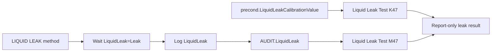

# TCC Liquid Leak Black Box Decomposition

Extraction date: 2026-07-10

Scope: TCC FOQ Liquid Leak / Keypad test for `VH-C10-A`, `VC-C10-A`, and
`VA-C10-A`.

---
Test name: Liquid Leak / Keypad
Models: VH-C10-A / VC-C10-A / VA-C10-A
Status: first black-box decomposition complete; exact workbook pass/fail result
cells remain open verification
---

This document decomposes the Liquid Leak test as a generation contract. It is a
manual-interaction safety sensor test:

```text
Method evidence:
  turn LiquidLeakSensor On
  ask operator to inject 5 mL water
  wait LiquidLeak = Leak
  log LiquidLeak
  ask operator to press MUTE ALARM
  wait ColumnComp.Alarm = NoAlarm
  turn LiquidLeakSensor Off
  ask operator to remove remaining liquid

Report evidence:
  K47 = precond.LiquidLeakCalibrationValue
  M47 = AUDIT.LiquidLeak(100.000,"backward")
```

Unlike temperature tests, this method is not a raw-signal calculation and does
not write RetTimes. The report validates audit/precondition evidence for a
sensor workflow that requires physical water injection and operator alarm
confirmation.

## Evidence Sources

| Evidence | Source |
|---|---|
| Test intent node | `cmbx_data_explorer/docs/TCC_TEST_KNOWLEDGE_NODE_MODEL.md` |
| Injection workbench notes | `cmbx_data_explorer/docs/TCC_INJECTION_BY_INJECTION_REVERSE_WORKBENCH.md` |
| Method/report alignment | `cmbx_data_explorer/docs/TCC_METHOD_REPORT_ALIGNMENT.md` |
| Required symbols | `cmbx_data_explorer/docs/TCC_REQUIRED_SYMBOL_MANIFEST.md` |
| Method flow, VH | `knowledge_base/tcc_reverse_probe/VH/6000001/LIQUID LEAK_embedded_method_flow.txt` |
| Method flow, VC | `knowledge_base/tcc_reverse_probe/VC/3000004/LIQUID LEAK_embedded_method_flow.txt` |
| Method flow, VA | `knowledge_base/tcc_reverse_probe/VA/0000003/LIQUID LEAK_embedded_method_flow.txt` |
| Report formula objects | `knowledge_base/tcc_report_formula_objects_vh_6000001_all_sheets.tsv` |
| DB mapping | `foq/FOQResultLocations_V2.83.xls` |

## Executive Answer

1. The instrument method is `LIQUID LEAK`.
2. VH/VC/VA method flows are materially the same for the leak workflow.
3. The method sets the CC to 20 C / StillAir context, then turns
   `ColumnComp.LiquidLeakSensor` on.
4. The operator must inject 5 mL water into the compartment and later press
   `MUTE ALARM` on the instrument keypad.
5. The method waits for `LiquidLeak=Leak`, logs `LiquidLeak`, then waits until
   `ColumnComp.Alarm = NoAlarm`.
6. It turns `LiquidLeakSensor` off only if `ColumnComp.Alarm=NoAlarm`; otherwise
   it aborts.
7. The report sheet is `Liquid Leak Test`; source cells are `K47` and `M47`.
8. No FOQ DB fields are mapped for this injection in `FOQResultLocations_V2.83.xls`.
9. This method should not be reduced to an automatic sensor read. The physical
   water injection, mute, and cleanup prompts are part of the test contract.

## Contract 1: Method Command

### 1.1 Device Branch Binding

| Device | Injection | Instrument Method | Processing Method | Report Template | Report Sheets | Status |
|---|---|---|---|---|---|---|
| VH-C10-A | `LiquidLeaktest` | `LIQUID LEAK` | `No_Integration` | `Report_VTCC_V2_12` | `Liquid Leak Test`, `Valve_Keypad` context | sequence evidence closed |
| VC-C10-A | `LiquidLeaktest` | `LIQUID LEAK` | `CORRECT_ACCURACY_INJ_INSERTION` | `Report_VTCC_V2_12` | `Liquid Leak Test`, `Valve_Keypad` context | sequence evidence closed |
| VA-C10-A | `LiquidLeaktest` | `LIQUID LEAK` | `No_Integration` | `Report_VATCC_V1_01` | `Liquid Leak Test`, `Valve_Keypad` context | sequence evidence closed |

### 1.2 Method Contract Summary

Decoded method evidence:

```yaml
method: LIQUID LEAK
stages:
  - InstrumentSetup
  - Equilibration
  - StartRun
  - Run
  - StopRun
  - PostRun
setup:
  ColumnComp.CC.ReadyTempDelta: None
  ColumnComp.CC.EquilibrationTime: 0.5
  ColumnComp.CC.TempCtrl: On
  ColumnComp.CC.Temperature.Nominal: 20 C
  ColumnComp.CC.Mode: StillAir
  Variables.GenericBool1: 0
  END_RUN_trigger: Variables.GenericBool1 = 1 AND System.Retention > 0.01
  ColumnComp.LiquidLeakSensor: On
acquisition_channels:
  - ColumnComp.CC_Temp
  - ColumnComp.CC_U_Temp_Actual
  - ColumnComp.CC_L_Temp_Actual
  - ColumnComp.CC_UCTL_TempRear_Actual
  - ColumnComp.PWM_CCU_A
  - ColumnComp.PWM_CCU_B
  - ColumnComp.PWM_CCL_A
  - ColumnComp.PWM_CCL_B
  - ColumnComp.Fan_Rear_ActualRPM
  - Thermometer1.ExtTemp_UpperCC
  - Thermometer1.ExtTemp_LowerCC
  - Thermometer.Environment_Temperature
  - ColumnComp.LEDBoard_LeakDiff
  - ColumnComp.LEDBoard_A13
  - ColumnComp.LEDBoard_A14
  - ColumnComp.Oven_Gas_MuteTimeRemain
```

### 1.3 Command Flow

```yaml
LIQUID_LEAK_Command_Flow:
  - order: 1
    stage: Equilibration
    command: SET
    target: ColumnComp.CC.Temperature.Nominal
    value: 20 C
    note: Performs leak test at nominal 20 C state.
  - order: 2
    stage: Equilibration
    command: SET
    target: ColumnComp.LiquidLeakSensor
    value: On
    note: Enables leak sensor after safe setup.
  - order: 3
    stage: StartRun
    command: WAIT
    condition: ColumnComp.CC.TempReady
    note: Waits until the module is in ready thermal state.
  - order: 4
    stage: StartRun
    command: IF_OR_ABORT
    condition: Door = Closed AND LiquidLeak = NoLeak
    result: prompt operator to inject 5 mL water
    note: Aborts if the starting state is already unsafe or not clean.
  - order: 5
    stage: StartRun
    command: ACQ_ON
    target: CC, PWM, fan, external thermometer, LEDBoard leak channels
    note: Captures diagnostic context while leak event is provoked.
  - order: 6
    stage: Run
    command: WAIT
    condition: LiquidLeak = Leak
    timeout: 2.00 min
    note: Core leak detection event.
  - order: 7
    stage: Run
    command: LOG
    target: LiquidLeak
    note: Creates audit evidence consumed by report cell M47.
  - order: 8
    stage: Run
    command: MESSAGE
    target: operator
    note: Ask operator to press MUTE ALARM on the instrument keypad.
  - order: 9
    stage: Run
    command: WAIT
    condition: ColumnComp.Alarm = NoAlarm
    note: Confirms alarm mute/clear workflow.
  - order: 10
    stage: Run
    command: IF_OR_ABORT
    condition: ColumnComp.Alarm = NoAlarm
    result: ColumnComp.LiquidLeakSensor = Off
    note: Does not disable sensor unless alarm state is clean.
  - order: 11
    stage: Run
    command: MESSAGE
    target: operator
    note: Ask operator to absorb/remove remaining liquid and close door.
  - order: 12
    stage: Run
    command: SET
    target: Variables.GenericBool1
    value: 1
    note: Allows END_RUN trigger to finish normally.
  - order: 13
    stage: StopRun
    command: ACQ_OFF
    target: all acquired channels
    note: Cleanly closes acquisition.
```

### 1.4 RetTime and Channel Semantics

| Item | Status | Reason |
|---|---|---|
| RetTimes | not used | No `RetTimes.RetTimeN` assignments in decoded method. |
| `System.Retention` | used by end trigger only | `END_RUN` requires `System.Retention > 0.01`; it is not written to report as RetTime. |
| Raw signal result channels | diagnostic context | LEDBoard and CC channels are acquired, but report formula objects use audit/precondition fields. |
| `LiquidLeak` | audit result | Logged after `LiquidLeak=Leak`; report reads `AUDIT.LiquidLeak(100.000,"backward")`. |
| `LiquidLeakCalibrationValue` | precondition metadata | Report reads `precond.LiquidLeakCalibrationValue`. |

## Contract 2: Processing Method

Known sequence bindings:

| Device | Processing Method | IRC / corrective role | Status |
|---|---|---|---|
| VH-C10-A | `No_Integration` | no integration expected | verified from sequence binding |
| VC-C10-A | `CORRECT_ACCURACY_INJ_INSERTION` | corrective processing binding preserved in VC sequence | verified from TKN/package map; pass-action semantics open |
| VA-C10-A | `No_Integration` | no integration expected | verified from TKN/package map |

Processing interpretation:

- The result does not depend on peak integration.
- Full-sequence generation should preserve the device-specific processing method
  binding.
- Standalone leak diagnostic packages can probably use `No_Integration`, but the
  VC corrective binding should remain Open Verification Required until
  processing pass actions are decoded.

## Contract 3: Report Formula

### 3.1 `Liquid Leak Test` Formula Objects

Known VTCC formula objects:

| Cell | Formula | Meaning |
|---|---|---|
| `K47` | `precond.LiquidLeakCalibrationValue` | Leak sensor calibration value at injection start |
| `M47` | `AUDIT.LiquidLeak(100.000,"backward")` | Last leak state at or before 100 min audit lookup |

### 3.2 Workbook-Derived Rules

Known interpretation:

```text
Liquid leak detection evidence:
  method waits for LiquidLeak=Leak
  method logs LiquidLeak
  report reads AUDIT.LiquidLeak(100.000,"backward")

Calibration evidence:
  report reads precond.LiquidLeakCalibrationValue

Keypad/mute evidence:
  method waits for ColumnComp.Alarm = NoAlarm after the operator presses MUTE ALARM
  exact report result cell is not fully parsed yet
```

Formula flow:



## Contract 4: DB Contract

### 4.1 DB Leaves

| Device | Injection | DB mapping status | Notes |
|---|---|---|---|
| VH-C10-A | `LiquidLeaktest` | no DB contract expected | `FOQResultLocations_V2.83.xls` has no mapped DB leaves for `TCC_LEAK_01`. |
| VC-C10-A | `LiquidLeaktest` | no DB contract expected | same as VH |
| VA-C10-A | `LiquidLeaktest` | no DB contract expected | same as VH |

### 4.2 DB Is Not the Evidence Driver

```text
LIQUID LEAK command flow
-> physical water injection + leak sensor state
-> audit log LiquidLeak and alarm mute state
-> Liquid Leak Test report cells
-> no DB leaves in current FOQ mapping
```

## Contract 5: Config Requirement

| Requirement | VH-C10-A | VC-C10-A | VA-C10-A | Failure mode |
|---|---|---|---|---|
| `AUDIT.ColumnComp.ModelNo` source of truth | Required | Required | Required | Wrong branch/report template |
| `ColumnComp.LiquidLeakSensor` | Required | Required | Required | leak sensor cannot be enabled/disabled |
| `ColumnComp.LiquidLeakSensorCalibrate` | Required by configuration manifest | Required by configuration manifest | Required by configuration manifest | calibration value may be missing/stale |
| `LiquidLeak` audit property | Required | Required | Required | report cell `M47` cannot be evaluated |
| `precond.LiquidLeakCalibrationValue` | Required | Required | Required | report cell `K47` cannot be evaluated |
| `ColumnComp.Alarm` | Required | Required | Required | mute/no-alarm confirmation cannot complete |
| `ColumnComp.CmdString` LedBar force color commands | Required by method | Required by method | Required by method | operator-guidance LED behavior missing |
| `ColumnComp.LEDBoard_LeakDiff`, `LEDBoard_A13`, `LEDBoard_A14` | Diagnostic acquisition | Diagnostic acquisition | Diagnostic acquisition | diagnostic trace weaker |
| Operator access to inject water and press MUTE ALARM | Required | Required | Required | FOQ workflow cannot be performed |

Generation implication:

- Do not make this an unattended automatic test unless the intent is explicitly
  a non-FOQ diagnostic.
- Preserve the operator prompts, water injection, MUTE ALARM confirmation, and
  cleanup confirmation for FOQ-like generation.
- Report cells depend on audit/precondition evidence, so the method must log
  `LiquidLeak` after the leak is actually detected.
- The leak sensor should be turned off only after `ColumnComp.Alarm = NoAlarm`.

## Contract 6: Open Verification

Items below are marked Open Verification Required until the listed evidence is
captured.

| # | Open Verification Required | Why it matters | Needed evidence | Likely source |
|---:|---|---|---|---|
| 1 | Exact `Liquid Leak Test` workbook pass/fail cells | Formula objects expose source cells, not final workbook result cells | FormulaOne workbook parse for `Liquid Leak Test` | report `SpreadSheetData` |
| 2 | VATCC leak report formulas | Current extracted formula objects are VTCC; VA report branch should be confirmed | VA report formula object extraction | `Report_VATCC_V1_01` |
| 3 | VC `CORRECT_ACCURACY_INJ_INSERTION` pass-action semantics on leak row | Full sequence should preserve binding; standalone package may not require it | Processing method XML and pass-action trigger map | VC CMBX processing method payload |
| 4 | External vs internal acceptance classification | TKN marks exact field name/criteria open | FOQ TD section and workbook criteria cells | FOQ TD, `Definitions`, `Liquid Leak Test` workbook |
| 5 | Keypad report coupling with `Valve_Keypad` | TKN lists `Valve_Keypad` context, but leak method formula objects are on `Liquid Leak Test` | Report workbook sheet dependencies and print layout | report template |

## VH / VC / VA Comparison

| Aspect | VH-C10-A | VC-C10-A | VA-C10-A |
|---|---|---|---|
| Production injection | `LiquidLeaktest` | `LiquidLeaktest` | `LiquidLeaktest` |
| Instrument method | `LIQUID LEAK` | `LIQUID LEAK` | `LIQUID LEAK` |
| Method body | same leak workflow | same leak workflow | same leak workflow |
| Processing method | `No_Integration` | `CORRECT_ACCURACY_INJ_INSERTION` | `No_Integration` |
| Report template | `Report_VTCC_V2_12` | `Report_VTCC_V2_12` | `Report_VATCC_V1_01` |
| DB fields | none | none | none |
| Generation status | reusable with manual workflow preserved | reusable with processing binding preserved | reusable with manual workflow preserved |

## Generation Readiness

| Generation action | Status | Notes |
|---|---|---|
| Reuse full VH leak row | ready after config validation | Preserve `No_Integration` and operator workflow. |
| Reuse full VC leak row | ready after config validation | Preserve `CORRECT_ACCURACY_INJ_INSERTION` until pass actions are decoded. |
| Reuse full VA leak row | ready after config validation | Method workflow is same; confirm VATCC report formulas before report generation. |
| Generate unattended leak readout | locked for FOQ | Would not satisfy water injection + mute + cleanup workflow. |
| Modify water volume or timeout | locked | Requires TD/report acceptance review. |
| Use leak method as generic keypad test | partial | It validates MUTE ALARM, not the same keypad actions as the `VALVES` method. |

