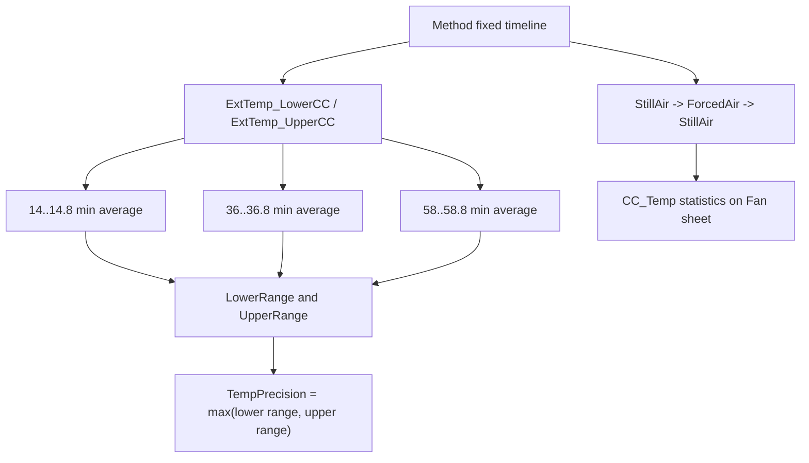
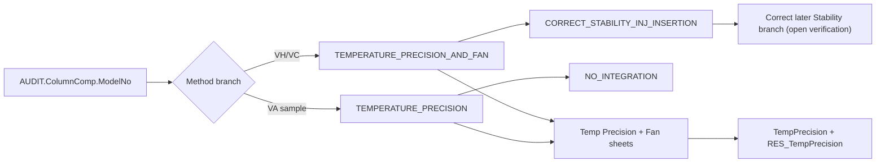

# TCC Temperature Precision and Fan Black Box Decomposition

Extraction date: 2026-07-10

Scope: TCC FOQ Temperature Precision and Fan for `VH-C10-A`, `VC-C10-A`, and `VA-C10-A`.

---
Test name: Temperature Precision and Fan
Models: VH-C10-A / VC-C10-A / VA-C10-A
Status: first black-box decomposition complete; processing method pass-action and Fan DB leaves remain open verification
---

This document decomposes Temperature Precision and Fan as a generation contract.
The core distinction is:

```text
Temperature Precision is report-derived from fixed external thermometer windows.
Fan behavior is method-driven by CC mode switching and CC_Temp statistics.
```

Unlike Temperature Accuracy, this test does not use RetTime anchors for the
main temperature precision result. The report uses fixed windows at
approximately 14, 36, and 58 minutes. Therefore the method duration and timing
are part of the calculation contract.

## Evidence Sources

| Evidence | Source |
|---|---|
| Test intent node | `cmbx_data_explorer/docs/TCC_TEST_KNOWLEDGE_NODE_MODEL.md` |
| FOQ TD extracted KB | `cmbx_data_explorer/docs/FOQ_TCC_VX_C10_A_TD_KNOWLEDGE_MANAGEMENT.md` |
| Injection workbench notes | `cmbx_data_explorer/docs/TCC_INJECTION_BY_INJECTION_REVERSE_WORKBENCH.md` |
| Method/report alignment | `cmbx_data_explorer/docs/TCC_METHOD_REPORT_ALIGNMENT.md` |
| Method flow, VH | `knowledge_base/tcc_reverse_probe/VH/6000001/TEMPERATURE_PRECISION_AND_FAN_embedded_method_flow.txt` |
| Method flow, VC | `knowledge_base/tcc_reverse_probe/VC/3000004/TEMPERATURE_PRECISION_AND_FAN_embedded_method_flow.txt` |
| Method flow, VA | `knowledge_base/tcc_reverse_probe/VA/0000003/TEMPERATURE_PRECISION_embedded_method_flow.txt` |
| Method contract summaries | `knowledge_base/tcc_method_contracts/*_method_contracts.tsv` |
| Processing method probe | `knowledge_base/tcc_processing_probe/*/*CORRECT_STABILITY_INJ_INSERTION*_summary.txt` |
| Report formula objects | `knowledge_base/tcc_report_formula_objects_vh_6000001_all_sheets.tsv` |
| Formula reverse notes | `cmbx_data_explorer/CM_FORMULA_REVERSE_ENGINEERING.md` |
| DB mapping | `foq/FOQResultLocations_V2.83.xls` |

## Executive Answer

1. `VH-C10-A` and `VC-C10-A` production CMBX rows use
   `Temperature Precision_and_Fan`, instrument method
   `TEMPERATURE_PRECISION_AND_FAN`, and processing method
   `CORRECT_STABILITY_INJ_INSERTION`.
2. `VA-C10-A` sample evidence uses `Temperature Precision`, instrument method
   `TEMPERATURE_PRECISION`, and `NO_INTEGRATION`, while the DB report file name
   still appears as `Temperature Precision_and_Fan.XLS`.
3. The method repeats a 45 C / 50 C thermal pattern. It first establishes the
   same starting condition before each 50 C segment, then acquires external
   upper and lower thermometer channels.
4. `Temp Precision` report formulas calculate three lower external averages and
   three upper external averages:

   ```text
   K65 = average ExtTemp_LowerCC from 14.0 to 14.8 min
   K66 = average ExtTemp_LowerCC from 36.0 to 36.8 min
   K67 = average ExtTemp_LowerCC from 58.0 to 58.8 min
   L65:L67 = same windows on ExtTemp_UpperCC
   ```

5. Workbook-derived precision rule:

   ```text
   LowerRange = max(K65:K67) - min(K65:K67)
   UpperRange = max(L65:L67) - min(L65:L67)
   RawPrecision = max(LowerRange, UpperRange)
   ```

6. The pass/fail cell compares `RawPrecision` to
   `Definitions!Temperature Precision`. The displayed summary uses two decimals,
   but pass/fail uses the raw range.
7. Fan behavior is checked by switching `ColumnComp.CC.Mode` from `StillAir` to
   `ForcedAir` and back to `StillAir`, logging `CC.TempReady`, and evaluating
   `CC_Temp` fixed windows on the `Fan` sheet. Current DB mapping exposes
   `TempPrecision` and `RES_TempPrecision`; Fan-specific DB field names remain
   open verification.

## Contract 1: Method Command

### 1.1 Device Branch Binding

| Device | Injection | Instrument Method | Processing Method | Report Template | Report Sheets |
|---|---|---|---|---|---|
| VH-C10-A | `Temperature Precision_and_Fan` | `TEMPERATURE_PRECISION_AND_FAN` | `CORRECT_STABILITY_INJ_INSERTION` | `Report_VTCC_V2_12` | `Temp Precision`, `Fan` |
| VC-C10-A | `Temperature Precision_and_Fan` | `TEMPERATURE_PRECISION_AND_FAN` | `CORRECT_STABILITY_INJ_INSERTION` | `Report_VTCC_V2_12` | `Temp Precision`, `Fan` |
| VA-C10-A | `Temperature Precision` | `TEMPERATURE_PRECISION` | `NO_INTEGRATION` | `Report_VATCC_V1_01` | `Temp Precision`, `Fan` |

### 1.2 Shared Precision Method Skeleton

Both `TEMPERATURE_PRECISION_AND_FAN` and `TEMPERATURE_PRECISION` share the same
temperature precision skeleton in current decoded method evidence:

```yaml
stages:
  - InstrumentSetup
  - Equilibration
  - StartRun
  - Run
  - StopRun
setpoints:
  - ColumnComp.CC.Temperature.Nominal: 45.0
  - ColumnComp.CC.Temperature.Nominal: 50.0
wait_conditions:
  - CC.TempReady
ret_times:
  emitted: []
logged_properties:
  - GenericLong9
  - Variables.GenericBool0
  - CC.TempReady
channels:
  - ColumnComp.CC_Temp
  - ColumnComp.CC_U_Temp_Actual
  - ColumnComp.CC_L_Temp_Actual
  - ColumnComp.CC_UCTL_TempRear_Actual
  - ColumnComp.PWM_CCU_A
  - ColumnComp.PWM_CCU_B
  - ColumnComp.PWM_CCL_A
  - ColumnComp.PWM_CCL_B
  - ColumnComp.Fan_Rear_ActualRPM
  - Thermometer1.ExtTemp_UpperCC
  - Thermometer1.ExtTemp_LowerCC
  - Thermometer.Environment_Temperature
  - ColumnComp.LEDBoard_LeakDiff
  - ColumnComp.LEDBoard_A13
  - ColumnComp.LEDBoard_A14
  - ColumnComp.Oven_Gas_MuteTimeRemain
```

Semantic command flow:

| Order | Command group | Meaning | Generation constraint |
|---:|---|---|---|
| 1 | Determine page/model context | Set `Variables.GenericLong9` by `ColumnComp.ModelNo`; abort if unknown. | Keeps report/page context aligned with model. |
| 2 | Determine stability branch flag | Set `Variables.GenericBool0` based on whether `ColumnComp.ModelNo` is `VH-C10-A`. | Feeds later stability branch selection. |
| 3 | Configure CC readiness | Set `ReadyTempDelta = 0.1 C`, `EquilibrationTime = 0.5 min`, `TempCtrl = On`. | Defines readiness for repeated 45/50 C transitions. |
| 4 | Set operating mode and leak sensor | Set `CC.Mode = StillAir`; set `LiquidLeakSensor = Off`. | Avoid false leak alarms during temperature changes. |
| 5 | Configure debug/data collection channels | Set data collection rate for CC actual/PWM/fan/leak channels. | Required for diagnostic evidence and Fan sheet. |
| 6 | Precondition at 45 C | Set CC nominal to 45 C and wait for `CC.TempReady`. | Ensures the same starting condition before 50 C segments. |
| 7 | Repeat 45/50 pattern | Toggle nominal values `50 -> 45 -> 50` before StartRun and again during Run. | Produces fixed report windows at 14, 36, and 58 minutes. |
| 8 | Start acquisition | Acquire CC, external thermometer, fan/PWM, environment and leak signals. | Required by `Temp Precision` and `Fan` sheets. |
| 9 | Re-enable and calibrate leak sensor | Set `LiquidLeakSensor = On` and run `LiquidLeakSensorCalibrate`. | Supports later leak logic and safe post-test state. |
| 10 | Stop acquisition | Turn all acquired channels off. | Required cleanup. |

### 1.3 Fan-Specific Method Branch

`TEMPERATURE_PRECISION_AND_FAN` includes an explicit Fan function block:

```text
SET ColumnComp.CC.ReadyTempDelta = 0.1 C
SET ColumnComp.CC.EquilibrationTime = 0.0 min
SET ColumnComp.CC.Mode = ForcedAir
RUN Log CC.TempReady
RUN Log CC.TempReady
RUN Log CC.TempReady
SET ColumnComp.CC.Mode = StillAir
RUN Log CC.TempReady
```

Current VA `TEMPERATURE_PRECISION` evidence does not include this block in the
decoded text. Therefore VA support for the Fan sheet must be treated as
template/report evidence, not confirmed Fan method behavior.

### 1.4 No RetTime Anchor

The decoded method summaries show no direct RetTime emissions for Precision/Fan.
This is important:

```text
Temperature Accuracy -> RetTime anchored report windows.
Temperature Precision -> fixed-time report windows.
```

For generated/cut-down methods, a shorter method cannot reuse the current
`Temp Precision` report unchanged.

## Contract 2: Processing Method

### 2.1 Known Bindings

| Device | Processing Method | Evidence | Interpretation |
|---|---|---|---|
| VH-C10-A | `CORRECT_STABILITY_INJ_INSERTION` | Sequence context and TKN binding. | Used by `Temperature Precision_and_Fan`; likely controls follow-up Stability branch selection. |
| VC-C10-A | `CORRECT_STABILITY_INJ_INSERTION` | Sequence context and TKN binding. | Same as VH, but later branch should be non-PCC stability. |
| VA-C10-A | `NO_INTEGRATION` for sample row | TKN binding and sequence package spec. | VA sample does not use the corrective stability processing method on the Precision row. |

### 2.2 Current Understanding

`CORRECT_STABILITY_INJ_INSERTION` appears near sequence context that references:

```text
Temperature Precision_and_Fan
TEMPERATURE_PRECISION_AND_FAN
Temperature Stability_and_PCC_H
```

The TD gives explicit IRC design intent for `CORRECT_STABILITY_INJ_INSERTION`.
It is paired with `Temperature Precision_and_Fan` in the same way
`CORRECT_ACCURACY_INJ_INSERTION` is paired with `Temperature Calibration`.

TD-backed expected behavior:

| Item | TD-backed value |
|---|---|
| Source injection | `Temperature Precision_and_Fan` |
| Processing method | `CORRECT_STABILITY_INJ_INSERTION` |
| Branch variable | `Variables.GenericBool0` |
| Variable producer | Instrument method `TEMPERATURE_PRECISION_AND_FAN` |
| VH branch | `GenericBool0 = 1` |
| VC branch | `GenericBool0 = 0` |
| Pass criterion | `GenericBool0 = 1` |
| Pass action | `Insert Injection` |
| Pass inserted injection | `Temperature Stability_and_PCC_H` |
| Fail action | `Insert Injection` |
| Fail inserted injection | `Temperature Stability_C` |
| Additional sequence | `FOQ_VX-C10_V2_00_AdditionalInjections` |
| Site/config note | Injection assignment must be reassigned when the main sequence template changes at Zollner. |

The method also logs `Variables.GenericBool0`, which is set from ModelNo:

```text
VH-C10-A -> Variables.GenericBool0 = 1
other valid branch -> Variables.GenericBool0 = 0
```

Working interpretation:

```text
Temperature Precision determines the correct later Stability branch.
TD confirms that CORRECT_STABILITY_INJ_INSERTION inserts the appropriate
Temperature Stability branch. The current XML probe still does not expose the
complete serialized action table, so runnable generation remains gated on CM UI
confirmation or deeper processing-method decoding.
```

Open verification:

| Item | Required evidence | Likely source |
|---|---|---|
| Exact serialized `CORRECT_STABILITY_INJ_INSERTION` pass/fail action rows | Full processing method business/action rows. | Processing method XML internals or Chromeleon UI. |
| Whether the CM UI condition row displays `Variables.GenericBool0` directly or a derived value | Condition/action table screenshot/export. | Processing method editor view. |
| Why VA sample uses `NO_INTEGRATION` while still carrying `Temperature Precision_and_Fan.XLS` report file mapping | VA sequence/report binding evidence. | VA CMBX sequence row and report template. |

## Contract 3: Report Formula

### 3.1 `Temp Precision` Formula Objects

| Cell | Formula | Fixed channel / source | Meaning |
|---|---|---|---|
| `I65` | `AUDIT.ColumnComp.CC.Temperature.Nominal(14.9,"backward")` | Audit | Nominal value near first precision window. |
| `I66` | `AUDIT.ColumnComp.CC.Temperature.Nominal(36.9,"backward")` | Audit | Nominal value near second precision window. |
| `I67` | `AUDIT.ColumnComp.CC.Temperature.Nominal(58.9,"backward")` | Audit | Nominal value near third precision window. |
| `K65` | `chm.sig_value("average",14,14.8)` | `ExtTemp_LowerCC` | Lower external average, first repeat. |
| `K66` | `chm.sig_value("average",36,36.8)` | `ExtTemp_LowerCC` | Lower external average, second repeat. |
| `K67` | `chm.sig_value("average",58,58.8)` | `ExtTemp_LowerCC` | Lower external average, third repeat. |
| `L65` | `chm.sig_value("average",14,14.8)` | `ExtTemp_UpperCC` | Upper external average, first repeat. |
| `L66` | `chm.sig_value("average",36,36.8)` | `ExtTemp_UpperCC` | Upper external average, second repeat. |
| `L67` | `chm.sig_value("average",58,58.8)` | `ExtTemp_UpperCC` | Upper external average, third repeat. |

Workbook-derived precision rule:

```text
LowerRange = max(K65:K67) - min(K65:K67)
UpperRange = max(L65:L67) - min(L65:L67)
RawPrecision = max(LowerRange, UpperRange)
Displayed TempPrecision = RawPrecision displayed to 2 decimals
Pass/fail = RawPrecision <= Definitions!Temperature Precision
```

The source rule is the same family as Temperature Stability:

```text
Do not combine K65:L67 into one range.
Evaluate each external thermometer separately, then take the worse sensor.
```

### 3.2 `Fan` Formula Objects

Known formula objects on sheet `Fan`:

| Cell | Formula | Fixed channel | Meaning |
|---|---|---|---|
| `J49` | `chm.signalStatistic("average",63.1,64.1)` | `CC_Temp` | CC temperature average before/around fan mode response window. |
| `J50` | `chm.signalStatistic("min",64.1,74)` | `CC_Temp` | Minimum CC temperature in fan response interval. |
| `J51` | `chm.signalStatistic("average",74,75)` | `CC_Temp` | Average after fan response interval. |
| `J52` | `chm.signalStatistic("max",75,76)` | `CC_Temp` | Maximum after return/response interval. |
| `W57` | `chm.signalStatistic("min",63.1,64.1)` | `CC_Temp` | Fan diagnostic min value. |
| `X57` | `chm.signalStatistic("max",63.1,64.1)` | `CC_Temp` | Fan diagnostic max value. |
| `W58` | `chm.signalStatistic("min",74,75)` | `CC_Temp` | Fan diagnostic min value. |
| `X58` | `chm.signalStatistic("max",74,75)` | `CC_Temp` | Fan diagnostic max value. |

Open point:

```text
Current FOQResultLocations_V2.83 mapping exposes TempPrecision and
RES_TempPrecision, but no verified Fan-specific DB field names for this test.
Fan may be report-visible without being part of the current TCC DB contract.
```

### 3.3 Formula Flow



## Contract 4: DB Contract

### 4.1 DB Leaves

| Device | DB Field | Report file | Sheet | Cell | Rule |
|---|---|---|---|---|---|
| VH-C10-A | `TempPrecision` | `Temperature Precision_and_Fan.XLS` | `Temp Precision` | `D26` | Displayed max lower/upper sensor range. |
| VH-C10-A | `RES_TempPrecision` | `Temperature Precision_and_Fan.XLS` | `Temp Precision` | `E26` | Pass/fail versus Definitions. |
| VC-C10-A | `TempPrecision` | `Temperature Precision_and_Fan.XLS` | `Temp Precision` | `D26` | Displayed max lower/upper sensor range. |
| VC-C10-A | `RES_TempPrecision` | `Temperature Precision_and_Fan.XLS` | `Temp Precision` | `E26` | Pass/fail versus Definitions. |
| VA-C10-A | `TempPrecision` | `Temperature Precision_and_Fan.XLS` | `Temp Precision` | `D26` | Displayed max lower/upper sensor range. |
| VA-C10-A | `RES_TempPrecision` | `Temperature Precision_and_Fan.XLS` | `Temp Precision` | `E26` | Pass/fail versus Definitions. |

### 4.2 DB Boundary

`Noise_CC_Temp` belongs to the later Temperature Stability report in the current
mapping, not to Temperature Precision:

```text
Noise_CC_Temp -> Temperature Stability(_and_PCC)_*.XLS / Temp Stability_Noise / K86
```

Generation implication:

```text
Do not attach Noise_CC_Temp to a cut-down Precision-only package unless the
report/DB contract is deliberately changed.
```

## Contract 5: Config Requirement

| Requirement | VH-C10-A | VC-C10-A | VA-C10-A | Failure mode |
|---|---|---|---|---|
| `AUDIT.ColumnComp.ModelNo` source of truth | Required | Required | Required | Wrong page count, wrong branch, wrong follow-up stability injection. |
| Column compartment CC control | Required | Required | Required | 45/50 C transitions and `CC.TempReady` invalid. |
| External upper/lower thermometers | Required | Required | Required | `Temp Precision` report cannot evaluate. |
| `CC_Temp` raw channel | Required for Fan sheet | Required for Fan sheet | Report sheet lists Fan, method support not fully verified | Fan statistics cannot evaluate. |
| `Fan_Rear_ActualRPM` / fan debug channel | Required for method evidence | Required for method evidence | Acquired in VA precision method | Fan behavior evidence incomplete. |
| PWM/debug channels | Acquired | Acquired | Acquired | Diagnostic trace incomplete. |
| Current report timeline | Required | Required | Required | Fixed report windows miss data if method is shortened. |
| Processing action for Stability insertion | `CORRECT_STABILITY_INJ_INSERTION` | `CORRECT_STABILITY_INJ_INSERTION` | sample uses `NO_INTEGRATION` | Later Stability branch may be wrong or missing. |

Generation guardrails:

```text
1. Keep the three repeated precision windows unless regenerating the report.
2. Keep lower and upper external thermometer ranges separate.
3. Treat the Fan sheet as fixed-window CC_Temp diagnostics, not as a RetTime test.
4. For VH/VC, do not drop `Variables.GenericBool0` until the stability insertion
   processing method is fully understood.
5. For VA, confirm whether the intended production method should include Fan
   mode switching or match the observed `TEMPERATURE_PRECISION` method.
```

## Contract 6: Open Verification

Items below are marked Open Verification Required until the listed evidence is
captured.

### 6.1 Resolved by TD Evidence

| Topic | Resolved evidence | Remaining boundary |
|---|---|---|
| Whether the processing method inserts VH `Temperature Stability_and_PCC_H` and VC `Temperature Stability_C` based on `Variables.GenericBool0` | FOQ TD states that `CORRECT_STABILITY_INJ_INSERTION` uses the same IRC assignment pattern; pass inserts `Temperature Stability_and_PCC_H`, fail inserts `Temperature Stability_C` from `FOQ_VX-C10_V2_00_AdditionalInjections`. | The serialized CM processing-method pass/fail action rows are still not decoded. |
| Current TCC `Definitions!Temperature Precision` criterion used by the report/DB contract | FOQ TD Table 4 lists Temperature Precision as external and `<= 0.1 C` / `+/- 0.1 K`, tested at 50 C. The report dependency trace records `Definitions!Temperature Precision = 0.1`, and the calculation map compares raw D26 against `0.1` while displaying D26 with two decimals. | Exact static cell extraction from each embedded VTCC/VATCC workbook remains part of the broader report-template parity review, especially for the VA branch. |
| VA Precision/Fan branch behavior | Real VA `0000003.cmbx` confirms injection `Temperature Precision`, method `TEMPERATURE_PRECISION`, processing `NO_INTEGRATION`, and template `Report_VATCC_V1_01`. The report XML marks `Temp Precision` active/applicable for `Temperature Precision`, while `Fan` exists in the template but is not active for that injection. The FOQ DB mapping alias still uses `Temperature Precision_and_Fan.XLS`, so this is a mapping/file-name compatibility alias rather than evidence that VA executes the fan mode-switch method block. | Fan-specific pass/fail workbook semantics and any non-DB report-only fan result remain open. |

### 6.2 Remaining Open Verification

| # | Uncertain point | Required evidence | Likely source |
|---:|---|---|---|
| 1 | Exact `CORRECT_STABILITY_INJ_INSERTION` pass-action structure. | Processing method condition/action table. | Chromeleon processing method editor or deeper XML decoder. |
| 2 | Fan pass/fail workbook formula and whether it has any DB fields outside current mapping. | FormulaOne workbook extraction and DB mapping review. | Report template `SpreadSheetData` and FOQ mapping. |

## VH / VC / VA Comparison

| Question | VH-C10-A | VC-C10-A | VA-C10-A |
|---|---|---|---|
| Which injection is used? | `Temperature Precision_and_Fan` | `Temperature Precision_and_Fan` | `Temperature Precision` |
| Which method is used? | `TEMPERATURE_PRECISION_AND_FAN` | `TEMPERATURE_PRECISION_AND_FAN` | `TEMPERATURE_PRECISION` |
| Which processing method is used? | `CORRECT_STABILITY_INJ_INSERTION` | `CORRECT_STABILITY_INJ_INSERTION` | `NO_INTEGRATION` in current sample |
| Fan mode switch decoded? | Yes | Yes by method family | Not in current decoded VA method text |
| Temperature precision formula | Same fixed windows | Same fixed windows | Same fixed report mapping expected |
| Stability branch flag | `GenericBool0 = 1` | `GenericBool0 = 0` | `GenericBool0 = 0` |

## Command, Report, DB Flow



## Generation Readiness

| Use case | Readiness | Reason |
|---|---|---|
| Reuse full VH/VC Precision and Fan branch from existing CMBX | Medium-high | Method/report/DB chain is mostly closed; processing pass-action remains open. |
| Reuse VA Precision branch from existing CMBX | Medium | Precision formula is clear; Fan method/report mismatch needs confirmation. |
| Generate shorter precision-only test using current report | Not ready | Current report windows are fixed at 14, 36, and 58 minutes. |
| Generate a new single-window precision test | Not ready | The current report requires three repeated windows to compute a range. |
| Split Fan into a standalone test | Partial | Fan method commands and CC_Temp formulas are known, but DB/report pass/fail contract is not closed. |
