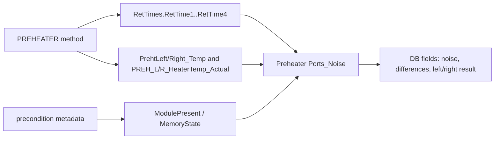

# TCC Preheater Connection Black Box Decomposition

Extraction date: 2026-07-10

Scope: TCC FOQ Preheater Connection Test for `VH-C10-A`, `VC-C10-A`, and the
open VA method-library branch.

---
Test name: Preheater Connection Test
Models: VH-C10-A / VC-C10-A / VA-C10-A
Status: first black-box decomposition complete for VC/VH sequence evidence; VA
sequence applicability remains open verification
---

This document decomposes the Preheater Connection Test as a generation contract.
The core of the test is left/right preheater thermal response plus precondition
metadata:

```text
RetTimes.RetTime1 = left preheater reaches 45 C
RetTimes.RetTime2 = right preheater reaches 45 C
RetTimes.RetTime3 = left preheater reaches 55 C
RetTimes.RetTime4 = right preheater reaches 55 C

Port pass = RetTimes present AND ModulePresent = Yes AND MemoryState = OK
Temperature difference = heater actual average - preheater temp average
```

## Evidence Sources

| Evidence | Source |
|---|---|
| Test intent node | `cmbx_data_explorer/docs/TCC_TEST_KNOWLEDGE_NODE_MODEL.md` |
| Injection workbench notes | `cmbx_data_explorer/docs/TCC_INJECTION_BY_INJECTION_REVERSE_WORKBENCH.md` |
| Method/report alignment | `cmbx_data_explorer/docs/TCC_METHOD_REPORT_ALIGNMENT.md` |
| Required symbols | `cmbx_data_explorer/docs/TCC_REQUIRED_SYMBOL_MANIFEST.md` |
| Method flow, VH | `knowledge_base/tcc_reverse_probe/VH/6000001/PREHEATER_embedded_method_flow.txt` |
| Method flow, VC | `knowledge_base/tcc_reverse_probe/VC/3000004/PREHEATER_embedded_method_flow.txt` |
| Method flow, VA payload | `knowledge_base/tcc_reverse_probe/VA/0000003/PREHEATER_embedded_method_flow.txt` |
| Report formula objects | `knowledge_base/tcc_report_formula_objects_vh_6000001_all_sheets.tsv` |
| Formula/evaluator rule | `cmbx_data_explorer/report_calculation_map.py`, `cmbx_data_explorer/CM_FORMULA_REVERSE_ENGINEERING.md` |
| DB mapping | `foq/FOQResultLocations_V2.83.xls` |

## Executive Answer

1. The instrument method is `PREHEATER`; VC and VH decoded method flows are
   materially the same for the preheater thermal sequence.
2. The method stabilizes both preheater ports at 40 C, then tests a controlled
   heat-up toward 60 C.
3. `RetTimes.RetTime1..RetTime4` are method-generated anchors for left/right
   45 C and 55 C crossings.
4. The method includes a protective short-circuit branch: if the right
   preheater rises while right TempCtrl is off, it logs a protocol message and
   aborts the queue.
5. The method also aborts if the terminal `END_RUN` trigger is not reached,
   which means one or both ports did not reach the nominal endpoint.
6. The report sheet is `Preheater Ports_Noise`; it combines RetTimes, raw
   channel statistics, and precondition metadata.
7. VC/VH DB mapping is closed for the six known fields. VA has a `PREHEATER`
   method payload in the library, but the observed VA production sequence and
   FOQ DB mapping do not carry the Preheater DB leaves; treat VA preheater as
   Open Verification Required before generation.

## Contract 1: Method Command

### 1.1 Device Branch Binding

| Device | Injection | Instrument Method | Processing Method | Report Template | Report Sheets | Status |
|---|---|---|---|---|---|---|
| VH-C10-A | `Preheater Connection Test` | `PREHEATER` | `No_Integration` | `Report_VTCC_V2_12` | `Preheater Ports_Noise` | sequence evidence closed |
| VC-C10-A | `Preheater Connection Test` | `PREHEATER` | `CORRECT_ACCURACY_INJ_INSERTION` | `Report_VTCC_V2_12` | `Preheater Ports_Noise` | sequence evidence closed |
| VA-C10-A | open | `PREHEATER` payload exists | open | `Report_VATCC_V1_01` open | open | Open Verification Required |

### 1.2 Method Contract Summary

Decoded method evidence:

```yaml
method: PREHEATER
stages:
  - InstrumentSetup
  - Equilibration
  - InjectPreparation
  - StartRun
  - Run
  - StopRun
  - PostRun
initialization:
  cc:
    ReadyTempDelta: 1.0 C
    EquilibrationTime: 0.5 min
    TempCtrl: On
    Nominal: 15 C
    Mode: StillAir
  variables:
    GenericBool1: 0
    GenericBool2: 0
  ret_times:
    RetTimes.RetTime1: 0
    RetTimes.RetTime2: 0
    RetTimes.RetTime3: 0
    RetTimes.RetTime4: 0
preheater_setup:
  left:
    TempCtrl: On
    Nominal: 40 C
    ReadyTempDelta: 0.05 C
    EquilibrationTime: 0.5 min
  right:
    TempCtrl: On
    Nominal: 40 C
    ReadyTempDelta: 0.05 C
    EquilibrationTime: 0.5 min
  simulator_pid:
    PREH.L.PID.Kp: 10000
    PREH.L.PID.Ki: 1200
    PREH.R.PID.Kp: 10000
    PREH.R.PID.Ki: 1200
```

### 1.3 Command Flow

```yaml
PREHEATER_Command_Flow:
  - order: 1
    stage: Equilibration
    command: SET
    target: ColumnComp.CC.Temperature.Nominal
    value: 15 C
    note: Keep the column compartment in a controlled background state.
  - order: 2
    stage: Equilibration
    command: SET
    target: ColumnComp.PrehtLeft/Right.Temperature.Nominal
    value: 40 C
    note: Establish stable starting point for both preheater ports.
  - order: 3
    stage: InjectPreparation
    command: WAIT
    target: PrehtLeft.TempReady AND PrehtRight.TempReady
    note: Start acquisition only after both ports are ready at 40 C.
  - order: 4
    stage: StartRun
    command: ACQ_ON
    target: PrehtLeft_Temp, PrehtRight_Temp, PREH_L/R_Temp_Actual, PREH_L/R_HeaterTemp_Actual, PWM channels, external thermometer channels
    note: Collect raw channels required by report noise and difference rules.
  - order: 5
    stage: Run
    command: SET
    target: ColumnComp.PrehtLeft.TempCtrl / ColumnComp.PrehtRight.TempCtrl
    value: Off
    note: Establish short-circuit guard before commanding the left side up.
  - order: 6
    stage: Run
    command: SET
    target: ColumnComp.PrehtLeft.Temperature.Nominal
    value: 60 C
    note: Begin left preheater heat-up.
  - order: 7
    stage: Run
    command: TRIGGER
    target: T_UP_Left
    condition: PrehtLeft.Temperature.Value >= 45.0
    result: RetTimes.RetTime1 = System.Retention
    note: Left 45 C timing anchor.
  - order: 8
    stage: Run
    command: IF_ABORT
    condition: PrehtLeft.Temperature.Value - PrehtRight.Temperature.Value < 5
    note: Detect right-side heating while right TempCtrl is still off; aborts suspected board short.
  - order: 9
    stage: Run
    command: SET
    target: ColumnComp.PrehtRight.Temperature.Nominal
    value: 60 C
    note: Begin right preheater heat-up after left-side guard has passed.
  - order: 10
    stage: Run
    command: TRIGGER
    target: T_UP_Right
    condition: PrehtRight.Temperature.Value >= 45.0 AND PrehtRight.TempCtrl = On
    result: RetTimes.RetTime2 = System.Retention
    note: Right 45 C timing anchor.
  - order: 11
    stage: Run
    command: TRIGGER
    target: Reached_Left
    condition: PrehtLeft.Temperature.Value >= 55.0
    result: RetTimes.RetTime3 = System.Retention
    note: Left 55 C endpoint; left TempCtrl is switched off.
  - order: 12
    stage: Run
    command: TRIGGER
    target: Reached_Right
    condition: PrehtRight.Temperature.Value >= 55.0
    result: RetTimes.RetTime4 = System.Retention
    note: Right 55 C endpoint; right TempCtrl is switched off.
  - order: 13
    stage: Run
    command: TRIGGER
    target: END_RUN
    condition: Variables.GenericBool1 = 1 AND Variables.GenericBool2 = 1
    note: Regular sample completion only after both endpoints have been reached.
  - order: 14
    stage: Run/PostRun
    command: CLEANUP
    target: AcqOff all channels; restore PREH.L/R PID values to 600000 / 30000
    note: Reset temporary simulator tuning and close acquisition.
```

### 1.4 RetTime Semantics

| RetTime | Trigger | Port | Temperature point | Method purpose | Report use |
|---|---|---|---:|---|---|
| `RetTimes.RetTime1` | `T_UP_Left` | Left | 45 C | Left start timing anchor | `J72` |
| `RetTimes.RetTime2` | `T_UP_Right` | Right | 45 C | Right start timing anchor | `J73` |
| `RetTimes.RetTime3` | `Reached_Left` | Left | 55 C | Left endpoint and normal completion flag | `K72` |
| `RetTimes.RetTime4` | `Reached_Right` | Right | 55 C | Right endpoint and normal completion flag | `K73` |

## Contract 2: Processing Method

Known sequence bindings:

| Device | Processing Method | IRC / corrective role | Status |
|---|---|---|---|
| VH-C10-A | `No_Integration` | no IRC expected for preheater row | verified from VH sequence binding |
| VC-C10-A | `CORRECT_ACCURACY_INJ_INSERTION` | corrective processing binding preserved in VC sequence | verified from VC package map; detailed pass-action semantics remain open |
| VA-C10-A | open | no production sequence evidence for this row | Open Verification Required |

Processing interpretation:

- The preheater result is primarily method/report driven; no peak
  integration is required.
- VC production sequence still binds `CORRECT_ACCURACY_INJ_INSERTION`.
  Until processing method pass actions are fully decoded, the VC full-sequence
  clone should preserve this binding rather than replacing it with
  `No_Integration`.
- For a standalone VC preheater-only package, whether `No_Integration` is
  acceptable is Open Verification Required.

## Contract 3: Report Formula

### 3.1 `Preheater Ports_Noise` Formula Objects

RetTime and metadata cells:

| Cell | Formula | Meaning |
|---|---|---|
| `J72` | `AUDIT.RetTime1("forward")` | Left 45 C RetTime |
| `J73` | `AUDIT.RetTime2("forward")` | Right 45 C RetTime |
| `K72` | `AUDIT.RetTime3("forward")` | Left 55 C RetTime |
| `K73` | `AUDIT.RetTime4("forward")` | Right 55 C RetTime |
| `J117` | `precond.ColumnComp.PrehtLeft.ModulePresent` | Left module presence |
| `J118` | `precond.ColumnComp.PrehtRight.ModulePresent` | Right module presence |
| `K117` | `precond.ColumnComp.PrehtLeft.MemoryState` | Left memory state |
| `K118` | `precond.ColumnComp.PrehtRight.MemoryState` | Right memory state |

Raw signal cells:

| Cell | Channel | Formula | Meaning |
|---|---|---|---|
| `J82` | `PrehtLeft_Temp` | `chm.sig_value("average", 0.25, 0.5)` | Left preheater temperature average |
| `K82` | `PREH_L_HeaterTemp_Actual` | `chm.sig_value("average", 0.25, 0.5)` | Left heater actual average |
| `J83` | `PrehtRight_Temp` | `chm.sig_value("average", 0.25, 0.5)` | Right preheater temperature average |
| `K83` | `PREH_R_HeaterTemp_Actual` | `chm.sig_value("average", 0.25, 0.5)` | Right heater actual average |
| `J92` | `PrehtLeft_Temp` | `chm.noise(0, 0.5)` | Left preheater temperature noise |
| `J93` | `PrehtRight_Temp` | `chm.noise(0, 0.5)` | Right preheater temperature noise |
| `K92` | `PREH_L_HeaterTemp_Actual` | `chm.noise(0, 0.5)` | Left heater actual noise |
| `K93` | `PREH_R_HeaterTemp_Actual` | `chm.noise(0, 0.5)` | Right heater actual noise |
| `J102` | `PrehtLeft_Temp` | `chm.sig_value("average", 0.25, 0.5)` | Left preheater average for heat response view |
| `K102` | `PrehtLeft_Temp` | `chm.sig_value("max", 0.5, 0.6)` | Left preheater max after transition window |
| `J103` | `PrehtRight_Temp` | `chm.sig_value("average", 0.25, 0.5)` | Right preheater average for heat response view |
| `K103` | `PrehtRight_Temp` | `chm.sig_value("max", 0.5, 0.6)` | Right preheater max after transition window |
| `J110` | `PREH_L_HeaterTemp_Actual` | `chm.sig_value("average", 0.4, 0.5)` | Left heater actual average before peak window |
| `K110` | `PREH_L_HeaterTemp_Actual` | `chm.sig_value("max", 0.5, 0.6)` | Left heater actual max |
| `J111` | `PREH_R_HeaterTemp_Actual` | `chm.sig_value("average", 0.4, 0.5)` | Right heater actual average before peak window |
| `K111` | `PREH_R_HeaterTemp_Actual` | `chm.sig_value("max", 0.5, 0.6)` | Right heater actual max |

### 3.2 Workbook-Derived Rules

Known evaluator rules:

```text
Diff_PhLeft_HtTmp  = K82 - J82, displayed to 1 decimal
Diff_PhRight_HtTmp = K83 - J83, displayed to 1 decimal

RES_Preheater_Left_Port passes if:
  J72 and K72 RetTimes are present
  J117 ModulePresent = Yes
  K117 MemoryState = OK

RES_Preheater_Right_Port passes if:
  J73 and K73 RetTimes are present
  J118 ModulePresent = Yes
  K118 MemoryState = OK
```

Formula flow:



## Contract 4: DB Contract

### 4.1 DB Leaves

| Device | DB Field | Report file | Sheet | Cell | Rule |
|---|---|---|---|---|---|
| VH-C10-A | `Noise_PrehtLeft_Temp` | `Preheater Connection Test.XLS` | `Preheater Ports_Noise` | `J92` | `chm.noise(0,0.5)` on `PrehtLeft_Temp` |
| VH-C10-A | `Noise_PrehtRight_Temp` | `Preheater Connection Test.XLS` | `Preheater Ports_Noise` | `J93` | `chm.noise(0,0.5)` on `PrehtRight_Temp` |
| VH-C10-A | `Diff_PhLeft_HtTmp` | `Preheater Connection Test.XLS` | `Preheater Ports_Noise` | `L82` | `K82 - J82`, display 1 decimal |
| VH-C10-A | `Diff_PhRight_HtTmp` | `Preheater Connection Test.XLS` | `Preheater Ports_Noise` | `L83` | `K83 - J83`, display 1 decimal |
| VH-C10-A | `RES_Preheater_Left_Port` | `Preheater Connection Test.XLS` | `Preheater Ports_Noise` | `C26` | left RetTimes + precondition pass |
| VH-C10-A | `RES_Preheater_Right_Port` | `Preheater Connection Test.XLS` | `Preheater Ports_Noise` | `C27` | right RetTimes + precondition pass |
| VC-C10-A | `Noise_PrehtLeft_Temp` | `Preheater Connection Test.XLS` | `Preheater Ports_Noise` | `J92` | same as VH |
| VC-C10-A | `Noise_PrehtRight_Temp` | `Preheater Connection Test.XLS` | `Preheater Ports_Noise` | `J93` | same as VH |
| VC-C10-A | `Diff_PhLeft_HtTmp` | `Preheater Connection Test.XLS` | `Preheater Ports_Noise` | `L82` | same as VH |
| VC-C10-A | `Diff_PhRight_HtTmp` | `Preheater Connection Test.XLS` | `Preheater Ports_Noise` | `L83` | same as VH |
| VC-C10-A | `RES_Preheater_Left_Port` | `Preheater Connection Test.XLS` | `Preheater Ports_Noise` | `C26` | same as VH |
| VC-C10-A | `RES_Preheater_Right_Port` | `Preheater Connection Test.XLS` | `Preheater Ports_Noise` | `C27` | same as VH |
| VA-C10-A | open | open | open | open | no mapped preheater DB leaves observed |

### 4.2 DB Is a Leaf

DB fields are not the design driver for this test. They are leaves attached to
the method/report evidence:

```text
PREHEATER command flow
-> RetTimes, raw preheater channels, precondition metadata
-> Preheater Ports_Noise report cells
-> FOQ DB fields
```

## Contract 5: Config Requirement

| Requirement | VH-C10-A | VC-C10-A | VA-C10-A | Failure mode |
|---|---|---|---|---|
| `AUDIT.ColumnComp.ModelNo` source of truth | Required | Required | Required | Wrong branch/report selection |
| `ColumnComp.PrehtLeft` | Required | Required | open | left port test cannot run |
| `ColumnComp.PrehtRight` | Required | Required | open | right port test cannot run |
| `ColumnComp.PrehtLeft.TempCtrl` / `PrehtRight.TempCtrl` | Required | Required | open | method command cannot control preheaters |
| `ColumnComp.PrehtLeft_Temp` / `PrehtRight_Temp` | Required | Required | open | report temperature/noise cells missing |
| `ColumnComp.PREH_L_HeaterTemp_Actual` / `PREH_R_HeaterTemp_Actual` | Required | Required | open | heater actual cells and difference values missing |
| `ColumnComp.PWM_LeftPreh` / `PWM_RightPreh` | Required for debug evidence | Required for debug evidence | open | diagnostic trace weaker |
| `precond.ColumnComp.PrehtLeft.ModulePresent` / `PrehtRight.ModulePresent` | Required | Required | open | port result cannot pass |
| `precond.ColumnComp.PrehtLeft.MemoryState` / `PrehtRight.MemoryState` | Required | Required | open | port result cannot pass |
| Preheater simulator PID command support (`ColumnComp.CmdString`) | Required by decoded method | Required by decoded method | open | method cannot reproduce same thermal behavior |

Generation implication:

- A generated full VC/VH FOQ sequence should preserve this row when preheater
  modules are configured.
- A generated VA FOQ sequence should not add this row automatically until VA
  preheater sequence applicability and DB/report contract are confirmed.
- For a standalone preheater diagnostic package, the generator must first check
  that both preheater subdevices and heater actual channels are available in CM
  configuration.

## Contract 6: Open Verification

Items below are marked Open Verification Required until the listed evidence is
captured.

| # | Open Verification Required | Why it matters | Needed evidence | Likely source |
|---:|---|---|---|---|
| 1 | VA-C10-A preheater sequence applicability | VA method payload exists, but observed VA production sequence omits the row and DB mapping has no preheater leaves | VA FOQ TD row and a VA production CMBX that includes or excludes preheater intentionally | VA TD, VA CMBX |
| 2 | VC `CORRECT_ACCURACY_INJ_INSERTION` pass-action semantics on preheater row | Full-sequence cloning should preserve binding, but standalone preheater packaging may not require it | Processing method XML and pass-action trigger map | VC CMBX processing method payload |
| 3 | Exact workbook FormulaOne cells for `C26`, `C27`, `L82`, `L83` | Current evaluator implements verified rules, but workbook route is not fully generalized | FormulaOne workbook parse for `Preheater Ports_Noise` | report template `SpreadSheetData` |
| 4 | External thermometer role in this method | Method acquires upper/lower external thermometers, but DB leaves for preheater use preheater channels and heater actual channels | TD method intent and report workbook references | FOQ TD, report formulas |
| 5 | Numeric noise acceptance criteria | DB maps noise values, but pass/fail currently centers on RetTimes and precondition metadata | Definitions sheet criteria and workbook comparison formulas | report template workbook |

## VH / VC / VA Comparison

| Aspect | VH-C10-A | VC-C10-A | VA-C10-A |
|---|---|---|---|
| Production injection | `Preheater Connection Test` | `Preheater Connection Test` | not observed in current VA sequence |
| Instrument method payload | `PREHEATER` | `PREHEATER` | `PREHEATER` payload exists |
| Processing method | `No_Integration` | `CORRECT_ACCURACY_INJ_INSERTION` | open |
| Report template | `Report_VTCC_V2_12` | `Report_VTCC_V2_12` | open / `Report_VATCC_V1_01` not verified for this row |
| DB fields | six preheater fields mapped | six preheater fields mapped | no mapped preheater leaves observed |
| Generation status | reusable with config check | reusable with processing binding preserved | Open Verification Required |

## Generation Readiness

| Generation action | Status | Notes |
|---|---|---|
| Reuse full VH preheater row | ready after config validation | Preserve `No_Integration`, `PREHEATER`, `Preheater Ports_Noise`. |
| Reuse full VC preheater row | ready after config validation | Preserve `CORRECT_ACCURACY_INJ_INSERTION` until processing pass action is decoded. |
| Generate standalone preheater diagnostic | partial | Need decide processing method and report workbook route. |
| Add preheater row to VA package | locked | Do not add until VA applicability is confirmed. |
| Modify temperature range 40->60 C | locked | RetTime semantics, pass rules, and short-circuit guard depend on 45/55 C anchors. |

