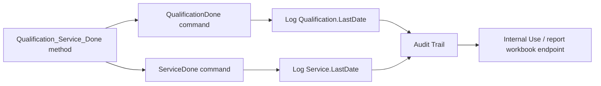

# TCC Qualification Service Done Black Box Decomposition

Extraction date: 2026-07-10

Scope: TCC FOQ `Qualification_Service_Done` injection for `VH-C10-A`,
`VC-C10-A`, and `VA-C10-A`.

---
Test name: Qualification Service Done
Models: VH-C10-A / VC-C10-A / VA-C10-A
Status: first black-box decomposition complete; exact report workbook endpoint
remains open verification
---

This document decomposes the `Qualification_Service_Done` injection as a
generation contract. It is not a measurement method. It writes the service and
qualification completion state to the TCC wellness object and logs the resulting
dates to the audit trail.

```text
Method evidence:
  RUN ColumnComp.ColumnComp_Wellness.QualificationDone
  RUN ColumnComp.ColumnComp_Wellness.ServiceDone
  RUN Log ColumnComp_Wellness.Service.LastDate
  RUN Log ColumnComp_Wellness.Qualification.LastDate
```

There are no RetTimes, no raw channels, and no mapped FOQ DB fields for this
injection in the current TCC mapping. For generation, this row should remain a
separate procedure-state injection rather than being merged into a functional
temperature or sensor test.

## Evidence Sources

| Evidence | Source |
|---|---|
| Test intent node | `cmbx_data_explorer/docs/TCC_TEST_KNOWLEDGE_NODE_MODEL.md` |
| Injection workbench notes | `cmbx_data_explorer/docs/TCC_INJECTION_BY_INJECTION_REVERSE_WORKBENCH.md` |
| Method/report alignment | `cmbx_data_explorer/docs/TCC_METHOD_REPORT_ALIGNMENT.md` |
| Required symbols | `cmbx_data_explorer/docs/TCC_REQUIRED_SYMBOL_MANIFEST.md` |
| Method flow, VH | `knowledge_base/tcc_reverse_probe/VH/6000001/QUALIFICATION_SERVICE_DONE_embedded_method_flow.txt` |
| Method flow, VC | `knowledge_base/tcc_reverse_probe/VC/3000004/QUALIFICATION_SERVICE_DONE_embedded_method_flow.txt` |
| Method flow, VA | `knowledge_base/tcc_reverse_probe/VA/0000003/QUALIFICATION_SERVICE_DONE_embedded_method_flow.txt` |
| DB mapping | `foq/FOQResultLocations_V2.83.xls` |

## Executive Answer

1. The instrument method is `Qualification_Service_Done`.
2. VH/VC/VA decoded method flows are identical.
3. The method calls `ColumnComp.ColumnComp_Wellness.QualificationDone`.
4. It then calls `ColumnComp.ColumnComp_Wellness.ServiceDone`.
5. It logs `ColumnComp_Wellness.Service.LastDate`.
6. It logs `ColumnComp_Wellness.Qualification.LastDate`.
7. It records no RetTimes and starts no raw signal channels.
8. The report context is `Internal Use`; formula-object evidence for the exact
   final workbook cell is not yet exposed.
9. `FOQResultLocations_V2.83.xls` has no mapped DB output row for this
   injection, so this is an audit/procedure-state contract, not a DB result
   contract.

## Contract 1: Method Command

### 1.1 Device Branch Binding

| Device | Injection | Instrument Method | Processing Method | Report Template | Report Sheets | Status |
|---|---|---|---|---|---|---|
| VH-C10-A | `Qualification_Service_Done` | `Qualification_Service_Done` | `No_Integration` | `Report_VTCC_V2_12` | `Internal Use` | sequence evidence closed |
| VC-C10-A | `Qualification_Service_Done` | `Qualification_Service_Done` | `CORRECT_ACCURACY_INJ_INSERTION` | `Report_VTCC_V2_12` | `Internal Use` | sequence evidence closed |
| VA-C10-A | `Qualification_Service_Done` | `Qualification_Service_Done` | `No_Integration` | `Report_VATCC_V1_01` | `Internal Use` | sequence evidence closed |

### 1.2 Method Contract Summary

| Contract item | Evidence |
|---|---|
| RetTimes | not used |
| Raw channels | not used |
| Completion command 1 | `ColumnComp.ColumnComp_Wellness.QualificationDone` |
| Completion command 2 | `ColumnComp.ColumnComp_Wellness.ServiceDone` |
| Audit log 1 | `Log ColumnComp_Wellness.Service.LastDate` |
| Audit log 2 | `Log ColumnComp_Wellness.Qualification.LastDate` |
| Manual action | none observed in decoded method flow |
| Abort logic | none observed in decoded method flow |

### 1.3 Decoded Method Flow

```yaml
QUALIFICATION_SERVICE_DONE:
  InstrumentSetup:
    - comment: "Set the Qualification and Service date for service instruments"
  Run:
    - order: 1
      action: RUN
      command: ColumnComp.ColumnComp_Wellness.QualificationDone
      meaning: "Marks qualification as done in the TCC wellness/service object."
    - order: 2
      action: RUN
      command: ColumnComp.ColumnComp_Wellness.ServiceDone
      meaning: "Marks service as done in the TCC wellness/service object."
    - order: 3
      action: RUN Log
      target: ColumnComp_Wellness.Service.LastDate
      meaning: "Writes the resulting service date to audit evidence."
    - order: 4
      action: RUN Log
      target: ColumnComp_Wellness.Qualification.LastDate
      meaning: "Writes the resulting qualification date to audit evidence."
```

### 1.4 Generation Meaning

This method has a high procedural meaning but low calculation complexity. A
generated FOQ sequence should keep it as its own injection because it mutates
service/qualification state. It should not be silently attached to another
method unless a human explicitly confirms that the service-state side effect is
intended.

## Contract 2: Processing Method

### 2.1 Binding

| Device | Processing Method | Meaning |
|---|---|---|
| VH-C10-A | `No_Integration` | No integration/calculation processing required. |
| VC-C10-A | `CORRECT_ACCURACY_INJ_INSERTION` | Corrective processing binding follows the VC sequence pattern; this does not change the decoded service method flow. |
| VA-C10-A | `No_Integration` | No integration/calculation processing required. |

### 2.2 IRC / Corrective Behavior

No `Qualification_Service_Done`-specific IRC insertion was observed in the
decoded method evidence. VC binds the injection to `CORRECT_ACCURACY_INJ_INSERTION`
as part of the broader VC sequence corrective-processing pattern. The exact
pass-action behavior of that processing method remains a separate processing
method black-box item.

## Contract 3: Report Formula

### 3.1 Report Context

| Report evidence | Status |
|---|---|
| Primary sheet/context | `Internal Use` |
| Heavy raw calculation | not expected |
| Formula-object cells | not found in current VH formula object TSV |
| Audit evidence expected | `ColumnComp_Wellness.Service.LastDate`, `ColumnComp_Wellness.Qualification.LastDate` |
| Workbook endpoint | Open Verification Required |

### 3.2 Interpretation

The report contract is currently known as a metadata/audit endpoint. The method
produces audit evidence by logging the two LastDate values. The exact workbook
cell that displays or checks these values is not yet closed because it was not
visible as a `ReportFormulaObject` in the current extracted TSV.



## Contract 4: DB Contract

| DB contract item | Status |
|---|---|
| `RES_Qualification_Service` | listed in alignment as possible intent field but not mapped in `FOQResultLocations_V2.83.xls` |
| Device-specific mapped DB fields | none observed |
| SQL type | not applicable until a DB field is confirmed |
| Precision/display rule | not applicable |

Current conclusion: no DB output contract is closed for
`Qualification_Service_Done`. The row matters because of its method side effect
and report/audit trace, not because it writes a mapped FOQ result field.

## Contract 5: Config Requirement

| Requirement | Why it matters |
|---|---|
| `ColumnComp` device present | The method calls TCC wellness commands under `ColumnComp`. |
| `ColumnComp.ColumnComp_Wellness.QualificationDone` command available | Required to mark qualification completion. |
| `ColumnComp.ColumnComp_Wellness.ServiceDone` command available | Required to mark service completion. |
| `ColumnComp_Wellness.Service.LastDate` property available | Required audit log source. |
| `ColumnComp_Wellness.Qualification.LastDate` property available | Required audit log source. |
| Service-level access if required by CM configuration | Wellness/service commands may depend on the driver/config access level. |

Required-symbol manifest also groups this test with Factory Default / Service
symbols:

```text
ColumnComp.ColumnComp_Wellness.Qualification.Interval
ColumnComp.ColumnComp_Wellness.Qualification.WarningPeriod
ColumnComp.ColumnComp_Wellness.Qualification.GracePeriod
ColumnComp.ColumnComp_Wellness.Service.Interval
ColumnComp.ColumnComp_Wellness.Service.WarningPeriod
ColumnComp.ColumnComp_Wellness.Workload_CC
ColumnComp.ColumnComp_Wellness.QualificationDone
ColumnComp.ColumnComp_Wellness.ServiceDone
```

## Contract 6: Open Verification

| # | Open item | Current evidence | Needed evidence | Likely source |
|---|---|---|---|---|
| 1 | Exact report workbook cell for Service/Qualification date | Method logs LastDate; report context is `Internal Use` | FormulaOne/workbook cell dependency for display/check | report template `SpreadSheetData` |
| 2 | Whether `RES_Qualification_Service` exists in any non-TCC or newer mapping | Current TCC mapping has no row | Confirm against future mapping files | future `FOQResultLocations` versions |
| 3 | Whether wellness commands require service access in live CM | Command names are present in decoded method | Live CM method validation or command help | Chromeleon command browser/help |
| 4 | VC processing method side effect | VC binds `CORRECT_ACCURACY_INJ_INSERTION` | Processing method pass-action decode | processing method XML |

## VH / VC / VA Comparison

| Model | Method flow | Processing branch | Report template | DB mapping | Meaning |
|---|---|---|---|---|---|
| VH-C10-A | same | `No_Integration` | `Report_VTCC_V2_12` | none | service/qualification state write |
| VC-C10-A | same | `CORRECT_ACCURACY_INJ_INSERTION` | `Report_VTCC_V2_12` | none | same method, corrective processing branch differs |
| VA-C10-A | same | `No_Integration` | `Report_VATCC_V1_01` | none | same service/qualification state write |

## Generation Readiness

| Use case | Readiness | Notes |
|---|---|---|
| Clone full FOQ sequence | reusable with caution | Keep injection as separate final-state step. |
| Generate functional temperature-only subset | usually exclude unless explicitly requested | It mutates wellness/service state and is not a measurement result. |
| Generate service completion sequence | partial | Method command flow is clear; report endpoint still needs workbook verification. |
| DB upload/result output | not applicable | No mapped DB contract is currently closed. |

