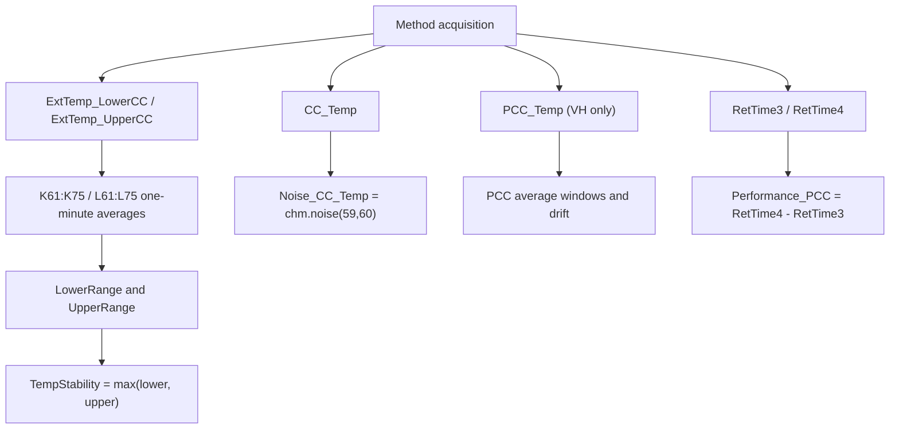
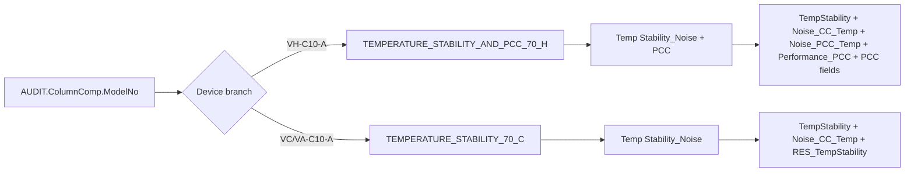

# TCC Temperature Stability and PCC Black Box Decomposition

Extraction date: 2026-07-10

Scope: TCC FOQ Temperature Stability for `VH-C10-A`, `VC-C10-A`, and `VA-C10-A`.

---
Test name: Temperature Stability / Temperature Stability and PCC
Models: VH-C10-A / VC-C10-A / VA-C10-A
Status: first black-box decomposition complete; workbook internals and exact non-PCC payload still need open verification
---

This document decomposes the Temperature Stability test as a generation contract.
The key branch is:

```text
VH-C10-A -> Temperature Stability_and_PCC_H -> TEMPERATURE_STABILITY_AND_PCC_70_H
VC-C10-A / VA-C10-A -> Temperature Stability_C -> TEMPERATURE_STABILITY_70_C
```

The VH branch is not only a longer version of the VC/VA branch. It combines two
test intents on one timeline:

```text
1. CC stability/noise at 70 C.
2. VH-only PCC performance, accuracy, drift, noise, and cool-down timing.
```

## Evidence Sources

| Evidence | Source |
|---|---|
| Test intent node | `cmbx_data_explorer/docs/TCC_TEST_KNOWLEDGE_NODE_MODEL.md` |
| FOQ TD extracted KB | `cmbx_data_explorer/docs/FOQ_TCC_VX_C10_A_TD_KNOWLEDGE_MANAGEMENT.md` |
| Injection workbench notes | `cmbx_data_explorer/docs/TCC_INJECTION_BY_INJECTION_REVERSE_WORKBENCH.md` |
| Method/report alignment | `cmbx_data_explorer/docs/TCC_METHOD_REPORT_ALIGNMENT.md` |
| Decoded method contract, VH | `knowledge_base/tcc_method_contracts/VH_6000001_TEMPERATURE_STABILITY_AND_PCC_70_H_contract.md` |
| Method contract summaries | `knowledge_base/tcc_method_contracts/*_method_contracts.tsv` |
| Report formula objects | `knowledge_base/tcc_report_formula_objects_vh_6000001_all_sheets.tsv` |
| Formula reverse notes | `cmbx_data_explorer/CM_FORMULA_REVERSE_ENGINEERING.md` |
| DB mapping | `foq/FOQResultLocations_V2.83.xls` |

## Executive Answer

1. The stability measurement is a 70 C long-window test. The report reads
   external lower and upper thermometer averages from one-minute windows between
   45 and 60 minutes.
2. Stability is evaluated separately for the lower and upper external
   thermometers:

   ```text
   LowerRange = max(K61:K75) - min(K61:K75)
   UpperRange = max(L61:L75) - min(L61:L75)
   RawStability = max(LowerRange, UpperRange)
   ```

   It must not be calculated as one combined range across K:L, because that
   would mix external thermometer offset into the stability result.
3. `Noise_CC_Temp` is calculated from `CC_Temp` with `chm.noise(59,60)`.
   VH additionally calculates `Noise_PCC_Temp` from `PCC_Temp` with the same
   one-minute window.
4. `VC-C10-A` and `VA-C10-A` use `TEMPERATURE_STABILITY_70_C`,
   `NO_INTEGRATION`, and the `Temp Stability_Noise` report sheet only.
5. `VH-C10-A` uses `TEMPERATURE_STABILITY_AND_PCC_70_H`,
   `NO_INTEGRATION`, and both `Temp Stability_Noise` and `PCC` report sheets.
   The method emits `RetTimes.RetTime2`, `RetTimes.RetTime3`, and
   `RetTimes.RetTime4` for the PCC heat/cool branch.
6. PCC cool-down performance is report-derived from `RetTime4 - RetTime3`.
   The report also calculates PCC averages at fixed windows, PCC drift from
   minute 19 to 24, and PCC noise at minute 59 to 60.

## Contract 1: Method Command

### 1.1 Device Branch Binding

| Device | Injection | Instrument Method | Processing Method | Report Template | Report Sheets |
|---|---|---|---|---|---|
| VH-C10-A | `Temperature Stability_and_PCC_H` | `TEMPERATURE_STABILITY_AND_PCC_70_H` | `NO_INTEGRATION` | `Report_VTCC_V2_12` | `Temp Stability_Noise`, `PCC` |
| VC-C10-A | `Temperature Stability_C` | `TEMPERATURE_STABILITY_70_C` | `NO_INTEGRATION` | `Report_VTCC_V2_12` | `Temp Stability_Noise` |
| VA-C10-A | `Temperature Stability_C` | `TEMPERATURE_STABILITY_70_C` | `NO_INTEGRATION` | `Report_VATCC_V1_01` | `Temp Stability_Noise` |

### 1.2 VC/VA Non-PCC Method Contract

Decoded summary evidence for `TEMPERATURE_STABILITY_70_C`:

```yaml
method: TEMPERATURE_STABILITY_70_C
models: [VC-C10-A, VA-C10-A]
stages:
  - InstrumentSetup
  - Equilibration
  - InjectPreparation
  - StartRun
  - Run
  - StopRun
  - PostRun
setpoints:
  - ColumnComp.CC.Temperature.Nominal: 70.0
wait_conditions:
  - CC.TempReady
ret_times:
  emitted: []
logged_properties:
  - GenericLong9
channels:
  - ColumnComp.CC_Temp
  - ColumnComp.CC_U_Temp_Actual
  - ColumnComp.CC_L_Temp_Actual
  - ColumnComp.CC_UCTL_TempRear_Actual
  - ColumnComp.PWM_CCU_A
  - ColumnComp.PWM_CCU_B
  - ColumnComp.PWM_CCL_A
  - ColumnComp.PWM_CCL_B
  - ColumnComp.Fan_Rear_ActualRPM
  - Thermometer1.ExtTemp_UpperCC
  - Thermometer1.ExtTemp_LowerCC
  - Thermometer.Environment_Temperature
  - ColumnComp.LEDBoard_LeakDiff
  - ColumnComp.LEDBoard_A13
  - ColumnComp.LEDBoard_A14
  - ColumnComp.Oven_Gas_MuteTimeRemain
```

Semantic command flow:

| Order | Command group | Meaning | Generation constraint |
|---:|---|---|---|
| 1 | Configure CC stability parameters | Set CC control parameters and nominal temperature to 70 C. | Required. The report expects a 70 C stability run. |
| 2 | Wait for readiness | Wait until `CC.TempReady`. | Required before the 45..60 min report window. |
| 3 | Start acquisition | Acquire internal CC channels, PWM/fan channels, external thermometers, environment and leak-related channels. | Required for `Temp Stability_Noise`. |
| 4 | Hold acquisition | Keep the timeline long enough to cover report windows 45..60 and 59..60. | Required unless the report formulas are rewritten. |
| 5 | Stop acquisition | Turn acquired channels off and finish run. | Required cleanup. |

Line-level decoded flow evidence for VC/VA confirms the non-PCC command script:

| Stage | Commands confirmed in decoded flow | Contract meaning |
|---|---|---|
| `Equilibration` | Set `Variables.GenericLong9`; log it; abort if the model branch is unknown. | Page/model context and branch guard. |
| `Equilibration` | `CC.ReadyTempDelta = 0.05 C`, `CC.EquilibrationTime = 0.5 min`, `CC.TempCtrl = On`, `CC.Mode = StillAir`. | Stability-specific readiness definition and StillAir operation. |
| `Equilibration` | Set CC/debug/leak diagnostic channel data collection rates to `20`. | Diagnostic channels are prepared before acquisition. |
| `Equilibration` | `ColumnComp.CC.Temperature.Nominal = 70.0`. | The stability setpoint is fixed at 70 C. |
| `InjectPreparation` | `Wait CC.TempReady`. | Acquisition does not start until the CC readiness condition is true. |
| `StartRun` | Turn on `CC_Temp`, CC actual/PWM/fan channels, external thermometer channels, environment temperature, and leak diagnostic channels. | Supplies the raw signals used by `Temp Stability_Noise`. |
| `Run` | No additional decoded commands. | The run stage is a hold/acquisition period; timing must still cover the report windows. |
| `StopRun` / `PostRun` | Turn off all acquired CC, external thermometer, environment, and leak diagnostic channels. | Cleanup. |

Evidence files:

```text
knowledge_base/tcc_reverse_probe/VC/3000004/TEMPERATURE_STABILITY_70_C_embedded_method_flow.txt
knowledge_base/tcc_reverse_probe/VA/0000003/TEMPERATURE_STABILITY_70_C_embedded_method_flow.txt
```

### 1.3 VH PCC Method Contract

Decoded summary evidence for `TEMPERATURE_STABILITY_AND_PCC_70_H`:

```yaml
method: TEMPERATURE_STABILITY_AND_PCC_70_H
models: [VH-C10-A]
stages:
  - InstrumentSetup
  - Equilibration
  - InjectPreparation
  - StartRun
  - Run
  - StopRun
  - PostRun
setpoints:
  - ColumnComp.PCC.Temperature.Nominal: 40.00
  - ColumnComp.CC.Temperature.Nominal: 70.0
  - ColumnComp.PCC.Temperature.Nominal: 80.0
  - ColumnComp.PCC.Temperature.Nominal: 40.0
wait_conditions:
  - CC.TempReady AND PCC.TempReady
ret_times:
  initialized:
    - RetTimes.RetTime1
    - RetTimes.RetTime2
    - RetTimes.RetTime3
    - RetTimes.RetTime4
  emitted:
    - RetTimes.RetTime2
    - RetTimes.RetTime3
    - RetTimes.RetTime4
triggers:
  - T60UP: PCC.Temperature.Value >= 60.0
  - T50Down: PCC.Temperature.Value <= 50.0 AND Variables.GenericBool1
  - T40Down: PCC.Temperature.Value <= 40.0 AND Variables.GenericBool2
logged_properties:
  - GenericLong9
  - PCC.Temperature.Value
channels:
  - ColumnComp.CC_Temp
  - ColumnComp.PCC_Temp
  - ColumnComp.PWM_PCC_A
  - ColumnComp.PWM_PCC_B
  - Thermometer1.ExtTemp_UpperCC
  - Thermometer1.ExtTemp_LowerCC
  - Thermometer.Environment_Temperature
```

Semantic command flow:

| Order | Command group | Meaning | Required report dependency |
|---:|---|---|---|
| 1 | Enable CC and PCC temperature control | Prepare both compartments for stability/PCC run. | `CC.TempReady AND PCC.TempReady` must be meaningful. |
| 2 | Set CC nominal 70 C and PCC nominal 40 C | Establish the stability run and first PCC reference window. | PCC sheet reads nominal audit and averages `PCC_Temp` from 0..5 min. |
| 3 | Wait for readiness | Wait until both CC and PCC are ready. | Prevents report windows from covering unstable startup. |
| 4 | Acquire CC, PCC, external thermometer, PWM/fan and environment channels | Produce raw signals for stability, noise, PCC average/drift/noise. | Required by `Temp Stability_Noise` and `PCC` sheets. |
| 5 | Trigger `T60UP` and emit `RetTime2` | Detect PCC heat-up crossing 60 C. | Method evidence; not currently a DB leaf cell. |
| 6 | Set PCC nominal to 80 C | Drive the PCC high-temperature segment. | Supports PCC accuracy 80 C window. |
| 7 | Trigger `T50Down` and emit `RetTime3` | Detect cool-down crossing 50 C after heat event. | `PCC!K105 = AUDIT.RetTime3`. |
| 8 | Trigger `T40Down` and emit `RetTime4` | Detect cool-down crossing 40 C. | `PCC!L105 = AUDIT.RetTime4`. |
| 9 | Return PCC nominal to 40 C / stop acquisition | Close the PCC branch and finish run. | Required cleanup. |

### 1.4 Method Branch Difference

| Feature | VH-C10-A | VC-C10-A / VA-C10-A |
|---|---|---|
| CC stability at 70 C | Yes | Yes |
| PCC hardware dependency | Required | Not used |
| PCC_Temp channel | Required | Must not be required |
| RetTime emissions | RetTime2, RetTime3, RetTime4 | None in decoded summary |
| Report sheets | `Temp Stability_Noise`, `PCC` | `Temp Stability_Noise` |
| Main generation risk | Leaving PCC branch out breaks PCC DB fields | Leaving PCC branch in creates invalid hardware/report dependencies |

## Contract 2: Processing Method

All known branches bind to `NO_INTEGRATION`.

```yaml
processing_method: NO_INTEGRATION
used_by:
  - Temperature Stability_and_PCC_H
  - Temperature Stability_C
irc_injected: false
expected_behavior:
  - no chromatographic integration required
  - no Accuracy/Calibration corrective injection insertion is expected here
stop_condition: not identified in current evidence
```

Interpretation:

```text
Temperature Stability is selected by device-specific sequence/injection binding.
Unlike Temperature Accuracy, this decomposition does not currently show an IRC
Pass Action that inserts the stability branch.
```

Open verification:

| Item | Required evidence | Likely source |
|---|---|---|
| Whether the original production sequence can insert stability by IRC in some workflows | Full processing method business rows / CM UI view | Processing method XML or Chromeleon UI |
| Whether `NO_INTEGRATION` contains any non-obvious stop/pass behavior | Full processing method action table | Processing method payload |

## Contract 3: Report Formula

### 3.1 `Temp Stability_Noise` Formula Objects

| Cell(s) | Formula | Fixed channel | Meaning |
|---|---|---|---|
| `K61:K75` | `chm.sig_value("average", 45..60 one-minute windows)` | `ExtTemp_LowerCC` | Lower external thermometer one-minute averages. |
| `L61:L75` | `chm.sig_value("average", 45..60 one-minute windows)` | `ExtTemp_UpperCC` | Upper external thermometer one-minute averages. |
| `K86` | `chm.noise(59,60)` | `CC_Temp` | Internal CC temperature noise at the end of the run. |
| `K87` | `chm.noise(59,60)` | `PCC_Temp` | VH/PCC temperature noise at the end of the run. |

Workbook-derived stability rule:

```text
LowerRange = max(K61:K75) - min(K61:K75)
UpperRange = max(L61:L75) - min(L61:L75)
RawStability = max(LowerRange, UpperRange)
Displayed TempStability = RawStability displayed to 2 decimals
Pass/fail = RawStability <= Definitions!Temperature Stability
```

Exported workbook value evidence from
`cmbx_data_explorer/outputs/foq_contract_6545327_logic_audit/6545327/6545327.seq/Temperature Stability_and_PCC_H.xls`
supports the reconstructed workbook behavior:

| Exported cell/value | Reconstructed value | Interpretation |
|---|---:|---|
| `Temp Stability_Noise!C26 = 0.05` | `Definitions!Temperature Stability = 0.05` | Criterion cell. |
| `LowerRange = 0.0071760797` from `K61:K75` | max/min of lower external one-minute averages | Lower sensor stability range. |
| `UpperRange = 0.0037873754` from `L61:L75` | max/min of upper external one-minute averages | Upper sensor stability range. |
| `Temp Stability_Noise!D26 = 0.010000000000005116` | display-rounded `max(LowerRange, UpperRange)` to 2 decimals | Observed summary cell stores the two-decimal report value. |
| `Temp Stability_Noise!E26 = Test passed` | raw/displayed observed value is within `0.05` | Pass/fail cell. |

Generation implication:

```text
If a generated method keeps this report unchanged, the method must retain at
least a 60-minute acquisition timeline and must make minutes 45..60 meaningful.
A shortened stability run requires a new report template or rewritten formula
windows.
```

### 3.2 VH `PCC` Formula Objects

| Cell | Formula | Fixed channel / source | Meaning |
|---|---|---|---|
| `K89` | `AUDIT.PCC.Temperature.Nominal(4.000)` | Audit | PCC nominal value near the first 40 C window. |
| `K90` | `AUDIT.PCC.Temperature.Nominal(12.000)` | Audit | PCC nominal value near the 80 C window. |
| `K91` | `AUDIT.PCC.Temperature.Nominal(20.000)` | Audit | PCC nominal value near the second 40 C window. |
| `L89` | `chm.sig_value("average", 0, 5)` | `PCC_Temp` | First PCC 40 C average. |
| `L90` | `chm.sig_value("average", 10, 15)` | `PCC_Temp` | PCC 80 C average. |
| `L91` | `chm.sig_value("average", 19, 24)` | `PCC_Temp` | Second PCC 40 C average. |
| `K97` | `chm.sig_value("drift", 19, 24)` | `PCC_Temp` | PCC drift after return to 40 C. |
| `K105` | `AUDIT.RetTime3(1,"forward")` | Audit RetTime | PCC cool-down 50 C anchor. |
| `L105` | `AUDIT.RetTime4(1,"forward")` | Audit RetTime | PCC cool-down 40 C anchor. |

Workbook-derived PCC rules:

```text
Performance_PCC = L105 - K105
Pass/fail = Performance_PCC <= Definitions!PCC CoolDownTime
PCC average/deviation cells compare L89/L90/L91 to audit nominal values.
```

Exported workbook value evidence from the same logic-audit workbook supports
the reconstructed PCC summary/pass behavior:

| Exported cell/value | Reconstructed value | Interpretation |
|---|---:|---|
| `PCC!C26 = 2.0` | `Definitions!PCC CoolDownTime = 2.0` | PCC cool-down criterion. |
| `PCC!K105 = 16.549`, `PCC!L105 = 17.381` | RetTime3 and RetTime4 anchors | Cool-down start/end anchors. |
| `PCC!D26 = 0.8299999999999983` | `(17.381 - 16.549) -> 0.83` | PCC cool-down performance displayed to 2 decimals. |
| `PCC!E26 = Test passed` | `0.83 <= 2.0` | PCC pass/fail cell. |
| `PCC!L89/L90/L91 = 40.0022924528 / 80.1265858586 / 39.7994672131` | `PCC_Temp` average windows | PCC accuracy source values. |
| `PCC!K97 = 0.0658587705` | `PCC_Temp` drift over 19..24 min | PCC drift source value. |

### 3.3 Formula Flow



## Contract 4: DB Contract

### 4.1 VH-C10-A DB Leaves

| DB Field | Report file | Sheet | Cell / source | Rule |
|---|---|---|---|---|
| `TempStability` | `Temperature Stability_and_PCC_H.XLS` | `Temp Stability_Noise` | `D26` | Displayed max lower/upper sensor range. |
| `Noise_CC_Temp` | `Temperature Stability_and_PCC_H.XLS` | `Temp Stability_Noise` | `K86` | `CC_Temp chm.noise(59,60)`. |
| `Noise_PCC_Temp` | `Temperature Stability_and_PCC_H.XLS` | `Temp Stability_Noise` | `K87` | `PCC_Temp chm.noise(59,60)`. |
| `RES_TempStability` | `Temperature Stability_and_PCC_H.XLS` | `Temp Stability_Noise` | `E26` | Pass/fail versus Definitions. |
| `Performance_PCC` | `Temperature Stability_and_PCC_H.XLS` | `PCC` | `D26` | `RetTime4 - RetTime3`, displayed to 2 decimals. |
| `RES_PCC` | `Temperature Stability_and_PCC_H.XLS` | `PCC` | `E26` | Pass/fail versus PCC CoolDownTime. |
| `PCC_Acc_40_Step1` | `Temperature Stability_and_PCC_H.XLS` | `PCC` | `L89` | Average `PCC_Temp` 0..5 min. |
| `PCC_Acc_80` | `Temperature Stability_and_PCC_H.XLS` | `PCC` | `L90` | Average `PCC_Temp` 10..15 min. |
| `PCC_Acc_40_Step2` | `Temperature Stability_and_PCC_H.XLS` | `PCC` | `L91` | Average `PCC_Temp` 19..24 min. |
| `PCC_Drift` | `Temperature Stability_and_PCC_H.XLS` | `PCC` | `K97` | `PCC_Temp` drift over 19..24 min. |

### 4.2 VC/VA DB Leaves

| Device | DB Field | Report file | Sheet | Cell / source | Rule |
|---|---|---|---|---|---|
| VC-C10-A | `TempStability` | `Temperature Stability_C.XLS` | `Temp Stability_Noise` | `D26` | Displayed max lower/upper sensor range. |
| VC-C10-A | `Noise_CC_Temp` | `Temperature Stability_C.XLS` | `Temp Stability_Noise` | `K86` | `CC_Temp chm.noise(59,60)`. |
| VC-C10-A | `RES_TempStability` | `Temperature Stability_C.XLS` | `Temp Stability_Noise` | `E26` | Pass/fail versus Definitions. |
| VA-C10-A | `TempStability` | `Temperature Stability_C.XLS` | `Temp Stability_Noise` | `D26` | Displayed max lower/upper sensor range. |
| VA-C10-A | `Noise_CC_Temp` | `Temperature Stability_C.XLS` | `Temp Stability_Noise` | `K86` | `CC_Temp chm.noise(59,60)`. |
| VA-C10-A | `RES_TempStability` | `Temperature Stability_C.XLS` | `Temp Stability_Noise` | `E26` | Pass/fail versus Definitions. |

## Contract 5: Config Requirement

| Requirement | VH-C10-A | VC-C10-A | VA-C10-A | Failure mode |
|---|---|---|---|---|
| `AUDIT.ColumnComp.ModelNo` device source of truth | Required | Required | Required | Wrong branch/report selection. |
| Column compartment temperature control | Required | Required | Required | `CC.TempReady` never becomes valid. |
| External upper/lower thermometers | Required | Required | Required | Stability cells `K61:K75` / `L61:L75` cannot evaluate. |
| `CC_Temp` raw channel | Required | Required | Required | `Noise_CC_Temp` cannot evaluate. |
| PCC hardware/configuration | Required | Not applicable | Not applicable | VH PCC DB fields cannot evaluate, or non-VH method will fail if PCC commands remain. |
| `PCC_Temp` raw channel | Required | Not applicable | Not applicable | `Noise_PCC_Temp`, PCC accuracy, drift and performance fail. |
| RetTimes `RetTime3` and `RetTime4` | Required | Not applicable | Not applicable | `Performance_PCC` cannot evaluate. |
| Report template branch | `Report_VTCC_V2_12` | `Report_VTCC_V2_12` | `Report_VATCC_V1_01` | DB field mapping points to wrong sheets/cells. |

Generation guardrails:

```text
1. Do not generate the VH method for a non-PCC TCC configuration.
2. Do not generate the VC/VA method when VH PCC DB fields are requested.
3. Do not shorten the acquisition window unless `Temp Stability_Noise` formulas are also regenerated.
4. Keep external lower and upper thermometer ranges separate in report formulas.
```

## Contract 6: Open Verification

Items below are marked Open Verification Required until the listed evidence is
captured.

### 6.1 Resolved by TD / Report Contract Evidence

| Topic | Resolved evidence | Remaining boundary |
|---|---|---|
| Full line-by-line command script for VC/VA `TEMPERATURE_STABILITY_70_C` | Decoded CMBX method flow files for VC `3000004` and VA `0000003` expose the stage-by-stage command script: branch/page logging, readiness parameters, 70 C setpoint, `Wait CC.TempReady`, channel acquisition on/off, and no PCC/RetTime commands. | The decoded `Run` stage contains no explicit delay; the authoritative source of run duration/timeline still needs to be treated as sequence/method runtime context when generating a shortened package. |
| Workbook summary/pass behavior for `Temp Stability_Noise!D26/E26` and `PCC!D26/E26` | Exported logic-audit workbook values match the reconstructed rules: stability D26 is the two-decimal display of the larger lower/upper external range, E26 passes against `0.05`; PCC D26 is `RetTime4 - RetTime3` displayed to 2 decimals, E26 passes against `2.0`. | Serialized FormulaOne formula tokens are still not decoded; binary-equivalent template regeneration would need either token extraction or manual CM/Excel confirmation. |
| Current TCC `Definitions!Temperature Stability` criterion used by the report/DB contract | FOQ TD Table 4 lists Temperature Stability as external, `+/- 0.05 C`, and states that the maximum difference must be `<= 2*0.05 C`. The report dependency trace records `Definitions!Temperature Stability = 0.05`, and the calculation map compares raw D26 against `0.05` while displaying D26 with two decimals. | Exact static cell extraction from each embedded VTCC/VATCC workbook remains part of the broader report-template parity review. |
| Current VH `Definitions!PCC CoolDownTime` criterion used by the report/DB contract | FOQ TD Table 4 lists PCC Cool Down Time as external and less than `2.0 min` from 50 C to 40 C. The report dependency trace records `Definitions!PCC CoolDownTime = 2 min`, and the report cell builder compares `L105 - K105` against `2.0` while displaying D26 with two decimals. | Serialized FormulaOne token extraction remains open only for binary-equivalent template regeneration. |
| VA `Report_VATCC_V1_01` `Temp Stability_Noise` layout parity | Real VA `0000003.cmbx` report XML confirms `Temp Stability_Noise` is active and applies to `Temperature Stability_C`. Direct formula objects match the same lower/upper external thermometer grid family: `K61:K75 = ExtTemp_LowerCC chm.sig_value("average",45..60)` and `L61:L75 = ExtTemp_UpperCC chm.sig_value("average",45..60)`. | FormulaOne summary/pass tokens remain open for binary-equivalent template regeneration. |

### 6.2 Remaining Open Verification

| # | Uncertain point | Required evidence | Likely source |
|---:|---|---|---|
| 1 | Whether Stability has any hidden IRC insertion path in production workflows. | Full processing method action rows. | Processing method XML / Chromeleon UI. |

## VH / VC / VA Comparison

| Question | VH-C10-A | VC-C10-A | VA-C10-A |
|---|---|---|---|
| Which injection is used? | `Temperature Stability_and_PCC_H` | `Temperature Stability_C` | `Temperature Stability_C` |
| Which method is used? | `TEMPERATURE_STABILITY_AND_PCC_70_H` | `TEMPERATURE_STABILITY_70_C` | `TEMPERATURE_STABILITY_70_C` |
| Is PCC tested? | Yes | No | No |
| Does the method emit RetTimes for this test? | Yes, RetTime2/3/4 | No evidence in decoded summary | No evidence in decoded summary |
| Which raw channels drive stability? | `ExtTemp_LowerCC`, `ExtTemp_UpperCC` | Same | Same |
| Which raw channels drive noise? | `CC_Temp`, `PCC_Temp` | `CC_Temp` | `CC_Temp` |
| Which DB fields are unique? | PCC performance, PCC result, PCC accuracy/drift/noise | None | None |

## Command, Report, DB Flow



## Generation Readiness

| Use case | Readiness | Reason |
|---|---|---|
| Reuse full VH Stability/PCC branch from existing CMBX | High | Method/report/DB chain is mostly closed and RetTime semantics are known. |
| Reuse full VC/VA non-PCC stability branch from existing CMBX | Medium | DB/report chain is closed; line-level method flow still needs one more evidence pass. |
| Generate shortened stability test without changing report | Not ready | Report windows are hard-coded to 45..60 and 59..60 min. |
| Split VH PCC into a standalone test | Partial | PCC formulas and RetTimes are known, but report/template rewrite and sequence binding need verification. |
| Merge Stability with another temperature test | Partial | Shared external thermometer resources are clear; report windows and timing conflicts need a dependency model. |
