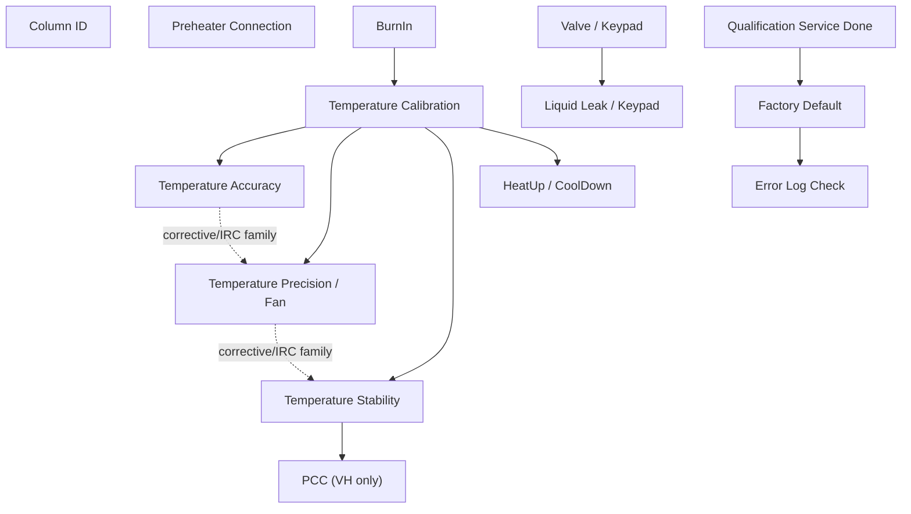

# TCC Test Relationship Model

Extraction date: 2026-07-10

Scope: inter-test dependency, resource, sequencing, and intent-tool rules for
TCC FOQ tests on `VH-C10-A`, `VC-C10-A`, and `VA-C10-A`.

Status: first relationship model complete enough for UI/intent-tool surfacing;
remaining open items are marked explicitly.

## Purpose

The black-box decomposition documents describe each test in isolation. This
model describes how the tests relate to each other. It is the bridge from
knowledge display to intent tools such as crop, merge, compare, and search.

Primary use cases:

```text
1. Explain why a selected test is or is not independently editable.
2. Show what changes if a user crops a test to fewer setpoints.
3. Show which tests share RetTimes, channels, report rules, or hardware config.
4. Decide what must remain when generating a smaller CMBX-like package.
5. Surface open verification before claiming a generated method/report is runnable.
```

## Source Documents

| Source | Role |
|---|---|
| `TCC_TEST_KNOWLEDGE_NODE_MODEL.md` | stable TKN list and DB/method/report links |
| `TCC_*_BLACK_BOX_DECOMPOSITION.md` | per-test six-contract evidence |
| `TCC_CM_METHOD_SCRIPT_DEPENDENCY_MODEL.md` | method-command dependency groups |
| `TCC_REQUIRED_SYMBOL_MANIFEST.md` | device/config symbol requirements |
| `FOQResultLocations_V2.83.xls` | DB contract closure |

## Test Order Model

### Canonical FOQ Order

| Order | Test ID | Injection | Primary role | Execution class |
|---:|---|---|---|---|
| 1 | `TCC_COL_01` | `ColumnIDs` | Column identity verification | audit/metadata |
| 2 | `TCC_PREHEATER_01` | `Preheater Connection Test` | Preheater port and heater/sensor check | RetTime + raw/audit |
| 3 | `TCC_VALVE_01` | `Valve` | Valve switching and keypad interaction | audit/fixed-time |
| 4 | `TCC_BURNIN_01` | `VTCC_BurnIn` | Thermal conditioning and thermometer sanity check | conditioning |
| 5 | `TCC_CAL_01` | `Temperature Calibration` | Calibration ladder / slope and correction context | temperature RetTime/raw |
| 6 | `TCC_ACC_01` | `Temperature Accuracy_H` or `Temperature Accuracy_C` | Multi-setpoint accuracy | temperature RetTime/raw |
| 7 | `TCC_PRECISION_01` | `Temperature Precision_and_Fan` or `Temperature Precision` | Repeatability and fan/state branch | temperature RetTime/raw |
| 8 | `TCC_STABILITY_PCC_01` / `TCC_STABILITY_01` | `Temperature Stability_and_PCC_H` or `Temperature Stability_C` | Stability and VH PCC branch | temperature RetTime/raw |
| 9 | `TCC_HEATCOOL_01` | `HeatUp and CoolDownTime` | Dynamic heating/cooling timing | temperature RetTime/raw |
| 10 | `TCC_LEAK_01` | `LiquidLeaktest` | Leak sensor and alarm/keypad workflow | manual audit/sensor |
| 11 | `TCC_SERVICE_01` | `Qualification_Service_Done` | Service/qualification state write | state mutation |
| 12 | `TCC_FACTORY_01` | `Factory Default` | Final defaults and metadata/DB identity | state mutation + metadata |
| 13 | `TCC_ERRORLOG_01` | `Error Log Check` | Final safe state and audit/error-log table | cleanup/audit |

### Execution Order Constraints

| Constraint ID | Constraint | Strength | Reason |
|---|---|---|---|
| `ORDER_01` | BurnIn should run before temperature measurement family. | hard for full FOQ, review-required for custom subset | It creates thermal history and external thermometer sanity evidence. |
| `ORDER_02` | Temperature Calibration should run before Accuracy, Precision, Stability, and HeatUp/CoolDown in full FOQ. | hard for full FOQ | Later tests assume calibrated/conditioned temperature behavior. |
| `ORDER_03` | Accuracy, Precision, Stability, and HeatUp/CoolDown all require external thermometer channels configured. | hard | Report formulas depend on `ExtTemp_UpperCC` and/or `ExtTemp_LowerCC`. |
| `ORDER_04` | VH Stability/PCC branch must not be replaced by VC/VA Stability branch. | hard | VH includes PCC DB/report fields and method command dependencies. |
| `ORDER_05` | Factory Default should run after functional tests. | hard for full FOQ | It clears logs/defaults and mutates service/final state. |
| `ORDER_06` | Error Log Check should follow Factory Default in full FOQ. | hard for full FOQ | It is the final audit/error-log table endpoint after log cleanup. |
| `ORDER_07` | Liquid Leak should preserve manual water injection, alarm mute, and cleanup prompts. | hard | Removing manual steps breaks the test contract. |

## Dependency Graph



## Dependency Matrix

| Test | Hard dependencies | Soft dependencies / review points | Downstream impact |
|---|---|---|---|
| Column ID | `ColumnComp.ModelNo`, Column A-D audit descriptions | VA applicability is open because production VA sequence omitted ColumnIDs in observed branch | DB `RES_ColumnID_*`; report/page context |
| Preheater Connection | Preheater modules, heater/sensor channels, RetTimes 1-4 | VA sequence applicability open | Preheater status and noise/diff fields |
| Valve / Keypad | Valve hardware and keypad/manual interaction | VA lower-only valve branch | Confirms valve switching; can inform periodic-valve generation |
| BurnIn | CC temperature control, external thermometers, debug/leak channels | Can be omitted only if test intent explicitly allows skipping preconditioning | Affects thermal history for later temperature tests |
| Temperature Calibration | External thermometers, calibration variables, model ladder | Parameterization requires report/DB ladder change | Foundation for temperature family |
| Temperature Accuracy | Calibration context, external thermometers, RetTimes 1-5 | Can crop setpoints only with report/DB remapping | DB TempAcc fields, pass/fail |
| Temperature Precision / Fan | External thermometers, fan/state branch, RetTimes | Fan branch formula still partly open | Precision DB fields and stability insertion chain |
| Temperature Stability | Calibration context, external thermometers, stability windows | Merge/crop requires window and RetTime redesign | Stability DB fields; VH branch leads to PCC |
| PCC | VH hardware only | Not applicable to VA/VC | PCC DB fields and performance/cooldown |
| HeatUp / CoolDown | Calibration context, RetTimes 1/3/4/6 | Temperature range and hold subtraction can be parameterized after review | Dynamic timing DB fields |
| Liquid Leak | Leak sensor, manual water injection, alarm mute | Report pass/fail workbook cell open | Sensor workflow evidence |
| Qualification Service | Wellness/service commands | Report endpoint open | Writes service/qualification state |
| Factory Default | Service code, wellness properties, precond/audit metadata | Workbook-derived `ModelVariant` and `RES_SN_Check` formulas open | DB identity fields and final defaults |
| Error Log Check | Final reconnect and safe-state symbols | Pass/fail criterion open | Final audit/error-log report endpoint |

## Shared Resource Model

### Hardware / Configuration Resources

| Resource | Used by | Notes |
|---|---|---|
| `AUDIT.ColumnComp.ModelNo` | all branch-sensitive tests, Factory Default DB, upload table selection | Device source of truth. Never infer from filename. |
| External thermometers `ExtTemp_UpperCC`, `ExtTemp_LowerCC` | BurnIn guard, Calibration, Accuracy, Precision, Stability, HeatUp/CoolDown | Required Generic Device/channel configuration. |
| `ColumnComp.CC` temperature control | BurnIn, Calibration, Accuracy, Precision, Stability, HeatUp/CoolDown, Error Log cleanup | Main thermal actuator and report source. |
| PCC hardware/control | VH Stability/PCC, VH BurnIn PCC-off branch | VH-only; should be absent from VA/VC generation branch. |
| Preheater modules | Preheater Connection, Error Log cleanup on VH/VC | VA branch may omit preheater control. |
| Valve hardware/keypad | Valve / Keypad, Liquid Leak context, Factory Default operator check | VA lower-only branch must be respected. |
| Leak sensor / LEDBoard channels | BurnIn, Liquid Leak, Factory Default final state | BurnIn disables sensor; Factory Default turns it on; Liquid Leak tests it. |
| Wellness/service properties | Qualification Service, Factory Default | State-mutating; only include when intent requires full FOQ/final state. |
| Error/audit log | Factory Default, Error Log Check | Factory Default clears; Error Log Check displays final audit table. |

### Data / Formula Resources

| Data resource | Producers | Consumers |
|---|---|---|
| `RetTimes.RetTime1..8` calibration ladder | Temperature Calibration | Temp calibration report/DB fields |
| `RetTimes.RetTime1..5` accuracy ladder | Temperature Accuracy | Temp accuracy report/DB fields |
| Precision RetTimes/window cells | Temperature Precision / Fan | Precision report/DB fields |
| Stability RetTimes/window cells | Stability/PCC | Stability, noise, PCC report/DB fields |
| Heat/Cool RetTimes 1/3/4/6 | HeatUp/CoolDown | HeatUp/CoolDown report/DB fields |
| `precond.ColumnComp.*` metadata | injection preconditions / nearest audit fallback | Factory Default DB fields, Internal Use |
| `AUDIT.Column_A-D.Description` | Column ID method/audit | Column ID report/DB fields |
| `AUDIT.LiquidLeak` and leak calibration precond | Liquid Leak | Liquid Leak report source cells |
| `audittrail` table | Error Log Check | Error Log report table |

## Modifiability Rules

| Test | Modifiability | Editable points | Locked points |
|---|---|---|---|
| Column ID | review-required | column subset only with report/DB redesign | A-D pass/fail contract, `AUDIT.Column_* Description` source |
| Preheater Connection | review-required | port subset only if hardware/report branch is changed | ModulePresent/MemoryState and RetTime evidence |
| Valve / Keypad | editable after review | periodic valve cycle timing/positions for non-FOQ custom method | keypad/disconnect workflow for FOQ Valve test |
| BurnIn | review-required | omit or shorten only if test intent allows | model branch, external thermometer guard, leak sensor off |
| Temperature Calibration | high-risk edit | setpoint ladder only with report/DB redesign | model-specific ladder and calibration variables |
| Temperature Accuracy | editable after calibration/report review | setpoint subset such as 40 C only | RetTime-window formula shape and external thermometer source |
| Temperature Precision | review-required | window length/setpoint after dependency review | separate lower/upper sensor range rule |
| Temperature Stability | review-required | window length/setpoint after dependency review | separate lower/upper sensor range rule; VH PCC branch |
| HeatUp/CoolDown | editable after review | temperature range and hold-time constant | RetTime delta logic and `- 2.0 min` hold contract unless report changed |
| Liquid Leak | locked for FOQ | none for FOQ equivalent; custom diagnostic can be separate | physical water injection, mute alarm, cleanup prompts |
| Qualification Service | locked/finalization | include/exclude as finalization step | wellness state mutation semantics |
| Factory Default | locked/finalization | include/exclude as finalization step | service code/default mutation and DB identity source |
| Error Log Check | editable cleanup | include as final injection or translate to StopRun cleanup | report audit-table equivalence if report page required |

## Crop / Merge Impact Rules

| Intent | Required impact checks |
|---|---|
| Single Accuracy 40 C | Need Calibration/BurnIn decision, external thermometer config, report row/cell remapping, DB field subset, RetTime count reduction. |
| Accuracy + Stability merge | Must avoid RetTime/window collisions; report sheets expect different source rows/windows. |
| HeatUp/CoolDown custom range | Must update method setpoints, trigger thresholds, report labels, DB field name/meaning, and hold subtraction rule. |
| Periodic valve cycling | Can reuse `CurrentPosition` command knowledge; do not include keypad disconnect unless FOQ Valve test requested. |
| Full FOQ clone/select | Preserve canonical order and late finalization chain: Liquid Leak -> Qualification Service -> Factory Default -> Error Log Check. |
| DB-only upload from existing CMBX | Use Factory Default `AUDIT.ColumnComp.ModelNo` as device source of truth and report/DB mapping cells. |

## Failure Propagation

| Failure source | Likely affected tests | Reason |
|---|---|---|
| External thermometer missing/simulation | BurnIn, Calibration, Accuracy, Precision, Stability, HeatUp/CoolDown | Method/report depend on external thermometer channels. |
| Wrong `ColumnComp.ModelNo` | all branch-sensitive tests and DB upload | Wrong setpoint ladder, report template, PCC branch, or SQL target. |
| Calibration not run / invalid | Accuracy, Precision, Stability, HeatUp/CoolDown | Temperature family interpretation assumes calibrated thermal state. |
| BurnIn omitted without approval | downstream temperature tests | Thermal history assumption changes. |
| PCC hardware absent in VH branch | Stability/PCC | VH report has PCC fields; method expects PCC branch. |
| Preheater module absent | Preheater Connection | ModulePresent/MemoryState and heater sensor fields fail. |
| Leak sensor/alarm workflow skipped | Liquid Leak | Report can have evidence without physical sensor validation. |
| Factory Default skipped in full FOQ | DB metadata/final-state outputs | Model/serial/firmware/default state contract incomplete. |
| Error Log Check skipped in full FOQ | final report audit table | Final error-log endpoint missing. |

## Device Branch Summary

| Branch | Key differences |
|---|---|
| VH-C10-A | Uses 120 C high ladder in BurnIn/Calibration/Accuracy; includes PCC stability/performance branch; report template `Report_VTCC_V2_12`. |
| VC-C10-A | Uses 85 C high ladder for calibration/accuracy; no PCC; report template `Report_VTCC_V2_12`; several late injections bind corrective processing pattern. |
| VA-C10-A | Uses 85 C high ladder; report template `Report_VATCC_V1_01`; observed sequence omits some VC/VH-only front tests such as ColumnID/Preheater in some branches; valve/error-log cleanup is reduced. |

## Open Verification

| # | Open item | Why it matters |
|---|---|---|
| 1 | Exact processing-method pass-action behavior for `CORRECT_*` processing methods | Needed before automatically inserting/cropping IRC injections. |
| 2 | FormulaOne workbook dependencies for all workbook-derived fields | Needed before generated report templates can be claimed equivalent. |
| 3 | Live CM semantics for BurnIn trigger repeats and post-End guard | Needed before rewriting BurnIn parametrically. |
| 4 | Formal TD rule for when BurnIn can be skipped | Needed for safe single-test generation. |
| 5 | VA applicability for Column ID / Preheater in all production variants | Needed for generic VA branch generation. |

## Generation Readiness Implication

The current model supports:

```text
- explaining dependencies and modifiability in the UI
- warning when a requested crop/merge changes report/DB contracts
- selecting clone/reuse candidates from known CMBX evidence
- building a first impact preview for single-test intents
```

The current model does not yet support:

```text
- fully automatic parametric report-template generation
- safe automatic processing-method IRC rewriting
- claiming a new generated CMBX is runnable without live CM verification
```

