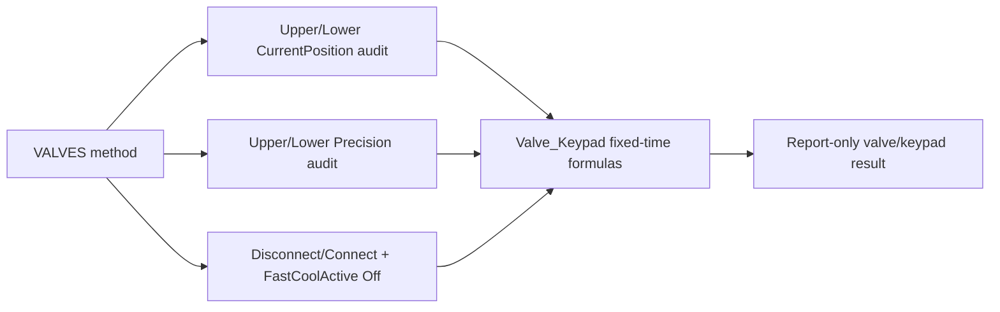

# TCC Valve and Keypad Black Box Decomposition

Extraction date: 2026-07-10

Scope: TCC FOQ Valve and Keypad test for `VH-C10-A`, `VC-C10-A`, and `VA-C10-A`.

---
Test name: Valve / Keypad
Models: VH-C10-A / VC-C10-A / VA-C10-A
Status: first black-box decomposition complete; exact workbook pass/fail result
cells remain open verification
---

This document decomposes the Valve and Keypad test as a generation contract.
The core test is audit driven:

```text
Valve command evidence:
  CurrentPosition = 6_1
  CurrentPosition = 1_2
  CurrentPosition = 6_1

Report evidence:
  AUDIT.<Valve>.CurrentPosition(fixed_time)
  AUDIT.<Valve>.Precision(fixed_time,"forward")
  AUDIT.ColumnComp.FastCoolState(0.9,"backward")
```

Unlike the temperature tests, this method does not write RetTimes and does not
use raw-signal statistics. Its evidence is position/precision audit properties
and an operator-assisted keypad check.

## Evidence Sources

| Evidence | Source |
|---|---|
| Test intent node | `cmbx_data_explorer/docs/TCC_TEST_KNOWLEDGE_NODE_MODEL.md` |
| Injection workbench notes | `cmbx_data_explorer/docs/TCC_INJECTION_BY_INJECTION_REVERSE_WORKBENCH.md` |
| Method/report alignment | `cmbx_data_explorer/docs/TCC_METHOD_REPORT_ALIGNMENT.md` |
| Required symbols | `cmbx_data_explorer/docs/TCC_REQUIRED_SYMBOL_MANIFEST.md` |
| CM configuration KB | `cmbx_data_explorer/docs/CM_INSTRUMENT_CONFIGURATION_KNOWLEDGE_BASE.md` |
| Method flow, VH | `knowledge_base/tcc_reverse_probe/VH/6000001/VALVES_embedded_method_flow.txt` |
| Method flow, VC | `knowledge_base/tcc_reverse_probe/VC/3000004/VALVES_embedded_method_flow.txt` |
| Method flow, VA | `knowledge_base/tcc_reverse_probe/VA/0000003/VALVES_embedded_method_flow.txt` |
| Report formula objects | `knowledge_base/tcc_report_formula_objects_vh_6000001_all_sheets.tsv` |
| DB mapping | `foq/FOQResultLocations_V2.83.xls` |

## Executive Answer

1. The instrument method is `VALVES`.
2. VC/VH methods exercise both `UpperValve` and `LowerValve`; VA method evidence
   exercises `LowerValve` only.
3. The verified valve positions are `6_1` and `1_2`.
4. The method logs `UpperValve.Precision` and/or `LowerValve.Precision` after
   each position phase.
5. The method uses `ColumnComp.CC_Temp.AcqOn` as a minimal data/audit carrier,
   not as the result channel.
6. The keypad section prompts the operator, disconnects/reconnects the module,
   waits for `ColumnComp.Connected = Connected`, and resets
   `ColumnComp.FastCoolActive = Off`.
7. There is no FOQ DB contract for the `Valve` injection in
   `FOQResultLocations_V2.83.xls`; this test is still important for method,
   audit, report, and configuration knowledge.
8. For future intent tools, pure valve-cycling can reuse the position commands
   and precision logs, but should omit the disconnect/keypad block unless the
   intent is the full FOQ Valve/Keypad test.

## Contract 1: Method Command

### 1.1 Device Branch Binding

| Device | Injection | Instrument Method | Processing Method | Report Template | Report Sheets | Status |
|---|---|---|---|---|---|---|
| VH-C10-A | `Valve` | `VALVES` | `No_Integration` | `Report_VTCC_V2_12` | `Valve_Keypad` | sequence evidence closed |
| VC-C10-A | `Valve` | `VALVES` | `CORRECT_ACCURACY_INJ_INSERTION` | `Report_VTCC_V2_12` | `Valve_Keypad` | sequence evidence closed |
| VA-C10-A | `Valve` | `VALVES` | `No_Integration` | `Report_VATCC_V1_01` | `Valve_Keypad` | sequence evidence closed; single lower-valve branch |

### 1.2 Method Contract Summary

Decoded VC/VH method evidence:

```yaml
method: VALVES
models: [VC-C10-A, VH-C10-A]
stages:
  - InstrumentSetup
  - Equilibration
  - Run
  - StopRun
setup:
  ColumnComp.CC.ReadyTempDelta: 1.0 C
  ColumnComp.CC.EquilibrationTime: 0.5
  ColumnComp.CC.TempCtrl: On
  ColumnComp.CC.Mode: StillAir
equilibration:
  UpperValve.CurrentPosition: 6_1
  LowerValve.CurrentPosition: 6_1
  Log:
    - UpperValve.Precision
    - LowerValve.Precision
run:
  data_carrier: ColumnComp.CC_Temp.AcqOn
  valve_cycle:
    - set UpperValve.CurrentPosition = 1_2
    - set LowerValve.CurrentPosition = 1_2
    - Log UpperValve.Precision
    - Log LowerValve.Precision
    - set UpperValve.CurrentPosition = 6_1
    - set LowerValve.CurrentPosition = 6_1
    - Log UpperValve.Precision
    - Log LowerValve.Precision
  keypad:
    - Message operator to press FAST COOL and upper/lower valve buttons
    - ColumnComp.CC_Temp.AcqOff
    - ColumnComp.Disconnect
    - ColumnComp.Connect
    - Wait ColumnComp.Connected = Connected
    - set ColumnComp.FastCoolActive = Off
```

Decoded VA method evidence:

```yaml
method: VALVES
models: [VA-C10-A]
difference_from_vc_vh:
  valve_branch: LowerValve only
equilibration:
  LowerValve.CurrentPosition: 6_1
  Log:
    - LowerValve.Precision
run:
  valve_cycle:
    - set LowerValve.CurrentPosition = 1_2
    - Log LowerValve.Precision
    - set LowerValve.CurrentPosition = 6_1
    - Log LowerValve.Precision
  keypad:
    - same disconnect/connect/FastCool reset pattern
```

### 1.3 Command Flow

```yaml
VALVES_Command_Flow_VC_VH:
  - order: 1
    stage: Equilibration
    command: SET
    target: ColumnComp.CC.ReadyTempDelta / EquilibrationTime / TempCtrl / Mode
    value: 1.0 C / 0.5 / On / StillAir
    note: Minimal CC operating context.
  - order: 2
    stage: Equilibration
    command: SET
    target: ColumnComp.UpperValve.CurrentPosition
    value: 6_1
    note: Initial upper valve position.
  - order: 3
    stage: Equilibration
    command: SET
    target: ColumnComp.LowerValve.CurrentPosition
    value: 6_1
    note: Initial lower valve position.
  - order: 4
    stage: Equilibration
    command: LOG
    target: UpperValve.Precision, LowerValve.Precision
    note: Initial precision audit evidence.
  - order: 5
    stage: Run
    command: ACQ_ON
    target: ColumnComp.CC_Temp
    note: Data/audit carrier.
  - order: 6
    stage: Run
    command: SET
    target: ColumnComp.UpperValve.CurrentPosition, ColumnComp.LowerValve.CurrentPosition
    value: 1_2
    note: Exercise switch to alternate position.
  - order: 7
    stage: Run
    command: LOG
    target: UpperValve.Precision, LowerValve.Precision
    note: Precision after switching to 1_2.
  - order: 8
    stage: Run
    command: SET
    target: ColumnComp.UpperValve.CurrentPosition, ColumnComp.LowerValve.CurrentPosition
    value: 6_1
    note: Exercise switch back to home position.
  - order: 9
    stage: Run
    command: LOG
    target: UpperValve.Precision, LowerValve.Precision
    note: Precision after switching back to 6_1.
  - order: 10
    stage: Run
    command: MESSAGE
    target: operator
    note: Ask operator to press FAST COOL and Upper/Lower Valve buttons within 30 s.
  - order: 11
    stage: Run
    command: DISCONNECT_CONNECT
    target: ColumnComp
    note: Forces keypad/front-panel interaction context.
  - order: 12
    stage: Run
    command: WAIT
    condition: ColumnComp.Connected = Connected
    note: Continue only after module reconnects.
  - order: 13
    stage: Run
    command: SET
    target: ColumnComp.FastCoolActive
    value: Off
    note: Reset fast-cool state after keypad check.
```

### 1.4 RetTime and Channel Semantics

| Item | Status | Reason |
|---|---|---|
| RetTimes | not used | Report reads fixed-time audit properties, not RetTime windows. |
| Raw signal result channels | not used | Valve position/precision are audit properties. |
| `ColumnComp.CC_Temp` | acquired but not a result channel | Provides a data stream so CM/report audit evaluation has run context. |
| `FastCoolActive` / `FastCoolState` | keypad/front-panel evidence | Used around the manual disconnect/reconnect portion. |

## Contract 2: Processing Method

Known sequence bindings:

| Device | Processing Method | IRC / corrective role | Status |
|---|---|---|---|
| VH-C10-A | `No_Integration` | no integration expected | verified from sequence binding |
| VC-C10-A | `CORRECT_ACCURACY_INJ_INSERTION` | corrective processing binding preserved in VC sequence | verified from TKN/package map; pass-action semantics open |
| VA-C10-A | `No_Integration` | no integration expected | verified from TKN/package map |

Processing interpretation:

- The `VALVES` method itself performs hardware actions and audit logging.
- No DB-mapped processing output is expected for the `Valve` injection.
- Full-sequence generation must preserve the device-specific processing method
  binding until IRC/pass-action decoding is complete.

## Contract 3: Report Formula

### 3.1 `Valve_Keypad` Formula Objects

Known VTCC formula objects:

| Cell | Formula | Meaning |
|---|---|---|
| `K49` | `AUDIT.UpperValve.CurrentPosition(-0.05)` | Upper valve initial position evidence |
| `L49` | `AUDIT.LowerValve.CurrentPosition(-0.05)` | Lower valve initial position evidence |
| `K50` | `AUDIT.UpperValve.CurrentPosition(0.095)` | Upper valve after switch to `1_2` |
| `L50` | `AUDIT.LowerValve.CurrentPosition(0.095)` | Lower valve after switch to `1_2` |
| `K51` | `AUDIT.UpperValve.CurrentPosition(0.19)` | Upper valve after return to `6_1` |
| `L51` | `AUDIT.LowerValve.CurrentPosition(0.19)` | Lower valve after return to `6_1` |
| `K60` | `AUDIT.UpperValve.CurrentPosition(0.9)` | Upper valve/keypad section position evidence |
| `L60` | `AUDIT.LowerValve.CurrentPosition(0.9)` | Lower valve/keypad section position evidence |
| `N60` | `AUDIT.ColumnComp.FastCoolState(0.9,"backward")` | FastCool keypad/front-panel state |
| `U49` | `AUDIT.UpperValve.Precision(-0.05,"forward")` | Upper valve initial precision |
| `U50` | `AUDIT.UpperValve.Precision(0.095,"forward")` | Upper valve precision after switch |
| `U51` | `AUDIT.UpperValve.Precision(0.19,"forward")` | Upper valve precision after return |
| `V49` | `AUDIT.LowerValve.Precision(-0.05,"forward")` | Lower valve initial precision |
| `V50` | `AUDIT.LowerValve.Precision(0.095,"forward")` | Lower valve precision after switch |
| `V51` | `AUDIT.LowerValve.Precision(0.19,"forward")` | Lower valve precision after return |

### 3.2 Workbook-Derived Rules

Known interpretation:

```text
VC/VH:
  upper and lower valve positions should progress 6_1 -> 1_2 -> 6_1.
  upper and lower valve precision audit values should be present.
  FastCoolState should support the keypad/front-panel section.

VA:
  lower valve branch is confirmed from method flow.
  upper valve formulas in VTCC template must not be assumed for VATCC until
  VATCC report formula objects are extracted.
```

Formula flow:



## Contract 4: DB Contract

### 4.1 DB Leaves

| Device | Injection | DB mapping status | Notes |
|---|---|---|---|
| VH-C10-A | `Valve` | no DB contract expected | `FOQResultLocations_V2.83.xls` has no mapped DB leaves for `TCC_VALVE_01`. |
| VC-C10-A | `Valve` | no DB contract expected | same as VH |
| VA-C10-A | `Valve` | no DB contract expected | same as VH, but report branch differs by lower-only method evidence |

### 4.2 DB Is Not the Evidence Driver

The lack of DB fields does not mean the test is irrelevant. For this injection,
the contract is:

```text
VALVES command flow
-> audit properties for valve position, precision, FastCool/keypad state
-> Valve_Keypad report sheet
-> no DB leaves in current FOQ mapping
```

## Contract 5: Config Requirement

| Requirement | VH-C10-A | VC-C10-A | VA-C10-A | Failure mode |
|---|---|---|---|---|
| `AUDIT.ColumnComp.ModelNo` source of truth | Required | Required | Required | Wrong branch/report template |
| `ColumnComp.UpperValve.CurrentPosition` | Required | Required | not used in decoded VA method | VC/VH upper branch cannot execute |
| `ColumnComp.LowerValve.CurrentPosition` | Required | Required | Required | lower branch cannot execute |
| `UpperValve.Precision` | Required | Required | not used in decoded VA method | VC/VH precision evidence missing |
| `LowerValve.Precision` | Required | Required | Required | lower precision evidence missing |
| `ColumnComp.Connect` / `Disconnect` / `Connected` | Required | Required | Required | keypad section cannot complete |
| `ColumnComp.FastCoolActive` / `FastCoolState` | Required | Required | Required | fast-cool keypad evidence missing |
| Position values `6_1` and `1_2` valid for configured valve type | Required | Required | Required for lower branch | method command rejected or wrong audit path |

Generation implication:

- Do not reuse the VC/VH dual-valve body for VA without checking that
  `UpperValve` exists.
- For a pure "periodic valve rotation" intent, the reusable core is only:
  `CurrentPosition` assignment plus optional precision logging.
- For full FOQ Valve/Keypad, preserve the operator message,
  disconnect/connect, connected wait, and FastCool reset.
- If report formulas remain fixed-time based, changing delays or command order
  requires report formula changes too.

## Contract 6: Open Verification

Items below are marked Open Verification Required until the listed evidence is
captured.

| # | Open Verification Required | Why it matters | Needed evidence | Likely source |
|---:|---|---|---|---|
| 1 | Exact `Valve_Keypad` workbook pass/fail cells | Current formula objects expose source cells, but result cells and criteria are not fully parsed | FormulaOne workbook parse for `Valve_Keypad` | report `SpreadSheetData` |
| 2 | VATCC `Valve_Keypad` report formulas | VA method is lower-only; VTCC dual-valve formulas cannot be assumed | VA report formula object extraction | `Report_VATCC_V1_01` |
| 3 | VC `CORRECT_ACCURACY_INJ_INSERTION` pass-action semantics on Valve row | Full sequence should preserve binding; standalone package may not require it | Processing method XML and pass-action trigger map | VC CMBX processing method payload |
| 4 | Keypad acceptance source | Method prompts operator and report reads FastCoolState, but exact external/internal criteria are not normalized | TD section and workbook criteria cells | FOQ TD, `Definitions`, `Valve_Keypad` workbook |
| 5 | Whether disconnect/connect is required for non-FOQ valve-cycling intent | Periodic valve rotation likely should not disconnect the device | User/test intent rule and CM operational guidance | intent tool design + CM command KB |

## VH / VC / VA Comparison

| Aspect | VH-C10-A | VC-C10-A | VA-C10-A |
|---|---|---|---|
| Production injection | `Valve` | `Valve` | `Valve` |
| Instrument method | `VALVES` | `VALVES` | `VALVES` |
| Valve branch | upper + lower | upper + lower | lower only |
| Processing method | `No_Integration` | `CORRECT_ACCURACY_INJ_INSERTION` | `No_Integration` |
| Report template | `Report_VTCC_V2_12` | `Report_VTCC_V2_12` | `Report_VATCC_V1_01` |
| DB fields | none | none | none |
| Generation status | reusable with dual-valve config check | reusable with dual-valve config check and processing binding preserved | reusable only as lower-valve branch |

## Generation Readiness

| Generation action | Status | Notes |
|---|---|---|
| Reuse full VH Valve row | ready after config validation | Preserve dual-valve method and `No_Integration`. |
| Reuse full VC Valve row | ready after config validation | Preserve `CORRECT_ACCURACY_INJ_INSERTION` until pass actions are decoded. |
| Reuse full VA Valve row | ready after config validation | Use lower-valve branch only. |
| Generate periodic upper/lower valve-cycling method | partial | Reuse `CurrentPosition` commands; omit keypad/disconnect unless requested. |
| Change timing/delays while keeping report | locked | Report reads fixed times such as `-0.05`, `0.095`, `0.19`, `0.9`; timing changes require report edits. |
| Add UpperValve to VA branch | locked | Requires confirmed VA hardware/config and report formulas. |

