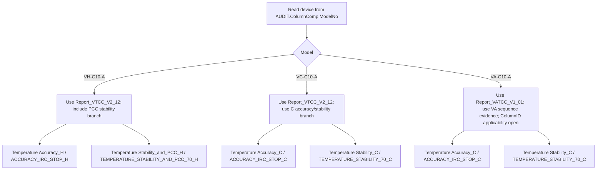

# VX-C10-A TCC FOQ CMBX Test Method Package

Status: review package specification, not a newly validated runnable CMBX binary.

This package is generated from the current FOQ/TCC knowledge alignment, decoded CMBX method evidence, report/formula mappings, and generation strategy rules. Missing mappings are marked `Open Verification Required` and must not be guessed.

## Input Knowledge Sources

| Source | Resolved local evidence | Status |
|---|---|---|
| FOQ KB | `C:\ProgramData\CMBX Data Explorer Workspace\KB\FOQ\TCC\FOQ_TCC_VX_C10_A_TD_KNOWLEDGE_MANAGEMENT.md` | available |
| CMBX Method KB | `knowledge_base/tcc_reverse_probe/{VA,VC,VH}/*_embedded_method_flow.tsv` and `*_embedded.instmeth.bin` | available |
| CMBX Report KB | `Report_VATCC_V1_01`, `Report_VTCC_V2_12`, decoded report sheet/formula evidence | partial |
| Formula KB | `cmbx_data_explorer/docs/CM_FORMULA_KNOWLEDGE_BASE.md` and TCC formula evaluator rules | partial |
| Generation Strategy KB | `cmbx_data_explorer/docs/CMBX_GENERATION_STRATEGY_KB.md` | available |

## Step 1: FOQ Test Checklist

| Order | FOQ Test | VH-C10-A | VC-C10-A | VA-C10-A | Note |
|---:|---|---|---|---|---|
| 1 | Column IDs | yes | yes | open | VA applicability is not explicit in extracted TD table; current VA sample omits it. |
| 2 | Preheater Connection Test | yes | yes | yes | Hardware/config sensitive. |
| 3 | Valve / Keypad part 1 | yes | yes | yes | Valve hardware/config sensitive. |
| 4 | VTCC_BurnIn | yes | yes | yes | Preparation/stress phase. |
| 5 | Temperature Calibration | yes | yes | yes | Sets calibration and IRC context. |
| 6 | Temperature Accuracy | yes | yes | yes | Model-specific IRC branch. |
| 7 | Temperature Precision and Fan | yes | yes | yes | VA sample uses `Temperature Precision`; VC/VH use `_and_Fan`. |
| 8 | Temperature Stability and PCC | yes | no | no | VH-only. |
| 9 | Temperature Stability | no | yes | yes | VC/VA no-PCC branch. |
| 10 | HeatUp and CoolDown Time | yes | yes | yes | Timing performance. |
| 11 | Liquid Leak / Keypad part 2 | yes | yes | yes | Leak sensor + keypad. |
| 12 | Qualification Service | yes | yes | yes | Final service state. |
| 13 | Factory Default | yes | yes | yes | Metadata/default state. |
| 14 | Error Log Check | yes | yes | yes | Present in current CMBX sequence evidence. |

## Step 2-4: Method, Report, and Formula Mapping

### VA-C10-A

Report template: `Report_VATCC_V1_01`

| Order | Injection | Processing Method | Instrument Method | Method asset | Report Sheet(s) | Formula ID | Acceptance criteria |
|---:|---|---|---|---|---|---|---|
| 1 | `Valve` | `No_Integration` | `VALVES` | `knowledge_base/tcc_reverse_probe/VA/0000003/VALVES_embedded.instmeth.bin` | `Valve_Keypad` | `FORMULA_TCC_VALVE_KEYPAD_OPEN` | 🔓 Open Verification Required |
| 2 | `VTCC_BurnIn` | `NO_INTEGRATION` | `BURNIN` | `knowledge_base/tcc_reverse_probe/VA/0000003/BURNIN_embedded.instmeth.bin` | `🔓 Open Verification Required` | `FORMULA_TCC_BURNIN_OPEN` | 🔓 Open Verification Required |
| 3 | `Temperature Calibration` | `NO_INTEGRATION` | `TEMPERATURE_CALIBRATION` | `knowledge_base/tcc_reverse_probe/VA/0000003/TEMPERATURE_CALIBRATION_embedded.instmeth.bin` | `Temp_Calib_Internal` | `FORMULA_TCC_TEMP_CALIBRATION_OPEN` | 🔓 Open Verification Required |
| 4 | `Temperature Accuracy_C` | `ACCURACY_IRC_STOP_C` | `TEMPERATURE_ACCURACY` | `knowledge_base/tcc_reverse_probe/VA/0000003/TEMPERATURE_ACCURACY_embedded.instmeth.bin` | `Temp Accuracy` | `FORMULA_TCC_TEMP_ACCURACY_MAX_DEVIATION` | External: max absolute deviation <= report Definitions!Temperature Accuracy. |
| 5 | `Temperature Precision` | `NO_INTEGRATION` | `TEMPERATURE_PRECISION` | `knowledge_base/tcc_reverse_probe/VA/0000003/TEMPERATURE_PRECISION_embedded.instmeth.bin` | `Temp Precision` | `FORMULA_TCC_TEMP_PRECISION_SEPARATE_SENSOR_RANGE` | External: max(lower range, upper range) <= report Definitions!Temperature Precision. |
| 6 | `Temperature Stability_C` | `NO_INTEGRATION` | `TEMPERATURE_STABILITY_70_C` | `knowledge_base/tcc_reverse_probe/VA/0000003/TEMPERATURE_STABILITY_70_C_embedded.instmeth.bin` | `Temp Stability_Noise` | `FORMULA_TCC_TEMP_STABILITY_SEPARATE_SENSOR_RANGE` | External: max(lower range, upper range) <= report Definitions!Temperature Stability. |
| 7 | `HeatUp and CoolDownTime` | `No_Integration` | `TEMP_HEAT_UP_DOWN_20_50_20` | `knowledge_base/tcc_reverse_probe/VA/0000003/TEMP_HEAT_UP_DOWN_20_50_20_embedded.instmeth.bin` | `HeatUp&CoolDown` | `FORMULA_TCC_HEATUP_COOLDOWN_RETTIME_DELTA_MINUS_HOLD` | External: heat-up/cool-down time <= report Definitions!HeatUp & Cool Down. |
| 8 | `LiquidLeaktest` | `No_Integration` | `LIQUID LEAK` | `knowledge_base/tcc_reverse_probe/VA/0000003/LIQUID LEAK_embedded.instmeth.bin` | `Liquid Leak Test` | `FORMULA_TCC_LIQUID_LEAK_OPEN` | 🔓 Open Verification Required |
| 9 | `Qualification_Service_Done` | `No_Integration` | `Qualification_Service_Done` | `knowledge_base/tcc_reverse_probe/VA/0000003/QUALIFICATION_SERVICE_DONE_embedded.instmeth.bin` | `Internal Use` | `FORMULA_TCC_QUALIFICATION_SERVICE_OPEN` | 🔓 Open Verification Required |
| 10 | `Factory Default` | `No_Integration` | `FACTORYDEFAULT` | `knowledge_base/tcc_reverse_probe/VA/0000003/FACTORYDEFAULT_embedded.instmeth.bin` | `Definitions`, `Internal Use`, `Factory Default` | `FORMULA_TCC_FACTORY_DEFAULT_METADATA` | External/Internal split not fully normalized; values come from audit/precondition metadata. |
| 11 | `Error Log Check` | `No_Integration` | `CHECKERRORLOG` | `knowledge_base/tcc_reverse_probe/VA/0000003/CHECKERRORLOG_embedded.instmeth.bin` | `Error Log`, `Internal Use` | `FORMULA_TCC_ERROR_LOG_OPEN` | 🔓 Open Verification Required |

### VC-C10-A

Report template: `Report_VTCC_V2_12`

| Order | Injection | Processing Method | Instrument Method | Method asset | Report Sheet(s) | Formula ID | Acceptance criteria |
|---:|---|---|---|---|---|---|---|
| 1 | `ColumnIDs` | `CORRECT_ACCURACY_INJ_INSERTION` | `ColumnID` | `knowledge_base/tcc_reverse_probe/VC/3000004/ColumnID_embedded.instmeth.bin` | `Column ID` | `FORMULA_TCC_COLUMN_ID_AUDIT_DESCRIPTION` | External: Column_A/B/C/D descriptions must match A/B/C/D. |
| 2 | `Preheater Connection Test` | `CORRECT_ACCURACY_INJ_INSERTION` | `PREHEATER` | `knowledge_base/tcc_reverse_probe/VC/3000004/PREHEATER_embedded.instmeth.bin` | `Preheater Ports_Noise` | `FORMULA_TCC_PREHEATER_PORT_STATE_AND_DIFF` | External: RetTimes present, ModulePresent=Yes, MemoryState=OK. |
| 3 | `Valve` | `CORRECT_ACCURACY_INJ_INSERTION` | `VALVES` | `knowledge_base/tcc_reverse_probe/VC/3000004/VALVES_embedded.instmeth.bin` | `Valve_Keypad` | `FORMULA_TCC_VALVE_KEYPAD_OPEN` | 🔓 Open Verification Required |
| 4 | `VTCC_BurnIn` | `NO_INTEGRATION` | `BURNIN` | `knowledge_base/tcc_reverse_probe/VC/3000004/BURNIN_embedded.instmeth.bin` | `🔓 Open Verification Required` | `FORMULA_TCC_BURNIN_OPEN` | 🔓 Open Verification Required |
| 5 | `Temperature Calibration` | `CORRECT_ACCURACY_INJ_INSERTION` | `TEMPERATURE_CALIBRATION` | `knowledge_base/tcc_reverse_probe/VC/3000004/TEMPERATURE_CALIBRATION_embedded.instmeth.bin` | `Temp_Calib_Internal` | `FORMULA_TCC_TEMP_CALIBRATION_OPEN` | 🔓 Open Verification Required |
| 6 | `Temperature Accuracy_C` | `ACCURACY_IRC_STOP_C` | `TEMPERATURE_ACCURACY` | `knowledge_base/tcc_reverse_probe/VC/3000004/TEMPERATURE_ACCURACY_embedded.instmeth.bin` | `Temp Accuracy` | `FORMULA_TCC_TEMP_ACCURACY_MAX_DEVIATION` | External: max absolute deviation <= report Definitions!Temperature Accuracy. |
| 7 | `Temperature Precision_and_Fan` | `CORRECT_STABILITY_INJ_INSERTION` | `TEMPERATURE_PRECISION_AND_FAN` | `knowledge_base/tcc_reverse_probe/VC/3000004/TEMPERATURE_PRECISION_AND_FAN_embedded.instmeth.bin` | `Temp Precision`, `Fan` | `FORMULA_TCC_TEMP_PRECISION_SEPARATE_SENSOR_RANGE` | External: max(lower range, upper range) <= report Definitions!Temperature Precision. |
| 8 | `Temperature Stability_C` | `NO_INTEGRATION` | `TEMPERATURE_STABILITY_70_C` | `knowledge_base/tcc_reverse_probe/VC/3000004/TEMPERATURE_STABILITY_70_C_embedded.instmeth.bin` | `Temp Stability_Noise` | `FORMULA_TCC_TEMP_STABILITY_SEPARATE_SENSOR_RANGE` | External: max(lower range, upper range) <= report Definitions!Temperature Stability. |
| 9 | `HeatUp and CoolDownTime` | `CORRECT_ACCURACY_INJ_INSERTION` | `TEMP_HEAT_UP_DOWN_20_50_20` | `knowledge_base/tcc_reverse_probe/VC/3000004/TEMP_HEAT_UP_DOWN_20_50_20_embedded.instmeth.bin` | `HeatUp&CoolDown` | `FORMULA_TCC_HEATUP_COOLDOWN_RETTIME_DELTA_MINUS_HOLD` | External: heat-up/cool-down time <= report Definitions!HeatUp & Cool Down. |
| 10 | `LiquidLeaktest` | `CORRECT_ACCURACY_INJ_INSERTION` | `LIQUID LEAK` | `knowledge_base/tcc_reverse_probe/VC/3000004/LIQUID LEAK_embedded.instmeth.bin` | `Liquid Leak Test` | `FORMULA_TCC_LIQUID_LEAK_OPEN` | 🔓 Open Verification Required |
| 11 | `Qualification_Service_Done` | `CORRECT_ACCURACY_INJ_INSERTION` | `Qualification_Service_Done` | `knowledge_base/tcc_reverse_probe/VC/3000004/QUALIFICATION_SERVICE_DONE_embedded.instmeth.bin` | `Internal Use` | `FORMULA_TCC_QUALIFICATION_SERVICE_OPEN` | 🔓 Open Verification Required |
| 12 | `Factory Default` | `CORRECT_ACCURACY_INJ_INSERTION` | `FACTORYDEFAULT` | `knowledge_base/tcc_reverse_probe/VC/3000004/FACTORYDEFAULT_embedded.instmeth.bin` | `Definitions`, `Internal Use`, `Factory Default` | `FORMULA_TCC_FACTORY_DEFAULT_METADATA` | External/Internal split not fully normalized; values come from audit/precondition metadata. |
| 13 | `Error Log Check` | `CORRECT_ACCURACY_INJ_INSERTION` | `CHECKERRORLOG` | `knowledge_base/tcc_reverse_probe/VC/3000004/CHECKERRORLOG_embedded.instmeth.bin` | `Error Log`, `Internal Use` | `FORMULA_TCC_ERROR_LOG_OPEN` | 🔓 Open Verification Required |

### VH-C10-A

Report template: `Report_VTCC_V2_12`

| Order | Injection | Processing Method | Instrument Method | Method asset | Report Sheet(s) | Formula ID | Acceptance criteria |
|---:|---|---|---|---|---|---|---|
| 1 | `ColumnIDs` | `CORRECT_STABILITY_INJ_INSERTION` | `ColumnID` | `knowledge_base/tcc_reverse_probe/VH/6000001/ColumnID_embedded.instmeth.bin` | `Column ID` | `FORMULA_TCC_COLUMN_ID_AUDIT_DESCRIPTION` | External: Column_A/B/C/D descriptions must match A/B/C/D. |
| 2 | `Preheater Connection Test` | `No_Integration` | `PREHEATER` | `knowledge_base/tcc_reverse_probe/VH/6000001/PREHEATER_embedded.instmeth.bin` | `Preheater Ports_Noise` | `FORMULA_TCC_PREHEATER_PORT_STATE_AND_DIFF` | External: RetTimes present, ModulePresent=Yes, MemoryState=OK. |
| 3 | `Valve` | `No_Integration` | `VALVES` | `knowledge_base/tcc_reverse_probe/VH/6000001/VALVES_embedded.instmeth.bin` | `Valve_Keypad` | `FORMULA_TCC_VALVE_KEYPAD_OPEN` | 🔓 Open Verification Required |
| 4 | `VTCC_BurnIn` | `NO_INTEGRATION` | `BURNIN` | `knowledge_base/tcc_reverse_probe/VH/6000001/BURNIN_embedded.instmeth.bin` | `🔓 Open Verification Required` | `FORMULA_TCC_BURNIN_OPEN` | 🔓 Open Verification Required |
| 5 | `Temperature Calibration` | `CORRECT_ACCURACY_INJ_INSERTION` | `TEMPERATURE_CALIBRATION` | `knowledge_base/tcc_reverse_probe/VH/6000001/TEMPERATURE_CALIBRATION_embedded.instmeth.bin` | `Temp_Calib_Internal` | `FORMULA_TCC_TEMP_CALIBRATION_OPEN` | 🔓 Open Verification Required |
| 6 | `Temperature Accuracy_H` | `ACCURACY_IRC_STOP_H` | `TEMPERATURE_ACCURACY` | `knowledge_base/tcc_reverse_probe/VH/6000001/TEMPERATURE_ACCURACY_embedded.instmeth.bin` | `Temp Accuracy` | `FORMULA_TCC_TEMP_ACCURACY_MAX_DEVIATION` | External: max absolute deviation <= report Definitions!Temperature Accuracy. |
| 7 | `Temperature Precision_and_Fan` | `CORRECT_STABILITY_INJ_INSERTION` | `TEMPERATURE_PRECISION_AND_FAN` | `knowledge_base/tcc_reverse_probe/VH/6000001/TEMPERATURE_PRECISION_AND_FAN_embedded.instmeth.bin` | `Temp Precision`, `Fan` | `FORMULA_TCC_TEMP_PRECISION_SEPARATE_SENSOR_RANGE` | External: max(lower range, upper range) <= report Definitions!Temperature Precision. |
| 8 | `Temperature Stability_and_PCC_H` | `NO_INTEGRATION` | `TEMPERATURE_STABILITY_AND_PCC_70_H` | `knowledge_base/tcc_reverse_probe/VH/6000001/TEMPERATURE_STABILITY_AND_PCC_70_H_embedded.instmeth.bin` | `Temp Stability_Noise`, `PCC` | `FORMULA_TCC_TEMP_STABILITY_AND_PCC_COOLDOWN` | External: stability <= Definitions!Temperature Stability; PCC cooldown <= Definitions!PCC CoolDownTime. |
| 9 | `HeatUp and CoolDownTime` | `No_Integration` | `TEMP_HEAT_UP_DOWN_20_50_20` | `knowledge_base/tcc_reverse_probe/VH/6000001/TEMP_HEAT_UP_DOWN_20_50_20_embedded.instmeth.bin` | `HeatUp&CoolDown` | `FORMULA_TCC_HEATUP_COOLDOWN_RETTIME_DELTA_MINUS_HOLD` | External: heat-up/cool-down time <= report Definitions!HeatUp & Cool Down. |
| 10 | `LiquidLeaktest` | `No_Integration` | `LIQUID LEAK` | `knowledge_base/tcc_reverse_probe/VH/6000001/LIQUID LEAK_embedded.instmeth.bin` | `Liquid Leak Test` | `FORMULA_TCC_LIQUID_LEAK_OPEN` | 🔓 Open Verification Required |
| 11 | `Qualification_Service_Done` | `No_Integration` | `Qualification_Service_Done` | `knowledge_base/tcc_reverse_probe/VH/6000001/QUALIFICATION_SERVICE_DONE_embedded.instmeth.bin` | `Internal Use` | `FORMULA_TCC_QUALIFICATION_SERVICE_OPEN` | 🔓 Open Verification Required |
| 12 | `Factory Default` | `No_Integration` | `FACTORYDEFAULT` | `knowledge_base/tcc_reverse_probe/VH/6000001/FACTORYDEFAULT_embedded.instmeth.bin` | `Definitions`, `Internal Use`, `Factory Default` | `FORMULA_TCC_FACTORY_DEFAULT_METADATA` | External/Internal split not fully normalized; values come from audit/precondition metadata. |
| 13 | `Error Log Check` | `No_Integration` | `CHECKERRORLOG` | `knowledge_base/tcc_reverse_probe/VH/6000001/CHECKERRORLOG_embedded.instmeth.bin` | `Error Log`, `Internal Use` | `FORMULA_TCC_ERROR_LOG_OPEN` | 🔓 Open Verification Required |

## Step 5: Model Branch Decision Tree

## Step 6: IRC / Processing Method Configuration

| Model | Injection | Processing Method | Required behavior | Status |
|---|---|---|---|---|
| VH-C10-A | `Temperature Accuracy_H` | `ACCURACY_IRC_STOP_H` | Preserve IRC/stop behavior for VH accuracy branch. | sequence link verified; pass-action decode partial |
| VC-C10-A | `Temperature Accuracy_C` | `ACCURACY_IRC_STOP_C` | Preserve IRC/stop behavior for VC accuracy branch. | sequence link verified; pass-action decode partial |
| VA-C10-A | `Temperature Accuracy_C` | `ACCURACY_IRC_STOP_C` | Preserve IRC/stop behavior for VA accuracy branch. | sequence link verified; pass-action decode partial |
| VC-C10-A | multiple injections | `CORRECT_ACCURACY_INJ_INSERTION` | Correct/insert accuracy related injections. | sequence link verified; pass-action decode partial |
| VH-C10-A | ColumnID / Precision | `CORRECT_STABILITY_INJ_INSERTION` | Correct/insert stability related injections. | sequence link verified; pass-action decode partial |

## Step 7: Dependency Validation Checklist

| Check | Required for | How to verify | Failure handling |
|---|---|---|---|
| Device source of truth | all branches | `AUDIT.ColumnComp.ModelNo` | Stop generation if model cannot be read. |
| External thermometers | accuracy, precision, stability, heat/cool | channels `ExtTemp_UpperCC`, `ExtTemp_LowerCC` in CMBX/CM config | Add/configure Generic Device thermometers. |
| PCC symbols | VH stability/PCC | `ColumnComp.PCC`, `PCC_Temp`, PCC PWM channels | Use non-PCC branch only if model is not VH; otherwise stop. |
| Preheater symbols | preheater test | `ColumnComp.PrehtLeft/Right` and heater temp channels | Mark test not runnable until configured. |
| Valve symbols | valve test | `ColumnComp.UpperValve`, `ColumnComp.LowerValve` | Remove/disable valve test only with approved variant logic. |
| Column ID config | ColumnIDs | Column A-D audit descriptions | Mark `Open Verification Required` for VA unless confirmed. |
| Processing/IRC links | accuracy/stability correction | sequence command links and processing method XML | Reassign processing method or stop. |
| Report template | DB/report output | model branch table below | Do not export DB if template branch is unresolved. |
| Numeric criteria | acceptance decisions | report `Definitions` cells / FOQ section 4.3 | Do not hard-code new numeric values; use source definitions only. |

## Report Template List

| Model | Report Template | Report role | Status |
|---|---|---|---|
| VA-C10-A | `Report_VATCC_V1_01` | Standard VA TCC FOQ report template. | template name verified; full formula trace partial |
| VC-C10-A | `Report_VTCC_V2_12` | Standard VC TCC FOQ report template. | verified template family |
| VH-C10-A | `Report_VTCC_V2_12` | Standard VH TCC FOQ report template, including PCC sheet. | verified template family |

## Method Asset Inventory

| Method | Exported method asset pattern | Status |
|---|---|---|
| `BURNIN` | `knowledge_base/tcc_reverse_probe/<VA|VC|VH>/<sample>/BURNIN_embedded.instmeth.bin` | decoded method payload exists in TCC reverse probe for at least one branch, or mark open during packaging |
| `CHECKERRORLOG` | `knowledge_base/tcc_reverse_probe/<VA|VC|VH>/<sample>/CHECKERRORLOG_embedded.instmeth.bin` | decoded method payload exists in TCC reverse probe for at least one branch, or mark open during packaging |
| `ColumnID` | `knowledge_base/tcc_reverse_probe/<VA|VC|VH>/<sample>/ColumnID_embedded.instmeth.bin` | decoded method payload exists in TCC reverse probe for at least one branch, or mark open during packaging |
| `FACTORYDEFAULT` | `knowledge_base/tcc_reverse_probe/<VA|VC|VH>/<sample>/FACTORYDEFAULT_embedded.instmeth.bin` | decoded method payload exists in TCC reverse probe for at least one branch, or mark open during packaging |
| `LIQUID LEAK` | `knowledge_base/tcc_reverse_probe/<VA|VC|VH>/<sample>/LIQUID LEAK_embedded.instmeth.bin` | decoded method payload exists in TCC reverse probe for at least one branch, or mark open during packaging |
| `PREHEATER` | `knowledge_base/tcc_reverse_probe/<VA|VC|VH>/<sample>/PREHEATER_embedded.instmeth.bin` | decoded method payload exists in TCC reverse probe for at least one branch, or mark open during packaging |
| `Qualification_Service_Done` | `knowledge_base/tcc_reverse_probe/<VA|VC|VH>/<sample>/QUALIFICATION_SERVICE_DONE_embedded.instmeth.bin` | decoded method payload exists in TCC reverse probe for at least one branch, or mark open during packaging |
| `TEMPERATURE_ACCURACY` | `knowledge_base/tcc_reverse_probe/<VA|VC|VH>/<sample>/TEMPERATURE_ACCURACY_embedded.instmeth.bin` | decoded method payload exists in TCC reverse probe for at least one branch, or mark open during packaging |
| `TEMPERATURE_CALIBRATION` | `knowledge_base/tcc_reverse_probe/<VA|VC|VH>/<sample>/TEMPERATURE_CALIBRATION_embedded.instmeth.bin` | decoded method payload exists in TCC reverse probe for at least one branch, or mark open during packaging |
| `TEMPERATURE_PRECISION` | `knowledge_base/tcc_reverse_probe/<VA|VC|VH>/<sample>/TEMPERATURE_PRECISION_embedded.instmeth.bin` | decoded method payload exists in TCC reverse probe for at least one branch, or mark open during packaging |
| `TEMPERATURE_PRECISION_AND_FAN` | `knowledge_base/tcc_reverse_probe/<VA|VC|VH>/<sample>/TEMPERATURE_PRECISION_AND_FAN_embedded.instmeth.bin` | decoded method payload exists in TCC reverse probe for at least one branch, or mark open during packaging |
| `TEMPERATURE_STABILITY_70_C` | `knowledge_base/tcc_reverse_probe/<VA|VC|VH>/<sample>/TEMPERATURE_STABILITY_70_C_embedded.instmeth.bin` | decoded method payload exists in TCC reverse probe for at least one branch, or mark open during packaging |
| `TEMPERATURE_STABILITY_AND_PCC_70_H` | `knowledge_base/tcc_reverse_probe/<VA|VC|VH>/<sample>/TEMPERATURE_STABILITY_AND_PCC_70_H_embedded.instmeth.bin` | decoded method payload exists in TCC reverse probe for at least one branch, or mark open during packaging |
| `TEMP_HEAT_UP_DOWN_20_50_20` | `knowledge_base/tcc_reverse_probe/<VA|VC|VH>/<sample>/TEMP_HEAT_UP_DOWN_20_50_20_embedded.instmeth.bin` | decoded method payload exists in TCC reverse probe for at least one branch, or mark open during packaging |
| `VALVES` | `knowledge_base/tcc_reverse_probe/<VA|VC|VH>/<sample>/VALVES_embedded.instmeth.bin` | decoded method payload exists in TCC reverse probe for at least one branch, or mark open during packaging |

## Package Validation Checklist

- [ ] Device model is read from `AUDIT.ColumnComp.ModelNo`.
- [ ] Selected branch is VA, VC, or VH only.
- [ ] Every injection has one instrument method and one processing method.
- [ ] Method names exactly match decoded CMBX names.
- [ ] Report template branch matches device model.
- [ ] Accuracy and stability formulas resolve to report cells and Definitions criteria.
- [ ] Numeric acceptance criteria are loaded from FOQ/report Definitions, not manually changed.
- [ ] IRC/corrective processing methods are linked to the correct injections.
- [ ] Required CM symbols/channels exist in target configuration.
- [ ] Any `Open Verification Required` row is resolved or explicitly excluded before runnable CMBX generation.

## Output Status

This Markdown file is the complete review specification for a VX-C10-A TCC FOQ method package. It does not by itself prove that a newly packed binary CMBX is runnable in Chromeleon.
