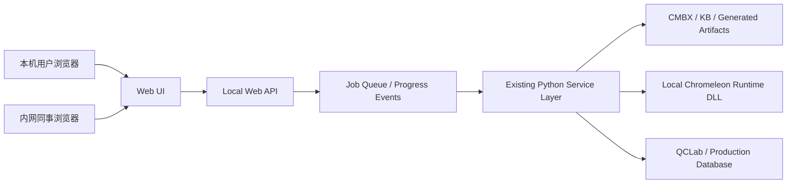
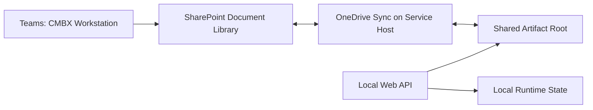
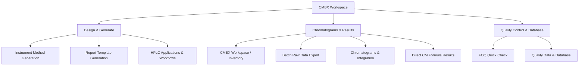

# CMBX Workspace Web 构建与业务流程设计

> 2026-08-05 部署更新（V1.42）：仓库现已包含 `launcher/` 安装、启动、停止和环境检查入口，离线 Python 3.11 wheelhouse，以及带 FormulaOne SxS/OCX 组件的版本化 Chromeleon runtime。完整 Git checkout 可在另一台内网 Windows 电脑上建立服务器，不再依赖开发电脑已有的 Python 包或本地 Chromeleon 安装。

> 2026-07-31 登录更新：登录页立即显示，不再等待 workspace inventory 或 jobs。当前内网版本统一使用管理员授权的邮箱/密码账户；Windows 登录和首次自助注册默认关闭。账户只能由 Admin 创建、启用、重置密码或禁用。

> 文档状态：Web 架构确认基线 0.2  
> 建立日期：2026-07-31  
> 业务依据：`BUSINESS_WORKFLOW_UI_REDESIGN.md`  
> 当前阶段：Phase 0 Web 骨架已开始实施  
> 部署前提：CMBX 解析、Chromeleon runtime 和数据库访问仍运行在受控 Windows 主机上

## 1. 文档目的

本文件定义 CMBX Workspace 的 Web 展示层、共享方式和分阶段业务范围。目标不是把桌面窗口逐页复制到浏览器，而是把已经验证的业务能力拆成：

1. 浏览器中的引导式工作流；
2. 本机 Web API 与任务调度层；
3. 现有 CMBX、报告、数据库和 KB 服务层；
4. 只能在 Windows / Chromeleon 环境执行的本机能力。

本文确认前不开始大规模 Web 开发。后续 Web 代码、API 和页面必须能追溯到本文中的业务步骤和验收标准。

## 2. 核心部署模型

第一版采用 **单主机、多人浏览器访问的内网 Web Workspace**：程序和数据仍在当前 Windows 电脑运行，同事通过浏览器使用。



### 2.1 这意味着什么

- 同事不需要在各自电脑安装 CMBX Data Explorer 或 Chromeleon runtime。
- 主机必须开机、联网且 Web 服务正在运行，否则网页不可用。
- 浏览器不直接访问主机磁盘、DLL 或数据库；所有操作通过受控 API 完成。
- 浏览器看到的是文件 ID、项目名和任务结果，不暴露真实磁盘路径与数据库密码。
- 第一版不是云服务，也不是多台解析服务器组成的集群。

### 2.2 不采用的方式

- 不把 Tkinter 桌面窗口远程投屏给多人使用。
- 不让浏览器直接加载 Chromeleon DLL。
- 不把数据库账号、DSN 密码或本机绝对路径发送到前端。
- 不在第一版实现网页内自然语言 Agent。
- 不允许多人直接修改同一个本机源 CMBX。

### 2.3 已确认的部署决策

| 项目 | 已确认方案 |
|---|---|
| 访问范围 | 仅 Thermo Fisher 企业内网 |
| 身份认证 | IIS Windows Authentication / Active Directory |
| 运行主机 | 当前 Windows 主机长期运行；用户登录后手动启动服务，关机即停止 |
| 初期并发 | 同时支持 3 名同事，重量级任务进入受限队列 |
| 第一版范围 | 包含读取分析、FOQ/质量只读查询，以及简化的 Method/Report CMBX 生成 |
| 数据库权限 | 同事可查阅；QCLab/生产库写入必须由指定管理员审批 |
| 共享文件区 | Teams `CMBX Workstation` 频道所对应的 SharePoint 文档库 |
| 管理方式 | 提供独立 Admin Console，管理服务、队列、权限、审批、存储和审计 |

### 2.4 Teams / SharePoint 文件区

用户提供的 Teams 频道 URL 是协作入口，不是程序可直接读写的磁盘路径。该频道的 Files 后端是 SharePoint 文档库。第一版建议在服务主机上通过 OneDrive 将目标文档库同步到固定本地目录，服务只访问该同步目录。



**SharePoint 同步区保存：**

- 用户上传并登记的 CMBX / MD 源文件；
- Method/Report CMBX 生成结果；
- Raw export、FOQ、QC 和报告导出；
- 已批准发布的资产与归档；
- 面向用户的项目说明和 manifest。

**本机非同步区保存：**

- SQLite job/state 数据库；
- CMBX 解码缓存与 raw point cache；
- 临时上传分片和未完成文件；
- 服务日志；
- Chromeleon runtime；
- DSN 密码、密钥及 Windows Credential Manager 内容。

原因：SQLite、缓存、临时文件和凭据放入 OneDrive/SharePoint 同步目录会产生锁冲突、重复同步、性能下降或秘密泄露风险。

建议的 SharePoint 文件层级使用短名称，避免 CMBX、sequence 和 MD 长文件名叠加后触发 Windows 路径长度问题：

```text
CMBX Workstation/
  00_Admin/          面向用户的说明、版本和发布记录
  01_Inbox/          按用户/日期接收待处理输入
  02_Workspaces/     项目工作区与不可变 source manifest
  03_Generated/      Method / Report candidate CMBX
  04_Analysis/       Raw export、formula、FOQ、QC 和外部报告
  05_Approved/       经审批的正式资产
  90_Archive/        按策略归档的历史项目
```

运行时目录建议：

```text
C:\ProgramData\CMBX Web Service\
  state\
  cache\
  temp\
  logs\
```

## 3. Web 版产品边界

| 层 | 主要职责 | 不承担的职责 |
|---|---|---|
| Web UI | 引导选择、筛选、预览、提交任务、查看进度、下载结果 | 不直接解析 CMBX，不保存数据库密码 |
| Web API | 鉴权、参数校验、工作区管理、任务提交、结果访问 | 不重新实现测试公式 |
| Job Runner | 调度耗时任务、进度与取消、并发限制、错误隔离 | 不让不安全任务无限并发 |
| Existing Services | CMBX 读取、Raw data、公式、FOQ、数据库、MD 编译 | 不依赖 Web 页面状态 |
| Local Runtime | Chromeleon DLL、ODBC、文件系统、生成模板 | 不暴露给浏览器 |
| Web AI | 用户在外部网页模型中产生 Method MD / Report MD | 第一版不嵌入本系统，不直接写 CMBX |

## 4. 可实现业务流程总览

### 4.1 第一优先级：适合直接 Web 化

这些流程以读取、比较和下载为主，最适合先提供给同事。

| 业务流程 | Web 第一版能力 | 本机依赖 | 风险 |
|---|---|---|---|
| CMBX 工作区 | 上传 CMBX、查看 package / sequence / injection / channel 清单 | CMBX parser | 低 |
| Batch Raw Data Export | 多级筛选、后台导出、ZIP 下载 | Raw data runtime | 低 |
| Chromatograms & Integration | 多谱图叠加/分开、缩放、基础积分、结果表 | Raw data runtime | 中；不是完整 CM 积分器 |
| Direct CM Formula Results | 公式库/包内公式筛选、批量计算、表格下载 | Report parser / evaluator | 中；只声明已支持公式 |
| FOQ Quick Check | 选择 sequence/injection/metrics，比较 spec 和历史数据 | FOQ mapping / report evaluator | 中 |
| Quality Data & Database | 只读查询、筛选、QC 曲线、统计摘要 | ODBC | 中；默认只读 |
| KB Index | 分类、搜索、渲染、下载 KB/SPEC | Markdown files | 低 |
| Job Center | 进度、日志、历史任务、结果下载、失败重试 | Local job store | 低 |

### 4.2 第二优先级：可以 Web 化，但必须由本机后台执行

| 业务流程 | 浏览器负责 | 后台负责 | 限制 |
|---|---|---|---|
| Instrument Method Generation | 选择模块、下载 AI 包、上传 Method MD、预览、确认生成 | preflight、CM 风格渲染、CMBX 编译 | 输出是 candidate asset，需在 CM 验证 |
| Report Template Generation | 上传 Method/Report MD、布局预览、确认生成 | report preflight、模板编译、CMBX 打包 | 仅覆盖已验证对象和公式 |
| Sequence Package Generation | 选择单 Injection carrier、已生成 Method CMBX 和 Report CMBX，生成候选 sequence 包 | carrier-guided DataContract rewrite、CpXm replacement、binding validation | 第一版保留 carrier Processing Method；必须在 CM/目标配置验证 |
| External Report Engine | 上传 Report MD、选择多个 CMBX、预览与导出 | 公式计算、动态表、外部报告渲染 | 高级积分/定量仍有限 |
| Generation History | 查看输入、hash、警告、输出并下载 | 保存不可变任务记录和 artifacts | 不保存明文密钥 |

这些任务需要进入任务队列，不能由 HTTP 请求线程直接执行。

### 4.3 第三优先级：需要权限、复核与审计

| 业务流程 | 上线条件 |
|---|---|
| 写入 QCLab | 明确表结构、数据类型、重复检测、预览确认、用户与时间审计 |
| 写入生产数据库 | 角色授权、双重确认、事务回滚、幂等键、正式验证记录 |
| 删除/重命名共享文件 | 工作区权限、软删除、操作审计、恢复能力 |
| AppsLab 下载与入库 | 网络策略、来源校验、license/provenance、恶意文件检查 |
| 生成资产共享发布 | reviewer approval、版本号、source hash、CM 版本与配置声明 |

### 4.4 当前不能承诺的能力

- 远程控制 Chromeleon 仪器或提交真实 sequence 运行。
- 完整编辑 Processing Method / IRC。
- 与 Chromeleon 完全等价的高级积分、手动积分、组分识别和定量。
- 任意 Report Dynamic Table / FormulaOne 功能的无约束生成。
- 自动判定生成的 Method/Report 一定可在所有仪器配置运行。
- CM 7.3 完整 sequence CMBX 到 CM 7.2 的通用转换。
- 未经验证数据治理的故障率预测模型。
- 多台解析服务器横向扩展与高可用。

## 5. 推荐的 Web 信息架构

Web 首页继续使用已确认的三条业务主线，不按底层工具分类。



所有页面共享：

- Workspace selector；
- Job Center；
- Recent artifacts；
- KB / Help；
- 当前用户与权限；
- 明确的步骤状态、进度、警告和失败原因。

## 6. 详细业务流程

### 6.1 共享 CMBX Workspace

```text
创建工作区
-> 上传 CMBX 或由授权用户选择主机已登记目录
-> 计算 SHA-256 并建立只读 source artifact
-> 后台解析基础 inventory
-> 浏览器展示 package / sequence / injection / channel
-> 其他流程通过 artifact_id 引用同一数据
```

规则：

- 上传原文件永不原地修改。
- 相同 hash 的文件可复用已有解析缓存。
- 用户只看到自己或所在项目组有权限的工作区。
- 解析失败必须保留原文件、错误阶段和诊断日志。

### 6.2 Batch Raw Data Export

1. 选择一个或多个 CMBX。
2. 按 package、sequence、injection、channel 多选过滤。
3. 预估匹配数量与导出大小。
4. 提交后台任务。
5. 实时查看当前 package/injection/channel、百分比和预计剩余时间。
6. 下载 CSV/XLSX/ZIP artifact。

### 6.3 Chromatograms & Integration

1. 选择 CMBX 工作区。
2. 正向选择或按 channel 反向匹配 sequence/injection。
3. 选择叠加或分面显示。
4. 浏览器完成平滑缩放、框选放大、空格拖动画布、撤销视图。
5. 后台读取 raw points；前端只接收抽稀后的显示点，需要计算时使用完整数据。
6. 使用一套基础积分参数计算峰和基线，并显示起点、终点与红色基线。
7. 导出当前图、积分表和参数。

边界：当前积分结果标记为 External Preview，不宣称等价于 Chromeleon Processing Method。

### 6.4 Direct CM Formula Results

1. 后台先建立快速 Direct CM formula inventory，不默认解析 FormulaOne。
2. 用户从 Formula Library 或当前 CMBX report 中选择公式。
3. 按 package、sequence、injection、channel 四级过滤上下文。
4. 运行 batch preview。
5. 结果显示公式意义、来源、FixedChannel、值、状态和错误原因。
6. 可导出长表或透视表。

### 6.5 FOQ Quick Check

```text
Step 1 选择 CMBX / sequence / injection
-> Step 2 选择 metrics 或已保存 metric set
-> Step 3 可选历史数据库范围
-> Step 4 结果、spec、历史分布和对比图
```

- 历史数据库不是运行 Quick Check 的强制条件。
- 未连接数据库时仍执行 CMBX vs spec。
- 历史筛选设置可保存，数据库刷新在后台进行。
- 修改 CMBX 选择后保留 metric set 和历史筛选，除非字段不再适用。
- 同一 metric 的多个当前 sequence 使用同一种散点符号体系，不混用柱状图与历史散点。

### 6.6 Quality Data & Database

1. 选择已配置的只读数据源。
2. 选择 module/table 和 metric。
3. 使用下拉选项筛选 ModelNo、variant、时间、批次等字段。
4. 查看 N、Mean、SD、UCL、LCL、分布和 QC curve。
5. 保存筛选视图供 FOQ Quick Check 调用。
6. 后续独立增加受控写入流程，不能把写入按钮混入只读查询。

### 6.7 Database Write Approval

数据库写入采用申请与审批分离流程：

```text
Analyst prepares upload
-> schema/type/duplicate preflight
-> immutable write proposal
-> Pending Approval
-> Admin reviews row diff and destination
-> Approve / Reject
-> backend transaction
-> verification read-back
-> audit record
```

- 同事只能创建 proposal，不能直接获得数据库写权限。
- 管理员在 Admin Console 中审批；第一位指定审批人为当前系统负责人。
- QCLab 与生产数据库使用不同权限和审批策略。
- proposal 必须显示目标 DSN、schema/table、记录数、主键/幂等键、变化摘要和警告。
- 审批后若输入文件、映射、目标表或内容 hash 发生变化，原审批自动失效。
- 写入成功后必须执行 read-back 验证；失败时记录事务状态和可恢复动作。

### 6.8 Instrument Method / Report Template Generation

Web 版沿用桌面端已经确认的 0-3 引导步骤：

```text
0 Choose asset
-> 1 Prepare Web AI package
-> 2 Import & preview generated MD
-> 3 Generate candidate CMBX
```

- Web AI 仍是外部步骤；系统负责准备最小上传包和提示词。
- Method 与 Report 分支独立，但 Report 可引用已经生成的 Method project。
- preflight 错误阻止生成；warning 需要用户确认。
- 输出记录 source MD hash、SPEC/KB 版本、compiler 版本、CM target 和生成日志。

## 7. 前后端拆分原则

### 7.1 前端适合承担

- 工作流导航和步骤状态；
- 表格筛选、分页、虚拟滚动；
- 谱图绘制、缩放与视图状态；
- 表单校验和确认；
- 任务进度、日志与下载；
- Markdown/KB 渲染；
- 不含秘密信息的用户偏好。

### 7.2 后端必须承担

- CMBX 与 embedded payload 读取；
- Chromeleon DLL 调用；
- Raw data 完整点读取与计算；
- Method/Report MD preflight 与 CMBX 编译；
- Direct CM formula 计算；
- FOQ mapping、spec、历史统计；
- ODBC 与数据库凭据；
- 文件 hash、权限、审计和 artifact 生命周期。

## 8. 任务与并发模型

所有超过约 1 秒、会访问大文件、Chromeleon runtime 或数据库的操作都视为 Job。

### 8.1 Job 状态

```text
queued -> preparing -> running -> validating -> completed
                                -> failed
                                -> cancelled
```

每个 Job 至少记录：

- job_id、owner、workspace_id；
- task_type、输入 artifact hash；
- 当前阶段、已完成数量、总数量、预计剩余时间；
- warning/error code 与用户可读说明；
- 输出 artifacts；
- 创建、开始、结束时间；
- compiler/parser/KB 版本。

### 8.2 并发类别

| 类别 | 策略 |
|---|---|
| `pure_python_parallel` | 可有限并行 |
| `cm_runtime_serial` | 初期单 worker 串行，验证线程安全后再调整 |
| `database_read` | 小并发、超时、行数限制 |
| `database_write` | 串行、事务、强制复核 |
| `filesystem_write` | 每任务独立输出目录，原子完成后发布 |

第一版不需要 Redis/Celery。可使用持久化 SQLite job store 和受限本机 worker；当单机队列确实成为瓶颈后再引入外部队列。

### 8.3 三用户资源限制

初期以“3 名用户可同时操作，但不让 3 个重量级任务同时争抢 Chromeleon runtime 和内存”为原则：

| 资源 | 初始限制 |
|---|---|
| 活跃 Web 用户 | 3 名同事，管理员不计入业务配额 |
| 每用户重量级任务 | 最多 1 个 running，其余排队 |
| `cm_runtime_serial` | 全局 1 个 worker |
| Raw decode/export | 全局最多 2 个并行任务 |
| Database read | 全局最多 2 个查询，强制超时和最大行数 |
| Method/Report generation | 全局 1 个生成任务 |
| Database write | 全局 1 个，且必须已有有效审批 |

队列按用户轮转，避免某一用户连续提交大量任务导致其他用户一直等待。页面必须显示排队位置、当前阶段和估算时间。管理员可以暂停新任务、取消卡住任务，但不能直接删除审计记录。

## 9. 缓存与性能策略

- 以文件 SHA-256 + parser version 作为 CMBX inventory cache key。
- 基础 inventory 与重量级 raw/report 解码分层，不因打开页面解析全部内容。
- Direct CM inventory 与 FormulaOne 分开缓存。
- Raw plot 返回显示分辨率数据；积分和导出使用完整原始点。
- FOQ metric 结果按 CMBX hash + mapping version + report template 缓存。
- 数据库筛选项和统计摘要后台刷新，页面先使用最近一次有效缓存。
- 用户可看到缓存时间并主动刷新。

## 10. 文件与 Artifact 模型

建议每个共享对象使用内部 ID：

```text
Workspace
  SourceArtifact      原始 CMBX / MD / mapping，不可变
  ParsedArtifact      inventory / formula catalog / raw index
  GeneratedArtifact   CMBX / XLSX / CSV / ZIP / PNG
  JobRecord           参数、日志、版本、结果关联
```

磁盘文件与数据库元数据分离：SQLite 只保存索引、状态和权限，二进制/大文件保存在受控 workspace 目录。

清理策略必须区分：

- 原始上传文件；
- 可重建缓存；
- 用户确认保留的生成结果；
- 临时下载包。

## 11. 安全与企业内网部署

### 11.1 最低要求

- 未完成身份认证前仅绑定 `127.0.0.1`，不能直接监听所有网卡。
- 内网共享优先使用 IIS reverse proxy + Windows Authentication / AD。
- 使用 HTTPS 和公司证书。
- API 根据角色区分 Viewer、Analyst、Generator、DB Writer、Admin。
- 所有上传文件限制大小、扩展名，并在隔离目录解析。
- 防止路径穿越；前端不得提交任意服务器绝对路径。
- DSN 用户名可保存，密码进入 Windows Credential Manager 或等效 secret store，不进入配置 JSON/日志。
- 数据库写入默认关闭。

### 11.2 审计要求

以下操作必须记录用户、时间、输入 hash、参数和结果：

- CMBX/MD 上传；
- Method/Report CMBX 生成；
- FOQ 结论导出；
- 数据库写入；
- artifact 删除或发布；
- 管理员配置更改。

### 11.3 Admin Console

由于服务由当前主机手动启动，Admin Console 是第一版正式功能，不是后期附加页面。

| 面板 | 功能 |
|---|---|
| Service Health | Web/API/worker 启动时间、版本、主机资源、Chromeleon runtime 和 ODBC 状态 |
| SharePoint Sync | 同步根目录、最后同步时间、待同步/冲突文件、可用空间、只读降级状态 |
| Queue | running/queued/failed、用户、资源类别、取消、暂停接收新任务 |
| Users & Roles | AD 用户/组到 Viewer、Analyst、Generator、DB Writer、Admin 的映射 |
| Approvals | QCLab/生产库 write proposal 的 diff、批准、拒绝与备注 |
| Storage | Inbox、workspace、artifact、archive 用量和保留策略 |
| Audit | 登录、上传、生成、下载、审批、写入和管理配置变更 |
| Settings | 共享根目录、并发上限、DSN 别名、超时、保留期限；不显示明文密码 |

推荐提供两个启动入口：

1. `Start CMBX Web Service`：启动 API/worker，检查 IIS、同步目录、CM runtime 和数据库连接，随后打开 Admin Console。
2. `Stop CMBX Web Service`：停止接收新任务，等待或取消运行任务，安全关闭 worker。

服务启动后，管理后台应明确显示“可供同事访问的 HTTPS 地址”，而不是只显示 localhost。

## 12. 建议技术栈

| 层 | 建议 | 原因 |
|---|---|---|
| Backend API | FastAPI + Pydantic | 与现有 Python 服务直接衔接，明确数据契约 |
| Server | Uvicorn behind IIS reverse proxy | 本地开发简单，生产由 IIS 负责 HTTPS/认证 |
| Frontend | React + TypeScript + Vite | 适合复杂步骤、任务状态、图表和可复用组件 |
| Table | TanStack Table / virtualized grid | 多 CMBX、多 metric 和大结果表 |
| Charts | Plotly.js 或 Apache ECharts | 谱图缩放、散点/QC 图和交互成熟 |
| Job metadata | SQLite | 单主机持久化且部署简单 |
| Artifact store | 本地受控目录 | 大文件无需塞入数据库 |
| Progress | Server-Sent Events，必要时 WebSocket | 单向实时进度足够且实现更稳 |

技术栈是当前建议，不在本设计阶段写入项目依赖。

## 13. 分阶段实施建议

### Phase 0：本机浏览器验证架构

- API health、版本、capability 检查；
- localhost-only；
- CMBX 上传、inventory、Job Center；
- 验证现有 service layer 不依赖 Tkinter state。

### Phase 1A：内网读取与质量工作台

- Windows/AD 登录；
- 共享 workspace；
- Batch Raw Data Export；
- Chromatograms & Integration preview；
- Direct CM Formula Results；
- FOQ Quick Check（spec + 可选历史只读）；
- Quality Data & Database 只读；
- KB Index。

### Phase 1B：简化设计与生成（第一版必需）

- Web AI package 下载；
- Method MD / Report MD 上传与 preflight；
- 与桌面端一致的预览；
- candidate CMBX 生成、历史、下载；
- reviewer 状态和版本追踪。

第一版先支持已经由桌面端验证的 Method MD / Report MD 输入和编译，不在网页内实现自然语言生成。复杂模板或未支持对象必须阻止生成并说明原因。

### Phase 2：受控写入与发布

- QCLab 写入；
- 生产数据库写入审批；
- artifact 发布/归档；
- AppsLab provenance 工作流。

### Phase 3：能力扩展

- 高级外部积分与定量；
- Processing Method 证据与受控生成；
- 经过验证的预测模型；
- 多 worker / 多主机部署。

## 14. 第一版建议范围

建议第一版实现 Phase 0 + Phase 1A + Phase 1B 的核心闭环：

1. 同事登录并创建/进入共享 Workspace；
2. 上传 CMBX；
3. 查看 sequence/injection/channel inventory；
4. 导出 raw data；
5. 对比谱图并做基础积分预览；
6. 批量计算 Direct CM formulas；
7. 执行 FOQ Quick Check；
8. 只读查询历史数据库和 QC 图；
9. 上传已审核的 Method MD / Report MD，完成 preflight、预览与 candidate CMBX 生成；
10. 查看任务进度并下载结果；
11. 管理员通过 Admin Console 管理服务、队列、同步状态和数据库写入申请。

数据库查阅进入第一版；数据库写入流程可以在第一版显示申请和审批界面，但真正执行写入应在事务、幂等和 read-back 验证完成后单独启用。

## 15. Web API 草案

以下仅用于明确边界，不视为最终 URL：

| 领域 | 草案接口 |
|---|---|
| Workspace | `POST /api/workspaces`、`GET /api/workspaces/{id}` |
| Artifact | `POST /api/artifacts/upload`、`GET /api/artifacts/{id}/download` |
| CMBX | `POST /api/cmbx/{id}/scan`、`GET /api/cmbx/{id}/inventory` |
| Raw data | `POST /api/raw/export-jobs`、`POST /api/chromatograms/query` |
| Formula | `GET /api/formulas`、`POST /api/formulas/evaluate-jobs` |
| FOQ | `POST /api/foq/check-jobs`、`GET /api/foq/metric-sets` |
| Quality | `POST /api/quality/query`、`GET /api/quality/saved-filters` |
| Generation | `POST /api/method/preflight`、`POST /api/report/preflight`、`POST /api/generation-jobs` |
| Jobs | `GET /api/jobs/{id}`、`GET /api/jobs/{id}/events`、`POST /api/jobs/{id}/cancel` |
| KB | `GET /api/kb`、`GET /api/kb/{id}` |

## 16. 验收标准

### 16.1 架构验收

- 关闭桌面 UI 后，Web API 仍可独立调用 service layer。
- 浏览器不获得数据库密码、Chromeleon DLL 路径或服务器任意路径。
- 两名用户同时提交任务时不会覆盖输出或冻结页面。
- CM runtime 任务按配置串行，其他读取任务可以有限并行。
- 服务重启后仍能看到已完成任务和 artifacts。

### 16.2 业务验收

- 同一个 CMBX 在桌面端与 Web 端得到相同 inventory。
- Raw export 的点数、时间和值与桌面端一致。
- Direct CM formula 批量结果与现有 evaluator 一致。
- FOQ Quick Check 的 metric、spec 和历史统计与桌面端一致。
- Web 图表交互流畅，完整数据计算不依赖前端抽稀点。
- 每个失败任务能指出失败阶段、输入对象和下一步动作。

### 16.3 安全验收

- 未登录用户不可访问 workspace 或下载 artifact。
- Viewer 不能生成 CMBX 或写数据库。
- 数据库写入需要单独角色和明确确认。
- 上传恶意文件名不能越过 workspace 目录。
- 日志不包含密码、连接字符串密钥或完整敏感路径。

## 17. 实施前剩余技术确认

业务方向已经确认。进入实现前只剩以下部署参数需要在目标主机上实测或由 IT 确认：

1. Teams `CMBX Workstation` 对应 SharePoint 文档库的本地 OneDrive 同步根目录。
2. SharePoint 文件库的 AD 组、读写权限和是否允许程序创建上述目录结构。
3. 主机登录后 OneDrive 同步完成的可检测信号，以及同步冲突的处理规则。
4. IIS Windows Authentication 所使用的站点、HTTPS 证书、主机名和防火墙规则。
5. Admin、Generator、Analyst、Viewer 对应的 AD 用户或组。
6. CMBX 单文件上限、每个 workspace 上限、Inbox/Analysis/Archive 保留期限。
7. 三用户实测下 Raw decode、Direct CM formula、FOQ check 和 generation 的内存峰值与平均耗时。
8. QCLab 与生产库的只读账号、写入账号、目标表和事务/幂等规则。
9. 管理员不在线时，数据库 write proposal 的最长保留时间和过期策略。

## 18. 与桌面版的关系

- 桌面版继续保留，作为本机高级诊断和兼容回退工具。
- Web 版调用同一业务 service layer，不复制计算算法。
- 新功能优先写成无 UI 的 service，再分别接入桌面和 Web。
- 桌面 UI 的状态变量不得成为 Web API 的输入来源。
- 同一算法必须共享版本号、测试样本和回归测试。

## 19. 下一步（本文确认后）

1. 与 IT/站点管理员确认 IIS Windows Authentication、HTTPS 主机名和 SharePoint 同步根目录。
2. 对现有模块做 UI/state 与 service 的依赖审计。
3. 建立最小 API spike：health、capabilities、upload、inventory、job progress。
4. 建立最小 Admin Console：service/sync/runtime/queue health。
5. 用一个真实 TCC CMBX 验证 Web 与桌面 inventory 一致。
6. 用 3 个并发用户任务做资源基线测试，再固定第一版并发配额。
7. 再确认 Phase 1A/1B 页面顺序和前端视觉原型。

## 20. Implementation Log

### 2026-07-31 / FOQ Quick Check Web workflow 0.1

已完成：

- 修正 Home 导图中 `CMBX Workspace` 根节点与连接线重叠；连接线从根节点底部开始。
- `CMBX Workspace & Inventory` 不再作为业务功能显示；底层 upload/inventory API 仅作为 Web 技术基础保留。
- FOQ Quick Check 使用与桌面版相同的 `foq_quality_service.py`、FOQ Location mapping、report evaluator 和 Definitions/SPEC 证据，不复制计算规则。
- 建立四步业务流程：选择 CMBX/sequence/injection、选择 metrics、可选历史数据库范围、查看结果与对比图。
- 支持多个 CMBX、多个 sequence、同名 injection occurrence 选择；AdditionalInjections 等 support/template sequence 显示证据但禁止作为独立结果候选。
- Device 继续以 `AUDIT.ColumnComp.ModelNo` 为来源；metric 使用所选 device 的公共可测字段交集。
- 支持 metric 搜索、全选/清除以及浏览器本地保存 metric 组合。
- 历史数据库为可选步骤；未启用或暂不可用时，SPEC-only 检查可以直接运行。
- FOQ 检查通过持久 Job 执行，显示阶段、进度和错误；服务重启后仍保留任务记录。
- 结果显示当前值、SPEC 状态、历史统计、report sheet/cell、计算状态和实际 injection；图表使用灰色历史散点、控制限和高亮当前 CMBX 点。

真实样本验证：

- `FOQ_VH_TCC_6500147_02_case5_20260727.cmbx` 可识别 completed sequence 与 support sequence。
- completed sequence 识别为 `VH-C10-A` / `Report_VTCC_V2_12`。
- `CoolDown_Time_50to20` 计算得到 `11.6 min`，SPEC 为 `pass`，证据为 `HeatUp&CoolDown!D27`，来源 injection 为 `HeatUp and CoolDownTime`。

下一实现顺序：

1. Batch Raw Data Export。
2. Chromatograms & Integration。
3. Direct CM Formula Results。

### 2026-07-31 / Web database source registry

- FOQ Quick Check 的历史数据源由单一配置升级为可选择的数据源 registry。
- 已配置 `Production history`（`deger-db04.emea.thermo.com.dsn`）和 `QCLab`（`QCLab.dsn`）。
- FILEDSN 本身可以定义数据库，因此 Web 不再错误要求 DSN 配置必须同时填写独立 `database` 字段。
- 前端只接收数据源别名、DSN 路径、database/schema/table 和用户名；密码不返回浏览器。
- 两个数据源的密码均使用当前服务用户的 Windows DPAPI 密文保存在受控 ProgramData 配置中。

### 2026-07-31 / Direct LAN preview boundary

- 开发服务默认监听 `0.0.0.0:8765`，本机启动器仍打开 `127.0.0.1:8765`。
- 本机 loopback 请求使用当前 Windows 用户身份，`xiaoshu.guan` 保留 Admin。
- 在 IIS Windows Authentication 尚未部署前，其他内网电脑直连统一映射为 Analyst，后端拒绝其 Admin API；这不是最终 AD 身份方案。
- Windows 防火墙仅开放 TCP 8765 的 Domain/Private profile，不开放 Public profile。
- 正式版本仍按本计划使用 IIS Windows Authentication、HTTPS 与 AD role mapping。

### 2026-07-31 / Shared artifact storage

- The SharePoint `CMBX` folder is linked locally as `CIC HPCS V&V-CMBX Workstation - CMBX`. When no explicit `CMBX_WEB_SHARED_ROOT` is supplied, the Web service detects this enterprise OneDrive shortcut automatically.
- Uploaded CMBX files use `01_Inbox/<Windows user>/<YYYY-MM-DD>/`. Generated, analysis, approved, and archived artifacts use sibling managed folders. SQLite state, inventories, temporary files, and logs remain under the local `CMBX_WEB_STATE_ROOT`.

- 上传的原始 CMBX 当前保存在 `shared_root/01_Inbox/<user>/<date>/`，artifact 数据库只保存索引和受控 storage path。
- SharePoint 网页 URL 不能直接作为 Python 文件路径；推荐将 `CMBX Workstation/Shared Documents/CMBX` 文档库通过 OneDrive 同步到服务主机。
- 同步完成后，将 `CMBX_WEB_SHARED_ROOT` 指向该本地同步目录，即可继续复用用户隔离、日期目录、不可变 source artifact 和现有 Job 逻辑。
- `state_root`、SQLite、临时缓存与运行日志继续保留在服务主机本地；只将大体积 source/generated/analysis artifact 放到 SharePoint 同步根目录。
- 如果后续不允许 OneDrive 同步，再实现 Microsoft Graph storage provider；Graph 方案需要企业应用注册、权限审批、token 管理和分块上传，不能把网页链接伪装成文件路径。

### 2026-07-31 / Web foundation 0.1

已完成：

- 独立 FastAPI 服务，不依赖 Tkinter 窗口状态；
- localhost 安全默认值和 IIS identity header 预留；
- 受控 CMBX 上传、SHA-256、不可变 source artifact；
- SQLite workspace/artifact/job store；
- 后台 worker、阶段/进度/错误和服务重启后的未完成任务闭合；
- CMBX inventory job，复用 `cmbx_container.load_cmbx_package()`；
- 浏览器 Home、CMBX Workspace、Job Center 和最小 Admin Console；
- sequence/injection/channel/method/report inventory summary 与 package tree；
- 独立启动器和 Web requirements；
- Web API 回归测试及完整桌面回归测试。

### 2026-07-31 / Desktop-aligned navigation and admin restriction

- Web Home 与桌面业务工作台统一为 `CMBX Workspace -> 三条业务主线 -> 具体任务` 导图，不再使用另一套功能卡片信息架构；
- 侧栏与桌面版保持一致：Home、Design & Generate、Chromatograms & Results、Quality Control & Database；Jobs 作为独立运行中心保留，Admin 按身份动态显示；
- 点击侧栏业务主线会聚焦首页对应导图分支，具体任务仍从导图进入，避免 Web 端形成另一套导航语义；
- Admin API 不只依赖前端隐藏，后端同时执行角色检查；
- 默认管理员短用户名为 `xiaoshu.guan`，并兼容 `domain\\user` 与 `user@domain` 身份格式；
- IIS 部署时仍可通过 `CMBX_WEB_ADMIN_USERS` 使用分号配置额外审批管理员，但默认不向普通同事开放；
- 增加非管理员访问 Admin API 返回 `403` 的回归测试。

尚未完成：

- IIS/AD 实机配置；
- Teams/SharePoint 同步根目录配置和健康探针；
- Raw export、chromatogram、formula、FOQ、quality API；
- Method/Report generation Web 流程；
- AD role mapping、数据库 proposal/approval 和审计 UI；
- Server-Sent Events，目前前端使用短周期 job polling。

### 2026-07-31 / Instrument Method Generation Web workflow

已完成第一版三步业务流程：

1. **Prepare web AI**：按模块多选 TCC/RID/VAS 等现有 Online GPT Method KB，可选择 `<200 KB` 小文件上下文包；生成 ZIP 中包含 Method SPEC、原始脚本合集、理解后 summary 和可直接交给网页模型的 prompt。
2. **Import & preview**：上传网页模型返回的 Method MD，后端复用桌面版 `preflight_asset()`、Method MD parser 与 linter；浏览器按 CM 语义显示 Stage、Branch、Comment、Error 和 Warning，并提供可横向滚动的完整命令表。
3. **Generate CMBX**：确认方法名与 CM 7.2/7.3 目标，由受限后台 Job 复用 `generate_asset()` 和 standalone method compiler；生成结果、源 MD 与 manifest 保存到 SharePoint 同步工作区并提供当前用户下载。

实现边界与控制：

- Web 不在程序内解释自然语言或自行发明 CM command；测试设计仍由网页模型基于受控 SPEC/KB 输出 MD。
- 有 Error 的 MD 阻止生成；Warning 保留给用户复核。生成结果始终标记为 candidate，必须在目标 CM 配置中执行导入、打开和 Method Check。
- Method MD、AI package 和生成的 CMBX 按 Windows 用户与日期隔离；普通用户不能下载或生成其他用户的资产，Admin 可审查。
- CMBX 来源列表只显示 `cmbx_source`，Method MD、ZIP 和 generated CMBX 不会混入 FOQ Quick Check 的输入。
- Job 状态只有在 result 已写入后才进入 `completed`，避免浏览器提前结束轮询而缺失下载链接。

验证：

- Web API 覆盖 AI package、MD preflight、后台 generation、artifact download 的自动化回归。
- 使用 `A new test script.MD` 完成真实 TCC 回归：144 行、0 error、1 warning，并成功生成 CM 7.2 compatible candidate CMBX。
- FOQ 历史图表已修复完整 result state 保留，验证可显示 `400 historical / 1 current`。

下一步：

1. 在浏览器完成 Method 三步流程的视觉与交互验收。
2. 按同一引导模式实现 Report Template Generation，并允许选择已生成 Method MD 作为 report contract basis。
3. 实现 Batch Raw Data Export、Chromatograms & Integration、Direct CM Formula Results。

### 2026-07-31 / Windows and SharePoint path-length guard

- Generated project storage now uses a short `YYYYMMDD_HHMMSS_<8-char id>` directory instead of repeating the full asset name in the directory tree.
- Input snapshots use canonical short names: `method_source.md`, `report_source.md`, and `method_basis.md`.
- Internal generated CMBX leaf names are capped at 48 characters before the asset suffix. The complete user-facing asset name remains in `project.json` and in the HTTP download filename.
- This applies to standalone Method generation, standalone Report generation, and paired Method/Report projects.
- Regression coverage reproduces a path longer than 260 characters using the reported `TCC_20C_30min_8s_Valve_Switch_Instrument_Method` name and verifies that generation uses the short internal layout.

### 2026-07-31 / Home workflow map spacing

- The red `CMBX Workspace` root node is visually raised by 10 px while preserving the map's outer alignment.
- The connector now begins below a clear gap instead of touching or crossing the root node border.

### 2026-07-31 / Windows identity, Method API quota, and administrator approval

Implemented access model:

- Production authentication remains IIS Windows Authentication / AD. IIS must remove any inbound identity header and inject the authenticated Windows identity as `X-Remote-User`; only then may `CMBX_WEB_TRUST_PROXY_USER=1` be enabled.
- `xiaoshu.guan@thermofisher.com` is the default administrator identity. The short AD alias `xiaoshu.guan` is accepted for local development. Direct LAN access that bypasses IIS is always mapped to Analyst and can never open Admin APIs.
- Each Windows identity receives three automatic Instrument Method API generations per local calendar day. The claim is written atomically before the background job starts, so simultaneous requests cannot exceed the allowance.
- When the allowance is exhausted, the user submits a dated extra-use request. Only Admin can approve or reject it; approved uses increase that user's allowance for the requested day only.
- Method generation supports three routes: manual Web AI package, GPT automatic generation, and DeepSeek automatic generation. GPT/DeepSeek use the same module-specific controlled Method SPEC/KB and the same local MD structural preflight and CMBX compiler.
- Automatic generation is `natural-language requirement -> controlled local KB context -> provider Method MD -> local preflight -> candidate CMBX`. Invalid AI output is retained as Method MD for review and is not compiled.
- Every user can configure their own provider Base URL, model, and API key. GPT defaults to the OpenAI-compatible endpoint; DeepSeek includes its standard compatible endpoint and model defaults. API keys are protected by Windows DPAPI and are never returned to the browser or shown to Admin.
- On service startup, the existing desktop GPT setting is migrated once to the designated administrator account (`CMBX_WEB_DESKTOP_AI_OWNER`, default `xiaoshu.guan@thermofisher.com`). It never overwrites an already configured Web key and is not copied to other users.
- An API attempt is counted when accepted into the queue because provider cost may already be incurred even if later local validation blocks CMBX compilation.

Administrator console:

- The administrator can use the left **Admin** navigation item, the top-bar **Admin Console** shortcut, or open `http://127.0.0.1:8765/?view=admin` directly on the service host.
- Direct LAN access that bypasses IIS remains Analyst-only. Formal remote administration must enter through IIS Windows Authentication so the verified AD identity reaches the API.
- Web access now starts at a sign-in gate. IIS supplies the authenticated Windows identity; the service host can create a local Windows session; direct LAN users use administrator-created developer accounts.
- The designated owner account is bootstrapped as `xiaoshu.guan@thermofisher.com` with temporary developer-login password `000000`. This is a fallback for the internal development phase and should be changed before a wider release.
- Admin can create or disable named developer email accounts, reset their password, choose Analyst/Developer/Admin role, assign a per-account daily automatic-AI allowance, and grant `method_generate`, `foq_check`, `database_read`, or future permissions.
- A developer email is not self-registering: arbitrary email syntax is supported, but the account must exist in the Admin Console. This prevents the shared temporary password from becoming an anonymous LAN backdoor.

- Displays runtime health and storage state.
- Lists Method API quota requests with approve/reject actions and decision notes.
- Lists current-day usage grouped by Windows identity and provider.
- Remains protected by backend role checks; hiding the navigation item is only a UI convenience.

Required production deployment settings:

```text
CMBX_WEB_TRUST_PROXY_USER=1
CMBX_WEB_ADMIN_USERS=xiaoshu.guan@thermofisher.com
CMBX_WEB_METHOD_API_DAILY_LIMIT=3
```

The Uvicorn port must not be exposed as the production user entry point when trusted identity mode is enabled. Users enter through the IIS HTTPS site; IIS proxies to the local service port.

### 2026-08-03 / Web first-release workflow completion

The Web workspace now exposes the remaining approved desktop workflows as native guided pages. These pages reuse the existing CMBX parsers, signal exporter, formula evaluator, integration engine, report compiler, storage controls, user ownership, and background job queue.

Completed workflows:

1. **Batch Raw Data Export**
   - Uses the user's uploaded/shared CMBX artifacts as its source workspace.
   - Supports package, sequence, injection, and channel filtering.
   - Exports selected full-resolution channel records plus a manifest in one ZIP artifact.
2. **Chromatograms & Integration**
   - Uses the same four-level context selection.
   - Supports overlay and separate trace views, rectangle zoom, right-click view rollback, and Space + drag panning.
   - Applies one shared adaptive integration setting to the selected traces and shows peak start, apex, end, area, height, and a visible red baseline.
3. **Direct CM Formula Results**
   - Scans Direct CM ReportFormulaObject evidence only; FormulaOne workbook decoding is deliberately excluded from this fast workflow.
   - Shows formula meaning, fixed-channel evidence, context compatibility, scan progress, and batch evaluation results.
4. **Quality Data & Database**
   - Reads configured DSN sources only under the `database_read` permission.
   - Supports source, table, metric, ModelNo, and date filtering; returns historical summary, QC limits, samples, and rows.
   - Production write operations remain outside this first release and require a later controlled approval workflow.
5. **Report Template Generation**
   - Mirrors the Method workflow: prepare controlled Web-AI material, import and preflight Report MD, then compile a candidate report-template CMBX.
   - Can include a generated Method MD as report-contract context.

Implementation notes:

- CMBX packages are decoded through an mtime/size-aware in-process workset cache so moving between raw export, chromatograms, and formula evaluation does not repeatedly decode unchanged packages.
- Browser plots receive downsampled display points; raw export and integration continue to use full-resolution data.
- Formula scanning and raw export run as bounded background jobs. Results and generated artifacts remain isolated by owner.
- External integration is an inspectable local integration workflow, not a claim of exact Chromeleon Cobra integration equivalence.
- AppsLab workflow discovery and controlled database writes remain explicitly planned, not silently simulated.

Validation:

- Web API regression covers analysis catalog creation, Direct CM scanning, all first-release view registrations, upload ownership, generation, quota, authorization, and FOQ workflows.
- Full repository regression is required before release because the Web layer shares the desktop CMBX parser and generation services.
- The service listens on `0.0.0.0:8765` for the internal LAN development phase. Production identity must still enter through IIS Windows Authentication/AD rather than exposing trusted proxy headers directly.

### 2026-08-03 / Per-module authorization and guided analysis refinement

Authorization is now expressed as individual compute-module grants rather than one broad Web role. Admin manages these grants per named account:

- `method_generate`: GPT automatic Method generation.
- `method_manual_web_ai`: manual Web-AI package and Method MD import route; disabled by default.
- `method_deepseek`: DeepSeek automatic Method generation; disabled by default.
- `report_generate`, `raw_export`, `chromatogram_plot`, `chromatogram_integrate`, `direct_cm_formula`, `foq_check`, `database_read`, and the future `database_write` grant.

Administrator accounts bypass module grants. New non-admin accounts receive only permissions marked `default` in the backend catalog. Permission edits invalidate that user's existing sessions so the new boundary is applied at the next login. The browser hides unavailable workflow entries for clarity, but every protected API independently enforces the same rule.

Artifact ownership is an API boundary, not a UI filter. Normal artifact lists, inventory scans, CMBX analysis catalogs, raw export, chromatogram queries, Direct CM formula scans/evaluation, and FOQ checks reject CMBX artifacts owned by another identity. Shared storage may contain many users' files, but a normal workflow can only enumerate and calculate the signed-in user's sources.

Instrument Method generation refinements:

- GPT automatic generation can stop after validated Method MD creation by selecting **Generate Method MD only**.
- Every automatic result exposes **Continue to Report**, which transfers the Method MD artifact, selected modules, and test intent into Report Template Generation.
- Report AI packages can include that Method MD as the runtime contract basis without exposing another user's artifact.

Batch Raw Data Export is a strict three-step workflow:

1. Choose owned CMBX sources.
2. Decode the catalog once, then select package, sequence, injection, and channel from cascading drop-downs; preview/select matching channel contexts.
3. Review the exact output rows, then export full-resolution channel data.

Chromatograms & Integration uses the same owned-source and cascading four-level selection. **Plot selected traces** retrieves and renders traces without running integration. Only after the plot is visible can **Integrate plotted traces** apply the shared parameter set and display peak start/apex/end, baseline, height, area, and width. Plot and integration permissions are separate.

Direct CM Formula Results remains limited to Direct CM formula objects for fast startup. It follows the same per-module permission and CMBX ownership boundary. Further Direct CM workflow changes require the unfinished item 8 requirement to be supplied explicitly.

### 2026-08-03 / Permission hierarchy aligned with Home

The Admin permission editor now mirrors the Home workflow map instead of presenting a flat compute list:

- Three branches: **Design & Generate**, **Chromatograms & Results**, and **Quality Control & Database**.
- Eight feature cards: Instrument Method Generation, Report Template Generation, HPLC Applications & Workflows, Batch Raw Data Export, Chromatograms & Integration, Direct CM Formula Results, FOQ Quick Check, and Quality Data & Database.
- GPT automatic, Manual Web AI, and DeepSeek automatic are advanced permissions under Instrument Method Generation.
- External integration is an advanced permission under Chromatograms & Integration.
- Controlled database write is an advanced permission under Quality Data & Database.

Disabling a feature card disables and clears its advanced permissions. Existing permission IDs remain valid, and legacy Method route grants continue to make the Instrument Method entry visible until the account is saved with the new parent permission.

### 2026-08-03 / Guided generation and identity-safe permissions

- The developer-account editor uses a wide, viewport-bounded dialog so all three permission branches and their advanced grants are visible without horizontal dragging.
- User-scoped browser state is discarded whenever the signed-in identity changes. Method routes, Report options, artifacts, analysis selections, FOQ selections, and AI settings are reloaded for the new account; a restricted user can no longer inherit an administrator's cached Manual Web AI route.
- `report_manual_web_ai` is a separate advanced permission under Report Template Generation and is disabled by default. Both the manual Report package endpoint and manual Report MD upload/preflight endpoint enforce it server-side.
- Instrument Method Generation keeps three guided panels. Step labels and instructions change with the authorized route: backend GPT/DeepSeek generation uses **Generate -> Review -> Generate CMBX**, while the separately authorized manual route uses **Prepare Web AI -> Import -> Generate CMBX**.
- Report Template Generation is now a binding three-step flow:
  1. Choose one Method MD owned by the signed-in user.
  2. Choose related modules and enter the report requirement; backend GPT receives the Method MD plus controlled Report SPEC/KB and creates Report MD.
  3. Review structural preflight and compile the standalone report-template CMBX.
- Normal accounts receive the backend GPT Method and Report paths by default. Manual Web AI routes stay hidden and return HTTP 403 unless explicitly granted.
- Raw Export and Chromatograms channel matches are rendered as vertical source lists with separate Channel, Package, Sequence, and Injection columns after the four-level filter.

### 2026-08-03 / Personal file library and four-step generation contracts

Home is now the source-of-truth file library for the signed-in account. It separates **CMBX files**, **Method MD**, and **Report MD** and supports controlled upload, download, reuse, and deletion. Other workflows consume the user's CMBX library instead of creating a second source inventory. A Method MD can be opened directly in Method review or selected as the runtime basis for Report generation; a Report MD can be opened directly in Report review. Artifact ownership remains enforced by every API operation.

Instrument Method Generation is a four-step contract:

1. Choose every related hardware module.
2. Enter the natural-language test requirement.
3. Choose evidence-package size, retained MD output, target Chromeleon 7.2/7.3, and authorized AI route; generate and preflight Method MD only.
4. Review the color-coded CM method rendering and structural issues, then explicitly compile the candidate CMBX.

Report Template Generation follows the same review boundary:

1. Choose a managed Method MD or add a local Method MD to the personal library.
2. Choose related modules and enter the report requirement.
3. Choose context size, retained Report MD output, target Chromeleon 7.2/7.3, and generate the Report MD preview.
4. Review report preflight, then explicitly compile the report-template CMBX.

Automatic AI generation no longer compiles a Method CMBX before the user sees the MD preview. Target-version choices are carried into the final review step, while the optional MD checkbox controls whether a direct download link is shown; the managed MD artifact is always retained for traceability and later Report generation.

### 2026-08-04 / Live permission refresh and workspace AI credentials

- Developer sessions now resolve the current account role, quota, enabled state, and module permissions on every request. Administrator permission changes therefore take effect without forcing the user to sign out and back in.
- GPT/DeepSeek configuration now resolves a personal credential first and the controlled workspace credential second. Authorized users can run automatic generation without receiving or viewing the workspace API key, while a personal key remains an explicit override.
- `method_generate` remains an independent permission from the parent Instrument Method Generation page and from Manual Web AI / DeepSeek permissions.
- Regression coverage verifies permission updates during an active developer session and workspace-key inheritance without exposing secret material.

### 2026-08-04 / V1.41 release baseline

- Desktop and guided workspace release: `V1.41`.
- Web API release: `0.3.0`.

### 2026-08-04 / V1.42 portable server deployment

- A new Windows host can be prepared with `Install_CMBX_Web_Server.bat`; the
  service no longer relies on whichever global Python happens to be on PATH.
- `.venv` installs the pinned Web and analysis dependencies from
  `requirements-server.txt`. A local `deployment/wheelhouse` is used
  automatically when supplied; otherwise pip uses the configured package index.
- The approved internal Chromeleon dependency closure is stored as
  `deployment/runtime/chromeleon-runtime.zip` with a version/hash manifest. The
  installer deploys it to ProgramData and startup exports
  `CMBX_CHROMELEON_BIN` before any decoder or FormulaOne module is imported.
- FOQResultLocations and the validated CM 7.2/7.3 method carriers are versioned
  deployment assets and copied into the ProgramData workspace during install.
- Start, stop, firewall, dynamic LAN-address display, health wait, logs, PID
  tracking and preflight are separate scripts. The current operating model keeps
  startup manual after Windows boot.
- Credentials, passwords, DSN secrets and personal/workspace API keys are not
  portable assets. They must be entered on the new host through the Admin UI.
- Microsoft ODBC Driver 17/18 remains an OS prerequisite for database workflows;
  its absence is a preflight warning rather than a blocker for CMBX workflows.
- Web API release: `0.4.0`; desktop/server release: `V1.42`.
- Release scope includes authenticated owner-scoped libraries, guided Method/Report generation, independent workflow permissions, live permission refresh, controlled workspace AI credentials, FOQ quick check, quality-history comparison, and chromatogram/formula workflows.

### 2026-08-04 / FOQ multi-CMBX metric union

- FOQ Quick Check exposes the union of measurable DB fields across all selected device models and sequences instead of limiting selection to their intersection.
- A selected metric is evaluated only for sequence/device mappings that contain that field. Absence from another selected model is treated as not applicable and is never converted into a zero or a failed result.
- This allows mixed-model and mixed-report batches to compare model-specific metrics in one run while preserving each sequence's own FOQ Location contract.

### 2026-08-04 / FOQ copyable sequence results and QC summary layout

- Selecting a chart metric now also produces a copyable sequence-by-sequence result list with CMBX, injection, value, SPEC status, and historical comparison fields.
- Step 4 supports output layouts. The first controlled layout is `TCC QC Summary - Xiaoshu`, preserving the requested QC column order and producing one row per package/sequence/device.
- Verified FOQ Location fields are mapped directly. Derived `Accuracy MAX`, overall status, preheater result, and Column ID result use only calculated rows from the current run. Unsupported stress/distribution/valve-precision columns remain blank instead of being inferred.
- Output tables can be copied as tab-delimited text or downloaded as UTF-8 TSV for direct use in Excel. Only metrics selected and calculated in Step 2 can populate the summary.

### 2026-08-04 / Single Verification and leak sensor analysis

`Single Verification` is a workflow category directly below the CMBX Workspace root. It is not itself a calculation. Each focused verification appears as a separate child feature with its own algorithm, evidence contract, UI, and permission. This keeps temporary development checks outside the controlled FOQ and database workflows without conflating unrelated analyses.

The first child feature is `Leak Sensor Analysis`. It preserves the established Leak Sensor Analyzer V1.1 calculation and changes only the input adapter:

1. Choose one or more owned CMBX files from the personal library.
2. The shared CMBX parser finds and decodes `LEDBoard_LeakDiff` raw channels. `LiquidLeaktest`/liquid-leak injections are preferred; if names do not identify a leak test, all matching LeakDiff channels are exposed with an explicit fallback scope.
3. Choose the test curves and one or more benchmark curves. Liquid and temperature labels parsed from package/sequence/injection names retain the previous benchmark grouping behavior.
4. Run the original raw-curve algorithm and review response curves, markers, metrics, and benchmark evaluation.

The calculation is not based on `precond.LiquidLeakCalibrationValue` or a single Audit value. For every decoded signal it calculates the stable baseline, direction-aware peak, delta, `t0`, `t50`, `t90`, peak time, T90 response time, peak response time, rise start/slope, and `abs(delta) / response_t90 / 60` performance. Benchmark comparison preserves the previous three dimensions: larger absolute delta, shorter/equal T90 response, and performance ratio at least 1. Results are `BETTER`, `MIXED`, or `WORSE`; the benchmark row and unmatched groups are shown explicitly.

The current response contract defines baseline from the stable signal region before leakage, `T0` as the first baseline departure in the direction of the final response, and `t90` by directional linear interpolation at 90% of the final signal amplitude. Displayed response `T90` is `t90 - T0` in minutes. Condition summaries include separate grouped bar charts for mean absolute `ΔDiff` and mean response `T90`; benchmark means are blue and selected-injection means are orange. Leak-sensor chart typography uses Aptos (Body), defaults to 9 pt, and is presented on a white Excel-compatible surface.
The user can change all leak-sensor output chart typography together from 8 to 16 pt without rerunning analysis; Aptos (Body) remains fixed and 9 pt is the default.
Chart aspect ratio is independently selectable as 16:9, 3:2, 4:3, or 1:1. Ratio changes redraw the curve, `ΔDiff`, and `T90` charts without changing the selected font size or recalculating CMBX results; 3:2 is the Excel-oriented default.
Leak-sensor charts are displayed at 50% preview scale in the Web UI while retaining their full SVG view box. Every curve and summary chart provides a `Copy chart` action that rasterizes the full-resolution SVG onto a white PNG and writes it to the clipboard for direct Excel paste; the current ratio and Aptos font setting are preserved.
The clipboard request is issued synchronously from the user click with a deferred PNG payload, retaining browser user activation; an HTML-image clipboard fallback supports browsers without PNG `ClipboardItem`. T90 chart axes, bar labels, and tabular response T90 values use two decimal places. Delta Diff chart axes, bar labels, and tabular Delta Diff values are displayed as integers while calculations retain their original precision. Chart bottom margins expand with font sizes above 9 pt so category labels and legends do not overlap.

The result chart renders decoded LeakDiff curves and baseline/t0/t50/t90/peak markers. Times remain in minutes, matching both CMBX signal decoding and the earlier exported raw-data format.

Leak-sensor comparison groups are strict `(liquid, temperature)` contracts. Names such as `LiquidLeaktest_water_40` and `LiquidLeaktest_water_25` are parsed as separate `Water | 40C` and `Water | 25C` groups even when the `C` suffix is omitted. A benchmark is never borrowed across liquid or temperature groups; missing condition metadata remains unmatched.

MeOH and IPA are explicit room-temperature exceptions. Any numeric temperature embedded in their legacy injection names is normalized to `RT`, so all MeOH curves share `MeOH | RT` and all IPA curves share `IPA | RT`. They remain separate by liquid, while Water and other liquids remain temperature-specific.

The review page defaults to condition-based small multiples: curves sharing the same liquid and temperature are overlaid in one chart, while different conditions receive separate panels. Users can switch to all-curves overlay or one-chart-per-curve. Benchmark curves use a fixed blue, heavier dashed line; selected test injections use orange and secondary sample colors. A second grouped bar chart shows mean absolute `ΔDiff` per condition: blue for selected benchmarks and orange for selected non-benchmark injections.

Access has two levels: `single_verification` exposes the category and `leak_sensor_analysis` exposes this child analyzer. Artifact ownership remains enforced server-side, so normal users can only analyze their own CMBX files. Future verification algorithms must be added as sibling features rather than replacing the category.

### 2026-08-04 / Knowledge storage and Obsidian connection

The knowledge system uses three deliberately separate layers:

| Layer | Location | Purpose | Editing rule |
|---|---|---|---|
| Operational KB / Obsidian vault | `C:\ProgramData\CMBX Data Explorer Workspace\KB` | Human-readable FOQ, CM, method/report generation, parser, online-model, and Web Workspace knowledge | Open this directory as the Obsidian vault. Curated KB files live here. |
| Versioned engineering documents | `cmbx_data_explorer\docs` in the Git workspace | Build plans, architecture, contracts, reverse-engineering notes, and release history tied to code | This is the source of truth for engineering documents. Commit changes with code. |
| Machine evidence | `cmbx_data_explorer\knowledge_base` | Decoded XML, method flows, TSV inventories, manifests, and other reproducible parser evidence | Do not treat this directory as the primary Obsidian reading surface. Regenerate evidence where possible. |
| Codex skills | `C:\Users\xiaoshu.guan\.codex\skills` | Executable authoring/extraction workflows such as `cm-method-script-author` | Skills reference KB evidence but are maintained independently from the Obsidian vault. |

Recommended Obsidian setup:

1. Choose **Open folder as vault** and select `C:\ProgramData\CMBX Data Explorer Workspace\KB`.
2. Use root note `KB_INDEX.md` as the entry page.
3. Keep attachments and source FOQ documents under their existing functional category; do not move files without updating `KB_INDEX.md` and code paths.
4. Treat `KB_Online_GPT\02_Full_Context` and `KB_Online_GPT\03_Small_Context` as generated delivery packages. Their build sources are under `KB_Online_GPT\01_Build_Sources`.
5. The Git-authored Web plan is mirrored to `KB\Web Workspace\WEB_WORKSPACE_BUILD_PLAN.md` for Obsidian browsing. Edit the Git copy first, then refresh the mirror.

The operational KB categories currently exposed to Obsidian are:

- `CM`: instrument-command and formula language knowledge.
- `CMBX读取`: package parsing and decoding contracts.
- `FOQ`: module-specific test knowledge for TCC, detector, pump, autosampler, and RID.
- `FOQ TD`: controlled source documents used to derive FOQ knowledge.
- `FOQ Template` and `Method Script Generator`: MD authoring/compiler evidence retained for compatibility and generation maintenance.
- `External Report Engine`: external report design and evaluation knowledge.
- `KB_Online_GPT`: full/small web-model delivery packages and their build sources.
- `Web Workspace`: synchronized Web UI/API build plan and operational workflow notes.

Runtime user uploads, generated CMBX files, account permissions, API credentials, and job history are application data, not knowledge-base content. They must remain in the controlled Web storage and must not be indexed into the Obsidian vault as KB facts.

### 2026-08-04 / Managed Markdown inventory

All maintained Markdown is now represented in the Git-managed `knowledge_vault`:

- `operational`: the ProgramData KB used by Obsidian and runtime generation paths;
- `engineering`: a read-only mirror of Git-tracked project Markdown;
- `skills`: a read-only mirror of the relevant Codex skill instructions and references.

`tools/sync_kb_vault.py collect` updates the managed inventory, `verify` detects
source drift, and `deploy` refreshes ProgramData while preserving original runtime
paths. The manifest records SHA-256, source path, managed path, size, and duplicate
group. Long Windows paths receive stable managed aliases and are restored to their
declared path during deployment. Runtime outputs, caches, user uploads, credentials,
API keys, and Web job artifacts remain excluded.

### 2026-08-06 / Multi-Method Report and Sequence Generation

The Design & Generate branch now treats a test package as one linked contract rather
than unrelated standalone assets.

**Report Template Generation** accepts a collection of Method MD files. The backend
prompt labels every binding Method MD separately and asks the model for one shared
Report MD covering the complete planned Sequence. Report formulas may only use the
channels, RetTimes, audit properties, and variables exposed by those selected methods.
The legacy single-Method request field remains accepted for compatibility, but the Web
UI sends `method_md_artifact_ids` and displays the complete selected collection.

**Sequence Generation** is a new independent Home task protected by the
`sequence_generate` permission. Its first version is a three-step workflow:

1. Select one or more owned Method MD files and one owned shared Report MD. A shortcut
   transfers the selected Method collection into Report Template Generation.
2. Build an Injection plan independently from the selected Method assets. Users can
   add, remove, and reorder Injection rows, reuse a selected Method in more than one
   row, assign a different selected Method, and edit only the Injection name. Method
   names are inherited from Method MD assets, the Report Template name is inherited
   from its `template_name`, and the Sequence name is generated automatically. CM
   target is selected from the carrier-backed version list rather than entered as text.
3. Preflight every MD contract, compile standalone component CMBX files, write the
   controlled Sequence DataContract, reopen it, validate all visible bindings and
   source CpXm payloads, then offer the candidate CMBX for download.

Processing Method is intentionally blank in this phase. Therefore generated Sequences
do not contain IRC insertion rules, integration parameters, or Processing Method
pass/fail actions. The controlled carrier is currently a TCC CM 7.3 carrier with ten
available Method slots. Hidden carrier objects are reported, and every output remains
a candidate requiring import/open/run verification in the target Chromeleon and
Instrument Configuration.

Core implementation:

- `sequence_package_builder.py`: single- and multi-Injection DataContract writer and
  structural validator;
- `assets/sequence_carrier_tcc_10_slots.cmbx`: controlled multi-slot carrier;
- `web_workspace/app.py`: ownership-protected config, preflight, and queued generation
  endpoints;
- `web_workspace/static/index.html`, `app.js`, and `app.css`: guided Web workflow;
- `docs/SEQUENCE_PACKAGE_GENERATION.md`: evidence, boundaries, and future carrier work.

Sequence Step 1 now reads the signed-in user's Method/Report MD library and also
accepts direct Method MD (multi-file) and Report MD uploads. Uploaded files are
registered in the personal library and selected immediately. The `sequence_generate`
permission authorizes these workflow-local uploads, so users do not need separate
Method Generation or Report Generation access merely to assemble an existing design.

The universal Report SPEC is upgraded to V1.8 with a binding contract for multiple
Method MD inputs. Each Method MD is treated as a separate Injection-local runtime
contract; same-number RetTimes and same-name channels are not merged automatically.
Shared reports may use method-specific sheets and only verified sequence/injection row
sources for cross-Injection summaries. The backend AI prompt repeats these constraints
and labels every selected Method MD independently.

### 2026-08-06 / Short Local Asset Storage

Web compilation no longer runs inside the synchronized SharePoint/OneDrive tree. Long
user names, project names, original filenames, and nested component-generation folders
could exceed the Windows path limit or leave a Sequence job pointing at an unavailable
temporary Method CMBX.

- `%LOCALAPPDATA%\CMBX Web Workspace\assets` is the managed short-path store for
  uploaded CMBX, Method/Report MD, AI packages, and generated CMBX artifacts.
- `%LOCALAPPDATA%\CMBX Web Workspace\work` is the short-path compiler workspace used by
  Method, Report, and Sequence generation.
- `shared_root` remains available for controlled analysis output and optional archival,
  but is not used as a compiler input/output path.
- records created by an older build are copied lazily into `assets` before use.

Managed filenames use an eight-character artifact prefix and a maximum 48-character
source stem. Original names remain in artifact metadata and download responses. The
administrator status endpoint exposes both local roots. Deployments may override the
default with `CMBX_WEB_LOCAL_ROOT`.

The Windows launcher now records the PID that actually owns the configured TCP port.
The virtual-environment `python.exe` is only a short-lived launcher on this host, so
its PID is not necessarily the Uvicorn server PID. Startup succeeds only when the new
listener command line is `run_web_workspace.py`; the real listener PID is then written
to `cmbx-web.pid`. Startup also detects an existing listener before launching, while
the stop script checks both the PID file and the configured port. This prevents a
stale Web process from continuing to serve old path-handling code after an update.

Sequence Report validation now extracts the exact length-delimited CpXm field from a
standalone Report CMBX. Report object/version metadata following that field is no longer
mistaken for compressed report content. A single Method MD may be reused by multiple
Injection rows and one shared Report Template may evaluate those runtime instances;
duplicate Method MD inputs are neither required nor treated as missing report coverage.

The CM import probes exposed three independent carrier defects. The reduced header once
listed two Injections while the Sequence DataContract retained the complete FOQ graph;
the first reducer then pruned field-18 type descriptors and field-19 object values but
left field-20 object metadata untouched. Sequence generation now applies one keep mask
to all three parallel arrays and validates their lengths and exact domain-object counts.
It also rewrites repeated Injection rows individually by their native Method binding and
packages one shared Instrument Method when the same Method asset is assigned more than
once. The header Sequence/child URLs are rewritten to the generated Sequence name rather
than the carrier's original FOQ URL.

Subsequent CM import testing proved that a completed FOQ carrier remains unsafe even
after object-array pruning because it carries hundreds of completed-run transaction
records. Sequence Generation now uses the user-created, CM-exported `test1` empty
Sequence as `assets/sequence_carrier_native_test1.cmbx`. The first controlled carrier
supports two Injection rows sharing one Instrument Method and one Report Template. The
Web UI therefore advertises a two-Injection limit until additional native empty carriers
are exported and runtime-verified.
