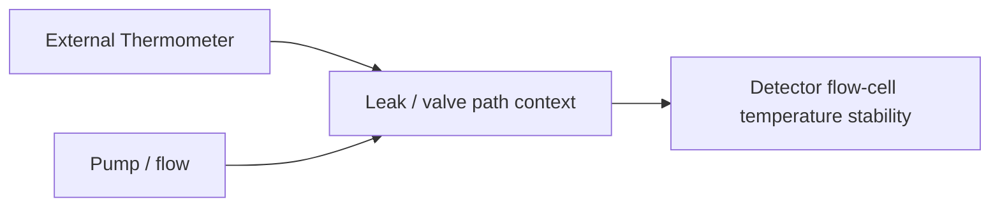

# FOQ Test Description for VX-C10-A / Vanquish TCC

## Knowledge File Metadata

| Field | Value |
|---|---|
| KB_Version | 1.0 |
| Source_Revision | 1.00 |
| Extraction_Date | 2026-07-09 |
| Extractor | technical-document-knowledge-extractor |
| Source_Path | `C:\ProgramData\CMBX Data Explorer Workspace\KB\FOQ TD\FOQ_Testdescription_VX-C10-A.docm` |

## 文档元数据

| Field | Value |
|---|---|
| 文档标题 | FOQ Test Description (FOQ_TD) for VA-C10-A / VX-C10-A |
| 文档编号 / Agile Document ID | DOC0000266 |
| 当前版本 | 1.00 |
| 发布日期 / Current Revision Date | 14-Oct-2023 |
| 适用仪器型号 | VH-C10-A, VC-C10-A, VA-C10-A |
| 文档负责人 / Document Owner | Lei Shi |
| 文件引用 | FOQ_Testdescription_VX-C10-A.docm |
| 源文档类型 | FOQ_TD |

## 核心术语与缩写

| Term | Meaning | Knowledge note |
|---|---|---|
| TCC / VTCC | Thermostatted Column Compartment | Column temperature module under FOQ. |
| VX-C10-A | Generic TCC family name in this TD | Covers VH-C10-A, VC-C10-A, VA-C10-A. |
| IRC | Intelligent Run Control | Inserts model-specific injections for Temperature Accuracy/Stability. |
| PCC | Post-Column Cooler | VH-C10-A-specific test family. |
| Column ID | Column identification tags | Verifies column ID behavior. |
| Preheater | Active pre-heater connection port | Checks port/module presence and behavior. |
| External thermometer | Thermometer used for temperature validation | Debug/measurement channels must be configured. |

## 测试流程概览

| Order | Test / Action | VH-C10-A | VC-C10-A | VA-C10-A | Knowledge note |
|---:|---|---|---|---|---|
| 1 | Column IDs | Yes | Yes | Not explicit in table extraction | Pre-burn-in test. |
| 2 | Preheater Connection Test | Yes | Yes | Yes | Active preheater port behavior. |
| 3 | Valve Test / Keypad Part 1 | Yes | Yes | Yes | Valve/keypad initial test. |
| 4 | VATCC_BurnIn | Yes | Yes | Yes | Preparation/stress phase. |
| 5 | Temperature Calibration | Yes | Yes | Yes | Creates calibration and model variable context. |
| 6 | Temperature Accuracy | Yes | Yes | Yes | Inserted by IRC. |
| 7 | Temperature Precision and Fan | Yes | Yes | Yes | Precision/fan behavior. |
| 8 | Temperature Stability and PCC | Yes | No | No | VH-C10-A only. |
| 9 | Temperature Stability | No | Yes | Yes | VC/VA path. |
| 10 | HeatUp and CoolDown Time | Yes | Yes | Yes | Timing performance. |
| 11 | Liquid Leak / Keypad Part 2 | Yes | Yes | Yes | Leak sensor + keypad. |
| 12 | Qualification Service | Yes | Yes | Yes | Final service state. |
| 13 | Factory Default | Yes | Yes | Yes | Default state verification. |

## 关键测试条件汇总

| Area | Source section/table | Knowledge note |
|---|---|---|
| Hardware requirements | Section 4.1 | Thermometer, column switching valve utilities, column ID tags, preheater utilities, liquid leak utilities. |
| Chromeleon configuration | Section 4.2 | Debug channels and imported XML settings are required. |
| Acceptance Criteria | Section 4.3 | FOQ acceptance criteria. |
| Debug channel settings | Appendix 9.1 / Table 10 | Additional Temperature Controller properties and channels. |
| IRC injection assignment | Appendix 9.2 / Table 11 | Processing-method IRC must point to additional injections. |

## Detailed Test Cards / 详细测试知识卡

### 6.1 Column ID

**测试目的**

Verify column identification behavior and ensure configured column tags are correctly read/reported.

**测试步骤简述**

The method reads Column ID tag descriptions/metadata and report checks expected values.

**关键参数**

| 参数 | 设定值 | 与通用条件的差异 |
|---|---|---|
| Hardware | Column ID tags | Requires configured tags. |
| Formula family | AUDIT.Column_A/B/C/D.Description | Known from report reverse work. |

**评估方法与接受标准**

| 判据 | 限值 | 类型 | 备注 |
|---|---:|---|---|
| Column ID A-D | Expected tag values | Internal/External per DB mapping | Existing CMBX report rules compare descriptions to expected letters. |

**相关性标注**

Requires CM configuration with Column ID enabled.

### 6.2 Active Pre-Heater Connection Port Test

**测试目的**

Verify preheater connection port availability and module/memory state.

**测试步骤简述**

The method exercises or reads left/right preheater port state and report checks RetTimes/module presence/memory state.

**关键参数**

| 参数 | 设定值 | 与通用条件的差异 |
|---|---|---|
| Hardware | Active preheater connection ports | Config dependent. |
| Report sources | RetTimes, ModulePresent, MemoryState | Known from TCC reverse work. |

**评估方法与接受标准**

| 判据 | 限值 | 类型 | 备注 |
|---|---:|---|---|
| Port state | RetTimes present, ModulePresent Yes, MemoryState OK | Internal/External per mapping | Confirm report template per model. |

**相关性标注**

Preheater configuration affects generated method validity.

### 6.3 / 7.6 Valve and Keypad Functionality

**测试目的**

Verify column switching valve and keypad/liquid leak user-interface behavior.

**测试步骤简述**

Valve positions and keypad/leak sensor interactions are exercised before and after burn-in.

**关键参数**

| 参数 | 设定值 | 与通用条件的差异 |
|---|---|---|
| Valve | Column switching valve | Requires valve hardware. |
| Keypad/leak sensor | User/input states | Configuration dependent. |

**评估方法与接受标准**

| 判据 | 限值 | 类型 | 备注 |
|---|---:|---|---|
| Valve/keypad/leak state | Source criteria | Internal/External per source | Exact report fields require extraction. |

**相关性标注**

Hardware configuration must match method commands.

### 5.1.1 Burn-In

**测试目的**

Exercise TCC module and stabilize system before calibrated performance tests.

**测试步骤简述**

Burn-in method performs thermal/valve/device actions before FOQ measurement injections.

**关键参数**

| 参数 | 设定值 | 与通用条件的差异 |
|---|---|---|
| Injection | VATCC_BurnIn | Preparation/stress phase. |

**评估方法与接受标准**

| 判据 | 限值 | 类型 | 备注 |
|---|---:|---|---|
| Burn-in completion | Source-defined | Internal | Method script required for details. |

**相关性标注**

Precedes temperature accuracy, precision, stability, and heat/cool timing.

### 5.2 Temperature Calibration

**测试目的**

Prepare temperature calibration state and model-dependent IRC variables for later temperature tests.

**测试步骤简述**

The method runs temperature calibration and sets variables used by processing methods. The extracted TD notes GenericBool0 is set to 1 for VH-C10-A, otherwise 0 for VC-C10-A during Temperature Calibration.

**关键参数**

| 参数 | 设定值 | 与通用条件的差异 |
|---|---|---|
| GenericBool0 | 1 for VH-C10-A, 0 otherwise | Used by IRC pass criterion. |
| Additional sequence | FOQ_VX-C10_V2_00_AdditionalInjections | Required for inserted injections. |

**评估方法与接受标准**

| 判据 | 限值 | 类型 | 备注 |
|---|---:|---|---|
| Calibration/IRC variable | Correct model-dependent value | Internal | Incorrect IRC assignment interrupts FOQ run. |

**相关性标注**

Temperature Accuracy and Temperature Stability injections are inserted by IRC and depend on processing method configuration.

### 7.1 Temperature Accuracy

**测试目的**

Verify column compartment temperature accuracy at defined setpoints using external thermometer signals.

**测试步骤简述**

The method sets nominal temperatures, waits for readiness/stability, logs RetTimes, and report evaluates observed external temperatures around RetTime windows.

**关键参数**

| 参数 | 设定值 | 与通用条件的差异 |
|---|---|---|
| Source signals | External thermometer channels | Requires configured thermometers. |
| Evaluation | Observed vs nominal deviation | Known report rules exist in CMBX explorer docs. |
| Injection handling | Inserted by IRC | Not initially in sequence template. |

**评估方法与接受标准**

| 判据 | 限值 | 类型 | 备注 |
|---|---:|---|---|
| Temperature accuracy | Source section 4.3 / report Definitions | External | Existing reverse rules compute max absolute deviation. |

**相关性标注**

Depends on external thermometer configuration and correct IRC injection insertion.

### 7.2 Temperature Precision and Fan Functionality

**测试目的**

Verify repeatability of measured temperature and fan-related behavior.

**测试步骤简述**

The method measures repeated temperature readings at controlled condition and report evaluates worst sensor range.

**关键参数**

| 参数 | 设定值 | 与通用条件的差异 |
|---|---|---|
| Evaluation | Lower/Upper sensor range separately | Existing reverse rule avoids combining sensor offset. |
| Fan | Fan functionality state | Requires report/method extraction for full details. |

**评估方法与接受标准**

| 判据 | 限值 | 类型 | 备注 |
|---|---:|---|---|
| Temperature precision | Source/report Definitions | External | Existing reverse rule uses max of lower/upper ranges. |

**相关性标注**

Related to Temperature Stability; both must not mix external thermometer offset into result.

### 7.3 Temperature Stability / 7.4 PCC

**测试目的**

Verify long-term temperature stability; VH-C10-A additionally validates post-column cooler performance.

**测试步骤简述**

Temperature signals are acquired over the stability interval. For VH, PCC performance/cool-down behavior is also evaluated.

**关键参数**

| 参数 | 设定值 | 与通用条件的差异 |
|---|---|---|
| VH path | Temperature Stability and PCC | VH-C10-A only. |
| VC/VA path | Temperature Stability | No PCC test. |
| Evaluation | Lower/Upper sensor range separately | Existing reverse rule. |

**评估方法与接受标准**

| 判据 | 限值 | 类型 | 备注 |
|---|---:|---|---|
| Temperature stability | Source/report Definitions | External | Max of lower/upper ranges. |
| PCC cooldown | Source/report Definitions | External/Internal per mapping | VH-C10-A only. |

**相关性标注**

Incorrect model branch causes wrong report template/injection selection.

### 7.5 Heat-Up and Cool-Down Time

**测试目的**

Verify the TCC can heat from lower to higher setpoint and cool back within the required time.

**测试步骤简述**

The method logs RetTimes at start and stable/end points for heat-up and cool-down. Report subtracts stable-hold offsets and compares times to criteria.

**关键参数**

| 参数 | 设定值 | 与通用条件的差异 |
|---|---|---|
| Heat-up interval | RetTime3 - RetTime1 - 2.0 min | Existing reverse rule. |
| Cool-down interval | RetTime6 - RetTime4 - 2.0 min | Existing reverse rule. |
| Display precision | 1 decimal | Existing report behavior. |

**评估方法与接受标准**

| 判据 | 限值 | 类型 | 备注 |
|---|---:|---|---|
| Heat-up time | <= source/report limit | External | Report D26/D27 style output. |
| Cool-down time | <= source/report limit | External | Report D26/D27 style output. |

**相关性标注**

Requires correct RetTime logging in instrument method.

### 7.6 Liquid Leak Test / 7.7 Qualification Service / 7.8 Factory Default

**测试目的**

Verify liquid leak sensor/keypad behavior and final service/default state.

**测试步骤简述**

The method exercises leak sensor states, sets/checks qualification service, and checks factory default parameters.

**关键参数**

| 测试 | 关键参数 | 与通用条件的差异 |
|---|---|---|
| Liquid Leak | Leak sensor states | Source section 5.3.1. |
| Qualification Service | Qualification state | Final state. |
| Factory Default | Device default properties | Final/default state. |

**评估方法与接受标准**

| 判据 | 限值 | 类型 | 备注 |
|---|---:|---|---|
| Leak/service/default | Source section 4.3 | Internal/External per source | Exact report fields require extraction. |

**相关性标注**

Final state checks are essential before database upload.

## 对比分析

| Topic | VH-C10-A | VC-C10-A | VA-C10-A | Generation implication |
|---|---|---|---|---|
| PCC | Yes | No | No | VH method/report branch includes PCC. |
| Temperature Stability injection | Stability_and_PCC | Stability | Stability | IRC branch must be correct. |
| Column ID | Yes | Yes | not explicit in extracted row | Confirm VA applicability. |
| Preheater | Yes | Yes | Yes | Preheater hardware still optional/config sensitive. |
| Additional injections | Required by IRC | Required by IRC | Required by IRC | Processing method assignments must be valid. |

## 故障排除知识库

| Problem | Diagnostic logic | Likely cause | Recommended action |
|---|---|---|---|
| IRC error for inserted injection | Check processing method pass action assignment | Additional sequence path not assigned | Reassign injections in processing methods per Appendix 9.2. |
| Temperature accuracy fails | Compare external thermometer channels and audit RetTimes | Sensor config, external thermometer, method timing | Verify CM configuration and RetTime windows. |
| Stability/precision looks too large | Check if lower/upper sensors were combined incorrectly | Report formula misunderstanding | Evaluate each sensor range separately. |
| Method does not run in CM | Check available hardware/config | Missing valve/preheater/column ID/debug channels | Align CMBX generation with instrument configuration. |

## 测试逻辑解读

### Why IRC matters

🧠 Knowledge Interpretation

Temperature Accuracy and Stability injections are not initially part of the sequence template. The processing method uses IRC to insert the correct additional injection depending on model type.

⚙️ Generation Implication

A generated TCC CMBX cannot just list injections; it must either include model-specific injections directly or correctly configure IRC processing-method pass actions.

🔓 Open Verification Required

Exact processing method IRC assignments and additional sequence paths must be validated after template changes.

## 公式解读

Known reverse-engineered formulas from CMBX Explorer:

```text
Temperature Accuracy deviation = observed external temperature - nominal
Temperature Precision/Stability = max(lower sensor range, upper sensor range)
HeatUp_Time = RetTime3 - RetTime1 - 2.0 min
CoolDown_Time = RetTime6 - RetTime4 - 2.0 min
```

These formulas are supported by existing CMBX reverse-engineering notes but should still be tied to the selected report template during generation.

## Cross-Module Dependency Mapping



## Executable Pseudocode

```python
def run_tcc_temperature_accuracy(setpoint):
    set_temperature(20)  # baseline strategy requires method confirmation
    wait_until_stable()
    set_temperature(setpoint)
    wait_until_stable()
    log_rettime("RetTime_for_measurement")
    acquire_external_thermometer_window()
    return evaluate_accuracy_against_nominal(setpoint)
```

## Open Verification Required

| Item | Why unresolved | Required evidence |
|---|---|---|
| Full numeric criteria | Source table/report Definitions needed | Extract acceptance table and report template. |
| Exact CM commands | TD + CMBX method alignment needed | Instrument methods from representative TCC CMBX. |
| VA-C10-A Column ID applicability | Extracted Table 2 row incomplete | Full table parse. |

## Final Validation / Final Knowledge Summary

VX-C10-A/TCC FOQ validates column ID, preheater, valve/keypad, burn-in, temperature calibration, accuracy, precision/fan, stability/PCC, heat-up/cool-down, leak sensor, service, and factory defaults. The most important generation constraint is model-specific IRC insertion and hardware/config availability.
