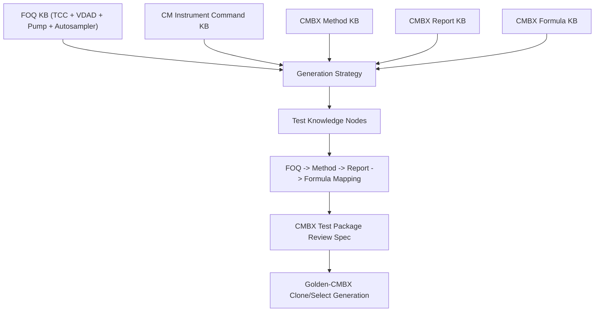

# CMBX Knowledge Index

This index tracks the knowledge-base files used by CMBX Data Explorer and the
FOQ generation workflow. The project copy lives under:

```text
cmbx_data_explorer/docs/KB_INDEX.md
```

The workspace mirror lives under:

```text
C:\ProgramData\CMBX Data Explorer Workspace\KB\KB_INDEX.md
```

Current date: 2026-07-10. Entries dated after this date are treated as planned
target dates rather than completed updates.

## Knowledge Base Versions

| KB Name | Version | Update Date | Coverage | Status | Local File(s) |
|---|---:|---|---|---|---|
| VDAD_KB | 1.0 | 2026-07-08 | VDAD-F/C, VMWD-C | Published | `FOQ/Detector/FOQ_VDAD_VMWD_TD_KNOWLEDGE_MANAGEMENT.md`, `FOQ/Detector/FOQ_VDAD_VMWD_TEST_LOGIC_KNOWLEDGE_BASE.md` |
| TCC_KB | 1.0 | 2026-07-09 | VH/VC/VA-C10-A | Published | `FOQ/TCC/FOQ_TCC_VX_C10_A_TD_KNOWLEDGE_MANAGEMENT.md`, `FOQ/TCC/FOQ_TD_TEST_LOGIC_KNOWLEDGE_BASE.md` |
| Pump_KB | 0.5 | 2026-07-10 target | Vanquish Pump / HPG-related FOQ | In development | `FOQ/Pump/FOQ_VPUMP_TD_KNOWLEDGE_MANAGEMENT.md`, `FOQ/Pump/FOQ_VPUMP_TEST_LOGIC_KNOWLEDGE_BASE.md` |
| Autosampler_KB | 0.5 | 2026-07-09 | Vanquish Autosampler FOQ | Draft | `FOQ/Autosampler/FOQ_VAS_TD_KNOWLEDGE_MANAGEMENT.md`, `FOQ/Autosampler/FOQ_VAS_TEST_LOGIC_KNOWLEDGE_BASE.md` |
| CMBX_Methods_Inventory | 2.3 | 2026-06-15 | TCC decoded methods, expandable to all modules | Published / partial local mirror | `knowledge_base/tcc_reverse_probe/**/_embedded_method_flow.tsv`, `cmbx_data_explorer/docs/TCC_METHOD_COMMAND_CONTRACTS.md` |
| CMBX_Reports_Inventory | 2.1 | 2026-06-10 | TCC report templates, expandable to all modules | Published / partial local mirror | `cmbx_data_explorer/docs/TCC_METHOD_REPORT_ALIGNMENT.md`, report template tabs/docs |
| CMBX_Formulas | 1.2 | 2026-06-20 | Report formula and workbook-derived rules | Published / partial local mirror | `cmbx_data_explorer/docs/CM_FORMULA_KNOWLEDGE_BASE.md`, `cmbx_data_explorer/CM_FORMULA_REVERSE_ENGINEERING.md` |
| CMBX_Generation_Strategy | 1.0 | 2026-07-09 | Cross-module generation strategy | Published | `cmbx_data_explorer/docs/CMBX_GENERATION_STRATEGY_KB.md` |
| TCC_TestKnowledgeNodes | 0.2 | 2026-07-09 | TCC FOQ injection/method/report/DB node model | In development | `FOQ/TCC/TCC_TEST_KNOWLEDGE_NODE_MODEL.md`, `cmbx_data_explorer/docs/TCC_TEST_KNOWLEDGE_NODE_MODEL.md` |
| TCC_BlackBox_Decompositions | 1.3 | 2026-07-10 | Temperature Accuracy, Calibration, Precision/Fan, Stability/PCC, HeatUp/CoolDown, BurnIn, Preheater, Column ID, Valve/Keypad, Liquid Leak, Qualification Service, Factory Default, Error Log Check contracts | In development | `cmbx_data_explorer/docs/TCC_ACCURACY_BLACK_BOX_DECOMPOSITION.md`, `cmbx_data_explorer/docs/TCC_CALIBRATION_BLACK_BOX_DECOMPOSITION.md`, `cmbx_data_explorer/docs/TCC_PRECISION_FAN_BLACK_BOX_DECOMPOSITION.md`, `cmbx_data_explorer/docs/TCC_STABILITY_BLACK_BOX_DECOMPOSITION.md`, `cmbx_data_explorer/docs/TCC_HEATUP_COOLDOWN_BLACK_BOX_DECOMPOSITION.md`, `cmbx_data_explorer/docs/TCC_BURNIN_BLACK_BOX_DECOMPOSITION.md`, `cmbx_data_explorer/docs/TCC_PREHEATER_BLACK_BOX_DECOMPOSITION.md`, `cmbx_data_explorer/docs/TCC_COLUMN_ID_BLACK_BOX_DECOMPOSITION.md`, `cmbx_data_explorer/docs/TCC_VALVE_KEYPAD_BLACK_BOX_DECOMPOSITION.md`, `cmbx_data_explorer/docs/TCC_LIQUID_LEAK_BLACK_BOX_DECOMPOSITION.md`, `cmbx_data_explorer/docs/TCC_QUALIFICATION_SERVICE_BLACK_BOX_DECOMPOSITION.md`, `cmbx_data_explorer/docs/TCC_FACTORY_DEFAULT_BLACK_BOX_DECOMPOSITION.md`, `cmbx_data_explorer/docs/TCC_ERROR_LOG_BLACK_BOX_DECOMPOSITION.md` |
| TCC_TestRelationshipModel | 0.1 | 2026-07-10 | TCC inter-test dependencies, shared resources, modifiability, crop/merge impact, failure propagation | In development | `cmbx_data_explorer/docs/TCC_TEST_RELATIONSHIP_MODEL.md` |
| VX_C10_A_TCC_Method_Package | 0.1 | 2026-07-09 | TCC FOQ method package review spec | Draft / review | `cmbx_data_explorer/docs/VX_C10_A_TCC_FOQ_CMBX_METHOD_PACKAGE.md` |

## Cross-Module Dependency Graph



## Repository Map

### CM Instrument Commands

- `CM/Instrument Commands/CM_INSTRUMENT_COMMAND_KNOWLEDGE_BASE_V2.md`
- Project mirror: `cmbx_data_explorer/docs/CM_INSTRUMENT_COMMAND_KNOWLEDGE_BASE_V2.md`

Purpose:

```text
Chromeleon Instrument Setup tree and instrument-method command knowledge.
```

Main topics:

```text
ColumnOven / PumpModule / SamplerModule / Thermometer / UV / Variables / System / End
SET / Wait / Delay / Trigger / RetTimes / AcqOn / Log / Message / AbortQueue / CmdString
```

### FOQ TCC

- `FOQ/TCC/FOQ_TCC_VX_C10_A_TD_KNOWLEDGE_MANAGEMENT.md`
- `FOQ/TCC/FOQ_TD_TEST_LOGIC_KNOWLEDGE_BASE.md`
- Test Knowledge Node model: `FOQ/TCC/TCC_TEST_KNOWLEDGE_NODE_MODEL.md`
- Project node model mirror: `cmbx_data_explorer/docs/TCC_TEST_KNOWLEDGE_NODE_MODEL.md`
- Black-box decompositions: `cmbx_data_explorer/docs/TCC_ACCURACY_BLACK_BOX_DECOMPOSITION.md`, `cmbx_data_explorer/docs/TCC_CALIBRATION_BLACK_BOX_DECOMPOSITION.md`, `cmbx_data_explorer/docs/TCC_PRECISION_FAN_BLACK_BOX_DECOMPOSITION.md`, `cmbx_data_explorer/docs/TCC_STABILITY_BLACK_BOX_DECOMPOSITION.md`, `cmbx_data_explorer/docs/TCC_HEATUP_COOLDOWN_BLACK_BOX_DECOMPOSITION.md`, `cmbx_data_explorer/docs/TCC_BURNIN_BLACK_BOX_DECOMPOSITION.md`, `cmbx_data_explorer/docs/TCC_PREHEATER_BLACK_BOX_DECOMPOSITION.md`, `cmbx_data_explorer/docs/TCC_COLUMN_ID_BLACK_BOX_DECOMPOSITION.md`, `cmbx_data_explorer/docs/TCC_VALVE_KEYPAD_BLACK_BOX_DECOMPOSITION.md`, `cmbx_data_explorer/docs/TCC_LIQUID_LEAK_BLACK_BOX_DECOMPOSITION.md`, `cmbx_data_explorer/docs/TCC_QUALIFICATION_SERVICE_BLACK_BOX_DECOMPOSITION.md`, `cmbx_data_explorer/docs/TCC_FACTORY_DEFAULT_BLACK_BOX_DECOMPOSITION.md`, `cmbx_data_explorer/docs/TCC_ERROR_LOG_BLACK_BOX_DECOMPOSITION.md`
- Test relationship model: `cmbx_data_explorer/docs/TCC_TEST_RELATIONSHIP_MODEL.md`
- Project review spec: `cmbx_data_explorer/docs/VX_C10_A_TCC_FOQ_CMBX_METHOD_PACKAGE.md`

Main topics:

```text
Column ID
Preheater Connection Test
Valve and Keypad
Burn-In
Temperature Calibration
Temperature Accuracy
Temperature Precision and Fan
Temperature Stability and PCC
HeatUp and CoolDown
Liquid Leak
Qualification Service
Factory Default
Error Log Check
```

### FOQ Detector

- `FOQ/Detector/FOQ_VDAD_VMWD_TD_KNOWLEDGE_MANAGEMENT.md`
- `FOQ/Detector/FOQ_VDAD_VMWD_TEST_LOGIC_KNOWLEDGE_BASE.md`
- `FOQ/Detector/FOQ_VVWD_TD_KNOWLEDGE_MANAGEMENT.md`
- `FOQ/Detector/FOQ_VVWD_TEST_LOGIC_KNOWLEDGE_BASE.md`

Main topics:

```text
Warm Up
Noise and Drift
Wavelength Accuracy
Dark Current Drift
Stray Light
Spectral Scan
Linearity
Saturation
Factory Defaults
```

### FOQ Pump

- `FOQ/Pump/FOQ_VPUMP_TD_KNOWLEDGE_MANAGEMENT.md`
- `FOQ/Pump/FOQ_VPUMP_TEST_LOGIC_KNOWLEDGE_BASE.md`

Main topics:

```text
Burn-In / Purge / Tightness / Balance
Pressure Sensor and Transducer Calibration
Flow Rate Calibration
X-Value Calibration
Flow Accuracy / Pulsation / Filter Permeability
Gradient Accuracy
Solvent Selector
Degasser Pressure Test
```

### FOQ Autosampler

- `FOQ/Autosampler/FOQ_VAS_TD_KNOWLEDGE_MANAGEMENT.md`
- `FOQ/Autosampler/FOQ_VAS_TEST_LOGIC_KNOWLEDGE_BASE.md`

Main topics:

```text
Leakage Check
Carry-Over
Drive Functionality
Injection Volume Precision
Injection Volume Linearity
Cooling Performance
Relays / Digital Inputs
Factory Defaults
```

## Source TD Files

Original source documents remain under:

```text
C:\ProgramData\CMBX Data Explorer Workspace\KB\FOQ TD
```

Derived Markdown knowledge should reference source files but should not overwrite
them.
