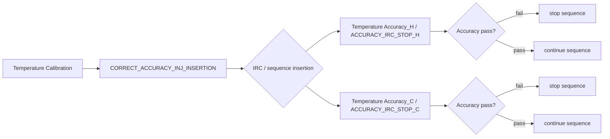
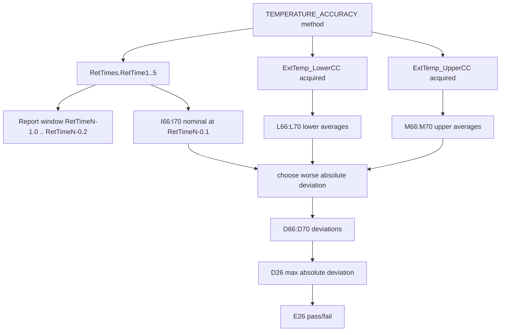
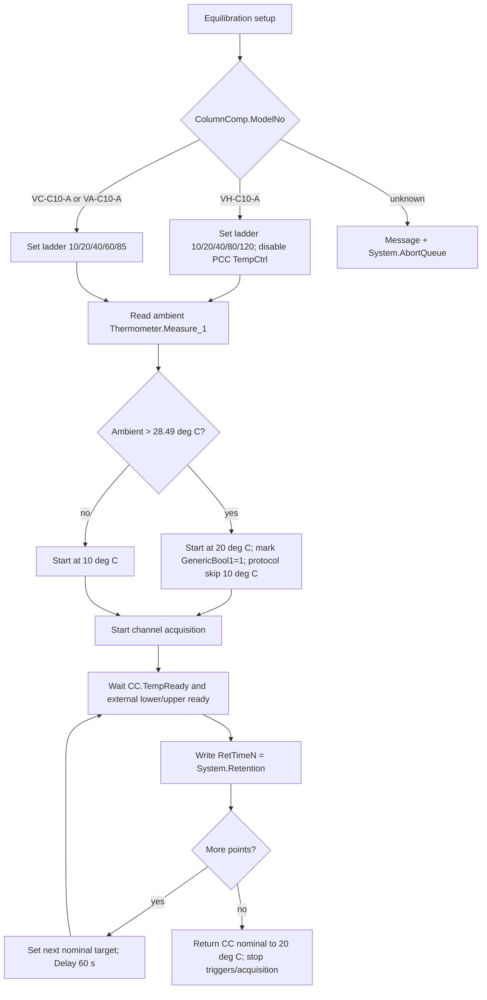

# TCC Temperature Accuracy Black Box Decomposition

Extraction date: 2026-07-09

Scope: TCC FOQ Temperature Accuracy for `VH-C10-A`, `VC-C10-A`, and `VA-C10-A`.

This document decomposes the Temperature Accuracy test as a generation contract. The goal is not only to know which DB field is filled, but to understand what the method commands do, when the raw data becomes valid, how IRC/processing is bound, how the report formulas read raw/audit evidence, and what remains unverifiable.

## Evidence Sources

| Evidence | Source |
|---|---|
| Test intent node | `cmbx_data_explorer/docs/TCC_TEST_KNOWLEDGE_NODE_MODEL.md` |
| Decoded method flow, VH | `knowledge_base/tcc_reverse_probe/VH/6000001/TEMPERATURE_ACCURACY_embedded_method_flow.txt` |
| Decoded method flow, VC | `knowledge_base/tcc_reverse_probe/VC/3000004/TEMPERATURE_ACCURACY_embedded_method_flow.txt` |
| Decoded method flow, VA | `knowledge_base/tcc_reverse_probe/VA/0000003/TEMPERATURE_ACCURACY_embedded_method_flow.txt` |
| Method contract summary | `knowledge_base/tcc_method_contracts/*_TEMPERATURE_ACCURACY_contract.md` |
| Processing method probe | `knowledge_base/tcc_processing_probe/*/*ACCURACY_IRC_STOP*_summary.txt` and `knowledge_base/tcc_processing_probe/README.md` |
| Report formula objects | `knowledge_base/tcc_report_formula_objects_vh_6000001.tsv` |
| Formula reverse notes | `cmbx_data_explorer/CM_FORMULA_REVERSE_ENGINEERING.md` |
| DB mapping | `foq/FOQResultLocations_V2.83.xls` |

## Executive Answer

1. The method runs a five-point setpoint ladder. `VH-C10-A` uses `10, 20, 40, 80, 120 deg C`; `VC-C10-A` and `VA-C10-A` use `10, 20, 40, 60, 85 deg C`.
2. External thermometer data is continuously acquired from `Thermometer1.ExtTemp_LowerCC` and `Thermometer1.ExtTemp_UpperCC`. A RetTime is written only after `ColumnComp.CC.TempReady` and both external probes are stable.
3. The report does not read an instant value at the RetTime. It averages each external thermometer over `RetTimeN - 1.0` to `RetTimeN - 0.2` minutes, then derives the larger absolute deviation from the nominal setpoint.
4. The processing methods `ACCURACY_IRC_STOP_H` and `ACCURACY_IRC_STOP_C` are bound to the Accuracy injections and carry a comment that integration is inhibited and the sequence is stopped if the accuracy test fails. The exact SST/IRC row business rule is still not decoded from the current XML payloads.
5. The primary model difference is the high-temperature branch and report template: `VH-C10-A` uses `Temperature Accuracy_H` and `Report_VTCC_V2_12`; `VC-C10-A` uses `Temperature Accuracy_C` and `Report_VTCC_V2_12`; `VA-C10-A` uses `Temperature Accuracy_C` and `Report_VATCC_V1_01`.

## Contract 1: FOQ Test Intent

Temperature Accuracy verifies how far the real column-compartment temperature is from the requested nominal setpoint. The reference is the external thermometer, not only the TCC internal control temperature.

| Field | Value |
|---|---|
| TestKnowledgeNode | `TCC_ACC_01` |
| Test name | Temperature Accuracy |
| Formula ID | `FORMULA_TCC_TEMP_ACCURACY_MAX_DEVIATION` |
| Acceptance rule | External: max absolute temperature deviation <= `Definitions!Temperature Accuracy` |
| Core raw sources | `ExtTemp_LowerCC`, `ExtTemp_UpperCC` |
| Core audit sources | `AUDIT.RetTime1..5`, `AUDIT.ColumnComp.CC.Temperature.Nominal(...)` |

Knowledge interpretation:

```text
Accuracy is not "read the temperature after SET".
It is:
  set nominal target
  wait for controller readiness
  verify both external thermometer probes are stable
  write RetTime as a stable-window anchor
  let the report average the preceding settled raw window
  compare the worse external probe deviation against the acceptance limit
```

## Contract 2: Sequence and Injection Binding

| Model | Injection | Instrument method | Processing method | Report template | Report sheet | DB fields |
|---|---|---|---|---|---|---|
| `VH-C10-A` | `Temperature Accuracy_H` | `TEMPERATURE_ACCURACY` | `ACCURACY_IRC_STOP_H` | `Report_VTCC_V2_12` | `Temp Accuracy` | `TempAcc10`, `TempAcc20`, `TempAcc40`, `TempAcc80`, `TempAcc120`, `RES_TempAccuracy` |
| `VC-C10-A` | `Temperature Accuracy_C` | `TEMPERATURE_ACCURACY` | `ACCURACY_IRC_STOP_C` | `Report_VTCC_V2_12` | `Temp Accuracy` | `TempAcc10`, `TempAcc20`, `TempAcc40`, `TempAcc60`, `TempAcc85`, `RES_TempAccuracy` |
| `VA-C10-A` | `Temperature Accuracy_C` | `TEMPERATURE_ACCURACY` | `ACCURACY_IRC_STOP_C` | `Report_VATCC_V1_01` | `Temp Accuracy` | `TempAcc10`, `TempAcc20`, `TempAcc40`, `TempAcc60`, `TempAcc85`, `RES_TempAccuracy` |

Verified from TKN and sequence command link probes:

```text
VH 6000001 -> Temperature Accuracy_H / ACCURACY_IRC_STOP_H / TEMPERATURE_ACCURACY
VC 3000004 -> Temperature Accuracy_C / ACCURACY_IRC_STOP_C / TEMPERATURE_ACCURACY
VA 0000003 -> Temperature Accuracy_C / ACCURACY_IRC_STOP_C / TEMPERATURE_ACCURACY
```

## Contract 3: Instrument Method Command

### 3.1 Global Setup

The decoded `TEMPERATURE_ACCURACY` method uses these stages:

```text
InstrumentSetup
Equilibration
InjectPreparation
StartRun
Run
StopRun
```

Important setup commands and variables:

| Area | Evidence | Meaning |
|---|---|---|
| Page/model variable | `Variables.GenericLong9 = 12` for VH, `10` for non-VH branch | Used by report/page logic; logged as `GenericLong9` |
| Ready threshold, broad | `ColumnComp.CC.ReadyTempDelta = 1.0 deg C`, `EquilibrationTime = 0.5` | Initial readiness setup |
| Temperature control | `ColumnComp.CC.TempCtrl = On` | Enables CC temperature control |
| VH PCC branch | `ColumnComp.CmdString Cmd="PCC.TempCtrl=0"` when `ColumnComp.ModelNo="VH-C10-A"` | Disables PCC control for this accuracy test |
| Air mode | `ColumnComp.CC.Mode = StillAir` | Sets CC operating mode |
| Leak sensor | `ColumnComp.LiquidLeakSensor = Off` | Avoids false alarms during large temperature changes |
| Debug channels | Several `Data_Collection_Rate = 20` settings | Enables high-rate debug channel capture |

### 3.2 Model-Dependent Temperature Ladder

The method fills `Variables.GenericDouble1..5` with the target ladder.

| Model branch | GenericDouble1 | GenericDouble2 | GenericDouble3 | GenericDouble4 | GenericDouble5 | RetTime meaning |
|---|---:|---:|---:|---:|---:|---|
| `VH-C10-A` | 10 | 20 | 40 | 80 | 120 | `RetTime1..5` map to 10/20/40/80/120 |
| `VC-C10-A` / `VA-C10-A` | 10 | 20 | 40 | 60 | 85 | `RetTime1..5` map to 10/20/40/60/85 |

Ambient branch:

```text
SET TempVars.Ambient_Temp = Thermometer.Measure_1
IF TempVars.Ambient_Temp > 28.49:
  start at GenericDouble2, set GenericBool1 = 1
ELSE:
  start at GenericDouble1
```

Generation implication:

```text
The 10 deg C point can be skipped at high ambient temperature.
Reports and DB mappings must tolerate the missing/zero RetTime1 path or the generated sequence must force valid ambient conditions.
```

### 3.3 Stability Logic Before Each RetTime

The method first resets:

```text
RetTimes.RetTime1..RetTime5 = 0
StabVars.TriggerStab1 = 0
StabVars.TriggerStab2 = 0
StabVars.CounterUpper/CounterLower = 0
StabVars.UpperReady/LowerReady = 0
ColumnComp.CC.ReadyTempDelta = 0.2
ColumnComp.CC.EquilibrationTime = 3
```

Then it defines alternating triggers:

```text
Gradient_1:
  condition = (StabVars.TriggerStab1=1) AND CC.TempReady
  TrueTime = 30 s

Gradient_2:
  condition = StabVars.TriggerStab2=1
  TrueTime = 30 s

ExitRange_Upper:
  condition = external upper leaves +/-0.05 deg C window OR CC not ready
  TrueTime = 5 s

ExitRange_Lower:
  condition = external lower leaves +/-0.05 deg C window OR CC not ready
  TrueTime = 5 s
```

External probe readiness:

```text
UpperReady = 1 only if CounterUpper >= 4
LowerReady = 1 only if CounterLower >= 4
```

The working interpretation is that the method requires both external thermometers to remain within a narrow local stability band before writing each RetTime. The decoded flow shows `+/-0.05 deg C` upper/lower bands and a `Counter >= 4` condition.

### 3.4 Run Loop and RetTime Emission

The method starts acquisition:

```text
RUN ColumnComp.CC_Temp.AcqOn
RUN ColumnComp.CC_U_Temp_Actual.AcqOn
RUN ColumnComp.CC_L_Temp_Actual.AcqOn
RUN ColumnComp.CC_UCTL_TempRear_Actual.AcqOn
RUN ColumnComp.PWM_CCU_A.AcqOn
RUN ColumnComp.PWM_CCU_B.AcqOn
RUN ColumnComp.PWM_CCL_A.AcqOn
RUN ColumnComp.PWM_CCL_B.AcqOn
RUN ColumnComp.Fan_Rear_ActualRPM.AcqOn
RUN Thermometer1.ExtTemp_UpperCC.AcqOn
RUN Thermometer1.ExtTemp_LowerCC.AcqOn
RUN Thermometer.Environment_Temperature.AcqOn
RUN ColumnComp.LEDBoard_LeakDiff.AcqOn
RUN ColumnComp.LEDBoard_A13.AcqOn
RUN ColumnComp.LEDBoard_A14.AcqOn
RUN ColumnComp.Oven_Gas_MuteTimeRemain.AcqOn
```

Simplified command semantics:

```yaml
TEMPERATURE_ACCURACY_loop:
  precondition:
    - ColumnComp.CC.TempReady
    - StabVars.LowerReady
    - StabVars.UpperReady
  per_point:
    - wait: "ColumnComp.CC.TempReady AND StabVars.LowerReady AND StabVars.UpperReady"
      run_mode: Continue
    - log_anchor: "RetTimes.RetTimeN = System.Retention"
    - set_next_target: "ColumnComp.CC.Temperature.Nominal = Variables.GenericDouble(N+1)"
    - transition_delay_seconds: 60
  final:
    - set_nominal: "20.0 deg C"
    - stop_external_stability_triggers
    - stop_acquisition
```

Concrete RetTime mapping:

| RetTime | VH target | VC/VA target | Written after |
|---|---:|---:|---|
| `RetTime1` | 10 deg C | 10 deg C | controller ready and both external probes stable, unless skipped by high ambient |
| `RetTime2` | 20 deg C | 20 deg C | controller ready and both external probes stable |
| `RetTime3` | 40 deg C | 40 deg C | controller ready and both external probes stable |
| `RetTime4` | 80 deg C | 60 deg C | controller ready and both external probes stable |
| `RetTime5` | 120 deg C | 85 deg C | controller ready and both external probes stable |

Abort safety:

```text
If a point takes more than 40 min from the current point anchor and RetTime5 is still 0,
the method forces the LED bar, shows an abort message, and calls System.AbortQueue.
```

## Contract 4: Processing Method IRC

| Processing method | Bound model/injection | Evidence |
|---|---|---|
| `ACCURACY_IRC_STOP_H` | `VH-C10-A` / `Temperature Accuracy_H` | sequence context includes `Temperature Accuracy_H`, `ACCURACY_IRC_STOP_H`, `TEMPERATURE_ACCURACY` |
| `ACCURACY_IRC_STOP_C` | `VC-C10-A`, `VA-C10-A` / `Temperature Accuracy_C` | sequence context includes `Temperature Accuracy_C`, `ACCURACY_IRC_STOP_C`, `TEMPERATURE_ACCURACY` |
| `CORRECT_ACCURACY_INJ_INSERTION` | `Temperature Calibration` row, preceding corrective insertion logic | sequence context links it with `Temperature Calibration` and comment "Inhibits the integration for all channels" |

Known from decoded context:

```text
ACCURACY_IRC_STOP_H/C:
  "Inhibits the integration for all channels and stops the sequence,
   if the accuracy test fails"
```

Working model:



Open verification:

The processing probe README states that the exported XML contains the SST/IRC editor layout and columns such as `Injection Condition`, `Pass Actions`, and `Fail Actions`, but the currently decoded `SSTGrid` node does not contain actual business rows. Therefore the exact condition expression, insertion action, and stop action must be verified from the non-XML sequence-command serialization or inside Chromeleon UI.

## Contract 5: Report Formula

### 5.1 Direct ReportFormulaObject Evidence

`Report_VTCC_V2_12` sheet `Temp Accuracy` contains direct formula objects:

| Cell | Formula | Fixed channel | Meaning |
|---|---|---|---|
| `K66` | `AUDIT.RetTime1(1.000,"forward")` | | RetTime for point 1 |
| `K67` | `AUDIT.RetTime2(1.000,"forward")` | | RetTime for point 2 |
| `K68` | `AUDIT.RetTime3(1.000,"forward")` | | RetTime for point 3 |
| `K69` | `AUDIT.RetTime4(1.000,"forward")` | | RetTime for point 4 |
| `K70` | `AUDIT.RetTime5(1.000,"forward")` | | RetTime for point 5 |
| `L66:L70` | `chm.sig_value("average", AUDIT.RetTimeN - 1, AUDIT.RetTimeN - 0.2)` | `ExtTemp_LowerCC` | lower external thermometer average |
| `M66:M70` | `chm.sig_value("average", AUDIT.RetTimeN - 1, AUDIT.RetTimeN - 0.2)` | `ExtTemp_UpperCC` | upper external thermometer average |
| `I66:I70` | `AUDIT.ColumnComp.CC.Temperature.Nominal(AUDIT.RetTimeN - 0.1)` | | nominal temperature near anchor |
| `E45` | `chm.sig_value("average")` | `Environment_Temperature` | environment temperature summary |

### 5.2 Workbook-Derived Rules

The final deviation cells are workbook-derived rather than all being exposed as direct `ReportFormulaObject`.

Current verified evaluator rule:

```text
lower_avg_N = average(ExtTemp_LowerCC, RetTimeN - 1.0, RetTimeN - 0.2)
upper_avg_N = average(ExtTemp_UpperCC, RetTimeN - 1.0, RetTimeN - 0.2)
nominal_N = AUDIT.ColumnComp.CC.Temperature.Nominal(RetTimeN - 0.1)

observed_N =
  lower_avg_N if abs(lower_avg_N - nominal_N) >= abs(upper_avg_N - nominal_N)
  else upper_avg_N

deviation_N = observed_N - nominal_N
summary = max(abs(deviation_1..deviation_5))
result = Test passed if summary <= Definitions!Temperature Accuracy
```

Formula flow:



### 5.3 VA Template

`VA-C10-A` uses `Report_VATCC_V1_01` rather than `Report_VTCC_V2_12`. The TKN and DB mapping align the same `Temperature Accuracy_C.XLS` output and same field family, but the complete VA template formula-object row coverage still needs a template-specific formula trace before generation can claim equivalence.

## Contract 6: DB Contract and Configuration Requirement

### 6.1 DB Mapping as Leaf Contract

The DB mapping is a leaf validation target. It must not drive method generation by itself.

| Model | DB output file | Field-to-cell pattern |
|---|---|---|
| `VH-C10-A` | `Temperature Accuracy_H.XLS` | `TempAcc10/20/40/80/120 -> Temp Accuracy!D66:D70`, `RES_TempAccuracy -> E26` |
| `VC-C10-A` | `Temperature Accuracy_C.XLS` | `TempAcc10/20/40/60/85 -> Temp Accuracy!D66:D70`, `RES_TempAccuracy -> E26` |
| `VA-C10-A` | `Temperature Accuracy_C.XLS` | `TempAcc10/20/40/60/85 -> Temp Accuracy!D66:D70`, `RES_TempAccuracy -> E26` |

Display/typing rule:

```text
Temperature Accuracy observed/deviation cells display to 2 decimals.
Pass/fail compares the raw summary against Definitions!Temperature Accuracy.
SQL/DB output should preserve the mapped field type but avoid exposing binary float tails in user-facing preview/export.
```

### 6.2 Required Configuration

| Requirement | Why it is required | Evidence |
|---|---|---|
| `ColumnComp` with `CC` temperature control | Method sets `ColumnComp.CC.Temperature.Nominal`, readiness, mode, and TempCtrl | decoded method flow |
| Correct `ColumnComp.ModelNo` | Selects VH vs VC/VA setpoint branch and page-count variable | decoded method flow and report `Definitions!C15 = AUDIT.ColumnComp.ModelNo` |
| `Thermometer1.ExtTemp_UpperCC` | External upper thermometer source for report | method acquisition + report formulas |
| `Thermometer1.ExtTemp_LowerCC` | External lower thermometer source for report | method acquisition + report formulas |
| `Thermometer.Environment_Temperature` / `Thermometer.Measure_1` | Ambient check can skip 10 deg C point; report has environment formula | decoded method flow |
| Debug/signal channels | Method acquires CC actual temperatures, PWM, fan, leak board channels | decoded method flow |
| VH PCC command availability | VH branch runs `ColumnComp.CmdString Cmd="PCC.TempCtrl=0"` | decoded method flow |

Generation implication:

```text
A generated CMBX or method template must not only contain the script.
It must also declare the required CM instrument configuration symbols:
ColumnComp, Thermometer/Thermometer1, ExtTemp_UpperCC, ExtTemp_LowerCC,
Environment_Temperature, RetTimes, StabVars, and model-specific PCC command support.
```

## VH / VC / VA Comparison

| Aspect | `VH-C10-A` | `VC-C10-A` | `VA-C10-A` |
|---|---|---|---|
| Injection | `Temperature Accuracy_H` | `Temperature Accuracy_C` | `Temperature Accuracy_C` |
| Processing method | `ACCURACY_IRC_STOP_H` | `ACCURACY_IRC_STOP_C` | `ACCURACY_IRC_STOP_C` |
| Report template | `Report_VTCC_V2_12` | `Report_VTCC_V2_12` | `Report_VATCC_V1_01` |
| Temperature ladder | 10, 20, 40, 80, 120 deg C | 10, 20, 40, 60, 85 deg C | 10, 20, 40, 60, 85 deg C |
| PCC handling | Method disables PCC temp control by `CmdString` | no VH PCC branch | no VH PCC branch |
| Report output | `Temperature Accuracy_H.XLS` | `Temperature Accuracy_C.XLS` | `Temperature Accuracy_C.XLS` |
| DB fields | includes `TempAcc80`, `TempAcc120` | includes `TempAcc60`, `TempAcc85` | includes `TempAcc60`, `TempAcc85` |
| Open gap | exact IRC business rows | exact IRC business rows | VA template formula trace |

## Command Flow



## Open Verification Required

| # | Uncertain point | Needed evidence | Likely source |
|---|---|---|---|
| 1 | Exact SST/IRC row expression for `ACCURACY_IRC_STOP_H/C` | Decoded processing method row data including condition, operator, pass/fail action | non-XML processing method serialization in sequence command, or Chromeleon Processing Method UI |
| 2 | Whether the corrective insertion PM checks `ColumnComp.ModelNo` directly or relies on preselected sequence branch | Human-readable pass action / injection condition | `CORRECT_ACCURACY_INJ_INSERTION` processing method row decode |
| 3 | Exact stop action implementation | Fail action payload, e.g. sequence stop/abort/action name | decoded SST/IRC row data |
| 4 | Complete VA `Report_VATCC_V1_01` formula-object trace for `Temp Accuracy` | Formula object TSV for VA report template | VA CMBX report extraction |
| 5 | How high-ambient skipped 10 deg C point is displayed in final workbook/DB | Reference CMBX where `GenericBool1=1` or synthetic verified run | real high-ambient data or CM simulation |
| 6 | Whether generated one-point Accuracy reports may remap RetTime anchors safely | Report template edit and CM validation | manual CM report-template experiment |

## Generation Readiness

| Layer | Status | Reason |
|---|---|---|
| Method command semantics | Partial to strong | Temperature ladder, stability logic, RetTime anchors, and acquisition channels are decoded from real method flow |
| Processing/IRC | Partial | Binding and intent are known; exact SST/IRC row business rule is not decoded |
| Report formulas | Strong for `Report_VTCC_V2_12`; partial for VA | Direct formula objects and workbook-derived rules are verified for VTCC; VA needs template-specific trace |
| DB contract | Strong | Field/cell mapping is aligned and treated as leaf validation |
| Config requirements | Partial | Required symbols are known; live CM hardware/profile validation still manual |

## Final Answers to Validation Questions

1. Temperature loop: `VH-C10-A` runs 10/20/40/80/120 deg C; `VC-C10-A` and `VA-C10-A` run 10/20/40/60/85 deg C. If ambient is greater than 28.49 deg C, 10 deg C can be skipped and the test starts at 20 deg C.
2. External thermometer data is sampled continuously after `Thermometer1.ExtTemp_UpperCC.AcqOn` and `Thermometer1.ExtTemp_LowerCC.AcqOn`. The report averages the stable window before each RetTime, specifically `RetTimeN-1.0..RetTimeN-0.2`.
3. IRC binding is visible through `ACCURACY_IRC_STOP_H/C` processing methods. The exact condition/action rows are not decoded yet; they require non-XML processing method business-rule evidence.
4. `TempAcc10` is the report-derived deviation for the first setpoint row. For VH it maps to `Temp Accuracy!D66`; source cells include nominal `I66`, RetTime `K66`, lower average `L66`, and upper average `M66`. The workbook chooses the upper/lower external thermometer value with the larger absolute deviation from nominal and stores/display-rounds the deviation.
5. VH differs from VC/VA by using the high-temperature 80/120 deg C branch, `Temperature Accuracy_H`, `ACCURACY_IRC_STOP_H`, and a VH PCC temp-control-off command. VC/VA use the 60/85 deg C branch and `ACCURACY_IRC_STOP_C`; VA additionally uses the `Report_VATCC_V1_01` template.
