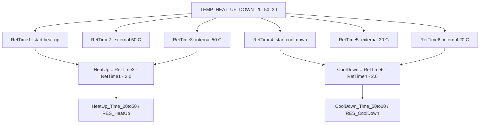
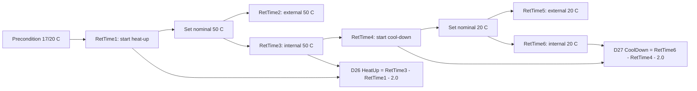

# TCC HeatUp and CoolDown Black Box Decomposition

Extraction date: 2026-07-10

Scope: TCC FOQ HeatUp and CoolDown Time for `VH-C10-A`, `VC-C10-A`, and `VA-C10-A`.

---
Test name: HeatUp and CoolDown
Models: VH-C10-A / VC-C10-A / VA-C10-A
Status: first black-box decomposition complete; row-65/row-66 workbook layout remains open verification
---

This document decomposes the HeatUp and CoolDown test as a generation contract.
The core of this test is RetTime event semantics:

```text
Heat-up performance = RetTime3 - RetTime1 - 2.0 min
Cool-down performance = RetTime6 - RetTime4 - 2.0 min
```

The `2.0 min` subtraction is not an arbitrary formatting correction. It removes
the stable-hold time that is intentionally included by the method triggers.

## Evidence Sources

| Evidence | Source |
|---|---|
| Test intent node | `cmbx_data_explorer/docs/TCC_TEST_KNOWLEDGE_NODE_MODEL.md` |
| FOQ TD extracted KB | `cmbx_data_explorer/docs/FOQ_TCC_VX_C10_A_TD_KNOWLEDGE_MANAGEMENT.md` |
| Injection workbench notes | `cmbx_data_explorer/docs/TCC_INJECTION_BY_INJECTION_REVERSE_WORKBENCH.md` |
| Method/report alignment | `cmbx_data_explorer/docs/TCC_METHOD_REPORT_ALIGNMENT.md` |
| Decoded method contract, VH | `knowledge_base/tcc_method_contracts/VH_6000001_TEMP_HEAT_UP_DOWN_20_50_20_contract.md` |
| Method flow, VH | `knowledge_base/tcc_reverse_probe/VH/6000001/TEMP_HEAT_UP_DOWN_20_50_20_embedded_method_flow.txt` |
| Method flow, VC | `knowledge_base/tcc_reverse_probe/VC/3000004/TEMP_HEAT_UP_DOWN_20_50_20_embedded_method_flow.txt` |
| Method flow, VA | `knowledge_base/tcc_reverse_probe/VA/0000003/TEMP_HEAT_UP_DOWN_20_50_20_embedded_method_flow.txt` |
| Report formula objects | `knowledge_base/tcc_report_formula_objects_vh_6000001_all_sheets.tsv` |
| Formula/evaluator rule | `cmbx_data_explorer/foq_alignment_catalog.py`, `cmbx_data_explorer/report_calculation_map.py`, `cmbx_data_explorer/CM_FORMULA_REVERSE_ENGINEERING.md` |
| DB mapping | `foq/FOQResultLocations_V2.83.xls` |

## Executive Answer

1. All three TCC variants use the same instrument method:
   `TEMP_HEAT_UP_DOWN_20_50_20`.
2. The method starts from a cold/preconditioned state, stabilizes near 20 C,
   heats to 50 C, then cools back to 20 C.
3. Both internal CC temperature and the external upper thermometer are used as
   guards. The report performance result uses the internal CC RetTime anchors:
   `RetTime3` and `RetTime6`.
4. `RetTime1` is the start of heat-up after both external and internal 20 C
   readiness conditions are satisfied.
5. `RetTime3` is the internal CC 50 C event after the required stable-hold
   period. The heat-up DB value is `RetTime3 - RetTime1 - 2.0`.
6. `RetTime4` is the start of cool-down after both 50 C conditions are
   satisfied.
7. `RetTime6` is the internal CC 20 C event after the required stable-hold
   period. The cool-down DB value is `RetTime6 - RetTime4 - 2.0`.
8. The report sheet exposes both row-65 and row-66 RetTime cells. The verified
   evaluator/DB rule uses `RetTime3/RetTime1` and `RetTime6/RetTime4`; the exact
   FormulaOne workbook route remains open verification until workbook formula
   parsing is complete.

## Contract 1: Method Command

### 1.1 Device Branch Binding

| Device | Injection | Instrument Method | Processing Method | Report Template | Report Sheets |
|---|---|---|---|---|---|
| VH-C10-A | `HeatUp and CoolDownTime` | `TEMP_HEAT_UP_DOWN_20_50_20` | `No_Integration` | `Report_VTCC_V2_12` | `HeatUp&CoolDown` |
| VC-C10-A | `HeatUp and CoolDownTime` | `TEMP_HEAT_UP_DOWN_20_50_20` | `CORRECT_ACCURACY_INJ_INSERTION` | `Report_VTCC_V2_12` | `HeatUp&CoolDown` |
| VA-C10-A | `HeatUp and CoolDownTime` | `TEMP_HEAT_UP_DOWN_20_50_20` | `No_Integration` | `Report_VATCC_V1_01` | `HeatUp&CoolDown` |

### 1.2 Method Contract Summary

Decoded method evidence:

```yaml
method: TEMP_HEAT_UP_DOWN_20_50_20
stages:
  - InstrumentSetup
  - Equilibration
  - InjectPreparation
  - StartRun
  - Run
  - StopRun
  - PostRun
setpoints:
  - ColumnComp.CC.Temperature.Nominal: 17.0
  - ColumnComp.CC.Temperature.Nominal: 20.0
  - ColumnComp.CC.Temperature.Nominal: 50.0
  - ColumnComp.CC.Temperature.Nominal: 20.0
wait_conditions:
  - CC.TempReady
ret_times:
  initialized:
    - RetTimes.RetTime1
    - RetTimes.RetTime2
    - RetTimes.RetTime3
    - RetTimes.RetTime4
    - RetTimes.RetTime5
    - RetTimes.RetTime6
  emitted:
    - RetTimes.RetTime1
    - RetTimes.RetTime2
    - RetTimes.RetTime3
    - RetTimes.RetTime4
    - RetTimes.RetTime5
    - RetTimes.RetTime6
logged_properties:
  - GenericLong9
channels:
  - ColumnComp.CC_Temp
  - ColumnComp.CC_U_Temp_Actual
  - ColumnComp.CC_L_Temp_Actual
  - ColumnComp.CC_UCTL_TempRear_Actual
  - ColumnComp.PWM_CCU_A
  - ColumnComp.PWM_CCU_B
  - ColumnComp.PWM_CCL_A
  - ColumnComp.PWM_CCL_B
  - ColumnComp.Fan_Rear_ActualRPM
  - Thermometer1.ExtTemp_UpperCC
  - Thermometer1.ExtTemp_LowerCC
  - Thermometer.Environment_Temperature
  - ColumnComp.LEDBoard_LeakDiff
  - ColumnComp.LEDBoard_A13
  - ColumnComp.LEDBoard_A14
  - ColumnComp.Oven_Gas_MuteTimeRemain
```

### 1.3 Trigger and RetTime Semantics

| RetTime | Trigger / command evidence | Physical meaning | Report role |
|---|---|---|---|
| `RetTime1` | `T_UP` fires after `T_Start_Ext` and `T_Start_Int`; then method sets nominal to 50 C and writes `RetTimes.RetTime1 = System.Retention`. | Start of heat-up after internal and external sensors have been stable around 20 C. | Heat-up start anchor. |
| `RetTime2` | `T_50_Ext`: external upper thermometer in 49..51 C for 120 s. | External upper thermometer reaches/holds 50 C. | Layout/intermediate evidence; not the verified DB heat-up endpoint. |
| `RetTime3` | `T_50_Int`: internal CC in 49..51 C for 120 s. | Internal CC reaches/holds 50 C. | Heat-up end anchor for DB rule. |
| `RetTime4` | `T_DOWN` fires after external and internal 50 C events; method writes RetTime4 and sets nominal to 20 C. | Start of cool-down after both 50 C conditions are satisfied. | Cool-down start anchor. |
| `RetTime5` | `T_20_Ext`: external upper thermometer in 19..21 C for 120 s after cool-down. | External upper thermometer returns/holds 20 C. | Layout/intermediate evidence; not the verified DB cool-down endpoint. |
| `RetTime6` | `T_20_Int`: internal CC in 19..21 C for 120 s after cool-down. | Internal CC returns/holds 20 C. | Cool-down end anchor for DB rule. |

### 1.4 Command Flow

| Order | Command group | Meaning | Generation constraint |
|---:|---|---|---|
| 1 | Determine page/model context | Set `Variables.GenericLong9` from `ColumnComp.ModelNo`; abort if unknown. | Keeps report/page context aligned with model. |
| 2 | Configure CC readiness | Set `ReadyTempDelta = 0.5 C`, `EquilibrationTime = 0.5 min`, `TempCtrl = On`, `CC.Mode = StillAir`. | Defines readiness and stable holds used by triggers. |
| 3 | Initialize state variables | Set `GenericLong0..3 = 0` and `RetTimes.RetTime1..6 = 0`. | Required for trigger state machine. |
| 4 | Precondition cold/start state | Set nominal to 17 C, then wait for `CC.TempReady`. | Ensures comparable start before moving to 20 C. |
| 5 | Start acquisition | Acquire CC internal/debug channels, external thermometers, environment and leak channels. | Required to evaluate triggers and report traces. |
| 6 | Stabilize around 20 C | Set nominal to 20 C; wait for external and internal 19..21 C true-time conditions. | Defines the initial stable state. |
| 7 | Start heat-up | Fire `T_UP`; set nominal to 50 C; emit `RetTime1`. | Heat-up start anchor. |
| 8 | Evaluate 50 C external/internal events | Emit `RetTime2` for external upper, `RetTime3` for internal CC. | `RetTime3` is report/DB heat-up endpoint. |
| 9 | Start cool-down | Fire `T_DOWN`; emit `RetTime4`; set nominal to 20 C. | Cool-down start anchor. |
| 10 | Evaluate 20 C external/internal events | Emit `RetTime5` for external upper, `RetTime6` for internal CC. | `RetTime6` is report/DB cool-down endpoint. |
| 11 | End run and stop acquisition | Fire `END_RUN`, turn channels off, run `End`. | Required cleanup. |

## Contract 2: Processing Method

Known sequence bindings:

| Device | Processing Method | Status |
|---|---|---|
| VH-C10-A | `No_Integration` | Current TKN/sample evidence. |
| VC-C10-A | `CORRECT_ACCURACY_INJ_INSERTION` | Current TKN/sample evidence; exact reason/action remains open. |
| VA-C10-A | `No_Integration` | Current TKN/sample evidence. |

Interpretation:

```text
The heat/cool calculation itself is method/report-driven and does not require
peak integration. The VC branch using CORRECT_ACCURACY_INJ_INSERTION is sequence
context evidence, not proof that heat/cool itself needs corrective IRC.
```

Open verification:

| Item | Required evidence | Likely source |
|---|---|---|
| Why VC binds `CORRECT_ACCURACY_INJ_INSERTION` on this row while VH/VA use `No_Integration`. | Full processing method action rows and loaded CM sequence UI. | Processing method XML / Chromeleon UI. |
| Whether any pass/fail action can stop later sequence execution based on HeatUp/CoolDown result. | Processing method business rows. | Processing method payload. |

## Contract 3: Report Formula

### 3.1 `HeatUp&CoolDown` Formula Objects

Known SheetObject formulas:

| Cell | Formula | Meaning |
|---|---|---|
| `J65` | `AUDIT.RetTime1(1.000,"forward")` | Heat-up start anchor in row 65 layout. |
| `K65` | `AUDIT.RetTime3(1.000,"forward")` | Internal 50 C endpoint in row 65 layout. |
| `L65` | `AUDIT.RetTime4(1.000,"forward")` | Cool-down start anchor in row 65 layout. |
| `M65` | `AUDIT.RetTime6(1.000,"forward")` | Internal 20 C endpoint in row 65 layout. |
| `J66` | `AUDIT.RetTime1(1.000,"forward")` | Heat-up start anchor in row 66 layout. |
| `K66` | `AUDIT.RetTime2(1.000,"forward")` | External 50 C endpoint in row 66 layout. |
| `L66` | `AUDIT.RetTime4(1.000,"forward")` | Cool-down start anchor in row 66 layout. |
| `M66` | `AUDIT.RetTime5(1.000,"forward")` | External 20 C endpoint in row 66 layout. |
| `L57` | `AUDIT.ColumnComp.CC.Temperature.Nominal(AUDIT.RetTime1(1,"forward")-0.1)` | Nominal before heat-up start. |
| `L58` | `AUDIT.ColumnComp.CC.Temperature.Nominal(AUDIT.RetTime2(1,"forward")-0.1)` | Nominal before external 50 C event. |

### 3.2 Verified Workbook/DB Rule

Current evaluator and DB mapping use the following final rule:

```text
HeatUp_Time_20to50 = RetTime3 - RetTime1 - 2.0 min
CoolDown_Time_50to20 = RetTime6 - RetTime4 - 2.0 min
```

Display rule:

```text
HeatUp_Time_20to50 displayed to 1 decimal
CoolDown_Time_50to20 displayed to 1 decimal
Pass/fail uses the resulting time <= Definitions!HeatUp & Cool Down
```

### 3.3 Row 65 / Row 66 Risk

The report layout exposes both internal and external endpoints:

```text
Row 65: RetTime1 / RetTime3 / RetTime4 / RetTime6
Row 66: RetTime1 / RetTime2 / RetTime4 / RetTime5
```

The currently verified DB/evaluator contract uses the internal endpoints
`RetTime3` and `RetTime6`. Until the FormulaOne workbook formula parser is
complete, generated reports should preserve all six RetTimes and both visible
row layouts rather than deleting the external endpoint RetTimes.

### 3.4 Formula Flow



## Contract 4: DB Contract

### 4.1 DB Leaves

| Device | DB Field | Report file | Sheet | Cell | Rule |
|---|---|---|---|---|---|
| VH-C10-A | `HeatUp_Time_20to50` | `HeatUp and CoolDownTime.XLS` | `HeatUp&CoolDown` | `D26` | `RetTime3 - RetTime1 - 2.0`, displayed to 1 decimal. |
| VH-C10-A | `CoolDown_Time_50to20` | `HeatUp and CoolDownTime.XLS` | `HeatUp&CoolDown` | `D27` | `RetTime6 - RetTime4 - 2.0`, displayed to 1 decimal. |
| VH-C10-A | `RES_HeatUp` | `HeatUp and CoolDownTime.XLS` | `HeatUp&CoolDown` | `E26` | Pass if heat-up time <= Definitions. |
| VH-C10-A | `RES_CoolDown` | `HeatUp and CoolDownTime.XLS` | `HeatUp&CoolDown` | `E27` | Pass if cool-down time <= Definitions. |
| VC-C10-A | same four fields | `HeatUp and CoolDownTime.XLS` | `HeatUp&CoolDown` | `D26:D27`, `E26:E27` | Same rule. |
| VA-C10-A | same four fields | `HeatUp and CoolDownTime.XLS` | `HeatUp&CoolDown` | `D26:D27`, `E26:E27` | Same rule. |

### 4.2 DB Boundary

This test's DB contract is timing-only:

```text
No temperature accuracy, precision, stability or PCC DB fields should be
attached to this test unless the report/DB mapping is deliberately changed.
```

## Contract 5: Config Requirement

| Requirement | VH-C10-A | VC-C10-A | VA-C10-A | Failure mode |
|---|---|---|---|---|
| `AUDIT.ColumnComp.ModelNo` source of truth | Required | Required | Required | Wrong page/report context. |
| Column compartment CC control | Required | Required | Required | 20/50/20 transitions cannot execute. |
| `CC.TempReady` | Required | Required | Required | Start/equilibration readiness invalid. |
| `CC.Temperature.Value` / internal CC signal | Required | Required | Required | `RetTime3` and `RetTime6` cannot be emitted. |
| External upper thermometer | Required | Required | Required | `RetTime2` and `RetTime5` cannot be emitted; guards incomplete. |
| External lower thermometer | Acquired | Acquired | Acquired | Diagnostic/report trace incomplete, even if final DB timing uses upper/internal anchors. |
| Full RetTime1..6 contract | Required | Required | Required | Report layout and DB timing cannot be reconstructed. |
| Method timing / stable holds | Required | Required | Required | `-2.0 min` report correction becomes invalid. |

Generation guardrails:

```text
1. Do not remove RetTime2 or RetTime5 even though the final DB rule uses
   RetTime3 and RetTime6; the visible report layout still exposes them.
2. If the stable hold duration changes, the `-2.0 min` report rule must also
   change.
3. If using external endpoints instead of internal endpoints, the DB/report
   contract must be rewritten and explicitly validated.
4. A cut-down heat-only method can reuse only the heat-up half if the report and
   DB contract are also split or regenerated.
```

## Contract 6: Open Verification

Items below are marked Open Verification Required until the listed evidence is
captured.

| # | Uncertain point | Required evidence | Likely source |
|---:|---|---|---|
| 1 | Exact FormulaOne workbook route from row 65/66 cells to `D26:D27`. | Workbook formula extraction. | `SpreadSheetData` / FormulaOne parser. |
| 2 | Why VC uses `CORRECT_ACCURACY_INJ_INSERTION` while VH/VA use `No_Integration`. | Processing method action table and CM sequence view. | Processing method XML / Chromeleon UI. |
| 3 | Exact `Definitions!HeatUp & Cool Down` limit by report template. | Definitions sheet values. | VTCC/VATCC report template workbook layer. |
| 4 | Whether VA `Report_VATCC_V1_01` uses identical row 65/66 layout. | VA-specific report formula object export. | Real VA CMBX report template. |
| 5 | Whether external endpoint timing is used in any printed/internal report page even if DB uses internal endpoint timing. | Full exported report comparison. | CM report export / Excel workbook. |

## VH / VC / VA Comparison

| Question | VH-C10-A | VC-C10-A | VA-C10-A |
|---|---|---|---|
| Which injection is used? | `HeatUp and CoolDownTime` | `HeatUp and CoolDownTime` | `HeatUp and CoolDownTime` |
| Which method is used? | `TEMP_HEAT_UP_DOWN_20_50_20` | `TEMP_HEAT_UP_DOWN_20_50_20` | `TEMP_HEAT_UP_DOWN_20_50_20` |
| Which processing method is used? | `No_Integration` | `CORRECT_ACCURACY_INJ_INSERTION` | `No_Integration` |
| Which RetTimes are emitted? | `RetTime1..6` | `RetTime1..6` | `RetTime1..6` |
| Which report sheet is used? | `HeatUp&CoolDown` | `HeatUp&CoolDown` | `HeatUp&CoolDown` |
| Which template family is used? | `Report_VTCC_V2_12` | `Report_VTCC_V2_12` | `Report_VATCC_V1_01` |

## Command, Report, DB Flow



## Generation Readiness

| Use case | Readiness | Reason |
|---|---|---|
| Reuse full HeatUp/CoolDown branch from existing CMBX | High | Method/report/DB chain is closed enough for full reuse. |
| Generate heat-up-only package | Partial | Method half is clear, but report/DB must be split or regenerated. |
| Change stable hold duration | Not ready with existing report | The `-2.0 min` rule is hard-coded in evaluator/report contract. |
| Change temperature range, e.g. 25->45->25 | Partial | Method trigger thresholds and report field names/criteria must be regenerated. |
| Use external endpoint timing instead of internal endpoint timing | Not ready | Requires explicit report/DB contract change and CM export verification. |
