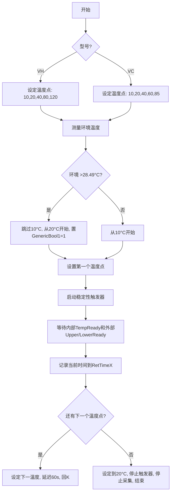

---

```markdown
# Vanquish 柱温箱 (VH-C10-A / VC-C10-A) 温度准确性测试仪器方法 (Instrument Method) 详细分析

> 本文档基于提供的 Chromeleon 仪器方法脚本（用于 FOQ 温度准确性测试）进行逐行分析，旨在提供最细粒度的逻辑说明。  
> 脚本版本：未标明，但基于 FOQ Test Description DOC0000266 rev.5.00 实现。  
> 适用设备：VH‑C10‑A（带后冷却）和 VC‑C10‑A（无后冷却）。

---

## 1. 文档概述

| 项目 | 内容 |
|------|------|
| **方法名称** | 未明确，但注释为 `IM to measure the temperature accuracy of the Vanquish VH-C10-A and VC-C10-A` |
| **用途** | 执行温度准确性测试，作为出厂质量检验 (FOQ) 的一部分。测试在不同设定温度下，使用外部校准温度传感器验证柱温箱内部实际温度是否符合规格。 |
| **依赖文件** | FOQ 测试描述文档 (DOC0000266)、外部温度传感器（两个探头）、Chromeleon 7 系统。 |
| **执行顺序** | 该方法在 Burn‑In 和温度校准之后执行（参考文档第 7.1 节）。 |

---

## 2. 全局参数设置

### 2.1 系统识别与页数设置

```text
If      ColumnComp.ModelNo="VH-C10-A"
    Variables.GenericLong9  12
    Delay  1
    Log  GenericLong9
Else If     ColumnComp.ModelNo="VC-C10-A"
    Variables.GenericLong9  10
    Delay  1
    Log  GenericLong9
Else                
    Message "Column compartment model unknown, please reinspect in production!"
    System.AbortQueue
End If
```

- **目的**：根据柱温箱型号设置 `GenericLong9` 变量值（VH=12，VC=10），该值可能用于后续报告页数控制（对应文档中不同型号的测试页数）。
- **错误处理**：若型号无法识别，则弹出消息并中止队列。

### 2.2 温度就绪参数

```text
ColumnComp.CC.ReadyTempDelta   1.0 [°C]
ColumnComp.CC.EquilibrationTime   0.5
```

- **`ReadyTempDelta`**：内部温度与设定值之差小于该值时，认为温度接近设定点（但不一定稳定）。
- **`EquilibrationTime`**：必须连续满足 `ReadyTempDelta` 的时间（分钟），`CC.TempReady` 才会变为真。

### 2.3 温控及风扇模式

```text
ColumnComp.CC.TempCtrl   On
If      ColumnComp.ModelNo="VH-C10-A"
    ColumnComp.CmdString  Cmd="PCC.TempCtrl=0"   // 关闭后冷却单元温控（因为本测试不涉及PCC）
Else
End If
ColumnComp.CC.Mode   StillAir
```

- 强制开启柱温箱温控。
- 对于 VH 型号，显式关闭后冷却单元（PCC）的温控，避免干扰。
- 恒温模式设为 **StillAir**（自然对流），符合测试要求。

### 2.4 液体泄漏传感器

```text
ColumnComp.LiquidLeakSensor   Off
```

- 在整个温度变化过程中关闭泄漏传感器，防止因冷凝水误报（文档第 5.3.1 节说明）。

### 2.5 数据采集通道及速率

```text
ColumnComp.CC_U_Temp_Actual.Data_Collection_Rate  20
ColumnComp.CC_L_Temp_Actual.Data_Collection_Rate  20
...（所有内部传感器、PWM、风扇、泄漏信号等均设置为 20 秒采样间隔）
```

- 所有相关模拟信号（内部温度、PWM 占空比、风扇转速、泄漏板信号）的采集间隔设为 20 秒。
- 外部温度传感器（`Thermometer1.ExtTemp_UpperCC` 和 `LowerCC`）也会在 Run 阶段开启采集，但速率未在此处设置（可能由外部设备驱动默认）。

---

## 3. 温度设定点变量（按型号区分）

```text
If      ColumnComp.ModelNo="VH-C10-A"
    Variables.GenericDouble1  10.0
    Variables.GenericDouble2  20.0
    Variables.GenericDouble3  40.0
    Variables.GenericDouble4  80.0
    Variables.GenericDouble5  120.0
    Variables.GenericBool1    0
Else If     ColumnComp.ModelNo="VC-C10-A"
    Variables.GenericDouble1  10.0
    Variables.GenericDouble2  20.0
    Variables.GenericDouble3  40.0
    Variables.GenericDouble4  60.0
    Variables.GenericDouble5  85.0
    Variables.GenericBool1    0
Else
    Message "Invalid ModelNo! Please reinspect in production!"
    System.AbortQueue
End If
```

- **变量含义**：
  - `GenericDouble1` ～ `5`：五个测试温度点（依次从低到高）。
  - `GenericBool1`：标记是否因环境温度过高而跳过第一个温度（10°C）。

---

## 4. 起始温度选择（基于环境温度）

```text
Delay  3
TempVars.Ambient_Temp  Thermometer.Measure_1
Delay  3
If      TempVars.Ambient_Temp>28.49
    ColumnComp.CC.Temperature.Nominal  Variables.GenericDouble2
    Variables.GenericBool1  1
Else                
    ColumnComp.CC.Temperature.Nominal  Variables.GenericDouble1
End If
Delay  5
```

- 读取环境温度（`Thermometer.Measure_1` 可能是环境温度探头）。
- 如果环境温度 > 28.49°C，则无法可靠达到 10°C 设定点（冷却能力限制），直接跳到 20°C（第二个温度），并将 `GenericBool1` 置 1 以标记跳过。
- 否则从 10°C 开始。
- 设定温度后等待 5 分钟。

---

## 5. 稳定性评估准备（外部温度传感器）

### 5.1 变量重置

```text
RetTimes.RetTime1  0   ...（5个保留时间变量）
StabVars.TriggerStab1  0
StabVars.TriggerStab2  0
StabVars.TempUpperHigh  0
StabVars.TempUpperLow   0
StabVars.TempLowerHigh  0
StabVars.TempLowerLow   0
StabVars.CounterUpper   0
StabVars.CounterLower   0
StabVars.UpperReady     0
StabVars.LowerReady     0
```

- `RetTimes`：记录每个温度点达到稳定的时刻（用于后续超时判断）。
- `StabVars.*`：用于外部温度稳定判定的状态变量。

### 5.2 调整就绪参数（用于外部稳定性）

```text
ColumnComp.CC.ReadyTempDelta  0.2
ColumnComp.CC.EquilibrationTime  3
```

- 将内部就绪条件收紧（ΔT ≤ 0.2°C，持续 3 分钟），但此处的就绪主要用于配合外部温度稳定逻辑，并非直接使用。

---

## 6. 触发器（Triggers）定义

### 6.1 梯度触发器 1 (`Gradient_1`)

```text
Trigger     "Gradient_1",
(StabVars.TriggerStab1=1) AND CC.TempReady,
TrueTime=30,
Delay=0
    StabVars.TriggerStab1  0
    StabVars.TriggerStab2  1
    Is external temperature stabilization evaluation running and in the allowed range? ...
    If  (StabVars.TempUpperHigh<>0) and ((Thermometer1.ExtTemp_UpperCC<=StabVars.TempUpperHigh) AND (Thermometer1.ExtTemp_UpperCC>=StabVars.TempUpperLow))
        StabVars.CounterUpper  StabVars.CounterUpper+1
    Else
        StabVars.CounterUpper  0
        StabVars.TempUpperHigh  Thermometer1.ExtTemp_UpperCC+0.05
        StabVars.TempUpperLow   Thermometer1.ExtTemp_UpperCC-0.05
    End If
    ...（同理 Lower）
    If  StabVars.CounterUpper>=4
        StabVars.UpperReady  1
    Else
        StabVars.UpperReady  0
    End If
    ...（同理 Lower）
End Trigger
```

- **触发条件**：`TriggerStab1` 为 1 且内部 `CC.TempReady` 为真。
- **TrueTime=30**：条件必须持续成立 30 秒才会触发（避免瞬态干扰）。
- **执行动作**：
  - 将 `TriggerStab1` 置 0，`TriggerStab2` 置 1（启动另一个定时触发）。
  - 检查外部温度是否落在上次记录的 ±0.05°C 窗口内。
    - 若是，则相应计数器 +1。
    - 若否，重置计数器，并重新建立新的窗口（以当前温度为中心 ±0.05°C）。
  - 如果计数器 ≥4（即连续 4 次触发，每次间隔 30 秒，共 2 分钟稳定），则置 `UpperReady` / `LowerReady` 为 1。

**作用**：每 30 秒评估一次外部温度的稳定性，要求连续 4 次（2 分钟）保持在 ±0.05°C 以内，才认为该温度点已稳定。

### 6.2 梯度触发器 2 (`Gradient_2`)

```text
Trigger     "Gradient_2",
StabVars.TriggerStab2=1,
TrueTime=30,
Delay=0
    StabVars.TriggerStab1  1
    StabVars.TriggerStab2  0
End Trigger
```

- 每 30 秒触发一次，重新激活 `TriggerStab1`，形成循环评估。

### 6.3 退出范围触发器（Upper / Lower）

```text
Trigger     "ExitRange_Upper",
(StabVars.TempUpperHigh<>0) AND ((ColumnComp.CC.TempReady=0) OR (Thermometer1.ExtTemp_UpperCC>StabVars.TempUpperHigh) OR (Thermometer1.ExtTemp_UpperCC<StabVars.TempUpperLow)),
TrueTime=5
    StabVars.TempUpperHigh  0
    StabVars.TempUpperLow   0
    StabVars.UpperReady     0
End Trigger
```

- 如果外部温度超出稳定窗口，或者内部 `TempReady` 变为假，则重置稳定状态（清除窗口，将 `UpperReady` 置 0）。
- **TrueTime=5**：条件持续 5 秒才触发，防止瞬时尖峰误触发。

### 6.4 超时中止触发器 (`Abort`)

```text
Trigger     "Abort",
((System.Retention>40 AND ColumnComp.CC.Temperature.Nominal=Variables.GenericDouble1) OR
 (System.Retention>RetTimes.RetTime1+40 AND ColumnComp.CC.Temperature.Nominal=Variables.GenericDouble2) OR
 ...（每个温度点超时条件）)
 AND (RetTimes.RetTime5=0),
TrueTime=0,
AllowImmediateExecution=Yes
    ColumnComp.CmdString  Cmd="LedBar.ForceColor=1"
    Message "QUEUE WAS ABORTED! ..."
    Delay  1
    ColumnComp.CmdString  Cmd="LedBar.ForceColor=0"
    System.AbortQueue
End Trigger
```

- **触发条件**：对于每个温度点，若从开始设定该温度起超过 40 分钟仍未完成（`RetTimeX` 尚未记录），且整个测试尚未结束（`RetTime5=0`），则触发。
- **执行动作**：设置 LED 为红色（强制颜色），显示消息，然后中止队列。

---

## 7. 主运行流程（Run 段）

### 7.1 启动采集（AcqOn）

在 Run 开始时，开启所有通道的数据采集（内部温度、PWM、风扇、泄漏信号、外部温度、环境温度）。

```text
0.000  Start Run
    ColumnComp.CC_Temp.AcqOn
    ...（所有通道）
0.000  Run    Duration = 250.000 [min]
```

- Run 总时长设为 250 分钟，足够覆盖所有温度点。

### 7.2 温度循环

脚本按以下顺序执行温度设定，并等待每个温度稳定：

#### 7.2.1 跳过 10°C 的情况

```text
If      Variables.GenericBool1=1
    Protocol "Evaluation at 10°C is skipped, as the room temperature is too high at the moment!"
    Delay  3
    ColumnComp.CC.Temperature.Nominal  Variables.GenericDouble2   // 直接到 20°C
    Delay  60
    StabVars.TriggerStab1  1
    Delay  3
Else
    StabVars.TriggerStab1  1
    Delay  3
    Wait    ColumnComp.CC.TempReady AND StabVars.LowerReady AND StabVars.UpperReady,
            Run=Continue
    RetTimes.RetTime1  System.Retention
    ColumnComp.CC.Temperature.Nominal  Variables.GenericDouble2
    Delay  60
End If
```

- 若 `GenericBool1=1`（跳过 10°C），则记录一条协议消息，直接设定到 20°C，延迟 60 秒后启动稳定性触发器。
- 否则，设定到 10°C，启动触发器，等待内部就绪且外部上下探头都稳定（`UpperReady` & `LowerReady` 为 1），记录该点的保留时间，然后切换到下一温度（20°C）。

#### 7.2.2 后续温度点（20 → 40 → 80/60 → 120/85）

```text
Wait    ColumnComp.CC.TempReady AND StabVars.LowerReady AND StabVars.UpperReady,
        Run=Continue
RetTimes.RetTime2  System.Retention
ColumnComp.CC.Temperature.Nominal  Variables.GenericDouble3
Delay  60

Wait ...   // 同上述等待稳定
RetTimes.RetTime3  System.Retention
ColumnComp.CC.Temperature.Nominal  Variables.GenericDouble4
Delay  60

Wait ...
RetTimes.RetTime4  System.Retention
ColumnComp.CC.Temperature.Nominal  Variables.GenericDouble5
Delay  60

Wait ...
RetTimes.RetTime5  System.Retention
```

- 每个温度点都等待内部就绪且外部上下稳定，然后记录时间，延迟 60 秒后设定下一温度。
- 最后一个温度点（第五个）记录后，不会继续设定下一温度。

### 7.3 冷却至 20°C 并结束

```text
Delay  2
ColumnComp.CC.Temperature.Nominal  20.0 [°C]
Stop external temperatures stability evaluatin triggers
StabVars.TriggerStab1  0
StabVars.TriggerStab2  0
Delay  2
Stop Run
```

- 测试完成后，将柱温箱设定回 20°C（安全温度）。
- 停止稳定性触发器。
- 停止所有采集（AcqOff）。
- Run 段结束（250 分钟可能未到，但脚本中有 `250.000  Stop Run`，可能提前结束）。

---

## 8. 关键变量与状态总结

| 变量名 | 类型 | 用途 |
|--------|------|------|
| `GenericDouble1~5` | Double | 存储五个测试温度设定值（因型号不同） |
| `GenericBool1` | Boolean | 标记是否跳过 10°C 测试 |
| `GenericLong9` | Long | 存储页数（VH=12, VC=10），可能用于报告 |
| `RetTimes.RetTime1~5` | Double | 记录每个温度点达到稳定时的运行时间（分钟） |
| `StabVars.TriggerStab1/2` | Integer | 控制两个交替触发的梯度触发器 |
| `StabVars.TempUpperHigh/Low` | Double | 外部上探头的稳定窗口上下限（±0.05°C） |
| `StabVars.TempLowerHigh/Low` | Double | 外部下探头的稳定窗口上下限 |
| `StabVars.CounterUpper/Lower` | Integer | 连续满足稳定条件的次数（需≥4） |
| `StabVars.UpperReady/LowerReady` | Boolean | 标识外部上/下探头是否已稳定（≥4次） |
| `TempVars.Ambient_Temp` | Double | 环境温度（用于决定是否跳过 10°C） |
| `ColumnComp.CC.Temperature.Nominal` | Double | 柱温箱当前设定温度 |
| `ColumnComp.CC.TempReady` | Boolean | 内部温度已稳定（基于内部传感器） |
| `Thermometer1.ExtTemp_UpperCC` / `LowerCC` | Double | 外部温度传感器测量的上/下部位实际温度 |

---

## 9. 测试逻辑流程图（简化）



---

## 10. 与 FOQ 测试文档的对应关系

| 文档章节 | 测试项 | 本方法实现 |
|---------|--------|-----------|
| 7.1 温度准确性测试 | 验证不同设定点的实际温度偏差 | 通过外部温度传感器记录稳定后的实际温度，由后续报告方法（CM 报告）计算偏差并判定 |
| 7.1.1 稳定性判定 | 要求外部温度在 ±0.05°C 内稳定 2 分钟 | 触发器 `Gradient_1` 实现连续 4 次 30 秒窗口检查 |
| 7.1.2 结果评估 | 最大偏差为温度准确性 | 由报告脚本评估，本方法仅提供数据 |
| 表 7 温度设定点 | VH: 10,20,40,80,120; VC: 10,20,40,60,85 | 变量 `GenericDouble1~5` 按型号区分 |
| 环境温度 ≥28.49°C 时跳过 10°C | 冷却性能限制 | `GenericBool1` 控制跳过逻辑 |

---

## 11. 注意事项与陷阱

1. **外部温度传感器必须已校准**，且正确安装在柱温箱上下腔（参考文档 Figure 2）。
2. **环境温度测量**：`Thermometer.Measure_1` 需正确连接，否则跳过逻辑不可靠。
3. **触发器之间的竞争**：`Gradient_1` 和 `Gradient_2` 交替触发，确保每 30 秒评估一次稳定性，不会遗漏。
4. **超时中止**：若某个温度点超过 40 分钟仍未稳定，将中止整个序列，需检查硬件或环境。
5. **泄漏传感器关闭**：在整个测试过程中保持关闭，避免冷凝水影响；测试结束后应在后续步骤中重新启用。
6. **方法总时长**：Run 段固定 250 分钟，实际通常提前结束；若所有温度点稳定快，也会继续等待直到 250 分钟？**不**，脚本中有 `Stop Run` 命令在最后一个温度点记录后立即执行，所以会提前结束 Run 段。
7. **页数变量 `GenericLong9`** 未在本方法中使用，但可能被报告模板引用，影响输出页数。

---

## 12. 总结

该仪器方法是一个高度自动化的温度准确性测试流程，通过以下关键设计保证了测试的可靠性：

- **自适应起始温度**：根据环境温度动态决定是否跳过 10°C 测试点。
- **双传感器稳定判定**：使用外部上下两个探头，独立判断稳定性，确保整个腔体温度均匀。
- **严格的稳定性标准**：±0.05°C 窗口内连续 2 分钟，优于内部就绪阈值。
- **超时保护**：防止因硬件故障导致无限等待。
- **模块化变量设计**：便于扩展其他型号（如后冷却单元测试）。

此方法作为 FOQ 测试流程的一部分，与后续报告脚本（CM 报告）配合，最终判定温度准确性是否合格。

---

*文档生成日期：2026-07-14*  
*基于 Chromeleon 7 仪器方法脚本分析*
```

---

