# Online TCC Method Understanding and Summary Collection

Online_KB_Status: CANDIDATE_FOR_WEB_VALIDATION  
Upload_Allowed: Validation only  
Build_Date: 2026-07-24

## Original Method Cross-Index

| Original ID | CM method | Device evidence | Evidence location |
|---|---|---|---|
| `M-TCC-ASYNCHRON1` | `Asynchron1` | VH-STRESS | Original script evidence in `02_METHOD_ORIGINAL_SCRIPTS.md` |
| `M-TCC-ASYNCHRON10` | `Asynchron10` | VH-STRESS | Original script evidence in `02_METHOD_ORIGINAL_SCRIPTS.md` |
| `M-TCC-ASYNCHRON8` | `Asynchron8` | VH-STRESS | Original script evidence in `02_METHOD_ORIGINAL_SCRIPTS.md` |
| `M-TCC-ASYNCHRON8-5` | `Asynchron8_5` | VH-STRESS | Original script evidence in `02_METHOD_ORIGINAL_SCRIPTS.md` |
| `M-TCC-ASYNCHRON9-5` | `Asynchron9_5` | VH-STRESS | Original script evidence in `02_METHOD_ORIGINAL_SCRIPTS.md` |
| `M-TCC-BURNIN-VA` | `BURNIN` | VA | Original script evidence in `02_METHOD_ORIGINAL_SCRIPTS.md` |
| `M-TCC-BURNIN-VCVH` | `BURNIN` | VC/VH | Original script evidence in `02_METHOD_ORIGINAL_SCRIPTS.md` |
| `M-TCC-ERRORLOG-VA` | `CHECKERRORLOG` | VA | Original script evidence in `02_METHOD_ORIGINAL_SCRIPTS.md` |
| `M-TCC-ERRORLOG-VCVH` | `CHECKERRORLOG` | VC/VH | Original script evidence in `02_METHOD_ORIGINAL_SCRIPTS.md` |
| `M-TCC-COLUMN-ID` | `ColumnID` | VA/VC/VH | Original script evidence in `02_METHOD_ORIGINAL_SCRIPTS.md` |
| `M-TCC-FACTORY` | `FACTORYDEFAULT` | VA/VC/VH | Original script evidence in `02_METHOD_ORIGINAL_SCRIPTS.md` |
| `M-TCC-LEAK-VA` | `LIQUID LEAK` | VA | Original script evidence in `02_METHOD_ORIGINAL_SCRIPTS.md` |
| `M-TCC-LEAK-VCVH` | `LIQUID LEAK` | VC/VH | Original script evidence in `02_METHOD_ORIGINAL_SCRIPTS.md` |
| `M-TCC-PREHEATER` | `PREHEATER` | VA/VC/VH | Original script evidence in `02_METHOD_ORIGINAL_SCRIPTS.md` |
| `M-TCC-SERVICE` | `QUALIFICATION_SERVICE_DONE` | VA/VC/VH | Original script evidence in `02_METHOD_ORIGINAL_SCRIPTS.md` |
| `M-TCC-STRESS-TEST` | `stress test` | VH-STRESS | Original script evidence in `02_METHOD_ORIGINAL_SCRIPTS.md` |
| `M-TCC-STRESS-TEST-5S` | `stress test_5s` | VH-STRESS | Original script evidence in `02_METHOD_ORIGINAL_SCRIPTS.md` |
| `M-TCC-STRESS-TEST-5S-PREHEATER-BOX-PCC40C` | `Stress test_5s_Preheater Box_pcc40c` | VH-STRESS | Original script evidence in `02_METHOD_ORIGINAL_SCRIPTS.md` |
| `M-TCC-STRESS-TEST-5S-PREHEATER-BOX-PCC60C` | `Stress test_5s_Preheater Box_pcc60c` | VH-STRESS | Original script evidence in `02_METHOD_ORIGINAL_SCRIPTS.md` |
| `M-TCC-STRESS-TEST-5S-PREHEATER-BOX-PCC70C` | `Stress test_5s_Preheater Box_pcc70c` | VH-STRESS | Original script evidence in `02_METHOD_ORIGINAL_SCRIPTS.md` |
| `M-TCC-STRESS-TEST-5S-PREHEATER-BOX-PCC-OFF` | `Stress test_5s_Preheater Box_pcc_off` | VH-STRESS | Original script evidence in `02_METHOD_ORIGINAL_SCRIPTS.md` |
| `M-TCC-STRESS-TEST-5S-REALPREHEATER-PCC-OFF` | `Stress test_5s_RealPreheater_pcc_off` | VH-STRESS | Original script evidence in `02_METHOD_ORIGINAL_SCRIPTS.md` |
| `M-TCC-STRESS-TEST-5S-REALPREHEATER-PCC-OFF-10MIN-EQUIBRATION` | `Stress test_5s_RealPreheater_pcc_off_10min equibration` | VH-STRESS | Original script evidence in `02_METHOD_ORIGINAL_SCRIPTS.md` |
| `M-TCC-STRESS-TEST-5S-REALPREHEATER-PCC-OFF-NO-EQUIBRATION` | `Stress test_5s_RealPreheater_pcc_off_no equibration` | VH-STRESS | Original script evidence in `02_METHOD_ORIGINAL_SCRIPTS.md` |
| `M-TCC-STRESS-TEST-5S-REALPREHEATER-PCC-ON` | `Stress test_5s_RealPreheater_pcc_on` | VH-STRESS | Original script evidence in `02_METHOD_ORIGINAL_SCRIPTS.md` |
| `M-TCC-STRESS-TEST-5S-REALPREHEATER-PCC-ON-10MIN-EQUIBRATION` | `Stress test_5s_RealPreheater_pcc_ON_10min equibration` | VH-STRESS | Original script evidence in `02_METHOD_ORIGINAL_SCRIPTS.md` |
| `M-TCC-STRESS-TEST-TEST` | `stress test_test` | VH-STRESS | Original script evidence in `02_METHOD_ORIGINAL_SCRIPTS.md` |
| `M-TCC-SYNCHRON1` | `Synchron1` | VH-STRESS | Original script evidence in `02_METHOD_ORIGINAL_SCRIPTS.md` |
| `M-TCC-SYNCHRON10` | `Synchron10` | VH-STRESS | Original script evidence in `02_METHOD_ORIGINAL_SCRIPTS.md` |
| `M-TCC-SYNCHRON8` | `Synchron8` | VH-STRESS | Original script evidence in `02_METHOD_ORIGINAL_SCRIPTS.md` |
| `M-TCC-SYNCHRON8-5` | `Synchron8_5` | VH-STRESS | Original script evidence in `02_METHOD_ORIGINAL_SCRIPTS.md` |
| `M-TCC-SYNCHRON9-5` | `Synchron9_5` | VH-STRESS | Original script evidence in `02_METHOD_ORIGINAL_SCRIPTS.md` |
| `M-TCC-HEAT-COOL-VA` | `TEMP_HEAT_UP_DOWN_20_50_20` | VA | Original script evidence in `02_METHOD_ORIGINAL_SCRIPTS.md` |
| `M-TCC-HEAT-COOL-VCVH` | `TEMP_HEAT_UP_DOWN_20_50_20` | VC/VH | Original script evidence in `02_METHOD_ORIGINAL_SCRIPTS.md` |
| `M-TCC-ACCURACY-VA` | `TEMPERATURE_ACCURACY` | VA | Original script evidence in `02_METHOD_ORIGINAL_SCRIPTS.md` |
| `M-TCC-ACCURACY-VCVH` | `TEMPERATURE_ACCURACY` | VC/VH | Original script evidence in `02_METHOD_ORIGINAL_SCRIPTS.md` |
| `M-TCC-CALIBRATION-VA` | `TEMPERATURE_CALIBRATION` | VA | Original script evidence in `02_METHOD_ORIGINAL_SCRIPTS.md` |
| `M-TCC-CALIBRATION-VCVH` | `TEMPERATURE_CALIBRATION` | VC/VH | Original script evidence in `02_METHOD_ORIGINAL_SCRIPTS.md` |
| `M-TCC-PRECISION` | `TEMPERATURE_PRECISION` | VA | Original script evidence in `02_METHOD_ORIGINAL_SCRIPTS.md` |
| `M-TCC-PRECISION-FAN` | `TEMPERATURE_PRECISION_AND_FAN` | VC/VH | Original script evidence in `02_METHOD_ORIGINAL_SCRIPTS.md` |
| `M-TCC-STABILITY-VA` | `TEMPERATURE_STABILITY_70_C` | VA | Original script evidence in `02_METHOD_ORIGINAL_SCRIPTS.md` |
| `M-TCC-STABILITY-VCVH` | `TEMPERATURE_STABILITY_70_C` | VC/VH | Original script evidence in `02_METHOD_ORIGINAL_SCRIPTS.md` |
| `M-TCC-STABILITY-PCC-VA` | `TEMPERATURE_STABILITY_AND_PCC_70_H` | VA | Original script evidence in `02_METHOD_ORIGINAL_SCRIPTS.md` |
| `M-TCC-STABILITY-PCC-VCVH` | `TEMPERATURE_STABILITY_AND_PCC_70_H` | VC/VH | Original script evidence in `02_METHOD_ORIGINAL_SCRIPTS.md` |
| `M-TCC-VALVES-VA` | `VALVES` | VA | Original script evidence in `02_METHOD_ORIGINAL_SCRIPTS.md` |
| `M-TCC-VALVES-VCVH` | `VALVES` | VC/VH | Original script evidence in `02_METHOD_ORIGINAL_SCRIPTS.md` |

## Summary Source Index

| Source ID | Knowledge section | Status | Section |
|---|---|---|---|
| `K001` | FOQ test logic | Available | [Open](#tcc-test-logic) |
| `K002` | Method role contracts | Available | [Open](#tcc-method-roles) |
| `K003` | Test relationship model | Available | [Open](#tcc-relationships) |
| `K004` | TCC stress Trigger method contract | Available | [Open](#tcc-stress-trigger-contract) |
| `B001` | Column ID black box | Available | [Open](#tcc-column-id) |
| `B002` | Preheater black box | Available | [Open](#tcc-preheater) |
| `B003` | Valve/keypad black box | Available | [Open](#tcc-valves) |
| `B004` | Burn-in black box | Available | [Open](#tcc-burnin) |
| `B005` | Calibration black box | Available | [Open](#tcc-calibration) |
| `B006` | Accuracy black box | Available | [Open](#tcc-accuracy) |
| `B007` | Precision/fan black box | Available | [Open](#tcc-precision) |
| `B008` | Stability/PCC black box | Available | [Open](#tcc-stability) |
| `B009` | Heat-up/cool-down black box | Available | [Open](#tcc-heat-cool) |
| `B010` | Liquid leak black box | Available | [Open](#tcc-leak) |
| `B011` | Qualification service black box | Available | [Open](#tcc-service) |
| `B012` | Factory default black box | Available | [Open](#tcc-factory) |
| `B013` | Error log black box | Available | [Open](#tcc-error-log) |
| `D001` | Deep script analysis: Heat-Up and Cool-Down Time Test.md | Available | [Open](#script-description-001) |
| `D002` | Deep script analysis: Liquid Leak Sensor Test.md | Available | [Open](#script-description-002) |
| `D003` | Deep script analysis: Temperature Calibration.MD | Available | [Open](#script-description-003) |
| `D004` | Deep script analysis: Temperature Precision and Fan Functionality Test.md | Available | [Open](#script-description-004) |
| `D005` | Deep script analysis: Temperature Stability and PCC Test.md | Available | [Open](#script-description-005) |
| `D006` | Deep script analysis: valve and keyboard.md | Available | [Open](#script-description-006) |
| `D007` | Deep script analysis: Vanquish_TCC_Temperature_Accuracy_Method_Analysis.md | Available | [Open](#script-description-007) |

## Interpretation Contract

Use original scripts as executable evidence. Use the sections below to understand purpose, roles, dependencies and safe changes. If interpretation conflicts with an original command sequence, preserve the original and mark the conflict for review. Do not silently repair or invent commands.

Stress-extension originals (`VH-STRESS`) currently have command evidence but no source-grounded TD/black-box interpretation. They may be used to learn verified Trigger and valve-switching syntax only; their test purpose and safe composition remain `Open Verification Required`.

<a id="tcc-test-logic"></a>
## K001: FOQ test logic

Build source name: `FOQ_TD_TEST_LOGIC_KNOWLEDGE_BASE.md`

# FOQ TD Test Logic Knowledge Base

This document records the working understanding of the supplied FOQ Test
Description and the corresponding CMBX method/report evidence. It is designed
as a reusable pattern for future FOQ TDs from other modules.

中文目的：不是只提取 FOQ TD 的文字，而是把“TD 要证明什么、CM 方法怎么运行、
报告公式怎么计算、生成时哪些不能猜”整理成知识库。

## Source

Primary TD:

```text
[local build source omitted]
```

Extracted text:

```text
knowledge_base/tcc_td_vx_c10_a_text.txt
```

TD metadata from extracted text:

```text
FOQ Test Description (FOQ_TD)
Affected instruments: VH-C10-A, VC-C10-A, VA-C10-A
File reference: FOQ_Testdescription_VX-C10-A.docm
Agile Document ID: DOC0000266
Revision: 1.00
Revision date: 14-Oct-2023
Document owner: Lei Shi
```

Important naming rule:

```text
VX-C10-A is the generic TCC family in the TD.
VH-C10-A, VC-C10-A, and VA-C10-A are affected module variants.
```

So the knowledge base name should be TD/family based, not a single example
device name.

## Core TD Meaning

The TD states that FOQ verifies whether the VX-C10-A family meets the acceptance
criteria in the specification master sheet. The order of tests matters because
earlier tests and thermal history can influence later results.

中文理解：

```text
FOQ 不是一组独立按钮。
它是一个有顺序的生产/出厂验证流程：
  先检查通信/附件/接口类错误，
  再 burn-in 和 calibration，
  再做 accuracy/precision/stability/heat-up 等性能测试，
  最后恢复默认状态并检查日志。
```

TD also notes that `Temperature Accuracy` and `Temperature Stability`
injections are inserted by Intelligent Run Control (IRC) depending on device
type. This explains why processing methods matter even if report formulas do
the final numeric calculation.

## FOQ Test Matrix

Extracted TD matrix:

| Test | VH-C10-A | VC-C10-A | VA-C10-A | 中文理解 |
| --- | --- | --- | --- | --- |
| ColumnIDs | yes | yes | no/variant-dependent | Column ID 端口/芯片识别，早期发现电子通信错误 |
| Preheater Connection Test | yes | yes | yes | 左右 preheater 连接、memory state、热响应和噪声 |
| Valve | yes | yes | yes | 上下阀切换和 keypad 功能 |
| VATCC_BurnIn | yes | yes | yes | 温度循环预处理，减少后续测试受首次高温影响 |
| Temperature Calibration | yes | yes | yes | 用外部温度计校准内部 CC 上下传感器 |
| Temperature Accuracy | yes | yes | yes | 外部测得温度和 nominal setpoint 的偏差 |
| Temperature Precision_and_Fan | yes | yes | yes | 重复性/precision，以及 fan/mode 功能 |
| Temperature Stability_and_PCC | yes | no | no | VH 专属，70 C 稳定性 + PCC 测试 |
| Temperature Stability | no | yes | yes | VC/VA 的 70 C 稳定性 |
| HeatUp and CoolDownTime | yes | yes | yes | 20->50 C 和 50->20 C 的升降温时间 |
| Liquid Leak Test | yes | yes | yes | 漏液传感器和 alarm/mute 流程 |
| Qualification_Service_Done | yes | yes | yes | qualification/service 完成记录 |
| Factory Default | yes | yes | yes | 恢复默认/清理状态/记录身份 |

## Global Hardware and Configuration Requirements

The TD requires calibrated external thermometer hardware for tests that use
external temperature measurement.

From extracted TD:

```text
Temperature accuracy of thermometer: +/- 0.03 C
Thermometer controlled by CM7
P755 series thermometer with two PT100 sensors
Thermometer serial number is set by a custom sequence variable
Sensors are fixed in the column compartment using clips
```

Current CMBX/report channel names:

```text
Thermometer1.ExtTemp_UpperCC
Thermometer1.ExtTemp_LowerCC
Thermometer.Environment_Temperature
```

中文理解：

```text
温度类 FOQ 的外部温度计不是附属信息，而是计算结果的核心数据源。
如果 CM 配置里没有这些通道，method 即使能运行，也不能得到正确 report/DB。
```

## Test Logic By Injection

### 1. Column ID

TD intent:

```text
Before thermal tests, detect electronic communication or port assignment errors.
```

中文解释：

```text
插入 A/B/C/D 四个 column ID tag，确认每个端口读到正确 description。
```

Method evidence:

```text
Message operator to plug adapters.
Wait Column_A-D.CardState=OK.
Log Column_A-D.Description.
Abort if descriptions are not A/B/C/D.
Acquire CC_Temp only as audit/report carrier.
```

Report evidence:

```text
AUDIT.Column_A.Description(0,"forward")
AUDIT.Column_B.Description(0,"forward")
AUDIT.Column_C.Description(0,"forward")
AUDIT.Column_D.Description(0,"forward")
```

Generation note:

```text
This is audit/configuration validation, not raw temperature calculation.
```

### 2. Preheater Connection Test

TD intent:

```text
Test active preheater connection ports, left/right electronics, short-circuit
behavior, memory state and signal noise.
```

中文解释：

```text
用 preheater simulator/测试硬件让左右 preheater 先后升温。
检查左右端口是否存在、memory 是否 OK、升温是否响应、是否串扰、噪声是否正常。
```

Method evidence:

```text
Set left/right preheater nominal 40 C and wait ready.
Temporarily set PREH.L/R PID parameters by CmdString.
Heat left and right toward 60 C.
RetTime1: left reaches 45 C.
RetTime2: right reaches 45 C.
RetTime3: left reaches 55 C.
RetTime4: right reaches 55 C.
Abort if right side heats while right TempCtrl is off, indicating short circuit.
Restore/off controls at the end.
```

Report evidence:

```text
RetTime1..4 prove heat-up events.
precond.ColumnComp.PrehtLeft/Right.ModulePresent
precond.ColumnComp.PrehtLeft/Right.MemoryState
Preheater and heater raw channels provide average, max, and noise windows.
```

Generation note:

```text
Do not generate this test from report formulas alone. The method-side thermal
sequence and short-circuit guard are part of the TD logic.
```

### 3. Valve and Keypad

TD intent:

```text
Check valve electronics and front-panel/keypad behavior.
```

中文解释：

```text
方法驱动上/下阀切换位置，同时记录 precision；之后要求操作者按 keypad/fast cool
相关按钮，确认前面板行为。
```

Method evidence:

```text
UpperValve.CurrentPosition = 6_1
LowerValve.CurrentPosition = 6_1
Log UpperValve.Precision / LowerValve.Precision
UpperValve.CurrentPosition = 1_2
LowerValve.CurrentPosition = 1_2
Log precision again
Return to 6_1
Prompt operator for keypad test
Disconnect/reconnect ColumnComp
Wait ColumnComp.Connected = Connected
FastCoolActive = Off
```

Report evidence:

```text
AUDIT.UpperValve.CurrentPosition at fixed times
AUDIT.LowerValve.CurrentPosition at fixed times
AUDIT.UpperValve.Precision
AUDIT.LowerValve.Precision
AUDIT.ColumnComp.FastCoolState
```

Generation note:

```text
For an automatic periodic valve-cycle method, the core commands are the direct
CurrentPosition assignments. Keypad/disconnect steps should be included only
when the requirement is specifically the FOQ valve/keypad test.
```

### 4. Burn-In

TD intent:

```text
Expose the TCC to high/low/high thermal cycles before temperature-related FOQ
tests because first heating can change sensor behavior.
```

中文解释：

```text
Burn-in 是热历史预处理，不是单纯为了产出一个 DB 数值。
```

TD setpoint idea:

```text
VH: high around 120 C, low around 10 C.
VC/VA: high around 85 C, low around 10 C.
```

Method/report relation:

```text
Method creates conditioning evidence and stable thermal history.
Report formulas are not the main value of this row.
```

Generation note:

```text
Custom short test can omit burn-in only if TD/procedure explicitly allows it.
```

### 5. Temperature Calibration

TD intent:

```text
Calibrate internal upper/lower compartment temperature sensors against external
thermometers.
```

中文解释：

```text
这是写入/记录校准点和偏差的测试，不只是读取温度。
```

Setpoint ladder:

```text
VH: 120, 100, 80, 60, 40, 20, 10, 5 C
VC/VA: 85, 70, 55, 40, 30, 20, 10, 5 C
```

Method evidence:

```text
Initialize RetTime1..8.
At each setpoint, wait ready/stable.
Write RetTimeN.
Write CCCalib.CalPointU/L and CalDevU/L values.
Abort on excessive deviation.
```

Report evidence:

```text
CC_Temp signal values at RetTimes.
External thermometer drift windows.
Audit calibration point/deviation properties.
Environment temperature.
```

Generation note:

```text
To generate calibration, we need the exact point-by-point method script and
calibration write properties. Report formulas only verify the result.
```

### 6. Temperature Accuracy

TD intent:

```text
At each nominal setpoint, compare external measured upper/lower temperature to
the nominal compartment temperature. The largest absolute deviation is the
accuracy result.
```

中文解释：

```text
准确度测试的核心不是“设到某温度后读值”，而是：
  先让 CC 到目标温度，
  再确认外部上下温度计稳定，
  再写 RetTime，
  report 用 RetTime 前一段窗口平均外部温度。
```

Method evidence:

```text
VH setpoints:
  10, 20, 40, 80, 120 C
VC/VA setpoints:
  10, 20, 40, 60, 85 C

If ambient > 28.49 C, first 10 C point can be skipped and method starts at 20 C.
StabVars track external upper/lower stability within +/-0.05 C.
RetTimeN is written only after CC.TempReady and both external probes are stable.
```

Report evidence:

```text
AUDIT.RetTime1..5
AUDIT.ColumnComp.CC.Temperature.Nominal(RetTimeN - 0.1)
chm.sig_value("average", RetTimeN - 1.0, RetTimeN - 0.2)
  FixedChannel ExtTemp_LowerCC
  FixedChannel ExtTemp_UpperCC
Workbook chooses upper/lower value with larger absolute deviation.
```

Generation note:

```text
For a custom "40 C only" accuracy test, RetTime3 is the original 40 C report
anchor in the five-point ladder. If we create a one-point report, we can choose
a new RetTime; if we reuse the original report row, RetTime3 semantics must be
preserved.

The approach/baseline temperature must come from TD logic or user selection.
Do not guess whether a 120 C point starts from 80 C, 20 C, or another state.
```

### 7. Temperature Precision and Fan

TD intent:

```text
Reach the same temperature repeatedly and measure repeatability. Check fan/mode
behavior separately.
```

中文解释：

```text
Precision 不是上下温度计混在一起取最大最小，而是上探头自己比三次，
下探头自己比三次，然后取较差的那个 range。
```

Report rule:

```text
LowerRange = max(K65:K67) - min(K65:K67)
UpperRange = max(L65:L67) - min(L65:L67)
RawPrecision = max(LowerRange, UpperRange)
```

Generation note:

```text
If shortening method, must keep enough repeated measurement windows; otherwise
precision definition本身就不存在。
```

### 8. Temperature Stability and PCC

TD intent:

```text
Measure CC stability at 70 C. For VH only, also test PCC accuracy, drift, noise
and cool-down performance.
```

中文解释：

```text
VH 这条 injection 同时承载两个逻辑：CC 70 C 稳定性 + PCC 测试。
VC/VA 应走 Temperature Stability_C，不应带 PCC 依赖。
```

Report rule:

```text
CC stability:
  15 one-minute external temperature averages from 45..60 min.
  Stability = max(range(lower), range(upper)).

PCC:
  Accuracy windows: 0..5, 10..15, 19..24 min.
  Drift: linear/regression-like slope over 19..24 min.
  Cooldown: RetTime4 - RetTime3.
```

Generation note:

```text
For non-VH variants, remove PCC method commands and report dependencies.
```

### 9. Heat-Up and Cool-Down

TD intent:

```text
Measure 20->50 C heat-up time and 50->20 C cool-down time.
```

中文解释：

```text
method 写出的 RetTime 包含稳定保持过程，所以 report 最后会减去 2.0 min。
```

Method/report contract:

```text
RetTime1 = heat-up start
RetTime3 = heat-up stable/end
RetTime4 = cool-down start
RetTime6 = cool-down stable/end

HeatUp = RetTime3 - RetTime1 - 2.0
CoolDown = RetTime6 - RetTime4 - 2.0
```

Generation note:

```text
如果改变脚本 hold/trigger 结构，report 里的 -2.0 min 也必须重新评估。
```

### 10. Liquid Leak

TD intent:

```text
Verify liquid leak sensor and alarm/mute workflow.
```

中文解释：

```text
这是人工交互测试。方法必须提示加水、等待 Leak、记录状态、提示 mute/清理。
```

Report evidence:

```text
AUDIT.LiquidLeak(100,"backward")
precond.LiquidLeakCalibrationValue
```

Generation note:

```text
不能把 Message/手动步骤删掉，否则只是生成了 audit 值，不再是 TD 定义的漏液测试。
```

### 11. Qualification Service

TD intent:

```text
Record completion evidence for qualification/service state.
```

中文解释：

```text
这是流程/状态记录，不是温度性能测试。
```

Generation note:

```text
应与功能测试分开处理，避免把 service-state 写入动作误当作普通 report calculation。
```

### 12. Factory Default

TD intent:

```text
Restore expected factory/default state and record device identity.
```

中文解释：

```text
这是会改变设备状态的清理步骤。包括 service interval、日志、revision 字段、
温控安全状态和最终人工检查。
```

Report evidence:

```text
AUDIT.ColumnComp.ModelNo
precond.ColumnComp.SerialNo
precond.ColumnComp.FirmwareVersion
precond.ColumnComp.HardwareVersion
precond.ColumnComp.ModuleHardwareRevision
sequence custom variables for thermometer serial/location
```

Generation note:

```text
不要默认把 Factory Default 加入任何单点诊断方法；只有完整 FOQ/生产流程需要时加入。
```

### 13. Error Log Check

TD intent:

```text
Check final error-log state and leave the instrument in a safe stopped state.
```

中文解释：

```text
结束前关闭 preheater/CC 温控，确认没有残留错误或危险运行状态。
```

Generation note:

```text
完整 FOQ-like sequence 应有安全 stop/end-state。单个自定义 injection 也应在
StopRun 里包含等价 cleanup。
```

## Acceptance Criteria Currently Captured

From TD/reverse notes:

```text
Temperature Accuracy: +/- 0.5 C
Temperature Precision: <= 0.1 C
Temperature Stability: +/- 0.05 C style, report as max difference <= 0.1 C
HeatUp/CoolDown: < 15 min each direction
PCC accuracy: +/- 2 C up to 80 C
PCC cooldown: < 2.0 min from 50 C to 40 C
PCC drift: +/- 0.2 C/min
PCC noise: <= 0.05 C
```

Open check:

```text
Criteria should be re-linked to exact TD tables and Definitions sheet cells for
each report template before automatic generation.
```

## Generation Pattern For Future FOQs

When another module FOQ TD is supplied, update this knowledge base using the
same shape:

```text
1. TD title, revision, affected instruments.
2. Test order and variant matrix.
3. Hardware/configuration prerequisites.
4. For each test:
   TD intent
   Chinese practical meaning
   sequence injection name
   instrument method name
   processing method/IRC role
   method command groups
   evidence emitted: RetTimes, audit properties, raw channels
   report formulas/workbook rules
   DB fields affected
   generation notes and non-guessable decisions
5. Acceptance criteria and source tables.
6. Open knowledge items.
```

## Why This Matters For Generation

A user request such as:

```text
Generate a VHTCC temperature accuracy test at 40 C.
```

must be expanded through TD knowledge:

```text
Device family: VX-C10-A, variant VH-C10-A
Relevant test: Temperature Accuracy
Required hardware: external upper/lower thermometer channels
Method logic: CC setpoint + external stability state machine
Evidence: RetTime for the stable 40 C point, raw external channels
Report logic: average external channels over RetTime window, choose max deviation
Open design decision: approach/baseline temperature if not reusing full ladder
```

This is the level of understanding needed before creating method script Excel,
report formula sheet, sequence rows, or a CMBX package.

<a id="tcc-method-roles"></a>
## K002: Method role contracts

Build source name: `TCC_METHOD_ROLE_CONTRACTS.md`

# TCC Method Role Contracts

Version: 0.2
Date: 2026-07-13
Scope: TCC method-script role understanding for `VH-C10-A`, `VC-C10-A`, and `VA-C10-A`

This document is the reusable bridge between a user test intent and a concrete
Chromeleon instrument method script edit. It is not a raw extractor output. It
records the semantic roles that were learned from TCC FOQ TD knowledge,
black-box decompositions, decoded CMBX method scripts, and report formula
contracts.

The goal is to make Test Plan changes evidence-based:

```text
user intent
-> reference CMBX method script
-> method role map
-> editable natural-language change contract
-> reviewed modified method script
-> report/formula impact notes
```

## 1. Source Evidence

| Evidence layer | Source |
|---|---|
| FOQ test meaning | `FOQ_TCC_VX_C10_A_TD_KNOWLEDGE_MANAGEMENT.md`, `FOQ_TD_TEST_LOGIC_KNOWLEDGE_BASE.md` |
| Test node model | `TCC_TEST_KNOWLEDGE_NODE_MODEL.md` |
| Method command extraction | `TCC_METHOD_COMMAND_CONTRACTS.md` |
| Dependency model | `TCC_CM_METHOD_SCRIPT_DEPENDENCY_MODEL.md` |
| Black-box contracts | All `TCC_*_BLACK_BOX_DECOMPOSITION.md` files for Temperature Calibration, Accuracy, Precision/Fan, Stability/PCC, HeatUp/CoolDown, BurnIn, Preheater, Column ID, Valve/Keypad, Liquid Leak, Qualification Service, Factory Default, and Error Log Check |
| Report and DB bridge | `TCC_METHOD_REPORT_ALIGNMENT.md`, `CM_FORMULA_REVERSE_ENGINEERING.md` |

## 2. Role Contract Principle

A CM method script row must not be edited as an isolated text row. Most rows
belong to a role group. A safe edit changes the role group and then propagates
the consequences to RetTimes, report formulas, DB fields, and configuration
requirements.

Core rule:

```text
Do not edit visible setpoint text until the owning role is identified.
```

Example:

```text
ColumnComp.CC.Temperature.Nominal = 20.0
```

can mean very different things:

| Method context | Role | Editable meaning |
|---|---|---|
| `TEMPERATURE_ACCURACY`, near method end | Final reset / cleanup | Locked by default. Not a measurement point. |
| `TEMPERATURE_ACCURACY`, after a RetTime emission | Advance to next accuracy target | Editable only with ladder and RetTime/report remap. |
| `TEMP_HEAT_UP_DOWN_20_50_20`, start phase | Baseline conditioning | Editable with heat/cool trigger and report-name impact. |
| `TEMP_HEAT_UP_DOWN_20_50_20`, cool-down phase | Return target | Editable with RetTime4/5 and cool-down formula impact. |

## 3. Shared Method Role Taxonomy

### 3.1 Model Branch

Typical evidence:

```text
IF ColumnComp.ModelNo = "VH-C10-A"
ELSE IF ColumnComp.ModelNo = "VC-C10-A"
ELSE
  System.AbortQueue
END IF
```

Role:

```text
Select model-specific constants, report page count, optional PCC branch, and
sometimes sequence/IRC branch flags.
```

Edit rule:

```text
Do not remove or merge model branches unless all downstream report templates,
DB fields, and optional hardware symbols are also revalidated.
```

### 3.2 Method State Variables

| Symbol group | Common role | Edit rule |
|---|---|---|
| `Variables.GenericDouble*` | Temperature setpoints, thresholds, or model constants | Editable only after mapping each variable to its role in the selected method. |
| `Variables.GenericLong*` | Page count, phase counter, trigger gate, run-state flag | Usually locked. Changing these can break report pages or trigger flow. |
| `Variables.GenericBool*` | Branch flag, skip flag, model variant flag, IRC helper | Usually locked unless the flag role is explicitly known. |
| `TempVars.*` | Ambient temperature and temperature helper variables | Locked unless target logic explicitly requires an ambient rule change. |
| `StabVars.*` | External thermometer stability-state machine | Locked for normal setpoint edits. |
| `CCCalib.*` | Calibration values and calibration comparison state | Locked outside Calibration. |
| `RetTimes.RetTime*` | Report-visible event anchors | Editable only by preserving physical meaning and report formulas. |

### 3.3 Setup and Readiness Roles

| Role | Typical commands | Meaning | Default edit status |
|---|---|---|---|
| Ready tolerance setup | `ColumnComp.CC.ReadyTempDelta`, `EquilibrationTime` | Defines when `CC.TempReady` becomes meaningful. | Locked |
| Temperature controller setup | `ColumnComp.CC.TempCtrl = On`, `Mode = StillAir` | Enables stable oven control. | Locked |
| Leak sensor mode | `ColumnComp.LiquidLeakSensor = Off/On` | Avoids false alarms during large temp moves. | Locked unless test is Liquid Leak. |
| Acquisition setup | `*.Data_Collection_Rate`, `*.AcqOn`, `*.AcqOff` | Makes raw channels available for report formulas. | Locked unless report channels are remapped. |

### 3.4 Measurement Anchor Roles

| Role | Typical evidence | Report consequence |
|---|---|---|
| Stable-point RetTime | `RetTimes.RetTimeN = System.Retention` after `CC.TempReady` and stability gates | Report averages external thermometer channels around RetTimeN. |
| Transition start RetTime | RetTime emitted just before target change | Report computes heat/cool duration from start/end pair. |
| Transition end RetTime | RetTime emitted when target crossing/hold condition is satisfied | Report uses duration minus stable-hold constant. |
| Diagnostic RetTime | Internal endpoint or PCC event not exported to DB | Must be preserved if report layout or diagnostics use it. |

## 4. Per-Method Role Contracts

### 4.1 `TEMPERATURE_ACCURACY`

Purpose:

```text
Measure external thermometer deviation at a model-specific temperature ladder.
```

Primary injection binding:

| Model | Injection | Processing method | Report template | Sheet |
|---|---|---|---|---|
| `VH-C10-A` | `Temperature Accuracy_H` | `ACCURACY_IRC_STOP_H` | `Report_VTCC_V2_12` | `Temp Accuracy` |
| `VC-C10-A` | `Temperature Accuracy_C` | `ACCURACY_IRC_STOP_C` | `Report_VTCC_V2_12` | `Temp Accuracy` |
| `VA-C10-A` | `Temperature Accuracy_C` | `ACCURACY_IRC_STOP_C` | `Report_VATCC_V1_01` | `Temp Accuracy` |

Role map:

| Role | VH evidence | VC/VA evidence | Meaning |
|---|---|---|---|
| Temperature ladder | `GenericDouble1..5 = 10,20,40,80,120` | `GenericDouble1..5 = 10,20,40,60,85` | Source values for five measurement targets. |
| Ambient skip gate | `TempVars.Ambient_Temp > 28.49`, `GenericBool1` | Same | Allows 10 C point skip under high ambient. |
| Stable measurement anchors | `RetTime1..5` | `RetTime1..5` | Report-visible anchors for each ladder point. |
| External stability machine | `StabVars.TriggerStab*`, external thermometer bands, counter logic | Same | Prevents RetTime until external probes are stable. |
| Final reset | Direct `ColumnComp.CC.Temperature.Nominal = 20.0` near method end | Same | Cleanup target, not `TempAcc20`. |

Report coupling:

| RetTime | VH target | VC/VA target | Report raw window |
|---|---:|---:|---|
| `RetTime1` | 10 | 10 | `RetTime1 - 1.0` to `RetTime1 - 0.2` |
| `RetTime2` | 20 | 20 | `RetTime2 - 1.0` to `RetTime2 - 0.2` |
| `RetTime3` | 40 | 40 | `RetTime3 - 1.0` to `RetTime3 - 0.2` |
| `RetTime4` | 80 | 60 | `RetTime4 - 1.0` to `RetTime4 - 0.2` |
| `RetTime5` | 120 | 85 | `RetTime5 - 1.0` to `RetTime5 - 0.2` |

Editable surfaces:

| User intent | Safe role-level edit | Required follow-up |
|---|---|---|
| `accuracy only 40 C` | Keep method setup and stability gate; keep the 40 C measurement path; disable or skip non-target measurement anchors by a reviewed branch. | Report must use the RetTime mapped to 40 C and ignore missing omitted points. |
| `accuracy from 20 C stable to 40 C` | Treat 20 C as baseline conditioning and 40 C as measurement target, not as a request to edit the final 20 C reset. | Decide whether result is accuracy deviation at 40 C or stability/ramp behavior after a 20->40 transition. |
| Change full ladder | Change `GenericDouble1..5` plus RetTime-target mapping. | Update report cells, DB fields, and acceptance logic. |

Locked semantics:

| Role | Reason |
|---|---|
| External thermometer acquisition | Report formulas read `ExtTemp_LowerCC` and `ExtTemp_UpperCC`. |
| Stability state machine | It defines when a RetTime is valid. |
| Final 20 C reset | Cleanup, not a measurement target. |
| Ambient skip semantics | Affects validity of `RetTime1` and low-temperature DB field. |

Open verification:

| Item | Needed evidence |
|---|---|
| Exact IRC pass/fail action table for `ACCURACY_IRC_STOP_H/C` | Processing method action payload or CM UI export. |
| Runnable one-point accuracy report behavior | Modified report template and CM import trial. |

### 4.2 `TEMPERATURE_CALIBRATION`

Purpose:

```text
Capture TCC calibration state over model-specific temperature points. This is a
foundation for later temperature tests but has different RetTime semantics than
Accuracy.
```

Role map:

| Role | VH evidence | VC/VA evidence | Meaning |
|---|---|---|---|
| Calibration ladder | `120,100,80,60,40,20,10,5` | `85,70,55,40,30,20,10,5` | Calibration capture targets. |
| Pre-start setpoint | `GenericDouble0` | `GenericDouble0` | Conditioning point before capture sequence. |
| Calibration RetTimes | `RetTime1..8` | `RetTime1..8` | Capture/duration evidence, not accuracy averaging anchors. |
| Calibration variables | `CCCalib.*` | `CCCalib.*` | Internal calibration values and checks. |

Editable surfaces:

| User intent | Safe role-level edit | Required follow-up |
|---|---|---|
| Remove unrelated calibration points | High risk. Only possible if later report/formula no longer requires those points. | Calibration report and acceptance criteria must be rewritten. |
| Use calibration as precondition for a custom accuracy/stability test | Keep original calibration method as reference or pre-run, do not silently edit it into measurement method. | Define whether calibration result is required before custom method execution. |

Locked semantics:

```text
Calibration RetTimes are not interchangeable with Accuracy RetTimes.
```

### 4.3 `TEMPERATURE_STABILITY_70_C` and `TEMPERATURE_STABILITY_AND_PCC_70_H`

Purpose:

```text
Hold the TCC at a stability target and evaluate external thermometer range
over the report window. The VH method also carries PCC performance evidence.
```

Primary binding:

| Model | Injection | Method | Report sheet |
|---|---|---|---|
| `VH-C10-A` | `Temperature Stability...` | `TEMPERATURE_STABILITY_AND_PCC_70_H` | `Temp Stability and PCC` |
| `VC-C10-A` / `VA-C10-A` | `Temperature Stability_C` | `TEMPERATURE_STABILITY_70_C` | `Temp Stability` |

Role map:

| Role | Evidence | Meaning |
|---|---|---|
| Stability target | `ColumnComp.CC.Temperature.Nominal = 70.0` | Main hold target. |
| Long acquisition window | External thermometer channels acquired through report window | Supports range calculation. |
| Stability report window | 45 to 60 min report cells | Computes lower/upper sensor ranges. |
| VH PCC branch | PCC RetTimes and PCC temperature commands | VH-only PCC performance result. |

Report coupling:

```text
LowerRange = max(ExtTemp_LowerCC window) - min(ExtTemp_LowerCC window)
UpperRange = max(ExtTemp_UpperCC window) - min(ExtTemp_UpperCC window)
RawStability = max(LowerRange, UpperRange)
```

Editable surfaces:

| User intent | Safe role-level edit | Required follow-up |
|---|---|---|
| `stability at 40 C` | Change the stability target role from 70 C to 40 C while preserving acquisition duration and report window semantics. | Report label/criteria may still say 70 C unless updated. |
| `from 20 C stable to 40 C test stability` | Use 20 C as baseline conditioning, then 40 C as stability hold target. This resembles a custom stability method more than Temperature Accuracy. | Need explicit report window and pass/fail criterion for the 40 C hold. |
| VH without PCC | Possible only if PCC DB/report branch is removed or marked not applicable. | Report template and DB mapping must be branched. |

Locked semantics:

| Role | Reason |
|---|---|
| External channel acquisition | Required for stability calculation. |
| Window duration/report row logic | Defines comparable stability metric. |
| PCC branch in VH production method | Required by current VH FOQ report unless custom report removes it. |

### 4.4 `TEMPERATURE_PRECISION_AND_FAN`

Purpose:

```text
Evaluate repeatability/precision of external thermometer readings and fan or
mode-related behavior under controlled TCC conditions.
```

Role map:

| Role | Evidence | Meaning |
|---|---|---|
| Model page count | `GenericLong9` values by model | Controls report/page behavior. |
| Precision target/hold phases | Temperature nominal and stability/collection windows | Creates repeated measurement samples. |
| External precision windows | Report reads lower/upper thermometer series | Calculates worse sensor range. |
| Fan/mode setup | `ColumnComp.CC.Mode`, fan-related comments/commands | Preserves tested operating mode. |

Report coupling:

```text
LowerRange = max(lower precision cells) - min(lower precision cells)
UpperRange = max(upper precision cells) - min(upper precision cells)
RawPrecision = max(LowerRange, UpperRange)
```

Editable surfaces:

| User intent | Safe role-level edit | Required follow-up |
|---|---|---|
| Change precision target | Only after locating the target role and its report windows. | Update report labels, criteria context, and formula sources if windows move. |
| Remove fan subtest | Possible only after report/DB fields for fan are removed or marked not applicable. | Need report branch. |

Locked semantics:

```text
Do not merge Precision with Stability unless the report formulas distinguish
repeatability windows from long-hold stability windows.
```

### 4.5 `TEMP_HEAT_UP_DOWN_20_50_20`

Purpose:

```text
Measure heat-up and cool-down timing between a stable 20 C baseline, 50 C
target, and return to 20 C.
```

Role map:

| Role | Evidence | Meaning |
|---|---|---|
| Cold precondition | `17 C` then `20 C` readiness | Ensures comparable start before heat-up. |
| Heat-up start | `RetTime1` after internal and external 20 C conditions | Start anchor. |
| Heat-up external endpoint | `RetTime2` after external upper thermometer reaches/holds 50 C | DB/report heat-up endpoint. |
| Heat-up internal endpoint | `RetTime3` | Internal diagnostic endpoint. |
| Cool-down start | `RetTime4` at start of return from 50 C to 20 C | Cool-down start anchor. |
| Cool-down external endpoint | `RetTime5` after external upper thermometer reaches/holds 20 C | DB/report cool-down endpoint. |
| Cool-down internal endpoint | `RetTime6` | Internal diagnostic endpoint. |

Report coupling:

```text
HeatUp_Time_20to50 = RetTime2 - RetTime1 - 2.0 min
CoolDown_Time_50to20 = RetTime5 - RetTime4 - 2.0 min
```

Editable surfaces:

| User intent | Safe role-level edit | Required follow-up |
|---|---|---|
| `HeatUp 25->45->25` | Change baseline, high target, and return target together; update trigger thresholds and labels. | Rename/report formula labels and acceptance context. |
| `only heat-up` | Preserve RetTime1/2; remove or skip cool-down roles only with report/DB change. | Cool-down fields must become not applicable or be removed. |
| `from 20 stable to 40` | This method has the correct transition structure. It can provide design reference for baseline-to-target logic. | If metric is stability rather than timing, use Stability report logic, not HeatUp duration formula. |

Locked semantics:

```text
Do not use RetTime3 or RetTime6 as exported DB endpoints unless the report rule
is changed. Row 66 uses external endpoints RetTime2 and RetTime5.
```

### 4.6 `BURNIN`

Purpose:

```text
Condition and stress the TCC thermal system through high/low/high temperature
cycles before downstream temperature tests. This is a preconditioning method,
not a DB-result method.
```

Primary binding:

| Model | Injection | Method | Processing | Report role |
|---|---|---|---|---|
| `VH-C10-A` | `VTCC_BurnIn` | `BURNIN` | `NO_INTEGRATION` | no mapped result sheet |
| `VC-C10-A` | `VTCC_BurnIn` | `BURNIN` | `NO_INTEGRATION` | no mapped result sheet |
| `VA-C10-A` | `VTCC_BurnIn` | `BURNIN` | `NO_INTEGRATION` | no mapped result sheet |

Role map:

| Role | Evidence | Meaning |
|---|---|---|
| Model thermal range | VH min/max `5/120 C`; VC/VA min/max `5/85 C` | Selects stress-cycle limits. |
| Cycle state | `Variables.GenericFloat1`, triggers `T_Maximum`, `T_Minimum`, `HoldTemp` | Drives high/low/high cycling. |
| Long hold | `Delay 7200.0` | Final high-temperature conditioning period. |
| External thermometer guard | Abort if external signals do not track CC heating | Validates external thermometer configuration plausibility. |
| Leak sensor suppression | `ColumnComp.LiquidLeakSensor = Off` | Avoids false alarms during aggressive thermal cycling. |

Editable surfaces:

| User intent | Safe role-level edit | Required follow-up |
|---|---|---|
| Omit BurnIn from a single custom measurement | Usually allowed if the user accepts changed preconditioning assumptions. | Show warning that downstream tests were validated after BurnIn in FOQ context. |
| Change stress range or duration | High risk. Preserve cloned method unless TD/spec explicitly allows. | Revalidate trigger-cycle semantics and TD duration/cycle requirement. |
| Conditioning-only package | Reuse method as a clone first. | Live CM verification required before parameterized rewrite. |

Locked semantics:

```text
BurnIn has no mapped DB fields and no RetTimes. Do not convert it into an
accuracy/stability result method by editing its setpoints.
```

### 4.7 `PREHEATER`

Purpose:

```text
Verify left/right preheater connection, memory state, temperature response, and
heater-vs-external preheater temperature difference.
```

Primary binding:

| Model | Injection | Method | Report sheet | Applicability |
|---|---|---|---|---|
| `VH-C10-A` | `Preheater Connection Test` | `PREHEATER` | `Preheater Ports_Noise` | closed |
| `VC-C10-A` | `Preheater Connection Test` | `PREHEATER` | `Preheater Ports_Noise` | closed |
| `VA-C10-A` | open / payload exists | `PREHEATER` payload exists | open | do not generate automatically |

Role map:

| Role | Evidence | Meaning |
|---|---|---|
| Background CC state | `ColumnComp.CC.Temperature.Nominal = 15 C` | Keeps oven controlled while preheaters are tested. |
| Preheater baseline | left/right preheaters set to `40 C`, wait ready | Common starting point. |
| Crossing anchors | `RetTime1..4` | left/right 45 C and 55 C crossing anchors. |
| Port metadata | `ModulePresent`, `MemoryState` | Report pass requires module present and memory OK. |
| Temperature difference | heater actual average minus preheater temp average | Reported left/right difference. |

RetTime coupling:

| RetTime | Meaning |
|---|---|
| `RetTime1` | left preheater reaches 45 C |
| `RetTime2` | right preheater reaches 45 C |
| `RetTime3` | left preheater reaches 55 C |
| `RetTime4` | right preheater reaches 55 C |

Editable surfaces:

| User intent | Safe role-level edit | Required follow-up |
|---|---|---|
| Generate standalone preheater diagnostic | Partial. Reuse full method first. | Decide processing binding and report workbook route. |
| Change crossing temperatures | Locked unless report RetTime formulas and acceptance criteria are updated. | Update formulas using `RetTime1..4`. |
| Disable one side | Partial. | Report and DB fields for the removed side must become not applicable. |

Locked semantics:

```text
The four RetTimes are not interchangeable; they encode left/right and 45/55 C
crossing identity.
```

### 4.8 `ColumnID`

Purpose:

```text
Verify Column ID slot descriptions A/B/C/D through audit properties, not raw
temperature channels.
```

Primary binding:

| Model | Injection | Method | Report sheet | Applicability |
|---|---|---|---|---|
| `VH-C10-A` | `ColumnIDs` | `ColumnID` | `Column ID` | closed |
| `VC-C10-A` | `ColumnIDs` | `ColumnID` | `Column ID` | closed |
| `VA-C10-A` | not observed in current VA sequence | payload exists | open | do not add automatically |

Role map:

| Role | Evidence | Meaning |
|---|---|---|
| Model/page context | `Variables.GenericLong9` branch and log | Report/page helper, not physical result. |
| Minimal data carrier | `ColumnComp.CC_Temp.AcqOn/Off` | Allows audit/report evaluation context. |
| Operator setup | Message to plug column ID adapters | Manual precondition. |
| Card-state wait | `Column_A/B/C/D.CardState = OK` | Ensures all slots are visible. |
| Description audit | `Log Column_A/B/C/D.Description` | Source for report cells `L46:L49`. |
| Method-side abort | Abort if descriptions are not `A/B/C/D` | Hard guard before report pass/fail. |

Editable surfaces:

| User intent | Safe role-level edit | Required follow-up |
|---|---|---|
| Reuse full Column ID check | Ready for VC/VH after config validation. | Preserve production processing binding. |
| Change expected labels | Locked. | Report workbook and method abort guard must both change. |
| Add to VA | Locked until VA applicability is confirmed. | Need VA TD/current CMBX evidence. |

Locked semantics:

```text
Column ID has no RetTimes and no raw result channels. Do not invent RetTime
anchors for it.
```

### 4.9 `VALVES`

Purpose:

```text
Exercise valve switching precision and keypad/front-panel behavior through audit
properties and operator interaction.
```

Primary binding:

| Model | Injection | Method | Report sheet | Model difference |
|---|---|---|---|---|
| `VH-C10-A` | `Valve` | `VALVES` | `Valve_Keypad` | upper + lower valve |
| `VC-C10-A` | `Valve` | `VALVES` | `Valve_Keypad` | upper + lower valve |
| `VA-C10-A` | `Valve` | `VALVES` | `Valve_Keypad` | lower valve only |

Role map:

| Role | VC/VH evidence | VA evidence | Meaning |
|---|---|---|---|
| Initial position | upper/lower `6_1` | lower `6_1` | Home-position audit evidence. |
| Switch position | upper/lower `1_2` | lower `1_2` | Exercise alternate position. |
| Return position | upper/lower `6_1` | lower `6_1` | Exercise return to home. |
| Precision logs | upper/lower precision | lower precision | Report fixed-time audit evidence. |
| Keypad block | message, `AcqOff`, disconnect/connect, `FastCoolActive = Off` | same pattern | Operator-assisted keypad/FastCool evidence. |

Editable surfaces:

| User intent | Safe role-level edit | Required follow-up |
|---|---|---|
| Periodic upper/lower valve cycling | Reuse position commands and precision logs; omit keypad/disconnect block unless requested. | Report formulas with fixed-time audit reads must be rewritten or omitted. |
| Full FOQ Valve/Keypad | Reuse whole method. | Preserve keypad/disconnect behavior. |
| Add upper valve to VA | Locked. | Requires VA hardware/config and VATCC report formula confirmation. |

Locked semantics:

```text
Timing changes affect fixed-time report formulas such as -0.05, 0.095, 0.19,
and 0.9 min. Method timing and report formulas must move together.
```

### 4.10 `LIQUID LEAK`

Purpose:

```text
Exercise and report the TCC liquid leak sensor state. This is a hardware/sensor
function test, not a temperature performance calculation.
```

Role map:

| Role | Meaning | Edit status |
|---|---|---|
| Leak-sensor enable/disable | Places the leak sensor into the required test state. | Locked for full FOQ leak test. |
| Leak/audit evidence | Report reads leak-related audit/raw context depending template. | Preserve source symbols. |
| Operator/safe-state context | Leak tests can involve physical sensor state and safety prompts. | Do not auto-generate destructive variants. |

Editable surfaces:

| User intent | Safe role-level edit | Required follow-up |
|---|---|---|
| Include full Liquid Leak test | Reuse production method row. | Preserve processing binding by device. |
| Omit from custom temperature-only package | Usually allowed if DB/report does not require leak result. | Surface as a config/safety omission. |
| Parameterize leak behavior | Not ready. | Need live CM/sensor procedure evidence. |

Open verification:

```text
Use the Liquid Leak black-box decomposition for exact command details before
turning this into a parameterized method generator.
```

### 4.11 `Qualification_Service_Done`

Purpose:

```text
Mark or record qualification/service completion state through ColumnComp
wellness/service commands. This is a service-state side-effect method.
```

Primary binding:

| Model | Injection | Method | Role |
|---|---|---|---|
| `VH-C10-A` | `Qualification_Service_Done` | `Qualification_Service_Done` | service completion marker |
| `VC-C10-A` | `Qualification_Service_Done` | `Qualification_Service_Done` | same method, different processing binding |
| `VA-C10-A` | `Qualification_Service_Done` | `Qualification_Service_Done` | same method |

Role map:

| Role | Evidence | Meaning |
|---|---|---|
| Wellness command | `ColumnComp.ColumnComp_Wellness.QualificationDone` | Declares qualification done. |
| Service done command | service/wellness related method flow | Updates service-state metadata. |
| Metadata/report endpoint | report/internal-use cells | Supports final report metadata, not raw data. |

Editable surfaces:

| User intent | Safe role-level edit | Required follow-up |
|---|---|---|
| Full FOQ sequence | Preserve near end. | Confirm service-state policy. |
| Standalone measurement package | Exclude by default. | Include only if user asks for service-state mutation. |

Locked semantics:

```text
Do not include this method merely because a report field is desired. It changes
instrument wellness/service state.
```

### 4.12 `FACTORYDEFAULT`

Purpose:

```text
Return the TCC to factory/default service state and expose identity metadata for
the final FOQ report and DB upload.
```

Role map:

| Role | Evidence | Meaning |
|---|---|---|
| Service access | `GetServiceCode`, `ServiceCode = 87794` | Enables subsequent service/default actions. |
| Wellness reset | Qualification/service intervals and warning periods set to `None` | Clears reminder configuration. |
| Metadata logs | qualification/service last date/operator/hours/workload | Report/internal metadata source. |
| Log cleanup | `ExceptionLogClear`, `ErrorLog.Clear` | Prepares final error-log state. |
| Revision cleanup | `CC.ThermoUnitRevision=`, `ModuleRevision=` | Clears temporary revision strings. |
| Final TCC state | `Temperature.Nominal = 20 C`, `TempCtrl = Off`, `LiquidLeakSensor = On` | Final safe/default state. |
| Operator prompt | valve covers and thermometer serial/location confirmation | Manual final review. |

Editable surfaces:

| User intent | Safe role-level edit | Required follow-up |
|---|---|---|
| Full FOQ package with DB upload | Include near end. | Preserve metadata/report contract. |
| Single custom functional test | Exclude by default. | Add separate metadata strategy if DB upload still needed. |
| Metadata-only package | Partial. | Workbook-derived `ModelVariant` and serial check remain open. |

Locked semantics:

```text
This method mutates service/default state. Do not use it as a generic cleanup
snippet unless the user explicitly wants factory/default finalization.
```

### 4.13 `CHECKERRORLOG`

Purpose:

```text
Provide final safe-state cleanup and report-table endpoint for the final
audit/error log after Factory Default.
```

Primary binding:

| Model | Injection | Method | Report sheet | DB role |
|---|---|---|---|---|
| `VH-C10-A` | `Error Log Check` | `CHECKERRORLOG` | `Error Log` | no mapped DB fields |
| `VC-C10-A` | `Error Log Check` | `CHECKERRORLOG` | `Error Log` | no mapped DB fields |
| `VA-C10-A` | `Error Log Check` | `CHECKERRORLOG` | `Error Log` | no mapped DB fields |

Role map:

| Role | VH/VC evidence | VA evidence | Meaning |
|---|---|---|---|
| Preheater off | `PrehtRight.TempCtrl = Off` | not present in decoded VA flow | VH/VC safe preheater state. |
| Temperature control off | `ColumnComp.CC.TempCtrl = Off` | same | Final safe CC state. |
| Column temp target | `20 C` in VH/VC flow | not fully mirrored in VA flow | Final stable/safe temperature context. |
| Connection cycle | disconnect/connect/wait ready in VH/VC | smaller VA flow | Refreshes final audit/error-log report state. |
| Report table | `Error Log` `ReportTableObject` `B11:D14`, source `audittrail` | same report family | Renders audit/error log, not scalar formula. |

Editable surfaces:

| User intent | Safe role-level edit | Required follow-up |
|---|---|---|
| Full FOQ package | Keep as last injection. | Preserve report table endpoint. |
| Single custom diagnostic | Replace with equivalent StopRun cleanup only if no Error Log sheet is needed. | Document omission. |
| Change final safe state | Locked unless configuration policy changes. | CM validation required. |

Locked semantics:

```text
Error Log Check has no RetTimes, no raw channel output, and no mapped DB fields.
Its value is final safe state and report-table visibility.
```

## 5. All TCC Method Coverage Matrix

| Method | Primary role | RetTimes | Raw channels | Report / DB role | Test Plan readiness |
|---|---|---|---|---|---|
| `ColumnID` | Column ID audit-property verification | no | carrier only | `Column ID`, DB fields for VC/VH | reusable for VC/VH, VA open |
| `PREHEATER` | preheater left/right response and metadata | `RetTime1..4` | preheater/heater/temp channels | `Preheater Ports_Noise`, DB leaves VC/VH | reusable for VC/VH, VA open |
| `VALVES` | valve position/precision + keypad evidence | no | carrier only | `Valve_Keypad`, report-only | reusable with timing/report caution |
| `BURNIN` | thermal preconditioning / stress history | no | diagnostic channels | no mapped DB | optional for custom single tests |
| `TEMPERATURE_CALIBRATION` | calibration capture and transfer | `RetTime1..8` | internal/external temp channels | calibration report/DB fields | reusable, parameterized edits high risk |
| `TEMPERATURE_ACCURACY` | multi-point external accuracy | `RetTime1..5` | external temp channels | `Temp Accuracy`, DB fields | reusable; one-point edits require report update |
| `TEMPERATURE_PRECISION_AND_FAN` | repeatability/fan mode evidence | method-dependent | external temp/debug channels | precision/fan report | reusable, report windows locked |
| `TEMPERATURE_STABILITY_70_C` | VC/VA long-hold stability/noise | no decoded RetTime dependency for exported stability | external temp + `CC_Temp` | stability/noise report | reusable; shortened methods need report redesign |
| `TEMPERATURE_STABILITY_AND_PCC_70_H` | VH stability + PCC performance | PCC `RetTime2..4` | external temp + `CC_Temp` + `PCC_Temp` | stability/PCC DB fields | reusable for VH only |
| `TEMP_HEAT_UP_DOWN_20_50_20` | heat-up/cool-down timing | `RetTime1..6` | external/internal temp channels | heat/cool DB fields | reusable; target edits require trigger/report update |
| `LIQUID LEAK` | liquid leak sensor function | method-specific / not primary | leak/sensor context | leak report/DB if mapped | reuse production row; parameterized generation open |
| `Qualification_Service_Done` | service/qualification completion side effect | no | no primary raw data | metadata/report endpoint | include only for full FOQ/service-state intent |
| `FACTORYDEFAULT` | final factory/default state + metadata | no | no | metadata DB fields | full FOQ only by default |
| `CHECKERRORLOG` | final safe state + error-log report table | no | no | `Error Log` table, no DB fields | full FOQ final row or explicit audit intent |

## 6. Intent Classification Rules for Test Plan

The local intent classifier should not collapse complex natural language into
one test too early. It should first identify all implicated method roles.

| User wording | Primary role | Reference roles | Notes |
|---|---|---|---|
| `accuracy only 40 C` | Accuracy stable-point measurement at 40 C | Accuracy ladder, RetTime3, external averaging window | Keep the 40 C target role; do not edit final reset. |
| `accuracy from 20 stable to 40` | Accuracy at 40 C with baseline conditioning | HeatUp baseline-transition role, Accuracy 40 C stable-point role | Needs explicit decision whether 20 C is a measured accuracy point. |
| `from 20 C stable to 40 C test stability` | Custom stability at 40 C after 20 C baseline | Stability hold role, HeatUp transition role | This is not plain Accuracy. Output should say multiple method scripts are implicated. |
| `HeatUp 20 to 50` | HeatUp timing role | HeatUp RetTime1/2 | Report computes duration, not accuracy. |
| `merge accuracy and stability` | Composite method | Accuracy RetTime windows and Stability long window | Requires new report design, not only method edit. |

## 7. Method Modification Workflow

### 7.1 Role Map Extraction

Given a reference CMBX method script:

1. Detect method name and model branch.
2. Detect role groups:
   - setup
   - model constants
   - setpoint ladder
   - readiness waits
   - triggers
   - RetTime emissions
   - acquisition windows
   - cleanup
3. Match role groups to this contract.
4. Render an editable natural-language change plan before generating script diff.

### 7.2 Natural-Language Change Plan Pattern

The plan shown to the user should be editable text, but each line should carry a
clear status marker:

```text
[CHANGE] Use 20 C as baseline conditioning before the target.
[CHANGE] Use 40 C as the only reported measurement target.
[LOCKED] Preserve external thermometer acquisition for lower and upper probes.
[LOCKED] Preserve stability gate before writing the reported RetTime.
[OPEN] Confirm whether the result should be Accuracy deviation or Stability range.
```

The UI should highlight:

| Marker | Meaning |
|---|---|
| `[CHANGE]` | Planned modification point. |
| `[LOCKED]` | Must not be changed unless user explicitly overrides and report impact is handled. |
| `[OPEN]` | Needs user or CM evidence before script generation can be trusted. |

### 7.3 Script Diff Generation Rule

Only after the user accepts or edits the change plan:

1. Generate the right-side full method script.
2. Highlight changed script rows.
3. Preserve row kind:
   - `Stage`
   - `Command`
   - `Branch`
   - `Comment`
4. Preserve CM copy/paste columns:
   - row number
   - time
   - command
   - value
   - comment
   - row kind metadata if available

## 8. Open Verification Required

| Gap | Why it matters | Possible evidence source |
|---|---|---|
| Full Chromeleon import behavior for generated one-point methods | Script diff may look correct but CM import can reject hidden dependencies. | CM import trial with exported method script. |
| Exact processing-method action table for IRC stop/pass actions | Processing can insert or stop injections independently of method script. | Processing method XML/action decode or CM UI screenshots. |
| Report template branch for custom reduced tests | Existing report templates expect full FOQ layouts. | Report template workbook/Formulas plus manual CM preview. |
| Configuration manifest per physical instrument | Some symbols depend on device options and imported channels. | Instrument configuration export or CM device tree evidence. |

## 9. Implementation Notes

The Test Plan UI should use this KB as a role dictionary. It should not send the
entire local KB or full method scripts to an AI model by default. For a single
analysis request, the minimal context is:

```text
family
reference CMBX path/name
selected method name
user intent
detected role map summary
relevant role contract section
```

This keeps token use small and prevents mechanical edits such as changing a
final reset line instead of the actual measurement target role.

<a id="tcc-relationships"></a>
## K003: Test relationship model

Build source name: `TCC_TEST_RELATIONSHIP_MODEL.md`

# TCC Test Relationship Model

Extraction date: 2026-07-10

Scope: inter-test dependency, resource, sequencing, and intent-tool rules for
TCC FOQ tests on `VH-C10-A`, `VC-C10-A`, and `VA-C10-A`.

Status: first relationship model complete enough for UI/intent-tool surfacing;
remaining open items are marked explicitly.

## Purpose

The black-box decomposition documents describe each test in isolation. This
model describes how the tests relate to each other. It is the bridge from
knowledge display to intent tools such as crop, merge, compare, and search.

Primary use cases:

```text
1. Explain why a selected test is or is not independently editable.
2. Show what changes if a user crops a test to fewer setpoints.
3. Show which tests share RetTimes, channels, report rules, or hardware config.
4. Decide what must remain when generating a smaller CMBX-like package.
5. Surface open verification before claiming a generated method/report is runnable.
```

## Source Documents

| Source | Role |
|---|---|
| `TCC_TEST_KNOWLEDGE_NODE_MODEL.md` | stable TKN list and DB/method/report links |
| `TCC_*_BLACK_BOX_DECOMPOSITION.md` | per-test six-contract evidence |
| `TCC_CM_METHOD_SCRIPT_DEPENDENCY_MODEL.md` | method-command dependency groups |
| `TCC_REQUIRED_SYMBOL_MANIFEST.md` | device/config symbol requirements |
| `FOQResultLocations_V2.83.xls` | DB contract closure |

## Test Order Model

### Canonical FOQ Order

| Order | Test ID | Injection | Primary role | Execution class |
|---:|---|---|---|---|
| 1 | `TCC_COL_01` | `ColumnIDs` | Column identity verification | audit/metadata |
| 2 | `TCC_PREHEATER_01` | `Preheater Connection Test` | Preheater port and heater/sensor check | RetTime + raw/audit |
| 3 | `TCC_VALVE_01` | `Valve` | Valve switching and keypad interaction | audit/fixed-time |
| 4 | `TCC_BURNIN_01` | `VTCC_BurnIn` | Thermal conditioning and thermometer sanity check | conditioning |
| 5 | `TCC_CAL_01` | `Temperature Calibration` | Calibration ladder / slope and correction context | temperature RetTime/raw |
| 6 | `TCC_ACC_01` | `Temperature Accuracy_H` or `Temperature Accuracy_C` | Multi-setpoint accuracy | temperature RetTime/raw |
| 7 | `TCC_PRECISION_01` | `Temperature Precision_and_Fan` or `Temperature Precision` | Repeatability and fan/state branch | temperature RetTime/raw |
| 8 | `TCC_STABILITY_PCC_01` / `TCC_STABILITY_01` | `Temperature Stability_and_PCC_H` or `Temperature Stability_C` | Stability and VH PCC branch | temperature RetTime/raw |
| 9 | `TCC_HEATCOOL_01` | `HeatUp and CoolDownTime` | Dynamic heating/cooling timing | temperature RetTime/raw |
| 10 | `TCC_LEAK_01` | `LiquidLeaktest` | Leak sensor and alarm/keypad workflow | manual audit/sensor |
| 11 | `TCC_SERVICE_01` | `Qualification_Service_Done` | Service/qualification state write | state mutation |
| 12 | `TCC_FACTORY_01` | `Factory Default` | Final defaults and metadata/DB identity | state mutation + metadata |
| 13 | `TCC_ERRORLOG_01` | `Error Log Check` | Final safe state and audit/error-log table | cleanup/audit |

### Execution Order Constraints

| Constraint ID | Constraint | Strength | Reason |
|---|---|---|---|
| `ORDER_01` | BurnIn should run before temperature measurement family. | hard for full FOQ, review-required for custom subset | It creates thermal history and external thermometer sanity evidence. |
| `ORDER_02` | Temperature Calibration should run before Accuracy, Precision, Stability, and HeatUp/CoolDown in full FOQ. | hard for full FOQ | Later tests assume calibrated/conditioned temperature behavior. |
| `ORDER_03` | Accuracy, Precision, Stability, and HeatUp/CoolDown all require external thermometer channels configured. | hard | Report formulas depend on `ExtTemp_UpperCC` and/or `ExtTemp_LowerCC`. |
| `ORDER_04` | VH Stability/PCC branch must not be replaced by VC/VA Stability branch. | hard | VH includes PCC DB/report fields and method command dependencies. |
| `ORDER_05` | Factory Default should run after functional tests. | hard for full FOQ | It clears logs/defaults and mutates service/final state. |
| `ORDER_06` | Error Log Check should follow Factory Default in full FOQ. | hard for full FOQ | It is the final audit/error-log table endpoint after log cleanup. |
| `ORDER_07` | Liquid Leak should preserve manual water injection, alarm mute, and cleanup prompts. | hard | Removing manual steps breaks the test contract. |

## Dependency Graph

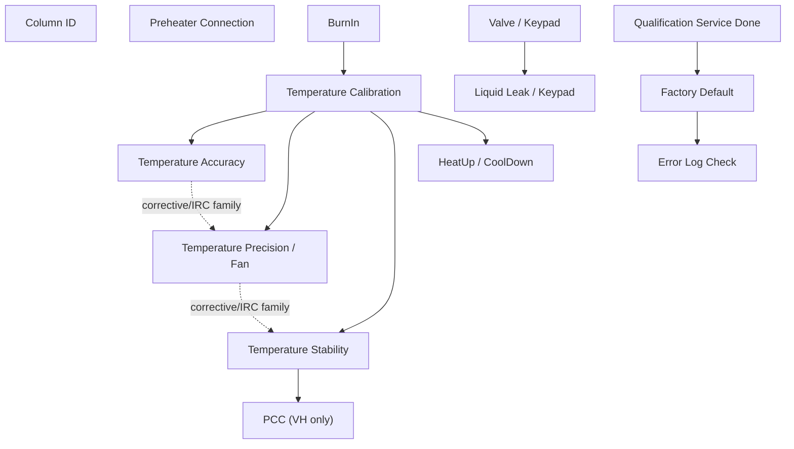

## Dependency Matrix

| Test | Hard dependencies | Soft dependencies / review points | Downstream impact |
|---|---|---|---|
| Column ID | `ColumnComp.ModelNo`, Column A-D audit descriptions | VA applicability is open because production VA sequence omitted ColumnIDs in observed branch | DB `RES_ColumnID_*`; report/page context |
| Preheater Connection | Preheater modules, heater/sensor channels, RetTimes 1-4 | VA sequence applicability open | Preheater status and noise/diff fields |
| Valve / Keypad | Valve hardware and keypad/manual interaction | VA lower-only valve branch | Confirms valve switching; can inform periodic-valve generation |
| BurnIn | CC temperature control, external thermometers, debug/leak channels | Can be omitted only if test intent explicitly allows skipping preconditioning | Affects thermal history for later temperature tests |
| Temperature Calibration | External thermometers, calibration variables, model ladder | Parameterization requires report/DB ladder change | Foundation for temperature family |
| Temperature Accuracy | Calibration context, external thermometers, RetTimes 1-5 | Can crop setpoints only with report/DB remapping | DB TempAcc fields, pass/fail |
| Temperature Precision / Fan | External thermometers, fan/state branch, RetTimes | Fan branch formula still partly open | Precision DB fields and stability insertion chain |
| Temperature Stability | Calibration context, external thermometers, stability windows | Merge/crop requires window and RetTime redesign | Stability DB fields; VH branch leads to PCC |
| PCC | VH hardware only | Not applicable to VA/VC | PCC DB fields and performance/cooldown |
| HeatUp / CoolDown | Calibration context, RetTimes 1/3/4/6 | Temperature range and hold subtraction can be parameterized after review | Dynamic timing DB fields |
| Liquid Leak | Leak sensor, manual water injection, alarm mute | Report pass/fail workbook cell open | Sensor workflow evidence |
| Qualification Service | Wellness/service commands | Report endpoint open | Writes service/qualification state |
| Factory Default | Service code, wellness properties, precond/audit metadata | Workbook-derived `ModelVariant` and `RES_SN_Check` formulas open | DB identity fields and final defaults |
| Error Log Check | Final reconnect and safe-state symbols | Pass/fail criterion open | Final audit/error-log report endpoint |

## Shared Resource Model

### Hardware / Configuration Resources

| Resource | Used by | Notes |
|---|---|---|
| `AUDIT.ColumnComp.ModelNo` | all branch-sensitive tests, Factory Default DB, upload table selection | Device source of truth. Never infer from filename. |
| External thermometers `ExtTemp_UpperCC`, `ExtTemp_LowerCC` | BurnIn guard, Calibration, Accuracy, Precision, Stability, HeatUp/CoolDown | Required Generic Device/channel configuration. |
| `ColumnComp.CC` temperature control | BurnIn, Calibration, Accuracy, Precision, Stability, HeatUp/CoolDown, Error Log cleanup | Main thermal actuator and report source. |
| PCC hardware/control | VH Stability/PCC, VH BurnIn PCC-off branch | VH-only; should be absent from VA/VC generation branch. |
| Preheater modules | Preheater Connection, Error Log cleanup on VH/VC | VA branch may omit preheater control. |
| Valve hardware/keypad | Valve / Keypad, Liquid Leak context, Factory Default operator check | VA lower-only branch must be respected. |
| Leak sensor / LEDBoard channels | BurnIn, Liquid Leak, Factory Default final state | BurnIn disables sensor; Factory Default turns it on; Liquid Leak tests it. |
| Wellness/service properties | Qualification Service, Factory Default | State-mutating; only include when intent requires full FOQ/final state. |
| Error/audit log | Factory Default, Error Log Check | Factory Default clears; Error Log Check displays final audit table. |

### Data / Formula Resources

| Data resource | Producers | Consumers |
|---|---|---|
| `RetTimes.RetTime1..8` calibration ladder | Temperature Calibration | Temp calibration report/DB fields |
| `RetTimes.RetTime1..5` accuracy ladder | Temperature Accuracy | Temp accuracy report/DB fields |
| Precision RetTimes/window cells | Temperature Precision / Fan | Precision report/DB fields |
| Stability RetTimes/window cells | Stability/PCC | Stability, noise, PCC report/DB fields |
| Heat/Cool RetTimes 1/3/4/6 | HeatUp/CoolDown | HeatUp/CoolDown report/DB fields |
| `precond.ColumnComp.*` metadata | injection preconditions / nearest audit fallback | Factory Default DB fields, Internal Use |
| `AUDIT.Column_A-D.Description` | Column ID method/audit | Column ID report/DB fields |
| `AUDIT.LiquidLeak` and leak calibration precond | Liquid Leak | Liquid Leak report source cells |
| `audittrail` table | Error Log Check | Error Log report table |

## Modifiability Rules

| Test | Modifiability | Editable points | Locked points |
|---|---|---|---|
| Column ID | review-required | column subset only with report/DB redesign | A-D pass/fail contract, `AUDIT.Column_* Description` source |
| Preheater Connection | review-required | port subset only if hardware/report branch is changed | ModulePresent/MemoryState and RetTime evidence |
| Valve / Keypad | editable after review | periodic valve cycle timing/positions for non-FOQ custom method | keypad/disconnect workflow for FOQ Valve test |
| BurnIn | review-required | omit or shorten only if test intent allows | model branch, external thermometer guard, leak sensor off |
| Temperature Calibration | high-risk edit | setpoint ladder only with report/DB redesign | model-specific ladder and calibration variables |
| Temperature Accuracy | editable after calibration/report review | setpoint subset such as 40 C only | RetTime-window formula shape and external thermometer source |
| Temperature Precision | review-required | window length/setpoint after dependency review | separate lower/upper sensor range rule |
| Temperature Stability | review-required | window length/setpoint after dependency review | separate lower/upper sensor range rule; VH PCC branch |
| HeatUp/CoolDown | editable after review | temperature range and hold-time constant | RetTime delta logic and `- 2.0 min` hold contract unless report changed |
| Liquid Leak | locked for FOQ | none for FOQ equivalent; custom diagnostic can be separate | physical water injection, mute alarm, cleanup prompts |
| Qualification Service | locked/finalization | include/exclude as finalization step | wellness state mutation semantics |
| Factory Default | locked/finalization | include/exclude as finalization step | service code/default mutation and DB identity source |
| Error Log Check | editable cleanup | include as final injection or translate to StopRun cleanup | report audit-table equivalence if report page required |

## Crop / Merge Impact Rules

| Intent | Required impact checks |
|---|---|
| Single Accuracy 40 C | Need Calibration/BurnIn decision, external thermometer config, report row/cell remapping, DB field subset, RetTime count reduction. |
| Accuracy + Stability merge | Must avoid RetTime/window collisions; report sheets expect different source rows/windows. |
| HeatUp/CoolDown custom range | Must update method setpoints, trigger thresholds, report labels, DB field name/meaning, and hold subtraction rule. |
| Periodic valve cycling | Can reuse `CurrentPosition` command knowledge; do not include keypad disconnect unless FOQ Valve test requested. |
| Full FOQ clone/select | Preserve canonical order and late finalization chain: Liquid Leak -> Qualification Service -> Factory Default -> Error Log Check. |
| DB-only upload from existing CMBX | Use Factory Default `AUDIT.ColumnComp.ModelNo` as device source of truth and report/DB mapping cells. |

## Failure Propagation

| Failure source | Likely affected tests | Reason |
|---|---|---|
| External thermometer missing/simulation | BurnIn, Calibration, Accuracy, Precision, Stability, HeatUp/CoolDown | Method/report depend on external thermometer channels. |
| Wrong `ColumnComp.ModelNo` | all branch-sensitive tests and DB upload | Wrong setpoint ladder, report template, PCC branch, or SQL target. |
| Calibration not run / invalid | Accuracy, Precision, Stability, HeatUp/CoolDown | Temperature family interpretation assumes calibrated thermal state. |
| BurnIn omitted without approval | downstream temperature tests | Thermal history assumption changes. |
| PCC hardware absent in VH branch | Stability/PCC | VH report has PCC fields; method expects PCC branch. |
| Preheater module absent | Preheater Connection | ModulePresent/MemoryState and heater sensor fields fail. |
| Leak sensor/alarm workflow skipped | Liquid Leak | Report can have evidence without physical sensor validation. |
| Factory Default skipped in full FOQ | DB metadata/final-state outputs | Model/serial/firmware/default state contract incomplete. |
| Error Log Check skipped in full FOQ | final report audit table | Final error-log endpoint missing. |

## Device Branch Summary

| Branch | Key differences |
|---|---|
| VH-C10-A | Uses 120 C high ladder in BurnIn/Calibration/Accuracy; includes PCC stability/performance branch; report template `Report_VTCC_V2_12`. |
| VC-C10-A | Uses 85 C high ladder for calibration/accuracy; no PCC; report template `Report_VTCC_V2_12`; several late injections bind corrective processing pattern. |
| VA-C10-A | Uses 85 C high ladder; report template `Report_VATCC_V1_01`; observed sequence omits some VC/VH-only front tests such as ColumnID/Preheater in some branches; valve/error-log cleanup is reduced. |

## Open Verification

| # | Open item | Why it matters |
|---|---|---|
| 1 | Exact processing-method pass-action behavior for `CORRECT_*` processing methods | Needed before automatically inserting/cropping IRC injections. |
| 2 | FormulaOne workbook dependencies for all workbook-derived fields | Needed before generated report templates can be claimed equivalent. |
| 3 | Live CM semantics for BurnIn trigger repeats and post-End guard | Needed before rewriting BurnIn parametrically. |
| 4 | Formal TD rule for when BurnIn can be skipped | Needed for safe single-test generation. |
| 5 | VA applicability for Column ID / Preheater in all production variants | Needed for generic VA branch generation. |

## Generation Readiness Implication

The current model supports:

```text
- explaining dependencies and modifiability in the UI
- warning when a requested crop/merge changes report/DB contracts
- selecting clone/reuse candidates from known CMBX evidence
- building a first impact preview for single-test intents
```

The current model does not yet support:

```text
- fully automatic parametric report-template generation
- safe automatic processing-method IRC rewriting
- claiming a new generated CMBX is runnable without live CM verification
```

<a id="tcc-stress-trigger-contract"></a>
## K004: TCC stress Trigger method contract

Build source name: `TCC_STRESS_TRIGGER_METHOD_CONTRACT.md`

# TCC Stress Trigger Method Contract

Status: Source-grounded execution contract  
Evidence: `Stress_VH_DVT013_20260529.cmbx`, especially `stress test_5s`

## Purpose

This contract explains the reusable CM mechanism used by the TCC stress
methods for periodic synchronous upper/lower valve switching. It is execution
evidence, not an FOQ acceptance criterion.

## Verified Module Roles

| Role | Source pattern | Meaning |
|---|---|---|
| Initial valve state | `UpperValve.CurrentPosition`, `LowerValve.CurrentPosition` | Establish a known complementary valve state before the run |
| Alternating gates | `Variables.GenericBool1`, `Variables.GenericBool2` | Exactly one Ping/Pong trigger is armed at a time |
| Next-switch time | `Variables.GenericFloat1` | Absolute next switch time in `System.Retention` minutes |
| Ping/Pong triggers | `System.Trigger` in `Start Run` | Alternately change both valves and hand control to the opposite trigger |
| Arm cycle | `Variables.GenericBool1 = 1` in `Run` | Starts periodic switching only after the run timeline begins |
| Stop cycle | Both Boolean gates reset to `0` | Prevents further trigger execution during cleanup |

## Period Encoding

`System.Retention` is expressed in minutes. The source method schedules the
next trigger edge by adding a minute fraction:

| Requested period | Source-grounded assignment |
|---:|---|
| 6 seconds | `Variables.GenericFloat1 = System.Retention+0.1` |
| 3 seconds | `Variables.GenericFloat1 = System.Retention+0.05` |

The period is **not** encoded as ordinary `Delay 0.1`. Trigger `TrueTime` and
trigger `Delay` are seconds and serve trigger qualification/execution timing;
they do not replace the absolute next-edge schedule.

## Source-Grounded 6-Second Skeleton

```text
Instrument Setup:
  GenericBool1 = 0
  GenericBool2 = 0
  GenericFloat1 = 0

Start Run:
  Trigger Ping when Bool1=1 and Retention>GenericFloat1 and inside window
    GenericFloat1 = System.Retention+0.1
    preserve source Delay/valve-set/Delay sequence
    Bool1 = 0
    Bool2 = 1

  Trigger Pong when Bool2=1 and Retention>GenericFloat1 and inside window
    GenericFloat1 = System.Retention+0.1
    preserve source Delay/valve-set/Delay sequence
    Bool1 = 1
    Bool2 = 0

Run:
  GenericBool1 = 1

Stop Run:
  GenericBool1 = 0
  GenericBool2 = 0
```

## Composition Guardrails

1. Copy the complete verified Ping/Pong module, including state handoff and
   the Delay rows around valve actuation. Do not retain only the valve-set rows.
2. Change the active time window and the `System.Retention` increment together.
3. Keep trigger names unique.
4. Keep upper/lower valve assignments paired as proven by the chosen source
   method and target plumbing configuration.
5. Log valve positions only with the exact configured symbols.
6. Preserve final Boolean reset and acquisition cleanup.
7. A script that uses `Delay 0.1` as "6 seconds" but does not update the
   absolute next-switch time does not implement the verified cycle mechanism.

## Open Verification Required

- Confirm target valve position labels against the actual CM instrument
  configuration.
- Confirm whether the requested physical test needs complementary positions or
  identical positions for upper/lower valves.
- Run Chromeleon Method Check before claiming runnable status.

<a id="tcc-column-id"></a>
## B001: Column ID black box

Build source name: `TCC_COLUMN_ID_BLACK_BOX_DECOMPOSITION.md`

# TCC Column ID Black Box Decomposition

Extraction date: 2026-07-10

Scope: TCC FOQ Column ID test for `VH-C10-A`, `VC-C10-A`, and the open
`VA-C10-A` method-library branch.

---
Test name: Column ID
Models: VH-C10-A / VC-C10-A / VA-C10-A
Status: method/report/DB contract closed for VC/VH; VA production-sequence
applicability remains open verification
---

This document decomposes the Column ID test as a generation contract. It is not
a raw-signal temperature test. The method verifies that the four column-ID
positions report descriptions `A`, `B`, `C`, and `D`, and the report reads the
same audit properties.

```text
Method guard:
  Column_A.Description == "A"
  Column_B.Description == "B"
  Column_C.Description == "C"
  Column_D.Description == "D"

Report leaves:
  L46 = AUDIT.Column_A.Description(0,"forward")
  L47 = AUDIT.Column_B.Description(0,"forward")
  L48 = AUDIT.Column_C.Description(0,"forward")
  L49 = AUDIT.Column_D.Description(0,"forward")
```

## Evidence Sources

| Evidence | Source |
|---|---|
| Test intent node | `cmbx_data_explorer/docs/TCC_TEST_KNOWLEDGE_NODE_MODEL.md` |
| Injection workbench notes | `cmbx_data_explorer/docs/TCC_INJECTION_BY_INJECTION_REVERSE_WORKBENCH.md` |
| Method/report alignment | `cmbx_data_explorer/docs/TCC_METHOD_REPORT_ALIGNMENT.md` |
| Required symbols | `cmbx_data_explorer/docs/TCC_REQUIRED_SYMBOL_MANIFEST.md` |
| Method flow, VH | `knowledge_base/tcc_reverse_probe/VH/6000001/ColumnID_embedded_method_flow.txt` |
| Method flow, VC | `knowledge_base/tcc_reverse_probe/VC/3000004/ColumnID_embedded_method_flow.txt` |
| Method flow, VA payload | `knowledge_base/tcc_reverse_probe/VA/0000003/ColumnID_embedded_method_flow.txt` |
| Report formula objects | `knowledge_base/tcc_report_formula_objects_vh_6000001_all_sheets.tsv` |
| DB mapping | `foq/FOQResultLocations_V2.83.xls` |

## Executive Answer

1. The instrument method is `ColumnID`.
2. The method is audit/configuration based: it waits for all four card states to
   be OK, logs descriptions A-D, and aborts if any description is wrong.
3. The method intentionally acquires `ColumnComp.CC_Temp` even though the result
   is not temperature based; the method comments state CM needs data from at
   least one channel to evaluate the audit trail in the report.
4. There are no RetTimes and no raw report statistics for this test.
5. The report sheet is `Column ID`; DB fields `RES_ColumnID_A..D` resolve from
   cells `L46:L49`.
6. VC/VH DB mapping is closed. VA has a `ColumnID` method payload, but the
   observed VA production sequence omits the `ColumnIDs` injection; do not add
   the row to a VA generated sequence without confirmation.

## Contract 1: Method Command

### 1.1 Device Branch Binding

| Device | Injection | Instrument Method | Processing Method | Report Template | Report Sheets | Status |
|---|---|---|---|---|---|---|
| VH-C10-A | `ColumnIDs` | `ColumnID` | `CORRECT_STABILITY_INJ_INSERTION` | `Report_VTCC_V2_12` | `Column ID` | sequence evidence closed |
| VC-C10-A | `ColumnIDs` | `ColumnID` | `CORRECT_ACCURACY_INJ_INSERTION` | `Report_VTCC_V2_12` | `Column ID` | sequence evidence closed |
| VA-C10-A | open | `ColumnID` payload exists | open | `Report_VATCC_V1_01` open | open | Open Verification Required |

### 1.2 Method Contract Summary

Decoded method evidence:

```yaml
method: ColumnID
stages:
  - InstrumentSetup
  - StartRun
  - Run
  - StopRun
  - PostRun
initialization:
  model_branch:
    if ColumnComp.ModelNo == VH-C10-A:
      Variables.GenericLong9: 12
      Log: GenericLong9
    else supported non-VH branch:
      Variables.GenericLong9: 10
      Log: GenericLong9
    else:
      Message: column compartment model unknown
      action: System.AbortQueue
  column_compartment:
    ColumnComp.CC.TempCtrl: On
    ColumnComp.CC.Temperature.Nominal: 15 C
    ColumnComp.CC.Mode: StillAir
  end_gate:
    Variables.GenericBool1: 0
    System.Trigger END_RUN: Variables.GenericBool1 = 1
acquisition:
  - ColumnComp.CC_Temp.AcqOn
  - ColumnComp.CC_Temp.AcqOff
```

### 1.3 Command Flow

```yaml
ColumnID_Command_Flow:
  - order: 1
    stage: InstrumentSetup
    command: IF
    condition: ColumnComp.ModelNo = "VH-C10-A"
    result: Variables.GenericLong9 = 12; Log GenericLong9
    note: VH report/page-count branch evidence.
  - order: 2
    stage: InstrumentSetup
    command: ELSE
    condition: supported non-VH branch
    result: Variables.GenericLong9 = 10; Log GenericLong9
    note: VC/non-PCC report/page-count branch evidence.
  - order: 3
    stage: InstrumentSetup
    command: ABORT
    condition: unknown ColumnComp.ModelNo
    result: System.AbortQueue
    note: Stops if the device branch cannot be identified.
  - order: 4
    stage: InstrumentSetup
    command: SET
    target: ColumnComp.CC.TempCtrl / Temperature.Nominal / Mode
    value: On / 15 C / StillAir
    note: Minimal column compartment context.
  - order: 5
    stage: InstrumentSetup
    command: TRIGGER
    target: END_RUN
    condition: Variables.GenericBool1 = 1
    note: Normal completion gate.
  - order: 6
    stage: StartRun
    command: ACQ_ON
    target: ColumnComp.CC_Temp
    note: Provides a data channel so audit report evaluation can run.
  - order: 7
    stage: Run
    command: MESSAGE
    target: operator
    note: Prompts operator to plug column ID adapters in correct positions.
  - order: 8
    stage: Run
    command: WAIT
    condition: Column_A/B/C/D.CardState = OK
    timeout: 2.00 min
    note: Confirms all four slots can see cards.
  - order: 9
    stage: Run
    command: LOG
    target: Column_A.Description, Column_B.Description, Column_C.Description, Column_D.Description
    note: Creates audit properties used by the report.
  - order: 10
    stage: Run
    command: IF_ABORT
    condition: Column_A.Description <> "A" OR Column_B.Description <> "B" OR Column_C.Description <> "C" OR Column_D.Description <> "D"
    result: message + System.AbortQueue
    note: Method-side hard guard; report is not the only pass/fail layer.
  - order: 11
    stage: Run
    command: SET
    target: Variables.GenericBool1
    value: 1
    note: Allows END_RUN trigger to finish sample normally.
  - order: 12
    stage: StopRun
    command: ACQ_OFF
    target: ColumnComp.CC_Temp
    note: Clean acquisition close.
```

### 1.4 RetTime and Channel Semantics

| Item | Status | Reason |
|---|---|---|
| RetTimes | not used | Column ID is an audit-property test. |
| Raw signal result channels | not used | Report pass/fail comes from `AUDIT.Column_A-D.Description`. |
| `ColumnComp.CC_Temp` | acquired but not a result channel | Required as a minimal CM data channel for report/audit evaluation. |
| `Variables.GenericLong9` | branch evidence/helper | Logged value appears tied to device/page-count context, not the physical Column ID result. |

## Contract 2: Processing Method

Known sequence bindings:

| Device | Processing Method | IRC / corrective role | Status |
|---|---|---|---|
| VH-C10-A | `CORRECT_STABILITY_INJ_INSERTION` | corrective processing binding preserved in VH sequence | verified from sequence binding |
| VC-C10-A | `CORRECT_ACCURACY_INJ_INSERTION` | corrective processing binding preserved in VC sequence | verified from TKN/package map |
| VA-C10-A | open | production sequence does not currently include `ColumnIDs` | Open Verification Required |

Processing interpretation:

- The method itself enforces the A/B/C/D check and aborts on mismatch.
- The processing method binding is therefore a sequence-level corrective/IRC
  context, not the primary Column ID result calculation.
- For full-sequence generation, preserve the production binding by device.
- For a standalone Column ID diagnostic package, whether `No_Integration` is
  acceptable remains Open Verification Required.

## Contract 3: Report Formula

### 3.1 `Column ID` Formula Objects

| Cell | Formula | Meaning |
|---|---|---|
| `L46` | `AUDIT.Column_A.Description(0,"forward")` | Description reported by Column ID slot A |
| `L47` | `AUDIT.Column_B.Description(0,"forward")` | Description reported by Column ID slot B |
| `L48` | `AUDIT.Column_C.Description(0,"forward")` | Description reported by Column ID slot C |
| `L49` | `AUDIT.Column_D.Description(0,"forward")` | Description reported by Column ID slot D |

### 3.2 Workbook-Derived Rules

Known evaluator/report rules:

```text
RES_ColumnID_A passes if L46 == "A"
RES_ColumnID_B passes if L47 == "B"
RES_ColumnID_C passes if L48 == "C"
RES_ColumnID_D passes if L49 == "D"
```

Formula flow:


## Contract 4: DB Contract

### 4.1 DB Leaves

| Device | DB Field | Report file | Sheet | Cell | Rule |
|---|---|---|---|---|---|
| VH-C10-A | `RES_ColumnID_A` | `ColumnIDs.XLS` | `Column ID` | result from `L46` | passes when `L46 = A` |
| VH-C10-A | `RES_ColumnID_B` | `ColumnIDs.XLS` | `Column ID` | result from `L47` | passes when `L47 = B` |
| VH-C10-A | `RES_ColumnID_C` | `ColumnIDs.XLS` | `Column ID` | result from `L48` | passes when `L48 = C` |
| VH-C10-A | `RES_ColumnID_D` | `ColumnIDs.XLS` | `Column ID` | result from `L49` | passes when `L49 = D` |
| VC-C10-A | `RES_ColumnID_A` | `ColumnIDs.XLS` | `Column ID` | result from `L46` | same as VH |
| VC-C10-A | `RES_ColumnID_B` | `ColumnIDs.XLS` | `Column ID` | result from `L47` | same as VH |
| VC-C10-A | `RES_ColumnID_C` | `ColumnIDs.XLS` | `Column ID` | result from `L48` | same as VH |
| VC-C10-A | `RES_ColumnID_D` | `ColumnIDs.XLS` | `Column ID` | result from `L49` | same as VH |
| VA-C10-A | open | open | open | open | no current VA Column ID DB leaves confirmed |

### 4.2 DB Is a Leaf

```text
ColumnID command flow
-> audit log Column_A-D.Description
-> Column ID report cells L46:L49
-> RES_ColumnID_A..D DB fields
```

The DB contract validates the audit path. It does not define the method command
logic.

## Contract 5: Config Requirement

| Requirement | VH-C10-A | VC-C10-A | VA-C10-A | Failure mode |
|---|---|---|---|---|
| `AUDIT.ColumnComp.ModelNo` source of truth | Required | Required | Required | Wrong branch/page context or method abort |
| Column ID option enabled | Required | Required | open | card state/description properties missing |
| `Column_A.CardState` / `Column_A.Description` | Required | Required | open | A slot cannot be verified |
| `Column_B.CardState` / `Column_B.Description` | Required | Required | open | B slot cannot be verified |
| `Column_C.CardState` / `Column_C.Description` | Required | Required | open | C slot cannot be verified |
| `Column_D.CardState` / `Column_D.Description` | Required | Required | open | D slot cannot be verified |
| Four chip cards with descriptions `A`, `B`, `C`, `D` | Required | Required | open | method aborts or report fails |
| `ColumnComp.CC_Temp` acquisition available | Required | Required | open | report/audit evaluation context may be missing |

Generation implication:

- Do not invent RetTimes for Column ID.
- Do not calculate Column ID from raw temperature data.
- Preserve the method-side abort guard unless intentionally generating a
  non-aborting diagnostic method.
- A generated full VC/VH FOQ sequence should preserve this test if the Column ID
  option is enabled.
- A generated VA sequence must not add `ColumnIDs` automatically until VA
  applicability is confirmed.

## Contract 6: Open Verification

Items below are marked Open Verification Required until the listed evidence is
captured.

| # | Open Verification Required | Why it matters | Needed evidence | Likely source |
|---:|---|---|---|---|
| 1 | VA-C10-A Column ID applicability | VA payload exists, but observed VA production sequence omits `ColumnIDs` and TD extraction is incomplete | VA TD table and a current VA production CMBX | VA TD, VA CMBX |
| 2 | Standalone processing method choice | Full sequence preserves corrective processing, but standalone diagnostic might use `No_Integration` | Processing method XML/pass-action behavior | VC/VH processing method payload |
| 3 | `Variables.GenericLong9` workbook role | It is logged as branch/page-count evidence; exact workbook dependency is not fully parsed | FormulaOne workbook formulas referencing GenericLong9 | report `SpreadSheetData` |
| 4 | Report result cell locations for `RES_ColumnID_A..D` | DB leaves are closed, but exact workbook result cells are derived from evaluator rules rather than fully parsed FormulaOne formulas | workbook parse of `Column ID` sheet | report template |

## VH / VC / VA Comparison

| Aspect | VH-C10-A | VC-C10-A | VA-C10-A |
|---|---|---|---|
| Production injection | `ColumnIDs` | `ColumnIDs` | not observed in current VA sequence |
| Instrument method payload | `ColumnID` | `ColumnID` | `ColumnID` payload exists |
| Processing method | `CORRECT_STABILITY_INJ_INSERTION` | `CORRECT_ACCURACY_INJ_INSERTION` | open |
| Report template | `Report_VTCC_V2_12` | `Report_VTCC_V2_12` | open / `Report_VATCC_V1_01` not verified for this row |
| DB fields | `RES_ColumnID_A..D` mapped | `RES_ColumnID_A..D` mapped | no mapped Column ID leaves confirmed |
| Generation status | reusable with config check | reusable with config check | Open Verification Required |

## Generation Readiness

| Generation action | Status | Notes |
|---|---|---|
| Reuse full VH Column ID row | ready after config validation | Preserve `CORRECT_STABILITY_INJ_INSERTION`, `ColumnID`, and `Column ID` report sheet. |
| Reuse full VC Column ID row | ready after config validation | Preserve `CORRECT_ACCURACY_INJ_INSERTION`. |
| Generate standalone Column ID diagnostic | partial | Need decide processing method and whether method-side abort should remain hard stop. |
| Add Column ID row to VA package | locked | Do not add until VA applicability is confirmed. |
| Modify expected descriptions | locked | A/B/C/D are part of the method abort guard and report contract. |

<a id="tcc-preheater"></a>
## B002: Preheater black box

Build source name: `TCC_PREHEATER_BLACK_BOX_DECOMPOSITION.md`

# TCC Preheater Connection Black Box Decomposition

Extraction date: 2026-07-10

Scope: TCC FOQ Preheater Connection Test for `VH-C10-A`, `VC-C10-A`, and the
open VA method-library branch.

---
Test name: Preheater Connection Test
Models: VH-C10-A / VC-C10-A / VA-C10-A
Status: first black-box decomposition complete for VC/VH sequence evidence; VA
sequence applicability remains open verification
---

This document decomposes the Preheater Connection Test as a generation contract.
The core of the test is left/right preheater thermal response plus precondition
metadata:

```text
RetTimes.RetTime1 = left preheater reaches 45 C
RetTimes.RetTime2 = right preheater reaches 45 C
RetTimes.RetTime3 = left preheater reaches 55 C
RetTimes.RetTime4 = right preheater reaches 55 C

Port pass = RetTimes present AND ModulePresent = Yes AND MemoryState = OK
Temperature difference = heater actual average - preheater temp average
```

## Evidence Sources

| Evidence | Source |
|---|---|
| Test intent node | `cmbx_data_explorer/docs/TCC_TEST_KNOWLEDGE_NODE_MODEL.md` |
| Injection workbench notes | `cmbx_data_explorer/docs/TCC_INJECTION_BY_INJECTION_REVERSE_WORKBENCH.md` |
| Method/report alignment | `cmbx_data_explorer/docs/TCC_METHOD_REPORT_ALIGNMENT.md` |
| Required symbols | `cmbx_data_explorer/docs/TCC_REQUIRED_SYMBOL_MANIFEST.md` |
| Method flow, VH | `knowledge_base/tcc_reverse_probe/VH/6000001/PREHEATER_embedded_method_flow.txt` |
| Method flow, VC | `knowledge_base/tcc_reverse_probe/VC/3000004/PREHEATER_embedded_method_flow.txt` |
| Method flow, VA payload | `knowledge_base/tcc_reverse_probe/VA/0000003/PREHEATER_embedded_method_flow.txt` |
| Report formula objects | `knowledge_base/tcc_report_formula_objects_vh_6000001_all_sheets.tsv` |
| Formula/evaluator rule | `cmbx_data_explorer/report_calculation_map.py`, `cmbx_data_explorer/CM_FORMULA_REVERSE_ENGINEERING.md` |
| DB mapping | `foq/FOQResultLocations_V2.83.xls` |

## Executive Answer

1. The instrument method is `PREHEATER`; VC and VH decoded method flows are
   materially the same for the preheater thermal sequence.
2. The method stabilizes both preheater ports at 40 C, then tests a controlled
   heat-up toward 60 C.
3. `RetTimes.RetTime1..RetTime4` are method-generated anchors for left/right
   45 C and 55 C crossings.
4. The method includes a protective short-circuit branch: if the right
   preheater rises while right TempCtrl is off, it logs a protocol message and
   aborts the queue.
5. The method also aborts if the terminal `END_RUN` trigger is not reached,
   which means one or both ports did not reach the nominal endpoint.
6. The report sheet is `Preheater Ports_Noise`; it combines RetTimes, raw
   channel statistics, and precondition metadata.
7. VC/VH DB mapping is closed for the six known fields. VA has a `PREHEATER`
   method payload in the library, but the observed VA production sequence and
   FOQ DB mapping do not carry the Preheater DB leaves; treat VA preheater as
   Open Verification Required before generation.

## Contract 1: Method Command

### 1.1 Device Branch Binding

| Device | Injection | Instrument Method | Processing Method | Report Template | Report Sheets | Status |
|---|---|---|---|---|---|---|
| VH-C10-A | `Preheater Connection Test` | `PREHEATER` | `No_Integration` | `Report_VTCC_V2_12` | `Preheater Ports_Noise` | sequence evidence closed |
| VC-C10-A | `Preheater Connection Test` | `PREHEATER` | `CORRECT_ACCURACY_INJ_INSERTION` | `Report_VTCC_V2_12` | `Preheater Ports_Noise` | sequence evidence closed |
| VA-C10-A | open | `PREHEATER` payload exists | open | `Report_VATCC_V1_01` open | open | Open Verification Required |

### 1.2 Method Contract Summary

Decoded method evidence:

```yaml
method: PREHEATER
stages:
  - InstrumentSetup
  - Equilibration
  - InjectPreparation
  - StartRun
  - Run
  - StopRun
  - PostRun
initialization:
  cc:
    ReadyTempDelta: 1.0 C
    EquilibrationTime: 0.5 min
    TempCtrl: On
    Nominal: 15 C
    Mode: StillAir
  variables:
    GenericBool1: 0
    GenericBool2: 0
  ret_times:
    RetTimes.RetTime1: 0
    RetTimes.RetTime2: 0
    RetTimes.RetTime3: 0
    RetTimes.RetTime4: 0
preheater_setup:
  left:
    TempCtrl: On
    Nominal: 40 C
    ReadyTempDelta: 0.05 C
    EquilibrationTime: 0.5 min
  right:
    TempCtrl: On
    Nominal: 40 C
    ReadyTempDelta: 0.05 C
    EquilibrationTime: 0.5 min
  simulator_pid:
    PREH.L.PID.Kp: 10000
    PREH.L.PID.Ki: 1200
    PREH.R.PID.Kp: 10000
    PREH.R.PID.Ki: 1200
```

### 1.3 Command Flow

```yaml
PREHEATER_Command_Flow:
  - order: 1
    stage: Equilibration
    command: SET
    target: ColumnComp.CC.Temperature.Nominal
    value: 15 C
    note: Keep the column compartment in a controlled background state.
  - order: 2
    stage: Equilibration
    command: SET
    target: ColumnComp.PrehtLeft/Right.Temperature.Nominal
    value: 40 C
    note: Establish stable starting point for both preheater ports.
  - order: 3
    stage: InjectPreparation
    command: WAIT
    target: PrehtLeft.TempReady AND PrehtRight.TempReady
    note: Start acquisition only after both ports are ready at 40 C.
  - order: 4
    stage: StartRun
    command: ACQ_ON
    target: PrehtLeft_Temp, PrehtRight_Temp, PREH_L/R_Temp_Actual, PREH_L/R_HeaterTemp_Actual, PWM channels, external thermometer channels
    note: Collect raw channels required by report noise and difference rules.
  - order: 5
    stage: Run
    command: SET
    target: ColumnComp.PrehtLeft.TempCtrl / ColumnComp.PrehtRight.TempCtrl
    value: Off
    note: Establish short-circuit guard before commanding the left side up.
  - order: 6
    stage: Run
    command: SET
    target: ColumnComp.PrehtLeft.Temperature.Nominal
    value: 60 C
    note: Begin left preheater heat-up.
  - order: 7
    stage: Run
    command: TRIGGER
    target: T_UP_Left
    condition: PrehtLeft.Temperature.Value >= 45.0
    result: RetTimes.RetTime1 = System.Retention
    note: Left 45 C timing anchor.
  - order: 8
    stage: Run
    command: IF_ABORT
    condition: PrehtLeft.Temperature.Value - PrehtRight.Temperature.Value < 5
    note: Detect right-side heating while right TempCtrl is still off; aborts suspected board short.
  - order: 9
    stage: Run
    command: SET
    target: ColumnComp.PrehtRight.Temperature.Nominal
    value: 60 C
    note: Begin right preheater heat-up after left-side guard has passed.
  - order: 10
    stage: Run
    command: TRIGGER
    target: T_UP_Right
    condition: PrehtRight.Temperature.Value >= 45.0 AND PrehtRight.TempCtrl = On
    result: RetTimes.RetTime2 = System.Retention
    note: Right 45 C timing anchor.
  - order: 11
    stage: Run
    command: TRIGGER
    target: Reached_Left
    condition: PrehtLeft.Temperature.Value >= 55.0
    result: RetTimes.RetTime3 = System.Retention
    note: Left 55 C endpoint; left TempCtrl is switched off.
  - order: 12
    stage: Run
    command: TRIGGER
    target: Reached_Right
    condition: PrehtRight.Temperature.Value >= 55.0
    result: RetTimes.RetTime4 = System.Retention
    note: Right 55 C endpoint; right TempCtrl is switched off.
  - order: 13
    stage: Run
    command: TRIGGER
    target: END_RUN
    condition: Variables.GenericBool1 = 1 AND Variables.GenericBool2 = 1
    note: Regular sample completion only after both endpoints have been reached.
  - order: 14
    stage: Run/PostRun
    command: CLEANUP
    target: AcqOff all channels; restore PREH.L/R PID values to 600000 / 30000
    note: Reset temporary simulator tuning and close acquisition.
```

### 1.4 RetTime Semantics

| RetTime | Trigger | Port | Temperature point | Method purpose | Report use |
|---|---|---|---:|---|---|
| `RetTimes.RetTime1` | `T_UP_Left` | Left | 45 C | Left start timing anchor | `J72` |
| `RetTimes.RetTime2` | `T_UP_Right` | Right | 45 C | Right start timing anchor | `J73` |
| `RetTimes.RetTime3` | `Reached_Left` | Left | 55 C | Left endpoint and normal completion flag | `K72` |
| `RetTimes.RetTime4` | `Reached_Right` | Right | 55 C | Right endpoint and normal completion flag | `K73` |

## Contract 2: Processing Method

Known sequence bindings:

| Device | Processing Method | IRC / corrective role | Status |
|---|---|---|---|
| VH-C10-A | `No_Integration` | no IRC expected for preheater row | verified from VH sequence binding |
| VC-C10-A | `CORRECT_ACCURACY_INJ_INSERTION` | corrective processing binding preserved in VC sequence | verified from VC package map; detailed pass-action semantics remain open |
| VA-C10-A | open | no production sequence evidence for this row | Open Verification Required |

Processing interpretation:

- The preheater result is primarily method/report driven; no peak
  integration is required.
- VC production sequence still binds `CORRECT_ACCURACY_INJ_INSERTION`.
  Until processing method pass actions are fully decoded, the VC full-sequence
  clone should preserve this binding rather than replacing it with
  `No_Integration`.
- For a standalone VC preheater-only package, whether `No_Integration` is
  acceptable is Open Verification Required.

## Contract 3: Report Formula

### 3.1 `Preheater Ports_Noise` Formula Objects

RetTime and metadata cells:

| Cell | Formula | Meaning |
|---|---|---|
| `J72` | `AUDIT.RetTime1("forward")` | Left 45 C RetTime |
| `J73` | `AUDIT.RetTime2("forward")` | Right 45 C RetTime |
| `K72` | `AUDIT.RetTime3("forward")` | Left 55 C RetTime |
| `K73` | `AUDIT.RetTime4("forward")` | Right 55 C RetTime |
| `J117` | `precond.ColumnComp.PrehtLeft.ModulePresent` | Left module presence |
| `J118` | `precond.ColumnComp.PrehtRight.ModulePresent` | Right module presence |
| `K117` | `precond.ColumnComp.PrehtLeft.MemoryState` | Left memory state |
| `K118` | `precond.ColumnComp.PrehtRight.MemoryState` | Right memory state |

Raw signal cells:

| Cell | Channel | Formula | Meaning |
|---|---|---|---|
| `J82` | `PrehtLeft_Temp` | `chm.sig_value("average", 0.25, 0.5)` | Left preheater temperature average |
| `K82` | `PREH_L_HeaterTemp_Actual` | `chm.sig_value("average", 0.25, 0.5)` | Left heater actual average |
| `J83` | `PrehtRight_Temp` | `chm.sig_value("average", 0.25, 0.5)` | Right preheater temperature average |
| `K83` | `PREH_R_HeaterTemp_Actual` | `chm.sig_value("average", 0.25, 0.5)` | Right heater actual average |
| `J92` | `PrehtLeft_Temp` | `chm.noise(0, 0.5)` | Left preheater temperature noise |
| `J93` | `PrehtRight_Temp` | `chm.noise(0, 0.5)` | Right preheater temperature noise |
| `K92` | `PREH_L_HeaterTemp_Actual` | `chm.noise(0, 0.5)` | Left heater actual noise |
| `K93` | `PREH_R_HeaterTemp_Actual` | `chm.noise(0, 0.5)` | Right heater actual noise |
| `J102` | `PrehtLeft_Temp` | `chm.sig_value("average", 0.25, 0.5)` | Left preheater average for heat response view |
| `K102` | `PrehtLeft_Temp` | `chm.sig_value("max", 0.5, 0.6)` | Left preheater max after transition window |
| `J103` | `PrehtRight_Temp` | `chm.sig_value("average", 0.25, 0.5)` | Right preheater average for heat response view |
| `K103` | `PrehtRight_Temp` | `chm.sig_value("max", 0.5, 0.6)` | Right preheater max after transition window |
| `J110` | `PREH_L_HeaterTemp_Actual` | `chm.sig_value("average", 0.4, 0.5)` | Left heater actual average before peak window |
| `K110` | `PREH_L_HeaterTemp_Actual` | `chm.sig_value("max", 0.5, 0.6)` | Left heater actual max |
| `J111` | `PREH_R_HeaterTemp_Actual` | `chm.sig_value("average", 0.4, 0.5)` | Right heater actual average before peak window |
| `K111` | `PREH_R_HeaterTemp_Actual` | `chm.sig_value("max", 0.5, 0.6)` | Right heater actual max |

### 3.2 Workbook-Derived Rules

Known evaluator rules:

```text
Diff_PhLeft_HtTmp  = K82 - J82, displayed to 1 decimal
Diff_PhRight_HtTmp = K83 - J83, displayed to 1 decimal

RES_Preheater_Left_Port passes if:
  J72 and K72 RetTimes are present
  J117 ModulePresent = Yes
  K117 MemoryState = OK

RES_Preheater_Right_Port passes if:
  J73 and K73 RetTimes are present
  J118 ModulePresent = Yes
  K118 MemoryState = OK
```

Formula flow:

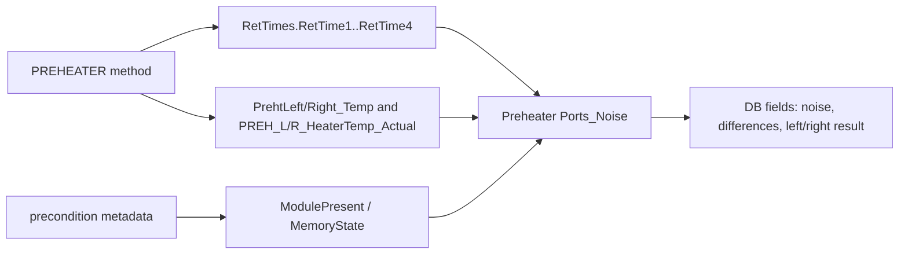

## Contract 4: DB Contract

### 4.1 DB Leaves

| Device | DB Field | Report file | Sheet | Cell | Rule |
|---|---|---|---|---|---|
| VH-C10-A | `Noise_PrehtLeft_Temp` | `Preheater Connection Test.XLS` | `Preheater Ports_Noise` | `J92` | `chm.noise(0,0.5)` on `PrehtLeft_Temp` |
| VH-C10-A | `Noise_PrehtRight_Temp` | `Preheater Connection Test.XLS` | `Preheater Ports_Noise` | `J93` | `chm.noise(0,0.5)` on `PrehtRight_Temp` |
| VH-C10-A | `Diff_PhLeft_HtTmp` | `Preheater Connection Test.XLS` | `Preheater Ports_Noise` | `L82` | `K82 - J82`, display 1 decimal |
| VH-C10-A | `Diff_PhRight_HtTmp` | `Preheater Connection Test.XLS` | `Preheater Ports_Noise` | `L83` | `K83 - J83`, display 1 decimal |
| VH-C10-A | `RES_Preheater_Left_Port` | `Preheater Connection Test.XLS` | `Preheater Ports_Noise` | `C26` | left RetTimes + precondition pass |
| VH-C10-A | `RES_Preheater_Right_Port` | `Preheater Connection Test.XLS` | `Preheater Ports_Noise` | `C27` | right RetTimes + precondition pass |
| VC-C10-A | `Noise_PrehtLeft_Temp` | `Preheater Connection Test.XLS` | `Preheater Ports_Noise` | `J92` | same as VH |
| VC-C10-A | `Noise_PrehtRight_Temp` | `Preheater Connection Test.XLS` | `Preheater Ports_Noise` | `J93` | same as VH |
| VC-C10-A | `Diff_PhLeft_HtTmp` | `Preheater Connection Test.XLS` | `Preheater Ports_Noise` | `L82` | same as VH |
| VC-C10-A | `Diff_PhRight_HtTmp` | `Preheater Connection Test.XLS` | `Preheater Ports_Noise` | `L83` | same as VH |
| VC-C10-A | `RES_Preheater_Left_Port` | `Preheater Connection Test.XLS` | `Preheater Ports_Noise` | `C26` | same as VH |
| VC-C10-A | `RES_Preheater_Right_Port` | `Preheater Connection Test.XLS` | `Preheater Ports_Noise` | `C27` | same as VH |
| VA-C10-A | open | open | open | open | no mapped preheater DB leaves observed |

### 4.2 DB Is a Leaf

DB fields are not the design driver for this test. They are leaves attached to
the method/report evidence:

```text
PREHEATER command flow
-> RetTimes, raw preheater channels, precondition metadata
-> Preheater Ports_Noise report cells
-> FOQ DB fields
```

## Contract 5: Config Requirement

| Requirement | VH-C10-A | VC-C10-A | VA-C10-A | Failure mode |
|---|---|---|---|---|
| `AUDIT.ColumnComp.ModelNo` source of truth | Required | Required | Required | Wrong branch/report selection |
| `ColumnComp.PrehtLeft` | Required | Required | open | left port test cannot run |
| `ColumnComp.PrehtRight` | Required | Required | open | right port test cannot run |
| `ColumnComp.PrehtLeft.TempCtrl` / `PrehtRight.TempCtrl` | Required | Required | open | method command cannot control preheaters |
| `ColumnComp.PrehtLeft_Temp` / `PrehtRight_Temp` | Required | Required | open | report temperature/noise cells missing |
| `ColumnComp.PREH_L_HeaterTemp_Actual` / `PREH_R_HeaterTemp_Actual` | Required | Required | open | heater actual cells and difference values missing |
| `ColumnComp.PWM_LeftPreh` / `PWM_RightPreh` | Required for debug evidence | Required for debug evidence | open | diagnostic trace weaker |
| `precond.ColumnComp.PrehtLeft.ModulePresent` / `PrehtRight.ModulePresent` | Required | Required | open | port result cannot pass |
| `precond.ColumnComp.PrehtLeft.MemoryState` / `PrehtRight.MemoryState` | Required | Required | open | port result cannot pass |
| Preheater simulator PID command support (`ColumnComp.CmdString`) | Required by decoded method | Required by decoded method | open | method cannot reproduce same thermal behavior |

Generation implication:

- A generated full VC/VH FOQ sequence should preserve this row when preheater
  modules are configured.
- A generated VA FOQ sequence should not add this row automatically until VA
  preheater sequence applicability and DB/report contract are confirmed.
- For a standalone preheater diagnostic package, the generator must first check
  that both preheater subdevices and heater actual channels are available in CM
  configuration.

## Contract 6: Open Verification

Items below are marked Open Verification Required until the listed evidence is
captured.

| # | Open Verification Required | Why it matters | Needed evidence | Likely source |
|---:|---|---|---|---|
| 1 | VA-C10-A preheater sequence applicability | VA method payload exists, but observed VA production sequence omits the row and DB mapping has no preheater leaves | VA FOQ TD row and a VA production CMBX that includes or excludes preheater intentionally | VA TD, VA CMBX |
| 2 | VC `CORRECT_ACCURACY_INJ_INSERTION` pass-action semantics on preheater row | Full-sequence cloning should preserve binding, but standalone preheater packaging may not require it | Processing method XML and pass-action trigger map | VC CMBX processing method payload |
| 3 | Exact workbook FormulaOne cells for `C26`, `C27`, `L82`, `L83` | Current evaluator implements verified rules, but workbook route is not fully generalized | FormulaOne workbook parse for `Preheater Ports_Noise` | report template `SpreadSheetData` |
| 4 | External thermometer role in this method | Method acquires upper/lower external thermometers, but DB leaves for preheater use preheater channels and heater actual channels | TD method intent and report workbook references | FOQ TD, report formulas |
| 5 | Numeric noise acceptance criteria | DB maps noise values, but pass/fail currently centers on RetTimes and precondition metadata | Definitions sheet criteria and workbook comparison formulas | report template workbook |

## VH / VC / VA Comparison

| Aspect | VH-C10-A | VC-C10-A | VA-C10-A |
|---|---|---|---|
| Production injection | `Preheater Connection Test` | `Preheater Connection Test` | not observed in current VA sequence |
| Instrument method payload | `PREHEATER` | `PREHEATER` | `PREHEATER` payload exists |
| Processing method | `No_Integration` | `CORRECT_ACCURACY_INJ_INSERTION` | open |
| Report template | `Report_VTCC_V2_12` | `Report_VTCC_V2_12` | open / `Report_VATCC_V1_01` not verified for this row |
| DB fields | six preheater fields mapped | six preheater fields mapped | no mapped preheater leaves observed |
| Generation status | reusable with config check | reusable with processing binding preserved | Open Verification Required |

## Generation Readiness

| Generation action | Status | Notes |
|---|---|---|
| Reuse full VH preheater row | ready after config validation | Preserve `No_Integration`, `PREHEATER`, `Preheater Ports_Noise`. |
| Reuse full VC preheater row | ready after config validation | Preserve `CORRECT_ACCURACY_INJ_INSERTION` until processing pass action is decoded. |
| Generate standalone preheater diagnostic | partial | Need decide processing method and report workbook route. |
| Add preheater row to VA package | locked | Do not add until VA applicability is confirmed. |
| Modify temperature range 40->60 C | locked | RetTime semantics, pass rules, and short-circuit guard depend on 45/55 C anchors. |

<a id="tcc-valves"></a>
## B003: Valve/keypad black box

Build source name: `TCC_VALVE_KEYPAD_BLACK_BOX_DECOMPOSITION.md`

# TCC Valve and Keypad Black Box Decomposition

Extraction date: 2026-07-10

Scope: TCC FOQ Valve and Keypad test for `VH-C10-A`, `VC-C10-A`, and `VA-C10-A`.

---
Test name: Valve / Keypad
Models: VH-C10-A / VC-C10-A / VA-C10-A
Status: first black-box decomposition complete; exact workbook pass/fail result
cells remain open verification
---

This document decomposes the Valve and Keypad test as a generation contract.
The core test is audit driven:

```text
Valve command evidence:
  CurrentPosition = 6_1
  CurrentPosition = 1_2
  CurrentPosition = 6_1

Report evidence:
  AUDIT.<Valve>.CurrentPosition(fixed_time)
  AUDIT.<Valve>.Precision(fixed_time,"forward")
  AUDIT.ColumnComp.FastCoolState(0.9,"backward")
```

Unlike the temperature tests, this method does not write RetTimes and does not
use raw-signal statistics. Its evidence is position/precision audit properties
and an operator-assisted keypad check.

## Evidence Sources

| Evidence | Source |
|---|---|
| Test intent node | `cmbx_data_explorer/docs/TCC_TEST_KNOWLEDGE_NODE_MODEL.md` |
| Injection workbench notes | `cmbx_data_explorer/docs/TCC_INJECTION_BY_INJECTION_REVERSE_WORKBENCH.md` |
| Method/report alignment | `cmbx_data_explorer/docs/TCC_METHOD_REPORT_ALIGNMENT.md` |
| Required symbols | `cmbx_data_explorer/docs/TCC_REQUIRED_SYMBOL_MANIFEST.md` |
| CM configuration KB | `cmbx_data_explorer/docs/CM_INSTRUMENT_CONFIGURATION_KNOWLEDGE_BASE.md` |
| Method flow, VH | `knowledge_base/tcc_reverse_probe/VH/6000001/VALVES_embedded_method_flow.txt` |
| Method flow, VC | `knowledge_base/tcc_reverse_probe/VC/3000004/VALVES_embedded_method_flow.txt` |
| Method flow, VA | `knowledge_base/tcc_reverse_probe/VA/0000003/VALVES_embedded_method_flow.txt` |
| Report formula objects | `knowledge_base/tcc_report_formula_objects_vh_6000001_all_sheets.tsv` |
| DB mapping | `foq/FOQResultLocations_V2.83.xls` |

## Executive Answer

1. The instrument method is `VALVES`.
2. VC/VH methods exercise both `UpperValve` and `LowerValve`; VA method evidence
   exercises `LowerValve` only.
3. The verified valve positions are `6_1` and `1_2`.
4. The method logs `UpperValve.Precision` and/or `LowerValve.Precision` after
   each position phase.
5. The method uses `ColumnComp.CC_Temp.AcqOn` as a minimal data/audit carrier,
   not as the result channel.
6. The keypad section prompts the operator, disconnects/reconnects the module,
   waits for `ColumnComp.Connected = Connected`, and resets
   `ColumnComp.FastCoolActive = Off`.
7. There is no FOQ DB contract for the `Valve` injection in
   `FOQResultLocations_V2.83.xls`; this test is still important for method,
   audit, report, and configuration knowledge.
8. For future intent tools, pure valve-cycling can reuse the position commands
   and precision logs, but should omit the disconnect/keypad block unless the
   intent is the full FOQ Valve/Keypad test.

## Contract 1: Method Command

### 1.1 Device Branch Binding

| Device | Injection | Instrument Method | Processing Method | Report Template | Report Sheets | Status |
|---|---|---|---|---|---|---|
| VH-C10-A | `Valve` | `VALVES` | `No_Integration` | `Report_VTCC_V2_12` | `Valve_Keypad` | sequence evidence closed |
| VC-C10-A | `Valve` | `VALVES` | `CORRECT_ACCURACY_INJ_INSERTION` | `Report_VTCC_V2_12` | `Valve_Keypad` | sequence evidence closed |
| VA-C10-A | `Valve` | `VALVES` | `No_Integration` | `Report_VATCC_V1_01` | `Valve_Keypad` | sequence evidence closed; single lower-valve branch |

### 1.2 Method Contract Summary

Decoded VC/VH method evidence:

```yaml
method: VALVES
models: [VC-C10-A, VH-C10-A]
stages:
  - InstrumentSetup
  - Equilibration
  - Run
  - StopRun
setup:
  ColumnComp.CC.ReadyTempDelta: 1.0 C
  ColumnComp.CC.EquilibrationTime: 0.5
  ColumnComp.CC.TempCtrl: On
  ColumnComp.CC.Mode: StillAir
equilibration:
  UpperValve.CurrentPosition: 6_1
  LowerValve.CurrentPosition: 6_1
  Log:
    - UpperValve.Precision
    - LowerValve.Precision
run:
  data_carrier: ColumnComp.CC_Temp.AcqOn
  valve_cycle:
    - set UpperValve.CurrentPosition = 1_2
    - set LowerValve.CurrentPosition = 1_2
    - Log UpperValve.Precision
    - Log LowerValve.Precision
    - set UpperValve.CurrentPosition = 6_1
    - set LowerValve.CurrentPosition = 6_1
    - Log UpperValve.Precision
    - Log LowerValve.Precision
  keypad:
    - Message operator to press FAST COOL and upper/lower valve buttons
    - ColumnComp.CC_Temp.AcqOff
    - ColumnComp.Disconnect
    - ColumnComp.Connect
    - Wait ColumnComp.Connected = Connected
    - set ColumnComp.FastCoolActive = Off
```

Decoded VA method evidence:

```yaml
method: VALVES
models: [VA-C10-A]
difference_from_vc_vh:
  valve_branch: LowerValve only
equilibration:
  LowerValve.CurrentPosition: 6_1
  Log:
    - LowerValve.Precision
run:
  valve_cycle:
    - set LowerValve.CurrentPosition = 1_2
    - Log LowerValve.Precision
    - set LowerValve.CurrentPosition = 6_1
    - Log LowerValve.Precision
  keypad:
    - same disconnect/connect/FastCool reset pattern
```

### 1.3 Command Flow

```yaml
VALVES_Command_Flow_VC_VH:
  - order: 1
    stage: Equilibration
    command: SET
    target: ColumnComp.CC.ReadyTempDelta / EquilibrationTime / TempCtrl / Mode
    value: 1.0 C / 0.5 / On / StillAir
    note: Minimal CC operating context.
  - order: 2
    stage: Equilibration
    command: SET
    target: ColumnComp.UpperValve.CurrentPosition
    value: 6_1
    note: Initial upper valve position.
  - order: 3
    stage: Equilibration
    command: SET
    target: ColumnComp.LowerValve.CurrentPosition
    value: 6_1
    note: Initial lower valve position.
  - order: 4
    stage: Equilibration
    command: LOG
    target: UpperValve.Precision, LowerValve.Precision
    note: Initial precision audit evidence.
  - order: 5
    stage: Run
    command: ACQ_ON
    target: ColumnComp.CC_Temp
    note: Data/audit carrier.
  - order: 6
    stage: Run
    command: SET
    target: ColumnComp.UpperValve.CurrentPosition, ColumnComp.LowerValve.CurrentPosition
    value: 1_2
    note: Exercise switch to alternate position.
  - order: 7
    stage: Run
    command: LOG
    target: UpperValve.Precision, LowerValve.Precision
    note: Precision after switching to 1_2.
  - order: 8
    stage: Run
    command: SET
    target: ColumnComp.UpperValve.CurrentPosition, ColumnComp.LowerValve.CurrentPosition
    value: 6_1
    note: Exercise switch back to home position.
  - order: 9
    stage: Run
    command: LOG
    target: UpperValve.Precision, LowerValve.Precision
    note: Precision after switching back to 6_1.
  - order: 10
    stage: Run
    command: MESSAGE
    target: operator
    note: Ask operator to press FAST COOL and Upper/Lower Valve buttons within 30 s.
  - order: 11
    stage: Run
    command: DISCONNECT_CONNECT
    target: ColumnComp
    note: Forces keypad/front-panel interaction context.
  - order: 12
    stage: Run
    command: WAIT
    condition: ColumnComp.Connected = Connected
    note: Continue only after module reconnects.
  - order: 13
    stage: Run
    command: SET
    target: ColumnComp.FastCoolActive
    value: Off
    note: Reset fast-cool state after keypad check.
```

### 1.4 RetTime and Channel Semantics

| Item | Status | Reason |
|---|---|---|
| RetTimes | not used | Report reads fixed-time audit properties, not RetTime windows. |
| Raw signal result channels | not used | Valve position/precision are audit properties. |
| `ColumnComp.CC_Temp` | acquired but not a result channel | Provides a data stream so CM/report audit evaluation has run context. |
| `FastCoolActive` / `FastCoolState` | keypad/front-panel evidence | Used around the manual disconnect/reconnect portion. |

## Contract 2: Processing Method

Known sequence bindings:

| Device | Processing Method | IRC / corrective role | Status |
|---|---|---|---|
| VH-C10-A | `No_Integration` | no integration expected | verified from sequence binding |
| VC-C10-A | `CORRECT_ACCURACY_INJ_INSERTION` | corrective processing binding preserved in VC sequence | verified from TKN/package map; pass-action semantics open |
| VA-C10-A | `No_Integration` | no integration expected | verified from TKN/package map |

Processing interpretation:

- The `VALVES` method itself performs hardware actions and audit logging.
- No DB-mapped processing output is expected for the `Valve` injection.
- Full-sequence generation must preserve the device-specific processing method
  binding until IRC/pass-action decoding is complete.

## Contract 3: Report Formula

### 3.1 `Valve_Keypad` Formula Objects

Known VTCC formula objects:

| Cell | Formula | Meaning |
|---|---|---|
| `K49` | `AUDIT.UpperValve.CurrentPosition(-0.05)` | Upper valve initial position evidence |
| `L49` | `AUDIT.LowerValve.CurrentPosition(-0.05)` | Lower valve initial position evidence |
| `K50` | `AUDIT.UpperValve.CurrentPosition(0.095)` | Upper valve after switch to `1_2` |
| `L50` | `AUDIT.LowerValve.CurrentPosition(0.095)` | Lower valve after switch to `1_2` |
| `K51` | `AUDIT.UpperValve.CurrentPosition(0.19)` | Upper valve after return to `6_1` |
| `L51` | `AUDIT.LowerValve.CurrentPosition(0.19)` | Lower valve after return to `6_1` |
| `K60` | `AUDIT.UpperValve.CurrentPosition(0.9)` | Upper valve/keypad section position evidence |
| `L60` | `AUDIT.LowerValve.CurrentPosition(0.9)` | Lower valve/keypad section position evidence |
| `N60` | `AUDIT.ColumnComp.FastCoolState(0.9,"backward")` | FastCool keypad/front-panel state |
| `U49` | `AUDIT.UpperValve.Precision(-0.05,"forward")` | Upper valve initial precision |
| `U50` | `AUDIT.UpperValve.Precision(0.095,"forward")` | Upper valve precision after switch |
| `U51` | `AUDIT.UpperValve.Precision(0.19,"forward")` | Upper valve precision after return |
| `V49` | `AUDIT.LowerValve.Precision(-0.05,"forward")` | Lower valve initial precision |
| `V50` | `AUDIT.LowerValve.Precision(0.095,"forward")` | Lower valve precision after switch |
| `V51` | `AUDIT.LowerValve.Precision(0.19,"forward")` | Lower valve precision after return |

### 3.2 Workbook-Derived Rules

Known interpretation:

```text
VC/VH:
  upper and lower valve positions should progress 6_1 -> 1_2 -> 6_1.
  upper and lower valve precision audit values should be present.
  FastCoolState should support the keypad/front-panel section.

VA:
  lower valve branch is confirmed from method flow.
  upper valve formulas in VTCC template must not be assumed for VATCC until
  VATCC report formula objects are extracted.
```

Formula flow:

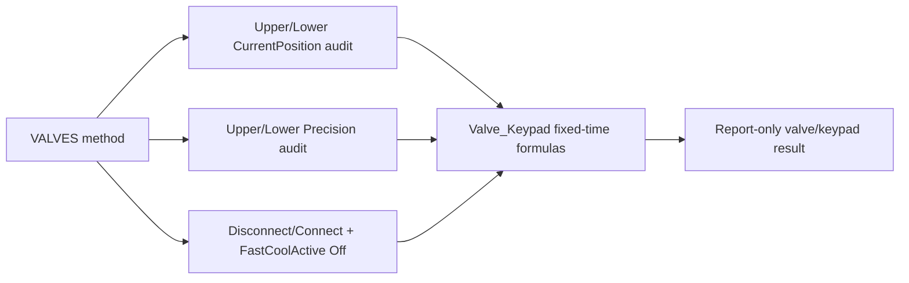

## Contract 4: DB Contract

### 4.1 DB Leaves

| Device | Injection | DB mapping status | Notes |
|---|---|---|---|
| VH-C10-A | `Valve` | no DB contract expected | `FOQResultLocations_V2.83.xls` has no mapped DB leaves for `TCC_VALVE_01`. |
| VC-C10-A | `Valve` | no DB contract expected | same as VH |
| VA-C10-A | `Valve` | no DB contract expected | same as VH, but report branch differs by lower-only method evidence |

### 4.2 DB Is Not the Evidence Driver

The lack of DB fields does not mean the test is irrelevant. For this injection,
the contract is:

```text
VALVES command flow
-> audit properties for valve position, precision, FastCool/keypad state
-> Valve_Keypad report sheet
-> no DB leaves in current FOQ mapping
```

## Contract 5: Config Requirement

| Requirement | VH-C10-A | VC-C10-A | VA-C10-A | Failure mode |
|---|---|---|---|---|
| `AUDIT.ColumnComp.ModelNo` source of truth | Required | Required | Required | Wrong branch/report template |
| `ColumnComp.UpperValve.CurrentPosition` | Required | Required | not used in decoded VA method | VC/VH upper branch cannot execute |
| `ColumnComp.LowerValve.CurrentPosition` | Required | Required | Required | lower branch cannot execute |
| `UpperValve.Precision` | Required | Required | not used in decoded VA method | VC/VH precision evidence missing |
| `LowerValve.Precision` | Required | Required | Required | lower precision evidence missing |
| `ColumnComp.Connect` / `Disconnect` / `Connected` | Required | Required | Required | keypad section cannot complete |
| `ColumnComp.FastCoolActive` / `FastCoolState` | Required | Required | Required | fast-cool keypad evidence missing |
| Position values `6_1` and `1_2` valid for configured valve type | Required | Required | Required for lower branch | method command rejected or wrong audit path |

Generation implication:

- Do not reuse the VC/VH dual-valve body for VA without checking that
  `UpperValve` exists.
- For a pure "periodic valve rotation" intent, the reusable core is only:
  `CurrentPosition` assignment plus optional precision logging.
- For full FOQ Valve/Keypad, preserve the operator message,
  disconnect/connect, connected wait, and FastCool reset.
- If report formulas remain fixed-time based, changing delays or command order
  requires report formula changes too.

## Contract 6: Open Verification

Items below are marked Open Verification Required until the listed evidence is
captured.

| # | Open Verification Required | Why it matters | Needed evidence | Likely source |
|---:|---|---|---|---|
| 1 | Exact `Valve_Keypad` workbook pass/fail cells | Current formula objects expose source cells, but result cells and criteria are not fully parsed | FormulaOne workbook parse for `Valve_Keypad` | report `SpreadSheetData` |
| 2 | VATCC `Valve_Keypad` report formulas | VA method is lower-only; VTCC dual-valve formulas cannot be assumed | VA report formula object extraction | `Report_VATCC_V1_01` |
| 3 | VC `CORRECT_ACCURACY_INJ_INSERTION` pass-action semantics on Valve row | Full sequence should preserve binding; standalone package may not require it | Processing method XML and pass-action trigger map | VC CMBX processing method payload |
| 4 | Keypad acceptance source | Method prompts operator and report reads FastCoolState, but exact external/internal criteria are not normalized | TD section and workbook criteria cells | FOQ TD, `Definitions`, `Valve_Keypad` workbook |
| 5 | Whether disconnect/connect is required for non-FOQ valve-cycling intent | Periodic valve rotation likely should not disconnect the device | User/test intent rule and CM operational guidance | intent tool design + CM command KB |

## VH / VC / VA Comparison

| Aspect | VH-C10-A | VC-C10-A | VA-C10-A |
|---|---|---|---|
| Production injection | `Valve` | `Valve` | `Valve` |
| Instrument method | `VALVES` | `VALVES` | `VALVES` |
| Valve branch | upper + lower | upper + lower | lower only |
| Processing method | `No_Integration` | `CORRECT_ACCURACY_INJ_INSERTION` | `No_Integration` |
| Report template | `Report_VTCC_V2_12` | `Report_VTCC_V2_12` | `Report_VATCC_V1_01` |
| DB fields | none | none | none |
| Generation status | reusable with dual-valve config check | reusable with dual-valve config check and processing binding preserved | reusable only as lower-valve branch |

## Generation Readiness

| Generation action | Status | Notes |
|---|---|---|
| Reuse full VH Valve row | ready after config validation | Preserve dual-valve method and `No_Integration`. |
| Reuse full VC Valve row | ready after config validation | Preserve `CORRECT_ACCURACY_INJ_INSERTION` until pass actions are decoded. |
| Reuse full VA Valve row | ready after config validation | Use lower-valve branch only. |
| Generate periodic upper/lower valve-cycling method | partial | Reuse `CurrentPosition` commands; omit keypad/disconnect unless requested. |
| Change timing/delays while keeping report | locked | Report reads fixed times such as `-0.05`, `0.095`, `0.19`, `0.9`; timing changes require report edits. |
| Add UpperValve to VA branch | locked | Requires confirmed VA hardware/config and report formulas. |

<a id="tcc-burnin"></a>
## B004: Burn-in black box

Build source name: `TCC_BURNIN_BLACK_BOX_DECOMPOSITION.md`

# TCC BurnIn Black Box Decomposition

Extraction date: 2026-07-10

Scope: TCC FOQ `VTCC_BurnIn` injection for `VH-C10-A`, `VC-C10-A`, and
`VA-C10-A`.

---
Test name: VTCC BurnIn
Models: VH-C10-A / VC-C10-A / VA-C10-A
Status: first black-box decomposition complete; exact TD duration/cycle
acceptance wording remains open verification
---

This document decomposes the `VTCC_BurnIn` injection as a generation contract.
BurnIn is a conditioning and stress-history method, not a report-formula-heavy
result test. Its purpose is to exercise the column compartment and temperature
sensor system through high/low/high thermal cycles before downstream precision,
accuracy, stability, and timing tests.

```text
Core method:
  start near 15 C
  acquire internal, debug, external thermometer, environment, and leak channels
  heat to model-dependent maximum
  cool to model-dependent minimum
  heat to maximum again
  hold at high temperature for 7200 s
  abort if external thermometers do not follow the heating behavior
```

The method records no RetTimes and has no DB field mapping in
`FOQResultLocations_V2.83.xls`. Its value is preconditioning and evidence that
the configured thermal/external thermometer setup is plausible.

## Evidence Sources

| Evidence | Source |
|---|---|
| Test intent node | `cmbx_data_explorer/docs/TCC_TEST_KNOWLEDGE_NODE_MODEL.md` |
| Injection workbench notes | `cmbx_data_explorer/docs/TCC_INJECTION_BY_INJECTION_REVERSE_WORKBENCH.md` |
| Required symbols | `cmbx_data_explorer/docs/TCC_REQUIRED_SYMBOL_MANIFEST.md` |
| Method flow, VH | `knowledge_base/tcc_reverse_probe/VH/6000001/BURNIN_embedded_method_flow.txt` |
| Method flow, VC | `knowledge_base/tcc_reverse_probe/VC/3000004/BURNIN_embedded_method_flow.txt` |
| Method flow, VA | `knowledge_base/tcc_reverse_probe/VA/0000003/BURNIN_embedded_method_flow.txt` |
| DB mapping | `foq/FOQResultLocations_V2.83.xls` |

## Executive Answer

1. The injection is `VTCC_BurnIn`.
2. The instrument method is `BURNIN`.
3. Processing method is `NO_INTEGRATION` for VA/VC/VH.
4. VH/VC/VA decoded flows are materially the same; the method itself branches
   internally using `ColumnComp.ModelNo`.
5. VH uses `Variables.GenericDouble1 = 5.0` and
   `Variables.GenericDouble2 = 120.0`.
6. VC/VA use `Variables.GenericDouble1 = 5.0` and
   `Variables.GenericDouble2 = 85.0`.
7. Initial nominal temperature is 15.0 C.
8. The leak sensor is turned off during BurnIn to avoid condensation-triggered
   alarms during fast heat/cool behavior.
9. Internal/debug channels, external thermometers, environment temperature, and
   leak board channels are acquired.
10. Trigger names are `T_Maximum`, `T_Minimum`, and `HoldTemp`.
11. Final high-temperature hold is `Delay 7200.0`.
12. The method aborts if external thermometer signals fail to track CC heating
    within the guard expression.

## Contract 1: Method Command

### 1.1 Device Branch Binding

| Device | Injection | Instrument Method | Processing Method | Report Template | Report Sheets | Status |
|---|---|---|---|---|---|---|
| VH-C10-A | `VTCC_BurnIn` | `BURNIN` | `NO_INTEGRATION` | `Report_VTCC_V2_12` | not mapped | sequence evidence closed |
| VC-C10-A | `VTCC_BurnIn` | `BURNIN` | `NO_INTEGRATION` | `Report_VTCC_V2_12` | not mapped | sequence evidence closed |
| VA-C10-A | `VTCC_BurnIn` | `BURNIN` | `NO_INTEGRATION` | `Report_VATCC_V1_01` | not mapped | sequence evidence closed |

### 1.2 Method Contract Summary

| Contract item | Evidence |
|---|---|
| RetTimes | not used |
| DB fields | not mapped |
| Start setpoint | `ColumnComp.CC.Temperature.Nominal = 15.0` |
| Ready window | `ColumnComp.CC.ReadyTempDelta = 3.0 C`, `ColumnComp.CC.EquilibrationTime = 0.5` |
| Temperature control | `ColumnComp.CC.TempCtrl = On` |
| PCC branch | `ColumnComp.CmdString Cmd="PCC.TempCtrl=0"` when `ColumnComp.ModelNo="VH-C10-A"` |
| Mode | `ColumnComp.CC.Mode = StillAir` |
| Cycle counter | `Variables.GenericFloat1 = 0`, then `GenericFloat1 = GenericFloat1 + 1` |
| VH range | min `5.0`, max `120.0` |
| VC/VA range | min `5.0`, max `85.0` |
| Unknown model behavior | message `Invalid ModelNo!` and `System.AbortQueue` |
| Leak alarm prevention | `ColumnComp.LiquidLeakSensor = Off` |
| High trigger | `System.Trigger "T_Maximum"` |
| Low trigger | `System.Trigger "T_Minimum"` |
| Cycle completion trigger | `System.Trigger "HoldTemp", Variables.GenericFloat1=2` |
| Final hold | `Delay 7200.0` |
| External thermometer guard | abort when external thermometer values do not track CC heating |

### 1.3 Model Branch

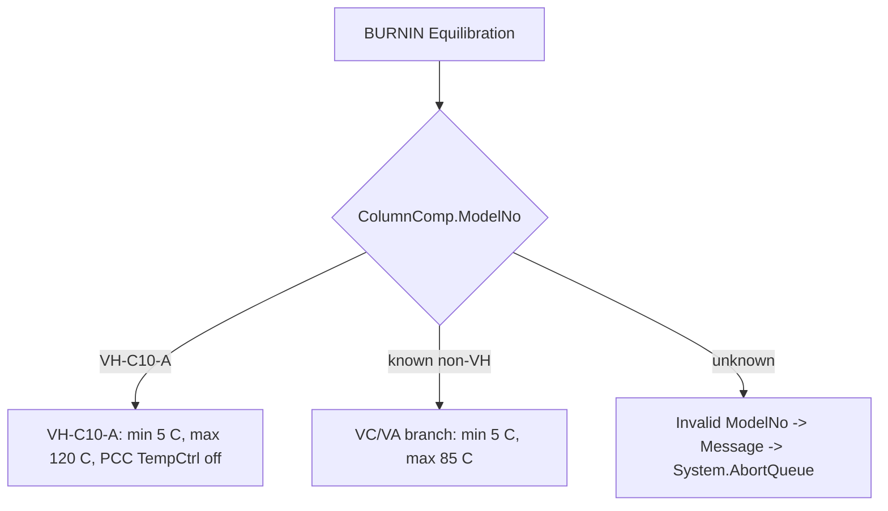

### 1.4 Thermal Cycle Flow

```yaml
BURNIN:
  setup:
    - set ReadyTempDelta: 3.0 C
    - set EquilibrationTime: 0.5
    - set TempCtrl: On
    - set CC mode: StillAir
    - set LiquidLeakSensor: Off
    - set initial nominal: 15.0 C
  inject_preparation:
    - Wait CC.TempReady
  start_run:
    - acquire internal CC temperature/debug channels
    - acquire external thermometer channels
    - acquire environment temperature
    - acquire LEDBoard leak channels
  run:
    - set nominal: maximum temperature
    - trigger T_Maximum when CC temperature reaches maximum - 0.5 C
    - set nominal: minimum temperature
    - trigger T_Minimum when CC temperature reaches minimum + 5.0 C
    - set nominal: maximum temperature
    - increment Variables.GenericFloat1
    - trigger HoldTemp when GenericFloat1 = 2
    - set nominal: maximum temperature
    - Delay 7200.0
    - acquisition off
    - End
    - external thermometer guard may abort queue
```

### 1.5 Acquired Channels

| Channel family | Channels |
|---|---|
| Main CC | `ColumnComp.CC_Temp`, `ColumnComp.CC_U_Temp_Actual`, `ColumnComp.CC_L_Temp_Actual`, `ColumnComp.CC_UCTL_TempRear_Actual` |
| PWM/debug | `ColumnComp.PWM_CCU_A`, `ColumnComp.PWM_CCU_B`, `ColumnComp.PWM_CCL_A`, `ColumnComp.PWM_CCL_B` |
| Fan | `ColumnComp.Fan_Rear_ActualRPM` |
| External thermometers | `Thermometer1.ExtTemp_UpperCC`, `Thermometer1.ExtTemp_LowerCC` |
| Environment | `Thermometer.Environment_Temperature` |
| Leak board | `ColumnComp.LEDBoard_LeakDiff`, `ColumnComp.LEDBoard_A13`, `ColumnComp.LEDBoard_A14` |

Data collection rate is set to `20` for the internal/debug/leak board channels
listed in the setup block.

### 1.6 Abort Guard

The method contains a post-cycle external thermometer plausibility check. If the
CC temperature is more than 5 C above either external thermometer signal, it
forces the LED bar color, shows a message about thermometer mounting/config, and
aborts the queue.

```text
CC.Temperature.Value - Thermometer1.ExtTemp_LowerCC.Signal > 5
OR
CC.Temperature.Value - Thermometer1.ExtTemp_UpperCC > 5
```

This is a configuration sanity check. It does not make BurnIn a report-value
calculation, but it is important for later tests because downstream temperature
methods assume the external thermometers are mounted and configured correctly.

## Contract 2: Processing Method

| Device | Processing Method | Meaning |
|---|---|---|
| VH-C10-A | `NO_INTEGRATION` | No integration or IRC processing. |
| VC-C10-A | `NO_INTEGRATION` | No integration or IRC processing. |
| VA-C10-A | `NO_INTEGRATION` | No integration or IRC processing. |

There is no BurnIn-specific IRC path. The method itself handles model branching,
triggering, and abort guard behavior.

## Contract 3: Report Formula

No direct report sheet or DB field is mapped for `VTCC_BurnIn` in the current
TCC contract. The report role is conditioning/audit evidence, not scalar result
calculation.

| Report item | Status |
|---|---|
| Report sheets | not mapped in TKN / DB mapping |
| Formula ID | `FORMULA_NOT_REQUIRED_TCC_BURNIN_CONDITIONING` |
| Direct formula objects | none required for DB contract |
| Workbook-derived result | not expected |

## Contract 4: DB Contract

| DB contract item | Status |
|---|---|
| Device-specific mapped DB fields | none observed |
| SQL type | not applicable |
| Precision/display rule | not applicable |

Current conclusion: `VTCC_BurnIn` has no DB output contract. It influences later
tests by creating a thermal history and validating thermometer behavior.

## Contract 5: Config Requirement

| Requirement | Why it matters |
|---|---|
| `ColumnComp.CC` temperature control available | Required for high/low/high cycling. |
| `ColumnComp.ModelNo` available | Selects 120 C vs 85 C high-limit branch and aborts if unknown. |
| PCC command path for VH | VH branch disables PCC control through `PCC.TempCtrl=0`. |
| External thermometers configured as real channels | Abort guard checks whether external thermometer signals rise with CC temperature. |
| Debug/internal channels available | Method acquires PWM, fan, rear temperature, leak board channels. |
| Leak sensor command available | BurnIn disables leak sensor during fast thermal cycling. |
| Long run duration acceptable | Method includes `Delay 7200.0`; scheduling/runtime must allow this conditioning period. |

## Contract 6: Open Verification

The items below are `Open Verification Required` before using BurnIn as a
parameterized generation template rather than a cloned method.

| # | Open item | Current evidence | Needed evidence | Likely source |
|---|---|---|---|---|
| 1 | Exact TD acceptance / duration wording | Method shows 7200 s high hold and trigger cycle logic | FOQ TD section wording for required BurnIn duration/cycles | FOQ TD |
| 2 | Whether `GenericFloat1=2` means two completed high-temperature events or another CM trigger nuance | Decoded flow increments once in visible Run sequence and trigger has Limit=1 | CM trigger execution semantics for repeated trigger blocks | Chromeleon method editor/help |
| 3 | Whether external thermometer abort guard should execute after `End` in all CM runtimes | Decoded flow lists `End` before the guard block | Runtime semantics of post-End method nodes | CM execution behavior |
| 4 | Whether single-test generated packages can omit BurnIn | Workbench says omit only if definition allows skipping preconditioning | User intent / TD requirement | intent tool rule |

## VH / VC / VA Comparison

| Model | Min | Max | PCC command | Processing | DB mapping | Meaning |
|---|---:|---:|---|---|---|---|
| VH-C10-A | 5 C | 120 C | `PCC.TempCtrl=0` | `NO_INTEGRATION` | none | high-temperature VH conditioning |
| VC-C10-A | 5 C | 85 C | not active unless ModelNo branch matches VH | `NO_INTEGRATION` | none | standard VC conditioning |
| VA-C10-A | 5 C | 85 C | not active unless ModelNo branch matches VH | `NO_INTEGRATION` | none | standard VA conditioning |

## Generation Readiness

| Use case | Readiness | Notes |
|---|---|---|
| Clone/select full FOQ package | reusable | Keep before calibration/accuracy/precision family. |
| Generate single Accuracy 40 C method | optional / usually omit | Omitting changes preconditioning assumptions; intent tool must surface this. |
| Generate stress/conditioning-only method | partial | Core flow known; trigger-cycle semantics and post-End guard need live verification before parameterized rewriting. |
| DB upload/result output | not applicable | No mapped DB result contract. |

<a id="tcc-calibration"></a>
## B005: Calibration black box

Build source name: `TCC_CALIBRATION_BLACK_BOX_DECOMPOSITION.md`

# TCC Temperature Calibration Black Box Decomposition

Extraction date: 2026-07-10

Scope: TCC FOQ Temperature Calibration for `VH-C10-A`, `VC-C10-A`, and `VA-C10-A`.

---
测试名称: Temperature Calibration
型号: VH-C10-A / VC-C10-A / VA-C10-A
状态: 已完成第一轮黑盒拆解，processing method business rows remain open verification
---

This document decomposes the Temperature Calibration test as a generation contract. It follows the same contract style as `TCC_ACCURACY_BLACK_BOX_DECOMPOSITION.md`, but the key distinction is important:

```text
Temperature Accuracy validates the controlled temperature.
Temperature Calibration changes the instrument's internal calibration variables.
```

The calibration method writes calibration point/deviation values into `ColumnComp.CC.TempCalibration...` audit/device properties. The report then checks that those values were transferred and that the low-temperature reach condition is acceptable.

## Evidence Sources

| Evidence | Source |
|---|---|
| Test intent node | `cmbx_data_explorer/docs/TCC_TEST_KNOWLEDGE_NODE_MODEL.md` |
| FOQ TD extracted text | `knowledge_base/foq_td_extracted/FOQ_Testdescription_VX-C10-A.text.txt` |
| Decoded method flow, VH | `knowledge_base/tcc_reverse_probe/VH/6000001/TEMPERATURE_CALIBRATION_embedded_method_flow.txt` |
| Decoded method flow, VC | `knowledge_base/tcc_reverse_probe/VC/3000004/TEMPERATURE_CALIBRATION_embedded_method_flow.txt` |
| Decoded method flow, VA | `knowledge_base/tcc_reverse_probe/VA/0000003/TEMPERATURE_CALIBRATION_embedded_method_flow.txt` |
| Method contract summary | `knowledge_base/tcc_method_contracts/*_method_contracts.tsv` |
| Processing method probe | `knowledge_base/tcc_processing_probe/*/*CORRECT_ACCURACY_INJ_INSERTION*_summary.txt`, `NO_INTEGRATION_summary.txt`, and `knowledge_base/tcc_processing_probe/README.md` |
| Report formula objects | `knowledge_base/tcc_report_formula_objects_vh_6000001_all_sheets.tsv` |
| Formula reverse notes | `cmbx_data_explorer/CM_FORMULA_REVERSE_ENGINEERING.md` |
| DB mapping | `foq/FOQResultLocations_V2.83.xls` |

## Executive Answer

1. Temperature Calibration uses eight calibration setpoints. `VH-C10-A` uses `120, 100, 80, 60, 40, 20, 10, 5 deg C`; `VC-C10-A` and `VA-C10-A` use `85, 70, 55, 40, 30, 20, 10, 5 deg C`.
2. It depends on both internal CC sensors and external calibrated thermometers. The method calculates deviation as `ExtTemp_UpperCC.Signal-CC.TempActual_Upper` and `ExtTemp_LowerCC.Signal-CC.TempActual_Lower`, then writes those values into `CCCalib.CalDevU/Lxx` and finally into `ColumnComp.CC.TempCalibrationDeviationUpper/LowerN`.
3. RetTimes are not used the same way as Accuracy. Accuracy RetTimes anchor stable external averaging windows; Calibration RetTimes mark when each calibration trigger fires and the internal/external calibration values are captured.
4. `VH-C10-A` and `VC-C10-A` sequence rows bind `Temperature Calibration` to `CORRECT_ACCURACY_INJ_INSERTION`; `VA-C10-A` binds it to `NO_INTEGRATION`. The current processing XML extractor exposes layout/context and comments, but not the full SST/IRC action rows, so exact pass-action behavior remains open verification.
5. The report sheet `Temp_Calib_Internal` reads calibration point/deviation audit properties, RetTime durations, external thermometer drift windows, environment temperature, and low external temperature minima. DB fields map mostly to `D27:D43`, `C15:C22`, `D15:D22`, and `E15:E22`.
6. Calibration is a practical prerequisite for later temperature tests because it updates the TCC internal upper/lower calibration variables. The FOQ TD explicitly says large calibration deviations abort and require repeated calibration or repair.

## Contract 1: Method Command

### 1.1 Test Intent

Temperature Calibration calibrates the internal upper and lower column-compartment temperature sensors with external calibrated thermometers at model-specific setpoints.

The FOQ TD states that the calibration parameter is determined for upper and lower compartments individually by comparing internal sensor readings with external calibrated thermometer readings. The decoded CMBX method implements this as:

```text
Upper deviation = ExtTemp_UpperCC.Signal - CC.TempActual_Upper
Lower deviation = ExtTemp_LowerCC.Signal - CC.TempActual_Lower
```

### 1.2 Method Binding

| Model | Injection | Instrument method | Method stages |
|---|---|---|---|
| `VH-C10-A` | `Temperature Calibration` | `TEMPERATURE_CALIBRATION` | `InstrumentSetup`, `Equilibration`, `StartRun`, `Run`, `StopRun` |
| `VC-C10-A` | `Temperature Calibration` | `TEMPERATURE_CALIBRATION` | `InstrumentSetup`, `Equilibration`, `StartRun`, `Run`, `StopRun` |
| `VA-C10-A` | `Temperature Calibration` | `TEMPERATURE_CALIBRATION` | `InstrumentSetup`, `Equilibration`, `StartRun`, `Run`, `StopRun` |

### 1.3 Global Setup

The decoded method initializes readiness, temperature control, acquisition, calibration values, and RetTimes.

| Area | Evidence | Meaning |
|---|---|---|
| Ready threshold | `ColumnComp.CC.ReadyTempDelta = 0.3 [deg C]` | Calibration trigger readiness threshold |
| Ready time | `ColumnComp.CC.EquilibrationTime = 0.1 [min]` | Initial ready timing |
| Temperature control | `ColumnComp.CC.TempCtrl = On` | Enables CC temperature control |
| VH PCC branch | `ColumnComp.CmdString Cmd="PCC.TempCtrl=0"` when `ColumnComp.ModelNo="VH-C10-A"` | Disables PCC temp control for VH calibration |
| Air mode | `ColumnComp.CC.Mode = StillAir` | Sets compartment operating mode |
| Leak sensor | `ColumnComp.LiquidLeakSensor = Off` | Avoids leak false alarms during large temperature swings |
| Calibration points reset | `ColumnComp.CC.TempCalibrationPointUpper1..10 = Off` and lower equivalents | Clears active calibration transfer slots before the run |
| Work variables reset | `CCCalib.CalPointU01..08`, `CalDevU01..08`, `CalPointL01..08`, `CalDevL01..08 = 0` | Clears generated calibration values |
| RetTime reset | `RetTimes.RetTime1..RetTime8 = 0` | Clears all calibration trigger anchors |

### 1.4 Model-Dependent Temperature Ladder

The method fills `Variables.GenericDouble0..8`. `GenericDouble0` is the pre-start temperature used to ensure the first trigger condition is initially false; `GenericDouble1..8` are the actual calibration points.

| Model branch | Pre-start `GenericDouble0` | Point 1 | Point 2 | Point 3 | Point 4 | Point 5 | Point 6 | Point 7 | Point 8 |
|---|---:|---:|---:|---:|---:|---:|---:|---:|---:|
| `VH-C10-A` | 115 | 120 | 100 | 80 | 60 | 40 | 20 | 10 | 5 |
| `VC-C10-A` / `VA-C10-A` | 80 | 85 | 70 | 55 | 40 | 30 | 20 | 10 | 5 |

The method sets `Variables.GenericBool0 = 1` for VH and `0` for VC/VA. The exact downstream use of `GenericBool0` in report/workbook logic is not fully decoded, but it is part of the method contract and appears in method coverage.

### 1.5 Acquisition Channels

The method turns on these key channels in `StartRun`.

| Channel | Role |
|---|---|
| `ColumnComp.CC_Temp` | Main CC temperature signal, used by report `chm.signalValue(...)` |
| `ColumnComp.CC_U_Temp_Actual` | Internal upper actual temperature evidence |
| `ColumnComp.CC_L_Temp_Actual` | Internal lower actual temperature evidence |
| `ColumnComp.CC_UCTL_TempRear_Actual` | Rear/control temperature debug evidence |
| `Thermometer1.ExtTemp_UpperCC` | External upper thermometer, used in calibration deviation and drift |
| `Thermometer1.ExtTemp_LowerCC` | External lower thermometer, used in calibration deviation and drift |
| `Thermometer.Environment_Temperature` | Ambient/environment reference, used by report |
| PWM/fan/leak debug channels | Operational evidence and diagnostic context |

### 1.6 Per-Point Trigger Logic

For each calibration point the method:

1. Sets `ColumnComp.CC.Temperature.Nominal` to the model-specific `Variables.GenericDoubleN`.
2. Waits for `ColumnComp.CC.TempReady`.
3. Runs a `System.Trigger` with point-specific `TrueTime`.
4. Captures internal upper/lower actual temperatures into `CCCalib.CalPointU/Lxx`.
5. Computes deviations using external minus internal temperature.
6. Writes `RetTimes.RetTimeN = System.Retention`.
7. Aborts if any captured deviation is outside the `-4 K` to `+4 K` range.

| Point | VH target | VC/VA target | Trigger name | Trigger true time | Captured RetTime | Calibration values |
|---|---:|---:|---|---:|---|---|
| 1 | 120 | 85 | `T120/85` | 850 s | `RetTimes.RetTime1` | `CCCalib.CalPointU01`, `CalDevU01`, `CalPointL01`, `CalDevL01` |
| 2 | 100 | 70 | `T100/70` | 850 s | `RetTimes.RetTime2` | `CCCalib.CalPointU02`, `CalDevU02`, `CalPointL02`, `CalDevL02` |
| 3 | 80 | 55 | `T80/55` | 850 s | `RetTimes.RetTime3` | `CCCalib.CalPointU03`, `CalDevU03`, `CalPointL03`, `CalDevL03` |
| 4 | 60 | 40 | `T60/40` | 850 s | `RetTimes.RetTime4` | `CCCalib.CalPointU04`, `CalDevU04`, `CalPointL04`, `CalDevL04` |
| 5 | 40 | 30 | `T40/30` | 1150 s | `RetTimes.RetTime5` | `CCCalib.CalPointU05`, `CalDevU05`, `CalPointL05`, `CalDevL05` |
| 6 | 20 | 20 | `T20` | 850 s | `RetTimes.RetTime6` | `CCCalib.CalPointU06`, `CalDevU06`, `CalPointL06`, `CalDevL06` |
| 7 | 10 | 10 | `T10` | 850 s | `RetTimes.RetTime7` | `CCCalib.CalPointU07`, `CalDevU07`, `CalPointL07`, `CalDevL07` |
| 8 | 5 | 5 | `T05` | 850 s | `RetTimes.RetTime8` | `CCCalib.CalPointU08`, `CalDevU08`, `CalPointL08`, `CalDevL08` |

The point-5 true time is longer. The FOQ TD explains this as 1150 s for `40 deg C` on VH or `30 deg C` on VC/VA.

### 1.7 Calibration Transfer and Fallback

After successful capture, the method transfers work variables into device calibration properties:

```text
ColumnComp.CC.TempCalibrationPointUpper1..8 = CCCalib.CalPointU01..08
ColumnComp.CC.TempCalibrationDeviationUpper1..8 = CCCalib.CalDevU01..08
ColumnComp.CC.TempCalibrationPointLower1..8 = CCCalib.CalPointL01..08
ColumnComp.CC.TempCalibrationDeviationLower1..8 = CCCalib.CalDevL01..08
```

The decoded flow includes a fallback block for missing 5 or 10 deg C triggers, most likely at high ambient temperature:

```text
If calibration points 1..6 exist:
  transfer points 1..6
Else:
  abort: "Column oven could not be calibrated at 20 deg C or higher."

If point 7 is missing:
  set point 7 to 10 deg C and reuse the 20 deg C deviation.

If point 8 is missing:
  set point 8 to 5 deg C and reuse the 20 deg C deviation.
```

This matches the FOQ TD statement that when low calibration setpoints cannot be measured directly, the 20 deg C calibration parameter is used because the below-20 deg C relationship is non-linear and should not be extrapolated.

### 1.8 Method Flow Diagram

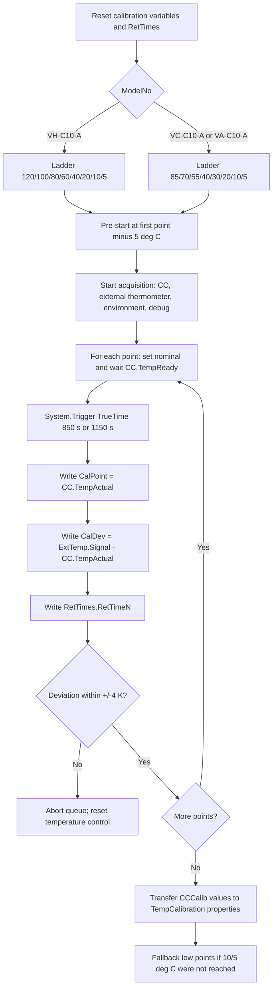

## Contract 2: Processing Method

### 2.1 Sequence Binding

| Model | Injection | Processing method | Observed meaning |
|---|---|---|---|
| `VH-C10-A` | `Temperature Calibration` | `CORRECT_ACCURACY_INJ_INSERTION` | Context links Calibration and Accuracy; integration inhibited |
| `VC-C10-A` | `Temperature Calibration` | `CORRECT_ACCURACY_INJ_INSERTION` | Context links Calibration and Accuracy; integration inhibited |
| `VA-C10-A` | `Temperature Calibration` | `NO_INTEGRATION` | No data integration; no observed correction-insertion binding on this row |

The `CORRECT_ACCURACY_INJ_INSERTION` summary contains readable context:

```text
Temperature Accuracy_H
ACCURACY_IRC_STOP_H
TEMPERATURE_ACCURACY
...
Temperature Calibration
CORRECT_ACCURACY_INJ_INSERTION
TEMPERATURE_CALIBRATION
Inhibits the integration for all channels
```

### 2.2 Processing Interpretation

The currently decoded evidence supports these statements:

| Statement | Status |
|---|---|
| `CORRECT_ACCURACY_INJ_INSERTION` is associated with `Temperature Calibration` in VH/VC sequence rows. | Verified |
| The processing method inhibits integration for all channels. | Verified from readable comment |
| The processing method is connected to accuracy/correction injection context. | Verified as sequence-context evidence |
| The exact pass-action row, insertion rule, and whether it inserts `Temperature Accuracy_H/C` automatically after Calibration are decoded. | Open Verification Required |
| `VA-C10-A` Calibration uses `NO_INTEGRATION` in TKN/sequence evidence. | Verified |

Generation implication:

```text
For cloning an existing FOQ flow, preserve the processing method payload as-is.
For generating a new method package, do not synthesize CORRECT_ACCURACY_INJ_INSERTION rules until the processing method row serialization is decoded or manually confirmed in CM.
```

## Contract 3: Report Formula

### 3.1 Report Binding

| Model | Report template | Sheet | Role |
|---|---|---|---|
| `VH-C10-A` | `Report_VTCC_V2_12` | `Temp_Calib_Internal` | Calibration report / internal diagnostic sheet |
| `VC-C10-A` | `Report_VTCC_V2_12` | `Temp_Calib_Internal` | Calibration report / internal diagnostic sheet |
| `VA-C10-A` | `Report_VATCC_V1_01` | `Temp_Calib_Internal` | Calibration report / internal diagnostic sheet |

### 3.2 Formula Families

The report formula objects from `Report_VTCC_V2_12` show the following formula families.

| Cell family | Formula pattern | Fixed channel | Meaning |
|---|---|---|---|
| `B15:B21` | `chm.signalValue(AUDIT.RetTimeN(1,"forward"))` | `CC_Temp` | CC temperature signal at RetTime1..7 |
| `J14` | `chm.signalValue(AUDIT.RetTime8(1,"forward")-1)` | `CC_Temp` | CC temperature signal near RetTime8 path |
| `C15:C21` | `AUDIT.RetTimeN - AUDIT.RetTime(N-1)` | none | Duration between calibration triggers; `C15` is absolute RetTime1 |
| `J15` | `AUDIT.RetTime8 - AUDIT.RetTime7` | none | RetTime8 duration |
| `D15:D21` | `chm.drift(AUDIT.RetTimeN-0.5,AUDIT.RetTimeN)` | `ExtTemp_UpperCC` | External upper thermometer drift over final 0.5 min before RetTime1..7 |
| `J16` | `chm.drift(AUDIT.RetTime8-0.5,AUDIT.RetTime8)` | `ExtTemp_UpperCC` | External upper drift before RetTime8 |
| `E15:E21` | same drift pattern | `ExtTemp_LowerCC` | External lower thermometer drift over final 0.5 min before RetTime1..7 |
| `J17` | same drift pattern | `ExtTemp_LowerCC` | External lower drift before RetTime8 |
| `B27:B34` | `audit.ColumnComp.CC.TempCalibrationPointUpperN(1000,"backward")` | mostly none / first object has `ExtTemp_UpperCC` fixed channel artifact | Upper calibration point transferred to device |
| `D27:D34` | `audit.ColumnComp.CC.TempCalibrationDeviationUpperN(1000,"backward")` | none | Upper calibration deviation transferred to device |
| `B36:B43` | `audit.ColumnComp.CC.TempCalibrationPointLowerN(1000,"backward")` | none | Lower calibration point transferred to device |
| `D36:D43` | `audit.ColumnComp.CC.TempCalibrationDeviationLowerN(1000,"backward")` | none | Lower calibration deviation transferred to device |
| `C45` | `chm.sig_value("average")` | `Environment_Temperature` | Average ambient/environment temperature |
| `K45` | `chm.sig_value("min")` | `ExtTemp_UpperCC` | Minimum external upper temperature across the run |
| `K46` | `chm.sig_value("min")` | `ExtTemp_LowerCC` | Minimum external lower temperature across the run |

### 3.3 Formula Meaning

Temperature Calibration report evaluation has three layers:

1. **Trigger timing evidence**: RetTimes and RetTime deltas prove each calibration point was reached and held for the expected trigger window.
2. **External stability evidence**: external upper/lower drift in the final half minute before each RetTime checks the reference thermometer behavior around each transfer.
3. **Transfer evidence**: audit reads of `TempCalibrationPoint...` and `TempCalibrationDeviation...` prove the method actually transferred calibration values into the TCC calibration properties.

The FOQ TD adds a low-temperature reach rule:

```text
The report passes calibration only if the lowest external measured compartment temperatures
are either 5.0 deg C or lower, or 18 deg C below ambient.
If the 5 deg C point was not skipped but deviations were positive, those deviations are
subtracted from the lowest external measured temperatures for this reach check.
```

Open verification: the workbook-derived pass/fail formula for that low-temperature reach rule is not fully normalized into a reusable formula ID yet. The direct SheetObject formulas above are verified.

### 3.4 Report Formula Flow

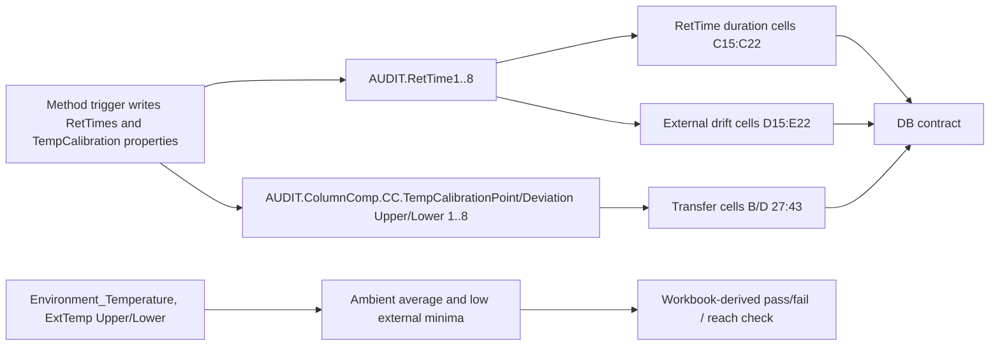

## Contract 4: DB Contract

### 4.1 VH-C10-A DB Mapping

| Field family | DB fields | Report cells | Source meaning |
|---|---|---|---|
| Calibration deviation, upper | `TempCal120_U`, `TempCal100_U`, `TempCal80_U`, `TempCal60_U`, `TempCal40_U`, `TempCal20_U`, `TempCal10_U`, `TempCal5_U` | `D27:D34` | `TempCalibrationDeviationUpper1..8` |
| Calibration deviation, lower | `TempCal120_L`, `TempCal100_L`, `TempCal80_L`, `TempCal60_L`, `TempCal40_L`, `TempCal20_L`, `TempCal10_L`, `TempCal5_L` | `D36:D43` | `TempCalibrationDeviationLower1..8` |
| Time between points | `TimeCal120`, `TimeCal100`, `TimeCal80`, `TimeCal60`, `TimeCal40`, `TimeCal20`, `TimeCal10`, `TimeCal05` | `C15:C22` | RetTime1 absolute and RetTime deltas through RetTime8 |
| External upper drift | `Slope_Cal120_U`, `Slope_Cal100_U`, `Slope_Cal80_U`, `Slope_Cal60_U`, `Slope_Cal40_U`, `Slope_Cal20_U`, `Slope_Cal10_U`, `Slope_Cal05_U` | `D15:D22` | `ExtTemp_UpperCC` drift windows |
| External lower drift | `Slope_Cal120_L`, `Slope_Cal100_L`, `Slope_Cal80_L`, `Slope_Cal60_L`, `Slope_Cal40_L`, `Slope_Cal20_L`, `Slope_Cal10_L`, `Slope_Cal05_L` | `E15:E22` | `ExtTemp_LowerCC` drift windows |

### 4.2 VC-C10-A / VA-C10-A DB Mapping

| Field family | DB fields | Report cells | Source meaning |
|---|---|---|---|
| Calibration deviation, upper | `TempCal85_U`, `TempCal70_U`, `TempCal55_U`, `TempCal40_U`, `TempCal30_U`, `TempCal20_U`, `TempCal10_U`, `TempCal5_U` | `D27:D34` | `TempCalibrationDeviationUpper1..8` |
| Calibration deviation, lower | `TempCal85_L`, `TempCal70_L`, `TempCal55_L`, `TempCal40_L`, `TempCal30_L`, `TempCal20_L`, `TempCal10_L`, `TempCal5_L` | `D36:D43` | `TempCalibrationDeviationLower1..8` |
| Time between points | `TimeCal85`, `TimeCal70`, `TimeCal55`, `TimeCal40`, `TimeCal30`, `TimeCal20`, `TimeCal10`, `TimeCal05` | `C15:C22` | RetTime1 absolute and RetTime deltas through RetTime8 |
| External upper drift | `Slope_Cal85_U`, `Slope_Cal70_U`, `Slope_Cal55_U`, `Slope_Cal40_U`, `Slope_Cal30_U`, `Slope_Cal20_U`, `Slope_Cal10_U`, `Slope_Cal05_U` | `D15:D22` | `ExtTemp_UpperCC` drift windows |
| External lower drift | `Slope_Cal85_L`, `Slope_Cal70_L`, `Slope_Cal55_L`, `Slope_Cal40_L`, `Slope_Cal30_L`, `Slope_Cal20_L`, `Slope_Cal10_L`, `Slope_Cal05_L` | `E15:E22` | `ExtTemp_LowerCC` drift windows |

### 4.3 DB Contract Interpretation

The `TempCal...` DB fields are deviation values, not the calibration point setpoints. For example:

```text
VH TempCal120_U -> Temp_Calib_Internal!D27
D27 -> audit.ColumnComp.CC.TempCalibrationDeviationUpper1(1000,"backward")
method writes TempCalibrationDeviationUpper1 from CCCalib.CalDevU01
CCCalib.CalDevU01 = ExtTemp_UpperCC.Signal - CC.TempActual_Upper
```

That is the critical source chain for upload validation:

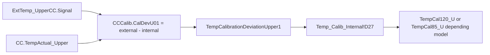

## Contract 5: Config Requirement

| Requirement | Required for | Evidence / reason |
|---|---|---|
| `ColumnComp` with `CC` temperature control | All models | Method sets `ColumnComp.CC.TempCtrl`, `Temperature.Nominal`, `TempReady`, actual upper/lower properties |
| External calibrated thermometers configured as `Thermometer1.ExtTemp_UpperCC` and `Thermometer1.ExtTemp_LowerCC` | All models | Method uses external signal minus internal actual temperature for calibration deviations |
| Environment thermometer channel `Thermometer.Environment_Temperature` | All models | Report reads ambient average; FOQ low-temperature reach rule uses ambient relationship |
| Debug/acquisition channels available | All models | Method starts CC, PWM, fan, leak/debug channels; report requires at least temperature/external channels for formulas |
| VH PCC command symbol | `VH-C10-A` | Method sends `PCC.TempCtrl=0` through `ColumnComp.CmdString` for VH |
| Calibration write access to `ColumnComp.CC.TempCalibrationPoint/Deviation...` | All models | Method transfers calibration values into device calibration properties |
| Valid ambient/thermal setup | All models | FOQ TD allows fallback for 10/5 deg C only under high ambient; low-temperature reach is report-checked |
| Processing method payload preservation | VH/VC first-phase clone/generation | `CORRECT_ACCURACY_INJ_INSERTION` business rows not fully decoded |

## Contract 6: Open Verification

| # | Uncertain point | Current evidence | Needed evidence | Likely source |
|---|---|---|---|---|
| 1 | Exact `CORRECT_ACCURACY_INJ_INSERTION` pass-action / insertion rule | Sequence context and comment are visible, but XML payload mostly exposes UI layout | Decode Processing Method SST/IRC rows or inspect in CM UI | `.procmeth` embedded XML, CM processing method editor |
| 2 | Whether VH/VC Calibration processing method automatically inserts Accuracy or only binds correction context | Names and context imply correction-insertion, but exact action row not parsed | Direct CM screenshot/export of Pass Action table | CM UI, serialized procmeth row model |
| 3 | Workbook-derived pass/fail formula for low-temperature reach | TD describes rule; direct cells `C45`, `K45`, `K46` are known | FormulaOne workbook extraction for pass/fail cells around `Temp_Calib_Internal` | Report `SpreadSheetData` |
| 4 | Display precision for all Calibration DB fields | DB cells and direct formulas are known | Number formats from workbook, or exported CM report samples | FormulaOne workbook, XLS export |
| 5 | `Variables.GenericBool0` downstream role | Method sets it by model branch and coverage captures it | Workbook or method branch reference that consumes it | decoded method/report workbook |
| 6 | VA-specific report differences in `Report_VATCC_V1_01` | TKN maps VA to same sheet name; VTCC formulas verified | Extract VA report formula objects and compare with VTCC formulas | VA CMBX report object |

## VH / VC / VA Comparison

| Topic | `VH-C10-A` | `VC-C10-A` | `VA-C10-A` |
|---|---|---|---|
| Calibration ladder | 120/100/80/60/40/20/10/5 | 85/70/55/40/30/20/10/5 | 85/70/55/40/30/20/10/5 |
| Pre-start temperature | 115 deg C | 80 deg C | 80 deg C |
| Point with 1150 s true time | 40 deg C | 30 deg C | 30 deg C |
| Processing method | `CORRECT_ACCURACY_INJ_INSERTION` | `CORRECT_ACCURACY_INJ_INSERTION` | `NO_INTEGRATION` |
| Report template | `Report_VTCC_V2_12` | `Report_VTCC_V2_12` | `Report_VATCC_V1_01` |
| DB high fields | `TempCal120`, `TempCal100`, `TempCal80`, `TempCal60` | `TempCal85`, `TempCal70`, `TempCal55`, `TempCal40` | `TempCal85`, `TempCal70`, `TempCal55`, `TempCal40` |
| VH-only behavior | Disables PCC temp control | Not applicable | Not applicable |

## Dependency and Generation Notes

### Relationship to Later Tests

Temperature Calibration is upstream of later temperature tests because it writes the module calibration variables that make internal upper/lower CC temperature signals meaningful.

| Later test | Dependency interpretation |
|---|---|
| Temperature Accuracy | Validates the corrected temperature behavior after Calibration; VH/VC processing context ties Calibration and Accuracy together |
| Temperature Stability | Uses corrected thermal control and external thermometer evidence; depends on trustworthy calibration state |
| Temperature Precision | Uses external thermometer repeatability at repeated setpoints; calibration state affects CC control quality |
| HeatUp / CoolDown | Uses CC readiness and RetTimes during thermal transitions; calibration affects readiness/control correctness |
| PCC, VH-only | Separate PCC channel, but same module environment and VH branch configuration matter |

### Generation Rules

For a future generated Calibration method:

1. Use model source of truth `AUDIT.ColumnComp.ModelNo`; do not infer model from filename.
2. Select ladder by `ModelNo` exactly.
3. Initialize and clear all `CCCalib` and `RetTimes.RetTime1..8`.
4. Acquire external upper/lower thermometer channels throughout the run.
5. Calculate deviation from external calibrated thermometer minus internal actual CC temperature.
6. Abort if any calibration deviation is outside `-4 K` to `+4 K`.
7. Transfer calibration points/deviations into `ColumnComp.CC.TempCalibrationPoint/DeviationUpper/Lower1..8`.
8. Preserve `CORRECT_ACCURACY_INJ_INSERTION` processing payload for VH/VC until its pass-action row format is decoded.
9. Use `Temp_Calib_Internal` report mapping and model-specific DB field family.

### Minimum Answer Checklist

| Question | Answer |
|---|---|
| Temperature Calibration 的温度阶梯是什么？ | VH: 120/100/80/60/40/20/10/5; VC/VA: 85/70/55/40/30/20/10/5 |
| VH / VC / VA 是否有差异？ | Yes: ladder, pre-start temperature, point-5 true time target, processing method, report template |
| Calibration 是否依赖外部温度计？ | Yes. It uses external upper/lower thermometer signal minus internal upper/lower CC actual temperature to calculate calibration deviations. |
| RetTime 锚定逻辑是否与 Accuracy 相同？ | No. Calibration RetTimes anchor trigger/capture moments for calibration transfer and report timing/drift checks; Accuracy RetTimes anchor external averaging windows for observed temperature. |
| Processing Method 是什么？ | VH/VC: `CORRECT_ACCURACY_INJ_INSERTION`; VA: `NO_INTEGRATION`. Exact insertion/pass action remains open verification. |
| Report 公式和 DB 字段映射是什么？ | `Temp_Calib_Internal`: deviations `D27:D43`, times `C15:C22`, slopes `D15:E22`, calibration points `B27:B43`, ambient/min cells `C45/K45/K46`. |
| Calibration 与后续测试的依赖是什么？ | It updates CC calibration variables and is therefore upstream of Accuracy, Stability, Precision, and thermal transition tests. |

<a id="tcc-accuracy"></a>
## B006: Accuracy black box

Build source name: `TCC_ACCURACY_BLACK_BOX_DECOMPOSITION.md`

# TCC Temperature Accuracy Black Box Decomposition

Extraction date: 2026-07-09

Scope: TCC FOQ Temperature Accuracy for `VH-C10-A`, `VC-C10-A`, and `VA-C10-A`.

This document decomposes the Temperature Accuracy test as a generation contract. The goal is not only to know which DB field is filled, but to understand what the method commands do, when the raw data becomes valid, how IRC/processing is bound, how the report formulas read raw/audit evidence, and what remains unverifiable.

## Evidence Sources

| Evidence | Source |
|---|---|
| Test intent node | `cmbx_data_explorer/docs/TCC_TEST_KNOWLEDGE_NODE_MODEL.md` |
| Decoded method flow, VH | `knowledge_base/tcc_reverse_probe/VH/6000001/TEMPERATURE_ACCURACY_embedded_method_flow.txt` |
| Decoded method flow, VC | `knowledge_base/tcc_reverse_probe/VC/3000004/TEMPERATURE_ACCURACY_embedded_method_flow.txt` |
| Decoded method flow, VA | `knowledge_base/tcc_reverse_probe/VA/0000003/TEMPERATURE_ACCURACY_embedded_method_flow.txt` |
| Method contract summary | `knowledge_base/tcc_method_contracts/*_TEMPERATURE_ACCURACY_contract.md` |
| Processing method probe | `knowledge_base/tcc_processing_probe/*/*ACCURACY_IRC_STOP*_summary.txt` and `knowledge_base/tcc_processing_probe/README.md` |
| Report formula objects | `knowledge_base/tcc_report_formula_objects_vh_6000001.tsv` |
| Formula reverse notes | `cmbx_data_explorer/CM_FORMULA_REVERSE_ENGINEERING.md` |
| DB mapping | `foq/FOQResultLocations_V2.83.xls` |

## Executive Answer

1. The method runs a five-point setpoint ladder. `VH-C10-A` uses `10, 20, 40, 80, 120 deg C`; `VC-C10-A` and `VA-C10-A` use `10, 20, 40, 60, 85 deg C`.
2. External thermometer data is continuously acquired from `Thermometer1.ExtTemp_LowerCC` and `Thermometer1.ExtTemp_UpperCC`. A RetTime is written only after `ColumnComp.CC.TempReady` and both external probes are stable.
3. The report does not read an instant value at the RetTime. It averages each external thermometer over `RetTimeN - 1.0` to `RetTimeN - 0.2` minutes, then derives the larger absolute deviation from the nominal setpoint.
4. The processing methods `ACCURACY_IRC_STOP_H` and `ACCURACY_IRC_STOP_C` are bound to the Accuracy injections and carry a comment that integration is inhibited and the sequence is stopped if the accuracy test fails. The exact SST/IRC row business rule is still not decoded from the current XML payloads.
5. The primary model difference is the high-temperature branch and report template: `VH-C10-A` uses `Temperature Accuracy_H` and `Report_VTCC_V2_12`; `VC-C10-A` uses `Temperature Accuracy_C` and `Report_VTCC_V2_12`; `VA-C10-A` uses `Temperature Accuracy_C` and `Report_VATCC_V1_01`.

## Contract 1: FOQ Test Intent

Temperature Accuracy verifies how far the real column-compartment temperature is from the requested nominal setpoint. The reference is the external thermometer, not only the TCC internal control temperature.

| Field | Value |
|---|---|
| TestKnowledgeNode | `TCC_ACC_01` |
| Test name | Temperature Accuracy |
| Formula ID | `FORMULA_TCC_TEMP_ACCURACY_MAX_DEVIATION` |
| Acceptance rule | External: max absolute temperature deviation <= `Definitions!Temperature Accuracy` |
| Core raw sources | `ExtTemp_LowerCC`, `ExtTemp_UpperCC` |
| Core audit sources | `AUDIT.RetTime1..5`, `AUDIT.ColumnComp.CC.Temperature.Nominal(...)` |

Knowledge interpretation:

```text
Accuracy is not "read the temperature after SET".
It is:
  set nominal target
  wait for controller readiness
  verify both external thermometer probes are stable
  write RetTime as a stable-window anchor
  let the report average the preceding settled raw window
  compare the worse external probe deviation against the acceptance limit
```

## Contract 2: Sequence and Injection Binding

| Model | Injection | Instrument method | Processing method | Report template | Report sheet | DB fields |
|---|---|---|---|---|---|---|
| `VH-C10-A` | `Temperature Accuracy_H` | `TEMPERATURE_ACCURACY` | `ACCURACY_IRC_STOP_H` | `Report_VTCC_V2_12` | `Temp Accuracy` | `TempAcc10`, `TempAcc20`, `TempAcc40`, `TempAcc80`, `TempAcc120`, `RES_TempAccuracy` |
| `VC-C10-A` | `Temperature Accuracy_C` | `TEMPERATURE_ACCURACY` | `ACCURACY_IRC_STOP_C` | `Report_VTCC_V2_12` | `Temp Accuracy` | `TempAcc10`, `TempAcc20`, `TempAcc40`, `TempAcc60`, `TempAcc85`, `RES_TempAccuracy` |
| `VA-C10-A` | `Temperature Accuracy_C` | `TEMPERATURE_ACCURACY` | `ACCURACY_IRC_STOP_C` | `Report_VATCC_V1_01` | `Temp Accuracy` | `TempAcc10`, `TempAcc20`, `TempAcc40`, `TempAcc60`, `TempAcc85`, `RES_TempAccuracy` |

Verified from TKN and sequence command link probes:

```text
VH 6000001 -> Temperature Accuracy_H / ACCURACY_IRC_STOP_H / TEMPERATURE_ACCURACY
VC 3000004 -> Temperature Accuracy_C / ACCURACY_IRC_STOP_C / TEMPERATURE_ACCURACY
VA 0000003 -> Temperature Accuracy_C / ACCURACY_IRC_STOP_C / TEMPERATURE_ACCURACY
```

## Contract 3: Instrument Method Command

### 3.1 Global Setup

The decoded `TEMPERATURE_ACCURACY` method uses these stages:

```text
InstrumentSetup
Equilibration
InjectPreparation
StartRun
Run
StopRun
```

Important setup commands and variables:

| Area | Evidence | Meaning |
|---|---|---|
| Page/model variable | `Variables.GenericLong9 = 12` for VH, `10` for non-VH branch | Used by report/page logic; logged as `GenericLong9` |
| Ready threshold, broad | `ColumnComp.CC.ReadyTempDelta = 1.0 deg C`, `EquilibrationTime = 0.5` | Initial readiness setup |
| Temperature control | `ColumnComp.CC.TempCtrl = On` | Enables CC temperature control |
| VH PCC branch | `ColumnComp.CmdString Cmd="PCC.TempCtrl=0"` when `ColumnComp.ModelNo="VH-C10-A"` | Disables PCC control for this accuracy test |
| Air mode | `ColumnComp.CC.Mode = StillAir` | Sets CC operating mode |
| Leak sensor | `ColumnComp.LiquidLeakSensor = Off` | Avoids false alarms during large temperature changes |
| Debug channels | Several `Data_Collection_Rate = 20` settings | Enables high-rate debug channel capture |

### 3.2 Model-Dependent Temperature Ladder

The method fills `Variables.GenericDouble1..5` with the target ladder.

| Model branch | GenericDouble1 | GenericDouble2 | GenericDouble3 | GenericDouble4 | GenericDouble5 | RetTime meaning |
|---|---:|---:|---:|---:|---:|---|
| `VH-C10-A` | 10 | 20 | 40 | 80 | 120 | `RetTime1..5` map to 10/20/40/80/120 |
| `VC-C10-A` / `VA-C10-A` | 10 | 20 | 40 | 60 | 85 | `RetTime1..5` map to 10/20/40/60/85 |

Ambient branch:

```text
SET TempVars.Ambient_Temp = Thermometer.Measure_1
IF TempVars.Ambient_Temp > 28.49:
  start at GenericDouble2, set GenericBool1 = 1
ELSE:
  start at GenericDouble1
```

Generation implication:

```text
The 10 deg C point can be skipped at high ambient temperature.
Reports and DB mappings must tolerate the missing/zero RetTime1 path or the generated sequence must force valid ambient conditions.
```

### 3.3 Stability Logic Before Each RetTime

The method first resets:

```text
RetTimes.RetTime1..RetTime5 = 0
StabVars.TriggerStab1 = 0
StabVars.TriggerStab2 = 0
StabVars.CounterUpper/CounterLower = 0
StabVars.UpperReady/LowerReady = 0
ColumnComp.CC.ReadyTempDelta = 0.2
ColumnComp.CC.EquilibrationTime = 3
```

Then it defines alternating triggers:

```text
Gradient_1:
  condition = (StabVars.TriggerStab1=1) AND CC.TempReady
  TrueTime = 30 s

Gradient_2:
  condition = StabVars.TriggerStab2=1
  TrueTime = 30 s

ExitRange_Upper:
  condition = external upper leaves +/-0.05 deg C window OR CC not ready
  TrueTime = 5 s

ExitRange_Lower:
  condition = external lower leaves +/-0.05 deg C window OR CC not ready
  TrueTime = 5 s
```

External probe readiness:

```text
UpperReady = 1 only if CounterUpper >= 4
LowerReady = 1 only if CounterLower >= 4
```

The working interpretation is that the method requires both external thermometers to remain within a narrow local stability band before writing each RetTime. The decoded flow shows `+/-0.05 deg C` upper/lower bands and a `Counter >= 4` condition.

### 3.4 Run Loop and RetTime Emission

The method starts acquisition:

```text
RUN ColumnComp.CC_Temp.AcqOn
RUN ColumnComp.CC_U_Temp_Actual.AcqOn
RUN ColumnComp.CC_L_Temp_Actual.AcqOn
RUN ColumnComp.CC_UCTL_TempRear_Actual.AcqOn
RUN ColumnComp.PWM_CCU_A.AcqOn
RUN ColumnComp.PWM_CCU_B.AcqOn
RUN ColumnComp.PWM_CCL_A.AcqOn
RUN ColumnComp.PWM_CCL_B.AcqOn
RUN ColumnComp.Fan_Rear_ActualRPM.AcqOn
RUN Thermometer1.ExtTemp_UpperCC.AcqOn
RUN Thermometer1.ExtTemp_LowerCC.AcqOn
RUN Thermometer.Environment_Temperature.AcqOn
RUN ColumnComp.LEDBoard_LeakDiff.AcqOn
RUN ColumnComp.LEDBoard_A13.AcqOn
RUN ColumnComp.LEDBoard_A14.AcqOn
RUN ColumnComp.Oven_Gas_MuteTimeRemain.AcqOn
```

Simplified command semantics:

```yaml
TEMPERATURE_ACCURACY_loop:
  precondition:
    - ColumnComp.CC.TempReady
    - StabVars.LowerReady
    - StabVars.UpperReady
  per_point:
    - wait: "ColumnComp.CC.TempReady AND StabVars.LowerReady AND StabVars.UpperReady"
      run_mode: Continue
    - log_anchor: "RetTimes.RetTimeN = System.Retention"
    - set_next_target: "ColumnComp.CC.Temperature.Nominal = Variables.GenericDouble(N+1)"
    - transition_delay_seconds: 60
  final:
    - set_nominal: "20.0 deg C"
    - stop_external_stability_triggers
    - stop_acquisition
```

Concrete RetTime mapping:

| RetTime | VH target | VC/VA target | Written after |
|---|---:|---:|---|
| `RetTime1` | 10 deg C | 10 deg C | controller ready and both external probes stable, unless skipped by high ambient |
| `RetTime2` | 20 deg C | 20 deg C | controller ready and both external probes stable |
| `RetTime3` | 40 deg C | 40 deg C | controller ready and both external probes stable |
| `RetTime4` | 80 deg C | 60 deg C | controller ready and both external probes stable |
| `RetTime5` | 120 deg C | 85 deg C | controller ready and both external probes stable |

Abort safety:

```text
If a point takes more than 40 min from the current point anchor and RetTime5 is still 0,
the method forces the LED bar, shows an abort message, and calls System.AbortQueue.
```

## Contract 4: Processing Method IRC

| Processing method | Bound model/injection | Evidence |
|---|---|---|
| `ACCURACY_IRC_STOP_H` | `VH-C10-A` / `Temperature Accuracy_H` | sequence context includes `Temperature Accuracy_H`, `ACCURACY_IRC_STOP_H`, `TEMPERATURE_ACCURACY` |
| `ACCURACY_IRC_STOP_C` | `VC-C10-A`, `VA-C10-A` / `Temperature Accuracy_C` | sequence context includes `Temperature Accuracy_C`, `ACCURACY_IRC_STOP_C`, `TEMPERATURE_ACCURACY` |
| `CORRECT_ACCURACY_INJ_INSERTION` | `Temperature Calibration` row, preceding corrective insertion logic | sequence context links it with `Temperature Calibration` and comment "Inhibits the integration for all channels" |

Known from decoded context:

```text
ACCURACY_IRC_STOP_H/C:
  "Inhibits the integration for all channels and stops the sequence,
   if the accuracy test fails"
```

Working model:

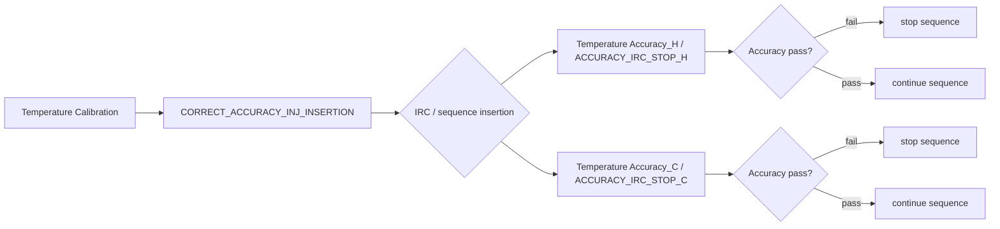

Open verification:

The processing probe README states that the exported XML contains the SST/IRC editor layout and columns such as `Injection Condition`, `Pass Actions`, and `Fail Actions`, but the currently decoded `SSTGrid` node does not contain actual business rows. Therefore the exact condition expression, insertion action, and stop action must be verified from the non-XML sequence-command serialization or inside Chromeleon UI.

## Contract 5: Report Formula

### 5.1 Direct ReportFormulaObject Evidence

`Report_VTCC_V2_12` sheet `Temp Accuracy` contains direct formula objects:

| Cell | Formula | Fixed channel | Meaning |
|---|---|---|---|
| `K66` | `AUDIT.RetTime1(1.000,"forward")` | | RetTime for point 1 |
| `K67` | `AUDIT.RetTime2(1.000,"forward")` | | RetTime for point 2 |
| `K68` | `AUDIT.RetTime3(1.000,"forward")` | | RetTime for point 3 |
| `K69` | `AUDIT.RetTime4(1.000,"forward")` | | RetTime for point 4 |
| `K70` | `AUDIT.RetTime5(1.000,"forward")` | | RetTime for point 5 |
| `L66:L70` | `chm.sig_value("average", AUDIT.RetTimeN - 1, AUDIT.RetTimeN - 0.2)` | `ExtTemp_LowerCC` | lower external thermometer average |
| `M66:M70` | `chm.sig_value("average", AUDIT.RetTimeN - 1, AUDIT.RetTimeN - 0.2)` | `ExtTemp_UpperCC` | upper external thermometer average |
| `I66:I70` | `AUDIT.ColumnComp.CC.Temperature.Nominal(AUDIT.RetTimeN - 0.1)` | | nominal temperature near anchor |
| `E45` | `chm.sig_value("average")` | `Environment_Temperature` | environment temperature summary |

### 5.2 Workbook-Derived Rules

The final deviation cells are workbook-derived rather than all being exposed as direct `ReportFormulaObject`.

Current verified evaluator rule:

```text
lower_avg_N = average(ExtTemp_LowerCC, RetTimeN - 1.0, RetTimeN - 0.2)
upper_avg_N = average(ExtTemp_UpperCC, RetTimeN - 1.0, RetTimeN - 0.2)
nominal_N = AUDIT.ColumnComp.CC.Temperature.Nominal(RetTimeN - 0.1)

observed_N =
  lower_avg_N if abs(lower_avg_N - nominal_N) >= abs(upper_avg_N - nominal_N)
  else upper_avg_N

deviation_N = observed_N - nominal_N
summary = max(abs(deviation_1..deviation_5))
result = Test passed if summary <= Definitions!Temperature Accuracy
```

Formula flow:

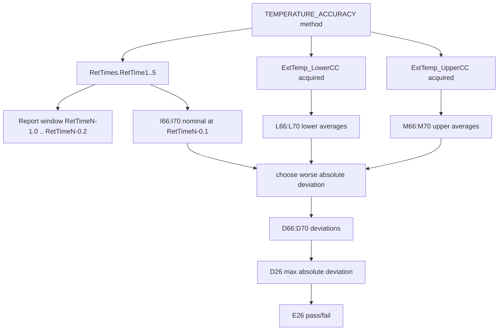

### 5.3 VA Template

`VA-C10-A` uses `Report_VATCC_V1_01` rather than `Report_VTCC_V2_12`. The TKN and DB mapping align the same `Temperature Accuracy_C.XLS` output and same field family, but the complete VA template formula-object row coverage still needs a template-specific formula trace before generation can claim equivalence.

## Contract 6: DB Contract and Configuration Requirement

### 6.1 DB Mapping as Leaf Contract

The DB mapping is a leaf validation target. It must not drive method generation by itself.

| Model | DB output file | Field-to-cell pattern |
|---|---|---|
| `VH-C10-A` | `Temperature Accuracy_H.XLS` | `TempAcc10/20/40/80/120 -> Temp Accuracy!D66:D70`, `RES_TempAccuracy -> E26` |
| `VC-C10-A` | `Temperature Accuracy_C.XLS` | `TempAcc10/20/40/60/85 -> Temp Accuracy!D66:D70`, `RES_TempAccuracy -> E26` |
| `VA-C10-A` | `Temperature Accuracy_C.XLS` | `TempAcc10/20/40/60/85 -> Temp Accuracy!D66:D70`, `RES_TempAccuracy -> E26` |

Display/typing rule:

```text
Temperature Accuracy observed/deviation cells display to 2 decimals.
Pass/fail compares the raw summary against Definitions!Temperature Accuracy.
SQL/DB output should preserve the mapped field type but avoid exposing binary float tails in user-facing preview/export.
```

### 6.2 Required Configuration

| Requirement | Why it is required | Evidence |
|---|---|---|
| `ColumnComp` with `CC` temperature control | Method sets `ColumnComp.CC.Temperature.Nominal`, readiness, mode, and TempCtrl | decoded method flow |
| Correct `ColumnComp.ModelNo` | Selects VH vs VC/VA setpoint branch and page-count variable | decoded method flow and report `Definitions!C15 = AUDIT.ColumnComp.ModelNo` |
| `Thermometer1.ExtTemp_UpperCC` | External upper thermometer source for report | method acquisition + report formulas |
| `Thermometer1.ExtTemp_LowerCC` | External lower thermometer source for report | method acquisition + report formulas |
| `Thermometer.Environment_Temperature` / `Thermometer.Measure_1` | Ambient check can skip 10 deg C point; report has environment formula | decoded method flow |
| Debug/signal channels | Method acquires CC actual temperatures, PWM, fan, leak board channels | decoded method flow |
| VH PCC command availability | VH branch runs `ColumnComp.CmdString Cmd="PCC.TempCtrl=0"` | decoded method flow |

Generation implication:

```text
A generated CMBX or method template must not only contain the script.
It must also declare the required CM instrument configuration symbols:
ColumnComp, Thermometer/Thermometer1, ExtTemp_UpperCC, ExtTemp_LowerCC,
Environment_Temperature, RetTimes, StabVars, and model-specific PCC command support.
```

## VH / VC / VA Comparison

| Aspect | `VH-C10-A` | `VC-C10-A` | `VA-C10-A` |
|---|---|---|---|
| Injection | `Temperature Accuracy_H` | `Temperature Accuracy_C` | `Temperature Accuracy_C` |
| Processing method | `ACCURACY_IRC_STOP_H` | `ACCURACY_IRC_STOP_C` | `ACCURACY_IRC_STOP_C` |
| Report template | `Report_VTCC_V2_12` | `Report_VTCC_V2_12` | `Report_VATCC_V1_01` |
| Temperature ladder | 10, 20, 40, 80, 120 deg C | 10, 20, 40, 60, 85 deg C | 10, 20, 40, 60, 85 deg C |
| PCC handling | Method disables PCC temp control by `CmdString` | no VH PCC branch | no VH PCC branch |
| Report output | `Temperature Accuracy_H.XLS` | `Temperature Accuracy_C.XLS` | `Temperature Accuracy_C.XLS` |
| DB fields | includes `TempAcc80`, `TempAcc120` | includes `TempAcc60`, `TempAcc85` | includes `TempAcc60`, `TempAcc85` |
| Open gap | exact IRC business rows | exact IRC business rows | VA template formula trace |

## Command Flow

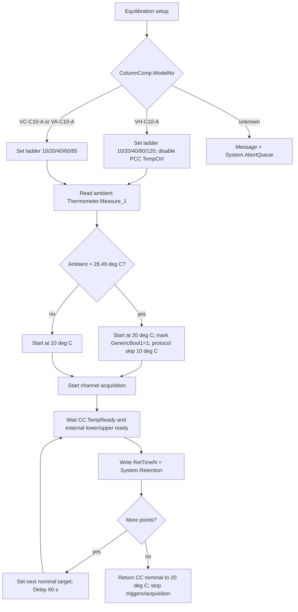

## Open Verification Required

| # | Uncertain point | Needed evidence | Likely source |
|---|---|---|---|
| 1 | Exact SST/IRC row expression for `ACCURACY_IRC_STOP_H/C` | Decoded processing method row data including condition, operator, pass/fail action | non-XML processing method serialization in sequence command, or Chromeleon Processing Method UI |
| 2 | Whether the corrective insertion PM checks `ColumnComp.ModelNo` directly or relies on preselected sequence branch | Human-readable pass action / injection condition | `CORRECT_ACCURACY_INJ_INSERTION` processing method row decode |
| 3 | Exact stop action implementation | Fail action payload, e.g. sequence stop/abort/action name | decoded SST/IRC row data |
| 4 | Complete VA `Report_VATCC_V1_01` formula-object trace for `Temp Accuracy` | Formula object TSV for VA report template | VA CMBX report extraction |
| 5 | How high-ambient skipped 10 deg C point is displayed in final workbook/DB | Reference CMBX where `GenericBool1=1` or synthetic verified run | real high-ambient data or CM simulation |
| 6 | Whether generated one-point Accuracy reports may remap RetTime anchors safely | Report template edit and CM validation | manual CM report-template experiment |

## Generation Readiness

| Layer | Status | Reason |
|---|---|---|
| Method command semantics | Partial to strong | Temperature ladder, stability logic, RetTime anchors, and acquisition channels are decoded from real method flow |
| Processing/IRC | Partial | Binding and intent are known; exact SST/IRC row business rule is not decoded |
| Report formulas | Strong for `Report_VTCC_V2_12`; partial for VA | Direct formula objects and workbook-derived rules are verified for VTCC; VA needs template-specific trace |
| DB contract | Strong | Field/cell mapping is aligned and treated as leaf validation |
| Config requirements | Partial | Required symbols are known; live CM hardware/profile validation still manual |

## Final Answers to Validation Questions

1. Temperature loop: `VH-C10-A` runs 10/20/40/80/120 deg C; `VC-C10-A` and `VA-C10-A` run 10/20/40/60/85 deg C. If ambient is greater than 28.49 deg C, 10 deg C can be skipped and the test starts at 20 deg C.
2. External thermometer data is sampled continuously after `Thermometer1.ExtTemp_UpperCC.AcqOn` and `Thermometer1.ExtTemp_LowerCC.AcqOn`. The report averages the stable window before each RetTime, specifically `RetTimeN-1.0..RetTimeN-0.2`.
3. IRC binding is visible through `ACCURACY_IRC_STOP_H/C` processing methods. The exact condition/action rows are not decoded yet; they require non-XML processing method business-rule evidence.
4. `TempAcc10` is the report-derived deviation for the first setpoint row. For VH it maps to `Temp Accuracy!D66`; source cells include nominal `I66`, RetTime `K66`, lower average `L66`, and upper average `M66`. The workbook chooses the upper/lower external thermometer value with the larger absolute deviation from nominal and stores/display-rounds the deviation.
5. VH differs from VC/VA by using the high-temperature 80/120 deg C branch, `Temperature Accuracy_H`, `ACCURACY_IRC_STOP_H`, and a VH PCC temp-control-off command. VC/VA use the 60/85 deg C branch and `ACCURACY_IRC_STOP_C`; VA additionally uses the `Report_VATCC_V1_01` template.

<a id="tcc-precision"></a>
## B007: Precision/fan black box

Build source name: `TCC_PRECISION_FAN_BLACK_BOX_DECOMPOSITION.md`

# TCC Temperature Precision and Fan Black Box Decomposition

Extraction date: 2026-07-10

Scope: TCC FOQ Temperature Precision and Fan for `VH-C10-A`, `VC-C10-A`, and `VA-C10-A`.

---
Test name: Temperature Precision and Fan
Models: VH-C10-A / VC-C10-A / VA-C10-A
Status: first black-box decomposition complete; processing method pass-action and Fan DB leaves remain open verification
---

This document decomposes Temperature Precision and Fan as a generation contract.
The core distinction is:

```text
Temperature Precision is report-derived from fixed external thermometer windows.
Fan behavior is method-driven by CC mode switching and CC_Temp statistics.
```

Unlike Temperature Accuracy, this test does not use RetTime anchors for the
main temperature precision result. The report uses fixed windows at
approximately 14, 36, and 58 minutes. Therefore the method duration and timing
are part of the calculation contract.

## Evidence Sources

| Evidence | Source |
|---|---|
| Test intent node | `cmbx_data_explorer/docs/TCC_TEST_KNOWLEDGE_NODE_MODEL.md` |
| FOQ TD extracted KB | `cmbx_data_explorer/docs/FOQ_TCC_VX_C10_A_TD_KNOWLEDGE_MANAGEMENT.md` |
| Injection workbench notes | `cmbx_data_explorer/docs/TCC_INJECTION_BY_INJECTION_REVERSE_WORKBENCH.md` |
| Method/report alignment | `cmbx_data_explorer/docs/TCC_METHOD_REPORT_ALIGNMENT.md` |
| Method flow, VH | `knowledge_base/tcc_reverse_probe/VH/6000001/TEMPERATURE_PRECISION_AND_FAN_embedded_method_flow.txt` |
| Method flow, VC | `knowledge_base/tcc_reverse_probe/VC/3000004/TEMPERATURE_PRECISION_AND_FAN_embedded_method_flow.txt` |
| Method flow, VA | `knowledge_base/tcc_reverse_probe/VA/0000003/TEMPERATURE_PRECISION_embedded_method_flow.txt` |
| Method contract summaries | `knowledge_base/tcc_method_contracts/*_method_contracts.tsv` |
| Processing method probe | `knowledge_base/tcc_processing_probe/*/*CORRECT_STABILITY_INJ_INSERTION*_summary.txt` |
| Report formula objects | `knowledge_base/tcc_report_formula_objects_vh_6000001_all_sheets.tsv` |
| Formula reverse notes | `cmbx_data_explorer/CM_FORMULA_REVERSE_ENGINEERING.md` |
| DB mapping | `foq/FOQResultLocations_V2.83.xls` |

## Executive Answer

1. `VH-C10-A` and `VC-C10-A` production CMBX rows use
   `Temperature Precision_and_Fan`, instrument method
   `TEMPERATURE_PRECISION_AND_FAN`, and processing method
   `CORRECT_STABILITY_INJ_INSERTION`.
2. `VA-C10-A` sample evidence uses `Temperature Precision`, instrument method
   `TEMPERATURE_PRECISION`, and `NO_INTEGRATION`, while the DB report file name
   still appears as `Temperature Precision_and_Fan.XLS`.
3. The method repeats a 45 C / 50 C thermal pattern. It first establishes the
   same starting condition before each 50 C segment, then acquires external
   upper and lower thermometer channels.
4. `Temp Precision` report formulas calculate three lower external averages and
   three upper external averages:

   ```text
   K65 = average ExtTemp_LowerCC from 14.0 to 14.8 min
   K66 = average ExtTemp_LowerCC from 36.0 to 36.8 min
   K67 = average ExtTemp_LowerCC from 58.0 to 58.8 min
   L65:L67 = same windows on ExtTemp_UpperCC
   ```

5. Workbook-derived precision rule:

   ```text
   LowerRange = max(K65:K67) - min(K65:K67)
   UpperRange = max(L65:L67) - min(L65:L67)
   RawPrecision = max(LowerRange, UpperRange)
   ```

6. The pass/fail cell compares `RawPrecision` to
   `Definitions!Temperature Precision`. The displayed summary uses two decimals,
   but pass/fail uses the raw range.
7. Fan behavior is checked by switching `ColumnComp.CC.Mode` from `StillAir` to
   `ForcedAir` and back to `StillAir`, logging `CC.TempReady`, and evaluating
   `CC_Temp` fixed windows on the `Fan` sheet. Current DB mapping exposes
   `TempPrecision` and `RES_TempPrecision`; Fan-specific DB field names remain
   open verification.

## Contract 1: Method Command

### 1.1 Device Branch Binding

| Device | Injection | Instrument Method | Processing Method | Report Template | Report Sheets |
|---|---|---|---|---|---|
| VH-C10-A | `Temperature Precision_and_Fan` | `TEMPERATURE_PRECISION_AND_FAN` | `CORRECT_STABILITY_INJ_INSERTION` | `Report_VTCC_V2_12` | `Temp Precision`, `Fan` |
| VC-C10-A | `Temperature Precision_and_Fan` | `TEMPERATURE_PRECISION_AND_FAN` | `CORRECT_STABILITY_INJ_INSERTION` | `Report_VTCC_V2_12` | `Temp Precision`, `Fan` |
| VA-C10-A | `Temperature Precision` | `TEMPERATURE_PRECISION` | `NO_INTEGRATION` | `Report_VATCC_V1_01` | `Temp Precision`, `Fan` |

### 1.2 Shared Precision Method Skeleton

Both `TEMPERATURE_PRECISION_AND_FAN` and `TEMPERATURE_PRECISION` share the same
temperature precision skeleton in current decoded method evidence:

```yaml
stages:
  - InstrumentSetup
  - Equilibration
  - StartRun
  - Run
  - StopRun
setpoints:
  - ColumnComp.CC.Temperature.Nominal: 45.0
  - ColumnComp.CC.Temperature.Nominal: 50.0
wait_conditions:
  - CC.TempReady
ret_times:
  emitted: []
logged_properties:
  - GenericLong9
  - Variables.GenericBool0
  - CC.TempReady
channels:
  - ColumnComp.CC_Temp
  - ColumnComp.CC_U_Temp_Actual
  - ColumnComp.CC_L_Temp_Actual
  - ColumnComp.CC_UCTL_TempRear_Actual
  - ColumnComp.PWM_CCU_A
  - ColumnComp.PWM_CCU_B
  - ColumnComp.PWM_CCL_A
  - ColumnComp.PWM_CCL_B
  - ColumnComp.Fan_Rear_ActualRPM
  - Thermometer1.ExtTemp_UpperCC
  - Thermometer1.ExtTemp_LowerCC
  - Thermometer.Environment_Temperature
  - ColumnComp.LEDBoard_LeakDiff
  - ColumnComp.LEDBoard_A13
  - ColumnComp.LEDBoard_A14
  - ColumnComp.Oven_Gas_MuteTimeRemain
```

Semantic command flow:

| Order | Command group | Meaning | Generation constraint |
|---:|---|---|---|
| 1 | Determine page/model context | Set `Variables.GenericLong9` by `ColumnComp.ModelNo`; abort if unknown. | Keeps report/page context aligned with model. |
| 2 | Determine stability branch flag | Set `Variables.GenericBool0` based on whether `ColumnComp.ModelNo` is `VH-C10-A`. | Feeds later stability branch selection. |
| 3 | Configure CC readiness | Set `ReadyTempDelta = 0.1 C`, `EquilibrationTime = 0.5 min`, `TempCtrl = On`. | Defines readiness for repeated 45/50 C transitions. |
| 4 | Set operating mode and leak sensor | Set `CC.Mode = StillAir`; set `LiquidLeakSensor = Off`. | Avoid false leak alarms during temperature changes. |
| 5 | Configure debug/data collection channels | Set data collection rate for CC actual/PWM/fan/leak channels. | Required for diagnostic evidence and Fan sheet. |
| 6 | Precondition at 45 C | Set CC nominal to 45 C and wait for `CC.TempReady`. | Ensures the same starting condition before 50 C segments. |
| 7 | Repeat 45/50 pattern | Toggle nominal values `50 -> 45 -> 50` before StartRun and again during Run. | Produces fixed report windows at 14, 36, and 58 minutes. |
| 8 | Start acquisition | Acquire CC, external thermometer, fan/PWM, environment and leak signals. | Required by `Temp Precision` and `Fan` sheets. |
| 9 | Re-enable and calibrate leak sensor | Set `LiquidLeakSensor = On` and run `LiquidLeakSensorCalibrate`. | Supports later leak logic and safe post-test state. |
| 10 | Stop acquisition | Turn all acquired channels off. | Required cleanup. |

### 1.3 Fan-Specific Method Branch

`TEMPERATURE_PRECISION_AND_FAN` includes an explicit Fan function block:

```text
SET ColumnComp.CC.ReadyTempDelta = 0.1 C
SET ColumnComp.CC.EquilibrationTime = 0.0 min
SET ColumnComp.CC.Mode = ForcedAir
RUN Log CC.TempReady
RUN Log CC.TempReady
RUN Log CC.TempReady
SET ColumnComp.CC.Mode = StillAir
RUN Log CC.TempReady
```

Current VA `TEMPERATURE_PRECISION` evidence does not include this block in the
decoded text. Therefore VA support for the Fan sheet must be treated as
template/report evidence, not confirmed Fan method behavior.

### 1.4 No RetTime Anchor

The decoded method summaries show no direct RetTime emissions for Precision/Fan.
This is important:

```text
Temperature Accuracy -> RetTime anchored report windows.
Temperature Precision -> fixed-time report windows.
```

For generated/cut-down methods, a shorter method cannot reuse the current
`Temp Precision` report unchanged.

## Contract 2: Processing Method

### 2.1 Known Bindings

| Device | Processing Method | Evidence | Interpretation |
|---|---|---|---|
| VH-C10-A | `CORRECT_STABILITY_INJ_INSERTION` | Sequence context and TKN binding. | Used by `Temperature Precision_and_Fan`; likely controls follow-up Stability branch selection. |
| VC-C10-A | `CORRECT_STABILITY_INJ_INSERTION` | Sequence context and TKN binding. | Same as VH, but later branch should be non-PCC stability. |
| VA-C10-A | `NO_INTEGRATION` for sample row | TKN binding and sequence package spec. | VA sample does not use the corrective stability processing method on the Precision row. |

### 2.2 Current Understanding

`CORRECT_STABILITY_INJ_INSERTION` appears near sequence context that references:

```text
Temperature Precision_and_Fan
TEMPERATURE_PRECISION_AND_FAN
Temperature Stability_and_PCC_H
```

The method also logs `Variables.GenericBool0`, which is set from ModelNo:

```text
VH-C10-A -> Variables.GenericBool0 = 1
other valid branch -> Variables.GenericBool0 = 0
```

Working interpretation:

```text
Temperature Precision determines the correct later Stability branch.
CORRECT_STABILITY_INJ_INSERTION likely enforces/inserts the appropriate
Temperature Stability injection, but the current XML probe does not expose a
complete action table.
```

Open verification:

| Item | Required evidence | Likely source |
|---|---|---|
| Exact `CORRECT_STABILITY_INJ_INSERTION` pass action | Full processing method business/action rows. | Processing method XML internals or Chromeleon UI. |
| Whether action uses `Variables.GenericBool0`, `ModelNo`, or sequence row names | Condition/action table. | Processing method editor view. |
| Why VA sample uses `NO_INTEGRATION` while still carrying `Temperature Precision_and_Fan.XLS` report file mapping | VA sequence/report binding evidence. | VA CMBX sequence row and report template. |

## Contract 3: Report Formula

### 3.1 `Temp Precision` Formula Objects

| Cell | Formula | Fixed channel / source | Meaning |
|---|---|---|---|
| `I65` | `AUDIT.ColumnComp.CC.Temperature.Nominal(14.9,"backward")` | Audit | Nominal value near first precision window. |
| `I66` | `AUDIT.ColumnComp.CC.Temperature.Nominal(36.9,"backward")` | Audit | Nominal value near second precision window. |
| `I67` | `AUDIT.ColumnComp.CC.Temperature.Nominal(58.9,"backward")` | Audit | Nominal value near third precision window. |
| `K65` | `chm.sig_value("average",14,14.8)` | `ExtTemp_LowerCC` | Lower external average, first repeat. |
| `K66` | `chm.sig_value("average",36,36.8)` | `ExtTemp_LowerCC` | Lower external average, second repeat. |
| `K67` | `chm.sig_value("average",58,58.8)` | `ExtTemp_LowerCC` | Lower external average, third repeat. |
| `L65` | `chm.sig_value("average",14,14.8)` | `ExtTemp_UpperCC` | Upper external average, first repeat. |
| `L66` | `chm.sig_value("average",36,36.8)` | `ExtTemp_UpperCC` | Upper external average, second repeat. |
| `L67` | `chm.sig_value("average",58,58.8)` | `ExtTemp_UpperCC` | Upper external average, third repeat. |

Workbook-derived precision rule:

```text
LowerRange = max(K65:K67) - min(K65:K67)
UpperRange = max(L65:L67) - min(L65:L67)
RawPrecision = max(LowerRange, UpperRange)
Displayed TempPrecision = RawPrecision displayed to 2 decimals
Pass/fail = RawPrecision <= Definitions!Temperature Precision
```

The source rule is the same family as Temperature Stability:

```text
Do not combine K65:L67 into one range.
Evaluate each external thermometer separately, then take the worse sensor.
```

### 3.2 `Fan` Formula Objects

Known formula objects on sheet `Fan`:

| Cell | Formula | Fixed channel | Meaning |
|---|---|---|---|
| `J49` | `chm.signalStatistic("average",63.1,64.1)` | `CC_Temp` | CC temperature average before/around fan mode response window. |
| `J50` | `chm.signalStatistic("min",64.1,74)` | `CC_Temp` | Minimum CC temperature in fan response interval. |
| `J51` | `chm.signalStatistic("average",74,75)` | `CC_Temp` | Average after fan response interval. |
| `J52` | `chm.signalStatistic("max",75,76)` | `CC_Temp` | Maximum after return/response interval. |
| `W57` | `chm.signalStatistic("min",63.1,64.1)` | `CC_Temp` | Fan diagnostic min value. |
| `X57` | `chm.signalStatistic("max",63.1,64.1)` | `CC_Temp` | Fan diagnostic max value. |
| `W58` | `chm.signalStatistic("min",74,75)` | `CC_Temp` | Fan diagnostic min value. |
| `X58` | `chm.signalStatistic("max",74,75)` | `CC_Temp` | Fan diagnostic max value. |

Open point:

```text
Current FOQResultLocations_V2.83 mapping exposes TempPrecision and
RES_TempPrecision, but no verified Fan-specific DB field names for this test.
Fan may be report-visible without being part of the current TCC DB contract.
```

### 3.3 Formula Flow

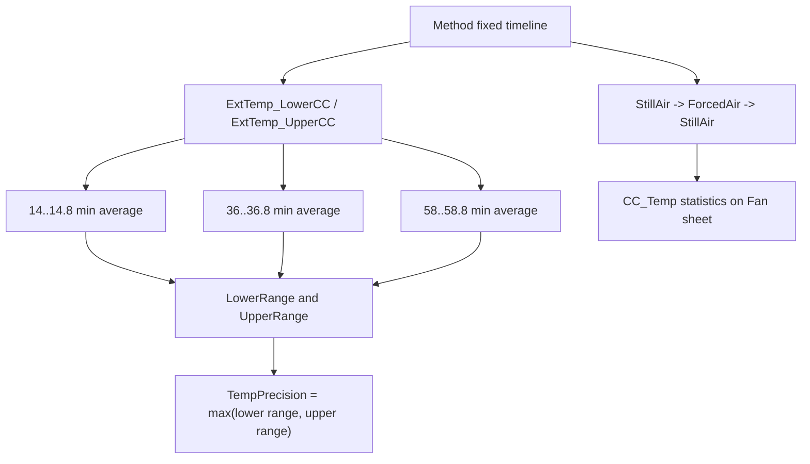

## Contract 4: DB Contract

### 4.1 DB Leaves

| Device | DB Field | Report file | Sheet | Cell | Rule |
|---|---|---|---|---|---|
| VH-C10-A | `TempPrecision` | `Temperature Precision_and_Fan.XLS` | `Temp Precision` | `D26` | Displayed max lower/upper sensor range. |
| VH-C10-A | `RES_TempPrecision` | `Temperature Precision_and_Fan.XLS` | `Temp Precision` | `E26` | Pass/fail versus Definitions. |
| VC-C10-A | `TempPrecision` | `Temperature Precision_and_Fan.XLS` | `Temp Precision` | `D26` | Displayed max lower/upper sensor range. |
| VC-C10-A | `RES_TempPrecision` | `Temperature Precision_and_Fan.XLS` | `Temp Precision` | `E26` | Pass/fail versus Definitions. |
| VA-C10-A | `TempPrecision` | `Temperature Precision_and_Fan.XLS` | `Temp Precision` | `D26` | Displayed max lower/upper sensor range. |
| VA-C10-A | `RES_TempPrecision` | `Temperature Precision_and_Fan.XLS` | `Temp Precision` | `E26` | Pass/fail versus Definitions. |

### 4.2 DB Boundary

`Noise_CC_Temp` belongs to the later Temperature Stability report in the current
mapping, not to Temperature Precision:

```text
Noise_CC_Temp -> Temperature Stability(_and_PCC)_*.XLS / Temp Stability_Noise / K86
```

Generation implication:

```text
Do not attach Noise_CC_Temp to a cut-down Precision-only package unless the
report/DB contract is deliberately changed.
```

## Contract 5: Config Requirement

| Requirement | VH-C10-A | VC-C10-A | VA-C10-A | Failure mode |
|---|---|---|---|---|
| `AUDIT.ColumnComp.ModelNo` source of truth | Required | Required | Required | Wrong page count, wrong branch, wrong follow-up stability injection. |
| Column compartment CC control | Required | Required | Required | 45/50 C transitions and `CC.TempReady` invalid. |
| External upper/lower thermometers | Required | Required | Required | `Temp Precision` report cannot evaluate. |
| `CC_Temp` raw channel | Required for Fan sheet | Required for Fan sheet | Report sheet lists Fan, method support not fully verified | Fan statistics cannot evaluate. |
| `Fan_Rear_ActualRPM` / fan debug channel | Required for method evidence | Required for method evidence | Acquired in VA precision method | Fan behavior evidence incomplete. |
| PWM/debug channels | Acquired | Acquired | Acquired | Diagnostic trace incomplete. |
| Current report timeline | Required | Required | Required | Fixed report windows miss data if method is shortened. |
| Processing action for Stability insertion | `CORRECT_STABILITY_INJ_INSERTION` | `CORRECT_STABILITY_INJ_INSERTION` | sample uses `NO_INTEGRATION` | Later Stability branch may be wrong or missing. |

Generation guardrails:

```text
1. Keep the three repeated precision windows unless regenerating the report.
2. Keep lower and upper external thermometer ranges separate.
3. Treat the Fan sheet as fixed-window CC_Temp diagnostics, not as a RetTime test.
4. For VH/VC, do not drop `Variables.GenericBool0` until the stability insertion
   processing method is fully understood.
5. For VA, confirm whether the intended production method should include Fan
   mode switching or match the observed `TEMPERATURE_PRECISION` method.
```

## Contract 6: Open Verification

Items below are marked Open Verification Required until the listed evidence is
captured.

| # | Uncertain point | Required evidence | Likely source |
|---:|---|---|---|
| 1 | Exact `CORRECT_STABILITY_INJ_INSERTION` pass-action structure. | Processing method condition/action table. | Chromeleon processing method editor or deeper XML decoder. |
| 2 | Whether the processing method inserts VH `Temperature Stability_and_PCC_H` and VC `Temperature Stability_C` based on `Variables.GenericBool0`. | Pass-action rows plus model-branch evaluation. | Processing method XML / UI. |
| 3 | Fan pass/fail workbook formula and whether it has any DB fields outside current mapping. | FormulaOne workbook extraction and DB mapping review. | Report template `SpreadSheetData` and FOQ mapping. |
| 4 | VA branch difference: `TEMPERATURE_PRECISION` lacks the decoded Fan mode-switch block but the report file still uses `Temperature Precision_and_Fan.XLS`. | VA CM sequence/report UI and report export. | Real VA CMBX loaded in CM. |
| 5 | Exact `Definitions!Temperature Precision` limits by template/model. | Definitions sheet values. | VTCC/VATCC report templates. |

## VH / VC / VA Comparison

| Question | VH-C10-A | VC-C10-A | VA-C10-A |
|---|---|---|---|
| Which injection is used? | `Temperature Precision_and_Fan` | `Temperature Precision_and_Fan` | `Temperature Precision` |
| Which method is used? | `TEMPERATURE_PRECISION_AND_FAN` | `TEMPERATURE_PRECISION_AND_FAN` | `TEMPERATURE_PRECISION` |
| Which processing method is used? | `CORRECT_STABILITY_INJ_INSERTION` | `CORRECT_STABILITY_INJ_INSERTION` | `NO_INTEGRATION` in current sample |
| Fan mode switch decoded? | Yes | Yes by method family | Not in current decoded VA method text |
| Temperature precision formula | Same fixed windows | Same fixed windows | Same fixed report mapping expected |
| Stability branch flag | `GenericBool0 = 1` | `GenericBool0 = 0` | `GenericBool0 = 0` |

## Command, Report, DB Flow

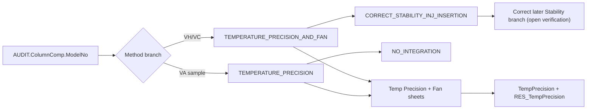

## Generation Readiness

| Use case | Readiness | Reason |
|---|---|---|
| Reuse full VH/VC Precision and Fan branch from existing CMBX | Medium-high | Method/report/DB chain is mostly closed; processing pass-action remains open. |
| Reuse VA Precision branch from existing CMBX | Medium | Precision formula is clear; Fan method/report mismatch needs confirmation. |
| Generate shorter precision-only test using current report | Not ready | Current report windows are fixed at 14, 36, and 58 minutes. |
| Generate a new single-window precision test | Not ready | The current report requires three repeated windows to compute a range. |
| Split Fan into a standalone test | Partial | Fan method commands and CC_Temp formulas are known, but DB/report pass/fail contract is not closed. |

<a id="tcc-stability"></a>
## B008: Stability/PCC black box

Build source name: `TCC_STABILITY_BLACK_BOX_DECOMPOSITION.md`

# TCC Temperature Stability and PCC Black Box Decomposition

Extraction date: 2026-07-10

Scope: TCC FOQ Temperature Stability for `VH-C10-A`, `VC-C10-A`, and `VA-C10-A`.

---
Test name: Temperature Stability / Temperature Stability and PCC
Models: VH-C10-A / VC-C10-A / VA-C10-A
Status: first black-box decomposition complete; workbook internals and exact non-PCC payload still need open verification
---

This document decomposes the Temperature Stability test as a generation contract.
The key branch is:

```text
VH-C10-A -> Temperature Stability_and_PCC_H -> TEMPERATURE_STABILITY_AND_PCC_70_H
VC-C10-A / VA-C10-A -> Temperature Stability_C -> TEMPERATURE_STABILITY_70_C
```

The VH branch is not only a longer version of the VC/VA branch. It combines two
test intents on one timeline:

```text
1. CC stability/noise at 70 C.
2. VH-only PCC performance, accuracy, drift, noise, and cool-down timing.
```

## Evidence Sources

| Evidence | Source |
|---|---|
| Test intent node | `cmbx_data_explorer/docs/TCC_TEST_KNOWLEDGE_NODE_MODEL.md` |
| FOQ TD extracted KB | `cmbx_data_explorer/docs/FOQ_TCC_VX_C10_A_TD_KNOWLEDGE_MANAGEMENT.md` |
| Injection workbench notes | `cmbx_data_explorer/docs/TCC_INJECTION_BY_INJECTION_REVERSE_WORKBENCH.md` |
| Method/report alignment | `cmbx_data_explorer/docs/TCC_METHOD_REPORT_ALIGNMENT.md` |
| Decoded method contract, VH | `knowledge_base/tcc_method_contracts/VH_6000001_TEMPERATURE_STABILITY_AND_PCC_70_H_contract.md` |
| Method contract summaries | `knowledge_base/tcc_method_contracts/*_method_contracts.tsv` |
| Report formula objects | `knowledge_base/tcc_report_formula_objects_vh_6000001_all_sheets.tsv` |
| Formula reverse notes | `cmbx_data_explorer/CM_FORMULA_REVERSE_ENGINEERING.md` |
| DB mapping | `foq/FOQResultLocations_V2.83.xls` |

## Executive Answer

1. The stability measurement is a 70 C long-window test. The report reads
   external lower and upper thermometer averages from one-minute windows between
   45 and 60 minutes.
2. Stability is evaluated separately for the lower and upper external
   thermometers:

   ```text
   LowerRange = max(K61:K75) - min(K61:K75)
   UpperRange = max(L61:L75) - min(L61:L75)
   RawStability = max(LowerRange, UpperRange)
   ```

   It must not be calculated as one combined range across K:L, because that
   would mix external thermometer offset into the stability result.
3. `Noise_CC_Temp` is calculated from `CC_Temp` with `chm.noise(59,60)`.
   VH additionally calculates `Noise_PCC_Temp` from `PCC_Temp` with the same
   one-minute window.
4. `VC-C10-A` and `VA-C10-A` use `TEMPERATURE_STABILITY_70_C`,
   `NO_INTEGRATION`, and the `Temp Stability_Noise` report sheet only.
5. `VH-C10-A` uses `TEMPERATURE_STABILITY_AND_PCC_70_H`,
   `NO_INTEGRATION`, and both `Temp Stability_Noise` and `PCC` report sheets.
   The method emits `RetTimes.RetTime2`, `RetTimes.RetTime3`, and
   `RetTimes.RetTime4` for the PCC heat/cool branch.
6. PCC cool-down performance is report-derived from `RetTime4 - RetTime3`.
   The report also calculates PCC averages at fixed windows, PCC drift from
   minute 19 to 24, and PCC noise at minute 59 to 60.

## Contract 1: Method Command

### 1.1 Device Branch Binding

| Device | Injection | Instrument Method | Processing Method | Report Template | Report Sheets |
|---|---|---|---|---|---|
| VH-C10-A | `Temperature Stability_and_PCC_H` | `TEMPERATURE_STABILITY_AND_PCC_70_H` | `NO_INTEGRATION` | `Report_VTCC_V2_12` | `Temp Stability_Noise`, `PCC` |
| VC-C10-A | `Temperature Stability_C` | `TEMPERATURE_STABILITY_70_C` | `NO_INTEGRATION` | `Report_VTCC_V2_12` | `Temp Stability_Noise` |
| VA-C10-A | `Temperature Stability_C` | `TEMPERATURE_STABILITY_70_C` | `NO_INTEGRATION` | `Report_VATCC_V1_01` | `Temp Stability_Noise` |

### 1.2 VC/VA Non-PCC Method Contract

Decoded summary evidence for `TEMPERATURE_STABILITY_70_C`:

```yaml
method: TEMPERATURE_STABILITY_70_C
models: [VC-C10-A, VA-C10-A]
stages:
  - InstrumentSetup
  - Equilibration
  - InjectPreparation
  - StartRun
  - Run
  - StopRun
  - PostRun
setpoints:
  - ColumnComp.CC.Temperature.Nominal: 70.0
wait_conditions:
  - CC.TempReady
ret_times:
  emitted: []
logged_properties:
  - GenericLong9
channels:
  - ColumnComp.CC_Temp
  - ColumnComp.CC_U_Temp_Actual
  - ColumnComp.CC_L_Temp_Actual
  - ColumnComp.CC_UCTL_TempRear_Actual
  - ColumnComp.PWM_CCU_A
  - ColumnComp.PWM_CCU_B
  - ColumnComp.PWM_CCL_A
  - ColumnComp.PWM_CCL_B
  - ColumnComp.Fan_Rear_ActualRPM
  - Thermometer1.ExtTemp_UpperCC
  - Thermometer1.ExtTemp_LowerCC
  - Thermometer.Environment_Temperature
  - ColumnComp.LEDBoard_LeakDiff
  - ColumnComp.LEDBoard_A13
  - ColumnComp.LEDBoard_A14
  - ColumnComp.Oven_Gas_MuteTimeRemain
```

Semantic command flow:

| Order | Command group | Meaning | Generation constraint |
|---:|---|---|---|
| 1 | Configure CC stability parameters | Set CC control parameters and nominal temperature to 70 C. | Required. The report expects a 70 C stability run. |
| 2 | Wait for readiness | Wait until `CC.TempReady`. | Required before the 45..60 min report window. |
| 3 | Start acquisition | Acquire internal CC channels, PWM/fan channels, external thermometers, environment and leak-related channels. | Required for `Temp Stability_Noise`. |
| 4 | Hold acquisition | Keep the timeline long enough to cover report windows 45..60 and 59..60. | Required unless the report formulas are rewritten. |
| 5 | Stop acquisition | Turn acquired channels off and finish run. | Required cleanup. |

### 1.3 VH PCC Method Contract

Decoded summary evidence for `TEMPERATURE_STABILITY_AND_PCC_70_H`:

```yaml
method: TEMPERATURE_STABILITY_AND_PCC_70_H
models: [VH-C10-A]
stages:
  - InstrumentSetup
  - Equilibration
  - InjectPreparation
  - StartRun
  - Run
  - StopRun
  - PostRun
setpoints:
  - ColumnComp.PCC.Temperature.Nominal: 40.00
  - ColumnComp.CC.Temperature.Nominal: 70.0
  - ColumnComp.PCC.Temperature.Nominal: 80.0
  - ColumnComp.PCC.Temperature.Nominal: 40.0
wait_conditions:
  - CC.TempReady AND PCC.TempReady
ret_times:
  initialized:
    - RetTimes.RetTime1
    - RetTimes.RetTime2
    - RetTimes.RetTime3
    - RetTimes.RetTime4
  emitted:
    - RetTimes.RetTime2
    - RetTimes.RetTime3
    - RetTimes.RetTime4
triggers:
  - T60UP: PCC.Temperature.Value >= 60.0
  - T50Down: PCC.Temperature.Value <= 50.0 AND Variables.GenericBool1
  - T40Down: PCC.Temperature.Value <= 40.0 AND Variables.GenericBool2
logged_properties:
  - GenericLong9
  - PCC.Temperature.Value
channels:
  - ColumnComp.CC_Temp
  - ColumnComp.PCC_Temp
  - ColumnComp.PWM_PCC_A
  - ColumnComp.PWM_PCC_B
  - Thermometer1.ExtTemp_UpperCC
  - Thermometer1.ExtTemp_LowerCC
  - Thermometer.Environment_Temperature
```

Semantic command flow:

| Order | Command group | Meaning | Required report dependency |
|---:|---|---|---|
| 1 | Enable CC and PCC temperature control | Prepare both compartments for stability/PCC run. | `CC.TempReady AND PCC.TempReady` must be meaningful. |
| 2 | Set CC nominal 70 C and PCC nominal 40 C | Establish the stability run and first PCC reference window. | PCC sheet reads nominal audit and averages `PCC_Temp` from 0..5 min. |
| 3 | Wait for readiness | Wait until both CC and PCC are ready. | Prevents report windows from covering unstable startup. |
| 4 | Acquire CC, PCC, external thermometer, PWM/fan and environment channels | Produce raw signals for stability, noise, PCC average/drift/noise. | Required by `Temp Stability_Noise` and `PCC` sheets. |
| 5 | Trigger `T60UP` and emit `RetTime2` | Detect PCC heat-up crossing 60 C. | Method evidence; not currently a DB leaf cell. |
| 6 | Set PCC nominal to 80 C | Drive the PCC high-temperature segment. | Supports PCC accuracy 80 C window. |
| 7 | Trigger `T50Down` and emit `RetTime3` | Detect cool-down crossing 50 C after heat event. | `PCC!K105 = AUDIT.RetTime3`. |
| 8 | Trigger `T40Down` and emit `RetTime4` | Detect cool-down crossing 40 C. | `PCC!L105 = AUDIT.RetTime4`. |
| 9 | Return PCC nominal to 40 C / stop acquisition | Close the PCC branch and finish run. | Required cleanup. |

### 1.4 Method Branch Difference

| Feature | VH-C10-A | VC-C10-A / VA-C10-A |
|---|---|---|
| CC stability at 70 C | Yes | Yes |
| PCC hardware dependency | Required | Not used |
| PCC_Temp channel | Required | Must not be required |
| RetTime emissions | RetTime2, RetTime3, RetTime4 | None in decoded summary |
| Report sheets | `Temp Stability_Noise`, `PCC` | `Temp Stability_Noise` |
| Main generation risk | Leaving PCC branch out breaks PCC DB fields | Leaving PCC branch in creates invalid hardware/report dependencies |

## Contract 2: Processing Method

All known branches bind to `NO_INTEGRATION`.

```yaml
processing_method: NO_INTEGRATION
used_by:
  - Temperature Stability_and_PCC_H
  - Temperature Stability_C
irc_injected: false
expected_behavior:
  - no chromatographic integration required
  - no Accuracy/Calibration corrective injection insertion is expected here
stop_condition: not identified in current evidence
```

Interpretation:

```text
Temperature Stability is selected by device-specific sequence/injection binding.
Unlike Temperature Accuracy, this decomposition does not currently show an IRC
Pass Action that inserts the stability branch.
```

Open verification:

| Item | Required evidence | Likely source |
|---|---|---|
| Whether the original production sequence can insert stability by IRC in some workflows | Full processing method business rows / CM UI view | Processing method XML or Chromeleon UI |
| Whether `NO_INTEGRATION` contains any non-obvious stop/pass behavior | Full processing method action table | Processing method payload |

## Contract 3: Report Formula

### 3.1 `Temp Stability_Noise` Formula Objects

| Cell(s) | Formula | Fixed channel | Meaning |
|---|---|---|---|
| `K61:K75` | `chm.sig_value("average", 45..60 one-minute windows)` | `ExtTemp_LowerCC` | Lower external thermometer one-minute averages. |
| `L61:L75` | `chm.sig_value("average", 45..60 one-minute windows)` | `ExtTemp_UpperCC` | Upper external thermometer one-minute averages. |
| `K86` | `chm.noise(59,60)` | `CC_Temp` | Internal CC temperature noise at the end of the run. |
| `K87` | `chm.noise(59,60)` | `PCC_Temp` | VH/PCC temperature noise at the end of the run. |

Workbook-derived stability rule:

```text
LowerRange = max(K61:K75) - min(K61:K75)
UpperRange = max(L61:L75) - min(L61:L75)
RawStability = max(LowerRange, UpperRange)
Displayed TempStability = RawStability displayed to 2 decimals
Pass/fail = RawStability <= Definitions!Temperature Stability
```

Generation implication:

```text
If a generated method keeps this report unchanged, the method must retain at
least a 60-minute acquisition timeline and must make minutes 45..60 meaningful.
A shortened stability run requires a new report template or rewritten formula
windows.
```

### 3.2 VH `PCC` Formula Objects

| Cell | Formula | Fixed channel / source | Meaning |
|---|---|---|---|
| `K89` | `AUDIT.PCC.Temperature.Nominal(4.000)` | Audit | PCC nominal value near the first 40 C window. |
| `K90` | `AUDIT.PCC.Temperature.Nominal(12.000)` | Audit | PCC nominal value near the 80 C window. |
| `K91` | `AUDIT.PCC.Temperature.Nominal(20.000)` | Audit | PCC nominal value near the second 40 C window. |
| `L89` | `chm.sig_value("average", 0, 5)` | `PCC_Temp` | First PCC 40 C average. |
| `L90` | `chm.sig_value("average", 10, 15)` | `PCC_Temp` | PCC 80 C average. |
| `L91` | `chm.sig_value("average", 19, 24)` | `PCC_Temp` | Second PCC 40 C average. |
| `K97` | `chm.sig_value("drift", 19, 24)` | `PCC_Temp` | PCC drift after return to 40 C. |
| `K105` | `AUDIT.RetTime3(1,"forward")` | Audit RetTime | PCC cool-down 50 C anchor. |
| `L105` | `AUDIT.RetTime4(1,"forward")` | Audit RetTime | PCC cool-down 40 C anchor. |

Workbook-derived PCC rules:

```text
Performance_PCC = L105 - K105
Pass/fail = Performance_PCC <= Definitions!PCC CoolDownTime
PCC average/deviation cells compare L89/L90/L91 to audit nominal values.
```

### 3.3 Formula Flow

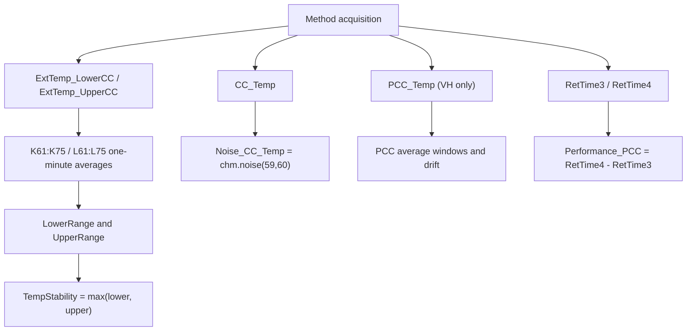

## Contract 4: DB Contract

### 4.1 VH-C10-A DB Leaves

| DB Field | Report file | Sheet | Cell / source | Rule |
|---|---|---|---|---|
| `TempStability` | `Temperature Stability_and_PCC_H.XLS` | `Temp Stability_Noise` | `D26` | Displayed max lower/upper sensor range. |
| `Noise_CC_Temp` | `Temperature Stability_and_PCC_H.XLS` | `Temp Stability_Noise` | `K86` | `CC_Temp chm.noise(59,60)`. |
| `Noise_PCC_Temp` | `Temperature Stability_and_PCC_H.XLS` | `Temp Stability_Noise` | `K87` | `PCC_Temp chm.noise(59,60)`. |
| `RES_TempStability` | `Temperature Stability_and_PCC_H.XLS` | `Temp Stability_Noise` | `E26` | Pass/fail versus Definitions. |
| `Performance_PCC` | `Temperature Stability_and_PCC_H.XLS` | `PCC` | `D26` | `RetTime4 - RetTime3`, displayed to 2 decimals. |
| `RES_PCC` | `Temperature Stability_and_PCC_H.XLS` | `PCC` | `E26` | Pass/fail versus PCC CoolDownTime. |
| `PCC_Acc_40_Step1` | `Temperature Stability_and_PCC_H.XLS` | `PCC` | `L89` | Average `PCC_Temp` 0..5 min. |
| `PCC_Acc_80` | `Temperature Stability_and_PCC_H.XLS` | `PCC` | `L90` | Average `PCC_Temp` 10..15 min. |
| `PCC_Acc_40_Step2` | `Temperature Stability_and_PCC_H.XLS` | `PCC` | `L91` | Average `PCC_Temp` 19..24 min. |
| `PCC_Drift` | `Temperature Stability_and_PCC_H.XLS` | `PCC` | `K97` | `PCC_Temp` drift over 19..24 min. |

### 4.2 VC/VA DB Leaves

| Device | DB Field | Report file | Sheet | Cell / source | Rule |
|---|---|---|---|---|---|
| VC-C10-A | `TempStability` | `Temperature Stability_C.XLS` | `Temp Stability_Noise` | `D26` | Displayed max lower/upper sensor range. |
| VC-C10-A | `Noise_CC_Temp` | `Temperature Stability_C.XLS` | `Temp Stability_Noise` | `K86` | `CC_Temp chm.noise(59,60)`. |
| VC-C10-A | `RES_TempStability` | `Temperature Stability_C.XLS` | `Temp Stability_Noise` | `E26` | Pass/fail versus Definitions. |
| VA-C10-A | `TempStability` | `Temperature Stability_C.XLS` | `Temp Stability_Noise` | `D26` | Displayed max lower/upper sensor range. |
| VA-C10-A | `Noise_CC_Temp` | `Temperature Stability_C.XLS` | `Temp Stability_Noise` | `K86` | `CC_Temp chm.noise(59,60)`. |
| VA-C10-A | `RES_TempStability` | `Temperature Stability_C.XLS` | `Temp Stability_Noise` | `E26` | Pass/fail versus Definitions. |

## Contract 5: Config Requirement

| Requirement | VH-C10-A | VC-C10-A | VA-C10-A | Failure mode |
|---|---|---|---|---|
| `AUDIT.ColumnComp.ModelNo` device source of truth | Required | Required | Required | Wrong branch/report selection. |
| Column compartment temperature control | Required | Required | Required | `CC.TempReady` never becomes valid. |
| External upper/lower thermometers | Required | Required | Required | Stability cells `K61:K75` / `L61:L75` cannot evaluate. |
| `CC_Temp` raw channel | Required | Required | Required | `Noise_CC_Temp` cannot evaluate. |
| PCC hardware/configuration | Required | Not applicable | Not applicable | VH PCC DB fields cannot evaluate, or non-VH method will fail if PCC commands remain. |
| `PCC_Temp` raw channel | Required | Not applicable | Not applicable | `Noise_PCC_Temp`, PCC accuracy, drift and performance fail. |
| RetTimes `RetTime3` and `RetTime4` | Required | Not applicable | Not applicable | `Performance_PCC` cannot evaluate. |
| Report template branch | `Report_VTCC_V2_12` | `Report_VTCC_V2_12` | `Report_VATCC_V1_01` | DB field mapping points to wrong sheets/cells. |

Generation guardrails:

```text
1. Do not generate the VH method for a non-PCC TCC configuration.
2. Do not generate the VC/VA method when VH PCC DB fields are requested.
3. Do not shorten the acquisition window unless `Temp Stability_Noise` formulas are also regenerated.
4. Keep external lower and upper thermometer ranges separate in report formulas.
```

## Contract 6: Open Verification

Items below are marked Open Verification Required until the listed evidence is
captured.

| # | Uncertain point | Required evidence | Likely source |
|---:|---|---|---|
| 1 | Full line-by-line command script for `TEMPERATURE_STABILITY_70_C` beyond the decoded summary. | Embedded method flow text for VC/VA non-PCC branch. | `knowledge_base/tcc_reverse_probe/VC/.../TEMPERATURE_STABILITY_70_C_embedded_method_flow.txt` or CM method editor. |
| 2 | Exact FormulaOne workbook formulas for `D26`, `E26`, and PCC summary/pass cells. | Workbook formula extraction or verified Excel open view. | Report template `SpreadSheetData` / Excel export. |
| 3 | Whether Stability has any hidden IRC insertion path in production workflows. | Full processing method action rows. | Processing method XML / Chromeleon UI. |
| 4 | Exact acceptance limits in `Definitions` for each template and model. | Definitions sheet values for VTCC and VATCC templates. | Report template workbook layer. |
| 5 | Whether VA `Report_VATCC_V1_01` has identical `Temp Stability_Noise` cell layout. | VA-specific report formula export. | Real VA CMBX report template. |

## VH / VC / VA Comparison

| Question | VH-C10-A | VC-C10-A | VA-C10-A |
|---|---|---|---|
| Which injection is used? | `Temperature Stability_and_PCC_H` | `Temperature Stability_C` | `Temperature Stability_C` |
| Which method is used? | `TEMPERATURE_STABILITY_AND_PCC_70_H` | `TEMPERATURE_STABILITY_70_C` | `TEMPERATURE_STABILITY_70_C` |
| Is PCC tested? | Yes | No | No |
| Does the method emit RetTimes for this test? | Yes, RetTime2/3/4 | No evidence in decoded summary | No evidence in decoded summary |
| Which raw channels drive stability? | `ExtTemp_LowerCC`, `ExtTemp_UpperCC` | Same | Same |
| Which raw channels drive noise? | `CC_Temp`, `PCC_Temp` | `CC_Temp` | `CC_Temp` |
| Which DB fields are unique? | PCC performance, PCC result, PCC accuracy/drift/noise | None | None |

## Command, Report, DB Flow

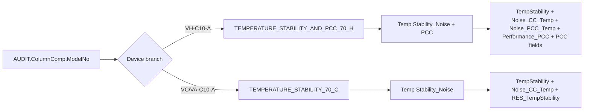

## Generation Readiness

| Use case | Readiness | Reason |
|---|---|---|
| Reuse full VH Stability/PCC branch from existing CMBX | High | Method/report/DB chain is mostly closed and RetTime semantics are known. |
| Reuse full VC/VA non-PCC stability branch from existing CMBX | Medium | DB/report chain is closed; line-level method flow still needs one more evidence pass. |
| Generate shortened stability test without changing report | Not ready | Report windows are hard-coded to 45..60 and 59..60 min. |
| Split VH PCC into a standalone test | Partial | PCC formulas and RetTimes are known, but report/template rewrite and sequence binding need verification. |
| Merge Stability with another temperature test | Partial | Shared external thermometer resources are clear; report windows and timing conflicts need a dependency model. |

<a id="tcc-heat-cool"></a>
## B009: Heat-up/cool-down black box

Build source name: `TCC_HEATUP_COOLDOWN_BLACK_BOX_DECOMPOSITION.md`

# TCC HeatUp and CoolDown Black Box Decomposition

Extraction date: 2026-07-10

Scope: TCC FOQ HeatUp and CoolDown Time for `VH-C10-A`, `VC-C10-A`, and `VA-C10-A`.

---
Test name: HeatUp and CoolDown
Models: VH-C10-A / VC-C10-A / VA-C10-A
Status: first black-box decomposition complete; row-65/row-66 workbook layout remains open verification
---

This document decomposes the HeatUp and CoolDown test as a generation contract.
The core of this test is RetTime event semantics:

```text
Heat-up performance = RetTime3 - RetTime1 - 2.0 min
Cool-down performance = RetTime6 - RetTime4 - 2.0 min
```

The `2.0 min` subtraction is not an arbitrary formatting correction. It removes
the stable-hold time that is intentionally included by the method triggers.

## Evidence Sources

| Evidence | Source |
|---|---|
| Test intent node | `cmbx_data_explorer/docs/TCC_TEST_KNOWLEDGE_NODE_MODEL.md` |
| FOQ TD extracted KB | `cmbx_data_explorer/docs/FOQ_TCC_VX_C10_A_TD_KNOWLEDGE_MANAGEMENT.md` |
| Injection workbench notes | `cmbx_data_explorer/docs/TCC_INJECTION_BY_INJECTION_REVERSE_WORKBENCH.md` |
| Method/report alignment | `cmbx_data_explorer/docs/TCC_METHOD_REPORT_ALIGNMENT.md` |
| Decoded method contract, VH | `knowledge_base/tcc_method_contracts/VH_6000001_TEMP_HEAT_UP_DOWN_20_50_20_contract.md` |
| Method flow, VH | `knowledge_base/tcc_reverse_probe/VH/6000001/TEMP_HEAT_UP_DOWN_20_50_20_embedded_method_flow.txt` |
| Method flow, VC | `knowledge_base/tcc_reverse_probe/VC/3000004/TEMP_HEAT_UP_DOWN_20_50_20_embedded_method_flow.txt` |
| Method flow, VA | `knowledge_base/tcc_reverse_probe/VA/0000003/TEMP_HEAT_UP_DOWN_20_50_20_embedded_method_flow.txt` |
| Report formula objects | `knowledge_base/tcc_report_formula_objects_vh_6000001_all_sheets.tsv` |
| Formula/evaluator rule | `cmbx_data_explorer/foq_alignment_catalog.py`, `cmbx_data_explorer/report_calculation_map.py`, `cmbx_data_explorer/CM_FORMULA_REVERSE_ENGINEERING.md` |
| DB mapping | `foq/FOQResultLocations_V2.83.xls` |

## Executive Answer

1. All three TCC variants use the same instrument method:
   `TEMP_HEAT_UP_DOWN_20_50_20`.
2. The method starts from a cold/preconditioned state, stabilizes near 20 C,
   heats to 50 C, then cools back to 20 C.
3. Both internal CC temperature and the external upper thermometer are used as
   guards. The report performance result uses the internal CC RetTime anchors:
   `RetTime3` and `RetTime6`.
4. `RetTime1` is the start of heat-up after both external and internal 20 C
   readiness conditions are satisfied.
5. `RetTime3` is the internal CC 50 C event after the required stable-hold
   period. The heat-up DB value is `RetTime3 - RetTime1 - 2.0`.
6. `RetTime4` is the start of cool-down after both 50 C conditions are
   satisfied.
7. `RetTime6` is the internal CC 20 C event after the required stable-hold
   period. The cool-down DB value is `RetTime6 - RetTime4 - 2.0`.
8. The report sheet exposes both row-65 and row-66 RetTime cells. The verified
   evaluator/DB rule uses `RetTime3/RetTime1` and `RetTime6/RetTime4`; the exact
   FormulaOne workbook route remains open verification until workbook formula
   parsing is complete.

## Contract 1: Method Command

### 1.1 Device Branch Binding

| Device | Injection | Instrument Method | Processing Method | Report Template | Report Sheets |
|---|---|---|---|---|---|
| VH-C10-A | `HeatUp and CoolDownTime` | `TEMP_HEAT_UP_DOWN_20_50_20` | `No_Integration` | `Report_VTCC_V2_12` | `HeatUp&CoolDown` |
| VC-C10-A | `HeatUp and CoolDownTime` | `TEMP_HEAT_UP_DOWN_20_50_20` | `CORRECT_ACCURACY_INJ_INSERTION` | `Report_VTCC_V2_12` | `HeatUp&CoolDown` |
| VA-C10-A | `HeatUp and CoolDownTime` | `TEMP_HEAT_UP_DOWN_20_50_20` | `No_Integration` | `Report_VATCC_V1_01` | `HeatUp&CoolDown` |

### 1.2 Method Contract Summary

Decoded method evidence:

```yaml
method: TEMP_HEAT_UP_DOWN_20_50_20
stages:
  - InstrumentSetup
  - Equilibration
  - InjectPreparation
  - StartRun
  - Run
  - StopRun
  - PostRun
setpoints:
  - ColumnComp.CC.Temperature.Nominal: 17.0
  - ColumnComp.CC.Temperature.Nominal: 20.0
  - ColumnComp.CC.Temperature.Nominal: 50.0
  - ColumnComp.CC.Temperature.Nominal: 20.0
wait_conditions:
  - CC.TempReady
ret_times:
  initialized:
    - RetTimes.RetTime1
    - RetTimes.RetTime2
    - RetTimes.RetTime3
    - RetTimes.RetTime4
    - RetTimes.RetTime5
    - RetTimes.RetTime6
  emitted:
    - RetTimes.RetTime1
    - RetTimes.RetTime2
    - RetTimes.RetTime3
    - RetTimes.RetTime4
    - RetTimes.RetTime5
    - RetTimes.RetTime6
logged_properties:
  - GenericLong9
channels:
  - ColumnComp.CC_Temp
  - ColumnComp.CC_U_Temp_Actual
  - ColumnComp.CC_L_Temp_Actual
  - ColumnComp.CC_UCTL_TempRear_Actual
  - ColumnComp.PWM_CCU_A
  - ColumnComp.PWM_CCU_B
  - ColumnComp.PWM_CCL_A
  - ColumnComp.PWM_CCL_B
  - ColumnComp.Fan_Rear_ActualRPM
  - Thermometer1.ExtTemp_UpperCC
  - Thermometer1.ExtTemp_LowerCC
  - Thermometer.Environment_Temperature
  - ColumnComp.LEDBoard_LeakDiff
  - ColumnComp.LEDBoard_A13
  - ColumnComp.LEDBoard_A14
  - ColumnComp.Oven_Gas_MuteTimeRemain
```

### 1.3 Trigger and RetTime Semantics

| RetTime | Trigger / command evidence | Physical meaning | Report role |
|---|---|---|---|
| `RetTime1` | `T_UP` fires after `T_Start_Ext` and `T_Start_Int`; then method sets nominal to 50 C and writes `RetTimes.RetTime1 = System.Retention`. | Start of heat-up after internal and external sensors have been stable around 20 C. | Heat-up start anchor. |
| `RetTime2` | `T_50_Ext`: external upper thermometer in 49..51 C for 120 s. | External upper thermometer reaches/holds 50 C. | Layout/intermediate evidence; not the verified DB heat-up endpoint. |
| `RetTime3` | `T_50_Int`: internal CC in 49..51 C for 120 s. | Internal CC reaches/holds 50 C. | Heat-up end anchor for DB rule. |
| `RetTime4` | `T_DOWN` fires after external and internal 50 C events; method writes RetTime4 and sets nominal to 20 C. | Start of cool-down after both 50 C conditions are satisfied. | Cool-down start anchor. |
| `RetTime5` | `T_20_Ext`: external upper thermometer in 19..21 C for 120 s after cool-down. | External upper thermometer returns/holds 20 C. | Layout/intermediate evidence; not the verified DB cool-down endpoint. |
| `RetTime6` | `T_20_Int`: internal CC in 19..21 C for 120 s after cool-down. | Internal CC returns/holds 20 C. | Cool-down end anchor for DB rule. |

### 1.4 Command Flow

| Order | Command group | Meaning | Generation constraint |
|---:|---|---|---|
| 1 | Determine page/model context | Set `Variables.GenericLong9` from `ColumnComp.ModelNo`; abort if unknown. | Keeps report/page context aligned with model. |
| 2 | Configure CC readiness | Set `ReadyTempDelta = 0.5 C`, `EquilibrationTime = 0.5 min`, `TempCtrl = On`, `CC.Mode = StillAir`. | Defines readiness and stable holds used by triggers. |
| 3 | Initialize state variables | Set `GenericLong0..3 = 0` and `RetTimes.RetTime1..6 = 0`. | Required for trigger state machine. |
| 4 | Precondition cold/start state | Set nominal to 17 C, then wait for `CC.TempReady`. | Ensures comparable start before moving to 20 C. |
| 5 | Start acquisition | Acquire CC internal/debug channels, external thermometers, environment and leak channels. | Required to evaluate triggers and report traces. |
| 6 | Stabilize around 20 C | Set nominal to 20 C; wait for external and internal 19..21 C true-time conditions. | Defines the initial stable state. |
| 7 | Start heat-up | Fire `T_UP`; set nominal to 50 C; emit `RetTime1`. | Heat-up start anchor. |
| 8 | Evaluate 50 C external/internal events | Emit `RetTime2` for external upper, `RetTime3` for internal CC. | `RetTime3` is report/DB heat-up endpoint. |
| 9 | Start cool-down | Fire `T_DOWN`; emit `RetTime4`; set nominal to 20 C. | Cool-down start anchor. |
| 10 | Evaluate 20 C external/internal events | Emit `RetTime5` for external upper, `RetTime6` for internal CC. | `RetTime6` is report/DB cool-down endpoint. |
| 11 | End run and stop acquisition | Fire `END_RUN`, turn channels off, run `End`. | Required cleanup. |

## Contract 2: Processing Method

Known sequence bindings:

| Device | Processing Method | Status |
|---|---|---|
| VH-C10-A | `No_Integration` | Current TKN/sample evidence. |
| VC-C10-A | `CORRECT_ACCURACY_INJ_INSERTION` | Current TKN/sample evidence; exact reason/action remains open. |
| VA-C10-A | `No_Integration` | Current TKN/sample evidence. |

Interpretation:

```text
The heat/cool calculation itself is method/report-driven and does not require
peak integration. The VC branch using CORRECT_ACCURACY_INJ_INSERTION is sequence
context evidence, not proof that heat/cool itself needs corrective IRC.
```

Open verification:

| Item | Required evidence | Likely source |
|---|---|---|
| Why VC binds `CORRECT_ACCURACY_INJ_INSERTION` on this row while VH/VA use `No_Integration`. | Full processing method action rows and loaded CM sequence UI. | Processing method XML / Chromeleon UI. |
| Whether any pass/fail action can stop later sequence execution based on HeatUp/CoolDown result. | Processing method business rows. | Processing method payload. |

## Contract 3: Report Formula

### 3.1 `HeatUp&CoolDown` Formula Objects

Known SheetObject formulas:

| Cell | Formula | Meaning |
|---|---|---|
| `J65` | `AUDIT.RetTime1(1.000,"forward")` | Heat-up start anchor in row 65 layout. |
| `K65` | `AUDIT.RetTime3(1.000,"forward")` | Internal 50 C endpoint in row 65 layout. |
| `L65` | `AUDIT.RetTime4(1.000,"forward")` | Cool-down start anchor in row 65 layout. |
| `M65` | `AUDIT.RetTime6(1.000,"forward")` | Internal 20 C endpoint in row 65 layout. |
| `J66` | `AUDIT.RetTime1(1.000,"forward")` | Heat-up start anchor in row 66 layout. |
| `K66` | `AUDIT.RetTime2(1.000,"forward")` | External 50 C endpoint in row 66 layout. |
| `L66` | `AUDIT.RetTime4(1.000,"forward")` | Cool-down start anchor in row 66 layout. |
| `M66` | `AUDIT.RetTime5(1.000,"forward")` | External 20 C endpoint in row 66 layout. |
| `L57` | `AUDIT.ColumnComp.CC.Temperature.Nominal(AUDIT.RetTime1(1,"forward")-0.1)` | Nominal before heat-up start. |
| `L58` | `AUDIT.ColumnComp.CC.Temperature.Nominal(AUDIT.RetTime2(1,"forward")-0.1)` | Nominal before external 50 C event. |

### 3.2 Verified Workbook/DB Rule

Current evaluator and DB mapping use the following final rule:

```text
HeatUp_Time_20to50 = RetTime3 - RetTime1 - 2.0 min
CoolDown_Time_50to20 = RetTime6 - RetTime4 - 2.0 min
```

Display rule:

```text
HeatUp_Time_20to50 displayed to 1 decimal
CoolDown_Time_50to20 displayed to 1 decimal
Pass/fail uses the resulting time <= Definitions!HeatUp & Cool Down
```

### 3.3 Row 65 / Row 66 Risk

The report layout exposes both internal and external endpoints:

```text
Row 65: RetTime1 / RetTime3 / RetTime4 / RetTime6
Row 66: RetTime1 / RetTime2 / RetTime4 / RetTime5
```

The currently verified DB/evaluator contract uses the internal endpoints
`RetTime3` and `RetTime6`. Until the FormulaOne workbook formula parser is
complete, generated reports should preserve all six RetTimes and both visible
row layouts rather than deleting the external endpoint RetTimes.

### 3.4 Formula Flow

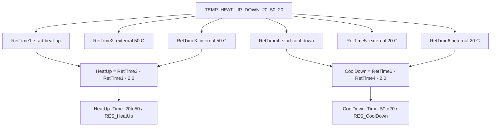

## Contract 4: DB Contract

### 4.1 DB Leaves

| Device | DB Field | Report file | Sheet | Cell | Rule |
|---|---|---|---|---|---|
| VH-C10-A | `HeatUp_Time_20to50` | `HeatUp and CoolDownTime.XLS` | `HeatUp&CoolDown` | `D26` | `RetTime3 - RetTime1 - 2.0`, displayed to 1 decimal. |
| VH-C10-A | `CoolDown_Time_50to20` | `HeatUp and CoolDownTime.XLS` | `HeatUp&CoolDown` | `D27` | `RetTime6 - RetTime4 - 2.0`, displayed to 1 decimal. |
| VH-C10-A | `RES_HeatUp` | `HeatUp and CoolDownTime.XLS` | `HeatUp&CoolDown` | `E26` | Pass if heat-up time <= Definitions. |
| VH-C10-A | `RES_CoolDown` | `HeatUp and CoolDownTime.XLS` | `HeatUp&CoolDown` | `E27` | Pass if cool-down time <= Definitions. |
| VC-C10-A | same four fields | `HeatUp and CoolDownTime.XLS` | `HeatUp&CoolDown` | `D26:D27`, `E26:E27` | Same rule. |
| VA-C10-A | same four fields | `HeatUp and CoolDownTime.XLS` | `HeatUp&CoolDown` | `D26:D27`, `E26:E27` | Same rule. |

### 4.2 DB Boundary

This test's DB contract is timing-only:

```text
No temperature accuracy, precision, stability or PCC DB fields should be
attached to this test unless the report/DB mapping is deliberately changed.
```

## Contract 5: Config Requirement

| Requirement | VH-C10-A | VC-C10-A | VA-C10-A | Failure mode |
|---|---|---|---|---|
| `AUDIT.ColumnComp.ModelNo` source of truth | Required | Required | Required | Wrong page/report context. |
| Column compartment CC control | Required | Required | Required | 20/50/20 transitions cannot execute. |
| `CC.TempReady` | Required | Required | Required | Start/equilibration readiness invalid. |
| `CC.Temperature.Value` / internal CC signal | Required | Required | Required | `RetTime3` and `RetTime6` cannot be emitted. |
| External upper thermometer | Required | Required | Required | `RetTime2` and `RetTime5` cannot be emitted; guards incomplete. |
| External lower thermometer | Acquired | Acquired | Acquired | Diagnostic/report trace incomplete, even if final DB timing uses upper/internal anchors. |
| Full RetTime1..6 contract | Required | Required | Required | Report layout and DB timing cannot be reconstructed. |
| Method timing / stable holds | Required | Required | Required | `-2.0 min` report correction becomes invalid. |

Generation guardrails:

```text
1. Do not remove RetTime2 or RetTime5 even though the final DB rule uses
   RetTime3 and RetTime6; the visible report layout still exposes them.
2. If the stable hold duration changes, the `-2.0 min` report rule must also
   change.
3. If using external endpoints instead of internal endpoints, the DB/report
   contract must be rewritten and explicitly validated.
4. A cut-down heat-only method can reuse only the heat-up half if the report and
   DB contract are also split or regenerated.
```

## Contract 6: Open Verification

Items below are marked Open Verification Required until the listed evidence is
captured.

| # | Uncertain point | Required evidence | Likely source |
|---:|---|---|---|
| 1 | Exact FormulaOne workbook route from row 65/66 cells to `D26:D27`. | Workbook formula extraction. | `SpreadSheetData` / FormulaOne parser. |
| 2 | Why VC uses `CORRECT_ACCURACY_INJ_INSERTION` while VH/VA use `No_Integration`. | Processing method action table and CM sequence view. | Processing method XML / Chromeleon UI. |
| 3 | Exact `Definitions!HeatUp & Cool Down` limit by report template. | Definitions sheet values. | VTCC/VATCC report template workbook layer. |
| 4 | Whether VA `Report_VATCC_V1_01` uses identical row 65/66 layout. | VA-specific report formula object export. | Real VA CMBX report template. |
| 5 | Whether external endpoint timing is used in any printed/internal report page even if DB uses internal endpoint timing. | Full exported report comparison. | CM report export / Excel workbook. |

## VH / VC / VA Comparison

| Question | VH-C10-A | VC-C10-A | VA-C10-A |
|---|---|---|---|
| Which injection is used? | `HeatUp and CoolDownTime` | `HeatUp and CoolDownTime` | `HeatUp and CoolDownTime` |
| Which method is used? | `TEMP_HEAT_UP_DOWN_20_50_20` | `TEMP_HEAT_UP_DOWN_20_50_20` | `TEMP_HEAT_UP_DOWN_20_50_20` |
| Which processing method is used? | `No_Integration` | `CORRECT_ACCURACY_INJ_INSERTION` | `No_Integration` |
| Which RetTimes are emitted? | `RetTime1..6` | `RetTime1..6` | `RetTime1..6` |
| Which report sheet is used? | `HeatUp&CoolDown` | `HeatUp&CoolDown` | `HeatUp&CoolDown` |
| Which template family is used? | `Report_VTCC_V2_12` | `Report_VTCC_V2_12` | `Report_VATCC_V1_01` |

## Command, Report, DB Flow

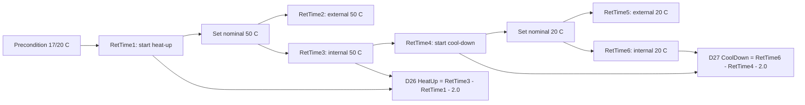

## Generation Readiness

| Use case | Readiness | Reason |
|---|---|---|
| Reuse full HeatUp/CoolDown branch from existing CMBX | High | Method/report/DB chain is closed enough for full reuse. |
| Generate heat-up-only package | Partial | Method half is clear, but report/DB must be split or regenerated. |
| Change stable hold duration | Not ready with existing report | The `-2.0 min` rule is hard-coded in evaluator/report contract. |
| Change temperature range, e.g. 25->45->25 | Partial | Method trigger thresholds and report field names/criteria must be regenerated. |
| Use external endpoint timing instead of internal endpoint timing | Not ready | Requires explicit report/DB contract change and CM export verification. |

<a id="tcc-leak"></a>
## B010: Liquid leak black box

Build source name: `TCC_LIQUID_LEAK_BLACK_BOX_DECOMPOSITION.md`

# TCC Liquid Leak Black Box Decomposition

Extraction date: 2026-07-10

Scope: TCC FOQ Liquid Leak / Keypad test for `VH-C10-A`, `VC-C10-A`, and
`VA-C10-A`.

---
Test name: Liquid Leak / Keypad
Models: VH-C10-A / VC-C10-A / VA-C10-A
Status: first black-box decomposition complete; exact workbook pass/fail result
cells remain open verification
---

This document decomposes the Liquid Leak test as a generation contract. It is a
manual-interaction safety sensor test:

```text
Method evidence:
  turn LiquidLeakSensor On
  ask operator to inject 5 mL water
  wait LiquidLeak = Leak
  log LiquidLeak
  ask operator to press MUTE ALARM
  wait ColumnComp.Alarm = NoAlarm
  turn LiquidLeakSensor Off
  ask operator to remove remaining liquid

Report evidence:
  K47 = precond.LiquidLeakCalibrationValue
  M47 = AUDIT.LiquidLeak(100.000,"backward")
```

Unlike temperature tests, this method is not a raw-signal calculation and does
not write RetTimes. The report validates audit/precondition evidence for a
sensor workflow that requires physical water injection and operator alarm
confirmation.

## Evidence Sources

| Evidence | Source |
|---|---|
| Test intent node | `cmbx_data_explorer/docs/TCC_TEST_KNOWLEDGE_NODE_MODEL.md` |
| Injection workbench notes | `cmbx_data_explorer/docs/TCC_INJECTION_BY_INJECTION_REVERSE_WORKBENCH.md` |
| Method/report alignment | `cmbx_data_explorer/docs/TCC_METHOD_REPORT_ALIGNMENT.md` |
| Required symbols | `cmbx_data_explorer/docs/TCC_REQUIRED_SYMBOL_MANIFEST.md` |
| Method flow, VH | `knowledge_base/tcc_reverse_probe/VH/6000001/LIQUID LEAK_embedded_method_flow.txt` |
| Method flow, VC | `knowledge_base/tcc_reverse_probe/VC/3000004/LIQUID LEAK_embedded_method_flow.txt` |
| Method flow, VA | `knowledge_base/tcc_reverse_probe/VA/0000003/LIQUID LEAK_embedded_method_flow.txt` |
| Report formula objects | `knowledge_base/tcc_report_formula_objects_vh_6000001_all_sheets.tsv` |
| DB mapping | `foq/FOQResultLocations_V2.83.xls` |

## Executive Answer

1. The instrument method is `LIQUID LEAK`.
2. VH/VC/VA method flows are materially the same for the leak workflow.
3. The method sets the CC to 20 C / StillAir context, then turns
   `ColumnComp.LiquidLeakSensor` on.
4. The operator must inject 5 mL water into the compartment and later press
   `MUTE ALARM` on the instrument keypad.
5. The method waits for `LiquidLeak=Leak`, logs `LiquidLeak`, then waits until
   `ColumnComp.Alarm = NoAlarm`.
6. It turns `LiquidLeakSensor` off only if `ColumnComp.Alarm=NoAlarm`; otherwise
   it aborts.
7. The report sheet is `Liquid Leak Test`; source cells are `K47` and `M47`.
8. No FOQ DB fields are mapped for this injection in `FOQResultLocations_V2.83.xls`.
9. This method should not be reduced to an automatic sensor read. The physical
   water injection, mute, and cleanup prompts are part of the test contract.

## Contract 1: Method Command

### 1.1 Device Branch Binding

| Device | Injection | Instrument Method | Processing Method | Report Template | Report Sheets | Status |
|---|---|---|---|---|---|---|
| VH-C10-A | `LiquidLeaktest` | `LIQUID LEAK` | `No_Integration` | `Report_VTCC_V2_12` | `Liquid Leak Test`, `Valve_Keypad` context | sequence evidence closed |
| VC-C10-A | `LiquidLeaktest` | `LIQUID LEAK` | `CORRECT_ACCURACY_INJ_INSERTION` | `Report_VTCC_V2_12` | `Liquid Leak Test`, `Valve_Keypad` context | sequence evidence closed |
| VA-C10-A | `LiquidLeaktest` | `LIQUID LEAK` | `No_Integration` | `Report_VATCC_V1_01` | `Liquid Leak Test`, `Valve_Keypad` context | sequence evidence closed |

### 1.2 Method Contract Summary

Decoded method evidence:

```yaml
method: LIQUID LEAK
stages:
  - InstrumentSetup
  - Equilibration
  - StartRun
  - Run
  - StopRun
  - PostRun
setup:
  ColumnComp.CC.ReadyTempDelta: None
  ColumnComp.CC.EquilibrationTime: 0.5
  ColumnComp.CC.TempCtrl: On
  ColumnComp.CC.Temperature.Nominal: 20 C
  ColumnComp.CC.Mode: StillAir
  Variables.GenericBool1: 0
  END_RUN_trigger: Variables.GenericBool1 = 1 AND System.Retention > 0.01
  ColumnComp.LiquidLeakSensor: On
acquisition_channels:
  - ColumnComp.CC_Temp
  - ColumnComp.CC_U_Temp_Actual
  - ColumnComp.CC_L_Temp_Actual
  - ColumnComp.CC_UCTL_TempRear_Actual
  - ColumnComp.PWM_CCU_A
  - ColumnComp.PWM_CCU_B
  - ColumnComp.PWM_CCL_A
  - ColumnComp.PWM_CCL_B
  - ColumnComp.Fan_Rear_ActualRPM
  - Thermometer1.ExtTemp_UpperCC
  - Thermometer1.ExtTemp_LowerCC
  - Thermometer.Environment_Temperature
  - ColumnComp.LEDBoard_LeakDiff
  - ColumnComp.LEDBoard_A13
  - ColumnComp.LEDBoard_A14
  - ColumnComp.Oven_Gas_MuteTimeRemain
```

### 1.3 Command Flow

```yaml
LIQUID_LEAK_Command_Flow:
  - order: 1
    stage: Equilibration
    command: SET
    target: ColumnComp.CC.Temperature.Nominal
    value: 20 C
    note: Performs leak test at nominal 20 C state.
  - order: 2
    stage: Equilibration
    command: SET
    target: ColumnComp.LiquidLeakSensor
    value: On
    note: Enables leak sensor after safe setup.
  - order: 3
    stage: StartRun
    command: WAIT
    condition: ColumnComp.CC.TempReady
    note: Waits until the module is in ready thermal state.
  - order: 4
    stage: StartRun
    command: IF_OR_ABORT
    condition: Door = Closed AND LiquidLeak = NoLeak
    result: prompt operator to inject 5 mL water
    note: Aborts if the starting state is already unsafe or not clean.
  - order: 5
    stage: StartRun
    command: ACQ_ON
    target: CC, PWM, fan, external thermometer, LEDBoard leak channels
    note: Captures diagnostic context while leak event is provoked.
  - order: 6
    stage: Run
    command: WAIT
    condition: LiquidLeak = Leak
    timeout: 2.00 min
    note: Core leak detection event.
  - order: 7
    stage: Run
    command: LOG
    target: LiquidLeak
    note: Creates audit evidence consumed by report cell M47.
  - order: 8
    stage: Run
    command: MESSAGE
    target: operator
    note: Ask operator to press MUTE ALARM on the instrument keypad.
  - order: 9
    stage: Run
    command: WAIT
    condition: ColumnComp.Alarm = NoAlarm
    note: Confirms alarm mute/clear workflow.
  - order: 10
    stage: Run
    command: IF_OR_ABORT
    condition: ColumnComp.Alarm = NoAlarm
    result: ColumnComp.LiquidLeakSensor = Off
    note: Does not disable sensor unless alarm state is clean.
  - order: 11
    stage: Run
    command: MESSAGE
    target: operator
    note: Ask operator to absorb/remove remaining liquid and close door.
  - order: 12
    stage: Run
    command: SET
    target: Variables.GenericBool1
    value: 1
    note: Allows END_RUN trigger to finish normally.
  - order: 13
    stage: StopRun
    command: ACQ_OFF
    target: all acquired channels
    note: Cleanly closes acquisition.
```

### 1.4 RetTime and Channel Semantics

| Item | Status | Reason |
|---|---|---|
| RetTimes | not used | No `RetTimes.RetTimeN` assignments in decoded method. |
| `System.Retention` | used by end trigger only | `END_RUN` requires `System.Retention > 0.01`; it is not written to report as RetTime. |
| Raw signal result channels | diagnostic context | LEDBoard and CC channels are acquired, but report formula objects use audit/precondition fields. |
| `LiquidLeak` | audit result | Logged after `LiquidLeak=Leak`; report reads `AUDIT.LiquidLeak(100.000,"backward")`. |
| `LiquidLeakCalibrationValue` | precondition metadata | Report reads `precond.LiquidLeakCalibrationValue`. |

## Contract 2: Processing Method

Known sequence bindings:

| Device | Processing Method | IRC / corrective role | Status |
|---|---|---|---|
| VH-C10-A | `No_Integration` | no integration expected | verified from sequence binding |
| VC-C10-A | `CORRECT_ACCURACY_INJ_INSERTION` | corrective processing binding preserved in VC sequence | verified from TKN/package map; pass-action semantics open |
| VA-C10-A | `No_Integration` | no integration expected | verified from TKN/package map |

Processing interpretation:

- The result does not depend on peak integration.
- Full-sequence generation should preserve the device-specific processing method
  binding.
- Standalone leak diagnostic packages can probably use `No_Integration`, but the
  VC corrective binding should remain Open Verification Required until
  processing pass actions are decoded.

## Contract 3: Report Formula

### 3.1 `Liquid Leak Test` Formula Objects

Known VTCC formula objects:

| Cell | Formula | Meaning |
|---|---|---|
| `K47` | `precond.LiquidLeakCalibrationValue` | Leak sensor calibration value at injection start |
| `M47` | `AUDIT.LiquidLeak(100.000,"backward")` | Last leak state at or before 100 min audit lookup |

### 3.2 Workbook-Derived Rules

Known interpretation:

```text
Liquid leak detection evidence:
  method waits for LiquidLeak=Leak
  method logs LiquidLeak
  report reads AUDIT.LiquidLeak(100.000,"backward")

Calibration evidence:
  report reads precond.LiquidLeakCalibrationValue

Keypad/mute evidence:
  method waits for ColumnComp.Alarm = NoAlarm after the operator presses MUTE ALARM
  exact report result cell is not fully parsed yet
```

Formula flow:

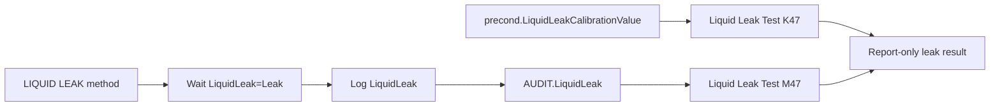

## Contract 4: DB Contract

### 4.1 DB Leaves

| Device | Injection | DB mapping status | Notes |
|---|---|---|---|
| VH-C10-A | `LiquidLeaktest` | no DB contract expected | `FOQResultLocations_V2.83.xls` has no mapped DB leaves for `TCC_LEAK_01`. |
| VC-C10-A | `LiquidLeaktest` | no DB contract expected | same as VH |
| VA-C10-A | `LiquidLeaktest` | no DB contract expected | same as VH |

### 4.2 DB Is Not the Evidence Driver

```text
LIQUID LEAK command flow
-> physical water injection + leak sensor state
-> audit log LiquidLeak and alarm mute state
-> Liquid Leak Test report cells
-> no DB leaves in current FOQ mapping
```

## Contract 5: Config Requirement

| Requirement | VH-C10-A | VC-C10-A | VA-C10-A | Failure mode |
|---|---|---|---|---|
| `AUDIT.ColumnComp.ModelNo` source of truth | Required | Required | Required | Wrong branch/report template |
| `ColumnComp.LiquidLeakSensor` | Required | Required | Required | leak sensor cannot be enabled/disabled |
| `ColumnComp.LiquidLeakSensorCalibrate` | Required by configuration manifest | Required by configuration manifest | Required by configuration manifest | calibration value may be missing/stale |
| `LiquidLeak` audit property | Required | Required | Required | report cell `M47` cannot be evaluated |
| `precond.LiquidLeakCalibrationValue` | Required | Required | Required | report cell `K47` cannot be evaluated |
| `ColumnComp.Alarm` | Required | Required | Required | mute/no-alarm confirmation cannot complete |
| `ColumnComp.CmdString` LedBar force color commands | Required by method | Required by method | Required by method | operator-guidance LED behavior missing |
| `ColumnComp.LEDBoard_LeakDiff`, `LEDBoard_A13`, `LEDBoard_A14` | Diagnostic acquisition | Diagnostic acquisition | Diagnostic acquisition | diagnostic trace weaker |
| Operator access to inject water and press MUTE ALARM | Required | Required | Required | FOQ workflow cannot be performed |

Generation implication:

- Do not make this an unattended automatic test unless the intent is explicitly
  a non-FOQ diagnostic.
- Preserve the operator prompts, water injection, MUTE ALARM confirmation, and
  cleanup confirmation for FOQ-like generation.
- Report cells depend on audit/precondition evidence, so the method must log
  `LiquidLeak` after the leak is actually detected.
- The leak sensor should be turned off only after `ColumnComp.Alarm = NoAlarm`.

## Contract 6: Open Verification

Items below are marked Open Verification Required until the listed evidence is
captured.

| # | Open Verification Required | Why it matters | Needed evidence | Likely source |
|---:|---|---|---|---|
| 1 | Exact `Liquid Leak Test` workbook pass/fail cells | Formula objects expose source cells, not final workbook result cells | FormulaOne workbook parse for `Liquid Leak Test` | report `SpreadSheetData` |
| 2 | VATCC leak report formulas | Current extracted formula objects are VTCC; VA report branch should be confirmed | VA report formula object extraction | `Report_VATCC_V1_01` |
| 3 | VC `CORRECT_ACCURACY_INJ_INSERTION` pass-action semantics on leak row | Full sequence should preserve binding; standalone package may not require it | Processing method XML and pass-action trigger map | VC CMBX processing method payload |
| 4 | External vs internal acceptance classification | TKN marks exact field name/criteria open | FOQ TD section and workbook criteria cells | FOQ TD, `Definitions`, `Liquid Leak Test` workbook |
| 5 | Keypad report coupling with `Valve_Keypad` | TKN lists `Valve_Keypad` context, but leak method formula objects are on `Liquid Leak Test` | Report workbook sheet dependencies and print layout | report template |

## VH / VC / VA Comparison

| Aspect | VH-C10-A | VC-C10-A | VA-C10-A |
|---|---|---|---|
| Production injection | `LiquidLeaktest` | `LiquidLeaktest` | `LiquidLeaktest` |
| Instrument method | `LIQUID LEAK` | `LIQUID LEAK` | `LIQUID LEAK` |
| Method body | same leak workflow | same leak workflow | same leak workflow |
| Processing method | `No_Integration` | `CORRECT_ACCURACY_INJ_INSERTION` | `No_Integration` |
| Report template | `Report_VTCC_V2_12` | `Report_VTCC_V2_12` | `Report_VATCC_V1_01` |
| DB fields | none | none | none |
| Generation status | reusable with manual workflow preserved | reusable with processing binding preserved | reusable with manual workflow preserved |

## Generation Readiness

| Generation action | Status | Notes |
|---|---|---|
| Reuse full VH leak row | ready after config validation | Preserve `No_Integration` and operator workflow. |
| Reuse full VC leak row | ready after config validation | Preserve `CORRECT_ACCURACY_INJ_INSERTION` until pass actions are decoded. |
| Reuse full VA leak row | ready after config validation | Method workflow is same; confirm VATCC report formulas before report generation. |
| Generate unattended leak readout | locked for FOQ | Would not satisfy water injection + mute + cleanup workflow. |
| Modify water volume or timeout | locked | Requires TD/report acceptance review. |
| Use leak method as generic keypad test | partial | It validates MUTE ALARM, not the same keypad actions as the `VALVES` method. |

<a id="tcc-service"></a>
## B011: Qualification service black box

Build source name: `TCC_QUALIFICATION_SERVICE_BLACK_BOX_DECOMPOSITION.md`

# TCC Qualification Service Done Black Box Decomposition

Extraction date: 2026-07-10

Scope: TCC FOQ `Qualification_Service_Done` injection for `VH-C10-A`,
`VC-C10-A`, and `VA-C10-A`.

---
Test name: Qualification Service Done
Models: VH-C10-A / VC-C10-A / VA-C10-A
Status: first black-box decomposition complete; exact report workbook endpoint
remains open verification
---

This document decomposes the `Qualification_Service_Done` injection as a
generation contract. It is not a measurement method. It writes the service and
qualification completion state to the TCC wellness object and logs the resulting
dates to the audit trail.

```text
Method evidence:
  RUN ColumnComp.ColumnComp_Wellness.QualificationDone
  RUN ColumnComp.ColumnComp_Wellness.ServiceDone
  RUN Log ColumnComp_Wellness.Service.LastDate
  RUN Log ColumnComp_Wellness.Qualification.LastDate
```

There are no RetTimes, no raw channels, and no mapped FOQ DB fields for this
injection in the current TCC mapping. For generation, this row should remain a
separate procedure-state injection rather than being merged into a functional
temperature or sensor test.

## Evidence Sources

| Evidence | Source |
|---|---|
| Test intent node | `cmbx_data_explorer/docs/TCC_TEST_KNOWLEDGE_NODE_MODEL.md` |
| Injection workbench notes | `cmbx_data_explorer/docs/TCC_INJECTION_BY_INJECTION_REVERSE_WORKBENCH.md` |
| Method/report alignment | `cmbx_data_explorer/docs/TCC_METHOD_REPORT_ALIGNMENT.md` |
| Required symbols | `cmbx_data_explorer/docs/TCC_REQUIRED_SYMBOL_MANIFEST.md` |
| Method flow, VH | `knowledge_base/tcc_reverse_probe/VH/6000001/QUALIFICATION_SERVICE_DONE_embedded_method_flow.txt` |
| Method flow, VC | `knowledge_base/tcc_reverse_probe/VC/3000004/QUALIFICATION_SERVICE_DONE_embedded_method_flow.txt` |
| Method flow, VA | `knowledge_base/tcc_reverse_probe/VA/0000003/QUALIFICATION_SERVICE_DONE_embedded_method_flow.txt` |
| DB mapping | `foq/FOQResultLocations_V2.83.xls` |

## Executive Answer

1. The instrument method is `Qualification_Service_Done`.
2. VH/VC/VA decoded method flows are identical.
3. The method calls `ColumnComp.ColumnComp_Wellness.QualificationDone`.
4. It then calls `ColumnComp.ColumnComp_Wellness.ServiceDone`.
5. It logs `ColumnComp_Wellness.Service.LastDate`.
6. It logs `ColumnComp_Wellness.Qualification.LastDate`.
7. It records no RetTimes and starts no raw signal channels.
8. The report context is `Internal Use`; formula-object evidence for the exact
   final workbook cell is not yet exposed.
9. `FOQResultLocations_V2.83.xls` has no mapped DB output row for this
   injection, so this is an audit/procedure-state contract, not a DB result
   contract.

## Contract 1: Method Command

### 1.1 Device Branch Binding

| Device | Injection | Instrument Method | Processing Method | Report Template | Report Sheets | Status |
|---|---|---|---|---|---|---|
| VH-C10-A | `Qualification_Service_Done` | `Qualification_Service_Done` | `No_Integration` | `Report_VTCC_V2_12` | `Internal Use` | sequence evidence closed |
| VC-C10-A | `Qualification_Service_Done` | `Qualification_Service_Done` | `CORRECT_ACCURACY_INJ_INSERTION` | `Report_VTCC_V2_12` | `Internal Use` | sequence evidence closed |
| VA-C10-A | `Qualification_Service_Done` | `Qualification_Service_Done` | `No_Integration` | `Report_VATCC_V1_01` | `Internal Use` | sequence evidence closed |

### 1.2 Method Contract Summary

| Contract item | Evidence |
|---|---|
| RetTimes | not used |
| Raw channels | not used |
| Completion command 1 | `ColumnComp.ColumnComp_Wellness.QualificationDone` |
| Completion command 2 | `ColumnComp.ColumnComp_Wellness.ServiceDone` |
| Audit log 1 | `Log ColumnComp_Wellness.Service.LastDate` |
| Audit log 2 | `Log ColumnComp_Wellness.Qualification.LastDate` |
| Manual action | none observed in decoded method flow |
| Abort logic | none observed in decoded method flow |

### 1.3 Decoded Method Flow

```yaml
QUALIFICATION_SERVICE_DONE:
  InstrumentSetup:
    - comment: "Set the Qualification and Service date for service instruments"
  Run:
    - order: 1
      action: RUN
      command: ColumnComp.ColumnComp_Wellness.QualificationDone
      meaning: "Marks qualification as done in the TCC wellness/service object."
    - order: 2
      action: RUN
      command: ColumnComp.ColumnComp_Wellness.ServiceDone
      meaning: "Marks service as done in the TCC wellness/service object."
    - order: 3
      action: RUN Log
      target: ColumnComp_Wellness.Service.LastDate
      meaning: "Writes the resulting service date to audit evidence."
    - order: 4
      action: RUN Log
      target: ColumnComp_Wellness.Qualification.LastDate
      meaning: "Writes the resulting qualification date to audit evidence."
```

### 1.4 Generation Meaning

This method has a high procedural meaning but low calculation complexity. A
generated FOQ sequence should keep it as its own injection because it mutates
service/qualification state. It should not be silently attached to another
method unless a human explicitly confirms that the service-state side effect is
intended.

## Contract 2: Processing Method

### 2.1 Binding

| Device | Processing Method | Meaning |
|---|---|---|
| VH-C10-A | `No_Integration` | No integration/calculation processing required. |
| VC-C10-A | `CORRECT_ACCURACY_INJ_INSERTION` | Corrective processing binding follows the VC sequence pattern; this does not change the decoded service method flow. |
| VA-C10-A | `No_Integration` | No integration/calculation processing required. |

### 2.2 IRC / Corrective Behavior

No `Qualification_Service_Done`-specific IRC insertion was observed in the
decoded method evidence. VC binds the injection to `CORRECT_ACCURACY_INJ_INSERTION`
as part of the broader VC sequence corrective-processing pattern. The exact
pass-action behavior of that processing method remains a separate processing
method black-box item.

## Contract 3: Report Formula

### 3.1 Report Context

| Report evidence | Status |
|---|---|
| Primary sheet/context | `Internal Use` |
| Heavy raw calculation | not expected |
| Formula-object cells | not found in current VH formula object TSV |
| Audit evidence expected | `ColumnComp_Wellness.Service.LastDate`, `ColumnComp_Wellness.Qualification.LastDate` |
| Workbook endpoint | Open Verification Required |

### 3.2 Interpretation

The report contract is currently known as a metadata/audit endpoint. The method
produces audit evidence by logging the two LastDate values. The exact workbook
cell that displays or checks these values is not yet closed because it was not
visible as a `ReportFormulaObject` in the current extracted TSV.

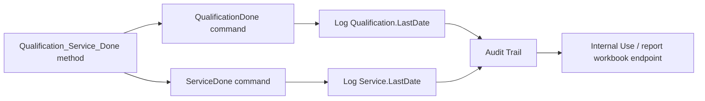

## Contract 4: DB Contract

| DB contract item | Status |
|---|---|
| `RES_Qualification_Service` | listed in alignment as possible intent field but not mapped in `FOQResultLocations_V2.83.xls` |
| Device-specific mapped DB fields | none observed |
| SQL type | not applicable until a DB field is confirmed |
| Precision/display rule | not applicable |

Current conclusion: no DB output contract is closed for
`Qualification_Service_Done`. The row matters because of its method side effect
and report/audit trace, not because it writes a mapped FOQ result field.

## Contract 5: Config Requirement

| Requirement | Why it matters |
|---|---|
| `ColumnComp` device present | The method calls TCC wellness commands under `ColumnComp`. |
| `ColumnComp.ColumnComp_Wellness.QualificationDone` command available | Required to mark qualification completion. |
| `ColumnComp.ColumnComp_Wellness.ServiceDone` command available | Required to mark service completion. |
| `ColumnComp_Wellness.Service.LastDate` property available | Required audit log source. |
| `ColumnComp_Wellness.Qualification.LastDate` property available | Required audit log source. |
| Service-level access if required by CM configuration | Wellness/service commands may depend on the driver/config access level. |

Required-symbol manifest also groups this test with Factory Default / Service
symbols:

```text
ColumnComp.ColumnComp_Wellness.Qualification.Interval
ColumnComp.ColumnComp_Wellness.Qualification.WarningPeriod
ColumnComp.ColumnComp_Wellness.Qualification.GracePeriod
ColumnComp.ColumnComp_Wellness.Service.Interval
ColumnComp.ColumnComp_Wellness.Service.WarningPeriod
ColumnComp.ColumnComp_Wellness.Workload_CC
ColumnComp.ColumnComp_Wellness.QualificationDone
ColumnComp.ColumnComp_Wellness.ServiceDone
```

## Contract 6: Open Verification

| # | Open item | Current evidence | Needed evidence | Likely source |
|---|---|---|---|---|
| 1 | Exact report workbook cell for Service/Qualification date | Method logs LastDate; report context is `Internal Use` | FormulaOne/workbook cell dependency for display/check | report template `SpreadSheetData` |
| 2 | Whether `RES_Qualification_Service` exists in any non-TCC or newer mapping | Current TCC mapping has no row | Confirm against future mapping files | future `FOQResultLocations` versions |
| 3 | Whether wellness commands require service access in live CM | Command names are present in decoded method | Live CM method validation or command help | Chromeleon command browser/help |
| 4 | VC processing method side effect | VC binds `CORRECT_ACCURACY_INJ_INSERTION` | Processing method pass-action decode | processing method XML |

## VH / VC / VA Comparison

| Model | Method flow | Processing branch | Report template | DB mapping | Meaning |
|---|---|---|---|---|---|
| VH-C10-A | same | `No_Integration` | `Report_VTCC_V2_12` | none | service/qualification state write |
| VC-C10-A | same | `CORRECT_ACCURACY_INJ_INSERTION` | `Report_VTCC_V2_12` | none | same method, corrective processing branch differs |
| VA-C10-A | same | `No_Integration` | `Report_VATCC_V1_01` | none | same service/qualification state write |

## Generation Readiness

| Use case | Readiness | Notes |
|---|---|---|
| Clone full FOQ sequence | reusable with caution | Keep injection as separate final-state step. |
| Generate functional temperature-only subset | usually exclude unless explicitly requested | It mutates wellness/service state and is not a measurement result. |
| Generate service completion sequence | partial | Method command flow is clear; report endpoint still needs workbook verification. |
| DB upload/result output | not applicable | No mapped DB contract is currently closed. |

<a id="tcc-factory"></a>
## B012: Factory default black box

Build source name: `TCC_FACTORY_DEFAULT_BLACK_BOX_DECOMPOSITION.md`

# TCC Factory Default Black Box Decomposition

Extraction date: 2026-07-10

Scope: TCC FOQ `Factory Default` injection for `VH-C10-A`, `VC-C10-A`, and
`VA-C10-A`.

---
Test name: Factory Default
Models: VH-C10-A / VC-C10-A / VA-C10-A
Status: method command and DB metadata contract closed; workbook-derived
`ModelVariant` / serial-check formulas still need FormulaOne-level verification
---

This document decomposes the `Factory Default` injection as a generation
contract. It is a final-state cleanup and metadata verification step. It does
not perform a raw measurement, but it mutates service/default state and supplies
the report/DB identity fields used to decide where a FOQ result belongs.

```text
Method evidence:
  disconnect/connect and wait ready
  enter service code
  disable qualification/service reminder intervals
  log qualification/service metadata
  clear exception/error logs and revision strings
  set final CC state: 20 C, TempCtrl Off, LiquidLeakSensor On
  prompt operator to verify valve covers and thermometer serial/location

Report / DB evidence:
  ModelNo = Definitions!C15 = AUDIT.ColumnComp.ModelNo
  Serial = Definitions!D15 = precond.ColumnComp.SerialNo
  Firmware = Definitions!E15 = precond.ColumnComp.FirmwareVersion
  HardwareVersion = Internal Use!E11 = precond.ColumnComp.HardwareVersion
  ModelVariant = Definitions!J8, workbook-derived from module hardware revision family
  RES_SN_Check = Internal Use!F10, workbook-derived serial/sequence check
```

Factory Default is therefore not interchangeable with a data test. It should be
included only when the requested method package needs full FOQ final cleanup and
database identity output.

## Evidence Sources

| Evidence | Source |
|---|---|
| Test intent node | `cmbx_data_explorer/docs/TCC_TEST_KNOWLEDGE_NODE_MODEL.md` |
| Injection workbench notes | `cmbx_data_explorer/docs/TCC_INJECTION_BY_INJECTION_REVERSE_WORKBENCH.md` |
| Method/report alignment | `cmbx_data_explorer/docs/TCC_METHOD_REPORT_ALIGNMENT.md` |
| Required symbols | `cmbx_data_explorer/docs/TCC_REQUIRED_SYMBOL_MANIFEST.md` |
| Formula reverse notes | `cmbx_data_explorer/CM_FORMULA_REVERSE_ENGINEERING.md` |
| Method flow, VH | `knowledge_base/tcc_reverse_probe/VH/6000001/FACTORYDEFAULT_embedded_method_flow.txt` |
| Method flow, VC | `knowledge_base/tcc_reverse_probe/VC/3000004/FACTORYDEFAULT_embedded_method_flow.txt` |
| Method flow, VA | `knowledge_base/tcc_reverse_probe/VA/0000003/FACTORYDEFAULT_embedded_method_flow.txt` |
| Report formula objects | `knowledge_base/tcc_report_formula_objects_vh_6000001_all_sheets.tsv` |
| DB mapping | `foq/FOQResultLocations_V2.83.xls` |

## Executive Answer

1. The instrument method is `FACTORYDEFAULT`.
2. VH/VC/VA decoded method flows are identical.
3. The method writes final service/default state and clears logs.
4. It records no RetTimes and starts no raw data channels.
5. It uses service-state commands such as `GetServiceCode`,
   `ServiceCode = 87794`, `ExceptionLogClear`, and `ErrorLog.Clear`.
6. It disables qualification/service reminder intervals and logs last date,
   operator, operating hours, and workload.
7. It sets final column compartment state to 20 C, temperature control off, and
   liquid leak sensor on.
8. It prompts the operator to verify valve covers and thermometer serial/location
   custom sequence variables.
9. DB fields for this injection are closed for VH/VC/VA in
   `FOQResultLocations_V2.83.xls`.
10. Device identification must use `AUDIT.ColumnComp.ModelNo`; do not infer the
    device from CMBX filename, folder, or sequence naming.

## Contract 1: Method Command

### 1.1 Device Branch Binding

| Device | Injection | Instrument Method | Processing Method | Report Template | Report Sheets | Status |
|---|---|---|---|---|---|---|
| VH-C10-A | `Factory Default` | `FACTORYDEFAULT` | `No_Integration` | `Report_VTCC_V2_12` | `Definitions`, `Internal Use`, `Factory Default` | sequence evidence closed |
| VC-C10-A | `Factory Default` | `FACTORYDEFAULT` | `CORRECT_ACCURACY_INJ_INSERTION` | `Report_VTCC_V2_12` | `Definitions`, `Internal Use`, `Factory Default` | sequence evidence closed |
| VA-C10-A | `Factory Default` | `FACTORYDEFAULT` | `No_Integration` | `Report_VATCC_V1_01` | `Definitions`, `Internal Use`, `Factory Default` | sequence evidence closed |

### 1.2 Method Contract Summary

| Contract item | Evidence |
|---|---|
| RetTimes | not used |
| Raw channels | not used |
| Connection cycle | `ColumnComp.Disconnect`, `ColumnComp.Connect`, `Wait ColumnComp.Ready` |
| Service access | `ColumnComp.GetServiceCode`, `ColumnComp.ServiceCode = 87794` |
| Qualification defaults | Qualification interval/warning/grace set to `None` |
| Service defaults | Service interval/warning set to `None` |
| Logged wellness values | Qualification last date/operator, service last date, operating hours, workload |
| Log cleanup | `ColumnComp.ExceptionLogClear`, `ColumnComp.CmdString Cmd="ErrorLog.Clear"` |
| Revision cleanup | `CC.ThermoUnitRevision=`, `ModuleRevision=` |
| Final temperature state | `ColumnComp.CC.Temperature.Nominal = 20.00 C`, `ColumnComp.CC.TempCtrl = Off` |
| Final leak sensor state | `ColumnComp.LiquidLeakSensor = On` |
| Operator prompts | valve covers and thermometer serial/location confirmation |

### 1.3 Decoded Method Flow

```yaml
FACTORYDEFAULT:
  InstrumentSetup:
    - comment: "Set predictive performance values and counters visible for the customer."
    - warning: "Do not run for SERVICE instruments."
  Run:
    - order: 1
      command: ColumnComp.Disconnect
      meaning: "Reset computer-control connection path before final service/default actions."
    - order: 2
      command: ColumnComp.Connect
    - order: 3
      command: Wait ColumnComp.Ready
    - order: 4
      command: ColumnComp.GetServiceCode
    - order: 5
      command: Delay 2
    - order: 6
      command: SET ColumnComp.ServiceCode = 87794
      meaning: "Enters the service-code state required by the following commands."
    - order: 7
      command: SET ColumnComp.ColumnComp_Wellness.Qualification.Interval = None
    - order: 8
      command: SET ColumnComp.ColumnComp_Wellness.Qualification.WarningPeriod = None
    - order: 9
      command: SET ColumnComp.ColumnComp_Wellness.Qualification.GracePeriod = None
    - order: 10
      command: Log ColumnComp_Wellness.Qualification.LastDate
    - order: 11
      command: Log ColumnComp_Wellness.Qualification.LastOperator
    - order: 12
      command: SET ColumnComp.ColumnComp_Wellness.Service.Interval = None
    - order: 13
      command: SET ColumnComp.ColumnComp_Wellness.Service.WarningPeriod = None
    - order: 14
      command: Log ColumnComp_Wellness.Service.LastDate
    - order: 15
      command: Log ColumnComp_Wellness.OperatingHours
    - order: 16
      command: Log ColumnComp.ColumnComp_Wellness.Workload_CC
    - order: 17
      command: ColumnComp.ExceptionLogClear
    - order: 18
      command: ColumnComp.CmdString Cmd="ErrorLog.Clear"
    - order: 19
      command: ColumnComp.CmdString Cmd="CC.ThermoUnitRevision="
    - order: 20
      command: Delay 3
    - order: 21
      command: ColumnComp.CmdString "ModuleRevision="
    - order: 22
      command: SET ColumnComp.CC.Temperature.Nominal = 20.00 C
    - order: 23
      command: SET ColumnComp.CC.TempCtrl = Off
    - order: 24
      command: SET ColumnComp.LiquidLeakSensor = On
    - order: 25
      command: ColumnComp.CmdString Cmd="LedBar.ForceColor=1"
    - order: 26
      command: Message
      text: "Please check, that no valves are installed any more, but the corresponding covers!"
    - order: 27
      command: Delay 2
    - order: 28
      command: Message
      text: "Please check if you have choosen the correct serial number of the thermometer and the location from the Custom Sequence Variable list"
    - order: 29
      command: ColumnComp.CmdString Cmd="LedBar.ForceColor=0"
```

### 1.4 Generation Meaning

Factory Default is a destructive/configuration-mutating finalization step. A
single-test generated CMBX should not include it by default. A full FOQ generated
package should include it near the end, after functional tests, because it
normalizes service/default state and provides the metadata contract for DB
upload.

## Contract 2: Processing Method

### 2.1 Binding

| Device | Processing Method | Meaning |
|---|---|---|
| VH-C10-A | `No_Integration` | No integration processing required. |
| VC-C10-A | `CORRECT_ACCURACY_INJ_INSERTION` | Corrective processing binding follows VC sequence pattern. |
| VA-C10-A | `No_Integration` | No integration processing required. |

### 2.2 IRC / Corrective Behavior

Factory Default itself does not emit RetTimes or raw signals and has no known
Factory-Default-specific IRC insertion rule. VC uses
`CORRECT_ACCURACY_INJ_INSERTION` as a sequence-level corrective-processing
binding; the exact pass-action side effect belongs to the broader processing
method black box.

## Contract 3: Report Formula

### 3.1 Direct Formula Object Evidence

| DB / report role | Report sheet | Cell | Formula / source |
|---|---|---|---|
| TimeBase | `Definitions` | `C6` | `seq.timebase` |
| TestDate / SubmitDate | `Definitions` | `C10` | `seq.update_time` |
| ModelNo | `Definitions` | `C15` | `AUDIT.ColumnComp.ModelNo` |
| Serial | `Definitions` | `D15` | `precond.ColumnComp.SerialNo` |
| Firmware | `Definitions` | `E15` | `precond.ColumnComp.FirmwareVersion` |
| HardwareVersion | `Internal Use` | `E11` | `precond.ColumnComp.HardwareVersion` |
| Firmware internal copy | `Internal Use` | `E9` | `precond.ColumnComp.FirmwareVersion` |
| Module hardware revision | `Internal Use` | `E12` | `precond.ColumnComp.ModuleHardwareRevision` |
| CC hardware version | `Internal Use` | `E13` | `precond.ColumnComp.cc.HardwareVersion` |
| PCC hardware version | `Internal Use` | `E14` | `precond.ColumnComp.pcc.HardwareVersion` |

### 3.2 Workbook-Derived Fields

| Field | Mapped report cell | Known source path | Status |
|---|---|---|---|
| `ModelVariant` | `Definitions!J8` | Internal Use / module hardware revision family; known reverse note says model variant is a two-digit code from `ModuleHardwareRevision` | Open Verification Required for exact FormulaOne cell formula |
| `RES_SN_Check` | `Internal Use!F10` | Serial-number check compares `ColumnComp.SerialNo` with sequence naming | Open Verification Required for exact FormulaOne comparison expression |

### 3.3 Formula Flow

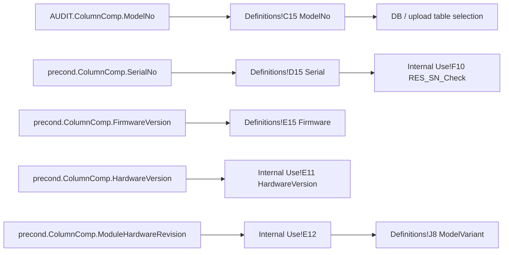

Critical rule: `AUDIT.ColumnComp.ModelNo` is the device source of truth. It
drives report/DB branch selection and upload table alignment. A generated or
uploaded DB row must not use folder names, file names, or manual UI guesses as
the authoritative device.

## Contract 4: DB Contract

### 4.1 Verified Mapping

`FOQResultLocations_V2.83.xls` maps the same Factory Default fields for
`VH-C10-A`, `VC-C10-A`, and `VA-C10-A`:

| DB Field | Report file | Sheet | Cell | Source status |
|---|---|---|---|---|
| `TestDate` | `Factory Default.XLS` | `Definitions` | `C10` | direct formula object: `seq.update_time` |
| `Serial` | `Factory Default.XLS` | `Definitions` | `D15` | direct formula object: `precond.ColumnComp.SerialNo` |
| `TimeBase` | `Factory Default.XLS` | `Definitions` | `C6` | direct formula object: `seq.timebase` |
| `ModelNo` | `Factory Default.XLS` | `Definitions` | `C15` | direct formula object: `AUDIT.ColumnComp.ModelNo` |
| `ModelVariant` | `Factory Default.XLS` | `Definitions` | `J8` | workbook-derived; source family known, exact formula open |
| `HardwareVersion` | `Factory Default.XLS` | `Internal Use` | `E11` | direct formula object: `precond.ColumnComp.HardwareVersion` |
| `Firmware` | `Factory Default.XLS` | `Definitions` | `E15` | direct formula object: `precond.ColumnComp.FirmwareVersion` |
| `SubmitDate` | `Factory Default.XLS` | `Definitions` | `C10` | direct formula object: `seq.update_time` |
| `RES_SN_Check` | `Factory Default.XLS` | `Internal Use` | `F10` | workbook-derived serial/sequence check; exact formula open |

### 4.2 Data Type / Display Contract

| Field family | Expected value type | Notes |
|---|---|---|
| Date fields | date/time or Excel serial date depending export path | `seq.update_time` should be treated as report sequence update time, not CMBX package creation time. |
| Serial / ModelNo / Firmware / ModelVariant | text | Preserve leading zeros in `ModelVariant`. |
| HardwareVersion | text or numeric-like text depending DB schema | Existing upload logic treats known metadata fields as text where needed. |
| Result check | pass/fail text | `RES_SN_Check` is a workbook-derived comparison, not a raw method value. |

## Contract 5: Config Requirement

| Requirement | Why it matters |
|---|---|
| `ColumnComp` device present and connected | All commands target ColumnComp. |
| Service-code command path available | Required for `GetServiceCode` and `ServiceCode = 87794`. |
| Wellness properties available | Required to clear intervals and log dates/operator/workload. |
| Exception/error log commands available | Required for `ExceptionLogClear` and `ErrorLog.Clear`. |
| Precondition metadata available | Report/DB fields read `SerialNo`, firmware, hardware, and module revision from `precond.ColumnComp.*`. |
| Audit metadata available | `AUDIT.ColumnComp.ModelNo` is the device source of truth. |
| Custom sequence variables for thermometer serial/location | Operator prompt requires correct values selected before finalization. |
| Valve hardware state known | Operator must confirm valve covers/no valves after test completion. |

## Contract 6: Open Verification

| # | Open item | Current evidence | Needed evidence | Likely source |
|---|---|---|---|---|
| 1 | Exact FormulaOne formula for `Definitions!J8` ModelVariant | Direct source `Internal Use!E12 = ModuleHardwareRevision` known, DB maps `J8` | Workbook cell dependency from `J8` to `Internal Use!E12` and formatting rule | report `SpreadSheetData` / Excel export |
| 2 | Exact FormulaOne formula for `Internal Use!F10` RES_SN_Check | Reverse note says serial check compares `ColumnComp.SerialNo` with `seq.name` | Workbook comparison expression and pass/fail text | report `SpreadSheetData` |
| 3 | Whether `HardwareVersion` should be SQL float or text for every module table | DB schema examples vary by module; metadata fields can look numeric | Target table schema per TCC table | SQL Server metadata |
| 4 | Service-code safety for generated packages | Method contains `ServiceCode = 87794` and warning not to run on service instruments | Live CM/config policy for generated package execution | Chromeleon help / production SOP |
| 5 | VC processing-method side effect | VC binds `CORRECT_ACCURACY_INJ_INSERTION` | Pass-action decode | processing method XML |

## VH / VC / VA Comparison

| Model | Method flow | Processing branch | Report template | DB mapping | Meaning |
|---|---|---|---|---|---|
| VH-C10-A | same | `No_Integration` | `Report_VTCC_V2_12` | closed | final state + metadata |
| VC-C10-A | same | `CORRECT_ACCURACY_INJ_INSERTION` | `Report_VTCC_V2_12` | closed | same method, corrective processing branch differs |
| VA-C10-A | same | `No_Integration` | `Report_VATCC_V1_01` | closed | same final state + metadata, VA report template |

## Generation Readiness

| Use case | Readiness | Notes |
|---|---|---|
| Clone/select full FOQ package | reusable with caution | Preserve as final cleanup/metadata injection. |
| Generate single functional test, such as Accuracy 40 C | exclude by default | It mutates service/default state and is not required for a standalone measurement unless DB metadata output is requested. |
| Generate DB-ready full FOQ package | required | Provides metadata fields and device source-of-truth contract. |
| Generate metadata-only package | partial | Method/DB mapping clear; workbook-derived ModelVariant and SN check formulas still need final workbook verification. |

<a id="tcc-error-log"></a>
## B013: Error log black box

Build source name: `TCC_ERROR_LOG_BLACK_BOX_DECOMPOSITION.md`

# TCC Error Log Check Black Box Decomposition

Extraction date: 2026-07-10

Scope: TCC FOQ `Error Log Check` injection for `VH-C10-A`, `VC-C10-A`, and
`VA-C10-A`.

---
Test name: Error Log Check
Models: VH-C10-A / VC-C10-A / VA-C10-A
Status: method command and report-table endpoint decomposed; exact pass/fail
criteria remain open verification
---

This document decomposes the `Error Log Check` injection as a generation
contract. It is a final safe-state and audit-table endpoint, not a raw
calculation test. It follows Factory Default, which clears error/exception logs,
and reconnects the device so the final report can expose the final audit/error
log state.

```text
Report evidence:
  Report sheet = Error Log
  Object type = ReportTableObject
  Cell range = B11:D14
  Data source = audittrail
```

No RetTimes, raw channels, or mapped FOQ DB fields are expected for this
injection. The main generation value is its cleanup/safe-state behavior and its
role as the last audit/error-log review point in the TCC FOQ sequence.

## Evidence Sources

| Evidence | Source |
|---|---|
| Test intent node | `cmbx_data_explorer/docs/TCC_TEST_KNOWLEDGE_NODE_MODEL.md` |
| Injection workbench notes | `cmbx_data_explorer/docs/TCC_INJECTION_BY_INJECTION_REVERSE_WORKBENCH.md` |
| Required symbols | `cmbx_data_explorer/docs/TCC_REQUIRED_SYMBOL_MANIFEST.md` |
| Method flow, VH | `knowledge_base/tcc_reverse_probe/VH/6000001/CHECKERRORLOG_embedded_method_flow.txt` |
| Method flow, VC | `knowledge_base/tcc_reverse_probe/VC/3000004/CHECKERRORLOG_embedded_method_flow.txt` |
| Method flow, VA | `knowledge_base/tcc_reverse_probe/VA/0000003/CHECKERRORLOG_embedded_method_flow.txt` |
| Report formula/table objects | `knowledge_base/tcc_report_formula_objects_vh_6000001_all_sheets.tsv` |
| DB mapping | `foq/FOQResultLocations_V2.83.xls` |

## Executive Answer

1. The instrument method is `CHECKERRORLOG`.
2. VH/VC method flows are identical.
3. VA has a smaller method flow: it only turns `ColumnComp.CC.TempCtrl` off and
   reconnects.
4. VH/VC turn both preheater controls off, turn CC temperature control off, and
   set Column A-D active state to `No`.
5. All branches run `ColumnComp.Disconnect` and `ColumnComp.Connect`.
6. No RetTimes are written.
7. No raw channels are acquired.
8. The report sheet is `Error Log`, and the extracted report object is a
   `ReportTableObject` over `B11:D14` with data source `audittrail`.
9. No DB output row is mapped in `FOQResultLocations_V2.83.xls`.
10. Generation should treat this as a final cleanup/audit review injection.

## Contract 1: Method Command

### 1.1 Device Branch Binding

| Device | Injection | Instrument Method | Processing Method | Report Template | Report Sheets | Status |
|---|---|---|---|---|---|---|
| VH-C10-A | `Error Log Check` | `CHECKERRORLOG` | `No_Integration` | `Report_VTCC_V2_12` | `Error Log`, `Internal Use` | sequence evidence closed |
| VC-C10-A | `Error Log Check` | `CHECKERRORLOG` | `CORRECT_ACCURACY_INJ_INSERTION` | `Report_VTCC_V2_12` | `Error Log`, `Internal Use` | sequence evidence closed |
| VA-C10-A | `Error Log Check` | `CHECKERRORLOG` | `No_Integration` | `Report_VATCC_V1_01` | `Error Log`, `Internal Use` | sequence evidence closed |

### 1.2 Method Contract Summary

| Contract item | VH-C10-A | VC-C10-A | VA-C10-A |
|---|---|---|---|
| RetTimes | not used | not used | not used |
| Raw channels | not used | not used | not used |
| Preheater right off | `ColumnComp.PrehtRight.TempCtrl = Off` | same | not present in decoded VA flow |
| Preheater left off | `ColumnComp.PrehtLeft.TempCtrl = Off` | same | not present in decoded VA flow |
| CC temperature control off | `ColumnComp.CC.TempCtrl = Off` | same | same |
| Column A-D active state reset | `Column_A/B/C/D.ActiveColumn = No` | same | not present in decoded VA flow |
| Reconnect cycle | `ColumnComp.Disconnect`, `ColumnComp.Connect` | same | same |

### 1.3 VH / VC Decoded Method Flow

```yaml
CHECKERRORLOG_VH_VC:
  InstrumentSetup:
    - SET ColumnComp.PrehtRight.TempCtrl = Off
    - SET ColumnComp.PrehtLeft.TempCtrl = Off
    - SET ColumnComp.CC.TempCtrl = Off
    - SET ColumnComp.Column_A.ActiveColumn = No
    - SET ColumnComp.Column_B.ActiveColumn = No
    - SET ColumnComp.Column_C.ActiveColumn = No
    - SET ColumnComp.Column_D.ActiveColumn = No
  Run:
    - RUN ColumnComp.Disconnect
    - RUN ColumnComp.Connect
```

### 1.4 VA Decoded Method Flow

```yaml
CHECKERRORLOG_VA:
  InstrumentSetup:
    - SET ColumnComp.CC.TempCtrl = Off
  Run:
    - RUN ColumnComp.Disconnect
    - RUN ColumnComp.Connect
```

### 1.5 Generation Meaning

This method is the final device-safe state after Factory Default. A full FOQ
sequence should keep it as the last injection. A single custom diagnostic
sequence may either include this final injection or include equivalent StopRun
cleanup commands, depending on whether the output needs a report-level Error
Log sheet.

## Contract 2: Processing Method

### 2.1 Binding

| Device | Processing Method | Meaning |
|---|---|---|
| VH-C10-A | `No_Integration` | No integration processing required. |
| VC-C10-A | `CORRECT_ACCURACY_INJ_INSERTION` | Corrective processing binding follows VC sequence pattern. |
| VA-C10-A | `No_Integration` | No integration processing required. |

### 2.2 IRC / Corrective Behavior

No Error-Log-specific IRC insertion was observed. VC keeps the same broader
`CORRECT_ACCURACY_INJ_INSERTION` branch as other late-sequence VC injections.
The error-log method itself has no RetTime or channel output that would drive a
correction.

## Contract 3: Report Formula

### 3.1 Report Table Evidence

| Report template | Sheet | Object type | Cell range | Data source |
|---|---|---|---|---|
| `Report_VTCC_V2_12` | `Error Log` | `ReportTableObject` | `B11:D14` | `audittrail` |

This is important: the `Error Log` sheet is not a
`ReportFormulaObject`-heavy calculation sheet. It renders audit/error-log rows.
Therefore, FormulaOne-style scalar cell formulas are not the primary contract.

### 3.2 Relationship To Factory Default

```mermaid
flowchart LR
    Factory["Factory Default"]
    Clear1["ExceptionLogClear"]
    Clear2["ErrorLog.Clear"]
    ErrorCheck["Error Log Check"]
    Safe["TempCtrl/preheater/columns off"]
    Reconnect["Disconnect/Connect"]
    Report["Error Log report table B11:D14"]

    Factory --> Clear1
    Factory --> Clear2
    Clear1 --> ErrorCheck
    Clear2 --> ErrorCheck
    ErrorCheck --> Safe
    ErrorCheck --> Reconnect
    Reconnect --> Report
```

## Contract 4: DB Contract

| DB contract item | Status |
|---|---|
| `RES_ErrorLog` | listed as possible intent field in alignment, but not mapped in current TCC `FOQResultLocations_V2.83.xls` |
| Device-specific mapped DB fields | none observed |
| SQL type | not applicable |
| Precision/display rule | not applicable |

Current conclusion: there is no closed DB output contract for `Error Log Check`.
Its report contract is audit-table display, not DB field upload.

## Contract 5: Config Requirement

| Requirement | VH-C10-A | VC-C10-A | VA-C10-A | Why it matters |
|---|---|---|---|---|
| `ColumnComp.CC.TempCtrl` | required | required | required | Leaves main column compartment stopped. |
| `ColumnComp.PrehtRight.TempCtrl` | required | required | not used in decoded flow | VH/VC preheater cleanup. |
| `ColumnComp.PrehtLeft.TempCtrl` | required | required | not used in decoded flow | VH/VC preheater cleanup. |
| `ColumnComp.Column_A/B/C/D.ActiveColumn` | required | required | not used in decoded flow | VH/VC column activity cleanup. |
| `ColumnComp.Disconnect` / `Connect` | required | required | required | Refreshes connection/error-log context for final state. |
| Audit trail / error-log report support | required | required | required | Report sheet renders `audittrail`. |

## Contract 6: Open Verification

The items below are `Open Verification Required` before claiming a generated
Error Log report/check is fully equivalent to CM output.

| # | Open item | Current evidence | Needed evidence | Likely source |
|---|---|---|---|---|
| 1 | Exact pass/fail criterion for Error Log Check | Report object is an audit table, DB has no row | Human/report rule for what counts as clean error log | FOQ TD and report workbook layout |
| 2 | Whether VC processing pass action affects final late injections | VC uses `CORRECT_ACCURACY_INJ_INSERTION` | Processing-method pass-action decode | processing method XML |
| 3 | Whether VA should intentionally omit preheater/column cleanup | VA decoded flow omits those symbols | CM configuration / TD applicability confirmation | VA CMBX and TD |
| 4 | Whether a generated single-test package should include Error Log Check | Full FOQ needs it; single diagnostic may not | User intent and generation policy | intent tool rules |

## VH / VC / VA Comparison

| Model | Method flow | Processing branch | Report template | DB mapping | Meaning |
|---|---|---|---|---|---|
| VH-C10-A | full cleanup: preheater + CC + columns + reconnect | `No_Integration` | `Report_VTCC_V2_12` | none | final safe state and audit table |
| VC-C10-A | full cleanup: preheater + CC + columns + reconnect | `CORRECT_ACCURACY_INJ_INSERTION` | `Report_VTCC_V2_12` | none | same cleanup, corrective branch differs |
| VA-C10-A | reduced cleanup: CC + reconnect | `No_Integration` | `Report_VATCC_V1_01` | none | VA config lacks the same decoded preheater/column cleanup path |

## Generation Readiness

| Use case | Readiness | Notes |
|---|---|---|
| Clone/select full FOQ package | reusable | Keep as final injection after Factory Default. |
| Generate single functional test | optional cleanup | Prefer equivalent StopRun cleanup unless an Error Log report page is required. |
| Generate full report package | partial | Report table endpoint known; pass/fail criterion still open. |
| DB upload/result output | not applicable | No mapped DB output contract. |

<a id="script-description-001"></a>
## D001: Deep Script Analysis - Heat-Up and Cool-Down Time Test.md

收到。这是针对 **升温与降温时间测试 (Heat-Up and Cool-Down Time Test)** 仪器方法的详细分析。该方法严格对应 FOQ TD 文档的 **第 7.5 节**。

---

# Vanquish 柱温箱 (VH-C10-A / VC-C10-A) 升温与降温时间测试仪器方法详细分析

> 本文档基于提供的 Chromeleon 仪器方法脚本进行分析。
> 该方法在 **温度稳定性与 PCC 测试（第 7.3/7.4 节）** 之后执行，用于测量柱温箱在 20°C ↔ 50°C 之间的升温与降温速率，验证其热响应性能是否符合规格要求。
> 适用设备：VH‑C10‑A 和 VC‑C10‑A（两者规格相同，均为 20°C ↔ 50°C）。

---

## 1. 文档与测试意图

| 项目 | 内容 |
| :--- | :--- |
| **方法名称** | 注释为 `IM to measure HeatUp time from 20°C to 50°C and CoolDown time from 50°C to 20°C of the Vanquish VH-C10-A and VC-C10-A` |
| **对应 FOQ 文档** | **第 7.5 节** – Heat‑Up and Cool‑Down Time |
| **核心目的** | ① **升温时间**：测量柱温箱从 20°C 升温至 50°C 所需的时间（不包括 2 分钟保持期）。<br>② **降温时间**：测量柱温箱从 50°C 降温至 20°C 所需的时间（不包括 2 分钟保持期）。<br>③ **评估依据**：根据文档第 7.5.2 节，正式评估仅使用**外部温度传感器（上腔）** 的信号；内部传感器数据仅用于内部参考。 |
| **执行顺序** | 该方法在 **温度稳定性测试** 之后执行，是 FOQ 温度相关测试序列的最后一项（在泄漏测试和工厂默认设置之前）。 |

---

## 2. 全局参数设置

### 2.1 系统识别与页数设置

```text
If      ColumnComp.ModelNo="VH-C10-A"
    Variables.GenericLong9  12
Else If     ColumnComp.ModelNo="VC-C10-A"
    Variables.GenericLong9  10
Else
    Message "Column compartment model unknown, please reinspect in production!"
    System.AbortQueue
End If
```

- **`GenericLong9`**：设定报告页数（VH=12，VC=10），与之前所有脚本一致。

### 2.2 温度就绪参数（宽松容差）

```text
ColumnComp.CC.ReadyTempDelta   0.5 [°C]
ColumnComp.CC.EquilibrationTime   0.5 [min]
```

- **`ReadyTempDelta` = 0.5°C**：这是所有温度测试中最宽松的容差。原因是升温/降温时间测试关注的是**瞬态响应**，而非稳态精度。设定点变化后，只需温度进入 ±0.5°C 窗口即可认为“就绪”，从而允许触发器在接近目标温度时激活。
- **`EquilibrationTime` = 0.5 分钟**：要求连续 30 秒满足 0.5°C 窗口，`CC.TempReady` 才为真。

### 2.3 温控与模式

```text
ColumnComp.CC.TempCtrl   On
ColumnComp.CC.Mode       StillAir
```

- 温控开启，模式为 `StillAir`，与文档要求一致。

### 2.4 变量初始化

```text
Variables.GenericLong0  0
Variables.GenericLong1  0
Variables.GenericLong2  0
Variables.GenericLong3  0
RetTimes.RetTime1  0
... (RetTime2 ~ RetTime6 均设为 0)
```

- **`GenericLong0` ~ `3`**：用作触发器之间的**连锁状态标志**，控制测试流程的阶段转换。
- **`RetTime1` ~ `6`**：记录各关键事件的发生时间，用于计算升温/降温持续时间。

---

## 3. 核心设计理念：双重判定与连锁触发

本方法最精巧的设计在于**同时使用外部和内部温度传感器作为触发条件**，并通过状态标志实现严格的事件顺序控制。

### 3.1 预处理：低于起始温度启动

```text
-0.700  Equilibration  Duration = 0.700 [min]
        ColumnComp.CC.Temperature.Nominal  17.0
0.000   Inject Preparation
        Wait  CC.TempReady
0.000   Start Run
```

- **为什么设定 17°C 而不是 20°C？** 注释明确说明：*“由于升温/降温时间的规格是针对 ±1°C 范围给出的，因此起始温度应在数据采集期间达到。因此温度设定在起始温度以下。”*
- **工程逻辑**：通过将起始温度设定在 20°C 以下（17°C），当 Run 段启动并将温度设定为 20°C 时，仪器必须**升温**至 20°C。这确保了 20°C 的稳定过程被完整记录在数据采集范围内，且触发器的起始条件（在 19~21°C 窗口内稳定 120 秒）能够被可靠满足。若直接设定 20°C，可能因温度过冲或已经稳定而难以捕捉到“进入窗口”的精准时刻。
- `Wait CC.TempReady` 等待 17°C 稳定后启动 Run。

### 3.2 Run 段启动：正式设定 20°C

```text
0.700  ColumnComp.CC.Temperature.Nominal  20.0
```

- 在 Run 段开始 0.7 分钟后，将温度设定为 20°C。仪器将从 17°C 升温至 20°C 并稳定。

---

## 4. 触发器级联状态机（完整流程）

本方法使用 **6 个主要触发器 + 1 个结束触发器**，通过 `GenericLong0` ~ `3` 状态标志实现精确的流程控制。以下按时间顺序逐一分析：

### 阶段 0：起始稳定触发（20°C 平衡）

| 触发器 | 触发条件 | 执行动作 | 状态变化 |
| :--- | :--- | :--- | :--- |
| **`T_Start_Ext`** | 外部上腔温度在 19~21°C 之间 **且** 设定温度为 20°C **且** `GenericLong0=0` **且** 持续 120 秒 | 置 `GenericLong3 = 1` | 标记外部传感器已稳定在 20°C |
| **`T_Start_Int`** | 内部温度在 19~21°C 之间 **且** 设定温度为 20°C **且** `GenericLong0=0` **且** 持续 120 秒 | 置 `GenericLong2 = 1` | 标记内部传感器已稳定在 20°C |

- **`TrueTime=120`**：对应文档第 7.5.1 节的“条件满足至少 120 秒（保持期）”。
- **`GenericLong0=0`**：作为“流程未开始”的标志，防止重复触发。
- **双重确认**：必须**外部和内部同时达到稳定**，流程才会进入下一阶段。这确保了测试起始条件的一致性和可靠性。

### 阶段 1：触发升温（20°C → 50°C）

| 触发器 | 触发条件 | 执行动作 | 状态变化 |
| :--- | :--- | :--- | :--- |
| **`T_UP`** | `GenericLong2=1` **且** `GenericLong3=1`（两者都已稳定）**且** 持续 30 秒 | ① 设定温度为 **50°C**<br>② 记录 `RetTime1`（升温开始时间）<br>③ 置 `GenericLong0 = 1` | 开始升温，标记流程已启动（`GenericLong0=1`） |

- **连锁机制**：`T_UP` 只有在外部和内部都确认 20°C 稳定后才会触发，确保了升温起点的一致性。
- **`TrueTime=30`**：短暂的确认期，防止误触发。
- **`RetTime1`**：记录升温开始的时刻（设定 50°C 的时间）。

### 阶段 2：确认升温完成（达到 50°C）

| 触发器 | 触发条件 | 执行动作 | 状态变化 |
| :--- | :--- | :--- | :--- |
| **`T_50_Ext`** | 外部温度在 49~51°C 之间 **且** 设定温度为 50°C **且** 持续 120 秒 | 记录 `RetTime2`（外部达到 50°C 的时间）<br>置 `GenericLong0 = 2` | 标记外部已完成升温 |
| **`T_50_Int`** | 内部温度在 49~51°C 之间 **且** 设定温度为 50°C **且** 持续 120 秒 | 记录 `RetTime3`（内部达到 50°C 的时间）<br>置 `GenericLong1 = 2` | 标记内部已完成升温 |

- **`TrueTime=120`**：对应文档“温度达到后至少保持 120 秒（保持期）”。
- **双重确认**：必须外部和内部都确认达到 50°C 并稳定 120 秒，流程才继续。

### 阶段 3：触发降温（50°C → 20°C）

| 触发器 | 触发条件 | 执行动作 | 状态变化 |
| :--- | :--- | :--- | :--- |
| **`T_DOWN`** | `GenericLong0=2` **且** `GenericLong1=2`（两者都达到 50°C）**且** 持续 30 秒 | ① 记录 `RetTime4`（降温开始时间）<br>② 设定温度为 **20°C** | 开始降温 |

- **关键设计**：降温的触发条件要求**外部和内部都已确认升温完成**（`GenericLong0=2` 且 `GenericLong1=2`），确保了降温起点的一致性。
- **`RetTime4`**：记录降温开始的时刻（设定 20°C 的时间）。

### 阶段 4：确认降温完成（回到 20°C）

| 触发器 | 触发条件 | 执行动作 | 状态变化 |
| :--- | :--- | :--- | :--- |
| **`T_20_Ext`** | 外部温度在 19~21°C 之间 **且** 设定温度为 20°C **且** `GenericLong0=2` **且** 持续 120 秒 | 记录 `RetTime5`（外部回到 20°C 的时间）<br>置 `GenericLong0 = 3` | 标记外部已回到 20°C |
| **`T_20_Int`** | 内部温度在 19~21°C 之间 **且** 设定温度为 20°C **且** `GenericLong1=2` **且** 持续 120 秒 | 记录 `RetTime6`（内部回到 20°C 的时间）<br>置 `GenericLong1 = 3` | 标记内部已回到 20°C |

- **`TrueTime=120`**：再次确认 120 秒保持期。

### 阶段 5：结束测试

| 触发器 | 触发条件 | 执行动作 |
| :--- | :--- | :--- |
| **`END_RUN`** | `GenericLong0=3` **且** `GenericLong1=3`（两者都回到 20°C）**且** 持续 30 秒 | 停止所有数据采集，结束 Run |

---

## 5. 时间计算逻辑（由报告脚本执行）

| 计算项 | 公式 | 数据来源 |
| :--- | :--- | :--- |
| **升温时间（外部）** | `RetTime2 - RetTime1` | 外部传感器进入 50°C 窗口的时刻 − 开始升温的时刻 |
| **升温时间（内部）** | `RetTime3 - RetTime1` | 内部传感器进入 50°C 窗口的时刻 − 开始升温的时刻 |
| **降温时间（外部）** | `RetTime5 - RetTime4` | 外部传感器回到 20°C 窗口的时刻 − 开始降温的时刻 |
| **降温时间（内部）** | `RetTime6 - RetTime4` | 内部传感器回到 20°C 窗口的时刻 − 开始降温的时刻 |

**文档要求（第 7.5.2 节）**：
> *“对于结果评估，仅考虑位于柱温箱上腔的外部温度传感器的信号。位于下腔的温度传感器温度几乎相同，因此不进行评估。”*

因此，**正式评估使用 `RetTime2 - RetTime1`（升温）和 `RetTime5 - RetTime4`（降温）**。内部传感器数据仅用于内部诊断和确认双重触发条件。

---

## 6. 关键变量与状态总结

| 变量名 | 类型 | 用途与状态转换 |
| :--- | :--- | :--- |
| `GenericLong0` | Long | **主状态标志**：0=初始/未开始，1=升温进行中（T_UP已触发），2=升温完成（T_50_Ext已触发），3=降温完成（T_20_Ext已触发） |
| `GenericLong1` | Long | **辅助状态标志**（基于内部）：0=初始，2=内部升温完成（T_50_Int触发），3=内部降温完成（T_20_Int触发） |
| `GenericLong2` | Long | 内部 20°C 稳定标志（T_Start_Int 触发时置 1） |
| `GenericLong3` | Long | 外部 20°C 稳定标志（T_Start_Ext 触发时置 1） |
| `RetTimes.RetTime1` | Double | 升温开始时刻（设定 50°C） |
| `RetTimes.RetTime2` | Double | 外部传感器达到 50°C 时刻 |
| `RetTimes.RetTime3` | Double | 内部传感器达到 50°C 时刻 |
| `RetTimes.RetTime4` | Double | 降温开始时刻（设定 20°C） |
| `RetTimes.RetTime5` | Double | 外部传感器回到 20°C 时刻 |
| `RetTimes.RetTime6` | Double | 内部传感器回到 20°C 时刻 |

---

## 7. 与 FOQ 测试文档的完整对应关系

| FOQ 文档章节 | 内容描述 | 本方法实现 |
| :--- | :--- | :--- |
| **7.5** 标题 | 升温与降温时间测试 | 方法完整实现 |
| **7.5.1** | 设定 T1=20°C，等待稳定（120s 保持期） | `T_Start_Ext` / `T_Start_Int` 的 `TrueTime=120` |
| **7.5.1** | 设定 T2=50°C，等待稳定（120s 保持期） | `T_50_Ext` / `T_50_Int` 的 `TrueTime=120` |
| **7.5.1** | 设定 T1=20°C（第二次），等待稳定（120s 保持期） | `T_20_Ext` / `T_20_Int` 的 `TrueTime=120` |
| **7.5.2** | 升温时间 = T1→T2（不含 2min 保持期） | `RetTime2 - RetTime1` |
| **7.5.2** | 降温时间 = T2→T1（不含 2min 保持期） | `RetTime5 - RetTime4` |
| **7.5.2** | 仅评估外部上腔传感器 | 使用 `ExtTemp_UpperCC` 触发 `T_50_Ext` 和 `T_20_Ext` |
| 表 9 | VH 和 VC 均为 T1=20°C, T2=50°C | 脚本中固定使用 20°C 和 50°C |

---

## 8. 注意事项与潜在陷阱

1. **初始温度 17°C 的原理**：这不是文档要求的温度点，而是工程实现技巧。它确保了仪器在 Run 段开始时必须从下方接近 20°C，使触发器的 120 秒稳定窗口能够被精确捕捉。若环境温度过高（> 28.49°C），仪器可能无法达到 17°C，但该方法未包含环境温度判断逻辑——这是与前序脚本（温度准确性、校准）的一个重要差异。如果环境温度过高导致无法达到 17°C，`Wait CC.TempReady` 可能永远不会满足，队列将无限等待。操作员需确保环境温度适宜。

2. **双重触发的冗余设计**：外部和内部传感器必须**同时**确认每个阶段，才进入下一阶段。这意味着如果任一传感器故障或读数异常，整个测试将卡住。这提高了可靠性，但也增加了对两个传感器都正常工作的依赖。

3. **120 秒保持期包含在触发条件中**：升温/降温时间的计算（`RetTime2 - RetTime1`）排除了这 120 秒，因为 `RetTime1` 是升温开始时刻，而 `RetTime2` 是**进入 50°C 窗口并稳定 120 秒后**的时刻。因此差值包含了升温过程 + 120 秒保持期。**实际上，真正的升温时间应该是 `RetTime2 - RetTime1 - 120秒`？** 但文档第 7.5.2 节明确指出：*“升温时间……不包括 2 分钟保持期”*。然而在脚本设计中，`RetTime2` 是在 **满足 120 秒 TrueTime 之后**才记录的。因此实际升温时间 = `(RetTime2 - RetTime1) - 2 分钟`。

**更正**：仔细阅读 `T_50_Ext` 触发器：其触发条件是**温度进入 49~51°C 窗口并持续 120 秒**，然后才记录 `RetTime2`。因此：
- `RetTime1` = 开始升温（设定 50°C）的时刻
- `RetTime2` = 温度进入 50°C 窗口并保持了 120 秒后的时刻

所以 **实际的物理升温时间 = `RetTime2 - RetTime1 - 2 分钟`**。

报告中计算升温/降温时间时，应使用 `(RetTime2 - RetTime1) - 2` 或 `(RetTime5 - RetTime4) - 2`（单位：分钟）。操作员/报告设计者需确认 CM 报告脚本是否正确处理了这一偏移。

4. **状态变量的初始化与重置**：`GenericLong0` ~ `3` 在 Instrument Setup 阶段被清零，但如果测试中途失败或需要重跑，必须确保这些变量被重置，否则触发器条件可能永远无法满足。

5. **触发器的 `Limit=1` 确保一次性**：所有触发器均设置了 `Limit=1`，触发一次后即失效，避免了状态标志被重复修改。

---

## 9. 总结

该仪器方法是一个**高度状态化的有限状态机（FSM）**，通过 7 个触发器与 4 个状态标志的精密配合，实现了升温/降温时间的自动化测量：

- **双重确认机制**：外部和内部温度传感器同时参与触发判定，确保起始和结束条件的一致性。
- **精确的时序控制**：每个阶段都要求 120 秒的稳定保持期，符合文档规范。
- **状态标志驱动流程**：`GenericLong0` ~ `3` 的数值变化清晰地标识了测试所处的阶段，使流程逻辑一目了然。
- **物理升温时间与记录时间的偏移**：报告中需注意减去 2 分钟保持期。

该脚本的成功执行，为柱温箱的热响应性能提供了关键性证据（升温/降温速率），是 FOQ 放行测试中验证仪器动态性能的核心环节。

---

*文档生成日期：2026-07-14*
*基于 Chromeleon 7 仪器方法脚本分析*

<a id="script-description-002"></a>
## D002: Deep Script Analysis - Liquid Leak Sensor Test.md

收到。这是针对 **液体泄漏传感器测试 (Liquid Leak Sensor Test)** 仪器方法的详细分析。该方法严格对应 FOQ TD 文档的 **第 7.6 节**（以及第 5.3.1 节关于泄漏传感器状态的部分）。

---

# Vanquish 柱温箱 (VH-C10-A / VC-C10-A) 液体泄漏传感器测试仪器方法详细分析

> 本文档基于提供的 Chromeleon 仪器方法脚本进行分析。
> 该方法在 **升温/降温时间测试（第 7.5 节）** 之后执行，用于验证液体泄漏传感器的检测功能及前面板“Mute Alarm”按键的操作是否正常。
> 适用设备：VH‑C10‑A 和 VC‑C10‑A。

---

## 1. 文档与测试意图

| 项目 | 内容 |
| :--- | :--- |
| **方法名称** | 注释为 `IM to measure the performance of the Vanquish VH-C10-A or VC-C10-A Liquid Leak Sensor` |
| **对应 FOQ 文档** | **第 7.6 节** – Liquid Leak Test and Keypad Functionality Test (Part 2)<br>同时关联 **第 5.3.1 节** – Leak Sensor States（泄漏传感器在温度精度测试结束后已开启并校准） |
| **核心目的** | ① 验证液体泄漏传感器能够正确检测到人为注入的液体（水），触发泄漏报警。<br>② 验证前面板“Mute Alarm”按键能够正常关闭声光报警。<br>③ 验证泄漏传感器的校准值（`LiquidLeakCalibration-Value`）是否在允许范围内（±700，警告 ±500）。<br>④ 通过用户交互，确保操作员正确执行注水、清洁等步骤。 |
| **执行顺序** | 该方法在 **温度精度测试（第 7.2 节）** 中已开启并校准泄漏传感器，本测试直接使用已校准的传感器进行功能验证。 |

---

## 2. 全局参数设置

### 2.1 温度控制（确保恒温环境）

```text
ColumnComp.CC.Temperature.Nominal  20.0 [°C]
ColumnComp.CC.TempCtrl  On
ColumnComp.CC.Mode      StillAir
ColumnComp.CC.ReadyTempDelta   None
ColumnComp.CC.EquilibrationTime  0.5
```

- **设定 20°C**：使柱温箱保持在常温，避免温度变化引起冷凝水干扰泄漏传感器的判断。
- **`ReadyTempDelta = None`**：表示不启用温度就绪检查（本测试不关心温度是否精确稳定，只需大致恒温即可）。
- **`EquilibrationTime = 0.5`**：虽然定义了但实际无效（因 `ReadyTempDelta=None`），保留仅为语法兼容。

### 2.2 泄漏传感器状态

```text
ColumnComp.LiquidLeakSensor   On
```

- 在 Instrument Setup 阶段即**开启**泄漏传感器。此前在温度精度测试中已执行过 `LiquidLeakSensorCalibrate`，因此传感器已有正确的基准值。

### 2.3 数据采集通道

与之前脚本类似，采集柱温箱内部温度、PWM、风扇转速以及泄漏板相关信号（`LEDBoard_LeakDiff`, `A13`, `A14` 等），采样间隔 20 秒。这些数据主要用于报告中的 `LiquidLeakCalibration-Value` 评估。

---

## 3. 测试流程（用户交互驱动）

本测试高度依赖操作员的手动操作，脚本通过 `Message` 对话框和 `Wait` 条件引导操作员完成一系列动作。

### 3.1 初始状态检查

```text
0.000  Start Run
Wait  ColumnComp.CC.TempReady
If  Door=Closed AND LiquidLeak=NoLeak
    ColumnComp.CmdString  Cmd="LedBar.ForceColor=1"
    Message "Press OK, open compartment door and then inject 5 mL water to bottom of compartment."
    ColumnComp.CmdString  Cmd="LedBar.ForceColor=0"
Else
    System.AbortQueue
End If
```

- **等待 `CC.TempReady`**：确保温度已达到 20°C 附近（尽管 `ReadyTempDelta=None`，但 `CC.TempReady` 可能仍由其他机制定义，此处以实际为准）。
- **前置条件检查**：门必须关闭且当前无泄漏（`LiquidLeak=NoLeak`）。如果条件不满足，直接中止队列，防止在异常状态下继续测试。
- **LED 指示灯**：强制 LED 亮红色以引起操作员注意，弹出消息框指示操作员**开门并注入 5 mL 去离子水**到腔体底部（对应文档第 4.1.5 节要求）。
- 操作员点击“OK”后，LED 恢复默认颜色。

### 3.2 等待泄漏检测（带超时）

```text
Wait  LiquidLeak=Leak,
Continue,
Timeout=2.00
Delay  1
Log  LiquidLeak
Delay  1
```

- **`Wait` 条件**：等待泄漏传感器状态变为 `Leak`（检测到液体）。
- **`Continue` 选项**：即使超时也不中止队列，而是继续执行后续指令。
- **`Timeout=2.00`**：**2 分钟超时**。如果 2 分钟内未检测到泄漏，脚本仍会继续（但可能因未检测到泄漏而导致后续评估失败）。操作员应在 2 分钟内完成注水操作。
- 记录当前泄漏状态（`Log LiquidLeak`）用于审计。

### 3.3 确认“Mute Alarm”按键操作

```text
ColumnComp.CmdString  Cmd="LedBar.ForceColor=1"
Message "Confirm the leak alarm by pressing 'MUTE ALARM' on the instruments keypad!"
ColumnComp.CmdString  Cmd="LedBar.ForceColor=0"
Wait  ColumnComp.Alarm=NoAlarm
If  ColumnComp.Alarm=NoAlarm
    ColumnComp.LiquidLeakSensor  Off
    Delay  1
Else
    System.AbortQueue
End If
```

- 当检测到泄漏后，仪器会发出声光报警。此时脚本弹出消息，要求操作员**按下前面板的“MUTE ALARM”按钮**。
- **`Wait ColumnComp.Alarm=NoAlarm`**：等待报警状态清除（即按键被按下且报警解除）。此等待**没有超时**，意味着如果操作员不按键，队列将永远等待。这确保了操作员必须执行此步骤。
- **条件判断**：如果成功清除报警（`Alarm=NoAlarm`），则关闭泄漏传感器（避免持续报警），并继续。如果仍然报警（理论上不可能，因为 Wait 会一直等待），则中止队列。

### 3.4 清洁与清理

```text
ColumnComp.CmdString  Cmd="LedBar.ForceColor=1"
Message "With a cloth or tissue, thoroughly absorb all liquid that has collected under the leak sensor and in compartment. Close door again."
Delay  5
Message "Please confirm that all liquid under the liquid leak sensor has been removed!"
ColumnComp.CmdString  Cmd="LedBar.ForceColor=0"
Delay  5
Variables.GenericBool1  1   // Enables Trigger "END_RUN"
Delay  1
```

- 弹出消息指导操作员**用布或纸巾彻底吸干泄漏托盘、传感器下方和腔体底部的水**，然后关闭门。
- 等待 5 秒后，弹出确认消息，要求操作员确认液体已清除。
- 点击确认后，**设置 `GenericBool1 = 1`**，此变量用于激活结束触发器。
- 最后延迟 1 秒，然后运行结束。

### 3.5 结束触发器 `END_RUN`

```text
Trigger     "END_RUN",
Variables.GenericBool1=1 AND System.Retention>0.01,
TrueTime=10,
Limit=1,
Hysteresis=0,
AllowImmediateExecution=No
    // 停止所有数据采集
    ColumnComp.CC_Temp.AcqOff  ...
End Trigger
```

- **触发条件**：`GenericBool1=1`（用户已确认清洁完成）且运行时间大于 0.01 分钟（确保 Run 已启动）。
- **`TrueTime=10`**：条件必须持续 10 秒才触发，防止误触发。
- **执行动作**：停止所有数据采集通道，结束 Run 段。

---

## 4. Run 段时长与超时设计

```text
0.000  Run  Duration = 120.000 [min]
```

- Run 段总时长为 120 分钟，但注释说明：*“运行时间 120 分钟是为了给确认消息框足够时间；触发器 END_RUN 应更早停止样品。”*
- 实际上，在用户完成所有操作后，`END_RUN` 触发器会在几分钟内触发并停止采集，因此 120 分钟只是上限，防止队列无限期运行。

**关键点**：`Wait LiquidLeak=Leak` 的超时仅有 2 分钟，如果操作员未及时注水，脚本会继续执行并弹出“Mute Alarm”消息，但此时并未发生报警，导致后续 `Wait Alarm=NoAlarm` 永远无法满足（因为报警从未触发），队列将卡死。因此，操作员必须在 **2 分钟内完成注水**，否则测试将陷入死锁，只能手动中止。

---

## 5. 与 FOQ 测试文档的对应关系

| FOQ 文档章节 | 内容描述 | 本方法实现 |
| :--- | :--- | :--- |
| **7.6** | 液体泄漏测试与键盘功能测试（第 2 部分） | 完整实现了泄漏检测和“Mute Alarm”按键验证 |
| **4.1.5** | 使用去离子水（>18 MΩ·cm，TOC <3 ppb）和纸巾 | 消息中明确指示注入 5 mL 水，并用布/纸巾吸收 |
| **7.6 a)** | 泄漏测试通过条件：检测到泄漏且校准值在允许范围内 | 报告页评估 `LiquidLeakCalibration-Value` 是否满足 ±700（警告 ±500） |
| **7.6 b)** | 键盘功能：“Mute Alarm”按键正常工作 | `Wait Alarm=NoAlarm` 验证按键可清除报警 |
| **5.3.1** | 泄漏传感器在温度精度测试结束后已开启 | 本测试开始前传感器已处于 `On` 状态（由前序步骤保证） |
| 表 4 | 泄漏传感器验收标准：校准值 ±700（警告 ±500） | 报告脚本将评估此值，本方法仅提供数据 |

---

## 6. 关键变量与状态总结

| 变量名 | 类型 | 用途 |
| :--- | :--- | :--- |
| `GenericBool1` | Boolean | 用户确认清洁完成后置 1，触发 `END_RUN` 触发器 |
| `ColumnComp.LiquidLeakSensor` | On/Off | 测试开始时开启，检测到泄漏且按键清除后关闭 |
| `ColumnComp.Alarm` | Enum | 报警状态（`NoAlarm` / `Alarm`），用于验证按键功能 |
| `LiquidLeak` | Enum | 泄漏传感器状态（`NoLeak` / `Leak`），用于检测注水是否成功 |
| `LEDBoard_LeakDiff` 等 | Double | 泄漏板原始信号，用于计算校准值 |

---

## 7. 注意事项与潜在陷阱

1. **超时风险**：`Wait LiquidLeak=Leak` 仅有 **2 分钟超时**。操作员必须在 2 分钟内完成开门、注水、关门（或至少让水接触传感器）。否则脚本会继续执行，但后续 `Wait Alarm=NoAlarm` 将永远等待（因报警未触发），导致队列卡死。因此操作员应提前准备好水和工具，确保快速操作。

2. **“Mute Alarm”按键必须按下**：`Wait Alarm=NoAlarm` 没有超时，强制操作员必须按键才能继续。这确保了按键功能被实际验证。

3. **清洁确认的可靠性**：脚本依赖操作员主观确认“液体已清除”，但没有再次检测泄漏状态来验证清洁是否彻底。这可能导致残留液体影响后续测试或造成腐蚀，但文档未要求自动验证，仅要求操作员执行清洁（文档 7.6 最后提到“吸收所有液体”）。

4. **门状态检查**：初始检查要求 `Door=Closed`，但注入水时必须开门，因此操作员需在消息出现后手动开门。脚本未在注水后检查门是否关闭，但清洁后消息要求“关门”。若门未关，不影响泄漏检测（因为传感器在腔体底部），但可能影响后续温控，不过本测试不关心温度。

5. **数据采集停止时机**：`END_RUN` 触发器在清洁确认后 10 秒触发，此时泄漏传感器已被关闭（在按键清除后执行了 `Off`）。如果操作员在清洁后重新关门，但泄漏传感器仍处于关闭状态，不会影响已记录的数据（校准值已在报警时刻采集）。

6. **强制 LED 颜色**：脚本多次使用 `LedBar.ForceColor=1`（红色）吸引操作员注意，并在消息显示后恢复默认。这有助于在嘈杂环境中引导操作员。

---

## 8. 总结

该仪器方法是一个**高度依赖用户交互的验证测试**，通过消息框引导操作员执行一系列手动步骤，同时自动记录泄漏传感器状态和报警清除操作：

- **泄漏检测**：通过注入 5 mL 水触发传感器，验证其灵敏度。
- **按键验证**：通过等待报警清除，确认“Mute Alarm”按钮功能正常。
- **清理指导**：确保操作员完成清洁，为后续测试（或设备出厂）做好准备。
- **超时与容错**：注水步骤有 2 分钟超时（但后续无超时等待可能卡死），需操作员快速响应。

该测试是 FOQ 流程中唯一需要大量手动干预的环节，也是验证仪器安全功能（泄漏报警）的关键步骤。成功执行后，报告中的 `LiquidLeakCalibration-Value` 将最终决定该子测试是否通过。

---

*文档生成日期：2026-07-14*
*基于 Chromeleon 7 仪器方法脚本分析*

<a id="script-description-003"></a>
## D003: Deep Script Analysis - Temperature Calibration.MD

收到。这是针对 **温度校准 (Temperature Calibration)** 仪器方法的详细分析。该方法严格对应 FOQ TD 文档的 **第 5.2 节（Instrument Calibration）**。

---

# Vanquish 柱温箱 (VH-C10-A / VC-C10-A) 温度校准仪器方法 (Instrument Method) 详细分析

> 本文档基于提供的 Chromeleon 仪器方法脚本（用于 FOQ 温度校准测试）进行逐行分析。  
> 该方法用于在 Burn-In 之后、温度准确性测试之前，对柱温箱上下两个区域的内部温度传感器进行多点校准。  
> 适用设备：VH‑C10‑A（带后冷却）和 VC‑C10‑A（无后冷却）。

---

## 1. 文档与测试意图

| 项目 | 内容 |
|------|------|
| **方法名称** | 注释为 `IM to calibrate temperature of the VH-C10-A and VC-C10-A` |
| **对应 FOQ 文档** | 第 5.2 节 – **Instrument Calibration** (仪器校准) |
| **核心目的** | 在 8 个不同温度设定点下，使用外部校准温度传感器测量实际温度，计算与内部传感器读数的偏差（校准偏移量），并将这些校准参数写入柱温箱硬件（非易失性存储），以修正后续测试中的温度控制精度。 |
| **执行顺序** | 该方法在 **Burn-In (5.1.1)** 之后执行，是后续所有温度相关测试（准确性、精度等）的前提条件。 |

---

## 2. 全局参数设置与关键差异

与之前的“温度准确性测试”相比，本方法的全局设置针对“快速触发”和“长时稳定”做了特殊优化。

### 2.1 温度就绪参数（严格且快速）

```text
ColumnComp.CC.ReadyTempDelta   0.3 [°C]
ColumnComp.CC.EquilibrationTime   0.1 [min]
```

- **`ReadyTempDelta` = 0.3°C**：比准确性测试（1.0°C）更严格，确保只有在温度非常接近设定点时，`CC.TempReady` 才为真。
- **`EquilibrationTime` = 0.1 分钟（6 秒）**：时间极短，作用是让 `CC.TempReady` 在温度进入 ±0.3°C 窗口后**几乎立即**变为真。这是为了**精准触发后续的 Trigger**，而不会因过长的平衡时间导致稳定计时（`TrueTime`）产生额外偏差。

### 2.2 温控及后冷却单元（PCC）

```text
ColumnComp.CC.TempCtrl   On
If      ColumnComp.ModelNo="VH-C10-A"
    ColumnComp.CmdString  Cmd="PCC.TempCtrl=0"   // 关闭后冷却温控
Else
End If
ColumnComp.CC.Mode   StillAir
```

- 逻辑与准确性测试完全一致：强制开启柱温箱温控，关闭 VH 型号的后冷却单元（避免干扰），使用 **StillAir** 模式。

### 2.3 泄漏传感器与数据采集

```text
ColumnComp.LiquidLeakSensor   Off
...（所有通道 Data_Collection_Rate = 20）
```

- 泄漏传感器全程关闭（防止冷凝水误报）。
- 所有内部温度、PWM、风扇、泄漏板信号采样间隔统一设为 20 秒。

---

## 3. 校准变量重置与型号识别

### 3.1 禁用所有现有校准点

脚本首先通过将 `ColumnComp.CC.TempCalibrationPointUpper/Lower1~10` 全部设为 `Off`，清除仪器中可能存在的旧校准参数。这确保本次校准是完全全新的。

### 3.2 临时变量清零

所有 `CCCalib.CalPointU/L01~08`（记录内部温度）和 `CCCalib.CalDevU/L01~08`（记录偏差值）均被重置为 0。这些变量将在触发器触发时被赋值，最后统一写入硬件。

### 3.3 按型号设定 8 个校准温度点

| 型号 | 预置温度 (`GenericDouble0`) | 温度点 1~8 (`GenericDouble1` ~ `8`) |
| :--- | :--- | :--- |
| **VH-C10-A** | 115°C | 120, 100, 80, 60, 40, 20, 10, 5 (°C) |
| **VC-C10-A** | 80°C | 85, 70, 55, 40, 30, 20, 10, 5 (°C) |

- 对照 FOQ 文档 **表 6**，完全一致。
- **`GenericBool0`**：VH 设为 1，VC 设为 0。此变量虽在本方法中未直接使用，但会在后续的 **温度准确性测试** 中通过 IRC（智能运行控制）被读取，用于动态插入正确的准确性测试序列（参见文档第 9.2 节）。

---

## 4. 关键设计：初始温度偏移与触发器级联机制

### 4.1 初始温度偏移（强制升温触发）

```text
ColumnComp.CC.Temperature.Nominal  Variables.GenericDouble0
Wait  CC.TempReady
0.000  Start Run
```

- 在 Run 段开始前，仪器被设定到 `GenericDouble0`（VH: 115°C，VC: 80°C），即**比第一个校准温度点（VH:120°C / VC:85°C）低 5°C**，并等待内部就绪。
- **目的**：确保当 Run 段启动并设定第一个校准温度时，仪器必须执行**升温**操作。这保证了触发器的启动条件（`CC.TempReady`）在开始时为“假”，当温度爬升至设定点时变为“真”，从而精准触发第一个 Trigger。若直接设定目标温度，可能因过冲或起始就绪状态不确定导致触发器时序混乱。

### 4.2 触发器级联逻辑（自动步进）

脚本中定义了 8 个触发器（`T120/85`, `T100/70` ... `T05`）。**每个触发器在被触发并完成数据记录与偏差检查后，会立即设定下一个温度点的目标值**。

**以第一个触发器 `T120/85` 为例：**

```text
Trigger     "T120/85",
(CC.TempReady) AND (CC.Temperature.Nominal=Variables.GenericDouble1),
TrueTime=850.00,
Limit=1,
Hysteresis=0.0,
AllowImmediateExecution=No
    CCCalib.CalPointU01  CC.TempActual_Upper
    CCCalib.CalDevU01  ExtTemp_UpperCC.Signal - CC.TempActual_Upper
    ...（记录Lower、检查偏差）
    ColumnComp.CC.Temperature.Nominal  Variables.GenericDouble2   // 关键：设定下一温度
End Trigger
```

- **触发条件**：内部就绪 (`CC.TempReady`) 且当前设定温度等于第一个温度点。
- **`TrueTime=850.00`**：**稳定保持时间**。条件必须持续满足 850 秒（约 14.2 分钟），触发器才会执行内部命令。这对应了文档第 5.2 节中要求的 **“内部温度信号稳定 850 秒”**。
- **`Limit=1`**：触发器仅执行一次。
- **执行动作**：
  1. 记录当前内部传感器温度（上/下）到 `CalPointU/L01`。
  2. 计算偏差（外部温度 - 内部温度）存到 `CalDevU/L01`。
  3. 检查偏差是否在 **±4°C** 范围内（超出则中止）。
  4. **设定 `GenericDouble2`（第二温度点）**，触发下一个触发器。

这种“链式反应”使得整个 8 点校准过程完全自动化，无需在 Run 段中编写复杂的条件分支或循环。

---

## 5. 稳定保持时间（TrueTime）的差异

| 温度点编号 | 触发器名称 | 设定温度 (VH / VC) | TrueTime (秒) | 对应 FOQ 文档说明 |
| :--- | :--- | :--- | :--- | :--- |
| 1 | `T120/85` | 120 / 85 | **850** | 高温点稳定时间 |
| 2 | `T100/70` | 100 / 70 | **850** | 高温点稳定时间 |
| 3 | `T80/55` | 80 / 55 | **850** | 高温点稳定时间 |
| 4 | `T60/40` | 60 / 40 | **850** | 高温点稳定时间 |
| 5 | **`T40/30`** | 40 / 30 | **1150** | **特殊温度点**（文档规定稳定 1150 秒） |
| 6 | `T20` | 20 | **850** | - |
| 7 | `T10` | 10 | **850** | - |
| 8 | `T05` | 5 | **850** | - |

- **关键点**：第 5 个温度点（VH 为 40°C，VC 为 30°C）使用了 **1150 秒**（约 19.2 分钟）的稳定时间，与 FOQ 文档第 5.2 节中的特殊要求严格对应。
- 第 5 个触发器的触发条件中额外增加了 `(CC.TempActual_Lower>=(Variables.GenericDouble5-0.3))`，这可能是为了确保下腔体温度同样进入窗口，增加了可靠性。

---

## 6. 偏差检查与异常中止（±4°C 规则）

每个触发器在记录完数据后，都会立即执行以下检查：

```text
If  (CCCalib.CalDevU01>4) Or (CCCalib.CalDevU01<-4) OR (CCCalib.CalDevL01>4) OR (CCCalib.CalDevL01<-4)
    ColumnComp.CC.Temperature.Nominal  25.0
    ColumnComp.CC.TempCtrl  Off
    ColumnComp.CmdString  Cmd="LedBar.ForceColor=1"
    Message "Temperature calibration error! One calibration deviation is greater than 4°C."
    System.AbortQueue
End If
```

- **偏差计算**：`偏差 = 外部温度 - 内部温度`。
- **判定标准**：若上或下任一传感器的偏差绝对值 > 4°C，则判定校准失败。这与文档第 5.2 节描述一致（“若标称温度与测量温度相差超过 4°C，则中止运行”）。
- **异常处理**：
  - 将柱温箱设定至安全温度 25°C。
  - 关闭温控。
  - 强制 LED 亮红色。
  - 弹出错误消息并**立即中止整个队列**。
  - 操作员需检查测试设置（如外部传感器连接、安装位置）后重新运行校准。

---

## 7. 智能后备逻辑（处理 5°C 和 10°C 无法达到的情况）

根据 FOQ 文档第 5.2 节，如果环境温度过高，仪器可能无法实际达到 5°C 或 10°C 的低温度点。此时，脚本提供了**优雅的后备处理**，而不是直接失败。

### 7.1 确保至少 20°C 及以上温度校准成功

```text
If  (CCCalib.CalPointU06<>0) AND (CCCalib.CalPointL06<>0)
    // 将记录点 1~6 的校准值写入硬件
Else
    // 如果 20°C (第六点) 未触发，则中止整个校准
    Message "Temperature calibration error! ... at 20°C or higher."
    System.AbortQueue
End If
```

- 脚本首先检查 `CalPointU06` 和 `CalPointL06`（对应 20°C 设定点）是否不为 0（即该触发器已被执行）。
- 如果 20°C 校准点缺失，则判定为严重故障，**中止校准**。因为 20°C 是常温校准的基础，不可跳过。

### 7.2 后备赋值：将 20°C 的偏差值复制给 10°C 和 5°C

```text
If  CCCalib.CalPointU07<>0   // 如果 10°C 触发器执行了
    直接写入记录的值
Else
    // 否则，将 10°C 的标称点设为 10，但偏差直接复用 20°C 的偏差值 (CalDevU06)
    ColumnComp.CC.TempCalibrationPointUpper7  10
    ColumnComp.CC.TempCalibrationDeviationUpper7  CCCalib.CalDevU06
End If

// 5°C 同理，复用 20°C 的偏差值
```

- **设计意图**：当环境温度过高（例如 > 28.49°C）导致无法稳定达到 10°C 或 5°C 时，程序**不报错**，而是采用 20°C 时测得的偏差值作为低温度点的修正值。
- 这符合 FOQ 文档的说明：“若 10°C 和 5°C 校准点无法直接测量…则使用 20°C 温度设定点的校准参数（由于非线性关系，无法外推）。” 这是一种务实且经过工程验证的妥协策略。

---

## 8. 最终参数写入硬件

在所有 8 个温度点处理完毕后（无论是否使用了后备值），脚本执行**批量写入**操作：

```text
ColumnComp.CC.TempCalibrationPointUpper1  CCCalib.CalPointU01
ColumnComp.CC.TempCalibrationDeviationUpper1  CCCalib.CalDevU01
...（共 8 组，每组包含 Upper/Lower 的 Point 和 Deviation）
```

- 这些写入操作将校准参数实际存储到柱温箱的硬件存储器中（非易失性），在后续正常运行和所有温度测试中生效。
- 写入完成后，关闭所有数据采集通道，将柱温箱设定回 25°C 安全温度，Run 段结束（500 分钟为最大上限，实际通常提前完成）。

---

## 9. 与 FOQ 测试文档的完整对应关系

| FOQ 文档章节 | 内容描述 | 本方法实现 |
| :--- | :--- | :--- |
| **5.2** | 温度校准整体流程 | 脚本完整实现了 8 点校准逻辑 |
| 表 6 | VH: 120/100/80/60/40/20/10/5；VC: 85/70/55/40/30/20/10/5 | `GenericDouble1~8` 按型号精确匹配 |
| 5.2 | 稳定时间：高温点 850s，40°C/30°C 点 1150s | `T120`~`T60` 为 850s，`T40/30` 为 1150s |
| 5.2 | 偏差 > 4°C 时中止 | 每个触发器内嵌 ±4°C 检查与中止逻辑 |
| 5.2 | 低温度点不可达时借用 20°C 偏差值 | 最终赋值段的后备逻辑完美实现此规则 |
| 5.1.1 | Burn-In 之后执行 | 方法注释及执行顺序符合 |

---

## 10. 关键变量与状态总结（仅列核心校准变量）

| 变量名 | 类型 | 用途 |
| :--- | :--- | :--- |
| `GenericDouble0` ~ `8` | Double | 预置温度与 8 个校准温度点 |
| `GenericBool0` | Boolean | 标识型号 (1=VH, 0=VC)，供后续 IRC 使用 |
| `CCCalib.CalPointU/L01~08` | Double | 临时存储内部传感器实际温度 |
| `CCCalib.CalDevU/L01~08` | Double | 临时存储外部-内部偏差值 |
| `RetTimes.RetTime1~8` | Double | 记录每个温度点完成校准时的运行时间（可用于超时分析） |
| `ColumnComp.CC.TempCalibrationPoint/DeviationUpper/Lower1~8` | - | 写入硬件的最终校准参数 |

---

## 11. 潜在的注意事项与陷阱

1. **外部温度传感器必须稳定连接**：如果外部传感器未正确安装或接触不良，偏差值会异常并触发 ±4°C 中止。
2. **环境温度极端时依赖后备逻辑**：如果 10°C/5°C 被跳过，使用 20°C 的偏差值。操作员需确认环境温度确实过高，而非设备故障导致未达到低温。
3. **`TrueTime` 累加效应**：8 个点即使稳定很快，每个点仍需强制等待 850~1150 秒。因此整个校准过程耗时较长（约 2~3 小时），需预留充足时间。
4. **触发器`Limit=1`的重要性**：确保每个触发器只执行一次，防止在温度波动时重复写入或误设下一温度。
5. **初始温度差 5°C 的必要性**：操作员不应修改 `GenericDouble0`，否则可能导致第一触发器无法按预期触发。

---

## 12. 总结

该温度校准仪器方法是一个高度自动化的 8 点校准流程，其核心设计亮点在于：

- **触发器级联架构**：巧妙地利用触发器的内部动作来推进温度设定点，无需在 Run 主流程中编写复杂的循环或定时器。
- **差异化稳定时长**：严格遵循 FOQ 文档，区分 850 秒和 1150 秒的平衡时间。
- **鲁棒的异常处理**：既包含严格的 ±4°C 硬性中止条件，也包含针对高环境温度的优雅后备逻辑（借用 20°C 偏差值），确保设备在高环境温度下仍能完成校准，不影响生产进度。
- **完美的文档合规性**：所有温度点、稳定时间、偏差限值均与 FOQ 测试描述文档完全一致。

此校准方法是后续所有温度相关测试（准确性、精度、稳定性）的基础，其成功执行是仪器通过 FOQ 验收的关键前置条件。

---

*文档生成日期：2026-07-14*  
*基于 Chromeleon 7 仪器方法脚本分析*

<a id="script-description-004"></a>
## D004: Deep Script Analysis - Temperature Precision and Fan Functionality Test.md

收到。这是针对 **温度精度与风扇功能测试 (Temperature Precision and Fan Functionality Test)** 仪器方法的详细分析。该方法严格对应 FOQ TD 文档的 **第 7.2 节**。

---

# Vanquish 柱温箱 (VH-C10-A / VC-C10-A) 温度精度与风扇功能测试仪器方法详细分析

> 本文档基于提供的 Chromeleon 仪器方法脚本进行分析。  
> 该方法在 **温度校准（第 5.2 节）** 之后、**温度稳定性（第 7.3 节）** 之前执行，用于验证柱温箱在多次重复设定相同温度时的温度一致性（精度），以及强制空气对流（风扇）功能的正确性。  
> 适用设备：VH‑C10‑A 和 VC‑C10‑A。

---

## 1. 文档与测试意图

| 项目 | 内容 |
| :--- | :--- |
| **方法名称** | 注释为 `IM to measure the temperature precision of the Vanquish VH-C10-A and VC-C10-A` |
| **对应 FOQ 文档** | **第 7.2 节** – Temperature Precision and Fan Functionality Test |
| **核心目的** | ① **温度精度**：通过在 50°C 和 45°C 之间循环三次，比较三次达到 50°C 时外部温度传感器的读数，验证温度重现性。<br>② **风扇功能**：在测试末期短暂切换恒温模式至 `ForcedAir`（强制空气）再切回 `StillAir`（静态空气），通过观察内部温度信号的突变来验证风扇硬件和控制逻辑是否正常。 |
| **附加操作** | 在精度测试完成后、风扇测试开始前，**开启并校准液体泄漏传感器**，为后续第 7.6 节的泄漏测试做准备（符合文档第 5.3.1 节“在温度精度注射结束时重新启用”的规定）。 |

---

## 2. 全局参数设置

### 2.1 系统识别与页数 / IRC 标识符设置

```text
If      ColumnComp.ModelNo="VH-C10-A"
    Variables.GenericLong9  12
    ...
Else If     ColumnComp.ModelNo="VC-C10-A"
    Variables.GenericLong9  10
    ...
End If

If      ColumnComp.ModelNo="VH-C10-A"
    Variables.GenericBool0  1    // 用于 IRC 插入正确的温度稳定性进样
Else If     ColumnComp.ModelNo="VC-C10-A"
    Variables.GenericBool0  0
End If
```

- **`GenericLong9`**：设定报告页数（VH=12，VC=10），与准确性测试脚本一致。
- **`GenericBool0`**：**关键变量**。根据型号设定为 1（VH）或 0（VC）。该变量将在运行开始时通过 `Log` 指令输出，并被后续的 **温度稳定性测试** 序列通过 IRC（智能运行控制）读取，用于动态插入正确的稳定性测试进样（VH 插入带后冷却的版本，VC 插入不带后冷却的版本）。完全对应文档第 9.2 节 **表 11** 的逻辑。

### 2.2 温度就绪参数（高精度要求）

```text
ColumnComp.CC.ReadyTempDelta   0.1 [°C]
ColumnComp.CC.EquilibrationTime   0.5 [min]
```

- **`ReadyTempDelta` = 0.1°C**：比校准（0.3°C）和准确性（1.0°C）都更严格。这是因为精度测试需要仪器在 50°C 时达到极高的温度一致性，严格的就绪阈值确保了每次到达 50°C 时内部传感器读数都紧密围绕设定点。
- **`EquilibrationTime` = 0.5 分钟**：要求连续 30 秒满足 0.1°C 窗口，`CC.TempReady` 才为真。

### 2.3 温控及泄漏传感器

```text
ColumnComp.CC.TempCtrl   On
ColumnComp.CC.Mode   StillAir
ColumnComp.LiquidLeakSensor   Off
```

- 温控开启，初始模式为 `StillAir`。
- 泄漏传感器在测试**前期保持关闭**（防止温度剧烈变化时的冷凝水误报），但在运行后期（59.1 分钟）会**主动开启并校准**，这是一个关键的操作节点。

---

## 3. 运行前（Pre-Run）温度预处理逻辑

脚本在 `Equilibration` 阶段（-30 分钟至 0 分钟）执行了一系列温度设定，其目的在于确保 Run 段开始时仪器处于已知且稳定的热状态。

```text
-30.000  Equilibration  Duration = 30.000 [min]
         ColumnComp.CC.Temperature.Nominal  45.0
-29.000  Wait  CC.TempReady
-22.000  ColumnComp.CC.Temperature.Nominal  50.0
-7.000   ColumnComp.CC.Temperature.Nominal  45.0
0.000    ColumnComp.CC.Temperature.Nominal  50.0
0.000    Start Run
```

| 时间点 | 动作 | 逻辑意图 |
| :--- | :--- | :--- |
| -30.000 | 设定 45°C，开始 30 分钟平衡 | 给仪器充足时间从之前的高温校准状态（最高 120/85°C）冷却并稳定在 45°C。 |
| -29.000 | 等待 45°C 就绪 | 确认仪器已稳定在 45°C。 |
| -22.000 | 设定 50°C | 开始第一次升温至 50°C。此过程无等待指令，允许其自然升温。 |
| -7.000 | 设定 45°C | **主动降温**至 45°C。这一步骤确保了在 Run 段开始（0.000）再次设定 50°C 时，仪器**必须执行升温动作**，从而让 Run 段内的第一次 50°C 稳定过程具有明确且一致的起始条件（从 45°C 升温），避免因起始状态不同导致精度数据失真。 |

> **设计亮点**：这种“预热-冷却-再加热”的预处理模式，消除了上一测试（温度校准）带来的热历史影响，使三次精度测试的起始基线完全一致。

---

## 4. 温度精度测试主循环（Run 段 0 ~ 59 分钟）

Run 段启动后，脚本严格按照 **3 次重复** 的逻辑执行温度循环，对应文档中“相同温度 T1 设定三次”的要求。

**温度设定时间线**：

```text
0.000    Run 开始 (当前设定为 50°C)
15.000   ColumnComp.CC.Temperature.Nominal  45.0   // 第一次降温
22.000   ColumnComp.CC.Temperature.Nominal  50.0   // 第二次升温
37.000   ColumnComp.CC.Temperature.Nominal  45.0   // 第二次降温
44.000   ColumnComp.CC.Temperature.Nominal  50.0   // 第三次升温
59.000   (此时处于 50°C，准备后续操作)
```

| 阶段 | 时间范围 | 温度设定 | 对应测试循环 |
| :--- | :--- | :--- | :--- |
| **第 1 次 T1** | 0.000 ~ 15.000 min | **50°C** | 第一次精度测量点（Run 开始即处于 50°C） |
| **第 1 次 T2** | 15.000 ~ 22.000 min | 45°C | 中间降温过渡 |
| **第 2 次 T1** | 22.000 ~ 37.000 min | **50°C** | 第二次精度测量点 |
| **第 2 次 T2** | 37.000 ~ 44.000 min | 45°C | 中间降温过渡 |
| **第 3 次 T1** | 44.000 ~ 59.000 min | **50°C** | 第三次精度测量点（且给予长达 15 分钟的稳定时间） |

**关键分析**：
- 前两次 50°C 保持时间较短（15 分钟），第三次 50°C 保持时间长达 **15 分钟**（44→59 分钟），这是为了后续操作（泄漏传感器开启校准）留出充裕的稳定时间。
- 温度切换的间隔（15→22，22→37 等）足够仪器完成温度变化并重新稳定（配合 `ReadyTempDelta=0.1` 和外部传感器记录，由报告脚本评估）。

---

## 5. 液体泄漏传感器开启与校准（第 59.1 ~ 61.0 分钟）

这是一个极其重要的中间步骤，连接了“温度测试”与“泄漏测试”两个阶段。

```text
59.100   ColumnComp.LiquidLeakSensor  On      // 开启泄漏传感器
61.000   ColumnComp.LiquidLeakSensorCalibrate  // 执行校准
```

- **对应文档**：第 5.3.1 节明确说明“在温度精度注射结束时，重新启用泄漏传感器”。
- **为什么在此处开启？** 因为在之前的升温/降温（50↔45°C）循环中，柱温箱内部可能产生冷凝水。如果过早开启泄漏传感器，冷凝水会误触发报警。当温度稳定在 50°C 一段时间后（59 分钟时已稳定），腔体内湿气已蒸发，此时开启并校准传感器是最佳时机。
- **校准指令**：`LiquidLeakSensorCalibrate` 会触发传感器执行内部归零/校准，确定干燥状态的基准值，为第 7.6 节的“注水触发泄漏报警”测试做好准备。

---

## 6. 风扇功能测试（第 64.1 ~ 76.0 分钟）

该部分严格对应文档第 7.2.2 节 b) 部分及 **图 4**。

### 6.1 测试前参数调整

```text
64.100   ColumnComp.CC.ReadyTempDelta  0.1 [°C]
         ColumnComp.CC.EquilibrationTime  0.0 [min]
```

- 将 `EquilibrationTime` 设为 **0.0 分钟**。这意味着在后续切换模式时，`CC.TempReady` 信号将**瞬时响应**温度变化（只要偏差 ≤0.1°C 即为真），方便记录温度突变的精确时刻。

### 6.2 模式切换与温度响应记录

```text
64.600   ColumnComp.CC.Mode  ForcedAir        // 切换到强制空气对流
         Log  CC.TempReady                    // 记录此时就绪状态
75.000   Log  CC.TempReady                    // 记录就绪状态
75.500   ColumnComp.CC.Mode  StillAir         // 切回静态空气
         Log  CC.TempReady                    // 记录就绪状态
76.000   Stop Run
```

| 时间点 | 动作 | 物理效应 | 文档对应 |
| :--- | :--- | :--- | :--- |
| 64.600 | 切换至 `ForcedAir` | 风扇启动，强制空气对流加速热量散失，**内部温度会短暂下降**（见图 4 的 Period 2 下降沿）。 | 表 8 与第 7.2.2 b) |
| 75.000 | 记录 `CC.TempReady` | 此时温度已下降并稳定（因 `EquilibrationTime=0`，只要在 ±0.1°C 内即就绪）。 | - |
| 75.500 | 切换回 `StillAir` | 风扇关闭，自然对流恢复，热量积聚，**内部温度会短暂上升**（见图 4 的 Period 4 上升沿）。 | 第 7.2.2 b) |
| 76.000 | 停止运行 | 测试结束。 | - |

> **关键判定逻辑（由 CM 报告脚本执行）**：
> 1. 切换至 `ForcedAir` 后，内部温度（`CC_Temp`）必须出现 **≥ 0.05°C 的负向变化**（降温）。
> 2. 切换回 `StillAir` 后，内部温度必须出现 **≥ 0.05°C 的正向变化**（升温）。
> 3. 这些变化的时序必须与模式切换指令严格对应。
> 4. 此外，在切换模式前（Period 1 和 Period 3），温度信号必须在 4 倍更严格的精度限（< 0.025°C/分钟）内保持稳定，以确保观察到的变化是由风扇引起的，而非自然波动。

---

## 7. 关键变量总结

| 变量名 | 类型 | 设定值 / 用途 |
| :--- | :--- | :--- |
| `GenericLong9` | Long | 12 (VH) / 10 (VC) — 报告页数 |
| `GenericBool0` | Boolean | 1 (VH) / 0 (VC) — **IRC 标识符**，用于后续稳定性测试进样的智能插入 |
| `ColumnComp.CC.ReadyTempDelta` | Double | 0.1°C（精度测试阶段）/ 0.1°C（风扇测试阶段） |
| `ColumnComp.CC.EquilibrationTime` | Double | 0.5 min（精度测试阶段）/ 0.0 min（风扇测试阶段） |
| `ColumnComp.CC.Mode` | Enum | `StillAir` → `ForcedAir` → `StillAir` |
| `ColumnComp.LiquidLeakSensor` | On/Off | 59.1 分钟前为 `Off`，之后为 `On` |

---

## 8. 与 FOQ 测试文档的完整对应关系

| FOQ 文档章节 | 内容描述 | 本方法实现 |
| :--- | :--- | :--- |
| **7.2** 标题 | 温度精度与风扇功能测试 | 方法完整实现两项测试 |
| 表 8 | T1 = 50°C, T2 = 45°C | 脚本中所有温度设定严格遵循 50 ↔ 45°C |
| 7.2.2 a) | 温度精度：三次 T1 重复性比较 | 三次 50°C 阶段（0-15min, 22-37min, 44-59min）提供数据 |
| 7.2.2 b) | 风扇功能：切换模式观察温度变化 | `ForcedAir` (64.6min) 与 `StillAir` (75.5min) 切换 |
| 7.2.2 b) | 要求 ≥0.05°C 的温度变化 | 报告页 `Fan` 会评估该逻辑 |
| 5.3.1 | 泄漏传感器在精度测试结束时重新启用 | 59.1 分钟 `On`，61.0 分钟 `Calibrate` |

---

## 9. 潜在的注意事项与陷阱

1. **`EquilibrationTime=0.0` 的影响**：在风扇测试阶段，`CC.TempReady` 会变得非常敏感（瞬时响应）。操作员在查看日志时需注意，此阶段 `TempReady` 的频繁翻转是正常的，不代表仪器不稳定。
2. **泄漏传感器校准时机**：`LiquidLeakSensorCalibrate` 必须在传感器开启后且稳定一段时间后执行（脚本中在开启后约 2 分钟执行）。如果操作员手动干预跳过此步骤，后续泄漏测试将因无基准值而失败。
3. **三次 50°C 的稳定时间不等**：前两次 50°C 保持 15 分钟，第三次保持长达 15 分钟（44→59）。报告脚本在评估精度时，应取每次 50°C 阶段的**最后稳定段**（例如最后 2 分钟）的数据，避免因刚切换过来温度尚未完全平衡而引入误差。
4. **预运行阶段的“无等待”指令**：在 -22.000 设定 50°C 和 -7.000 设定 45°C 时，脚本没有使用 `Wait`。这意味着如果仪器升温/降温速度异常，Run 段开始时可能并未真正达到预期状态。但这正是设计意图——通过 0.000 时刻再次设定 50°C 并利用 Run 段内的逻辑来强制同步。
5. **`GenericBool0` 的 IRC 依赖性**：该方法依赖于后续序列模板中的 IRC 设置。如果 IRC 处理方法的路径配置错误（参考文档第 9.2.2 节），将无法正确插入稳定性测试进样，导致序列中断。

---

## 10. 总结

该仪器方法是一个**双功能复合测试**，设计精巧：

- **温度精度部分**：通过三次重复的 50↔45°C 热循环，为外部传感器提供了三组重复性数据，同时利用严格的 0.1°C 就绪阈值确保了采样时刻的高稳定性。
- **风扇功能部分**：巧妙地利用 `EquilibrationTime=0` 这一“激进”设定，让温度信号的瞬态变化能够被精确记录，从而验证风扇的硬件响应。
- **承上启下**：在精度测试与风扇测试之间，无缝嵌入了泄漏传感器的激活与校准，优化了整体 FOQ 流程，避免了额外单独运行校准脚本。
- **IRC 集成**：通过 `GenericBool0` 变量向后传递信息，实现了与后续稳定性测试的智能联动，体现了 Chromeleon 序列自动化控制的高级特性。

此方法成功执行后，将为柱温箱的温度控制品质和风扇硬件可靠性提供关键性证据，是 FOQ 放行测试中承前启后的核心环节。

---

*文档生成日期：2026-07-14*  
*基于 Chromeleon 7 仪器方法脚本分析*

<a id="script-description-005"></a>
## D005: Deep Script Analysis - Temperature Stability and PCC Test.md

收到。这是针对 **温度稳定性与后冷却单元测试 (Temperature Stability and PCC Test)** 仪器方法的详细分析。该方法严格对应 FOQ TD 文档的 **第 7.3 节（温度稳定性）** 和 **第 7.4 节（后冷却单元，仅 VH‑C10‑A）**。

---

# Vanquish 柱温箱 (VH‑C10‑A) 温度稳定性与后冷却单元测试仪器方法详细分析

> 本文档基于提供的 Chromeleon 仪器方法脚本进行分析。  
> 该方法在 **温度精度与风扇测试（第 7.2 节）** 之后执行，用于验证柱温箱在恒温 70°C 时的温度稳定性，并同时测试后冷却单元（PCC）的加热、冷却、漂移及准确性等关键性能指标。  
> **适用设备**：仅 **VH‑C10‑A**（带后冷却单元）。VC‑C10‑A 使用单独的“温度稳定性_C”脚本（无 PCC 测试）。

---

## 1. 文档与测试意图

| 项目 | 内容 |
| :--- | :--- |
| **方法名称** | 注释为 `IM to measure the temperature stability of the Vanquish VH-C10-A` |
| **对应 FOQ 文档** | **第 7.3 节** – Temperature Stability and Signal Noise（柱温箱稳定性）<br>**第 7.4 节** – Post‑Column Cooler Unit（后冷却单元，仅 VH） |
| **核心目的** | ① **柱温箱温度稳定性**：将柱温箱恒温于 70°C，使用外部温度传感器连续监测 15 分钟，评估温度波动范围。<br>② **后冷却单元性能**：在 PCC 上进行 40°C → 80°C → 40°C 的温变循环，测试其加热/冷却时间、温度漂移、准确性及信号噪声，验证 PCC 电子及控制逻辑是否正常。 |
| **执行顺序** | 该方法由 **温度精度测试（第 7.2 节）** 末尾通过 IRC（智能运行控制）自动插入执行，插入依据为 `GenericBool0` 变量的值（VH=1 插入本方法，VC=0 插入另一方法）。 |

---

## 2. 全局参数设置

### 2.1 系统识别与页数设置

```text
If      ColumnComp.ModelNo="VH-C10-A"
    Variables.GenericLong9  12
Else If     ColumnComp.ModelNo="VC-C10-A"
    Variables.GenericLong9  10
Else
    Message "Column compartment model unknown, please reinspect in production!"
    System.AbortQueue
End If
```

- **`GenericLong9`**：设定报告页数（VH=12，VC=10），与之前脚本一致。
- 虽然该脚本仅用于 VH，但保留了 VC 分支以确保兼容性（若误用于 VC 至少能生成正确页数的报告）。

### 2.2 温度就绪参数（极致严格）

```text
ColumnComp.CC.ReadyTempDelta   0.05 [°C]
ColumnComp.CC.EquilibrationTime   0.5 [min]
```

- **`ReadyTempDelta` = 0.05°C**：这是整个 FOQ 流程中最严格的内部温度容差。因为稳定性测试要求外部温度在 ±0.05°C 内波动（文档 7.3.2），内部传感器也必须达到同等稳定水平，否则无法作为可靠参照。
- **`EquilibrationTime` = 0.5 分钟**：要求连续 30 秒满足 0.05°C 窗口，`CC.TempReady` 才为真。

### 2.3 温控及后冷却单元（PCC）明确开启

```text
ColumnComp.CC.TempCtrl   On
ColumnComp.PCC.TempCtrl  On            // 显式开启后冷却温控
ColumnComp.CC.Mode       StillAir      // 柱温箱静态空气模式
```

- **关键差异**：此处明确开启 `PCC.TempCtrl`（之前脚本均关闭），因为本测试需要主动控制 PCC 温度。
- **初始 PCC 设定**：`ColumnComp.PCC.Temperature.Nominal  40.00`（在 Run 段之前设定）。

### 2.4 变量初始化与泄漏传感器

```text
Variables.GenericBool1  0
Variables.GenericBool2  0
RetTimes.RetTime1  0  ... (RetTime2~4 设为 0)
ColumnComp.LiquidLeakSensor  （未设置，默认保持之前状态，但在本测试中未开启）
```

- `GenericBool1/2` 用作触发器之间的**连锁标志**，确保降温触发器按顺序触发。
- `RetTimes.RetTime1~4` 用于记录关键温度点的时间（仅使用 2,3,4，RetTime1 未使用）。
- 泄漏传感器在本方法中未操作，保持关闭状态（由前一步骤开启并校准后，本测试中不再干预）。

### 2.5 数据采集通道（新增 PCC 通道）

与之前脚本相比，本方法新增了 PCC 相关的采集通道：
- `ColumnComp.PCC_Temp.AcqOn`
- `ColumnComp.PWM_PCC_A.AcqOn`
- `ColumnComp.PWM_PCC_B.AcqOn`

所有通道采样间隔统一为 20 秒。

---

## 3. 运行前准备（Pre-Run）

```text
-0.700  Equilibration  Duration = 0.700 [min]
        ColumnComp.CC.Temperature.Nominal  70.0
0.000   Inject Preparation
        Wait  CC.TempReady AND PCC.TempReady
0.000   Start Run
```

- 在 Equilibration 阶段将柱温箱设定为 70°C，并给予 0.7 分钟（42 秒）的平衡时间（由于已在上一步骤中预热，此处时间较短）。
- **关键等待**：`Wait CC.TempReady AND PCC.TempReady` – 必须等到**柱温箱和后冷却单元双双达到就绪状态**才启动 Run 段，确保测试开始时两者都处于稳定状态。
- PCC 初始温度在之前已设定为 40°C，此时 PCC 也应已稳定在 40°C。

---

## 4. 主运行流程（Run 段 0 ~ 60 分钟）

### 4.1 柱温箱恒温（温度稳定性测试）

- 柱温箱在 70°C 保持整个 Run 段（60 分钟）。
- **外部温度传感器**（`ExtTemp_UpperCC` / `LowerCC`）连续采集数据，用于后续报告中的稳定性评估（15 分钟区间内的最大温差）。
- **内部 CC_Temp 信号**同时采集，用于信号噪声评估（文档 7.3.2 b））。

### 4.2 后冷却单元（PCC）温度循环与触发器

PCC 温度控制与触发器设计如下表所示：

| 时间点 | 动作 | 对应评估项 |
| :--- | :--- | :--- |
| 0.000 | PCC 初始设定 40°C（已在 Run 前就绪） | – |
| 5.000 | `ColumnComp.PCC.Temperature.Nominal  80.0` | **开始加热**，测试加热速率 |
| 触发器 `T60UP` (条件触发) | 当 `PCC.Temperature.Value >= 60.0` 时触发 | 记录 `RetTime2`，设置 `GenericBool1=1`，标记已升温至 60°C（可用于计算加热时间） |
| 14.500 | 触发器 `T50Down` (条件: ≤50°C 且 GenericBool1=1) | 记录 `RetTime3`，设置 `GenericBool2=1`，标记降温至 50°C（用于冷却时间计算） |
| 触发器 `T40Down` (条件: ≤40°C 且 GenericBool2=1) | 记录 `RetTime4`，记录 PCC 温度值 | 标记降温至 40°C（用于冷却时间计算） |
| 15.000 | `ColumnComp.PCC.Temperature.Nominal  40.0` | **开始冷却**，测试冷却速率 |
| 25.000 | `ColumnComp.PCC.TempCtrl  Off` | **关闭 PCC 温控**，用于后续温度漂移评估（无控温时温度自然变化） |
| 60.000 | Run 结束 | – |

**触发器逻辑详解**：

1. **`T60UP`**（在 3.5 分钟处定义，但触发时间取决于实际温度）：
   - 条件：PCC 温度 ≥ 60°C
   - 执行：记录 `RetTime2`，置 `GenericBool1=1`
   - 该触发器的**条件没有使用 `Limit=1`？** 实际上脚本中明确写了 `Limit=1`，所以触发一次后即失效。

2. **`T50Down`**（定义在 14.5 分钟处，但触发时间取决于实际降温进度）：
   - 条件：PCC 温度 ≤ 50°C **且** `GenericBool1=1`（确保已经先升温到 60°C 以上）
   - 执行：记录 `RetTime3`，置 `GenericBool2=1`
   - 此处用 `GenericBool1` 作为连锁条件，防止在升温过程中误触（因为升温时也会经过 50°C）。

3. **`T40Down`**（紧接着定义）：
   - 条件：PCC 温度 ≤ 40°C **且** `GenericBool2=1`
   - 执行：记录 `RetTime4`，并 `Log` 当前 PCC 温度值

**这样设计确保了冷却时间（50°C → 40°C）可以精确计算**（`RetTime4 - RetTime3`），而升温时间（40°C → 60°C）可以通过 `RetTime2` 与开始加热时刻（5.000）的差值获得，虽然文档未要求升温时间，但数据可用于内部诊断。

### 4.3 PCC 温度漂移评估（关闭温控后）

在 25.000 分钟关闭 `PCC.TempCtrl` 后，PCC 温度将自然漂移（受环境及散热影响）。报告脚本将分析 **19~24 分钟区间**（即在关闭温控之前）的温度漂移（线性斜率），以及 **25 分钟之后** 的漂移情况（根据文档 7.4.3 b），但文档指定的漂移评估区间是 19~24 分钟，即还在温控开启状态下的漂移，这似乎与关闭温控矛盾。重新阅读文档 7.4.3 b：*“温度漂移评估时间为 19 分钟至 24 分钟”*，这发生在 PCC 设定为 40°C 之后（15 分钟设定），且温控尚未关闭（25 分钟关闭）。因此，漂移评估是在 **温控开启但已稳定在 40°C** 的情况下进行的，用于检验 PCC 维持设定温度的能力。脚本在 25 分钟关闭温控可能用于其他内部检查，但文档未提及，可能为额外诊断。

### 4.4 温度准确性评估（三个区间）

文档 7.4.3 c 要求评估 PCC 温度准确性，取三个区间的平均值与设定值比较：
- 0~5 分钟（40°C 设定）
- 10~15 分钟（80°C 设定？但 10~15 分钟正处于加热过程中，未稳定，因此可能实际评估的是稳定后的区间）
- 19~24 分钟（40°C 设定，且已稳定）

本脚本提供了完整的温度数据，报告脚本将根据这些区间的 PCC 实际温度值计算偏差。

---

## 5. 关键变量与状态总结

| 变量名 | 类型 | 用途 |
| :--- | :--- | :--- |
| `GenericLong9` | Long | 报告页数（VH=12, VC=10） |
| `GenericBool1` | Boolean | 标记 PCC 是否已升温至 ≥60°C，用于连锁降温触发 |
| `GenericBool2` | Boolean | 标记 PCC 是否已降温至 ≤50°C，用于连锁触发降至 40°C |
| `RetTimes.RetTime2` | Double | PCC 升温至 60°C 时的运行时间 |
| `RetTimes.RetTime3` | Double | PCC 降温至 50°C 时的运行时间 |
| `RetTimes.RetTime4` | Double | PCC 降温至 40°C 时的运行时间 |
| `ColumnComp.PCC.Temperature.Nominal` | Double | PCC 当前设定温度 |
| `ColumnComp.PCC.TempCtrl` | On/Off | 后冷却温控开关 |

---

## 6. 与 FOQ 测试文档的完整对应关系

| FOQ 文档章节 | 测试项 / 要求 | 本方法实现 |
| :--- | :--- | :--- |
| **7.3.1** | 设定柱温箱温度为 70°C | `CC.Temperature.Nominal = 70.0` |
| **7.3.2 a)** | 温度稳定性：15 个 1 分钟区间的最大温差 ≤ ±0.05°C | 外部传感器连续采集 15 分钟，由报告评估 |
| **7.3.2 b)** | 信号噪声：内部 CC_Temp 信号 1 分钟噪声 ≤ 0.05°C | 数据采集通道开启，报告脚本计算噪声 |
| **7.4.1** | 测试 PCC 电子功能 | PCC 温控开启，执行温度循环 |
| **7.4.2** | 测试描述：PCC 从 40°C → 80°C → 40°C | 5.000 min 升到 80°C，15.000 min 降回 40°C |
| **7.4.3 a)** | 冷却时间：50°C → 40°C | 触发器 `T50Down` 和 `T40Down` 记录时间 |
| **7.4.3 b)** | 温度漂移：19~24 分钟线性斜率 | 数据采集持续进行，报告脚本计算 |
| **7.4.3 c)** | 温度准确性：三个区间平均值与设定值比较 | 数据采集提供平均值计算基础 |
| **7.4.3 d)** | 信号噪声：内部 PCC_Temp 信号 1 分钟噪声 | 数据采集提供噪声计算基础 |

---

## 7. 注意事项与潜在陷阱

1. **该脚本仅适用于 VH‑C10‑A**：如误用于 VC 型号，PCC 相关命令将导致错误（因为 VC 无 PCC 硬件）。幸好 IRC 插入机制确保了这一点（VC 会插入不同的稳定性脚本）。
2. **触发器连锁条件**：`T50Down` 依赖 `GenericBool1=1`，而 `GenericBool1` 只在 `T60UP` 触发后才置 1。如果 PCC 加热异常（如无法达到 60°C），则 `T50Down` 永远不触发，后续 `T40Down` 也不触发，可能导致报告缺失关键数据，但脚本本身不会报错（因为触发条件未满足）。操作员需检查日志，确认所有触发器是否按时触发。
3. **`RetTime1` 未使用**：脚本中初始化了 `RetTime1` 但从未赋值，无影响。
4. **PCC 关闭温控后的行为**：25 分钟关闭温控后，PCC 温度会自然漂移，报告脚本可能会评估漂移，但文档未要求此时间段。若漂移过大，可能被误判为故障。实际评估应以 19~24 分钟（温控开启）为主。
5. **稳定等待**：`Wait CC.TempReady AND PCC.TempReady` 在 Run 开始前执行，确保了柱温箱 70°C 和 PCC 40°C 都已稳定，为测试提供了准确的初始条件。
6. **数据采集时长**：Run 段 60 分钟，为所有评估提供了充足的时间窗口（包括关闭温控后的观察）。

---

## 8. 总结

该仪器方法是一个**复合型测试脚本**，同时实现了柱温箱的温度稳定性验证和 PCC 功能验证，设计精巧：

- **柱温箱部分**：通过严格的 0.05°C 就绪阈值和连续 15 分钟的外部数据采集，精确评估腔体温度波动。
- **PCC 部分**：利用三个连锁触发器自动记录关键温度转折点的时间，实现了冷却时间的自动化计算，同时通过全程数据采集支持温度漂移、准确性和噪声的评估。
- **时序优化**：将温度循环与稳定性测试并行执行（柱温箱恒温 70°C 的同时，PCC 进行温度变化），节省了整体 FOQ 运行时间。
- **可靠性设计**：连锁条件防止触发器在错误方向触发，`Limit=1` 确保一次性记录。

该脚本的成功执行，为 VH‑C10‑A 型号的温度控制品质和 PCC 硬件可靠性提供了全面的证据，是其 FOQ 放行测试中不可或缺的一环。

---

*文档生成日期：2026-07-14*  
*基于 Chromeleon 7 仪器方法脚本分析*

<a id="script-description-006"></a>
## D006: Deep Script Analysis - valve and keyboard.md

收到。这是针对 **阀性能与键盘功能测试（第一部分）** 仪器方法的详细分析。该方法严格对应 FOQ TD 文档的 **第 6.3 节**。

---

# Vanquish 柱温箱 (VX‑C10‑A) 阀性能与键盘功能测试（第一部分）仪器方法详细分析

> 本文档基于提供的 Chromeleon 仪器方法脚本进行分析。  
> 该方法在 **预加热器连接端口测试（第 6.2 节）** 之后、**Burn‑In（第 5.1.1 节）** 之前执行，属于 FOQ 流程早期阶段。  
> 适用设备：VH‑C10‑A 和 VC‑C10‑A（均配备上下两个柱切换阀）。

---

## 1. 文档与测试意图

| 项目 | 内容 |
| :--- | :--- |
| **方法名称** | 注释为 `IM to measure the valve performance of the Vanquish TCC` |
| **对应 FOQ 文档** | **第 6.3 节** – Valve Test and Keypad Functionality Test (Part 1) |
| **核心目的** | ① **阀切换精度**：验证上/下柱切换阀（CSV）在 6_1 ↔ 1_2 位置之间的切换精度（偏差 ≤ ±100 索引）。<br>② **键盘功能（部分）**：在断开与 Chromeleon 的连接后，测试前面板“Fast Cool”、“Upper Valve”、“Lower Valve”三个按键的硬件功能及 LED 指示灯是否正常响应。<br>③ **早期故障排查**：在 Burn‑In 之前尽早发现电子通信或阀驱动问题，避免浪费后续测试时间。 |
| **执行顺序** | 在 Burn‑In 和温度校准之前执行（文档表 2 中标记为 (A) 类测试）。 |

---

## 2. 全局参数设置

### 2.1 温度控制（仅维持基础状态）

```text
ColumnComp.CC.ReadyTempDelta   1.0 [°C]
ColumnComp.CC.EquilibrationTime   0.5
ColumnComp.CC.TempCtrl   On
ColumnComp.CC.Mode       StillAir
```

- 温度容差设定为 1.0°C，但本测试不涉及温度变化，仅需维持温控开启和静风模式。
- `EquilibrationTime` 定义为 0.5 分钟，但并未使用 `Wait CC.TempReady`，因此实际上不等待温度就绪。

### 2.2 初始阀位置设定（预定位）

```text
-0.100  ColumnComp.UpperValve.CurrentPosition  6_1
        Delay  0.2
        ColumnComp.LowerValve.CurrentPosition  6_1
        Delay  0.1
-0.020  Log  UpperValve.Precision
        Log  LowerValve.Precision
```

- 在 Run 段开始前，将上下阀初始位置统一设为 **6_1**（对应文档中的“从位置 6_1 切换到 1_2”）。
- 每次阀位置切换后添加短暂延迟（0.1~0.2 分钟），确保硬件动作完成。
- 在 -0.020 分钟（Run 开始前 0.02 分钟）记录初始位置的精度值。此时阀尚未切换，精度值应反映上次操作的偏差（但作为初始基线）。

### 2.3 数据采集

```text
0.000  Run  Duration = 1.000 [min]
       ColumnComp.CC_Temp.AcqOn
```

- Run 段仅持续 1 分钟，非常短。仅开启 `CC_Temp` 通道（可能为了满足 Chromeleon 对活动通道的需求），其他通道均未开启。

---

## 3. 阀切换精度测试（顺序执行）

### 3.1 第一次切换：6_1 → 1_2

```text
0.050  ColumnComp.UpperValve.CurrentPosition  1_2
       ColumnComp.LowerValve.CurrentPosition  1_2
       Delay  0.1
0.100  Log  UpperValve.Precision
       Log  LowerValve.Precision
```

- 在 0.050 分钟同时将上下阀切换到 **1_2** 位置。
- 延迟 0.1 分钟（6 秒）后，在 0.100 分钟记录此时的精度值。
- **精度定义**：`UpperValve.Precision` 和 `LowerValve.Precision` 是驱动程序提供的属性，表示最近一次阀驱动位置与目标位置的偏差（单位：索引）。文档第 6.3 节要求偏差 ≤ ±100 索引。

### 3.2 第二次切换：1_2 → 6_1

```text
0.120  ColumnComp.UpperValve.CurrentPosition  6_1
       Delay  0.2
       ColumnComp.LowerValve.CurrentPosition  6_1
       Delay  0.1
0.200  Log  UpperValve.Precision
       Log  LowerValve.Precision
```

- 在 0.120 分钟设定上阀回 6_1，延迟 0.2 分钟（12 秒）后才设定下阀回 6_1（上下阀切换有时间差，可能为了错开电流冲击或观察独立动作）。
- 分别在 0.200 分钟记录第二次精度值。

**评估逻辑**：报告脚本将检查两次记录的 `Precision` 值是否均在 ±100 范围内。若超出，则判定阀测试失败。

---

## 4. 键盘功能测试（用户交互与断开连接）

### 4.1 断开连接前的准备

```text
0.200  Message  "By pressing 'OK', the device will be disconnected automatically in order to check the keypad functionality. Please click 'OK' and press each button for 'FAST COOL' and 'Upper/Lower Valve' once within 30 seconds! Check that the LEDs work as expected!"
0.210  ColumnComp.CC_Temp.AcqOff
0.300  ColumnComp.Disconnect
```

- 在 0.200 分钟弹出消息框，指导操作员即将断开设备连接，并要求在断开后 **30 秒内** 依次按下三个按键：`FAST COOL`、`Upper Valve`、`Lower Valve`，并观察 LED 是否按预期亮起。
- 0.210 分钟关闭温度数据采集（可能为了释放资源）。
- 0.300 分钟执行 `ColumnComp.Disconnect`，断开与 Chromeleon 的通信。此时设备处于“离线”状态，前面板按键将直接控制硬件（而不会通过软件）。

### 4.2 重新连接与状态恢复

```text
0.800  ColumnComp.Connect
       Wait  ColumnComp.Connected=Connected
0.900  ColumnComp.FastCoolActive  Off
       Delay  1
1.000  Stop Run
```

- 在 0.800 分钟重新连接设备，并等待连接成功（`Connected=Connected`）。
- 在 0.900 分钟，将 `FastCoolActive` 属性设置为 `Off`。此操作可能用于清除因按键可能引发的快速冷却状态，但更重要的是 **触发驱动程序记录按键事件**。实际上，当设备离线时按下的按键，其动作状态会在重新连接后被读取并存储到相应的属性中（例如 `FastCoolActive` 会反映最后一次按键状态）。这里将其强制置 `Off` 可能是为了后续评估能检测到按键是否被正确按下（若按键正常，则属性在按键后会有变化，而置 Off 可能是为了统一报告逻辑）。详细评估由报告脚本完成。
- 延迟 1 秒后结束 Run。

**键盘按键验证原理**：
- 当设备与 CM 断开连接时，前面板按键被按下后，硬件的状态寄存器会记录该事件（例如 `FastCoolActive` 变为 `On`，`UpperValve` 或 `LowerValve` 的位置会切换）。
- 重新连接后，驱动程序会同步硬件状态到软件属性。报告脚本可以检查这些属性是否发生了预期的变化（如 `FastCoolActive` 曾被置为 `On` 并又回到 `Off`，或阀位置被切换过），从而确认按键硬件工作正常。

---

## 5. 关键变量与状态总结

| 变量/属性 | 用途 |
| :--- | :--- |
| `UpperValve.CurrentPosition` / `LowerValve.CurrentPosition` | 设置阀的目标位置（6_1 或 1_2） |
| `UpperValve.Precision` / `LowerValve.Precision` | 记录阀实际到达位置与目标位置的偏差（索引值），由报告评估 |
| `ColumnComp.Disconnect` | 断开与 Chromeleon 的通信，使前面板按键可以独立操作 |
| `ColumnComp.Connect` | 重新建立通信，同步硬件状态 |
| `ColumnComp.Connected` | 连接状态属性，用于等待连接完成 |
| `ColumnComp.FastCoolActive` | 快速冷却功能的激活状态，在断开期间按键会改变它，重新连接后可由报告读取 |
| `ColumnComp.CC_Temp.AcqOn/Off` | 本测试仅象征性开启温度通道，满足 CM 基本要求 |

---

## 6. 与 FOQ 测试文档的对应关系

| FOQ 文档章节 | 内容描述 | 本方法实现 |
| :--- | :--- | :--- |
| **6.3** | 阀测试和键盘功能测试（第一部分） | 脚本完整实现两部分测试 |
| 6.3 第一段 | 安装假阀（无流体测试） | 文档要求，脚本中未涉及安装操作（由操作员在运行前完成） |
| 6.3 第二段 | 通过 IM 切换 CSV 从 6_1 到 1_2 并返回 | 脚本执行了两次切换（6_1→1_2→6_1）并记录精度 |
| 6.3 | 评估 `Valve.Precision` 属性，目标偏差 ≤ ±100 | 记录 `UpperValve.Precision` 和 `LowerValve.Precision` |
| 6.3 | 断开 CM 连接，测试键盘按键 | `Disconnect` 和 `Connect` 实现 |
| 6.3 | 测试“Fast Cool”、“Upper Valve”、“Lower Valve”按键 | 消息中明确指示按下这三个按钮，重新连接后属性将反映按键操作 |
| 6.3 重要提示 | 每个按钮只能按一次，否则测试失败 | 消息中明确说明“once within 30 seconds” |

---

## 7. 注意事项与潜在陷阱

1. **操作员必须在 30 秒内完成按键**：脚本在断开连接后约 0.5 分钟（0.300 → 0.800）重新连接，但操作员必须在断开后的 30 秒内按下三个键。如果超过时间，重新连接后可能无法正确捕获按键事件，导致报告评估失败。消息中明确提示“within 30 seconds”。

2. **按键顺序和次数**：消息要求按 “FAST COOL” 和 “Upper/Lower Valve” **各一次**。若按多次，可能导致阀位置多次切换，报告中的预期状态不一致，最终判定失败（文档第 6.3 节明确说明“不得按超过一次，否则总结果将失败”）。

3. **阀切换的时间间隔**：上阀和下阀的切换在不同时间点执行（上阀在 0.120，下阀在 0.120+0.2=0.320？实际上脚本写的是 `Delay 0.2` 后设置下阀，但具体时间点在 0.120 秒后延迟 0.2 分钟（12 秒），即下阀在 0.320 分钟才切换回 6_1，而此时 Run 段已经过了 0.200 分钟记录精度。注意，脚本中在 0.200 分钟已经记录了精度，但下阀切换在 0.320 分钟才发生，因此 0.200 分钟的精度记录针对的是下阀处于 1_2 位置（因为下阀在 0.120+0.2=0.320 才切换），而上阀在 0.120 已切换回 6_1，所以第二次精度记录（0.200）上阀在 6_1，下阀仍在 1_2——这导致上下阀的切换不同步。实际测试中，第二次切换是否要求上下阀同时回 6_1？文档描述“通过 IM 将上下 CSV 从位置 6_1 切换到 1_2 并返回”，可能期望同时切换。但脚本有意错开，可能是为了分别验证每个阀的独立动作。无论如何，最终报告的精度值会分别记录上下阀各次切换后的偏差，只要每个阀的精度都合格即可。

4. **重新连接后的 FastCoolActive 置 Off**：此操作可能覆盖了按键动作，但报告脚本应检查按键事件的历史记录（如审计追踪或属性变化）。如果强行置 Off，可能使报告无法判断按键是否按过。因此，报告评估很可能不依赖于 `FastCoolActive` 的当前值，而是检查硬件是否记录了按键事件（例如通过阀位置是否被按键改变，或通过特定的状态标志）。具体实现需结合报告脚本分析。

5. **温度通道仅开启 `CC_Temp`**：本测试不关心温度，仅开此通道以满足 CM 对活跃数据通道的最低要求，防止报告生成错误。

---

## 8. 总结

该仪器方法是一个**简洁高效的早期功能验证测试**，聚焦于阀驱动精度和键盘硬件按键：

- **阀切换精度测试**：通过顺序切换上下阀并在每个位置记录精度属性，快速筛查阀驱动机械和电子问题。
- **键盘功能测试**：通过断开连接、人工按键、重新连接的方式，验证三个专用按键（Fast Cool、Upper/Lower Valve）的硬件功能和 LED 指示，不依赖于软件界面的模拟。
- **人工交互**：消息框引导操作员在严格的时间窗口内完成按键操作，确保测试的有效性。

此测试在 Burn‑In 之前进行，能够早期发现硬件缺陷，避免后续温度测试中因阀问题导致时间浪费，是 FOQ 流程中重要的“门控”环节。

---

*文档生成日期：2026-07-14*
*基于 Chromeleon 7 仪器方法脚本分析*

<a id="script-description-007"></a>
## D007: Deep Script Analysis - Vanquish_TCC_Temperature_Accuracy_Method_Analysis.md

---

```markdown
# Vanquish 柱温箱 (VH-C10-A / VC-C10-A) 温度准确性测试仪器方法 (Instrument Method) 详细分析

> 本文档基于提供的 Chromeleon 仪器方法脚本（用于 FOQ 温度准确性测试）进行逐行分析，旨在提供最细粒度的逻辑说明。  
> 脚本版本：未标明，但基于 FOQ Test Description DOC0000266 rev.5.00 实现。  
> 适用设备：VH‑C10‑A（带后冷却）和 VC‑C10‑A（无后冷却）。

---

## 1. 文档概述

| 项目 | 内容 |
|------|------|
| **方法名称** | 未明确，但注释为 `IM to measure the temperature accuracy of the Vanquish VH-C10-A and VC-C10-A` |
| **用途** | 执行温度准确性测试，作为出厂质量检验 (FOQ) 的一部分。测试在不同设定温度下，使用外部校准温度传感器验证柱温箱内部实际温度是否符合规格。 |
| **依赖文件** | FOQ 测试描述文档 (DOC0000266)、外部温度传感器（两个探头）、Chromeleon 7 系统。 |
| **执行顺序** | 该方法在 Burn‑In 和温度校准之后执行（参考文档第 7.1 节）。 |

---

## 2. 全局参数设置

### 2.1 系统识别与页数设置

```text
If      ColumnComp.ModelNo="VH-C10-A"
    Variables.GenericLong9  12
    Delay  1
    Log  GenericLong9
Else If     ColumnComp.ModelNo="VC-C10-A"
    Variables.GenericLong9  10
    Delay  1
    Log  GenericLong9
Else                
    Message "Column compartment model unknown, please reinspect in production!"
    System.AbortQueue
End If
```

- **目的**：根据柱温箱型号设置 `GenericLong9` 变量值（VH=12，VC=10），该值可能用于后续报告页数控制（对应文档中不同型号的测试页数）。
- **错误处理**：若型号无法识别，则弹出消息并中止队列。

### 2.2 温度就绪参数

```text
ColumnComp.CC.ReadyTempDelta   1.0 [°C]
ColumnComp.CC.EquilibrationTime   0.5
```

- **`ReadyTempDelta`**：内部温度与设定值之差小于该值时，认为温度接近设定点（但不一定稳定）。
- **`EquilibrationTime`**：必须连续满足 `ReadyTempDelta` 的时间（分钟），`CC.TempReady` 才会变为真。

### 2.3 温控及风扇模式

```text
ColumnComp.CC.TempCtrl   On
If      ColumnComp.ModelNo="VH-C10-A"
    ColumnComp.CmdString  Cmd="PCC.TempCtrl=0"   // 关闭后冷却单元温控（因为本测试不涉及PCC）
Else
End If
ColumnComp.CC.Mode   StillAir
```

- 强制开启柱温箱温控。
- 对于 VH 型号，显式关闭后冷却单元（PCC）的温控，避免干扰。
- 恒温模式设为 **StillAir**（自然对流），符合测试要求。

### 2.4 液体泄漏传感器

```text
ColumnComp.LiquidLeakSensor   Off
```

- 在整个温度变化过程中关闭泄漏传感器，防止因冷凝水误报（文档第 5.3.1 节说明）。

### 2.5 数据采集通道及速率

```text
ColumnComp.CC_U_Temp_Actual.Data_Collection_Rate  20
ColumnComp.CC_L_Temp_Actual.Data_Collection_Rate  20
...（所有内部传感器、PWM、风扇、泄漏信号等均设置为 20 秒采样间隔）
```

- 所有相关模拟信号（内部温度、PWM 占空比、风扇转速、泄漏板信号）的采集间隔设为 20 秒。
- 外部温度传感器（`Thermometer1.ExtTemp_UpperCC` 和 `LowerCC`）也会在 Run 阶段开启采集，但速率未在此处设置（可能由外部设备驱动默认）。

---

## 3. 温度设定点变量（按型号区分）

```text
If      ColumnComp.ModelNo="VH-C10-A"
    Variables.GenericDouble1  10.0
    Variables.GenericDouble2  20.0
    Variables.GenericDouble3  40.0
    Variables.GenericDouble4  80.0
    Variables.GenericDouble5  120.0
    Variables.GenericBool1    0
Else If     ColumnComp.ModelNo="VC-C10-A"
    Variables.GenericDouble1  10.0
    Variables.GenericDouble2  20.0
    Variables.GenericDouble3  40.0
    Variables.GenericDouble4  60.0
    Variables.GenericDouble5  85.0
    Variables.GenericBool1    0
Else
    Message "Invalid ModelNo! Please reinspect in production!"
    System.AbortQueue
End If
```

- **变量含义**：
  - `GenericDouble1` ～ `5`：五个测试温度点（依次从低到高）。
  - `GenericBool1`：标记是否因环境温度过高而跳过第一个温度（10°C）。

---

## 4. 起始温度选择（基于环境温度）

```text
Delay  3
TempVars.Ambient_Temp  Thermometer.Measure_1
Delay  3
If      TempVars.Ambient_Temp>28.49
    ColumnComp.CC.Temperature.Nominal  Variables.GenericDouble2
    Variables.GenericBool1  1
Else                
    ColumnComp.CC.Temperature.Nominal  Variables.GenericDouble1
End If
Delay  5
```

- 读取环境温度（`Thermometer.Measure_1` 可能是环境温度探头）。
- 如果环境温度 > 28.49°C，则无法可靠达到 10°C 设定点（冷却能力限制），直接跳到 20°C（第二个温度），并将 `GenericBool1` 置 1 以标记跳过。
- 否则从 10°C 开始。
- 设定温度后等待 5 分钟。

---

## 5. 稳定性评估准备（外部温度传感器）

### 5.1 变量重置

```text
RetTimes.RetTime1  0   ...（5个保留时间变量）
StabVars.TriggerStab1  0
StabVars.TriggerStab2  0
StabVars.TempUpperHigh  0
StabVars.TempUpperLow   0
StabVars.TempLowerHigh  0
StabVars.TempLowerLow   0
StabVars.CounterUpper   0
StabVars.CounterLower   0
StabVars.UpperReady     0
StabVars.LowerReady     0
```

- `RetTimes`：记录每个温度点达到稳定的时刻（用于后续超时判断）。
- `StabVars.*`：用于外部温度稳定判定的状态变量。

### 5.2 调整就绪参数（用于外部稳定性）

```text
ColumnComp.CC.ReadyTempDelta  0.2
ColumnComp.CC.EquilibrationTime  3
```

- 将内部就绪条件收紧（ΔT ≤ 0.2°C，持续 3 分钟），但此处的就绪主要用于配合外部温度稳定逻辑，并非直接使用。

---

## 6. 触发器（Triggers）定义

### 6.1 梯度触发器 1 (`Gradient_1`)

```text
Trigger     "Gradient_1",
(StabVars.TriggerStab1=1) AND CC.TempReady,
TrueTime=30,
Delay=0
    StabVars.TriggerStab1  0
    StabVars.TriggerStab2  1
    Is external temperature stabilization evaluation running and in the allowed range? ...
    If  (StabVars.TempUpperHigh<>0) and ((Thermometer1.ExtTemp_UpperCC<=StabVars.TempUpperHigh) AND (Thermometer1.ExtTemp_UpperCC>=StabVars.TempUpperLow))
        StabVars.CounterUpper  StabVars.CounterUpper+1
    Else
        StabVars.CounterUpper  0
        StabVars.TempUpperHigh  Thermometer1.ExtTemp_UpperCC+0.05
        StabVars.TempUpperLow   Thermometer1.ExtTemp_UpperCC-0.05
    End If
    ...（同理 Lower）
    If  StabVars.CounterUpper>=4
        StabVars.UpperReady  1
    Else
        StabVars.UpperReady  0
    End If
    ...（同理 Lower）
End Trigger
```

- **触发条件**：`TriggerStab1` 为 1 且内部 `CC.TempReady` 为真。
- **TrueTime=30**：条件必须持续成立 30 秒才会触发（避免瞬态干扰）。
- **执行动作**：
  - 将 `TriggerStab1` 置 0，`TriggerStab2` 置 1（启动另一个定时触发）。
  - 检查外部温度是否落在上次记录的 ±0.05°C 窗口内。
    - 若是，则相应计数器 +1。
    - 若否，重置计数器，并重新建立新的窗口（以当前温度为中心 ±0.05°C）。
  - 如果计数器 ≥4（即连续 4 次触发，每次间隔 30 秒，共 2 分钟稳定），则置 `UpperReady` / `LowerReady` 为 1。

**作用**：每 30 秒评估一次外部温度的稳定性，要求连续 4 次（2 分钟）保持在 ±0.05°C 以内，才认为该温度点已稳定。

### 6.2 梯度触发器 2 (`Gradient_2`)

```text
Trigger     "Gradient_2",
StabVars.TriggerStab2=1,
TrueTime=30,
Delay=0
    StabVars.TriggerStab1  1
    StabVars.TriggerStab2  0
End Trigger
```

- 每 30 秒触发一次，重新激活 `TriggerStab1`，形成循环评估。

### 6.3 退出范围触发器（Upper / Lower）

```text
Trigger     "ExitRange_Upper",
(StabVars.TempUpperHigh<>0) AND ((ColumnComp.CC.TempReady=0) OR (Thermometer1.ExtTemp_UpperCC>StabVars.TempUpperHigh) OR (Thermometer1.ExtTemp_UpperCC<StabVars.TempUpperLow)),
TrueTime=5
    StabVars.TempUpperHigh  0
    StabVars.TempUpperLow   0
    StabVars.UpperReady     0
End Trigger
```

- 如果外部温度超出稳定窗口，或者内部 `TempReady` 变为假，则重置稳定状态（清除窗口，将 `UpperReady` 置 0）。
- **TrueTime=5**：条件持续 5 秒才触发，防止瞬时尖峰误触发。

### 6.4 超时中止触发器 (`Abort`)

```text
Trigger     "Abort",
((System.Retention>40 AND ColumnComp.CC.Temperature.Nominal=Variables.GenericDouble1) OR
 (System.Retention>RetTimes.RetTime1+40 AND ColumnComp.CC.Temperature.Nominal=Variables.GenericDouble2) OR
 ...（每个温度点超时条件）)
 AND (RetTimes.RetTime5=0),
TrueTime=0,
AllowImmediateExecution=Yes
    ColumnComp.CmdString  Cmd="LedBar.ForceColor=1"
    Message "QUEUE WAS ABORTED! ..."
    Delay  1
    ColumnComp.CmdString  Cmd="LedBar.ForceColor=0"
    System.AbortQueue
End Trigger
```

- **触发条件**：对于每个温度点，若从开始设定该温度起超过 40 分钟仍未完成（`RetTimeX` 尚未记录），且整个测试尚未结束（`RetTime5=0`），则触发。
- **执行动作**：设置 LED 为红色（强制颜色），显示消息，然后中止队列。

---

## 7. 主运行流程（Run 段）

### 7.1 启动采集（AcqOn）

在 Run 开始时，开启所有通道的数据采集（内部温度、PWM、风扇、泄漏信号、外部温度、环境温度）。

```text
0.000  Start Run
    ColumnComp.CC_Temp.AcqOn
    ...（所有通道）
0.000  Run    Duration = 250.000 [min]
```

- Run 总时长设为 250 分钟，足够覆盖所有温度点。

### 7.2 温度循环

脚本按以下顺序执行温度设定，并等待每个温度稳定：

#### 7.2.1 跳过 10°C 的情况

```text
If      Variables.GenericBool1=1
    Protocol "Evaluation at 10°C is skipped, as the room temperature is too high at the moment!"
    Delay  3
    ColumnComp.CC.Temperature.Nominal  Variables.GenericDouble2   // 直接到 20°C
    Delay  60
    StabVars.TriggerStab1  1
    Delay  3
Else
    StabVars.TriggerStab1  1
    Delay  3
    Wait    ColumnComp.CC.TempReady AND StabVars.LowerReady AND StabVars.UpperReady,
            Run=Continue
    RetTimes.RetTime1  System.Retention
    ColumnComp.CC.Temperature.Nominal  Variables.GenericDouble2
    Delay  60
End If
```

- 若 `GenericBool1=1`（跳过 10°C），则记录一条协议消息，直接设定到 20°C，延迟 60 秒后启动稳定性触发器。
- 否则，设定到 10°C，启动触发器，等待内部就绪且外部上下探头都稳定（`UpperReady` & `LowerReady` 为 1），记录该点的保留时间，然后切换到下一温度（20°C）。

#### 7.2.2 后续温度点（20 → 40 → 80/60 → 120/85）

```text
Wait    ColumnComp.CC.TempReady AND StabVars.LowerReady AND StabVars.UpperReady,
        Run=Continue
RetTimes.RetTime2  System.Retention
ColumnComp.CC.Temperature.Nominal  Variables.GenericDouble3
Delay  60

Wait ...   // 同上述等待稳定
RetTimes.RetTime3  System.Retention
ColumnComp.CC.Temperature.Nominal  Variables.GenericDouble4
Delay  60

Wait ...
RetTimes.RetTime4  System.Retention
ColumnComp.CC.Temperature.Nominal  Variables.GenericDouble5
Delay  60

Wait ...
RetTimes.RetTime5  System.Retention
```

- 每个温度点都等待内部就绪且外部上下稳定，然后记录时间，延迟 60 秒后设定下一温度。
- 最后一个温度点（第五个）记录后，不会继续设定下一温度。

### 7.3 冷却至 20°C 并结束

```text
Delay  2
ColumnComp.CC.Temperature.Nominal  20.0 [°C]
Stop external temperatures stability evaluatin triggers
StabVars.TriggerStab1  0
StabVars.TriggerStab2  0
Delay  2
Stop Run
```

- 测试完成后，将柱温箱设定回 20°C（安全温度）。
- 停止稳定性触发器。
- 停止所有采集（AcqOff）。
- Run 段结束（250 分钟可能未到，但脚本中有 `250.000  Stop Run`，可能提前结束）。

---

## 8. 关键变量与状态总结

| 变量名 | 类型 | 用途 |
|--------|------|------|
| `GenericDouble1~5` | Double | 存储五个测试温度设定值（因型号不同） |
| `GenericBool1` | Boolean | 标记是否跳过 10°C 测试 |
| `GenericLong9` | Long | 存储页数（VH=12, VC=10），可能用于报告 |
| `RetTimes.RetTime1~5` | Double | 记录每个温度点达到稳定时的运行时间（分钟） |
| `StabVars.TriggerStab1/2` | Integer | 控制两个交替触发的梯度触发器 |
| `StabVars.TempUpperHigh/Low` | Double | 外部上探头的稳定窗口上下限（±0.05°C） |
| `StabVars.TempLowerHigh/Low` | Double | 外部下探头的稳定窗口上下限 |
| `StabVars.CounterUpper/Lower` | Integer | 连续满足稳定条件的次数（需≥4） |
| `StabVars.UpperReady/LowerReady` | Boolean | 标识外部上/下探头是否已稳定（≥4次） |
| `TempVars.Ambient_Temp` | Double | 环境温度（用于决定是否跳过 10°C） |
| `ColumnComp.CC.Temperature.Nominal` | Double | 柱温箱当前设定温度 |
| `ColumnComp.CC.TempReady` | Boolean | 内部温度已稳定（基于内部传感器） |
| `Thermometer1.ExtTemp_UpperCC` / `LowerCC` | Double | 外部温度传感器测量的上/下部位实际温度 |

---

## 9. 测试逻辑流程图（简化）

```mermaid
graph TD
    A[开始] --> B{型号?}
    B -->|VH| C[设定温度点: 10,20,40,80,120]
    B -->|VC| D[设定温度点: 10,20,40,60,85]
    C --> E[测量环境温度]
    D --> E
    E --> F{环境 >28.49°C?}
    F -->|是| G[跳过10°C, 从20°C开始, 置GenericBool1=1]
    F -->|否| H[从10°C开始]
    G --> I[设置第一个温度点]
    H --> I
    I --> J[启动稳定性触发器]
    J --> K[等待内部TempReady和外部Upper/LowerReady]
    K --> L[记录当前时间到RetTimeX]
    L --> M{还有下一个温度点?}
    M -->|是| N[设定下一温度, 延迟60s, 回K]
    M -->|否| O[设定到20°C, 停止触发器, 停止采集, 结束]
```

---

## 10. 与 FOQ 测试文档的对应关系

| 文档章节 | 测试项 | 本方法实现 |
|---------|--------|-----------|
| 7.1 温度准确性测试 | 验证不同设定点的实际温度偏差 | 通过外部温度传感器记录稳定后的实际温度，由后续报告方法（CM 报告）计算偏差并判定 |
| 7.1.1 稳定性判定 | 要求外部温度在 ±0.05°C 内稳定 2 分钟 | 触发器 `Gradient_1` 实现连续 4 次 30 秒窗口检查 |
| 7.1.2 结果评估 | 最大偏差为温度准确性 | 由报告脚本评估，本方法仅提供数据 |
| 表 7 温度设定点 | VH: 10,20,40,80,120; VC: 10,20,40,60,85 | 变量 `GenericDouble1~5` 按型号区分 |
| 环境温度 ≥28.49°C 时跳过 10°C | 冷却性能限制 | `GenericBool1` 控制跳过逻辑 |

---

## 11. 注意事项与陷阱

1. **外部温度传感器必须已校准**，且正确安装在柱温箱上下腔（参考文档 Figure 2）。
2. **环境温度测量**：`Thermometer.Measure_1` 需正确连接，否则跳过逻辑不可靠。
3. **触发器之间的竞争**：`Gradient_1` 和 `Gradient_2` 交替触发，确保每 30 秒评估一次稳定性，不会遗漏。
4. **超时中止**：若某个温度点超过 40 分钟仍未稳定，将中止整个序列，需检查硬件或环境。
5. **泄漏传感器关闭**：在整个测试过程中保持关闭，避免冷凝水影响；测试结束后应在后续步骤中重新启用。
6. **方法总时长**：Run 段固定 250 分钟，实际通常提前结束；若所有温度点稳定快，也会继续等待直到 250 分钟？**不**，脚本中有 `Stop Run` 命令在最后一个温度点记录后立即执行，所以会提前结束 Run 段。
7. **页数变量 `GenericLong9`** 未在本方法中使用，但可能被报告模板引用，影响输出页数。

---

## 12. 总结

该仪器方法是一个高度自动化的温度准确性测试流程，通过以下关键设计保证了测试的可靠性：

- **自适应起始温度**：根据环境温度动态决定是否跳过 10°C 测试点。
- **双传感器稳定判定**：使用外部上下两个探头，独立判断稳定性，确保整个腔体温度均匀。
- **严格的稳定性标准**：±0.05°C 窗口内连续 2 分钟，优于内部就绪阈值。
- **超时保护**：防止因硬件故障导致无限等待。
- **模块化变量设计**：便于扩展其他型号（如后冷却单元测试）。

此方法作为 FOQ 测试流程的一部分，与后续报告脚本（CM 报告）配合，最终判定温度准确性是否合格。

---

*文档生成日期：2026-07-14*  
*基于 Chromeleon 7 仪器方法脚本分析*
```

---
