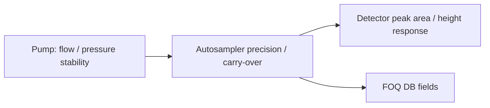

# Online VAS Method Understanding and Summary Collection

Online_KB_Status: DERIVED_KNOWLEDGE_REQUIRES_CM_REVIEW  
Build_Date: 2026-07-23  
Scope: VAS method roles, reusable execution patterns, configuration dependencies, and report-facing evidence

The original-script collection is the command source of truth. These summaries are derived interpretations. They may route an intent and explain a method, but they must not override decoded CMBX rows. Any generated method still requires local preflight, CMBX compilation, CM import/open, and CM Method Check.

## Self Index

| Summary ID | Source method | Family | Evidence status | Section |
|---|---|---|---|---|
| `S-VAS-BI-VASC-COOLED-STOPFLOW` | `BI_VASC_Cooled_STOPFLOW` | `burnin_stopflow_cleanup` | `derived_from_decoded_cmbx_preview_not_cm_validated` | [Open](#s-vas-bi-vasc-cooled-stopflow) |
| `S-VAS-FOQ-VASA-AUTO-LEAK-TEST` | `FOQ_VASA_Auto_Leak_Test` | `automatic_leak_test` | `derived_from_decoded_cmbx_preview_not_cm_validated` | [Open](#s-vas-foq-vasa-auto-leak-test) |
| `S-VAS-FOQ-VASA-COOLED-CO-END` | `FOQ_VASA_Cooled_CO_End` | `carryover_end_reset` | `derived_from_decoded_cmbx_preview_not_cm_validated` | [Open](#s-vas-foq-vasa-cooled-co-end) |
| `S-VAS-FOQ-VASA-COOLED-CO-RC` | `FOQ_VASA_Cooled_CO_RC` | `carryover_rc_long_sample` | `derived_from_decoded_cmbx_preview_not_cm_validated` | [Open](#s-vas-foq-vasa-cooled-co-rc) |
| `S-VAS-FOQ-VASA-COOLED-CO-RC-FILL-REF-VIALS` | `FOQ_VASA_Cooled_CO_RC_Fill_Ref_Vials` | `carryover_rc_fill_reference_vials` | `derived_from_decoded_cmbx_preview_not_cm_validated` | [Open](#s-vas-foq-vasa-cooled-co-rc-fill-ref-vials) |
| `S-VAS-FOQ-VASA-COOLED-CO-RC-SOLV-REF` | `FOQ_VASA_Cooled_CO_RC_Solv_Ref` | `carryover_rc_short_reference` | `derived_from_decoded_cmbx_preview_not_cm_validated` | [Open](#s-vas-foq-vasa-cooled-co-rc-solv-ref) |
| `S-VAS-FOQ-VASA-COOLED-EQUILIBRATION` | `FOQ_VASA_Cooled_equilibration` | `equilibration_flow_step` | `derived_from_decoded_cmbx_preview_not_cm_validated` | [Open](#s-vas-foq-vasa-cooled-equilibration) |
| `S-VAS-FOQ-VASA-COOLED-EXCEPTIONLOG-CLEAR` | `FOQ_VASA_Cooled_ExceptionLog_Clear` | `exceptionlog_clear_safe_transport` | `derived_from_decoded_cmbx_preview_not_cm_validated` | [Open](#s-vas-foq-vasa-cooled-exceptionlog-clear) |
| `S-VAS-FOQ-VASA-COOLED-FLOW-ADJUSTMENT-RESTRICTION-CAPILLARY` | `FOQ_VASA_Cooled_Flow_adjustment_restriction_capillary` | `flow_adjustment_restriction_capillary` | `derived_from_decoded_cmbx_preview_not_cm_validated` | [Open](#s-vas-foq-vasa-cooled-flow-adjustment-restriction-capillary) |
| `S-VAS-FOQ-VASA-COOLED-IN-RELAY-VWD` | `FOQ_VASA_Cooled_IN_RELAY_VWD` | `digital_io_relay_input` | `derived_from_decoded_cmbx_preview_not_cm_validated` | [Open](#s-vas-foq-vasa-cooled-in-relay-vwd) |
| `S-VAS-FOQ-VASA-COOLED-INIT` | `FOQ_VASA_Cooled_Init` | `sampler_initialization_drive_deviation` | `derived_from_decoded_cmbx_preview_not_cm_validated` | [Open](#s-vas-foq-vasa-cooled-init) |
| `S-VAS-FOQ-VASA-COOLED-LINEARITY-SETIDLEVOLUME` | `FOQ_VASA_Cooled_Linearity_SetIdleVolume` | `linearity_idle_volume_setting` | `derived_from_decoded_cmbx_preview_not_cm_validated` | [Open](#s-vas-foq-vasa-cooled-linearity-setidlevolume) |
| `S-VAS-FOQ-VASA-COOLED-MH-MAX-RANGE-IN-ONEINJ-NOUDP` | `FOQ_VASA_Cooled_MH_Max_Range_in_oneInj___NoUdp` | `mh_max_range_no_udp` | `derived_from_decoded_cmbx_preview_not_cm_validated` | [Open](#s-vas-foq-vasa-cooled-mh-max-range-in-oneinj-noudp) |
| `S-VAS-FOQ-VASA-COOLED-PRECISION-LINEARITY` | `FOQ_VASA_Cooled_Precision_Linearity` | `precision_linearity_analytical_injection` | `derived_from_decoded_cmbx_preview_not_cm_validated` | [Open](#s-vas-foq-vasa-cooled-precision-linearity) |
| `S-VAS-FOQ-VASA-COOLED-SETPARAMETERS` | `FOQ_VASA_Cooled_SetParameters` | `set_parameters_wellness_factory_defaults` | `derived_from_decoded_cmbx_preview_not_cm_validated` | [Open](#s-vas-foq-vasa-cooled-setparameters) |
| `S-VAS-FOQ-VASA-COOLED-STOP` | `FOQ_VASA_Cooled_STOP` | `stop_reset_factory_defaults` | `derived_from_decoded_cmbx_preview_not_cm_validated` | [Open](#s-vas-foq-vasa-cooled-stop) |
| `S-VAS-FOQ-VASA-COOLED-SYSTEM-FLUSH` | `FOQ_VASA_Cooled_System_Flush` | `system_flush_repeated_injections` | `derived_from_decoded_cmbx_preview_not_cm_validated` | [Open](#s-vas-foq-vasa-cooled-system-flush) |
| `S-VAS-FOQ-VASC-COOLED-MH-MAX-RANGE-IN-ONEINJ` | `FOQ_VASC_Cooled_MH_Max_Range_in_oneInj` | `mh_max_range_udp` | `derived_from_decoded_cmbx_preview_not_cm_validated` | [Open](#s-vas-foq-vasc-cooled-mh-max-range-in-oneinj) |
| `S-VAS-FOQ-VASC-COOLED-TEMP-COOLING-PERFORMANCE-BI` | `FOQ_VASC_Cooled_Temp_Cooling_Performance_BI` | `cooling_performance` | `derived_from_decoded_cmbx_preview_not_cm_validated` | [Open](#s-vas-foq-vasc-cooled-temp-cooling-performance-bi) |

## Supporting Knowledge

| ID | Status | Source |
|---|---|---|
| `K-VAS-TD` | Available | `FOQ_VAS_TD_KNOWLEDGE_MANAGEMENT.md` |
| `K-VAS-LOGIC` | Missing | `FOQ_TD_TEST_LOGIC_KNOWLEDGE_BASE.md` |
| `K-VAS-REPORT` | Available | `VAS_DVAS_V_3_45_FORMULA_INVENTORY.md` |

<a id="k-vas-method-index"></a>
## K-VAS-METHOD-INDEX: Cross-Method Routing Index

# Method Script Knowledge Base Index

This directory contains one derived Markdown knowledge artifact per uploaded Chromeleon method script. These files are not executable method scripts; they are high-granularity summaries for future script generation.

## Generated files

| # | Source method | Knowledge file | Family | Rows | Purpose |
|---:|---|---|---|---:|---|
| 1 | `BI_VASC_Cooled_STOPFLOW.md` | `01_BI_VASC_Cooled_STOPFLOW_KB.md` | `burnin_stopflow_cleanup` | 58 | Burn-in stop-flow/stop method. It initializes the sampler, performs an injection to avoid ready-check warnings, reconnects the sampler to log error queue behavior, switches valve to bypass, raises the needle, enters s... |
| 2 | `FOQ_VASA_Auto_Leak_Test.md` | `02_FOQ_VASA_Auto_Leak_Test_KB.md` | `automatic_leak_test` | 309 | Automatic high-pressure leak test. It prepares pump pistons for individual control, selects inject or bypass leak-test valve position according to sequence state, builds pressure with a selected pump drive, records pi... |
| 3 | `FOQ_VASA_Cooled_CO_End.md` | `03_FOQ_VASA_Cooled_CO_End_KB.md` | `carryover_end_reset` | 102 | Carry-over end/reset method. It resets chromatographic and sampler settings to general defaults, performs a final injection, records core diagnostic channels, handles table indexer abort, and turns acquisition off. |
| 4 | `FOQ_VASA_Cooled_CO_RC.md` | `04_FOQ_VASA_Cooled_CO_RC_KB.md` | `carryover_rc_long_sample` | 130 | Carry-over restriction-capillary high-concentration or long sample injection method. It is structurally similar to the solvent/reference method but extends the Stop Run to 7 min for the C2000 carry-over sample. |
| 5 | `FOQ_VASA_Cooled_CO_RC_Fill_Ref_Vials.md` | `05_FOQ_VASA_Cooled_CO_RC_Fill_Ref_Vials_KB.md` | `carryover_rc_fill_reference_vials` | 142 | Carry-over reference-vial fill method. It stops the pump to let backpressure drop, moves the needle to purge and reference-vial positions, uses high flow to purge/fill water into the solvent reference vial, stops the ... |
| 6 | `FOQ_VASA_Cooled_CO_RC_Solv_Ref.md` | `06_FOQ_VASA_Cooled_CO_RC_Solv_Ref_KB.md` | `carryover_rc_short_reference` | 130 | Carry-over restriction-capillary solvent/reference injection method. It uses the calculated restriction-capillary flow, AfterDraw wash, full diagnostic acquisition, and a short chromatographic run for solvent or low-l... |
| 7 | `FOQ_VASA_Cooled_equilibration.md` | `07_FOQ_VASA_Cooled_equilibration_KB.md` | `equilibration_flow_step` | 52 | Thermal/flow equilibration method. It waits for module readiness, then steps flow from 0.5 to 1.0 after a short delay, with a fallback Stop Run at 2 min. |
| 8 | `FOQ_VASA_Cooled_ExceptionLog_Clear.md` | `08_FOQ_VASA_Cooled_ExceptionLog_Clear_KB.md` | `exceptionlog_clear_safe_transport` | 32 | Short end/protection method. Despite the filename, the visible script reconnects the sampler, switches the valve to bypass, and moves the needle up to avoid transport damage; no explicit ExceptionLog.Clear row is pres... |
| 9 | `FOQ_VASA_Cooled_Flow_adjustment_restriction_capillary.md` | `09_FOQ_VASA_Cooled_Flow_adjustment_restriction_capillary_KB.md` | `flow_adjustment_restriction_capillary` | 122 | Restriction-capillary flow adjustment. It measures pump pressure at an initial flow, averages three pressure readings, calculates a new flow to hit target pressure, clamps to a permitted range, verifies pressure after... |
| 10 | `FOQ_VASA_Cooled_IN_RELAY_VWD.md` | `10_FOQ_VASA_Cooled_IN_RELAY_VWD_KB.md` | `digital_io_relay_input` | 47 | Digital I/O verification. It cycles relay 1 and relay 2 through all relevant ON/OFF combinations and logs input 1/input 2 states after each state change. |
| 11 | `FOQ_VASA_Cooled_Init.md` | `11_FOQ_VASA_Cooled_Init_KB.md` | `sampler_initialization_drive_deviation` | 135 | Sampler initialization and drive-deviation logging method. It performs a normal injection, initializes the sampler, waits until ready, then logs compression, metering, needle, and horizontal drive home deviations. |
| 12 | `FOQ_VASA_Cooled_Linearity_SetIdleVolume.md` | `12_FOQ_VASA_Cooled_Linearity_SetIdleVolume_KB.md` | `linearity_idle_volume_setting` | 58 | Extended linearity preparation method. It applies a sampler idle volume from the current injection custom variable and logs the resulting IdleVolume. |
| 13 | `FOQ_VASA_Cooled_MH_Max_Range_in_oneInj___NoUdp.md` | `13_FOQ_VASA_Cooled_MH_Max_Range_in_oneInj___NoUdp_KB.md` | `mh_max_range_no_udp` | 162 | Metering-head maximum range test in one injection, implemented as direct sequential sampler service commands instead of a UDP. It moves MD/CD over the high range, draws sample from SR:1, injects, then logs metering/co... |
| 14 | `FOQ_VASA_Cooled_Precision_Linearity.md` | `14_FOQ_VASA_Cooled_Precision_Linearity_KB.md` | `precision_linearity_analytical_injection` | 128 | Standard analytical injection method for precision and linearity with caffeine. It sets common chromatographic conditions, injects, records pump/temperature/UV diagnostic channels, watches TableIndexerMode, logs meter... |
| 15 | `FOQ_VASA_Cooled_SetParameters.md` | `15_FOQ_VASA_Cooled_SetParameters_KB.md` | `set_parameters_wellness_factory_defaults` | 112 | Factory/qualification/wellness parameter setup method. It rejects wrong model/template combinations, enters sampler service level, disables qualification/service intervals and wellness limits, applies factory defaults... |
| 16 | `FOQ_VASA_Cooled_STOP.md` | `16_FOQ_VASA_Cooled_STOP_KB.md` | `stop_reset_factory_defaults` | 121 | Final FOQ stop/factory-default reset method. It slows the pump to standby, validates table indexer status, enters sampler service level twice, performs an injection, applies factory defaults/internals, logs many sampl... |
| 17 | `FOQ_VASA_Cooled_System_Flush.md` | `17_FOQ_VASA_Cooled_System_Flush_KB.md` | `system_flush_repeated_injections` | 76 | System flush method with repeated water injections from R:A3. It uses two triggers and Boolean toggles to repeatedly inject until the custom variable Injectionnumber_Flush is reached, then holds for 90 s and ends. |
| 18 | `FOQ_VASC_Cooled_MH_Max_Range_in_oneInj.md` | `18_FOQ_VASC_Cooled_MH_Max_Range_in_oneInj_KB.md` | `mh_max_range_udp` | 149 | Metering-head maximum range test in one injection using a sampler UDP. The detailed MD/CD/valve/fan/GotoPosition sequence is assembled during Instrument Setup with UdpBegin/UdpWait/UdpEnd and executed during Run by Sa... |
| 19 | `FOQ_VASC_Cooled_Temp_Cooling_Performance_BI.md` | `19_FOQ_VASC_Cooled_Temp_Cooling_Performance_BI_KB.md` | `cooling_performance` | 86 | Cooling-performance measurement for thermostatted Vanquish autosamplers. It measures ambient temperature, sets the cabin to ambient, waits for stability, starts temperature/pressure acquisition, sets target to 4 C, an... |

## Cross-method reusable pattern map

| Pattern | Meaning | Source methods |
|---|---|---|
| Acquisition symmetry | Turns diagnostic acquisition channels on at Start Run or early Run and mirrors AcqOff at abort/Stop Run/Post Run. | `FOQ_VASA_Auto_Leak_Test.md`, `FOQ_VASA_Cooled_CO_End.md`, `FOQ_VASA_Cooled_CO_RC.md`, `FOQ_VASA_Cooled_CO_RC_Fill_Ref_Vials.md`, `FOQ_VASA_Cooled_CO_RC_Solv_Ref.md`, `FOQ_VASA_Cooled_Flow_adjustment_restriction_capillary.md`, `FOQ_VASA_Cooled_IN_RELAY_VWD.md`, `FOQ_VASA_Cooled_Init.md`, `FOQ_VASA_Cooled_MH_Max_Range_in_oneInj___NoUdp.md`, `FOQ_VASA_Cooled_Precision_Linearity.md`, `FOQ_VASA_Cooled_STOP.md`, `FOQ_VASA_Cooled_System_Flush.md`, `FOQ_VASC_Cooled_MH_Max_Range_in_oneInj.md`, `FOQ_VASC_Cooled_Temp_Cooling_Performance_BI.md` |
| Factory defaults | Uses Sampler.SetFactoryDefaults and often Sampler.SetFactoryInternals to restore factory/internal sampler settings. | `FOQ_VASA_Cooled_SetParameters.md`, `FOQ_VASA_Cooled_STOP.md` |
| Firmware/service command bridge | Uses SamplerModule_Service or PumpModule_Service _SendCommand for firmware-level operations not exposed as normal CM properties. Preserve exact strings and ordering. | `BI_VASC_Cooled_STOPFLOW.md`, `FOQ_VASA_Auto_Leak_Test.md`, `FOQ_VASA_Cooled_CO_RC.md`, `FOQ_VASA_Cooled_CO_RC_Fill_Ref_Vials.md`, `FOQ_VASA_Cooled_CO_RC_Solv_Ref.md`, `FOQ_VASA_Cooled_ExceptionLog_Clear.md`, `FOQ_VASA_Cooled_Linearity_SetIdleVolume.md`, `FOQ_VASA_Cooled_MH_Max_Range_in_oneInj___NoUdp.md`, `FOQ_VASA_Cooled_Precision_Linearity.md`, `FOQ_VASA_Cooled_SetParameters.md`, `FOQ_VASA_Cooled_STOP.md`, `FOQ_VASC_Cooled_MH_Max_Range_in_oneInj.md` |
| Injection custom variables | Uses current injection custom variables as runtime inputs; these must exist in the sequence/injection list. | `FOQ_VASA_Cooled_Linearity_SetIdleVolume.md`, `FOQ_VASA_Cooled_System_Flush.md` |
| Log clearing | Uses service _SendCommand ErrorLog.Clear and/or ExceptionLog.Clear; this should remain late in stop methods. | `BI_VASC_Cooled_STOPFLOW.md`, `FOQ_VASA_Cooled_STOP.md` |
| Selectable pump drive | Branches on System.Sequence.CustomVariables.chooseDrive to choose Blk1 Drv1 vs Drv2 for pressure/leak evaluation. | `FOQ_VASA_Auto_Leak_Test.md` |
| Service-level entry | Requests service level via GetServiceCode, writes ServiceCode 87794, delays, logs service status, and often retries once if not in Service. | `BI_VASC_Cooled_STOPFLOW.md`, `FOQ_VASA_Auto_Leak_Test.md`, `FOQ_VASA_Cooled_Flow_adjustment_restriction_capillary.md`, `FOQ_VASA_Cooled_MH_Max_Range_in_oneInj___NoUdp.md`, `FOQ_VASA_Cooled_SetParameters.md`, `FOQ_VASA_Cooled_STOP.md` |
| TableIndexerMode guard | Acquires TableIndexerMode and aborts the queue with a German protocol message if Signal > 0. Reuse as carousel/indexer motor protection. | `FOQ_VASA_Auto_Leak_Test.md`, `FOQ_VASA_Cooled_CO_End.md`, `FOQ_VASA_Cooled_CO_RC.md`, `FOQ_VASA_Cooled_CO_RC_Fill_Ref_Vials.md`, `FOQ_VASA_Cooled_CO_RC_Solv_Ref.md`, `FOQ_VASA_Cooled_Flow_adjustment_restriction_capillary.md`, `FOQ_VASA_Cooled_Init.md`, `FOQ_VASA_Cooled_MH_Max_Range_in_oneInj___NoUdp.md`, `FOQ_VASA_Cooled_Precision_Linearity.md`, `FOQ_VASA_Cooled_STOP.md`, `FOQ_VASA_Cooled_System_Flush.md`, `FOQ_VASC_Cooled_MH_Max_Range_in_oneInj.md`, `FOQ_VASC_Cooled_Temp_Cooling_Performance_BI.md` |
| Virtual channel calculation | Creates virtual channels for derived volumes or leak-rate diagnostics from raw signals. | `FOQ_VASA_Auto_Leak_Test.md` |

## Recommended future AI read order

1. Read `00_METHOD_KB_INDEX.md` to choose the closest method family.
2. Read the corresponding per-method KB file and inspect sections 10-12 before generating a new method.
3. If generating executable TSV, enforce the strict SPEC rules: real tab columns, no timed prose-only rows, numeric trigger limits, no invented custom variables, and Run/Stop timing consistency.
4. After packaging, validate by CMBX decode, rendered table comparison, CM import/open, and CM Method Check.

<a id="s-vas-bi-vasc-cooled-stopflow"></a>
## S-VAS-BI-VASC-COOLED-STOPFLOW: BI_VASC_Cooled_STOPFLOW

---
kb_type: chromeleon_method_summary
source_method_file: BI_VASC_Cooled_STOPFLOW.md
source_sha256_16: 517ae5eeeab9d9b1
method_family: burnin_stopflow_cleanup
row_count: 58
language: en
status: derived_from_decoded_cmbx_preview_not_cm_validated
---

# BI VASC Cooled STOPFLOW - Method Knowledge Summary

> This file is a derived knowledge artifact, not an executable method script. It is designed so a future AI/script generator can read the intent, command patterns, variables, safety guards, and reusable structures before authoring a new strict TSV method.

## 1. Method identity and role

- **Source file:** `BI_VASC_Cooled_STOPFLOW.md`
- **Primary purpose:** Burn-in stop-flow/stop method. It initializes the sampler, performs an injection to avoid ready-check warnings, reconnects the sampler to log error queue behavior, switches valve to bypass, raises the needle, enters service level, and clears ErrorLog.
- **Sequence role:** Burn-in end or stop-flow safe-state cleanup for cooled Core autosampler.
- **Method family tag:** `burnin_stopflow_cleanup`
- **When to reuse:** Use for BI cleanup methods that must leave the sampler in bypass with needle lifted and ErrorLog cleared.
- **Source visible title/comment cues:** `PumpDevice =  "Pump"`; `InjectWashMode = BeforeInject`; `InjectMode = Normal`
- **Detected modules/symbol roots:** `Pump`, `PumpModule`, `Sampler`, `SamplerModule`
- **Run duration declarations:** `1.6`
- **Stop Run times:** `2.0`

## 2. High-level execution story

This method configures or controls the pump, pressure limits, flow, or pump service commands; configures sampler mechanics, injection behavior, service commands, temperature, or table-indexer monitoring.

## 3. Stage and timeline map

| Row | Time | Stage | Value | Comment |
|---:|---|---|---|---|
| 1 | {Initial Time} | Instrument Setup |  |  |
| 2 | -0.100 | Equilibration |  |  |
| 18 | 0.000 | Start Run |  |  |
| 19 | 0.000 | Run | Duration = 1.600 [min] |  |
| 56 | 2.000 | Stop Run |  |  |
| 57 | 2.000 | Post Run |  |  |

### 3.1 Timed execution anchors and inferred roles

| Row | Time | Command | Value | Inferred role |
|---:|---|---|---|---|
| 1 | {Initial Time} | Instrument Setup |  | stage |
| 2 | -0.100 | Equilibration |  | stage |
| 18 | 0.000 | Start Run |  | stage |
| 19 | 0.000 | Run | Duration = 1.600 [min] | stage |
| 25 | 1.100 | --------------------------------------------------------------------------------------- |  | timed_prose_or_legacy_comment |
| 27 | 1.150 | SamplerModule.Disconnect |  | command_or_property_without_value |
| 32 | 1.200 | SamplerModule.Sampler.SwitchValve | Bypass | property_set |
| 37 | 1.400 | ============================================================================== |  | timed_prose_or_legacy_comment |
| 46 | If | SamplerModule_Service.ServiceCode=Service |  | branch |
| 47 | Else |  |  | branch |
| 54 | End If |  |  | branch |
| 55 | 1.600 | SamplerModule.SamplerModule_Service._SendCommand | CommandString="ErrorLog.Clear" | firmware_send_command |
| 56 | 2.000 | Stop Run |  | stage |
| 57 | 2.000 | Post Run |  | stage |

## 4. Subsystem configuration distilled from the script

### 4.1 PumpModule

| Row | Command | Value | Comment | Role |
|---:|---|---|---|---|
| 3 | PumpModule.Pump.Pressure.LowerLimit | 10 [bar] |  | property_set |
| 4 | PumpModule.Pump.Pressure.UpperLimit | 700 [bar] |  | property_set |
| 6 | PumpModule.Pump.%A_Selector | %A1 |  | property_set |
| 7 | PumpModule.Pump.%B_Selector | %B1 |  | property_set |
| 8 | PumpModule.Pump.Flow.Nominal | 0.600 [ml/min] |  | property_set |
| 24 | PumpModule.Pump.Flow.Nominal | 0.600 [ml/min] |  | property_set |

### 4.4 SamplerModule

| Row | Command | Value | Comment | Role |
|---:|---|---|---|---|
| 9 | SamplerModule.Sampler.DrawSpeed | 15.000 [µl/s] |  | property_set |
| 10 | SamplerModule.Sampler.DispenseSpeed | 15.000 [µl/s] |  | property_set |
| 11 | SamplerModule.Sampler.DrawDelay | 0.1 [s] |  | property_set |
| 12 | SamplerModule.Sampler.WashSpeed | 17 [µl/s] |  | property_set |
| 13 | SamplerModule.NeedleHeight | Safe |  | property_set |
| 16 | SamplerModule.Sampler.PunctureOffset | 0 [µm] |  | property_set |
| 20 | SamplerModule.Init |  |  | command_or_property_without_value |
| 23 | SamplerModule.Sampler.Inject |  | Avoid ready check warnings | sampler_operation |
| 27 | SamplerModule.Disconnect |  |  | command_or_property_without_value |
| 28 | SamplerModule.Connect |  |  | command_or_property_without_value |
| 32 | SamplerModule.Sampler.SwitchValve | Bypass |  | property_set |
| 34 | SamplerModule.SamplerModule_Service._SendCommand | CommandString="Sampler.MoveNeedleUp=1" |  | firmware_send_command |
| 40 | SamplerModule.SamplerModule_Service.GetServiceCode |  |  | command_or_property_without_value |
| 42 | SamplerModule.SamplerModule_Service.ServiceCode | 87794 |  | property_set |
| 44 | Log | SamplerModule_Service.ServiceCode |  | log |
| 46 | SamplerModule_Service.ServiceCode=Service |  |  | branch |
| 48 | SamplerModule.SamplerModule_Service.GetServiceCode |  |  | command_or_property_without_value |
| 50 | SamplerModule.SamplerModule_Service.ServiceCode | 87794 |  | property_set |
| 52 | Log | SamplerModule_Service.ServiceCode |  | log |
| 55 | SamplerModule.SamplerModule_Service._SendCommand | CommandString="ErrorLog.Clear" |  | firmware_send_command |

### 4.5 Sampler

| Row | Command | Value | Comment | Role |
|---:|---|---|---|---|
| 9 | SamplerModule.Sampler.DrawSpeed | 15.000 [µl/s] |  | property_set |
| 10 | SamplerModule.Sampler.DispenseSpeed | 15.000 [µl/s] |  | property_set |
| 11 | SamplerModule.Sampler.DrawDelay | 0.1 [s] |  | property_set |
| 12 | SamplerModule.Sampler.WashSpeed | 17 [µl/s] |  | property_set |
| 13 | SamplerModule.NeedleHeight | Safe |  | property_set |
| 16 | SamplerModule.Sampler.PunctureOffset | 0 [µm] |  | property_set |
| 17 | Sampler.PunctureSpeed = 25000 [µm/s] |  |  | command_or_property_without_value |
| 20 | SamplerModule.Init |  |  | command_or_property_without_value |
| 22 | Wait | Sampler.Ready |  | wait |
| 23 | SamplerModule.Sampler.Inject |  | Avoid ready check warnings | sampler_operation |
| 27 | SamplerModule.Disconnect |  |  | command_or_property_without_value |
| 28 | SamplerModule.Connect |  |  | command_or_property_without_value |
| 29 | Wait | Sampler.Ready |  | wait |
| 32 | SamplerModule.Sampler.SwitchValve | Bypass |  | property_set |
| 34 | SamplerModule.SamplerModule_Service._SendCommand | CommandString="Sampler.MoveNeedleUp=1" |  | firmware_send_command |
| 40 | SamplerModule.SamplerModule_Service.GetServiceCode |  |  | command_or_property_without_value |
| 42 | SamplerModule.SamplerModule_Service.ServiceCode | 87794 |  | property_set |
| 44 | Log | SamplerModule_Service.ServiceCode |  | log |
| 46 | SamplerModule_Service.ServiceCode=Service |  |  | branch |
| 48 | SamplerModule.SamplerModule_Service.GetServiceCode |  |  | command_or_property_without_value |
| 50 | SamplerModule.SamplerModule_Service.ServiceCode | 87794 |  | property_set |
| 52 | Log | SamplerModule_Service.ServiceCode |  | log |
| 55 | SamplerModule.SamplerModule_Service._SendCommand | CommandString="ErrorLog.Clear" |  | firmware_send_command |

## 5. Variables, state, and custom inputs

No Variables.* or System.*CustomVariables.* symbols detected.

## 6. Branching, triggers, and asynchronous logic

### 6.2 Conditional branch rows

| Row | Branch keyword | Condition/value | Comment |
|---:|---|---|---|
| 46 | If | SamplerModule_Service.ServiceCode=Service |  |
| 47 | Else |  |  |
| 54 | End If |  |  |

No trigger blocks detected.

## 7. Acquisition channel plan

- **AcqOn channels (0):** (none)
- **AcqOff channels (0):** (none)

## 8. Firmware/service command bridge

| Row | Command | Value | Comment | Generation note |
|---:|---|---|---|---|
| 34 | SamplerModule.SamplerModule_Service._SendCommand | CommandString="Sampler.MoveNeedleUp=1" |  | Preserve exact command string, punctuation, argument order, and surrounding delays unless a decoded source proves a change is safe. |
| 55 | SamplerModule.SamplerModule_Service._SendCommand | CommandString="ErrorLog.Clear" |  | Preserve exact command string, punctuation, argument order, and surrounding delays unless a decoded source proves a change is safe. |

## 9. Waits, delays, logging, aborts, and report-facing outputs

### 9.1 Wait / Delay rows

| Row | Command | Value | Comment |
|---:|---|---|---|
| 21 | Delay | 3 |  |
| 22 | Wait | Sampler.Ready |  |
| 29 | Wait | Sampler.Ready |  |
| 33 | Delay | 1 |  |
| 41 | Delay | 5 |  |
| 43 | Delay | 1 |  |
| 45 | Delay | 1 |  |
| 49 | Delay | 5 |  |
| 51 | Delay | 1 |  |
| 53 | Delay | 1 |  |

### 9.2 Log / Protocol / Message / Abort rows

| Row | Command | Value | Comment | Role |
|---:|---|---|---|---|
| 44 | Log | SamplerModule_Service.ServiceCode |  | log |
| 52 | Log | SamplerModule_Service.ServiceCode |  | log |

## 10. Reusable design patterns extracted

- **Service-level entry:** Requests service level via GetServiceCode, writes ServiceCode 87794, delays, logs service status, and often retries once if not in Service.
- **Log clearing:** Uses service _SendCommand ErrorLog.Clear and/or ExceptionLog.Clear; this should remain late in stop methods.
- **Firmware/service command bridge:** Uses SamplerModule_Service or PumpModule_Service _SendCommand for firmware-level operations not exposed as normal CM properties. Preserve exact strings and ordering.

## 11. SPEC v2.2 compatibility and generation cautions

- Source display has Run Duration 1.600 min while Stop Run starts at 2.000 min. For new SPEC v2.2 output, make Run Duration equal the Stop Run time unless the compiler/source template explicitly supports the legacy display semantics.
- Contains timed prose/comment rows in the decoded source display. Convert these to executable anchors or move prose into the Comment column in newly authored strict TSV. Examples: row 25 @ 1.100: --------------------------------------------------------------------------------; row 37 @ 1.400: ==============================================================================
- Treat this decoded source as evidence of existing CM behavior, not as proof that a newly generated method with altered structure will open/run without CM Method Check.

## 12. Future-generation rules distilled from this method

- Reuse exact device/property symbols from this source only when the target CM configuration contains the same modules and channel names.
- Preserve acquisition start/stop symmetry, especially in every abort branch and Stop Run/Post Run cleanup.
- Preserve service-level command sequences, firmware command order, and protective delays unless validated on a decoded CMBX or in CM editor.
- Do not convert source comment rows into timed command rows; strict generated TSV must use real executable anchors.
- Any report-facing variable or log row should be retained if the downstream report likely reads it.

## 13. Full row-level semantic inventory

| Row | Time | Command | Value | Comment | Inferred role |
|---:|---|---|---|---|---|
| 1 | {Initial Time} | Instrument Setup |  |  | stage |
| 2 | -0.100 | Equilibration |  |  | stage |
| 3 |  | PumpModule.Pump.Pressure.LowerLimit | 10 [bar] |  | property_set |
| 4 |  | PumpModule.Pump.Pressure.UpperLimit | 700 [bar] |  | property_set |
| 5 |  | PumpDevice =  "Pump" |  |  | comment_or_section_label |
| 6 |  | PumpModule.Pump.%A_Selector | %A1 |  | property_set |
| 7 |  | PumpModule.Pump.%B_Selector | %B1 |  | property_set |
| 8 |  | PumpModule.Pump.Flow.Nominal | 0.600 [ml/min] |  | property_set |
| 9 |  | SamplerModule.Sampler.DrawSpeed | 15.000 [µl/s] |  | property_set |
| 10 |  | SamplerModule.Sampler.DispenseSpeed | 15.000 [µl/s] |  | property_set |
| 11 |  | SamplerModule.Sampler.DrawDelay | 0.1 [s] |  | property_set |
| 12 |  | SamplerModule.Sampler.WashSpeed | 17 [µl/s] |  | property_set |
| 13 |  | SamplerModule.NeedleHeight | Safe |  | property_set |
| 14 |  | InjectWashMode = BeforeInject |  |  | comment_or_section_label |
| 15 |  | InjectMode = Normal |  |  | comment_or_section_label |
| 16 |  | SamplerModule.Sampler.PunctureOffset | 0 [µm] |  | property_set |
| 17 |  | Sampler.PunctureSpeed = 25000 [µm/s] |  |  | command_or_property_without_value |
| 18 | 0.000 | Start Run |  |  | stage |
| 19 | 0.000 | Run | Duration = 1.600 [min] |  | stage |
| 20 |  | SamplerModule.Init |  |  | command_or_property_without_value |
| 21 |  | Delay | 3 |  | trigger_parameter |
| 22 |  | Wait | Sampler.Ready |  | wait |
| 23 |  | SamplerModule.Sampler.Inject |  | Avoid ready check warnings | sampler_operation |
| 24 |  | PumpModule.Pump.Flow.Nominal | 0.600 [ml/min] |  | property_set |
| 25 | 1.100 | --------------------------------------------------------------------------------------- |  |  | timed_prose_or_legacy_comment |
| 26 |  | Commands to log the ErrorQueue |  |  | comment_or_section_label |
| 27 | 1.150 | SamplerModule.Disconnect |  |  | command_or_property_without_value |
| 28 |  | SamplerModule.Connect |  |  | command_or_property_without_value |
| 29 |  | Wait | Sampler.Ready |  | wait |
| 30 |  | --------------------------------------------------------------------------------------- |  |  | comment_or_section_label |
| 31 |  | Switch valve to bypass and move needle out of the needle seat to avoid transport damage. |  |  | command_or_property_without_value |
| 32 | 1.200 | SamplerModule.Sampler.SwitchValve | Bypass |  | property_set |
| 33 |  | Delay | 1 |  | trigger_parameter |
| 34 |  | SamplerModule.SamplerModule_Service._SendCommand | CommandString="Sampler.MoveNeedleUp=1" |  | firmware_send_command |
| 35 |  | --------------------------------------------------------------------------------------- |  |  | comment_or_section_label |
| 36 |  | Clear the module's error log |  |  | comment_or_section_label |
| 37 | 1.400 | ============================================================================== |  |  | timed_prose_or_legacy_comment |
| 38 |  | Set instrument to Service Level |  |  | comment_or_section_label |
| 39 |  | Performed twice to set the instrument reliable into service level |  |  | comment_or_section_label |
| 40 |  | SamplerModule.SamplerModule_Service.GetServiceCode |  |  | command_or_property_without_value |
| 41 |  | Delay | 5 |  | trigger_parameter |
| 42 |  | SamplerModule.SamplerModule_Service.ServiceCode | 87794 |  | property_set |
| 43 |  | Delay | 1 |  | trigger_parameter |
| 44 |  | Log | SamplerModule_Service.ServiceCode |  | log |
| 45 |  | Delay | 1 |  | trigger_parameter |
| 46 | If | SamplerModule_Service.ServiceCode=Service |  |  | branch |
| 47 | Else |  |  |  | branch |
| 48 |  | SamplerModule.SamplerModule_Service.GetServiceCode |  |  | command_or_property_without_value |
| 49 |  | Delay | 5 |  | trigger_parameter |
| 50 |  | SamplerModule.SamplerModule_Service.ServiceCode | 87794 |  | property_set |
| 51 |  | Delay | 1 |  | trigger_parameter |
| 52 |  | Log | SamplerModule_Service.ServiceCode |  | log |
| 53 |  | Delay | 1 |  | trigger_parameter |
| 54 | End If |  |  |  | branch |
| 55 | 1.600 | SamplerModule.SamplerModule_Service._SendCommand | CommandString="ErrorLog.Clear" |  | firmware_send_command |
| 56 | 2.000 | Stop Run |  |  | stage |
| 57 | 2.000 | Post Run |  |  | stage |
| 58 |  | End |  |  | method_end |

<a id="s-vas-foq-vasa-auto-leak-test"></a>
## S-VAS-FOQ-VASA-AUTO-LEAK-TEST: FOQ_VASA_Auto_Leak_Test

---
kb_type: chromeleon_method_summary
source_method_file: FOQ_VASA_Auto_Leak_Test.md
source_sha256_16: aad8f842cfab00f6
method_family: automatic_leak_test
row_count: 309
language: en
status: derived_from_decoded_cmbx_preview_not_cm_validated
---

# FOQ VASA Auto Leak Test - Method Knowledge Summary

> This file is a derived knowledge artifact, not an executable method script. It is designed so a future AI/script generator can read the intent, command patterns, variables, safety guards, and reusable structures before authoring a new strict TSV method.

## 1. Method identity and role

- **Source file:** `FOQ_VASA_Auto_Leak_Test.md`
- **Primary purpose:** Automatic high-pressure leak test. It prepares pump pistons for individual control, selects inject or bypass leak-test valve position according to sequence state, builds pressure with a selected pump drive, records piston movement, calculates leak rate, evaluates system/pump/inject-path leak results, logs all diagnostic variables, and aborts on fail.
- **Sequence role:** Internal automated leakage qualification, spanning system and bypass/pump test injections via persistent GenericFloat1 state.
- **Method family tag:** `automatic_leak_test`
- **When to reuse:** Use as the canonical pattern for pressure-hold leak calculations from pump linear encoder movement and time delta.
- **Source visible title/comment cues:** `Initializing variables`
- **Detected modules/symbol roots:** `ColumnComp`, `Pump`, `PumpModule`, `Sampler`, `SamplerModule`, `System`, `Variables`, `VirtualChannel`
- **Run duration declarations:** `12.0`
- **Stop Run times:** `13.0`

## 2. High-level execution story

This method configures or controls the pump, pressure limits, flow, or pump service commands; configures the column compartment temperature/valves and may use a restriction-capillary flow path; configures sampler mechanics, injection behavior, service commands, temperature, or table-indexer monitoring; uses generic variables as state, calculations, flags, limits, or report outputs; uses trigger blocks for asynchronous protection, live diagnostics, looping, or endpoint logging.

## 3. Stage and timeline map

| Row | Time | Stage | Value | Comment |
|---:|---|---|---|---|
| 1 | {Initial Time} | Instrument Setup |  |  |
| 55 | -2.000 | Equilibration | Duration = 1.800 [min] |  |
| 83 | 0.000 | Start Run |  |  |
| 97 | 0.000 | Run | Duration = 12.000 [min] |  |
| 205 | 13.000 | Stop Run |  |  |
| 217 | 13.000 | Post Run | Duration = 1.100 [min] |  |

### 3.1 Timed execution anchors and inferred roles

| Row | Time | Command | Value | Inferred role |
|---:|---|---|---|---|
| 1 | {Initial Time} | Instrument Setup |  | stage |
| 41 | If | System.Injection.Name="Injector pressure test (System)" |  | branch |
| 43 | End If |  |  | branch |
| 44 | If | SamplerModule.ModelNo="VA-A12-A" |  | branch |
| 49 | Else |  |  | branch |
| 54 | End If |  |  | branch |
| 55 | -2.000 | Equilibration | Duration = 1.800 [min] | stage |
| 57 | If | Variables.GenericFloat1=1 |  | branch |
| 60 | Else If | Variables.GenericFloat1=2 |  | branch |
| 61 | Else |  |  | branch |
| 66 | End If |  |  | branch |
| 69 | -0.200 | PumpModule.Pump.Flow.Nominal | 0.30 [ml/min] | property_set |
| 76 | If | System.Sequence.CustomVariables.chooseDrive="A1" |  | branch |
| 79 | Else |  |  | branch |
| 82 | End If |  |  | branch |
| 83 | 0.000 | Start Run |  | stage |
| 97 | 0.000 | Run | Duration = 12.000 [min] | stage |
| 99 | If | Variables.GenericFloat1=2 |  | branch |
| 101 | If | (SamplerModule.ModelNo="VH-A40-A" or SamplerModule.ModelNo="VF-A40-A") and SamplerModule.Sampler.Location=Right |  | branch |
| 103 | Else |  |  | branch |
| 105 | End If |  |  | branch |
| 106 | Else |  |  | branch |
| 108 | If | (SamplerModule.ModelNo="VH-A40-A" or SamplerModule.ModelNo="VF-A40-A") and SamplerModule.Sampler.Location=Right |  | branch |
| 110 | Else |  |  | branch |
| 112 | End If |  |  | branch |
| 113 | End If |  |  | branch |
| 117 | If | System.Sequence.CustomVariables.chooseDrive="A1" |  | branch |
| 119 | Else |  |  | branch |
| 121 | End If |  |  | branch |
| 122 | 0.010 | Trigger defined to terminate run, if measurement pressure is not reached or cannot be maintained. |  | timed_prose_or_legacy_comment |
| 123 | Trigger | "CannotBuildUpPressure", PumpModule.Pump.Blk1_Drv1_Linenc>17000 or PumpModule.Pump.Blk1_Drv2_Linenc>17000, Limit=1 |  | trigger_start |
| 124 | If | System.Retention<13 |  | branch |
| 131 | If | Variables.GenericFloat1=0 |  | branch |
| 137 | Else If | Variables.GenericFloat1=2 |  | branch |
| 144 | End If |  |  | branch |
| 145 | End If |  |  | branch |
| 146 | End Trigger |  |  | trigger_end |
| 147 | If | SamplerModule.TableIndexerMode.Signal>0 |  | branch |
| 148 | 0.040 | PumpModule.Pump.Pump_Pressure.AcqOff |  | acquisition_off |
| 162 | Else |  |  | branch |
| 163 | End If |  |  | branch |
| 164 | Trigger | "LiveDrucktest", System.Retention>Variables.GenericFloat8+1 AND System.Retention<12.900, AllowImmediateExecution=Yes |  | trigger_start |
| 170 | If | System.Retention>7.00 |  | branch |
| 172 | End If |  |  | branch |
| 173 | End Trigger |  |  | trigger_end |
| 174 | 5.000 | VirtualChannel | "Volume_Loss", Variables.GenericFloat9-3.141*1.5875*1.5875*PumpModule.Pump.Blk1_Drv1_Linenc.Signal | virtual_channel |
| 176 | 7.000 | Leak rate measurement. |  | timed_prose_or_legacy_comment |
| 178 | If | System.Sequence.CustomVariables.chooseDrive="A1" |  | branch |
| 179 | If | PumpModule.Pump.Blk1_Drv1_Linenc.Signal>Variables.GenericDouble0 |  | branch |
| 182 | End If |  |  | branch |
| 184 | Else |  |  | branch |
| 185 | If | PumpModule.Pump.Blk1_Drv2_Linenc.Signal>Variables.GenericDouble0 |  | branch |
| 188 | End If |  |  | branch |
| 190 | End If |  |  | branch |
| 191 | 12.000 | Find the maximum piston position @ t ~ 12.5 min |  | timed_prose_or_legacy_comment |
| 192 | If | System.Sequence.CustomVariables.chooseDrive="A1" |  | branch |
| 193 | If | PumpModule.Pump.Blk1_Drv1_Linenc.Signal>Variables.GenericDouble2 |  | branch |
| 196 | End If |  |  | branch |
| 198 | Else |  |  | branch |
| 199 | If | PumpModule.Pump.Blk1_Drv2_Linenc.Signal>Variables.GenericDouble2 |  | branch |
| 202 | End If |  |  | branch |
| 204 | End If |  |  | branch |
| 205 | 13.000 | Stop Run |  | stage |
| 217 | 13.000 | Post Run | Duration = 1.100 [min] | stage |
| 238 | If | Variables.GenericFloat1=0 and Variables.GenericDouble6<Variables.GenericFloat0 and Variables.GenericDouble6>Variables.GenericFloat3 |  | branch |
| 244 | Else If | Variables.GenericFloat1=0 and (Variables.GenericDouble6>Variables.GenericFloat0 or Variables.GenericDouble6<Variables.GenericFloat3) |  | branch |
| 250 | Else If | Variables.GenericFloat1=2 and Variables.GenericDouble7-Variables.GenericDouble6<Variables.GenericFloat0 and Variables.GenericDouble6<Variables.GenericFloat2 and Variables.GenericDouble7-Variables.GenericDouble6>Variables.GenericFloat3 |  | branch |
| 258 | Else |  |  | branch |
| 259 | If | Variables.GenericFloat1=2 and (Variables.GenericDouble7-Variables.GenericDouble6>Variables.GenericFloat0 or Variables.GenericDouble7-Variables.GenericDouble6<Variables.GenericFloat3 or Variables.GenericDouble6>Variables.GenericFloat2) |  | branch |
| 267 | Else |  |  | branch |
| 270 | End If |  |  | branch |
| 275 | End If |  |  | branch |
| 301 | 13.950 | PumpModule.Pump.Flow.Nominal | 0.400 | property_set |
| 302 | 13.960 | PumpModule.Pump.Flow.Nominal | 0.000 | property_set |
| 303 | 13.970 | Queue is aborted if leak test fails. |  | timed_prose_or_legacy_comment |
| 304 | Trigger | "Abort Queue", Variables.GenericBool9=1, Limit=1 |  | trigger_start |
| 308 | End Trigger |  |  | trigger_end |

## 4. Subsystem configuration distilled from the script

### 4.1 PumpModule

| Row | Command | Value | Comment | Role |
|---:|---|---|---|---|
| 2 | PumpModule.PumpModule_Service.GetServiceCode |  |  | command_or_property_without_value |
| 3 | PumpModule.PumpModule_Service.ServiceCode | 87794 |  | property_set |
| 4 | PumpModule.Pump.MaximumFlowRampDown | infinite |  | property_set |
| 5 | PumpModule.Pump.MaximumFlowRampUp | infinite |  | property_set |
| 6 | PumpModule.Degasser | On |  | property_set |
| 7 | PumpModule.Pump.Pump_Pressure.UseFilter | Off |  | property_set |
| 8 | PumpModule.Pump.Pump_Pressure_Blk1_Drv1.UseFilter | Off |  | property_set |
| 9 | PumpModule.Pump.Pump_Pressure_Blk1_Drv2.UseFilter | Off |  | property_set |
| 10 | PumpModule.Pump.Pump_Pressure_Blk2_Drv1.UseFilter | Off |  | property_set |
| 11 | PumpModule.Pump.Pump_Pressure_Blk2_Drv2.UseFilter | Off |  | property_set |
| 12 | PumpModule.Pump.%A_Selector | %A1 |  | property_set |
| 47 | PumpModule.Pump.Pressure.UpperLimit | 500 |  | property_set |
| 67 | PumpModule.Pump.Flow.Nominal | 0.300 [ml/min] |  | property_set |
| 68 | PumpModule.Pump.%B.Value | 0.0 [%] |  | property_set |
| 69 | PumpModule.Pump.Flow.Nominal | 0.30 [ml/min] |  | property_set |
| 70 | PumpModule.Pump.%B.Value | 0.0 [%] |  | property_set |
| 73 | PumpModule.PumpModule_Service._SendCommand | "Flow1.Blk1.CtrlOff" |  | firmware_send_command |
| 77 | PumpModule.PumpModule_Service._SendCommand | "Flow1.Blk1.Drv1.PositionMode=200000,6000,66000" | This takes about 3 s | firmware_send_command |
| 80 | PumpModule.PumpModule_Service._SendCommand | "Flow1.Blk1.Drv2.PositionMode=200000,6000,66000" | This takes about 3 s | firmware_send_command |
| 84 | PumpModule.Pump.Pump_Pressure.AcqOn |  |  | acquisition_on |
| 85 | PumpModule.Pump.Pump_Pressure_Blk1_Drv1.AcqOn |  |  | acquisition_on |
| 86 | PumpModule.Pump.Pump_Pressure_Blk1_Drv2.AcqOn |  |  | acquisition_on |
| 87 | PumpModule.Pump.Pump_Pressure_Blk2_Drv1.AcqOn |  |  | acquisition_on |
| 88 | PumpModule.Pump.Pump_Pressure_Blk2_Drv2.AcqOn |  |  | acquisition_on |
| 89 | PumpModule.Pump.Blk1_Drv1_Linenc.AcqOn |  |  | acquisition_on |
| 90 | PumpModule.Pump.Blk1_Drv2_Linenc.AcqOn |  |  | acquisition_on |
| 91 | PumpModule.Pump.Blk2_Drv1_Linenc.AcqOn |  |  | acquisition_on |
| 92 | PumpModule.Pump.Blk2_Drv2_Linenc.AcqOn |  |  | acquisition_on |
| 93 | PumpModule.RecentDrops.AcqOn |  |  | acquisition_on |
| 94 | VirtualChannel | "Volume_Blk1_Drv1", 3.141*1.5875*1.5875*PumpModule.Pump.Blk1_Drv1_Linenc.Signal | calculation of volume the piston displaces [nL]. Maximum volume = 134500 nL | virtual_channel |
| 95 | VirtualChannel | "Volume_Blk1_Drv2", 3.141*1.5875*1.5875*PumpModule.Pump.Blk1_Drv2_Linenc.Signal | calculation of volume the piston displaces [nL]. Maximum volume = 134500 nL | virtual_channel |
| 118 | PumpModule.PumpModule_Service._SendCommand | "Flow1.Blk1.Drv1.BuildupPressure="+Variables.GenericString0 |  | firmware_send_command |
| 120 | PumpModule.PumpModule_Service._SendCommand | "Flow1.Blk1.Drv2.BuildupPressure="+Variables.GenericString0 |  | firmware_send_command |
| 123 | "CannotBuildUpPressure", PumpModule.Pump.Blk1_Drv1_Linenc>17000 or PumpModule.Pump.Blk1_Drv2_Linenc>17000, Limit=1 |  |  | trigger_start |
| 125 | PumpModule.Pump.Pump_Service.AbortModalCommand |  |  | command_or_property_without_value |
| 126 | PumpModule.Pump.Pump_Service.PurgeValve | Open |  | property_set |
| 129 | PumpModule.Pump.Pump_Service.PurgeValve | Closed |  | property_set |
| 148 | PumpModule.Pump.Pump_Pressure.AcqOff |  |  | acquisition_off |
| 149 | PumpModule.Pump.Pump_Pressure_Blk1_Drv1.AcqOff |  |  | acquisition_off |
| 150 | PumpModule.Pump.Pump_Pressure_Blk1_Drv2.AcqOff |  |  | acquisition_off |
| 151 | PumpModule.Pump.Pump_Pressure_Blk2_Drv1.AcqOff |  |  | acquisition_off |
| 152 | PumpModule.Pump.Pump_Pressure_Blk2_Drv2.AcqOff |  |  | acquisition_off |
| 153 | PumpModule.Pump.Blk1_Drv1_Linenc.AcqOff |  |  | acquisition_off |
| 154 | PumpModule.Pump.Blk1_Drv2_Linenc.AcqOff |  |  | acquisition_off |
| 155 | PumpModule.Pump.Blk2_Drv1_Linenc.AcqOff |  |  | acquisition_off |
| 156 | PumpModule.Pump.Blk2_Drv2_Linenc.AcqOff |  |  | acquisition_off |
| 157 | PumpModule.RecentDrops.AcqOff |  |  | acquisition_off |
| 168 | Variables.GenericFloat9 | 3.141*1.5875*1.5875*PumpModule.Pump.Blk1_Drv1_Linenc.Signal | Save current volume | variable_assignment |
| 174 | VirtualChannel | "Volume_Loss", Variables.GenericFloat9-3.141*1.5875*1.5875*PumpModule.Pump.Blk1_Drv1_Linenc.Signal | Total volume loss since last interval (1 minute) | virtual_channel |
| 179 | PumpModule.Pump.Blk1_Drv1_Linenc.Signal>Variables.GenericDouble0 |  |  | branch |
| 180 | Variables.GenericDouble0 | PumpModule.Pump.Blk1_Drv1_Linenc.Signal |  | variable_assignment |
| 185 | PumpModule.Pump.Blk1_Drv2_Linenc.Signal>Variables.GenericDouble0 |  |  | branch |
| 186 | Variables.GenericDouble0 | PumpModule.Pump.Blk1_Drv2_Linenc.Signal |  | variable_assignment |
| 193 | PumpModule.Pump.Blk1_Drv1_Linenc.Signal>Variables.GenericDouble2 |  |  | branch |
| 194 | Variables.GenericDouble2 | PumpModule.Pump.Blk1_Drv1_Linenc.Signal |  | variable_assignment |
| 199 | PumpModule.Pump.Blk1_Drv2_Linenc.Signal>Variables.GenericDouble2 |  |  | branch |
| 200 | Variables.GenericDouble2 | PumpModule.Pump.Blk1_Drv2_Linenc.Signal |  | variable_assignment |
| 206 | PumpModule.Pump.Pump_Pressure.AcqOff |  |  | acquisition_off |
| 207 | PumpModule.Pump.Pump_Pressure_Blk1_Drv1.AcqOff |  |  | acquisition_off |
| 208 | PumpModule.Pump.Pump_Pressure_Blk1_Drv2.AcqOff |  |  | acquisition_off |
| 209 | PumpModule.Pump.Pump_Pressure_Blk2_Drv1.AcqOff |  |  | acquisition_off |
| 210 | PumpModule.Pump.Pump_Pressure_Blk2_Drv2.AcqOff |  |  | acquisition_off |
| 211 | PumpModule.Pump.Blk1_Drv1_Linenc.AcqOff |  |  | acquisition_off |
| 212 | PumpModule.Pump.Blk1_Drv2_Linenc.AcqOff |  |  | acquisition_off |
| 213 | PumpModule.Pump.Blk2_Drv1_Linenc.AcqOff |  |  | acquisition_off |
| 214 | PumpModule.Pump.Blk2_Drv2_Linenc.AcqOff |  |  | acquisition_off |
| 215 | PumpModule.RecentDrops.AcqOff |  |  | acquisition_off |
| 219 | PumpModule.Pump.Pump_Service.AbortModalCommand |  |  | command_or_property_without_value |
| 220 | PumpModule.Pump.Pump_Service.PurgeValve | Open |  | property_set |
| 223 | PumpModule.Pump.Motor | On |  | property_set |
| 224 | PumpModule.Pump.Flow.Nominal | 0.400 |  | property_set |
| 234 | PumpModule.Pump.Pump_Service.PurgeValve | Closed |  | property_set |
| 301 | PumpModule.Pump.Flow.Nominal | 0.400 |  | property_set |
| 302 | PumpModule.Pump.Flow.Nominal | 0.000 |  | property_set |

### 4.2 ColumnComp

| Row | Command | Value | Comment | Role |
|---:|---|---|---|---|
| 13 | ColumnComp.UpperValve.CurrentPosition | 4 |  | property_set |

### 4.4 SamplerModule

| Row | Command | Value | Comment | Role |
|---:|---|---|---|---|
| 14 | SamplerModule.SamplerModule_Service._SendCommand | "LedBar.ForceColor=0" | Led bar auto | firmware_send_command |
| 44 | SamplerModule.ModelNo="VA-A12-A" |  |  | branch |
| 50 | SamplerModule.SamplerModule_Service._SendCommand | "LedBar.ForceColor=1" |  | firmware_send_command |
| 96 | SamplerModule.TableIndexerMode.AcqOn |  |  | acquisition_on |
| 101 | (SamplerModule.ModelNo="VH-A40-A" or SamplerModule.ModelNo="VF-A40-A") and SamplerModule.Sampler.Location=Right |  |  | branch |
| 102 | SamplerModule.SamplerModule_Service._SendCommand | "Sampler2.Valve=7" |  | firmware_send_command |
| 104 | SamplerModule.SamplerModule_Service._SendCommand | "Sampler.Valve=7" |  | firmware_send_command |
| 108 | (SamplerModule.ModelNo="VH-A40-A" or SamplerModule.ModelNo="VF-A40-A") and SamplerModule.Sampler.Location=Right |  |  | branch |
| 109 | SamplerModule.SamplerModule_Service._SendCommand | "Sampler2.Valve=6" |  | firmware_send_command |
| 111 | SamplerModule.SamplerModule_Service._SendCommand | "Sampler.Valve=6" |  | firmware_send_command |
| 127 | SamplerModule.Sampler.SwitchValve | Position=Bypass |  | property_set |
| 141 | SamplerModule.SamplerModule_Service._SendCommand | "LedBar.ForceColor=1" | Led bar red | firmware_send_command |
| 147 | SamplerModule.TableIndexerMode.Signal>0 |  |  | branch |
| 158 | SamplerModule.TableIndexerMode.AcqOff |  |  | acquisition_off |
| 216 | SamplerModule.TableIndexerMode.AcqOff |  |  | acquisition_off |
| 221 | SamplerModule.Sampler.SwitchValve | Position=Bypass |  | property_set |
| 235 | SamplerModule.Sampler.SwitchValve | Position=Inject |  | property_set |
| 271 | SamplerModule.SamplerModule_Service._SendCommand | "LedBar.ForceColor=1" | Led bar red | firmware_send_command |
| 305 | SamplerModule.SamplerModule_Service._SendCommand | "LedBar.ForceColor=1" |  | firmware_send_command |

### 4.5 Sampler

| Row | Command | Value | Comment | Role |
|---:|---|---|---|---|
| 14 | SamplerModule.SamplerModule_Service._SendCommand | "LedBar.ForceColor=0" | Led bar auto | firmware_send_command |
| 44 | SamplerModule.ModelNo="VA-A12-A" |  |  | branch |
| 50 | SamplerModule.SamplerModule_Service._SendCommand | "LedBar.ForceColor=1" |  | firmware_send_command |
| 96 | SamplerModule.TableIndexerMode.AcqOn |  |  | acquisition_on |
| 101 | (SamplerModule.ModelNo="VH-A40-A" or SamplerModule.ModelNo="VF-A40-A") and SamplerModule.Sampler.Location=Right |  |  | branch |
| 102 | SamplerModule.SamplerModule_Service._SendCommand | "Sampler2.Valve=7" |  | firmware_send_command |
| 104 | SamplerModule.SamplerModule_Service._SendCommand | "Sampler.Valve=7" |  | firmware_send_command |
| 108 | (SamplerModule.ModelNo="VH-A40-A" or SamplerModule.ModelNo="VF-A40-A") and SamplerModule.Sampler.Location=Right |  |  | branch |
| 109 | SamplerModule.SamplerModule_Service._SendCommand | "Sampler2.Valve=6" |  | firmware_send_command |
| 111 | SamplerModule.SamplerModule_Service._SendCommand | "Sampler.Valve=6" |  | firmware_send_command |
| 127 | SamplerModule.Sampler.SwitchValve | Position=Bypass |  | property_set |
| 141 | SamplerModule.SamplerModule_Service._SendCommand | "LedBar.ForceColor=1" | Led bar red | firmware_send_command |
| 147 | SamplerModule.TableIndexerMode.Signal>0 |  |  | branch |
| 158 | SamplerModule.TableIndexerMode.AcqOff |  |  | acquisition_off |
| 216 | SamplerModule.TableIndexerMode.AcqOff |  |  | acquisition_off |
| 221 | SamplerModule.Sampler.SwitchValve | Position=Bypass |  | property_set |
| 235 | SamplerModule.Sampler.SwitchValve | Position=Inject |  | property_set |
| 271 | SamplerModule.SamplerModule_Service._SendCommand | "LedBar.ForceColor=1" | Led bar red | firmware_send_command |
| 305 | SamplerModule.SamplerModule_Service._SendCommand | "LedBar.ForceColor=1" |  | firmware_send_command |

### 4.6 Variables

| Row | Command | Value | Comment | Role |
|---:|---|---|---|---|
| 16 | Variables.GenericBool1 | 0 | Internal indicator. Set 1 when block-bypass position is additionally tested | variable_assignment |
| 17 | Variables.GenericBool4 | 0 | Internal indicator. Set 1 when block-bypass position passes the test | variable_assignment |
| 18 | Variables.GenericBool5 | 0 | Internal indicator. Set 1 when block-bypass position fails for high leakage | variable_assignment |
| 19 | Variables.GenericBool6 | 0 | Internal indicator. Set 1 when block-bypass position fails for unknown reasons | variable_assignment |
| 20 | Variables.GenericBool9 | 0 | Internal indicator. Set 1 when test fails for unknown reasons | variable_assignment |
| 21 | Variables.GenericDouble0 | 0 | Stores piston position for measurement (start) | variable_assignment |
| 22 | Variables.GenericDouble1 | 0 | Stores time for measurement (start) | variable_assignment |
| 23 | Variables.GenericDouble2 | 0 | Stores piston position for measurement (end) | variable_assignment |
| 24 | Variables.GenericDouble3 | 0 | Stores time for measurement (end) | variable_assignment |
| 25 | Variables.GenericDouble4 | 0 | Used for calculation. Difference in piston position (see above) | variable_assignment |
| 26 | Variables.GenericDouble5 | 0 | Used for calculation. Difference in time (see above) | variable_assignment |
| 27 | Variables.GenericDouble6 | 0 | leak rate of current test | variable_assignment |
| 28 | Variables.GenericDouble7 = leak rate of system test |  |  | variable_assignment |
| 29 | Variables.GenericDouble8 | 99999.99 | leak rate of bypass | variable_assignment |
| 30 | Variables.GenericDouble9 | 99999.99 | leak rate of inject path | variable_assignment |
| 31 | Variables.GenericFloat0 | 150 | maximum leak rate of the VAS | variable_assignment |
| 32 | Variables.GenericFloat1 decides whether or not to test VAS bypass (1 = system test passed; 2 = system test failed, pump test needs to be executed |  |  | variable_assignment |
| 33 | Variables.GenericFloat2 | 600 | maximum pump leak | variable_assignment |
| 34 | Variables.GenericFloat3 | -50 | maximum negative leak rate for all pump and autosampler | variable_assignment |
| 35 | Variables.GenericFloat8 | 4 | Used for beginning of live pressure test (+1 Minute) | variable_assignment |
| 36 | Variables.GenericFloat7 | 0 | Reset Live Leak Rate at beginning | variable_assignment |
| 37 | Variables.GenericFloat4 | 0 | Reset average leak rate at beginning | variable_assignment |
| 38 | Variables.GenericFloat6 | 0 | Used for estimation of live leak rate | variable_assignment |
| 39 | Variables.GenericFloat9 | 0 | Used for estimation of live leak rate | variable_assignment |
| 40 | Variables.GenericFloat5 | 0 | Used for estimation of live leak rate | variable_assignment |
| 42 | Variables.GenericFloat1 | 0 |  | variable_assignment |
| 45 | Variables.GenericString0 | "49500," | pressure for leak test. First three digits in bar | variable_assignment |
| 46 | Variables.GenericLong9 | 495 | pressure of leak test in bar for display in the report | variable_assignment |
| 48 | Variables.GenericBool7 | 0 |  | variable_assignment |
| 51 | Variables.GenericBool7 | 1 |  | variable_assignment |
| 57 | Variables.GenericFloat1=1 |  |  | branch |
| 58 | Variables.GenericFloat1 | 0 |  | variable_assignment |
| 60 | Variables.GenericFloat1=2 |  |  | branch |
| 62 | Variables.GenericDouble7 | 99999.99 | leak rate system | variable_assignment |
| 63 | Variables.GenericBool0 | 0 |  | variable_assignment |
| 64 | Variables.GenericBool2 | 0 |  | variable_assignment |
| 65 | Variables.GenericBool3 | 0 |  | variable_assignment |
| 76 | System.Sequence.CustomVariables.chooseDrive="A1" |  |  | branch |
| 99 | Variables.GenericFloat1=2 |  |  | branch |
| 117 | System.Sequence.CustomVariables.chooseDrive="A1" |  |  | branch |
| 118 | PumpModule.PumpModule_Service._SendCommand | "Flow1.Blk1.Drv1.BuildupPressure="+Variables.GenericString0 |  | firmware_send_command |
| 120 | PumpModule.PumpModule_Service._SendCommand | "Flow1.Blk1.Drv2.BuildupPressure="+Variables.GenericString0 |  | firmware_send_command |
| 131 | Variables.GenericFloat1=0 |  |  | branch |
| 132 | Variables.GenericDouble7 | 99999.99 |  | variable_assignment |
| 133 | Variables.GenericFloat1 | 2 |  | variable_assignment |
| 134 | Variables.GenericBool0 | 1 |  | variable_assignment |
| 137 | Variables.GenericFloat1=2 |  |  | branch |
| 138 | Variables.GenericDouble8 | 99999.99 |  | variable_assignment |
| 139 | Variables.GenericBool1 | 1 |  | variable_assignment |
| 164 | "LiveDrucktest", System.Retention>Variables.GenericFloat8+1 AND System.Retention<12.900, AllowImmediateExecution=Yes |  | Execute trigger every minute (start at 5.0 min) | trigger_start |
| 165 | Variables.GenericFloat5 | Variables.GenericFloat8 | Shift retention time of last cycle | variable_assignment |
| 166 | Variables.GenericFloat6 | Variables.GenericFloat9 | Shift Volume of last cycle | variable_assignment |
| 167 | Variables.GenericFloat8 | System.Retention | Save current retention time | variable_assignment |
| 168 | Variables.GenericFloat9 | 3.141*1.5875*1.5875*PumpModule.Pump.Blk1_Drv1_Linenc.Signal | Save current volume | variable_assignment |
| 169 | Variables.GenericFloat7 | (Variables.GenericFloat9-Variables.GenericFloat6)/(Variables.GenericFloat8-Variables.GenericFloat5) | Calculate the difference to the last cycle | variable_assignment |
| 171 | Variables.GenericFloat4 | (Variables.GenericFloat9-(3.1415*1.5875*1.5875*Variables.GenericDouble0))/(Variables.GenericFloat8-Variables.GenericDouble1) | Calculation of the average leak rate (like in the report) | variable_assignment |
| 174 | VirtualChannel | "Volume_Loss", Variables.GenericFloat9-3.141*1.5875*1.5875*PumpModule.Pump.Blk1_Drv1_Linenc.Signal | Total volume loss since last interval (1 minute) | virtual_channel |
| 175 | VirtualChannel | "Volume_Loss_per_Time", Variables.GenericFloat7 | Differential loss of last interval | virtual_channel |
| 178 | System.Sequence.CustomVariables.chooseDrive="A1" |  |  | branch |
| 179 | PumpModule.Pump.Blk1_Drv1_Linenc.Signal>Variables.GenericDouble0 |  |  | branch |
| 180 | Variables.GenericDouble0 | PumpModule.Pump.Blk1_Drv1_Linenc.Signal |  | variable_assignment |
| 181 | Variables.GenericDouble1 | System.Retention |  | variable_assignment |
| 185 | PumpModule.Pump.Blk1_Drv2_Linenc.Signal>Variables.GenericDouble0 |  |  | branch |
| 186 | Variables.GenericDouble0 | PumpModule.Pump.Blk1_Drv2_Linenc.Signal |  | variable_assignment |
| 187 | Variables.GenericDouble1 | System.Retention |  | variable_assignment |
| 192 | System.Sequence.CustomVariables.chooseDrive="A1" |  |  | branch |
| 193 | PumpModule.Pump.Blk1_Drv1_Linenc.Signal>Variables.GenericDouble2 |  |  | branch |
| 194 | Variables.GenericDouble2 | PumpModule.Pump.Blk1_Drv1_Linenc.Signal |  | variable_assignment |
| 195 | Variables.GenericDouble3 | System.Retention |  | variable_assignment |
| 199 | PumpModule.Pump.Blk1_Drv2_Linenc.Signal>Variables.GenericDouble2 |  |  | branch |
| 200 | Variables.GenericDouble2 | PumpModule.Pump.Blk1_Drv2_Linenc.Signal |  | variable_assignment |
| 201 | Variables.GenericDouble3 | System.Retention |  | variable_assignment |
| 227 | Variables.GenericDouble4 | Variables.GenericDouble2-Variables.GenericDouble0 |  | variable_assignment |
| 230 | Variables.GenericDouble5 | Variables.GenericDouble3-Variables.GenericDouble1 |  | variable_assignment |
| 233 | Variables.GenericDouble6 | (3.1415*1.5875*1.5875*Variables.GenericDouble4)/Variables.GenericDouble5 |  | variable_assignment |
| 238 | Variables.GenericFloat1=0 and Variables.GenericDouble6<Variables.GenericFloat0 and Variables.GenericDouble6>Variables.GenericFloat3 |  |  | branch |
| 241 | Variables.GenericDouble7 | Variables.GenericDouble6 |  | variable_assignment |
| 242 | Variables.GenericFloat1 | 1 |  | variable_assignment |
| 243 | Variables.GenericBool2 | 1 | Report: System leak evaluated (1 = yes) | variable_assignment |
| 244 | Variables.GenericFloat1=0 and (Variables.GenericDouble6>Variables.GenericFloat0 or Variables.GenericDouble6<Variables.GenericFloat3) |  |  | branch |
| 246 | Variables.GenericDouble7 | Variables.GenericDouble6 |  | variable_assignment |
| 247 | Variables.GenericFloat1 | 2 |  | variable_assignment |
| 248 | Variables.GenericBool2 | 1 | Report: System leak evaluated (1 = yes) | variable_assignment |
| 249 | Variables.GenericBool3 | 1 | Report: VAS leak evaluated (1 = yes) | variable_assignment |
| 250 | Variables.GenericFloat1=2 and Variables.GenericDouble7-Variables.GenericDouble6<Variables.GenericFloat0 and Variables.GenericDouble6<Variables.GenericFloat2 and Variables.GenericDouble7-Variables.GenericDouble6>Variables.GenericFloat3 |  |  | branch |
| 253 | Variables.GenericDouble8 | Variables.GenericDouble6 |  | variable_assignment |
| 255 | Variables.GenericDouble9 | Variables.GenericDouble7-Variables.GenericDouble8 |  | variable_assignment |
| 256 | Variables.GenericFloat1 | 0 |  | variable_assignment |
| 257 | Variables.GenericBool4 | 1 |  | variable_assignment |
| 259 | Variables.GenericFloat1=2 and (Variables.GenericDouble7-Variables.GenericDouble6>Variables.GenericFloat0 or Variables.GenericDouble7-Variables.GenericDouble6<Variables.GenericFloat3 or Variables.GenericDouble6>Variables.GenericFloat2) |  |  | branch |
| 262 | Variables.GenericDouble8 | Variables.GenericDouble6 |  | variable_assignment |
| 264 | Variables.GenericDouble9 | Variables.GenericDouble7-Variables.GenericDouble8 |  | variable_assignment |
| 265 | Variables.GenericFloat1 | 0 |  | variable_assignment |
| 266 | Variables.GenericBool5 | 1 |  | variable_assignment |
| 268 | Variables.GenericBool6 | 1 |  | variable_assignment |
| 269 | Variables.GenericBool9 | 1 |  | variable_assignment |
| 273 | Variables.GenericFloat1 | 0 |  | variable_assignment |
| 274 | Variables.GenericBool9 | 1 |  | variable_assignment |
| 278 | Log | Variables.GenericBool0 |  | log |
| 279 | Log | Variables.GenericBool1 |  | log |
| 280 | Log | Variables.GenericBool2 |  | log |
| 281 | Log | Variables.GenericBool3 |  | log |
| 282 | Log | Variables.GenericBool4 |  | log |
| 283 | Log | Variables.GenericBool5 |  | log |
| 284 | Log | Variables.GenericBool6 |  | log |
| 285 | Log | Variables.GenericBool7 |  | log |
| 286 | Log | Variables.GenericBool9 |  | log |
| 287 | Log | Variables.GenericDouble0 |  | log |
| 288 | Log | Variables.GenericDouble1 |  | log |
| 289 | Log | Variables.GenericDouble2 |  | log |
| 290 | Log | Variables.GenericDouble3 |  | log |
| 291 | Log | Variables.GenericDouble4 |  | log |
| 292 | Log | Variables.GenericDouble5 |  | log |
| 293 | Log | Variables.GenericDouble6 |  | log |
| 294 | Log | Variables.GenericDouble7 |  | log |
| 295 | Log | Variables.GenericDouble8 |  | log |
| 296 | Log | Variables.GenericDouble9 |  | log |
| 297 | Log | Variables.GenericFloat0 |  | log |
| 298 | Log | Variables.GenericFloat1 |  | log |
| 299 | Log | Variables.GenericFloat2 |  | log |
| ... | ... | ... | ... | 2 more rows in full inventory |

### 4.7 System

| Row | Command | Value | Comment | Role |
|---:|---|---|---|---|
| 41 | System.Injection.Name="Injector pressure test (System)" |  |  | branch |
| 53 | System.AbortQueue |  |  | abort_queue |
| 76 | System.Sequence.CustomVariables.chooseDrive="A1" |  |  | branch |
| 117 | System.Sequence.CustomVariables.chooseDrive="A1" |  |  | branch |
| 124 | System.Retention<13 |  |  | branch |
| 136 | System.AbortInjection |  |  | abort_injection |
| 143 | System.AbortQueue |  |  | abort_queue |
| 161 | System.AbortQueue |  |  | abort_queue |
| 164 | "LiveDrucktest", System.Retention>Variables.GenericFloat8+1 AND System.Retention<12.900, AllowImmediateExecution=Yes |  | Execute trigger every minute (start at 5.0 min) | trigger_start |
| 167 | Variables.GenericFloat8 | System.Retention | Save current retention time | variable_assignment |
| 170 | System.Retention>7.00 |  |  | branch |
| 178 | System.Sequence.CustomVariables.chooseDrive="A1" |  |  | branch |
| 181 | Variables.GenericDouble1 | System.Retention |  | variable_assignment |
| 187 | Variables.GenericDouble1 | System.Retention |  | variable_assignment |
| 192 | System.Sequence.CustomVariables.chooseDrive="A1" |  |  | branch |
| 195 | Variables.GenericDouble3 | System.Retention |  | variable_assignment |
| 201 | Variables.GenericDouble3 | System.Retention |  | variable_assignment |
| 218 | Pump is set back to normal operation. System is depressureized. |  |  | command_or_property_without_value |
| 245 | 1. Injection only: Leak test has to go on. System leak is higher than VAS limit. Bypass has to be tested to evaluate the inject path leak. |  |  | command_or_property_without_value |
| 307 | System.AbortQueue |  |  | abort_queue |

### 4.9 VirtualChannel

| Row | Command | Value | Comment | Role |
|---:|---|---|---|---|
| 94 | VirtualChannel | "Volume_Blk1_Drv1", 3.141*1.5875*1.5875*PumpModule.Pump.Blk1_Drv1_Linenc.Signal | calculation of volume the piston displaces [nL]. Maximum volume = 134500 nL | virtual_channel |
| 95 | VirtualChannel | "Volume_Blk1_Drv2", 3.141*1.5875*1.5875*PumpModule.Pump.Blk1_Drv2_Linenc.Signal | calculation of volume the piston displaces [nL]. Maximum volume = 134500 nL | virtual_channel |
| 174 | VirtualChannel | "Volume_Loss", Variables.GenericFloat9-3.141*1.5875*1.5875*PumpModule.Pump.Blk1_Drv1_Linenc.Signal | Total volume loss since last interval (1 minute) | virtual_channel |
| 175 | VirtualChannel | "Volume_Loss_per_Time", Variables.GenericFloat7 | Differential loss of last interval | virtual_channel |

## 5. Variables, state, and custom inputs

### 5.1 Variable symbol inventory

| Variable/custom symbol | First observed role/context |
|---|---|
| `Variables.GenericBool1` | row 16: Variables.GenericBool1 = 0; Internal indicator. Set 1 when block-bypass position is additionally tested |
| `Variables.GenericBool4` | row 17: Variables.GenericBool4 = 0; Internal indicator. Set 1 when block-bypass position passes the test |
| `Variables.GenericBool5` | row 18: Variables.GenericBool5 = 0; Internal indicator. Set 1 when block-bypass position fails for high leakage |
| `Variables.GenericBool6` | row 19: Variables.GenericBool6 = 0; Internal indicator. Set 1 when block-bypass position fails for unknown reasons |
| `Variables.GenericBool9` | row 20: Variables.GenericBool9 = 0; Internal indicator. Set 1 when test fails for unknown reasons |
| `Variables.GenericDouble0` | row 21: Variables.GenericDouble0 = 0; Stores piston position for measurement (start) |
| `Variables.GenericDouble1` | row 22: Variables.GenericDouble1 = 0; Stores time for measurement (start) |
| `Variables.GenericDouble2` | row 23: Variables.GenericDouble2 = 0; Stores piston position for measurement (end) |
| `Variables.GenericDouble3` | row 24: Variables.GenericDouble3 = 0; Stores time for measurement (end) |
| `Variables.GenericDouble4` | row 25: Variables.GenericDouble4 = 0; Used for calculation. Difference in piston position (see above) |
| `Variables.GenericDouble5` | row 26: Variables.GenericDouble5 = 0; Used for calculation. Difference in time (see above) |
| `Variables.GenericDouble6` | row 27: Variables.GenericDouble6 = 0; leak rate of current test |
| `Variables.GenericDouble7` | row 28: Variables.GenericDouble7 = leak rate of system test = ;  |
| `Variables.GenericDouble8` | row 29: Variables.GenericDouble8 = 99999.99; leak rate of bypass |
| `Variables.GenericDouble9` | row 30: Variables.GenericDouble9 = 99999.99; leak rate of inject path |
| `Variables.GenericFloat0` | row 31: Variables.GenericFloat0 = 150; maximum leak rate of the VAS |
| `Variables.GenericFloat1` | row 32: Variables.GenericFloat1 decides whether or not to test VAS bypass (1 = system test passed; 2 = system test failed, pump test needs to be executed = ;  |
| `Variables.GenericFloat2` | row 33: Variables.GenericFloat2 = 600; maximum pump leak |
| `Variables.GenericFloat3` | row 34: Variables.GenericFloat3 = -50; maximum negative leak rate for all pump and autosampler |
| `Variables.GenericFloat8` | row 35: Variables.GenericFloat8 = 4; Used for beginning of live pressure test (+1 Minute) |
| `Variables.GenericFloat7` | row 36: Variables.GenericFloat7 = 0; Reset Live Leak Rate at beginning |
| `Variables.GenericFloat4` | row 37: Variables.GenericFloat4 = 0; Reset average leak rate at beginning |
| `Variables.GenericFloat6` | row 38: Variables.GenericFloat6 = 0; Used for estimation of live leak rate |
| `Variables.GenericFloat9` | row 39: Variables.GenericFloat9 = 0; Used for estimation of live leak rate |
| `Variables.GenericFloat5` | row 40: Variables.GenericFloat5 = 0; Used for estimation of live leak rate |
| `Variables.GenericString0` | row 45: Variables.GenericString0 = "49500,"; pressure for leak test. First three digits in bar |
| `Variables.GenericLong9` | row 46: Variables.GenericLong9 = 495; pressure of leak test in bar for display in the report |
| `Variables.GenericBool7` | row 48: Variables.GenericBool7 = 0;  |
| `Variables.GenericBool0` | row 63: Variables.GenericBool0 = 0;  |
| `Variables.GenericBool2` | row 64: Variables.GenericBool2 = 0;  |
| `Variables.GenericBool3` | row 65: Variables.GenericBool3 = 0;  |
| `System.Sequence.CustomVariables.chooseDrive` | row 76: System.Sequence.CustomVariables.chooseDrive="A1" = ;  |

### 5.2 Required sequence/injection custom variables

- `System.Sequence.CustomVariables.chooseDrive` must be defined outside the method; do not invent or rename it in generated methods.

## 6. Branching, triggers, and asynchronous logic

### 6.1 Model/location gates

| Row | Time | Command | Value | Comment |
|---:|---|---|---|---|
| 44 | If | SamplerModule.ModelNo="VA-A12-A" |  |  |
| 101 | If | (SamplerModule.ModelNo="VH-A40-A" or SamplerModule.ModelNo="VF-A40-A") and SamplerModule.Sampler.Location=Right |  |  |
| 108 | If | (SamplerModule.ModelNo="VH-A40-A" or SamplerModule.ModelNo="VF-A40-A") and SamplerModule.Sampler.Location=Right |  |  |

### 6.2 Conditional branch rows

| Row | Branch keyword | Condition/value | Comment |
|---:|---|---|---|
| 41 | If | System.Injection.Name="Injector pressure test (System)" |  |
| 43 | End If |  |  |
| 44 | If | SamplerModule.ModelNo="VA-A12-A" |  |
| 49 | Else |  |  |
| 54 | End If |  |  |
| 57 | If | Variables.GenericFloat1=1 |  |
| 60 | Else If | Variables.GenericFloat1=2 |  |
| 61 | Else |  |  |
| 66 | End If |  |  |
| 76 | If | System.Sequence.CustomVariables.chooseDrive="A1" |  |
| 79 | Else |  |  |
| 82 | End If |  |  |
| 99 | If | Variables.GenericFloat1=2 |  |
| 101 | If | (SamplerModule.ModelNo="VH-A40-A" or SamplerModule.ModelNo="VF-A40-A") and SamplerModule.Sampler.Location=Right |  |
| 103 | Else |  |  |
| 105 | End If |  |  |
| 106 | Else |  |  |
| 108 | If | (SamplerModule.ModelNo="VH-A40-A" or SamplerModule.ModelNo="VF-A40-A") and SamplerModule.Sampler.Location=Right |  |
| 110 | Else |  |  |
| 112 | End If |  |  |
| 113 | End If |  |  |
| 117 | If | System.Sequence.CustomVariables.chooseDrive="A1" |  |
| 119 | Else |  |  |
| 121 | End If |  |  |
| 124 | If | System.Retention<13 |  |
| 131 | If | Variables.GenericFloat1=0 |  |
| 137 | Else If | Variables.GenericFloat1=2 |  |
| 144 | End If |  |  |
| 145 | End If |  |  |
| 147 | If | SamplerModule.TableIndexerMode.Signal>0 |  |
| 162 | Else |  |  |
| 163 | End If |  |  |
| 170 | If | System.Retention>7.00 |  |
| 172 | End If |  |  |
| 178 | If | System.Sequence.CustomVariables.chooseDrive="A1" |  |
| 179 | If | PumpModule.Pump.Blk1_Drv1_Linenc.Signal>Variables.GenericDouble0 |  |
| 182 | End If |  |  |
| 184 | Else |  |  |
| 185 | If | PumpModule.Pump.Blk1_Drv2_Linenc.Signal>Variables.GenericDouble0 |  |
| 188 | End If |  |  |
| 190 | End If |  |  |
| 192 | If | System.Sequence.CustomVariables.chooseDrive="A1" |  |
| 193 | If | PumpModule.Pump.Blk1_Drv1_Linenc.Signal>Variables.GenericDouble2 |  |
| 196 | End If |  |  |
| 198 | Else |  |  |
| 199 | If | PumpModule.Pump.Blk1_Drv2_Linenc.Signal>Variables.GenericDouble2 |  |
| 202 | End If |  |  |
| 204 | End If |  |  |
| 238 | If | Variables.GenericFloat1=0 and Variables.GenericDouble6<Variables.GenericFloat0 and Variables.GenericDouble6>Variables.GenericFloat3 |  |
| 244 | Else If | Variables.GenericFloat1=0 and (Variables.GenericDouble6>Variables.GenericFloat0 or Variables.GenericDouble6<Variables.GenericFloat3) |  |
| 250 | Else If | Variables.GenericFloat1=2 and Variables.GenericDouble7-Variables.GenericDouble6<Variables.GenericFloat0 and Variables.GenericDouble6<Variables.GenericFloat2 and Variables.GenericDouble7-Variables.GenericDouble6>Variables.GenericFloat3 |  |
| 258 | Else |  |  |
| 259 | If | Variables.GenericFloat1=2 and (Variables.GenericDouble7-Variables.GenericDouble6>Variables.GenericFloat0 or Variables.GenericDouble7-Variables.GenericDouble6<Variables.GenericFloat3 or Variables.GenericDouble6>Variables.GenericFloat2) |  |
| 267 | Else |  |  |
| 270 | End If |  |  |
| 275 | End If |  |  |

### 6.3 Trigger blocks / trigger-like structures

#### Trigger 1: `CannotBuildUpPressure`

| Row | Time | Command | Value | Comment | Role |
|---:|---|---|---|---|---|
| 123 | Trigger | "CannotBuildUpPressure", PumpModule.Pump.Blk1_Drv1_Linenc>17000 or PumpModule.Pump.Blk1_Drv2_Linenc>17000, Limit=1 |  |  | trigger_start |
| 124 | If | System.Retention<13 |  |  | branch |
| 125 |  | PumpModule.Pump.Pump_Service.AbortModalCommand |  |  | command_or_property_without_value |
| 126 |  | PumpModule.Pump.Pump_Service.PurgeValve | Open |  | property_set |
| 127 |  | SamplerModule.Sampler.SwitchValve | Position=Bypass |  | property_set |
| 128 |  | Delay | 5 [s] |  | trigger_parameter |
| 129 |  | PumpModule.Pump.Pump_Service.PurgeValve | Closed |  | property_set |
| 130 |  | Delay | 5 [s] |  | trigger_parameter |
| 131 | If | Variables.GenericFloat1=0 |  |  | branch |
| 132 |  | Variables.GenericDouble7 | 99999.99 |  | variable_assignment |
| 133 |  | Variables.GenericFloat1 | 2 |  | variable_assignment |
| 134 |  | Variables.GenericBool0 | 1 |  | variable_assignment |
| 135 |  | Delay | 1 [s] |  | trigger_parameter |
| 136 |  | System.AbortInjection |  |  | abort_injection |
| 137 | Else If | Variables.GenericFloat1=2 |  |  | branch |
| 138 |  | Variables.GenericDouble8 | 99999.99 |  | variable_assignment |
| 139 |  | Variables.GenericBool1 | 1 |  | variable_assignment |
| 140 |  | Delay | 1 [s] |  | trigger_parameter |
| 141 |  | SamplerModule.SamplerModule_Service._SendCommand | "LedBar.ForceColor=1" | Led bar red | firmware_send_command |
| 142 |  | Delay | 1 [s] |  | trigger_parameter |
| 143 |  | System.AbortQueue |  |  | abort_queue |
| 144 | End If |  |  |  | branch |
| 145 | End If |  |  |  | branch |
| 146 | End Trigger |  |  |  | trigger_end |

#### Trigger 2: `LiveDrucktest`

| Row | Time | Command | Value | Comment | Role |
|---:|---|---|---|---|---|
| 164 | Trigger | "LiveDrucktest", System.Retention>Variables.GenericFloat8+1 AND System.Retention<12.900, AllowImmediateExecution=Yes |  | Execute trigger every minute (start at 5.0 min) | trigger_start |
| 165 |  | Variables.GenericFloat5 | Variables.GenericFloat8 | Shift retention time of last cycle | variable_assignment |
| 166 |  | Variables.GenericFloat6 | Variables.GenericFloat9 | Shift Volume of last cycle | variable_assignment |
| 167 |  | Variables.GenericFloat8 | System.Retention | Save current retention time | variable_assignment |
| 168 |  | Variables.GenericFloat9 | 3.141*1.5875*1.5875*PumpModule.Pump.Blk1_Drv1_Linenc.Signal | Save current volume | variable_assignment |
| 169 |  | Variables.GenericFloat7 | (Variables.GenericFloat9-Variables.GenericFloat6)/(Variables.GenericFloat8-Variables.GenericFloat5) | Calculate the difference to the last cycle | variable_assignment |
| 170 | If | System.Retention>7.00 |  |  | branch |
| 171 |  | Variables.GenericFloat4 | (Variables.GenericFloat9-(3.1415*1.5875*1.5875*Variables.GenericDouble0))/(Variables.GenericFloat8-Variables.GenericDouble1) | Calculation of the average leak rate (like in the report) | variable_assignment |
| 172 | End If |  |  |  | branch |
| 173 | End Trigger |  |  |  | trigger_end |

#### Trigger 3: `Abort Queue`

| Row | Time | Command | Value | Comment | Role |
|---:|---|---|---|---|---|
| 304 | Trigger | "Abort Queue", Variables.GenericBool9=1, Limit=1 |  |  | trigger_start |
| 305 |  | SamplerModule.SamplerModule_Service._SendCommand | "LedBar.ForceColor=1" |  | firmware_send_command |
| 306 |  | Delay | 1 [s] |  | trigger_parameter |
| 307 |  | System.AbortQueue |  |  | abort_queue |
| 308 | End Trigger |  |  |  | trigger_end |

## 7. Acquisition channel plan

- **AcqOn channels (11):** `PumpModule.Pump.Blk1_Drv1_Linenc.AcqOn`, `PumpModule.Pump.Blk1_Drv2_Linenc.AcqOn`, `PumpModule.Pump.Blk2_Drv1_Linenc.AcqOn`, `PumpModule.Pump.Blk2_Drv2_Linenc.AcqOn`, `PumpModule.Pump.Pump_Pressure.AcqOn`, `PumpModule.Pump.Pump_Pressure_Blk1_Drv1.AcqOn`, `PumpModule.Pump.Pump_Pressure_Blk1_Drv2.AcqOn`, `PumpModule.Pump.Pump_Pressure_Blk2_Drv1.AcqOn`, `PumpModule.Pump.Pump_Pressure_Blk2_Drv2.AcqOn`, `PumpModule.RecentDrops.AcqOn`, `SamplerModule.TableIndexerMode.AcqOn`
- **AcqOff channels (11):** `PumpModule.Pump.Blk1_Drv1_Linenc.AcqOff`, `PumpModule.Pump.Blk1_Drv2_Linenc.AcqOff`, `PumpModule.Pump.Blk2_Drv1_Linenc.AcqOff`, `PumpModule.Pump.Blk2_Drv2_Linenc.AcqOff`, `PumpModule.Pump.Pump_Pressure.AcqOff`, `PumpModule.Pump.Pump_Pressure_Blk1_Drv1.AcqOff`, `PumpModule.Pump.Pump_Pressure_Blk1_Drv2.AcqOff`, `PumpModule.Pump.Pump_Pressure_Blk2_Drv1.AcqOff`, `PumpModule.Pump.Pump_Pressure_Blk2_Drv2.AcqOff`, `PumpModule.RecentDrops.AcqOff`, `SamplerModule.TableIndexerMode.AcqOff`

## 8. Firmware/service command bridge

| Row | Command | Value | Comment | Generation note |
|---:|---|---|---|---|
| 14 | SamplerModule.SamplerModule_Service._SendCommand | "LedBar.ForceColor=0" | Led bar auto | Preserve exact command string, punctuation, argument order, and surrounding delays unless a decoded source proves a change is safe. |
| 50 | SamplerModule.SamplerModule_Service._SendCommand | "LedBar.ForceColor=1" |  | Preserve exact command string, punctuation, argument order, and surrounding delays unless a decoded source proves a change is safe. |
| 73 | PumpModule.PumpModule_Service._SendCommand | "Flow1.Blk1.CtrlOff" |  | Preserve exact command string, punctuation, argument order, and surrounding delays unless a decoded source proves a change is safe. |
| 77 | PumpModule.PumpModule_Service._SendCommand | "Flow1.Blk1.Drv1.PositionMode=200000,6000,66000" | This takes about 3 s | Preserve exact command string, punctuation, argument order, and surrounding delays unless a decoded source proves a change is safe. |
| 80 | PumpModule.PumpModule_Service._SendCommand | "Flow1.Blk1.Drv2.PositionMode=200000,6000,66000" | This takes about 3 s | Preserve exact command string, punctuation, argument order, and surrounding delays unless a decoded source proves a change is safe. |
| 102 | SamplerModule.SamplerModule_Service._SendCommand | "Sampler2.Valve=7" |  | Preserve exact command string, punctuation, argument order, and surrounding delays unless a decoded source proves a change is safe. |
| 104 | SamplerModule.SamplerModule_Service._SendCommand | "Sampler.Valve=7" |  | Preserve exact command string, punctuation, argument order, and surrounding delays unless a decoded source proves a change is safe. |
| 109 | SamplerModule.SamplerModule_Service._SendCommand | "Sampler2.Valve=6" |  | Preserve exact command string, punctuation, argument order, and surrounding delays unless a decoded source proves a change is safe. |
| 111 | SamplerModule.SamplerModule_Service._SendCommand | "Sampler.Valve=6" |  | Preserve exact command string, punctuation, argument order, and surrounding delays unless a decoded source proves a change is safe. |
| 118 | PumpModule.PumpModule_Service._SendCommand | "Flow1.Blk1.Drv1.BuildupPressure="+Variables.GenericString0 |  | Preserve exact command string, punctuation, argument order, and surrounding delays unless a decoded source proves a change is safe. |
| 120 | PumpModule.PumpModule_Service._SendCommand | "Flow1.Blk1.Drv2.BuildupPressure="+Variables.GenericString0 |  | Preserve exact command string, punctuation, argument order, and surrounding delays unless a decoded source proves a change is safe. |
| 141 | SamplerModule.SamplerModule_Service._SendCommand | "LedBar.ForceColor=1" | Led bar red | Preserve exact command string, punctuation, argument order, and surrounding delays unless a decoded source proves a change is safe. |
| 271 | SamplerModule.SamplerModule_Service._SendCommand | "LedBar.ForceColor=1" | Led bar red | Preserve exact command string, punctuation, argument order, and surrounding delays unless a decoded source proves a change is safe. |
| 305 | SamplerModule.SamplerModule_Service._SendCommand | "LedBar.ForceColor=1" |  | Preserve exact command string, punctuation, argument order, and surrounding delays unless a decoded source proves a change is safe. |

## 9. Waits, delays, logging, aborts, and report-facing outputs

### 9.1 Wait / Delay rows

| Row | Command | Value | Comment |
|---:|---|---|---|
| 52 | Delay | 1 [s] |  |
| 72 | Delay | 1 [s] |  |
| 74 | Delay | 1 [s] |  |
| 78 | Delay | 5 [s] |  |
| 81 | Delay | 5 [s] |  |
| 114 | Delay | 1 [s] |  |
| 128 | Delay | 5 [s] |  |
| 130 | Delay | 5 [s] |  |
| 135 | Delay | 1 [s] |  |
| 140 | Delay | 1 [s] |  |
| 142 | Delay | 1 [s] |  |
| 159 | Delay | 1 |  |
| 183 | Delay | 0.1 [s] | Otherwise IF-block is executed every 100 ms |
| 189 | Delay | 0.1 [s] | Otherwise IF-block is executed every 100 ms |
| 197 | Delay | 0.1 [s] | Otherwise IF-block is executed every 100 ms |
| 203 | Delay | 0.1 [s] | Otherwise IF-block is executed every 100 ms |
| 222 | Delay | 1 [s] |  |
| 225 | Delay | 1 [s] |  |
| 228 | Delay | 1 [s] |  |
| 231 | Delay | 1 [s] |  |
| 236 | Delay | 1 [s] |  |
| 254 | Delay | 1 [s] |  |
| 263 | Delay | 1 [s] |  |
| 272 | Delay | 1 |  |
| 277 | Delay | 1 [s] |  |
| 306 | Delay | 1 [s] |  |

### 9.2 Log / Protocol / Message / Abort rows

| Row | Command | Value | Comment | Role |
|---:|---|---|---|---|
| 53 | System.AbortQueue |  |  | abort_queue |
| 136 | System.AbortInjection |  |  | abort_injection |
| 143 | System.AbortQueue |  |  | abort_queue |
| 160 | Protocol | "Indexer-Fehler. Bitte Motor des Drehtellers austauschen und den defekten Motor an R&D übergeben." |  | protocol |
| 161 | System.AbortQueue |  |  | abort_queue |
| 278 | Log | Variables.GenericBool0 |  | log |
| 279 | Log | Variables.GenericBool1 |  | log |
| 280 | Log | Variables.GenericBool2 |  | log |
| 281 | Log | Variables.GenericBool3 |  | log |
| 282 | Log | Variables.GenericBool4 |  | log |
| 283 | Log | Variables.GenericBool5 |  | log |
| 284 | Log | Variables.GenericBool6 |  | log |
| 285 | Log | Variables.GenericBool7 |  | log |
| 286 | Log | Variables.GenericBool9 |  | log |
| 287 | Log | Variables.GenericDouble0 |  | log |
| 288 | Log | Variables.GenericDouble1 |  | log |
| 289 | Log | Variables.GenericDouble2 |  | log |
| 290 | Log | Variables.GenericDouble3 |  | log |
| 291 | Log | Variables.GenericDouble4 |  | log |
| 292 | Log | Variables.GenericDouble5 |  | log |
| 293 | Log | Variables.GenericDouble6 |  | log |
| 294 | Log | Variables.GenericDouble7 |  | log |
| 295 | Log | Variables.GenericDouble8 |  | log |
| 296 | Log | Variables.GenericDouble9 |  | log |
| 297 | Log | Variables.GenericFloat0 |  | log |
| 298 | Log | Variables.GenericFloat1 |  | log |
| 299 | Log | Variables.GenericFloat2 |  | log |
| 300 | Log | Variables.GenericFloat3 |  | log |
| 307 | System.AbortQueue |  |  | abort_queue |

## 10. Reusable design patterns extracted

- **TableIndexerMode guard:** Acquires TableIndexerMode and aborts the queue with a German protocol message if Signal > 0. Reuse as carousel/indexer motor protection.
- **Service-level entry:** Requests service level via GetServiceCode, writes ServiceCode 87794, delays, logs service status, and often retries once if not in Service.
- **Acquisition symmetry:** Turns diagnostic acquisition channels on at Start Run or early Run and mirrors AcqOff at abort/Stop Run/Post Run.
- **Firmware/service command bridge:** Uses SamplerModule_Service or PumpModule_Service _SendCommand for firmware-level operations not exposed as normal CM properties. Preserve exact strings and ordering.
- **Virtual channel calculation:** Creates virtual channels for derived volumes or leak-rate diagnostics from raw signals.
- **Selectable pump drive:** Branches on System.Sequence.CustomVariables.chooseDrive to choose Blk1 Drv1 vs Drv2 for pressure/leak evaluation.

## 11. SPEC v2.2 compatibility and generation cautions

- Source display has Run Duration 12.000 min while Stop Run starts at 13.000 min. For new SPEC v2.2 output, make Run Duration equal the Stop Run time unless the compiler/source template explicitly supports the legacy display semantics.
- Contains timed prose/comment rows in the decoded source display. Convert these to executable anchors or move prose into the Comment column in newly authored strict TSV. Examples: row 122 @ 0.010: Trigger defined to terminate run, if measurement pressure is not reached or cann; row 176 @ 7.000: Leak rate measurement.; row 191 @ 12.000: Find the maximum piston position @ t ~ 12.5 min; row 303 @ 13.970: Queue is aborted if leak test fails.
- Contains legacy/CM-rendered single-row trigger syntax. For new SPEC v2.2 output, expand each trigger into Trigger + Condition/TrueTime/Delay/Limit/Hysteresis/AllowImmediateExecution parameter rows and keep actions before End Trigger.
- Uses custom variables that must be defined by the sequence/injection list: System.Sequence.CustomVariables.chooseDrive. Do not invent these in new methods.
- Treat this decoded source as evidence of existing CM behavior, not as proof that a newly generated method with altered structure will open/run without CM Method Check.

## 12. Future-generation rules distilled from this method

- Reuse exact device/property symbols from this source only when the target CM configuration contains the same modules and channel names.
- Preserve acquisition start/stop symmetry, especially in every abort branch and Stop Run/Post Run cleanup.
- Preserve service-level command sequences, firmware command order, and protective delays unless validated on a decoded CMBX or in CM editor.
- Do not convert source comment rows into timed command rows; strict generated TSV must use real executable anchors.
- Any report-facing variable or log row should be retained if the downstream report likely reads it.
- For calculation methods, keep all intermediate variables and logs; report templates and ePanels may depend on them even if they look redundant.

## 13. Full row-level semantic inventory

| Row | Time | Command | Value | Comment | Inferred role |
|---:|---|---|---|---|---|
| 1 | {Initial Time} | Instrument Setup |  |  | stage |
| 2 |  | PumpModule.PumpModule_Service.GetServiceCode |  |  | command_or_property_without_value |
| 3 |  | PumpModule.PumpModule_Service.ServiceCode | 87794 |  | property_set |
| 4 |  | PumpModule.Pump.MaximumFlowRampDown | infinite |  | property_set |
| 5 |  | PumpModule.Pump.MaximumFlowRampUp | infinite |  | property_set |
| 6 |  | PumpModule.Degasser | On |  | property_set |
| 7 |  | PumpModule.Pump.Pump_Pressure.UseFilter | Off |  | property_set |
| 8 |  | PumpModule.Pump.Pump_Pressure_Blk1_Drv1.UseFilter | Off |  | property_set |
| 9 |  | PumpModule.Pump.Pump_Pressure_Blk1_Drv2.UseFilter | Off |  | property_set |
| 10 |  | PumpModule.Pump.Pump_Pressure_Blk2_Drv1.UseFilter | Off |  | property_set |
| 11 |  | PumpModule.Pump.Pump_Pressure_Blk2_Drv2.UseFilter | Off |  | property_set |
| 12 |  | PumpModule.Pump.%A_Selector | %A1 |  | property_set |
| 13 |  | ColumnComp.UpperValve.CurrentPosition | 4 |  | property_set |
| 14 |  | SamplerModule.SamplerModule_Service._SendCommand | "LedBar.ForceColor=0" | Led bar auto | firmware_send_command |
| 15 |  | Initializing variables |  |  | comment_or_section_label |
| 16 |  | Variables.GenericBool1 | 0 | Internal indicator. Set 1 when block-bypass position is additionally tested | variable_assignment |
| 17 |  | Variables.GenericBool4 | 0 | Internal indicator. Set 1 when block-bypass position passes the test | variable_assignment |
| 18 |  | Variables.GenericBool5 | 0 | Internal indicator. Set 1 when block-bypass position fails for high leakage | variable_assignment |
| 19 |  | Variables.GenericBool6 | 0 | Internal indicator. Set 1 when block-bypass position fails for unknown reasons | variable_assignment |
| 20 |  | Variables.GenericBool9 | 0 | Internal indicator. Set 1 when test fails for unknown reasons | variable_assignment |
| 21 |  | Variables.GenericDouble0 | 0 | Stores piston position for measurement (start) | variable_assignment |
| 22 |  | Variables.GenericDouble1 | 0 | Stores time for measurement (start) | variable_assignment |
| 23 |  | Variables.GenericDouble2 | 0 | Stores piston position for measurement (end) | variable_assignment |
| 24 |  | Variables.GenericDouble3 | 0 | Stores time for measurement (end) | variable_assignment |
| 25 |  | Variables.GenericDouble4 | 0 | Used for calculation. Difference in piston position (see above) | variable_assignment |
| 26 |  | Variables.GenericDouble5 | 0 | Used for calculation. Difference in time (see above) | variable_assignment |
| 27 |  | Variables.GenericDouble6 | 0 | leak rate of current test | variable_assignment |
| 28 |  | Variables.GenericDouble7 = leak rate of system test |  |  | variable_assignment |
| 29 |  | Variables.GenericDouble8 | 99999.99 | leak rate of bypass | variable_assignment |
| 30 |  | Variables.GenericDouble9 | 99999.99 | leak rate of inject path | variable_assignment |
| 31 |  | Variables.GenericFloat0 | 150 | maximum leak rate of the VAS | variable_assignment |
| 32 |  | Variables.GenericFloat1 decides whether or not to test VAS bypass (1 = system test passed; 2 = system test failed, pump test needs to be executed |  |  | variable_assignment |
| 33 |  | Variables.GenericFloat2 | 600 | maximum pump leak | variable_assignment |
| 34 |  | Variables.GenericFloat3 | -50 | maximum negative leak rate for all pump and autosampler | variable_assignment |
| 35 |  | Variables.GenericFloat8 | 4 | Used for beginning of live pressure test (+1 Minute) | variable_assignment |
| 36 |  | Variables.GenericFloat7 | 0 | Reset Live Leak Rate at beginning | variable_assignment |
| 37 |  | Variables.GenericFloat4 | 0 | Reset average leak rate at beginning | variable_assignment |
| 38 |  | Variables.GenericFloat6 | 0 | Used for estimation of live leak rate | variable_assignment |
| 39 |  | Variables.GenericFloat9 | 0 | Used for estimation of live leak rate | variable_assignment |
| 40 |  | Variables.GenericFloat5 | 0 | Used for estimation of live leak rate | variable_assignment |
| 41 | If | System.Injection.Name="Injector pressure test (System)" |  |  | branch |
| 42 |  | Variables.GenericFloat1 | 0 |  | variable_assignment |
| 43 | End If |  |  |  | branch |
| 44 | If | SamplerModule.ModelNo="VA-A12-A" |  |  | branch |
| 45 |  | Variables.GenericString0 | "49500," | pressure for leak test. First three digits in bar | variable_assignment |
| 46 |  | Variables.GenericLong9 | 495 | pressure of leak test in bar for display in the report | variable_assignment |
| 47 |  | PumpModule.Pump.Pressure.UpperLimit | 500 |  | property_set |
| 48 |  | Variables.GenericBool7 | 0 |  | variable_assignment |
| 49 | Else |  |  |  | branch |
| 50 |  | SamplerModule.SamplerModule_Service._SendCommand | "LedBar.ForceColor=1" |  | firmware_send_command |
| 51 |  | Variables.GenericBool7 | 1 |  | variable_assignment |
| 52 |  | Delay | 1 [s] |  | trigger_parameter |
| 53 |  | System.AbortQueue |  |  | abort_queue |
| 54 | End If |  |  |  | branch |
| 55 | -2.000 | Equilibration | Duration = 1.800 [min] |  | stage |
| 56 |  | GenericFloat1 decides whether or not to test VAS bypass |  |  | comment_or_section_label |
| 57 | If | Variables.GenericFloat1=1 |  |  | branch |
| 58 |  | Variables.GenericFloat1 | 0 |  | variable_assignment |
| 59 |  | End |  |  | method_end |
| 60 | Else If | Variables.GenericFloat1=2 |  |  | branch |
| 61 | Else |  |  |  | branch |
| 62 |  | Variables.GenericDouble7 | 99999.99 | leak rate system | variable_assignment |
| 63 |  | Variables.GenericBool0 | 0 |  | variable_assignment |
| 64 |  | Variables.GenericBool2 | 0 |  | variable_assignment |
| 65 |  | Variables.GenericBool3 | 0 |  | variable_assignment |
| 66 | End If |  |  |  | branch |
| 67 |  | PumpModule.Pump.Flow.Nominal | 0.300 [ml/min] |  | property_set |
| 68 |  | PumpModule.Pump.%B.Value | 0.0 [%] |  | property_set |
| 69 | -0.200 | PumpModule.Pump.Flow.Nominal | 0.30 [ml/min] |  | property_set |
| 70 |  | PumpModule.Pump.%B.Value | 0.0 [%] |  | property_set |
| 71 |  | Following command is needed to enable CM to control the pistons individually |  |  | comment_or_section_label |
| 72 |  | Delay | 1 [s] |  | trigger_parameter |
| 73 |  | PumpModule.PumpModule_Service._SendCommand | "Flow1.Blk1.CtrlOff" |  | firmware_send_command |
| 74 |  | Delay | 1 [s] |  | trigger_parameter |
| 75 |  | Pulling back measuring pistons |  |  | comment_or_section_label |
| 76 | If | System.Sequence.CustomVariables.chooseDrive="A1" |  |  | branch |
| 77 |  | PumpModule.PumpModule_Service._SendCommand | "Flow1.Blk1.Drv1.PositionMode=200000,6000,66000" | This takes about 3 s | firmware_send_command |
| 78 |  | Delay | 5 [s] |  | trigger_parameter |
| 79 | Else |  |  |  | branch |
| 80 |  | PumpModule.PumpModule_Service._SendCommand | "Flow1.Blk1.Drv2.PositionMode=200000,6000,66000" | This takes about 3 s | firmware_send_command |
| 81 |  | Delay | 5 [s] |  | trigger_parameter |
| 82 | End If |  |  |  | branch |
| 83 | 0.000 | Start Run |  |  | stage |
| 84 |  | PumpModule.Pump.Pump_Pressure.AcqOn |  |  | acquisition_on |
| 85 |  | PumpModule.Pump.Pump_Pressure_Blk1_Drv1.AcqOn |  |  | acquisition_on |
| 86 |  | PumpModule.Pump.Pump_Pressure_Blk1_Drv2.AcqOn |  |  | acquisition_on |
| 87 |  | PumpModule.Pump.Pump_Pressure_Blk2_Drv1.AcqOn |  |  | acquisition_on |
| 88 |  | PumpModule.Pump.Pump_Pressure_Blk2_Drv2.AcqOn |  |  | acquisition_on |
| 89 |  | PumpModule.Pump.Blk1_Drv1_Linenc.AcqOn |  |  | acquisition_on |
| 90 |  | PumpModule.Pump.Blk1_Drv2_Linenc.AcqOn |  |  | acquisition_on |
| 91 |  | PumpModule.Pump.Blk2_Drv1_Linenc.AcqOn |  |  | acquisition_on |
| 92 |  | PumpModule.Pump.Blk2_Drv2_Linenc.AcqOn |  |  | acquisition_on |
| 93 |  | PumpModule.RecentDrops.AcqOn |  |  | acquisition_on |
| 94 |  | VirtualChannel | "Volume_Blk1_Drv1", 3.141*1.5875*1.5875*PumpModule.Pump.Blk1_Drv1_Linenc.Signal | calculation of volume the piston displaces [nL]. Maximum volume = 134500 nL | virtual_channel |
| 95 |  | VirtualChannel | "Volume_Blk1_Drv2", 3.141*1.5875*1.5875*PumpModule.Pump.Blk1_Drv2_Linenc.Signal | calculation of volume the piston displaces [nL]. Maximum volume = 134500 nL | virtual_channel |
| 96 |  | SamplerModule.TableIndexerMode.AcqOn |  |  | acquisition_on |
| 97 | 0.000 | Run | Duration = 12.000 [min] |  | stage |
| 98 |  | Switch VAS valve to test position ... |  |  | command_or_property_without_value |
| 99 | If | Variables.GenericFloat1=2 |  |  | branch |
| 100 |  | ... to bypass |  |  | command_or_property_without_value |
| 101 | If | (SamplerModule.ModelNo="VH-A40-A" or SamplerModule.ModelNo="VF-A40-A") and SamplerModule.Sampler.Location=Right |  |  | branch |
| 102 |  | SamplerModule.SamplerModule_Service._SendCommand | "Sampler2.Valve=7" |  | firmware_send_command |
| 103 | Else |  |  |  | branch |
| 104 |  | SamplerModule.SamplerModule_Service._SendCommand | "Sampler.Valve=7" |  | firmware_send_command |
| 105 | End If |  |  |  | branch |
| 106 | Else |  |  |  | branch |
| 107 |  | ... to inject |  |  | command_or_property_without_value |
| 108 | If | (SamplerModule.ModelNo="VH-A40-A" or SamplerModule.ModelNo="VF-A40-A") and SamplerModule.Sampler.Location=Right |  |  | branch |
| 109 |  | SamplerModule.SamplerModule_Service._SendCommand | "Sampler2.Valve=6" |  | firmware_send_command |
| 110 | Else |  |  |  | branch |
| 111 |  | SamplerModule.SamplerModule_Service._SendCommand | "Sampler.Valve=6" |  | firmware_send_command |
| 112 | End If |  |  |  | branch |
| 113 | End If |  |  |  | branch |
| 114 |  | Delay | 1 [s] |  | trigger_parameter |
| 115 |  | Choose Drive for the test |  |  | comment_or_section_label |
| 116 |  | Build up pressure to test for leak |  |  | comment_or_section_label |
| 117 | If | System.Sequence.CustomVariables.chooseDrive="A1" |  |  | branch |
| 118 |  | PumpModule.PumpModule_Service._SendCommand | "Flow1.Blk1.Drv1.BuildupPressure="+Variables.GenericString0 |  | firmware_send_command |
| 119 | Else |  |  |  | branch |
| 120 |  | PumpModule.PumpModule_Service._SendCommand | "Flow1.Blk1.Drv2.BuildupPressure="+Variables.GenericString0 |  | firmware_send_command |
| 121 | End If |  |  |  | branch |
| 122 | 0.010 | Trigger defined to terminate run, if measurement pressure is not reached or cannot be maintained. |  |  | timed_prose_or_legacy_comment |
| 123 | Trigger | "CannotBuildUpPressure", PumpModule.Pump.Blk1_Drv1_Linenc>17000 or PumpModule.Pump.Blk1_Drv2_Linenc>17000, Limit=1 |  |  | trigger_start |
| 124 | If | System.Retention<13 |  |  | branch |
| 125 |  | PumpModule.Pump.Pump_Service.AbortModalCommand |  |  | command_or_property_without_value |
| 126 |  | PumpModule.Pump.Pump_Service.PurgeValve | Open |  | property_set |
| 127 |  | SamplerModule.Sampler.SwitchValve | Position=Bypass |  | property_set |
| 128 |  | Delay | 5 [s] |  | trigger_parameter |
| 129 |  | PumpModule.Pump.Pump_Service.PurgeValve | Closed |  | property_set |
| 130 |  | Delay | 5 [s] |  | trigger_parameter |
| 131 | If | Variables.GenericFloat1=0 |  |  | branch |
| 132 |  | Variables.GenericDouble7 | 99999.99 |  | variable_assignment |
| 133 |  | Variables.GenericFloat1 | 2 |  | variable_assignment |
| 134 |  | Variables.GenericBool0 | 1 |  | variable_assignment |
| 135 |  | Delay | 1 [s] |  | trigger_parameter |
| 136 |  | System.AbortInjection |  |  | abort_injection |
| 137 | Else If | Variables.GenericFloat1=2 |  |  | branch |
| 138 |  | Variables.GenericDouble8 | 99999.99 |  | variable_assignment |
| 139 |  | Variables.GenericBool1 | 1 |  | variable_assignment |
| 140 |  | Delay | 1 [s] |  | trigger_parameter |
| 141 |  | SamplerModule.SamplerModule_Service._SendCommand | "LedBar.ForceColor=1" | Led bar red | firmware_send_command |
| 142 |  | Delay | 1 [s] |  | trigger_parameter |
| 143 |  | System.AbortQueue |  |  | abort_queue |
| 144 | End If |  |  |  | branch |
| 145 | End If |  |  |  | branch |
| 146 | End Trigger |  |  |  | trigger_end |
| 147 | If | SamplerModule.TableIndexerMode.Signal>0 |  |  | branch |
| 148 | 0.040 | PumpModule.Pump.Pump_Pressure.AcqOff |  |  | acquisition_off |
| 149 |  | PumpModule.Pump.Pump_Pressure_Blk1_Drv1.AcqOff |  |  | acquisition_off |
| 150 |  | PumpModule.Pump.Pump_Pressure_Blk1_Drv2.AcqOff |  |  | acquisition_off |
| 151 |  | PumpModule.Pump.Pump_Pressure_Blk2_Drv1.AcqOff |  |  | acquisition_off |
| 152 |  | PumpModule.Pump.Pump_Pressure_Blk2_Drv2.AcqOff |  |  | acquisition_off |
| 153 |  | PumpModule.Pump.Blk1_Drv1_Linenc.AcqOff |  |  | acquisition_off |
| 154 |  | PumpModule.Pump.Blk1_Drv2_Linenc.AcqOff |  |  | acquisition_off |
| 155 |  | PumpModule.Pump.Blk2_Drv1_Linenc.AcqOff |  |  | acquisition_off |
| 156 |  | PumpModule.Pump.Blk2_Drv2_Linenc.AcqOff |  |  | acquisition_off |
| 157 |  | PumpModule.RecentDrops.AcqOff |  |  | acquisition_off |
| 158 |  | SamplerModule.TableIndexerMode.AcqOff |  |  | acquisition_off |
| 159 |  | Delay | 1 |  | trigger_parameter |
| 160 |  | Protocol | "Indexer-Fehler. Bitte Motor des Drehtellers austauschen und den defekten Motor an R&D übergeben." |  | protocol |
| 161 |  | System.AbortQueue |  |  | abort_queue |
| 162 | Else |  |  |  | branch |
| 163 | End If |  |  |  | branch |
| 164 | Trigger | "LiveDrucktest", System.Retention>Variables.GenericFloat8+1 AND System.Retention<12.900, AllowImmediateExecution=Yes |  | Execute trigger every minute (start at 5.0 min) | trigger_start |
| 165 |  | Variables.GenericFloat5 | Variables.GenericFloat8 | Shift retention time of last cycle | variable_assignment |
| 166 |  | Variables.GenericFloat6 | Variables.GenericFloat9 | Shift Volume of last cycle | variable_assignment |
| 167 |  | Variables.GenericFloat8 | System.Retention | Save current retention time | variable_assignment |
| 168 |  | Variables.GenericFloat9 | 3.141*1.5875*1.5875*PumpModule.Pump.Blk1_Drv1_Linenc.Signal | Save current volume | variable_assignment |
| 169 |  | Variables.GenericFloat7 | (Variables.GenericFloat9-Variables.GenericFloat6)/(Variables.GenericFloat8-Variables.GenericFloat5) | Calculate the difference to the last cycle | variable_assignment |
| 170 | If | System.Retention>7.00 |  |  | branch |
| 171 |  | Variables.GenericFloat4 | (Variables.GenericFloat9-(3.1415*1.5875*1.5875*Variables.GenericDouble0))/(Variables.GenericFloat8-Variables.GenericDouble1) | Calculation of the average leak rate (like in the report) | variable_assignment |
| 172 | End If |  |  |  | branch |
| 173 | End Trigger |  |  |  | trigger_end |
| 174 | 5.000 | VirtualChannel | "Volume_Loss", Variables.GenericFloat9-3.141*1.5875*1.5875*PumpModule.Pump.Blk1_Drv1_Linenc.Signal | Total volume loss since last interval (1 minute) | virtual_channel |
| 175 |  | VirtualChannel | "Volume_Loss_per_Time", Variables.GenericFloat7 | Differential loss of last interval | virtual_channel |
| 176 | 7.000 | Leak rate measurement. |  |  | timed_prose_or_legacy_comment |
| 177 |  | Find the maximum piston position @ t ~ 7 min |  |  | comment_or_section_label |
| 178 | If | System.Sequence.CustomVariables.chooseDrive="A1" |  |  | branch |
| 179 | If | PumpModule.Pump.Blk1_Drv1_Linenc.Signal>Variables.GenericDouble0 |  |  | branch |
| 180 |  | Variables.GenericDouble0 | PumpModule.Pump.Blk1_Drv1_Linenc.Signal |  | variable_assignment |
| 181 |  | Variables.GenericDouble1 | System.Retention |  | variable_assignment |
| 182 | End If |  |  |  | branch |
| 183 |  | Delay | 0.1 [s] | Otherwise IF-block is executed every 100 ms | trigger_parameter |
| 184 | Else |  |  |  | branch |
| 185 | If | PumpModule.Pump.Blk1_Drv2_Linenc.Signal>Variables.GenericDouble0 |  |  | branch |
| 186 |  | Variables.GenericDouble0 | PumpModule.Pump.Blk1_Drv2_Linenc.Signal |  | variable_assignment |
| 187 |  | Variables.GenericDouble1 | System.Retention |  | variable_assignment |
| 188 | End If |  |  |  | branch |
| 189 |  | Delay | 0.1 [s] | Otherwise IF-block is executed every 100 ms | trigger_parameter |
| 190 | End If |  |  |  | branch |
| 191 | 12.000 | Find the maximum piston position @ t ~ 12.5 min |  |  | timed_prose_or_legacy_comment |
| 192 | If | System.Sequence.CustomVariables.chooseDrive="A1" |  |  | branch |
| 193 | If | PumpModule.Pump.Blk1_Drv1_Linenc.Signal>Variables.GenericDouble2 |  |  | branch |
| 194 |  | Variables.GenericDouble2 | PumpModule.Pump.Blk1_Drv1_Linenc.Signal |  | variable_assignment |
| 195 |  | Variables.GenericDouble3 | System.Retention |  | variable_assignment |
| 196 | End If |  |  |  | branch |
| 197 |  | Delay | 0.1 [s] | Otherwise IF-block is executed every 100 ms | trigger_parameter |
| 198 | Else |  |  |  | branch |
| 199 | If | PumpModule.Pump.Blk1_Drv2_Linenc.Signal>Variables.GenericDouble2 |  |  | branch |
| 200 |  | Variables.GenericDouble2 | PumpModule.Pump.Blk1_Drv2_Linenc.Signal |  | variable_assignment |
| 201 |  | Variables.GenericDouble3 | System.Retention |  | variable_assignment |
| 202 | End If |  |  |  | branch |
| 203 |  | Delay | 0.1 [s] | Otherwise IF-block is executed every 100 ms | trigger_parameter |
| 204 | End If |  |  |  | branch |
| 205 | 13.000 | Stop Run |  |  | stage |
| 206 |  | PumpModule.Pump.Pump_Pressure.AcqOff |  |  | acquisition_off |
| 207 |  | PumpModule.Pump.Pump_Pressure_Blk1_Drv1.AcqOff |  |  | acquisition_off |
| 208 |  | PumpModule.Pump.Pump_Pressure_Blk1_Drv2.AcqOff |  |  | acquisition_off |
| 209 |  | PumpModule.Pump.Pump_Pressure_Blk2_Drv1.AcqOff |  |  | acquisition_off |
| 210 |  | PumpModule.Pump.Pump_Pressure_Blk2_Drv2.AcqOff |  |  | acquisition_off |
| 211 |  | PumpModule.Pump.Blk1_Drv1_Linenc.AcqOff |  |  | acquisition_off |
| 212 |  | PumpModule.Pump.Blk1_Drv2_Linenc.AcqOff |  |  | acquisition_off |
| 213 |  | PumpModule.Pump.Blk2_Drv1_Linenc.AcqOff |  |  | acquisition_off |
| 214 |  | PumpModule.Pump.Blk2_Drv2_Linenc.AcqOff |  |  | acquisition_off |
| 215 |  | PumpModule.RecentDrops.AcqOff |  |  | acquisition_off |
| 216 |  | SamplerModule.TableIndexerMode.AcqOff |  |  | acquisition_off |
| 217 | 13.000 | Post Run | Duration = 1.100 [min] |  | stage |
| 218 |  | Pump is set back to normal operation. System is depressureized. |  |  | command_or_property_without_value |
| 219 |  | PumpModule.Pump.Pump_Service.AbortModalCommand |  |  | command_or_property_without_value |
| 220 |  | PumpModule.Pump.Pump_Service.PurgeValve | Open |  | property_set |
| 221 |  | SamplerModule.Sampler.SwitchValve | Position=Bypass |  | property_set |
| 222 |  | Delay | 1 [s] |  | trigger_parameter |
| 223 |  | PumpModule.Pump.Motor | On |  | property_set |
| 224 |  | PumpModule.Pump.Flow.Nominal | 0.400 |  | property_set |
| 225 |  | Delay | 1 [s] |  | trigger_parameter |
| 226 |  | Calculate piston movement during measurement |  |  | comment_or_section_label |
| 227 |  | Variables.GenericDouble4 | Variables.GenericDouble2-Variables.GenericDouble0 |  | variable_assignment |
| 228 |  | Delay | 1 [s] |  | trigger_parameter |
| 229 |  | Calculate time delta during measurement |  |  | comment_or_section_label |
| 230 |  | Variables.GenericDouble5 | Variables.GenericDouble3-Variables.GenericDouble1 |  | variable_assignment |
| 231 |  | Delay | 1 [s] |  | trigger_parameter |
| 232 |  | Calculate leak flow (piston area * piston movement / time) |  |  | comment_or_section_label |
| 233 |  | Variables.GenericDouble6 | (3.1415*1.5875*1.5875*Variables.GenericDouble4)/Variables.GenericDouble5 |  | variable_assignment |
| 234 |  | PumpModule.Pump.Pump_Service.PurgeValve | Closed |  | property_set |
| 235 |  | SamplerModule.Sampler.SwitchValve | Position=Inject |  | property_set |
| 236 |  | Delay | 1 [s] |  | trigger_parameter |
| 237 |  | Leak test is evaluated. |  |  | command_or_property_without_value |
| 238 | If | Variables.GenericFloat1=0 and Variables.GenericDouble6<Variables.GenericFloat0 and Variables.GenericDouble6>Variables.GenericFloat3 |  |  | branch |
| 239 |  | 1. Injection only: Leak test passed with only system leak tested |  |  | command_or_property_without_value |
| 240 |  | Test passed |  |  | comment_or_section_label |
| 241 |  | Variables.GenericDouble7 | Variables.GenericDouble6 |  | variable_assignment |
| 242 |  | Variables.GenericFloat1 | 1 |  | variable_assignment |
| 243 |  | Variables.GenericBool2 | 1 | Report: System leak evaluated (1 = yes) | variable_assignment |
| 244 | Else If | Variables.GenericFloat1=0 and (Variables.GenericDouble6>Variables.GenericFloat0 or Variables.GenericDouble6<Variables.GenericFloat3) |  |  | branch |
| 245 |  | 1. Injection only: Leak test has to go on. System leak is higher than VAS limit. Bypass has to be tested to evaluate the inject path leak. |  |  | command_or_property_without_value |
| 246 |  | Variables.GenericDouble7 | Variables.GenericDouble6 |  | variable_assignment |
| 247 |  | Variables.GenericFloat1 | 2 |  | variable_assignment |
| 248 |  | Variables.GenericBool2 | 1 | Report: System leak evaluated (1 = yes) | variable_assignment |
| 249 |  | Variables.GenericBool3 | 1 | Report: VAS leak evaluated (1 = yes) | variable_assignment |
| 250 | Else If | Variables.GenericFloat1=2 and Variables.GenericDouble7-Variables.GenericDouble6<Variables.GenericFloat0 and Variables.GenericDouble6<Variables.GenericFloat2 and Variables.GenericDouble7-Variables.GenericDouble6>Variables.GenericFloat3 |  |  | branch |
| 251 |  | 2.Bypass only: Inject path leak is evaluated |  |  | command_or_property_without_value |
| 252 |  | Test passed (if VAS leak is < VAS limit, Pump leak < Pump limit and difference between Inject and Bypass leak > -50 nL/min) |  |  | comment_or_section_label |
| 253 |  | Variables.GenericDouble8 | Variables.GenericDouble6 |  | variable_assignment |
| 254 |  | Delay | 1 [s] |  | trigger_parameter |
| 255 |  | Variables.GenericDouble9 | Variables.GenericDouble7-Variables.GenericDouble8 |  | variable_assignment |
| 256 |  | Variables.GenericFloat1 | 0 |  | variable_assignment |
| 257 |  | Variables.GenericBool4 | 1 |  | variable_assignment |
| 258 | Else |  |  |  | branch |
| 259 | If | Variables.GenericFloat1=2 and (Variables.GenericDouble7-Variables.GenericDouble6>Variables.GenericFloat0 or Variables.GenericDouble7-Variables.GenericDouble6<Variables.GenericFloat3 or Variables.GenericDouble6>Variables.GenericFloat2) |  |  | branch |
| 260 |  | 2. Bypass only: Inject path leak is evaluated |  |  | command_or_property_without_value |
| 261 |  | Test failed: Leak to high |  |  | comment_or_section_label |
| 262 |  | Variables.GenericDouble8 | Variables.GenericDouble6 |  | variable_assignment |
| 263 |  | Delay | 1 [s] |  | trigger_parameter |
| 264 |  | Variables.GenericDouble9 | Variables.GenericDouble7-Variables.GenericDouble8 |  | variable_assignment |
| 265 |  | Variables.GenericFloat1 | 0 |  | variable_assignment |
| 266 |  | Variables.GenericBool5 | 1 |  | variable_assignment |
| 267 | Else |  |  |  | branch |
| 268 |  | Variables.GenericBool6 | 1 |  | variable_assignment |
| 269 |  | Variables.GenericBool9 | 1 |  | variable_assignment |
| 270 | End If |  |  |  | branch |
| 271 |  | SamplerModule.SamplerModule_Service._SendCommand | "LedBar.ForceColor=1" | Led bar red | firmware_send_command |
| 272 |  | Delay | 1 |  | trigger_parameter |
| 273 |  | Variables.GenericFloat1 | 0 |  | variable_assignment |
| 274 |  | Variables.GenericBool9 | 1 |  | variable_assignment |
| 275 | End If |  |  |  | branch |
| 276 |  | All variables are logged for debugging purposes. |  |  | command_or_property_without_value |
| 277 |  | Delay | 1 [s] |  | trigger_parameter |
| 278 |  | Log | Variables.GenericBool0 |  | log |
| 279 |  | Log | Variables.GenericBool1 |  | log |
| 280 |  | Log | Variables.GenericBool2 |  | log |
| 281 |  | Log | Variables.GenericBool3 |  | log |
| 282 |  | Log | Variables.GenericBool4 |  | log |
| 283 |  | Log | Variables.GenericBool5 |  | log |
| 284 |  | Log | Variables.GenericBool6 |  | log |
| 285 |  | Log | Variables.GenericBool7 |  | log |
| 286 |  | Log | Variables.GenericBool9 |  | log |
| 287 |  | Log | Variables.GenericDouble0 |  | log |
| 288 |  | Log | Variables.GenericDouble1 |  | log |
| 289 |  | Log | Variables.GenericDouble2 |  | log |
| 290 |  | Log | Variables.GenericDouble3 |  | log |
| 291 |  | Log | Variables.GenericDouble4 |  | log |
| 292 |  | Log | Variables.GenericDouble5 |  | log |
| 293 |  | Log | Variables.GenericDouble6 |  | log |
| 294 |  | Log | Variables.GenericDouble7 |  | log |
| 295 |  | Log | Variables.GenericDouble8 |  | log |
| 296 |  | Log | Variables.GenericDouble9 |  | log |
| 297 |  | Log | Variables.GenericFloat0 |  | log |
| 298 |  | Log | Variables.GenericFloat1 |  | log |
| 299 |  | Log | Variables.GenericFloat2 |  | log |
| 300 |  | Log | Variables.GenericFloat3 |  | log |
| 301 | 13.950 | PumpModule.Pump.Flow.Nominal | 0.400 |  | property_set |
| 302 | 13.960 | PumpModule.Pump.Flow.Nominal | 0.000 |  | property_set |
| 303 | 13.970 | Queue is aborted if leak test fails. |  |  | timed_prose_or_legacy_comment |
| 304 | Trigger | "Abort Queue", Variables.GenericBool9=1, Limit=1 |  |  | trigger_start |
| 305 |  | SamplerModule.SamplerModule_Service._SendCommand | "LedBar.ForceColor=1" |  | firmware_send_command |
| 306 |  | Delay | 1 [s] |  | trigger_parameter |
| 307 |  | System.AbortQueue |  |  | abort_queue |
| 308 | End Trigger |  |  |  | trigger_end |
| 309 |  | End |  |  | method_end |

<a id="s-vas-foq-vasa-cooled-co-end"></a>
## S-VAS-FOQ-VASA-COOLED-CO-END: FOQ_VASA_Cooled_CO_End

---
kb_type: chromeleon_method_summary
source_method_file: FOQ_VASA_Cooled_CO_End.md
source_sha256_16: a1c631c23929337c
method_family: carryover_end_reset
row_count: 102
language: en
status: derived_from_decoded_cmbx_preview_not_cm_validated
---

# FOQ VASA Cooled CO End - Method Knowledge Summary

> This file is a derived knowledge artifact, not an executable method script. It is designed so a future AI/script generator can read the intent, command patterns, variables, safety guards, and reusable structures before authoring a new strict TSV method.

## 1. Method identity and role

- **Source file:** `FOQ_VASA_Cooled_CO_End.md`
- **Primary purpose:** Carry-over end/reset method. It resets chromatographic and sampler settings to general defaults, performs a final injection, records core diagnostic channels, handles table indexer abort, and turns acquisition off.
- **Sequence role:** Cleanup method at the end of the carry-over block.
- **Method family tag:** `carryover_end_reset`
- **When to reuse:** Use after carry-over injections to return method settings to normal FOQ conditions.
- **Source visible title/comment cues:** `End of carry-over test, set settings back to general settings (single injector)`; `Flow through restriction capillary`
- **Detected modules/symbol roots:** `ColumnComp`, `Pump`, `PumpModule`, `Sampler`, `SamplerModule`, `System`, `UV`
- **Run duration declarations:** `0.04`
- **Stop Run times:** `1.0`

## 2. High-level execution story

This method configures or controls the pump, pressure limits, flow, or pump service commands; configures the column compartment temperature/valves and may use a restriction-capillary flow path; configures sampler mechanics, injection behavior, service commands, temperature, or table-indexer monitoring; configures/records UV detector channels, typically at 272 nm for caffeine methods.

## 3. Stage and timeline map

| Row | Time | Stage | Value | Comment |
|---:|---|---|---|---|
| 1 | {Initial Time} | Instrument Setup |  |  |
| 44 | 0.000 | Equilibration |  |  |
| 46 | 0.000 | Inject Preparation |  |  |
| 48 | 0.000 | Inject |  |  |
| 50 | 0.000 | Start Run |  |  |
| 65 | 0.000 | Run | Duration = 0.040 [min] |  |
| 86 | 1.000 | Stop Run |  |  |
| 101 | 1.000 | Post Run |  |  |

### 3.1 Timed execution anchors and inferred roles

| Row | Time | Command | Value | Inferred role |
|---:|---|---|---|---|
| 1 | {Initial Time} | Instrument Setup |  | stage |
| 12 | If | SamplerModule.ModelNo="VA-A12-A" |  | branch |
| 18 | End If |  |  | branch |
| 44 | 0.000 | Equilibration |  | stage |
| 46 | 0.000 | Inject Preparation |  | stage |
| 48 | 0.000 | Inject |  | stage |
| 50 | 0.000 | Start Run |  | stage |
| 65 | 0.000 | Run | Duration = 0.040 [min] | stage |
| 66 | If | SamplerModule.TableIndexerMode.Signal>0 |  | branch |
| 67 | 0.040 | ColumnComp.CC_Temp.AcqOff |  | acquisition_off |
| 84 | Else |  |  | branch |
| 85 | End If |  |  | branch |
| 86 | 1.000 | Stop Run |  | stage |
| 101 | 1.000 | Post Run |  | stage |

## 4. Subsystem configuration distilled from the script

### 4.1 PumpModule

| Row | Command | Value | Comment | Role |
|---:|---|---|---|---|
| 14 | PumpModule.Pump.Pressure.UpperLimit | 500 |  | property_set |
| 20 | PumpModule.Pump.%A1_Equate | "Water" |  | property_set |
| 21 | PumpModule.Pump.%A2_Equate | "Water/Acetontrile=92/8" |  | property_set |
| 22 | PumpModule.Pump.Pressure.LowerLimit | 20 [bar] |  | property_set |
| 23 | PumpModule.Pump.MaximumFlowRampDown | 5000 |  | property_set |
| 24 | PumpModule.Pump.MaximumFlowRampUp | 5000 |  | property_set |
| 26 | PumpModule.Pump.%A_Selector | %A1 |  | property_set |
| 27 | PumpModule.Pump.%B_Selector | %B1 |  | property_set |
| 28 | PumpModule.Pump.Flow.Nominal | 0.500 [ml/min] |  | property_set |
| 29 | PumpModule.Pump.%B.Value | 0.0 [%] |  | property_set |
| 52 | PumpModule.Pump.Pump_Pressure.AcqOn |  |  | acquisition_on |
| 53 | PumpModule.LCSpeedLeft.AcqOn |  |  | acquisition_on |
| 54 | PumpModule.LCSpeedRight.AcqOn |  |  | acquisition_on |
| 55 | PumpModule.Pump.Pump_Pressure_Blk1_Drv1.AcqOn |  |  | acquisition_on |
| 56 | PumpModule.Pump.Pump_Pressure_Blk1_Drv2.AcqOn |  |  | acquisition_on |
| 57 | PumpModule.Pump.Pump_Pressure_Blk2_Drv1.AcqOn |  |  | acquisition_on |
| 58 | PumpModule.Pump.Pump_Pressure_Blk2_Drv2.AcqOn |  |  | acquisition_on |
| 59 | PumpModule.Pump.Blk1_Drv1_Linenc.AcqOn |  |  | acquisition_on |
| 60 | PumpModule.Pump.Blk1_Drv2_Linenc.AcqOn |  |  | acquisition_on |
| 61 | PumpModule.Pump.Blk2_Drv1_Linenc.AcqOn |  |  | acquisition_on |
| 62 | PumpModule.Pump.Blk2_Drv2_Linenc.AcqOn |  |  | acquisition_on |
| 68 | PumpModule.Pump.Pump_Pressure.AcqOff |  |  | acquisition_off |
| 69 | PumpModule.LCSpeedLeft.AcqOff |  |  | acquisition_off |
| 70 | PumpModule.LCSpeedRight.AcqOff |  |  | acquisition_off |
| 71 | PumpModule.Pump.Pump_Pressure_Blk1_Drv1.AcqOff |  |  | acquisition_off |
| 72 | PumpModule.Pump.Pump_Pressure_Blk1_Drv2.AcqOff |  |  | acquisition_off |
| 73 | PumpModule.Pump.Pump_Pressure_Blk2_Drv1.AcqOff |  |  | acquisition_off |
| 74 | PumpModule.Pump.Pump_Pressure_Blk2_Drv2.AcqOff |  |  | acquisition_off |
| 75 | PumpModule.Pump.Blk1_Drv1_Linenc.AcqOff |  |  | acquisition_off |
| 76 | PumpModule.Pump.Blk1_Drv2_Linenc.AcqOff |  |  | acquisition_off |
| 77 | PumpModule.Pump.Blk2_Drv1_Linenc.AcqOff |  |  | acquisition_off |
| 78 | PumpModule.Pump.Blk2_Drv2_Linenc.AcqOff |  |  | acquisition_off |
| 88 | PumpModule.Pump.Pump_Pressure.AcqOff |  |  | acquisition_off |
| 89 | PumpModule.LCSpeedLeft.AcqOff |  |  | acquisition_off |
| 90 | PumpModule.LCSpeedRight.AcqOff |  |  | acquisition_off |
| 91 | PumpModule.Pump.Pump_Pressure_Blk1_Drv1.AcqOff |  |  | acquisition_off |
| 92 | PumpModule.Pump.Pump_Pressure_Blk1_Drv2.AcqOff |  |  | acquisition_off |
| 93 | PumpModule.Pump.Pump_Pressure_Blk2_Drv1.AcqOff |  |  | acquisition_off |
| 94 | PumpModule.Pump.Pump_Pressure_Blk2_Drv2.AcqOff |  |  | acquisition_off |
| 95 | PumpModule.Pump.Blk1_Drv1_Linenc.AcqOff |  |  | acquisition_off |
| 96 | PumpModule.Pump.Blk1_Drv2_Linenc.AcqOff |  |  | acquisition_off |
| 97 | PumpModule.Pump.Blk2_Drv1_Linenc.AcqOff |  |  | acquisition_off |
| 98 | PumpModule.Pump.Blk2_Drv2_Linenc.AcqOff |  |  | acquisition_off |

### 4.2 ColumnComp

| Row | Command | Value | Comment | Role |
|---:|---|---|---|---|
| 6 | ColumnComp.CC.TempCtrl | On |  | property_set |
| 7 | ColumnComp.CC.Temperature.LowerLimit | 5.0 [°C] |  | property_set |
| 8 | ColumnComp.CC.Temperature.UpperLimit | 70.0 [°C] |  | property_set |
| 9 | ColumnComp.CC.EquilibrationTime | 0.5 [min] |  | property_set |
| 10 | ColumnComp.CC.ReadyTempDelta | 0.5 [°C] |  | property_set |
| 11 | ColumnComp.CC.Mode | ForcedAir |  | property_set |
| 13 | ColumnComp.CC.Temperature.Nominal | 30 |  | property_set |
| 16 | ColumnComp.UpperValve.CurrentPosition | 1 |  | property_set |
| 17 | ColumnComp.LowerValve.CurrentPosition | 1 |  | property_set |
| 47 | Wait | UV.Ready and Pump.Ready and ColumnComp.Ready and Sampler.Ready |  | wait |
| 51 | ColumnComp.CC_Temp.AcqOn |  |  | acquisition_on |
| 67 | ColumnComp.CC_Temp.AcqOff |  |  | acquisition_off |
| 87 | ColumnComp.CC_Temp.AcqOff |  |  | acquisition_off |

### 4.3 UV

| Row | Command | Value | Comment | Role |
|---:|---|---|---|---|
| 30 | UV detector settings |  |  | comment_or_section_label |
| 31 | UV.Data_Collection_Rate | 25.0 [Hz] |  | property_set |
| 32 | UV.TimeConstant | 0.60 [s] |  | property_set |
| 33 | UV.UV_VIS_1.Wavelength | 272 [nm] |  | property_set |
| 45 | UV.Autozero |  |  | command_or_property_without_value |
| 47 | Wait | UV.Ready and Pump.Ready and ColumnComp.Ready and Sampler.Ready |  | wait |
| 63 | UV.UV_VIS_1.AcqOn |  |  | acquisition_on |
| 79 | UV.UV_VIS_1.AcqOff |  |  | acquisition_off |
| 99 | UV.UV_VIS_1.AcqOff |  |  | acquisition_off |

### 4.4 SamplerModule

| Row | Command | Value | Comment | Role |
|---:|---|---|---|---|
| 12 | SamplerModule.ModelNo="VA-A12-A" |  |  | branch |
| 34 | Autosampler settings (SamplerModule) |  |  | comment_or_section_label |
| 35 | SamplerModule.Sampler.DrawDelay | 3000 [ms] |  | property_set |
| 36 | SamplerModule.NeedleHeight | 2000 [µm] |  | property_set |
| 37 | SamplerModule.Sampler.DrawSpeed | 5.000 [µL/s] |  | property_set |
| 38 | SamplerModule.Sampler.DispenseSpeed | 15 |  | property_set |
| 39 | SamplerModule.Sampler.WashSpeed | 17 |  | property_set |
| 40 | SamplerModule.Sampler.PunctureOffset | 0 |  | property_set |
| 42 | SamplerModule.Sampler.InjectWashMode | NoWash |  | sampler_operation |
| 43 | SamplerModule.Sampler.WashTime | 2.000 [s] |  | property_set |
| 49 | SamplerModule.Sampler.Inject |  |  | sampler_operation |
| 64 | SamplerModule.TableIndexerMode.AcqOn |  |  | acquisition_on |
| 66 | SamplerModule.TableIndexerMode.Signal>0 |  |  | branch |
| 80 | SamplerModule.TableIndexerMode.AcqOff |  |  | acquisition_off |
| 100 | SamplerModule.TableIndexerMode.AcqOff |  |  | acquisition_off |

### 4.5 Sampler

| Row | Command | Value | Comment | Role |
|---:|---|---|---|---|
| 12 | SamplerModule.ModelNo="VA-A12-A" |  |  | branch |
| 34 | Autosampler settings (SamplerModule) |  |  | comment_or_section_label |
| 35 | SamplerModule.Sampler.DrawDelay | 3000 [ms] |  | property_set |
| 36 | SamplerModule.NeedleHeight | 2000 [µm] |  | property_set |
| 37 | SamplerModule.Sampler.DrawSpeed | 5.000 [µL/s] |  | property_set |
| 38 | SamplerModule.Sampler.DispenseSpeed | 15 |  | property_set |
| 39 | SamplerModule.Sampler.WashSpeed | 17 |  | property_set |
| 40 | SamplerModule.Sampler.PunctureOffset | 0 |  | property_set |
| 41 | Autosampler settings (Sampler) |  |  | comment_or_section_label |
| 42 | SamplerModule.Sampler.InjectWashMode | NoWash |  | sampler_operation |
| 43 | SamplerModule.Sampler.WashTime | 2.000 [s] |  | property_set |
| 47 | Wait | UV.Ready and Pump.Ready and ColumnComp.Ready and Sampler.Ready |  | wait |
| 49 | SamplerModule.Sampler.Inject |  |  | sampler_operation |
| 64 | SamplerModule.TableIndexerMode.AcqOn |  |  | acquisition_on |
| 66 | SamplerModule.TableIndexerMode.Signal>0 |  |  | branch |
| 80 | SamplerModule.TableIndexerMode.AcqOff |  |  | acquisition_off |
| 100 | SamplerModule.TableIndexerMode.AcqOff |  |  | acquisition_off |

### 4.7 System

| Row | Command | Value | Comment | Role |
|---:|---|---|---|---|
| 83 | System.AbortQueue |  |  | abort_queue |

## 5. Variables, state, and custom inputs

No Variables.* or System.*CustomVariables.* symbols detected.

## 6. Branching, triggers, and asynchronous logic

### 6.1 Model/location gates

| Row | Time | Command | Value | Comment |
|---:|---|---|---|---|
| 12 | If | SamplerModule.ModelNo="VA-A12-A" |  |  |

### 6.2 Conditional branch rows

| Row | Branch keyword | Condition/value | Comment |
|---:|---|---|---|
| 12 | If | SamplerModule.ModelNo="VA-A12-A" |  |
| 18 | End If |  |  |
| 66 | If | SamplerModule.TableIndexerMode.Signal>0 |  |
| 84 | Else |  |  |
| 85 | End If |  |  |

No trigger blocks detected.

## 7. Acquisition channel plan

- **AcqOn channels (14):** `ColumnComp.CC_Temp.AcqOn`, `PumpModule.LCSpeedLeft.AcqOn`, `PumpModule.LCSpeedRight.AcqOn`, `PumpModule.Pump.Blk1_Drv1_Linenc.AcqOn`, `PumpModule.Pump.Blk1_Drv2_Linenc.AcqOn`, `PumpModule.Pump.Blk2_Drv1_Linenc.AcqOn`, `PumpModule.Pump.Blk2_Drv2_Linenc.AcqOn`, `PumpModule.Pump.Pump_Pressure.AcqOn`, `PumpModule.Pump.Pump_Pressure_Blk1_Drv1.AcqOn`, `PumpModule.Pump.Pump_Pressure_Blk1_Drv2.AcqOn`, `PumpModule.Pump.Pump_Pressure_Blk2_Drv1.AcqOn`, `PumpModule.Pump.Pump_Pressure_Blk2_Drv2.AcqOn`, `SamplerModule.TableIndexerMode.AcqOn`, `UV.UV_VIS_1.AcqOn`
- **AcqOff channels (14):** `ColumnComp.CC_Temp.AcqOff`, `PumpModule.LCSpeedLeft.AcqOff`, `PumpModule.LCSpeedRight.AcqOff`, `PumpModule.Pump.Blk1_Drv1_Linenc.AcqOff`, `PumpModule.Pump.Blk1_Drv2_Linenc.AcqOff`, `PumpModule.Pump.Blk2_Drv1_Linenc.AcqOff`, `PumpModule.Pump.Blk2_Drv2_Linenc.AcqOff`, `PumpModule.Pump.Pump_Pressure.AcqOff`, `PumpModule.Pump.Pump_Pressure_Blk1_Drv1.AcqOff`, `PumpModule.Pump.Pump_Pressure_Blk1_Drv2.AcqOff`, `PumpModule.Pump.Pump_Pressure_Blk2_Drv1.AcqOff`, `PumpModule.Pump.Pump_Pressure_Blk2_Drv2.AcqOff`, `SamplerModule.TableIndexerMode.AcqOff`, `UV.UV_VIS_1.AcqOff`

## 8. Firmware/service command bridge

No `_SendCommand` rows detected.

## 9. Waits, delays, logging, aborts, and report-facing outputs

### 9.1 Wait / Delay rows

| Row | Command | Value | Comment |
|---:|---|---|---|
| 25 | Delay | 1 |  |
| 47 | Wait | UV.Ready and Pump.Ready and ColumnComp.Ready and Sampler.Ready |  |
| 81 | Delay | 1 |  |

### 9.2 Log / Protocol / Message / Abort rows

| Row | Command | Value | Comment | Role |
|---:|---|---|---|---|
| 82 | Protocol | "Indexer-Fehler. Bitte Motor des Drehtellers austauschen und den defekten Motor an R&D übergeben." |  | protocol |
| 83 | System.AbortQueue |  |  | abort_queue |

## 10. Reusable design patterns extracted

- **TableIndexerMode guard:** Acquires TableIndexerMode and aborts the queue with a German protocol message if Signal > 0. Reuse as carousel/indexer motor protection.
- **Acquisition symmetry:** Turns diagnostic acquisition channels on at Start Run or early Run and mirrors AcqOff at abort/Stop Run/Post Run.

## 11. SPEC v2.2 compatibility and generation cautions

- Source display has Run Duration 0.040 min while Stop Run starts at 1.000 min. For new SPEC v2.2 output, make Run Duration equal the Stop Run time unless the compiler/source template explicitly supports the legacy display semantics.
- Treat this decoded source as evidence of existing CM behavior, not as proof that a newly generated method with altered structure will open/run without CM Method Check.

## 12. Future-generation rules distilled from this method

- Reuse exact device/property symbols from this source only when the target CM configuration contains the same modules and channel names.
- Preserve acquisition start/stop symmetry, especially in every abort branch and Stop Run/Post Run cleanup.
- Preserve service-level command sequences, firmware command order, and protective delays unless validated on a decoded CMBX or in CM editor.
- Do not convert source comment rows into timed command rows; strict generated TSV must use real executable anchors.
- Any report-facing variable or log row should be retained if the downstream report likely reads it.
- Carry-over methods depend on correct preceding flow adjustment and solvent/reference vial state; avoid reordering the carry-over block without report and sequence review.

## 13. Full row-level semantic inventory

| Row | Time | Command | Value | Comment | Inferred role |
|---:|---|---|---|---|---|
| 1 | {Initial Time} | Instrument Setup |  |  | stage |
| 2 |  | ================================================================ |  |  | comment_or_section_label |
| 3 |  | End of carry-over test, set settings back to general settings (single injector) |  |  | comment_or_section_label |
| 4 |  | ================================================================ |  |  | comment_or_section_label |
| 5 |  | Column oven settings |  |  | comment_or_section_label |
| 6 |  | ColumnComp.CC.TempCtrl | On |  | property_set |
| 7 |  | ColumnComp.CC.Temperature.LowerLimit | 5.0 [°C] |  | property_set |
| 8 |  | ColumnComp.CC.Temperature.UpperLimit | 70.0 [°C] |  | property_set |
| 9 |  | ColumnComp.CC.EquilibrationTime | 0.5 [min] |  | property_set |
| 10 |  | ColumnComp.CC.ReadyTempDelta | 0.5 [°C] |  | property_set |
| 11 |  | ColumnComp.CC.Mode | ForcedAir |  | property_set |
| 12 | If | SamplerModule.ModelNo="VA-A12-A" |  |  | branch |
| 13 |  | ColumnComp.CC.Temperature.Nominal | 30 |  | property_set |
| 14 |  | PumpModule.Pump.Pressure.UpperLimit | 500 |  | property_set |
| 15 |  | Flow through restriction capillary |  |  | comment_or_section_label |
| 16 |  | ColumnComp.UpperValve.CurrentPosition | 1 |  | property_set |
| 17 |  | ColumnComp.LowerValve.CurrentPosition | 1 |  | property_set |
| 18 | End If |  |  |  | branch |
| 19 |  | Pump settings |  |  | comment_or_section_label |
| 20 |  | PumpModule.Pump.%A1_Equate | "Water" |  | property_set |
| 21 |  | PumpModule.Pump.%A2_Equate | "Water/Acetontrile=92/8" |  | property_set |
| 22 |  | PumpModule.Pump.Pressure.LowerLimit | 20 [bar] |  | property_set |
| 23 |  | PumpModule.Pump.MaximumFlowRampDown | 5000 |  | property_set |
| 24 |  | PumpModule.Pump.MaximumFlowRampUp | 5000 |  | property_set |
| 25 |  | Delay | 1 |  | trigger_parameter |
| 26 |  | PumpModule.Pump.%A_Selector | %A1 |  | property_set |
| 27 |  | PumpModule.Pump.%B_Selector | %B1 |  | property_set |
| 28 |  | PumpModule.Pump.Flow.Nominal | 0.500 [ml/min] |  | property_set |
| 29 |  | PumpModule.Pump.%B.Value | 0.0 [%] |  | property_set |
| 30 |  | UV detector settings |  |  | comment_or_section_label |
| 31 |  | UV.Data_Collection_Rate | 25.0 [Hz] |  | property_set |
| 32 |  | UV.TimeConstant | 0.60 [s] |  | property_set |
| 33 |  | UV.UV_VIS_1.Wavelength | 272 [nm] |  | property_set |
| 34 |  | Autosampler settings (SamplerModule) |  |  | comment_or_section_label |
| 35 |  | SamplerModule.Sampler.DrawDelay | 3000 [ms] |  | property_set |
| 36 |  | SamplerModule.NeedleHeight | 2000 [µm] |  | property_set |
| 37 |  | SamplerModule.Sampler.DrawSpeed | 5.000 [µL/s] |  | property_set |
| 38 |  | SamplerModule.Sampler.DispenseSpeed | 15 |  | property_set |
| 39 |  | SamplerModule.Sampler.WashSpeed | 17 |  | property_set |
| 40 |  | SamplerModule.Sampler.PunctureOffset | 0 |  | property_set |
| 41 |  | Autosampler settings (Sampler) |  |  | comment_or_section_label |
| 42 |  | SamplerModule.Sampler.InjectWashMode | NoWash |  | sampler_operation |
| 43 |  | SamplerModule.Sampler.WashTime | 2.000 [s] |  | property_set |
| 44 | 0.000 | Equilibration |  |  | stage |
| 45 |  | UV.Autozero |  |  | command_or_property_without_value |
| 46 | 0.000 | Inject Preparation |  |  | stage |
| 47 |  | Wait | UV.Ready and Pump.Ready and ColumnComp.Ready and Sampler.Ready |  | wait |
| 48 | 0.000 | Inject |  |  | stage |
| 49 |  | SamplerModule.Sampler.Inject |  |  | sampler_operation |
| 50 | 0.000 | Start Run |  |  | stage |
| 51 |  | ColumnComp.CC_Temp.AcqOn |  |  | acquisition_on |
| 52 |  | PumpModule.Pump.Pump_Pressure.AcqOn |  |  | acquisition_on |
| 53 |  | PumpModule.LCSpeedLeft.AcqOn |  |  | acquisition_on |
| 54 |  | PumpModule.LCSpeedRight.AcqOn |  |  | acquisition_on |
| 55 |  | PumpModule.Pump.Pump_Pressure_Blk1_Drv1.AcqOn |  |  | acquisition_on |
| 56 |  | PumpModule.Pump.Pump_Pressure_Blk1_Drv2.AcqOn |  |  | acquisition_on |
| 57 |  | PumpModule.Pump.Pump_Pressure_Blk2_Drv1.AcqOn |  |  | acquisition_on |
| 58 |  | PumpModule.Pump.Pump_Pressure_Blk2_Drv2.AcqOn |  |  | acquisition_on |
| 59 |  | PumpModule.Pump.Blk1_Drv1_Linenc.AcqOn |  |  | acquisition_on |
| 60 |  | PumpModule.Pump.Blk1_Drv2_Linenc.AcqOn |  |  | acquisition_on |
| 61 |  | PumpModule.Pump.Blk2_Drv1_Linenc.AcqOn |  |  | acquisition_on |
| 62 |  | PumpModule.Pump.Blk2_Drv2_Linenc.AcqOn |  |  | acquisition_on |
| 63 |  | UV.UV_VIS_1.AcqOn |  |  | acquisition_on |
| 64 |  | SamplerModule.TableIndexerMode.AcqOn |  |  | acquisition_on |
| 65 | 0.000 | Run | Duration = 0.040 [min] |  | stage |
| 66 | If | SamplerModule.TableIndexerMode.Signal>0 |  |  | branch |
| 67 | 0.040 | ColumnComp.CC_Temp.AcqOff |  |  | acquisition_off |
| 68 |  | PumpModule.Pump.Pump_Pressure.AcqOff |  |  | acquisition_off |
| 69 |  | PumpModule.LCSpeedLeft.AcqOff |  |  | acquisition_off |
| 70 |  | PumpModule.LCSpeedRight.AcqOff |  |  | acquisition_off |
| 71 |  | PumpModule.Pump.Pump_Pressure_Blk1_Drv1.AcqOff |  |  | acquisition_off |
| 72 |  | PumpModule.Pump.Pump_Pressure_Blk1_Drv2.AcqOff |  |  | acquisition_off |
| 73 |  | PumpModule.Pump.Pump_Pressure_Blk2_Drv1.AcqOff |  |  | acquisition_off |
| 74 |  | PumpModule.Pump.Pump_Pressure_Blk2_Drv2.AcqOff |  |  | acquisition_off |
| 75 |  | PumpModule.Pump.Blk1_Drv1_Linenc.AcqOff |  |  | acquisition_off |
| 76 |  | PumpModule.Pump.Blk1_Drv2_Linenc.AcqOff |  |  | acquisition_off |
| 77 |  | PumpModule.Pump.Blk2_Drv1_Linenc.AcqOff |  |  | acquisition_off |
| 78 |  | PumpModule.Pump.Blk2_Drv2_Linenc.AcqOff |  |  | acquisition_off |
| 79 |  | UV.UV_VIS_1.AcqOff |  |  | acquisition_off |
| 80 |  | SamplerModule.TableIndexerMode.AcqOff |  |  | acquisition_off |
| 81 |  | Delay | 1 |  | trigger_parameter |
| 82 |  | Protocol | "Indexer-Fehler. Bitte Motor des Drehtellers austauschen und den defekten Motor an R&D übergeben." |  | protocol |
| 83 |  | System.AbortQueue |  |  | abort_queue |
| 84 | Else |  |  |  | branch |
| 85 | End If |  |  |  | branch |
| 86 | 1.000 | Stop Run |  |  | stage |
| 87 |  | ColumnComp.CC_Temp.AcqOff |  |  | acquisition_off |
| 88 |  | PumpModule.Pump.Pump_Pressure.AcqOff |  |  | acquisition_off |
| 89 |  | PumpModule.LCSpeedLeft.AcqOff |  |  | acquisition_off |
| 90 |  | PumpModule.LCSpeedRight.AcqOff |  |  | acquisition_off |
| 91 |  | PumpModule.Pump.Pump_Pressure_Blk1_Drv1.AcqOff |  |  | acquisition_off |
| 92 |  | PumpModule.Pump.Pump_Pressure_Blk1_Drv2.AcqOff |  |  | acquisition_off |
| 93 |  | PumpModule.Pump.Pump_Pressure_Blk2_Drv1.AcqOff |  |  | acquisition_off |
| 94 |  | PumpModule.Pump.Pump_Pressure_Blk2_Drv2.AcqOff |  |  | acquisition_off |
| 95 |  | PumpModule.Pump.Blk1_Drv1_Linenc.AcqOff |  |  | acquisition_off |
| 96 |  | PumpModule.Pump.Blk1_Drv2_Linenc.AcqOff |  |  | acquisition_off |
| 97 |  | PumpModule.Pump.Blk2_Drv1_Linenc.AcqOff |  |  | acquisition_off |
| 98 |  | PumpModule.Pump.Blk2_Drv2_Linenc.AcqOff |  |  | acquisition_off |
| 99 |  | UV.UV_VIS_1.AcqOff |  |  | acquisition_off |
| 100 |  | SamplerModule.TableIndexerMode.AcqOff |  |  | acquisition_off |
| 101 | 1.000 | Post Run |  |  | stage |
| 102 |  | End |  |  | method_end |

<a id="s-vas-foq-vasa-cooled-co-rc"></a>
## S-VAS-FOQ-VASA-COOLED-CO-RC: FOQ_VASA_Cooled_CO_RC

---
kb_type: chromeleon_method_summary
source_method_file: FOQ_VASA_Cooled_CO_RC.md
source_sha256_16: 972ddccc4a8fbd9a
method_family: carryover_rc_long_sample
row_count: 130
language: en
status: derived_from_decoded_cmbx_preview_not_cm_validated
---

# FOQ VASA Cooled CO RC - Method Knowledge Summary

> This file is a derived knowledge artifact, not an executable method script. It is designed so a future AI/script generator can read the intent, command patterns, variables, safety guards, and reusable structures before authoring a new strict TSV method.

## 1. Method identity and role

- **Source file:** `FOQ_VASA_Cooled_CO_RC.md`
- **Primary purpose:** Carry-over restriction-capillary high-concentration or long sample injection method. It is structurally similar to the solvent/reference method but extends the Stop Run to 7 min for the C2000 carry-over sample.
- **Sequence role:** Carry-over block long/high-concentration sample injection.
- **Method family tag:** `carryover_rc_long_sample`
- **When to reuse:** Use for the long carry-over sample run where AfterDraw wash and diagnostic acquisition are needed but chromatography lasts 7 min.
- **Source visible title/comment cues:** `Carry over (restriction capillary) with caffeine (single injector)`; `Flow through restriction capillary`
- **Detected modules/symbol roots:** `ColumnComp`, `Pump`, `PumpModule`, `Sampler`, `SamplerModule`, `System`, `UV`, `Variables`
- **Run duration declarations:** `0.9`
- **Stop Run times:** `7.0`

## 2. High-level execution story

This method configures or controls the pump, pressure limits, flow, or pump service commands; configures the column compartment temperature/valves and may use a restriction-capillary flow path; configures sampler mechanics, injection behavior, service commands, temperature, or table-indexer monitoring; configures/records UV detector channels, typically at 272 nm for caffeine methods; uses generic variables as state, calculations, flags, limits, or report outputs.

## 3. Stage and timeline map

| Row | Time | Stage | Value | Comment |
|---:|---|---|---|---|
| 1 | {Initial Time} | Instrument Setup |  |  |
| 53 | 0.000 | Equilibration |  |  |
| 55 | 0.000 | Inject Preparation |  |  |
| 57 | 0.000 | Inject |  |  |
| 59 | 0.000 | Start Run |  |  |
| 79 | 0.000 | Run | Duration = 0.900 [min] |  |
| 109 | 7.000 | Stop Run |  |  |
| 129 | 7.000 | Post Run |  |  |

### 3.1 Timed execution anchors and inferred roles

| Row | Time | Command | Value | Inferred role |
|---:|---|---|---|---|
| 1 | {Initial Time} | Instrument Setup |  | stage |
| 12 | If | SamplerModule.ModelNo="VA-A12-A" |  | branch |
| 18 | End If |  |  | branch |
| 53 | 0.000 | Equilibration |  | stage |
| 55 | 0.000 | Inject Preparation |  | stage |
| 57 | 0.000 | Inject |  | stage |
| 59 | 0.000 | Start Run |  | stage |
| 79 | 0.000 | Run | Duration = 0.900 [min] | stage |
| 80 | If | SamplerModule.TableIndexerMode.Signal>0 |  | branch |
| 81 | 0.040 | ColumnComp.CC_Temp.AcqOff |  | acquisition_off |
| 103 | Else |  |  | branch |
| 104 | End If |  |  | branch |
| 105 | 0.900 | Log | Sampler_Service.MeteringPos | log |
| 109 | 7.000 | Stop Run |  | stage |
| 129 | 7.000 | Post Run |  | stage |

## 4. Subsystem configuration distilled from the script

### 4.1 PumpModule

| Row | Command | Value | Comment | Role |
|---:|---|---|---|---|
| 14 | PumpModule.Pump.Pressure.UpperLimit | 500 |  | property_set |
| 20 | PumpModule.Pump.Pressure.LowerLimit | 20 [bar] |  | property_set |
| 21 | PumpModule.Pump.MaximumFlowRampDown | 5000.00 [ml/min²] |  | property_set |
| 22 | PumpModule.Pump.MaximumFlowRampUp | 5000.00 [ml/min²] |  | property_set |
| 23 | PumpModule.Pump.%A.Equate | "%A1" |  | property_set |
| 24 | PumpModule.Pump.%B.Equate | "%B1" |  | property_set |
| 25 | PumpModule.Pump.%A_Selector | %A1 |  | property_set |
| 26 | PumpModule.Pump.%B_Selector | %B1 |  | property_set |
| 27 | PumpModule.Pump.Flow.Nominal | Variables.GenericFloat1 |  | property_set |
| 28 | PumpModule.Pump.%B.Value | 0.0 [%] |  | property_set |
| 61 | PumpModule.Pump.Pump_Pressure.AcqOn |  |  | acquisition_on |
| 62 | PumpModule.LCSpeedLeft.AcqOn |  |  | acquisition_on |
| 63 | PumpModule.LCSpeedRight.AcqOn |  |  | acquisition_on |
| 64 | PumpModule.Pump.Pump_Pressure_Blk1_Drv1.AcqOn |  |  | acquisition_on |
| 65 | PumpModule.Pump.Pump_Pressure_Blk1_Drv2.AcqOn |  |  | acquisition_on |
| 66 | PumpModule.Pump.Pump_Pressure_Blk2_Drv1.AcqOn |  |  | acquisition_on |
| 67 | PumpModule.Pump.Pump_Pressure_Blk2_Drv2.AcqOn |  |  | acquisition_on |
| 68 | PumpModule.Pump.Blk1_Drv1_Linenc.AcqOn |  |  | acquisition_on |
| 69 | PumpModule.Pump.Blk1_Drv2_Linenc.AcqOn |  |  | acquisition_on |
| 70 | PumpModule.Pump.Blk2_Drv1_Linenc.AcqOn |  |  | acquisition_on |
| 71 | PumpModule.Pump.Blk2_Drv2_Linenc.AcqOn |  |  | acquisition_on |
| 82 | PumpModule.Pump.Pump_Pressure.AcqOff |  |  | acquisition_off |
| 83 | PumpModule.LCSpeedLeft.AcqOff |  |  | acquisition_off |
| 84 | PumpModule.LCSpeedRight.AcqOff |  |  | acquisition_off |
| 85 | PumpModule.Pump.Pump_Pressure_Blk1_Drv1.AcqOff |  |  | acquisition_off |
| 86 | PumpModule.Pump.Pump_Pressure_Blk1_Drv2.AcqOff |  |  | acquisition_off |
| 87 | PumpModule.Pump.Pump_Pressure_Blk2_Drv1.AcqOff |  |  | acquisition_off |
| 88 | PumpModule.Pump.Pump_Pressure_Blk2_Drv2.AcqOff |  |  | acquisition_off |
| 89 | PumpModule.Pump.Blk1_Drv1_Linenc.AcqOff |  |  | acquisition_off |
| 90 | PumpModule.Pump.Blk1_Drv2_Linenc.AcqOff |  |  | acquisition_off |
| 91 | PumpModule.Pump.Blk2_Drv1_Linenc.AcqOff |  |  | acquisition_off |
| 92 | PumpModule.Pump.Blk2_Drv2_Linenc.AcqOff |  |  | acquisition_off |
| 111 | PumpModule.Pump.Pump_Pressure.AcqOff |  |  | acquisition_off |
| 112 | PumpModule.LCSpeedLeft.AcqOff |  |  | acquisition_off |
| 113 | PumpModule.LCSpeedRight.AcqOff |  |  | acquisition_off |
| 114 | PumpModule.Pump.Pump_Pressure_Blk1_Drv1.AcqOff |  |  | acquisition_off |
| 115 | PumpModule.Pump.Pump_Pressure_Blk1_Drv2.AcqOff |  |  | acquisition_off |
| 116 | PumpModule.Pump.Pump_Pressure_Blk2_Drv1.AcqOff |  |  | acquisition_off |
| 117 | PumpModule.Pump.Pump_Pressure_Blk2_Drv2.AcqOff |  |  | acquisition_off |
| 118 | PumpModule.Pump.Blk1_Drv1_Linenc.AcqOff |  |  | acquisition_off |
| 119 | PumpModule.Pump.Blk1_Drv2_Linenc.AcqOff |  |  | acquisition_off |
| 120 | PumpModule.Pump.Blk2_Drv1_Linenc.AcqOff |  |  | acquisition_off |
| 121 | PumpModule.Pump.Blk2_Drv2_Linenc.AcqOff |  |  | acquisition_off |

### 4.2 ColumnComp

| Row | Command | Value | Comment | Role |
|---:|---|---|---|---|
| 6 | ColumnComp.CC.TempCtrl | On |  | property_set |
| 7 | ColumnComp.CC.Temperature.LowerLimit | 5.0 [°C] |  | property_set |
| 8 | ColumnComp.CC.Temperature.UpperLimit | 70.0 [°C] |  | property_set |
| 9 | ColumnComp.CC.EquilibrationTime | 0.5 [min] |  | property_set |
| 10 | ColumnComp.CC.ReadyTempDelta | 0.5 [°C] |  | property_set |
| 11 | ColumnComp.CC.Mode | ForcedAir |  | property_set |
| 13 | ColumnComp.CC.Temperature.Nominal | 30 |  | property_set |
| 16 | ColumnComp.UpperValve.CurrentPosition | 1 |  | property_set |
| 17 | ColumnComp.LowerValve.CurrentPosition | 1 |  | property_set |
| 56 | Wait | UV.Ready and Pump.Ready and ColumnComp.Ready and Sampler.Ready |  | wait |
| 60 | ColumnComp.CC_Temp.AcqOn |  |  | acquisition_on |
| 81 | ColumnComp.CC_Temp.AcqOff |  |  | acquisition_off |
| 110 | ColumnComp.CC_Temp.AcqOff |  |  | acquisition_off |

### 4.3 UV

| Row | Command | Value | Comment | Role |
|---:|---|---|---|---|
| 29 | UV detector settings |  |  | comment_or_section_label |
| 30 | UV.Data_Collection_Rate | 25.0 [Hz] |  | property_set |
| 31 | UV.TimeConstant | 0.60 [s] |  | property_set |
| 32 | UV.UV_VIS_1.Wavelength | 272 [nm] |  | property_set |
| 54 | UV.Autozero |  |  | command_or_property_without_value |
| 56 | Wait | UV.Ready and Pump.Ready and ColumnComp.Ready and Sampler.Ready |  | wait |
| 77 | UV.UV_VIS_1.AcqOn |  |  | acquisition_on |
| 98 | UV.UV_VIS_1.AcqOff |  |  | acquisition_off |
| 127 | UV.UV_VIS_1.AcqOff |  |  | acquisition_off |

### 4.4 SamplerModule

| Row | Command | Value | Comment | Role |
|---:|---|---|---|---|
| 12 | SamplerModule.ModelNo="VA-A12-A" |  |  | branch |
| 34 | SamplerModule.Temperature_AmbientAir.Data_Collection_Rate | 10 |  | property_set |
| 35 | SamplerModule.Temperature_Air.Data_Collection_Rate | 10 |  | property_set |
| 36 | SamplerModule.Temperature_RightSink.Data_Collection_Rate | 10 |  | property_set |
| 37 | SamplerModule.Temperature_LeftSink.Data_Collection_Rate | 10 |  | property_set |
| 38 | SamplerModule.Temperature_AmbientSink.Data_Collection_Rate | 10 |  | property_set |
| 40 | Autosampler settings (SamplerModule) |  |  | comment_or_section_label |
| 41 | SamplerModule.Sampler.DrawDelay | 3000 [ms] |  | property_set |
| 42 | SamplerModule.NeedleHeight | 2000 [µm] |  | property_set |
| 43 | SamplerModule.Sampler.DrawSpeed | 5.000 [µL/s] |  | property_set |
| 44 | SamplerModule.Sampler.DispenseSpeed | 15 |  | property_set |
| 45 | SamplerModule.Sampler.PunctureOffset | 0 |  | property_set |
| 47 | SamplerModule.TempCtrl | On |  | property_set |
| 48 | SamplerModule.Temperature.Nominal | 20.0 |  | property_set |
| 50 | SamplerModule.Sampler.InjectWashMode | AfterDraw |  | sampler_operation |
| 51 | SamplerModule.Sampler.WashTime | 2 |  | property_set |
| 52 | SamplerModule.Sampler.WashSpeed | 17 |  | property_set |
| 58 | SamplerModule.Sampler.Inject |  |  | sampler_operation |
| 72 | SamplerModule.Temperature_Air.AcqOn |  |  | acquisition_on |
| 73 | SamplerModule.Temperature_RightSink.AcqOn |  |  | acquisition_on |
| 74 | SamplerModule.Temperature_LeftSink.AcqOn |  |  | acquisition_on |
| 75 | SamplerModule.Temperature_AmbientSink.AcqOn |  |  | acquisition_on |
| 76 | SamplerModule.Temperature_AmbientAir.AcqOn |  |  | acquisition_on |
| 78 | SamplerModule.TableIndexerMode.AcqOn |  |  | acquisition_on |
| 80 | SamplerModule.TableIndexerMode.Signal>0 |  |  | branch |
| 93 | SamplerModule.Temperature_Air.AcqOff |  |  | acquisition_off |
| 94 | SamplerModule.Temperature_RightSink.AcqOff |  |  | acquisition_off |
| 95 | SamplerModule.Temperature_LeftSink.AcqOff |  |  | acquisition_off |
| 96 | SamplerModule.Temperature_AmbientSink.AcqOff |  |  | acquisition_off |
| 97 | SamplerModule.Temperature_AmbientAir.AcqOff |  |  | acquisition_off |
| 99 | SamplerModule.TableIndexerMode.AcqOff |  |  | acquisition_off |
| 106 | SamplerModule.SamplerModule_Service._SendCommand | CommandString="Sampler.CompressVol=" |  | firmware_send_command |
| 107 | SamplerModule.SamplerModule_Service._SendCommand | CommandString="Sampler.CompressPos=" |  | firmware_send_command |
| 108 | SamplerModule.SamplerModule_Service._SendCommand | CommandString="Sampler.DecompressVol=" |  | firmware_send_command |
| 122 | SamplerModule.Temperature_Air.AcqOff |  |  | acquisition_off |
| 123 | SamplerModule.Temperature_RightSink.AcqOff |  |  | acquisition_off |
| 124 | SamplerModule.Temperature_LeftSink.AcqOff |  |  | acquisition_off |
| 125 | SamplerModule.Temperature_AmbientSink.AcqOff |  |  | acquisition_off |
| 126 | SamplerModule.Temperature_AmbientAir.AcqOff |  |  | acquisition_off |
| 128 | SamplerModule.TableIndexerMode.AcqOff |  |  | acquisition_off |

### 4.5 Sampler

| Row | Command | Value | Comment | Role |
|---:|---|---|---|---|
| 12 | SamplerModule.ModelNo="VA-A12-A" |  |  | branch |
| 34 | SamplerModule.Temperature_AmbientAir.Data_Collection_Rate | 10 |  | property_set |
| 35 | SamplerModule.Temperature_Air.Data_Collection_Rate | 10 |  | property_set |
| 36 | SamplerModule.Temperature_RightSink.Data_Collection_Rate | 10 |  | property_set |
| 37 | SamplerModule.Temperature_LeftSink.Data_Collection_Rate | 10 |  | property_set |
| 38 | SamplerModule.Temperature_AmbientSink.Data_Collection_Rate | 10 |  | property_set |
| 40 | Autosampler settings (SamplerModule) |  |  | comment_or_section_label |
| 41 | SamplerModule.Sampler.DrawDelay | 3000 [ms] |  | property_set |
| 42 | SamplerModule.NeedleHeight | 2000 [µm] |  | property_set |
| 43 | SamplerModule.Sampler.DrawSpeed | 5.000 [µL/s] |  | property_set |
| 44 | SamplerModule.Sampler.DispenseSpeed | 15 |  | property_set |
| 45 | SamplerModule.Sampler.PunctureOffset | 0 |  | property_set |
| 47 | SamplerModule.TempCtrl | On |  | property_set |
| 48 | SamplerModule.Temperature.Nominal | 20.0 |  | property_set |
| 49 | Autosampler settings (Sampler) |  |  | comment_or_section_label |
| 50 | SamplerModule.Sampler.InjectWashMode | AfterDraw |  | sampler_operation |
| 51 | SamplerModule.Sampler.WashTime | 2 |  | property_set |
| 52 | SamplerModule.Sampler.WashSpeed | 17 |  | property_set |
| 56 | Wait | UV.Ready and Pump.Ready and ColumnComp.Ready and Sampler.Ready |  | wait |
| 58 | SamplerModule.Sampler.Inject |  |  | sampler_operation |
| 72 | SamplerModule.Temperature_Air.AcqOn |  |  | acquisition_on |
| 73 | SamplerModule.Temperature_RightSink.AcqOn |  |  | acquisition_on |
| 74 | SamplerModule.Temperature_LeftSink.AcqOn |  |  | acquisition_on |
| 75 | SamplerModule.Temperature_AmbientSink.AcqOn |  |  | acquisition_on |
| 76 | SamplerModule.Temperature_AmbientAir.AcqOn |  |  | acquisition_on |
| 78 | SamplerModule.TableIndexerMode.AcqOn |  |  | acquisition_on |
| 80 | SamplerModule.TableIndexerMode.Signal>0 |  |  | branch |
| 93 | SamplerModule.Temperature_Air.AcqOff |  |  | acquisition_off |
| 94 | SamplerModule.Temperature_RightSink.AcqOff |  |  | acquisition_off |
| 95 | SamplerModule.Temperature_LeftSink.AcqOff |  |  | acquisition_off |
| 96 | SamplerModule.Temperature_AmbientSink.AcqOff |  |  | acquisition_off |
| 97 | SamplerModule.Temperature_AmbientAir.AcqOff |  |  | acquisition_off |
| 99 | SamplerModule.TableIndexerMode.AcqOff |  |  | acquisition_off |
| 105 | Log | Sampler_Service.MeteringPos |  | log |
| 106 | SamplerModule.SamplerModule_Service._SendCommand | CommandString="Sampler.CompressVol=" |  | firmware_send_command |
| 107 | SamplerModule.SamplerModule_Service._SendCommand | CommandString="Sampler.CompressPos=" |  | firmware_send_command |
| 108 | SamplerModule.SamplerModule_Service._SendCommand | CommandString="Sampler.DecompressVol=" |  | firmware_send_command |
| 122 | SamplerModule.Temperature_Air.AcqOff |  |  | acquisition_off |
| 123 | SamplerModule.Temperature_RightSink.AcqOff |  |  | acquisition_off |
| 124 | SamplerModule.Temperature_LeftSink.AcqOff |  |  | acquisition_off |
| 125 | SamplerModule.Temperature_AmbientSink.AcqOff |  |  | acquisition_off |
| 126 | SamplerModule.Temperature_AmbientAir.AcqOff |  |  | acquisition_off |
| 128 | SamplerModule.TableIndexerMode.AcqOff |  |  | acquisition_off |

### 4.6 Variables

| Row | Command | Value | Comment | Role |
|---:|---|---|---|---|
| 27 | PumpModule.Pump.Flow.Nominal | Variables.GenericFloat1 |  | property_set |

### 4.7 System

| Row | Command | Value | Comment | Role |
|---:|---|---|---|---|
| 102 | System.AbortQueue |  |  | abort_queue |

## 5. Variables, state, and custom inputs

### 5.1 Variable symbol inventory

| Variable/custom symbol | First observed role/context |
|---|---|
| `Variables.GenericFloat1` | row 27: PumpModule.Pump.Flow.Nominal = Variables.GenericFloat1;  |

## 6. Branching, triggers, and asynchronous logic

### 6.1 Model/location gates

| Row | Time | Command | Value | Comment |
|---:|---|---|---|---|
| 12 | If | SamplerModule.ModelNo="VA-A12-A" |  |  |

### 6.2 Conditional branch rows

| Row | Branch keyword | Condition/value | Comment |
|---:|---|---|---|
| 12 | If | SamplerModule.ModelNo="VA-A12-A" |  |
| 18 | End If |  |  |
| 80 | If | SamplerModule.TableIndexerMode.Signal>0 |  |
| 103 | Else |  |  |
| 104 | End If |  |  |

No trigger blocks detected.

## 7. Acquisition channel plan

- **AcqOn channels (19):** `ColumnComp.CC_Temp.AcqOn`, `PumpModule.LCSpeedLeft.AcqOn`, `PumpModule.LCSpeedRight.AcqOn`, `PumpModule.Pump.Blk1_Drv1_Linenc.AcqOn`, `PumpModule.Pump.Blk1_Drv2_Linenc.AcqOn`, `PumpModule.Pump.Blk2_Drv1_Linenc.AcqOn`, `PumpModule.Pump.Blk2_Drv2_Linenc.AcqOn`, `PumpModule.Pump.Pump_Pressure.AcqOn`, `PumpModule.Pump.Pump_Pressure_Blk1_Drv1.AcqOn`, `PumpModule.Pump.Pump_Pressure_Blk1_Drv2.AcqOn`, `PumpModule.Pump.Pump_Pressure_Blk2_Drv1.AcqOn`, `PumpModule.Pump.Pump_Pressure_Blk2_Drv2.AcqOn`, `SamplerModule.TableIndexerMode.AcqOn`, `SamplerModule.Temperature_Air.AcqOn`, `SamplerModule.Temperature_AmbientAir.AcqOn`, `SamplerModule.Temperature_AmbientSink.AcqOn`, `SamplerModule.Temperature_LeftSink.AcqOn`, `SamplerModule.Temperature_RightSink.AcqOn`, `UV.UV_VIS_1.AcqOn`
- **AcqOff channels (19):** `ColumnComp.CC_Temp.AcqOff`, `PumpModule.LCSpeedLeft.AcqOff`, `PumpModule.LCSpeedRight.AcqOff`, `PumpModule.Pump.Blk1_Drv1_Linenc.AcqOff`, `PumpModule.Pump.Blk1_Drv2_Linenc.AcqOff`, `PumpModule.Pump.Blk2_Drv1_Linenc.AcqOff`, `PumpModule.Pump.Blk2_Drv2_Linenc.AcqOff`, `PumpModule.Pump.Pump_Pressure.AcqOff`, `PumpModule.Pump.Pump_Pressure_Blk1_Drv1.AcqOff`, `PumpModule.Pump.Pump_Pressure_Blk1_Drv2.AcqOff`, `PumpModule.Pump.Pump_Pressure_Blk2_Drv1.AcqOff`, `PumpModule.Pump.Pump_Pressure_Blk2_Drv2.AcqOff`, `SamplerModule.TableIndexerMode.AcqOff`, `SamplerModule.Temperature_Air.AcqOff`, `SamplerModule.Temperature_AmbientAir.AcqOff`, `SamplerModule.Temperature_AmbientSink.AcqOff`, `SamplerModule.Temperature_LeftSink.AcqOff`, `SamplerModule.Temperature_RightSink.AcqOff`, `UV.UV_VIS_1.AcqOff`

## 8. Firmware/service command bridge

| Row | Command | Value | Comment | Generation note |
|---:|---|---|---|---|
| 106 | SamplerModule.SamplerModule_Service._SendCommand | CommandString="Sampler.CompressVol=" |  | Preserve exact command string, punctuation, argument order, and surrounding delays unless a decoded source proves a change is safe. |
| 107 | SamplerModule.SamplerModule_Service._SendCommand | CommandString="Sampler.CompressPos=" |  | Preserve exact command string, punctuation, argument order, and surrounding delays unless a decoded source proves a change is safe. |
| 108 | SamplerModule.SamplerModule_Service._SendCommand | CommandString="Sampler.DecompressVol=" |  | Preserve exact command string, punctuation, argument order, and surrounding delays unless a decoded source proves a change is safe. |

## 9. Waits, delays, logging, aborts, and report-facing outputs

### 9.1 Wait / Delay rows

| Row | Command | Value | Comment |
|---:|---|---|---|
| 56 | Wait | UV.Ready and Pump.Ready and ColumnComp.Ready and Sampler.Ready |  |
| 100 | Delay | 1 |  |

### 9.2 Log / Protocol / Message / Abort rows

| Row | Command | Value | Comment | Role |
|---:|---|---|---|---|
| 101 | Protocol | "Indexer-Fehler. Bitte Motor des Drehtellers austauschen und den defekten Motor an R&D übergeben." |  | protocol |
| 102 | System.AbortQueue |  |  | abort_queue |
| 105 | Log | Sampler_Service.MeteringPos |  | log |

## 10. Reusable design patterns extracted

- **TableIndexerMode guard:** Acquires TableIndexerMode and aborts the queue with a German protocol message if Signal > 0. Reuse as carousel/indexer motor protection.
- **Acquisition symmetry:** Turns diagnostic acquisition channels on at Start Run or early Run and mirrors AcqOff at abort/Stop Run/Post Run.
- **Firmware/service command bridge:** Uses SamplerModule_Service or PumpModule_Service _SendCommand for firmware-level operations not exposed as normal CM properties. Preserve exact strings and ordering.

## 11. SPEC v2.2 compatibility and generation cautions

- Source display has Run Duration 0.900 min while Stop Run starts at 7.000 min. For new SPEC v2.2 output, make Run Duration equal the Stop Run time unless the compiler/source template explicitly supports the legacy display semantics.
- Treat this decoded source as evidence of existing CM behavior, not as proof that a newly generated method with altered structure will open/run without CM Method Check.

## 12. Future-generation rules distilled from this method

- Reuse exact device/property symbols from this source only when the target CM configuration contains the same modules and channel names.
- Preserve acquisition start/stop symmetry, especially in every abort branch and Stop Run/Post Run cleanup.
- Preserve service-level command sequences, firmware command order, and protective delays unless validated on a decoded CMBX or in CM editor.
- Do not convert source comment rows into timed command rows; strict generated TSV must use real executable anchors.
- Any report-facing variable or log row should be retained if the downstream report likely reads it.
- Carry-over methods depend on correct preceding flow adjustment and solvent/reference vial state; avoid reordering the carry-over block without report and sequence review.

## 13. Full row-level semantic inventory

| Row | Time | Command | Value | Comment | Inferred role |
|---:|---|---|---|---|---|
| 1 | {Initial Time} | Instrument Setup |  |  | stage |
| 2 |  | ================================================================ |  |  | comment_or_section_label |
| 3 |  | Carry over (restriction capillary) with caffeine (single injector) |  |  | comment_or_section_label |
| 4 |  | ================================================================ |  |  | comment_or_section_label |
| 5 |  | Column oven settings |  |  | comment_or_section_label |
| 6 |  | ColumnComp.CC.TempCtrl | On |  | property_set |
| 7 |  | ColumnComp.CC.Temperature.LowerLimit | 5.0 [°C] |  | property_set |
| 8 |  | ColumnComp.CC.Temperature.UpperLimit | 70.0 [°C] |  | property_set |
| 9 |  | ColumnComp.CC.EquilibrationTime | 0.5 [min] |  | property_set |
| 10 |  | ColumnComp.CC.ReadyTempDelta | 0.5 [°C] |  | property_set |
| 11 |  | ColumnComp.CC.Mode | ForcedAir |  | property_set |
| 12 | If | SamplerModule.ModelNo="VA-A12-A" |  |  | branch |
| 13 |  | ColumnComp.CC.Temperature.Nominal | 30 |  | property_set |
| 14 |  | PumpModule.Pump.Pressure.UpperLimit | 500 |  | property_set |
| 15 |  | Flow through restriction capillary |  |  | comment_or_section_label |
| 16 |  | ColumnComp.UpperValve.CurrentPosition | 1 |  | property_set |
| 17 |  | ColumnComp.LowerValve.CurrentPosition | 1 |  | property_set |
| 18 | End If |  |  |  | branch |
| 19 |  | Pump settings |  |  | comment_or_section_label |
| 20 |  | PumpModule.Pump.Pressure.LowerLimit | 20 [bar] |  | property_set |
| 21 |  | PumpModule.Pump.MaximumFlowRampDown | 5000.00 [ml/min²] |  | property_set |
| 22 |  | PumpModule.Pump.MaximumFlowRampUp | 5000.00 [ml/min²] |  | property_set |
| 23 |  | PumpModule.Pump.%A.Equate | "%A1" |  | property_set |
| 24 |  | PumpModule.Pump.%B.Equate | "%B1" |  | property_set |
| 25 |  | PumpModule.Pump.%A_Selector | %A1 |  | property_set |
| 26 |  | PumpModule.Pump.%B_Selector | %B1 |  | property_set |
| 27 |  | PumpModule.Pump.Flow.Nominal | Variables.GenericFloat1 |  | property_set |
| 28 |  | PumpModule.Pump.%B.Value | 0.0 [%] |  | property_set |
| 29 |  | UV detector settings |  |  | comment_or_section_label |
| 30 |  | UV.Data_Collection_Rate | 25.0 [Hz] |  | property_set |
| 31 |  | UV.TimeConstant | 0.60 [s] |  | property_set |
| 32 |  | UV.UV_VIS_1.Wavelength | 272 [nm] |  | property_set |
| 33 |  | VAS debug channel settings |  |  | comment_or_section_label |
| 34 |  | SamplerModule.Temperature_AmbientAir.Data_Collection_Rate | 10 |  | property_set |
| 35 |  | SamplerModule.Temperature_Air.Data_Collection_Rate | 10 |  | property_set |
| 36 |  | SamplerModule.Temperature_RightSink.Data_Collection_Rate | 10 |  | property_set |
| 37 |  | SamplerModule.Temperature_LeftSink.Data_Collection_Rate | 10 |  | property_set |
| 38 |  | SamplerModule.Temperature_AmbientSink.Data_Collection_Rate | 10 |  | property_set |
| 39 |  | Column oven valve settings --> Flow through restriction capillary |  |  | comment_or_section_label |
| 40 |  | Autosampler settings (SamplerModule) |  |  | comment_or_section_label |
| 41 |  | SamplerModule.Sampler.DrawDelay | 3000 [ms] |  | property_set |
| 42 |  | SamplerModule.NeedleHeight | 2000 [µm] |  | property_set |
| 43 |  | SamplerModule.Sampler.DrawSpeed | 5.000 [µL/s] |  | property_set |
| 44 |  | SamplerModule.Sampler.DispenseSpeed | 15 |  | property_set |
| 45 |  | SamplerModule.Sampler.PunctureOffset | 0 |  | property_set |
| 46 |  | Autosampler settings (Temperature) |  |  | comment_or_section_label |
| 47 |  | SamplerModule.TempCtrl | On |  | property_set |
| 48 |  | SamplerModule.Temperature.Nominal | 20.0 |  | property_set |
| 49 |  | Autosampler settings (Sampler) |  |  | comment_or_section_label |
| 50 |  | SamplerModule.Sampler.InjectWashMode | AfterDraw |  | sampler_operation |
| 51 |  | SamplerModule.Sampler.WashTime | 2 |  | property_set |
| 52 |  | SamplerModule.Sampler.WashSpeed | 17 |  | property_set |
| 53 | 0.000 | Equilibration |  |  | stage |
| 54 |  | UV.Autozero |  |  | command_or_property_without_value |
| 55 | 0.000 | Inject Preparation |  |  | stage |
| 56 |  | Wait | UV.Ready and Pump.Ready and ColumnComp.Ready and Sampler.Ready |  | wait |
| 57 | 0.000 | Inject |  |  | stage |
| 58 |  | SamplerModule.Sampler.Inject |  |  | sampler_operation |
| 59 | 0.000 | Start Run |  |  | stage |
| 60 |  | ColumnComp.CC_Temp.AcqOn |  |  | acquisition_on |
| 61 |  | PumpModule.Pump.Pump_Pressure.AcqOn |  |  | acquisition_on |
| 62 |  | PumpModule.LCSpeedLeft.AcqOn |  |  | acquisition_on |
| 63 |  | PumpModule.LCSpeedRight.AcqOn |  |  | acquisition_on |
| 64 |  | PumpModule.Pump.Pump_Pressure_Blk1_Drv1.AcqOn |  |  | acquisition_on |
| 65 |  | PumpModule.Pump.Pump_Pressure_Blk1_Drv2.AcqOn |  |  | acquisition_on |
| 66 |  | PumpModule.Pump.Pump_Pressure_Blk2_Drv1.AcqOn |  |  | acquisition_on |
| 67 |  | PumpModule.Pump.Pump_Pressure_Blk2_Drv2.AcqOn |  |  | acquisition_on |
| 68 |  | PumpModule.Pump.Blk1_Drv1_Linenc.AcqOn |  |  | acquisition_on |
| 69 |  | PumpModule.Pump.Blk1_Drv2_Linenc.AcqOn |  |  | acquisition_on |
| 70 |  | PumpModule.Pump.Blk2_Drv1_Linenc.AcqOn |  |  | acquisition_on |
| 71 |  | PumpModule.Pump.Blk2_Drv2_Linenc.AcqOn |  |  | acquisition_on |
| 72 |  | SamplerModule.Temperature_Air.AcqOn |  |  | acquisition_on |
| 73 |  | SamplerModule.Temperature_RightSink.AcqOn |  |  | acquisition_on |
| 74 |  | SamplerModule.Temperature_LeftSink.AcqOn |  |  | acquisition_on |
| 75 |  | SamplerModule.Temperature_AmbientSink.AcqOn |  |  | acquisition_on |
| 76 |  | SamplerModule.Temperature_AmbientAir.AcqOn |  |  | acquisition_on |
| 77 |  | UV.UV_VIS_1.AcqOn |  |  | acquisition_on |
| 78 |  | SamplerModule.TableIndexerMode.AcqOn |  |  | acquisition_on |
| 79 | 0.000 | Run | Duration = 0.900 [min] |  | stage |
| 80 | If | SamplerModule.TableIndexerMode.Signal>0 |  |  | branch |
| 81 | 0.040 | ColumnComp.CC_Temp.AcqOff |  |  | acquisition_off |
| 82 |  | PumpModule.Pump.Pump_Pressure.AcqOff |  |  | acquisition_off |
| 83 |  | PumpModule.LCSpeedLeft.AcqOff |  |  | acquisition_off |
| 84 |  | PumpModule.LCSpeedRight.AcqOff |  |  | acquisition_off |
| 85 |  | PumpModule.Pump.Pump_Pressure_Blk1_Drv1.AcqOff |  |  | acquisition_off |
| 86 |  | PumpModule.Pump.Pump_Pressure_Blk1_Drv2.AcqOff |  |  | acquisition_off |
| 87 |  | PumpModule.Pump.Pump_Pressure_Blk2_Drv1.AcqOff |  |  | acquisition_off |
| 88 |  | PumpModule.Pump.Pump_Pressure_Blk2_Drv2.AcqOff |  |  | acquisition_off |
| 89 |  | PumpModule.Pump.Blk1_Drv1_Linenc.AcqOff |  |  | acquisition_off |
| 90 |  | PumpModule.Pump.Blk1_Drv2_Linenc.AcqOff |  |  | acquisition_off |
| 91 |  | PumpModule.Pump.Blk2_Drv1_Linenc.AcqOff |  |  | acquisition_off |
| 92 |  | PumpModule.Pump.Blk2_Drv2_Linenc.AcqOff |  |  | acquisition_off |
| 93 |  | SamplerModule.Temperature_Air.AcqOff |  |  | acquisition_off |
| 94 |  | SamplerModule.Temperature_RightSink.AcqOff |  |  | acquisition_off |
| 95 |  | SamplerModule.Temperature_LeftSink.AcqOff |  |  | acquisition_off |
| 96 |  | SamplerModule.Temperature_AmbientSink.AcqOff |  |  | acquisition_off |
| 97 |  | SamplerModule.Temperature_AmbientAir.AcqOff |  |  | acquisition_off |
| 98 |  | UV.UV_VIS_1.AcqOff |  |  | acquisition_off |
| 99 |  | SamplerModule.TableIndexerMode.AcqOff |  |  | acquisition_off |
| 100 |  | Delay | 1 |  | trigger_parameter |
| 101 |  | Protocol | "Indexer-Fehler. Bitte Motor des Drehtellers austauschen und den defekten Motor an R&D übergeben." |  | protocol |
| 102 |  | System.AbortQueue |  |  | abort_queue |
| 103 | Else |  |  |  | branch |
| 104 | End If |  |  |  | branch |
| 105 | 0.900 | Log | Sampler_Service.MeteringPos |  | log |
| 106 |  | SamplerModule.SamplerModule_Service._SendCommand | CommandString="Sampler.CompressVol=" |  | firmware_send_command |
| 107 |  | SamplerModule.SamplerModule_Service._SendCommand | CommandString="Sampler.CompressPos=" |  | firmware_send_command |
| 108 |  | SamplerModule.SamplerModule_Service._SendCommand | CommandString="Sampler.DecompressVol=" |  | firmware_send_command |
| 109 | 7.000 | Stop Run |  |  | stage |
| 110 |  | ColumnComp.CC_Temp.AcqOff |  |  | acquisition_off |
| 111 |  | PumpModule.Pump.Pump_Pressure.AcqOff |  |  | acquisition_off |
| 112 |  | PumpModule.LCSpeedLeft.AcqOff |  |  | acquisition_off |
| 113 |  | PumpModule.LCSpeedRight.AcqOff |  |  | acquisition_off |
| 114 |  | PumpModule.Pump.Pump_Pressure_Blk1_Drv1.AcqOff |  |  | acquisition_off |
| 115 |  | PumpModule.Pump.Pump_Pressure_Blk1_Drv2.AcqOff |  |  | acquisition_off |
| 116 |  | PumpModule.Pump.Pump_Pressure_Blk2_Drv1.AcqOff |  |  | acquisition_off |
| 117 |  | PumpModule.Pump.Pump_Pressure_Blk2_Drv2.AcqOff |  |  | acquisition_off |
| 118 |  | PumpModule.Pump.Blk1_Drv1_Linenc.AcqOff |  |  | acquisition_off |
| 119 |  | PumpModule.Pump.Blk1_Drv2_Linenc.AcqOff |  |  | acquisition_off |
| 120 |  | PumpModule.Pump.Blk2_Drv1_Linenc.AcqOff |  |  | acquisition_off |
| 121 |  | PumpModule.Pump.Blk2_Drv2_Linenc.AcqOff |  |  | acquisition_off |
| 122 |  | SamplerModule.Temperature_Air.AcqOff |  |  | acquisition_off |
| 123 |  | SamplerModule.Temperature_RightSink.AcqOff |  |  | acquisition_off |
| 124 |  | SamplerModule.Temperature_LeftSink.AcqOff |  |  | acquisition_off |
| 125 |  | SamplerModule.Temperature_AmbientSink.AcqOff |  |  | acquisition_off |
| 126 |  | SamplerModule.Temperature_AmbientAir.AcqOff |  |  | acquisition_off |
| 127 |  | UV.UV_VIS_1.AcqOff |  |  | acquisition_off |
| 128 |  | SamplerModule.TableIndexerMode.AcqOff |  |  | acquisition_off |
| 129 | 7.000 | Post Run |  |  | stage |
| 130 |  | End |  |  | method_end |

<a id="s-vas-foq-vasa-cooled-co-rc-fill-ref-vials"></a>
## S-VAS-FOQ-VASA-COOLED-CO-RC-FILL-REF-VIALS: FOQ_VASA_Cooled_CO_RC_Fill_Ref_Vials

---
kb_type: chromeleon_method_summary
source_method_file: FOQ_VASA_Cooled_CO_RC_Fill_Ref_Vials.md
source_sha256_16: 5edccf50dde06c42
method_family: carryover_rc_fill_reference_vials
row_count: 142
language: en
status: derived_from_decoded_cmbx_preview_not_cm_validated
---

# FOQ VASA Cooled CO RC Fill Ref Vials - Method Knowledge Summary

> This file is a derived knowledge artifact, not an executable method script. It is designed so a future AI/script generator can read the intent, command patterns, variables, safety guards, and reusable structures before authoring a new strict TSV method.

## 1. Method identity and role

- **Source file:** `FOQ_VASA_Cooled_CO_RC_Fill_Ref_Vials.md`
- **Primary purpose:** Carry-over reference-vial fill method. It stops the pump to let backpressure drop, moves the needle to purge and reference-vial positions, uses high flow to purge/fill water into the solvent reference vial, stops the pump again, performs a wash, logs sampler positions, and restores the calculated flow.
- **Sequence role:** Automated filling of empty solvent reference vials before carry-over measurement.
- **Method family tag:** `carryover_rc_fill_reference_vials`
- **When to reuse:** Use when the autosampler must fill a clean solvent vial/well from the pump flow path before injecting it as a blank.
- **Source visible title/comment cues:** `Carry over (restriction capillary) with caffeine (single injector)`; `Flow through restriction capillary`
- **Detected modules/symbol roots:** `ColumnComp`, `Pump`, `PumpModule`, `Sampler`, `SamplerModule`, `System`, `UV`, `Variables`
- **Run duration declarations:** `2.0`
- **Stop Run times:** `4.0`

## 2. High-level execution story

This method configures or controls the pump, pressure limits, flow, or pump service commands; configures the column compartment temperature/valves and may use a restriction-capillary flow path; configures sampler mechanics, injection behavior, service commands, temperature, or table-indexer monitoring; configures/records UV detector channels, typically at 272 nm for caffeine methods; uses generic variables as state, calculations, flags, limits, or report outputs.

## 3. Stage and timeline map

| Row | Time | Stage | Value | Comment |
|---:|---|---|---|---|
| 1 | {Initial Time} | Instrument Setup |  |  |
| 49 | 0.000 | Equilibration |  |  |
| 52 | 0.000 | Inject Preparation |  |  |
| 54 | 0.000 | Start Run |  |  |
| 74 | 0.000 | Run | Duration = 2.000 [min] |  |
| 121 | 4.000 | Stop Run |  |  |
| 141 | 4.000 | Post Run |  |  |

### 3.1 Timed execution anchors and inferred roles

| Row | Time | Command | Value | Inferred role |
|---:|---|---|---|---|
| 1 | {Initial Time} | Instrument Setup |  | stage |
| 12 | If | SamplerModule.ModelNo="VA-A12-A" |  | branch |
| 18 | End If |  |  | branch |
| 49 | 0.000 | Equilibration |  | stage |
| 52 | 0.000 | Inject Preparation |  | stage |
| 54 | 0.000 | Start Run |  | stage |
| 74 | 0.000 | Run | Duration = 2.000 [min] | stage |
| 76 | If | SamplerModule.TableIndexerMode.Signal>0 |  | branch |
| 77 | 0.040 | ColumnComp.CC_Temp.AcqOff |  | acquisition_off |
| 99 | Else |  |  | branch |
| 100 | End If |  |  | branch |
| 101 | 0.300 | SamplerModule.SamplerModule_Service._SendCommand | "Sampler.GotoPosition=2" | firmware_send_command |
| 117 | 2.000 | PumpModule.Pump.Flow.Nominal | 3.000 [ml/min] | property_set |
| 118 | If | 1=1 |  | branch |
| 120 | End If |  |  | branch |
| 121 | 4.000 | Stop Run |  | stage |
| 141 | 4.000 | Post Run |  | stage |

## 4. Subsystem configuration distilled from the script

### 4.1 PumpModule

| Row | Command | Value | Comment | Role |
|---:|---|---|---|---|
| 14 | PumpModule.Pump.Pressure.UpperLimit | 500 |  | property_set |
| 20 | PumpModule.Pump.Pressure.LowerLimit | 0 [bar] |  | property_set |
| 21 | PumpModule.Pump.MaximumFlowRampDown | 5000.00 [ml/min²] |  | property_set |
| 22 | PumpModule.Pump.MaximumFlowRampUp | 5000.00 [ml/min²] |  | property_set |
| 23 | PumpModule.Pump.%A.Equate | "%A1" |  | property_set |
| 24 | PumpModule.Pump.%B.Equate | "%B1" |  | property_set |
| 25 | PumpModule.Pump.%A_Selector | %A1 |  | property_set |
| 26 | PumpModule.Pump.%B_Selector | %B1 |  | property_set |
| 51 | PumpModule.Pump.Motor | Off | Stop the pump | property_set |
| 56 | PumpModule.Pump.Pump_Pressure.AcqOn |  |  | acquisition_on |
| 57 | PumpModule.LCSpeedLeft.AcqOn |  |  | acquisition_on |
| 58 | PumpModule.LCSpeedRight.AcqOn |  |  | acquisition_on |
| 59 | PumpModule.Pump.Pump_Pressure_Blk1_Drv1.AcqOn |  |  | acquisition_on |
| 60 | PumpModule.Pump.Pump_Pressure_Blk1_Drv2.AcqOn |  |  | acquisition_on |
| 61 | PumpModule.Pump.Pump_Pressure_Blk2_Drv1.AcqOn |  |  | acquisition_on |
| 62 | PumpModule.Pump.Pump_Pressure_Blk2_Drv2.AcqOn |  |  | acquisition_on |
| 63 | PumpModule.Pump.Blk1_Drv1_Linenc.AcqOn |  |  | acquisition_on |
| 64 | PumpModule.Pump.Blk1_Drv2_Linenc.AcqOn |  |  | acquisition_on |
| 65 | PumpModule.Pump.Blk2_Drv1_Linenc.AcqOn |  |  | acquisition_on |
| 66 | PumpModule.Pump.Blk2_Drv2_Linenc.AcqOn |  |  | acquisition_on |
| 78 | PumpModule.Pump.Pump_Pressure.AcqOff |  |  | acquisition_off |
| 79 | PumpModule.LCSpeedLeft.AcqOff |  |  | acquisition_off |
| 80 | PumpModule.LCSpeedRight.AcqOff |  |  | acquisition_off |
| 81 | PumpModule.Pump.Pump_Pressure_Blk1_Drv1.AcqOff |  |  | acquisition_off |
| 82 | PumpModule.Pump.Pump_Pressure_Blk1_Drv2.AcqOff |  |  | acquisition_off |
| 83 | PumpModule.Pump.Pump_Pressure_Blk2_Drv1.AcqOff |  |  | acquisition_off |
| 84 | PumpModule.Pump.Pump_Pressure_Blk2_Drv2.AcqOff |  |  | acquisition_off |
| 85 | PumpModule.Pump.Blk1_Drv1_Linenc.AcqOff |  |  | acquisition_off |
| 86 | PumpModule.Pump.Blk1_Drv2_Linenc.AcqOff |  |  | acquisition_off |
| 87 | PumpModule.Pump.Blk2_Drv1_Linenc.AcqOff |  |  | acquisition_off |
| 88 | PumpModule.Pump.Blk2_Drv2_Linenc.AcqOff |  |  | acquisition_off |
| 103 | PumpModule.Pump.Flow.Nominal | 3.000 [ml/min] | Needle tip purge flow | property_set |
| 105 | PumpModule.Pump.Motor | Off | Stop the pump | property_set |
| 109 | PumpModule.Pump.Flow.Nominal | 3.000 [ml/min] | Activate the pump to fill up the solvent reference vial | property_set |
| 111 | PumpModule.Pump.Motor | Off | Stop the pump | property_set |
| 117 | PumpModule.Pump.Flow.Nominal | 3.000 [ml/min] | Needle tip purge flow, command neede here to avoid the driver from creating a flow gradient | property_set |
| 119 | PumpModule.Pump.Flow.Nominal | Variables.GenericFloat1 | Restore to calculated flow | property_set |
| 123 | PumpModule.Pump.Pump_Pressure.AcqOff |  |  | acquisition_off |
| 124 | PumpModule.LCSpeedLeft.AcqOff |  |  | acquisition_off |
| 125 | PumpModule.LCSpeedRight.AcqOff |  |  | acquisition_off |
| 126 | PumpModule.Pump.Pump_Pressure_Blk1_Drv1.AcqOff |  |  | acquisition_off |
| 127 | PumpModule.Pump.Pump_Pressure_Blk1_Drv2.AcqOff |  |  | acquisition_off |
| 128 | PumpModule.Pump.Pump_Pressure_Blk2_Drv1.AcqOff |  |  | acquisition_off |
| 129 | PumpModule.Pump.Pump_Pressure_Blk2_Drv2.AcqOff |  |  | acquisition_off |
| 130 | PumpModule.Pump.Blk1_Drv1_Linenc.AcqOff |  |  | acquisition_off |
| 131 | PumpModule.Pump.Blk1_Drv2_Linenc.AcqOff |  |  | acquisition_off |
| 132 | PumpModule.Pump.Blk2_Drv1_Linenc.AcqOff |  |  | acquisition_off |
| 133 | PumpModule.Pump.Blk2_Drv2_Linenc.AcqOff |  |  | acquisition_off |

### 4.2 ColumnComp

| Row | Command | Value | Comment | Role |
|---:|---|---|---|---|
| 6 | ColumnComp.CC.TempCtrl | On |  | property_set |
| 7 | ColumnComp.CC.Temperature.LowerLimit | 5.0 [°C] |  | property_set |
| 8 | ColumnComp.CC.Temperature.UpperLimit | 70.0 [°C] |  | property_set |
| 9 | ColumnComp.CC.EquilibrationTime | 0.5 [min] |  | property_set |
| 10 | ColumnComp.CC.ReadyTempDelta | 0.5 [°C] |  | property_set |
| 11 | ColumnComp.CC.Mode | ForcedAir |  | property_set |
| 13 | ColumnComp.CC.Temperature.Nominal | 30 |  | property_set |
| 16 | ColumnComp.UpperValve.CurrentPosition | 1 |  | property_set |
| 17 | ColumnComp.LowerValve.CurrentPosition | 1 |  | property_set |
| 53 | Wait | UV.Ready and Pump.Ready and ColumnComp.Ready and Sampler.Ready |  | wait |
| 55 | ColumnComp.CC_Temp.AcqOn |  |  | acquisition_on |
| 77 | ColumnComp.CC_Temp.AcqOff |  |  | acquisition_off |
| 122 | ColumnComp.CC_Temp.AcqOff |  |  | acquisition_off |

### 4.3 UV

| Row | Command | Value | Comment | Role |
|---:|---|---|---|---|
| 27 | UV detector settings |  |  | comment_or_section_label |
| 28 | UV.Data_Collection_Rate | 25.0 [Hz] |  | property_set |
| 29 | UV.TimeConstant | 0.60 [s] |  | property_set |
| 30 | UV.UV_VIS_1.Wavelength | 272 [nm] |  | property_set |
| 50 | UV.Autozero |  |  | command_or_property_without_value |
| 53 | Wait | UV.Ready and Pump.Ready and ColumnComp.Ready and Sampler.Ready |  | wait |
| 72 | UV.UV_VIS_1.AcqOn |  |  | acquisition_on |
| 94 | UV.UV_VIS_1.AcqOff |  |  | acquisition_off |
| 139 | UV.UV_VIS_1.AcqOff |  |  | acquisition_off |

### 4.4 SamplerModule

| Row | Command | Value | Comment | Role |
|---:|---|---|---|---|
| 12 | SamplerModule.ModelNo="VA-A12-A" |  |  | branch |
| 32 | SamplerModule.Temperature_AmbientAir.Data_Collection_Rate | 10 |  | property_set |
| 33 | SamplerModule.Temperature_Air.Data_Collection_Rate | 10 |  | property_set |
| 34 | SamplerModule.Temperature_RightSink.Data_Collection_Rate | 10 |  | property_set |
| 35 | SamplerModule.Temperature_LeftSink.Data_Collection_Rate | 10 |  | property_set |
| 36 | SamplerModule.Temperature_AmbientSink.Data_Collection_Rate | 10 |  | property_set |
| 38 | Autosampler settings (SamplerModule) |  |  | comment_or_section_label |
| 39 | SamplerModule.Sampler.DrawDelay | 3000 [ms] |  | property_set |
| 40 | SamplerModule.NeedleHeight | 2000 [µm] |  | property_set |
| 41 | SamplerModule.Sampler.DrawSpeed | 5.000 [µL/s] |  | property_set |
| 42 | SamplerModule.Sampler.DispenseSpeed | 15 |  | property_set |
| 43 | SamplerModule.Sampler.PunctureOffset | 0 |  | property_set |
| 45 | SamplerModule.TempCtrl | On |  | property_set |
| 46 | SamplerModule.Temperature.Nominal | 20.0 |  | property_set |
| 48 | SamplerModule.Sampler.InjectWashMode | NoWash |  | sampler_operation |
| 67 | SamplerModule.Temperature_Air.AcqOn |  |  | acquisition_on |
| 68 | SamplerModule.Temperature_RightSink.AcqOn |  |  | acquisition_on |
| 69 | SamplerModule.Temperature_LeftSink.AcqOn |  |  | acquisition_on |
| 70 | SamplerModule.Temperature_AmbientSink.AcqOn |  |  | acquisition_on |
| 71 | SamplerModule.Temperature_AmbientAir.AcqOn |  |  | acquisition_on |
| 73 | SamplerModule.TableIndexerMode.AcqOn |  |  | acquisition_on |
| 76 | SamplerModule.TableIndexerMode.Signal>0 |  |  | branch |
| 89 | SamplerModule.Temperature_Air.AcqOff |  |  | acquisition_off |
| 90 | SamplerModule.Temperature_RightSink.AcqOff |  |  | acquisition_off |
| 91 | SamplerModule.Temperature_LeftSink.AcqOff |  |  | acquisition_off |
| 92 | SamplerModule.Temperature_AmbientSink.AcqOff |  |  | acquisition_off |
| 93 | SamplerModule.Temperature_AmbientAir.AcqOff |  |  | acquisition_off |
| 95 | SamplerModule.TableIndexerMode.AcqOff |  |  | acquisition_off |
| 101 | SamplerModule.SamplerModule_Service._SendCommand | "Sampler.GotoPosition=2" | Move needle to the purge position | firmware_send_command |
| 107 | SamplerModule.SamplerModule_Service._SendCommand | "Sampler.GotoPosition=0x010501" | Move needle to R:E1 | firmware_send_command |
| 112 | SamplerModule.Sampler.Wash |  | Remove solvent droplets filling up the needle seat | command_or_property_without_value |
| 114 | SamplerModule.SamplerModule_Service._SendCommand | CommandString="Sampler.CompressVol=" |  | firmware_send_command |
| 115 | SamplerModule.SamplerModule_Service._SendCommand | CommandString="Sampler.CompressPos=" |  | firmware_send_command |
| 116 | SamplerModule.SamplerModule_Service._SendCommand | CommandString="Sampler.DecompressVol=" |  | firmware_send_command |
| 134 | SamplerModule.Temperature_Air.AcqOff |  |  | acquisition_off |
| 135 | SamplerModule.Temperature_RightSink.AcqOff |  |  | acquisition_off |
| 136 | SamplerModule.Temperature_LeftSink.AcqOff |  |  | acquisition_off |
| 137 | SamplerModule.Temperature_AmbientSink.AcqOff |  |  | acquisition_off |
| 138 | SamplerModule.Temperature_AmbientAir.AcqOff |  |  | acquisition_off |
| 140 | SamplerModule.TableIndexerMode.AcqOff |  |  | acquisition_off |

### 4.5 Sampler

| Row | Command | Value | Comment | Role |
|---:|---|---|---|---|
| 12 | SamplerModule.ModelNo="VA-A12-A" |  |  | branch |
| 32 | SamplerModule.Temperature_AmbientAir.Data_Collection_Rate | 10 |  | property_set |
| 33 | SamplerModule.Temperature_Air.Data_Collection_Rate | 10 |  | property_set |
| 34 | SamplerModule.Temperature_RightSink.Data_Collection_Rate | 10 |  | property_set |
| 35 | SamplerModule.Temperature_LeftSink.Data_Collection_Rate | 10 |  | property_set |
| 36 | SamplerModule.Temperature_AmbientSink.Data_Collection_Rate | 10 |  | property_set |
| 38 | Autosampler settings (SamplerModule) |  |  | comment_or_section_label |
| 39 | SamplerModule.Sampler.DrawDelay | 3000 [ms] |  | property_set |
| 40 | SamplerModule.NeedleHeight | 2000 [µm] |  | property_set |
| 41 | SamplerModule.Sampler.DrawSpeed | 5.000 [µL/s] |  | property_set |
| 42 | SamplerModule.Sampler.DispenseSpeed | 15 |  | property_set |
| 43 | SamplerModule.Sampler.PunctureOffset | 0 |  | property_set |
| 45 | SamplerModule.TempCtrl | On |  | property_set |
| 46 | SamplerModule.Temperature.Nominal | 20.0 |  | property_set |
| 47 | Autosampler settings (Sampler) |  |  | comment_or_section_label |
| 48 | SamplerModule.Sampler.InjectWashMode | NoWash |  | sampler_operation |
| 53 | Wait | UV.Ready and Pump.Ready and ColumnComp.Ready and Sampler.Ready |  | wait |
| 67 | SamplerModule.Temperature_Air.AcqOn |  |  | acquisition_on |
| 68 | SamplerModule.Temperature_RightSink.AcqOn |  |  | acquisition_on |
| 69 | SamplerModule.Temperature_LeftSink.AcqOn |  |  | acquisition_on |
| 70 | SamplerModule.Temperature_AmbientSink.AcqOn |  |  | acquisition_on |
| 71 | SamplerModule.Temperature_AmbientAir.AcqOn |  |  | acquisition_on |
| 73 | SamplerModule.TableIndexerMode.AcqOn |  |  | acquisition_on |
| 76 | SamplerModule.TableIndexerMode.Signal>0 |  |  | branch |
| 89 | SamplerModule.Temperature_Air.AcqOff |  |  | acquisition_off |
| 90 | SamplerModule.Temperature_RightSink.AcqOff |  |  | acquisition_off |
| 91 | SamplerModule.Temperature_LeftSink.AcqOff |  |  | acquisition_off |
| 92 | SamplerModule.Temperature_AmbientSink.AcqOff |  |  | acquisition_off |
| 93 | SamplerModule.Temperature_AmbientAir.AcqOff |  |  | acquisition_off |
| 95 | SamplerModule.TableIndexerMode.AcqOff |  |  | acquisition_off |
| 101 | SamplerModule.SamplerModule_Service._SendCommand | "Sampler.GotoPosition=2" | Move needle to the purge position | firmware_send_command |
| 107 | SamplerModule.SamplerModule_Service._SendCommand | "Sampler.GotoPosition=0x010501" | Move needle to R:E1 | firmware_send_command |
| 112 | SamplerModule.Sampler.Wash |  | Remove solvent droplets filling up the needle seat | command_or_property_without_value |
| 113 | Log | Sampler_Service.MeteringPos |  | log |
| 114 | SamplerModule.SamplerModule_Service._SendCommand | CommandString="Sampler.CompressVol=" |  | firmware_send_command |
| 115 | SamplerModule.SamplerModule_Service._SendCommand | CommandString="Sampler.CompressPos=" |  | firmware_send_command |
| 116 | SamplerModule.SamplerModule_Service._SendCommand | CommandString="Sampler.DecompressVol=" |  | firmware_send_command |
| 134 | SamplerModule.Temperature_Air.AcqOff |  |  | acquisition_off |
| 135 | SamplerModule.Temperature_RightSink.AcqOff |  |  | acquisition_off |
| 136 | SamplerModule.Temperature_LeftSink.AcqOff |  |  | acquisition_off |
| 137 | SamplerModule.Temperature_AmbientSink.AcqOff |  |  | acquisition_off |
| 138 | SamplerModule.Temperature_AmbientAir.AcqOff |  |  | acquisition_off |
| 140 | SamplerModule.TableIndexerMode.AcqOff |  |  | acquisition_off |

### 4.6 Variables

| Row | Command | Value | Comment | Role |
|---:|---|---|---|---|
| 119 | PumpModule.Pump.Flow.Nominal | Variables.GenericFloat1 | Restore to calculated flow | property_set |

### 4.7 System

| Row | Command | Value | Comment | Role |
|---:|---|---|---|---|
| 98 | System.AbortQueue |  |  | abort_queue |

## 5. Variables, state, and custom inputs

### 5.1 Variable symbol inventory

| Variable/custom symbol | First observed role/context |
|---|---|
| `Variables.GenericFloat1` | row 119: PumpModule.Pump.Flow.Nominal = Variables.GenericFloat1; Restore to calculated flow |

## 6. Branching, triggers, and asynchronous logic

### 6.1 Model/location gates

| Row | Time | Command | Value | Comment |
|---:|---|---|---|---|
| 12 | If | SamplerModule.ModelNo="VA-A12-A" |  |  |

### 6.2 Conditional branch rows

| Row | Branch keyword | Condition/value | Comment |
|---:|---|---|---|
| 12 | If | SamplerModule.ModelNo="VA-A12-A" |  |
| 18 | End If |  |  |
| 76 | If | SamplerModule.TableIndexerMode.Signal>0 |  |
| 99 | Else |  |  |
| 100 | End If |  |  |
| 118 | If | 1=1 |  |
| 120 | End If |  |  |

No trigger blocks detected.

## 7. Acquisition channel plan

- **AcqOn channels (19):** `ColumnComp.CC_Temp.AcqOn`, `PumpModule.LCSpeedLeft.AcqOn`, `PumpModule.LCSpeedRight.AcqOn`, `PumpModule.Pump.Blk1_Drv1_Linenc.AcqOn`, `PumpModule.Pump.Blk1_Drv2_Linenc.AcqOn`, `PumpModule.Pump.Blk2_Drv1_Linenc.AcqOn`, `PumpModule.Pump.Blk2_Drv2_Linenc.AcqOn`, `PumpModule.Pump.Pump_Pressure.AcqOn`, `PumpModule.Pump.Pump_Pressure_Blk1_Drv1.AcqOn`, `PumpModule.Pump.Pump_Pressure_Blk1_Drv2.AcqOn`, `PumpModule.Pump.Pump_Pressure_Blk2_Drv1.AcqOn`, `PumpModule.Pump.Pump_Pressure_Blk2_Drv2.AcqOn`, `SamplerModule.TableIndexerMode.AcqOn`, `SamplerModule.Temperature_Air.AcqOn`, `SamplerModule.Temperature_AmbientAir.AcqOn`, `SamplerModule.Temperature_AmbientSink.AcqOn`, `SamplerModule.Temperature_LeftSink.AcqOn`, `SamplerModule.Temperature_RightSink.AcqOn`, `UV.UV_VIS_1.AcqOn`
- **AcqOff channels (19):** `ColumnComp.CC_Temp.AcqOff`, `PumpModule.LCSpeedLeft.AcqOff`, `PumpModule.LCSpeedRight.AcqOff`, `PumpModule.Pump.Blk1_Drv1_Linenc.AcqOff`, `PumpModule.Pump.Blk1_Drv2_Linenc.AcqOff`, `PumpModule.Pump.Blk2_Drv1_Linenc.AcqOff`, `PumpModule.Pump.Blk2_Drv2_Linenc.AcqOff`, `PumpModule.Pump.Pump_Pressure.AcqOff`, `PumpModule.Pump.Pump_Pressure_Blk1_Drv1.AcqOff`, `PumpModule.Pump.Pump_Pressure_Blk1_Drv2.AcqOff`, `PumpModule.Pump.Pump_Pressure_Blk2_Drv1.AcqOff`, `PumpModule.Pump.Pump_Pressure_Blk2_Drv2.AcqOff`, `SamplerModule.TableIndexerMode.AcqOff`, `SamplerModule.Temperature_Air.AcqOff`, `SamplerModule.Temperature_AmbientAir.AcqOff`, `SamplerModule.Temperature_AmbientSink.AcqOff`, `SamplerModule.Temperature_LeftSink.AcqOff`, `SamplerModule.Temperature_RightSink.AcqOff`, `UV.UV_VIS_1.AcqOff`

## 8. Firmware/service command bridge

| Row | Command | Value | Comment | Generation note |
|---:|---|---|---|---|
| 101 | SamplerModule.SamplerModule_Service._SendCommand | "Sampler.GotoPosition=2" | Move needle to the purge position | Preserve exact command string, punctuation, argument order, and surrounding delays unless a decoded source proves a change is safe. |
| 107 | SamplerModule.SamplerModule_Service._SendCommand | "Sampler.GotoPosition=0x010501" | Move needle to R:E1 | Preserve exact command string, punctuation, argument order, and surrounding delays unless a decoded source proves a change is safe. |
| 114 | SamplerModule.SamplerModule_Service._SendCommand | CommandString="Sampler.CompressVol=" |  | Preserve exact command string, punctuation, argument order, and surrounding delays unless a decoded source proves a change is safe. |
| 115 | SamplerModule.SamplerModule_Service._SendCommand | CommandString="Sampler.CompressPos=" |  | Preserve exact command string, punctuation, argument order, and surrounding delays unless a decoded source proves a change is safe. |
| 116 | SamplerModule.SamplerModule_Service._SendCommand | CommandString="Sampler.DecompressVol=" |  | Preserve exact command string, punctuation, argument order, and surrounding delays unless a decoded source proves a change is safe. |

## 9. Waits, delays, logging, aborts, and report-facing outputs

### 9.1 Wait / Delay rows

| Row | Command | Value | Comment |
|---:|---|---|---|
| 53 | Wait | UV.Ready and Pump.Ready and ColumnComp.Ready and Sampler.Ready |  |
| 96 | Delay | 1 |  |
| 102 | Delay | 6 |  |
| 104 | Delay | 10 | Purge the needle tip, push "old" solvent into waste |
| 106 | Delay | 2 | Wait until the pump is stopped |
| 108 | Delay | 6 | Wait until the needle is on position of the solvent reference vial/well |
| 110 | Delay | 30 | Wait until the vial or well is filled up to the desired level |

### 9.2 Log / Protocol / Message / Abort rows

| Row | Command | Value | Comment | Role |
|---:|---|---|---|---|
| 97 | Protocol | "Indexer-Fehler. Bitte Motor des Drehtellers austauschen und den defekten Motor an R&D übergeben." |  | protocol |
| 98 | System.AbortQueue |  |  | abort_queue |
| 113 | Log | Sampler_Service.MeteringPos |  | log |

## 10. Reusable design patterns extracted

- **TableIndexerMode guard:** Acquires TableIndexerMode and aborts the queue with a German protocol message if Signal > 0. Reuse as carousel/indexer motor protection.
- **Acquisition symmetry:** Turns diagnostic acquisition channels on at Start Run or early Run and mirrors AcqOff at abort/Stop Run/Post Run.
- **Firmware/service command bridge:** Uses SamplerModule_Service or PumpModule_Service _SendCommand for firmware-level operations not exposed as normal CM properties. Preserve exact strings and ordering.

## 11. SPEC v2.2 compatibility and generation cautions

- Source display has Run Duration 2.000 min while Stop Run starts at 4.000 min. For new SPEC v2.2 output, make Run Duration equal the Stop Run time unless the compiler/source template explicitly supports the legacy display semantics.
- Treat this decoded source as evidence of existing CM behavior, not as proof that a newly generated method with altered structure will open/run without CM Method Check.

## 12. Future-generation rules distilled from this method

- Reuse exact device/property symbols from this source only when the target CM configuration contains the same modules and channel names.
- Preserve acquisition start/stop symmetry, especially in every abort branch and Stop Run/Post Run cleanup.
- Preserve service-level command sequences, firmware command order, and protective delays unless validated on a decoded CMBX or in CM editor.
- Do not convert source comment rows into timed command rows; strict generated TSV must use real executable anchors.
- Any report-facing variable or log row should be retained if the downstream report likely reads it.
- Carry-over methods depend on correct preceding flow adjustment and solvent/reference vial state; avoid reordering the carry-over block without report and sequence review.

## 13. Full row-level semantic inventory

| Row | Time | Command | Value | Comment | Inferred role |
|---:|---|---|---|---|---|
| 1 | {Initial Time} | Instrument Setup |  |  | stage |
| 2 |  | ================================================================ |  |  | comment_or_section_label |
| 3 |  | Carry over (restriction capillary) with caffeine (single injector) |  |  | comment_or_section_label |
| 4 |  | ================================================================ |  |  | comment_or_section_label |
| 5 |  | Column oven settings |  |  | comment_or_section_label |
| 6 |  | ColumnComp.CC.TempCtrl | On |  | property_set |
| 7 |  | ColumnComp.CC.Temperature.LowerLimit | 5.0 [°C] |  | property_set |
| 8 |  | ColumnComp.CC.Temperature.UpperLimit | 70.0 [°C] |  | property_set |
| 9 |  | ColumnComp.CC.EquilibrationTime | 0.5 [min] |  | property_set |
| 10 |  | ColumnComp.CC.ReadyTempDelta | 0.5 [°C] |  | property_set |
| 11 |  | ColumnComp.CC.Mode | ForcedAir |  | property_set |
| 12 | If | SamplerModule.ModelNo="VA-A12-A" |  |  | branch |
| 13 |  | ColumnComp.CC.Temperature.Nominal | 30 |  | property_set |
| 14 |  | PumpModule.Pump.Pressure.UpperLimit | 500 |  | property_set |
| 15 |  | Flow through restriction capillary |  |  | comment_or_section_label |
| 16 |  | ColumnComp.UpperValve.CurrentPosition | 1 |  | property_set |
| 17 |  | ColumnComp.LowerValve.CurrentPosition | 1 |  | property_set |
| 18 | End If |  |  |  | branch |
| 19 |  | Pump settings |  |  | comment_or_section_label |
| 20 |  | PumpModule.Pump.Pressure.LowerLimit | 0 [bar] |  | property_set |
| 21 |  | PumpModule.Pump.MaximumFlowRampDown | 5000.00 [ml/min²] |  | property_set |
| 22 |  | PumpModule.Pump.MaximumFlowRampUp | 5000.00 [ml/min²] |  | property_set |
| 23 |  | PumpModule.Pump.%A.Equate | "%A1" |  | property_set |
| 24 |  | PumpModule.Pump.%B.Equate | "%B1" |  | property_set |
| 25 |  | PumpModule.Pump.%A_Selector | %A1 |  | property_set |
| 26 |  | PumpModule.Pump.%B_Selector | %B1 |  | property_set |
| 27 |  | UV detector settings |  |  | comment_or_section_label |
| 28 |  | UV.Data_Collection_Rate | 25.0 [Hz] |  | property_set |
| 29 |  | UV.TimeConstant | 0.60 [s] |  | property_set |
| 30 |  | UV.UV_VIS_1.Wavelength | 272 [nm] |  | property_set |
| 31 |  | VAS debug channel settings |  |  | comment_or_section_label |
| 32 |  | SamplerModule.Temperature_AmbientAir.Data_Collection_Rate | 10 |  | property_set |
| 33 |  | SamplerModule.Temperature_Air.Data_Collection_Rate | 10 |  | property_set |
| 34 |  | SamplerModule.Temperature_RightSink.Data_Collection_Rate | 10 |  | property_set |
| 35 |  | SamplerModule.Temperature_LeftSink.Data_Collection_Rate | 10 |  | property_set |
| 36 |  | SamplerModule.Temperature_AmbientSink.Data_Collection_Rate | 10 |  | property_set |
| 37 |  | Column oven valve settings --> Flow through restriction capillary |  |  | comment_or_section_label |
| 38 |  | Autosampler settings (SamplerModule) |  |  | comment_or_section_label |
| 39 |  | SamplerModule.Sampler.DrawDelay | 3000 [ms] |  | property_set |
| 40 |  | SamplerModule.NeedleHeight | 2000 [µm] |  | property_set |
| 41 |  | SamplerModule.Sampler.DrawSpeed | 5.000 [µL/s] |  | property_set |
| 42 |  | SamplerModule.Sampler.DispenseSpeed | 15 |  | property_set |
| 43 |  | SamplerModule.Sampler.PunctureOffset | 0 |  | property_set |
| 44 |  | Autosampler settings (Temperature) |  |  | comment_or_section_label |
| 45 |  | SamplerModule.TempCtrl | On |  | property_set |
| 46 |  | SamplerModule.Temperature.Nominal | 20.0 |  | property_set |
| 47 |  | Autosampler settings (Sampler) |  |  | comment_or_section_label |
| 48 |  | SamplerModule.Sampler.InjectWashMode | NoWash |  | sampler_operation |
| 49 | 0.000 | Equilibration |  |  | stage |
| 50 |  | UV.Autozero |  |  | command_or_property_without_value |
| 51 |  | PumpModule.Pump.Motor | Off | Stop the pump | property_set |
| 52 | 0.000 | Inject Preparation |  |  | stage |
| 53 |  | Wait | UV.Ready and Pump.Ready and ColumnComp.Ready and Sampler.Ready |  | wait |
| 54 | 0.000 | Start Run |  |  | stage |
| 55 |  | ColumnComp.CC_Temp.AcqOn |  |  | acquisition_on |
| 56 |  | PumpModule.Pump.Pump_Pressure.AcqOn |  |  | acquisition_on |
| 57 |  | PumpModule.LCSpeedLeft.AcqOn |  |  | acquisition_on |
| 58 |  | PumpModule.LCSpeedRight.AcqOn |  |  | acquisition_on |
| 59 |  | PumpModule.Pump.Pump_Pressure_Blk1_Drv1.AcqOn |  |  | acquisition_on |
| 60 |  | PumpModule.Pump.Pump_Pressure_Blk1_Drv2.AcqOn |  |  | acquisition_on |
| 61 |  | PumpModule.Pump.Pump_Pressure_Blk2_Drv1.AcqOn |  |  | acquisition_on |
| 62 |  | PumpModule.Pump.Pump_Pressure_Blk2_Drv2.AcqOn |  |  | acquisition_on |
| 63 |  | PumpModule.Pump.Blk1_Drv1_Linenc.AcqOn |  |  | acquisition_on |
| 64 |  | PumpModule.Pump.Blk1_Drv2_Linenc.AcqOn |  |  | acquisition_on |
| 65 |  | PumpModule.Pump.Blk2_Drv1_Linenc.AcqOn |  |  | acquisition_on |
| 66 |  | PumpModule.Pump.Blk2_Drv2_Linenc.AcqOn |  |  | acquisition_on |
| 67 |  | SamplerModule.Temperature_Air.AcqOn |  |  | acquisition_on |
| 68 |  | SamplerModule.Temperature_RightSink.AcqOn |  |  | acquisition_on |
| 69 |  | SamplerModule.Temperature_LeftSink.AcqOn |  |  | acquisition_on |
| 70 |  | SamplerModule.Temperature_AmbientSink.AcqOn |  |  | acquisition_on |
| 71 |  | SamplerModule.Temperature_AmbientAir.AcqOn |  |  | acquisition_on |
| 72 |  | UV.UV_VIS_1.AcqOn |  |  | acquisition_on |
| 73 |  | SamplerModule.TableIndexerMode.AcqOn |  |  | acquisition_on |
| 74 | 0.000 | Run | Duration = 2.000 [min] |  | stage |
| 75 |  | Wait here to ensure that restrictor back pressure has dropped, to avoid back flow into the open needle seat |  |  | comment_or_section_label |
| 76 | If | SamplerModule.TableIndexerMode.Signal>0 |  |  | branch |
| 77 | 0.040 | ColumnComp.CC_Temp.AcqOff |  |  | acquisition_off |
| 78 |  | PumpModule.Pump.Pump_Pressure.AcqOff |  |  | acquisition_off |
| 79 |  | PumpModule.LCSpeedLeft.AcqOff |  |  | acquisition_off |
| 80 |  | PumpModule.LCSpeedRight.AcqOff |  |  | acquisition_off |
| 81 |  | PumpModule.Pump.Pump_Pressure_Blk1_Drv1.AcqOff |  |  | acquisition_off |
| 82 |  | PumpModule.Pump.Pump_Pressure_Blk1_Drv2.AcqOff |  |  | acquisition_off |
| 83 |  | PumpModule.Pump.Pump_Pressure_Blk2_Drv1.AcqOff |  |  | acquisition_off |
| 84 |  | PumpModule.Pump.Pump_Pressure_Blk2_Drv2.AcqOff |  |  | acquisition_off |
| 85 |  | PumpModule.Pump.Blk1_Drv1_Linenc.AcqOff |  |  | acquisition_off |
| 86 |  | PumpModule.Pump.Blk1_Drv2_Linenc.AcqOff |  |  | acquisition_off |
| 87 |  | PumpModule.Pump.Blk2_Drv1_Linenc.AcqOff |  |  | acquisition_off |
| 88 |  | PumpModule.Pump.Blk2_Drv2_Linenc.AcqOff |  |  | acquisition_off |
| 89 |  | SamplerModule.Temperature_Air.AcqOff |  |  | acquisition_off |
| 90 |  | SamplerModule.Temperature_RightSink.AcqOff |  |  | acquisition_off |
| 91 |  | SamplerModule.Temperature_LeftSink.AcqOff |  |  | acquisition_off |
| 92 |  | SamplerModule.Temperature_AmbientSink.AcqOff |  |  | acquisition_off |
| 93 |  | SamplerModule.Temperature_AmbientAir.AcqOff |  |  | acquisition_off |
| 94 |  | UV.UV_VIS_1.AcqOff |  |  | acquisition_off |
| 95 |  | SamplerModule.TableIndexerMode.AcqOff |  |  | acquisition_off |
| 96 |  | Delay | 1 |  | trigger_parameter |
| 97 |  | Protocol | "Indexer-Fehler. Bitte Motor des Drehtellers austauschen und den defekten Motor an R&D übergeben." |  | protocol |
| 98 |  | System.AbortQueue |  |  | abort_queue |
| 99 | Else |  |  |  | branch |
| 100 | End If |  |  |  | branch |
| 101 | 0.300 | SamplerModule.SamplerModule_Service._SendCommand | "Sampler.GotoPosition=2" | Move needle to the purge position | firmware_send_command |
| 102 |  | Delay | 6 |  | trigger_parameter |
| 103 |  | PumpModule.Pump.Flow.Nominal | 3.000 [ml/min] | Needle tip purge flow | property_set |
| 104 |  | Delay | 10 | Purge the needle tip, push "old" solvent into waste | trigger_parameter |
| 105 |  | PumpModule.Pump.Motor | Off | Stop the pump | property_set |
| 106 |  | Delay | 2 | Wait until the pump is stopped | trigger_parameter |
| 107 |  | SamplerModule.SamplerModule_Service._SendCommand | "Sampler.GotoPosition=0x010501" | Move needle to R:E1 | firmware_send_command |
| 108 |  | Delay | 6 | Wait until the needle is on position of the solvent reference vial/well | trigger_parameter |
| 109 |  | PumpModule.Pump.Flow.Nominal | 3.000 [ml/min] | Activate the pump to fill up the solvent reference vial | property_set |
| 110 |  | Delay | 30 | Wait until the vial or well is filled up to the desired level | trigger_parameter |
| 111 |  | PumpModule.Pump.Motor | Off | Stop the pump | property_set |
| 112 |  | SamplerModule.Sampler.Wash |  | Remove solvent droplets filling up the needle seat | command_or_property_without_value |
| 113 |  | Log | Sampler_Service.MeteringPos |  | log |
| 114 |  | SamplerModule.SamplerModule_Service._SendCommand | CommandString="Sampler.CompressVol=" |  | firmware_send_command |
| 115 |  | SamplerModule.SamplerModule_Service._SendCommand | CommandString="Sampler.CompressPos=" |  | firmware_send_command |
| 116 |  | SamplerModule.SamplerModule_Service._SendCommand | CommandString="Sampler.DecompressVol=" |  | firmware_send_command |
| 117 | 2.000 | PumpModule.Pump.Flow.Nominal | 3.000 [ml/min] | Needle tip purge flow, command neede here to avoid the driver from creating a flow gradient | property_set |
| 118 | If | 1=1 |  |  | branch |
| 119 |  | PumpModule.Pump.Flow.Nominal | Variables.GenericFloat1 | Restore to calculated flow | property_set |
| 120 | End If |  |  |  | branch |
| 121 | 4.000 | Stop Run |  |  | stage |
| 122 |  | ColumnComp.CC_Temp.AcqOff |  |  | acquisition_off |
| 123 |  | PumpModule.Pump.Pump_Pressure.AcqOff |  |  | acquisition_off |
| 124 |  | PumpModule.LCSpeedLeft.AcqOff |  |  | acquisition_off |
| 125 |  | PumpModule.LCSpeedRight.AcqOff |  |  | acquisition_off |
| 126 |  | PumpModule.Pump.Pump_Pressure_Blk1_Drv1.AcqOff |  |  | acquisition_off |
| 127 |  | PumpModule.Pump.Pump_Pressure_Blk1_Drv2.AcqOff |  |  | acquisition_off |
| 128 |  | PumpModule.Pump.Pump_Pressure_Blk2_Drv1.AcqOff |  |  | acquisition_off |
| 129 |  | PumpModule.Pump.Pump_Pressure_Blk2_Drv2.AcqOff |  |  | acquisition_off |
| 130 |  | PumpModule.Pump.Blk1_Drv1_Linenc.AcqOff |  |  | acquisition_off |
| 131 |  | PumpModule.Pump.Blk1_Drv2_Linenc.AcqOff |  |  | acquisition_off |
| 132 |  | PumpModule.Pump.Blk2_Drv1_Linenc.AcqOff |  |  | acquisition_off |
| 133 |  | PumpModule.Pump.Blk2_Drv2_Linenc.AcqOff |  |  | acquisition_off |
| 134 |  | SamplerModule.Temperature_Air.AcqOff |  |  | acquisition_off |
| 135 |  | SamplerModule.Temperature_RightSink.AcqOff |  |  | acquisition_off |
| 136 |  | SamplerModule.Temperature_LeftSink.AcqOff |  |  | acquisition_off |
| 137 |  | SamplerModule.Temperature_AmbientSink.AcqOff |  |  | acquisition_off |
| 138 |  | SamplerModule.Temperature_AmbientAir.AcqOff |  |  | acquisition_off |
| 139 |  | UV.UV_VIS_1.AcqOff |  |  | acquisition_off |
| 140 |  | SamplerModule.TableIndexerMode.AcqOff |  |  | acquisition_off |
| 141 | 4.000 | Post Run |  |  | stage |
| 142 |  | End |  |  | method_end |

<a id="s-vas-foq-vasa-cooled-co-rc-solv-ref"></a>
## S-VAS-FOQ-VASA-COOLED-CO-RC-SOLV-REF: FOQ_VASA_Cooled_CO_RC_Solv_Ref

---
kb_type: chromeleon_method_summary
source_method_file: FOQ_VASA_Cooled_CO_RC_Solv_Ref.md
source_sha256_16: 2aca9f6f0c2253d9
method_family: carryover_rc_short_reference
row_count: 130
language: en
status: derived_from_decoded_cmbx_preview_not_cm_validated
---

# FOQ VASA Cooled CO RC Solv Ref - Method Knowledge Summary

> This file is a derived knowledge artifact, not an executable method script. It is designed so a future AI/script generator can read the intent, command patterns, variables, safety guards, and reusable structures before authoring a new strict TSV method.

## 1. Method identity and role

- **Source file:** `FOQ_VASA_Cooled_CO_RC_Solv_Ref.md`
- **Primary purpose:** Carry-over restriction-capillary solvent/reference injection method. It uses the calculated restriction-capillary flow, AfterDraw wash, full diagnostic acquisition, and a short chromatographic run for solvent or low-level reference samples.
- **Sequence role:** Carry-over block solvent reference / calibration reference injection.
- **Method family tag:** `carryover_rc_short_reference`
- **When to reuse:** Use for short carry-over reference injections where wash mode is AfterDraw and run time is about 1.5 min.
- **Source visible title/comment cues:** `Carry over (restriction capillary) with caffeine (single injector)`; `Flow through restriction capillary`
- **Detected modules/symbol roots:** `ColumnComp`, `Pump`, `PumpModule`, `Sampler`, `SamplerModule`, `System`, `UV`, `Variables`
- **Run duration declarations:** `0.9`
- **Stop Run times:** `1.5`

## 2. High-level execution story

This method configures or controls the pump, pressure limits, flow, or pump service commands; configures the column compartment temperature/valves and may use a restriction-capillary flow path; configures sampler mechanics, injection behavior, service commands, temperature, or table-indexer monitoring; configures/records UV detector channels, typically at 272 nm for caffeine methods; uses generic variables as state, calculations, flags, limits, or report outputs.

## 3. Stage and timeline map

| Row | Time | Stage | Value | Comment |
|---:|---|---|---|---|
| 1 | {Initial Time} | Instrument Setup |  |  |
| 53 | 0.000 | Equilibration |  |  |
| 55 | 0.000 | Inject Preparation |  |  |
| 57 | 0.000 | Inject |  |  |
| 59 | 0.000 | Start Run |  |  |
| 79 | 0.000 | Run | Duration = 0.900 [min] |  |
| 109 | 1.500 | Stop Run |  |  |
| 129 | 1.500 | Post Run |  |  |

### 3.1 Timed execution anchors and inferred roles

| Row | Time | Command | Value | Inferred role |
|---:|---|---|---|---|
| 1 | {Initial Time} | Instrument Setup |  | stage |
| 12 | If | SamplerModule.ModelNo="VA-A12-A" |  | branch |
| 18 | End If |  |  | branch |
| 53 | 0.000 | Equilibration |  | stage |
| 55 | 0.000 | Inject Preparation |  | stage |
| 57 | 0.000 | Inject |  | stage |
| 59 | 0.000 | Start Run |  | stage |
| 79 | 0.000 | Run | Duration = 0.900 [min] | stage |
| 80 | If | SamplerModule.TableIndexerMode.Signal>0 |  | branch |
| 81 | 0.040 | ColumnComp.CC_Temp.AcqOff |  | acquisition_off |
| 103 | Else |  |  | branch |
| 104 | End If |  |  | branch |
| 105 | 0.900 | Log | Sampler_Service.MeteringPos | log |
| 109 | 1.500 | Stop Run |  | stage |
| 129 | 1.500 | Post Run |  | stage |

## 4. Subsystem configuration distilled from the script

### 4.1 PumpModule

| Row | Command | Value | Comment | Role |
|---:|---|---|---|---|
| 14 | PumpModule.Pump.Pressure.UpperLimit | 500 |  | property_set |
| 20 | PumpModule.Pump.Pressure.LowerLimit | 20 [bar] |  | property_set |
| 21 | PumpModule.Pump.MaximumFlowRampDown | 5000.00 [ml/min²] |  | property_set |
| 22 | PumpModule.Pump.MaximumFlowRampUp | 5000.00 [ml/min²] |  | property_set |
| 23 | PumpModule.Pump.%A.Equate | "%A1" |  | property_set |
| 24 | PumpModule.Pump.%B.Equate | "%B1" |  | property_set |
| 25 | PumpModule.Pump.%A_Selector | %A1 |  | property_set |
| 26 | PumpModule.Pump.%B_Selector | %B1 |  | property_set |
| 27 | PumpModule.Pump.Flow.Nominal | Variables.GenericFloat1 |  | property_set |
| 28 | PumpModule.Pump.%B.Value | 0.0 [%] |  | property_set |
| 61 | PumpModule.Pump.Pump_Pressure.AcqOn |  |  | acquisition_on |
| 62 | PumpModule.LCSpeedLeft.AcqOn |  |  | acquisition_on |
| 63 | PumpModule.LCSpeedRight.AcqOn |  |  | acquisition_on |
| 64 | PumpModule.Pump.Pump_Pressure_Blk1_Drv1.AcqOn |  |  | acquisition_on |
| 65 | PumpModule.Pump.Pump_Pressure_Blk1_Drv2.AcqOn |  |  | acquisition_on |
| 66 | PumpModule.Pump.Pump_Pressure_Blk2_Drv1.AcqOn |  |  | acquisition_on |
| 67 | PumpModule.Pump.Pump_Pressure_Blk2_Drv2.AcqOn |  |  | acquisition_on |
| 68 | PumpModule.Pump.Blk1_Drv1_Linenc.AcqOn |  |  | acquisition_on |
| 69 | PumpModule.Pump.Blk1_Drv2_Linenc.AcqOn |  |  | acquisition_on |
| 70 | PumpModule.Pump.Blk2_Drv1_Linenc.AcqOn |  |  | acquisition_on |
| 71 | PumpModule.Pump.Blk2_Drv2_Linenc.AcqOn |  |  | acquisition_on |
| 82 | PumpModule.Pump.Pump_Pressure.AcqOff |  |  | acquisition_off |
| 83 | PumpModule.LCSpeedLeft.AcqOff |  |  | acquisition_off |
| 84 | PumpModule.LCSpeedRight.AcqOff |  |  | acquisition_off |
| 85 | PumpModule.Pump.Pump_Pressure_Blk1_Drv1.AcqOff |  |  | acquisition_off |
| 86 | PumpModule.Pump.Pump_Pressure_Blk1_Drv2.AcqOff |  |  | acquisition_off |
| 87 | PumpModule.Pump.Pump_Pressure_Blk2_Drv1.AcqOff |  |  | acquisition_off |
| 88 | PumpModule.Pump.Pump_Pressure_Blk2_Drv2.AcqOff |  |  | acquisition_off |
| 89 | PumpModule.Pump.Blk1_Drv1_Linenc.AcqOff |  |  | acquisition_off |
| 90 | PumpModule.Pump.Blk1_Drv2_Linenc.AcqOff |  |  | acquisition_off |
| 91 | PumpModule.Pump.Blk2_Drv1_Linenc.AcqOff |  |  | acquisition_off |
| 92 | PumpModule.Pump.Blk2_Drv2_Linenc.AcqOff |  |  | acquisition_off |
| 111 | PumpModule.Pump.Pump_Pressure.AcqOff |  |  | acquisition_off |
| 112 | PumpModule.LCSpeedLeft.AcqOff |  |  | acquisition_off |
| 113 | PumpModule.LCSpeedRight.AcqOff |  |  | acquisition_off |
| 114 | PumpModule.Pump.Pump_Pressure_Blk1_Drv1.AcqOff |  |  | acquisition_off |
| 115 | PumpModule.Pump.Pump_Pressure_Blk1_Drv2.AcqOff |  |  | acquisition_off |
| 116 | PumpModule.Pump.Pump_Pressure_Blk2_Drv1.AcqOff |  |  | acquisition_off |
| 117 | PumpModule.Pump.Pump_Pressure_Blk2_Drv2.AcqOff |  |  | acquisition_off |
| 118 | PumpModule.Pump.Blk1_Drv1_Linenc.AcqOff |  |  | acquisition_off |
| 119 | PumpModule.Pump.Blk1_Drv2_Linenc.AcqOff |  |  | acquisition_off |
| 120 | PumpModule.Pump.Blk2_Drv1_Linenc.AcqOff |  |  | acquisition_off |
| 121 | PumpModule.Pump.Blk2_Drv2_Linenc.AcqOff |  |  | acquisition_off |

### 4.2 ColumnComp

| Row | Command | Value | Comment | Role |
|---:|---|---|---|---|
| 6 | ColumnComp.CC.TempCtrl | On |  | property_set |
| 7 | ColumnComp.CC.Temperature.LowerLimit | 5.0 [°C] |  | property_set |
| 8 | ColumnComp.CC.Temperature.UpperLimit | 70.0 [°C] |  | property_set |
| 9 | ColumnComp.CC.EquilibrationTime | 0.5 [min] |  | property_set |
| 10 | ColumnComp.CC.ReadyTempDelta | 0.5 [°C] |  | property_set |
| 11 | ColumnComp.CC.Mode | ForcedAir |  | property_set |
| 13 | ColumnComp.CC.Temperature.Nominal | 30 |  | property_set |
| 16 | ColumnComp.UpperValve.CurrentPosition | 1 |  | property_set |
| 17 | ColumnComp.LowerValve.CurrentPosition | 1 |  | property_set |
| 56 | Wait | UV.Ready and Pump.Ready and ColumnComp.Ready and Sampler.Ready |  | wait |
| 60 | ColumnComp.CC_Temp.AcqOn |  |  | acquisition_on |
| 81 | ColumnComp.CC_Temp.AcqOff |  |  | acquisition_off |
| 110 | ColumnComp.CC_Temp.AcqOff |  |  | acquisition_off |

### 4.3 UV

| Row | Command | Value | Comment | Role |
|---:|---|---|---|---|
| 29 | UV detector settings |  |  | comment_or_section_label |
| 30 | UV.Data_Collection_Rate | 25.0 [Hz] |  | property_set |
| 31 | UV.TimeConstant | 0.60 [s] |  | property_set |
| 32 | UV.UV_VIS_1.Wavelength | 272 [nm] |  | property_set |
| 54 | UV.Autozero |  |  | command_or_property_without_value |
| 56 | Wait | UV.Ready and Pump.Ready and ColumnComp.Ready and Sampler.Ready |  | wait |
| 77 | UV.UV_VIS_1.AcqOn |  |  | acquisition_on |
| 98 | UV.UV_VIS_1.AcqOff |  |  | acquisition_off |
| 127 | UV.UV_VIS_1.AcqOff |  |  | acquisition_off |

### 4.4 SamplerModule

| Row | Command | Value | Comment | Role |
|---:|---|---|---|---|
| 12 | SamplerModule.ModelNo="VA-A12-A" |  |  | branch |
| 34 | SamplerModule.Temperature_AmbientAir.Data_Collection_Rate | 10 |  | property_set |
| 35 | SamplerModule.Temperature_Air.Data_Collection_Rate | 10 |  | property_set |
| 36 | SamplerModule.Temperature_RightSink.Data_Collection_Rate | 10 |  | property_set |
| 37 | SamplerModule.Temperature_LeftSink.Data_Collection_Rate | 10 |  | property_set |
| 38 | SamplerModule.Temperature_AmbientSink.Data_Collection_Rate | 10 |  | property_set |
| 40 | Autosampler settings (SamplerModule) |  |  | comment_or_section_label |
| 41 | SamplerModule.Sampler.DrawDelay | 3000 [ms] |  | property_set |
| 42 | SamplerModule.NeedleHeight | 2000 [µm] |  | property_set |
| 43 | SamplerModule.Sampler.DrawSpeed | 5.000 [µL/s] |  | property_set |
| 44 | SamplerModule.Sampler.DispenseSpeed | 15 |  | property_set |
| 45 | SamplerModule.Sampler.PunctureOffset | 0 |  | property_set |
| 47 | SamplerModule.TempCtrl | On |  | property_set |
| 48 | SamplerModule.Temperature.Nominal | 20.0 |  | property_set |
| 50 | SamplerModule.Sampler.InjectWashMode | AfterDraw |  | sampler_operation |
| 51 | SamplerModule.Sampler.WashTime | 2 |  | property_set |
| 52 | SamplerModule.Sampler.WashSpeed | 17 |  | property_set |
| 58 | SamplerModule.Sampler.Inject |  |  | sampler_operation |
| 72 | SamplerModule.Temperature_Air.AcqOn |  |  | acquisition_on |
| 73 | SamplerModule.Temperature_RightSink.AcqOn |  |  | acquisition_on |
| 74 | SamplerModule.Temperature_LeftSink.AcqOn |  |  | acquisition_on |
| 75 | SamplerModule.Temperature_AmbientSink.AcqOn |  |  | acquisition_on |
| 76 | SamplerModule.Temperature_AmbientAir.AcqOn |  |  | acquisition_on |
| 78 | SamplerModule.TableIndexerMode.AcqOn |  |  | acquisition_on |
| 80 | SamplerModule.TableIndexerMode.Signal>0 |  |  | branch |
| 93 | SamplerModule.Temperature_Air.AcqOff |  |  | acquisition_off |
| 94 | SamplerModule.Temperature_RightSink.AcqOff |  |  | acquisition_off |
| 95 | SamplerModule.Temperature_LeftSink.AcqOff |  |  | acquisition_off |
| 96 | SamplerModule.Temperature_AmbientSink.AcqOff |  |  | acquisition_off |
| 97 | SamplerModule.Temperature_AmbientAir.AcqOff |  |  | acquisition_off |
| 99 | SamplerModule.TableIndexerMode.AcqOff |  |  | acquisition_off |
| 106 | SamplerModule.SamplerModule_Service._SendCommand | CommandString="Sampler.CompressVol=" |  | firmware_send_command |
| 107 | SamplerModule.SamplerModule_Service._SendCommand | CommandString="Sampler.CompressPos=" |  | firmware_send_command |
| 108 | SamplerModule.SamplerModule_Service._SendCommand | CommandString="Sampler.DecompressVol=" |  | firmware_send_command |
| 122 | SamplerModule.Temperature_Air.AcqOff |  |  | acquisition_off |
| 123 | SamplerModule.Temperature_RightSink.AcqOff |  |  | acquisition_off |
| 124 | SamplerModule.Temperature_LeftSink.AcqOff |  |  | acquisition_off |
| 125 | SamplerModule.Temperature_AmbientSink.AcqOff |  |  | acquisition_off |
| 126 | SamplerModule.Temperature_AmbientAir.AcqOff |  |  | acquisition_off |
| 128 | SamplerModule.TableIndexerMode.AcqOff |  |  | acquisition_off |

### 4.5 Sampler

| Row | Command | Value | Comment | Role |
|---:|---|---|---|---|
| 12 | SamplerModule.ModelNo="VA-A12-A" |  |  | branch |
| 34 | SamplerModule.Temperature_AmbientAir.Data_Collection_Rate | 10 |  | property_set |
| 35 | SamplerModule.Temperature_Air.Data_Collection_Rate | 10 |  | property_set |
| 36 | SamplerModule.Temperature_RightSink.Data_Collection_Rate | 10 |  | property_set |
| 37 | SamplerModule.Temperature_LeftSink.Data_Collection_Rate | 10 |  | property_set |
| 38 | SamplerModule.Temperature_AmbientSink.Data_Collection_Rate | 10 |  | property_set |
| 40 | Autosampler settings (SamplerModule) |  |  | comment_or_section_label |
| 41 | SamplerModule.Sampler.DrawDelay | 3000 [ms] |  | property_set |
| 42 | SamplerModule.NeedleHeight | 2000 [µm] |  | property_set |
| 43 | SamplerModule.Sampler.DrawSpeed | 5.000 [µL/s] |  | property_set |
| 44 | SamplerModule.Sampler.DispenseSpeed | 15 |  | property_set |
| 45 | SamplerModule.Sampler.PunctureOffset | 0 |  | property_set |
| 47 | SamplerModule.TempCtrl | On |  | property_set |
| 48 | SamplerModule.Temperature.Nominal | 20.0 |  | property_set |
| 49 | Autosampler settings (Sampler) |  |  | comment_or_section_label |
| 50 | SamplerModule.Sampler.InjectWashMode | AfterDraw |  | sampler_operation |
| 51 | SamplerModule.Sampler.WashTime | 2 |  | property_set |
| 52 | SamplerModule.Sampler.WashSpeed | 17 |  | property_set |
| 56 | Wait | UV.Ready and Pump.Ready and ColumnComp.Ready and Sampler.Ready |  | wait |
| 58 | SamplerModule.Sampler.Inject |  |  | sampler_operation |
| 72 | SamplerModule.Temperature_Air.AcqOn |  |  | acquisition_on |
| 73 | SamplerModule.Temperature_RightSink.AcqOn |  |  | acquisition_on |
| 74 | SamplerModule.Temperature_LeftSink.AcqOn |  |  | acquisition_on |
| 75 | SamplerModule.Temperature_AmbientSink.AcqOn |  |  | acquisition_on |
| 76 | SamplerModule.Temperature_AmbientAir.AcqOn |  |  | acquisition_on |
| 78 | SamplerModule.TableIndexerMode.AcqOn |  |  | acquisition_on |
| 80 | SamplerModule.TableIndexerMode.Signal>0 |  |  | branch |
| 93 | SamplerModule.Temperature_Air.AcqOff |  |  | acquisition_off |
| 94 | SamplerModule.Temperature_RightSink.AcqOff |  |  | acquisition_off |
| 95 | SamplerModule.Temperature_LeftSink.AcqOff |  |  | acquisition_off |
| 96 | SamplerModule.Temperature_AmbientSink.AcqOff |  |  | acquisition_off |
| 97 | SamplerModule.Temperature_AmbientAir.AcqOff |  |  | acquisition_off |
| 99 | SamplerModule.TableIndexerMode.AcqOff |  |  | acquisition_off |
| 105 | Log | Sampler_Service.MeteringPos |  | log |
| 106 | SamplerModule.SamplerModule_Service._SendCommand | CommandString="Sampler.CompressVol=" |  | firmware_send_command |
| 107 | SamplerModule.SamplerModule_Service._SendCommand | CommandString="Sampler.CompressPos=" |  | firmware_send_command |
| 108 | SamplerModule.SamplerModule_Service._SendCommand | CommandString="Sampler.DecompressVol=" |  | firmware_send_command |
| 122 | SamplerModule.Temperature_Air.AcqOff |  |  | acquisition_off |
| 123 | SamplerModule.Temperature_RightSink.AcqOff |  |  | acquisition_off |
| 124 | SamplerModule.Temperature_LeftSink.AcqOff |  |  | acquisition_off |
| 125 | SamplerModule.Temperature_AmbientSink.AcqOff |  |  | acquisition_off |
| 126 | SamplerModule.Temperature_AmbientAir.AcqOff |  |  | acquisition_off |
| 128 | SamplerModule.TableIndexerMode.AcqOff |  |  | acquisition_off |

### 4.6 Variables

| Row | Command | Value | Comment | Role |
|---:|---|---|---|---|
| 27 | PumpModule.Pump.Flow.Nominal | Variables.GenericFloat1 |  | property_set |

### 4.7 System

| Row | Command | Value | Comment | Role |
|---:|---|---|---|---|
| 102 | System.AbortQueue |  |  | abort_queue |

## 5. Variables, state, and custom inputs

### 5.1 Variable symbol inventory

| Variable/custom symbol | First observed role/context |
|---|---|
| `Variables.GenericFloat1` | row 27: PumpModule.Pump.Flow.Nominal = Variables.GenericFloat1;  |

## 6. Branching, triggers, and asynchronous logic

### 6.1 Model/location gates

| Row | Time | Command | Value | Comment |
|---:|---|---|---|---|
| 12 | If | SamplerModule.ModelNo="VA-A12-A" |  |  |

### 6.2 Conditional branch rows

| Row | Branch keyword | Condition/value | Comment |
|---:|---|---|---|
| 12 | If | SamplerModule.ModelNo="VA-A12-A" |  |
| 18 | End If |  |  |
| 80 | If | SamplerModule.TableIndexerMode.Signal>0 |  |
| 103 | Else |  |  |
| 104 | End If |  |  |

No trigger blocks detected.

## 7. Acquisition channel plan

- **AcqOn channels (19):** `ColumnComp.CC_Temp.AcqOn`, `PumpModule.LCSpeedLeft.AcqOn`, `PumpModule.LCSpeedRight.AcqOn`, `PumpModule.Pump.Blk1_Drv1_Linenc.AcqOn`, `PumpModule.Pump.Blk1_Drv2_Linenc.AcqOn`, `PumpModule.Pump.Blk2_Drv1_Linenc.AcqOn`, `PumpModule.Pump.Blk2_Drv2_Linenc.AcqOn`, `PumpModule.Pump.Pump_Pressure.AcqOn`, `PumpModule.Pump.Pump_Pressure_Blk1_Drv1.AcqOn`, `PumpModule.Pump.Pump_Pressure_Blk1_Drv2.AcqOn`, `PumpModule.Pump.Pump_Pressure_Blk2_Drv1.AcqOn`, `PumpModule.Pump.Pump_Pressure_Blk2_Drv2.AcqOn`, `SamplerModule.TableIndexerMode.AcqOn`, `SamplerModule.Temperature_Air.AcqOn`, `SamplerModule.Temperature_AmbientAir.AcqOn`, `SamplerModule.Temperature_AmbientSink.AcqOn`, `SamplerModule.Temperature_LeftSink.AcqOn`, `SamplerModule.Temperature_RightSink.AcqOn`, `UV.UV_VIS_1.AcqOn`
- **AcqOff channels (19):** `ColumnComp.CC_Temp.AcqOff`, `PumpModule.LCSpeedLeft.AcqOff`, `PumpModule.LCSpeedRight.AcqOff`, `PumpModule.Pump.Blk1_Drv1_Linenc.AcqOff`, `PumpModule.Pump.Blk1_Drv2_Linenc.AcqOff`, `PumpModule.Pump.Blk2_Drv1_Linenc.AcqOff`, `PumpModule.Pump.Blk2_Drv2_Linenc.AcqOff`, `PumpModule.Pump.Pump_Pressure.AcqOff`, `PumpModule.Pump.Pump_Pressure_Blk1_Drv1.AcqOff`, `PumpModule.Pump.Pump_Pressure_Blk1_Drv2.AcqOff`, `PumpModule.Pump.Pump_Pressure_Blk2_Drv1.AcqOff`, `PumpModule.Pump.Pump_Pressure_Blk2_Drv2.AcqOff`, `SamplerModule.TableIndexerMode.AcqOff`, `SamplerModule.Temperature_Air.AcqOff`, `SamplerModule.Temperature_AmbientAir.AcqOff`, `SamplerModule.Temperature_AmbientSink.AcqOff`, `SamplerModule.Temperature_LeftSink.AcqOff`, `SamplerModule.Temperature_RightSink.AcqOff`, `UV.UV_VIS_1.AcqOff`

## 8. Firmware/service command bridge

| Row | Command | Value | Comment | Generation note |
|---:|---|---|---|---|
| 106 | SamplerModule.SamplerModule_Service._SendCommand | CommandString="Sampler.CompressVol=" |  | Preserve exact command string, punctuation, argument order, and surrounding delays unless a decoded source proves a change is safe. |
| 107 | SamplerModule.SamplerModule_Service._SendCommand | CommandString="Sampler.CompressPos=" |  | Preserve exact command string, punctuation, argument order, and surrounding delays unless a decoded source proves a change is safe. |
| 108 | SamplerModule.SamplerModule_Service._SendCommand | CommandString="Sampler.DecompressVol=" |  | Preserve exact command string, punctuation, argument order, and surrounding delays unless a decoded source proves a change is safe. |

## 9. Waits, delays, logging, aborts, and report-facing outputs

### 9.1 Wait / Delay rows

| Row | Command | Value | Comment |
|---:|---|---|---|
| 56 | Wait | UV.Ready and Pump.Ready and ColumnComp.Ready and Sampler.Ready |  |
| 100 | Delay | 1 |  |

### 9.2 Log / Protocol / Message / Abort rows

| Row | Command | Value | Comment | Role |
|---:|---|---|---|---|
| 101 | Protocol | "Indexer-Fehler. Bitte Motor des Drehtellers austauschen und den defekten Motor an R&D übergeben." |  | protocol |
| 102 | System.AbortQueue |  |  | abort_queue |
| 105 | Log | Sampler_Service.MeteringPos |  | log |

## 10. Reusable design patterns extracted

- **TableIndexerMode guard:** Acquires TableIndexerMode and aborts the queue with a German protocol message if Signal > 0. Reuse as carousel/indexer motor protection.
- **Acquisition symmetry:** Turns diagnostic acquisition channels on at Start Run or early Run and mirrors AcqOff at abort/Stop Run/Post Run.
- **Firmware/service command bridge:** Uses SamplerModule_Service or PumpModule_Service _SendCommand for firmware-level operations not exposed as normal CM properties. Preserve exact strings and ordering.

## 11. SPEC v2.2 compatibility and generation cautions

- Source display has Run Duration 0.900 min while Stop Run starts at 1.500 min. For new SPEC v2.2 output, make Run Duration equal the Stop Run time unless the compiler/source template explicitly supports the legacy display semantics.
- Treat this decoded source as evidence of existing CM behavior, not as proof that a newly generated method with altered structure will open/run without CM Method Check.

## 12. Future-generation rules distilled from this method

- Reuse exact device/property symbols from this source only when the target CM configuration contains the same modules and channel names.
- Preserve acquisition start/stop symmetry, especially in every abort branch and Stop Run/Post Run cleanup.
- Preserve service-level command sequences, firmware command order, and protective delays unless validated on a decoded CMBX or in CM editor.
- Do not convert source comment rows into timed command rows; strict generated TSV must use real executable anchors.
- Any report-facing variable or log row should be retained if the downstream report likely reads it.
- Carry-over methods depend on correct preceding flow adjustment and solvent/reference vial state; avoid reordering the carry-over block without report and sequence review.

## 13. Full row-level semantic inventory

| Row | Time | Command | Value | Comment | Inferred role |
|---:|---|---|---|---|---|
| 1 | {Initial Time} | Instrument Setup |  |  | stage |
| 2 |  | ================================================================ |  |  | comment_or_section_label |
| 3 |  | Carry over (restriction capillary) with caffeine (single injector) |  |  | comment_or_section_label |
| 4 |  | ================================================================ |  |  | comment_or_section_label |
| 5 |  | Column oven settings |  |  | comment_or_section_label |
| 6 |  | ColumnComp.CC.TempCtrl | On |  | property_set |
| 7 |  | ColumnComp.CC.Temperature.LowerLimit | 5.0 [°C] |  | property_set |
| 8 |  | ColumnComp.CC.Temperature.UpperLimit | 70.0 [°C] |  | property_set |
| 9 |  | ColumnComp.CC.EquilibrationTime | 0.5 [min] |  | property_set |
| 10 |  | ColumnComp.CC.ReadyTempDelta | 0.5 [°C] |  | property_set |
| 11 |  | ColumnComp.CC.Mode | ForcedAir |  | property_set |
| 12 | If | SamplerModule.ModelNo="VA-A12-A" |  |  | branch |
| 13 |  | ColumnComp.CC.Temperature.Nominal | 30 |  | property_set |
| 14 |  | PumpModule.Pump.Pressure.UpperLimit | 500 |  | property_set |
| 15 |  | Flow through restriction capillary |  |  | comment_or_section_label |
| 16 |  | ColumnComp.UpperValve.CurrentPosition | 1 |  | property_set |
| 17 |  | ColumnComp.LowerValve.CurrentPosition | 1 |  | property_set |
| 18 | End If |  |  |  | branch |
| 19 |  | Pump settings |  |  | comment_or_section_label |
| 20 |  | PumpModule.Pump.Pressure.LowerLimit | 20 [bar] |  | property_set |
| 21 |  | PumpModule.Pump.MaximumFlowRampDown | 5000.00 [ml/min²] |  | property_set |
| 22 |  | PumpModule.Pump.MaximumFlowRampUp | 5000.00 [ml/min²] |  | property_set |
| 23 |  | PumpModule.Pump.%A.Equate | "%A1" |  | property_set |
| 24 |  | PumpModule.Pump.%B.Equate | "%B1" |  | property_set |
| 25 |  | PumpModule.Pump.%A_Selector | %A1 |  | property_set |
| 26 |  | PumpModule.Pump.%B_Selector | %B1 |  | property_set |
| 27 |  | PumpModule.Pump.Flow.Nominal | Variables.GenericFloat1 |  | property_set |
| 28 |  | PumpModule.Pump.%B.Value | 0.0 [%] |  | property_set |
| 29 |  | UV detector settings |  |  | comment_or_section_label |
| 30 |  | UV.Data_Collection_Rate | 25.0 [Hz] |  | property_set |
| 31 |  | UV.TimeConstant | 0.60 [s] |  | property_set |
| 32 |  | UV.UV_VIS_1.Wavelength | 272 [nm] |  | property_set |
| 33 |  | VAS debug channel settings |  |  | comment_or_section_label |
| 34 |  | SamplerModule.Temperature_AmbientAir.Data_Collection_Rate | 10 |  | property_set |
| 35 |  | SamplerModule.Temperature_Air.Data_Collection_Rate | 10 |  | property_set |
| 36 |  | SamplerModule.Temperature_RightSink.Data_Collection_Rate | 10 |  | property_set |
| 37 |  | SamplerModule.Temperature_LeftSink.Data_Collection_Rate | 10 |  | property_set |
| 38 |  | SamplerModule.Temperature_AmbientSink.Data_Collection_Rate | 10 |  | property_set |
| 39 |  | Column oven valve settings --> Flow through restriction capillary |  |  | comment_or_section_label |
| 40 |  | Autosampler settings (SamplerModule) |  |  | comment_or_section_label |
| 41 |  | SamplerModule.Sampler.DrawDelay | 3000 [ms] |  | property_set |
| 42 |  | SamplerModule.NeedleHeight | 2000 [µm] |  | property_set |
| 43 |  | SamplerModule.Sampler.DrawSpeed | 5.000 [µL/s] |  | property_set |
| 44 |  | SamplerModule.Sampler.DispenseSpeed | 15 |  | property_set |
| 45 |  | SamplerModule.Sampler.PunctureOffset | 0 |  | property_set |
| 46 |  | Autosampler settings (Temperature) |  |  | comment_or_section_label |
| 47 |  | SamplerModule.TempCtrl | On |  | property_set |
| 48 |  | SamplerModule.Temperature.Nominal | 20.0 |  | property_set |
| 49 |  | Autosampler settings (Sampler) |  |  | comment_or_section_label |
| 50 |  | SamplerModule.Sampler.InjectWashMode | AfterDraw |  | sampler_operation |
| 51 |  | SamplerModule.Sampler.WashTime | 2 |  | property_set |
| 52 |  | SamplerModule.Sampler.WashSpeed | 17 |  | property_set |
| 53 | 0.000 | Equilibration |  |  | stage |
| 54 |  | UV.Autozero |  |  | command_or_property_without_value |
| 55 | 0.000 | Inject Preparation |  |  | stage |
| 56 |  | Wait | UV.Ready and Pump.Ready and ColumnComp.Ready and Sampler.Ready |  | wait |
| 57 | 0.000 | Inject |  |  | stage |
| 58 |  | SamplerModule.Sampler.Inject |  |  | sampler_operation |
| 59 | 0.000 | Start Run |  |  | stage |
| 60 |  | ColumnComp.CC_Temp.AcqOn |  |  | acquisition_on |
| 61 |  | PumpModule.Pump.Pump_Pressure.AcqOn |  |  | acquisition_on |
| 62 |  | PumpModule.LCSpeedLeft.AcqOn |  |  | acquisition_on |
| 63 |  | PumpModule.LCSpeedRight.AcqOn |  |  | acquisition_on |
| 64 |  | PumpModule.Pump.Pump_Pressure_Blk1_Drv1.AcqOn |  |  | acquisition_on |
| 65 |  | PumpModule.Pump.Pump_Pressure_Blk1_Drv2.AcqOn |  |  | acquisition_on |
| 66 |  | PumpModule.Pump.Pump_Pressure_Blk2_Drv1.AcqOn |  |  | acquisition_on |
| 67 |  | PumpModule.Pump.Pump_Pressure_Blk2_Drv2.AcqOn |  |  | acquisition_on |
| 68 |  | PumpModule.Pump.Blk1_Drv1_Linenc.AcqOn |  |  | acquisition_on |
| 69 |  | PumpModule.Pump.Blk1_Drv2_Linenc.AcqOn |  |  | acquisition_on |
| 70 |  | PumpModule.Pump.Blk2_Drv1_Linenc.AcqOn |  |  | acquisition_on |
| 71 |  | PumpModule.Pump.Blk2_Drv2_Linenc.AcqOn |  |  | acquisition_on |
| 72 |  | SamplerModule.Temperature_Air.AcqOn |  |  | acquisition_on |
| 73 |  | SamplerModule.Temperature_RightSink.AcqOn |  |  | acquisition_on |
| 74 |  | SamplerModule.Temperature_LeftSink.AcqOn |  |  | acquisition_on |
| 75 |  | SamplerModule.Temperature_AmbientSink.AcqOn |  |  | acquisition_on |
| 76 |  | SamplerModule.Temperature_AmbientAir.AcqOn |  |  | acquisition_on |
| 77 |  | UV.UV_VIS_1.AcqOn |  |  | acquisition_on |
| 78 |  | SamplerModule.TableIndexerMode.AcqOn |  |  | acquisition_on |
| 79 | 0.000 | Run | Duration = 0.900 [min] |  | stage |
| 80 | If | SamplerModule.TableIndexerMode.Signal>0 |  |  | branch |
| 81 | 0.040 | ColumnComp.CC_Temp.AcqOff |  |  | acquisition_off |
| 82 |  | PumpModule.Pump.Pump_Pressure.AcqOff |  |  | acquisition_off |
| 83 |  | PumpModule.LCSpeedLeft.AcqOff |  |  | acquisition_off |
| 84 |  | PumpModule.LCSpeedRight.AcqOff |  |  | acquisition_off |
| 85 |  | PumpModule.Pump.Pump_Pressure_Blk1_Drv1.AcqOff |  |  | acquisition_off |
| 86 |  | PumpModule.Pump.Pump_Pressure_Blk1_Drv2.AcqOff |  |  | acquisition_off |
| 87 |  | PumpModule.Pump.Pump_Pressure_Blk2_Drv1.AcqOff |  |  | acquisition_off |
| 88 |  | PumpModule.Pump.Pump_Pressure_Blk2_Drv2.AcqOff |  |  | acquisition_off |
| 89 |  | PumpModule.Pump.Blk1_Drv1_Linenc.AcqOff |  |  | acquisition_off |
| 90 |  | PumpModule.Pump.Blk1_Drv2_Linenc.AcqOff |  |  | acquisition_off |
| 91 |  | PumpModule.Pump.Blk2_Drv1_Linenc.AcqOff |  |  | acquisition_off |
| 92 |  | PumpModule.Pump.Blk2_Drv2_Linenc.AcqOff |  |  | acquisition_off |
| 93 |  | SamplerModule.Temperature_Air.AcqOff |  |  | acquisition_off |
| 94 |  | SamplerModule.Temperature_RightSink.AcqOff |  |  | acquisition_off |
| 95 |  | SamplerModule.Temperature_LeftSink.AcqOff |  |  | acquisition_off |
| 96 |  | SamplerModule.Temperature_AmbientSink.AcqOff |  |  | acquisition_off |
| 97 |  | SamplerModule.Temperature_AmbientAir.AcqOff |  |  | acquisition_off |
| 98 |  | UV.UV_VIS_1.AcqOff |  |  | acquisition_off |
| 99 |  | SamplerModule.TableIndexerMode.AcqOff |  |  | acquisition_off |
| 100 |  | Delay | 1 |  | trigger_parameter |
| 101 |  | Protocol | "Indexer-Fehler. Bitte Motor des Drehtellers austauschen und den defekten Motor an R&D übergeben." |  | protocol |
| 102 |  | System.AbortQueue |  |  | abort_queue |
| 103 | Else |  |  |  | branch |
| 104 | End If |  |  |  | branch |
| 105 | 0.900 | Log | Sampler_Service.MeteringPos |  | log |
| 106 |  | SamplerModule.SamplerModule_Service._SendCommand | CommandString="Sampler.CompressVol=" |  | firmware_send_command |
| 107 |  | SamplerModule.SamplerModule_Service._SendCommand | CommandString="Sampler.CompressPos=" |  | firmware_send_command |
| 108 |  | SamplerModule.SamplerModule_Service._SendCommand | CommandString="Sampler.DecompressVol=" |  | firmware_send_command |
| 109 | 1.500 | Stop Run |  |  | stage |
| 110 |  | ColumnComp.CC_Temp.AcqOff |  |  | acquisition_off |
| 111 |  | PumpModule.Pump.Pump_Pressure.AcqOff |  |  | acquisition_off |
| 112 |  | PumpModule.LCSpeedLeft.AcqOff |  |  | acquisition_off |
| 113 |  | PumpModule.LCSpeedRight.AcqOff |  |  | acquisition_off |
| 114 |  | PumpModule.Pump.Pump_Pressure_Blk1_Drv1.AcqOff |  |  | acquisition_off |
| 115 |  | PumpModule.Pump.Pump_Pressure_Blk1_Drv2.AcqOff |  |  | acquisition_off |
| 116 |  | PumpModule.Pump.Pump_Pressure_Blk2_Drv1.AcqOff |  |  | acquisition_off |
| 117 |  | PumpModule.Pump.Pump_Pressure_Blk2_Drv2.AcqOff |  |  | acquisition_off |
| 118 |  | PumpModule.Pump.Blk1_Drv1_Linenc.AcqOff |  |  | acquisition_off |
| 119 |  | PumpModule.Pump.Blk1_Drv2_Linenc.AcqOff |  |  | acquisition_off |
| 120 |  | PumpModule.Pump.Blk2_Drv1_Linenc.AcqOff |  |  | acquisition_off |
| 121 |  | PumpModule.Pump.Blk2_Drv2_Linenc.AcqOff |  |  | acquisition_off |
| 122 |  | SamplerModule.Temperature_Air.AcqOff |  |  | acquisition_off |
| 123 |  | SamplerModule.Temperature_RightSink.AcqOff |  |  | acquisition_off |
| 124 |  | SamplerModule.Temperature_LeftSink.AcqOff |  |  | acquisition_off |
| 125 |  | SamplerModule.Temperature_AmbientSink.AcqOff |  |  | acquisition_off |
| 126 |  | SamplerModule.Temperature_AmbientAir.AcqOff |  |  | acquisition_off |
| 127 |  | UV.UV_VIS_1.AcqOff |  |  | acquisition_off |
| 128 |  | SamplerModule.TableIndexerMode.AcqOff |  |  | acquisition_off |
| 129 | 1.500 | Post Run |  |  | stage |
| 130 |  | End |  |  | method_end |

<a id="s-vas-foq-vasa-cooled-equilibration"></a>
## S-VAS-FOQ-VASA-COOLED-EQUILIBRATION: FOQ_VASA_Cooled_equilibration

---
kb_type: chromeleon_method_summary
source_method_file: FOQ_VASA_Cooled_equilibration.md
source_sha256_16: feb676882c9f4782
method_family: equilibration_flow_step
row_count: 52
language: en
status: derived_from_decoded_cmbx_preview_not_cm_validated
---

# FOQ VASA Cooled equilibration - Method Knowledge Summary

> This file is a derived knowledge artifact, not an executable method script. It is designed so a future AI/script generator can read the intent, command patterns, variables, safety guards, and reusable structures before authoring a new strict TSV method.

## 1. Method identity and role

- **Source file:** `FOQ_VASA_Cooled_equilibration.md`
- **Primary purpose:** Thermal/flow equilibration method. It waits for module readiness, then steps flow from 0.5 to 1.0 after a short delay, with a fallback Stop Run at 2 min.
- **Sequence role:** Pre-analytical equilibration before higher-flow tests and system flushes.
- **Method family tag:** `equilibration_flow_step`
- **When to reuse:** Use when the system should stabilize TCC temperature before increasing flow and beginning analytical injections.
- **Source visible title/comment cues:** `Equilibration of Oven Temperatures`; `Flow through restriction capillary`
- **Detected modules/symbol roots:** `ColumnComp`, `Pump`, `PumpModule`, `Sampler`, `SamplerModule`, `UV`, `Variables`
- **Run duration declarations:** (none)
- **Stop Run times:** `2.0`

## 2. High-level execution story

This method configures or controls the pump, pressure limits, flow, or pump service commands; configures the column compartment temperature/valves and may use a restriction-capillary flow path; configures sampler mechanics, injection behavior, service commands, temperature, or table-indexer monitoring; configures/records UV detector channels, typically at 272 nm for caffeine methods; uses generic variables as state, calculations, flags, limits, or report outputs.

## 3. Stage and timeline map

| Row | Time | Stage | Value | Comment |
|---:|---|---|---|---|
| 1 | {Initial Time} | Instrument Setup |  |  |
| 43 | 0.000 | Equilibration |  |  |
| 44 | 0.000 | Inject Preparation |  |  |
| 46 | 0.000 | Run |  |  |
| 51 | 2.000 | Stop Run |  |  |

### 3.1 Timed execution anchors and inferred roles

| Row | Time | Command | Value | Inferred role |
|---:|---|---|---|---|
| 1 | {Initial Time} | Instrument Setup |  | stage |
| 12 | If | SamplerModule.ModelNo="VA-A12-A" |  | branch |
| 18 | End If |  |  | branch |
| 43 | 0.000 | Equilibration |  | stage |
| 44 | 0.000 | Inject Preparation |  | stage |
| 46 | 0.000 | Run |  | stage |
| 51 | 2.000 | Stop Run |  | stage |

## 4. Subsystem configuration distilled from the script

### 4.1 PumpModule

| Row | Command | Value | Comment | Role |
|---:|---|---|---|---|
| 14 | PumpModule.Pump.Pressure.UpperLimit | 500 |  | property_set |
| 20 | PumpModule.Pump.Pressure.LowerLimit | 20 [bar] |  | property_set |
| 21 | PumpModule.Pump.MaximumFlowRampDown | 5000 [ml/min²] |  | property_set |
| 22 | PumpModule.Pump.MaximumFlowRampUp | 5000 |  | property_set |
| 23 | PumpModule.Pump.%A.Equate | "%A1" |  | property_set |
| 24 | PumpModule.Pump.%B.Equate | "%B1" |  | property_set |
| 25 | PumpModule.Pump.%A_Selector | %A1 |  | property_set |
| 26 | PumpModule.Pump.%B_Selector | %B1 |  | property_set |
| 27 | PumpModule.Pump.Flow.Nominal | 0.5 |  | property_set |
| 28 | PumpModule.Pump.%B.Value | 0.0 [%] |  | property_set |
| 48 | PumpModule.Pump.Flow.Nominal | 1 |  | property_set |

### 4.2 ColumnComp

| Row | Command | Value | Comment | Role |
|---:|---|---|---|---|
| 6 | ColumnComp.CC.TempCtrl | On |  | property_set |
| 7 | ColumnComp.CC.Temperature.LowerLimit | 5.0 [°C] |  | property_set |
| 8 | ColumnComp.CC.Temperature.UpperLimit | 70.0 [°C] |  | property_set |
| 9 | ColumnComp.CC.EquilibrationTime | 0.5 [min] |  | property_set |
| 10 | ColumnComp.CC.ReadyTempDelta | 0.5 [°C] |  | property_set |
| 11 | ColumnComp.CC.Mode | ForcedAir |  | property_set |
| 13 | ColumnComp.CC.Temperature.Nominal | 30 |  | property_set |
| 16 | ColumnComp.UpperValve.CurrentPosition | 1 |  | property_set |
| 17 | ColumnComp.LowerValve.CurrentPosition | 1 |  | property_set |
| 45 | Wait | UV.Ready and Pump.Ready and ColumnComp.Ready and Sampler.Ready |  | wait |

### 4.3 UV

| Row | Command | Value | Comment | Role |
|---:|---|---|---|---|
| 29 | UV detector settings |  |  | comment_or_section_label |
| 30 | UV.Data_Collection_Rate | 25.0 [Hz] |  | property_set |
| 31 | UV.TimeConstant | 0.60 [s] |  | property_set |
| 32 | UV.UV_VIS_1.Wavelength | 272 [nm] |  | property_set |
| 45 | Wait | UV.Ready and Pump.Ready and ColumnComp.Ready and Sampler.Ready |  | wait |

### 4.4 SamplerModule

| Row | Command | Value | Comment | Role |
|---:|---|---|---|---|
| 12 | SamplerModule.ModelNo="VA-A12-A" |  |  | branch |
| 33 | Autosampler settings (SamplerModule) |  |  | comment_or_section_label |
| 34 | SamplerModule.Sampler.DrawDelay | 3000 [ms] |  | property_set |
| 35 | SamplerModule.NeedleHeight | 2000 [µm] |  | property_set |
| 36 | SamplerModule.Sampler.DrawSpeed | 5.000 [µL/s] |  | property_set |
| 37 | SamplerModule.Sampler.DispenseSpeed | 15 |  | property_set |
| 38 | SamplerModule.Sampler.PunctureOffset | 0 |  | property_set |
| 40 | SamplerModule.Sampler.InjectWashMode | NoWash |  | sampler_operation |

### 4.5 Sampler

| Row | Command | Value | Comment | Role |
|---:|---|---|---|---|
| 12 | SamplerModule.ModelNo="VA-A12-A" |  |  | branch |
| 33 | Autosampler settings (SamplerModule) |  |  | comment_or_section_label |
| 34 | SamplerModule.Sampler.DrawDelay | 3000 [ms] |  | property_set |
| 35 | SamplerModule.NeedleHeight | 2000 [µm] |  | property_set |
| 36 | SamplerModule.Sampler.DrawSpeed | 5.000 [µL/s] |  | property_set |
| 37 | SamplerModule.Sampler.DispenseSpeed | 15 |  | property_set |
| 38 | SamplerModule.Sampler.PunctureOffset | 0 |  | property_set |
| 39 | Autosampler settings (Sampler) |  |  | comment_or_section_label |
| 40 | SamplerModule.Sampler.InjectWashMode | NoWash |  | sampler_operation |
| 45 | Wait | UV.Ready and Pump.Ready and ColumnComp.Ready and Sampler.Ready |  | wait |

### 4.6 Variables

| Row | Command | Value | Comment | Role |
|---:|---|---|---|---|
| 41 | Generic Variables |  |  | comment_or_section_label |
| 42 | Variables.GenericBool9 | 0 | important for insertion of additional linearity samples if linearity-standard is empty | variable_assignment |

## 5. Variables, state, and custom inputs

### 5.1 Variable symbol inventory

| Variable/custom symbol | First observed role/context |
|---|---|
| `Variables.GenericBool9` | row 42: Variables.GenericBool9 = 0; important for insertion of additional linearity samples if linearity-standard is empty |

## 6. Branching, triggers, and asynchronous logic

### 6.1 Model/location gates

| Row | Time | Command | Value | Comment |
|---:|---|---|---|---|
| 12 | If | SamplerModule.ModelNo="VA-A12-A" |  |  |

### 6.2 Conditional branch rows

| Row | Branch keyword | Condition/value | Comment |
|---:|---|---|---|
| 12 | If | SamplerModule.ModelNo="VA-A12-A" |  |
| 18 | End If |  |  |

No trigger blocks detected.

## 7. Acquisition channel plan

- **AcqOn channels (0):** (none)
- **AcqOff channels (0):** (none)

## 8. Firmware/service command bridge

No `_SendCommand` rows detected.

## 9. Waits, delays, logging, aborts, and report-facing outputs

### 9.1 Wait / Delay rows

| Row | Command | Value | Comment |
|---:|---|---|---|
| 45 | Wait | UV.Ready and Pump.Ready and ColumnComp.Ready and Sampler.Ready |  |
| 47 | Delay | 0.5 |  |
| 49 | Delay | 0.5 |  |

## 10. Reusable design patterns extracted

- No reusable cross-method pattern detected beyond basic stage/command sequencing.

## 11. SPEC v2.2 compatibility and generation cautions

- No major SPEC v2.2 structural warning detected by the automatic extractor; still run CM Method Check after packaging.
- Treat this decoded source as evidence of existing CM behavior, not as proof that a newly generated method with altered structure will open/run without CM Method Check.

## 12. Future-generation rules distilled from this method

- Reuse exact device/property symbols from this source only when the target CM configuration contains the same modules and channel names.
- Preserve acquisition start/stop symmetry, especially in every abort branch and Stop Run/Post Run cleanup.
- Preserve service-level command sequences, firmware command order, and protective delays unless validated on a decoded CMBX or in CM editor.
- Do not convert source comment rows into timed command rows; strict generated TSV must use real executable anchors.
- Any report-facing variable or log row should be retained if the downstream report likely reads it.

## 13. Full row-level semantic inventory

| Row | Time | Command | Value | Comment | Inferred role |
|---:|---|---|---|---|---|
| 1 | {Initial Time} | Instrument Setup |  |  | stage |
| 2 |  | ================================================================ |  |  | comment_or_section_label |
| 3 |  | Equilibration of Oven Temperatures |  |  | comment_or_section_label |
| 4 |  | ================================================================ |  |  | comment_or_section_label |
| 5 |  | Column oven settings |  |  | comment_or_section_label |
| 6 |  | ColumnComp.CC.TempCtrl | On |  | property_set |
| 7 |  | ColumnComp.CC.Temperature.LowerLimit | 5.0 [°C] |  | property_set |
| 8 |  | ColumnComp.CC.Temperature.UpperLimit | 70.0 [°C] |  | property_set |
| 9 |  | ColumnComp.CC.EquilibrationTime | 0.5 [min] |  | property_set |
| 10 |  | ColumnComp.CC.ReadyTempDelta | 0.5 [°C] |  | property_set |
| 11 |  | ColumnComp.CC.Mode | ForcedAir |  | property_set |
| 12 | If | SamplerModule.ModelNo="VA-A12-A" |  |  | branch |
| 13 |  | ColumnComp.CC.Temperature.Nominal | 30 |  | property_set |
| 14 |  | PumpModule.Pump.Pressure.UpperLimit | 500 |  | property_set |
| 15 |  | Flow through restriction capillary |  |  | comment_or_section_label |
| 16 |  | ColumnComp.UpperValve.CurrentPosition | 1 |  | property_set |
| 17 |  | ColumnComp.LowerValve.CurrentPosition | 1 |  | property_set |
| 18 | End If |  |  |  | branch |
| 19 |  | Pump settings |  |  | comment_or_section_label |
| 20 |  | PumpModule.Pump.Pressure.LowerLimit | 20 [bar] |  | property_set |
| 21 |  | PumpModule.Pump.MaximumFlowRampDown | 5000 [ml/min²] |  | property_set |
| 22 |  | PumpModule.Pump.MaximumFlowRampUp | 5000 |  | property_set |
| 23 |  | PumpModule.Pump.%A.Equate | "%A1" |  | property_set |
| 24 |  | PumpModule.Pump.%B.Equate | "%B1" |  | property_set |
| 25 |  | PumpModule.Pump.%A_Selector | %A1 |  | property_set |
| 26 |  | PumpModule.Pump.%B_Selector | %B1 |  | property_set |
| 27 |  | PumpModule.Pump.Flow.Nominal | 0.5 |  | property_set |
| 28 |  | PumpModule.Pump.%B.Value | 0.0 [%] |  | property_set |
| 29 |  | UV detector settings |  |  | comment_or_section_label |
| 30 |  | UV.Data_Collection_Rate | 25.0 [Hz] |  | property_set |
| 31 |  | UV.TimeConstant | 0.60 [s] |  | property_set |
| 32 |  | UV.UV_VIS_1.Wavelength | 272 [nm] |  | property_set |
| 33 |  | Autosampler settings (SamplerModule) |  |  | comment_or_section_label |
| 34 |  | SamplerModule.Sampler.DrawDelay | 3000 [ms] |  | property_set |
| 35 |  | SamplerModule.NeedleHeight | 2000 [µm] |  | property_set |
| 36 |  | SamplerModule.Sampler.DrawSpeed | 5.000 [µL/s] |  | property_set |
| 37 |  | SamplerModule.Sampler.DispenseSpeed | 15 |  | property_set |
| 38 |  | SamplerModule.Sampler.PunctureOffset | 0 |  | property_set |
| 39 |  | Autosampler settings (Sampler) |  |  | comment_or_section_label |
| 40 |  | SamplerModule.Sampler.InjectWashMode | NoWash |  | sampler_operation |
| 41 |  | Generic Variables |  |  | comment_or_section_label |
| 42 |  | Variables.GenericBool9 | 0 | important for insertion of additional linearity samples if linearity-standard is empty | variable_assignment |
| 43 | 0.000 | Equilibration |  |  | stage |
| 44 | 0.000 | Inject Preparation |  |  | stage |
| 45 |  | Wait | UV.Ready and Pump.Ready and ColumnComp.Ready and Sampler.Ready |  | wait |
| 46 | 0.000 | Run |  |  | stage |
| 47 |  | Delay | 0.5 |  | trigger_parameter |
| 48 |  | PumpModule.Pump.Flow.Nominal | 1 |  | property_set |
| 49 |  | Delay | 0.5 |  | trigger_parameter |
| 50 |  | End |  |  | method_end |
| 51 | 2.000 | Stop Run |  |  | stage |
| 52 |  | End |  |  | method_end |

<a id="s-vas-foq-vasa-cooled-exceptionlog-clear"></a>
## S-VAS-FOQ-VASA-COOLED-EXCEPTIONLOG-CLEAR: FOQ_VASA_Cooled_ExceptionLog_Clear

---
kb_type: chromeleon_method_summary
source_method_file: FOQ_VASA_Cooled_ExceptionLog_Clear.md
source_sha256_16: ad9d8f4380587b82
method_family: exceptionlog_clear_safe_transport
row_count: 32
language: en
status: derived_from_decoded_cmbx_preview_not_cm_validated
---

# FOQ VASA Cooled ExceptionLog Clear - Method Knowledge Summary

> This file is a derived knowledge artifact, not an executable method script. It is designed so a future AI/script generator can read the intent, command patterns, variables, safety guards, and reusable structures before authoring a new strict TSV method.

## 1. Method identity and role

- **Source file:** `FOQ_VASA_Cooled_ExceptionLog_Clear.md`
- **Primary purpose:** Short end/protection method. Despite the filename, the visible script reconnects the sampler, switches the valve to bypass, and moves the needle up to avoid transport damage; no explicit ExceptionLog.Clear row is present in the decoded script.
- **Sequence role:** End-of-sequence safe transport state and error-queue logging side effect through disconnect/connect.
- **Method family tag:** `exceptionlog_clear_safe_transport`
- **When to reuse:** Use the bypass + MoveNeedleUp pattern for making the sampler mechanically safe before transport or final shutdown.
- **Source visible title/comment cues:** `Slow down to standby conditions: 50 µl/min`
- **Detected modules/symbol roots:** `Pump`, `PumpModule`, `Sampler`, `SamplerModule`
- **Run duration declarations:** `0.3`
- **Stop Run times:** `0.5`

## 2. High-level execution story

This method configures or controls the pump, pressure limits, flow, or pump service commands; configures sampler mechanics, injection behavior, service commands, temperature, or table-indexer monitoring.

## 3. Stage and timeline map

| Row | Time | Stage | Value | Comment |
|---:|---|---|---|---|
| 1 | {Initial Time} | Instrument Setup |  |  |
| 16 | 0.000 | Run | Duration = 0.300 [min] |  |
| 31 | 0.500 | Stop Run |  |  |

### 3.1 Timed execution anchors and inferred roles

| Row | Time | Command | Value | Inferred role |
|---:|---|---|---|---|
| 1 | {Initial Time} | Instrument Setup |  | stage |
| 16 | 0.000 | Run | Duration = 0.300 [min] | stage |
| 18 | If | SamplerModule.ModelNo="VA-A12-A" |  | branch |
| 20 | End If |  |  | branch |
| 21 | 0.100 | SamplerModule.Sampler.Inject |  | sampler_operation |
| 22 | 0.150 | Commands to log the ErrorQueue |  | timed_prose_or_legacy_comment |
| 28 | 0.300 | SamplerModule.Sampler.SwitchValve | Bypass | property_set |
| 31 | 0.500 | Stop Run |  | stage |

## 4. Subsystem configuration distilled from the script

### 4.1 PumpModule

| Row | Command | Value | Comment | Role |
|---:|---|---|---|---|
| 2 | PumpModule.Pump.%A_Selector | %A1 |  | property_set |
| 3 | PumpModule.Pump.%B_Selector | %B1 |  | property_set |
| 4 | PumpModule.Pump.%B.Value | 0 |  | property_set |
| 5 | PumpModule.Pump.Flow.Nominal | 0.050 [ml/min] |  | property_set |
| 6 | PumpModule.Pump.Pressure.LowerLimit | 20 [bar] |  | property_set |
| 17 | PumpModule.Pump.Pressure.LowerLimit | 1 |  | property_set |
| 19 | PumpModule.Pump.Pressure.UpperLimit | 500 |  | property_set |

### 4.4 SamplerModule

| Row | Command | Value | Comment | Role |
|---:|---|---|---|---|
| 11 | SamplerModule.Sampler_BacklashCompensation.Data_Collection_Rate | 1 |  | property_set |
| 12 | SamplerModule.Sampler_CompressDelay.Data_Collection_Rate | 1 |  | property_set |
| 13 | SamplerModule.Sampler_CompressSpeed.Data_Collection_Rate | 1 |  | property_set |
| 14 | SamplerModule.Sampler_DecompressDelay.Data_Collection_Rate | 1 |  | property_set |
| 15 | SamplerModule.Sampler.DispenseSpeed | 5.000 [µL/s] |  | property_set |
| 18 | SamplerModule.ModelNo="VA-A12-A" |  |  | branch |
| 21 | SamplerModule.Sampler.Inject |  |  | sampler_operation |
| 23 | SamplerModule.Disconnect |  |  | command_or_property_without_value |
| 24 | SamplerModule.Connect |  |  | command_or_property_without_value |
| 28 | SamplerModule.Sampler.SwitchValve | Bypass |  | property_set |
| 30 | SamplerModule.SamplerModule_Service._SendCommand | CommandString="Sampler.MoveNeedleUp=1" |  | firmware_send_command |

### 4.5 Sampler

| Row | Command | Value | Comment | Role |
|---:|---|---|---|---|
| 11 | SamplerModule.Sampler_BacklashCompensation.Data_Collection_Rate | 1 |  | property_set |
| 12 | SamplerModule.Sampler_CompressDelay.Data_Collection_Rate | 1 |  | property_set |
| 13 | SamplerModule.Sampler_CompressSpeed.Data_Collection_Rate | 1 |  | property_set |
| 14 | SamplerModule.Sampler_DecompressDelay.Data_Collection_Rate | 1 |  | property_set |
| 15 | SamplerModule.Sampler.DispenseSpeed | 5.000 [µL/s] |  | property_set |
| 18 | SamplerModule.ModelNo="VA-A12-A" |  |  | branch |
| 21 | SamplerModule.Sampler.Inject |  |  | sampler_operation |
| 23 | SamplerModule.Disconnect |  |  | command_or_property_without_value |
| 24 | SamplerModule.Connect |  |  | command_or_property_without_value |
| 25 | Wait | Sampler.Ready |  | wait |
| 28 | SamplerModule.Sampler.SwitchValve | Bypass |  | property_set |
| 30 | SamplerModule.SamplerModule_Service._SendCommand | CommandString="Sampler.MoveNeedleUp=1" |  | firmware_send_command |

## 5. Variables, state, and custom inputs

No Variables.* or System.*CustomVariables.* symbols detected.

## 6. Branching, triggers, and asynchronous logic

### 6.1 Model/location gates

| Row | Time | Command | Value | Comment |
|---:|---|---|---|---|
| 18 | If | SamplerModule.ModelNo="VA-A12-A" |  |  |

### 6.2 Conditional branch rows

| Row | Branch keyword | Condition/value | Comment |
|---:|---|---|---|
| 18 | If | SamplerModule.ModelNo="VA-A12-A" |  |
| 20 | End If |  |  |

No trigger blocks detected.

## 7. Acquisition channel plan

- **AcqOn channels (0):** (none)
- **AcqOff channels (0):** (none)

## 8. Firmware/service command bridge

| Row | Command | Value | Comment | Generation note |
|---:|---|---|---|---|
| 30 | SamplerModule.SamplerModule_Service._SendCommand | CommandString="Sampler.MoveNeedleUp=1" |  | Preserve exact command string, punctuation, argument order, and surrounding delays unless a decoded source proves a change is safe. |

## 9. Waits, delays, logging, aborts, and report-facing outputs

### 9.1 Wait / Delay rows

| Row | Command | Value | Comment |
|---:|---|---|---|
| 25 | Wait | Sampler.Ready |  |
| 29 | Delay | 1 |  |

## 10. Reusable design patterns extracted

- **Firmware/service command bridge:** Uses SamplerModule_Service or PumpModule_Service _SendCommand for firmware-level operations not exposed as normal CM properties. Preserve exact strings and ordering.

## 11. SPEC v2.2 compatibility and generation cautions

- Source display has Run Duration 0.300 min while Stop Run starts at 0.500 min. For new SPEC v2.2 output, make Run Duration equal the Stop Run time unless the compiler/source template explicitly supports the legacy display semantics.
- Contains timed prose/comment rows in the decoded source display. Convert these to executable anchors or move prose into the Comment column in newly authored strict TSV. Examples: row 22 @ 0.150: Commands to log the ErrorQueue
- Treat this decoded source as evidence of existing CM behavior, not as proof that a newly generated method with altered structure will open/run without CM Method Check.

## 12. Future-generation rules distilled from this method

- Reuse exact device/property symbols from this source only when the target CM configuration contains the same modules and channel names.
- Preserve acquisition start/stop symmetry, especially in every abort branch and Stop Run/Post Run cleanup.
- Preserve service-level command sequences, firmware command order, and protective delays unless validated on a decoded CMBX or in CM editor.
- Do not convert source comment rows into timed command rows; strict generated TSV must use real executable anchors.
- Any report-facing variable or log row should be retained if the downstream report likely reads it.

## 13. Full row-level semantic inventory

| Row | Time | Command | Value | Comment | Inferred role |
|---:|---|---|---|---|---|
| 1 | {Initial Time} | Instrument Setup |  |  | stage |
| 2 |  | PumpModule.Pump.%A_Selector | %A1 |  | property_set |
| 3 |  | PumpModule.Pump.%B_Selector | %B1 |  | property_set |
| 4 |  | PumpModule.Pump.%B.Value | 0 |  | property_set |
| 5 |  | PumpModule.Pump.Flow.Nominal | 0.050 [ml/min] |  | property_set |
| 6 |  | PumpModule.Pump.Pressure.LowerLimit | 20 [bar] |  | property_set |
| 7 |  | ================================================================ |  |  | comment_or_section_label |
| 8 |  | Slow down to standby conditions: 50 µl/min |  |  | comment_or_section_label |
| 9 |  | ================================================================ |  |  | comment_or_section_label |
| 10 |  | Pump Settings |  |  | comment_or_section_label |
| 11 |  | SamplerModule.Sampler_BacklashCompensation.Data_Collection_Rate | 1 |  | property_set |
| 12 |  | SamplerModule.Sampler_CompressDelay.Data_Collection_Rate | 1 |  | property_set |
| 13 |  | SamplerModule.Sampler_CompressSpeed.Data_Collection_Rate | 1 |  | property_set |
| 14 |  | SamplerModule.Sampler_DecompressDelay.Data_Collection_Rate | 1 |  | property_set |
| 15 |  | SamplerModule.Sampler.DispenseSpeed | 5.000 [µL/s] |  | property_set |
| 16 | 0.000 | Run | Duration = 0.300 [min] |  | stage |
| 17 |  | PumpModule.Pump.Pressure.LowerLimit | 1 |  | property_set |
| 18 | If | SamplerModule.ModelNo="VA-A12-A" |  |  | branch |
| 19 |  | PumpModule.Pump.Pressure.UpperLimit | 500 |  | property_set |
| 20 | End If |  |  |  | branch |
| 21 | 0.100 | SamplerModule.Sampler.Inject |  |  | sampler_operation |
| 22 | 0.150 | Commands to log the ErrorQueue |  |  | timed_prose_or_legacy_comment |
| 23 |  | SamplerModule.Disconnect |  |  | command_or_property_without_value |
| 24 |  | SamplerModule.Connect |  |  | command_or_property_without_value |
| 25 |  | Wait | Sampler.Ready |  | wait |
| 26 |  | --------------------------------------------------------------------------------------- |  |  | comment_or_section_label |
| 27 |  | Switch valve to bypass and move needle out of the needle seat to avoid transport damage. |  |  | command_or_property_without_value |
| 28 | 0.300 | SamplerModule.Sampler.SwitchValve | Bypass |  | property_set |
| 29 |  | Delay | 1 |  | trigger_parameter |
| 30 |  | SamplerModule.SamplerModule_Service._SendCommand | CommandString="Sampler.MoveNeedleUp=1" |  | firmware_send_command |
| 31 | 0.500 | Stop Run |  |  | stage |
| 32 |  | End |  |  | method_end |

<a id="s-vas-foq-vasa-cooled-flow-adjustment-restriction-capillary"></a>
## S-VAS-FOQ-VASA-COOLED-FLOW-ADJUSTMENT-RESTRICTION-CAPILLARY: FOQ_VASA_Cooled_Flow_adjustment_restriction_capillary

---
kb_type: chromeleon_method_summary
source_method_file: FOQ_VASA_Cooled_Flow_adjustment_restriction_capillary.md
source_sha256_16: 0ba72f6cc3706662
method_family: flow_adjustment_restriction_capillary
row_count: 122
language: en
status: derived_from_decoded_cmbx_preview_not_cm_validated
---

# FOQ VASA Cooled Flow adjustment restriction capillary - Method Knowledge Summary

> This file is a derived knowledge artifact, not an executable method script. It is designed so a future AI/script generator can read the intent, command patterns, variables, safety guards, and reusable structures before authoring a new strict TSV method.

## 1. Method identity and role

- **Source file:** `FOQ_VASA_Cooled_Flow_adjustment_restriction_capillary.md`
- **Primary purpose:** Restriction-capillary flow adjustment. It measures pump pressure at an initial flow, averages three pressure readings, calculates a new flow to hit target pressure, clamps to a permitted range, verifies pressure after clamping, and aborts if pressure remains outside limits.
- **Sequence role:** Pressure-based dynamic flow calibration before precision/linearity/carryover blocks.
- **Method family tag:** `flow_adjustment_restriction_capillary`
- **When to reuse:** Use when capillary backpressure tolerances require sequence-time flow adaptation before analytical tests.
- **Source visible title/comment cues:** `Generic Variables`
- **Detected modules/symbol roots:** `ColumnComp`, `Pump`, `PumpModule`, `Sampler`, `SamplerModule`, `System`, `Variables`
- **Run duration declarations:** `0.04`
- **Stop Run times:** `4.0`

## 2. High-level execution story

This method configures or controls the pump, pressure limits, flow, or pump service commands; configures the column compartment temperature/valves and may use a restriction-capillary flow path; configures sampler mechanics, injection behavior, service commands, temperature, or table-indexer monitoring; uses generic variables as state, calculations, flags, limits, or report outputs.

## 3. Stage and timeline map

| Row | Time | Stage | Value | Comment |
|---:|---|---|---|---|
| 1 | {Initial Time} | Instrument Setup |  |  |
| 60 | 0.000 | Start Run |  |  |
| 62 | 0.000 | Run | Duration = 0.040 [min] |  |
| 119 | 4.000 | Stop Run |  |  |

### 3.1 Timed execution anchors and inferred roles

| Row | Time | Command | Value | Inferred role |
|---:|---|---|---|---|
| 1 | {Initial Time} | Instrument Setup |  | stage |
| 29 | If | SamplerModule.ModelNo="VA-A12-A" |  | branch |
| 39 | End If |  |  | branch |
| 51 | If | SamplerModule_Service.ServiceCode=Service |  | branch |
| 52 | Else |  |  | branch |
| 59 | End If |  |  | branch |
| 60 | 0.000 | Start Run |  | stage |
| 62 | 0.000 | Run | Duration = 0.040 [min] | stage |
| 79 | If | GenericFloat1>=0.70 AND Variables.GenericFloat1<=1.10 |  | branch |
| 82 | Else If | Variables.GenericFloat1>=1.10 |  | branch |
| 88 | If | Variables.GenericDouble4>=Variables.GenericLong1 AND Variables.GenericDouble4<=Variables.GenericLong2 |  | branch |
| 91 | Else |  |  | branch |
| 95 | End If |  |  | branch |
| 96 | Else If | Variables.GenericFloat1<=0.7 |  | branch |
| 102 | If | Variables.GenericDouble4>=Variables.GenericLong1 AND Variables.GenericDouble4<=Variables.GenericLong2 |  | branch |
| 105 | Else |  |  | branch |
| 109 | End If |  |  | branch |
| 110 | End If |  |  | branch |
| 111 | If | SamplerModule.TableIndexerMode.Signal>0 |  | branch |
| 112 | 0.040 | PumpModule.Pump.Pump_Pressure.AcqOff |  | acquisition_off |
| 117 | Else |  |  | branch |
| 118 | End If |  |  | branch |
| 119 | 4.000 | Stop Run |  | stage |

## 4. Subsystem configuration distilled from the script

### 4.1 PumpModule

| Row | Command | Value | Comment | Role |
|---:|---|---|---|---|
| 2 | PumpModule.Pump.%B_Selector | %B1 |  | property_set |
| 3 | PumpModule.Pump.%A_Selector | %A1 |  | property_set |
| 4 | PumpModule.Pump.%B.Value | 0 |  | property_set |
| 17 | PumpModule.Pump.Pressure.LowerLimit | 20 [bar] |  | property_set |
| 18 | PumpModule.Pump.MaximumFlowRampUp | Infinite |  | property_set |
| 19 | PumpModule.Pump.MaximumFlowRampDown | Infinite |  | property_set |
| 21 | PumpModule.Pump.Flow.Nominal | Variables.GenericFloat0 |  | property_set |
| 31 | PumpModule.Pump.Pressure.UpperLimit | 500 |  | property_set |
| 63 | PumpModule.Pump.Pump_Pressure.AcqOn |  |  | acquisition_on |
| 66 | Variables.GenericDouble0 | PumpModule.Pump.Pump_Pressure.Signal | System pressure at 1 mL/min | variable_assignment |
| 68 | Variables.GenericDouble1 | PumpModule.Pump.Pump_Pressure.Signal | System pressure at 1 mL/min | variable_assignment |
| 70 | Variables.GenericDouble2 | PumpModule.Pump.Pump_Pressure.Signal | System pressure at 1 mL/min | variable_assignment |
| 80 | PumpModule.Pump.Flow.Nominal | Variables.GenericFloat1 |  | property_set |
| 83 | PumpModule.Pump.Flow.Nominal | 1.10 |  | property_set |
| 85 | Variables.GenericDouble4 | PumpModule.Pump.Pump_Pressure.Signal |  | variable_assignment |
| 97 | PumpModule.Pump.Flow.Nominal | 0.7 |  | property_set |
| 99 | Variables.GenericDouble4 | PumpModule.Pump.Pump_Pressure.Signal |  | variable_assignment |
| 112 | PumpModule.Pump.Pump_Pressure.AcqOff |  |  | acquisition_off |
| 120 | PumpModule.Pump.Pump_Pressure.AcqOff |  |  | acquisition_off |

### 4.2 ColumnComp

| Row | Command | Value | Comment | Role |
|---:|---|---|---|---|
| 23 | ColumnComp.CC.Mode | ForcedAir |  | property_set |
| 24 | ColumnComp.CC.TempCtrl | On |  | property_set |
| 25 | ColumnComp.CC.Temperature.LowerLimit | 5.0 [°C] |  | property_set |
| 26 | ColumnComp.CC.Temperature.UpperLimit | 70.0 [°C] |  | property_set |
| 27 | ColumnComp.CC.EquilibrationTime | 0.5 [min] |  | property_set |
| 28 | ColumnComp.CC.ReadyTempDelta | 0.5 [°C] |  | property_set |
| 30 | ColumnComp.CC.Temperature.Nominal | 30 |  | property_set |
| 37 | ColumnComp.UpperValve.CurrentPosition | 1 |  | property_set |
| 38 | ColumnComp.LowerValve.CurrentPosition | 1 |  | property_set |
| 61 | Wait | Pump.Ready and ColumnComp.Ready and Sampler.Ready |  | wait |

### 4.4 SamplerModule

| Row | Command | Value | Comment | Role |
|---:|---|---|---|---|
| 29 | SamplerModule.ModelNo="VA-A12-A" |  |  | branch |
| 45 | SamplerModule.SamplerModule_Service.GetServiceCode |  |  | command_or_property_without_value |
| 47 | SamplerModule.SamplerModule_Service.ServiceCode | 87794 |  | property_set |
| 49 | Log | SamplerModule_Service.ServiceCode |  | log |
| 51 | SamplerModule_Service.ServiceCode=Service |  |  | branch |
| 53 | SamplerModule.SamplerModule_Service.GetServiceCode |  |  | command_or_property_without_value |
| 55 | SamplerModule.SamplerModule_Service.ServiceCode | 87794 |  | property_set |
| 57 | Log | SamplerModule_Service.ServiceCode |  | log |
| 64 | SamplerModule.TableIndexerMode.AcqOn |  |  | acquisition_on |
| 111 | SamplerModule.TableIndexerMode.Signal>0 |  |  | branch |
| 113 | SamplerModule.TableIndexerMode.AcqOff |  |  | acquisition_off |
| 121 | SamplerModule.TableIndexerMode.AcqOff |  |  | acquisition_off |

### 4.5 Sampler

| Row | Command | Value | Comment | Role |
|---:|---|---|---|---|
| 29 | SamplerModule.ModelNo="VA-A12-A" |  |  | branch |
| 45 | SamplerModule.SamplerModule_Service.GetServiceCode |  |  | command_or_property_without_value |
| 47 | SamplerModule.SamplerModule_Service.ServiceCode | 87794 |  | property_set |
| 49 | Log | SamplerModule_Service.ServiceCode |  | log |
| 51 | SamplerModule_Service.ServiceCode=Service |  |  | branch |
| 53 | SamplerModule.SamplerModule_Service.GetServiceCode |  |  | command_or_property_without_value |
| 55 | SamplerModule.SamplerModule_Service.ServiceCode | 87794 |  | property_set |
| 57 | Log | SamplerModule_Service.ServiceCode |  | log |
| 61 | Wait | Pump.Ready and ColumnComp.Ready and Sampler.Ready |  | wait |
| 64 | SamplerModule.TableIndexerMode.AcqOn |  |  | acquisition_on |
| 111 | SamplerModule.TableIndexerMode.Signal>0 |  |  | branch |
| 113 | SamplerModule.TableIndexerMode.AcqOff |  |  | acquisition_off |
| 121 | SamplerModule.TableIndexerMode.AcqOff |  |  | acquisition_off |

### 4.6 Variables

| Row | Command | Value | Comment | Role |
|---:|---|---|---|---|
| 5 | Generic Variables |  |  | comment_or_section_label |
| 6 | Variables.GenericDouble0 | 0 | logged system pressure after 30 s for calculation of new flow | variable_assignment |
| 7 | Variables.GenericDouble1 | 0 | logged system pressure after 45 s for calculation of new flow | variable_assignment |
| 8 | Variables.GenericDouble2 | 0 | logged system pressure after 60 s for calculation of new flow | variable_assignment |
| 9 | Variables.GenericDouble3 | 0 | average of system pressure (GenericDouble0-2) for calculatiion of new flow | variable_assignment |
| 10 | Variables.GenericDouble4 | 0 | logged pressure if calculated flow is below 1 mL/min or above 1.4 mL/min | variable_assignment |
| 11 | Variables.GenericFloat0 | 0.7 | set flow in the beginning of the method for restriction capillary path ; VAccess | variable_assignment |
| 12 | Variables.GenericFloat1 | 0 | new calculated flow through restriction capillary (Repor/Lin) | variable_assignment |
| 13 | Variables.GenericFloat2 | 0 | set flow in the beginning of the method for column/restricition capillary waste path (CO) | variable_assignment |
| 14 | Variables.GenericFloat3 | 0 | new, calculated flow through column (CO) | variable_assignment |
| 15 | Variables.GenericFloat4 | 0 | new, calculated flow through restricition capillary to waste (CO high conc. sample) | variable_assignment |
| 21 | PumpModule.Pump.Flow.Nominal | Variables.GenericFloat0 |  | property_set |
| 32 | Variables.GenericLong0 | 450 | wanted system pressure | variable_assignment |
| 33 | Variables.GenericLong1 | 410 | minimum system pressure | variable_assignment |
| 34 | Variables.GenericLong2 | 480 | maximum system pressure | variable_assignment |
| 66 | Variables.GenericDouble0 | PumpModule.Pump.Pump_Pressure.Signal | System pressure at 1 mL/min | variable_assignment |
| 68 | Variables.GenericDouble1 | PumpModule.Pump.Pump_Pressure.Signal | System pressure at 1 mL/min | variable_assignment |
| 70 | Variables.GenericDouble2 | PumpModule.Pump.Pump_Pressure.Signal | System pressure at 1 mL/min | variable_assignment |
| 72 | Variables.GenericDouble3 | (Variables.GenericDouble0+Variables.GenericDouble1+Variables.GenericDouble2)/3 | Average of GenericDouble0-2 | variable_assignment |
| 74 | Log | Variables.GenericDouble3 | Averaged system pressure | log |
| 76 | Variables.GenericFloat1 | (GenericLong0*Variables.GenericFloat0)/Variables.GenericDouble3 | "New" flow rate | variable_assignment |
| 78 | Log | Variables.GenericFloat1 |  | log |
| 79 | GenericFloat1>=0.70 AND Variables.GenericFloat1<=1.10 |  |  | branch |
| 80 | PumpModule.Pump.Flow.Nominal | Variables.GenericFloat1 |  | property_set |
| 82 | Variables.GenericFloat1>=1.10 |  |  | branch |
| 85 | Variables.GenericDouble4 | PumpModule.Pump.Pump_Pressure.Signal |  | variable_assignment |
| 87 | Log | Variables.GenericDouble4 |  | log |
| 88 | Variables.GenericDouble4>=Variables.GenericLong1 AND Variables.GenericDouble4<=Variables.GenericLong2 |  |  | branch |
| 89 | Variables.GenericFloat1 | 1.1 |  | variable_assignment |
| 93 | Variables.GenericFloat1 | 0.005 | Set this variable to a very low value. If the queue is continued by accident, the following injection will be interrupted due to the lower pump pressure limit. | variable_assignment |
| 96 | Variables.GenericFloat1<=0.7 |  |  | branch |
| 99 | Variables.GenericDouble4 | PumpModule.Pump.Pump_Pressure.Signal |  | variable_assignment |
| 101 | Log | Variables.GenericDouble4 |  | log |
| 102 | Variables.GenericDouble4>=Variables.GenericLong1 AND Variables.GenericDouble4<=Variables.GenericLong2 |  |  | branch |
| 103 | Variables.GenericFloat1 | 0.7 |  | variable_assignment |
| 107 | Variables.GenericFloat1 | 0.005 | Set this variable to a very low value. If the queue is continued by accident, the following injection will be interrupted due to the lower pump pressure limit. | variable_assignment |

### 4.7 System

| Row | Command | Value | Comment | Role |
|---:|---|---|---|---|
| 92 | Protocol | "System Pressure out of Limit - Pressure to low" |  | protocol |
| 94 | System.AbortQueue |  |  | abort_queue |
| 106 | Protocol | "System Pressure out of Limit - Pressure to high" |  | protocol |
| 108 | System.AbortQueue |  |  | abort_queue |
| 116 | System.AbortQueue |  |  | abort_queue |

## 5. Variables, state, and custom inputs

### 5.1 Variable symbol inventory

| Variable/custom symbol | First observed role/context |
|---|---|
| `Variables.GenericDouble0` | row 6: Variables.GenericDouble0 = 0; logged system pressure after 30 s for calculation of new flow |
| `Variables.GenericDouble1` | row 7: Variables.GenericDouble1 = 0; logged system pressure after 45 s for calculation of new flow |
| `Variables.GenericDouble2` | row 8: Variables.GenericDouble2 = 0; logged system pressure after 60 s for calculation of new flow |
| `Variables.GenericDouble3` | row 9: Variables.GenericDouble3 = 0; average of system pressure (GenericDouble0-2) for calculatiion of new flow |
| `Variables.GenericDouble4` | row 10: Variables.GenericDouble4 = 0; logged pressure if calculated flow is below 1 mL/min or above 1.4 mL/min |
| `Variables.GenericFloat0` | row 11: Variables.GenericFloat0 = 0.7; set flow in the beginning of the method for restriction capillary path ; VAccess |
| `Variables.GenericFloat1` | row 12: Variables.GenericFloat1 = 0; new calculated flow through restriction capillary (Repor/Lin) |
| `Variables.GenericFloat2` | row 13: Variables.GenericFloat2 = 0; set flow in the beginning of the method for column/restricition capillary waste path (CO) |
| `Variables.GenericFloat3` | row 14: Variables.GenericFloat3 = 0; new, calculated flow through column (CO) |
| `Variables.GenericFloat4` | row 15: Variables.GenericFloat4 = 0; new, calculated flow through restricition capillary to waste (CO high conc. sample) |
| `Variables.GenericLong0` | row 32: Variables.GenericLong0 = 450; wanted system pressure |
| `Variables.GenericLong1` | row 33: Variables.GenericLong1 = 410; minimum system pressure |
| `Variables.GenericLong2` | row 34: Variables.GenericLong2 = 480; maximum system pressure |

## 6. Branching, triggers, and asynchronous logic

### 6.1 Model/location gates

| Row | Time | Command | Value | Comment |
|---:|---|---|---|---|
| 29 | If | SamplerModule.ModelNo="VA-A12-A" |  |  |

### 6.2 Conditional branch rows

| Row | Branch keyword | Condition/value | Comment |
|---:|---|---|---|
| 29 | If | SamplerModule.ModelNo="VA-A12-A" |  |
| 39 | End If |  |  |
| 51 | If | SamplerModule_Service.ServiceCode=Service |  |
| 52 | Else |  |  |
| 59 | End If |  |  |
| 79 | If | GenericFloat1>=0.70 AND Variables.GenericFloat1<=1.10 |  |
| 82 | Else If | Variables.GenericFloat1>=1.10 |  |
| 88 | If | Variables.GenericDouble4>=Variables.GenericLong1 AND Variables.GenericDouble4<=Variables.GenericLong2 |  |
| 91 | Else |  |  |
| 95 | End If |  |  |
| 96 | Else If | Variables.GenericFloat1<=0.7 |  |
| 102 | If | Variables.GenericDouble4>=Variables.GenericLong1 AND Variables.GenericDouble4<=Variables.GenericLong2 |  |
| 105 | Else |  |  |
| 109 | End If |  |  |
| 110 | End If |  |  |
| 111 | If | SamplerModule.TableIndexerMode.Signal>0 |  |
| 117 | Else |  |  |
| 118 | End If |  |  |

No trigger blocks detected.

## 7. Acquisition channel plan

- **AcqOn channels (2):** `PumpModule.Pump.Pump_Pressure.AcqOn`, `SamplerModule.TableIndexerMode.AcqOn`
- **AcqOff channels (2):** `PumpModule.Pump.Pump_Pressure.AcqOff`, `SamplerModule.TableIndexerMode.AcqOff`

## 8. Firmware/service command bridge

No `_SendCommand` rows detected.

## 9. Waits, delays, logging, aborts, and report-facing outputs

### 9.1 Wait / Delay rows

| Row | Command | Value | Comment |
|---:|---|---|---|
| 20 | Delay | 1 |  |
| 35 | Delay | 0.5 |  |
| 46 | Delay | 5 |  |
| 48 | Delay | 1 |  |
| 50 | Delay | 1 |  |
| 54 | Delay | 5 |  |
| 56 | Delay | 1 |  |
| 58 | Delay | 1 |  |
| 61 | Wait | Pump.Ready and ColumnComp.Ready and Sampler.Ready |  |
| 65 | Delay | 30 |  |
| 67 | Delay | 15 |  |
| 69 | Delay | 15 |  |
| 71 | Delay | 1 |  |
| 73 | Delay | 1 |  |
| 75 | Delay | 1 |  |
| 77 | Delay | 1 |  |
| 84 | Delay | 30 |  |
| 86 | Delay | 1 |  |
| 98 | Delay | 30 |  |
| 100 | Delay | 1 |  |
| 114 | Delay | 1 |  |

### 9.2 Log / Protocol / Message / Abort rows

| Row | Command | Value | Comment | Role |
|---:|---|---|---|---|
| 49 | Log | SamplerModule_Service.ServiceCode |  | log |
| 57 | Log | SamplerModule_Service.ServiceCode |  | log |
| 74 | Log | Variables.GenericDouble3 | Averaged system pressure | log |
| 78 | Log | Variables.GenericFloat1 |  | log |
| 87 | Log | Variables.GenericDouble4 |  | log |
| 92 | Protocol | "System Pressure out of Limit - Pressure to low" |  | protocol |
| 94 | System.AbortQueue |  |  | abort_queue |
| 101 | Log | Variables.GenericDouble4 |  | log |
| 106 | Protocol | "System Pressure out of Limit - Pressure to high" |  | protocol |
| 108 | System.AbortQueue |  |  | abort_queue |
| 115 | Protocol | "Indexer-Fehler. Bitte Motor des Drehtellers austauschen und den defekten Motor an R&D übergeben." |  | protocol |
| 116 | System.AbortQueue |  |  | abort_queue |

## 10. Reusable design patterns extracted

- **TableIndexerMode guard:** Acquires TableIndexerMode and aborts the queue with a German protocol message if Signal > 0. Reuse as carousel/indexer motor protection.
- **Service-level entry:** Requests service level via GetServiceCode, writes ServiceCode 87794, delays, logs service status, and often retries once if not in Service.
- **Acquisition symmetry:** Turns diagnostic acquisition channels on at Start Run or early Run and mirrors AcqOff at abort/Stop Run/Post Run.

## 11. SPEC v2.2 compatibility and generation cautions

- Source display has Run Duration 0.040 min while Stop Run starts at 4.000 min. For new SPEC v2.2 output, make Run Duration equal the Stop Run time unless the compiler/source template explicitly supports the legacy display semantics.
- Treat this decoded source as evidence of existing CM behavior, not as proof that a newly generated method with altered structure will open/run without CM Method Check.

## 12. Future-generation rules distilled from this method

- Reuse exact device/property symbols from this source only when the target CM configuration contains the same modules and channel names.
- Preserve acquisition start/stop symmetry, especially in every abort branch and Stop Run/Post Run cleanup.
- Preserve service-level command sequences, firmware command order, and protective delays unless validated on a decoded CMBX or in CM editor.
- Do not convert source comment rows into timed command rows; strict generated TSV must use real executable anchors.
- Any report-facing variable or log row should be retained if the downstream report likely reads it.
- For calculation methods, keep all intermediate variables and logs; report templates and ePanels may depend on them even if they look redundant.

## 13. Full row-level semantic inventory

| Row | Time | Command | Value | Comment | Inferred role |
|---:|---|---|---|---|---|
| 1 | {Initial Time} | Instrument Setup |  |  | stage |
| 2 |  | PumpModule.Pump.%B_Selector | %B1 |  | property_set |
| 3 |  | PumpModule.Pump.%A_Selector | %A1 |  | property_set |
| 4 |  | PumpModule.Pump.%B.Value | 0 |  | property_set |
| 5 |  | Generic Variables |  |  | comment_or_section_label |
| 6 |  | Variables.GenericDouble0 | 0 | logged system pressure after 30 s for calculation of new flow | variable_assignment |
| 7 |  | Variables.GenericDouble1 | 0 | logged system pressure after 45 s for calculation of new flow | variable_assignment |
| 8 |  | Variables.GenericDouble2 | 0 | logged system pressure after 60 s for calculation of new flow | variable_assignment |
| 9 |  | Variables.GenericDouble3 | 0 | average of system pressure (GenericDouble0-2) for calculatiion of new flow | variable_assignment |
| 10 |  | Variables.GenericDouble4 | 0 | logged pressure if calculated flow is below 1 mL/min or above 1.4 mL/min | variable_assignment |
| 11 |  | Variables.GenericFloat0 | 0.7 | set flow in the beginning of the method for restriction capillary path ; VAccess | variable_assignment |
| 12 |  | Variables.GenericFloat1 | 0 | new calculated flow through restriction capillary (Repor/Lin) | variable_assignment |
| 13 |  | Variables.GenericFloat2 | 0 | set flow in the beginning of the method for column/restricition capillary waste path (CO) | variable_assignment |
| 14 |  | Variables.GenericFloat3 | 0 | new, calculated flow through column (CO) | variable_assignment |
| 15 |  | Variables.GenericFloat4 | 0 | new, calculated flow through restricition capillary to waste (CO high conc. sample) | variable_assignment |
| 16 |  | Pump settings |  |  | comment_or_section_label |
| 17 |  | PumpModule.Pump.Pressure.LowerLimit | 20 [bar] |  | property_set |
| 18 |  | PumpModule.Pump.MaximumFlowRampUp | Infinite |  | property_set |
| 19 |  | PumpModule.Pump.MaximumFlowRampDown | Infinite |  | property_set |
| 20 |  | Delay | 1 |  | trigger_parameter |
| 21 |  | PumpModule.Pump.Flow.Nominal | Variables.GenericFloat0 |  | property_set |
| 22 |  | Column oven settings |  |  | comment_or_section_label |
| 23 |  | ColumnComp.CC.Mode | ForcedAir |  | property_set |
| 24 |  | ColumnComp.CC.TempCtrl | On |  | property_set |
| 25 |  | ColumnComp.CC.Temperature.LowerLimit | 5.0 [°C] |  | property_set |
| 26 |  | ColumnComp.CC.Temperature.UpperLimit | 70.0 [°C] |  | property_set |
| 27 |  | ColumnComp.CC.EquilibrationTime | 0.5 [min] |  | property_set |
| 28 |  | ColumnComp.CC.ReadyTempDelta | 0.5 [°C] |  | property_set |
| 29 | If | SamplerModule.ModelNo="VA-A12-A" |  |  | branch |
| 30 |  | ColumnComp.CC.Temperature.Nominal | 30 |  | property_set |
| 31 |  | PumpModule.Pump.Pressure.UpperLimit | 500 |  | property_set |
| 32 |  | Variables.GenericLong0 | 450 | wanted system pressure | variable_assignment |
| 33 |  | Variables.GenericLong1 | 410 | minimum system pressure | variable_assignment |
| 34 |  | Variables.GenericLong2 | 480 | maximum system pressure | variable_assignment |
| 35 |  | Delay | 0.5 |  | trigger_parameter |
| 36 |  | Column oven valve settings --> Flow through restriction capillary |  |  | comment_or_section_label |
| 37 |  | ColumnComp.UpperValve.CurrentPosition | 1 |  | property_set |
| 38 |  | ColumnComp.LowerValve.CurrentPosition | 1 |  | property_set |
| 39 | End If |  |  |  | branch |
| 40 |  | ============================================================================== |  |  | comment_or_section_label |
| 41 |  | Set instrument to Service Level |  |  | comment_or_section_label |
| 42 |  | Performed twice to set the instrument reliably into service level |  |  | comment_or_section_label |
| 43 |  | DO NOT CHANGE! |  |  | comment_or_section_label |
| 44 |  | ============================================================================== |  |  | comment_or_section_label |
| 45 |  | SamplerModule.SamplerModule_Service.GetServiceCode |  |  | command_or_property_without_value |
| 46 |  | Delay | 5 |  | trigger_parameter |
| 47 |  | SamplerModule.SamplerModule_Service.ServiceCode | 87794 |  | property_set |
| 48 |  | Delay | 1 |  | trigger_parameter |
| 49 |  | Log | SamplerModule_Service.ServiceCode |  | log |
| 50 |  | Delay | 1 |  | trigger_parameter |
| 51 | If | SamplerModule_Service.ServiceCode=Service |  |  | branch |
| 52 | Else |  |  |  | branch |
| 53 |  | SamplerModule.SamplerModule_Service.GetServiceCode |  |  | command_or_property_without_value |
| 54 |  | Delay | 5 |  | trigger_parameter |
| 55 |  | SamplerModule.SamplerModule_Service.ServiceCode | 87794 |  | property_set |
| 56 |  | Delay | 1 |  | trigger_parameter |
| 57 |  | Log | SamplerModule_Service.ServiceCode |  | log |
| 58 |  | Delay | 1 |  | trigger_parameter |
| 59 | End If |  |  |  | branch |
| 60 | 0.000 | Start Run |  |  | stage |
| 61 |  | Wait | Pump.Ready and ColumnComp.Ready and Sampler.Ready |  | wait |
| 62 | 0.000 | Run | Duration = 0.040 [min] |  | stage |
| 63 |  | PumpModule.Pump.Pump_Pressure.AcqOn |  |  | acquisition_on |
| 64 |  | SamplerModule.TableIndexerMode.AcqOn |  |  | acquisition_on |
| 65 |  | Delay | 30 |  | trigger_parameter |
| 66 |  | Variables.GenericDouble0 | PumpModule.Pump.Pump_Pressure.Signal | System pressure at 1 mL/min | variable_assignment |
| 67 |  | Delay | 15 |  | trigger_parameter |
| 68 |  | Variables.GenericDouble1 | PumpModule.Pump.Pump_Pressure.Signal | System pressure at 1 mL/min | variable_assignment |
| 69 |  | Delay | 15 |  | trigger_parameter |
| 70 |  | Variables.GenericDouble2 | PumpModule.Pump.Pump_Pressure.Signal | System pressure at 1 mL/min | variable_assignment |
| 71 |  | Delay | 1 |  | trigger_parameter |
| 72 |  | Variables.GenericDouble3 | (Variables.GenericDouble0+Variables.GenericDouble1+Variables.GenericDouble2)/3 | Average of GenericDouble0-2 | variable_assignment |
| 73 |  | Delay | 1 |  | trigger_parameter |
| 74 |  | Log | Variables.GenericDouble3 | Averaged system pressure | log |
| 75 |  | Delay | 1 |  | trigger_parameter |
| 76 |  | Variables.GenericFloat1 | (GenericLong0*Variables.GenericFloat0)/Variables.GenericDouble3 | "New" flow rate | variable_assignment |
| 77 |  | Delay | 1 |  | trigger_parameter |
| 78 |  | Log | Variables.GenericFloat1 |  | log |
| 79 | If | GenericFloat1>=0.70 AND Variables.GenericFloat1<=1.10 |  |  | branch |
| 80 |  | PumpModule.Pump.Flow.Nominal | Variables.GenericFloat1 |  | property_set |
| 81 |  | End |  |  | method_end |
| 82 | Else If | Variables.GenericFloat1>=1.10 |  |  | branch |
| 83 |  | PumpModule.Pump.Flow.Nominal | 1.10 |  | property_set |
| 84 |  | Delay | 30 |  | trigger_parameter |
| 85 |  | Variables.GenericDouble4 | PumpModule.Pump.Pump_Pressure.Signal |  | variable_assignment |
| 86 |  | Delay | 1 |  | trigger_parameter |
| 87 |  | Log | Variables.GenericDouble4 |  | log |
| 88 | If | Variables.GenericDouble4>=Variables.GenericLong1 AND Variables.GenericDouble4<=Variables.GenericLong2 |  |  | branch |
| 89 |  | Variables.GenericFloat1 | 1.1 |  | variable_assignment |
| 90 |  | End |  |  | method_end |
| 91 | Else |  |  |  | branch |
| 92 |  | Protocol | "System Pressure out of Limit - Pressure to low" |  | protocol |
| 93 |  | Variables.GenericFloat1 | 0.005 | Set this variable to a very low value. If the queue is continued by accident, the following injection will be interrupted due to the lower pump pressure limit. | variable_assignment |
| 94 |  | System.AbortQueue |  |  | abort_queue |
| 95 | End If |  |  |  | branch |
| 96 | Else If | Variables.GenericFloat1<=0.7 |  |  | branch |
| 97 |  | PumpModule.Pump.Flow.Nominal | 0.7 |  | property_set |
| 98 |  | Delay | 30 |  | trigger_parameter |
| 99 |  | Variables.GenericDouble4 | PumpModule.Pump.Pump_Pressure.Signal |  | variable_assignment |
| 100 |  | Delay | 1 |  | trigger_parameter |
| 101 |  | Log | Variables.GenericDouble4 |  | log |
| 102 | If | Variables.GenericDouble4>=Variables.GenericLong1 AND Variables.GenericDouble4<=Variables.GenericLong2 |  |  | branch |
| 103 |  | Variables.GenericFloat1 | 0.7 |  | variable_assignment |
| 104 |  | End |  |  | method_end |
| 105 | Else |  |  |  | branch |
| 106 |  | Protocol | "System Pressure out of Limit - Pressure to high" |  | protocol |
| 107 |  | Variables.GenericFloat1 | 0.005 | Set this variable to a very low value. If the queue is continued by accident, the following injection will be interrupted due to the lower pump pressure limit. | variable_assignment |
| 108 |  | System.AbortQueue |  |  | abort_queue |
| 109 | End If |  |  |  | branch |
| 110 | End If |  |  |  | branch |
| 111 | If | SamplerModule.TableIndexerMode.Signal>0 |  |  | branch |
| 112 | 0.040 | PumpModule.Pump.Pump_Pressure.AcqOff |  |  | acquisition_off |
| 113 |  | SamplerModule.TableIndexerMode.AcqOff |  |  | acquisition_off |
| 114 |  | Delay | 1 |  | trigger_parameter |
| 115 |  | Protocol | "Indexer-Fehler. Bitte Motor des Drehtellers austauschen und den defekten Motor an R&D übergeben." |  | protocol |
| 116 |  | System.AbortQueue |  |  | abort_queue |
| 117 | Else |  |  |  | branch |
| 118 | End If |  |  |  | branch |
| 119 | 4.000 | Stop Run |  |  | stage |
| 120 |  | PumpModule.Pump.Pump_Pressure.AcqOff |  |  | acquisition_off |
| 121 |  | SamplerModule.TableIndexerMode.AcqOff |  |  | acquisition_off |
| 122 |  | End |  |  | method_end |

<a id="s-vas-foq-vasa-cooled-in-relay-vwd"></a>
## S-VAS-FOQ-VASA-COOLED-IN-RELAY-VWD: FOQ_VASA_Cooled_IN_RELAY_VWD

---
kb_type: chromeleon_method_summary
source_method_file: FOQ_VASA_Cooled_IN_RELAY_VWD.md
source_sha256_16: a9ec99b358e23208
method_family: digital_io_relay_input
row_count: 47
language: en
status: derived_from_decoded_cmbx_preview_not_cm_validated
---

# FOQ VASA Cooled IN RELAY VWD - Method Knowledge Summary

> This file is a derived knowledge artifact, not an executable method script. It is designed so a future AI/script generator can read the intent, command patterns, variables, safety guards, and reusable structures before authoring a new strict TSV method.

## 1. Method identity and role

- **Source file:** `FOQ_VASA_Cooled_IN_RELAY_VWD.md`
- **Primary purpose:** Digital I/O verification. It cycles relay 1 and relay 2 through all relevant ON/OFF combinations and logs input 1/input 2 states after each state change.
- **Sequence role:** Relay/input wiring and assembly check.
- **Method family tag:** `digital_io_relay_input`
- **When to reuse:** Use as the minimal pattern for relay-output to digital-input loopback tests with short-circuit plugs.
- **Source visible title/comment cues:** `Digital I/O for Vanquish autosamplers`
- **Detected modules/symbol roots:** `Pump`, `PumpModule`, `Sampler`, `SamplerModule`, `UV`
- **Run duration declarations:** `0.9`
- **Stop Run times:** `0.9`

## 2. High-level execution story

This method configures or controls the pump, pressure limits, flow, or pump service commands; configures sampler mechanics, injection behavior, service commands, temperature, or table-indexer monitoring; configures/records UV detector channels, typically at 272 nm for caffeine methods.

## 3. Stage and timeline map

| Row | Time | Stage | Value | Comment |
|---:|---|---|---|---|
| 1 | {Initial Time} | Instrument Setup |  |  |
| 17 | 0.000 | Inject Preparation |  |  |
| 19 | 0.000 | Start Run |  |  |
| 23 | 0.000 | Run | Duration = 0.900 [min] |  |
| 44 | 0.900 | Stop Run |  |  |
| 46 | 0.900 | Post Run |  |  |

### 3.1 Timed execution anchors and inferred roles

| Row | Time | Command | Value | Inferred role |
|---:|---|---|---|---|
| 1 | {Initial Time} | Instrument Setup |  | stage |
| 14 | If | SamplerModule.ModelNo="VA-A12-A" |  | branch |
| 16 | End If |  |  | branch |
| 17 | 0.000 | Inject Preparation |  | stage |
| 19 | 0.000 | Start Run |  | stage |
| 23 | 0.000 | Run | Duration = 0.900 [min] | stage |
| 26 | 0.100 | SamplerModule.Sampler_Relay_1.State | on | property_set |
| 28 | 0.200 | Log | Sampler_Input_1.State | log |
| 30 | 0.300 | SamplerModule.Sampler_Relay_1.State | off | property_set |
| 32 | 0.400 | Log | Sampler_Input_1.State | log |
| 34 | 0.500 | SamplerModule.Sampler_Relay_1.State | off | property_set |
| 36 | 0.600 | Log | Sampler_Input_1.State | log |
| 38 | 0.700 | SamplerModule.Sampler_Relay_1.State | on | property_set |
| 40 | 0.800 | Log | Sampler_Input_1.State | log |
| 42 | 0.900 | SamplerModule.Sampler_Relay_1.State | off | property_set |
| 44 | 0.900 | Stop Run |  | stage |
| 46 | 0.900 | Post Run |  | stage |

## 4. Subsystem configuration distilled from the script

### 4.1 PumpModule

| Row | Command | Value | Comment | Role |
|---:|---|---|---|---|
| 7 | PumpModule.Pump.%B_Selector | %B1 |  | property_set |
| 8 | PumpModule.Pump.%A_Selector | %A1 |  | property_set |
| 9 | PumpModule.Pump.%B.Value | 0 |  | property_set |
| 10 | PumpModule.Pump.Pressure.LowerLimit | 20 |  | property_set |
| 11 | PumpModule.Pump.%A.Equate | "Water" |  | property_set |
| 12 | PumpModule.Pump.Flow.Nominal | 0.100 [ml/min] |  | property_set |
| 13 | PumpModule.Pump.%B.Value | 0 |  | property_set |
| 15 | PumpModule.Pump.Pressure.UpperLimit | 500 |  | property_set |

### 4.3 UV

| Row | Command | Value | Comment | Role |
|---:|---|---|---|---|
| 22 | UV.UV_VIS_1.AcqOn |  |  | acquisition_on |
| 45 | UV.UV_VIS_1.AcqOff |  |  | acquisition_off |

### 4.4 SamplerModule

| Row | Command | Value | Comment | Role |
|---:|---|---|---|---|
| 14 | SamplerModule.ModelNo="VA-A12-A" |  |  | branch |
| 20 | Log | SamplerModule.Sampler.Location |  | log |
| 24 | SamplerModule.Sampler_Relay_1.State | off |  | property_set |
| 25 | SamplerModule.Sampler_Relay_2.State | off |  | property_set |
| 26 | SamplerModule.Sampler_Relay_1.State | on |  | property_set |
| 27 | SamplerModule.Sampler_Relay_2.State | on |  | property_set |
| 30 | SamplerModule.Sampler_Relay_1.State | off |  | property_set |
| 31 | SamplerModule.Sampler_Relay_2.State | off |  | property_set |
| 34 | SamplerModule.Sampler_Relay_1.State | off |  | property_set |
| 35 | SamplerModule.Sampler_Relay_2.State | on |  | property_set |
| 38 | SamplerModule.Sampler_Relay_1.State | on |  | property_set |
| 39 | SamplerModule.Sampler_Relay_2.State | off |  | property_set |
| 42 | SamplerModule.Sampler_Relay_1.State | off |  | property_set |
| 43 | SamplerModule.Sampler_Relay_2.State | off |  | property_set |

### 4.5 Sampler

| Row | Command | Value | Comment | Role |
|---:|---|---|---|---|
| 14 | SamplerModule.ModelNo="VA-A12-A" |  |  | branch |
| 18 | Wait | Sampler.Ready |  | wait |
| 20 | Log | SamplerModule.Sampler.Location |  | log |
| 24 | SamplerModule.Sampler_Relay_1.State | off |  | property_set |
| 25 | SamplerModule.Sampler_Relay_2.State | off |  | property_set |
| 26 | SamplerModule.Sampler_Relay_1.State | on |  | property_set |
| 27 | SamplerModule.Sampler_Relay_2.State | on |  | property_set |
| 28 | Log | Sampler_Input_1.State |  | log |
| 29 | Log | Sampler_Input_2.State |  | log |
| 30 | SamplerModule.Sampler_Relay_1.State | off |  | property_set |
| 31 | SamplerModule.Sampler_Relay_2.State | off |  | property_set |
| 32 | Log | Sampler_Input_1.State |  | log |
| 33 | Log | Sampler_Input_2.State |  | log |
| 34 | SamplerModule.Sampler_Relay_1.State | off |  | property_set |
| 35 | SamplerModule.Sampler_Relay_2.State | on |  | property_set |
| 36 | Log | Sampler_Input_1.State |  | log |
| 37 | Log | Sampler_Input_2.State |  | log |
| 38 | SamplerModule.Sampler_Relay_1.State | on |  | property_set |
| 39 | SamplerModule.Sampler_Relay_2.State | off |  | property_set |
| 40 | Log | Sampler_Input_1.State |  | log |
| 41 | Log | Sampler_Input_2.State |  | log |
| 42 | SamplerModule.Sampler_Relay_1.State | off |  | property_set |
| 43 | SamplerModule.Sampler_Relay_2.State | off |  | property_set |

## 5. Variables, state, and custom inputs

No Variables.* or System.*CustomVariables.* symbols detected.

## 6. Branching, triggers, and asynchronous logic

### 6.1 Model/location gates

| Row | Time | Command | Value | Comment |
|---:|---|---|---|---|
| 14 | If | SamplerModule.ModelNo="VA-A12-A" |  |  |

### 6.2 Conditional branch rows

| Row | Branch keyword | Condition/value | Comment |
|---:|---|---|---|
| 14 | If | SamplerModule.ModelNo="VA-A12-A" |  |
| 16 | End If |  |  |

No trigger blocks detected.

## 7. Acquisition channel plan

- **AcqOn channels (1):** `UV.UV_VIS_1.AcqOn`
- **AcqOff channels (1):** `UV.UV_VIS_1.AcqOff`

## 8. Firmware/service command bridge

No `_SendCommand` rows detected.

## 9. Waits, delays, logging, aborts, and report-facing outputs

### 9.1 Wait / Delay rows

| Row | Command | Value | Comment |
|---:|---|---|---|
| 18 | Wait | Sampler.Ready |  |
| 21 | Delay | 1 |  |

### 9.2 Log / Protocol / Message / Abort rows

| Row | Command | Value | Comment | Role |
|---:|---|---|---|---|
| 20 | Log | SamplerModule.Sampler.Location |  | log |
| 28 | Log | Sampler_Input_1.State |  | log |
| 29 | Log | Sampler_Input_2.State |  | log |
| 32 | Log | Sampler_Input_1.State |  | log |
| 33 | Log | Sampler_Input_2.State |  | log |
| 36 | Log | Sampler_Input_1.State |  | log |
| 37 | Log | Sampler_Input_2.State |  | log |
| 40 | Log | Sampler_Input_1.State |  | log |
| 41 | Log | Sampler_Input_2.State |  | log |

## 10. Reusable design patterns extracted

- **Acquisition symmetry:** Turns diagnostic acquisition channels on at Start Run or early Run and mirrors AcqOff at abort/Stop Run/Post Run.

## 11. SPEC v2.2 compatibility and generation cautions

- No major SPEC v2.2 structural warning detected by the automatic extractor; still run CM Method Check after packaging.
- Treat this decoded source as evidence of existing CM behavior, not as proof that a newly generated method with altered structure will open/run without CM Method Check.

## 12. Future-generation rules distilled from this method

- Reuse exact device/property symbols from this source only when the target CM configuration contains the same modules and channel names.
- Preserve acquisition start/stop symmetry, especially in every abort branch and Stop Run/Post Run cleanup.
- Preserve service-level command sequences, firmware command order, and protective delays unless validated on a decoded CMBX or in CM editor.
- Do not convert source comment rows into timed command rows; strict generated TSV must use real executable anchors.
- Any report-facing variable or log row should be retained if the downstream report likely reads it.

## 13. Full row-level semantic inventory

| Row | Time | Command | Value | Comment | Inferred role |
|---:|---|---|---|---|---|
| 1 | {Initial Time} | Instrument Setup |  |  | stage |
| 2 |  | ================================================================ |  |  | comment_or_section_label |
| 3 |  | Digital I/O for Vanquish autosamplers |  |  | comment_or_section_label |
| 4 |  | ================================================================ |  |  | comment_or_section_label |
| 5 |  | Each possible relay / input combination is tested. |  |  | command_or_property_without_value |
| 6 |  | Pump Settings |  |  | comment_or_section_label |
| 7 |  | PumpModule.Pump.%B_Selector | %B1 |  | property_set |
| 8 |  | PumpModule.Pump.%A_Selector | %A1 |  | property_set |
| 9 |  | PumpModule.Pump.%B.Value | 0 |  | property_set |
| 10 |  | PumpModule.Pump.Pressure.LowerLimit | 20 |  | property_set |
| 11 |  | PumpModule.Pump.%A.Equate | "Water" |  | property_set |
| 12 |  | PumpModule.Pump.Flow.Nominal | 0.100 [ml/min] |  | property_set |
| 13 |  | PumpModule.Pump.%B.Value | 0 |  | property_set |
| 14 | If | SamplerModule.ModelNo="VA-A12-A" |  |  | branch |
| 15 |  | PumpModule.Pump.Pressure.UpperLimit | 500 |  | property_set |
| 16 | End If |  |  |  | branch |
| 17 | 0.000 | Inject Preparation |  |  | stage |
| 18 |  | Wait | Sampler.Ready |  | wait |
| 19 | 0.000 | Start Run |  |  | stage |
| 20 |  | Log | SamplerModule.Sampler.Location |  | log |
| 21 |  | Delay | 1 |  | trigger_parameter |
| 22 |  | UV.UV_VIS_1.AcqOn |  |  | acquisition_on |
| 23 | 0.000 | Run | Duration = 0.900 [min] |  | stage |
| 24 |  | SamplerModule.Sampler_Relay_1.State | off |  | property_set |
| 25 |  | SamplerModule.Sampler_Relay_2.State | off |  | property_set |
| 26 | 0.100 | SamplerModule.Sampler_Relay_1.State | on |  | property_set |
| 27 |  | SamplerModule.Sampler_Relay_2.State | on |  | property_set |
| 28 | 0.200 | Log | Sampler_Input_1.State |  | log |
| 29 |  | Log | Sampler_Input_2.State |  | log |
| 30 | 0.300 | SamplerModule.Sampler_Relay_1.State | off |  | property_set |
| 31 |  | SamplerModule.Sampler_Relay_2.State | off |  | property_set |
| 32 | 0.400 | Log | Sampler_Input_1.State |  | log |
| 33 |  | Log | Sampler_Input_2.State |  | log |
| 34 | 0.500 | SamplerModule.Sampler_Relay_1.State | off |  | property_set |
| 35 |  | SamplerModule.Sampler_Relay_2.State | on |  | property_set |
| 36 | 0.600 | Log | Sampler_Input_1.State |  | log |
| 37 |  | Log | Sampler_Input_2.State |  | log |
| 38 | 0.700 | SamplerModule.Sampler_Relay_1.State | on |  | property_set |
| 39 |  | SamplerModule.Sampler_Relay_2.State | off |  | property_set |
| 40 | 0.800 | Log | Sampler_Input_1.State |  | log |
| 41 |  | Log | Sampler_Input_2.State |  | log |
| 42 | 0.900 | SamplerModule.Sampler_Relay_1.State | off |  | property_set |
| 43 |  | SamplerModule.Sampler_Relay_2.State | off |  | property_set |
| 44 | 0.900 | Stop Run |  |  | stage |
| 45 |  | UV.UV_VIS_1.AcqOff |  |  | acquisition_off |
| 46 | 0.900 | Post Run |  |  | stage |
| 47 |  | End |  |  | method_end |

<a id="s-vas-foq-vasa-cooled-init"></a>
## S-VAS-FOQ-VASA-COOLED-INIT: FOQ_VASA_Cooled_Init

---
kb_type: chromeleon_method_summary
source_method_file: FOQ_VASA_Cooled_Init.md
source_sha256_16: 726babccdca0115d
method_family: sampler_initialization_drive_deviation
row_count: 135
language: en
status: derived_from_decoded_cmbx_preview_not_cm_validated
---

# FOQ VASA Cooled Init - Method Knowledge Summary

> This file is a derived knowledge artifact, not an executable method script. It is designed so a future AI/script generator can read the intent, command patterns, variables, safety guards, and reusable structures before authoring a new strict TSV method.

## 1. Method identity and role

- **Source file:** `FOQ_VASA_Cooled_Init.md`
- **Primary purpose:** Sampler initialization and drive-deviation logging method. It performs a normal injection, initializes the sampler, waits until ready, then logs compression, metering, needle, and horizontal drive home deviations.
- **Sequence role:** Drive functionality verification after precision/linearity sets or other mechanical stress.
- **Method family tag:** `sampler_initialization_drive_deviation`
- **When to reuse:** Use after test blocks that should be followed by a drive home-deviation audit.
- **Source visible title/comment cues:** `Initialization instrument method for VAS and DVAS`; `==> DO NOT CHANGE THIS instrument method! <==`; `The following data regarding the drive movement deviations is`
- **Detected modules/symbol roots:** `ColumnComp`, `Pump`, `PumpModule`, `Sampler`, `SamplerModule`, `System`, `UV`, `Variables`
- **Run duration declarations:** `0.2`
- **Stop Run times:** `2.5`

## 2. High-level execution story

This method configures or controls the pump, pressure limits, flow, or pump service commands; configures the column compartment temperature/valves and may use a restriction-capillary flow path; configures sampler mechanics, injection behavior, service commands, temperature, or table-indexer monitoring; configures/records UV detector channels, typically at 272 nm for caffeine methods; uses generic variables as state, calculations, flags, limits, or report outputs.

## 3. Stage and timeline map

| Row | Time | Stage | Value | Comment |
|---:|---|---|---|---|
| 1 | {Initial Time} | Instrument Setup |  |  |
| 55 | 0.000 | Equilibration |  |  |
| 57 | 0.000 | Inject Preparation |  |  |
| 59 | 0.000 | Inject |  |  |
| 61 | 0.000 | Start Run |  |  |
| 81 | 0.000 | Run | Duration = 0.200 [min] |  |
| 114 | 2.500 | Stop Run |  |  |
| 134 | 2.500 | Post Run |  |  |

### 3.1 Timed execution anchors and inferred roles

| Row | Time | Command | Value | Inferred role |
|---:|---|---|---|---|
| 1 | {Initial Time} | Instrument Setup |  | stage |
| 20 | If | SamplerModule.ModelNo="VA-A12-A" |  | branch |
| 26 | End If |  |  | branch |
| 55 | 0.000 | Equilibration |  | stage |
| 57 | 0.000 | Inject Preparation |  | stage |
| 59 | 0.000 | Inject |  | stage |
| 61 | 0.000 | Start Run |  | stage |
| 81 | 0.000 | Run | Duration = 0.200 [min] | stage |
| 82 | If | SamplerModule.TableIndexerMode.Signal>0 |  | branch |
| 83 | 0.040 | ColumnComp.CC_Temp.AcqOff |  | acquisition_off |
| 105 | Else |  |  | branch |
| 106 | End If |  |  | branch |
| 107 | 0.100 | Sampler is initialized to check for drive movement step deviations |  | timed_prose_or_legacy_comment |
| 109 | 0.200 | Wait | Sampler.Ready | wait |
| 114 | 2.500 | Stop Run |  | stage |
| 134 | 2.500 | Post Run |  | stage |

## 4. Subsystem configuration distilled from the script

### 4.1 PumpModule

| Row | Command | Value | Comment | Role |
|---:|---|---|---|---|
| 22 | PumpModule.Pump.Pressure.UpperLimit | 500 |  | property_set |
| 27 | PumpModule.Pump.Pressure.LowerLimit | 20 [bar] |  | property_set |
| 28 | PumpModule.Pump.MaximumFlowRampDown | 5000 |  | property_set |
| 29 | PumpModule.Pump.MaximumFlowRampUp | 5000 |  | property_set |
| 30 | PumpModule.Pump.%A.Equate | "%A1" |  | property_set |
| 31 | PumpModule.Pump.%B.Equate | "%B1" |  | property_set |
| 32 | PumpModule.Pump.%A_Selector | %A1 |  | property_set |
| 33 | PumpModule.Pump.%B_Selector | %B1 |  | property_set |
| 34 | PumpModule.Pump.Flow.Nominal | Variables.GenericFloat1 |  | property_set |
| 35 | PumpModule.Pump.%B.Value | 0.0 [%] |  | property_set |
| 63 | PumpModule.Pump.Pump_Pressure.AcqOn |  |  | acquisition_on |
| 64 | PumpModule.LCSpeedLeft.AcqOn |  |  | acquisition_on |
| 65 | PumpModule.LCSpeedRight.AcqOn |  |  | acquisition_on |
| 66 | PumpModule.Pump.Pump_Pressure_Blk1_Drv1.AcqOn |  |  | acquisition_on |
| 67 | PumpModule.Pump.Pump_Pressure_Blk1_Drv2.AcqOn |  |  | acquisition_on |
| 68 | PumpModule.Pump.Pump_Pressure_Blk2_Drv1.AcqOn |  |  | acquisition_on |
| 69 | PumpModule.Pump.Pump_Pressure_Blk2_Drv2.AcqOn |  |  | acquisition_on |
| 70 | PumpModule.Pump.Blk1_Drv1_Linenc.AcqOn |  |  | acquisition_on |
| 71 | PumpModule.Pump.Blk1_Drv2_Linenc.AcqOn |  |  | acquisition_on |
| 72 | PumpModule.Pump.Blk2_Drv1_Linenc.AcqOn |  |  | acquisition_on |
| 73 | PumpModule.Pump.Blk2_Drv2_Linenc.AcqOn |  |  | acquisition_on |
| 84 | PumpModule.Pump.Pump_Pressure.AcqOff |  |  | acquisition_off |
| 85 | PumpModule.LCSpeedLeft.AcqOff |  |  | acquisition_off |
| 86 | PumpModule.LCSpeedRight.AcqOff |  |  | acquisition_off |
| 87 | PumpModule.Pump.Pump_Pressure_Blk1_Drv1.AcqOff |  |  | acquisition_off |
| 88 | PumpModule.Pump.Pump_Pressure_Blk1_Drv2.AcqOff |  |  | acquisition_off |
| 89 | PumpModule.Pump.Pump_Pressure_Blk2_Drv1.AcqOff |  |  | acquisition_off |
| 90 | PumpModule.Pump.Pump_Pressure_Blk2_Drv2.AcqOff |  |  | acquisition_off |
| 91 | PumpModule.Pump.Blk1_Drv1_Linenc.AcqOff |  |  | acquisition_off |
| 92 | PumpModule.Pump.Blk1_Drv2_Linenc.AcqOff |  |  | acquisition_off |
| 93 | PumpModule.Pump.Blk2_Drv1_Linenc.AcqOff |  |  | acquisition_off |
| 94 | PumpModule.Pump.Blk2_Drv2_Linenc.AcqOff |  |  | acquisition_off |
| 116 | PumpModule.Pump.Pump_Pressure.AcqOff |  |  | acquisition_off |
| 117 | PumpModule.LCSpeedLeft.AcqOff |  |  | acquisition_off |
| 118 | PumpModule.LCSpeedRight.AcqOff |  |  | acquisition_off |
| 119 | PumpModule.Pump.Pump_Pressure_Blk1_Drv1.AcqOff |  |  | acquisition_off |
| 120 | PumpModule.Pump.Pump_Pressure_Blk1_Drv2.AcqOff |  |  | acquisition_off |
| 121 | PumpModule.Pump.Pump_Pressure_Blk2_Drv1.AcqOff |  |  | acquisition_off |
| 122 | PumpModule.Pump.Pump_Pressure_Blk2_Drv2.AcqOff |  |  | acquisition_off |
| 123 | PumpModule.Pump.Blk1_Drv1_Linenc.AcqOff |  |  | acquisition_off |
| 124 | PumpModule.Pump.Blk1_Drv2_Linenc.AcqOff |  |  | acquisition_off |
| 125 | PumpModule.Pump.Blk2_Drv1_Linenc.AcqOff |  |  | acquisition_off |
| 126 | PumpModule.Pump.Blk2_Drv2_Linenc.AcqOff |  |  | acquisition_off |

### 4.2 ColumnComp

| Row | Command | Value | Comment | Role |
|---:|---|---|---|---|
| 14 | ColumnComp.CC.TempCtrl | On |  | property_set |
| 15 | ColumnComp.CC.Temperature.LowerLimit | 5.0 [°C] |  | property_set |
| 16 | ColumnComp.CC.Temperature.UpperLimit | 70.0 [°C] |  | property_set |
| 17 | ColumnComp.CC.EquilibrationTime | 0.5 [min] |  | property_set |
| 18 | ColumnComp.CC.ReadyTempDelta | 0.5 [°C] |  | property_set |
| 19 | ColumnComp.CC.Mode | ForcedAir |  | property_set |
| 21 | ColumnComp.CC.Temperature.Nominal | 30 |  | property_set |
| 24 | ColumnComp.UpperValve.CurrentPosition | 1 |  | property_set |
| 25 | ColumnComp.LowerValve.CurrentPosition | 1 |  | property_set |
| 58 | Wait | UV.Ready and Pump.Ready and ColumnComp.Ready and Sampler.Ready |  | wait |
| 62 | ColumnComp.CC_Temp.AcqOn |  |  | acquisition_on |
| 83 | ColumnComp.CC_Temp.AcqOff |  |  | acquisition_off |
| 115 | ColumnComp.CC_Temp.AcqOff |  |  | acquisition_off |

### 4.3 UV

| Row | Command | Value | Comment | Role |
|---:|---|---|---|---|
| 36 | UV detector settings |  |  | comment_or_section_label |
| 37 | UV.Data_Collection_Rate | 25.0 [Hz] |  | property_set |
| 38 | UV.TimeConstant | 0.60 [s] |  | property_set |
| 39 | UV.UV_VIS_1.Wavelength | 272 [nm] |  | property_set |
| 56 | UV.Autozero |  |  | command_or_property_without_value |
| 58 | Wait | UV.Ready and Pump.Ready and ColumnComp.Ready and Sampler.Ready |  | wait |
| 79 | UV.UV_VIS_1.AcqOn |  |  | acquisition_on |
| 100 | UV.UV_VIS_1.AcqOff |  |  | acquisition_off |
| 132 | UV.UV_VIS_1.AcqOff |  |  | acquisition_off |

### 4.4 SamplerModule

| Row | Command | Value | Comment | Role |
|---:|---|---|---|---|
| 20 | SamplerModule.ModelNo="VA-A12-A" |  |  | branch |
| 41 | SamplerModule.Temperature_AmbientAir.Data_Collection_Rate | 10 |  | property_set |
| 42 | SamplerModule.Temperature_Air.Data_Collection_Rate | 10 |  | property_set |
| 43 | SamplerModule.Temperature_RightSink.Data_Collection_Rate | 10 |  | property_set |
| 44 | SamplerModule.Temperature_LeftSink.Data_Collection_Rate | 10 |  | property_set |
| 45 | SamplerModule.Temperature_AmbientSink.Data_Collection_Rate | 10 |  | property_set |
| 47 | Autosampler settings (SamplerModule) |  |  | comment_or_section_label |
| 48 | SamplerModule.Sampler.DrawDelay | 3000 [ms] |  | property_set |
| 49 | SamplerModule.NeedleHeight | 2000 [µm] |  | property_set |
| 50 | SamplerModule.Sampler.DrawSpeed | 5.000 [µL/s] |  | property_set |
| 51 | SamplerModule.Sampler.DispenseSpeed | 15.000 |  | property_set |
| 52 | SamplerModule.Sampler.PunctureOffset | 0 |  | property_set |
| 54 | SamplerModule.Sampler.InjectWashMode | NoWash |  | sampler_operation |
| 60 | SamplerModule.Sampler.Inject |  |  | sampler_operation |
| 74 | SamplerModule.Temperature_Air.AcqOn |  |  | acquisition_on |
| 75 | SamplerModule.Temperature_RightSink.AcqOn |  |  | acquisition_on |
| 76 | SamplerModule.Temperature_LeftSink.AcqOn |  |  | acquisition_on |
| 77 | SamplerModule.Temperature_AmbientSink.AcqOn |  |  | acquisition_on |
| 78 | SamplerModule.Temperature_AmbientAir.AcqOn |  |  | acquisition_on |
| 80 | SamplerModule.TableIndexerMode.AcqOn |  |  | acquisition_on |
| 82 | SamplerModule.TableIndexerMode.Signal>0 |  |  | branch |
| 95 | SamplerModule.Temperature_Air.AcqOff |  |  | acquisition_off |
| 96 | SamplerModule.Temperature_RightSink.AcqOff |  |  | acquisition_off |
| 97 | SamplerModule.Temperature_LeftSink.AcqOff |  |  | acquisition_off |
| 98 | SamplerModule.Temperature_AmbientSink.AcqOff |  |  | acquisition_off |
| 99 | SamplerModule.Temperature_AmbientAir.AcqOff |  |  | acquisition_off |
| 101 | SamplerModule.TableIndexerMode.AcqOff |  |  | acquisition_off |
| 108 | SamplerModule.Init |  |  | command_or_property_without_value |
| 110 | Log | SamplerModule.Sampler.Sampler_Service.CompressionDrvHomeDeviation |  | log |
| 111 | Log | SamplerModule.Sampler.Sampler_Service.MeteringDrvHomeDeviation |  | log |
| 112 | Log | SamplerModule.Sampler.Sampler_Service.NeedleDrvHomeDeviation |  | log |
| 113 | Log | SamplerModule.Sampler.Sampler_Service.HorizontalDrvHomeDeviation |  | log |
| 127 | SamplerModule.Temperature_Air.AcqOff |  |  | acquisition_off |
| 128 | SamplerModule.Temperature_RightSink.AcqOff |  |  | acquisition_off |
| 129 | SamplerModule.Temperature_LeftSink.AcqOff |  |  | acquisition_off |
| 130 | SamplerModule.Temperature_AmbientSink.AcqOff |  |  | acquisition_off |
| 131 | SamplerModule.Temperature_AmbientAir.AcqOff |  |  | acquisition_off |
| 133 | SamplerModule.TableIndexerMode.AcqOff |  |  | acquisition_off |

### 4.5 Sampler

| Row | Command | Value | Comment | Role |
|---:|---|---|---|---|
| 20 | SamplerModule.ModelNo="VA-A12-A" |  |  | branch |
| 41 | SamplerModule.Temperature_AmbientAir.Data_Collection_Rate | 10 |  | property_set |
| 42 | SamplerModule.Temperature_Air.Data_Collection_Rate | 10 |  | property_set |
| 43 | SamplerModule.Temperature_RightSink.Data_Collection_Rate | 10 |  | property_set |
| 44 | SamplerModule.Temperature_LeftSink.Data_Collection_Rate | 10 |  | property_set |
| 45 | SamplerModule.Temperature_AmbientSink.Data_Collection_Rate | 10 |  | property_set |
| 47 | Autosampler settings (SamplerModule) |  |  | comment_or_section_label |
| 48 | SamplerModule.Sampler.DrawDelay | 3000 [ms] |  | property_set |
| 49 | SamplerModule.NeedleHeight | 2000 [µm] |  | property_set |
| 50 | SamplerModule.Sampler.DrawSpeed | 5.000 [µL/s] |  | property_set |
| 51 | SamplerModule.Sampler.DispenseSpeed | 15.000 |  | property_set |
| 52 | SamplerModule.Sampler.PunctureOffset | 0 |  | property_set |
| 53 | Autosampler settings (Sampler) |  |  | comment_or_section_label |
| 54 | SamplerModule.Sampler.InjectWashMode | NoWash |  | sampler_operation |
| 58 | Wait | UV.Ready and Pump.Ready and ColumnComp.Ready and Sampler.Ready |  | wait |
| 60 | SamplerModule.Sampler.Inject |  |  | sampler_operation |
| 74 | SamplerModule.Temperature_Air.AcqOn |  |  | acquisition_on |
| 75 | SamplerModule.Temperature_RightSink.AcqOn |  |  | acquisition_on |
| 76 | SamplerModule.Temperature_LeftSink.AcqOn |  |  | acquisition_on |
| 77 | SamplerModule.Temperature_AmbientSink.AcqOn |  |  | acquisition_on |
| 78 | SamplerModule.Temperature_AmbientAir.AcqOn |  |  | acquisition_on |
| 80 | SamplerModule.TableIndexerMode.AcqOn |  |  | acquisition_on |
| 82 | SamplerModule.TableIndexerMode.Signal>0 |  |  | branch |
| 95 | SamplerModule.Temperature_Air.AcqOff |  |  | acquisition_off |
| 96 | SamplerModule.Temperature_RightSink.AcqOff |  |  | acquisition_off |
| 97 | SamplerModule.Temperature_LeftSink.AcqOff |  |  | acquisition_off |
| 98 | SamplerModule.Temperature_AmbientSink.AcqOff |  |  | acquisition_off |
| 99 | SamplerModule.Temperature_AmbientAir.AcqOff |  |  | acquisition_off |
| 101 | SamplerModule.TableIndexerMode.AcqOff |  |  | acquisition_off |
| 107 | Sampler is initialized to check for drive movement step deviations |  |  | timed_prose_or_legacy_comment |
| 108 | SamplerModule.Init |  |  | command_or_property_without_value |
| 109 | Wait | Sampler.Ready |  | wait |
| 110 | Log | SamplerModule.Sampler.Sampler_Service.CompressionDrvHomeDeviation |  | log |
| 111 | Log | SamplerModule.Sampler.Sampler_Service.MeteringDrvHomeDeviation |  | log |
| 112 | Log | SamplerModule.Sampler.Sampler_Service.NeedleDrvHomeDeviation |  | log |
| 113 | Log | SamplerModule.Sampler.Sampler_Service.HorizontalDrvHomeDeviation |  | log |
| 127 | SamplerModule.Temperature_Air.AcqOff |  |  | acquisition_off |
| 128 | SamplerModule.Temperature_RightSink.AcqOff |  |  | acquisition_off |
| 129 | SamplerModule.Temperature_LeftSink.AcqOff |  |  | acquisition_off |
| 130 | SamplerModule.Temperature_AmbientSink.AcqOff |  |  | acquisition_off |
| 131 | SamplerModule.Temperature_AmbientAir.AcqOff |  |  | acquisition_off |
| 133 | SamplerModule.TableIndexerMode.AcqOff |  |  | acquisition_off |

### 4.6 Variables

| Row | Command | Value | Comment | Role |
|---:|---|---|---|---|
| 34 | PumpModule.Pump.Flow.Nominal | Variables.GenericFloat1 |  | property_set |

### 4.7 System

| Row | Command | Value | Comment | Role |
|---:|---|---|---|---|
| 104 | System.AbortQueue |  |  | abort_queue |

## 5. Variables, state, and custom inputs

### 5.1 Variable symbol inventory

| Variable/custom symbol | First observed role/context |
|---|---|
| `Variables.GenericFloat1` | row 34: PumpModule.Pump.Flow.Nominal = Variables.GenericFloat1;  |

## 6. Branching, triggers, and asynchronous logic

### 6.1 Model/location gates

| Row | Time | Command | Value | Comment |
|---:|---|---|---|---|
| 20 | If | SamplerModule.ModelNo="VA-A12-A" |  |  |

### 6.2 Conditional branch rows

| Row | Branch keyword | Condition/value | Comment |
|---:|---|---|---|
| 20 | If | SamplerModule.ModelNo="VA-A12-A" |  |
| 26 | End If |  |  |
| 82 | If | SamplerModule.TableIndexerMode.Signal>0 |  |
| 105 | Else |  |  |
| 106 | End If |  |  |

No trigger blocks detected.

## 7. Acquisition channel plan

- **AcqOn channels (19):** `ColumnComp.CC_Temp.AcqOn`, `PumpModule.LCSpeedLeft.AcqOn`, `PumpModule.LCSpeedRight.AcqOn`, `PumpModule.Pump.Blk1_Drv1_Linenc.AcqOn`, `PumpModule.Pump.Blk1_Drv2_Linenc.AcqOn`, `PumpModule.Pump.Blk2_Drv1_Linenc.AcqOn`, `PumpModule.Pump.Blk2_Drv2_Linenc.AcqOn`, `PumpModule.Pump.Pump_Pressure.AcqOn`, `PumpModule.Pump.Pump_Pressure_Blk1_Drv1.AcqOn`, `PumpModule.Pump.Pump_Pressure_Blk1_Drv2.AcqOn`, `PumpModule.Pump.Pump_Pressure_Blk2_Drv1.AcqOn`, `PumpModule.Pump.Pump_Pressure_Blk2_Drv2.AcqOn`, `SamplerModule.TableIndexerMode.AcqOn`, `SamplerModule.Temperature_Air.AcqOn`, `SamplerModule.Temperature_AmbientAir.AcqOn`, `SamplerModule.Temperature_AmbientSink.AcqOn`, `SamplerModule.Temperature_LeftSink.AcqOn`, `SamplerModule.Temperature_RightSink.AcqOn`, `UV.UV_VIS_1.AcqOn`
- **AcqOff channels (19):** `ColumnComp.CC_Temp.AcqOff`, `PumpModule.LCSpeedLeft.AcqOff`, `PumpModule.LCSpeedRight.AcqOff`, `PumpModule.Pump.Blk1_Drv1_Linenc.AcqOff`, `PumpModule.Pump.Blk1_Drv2_Linenc.AcqOff`, `PumpModule.Pump.Blk2_Drv1_Linenc.AcqOff`, `PumpModule.Pump.Blk2_Drv2_Linenc.AcqOff`, `PumpModule.Pump.Pump_Pressure.AcqOff`, `PumpModule.Pump.Pump_Pressure_Blk1_Drv1.AcqOff`, `PumpModule.Pump.Pump_Pressure_Blk1_Drv2.AcqOff`, `PumpModule.Pump.Pump_Pressure_Blk2_Drv1.AcqOff`, `PumpModule.Pump.Pump_Pressure_Blk2_Drv2.AcqOff`, `SamplerModule.TableIndexerMode.AcqOff`, `SamplerModule.Temperature_Air.AcqOff`, `SamplerModule.Temperature_AmbientAir.AcqOff`, `SamplerModule.Temperature_AmbientSink.AcqOff`, `SamplerModule.Temperature_LeftSink.AcqOff`, `SamplerModule.Temperature_RightSink.AcqOff`, `UV.UV_VIS_1.AcqOff`

## 8. Firmware/service command bridge

No `_SendCommand` rows detected.

## 9. Waits, delays, logging, aborts, and report-facing outputs

### 9.1 Wait / Delay rows

| Row | Command | Value | Comment |
|---:|---|---|---|
| 58 | Wait | UV.Ready and Pump.Ready and ColumnComp.Ready and Sampler.Ready |  |
| 102 | Delay | 1 |  |
| 109 | Wait | Sampler.Ready |  |

### 9.2 Log / Protocol / Message / Abort rows

| Row | Command | Value | Comment | Role |
|---:|---|---|---|---|
| 103 | Protocol | "Indexer-Fehler. Bitte Motor des Drehtellers austauschen und den defekten Motor an R&D übergeben." |  | protocol |
| 104 | System.AbortQueue |  |  | abort_queue |
| 110 | Log | SamplerModule.Sampler.Sampler_Service.CompressionDrvHomeDeviation |  | log |
| 111 | Log | SamplerModule.Sampler.Sampler_Service.MeteringDrvHomeDeviation |  | log |
| 112 | Log | SamplerModule.Sampler.Sampler_Service.NeedleDrvHomeDeviation |  | log |
| 113 | Log | SamplerModule.Sampler.Sampler_Service.HorizontalDrvHomeDeviation |  | log |

## 10. Reusable design patterns extracted

- **TableIndexerMode guard:** Acquires TableIndexerMode and aborts the queue with a German protocol message if Signal > 0. Reuse as carousel/indexer motor protection.
- **Acquisition symmetry:** Turns diagnostic acquisition channels on at Start Run or early Run and mirrors AcqOff at abort/Stop Run/Post Run.

## 11. SPEC v2.2 compatibility and generation cautions

- Source display has Run Duration 0.200 min while Stop Run starts at 2.500 min. For new SPEC v2.2 output, make Run Duration equal the Stop Run time unless the compiler/source template explicitly supports the legacy display semantics.
- Contains timed prose/comment rows in the decoded source display. Convert these to executable anchors or move prose into the Comment column in newly authored strict TSV. Examples: row 107 @ 0.100: Sampler is initialized to check for drive movement step deviations
- Treat this decoded source as evidence of existing CM behavior, not as proof that a newly generated method with altered structure will open/run without CM Method Check.

## 12. Future-generation rules distilled from this method

- Reuse exact device/property symbols from this source only when the target CM configuration contains the same modules and channel names.
- Preserve acquisition start/stop symmetry, especially in every abort branch and Stop Run/Post Run cleanup.
- Preserve service-level command sequences, firmware command order, and protective delays unless validated on a decoded CMBX or in CM editor.
- Do not convert source comment rows into timed command rows; strict generated TSV must use real executable anchors.
- Any report-facing variable or log row should be retained if the downstream report likely reads it.

## 13. Full row-level semantic inventory

| Row | Time | Command | Value | Comment | Inferred role |
|---:|---|---|---|---|---|
| 1 | {Initial Time} | Instrument Setup |  |  | stage |
| 2 |  | ================================================================ |  |  | comment_or_section_label |
| 3 |  | Initialization instrument method for VAS and DVAS |  |  | comment_or_section_label |
| 4 |  | ================================================================ |  |  | comment_or_section_label |
| 5 |  | This IM performs an initialization of the VAS. |  |  | command_or_property_without_value |
| 6 |  | ==> DO NOT CHANGE THIS instrument method! <== |  |  | comment_or_section_label |
| 7 |  | The following data regarding the drive movement deviations is |  |  | comment_or_section_label |
| 8 |  | written to the audit trail for diagnostic purposes: |  |  | comment_or_section_label |
| 9 |  | Needle home deviation: vertical needle drive |  |  | comment_or_section_label |
| 10 |  | Horizontal home deviation: horizontal needle drive |  |  | comment_or_section_label |
| 11 |  | Compression home deviation: compression drive |  |  | comment_or_section_label |
| 12 |  | Metering home deviation: metering drive |  |  | comment_or_section_label |
| 13 |  | Column oven settings |  |  | comment_or_section_label |
| 14 |  | ColumnComp.CC.TempCtrl | On |  | property_set |
| 15 |  | ColumnComp.CC.Temperature.LowerLimit | 5.0 [°C] |  | property_set |
| 16 |  | ColumnComp.CC.Temperature.UpperLimit | 70.0 [°C] |  | property_set |
| 17 |  | ColumnComp.CC.EquilibrationTime | 0.5 [min] |  | property_set |
| 18 |  | ColumnComp.CC.ReadyTempDelta | 0.5 [°C] |  | property_set |
| 19 |  | ColumnComp.CC.Mode | ForcedAir |  | property_set |
| 20 | If | SamplerModule.ModelNo="VA-A12-A" |  |  | branch |
| 21 |  | ColumnComp.CC.Temperature.Nominal | 30 |  | property_set |
| 22 |  | PumpModule.Pump.Pressure.UpperLimit | 500 |  | property_set |
| 23 |  | Flow through restriction capillary |  |  | comment_or_section_label |
| 24 |  | ColumnComp.UpperValve.CurrentPosition | 1 |  | property_set |
| 25 |  | ColumnComp.LowerValve.CurrentPosition | 1 |  | property_set |
| 26 | End If |  |  |  | branch |
| 27 |  | PumpModule.Pump.Pressure.LowerLimit | 20 [bar] |  | property_set |
| 28 |  | PumpModule.Pump.MaximumFlowRampDown | 5000 |  | property_set |
| 29 |  | PumpModule.Pump.MaximumFlowRampUp | 5000 |  | property_set |
| 30 |  | PumpModule.Pump.%A.Equate | "%A1" |  | property_set |
| 31 |  | PumpModule.Pump.%B.Equate | "%B1" |  | property_set |
| 32 |  | PumpModule.Pump.%A_Selector | %A1 |  | property_set |
| 33 |  | PumpModule.Pump.%B_Selector | %B1 |  | property_set |
| 34 |  | PumpModule.Pump.Flow.Nominal | Variables.GenericFloat1 |  | property_set |
| 35 |  | PumpModule.Pump.%B.Value | 0.0 [%] |  | property_set |
| 36 |  | UV detector settings |  |  | comment_or_section_label |
| 37 |  | UV.Data_Collection_Rate | 25.0 [Hz] |  | property_set |
| 38 |  | UV.TimeConstant | 0.60 [s] |  | property_set |
| 39 |  | UV.UV_VIS_1.Wavelength | 272 [nm] |  | property_set |
| 40 |  | VAS debug channel settings |  |  | comment_or_section_label |
| 41 |  | SamplerModule.Temperature_AmbientAir.Data_Collection_Rate | 10 |  | property_set |
| 42 |  | SamplerModule.Temperature_Air.Data_Collection_Rate | 10 |  | property_set |
| 43 |  | SamplerModule.Temperature_RightSink.Data_Collection_Rate | 10 |  | property_set |
| 44 |  | SamplerModule.Temperature_LeftSink.Data_Collection_Rate | 10 |  | property_set |
| 45 |  | SamplerModule.Temperature_AmbientSink.Data_Collection_Rate | 10 |  | property_set |
| 46 |  | Column oven valve settings --> Flow through restriction capillary |  |  | comment_or_section_label |
| 47 |  | Autosampler settings (SamplerModule) |  |  | comment_or_section_label |
| 48 |  | SamplerModule.Sampler.DrawDelay | 3000 [ms] |  | property_set |
| 49 |  | SamplerModule.NeedleHeight | 2000 [µm] |  | property_set |
| 50 |  | SamplerModule.Sampler.DrawSpeed | 5.000 [µL/s] |  | property_set |
| 51 |  | SamplerModule.Sampler.DispenseSpeed | 15.000 |  | property_set |
| 52 |  | SamplerModule.Sampler.PunctureOffset | 0 |  | property_set |
| 53 |  | Autosampler settings (Sampler) |  |  | comment_or_section_label |
| 54 |  | SamplerModule.Sampler.InjectWashMode | NoWash |  | sampler_operation |
| 55 | 0.000 | Equilibration |  |  | stage |
| 56 |  | UV.Autozero |  |  | command_or_property_without_value |
| 57 | 0.000 | Inject Preparation |  |  | stage |
| 58 |  | Wait | UV.Ready and Pump.Ready and ColumnComp.Ready and Sampler.Ready |  | wait |
| 59 | 0.000 | Inject |  |  | stage |
| 60 |  | SamplerModule.Sampler.Inject |  |  | sampler_operation |
| 61 | 0.000 | Start Run |  |  | stage |
| 62 |  | ColumnComp.CC_Temp.AcqOn |  |  | acquisition_on |
| 63 |  | PumpModule.Pump.Pump_Pressure.AcqOn |  |  | acquisition_on |
| 64 |  | PumpModule.LCSpeedLeft.AcqOn |  |  | acquisition_on |
| 65 |  | PumpModule.LCSpeedRight.AcqOn |  |  | acquisition_on |
| 66 |  | PumpModule.Pump.Pump_Pressure_Blk1_Drv1.AcqOn |  |  | acquisition_on |
| 67 |  | PumpModule.Pump.Pump_Pressure_Blk1_Drv2.AcqOn |  |  | acquisition_on |
| 68 |  | PumpModule.Pump.Pump_Pressure_Blk2_Drv1.AcqOn |  |  | acquisition_on |
| 69 |  | PumpModule.Pump.Pump_Pressure_Blk2_Drv2.AcqOn |  |  | acquisition_on |
| 70 |  | PumpModule.Pump.Blk1_Drv1_Linenc.AcqOn |  |  | acquisition_on |
| 71 |  | PumpModule.Pump.Blk1_Drv2_Linenc.AcqOn |  |  | acquisition_on |
| 72 |  | PumpModule.Pump.Blk2_Drv1_Linenc.AcqOn |  |  | acquisition_on |
| 73 |  | PumpModule.Pump.Blk2_Drv2_Linenc.AcqOn |  |  | acquisition_on |
| 74 |  | SamplerModule.Temperature_Air.AcqOn |  |  | acquisition_on |
| 75 |  | SamplerModule.Temperature_RightSink.AcqOn |  |  | acquisition_on |
| 76 |  | SamplerModule.Temperature_LeftSink.AcqOn |  |  | acquisition_on |
| 77 |  | SamplerModule.Temperature_AmbientSink.AcqOn |  |  | acquisition_on |
| 78 |  | SamplerModule.Temperature_AmbientAir.AcqOn |  |  | acquisition_on |
| 79 |  | UV.UV_VIS_1.AcqOn |  |  | acquisition_on |
| 80 |  | SamplerModule.TableIndexerMode.AcqOn |  |  | acquisition_on |
| 81 | 0.000 | Run | Duration = 0.200 [min] |  | stage |
| 82 | If | SamplerModule.TableIndexerMode.Signal>0 |  |  | branch |
| 83 | 0.040 | ColumnComp.CC_Temp.AcqOff |  |  | acquisition_off |
| 84 |  | PumpModule.Pump.Pump_Pressure.AcqOff |  |  | acquisition_off |
| 85 |  | PumpModule.LCSpeedLeft.AcqOff |  |  | acquisition_off |
| 86 |  | PumpModule.LCSpeedRight.AcqOff |  |  | acquisition_off |
| 87 |  | PumpModule.Pump.Pump_Pressure_Blk1_Drv1.AcqOff |  |  | acquisition_off |
| 88 |  | PumpModule.Pump.Pump_Pressure_Blk1_Drv2.AcqOff |  |  | acquisition_off |
| 89 |  | PumpModule.Pump.Pump_Pressure_Blk2_Drv1.AcqOff |  |  | acquisition_off |
| 90 |  | PumpModule.Pump.Pump_Pressure_Blk2_Drv2.AcqOff |  |  | acquisition_off |
| 91 |  | PumpModule.Pump.Blk1_Drv1_Linenc.AcqOff |  |  | acquisition_off |
| 92 |  | PumpModule.Pump.Blk1_Drv2_Linenc.AcqOff |  |  | acquisition_off |
| 93 |  | PumpModule.Pump.Blk2_Drv1_Linenc.AcqOff |  |  | acquisition_off |
| 94 |  | PumpModule.Pump.Blk2_Drv2_Linenc.AcqOff |  |  | acquisition_off |
| 95 |  | SamplerModule.Temperature_Air.AcqOff |  |  | acquisition_off |
| 96 |  | SamplerModule.Temperature_RightSink.AcqOff |  |  | acquisition_off |
| 97 |  | SamplerModule.Temperature_LeftSink.AcqOff |  |  | acquisition_off |
| 98 |  | SamplerModule.Temperature_AmbientSink.AcqOff |  |  | acquisition_off |
| 99 |  | SamplerModule.Temperature_AmbientAir.AcqOff |  |  | acquisition_off |
| 100 |  | UV.UV_VIS_1.AcqOff |  |  | acquisition_off |
| 101 |  | SamplerModule.TableIndexerMode.AcqOff |  |  | acquisition_off |
| 102 |  | Delay | 1 |  | trigger_parameter |
| 103 |  | Protocol | "Indexer-Fehler. Bitte Motor des Drehtellers austauschen und den defekten Motor an R&D übergeben." |  | protocol |
| 104 |  | System.AbortQueue |  |  | abort_queue |
| 105 | Else |  |  |  | branch |
| 106 | End If |  |  |  | branch |
| 107 | 0.100 | Sampler is initialized to check for drive movement step deviations |  |  | timed_prose_or_legacy_comment |
| 108 |  | SamplerModule.Init |  |  | command_or_property_without_value |
| 109 | 0.200 | Wait | Sampler.Ready |  | wait |
| 110 |  | Log | SamplerModule.Sampler.Sampler_Service.CompressionDrvHomeDeviation |  | log |
| 111 |  | Log | SamplerModule.Sampler.Sampler_Service.MeteringDrvHomeDeviation |  | log |
| 112 |  | Log | SamplerModule.Sampler.Sampler_Service.NeedleDrvHomeDeviation |  | log |
| 113 |  | Log | SamplerModule.Sampler.Sampler_Service.HorizontalDrvHomeDeviation |  | log |
| 114 | 2.500 | Stop Run |  |  | stage |
| 115 |  | ColumnComp.CC_Temp.AcqOff |  |  | acquisition_off |
| 116 |  | PumpModule.Pump.Pump_Pressure.AcqOff |  |  | acquisition_off |
| 117 |  | PumpModule.LCSpeedLeft.AcqOff |  |  | acquisition_off |
| 118 |  | PumpModule.LCSpeedRight.AcqOff |  |  | acquisition_off |
| 119 |  | PumpModule.Pump.Pump_Pressure_Blk1_Drv1.AcqOff |  |  | acquisition_off |
| 120 |  | PumpModule.Pump.Pump_Pressure_Blk1_Drv2.AcqOff |  |  | acquisition_off |
| 121 |  | PumpModule.Pump.Pump_Pressure_Blk2_Drv1.AcqOff |  |  | acquisition_off |
| 122 |  | PumpModule.Pump.Pump_Pressure_Blk2_Drv2.AcqOff |  |  | acquisition_off |
| 123 |  | PumpModule.Pump.Blk1_Drv1_Linenc.AcqOff |  |  | acquisition_off |
| 124 |  | PumpModule.Pump.Blk1_Drv2_Linenc.AcqOff |  |  | acquisition_off |
| 125 |  | PumpModule.Pump.Blk2_Drv1_Linenc.AcqOff |  |  | acquisition_off |
| 126 |  | PumpModule.Pump.Blk2_Drv2_Linenc.AcqOff |  |  | acquisition_off |
| 127 |  | SamplerModule.Temperature_Air.AcqOff |  |  | acquisition_off |
| 128 |  | SamplerModule.Temperature_RightSink.AcqOff |  |  | acquisition_off |
| 129 |  | SamplerModule.Temperature_LeftSink.AcqOff |  |  | acquisition_off |
| 130 |  | SamplerModule.Temperature_AmbientSink.AcqOff |  |  | acquisition_off |
| 131 |  | SamplerModule.Temperature_AmbientAir.AcqOff |  |  | acquisition_off |
| 132 |  | UV.UV_VIS_1.AcqOff |  |  | acquisition_off |
| 133 |  | SamplerModule.TableIndexerMode.AcqOff |  |  | acquisition_off |
| 134 | 2.500 | Post Run |  |  | stage |
| 135 |  | End |  |  | method_end |

<a id="s-vas-foq-vasa-cooled-linearity-setidlevolume"></a>
## S-VAS-FOQ-VASA-COOLED-LINEARITY-SETIDLEVOLUME: FOQ_VASA_Cooled_Linearity_SetIdleVolume

---
kb_type: chromeleon_method_summary
source_method_file: FOQ_VASA_Cooled_Linearity_SetIdleVolume.md
source_sha256_16: 4fe4332e17f2eb6f
method_family: linearity_idle_volume_setting
row_count: 58
language: en
status: derived_from_decoded_cmbx_preview_not_cm_validated
---

# FOQ VASA Cooled Linearity SetIdleVolume - Method Knowledge Summary

> This file is a derived knowledge artifact, not an executable method script. It is designed so a future AI/script generator can read the intent, command patterns, variables, safety guards, and reusable structures before authoring a new strict TSV method.

## 1. Method identity and role

- **Source file:** `FOQ_VASA_Cooled_Linearity_SetIdleVolume.md`
- **Primary purpose:** Extended linearity preparation method. It applies a sampler idle volume from the current injection custom variable and logs the resulting IdleVolume.
- **Sequence role:** State-preparation injection before a linearity set at a specific idle-volume segment.
- **Method family tag:** `linearity_idle_volume_setting`
- **When to reuse:** Use when a sequence needs to change metering-head idle volume in a separate injection before analytical injections, especially for extended linearity.
- **Source visible title/comment cues:** `Linearity and reproducibility with caffeine (single injector)`; `Flow through restriction capillary`
- **Detected modules/symbol roots:** `ColumnComp`, `Pump`, `PumpModule`, `Sampler`, `SamplerModule`, `System`, `UV`, `Variables`
- **Run duration declarations:** (none)
- **Stop Run times:** `1.5`

## 2. High-level execution story

This method configures or controls the pump, pressure limits, flow, or pump service commands; configures the column compartment temperature/valves and may use a restriction-capillary flow path; configures sampler mechanics, injection behavior, service commands, temperature, or table-indexer monitoring; configures/records UV detector channels, typically at 272 nm for caffeine methods; uses generic variables as state, calculations, flags, limits, or report outputs.

## 3. Stage and timeline map

| Row | Time | Stage | Value | Comment |
|---:|---|---|---|---|
| 1 | {Initial Time} | Instrument Setup |  |  |
| 52 | 0.000 | Inject Preparation |  |  |
| 54 | 0.000 | Run |  |  |
| 56 | 1.500 | Stop Run |  |  |

### 3.1 Timed execution anchors and inferred roles

| Row | Time | Command | Value | Inferred role |
|---:|---|---|---|---|
| 1 | {Initial Time} | Instrument Setup |  | stage |
| 12 | If | SamplerModule.ModelNo="VA-A12-A" |  | branch |
| 18 | End If |  |  | branch |
| 52 | 0.000 | Inject Preparation |  | stage |
| 54 | 0.000 | Run |  | stage |
| 56 | 1.500 | Stop Run |  | stage |

## 4. Subsystem configuration distilled from the script

### 4.1 PumpModule

| Row | Command | Value | Comment | Role |
|---:|---|---|---|---|
| 14 | PumpModule.Pump.Pressure.UpperLimit | 500 |  | property_set |
| 20 | PumpModule.Pump.Pressure.LowerLimit | 20 [bar] |  | property_set |
| 21 | PumpModule.Pump.MaximumFlowRampDown | 5000 |  | property_set |
| 22 | PumpModule.Pump.MaximumFlowRampUp | 5000 |  | property_set |
| 23 | PumpModule.Pump.%A.Equate | "%A1" |  | property_set |
| 24 | PumpModule.Pump.%B.Equate | "%B1" |  | property_set |
| 25 | PumpModule.Pump.%A_Selector | %A1 |  | property_set |
| 26 | PumpModule.Pump.%B_Selector | %B1 |  | property_set |
| 27 | PumpModule.Pump.Flow.Nominal | Variables.GenericFloat1 |  | property_set |
| 28 | PumpModule.Pump.%B.Value | 0.0 [%] |  | property_set |

### 4.2 ColumnComp

| Row | Command | Value | Comment | Role |
|---:|---|---|---|---|
| 6 | ColumnComp.CC.TempCtrl | On |  | property_set |
| 7 | ColumnComp.CC.Temperature.LowerLimit | 5.0 [°C] |  | property_set |
| 8 | ColumnComp.CC.Temperature.UpperLimit | 70.0 [°C] |  | property_set |
| 9 | ColumnComp.CC.EquilibrationTime | 0.5 [min] |  | property_set |
| 10 | ColumnComp.CC.ReadyTempDelta | 0.5 [°C] |  | property_set |
| 11 | ColumnComp.CC.Mode | ForcedAir |  | property_set |
| 13 | ColumnComp.CC.Temperature.Nominal | 30 |  | property_set |
| 16 | ColumnComp.UpperValve.CurrentPosition | 1 |  | property_set |
| 17 | ColumnComp.LowerValve.CurrentPosition | 1 |  | property_set |

### 4.3 UV

| Row | Command | Value | Comment | Role |
|---:|---|---|---|---|
| 29 | UV detector settings |  |  | comment_or_section_label |
| 30 | UV.Data_Collection_Rate | 25.0 [Hz] |  | property_set |
| 31 | UV.TimeConstant | 0.60 [s] |  | property_set |
| 32 | UV.UV_VIS_1.Wavelength | 272 [nm] |  | property_set |

### 4.4 SamplerModule

| Row | Command | Value | Comment | Role |
|---:|---|---|---|---|
| 12 | SamplerModule.ModelNo="VA-A12-A" |  |  | branch |
| 34 | SamplerModule.Temperature_AmbientAir.Data_Collection_Rate | 10 |  | property_set |
| 35 | SamplerModule.Temperature_Air.Data_Collection_Rate | 10 |  | property_set |
| 36 | SamplerModule.Temperature_RightSink.Data_Collection_Rate | 10 |  | property_set |
| 37 | SamplerModule.Temperature_LeftSink.Data_Collection_Rate | 10 |  | property_set |
| 38 | SamplerModule.Temperature_AmbientSink.Data_Collection_Rate | 10 |  | property_set |
| 40 | Autosampler settings (SamplerModule) |  |  | comment_or_section_label |
| 41 | SamplerModule.Sampler.DrawDelay | 3000 [ms] |  | property_set |
| 42 | SamplerModule.NeedleHeight | 2000 [µm] |  | property_set |
| 43 | SamplerModule.Sampler.DrawSpeed | 5.000 [µL/s] |  | property_set |
| 44 | SamplerModule.Sampler.DispenseSpeed | 15 |  | property_set |
| 45 | SamplerModule.Sampler.PunctureOffset | 0 |  | property_set |
| 47 | SamplerModule.TempCtrl | On |  | property_set |
| 48 | SamplerModule.Temperature.Nominal | 20.0 |  | property_set |
| 50 | SamplerModule.Sampler.InjectWashMode | NoWash |  | sampler_operation |
| 55 | SamplerModule.SamplerModule_Service._SendCommand | "Sampler.SetIdleVolume="+System.Injection.CustomVariables.IdleVolume |  | firmware_send_command |
| 57 | Log | SamplerModule.Sampler.IdleVolume |  | log |

### 4.5 Sampler

| Row | Command | Value | Comment | Role |
|---:|---|---|---|---|
| 12 | SamplerModule.ModelNo="VA-A12-A" |  |  | branch |
| 34 | SamplerModule.Temperature_AmbientAir.Data_Collection_Rate | 10 |  | property_set |
| 35 | SamplerModule.Temperature_Air.Data_Collection_Rate | 10 |  | property_set |
| 36 | SamplerModule.Temperature_RightSink.Data_Collection_Rate | 10 |  | property_set |
| 37 | SamplerModule.Temperature_LeftSink.Data_Collection_Rate | 10 |  | property_set |
| 38 | SamplerModule.Temperature_AmbientSink.Data_Collection_Rate | 10 |  | property_set |
| 40 | Autosampler settings (SamplerModule) |  |  | comment_or_section_label |
| 41 | SamplerModule.Sampler.DrawDelay | 3000 [ms] |  | property_set |
| 42 | SamplerModule.NeedleHeight | 2000 [µm] |  | property_set |
| 43 | SamplerModule.Sampler.DrawSpeed | 5.000 [µL/s] |  | property_set |
| 44 | SamplerModule.Sampler.DispenseSpeed | 15 |  | property_set |
| 45 | SamplerModule.Sampler.PunctureOffset | 0 |  | property_set |
| 47 | SamplerModule.TempCtrl | On |  | property_set |
| 48 | SamplerModule.Temperature.Nominal | 20.0 |  | property_set |
| 49 | Autosampler settings (Sampler) |  |  | comment_or_section_label |
| 50 | SamplerModule.Sampler.InjectWashMode | NoWash |  | sampler_operation |
| 53 | Wait | Sampler.Ready |  | wait |
| 55 | SamplerModule.SamplerModule_Service._SendCommand | "Sampler.SetIdleVolume="+System.Injection.CustomVariables.IdleVolume |  | firmware_send_command |
| 57 | Log | SamplerModule.Sampler.IdleVolume |  | log |

### 4.6 Variables

| Row | Command | Value | Comment | Role |
|---:|---|---|---|---|
| 27 | PumpModule.Pump.Flow.Nominal | Variables.GenericFloat1 |  | property_set |
| 55 | SamplerModule.SamplerModule_Service._SendCommand | "Sampler.SetIdleVolume="+System.Injection.CustomVariables.IdleVolume |  | firmware_send_command |

### 4.7 System

| Row | Command | Value | Comment | Role |
|---:|---|---|---|---|
| 55 | SamplerModule.SamplerModule_Service._SendCommand | "Sampler.SetIdleVolume="+System.Injection.CustomVariables.IdleVolume |  | firmware_send_command |

## 5. Variables, state, and custom inputs

### 5.1 Variable symbol inventory

| Variable/custom symbol | First observed role/context |
|---|---|
| `Variables.GenericFloat1` | row 27: PumpModule.Pump.Flow.Nominal = Variables.GenericFloat1;  |
| `System.Injection.CustomVariables.IdleVolume` | row 55: SamplerModule.SamplerModule_Service._SendCommand = "Sampler.SetIdleVolume="+System.Injection.CustomVariables.IdleVolume;  |

### 5.2 Required sequence/injection custom variables

- `System.Injection.CustomVariables.IdleVolume` must be defined outside the method; do not invent or rename it in generated methods.

## 6. Branching, triggers, and asynchronous logic

### 6.1 Model/location gates

| Row | Time | Command | Value | Comment |
|---:|---|---|---|---|
| 12 | If | SamplerModule.ModelNo="VA-A12-A" |  |  |

### 6.2 Conditional branch rows

| Row | Branch keyword | Condition/value | Comment |
|---:|---|---|---|
| 12 | If | SamplerModule.ModelNo="VA-A12-A" |  |
| 18 | End If |  |  |

No trigger blocks detected.

## 7. Acquisition channel plan

- **AcqOn channels (0):** (none)
- **AcqOff channels (0):** (none)

## 8. Firmware/service command bridge

| Row | Command | Value | Comment | Generation note |
|---:|---|---|---|---|
| 55 | SamplerModule.SamplerModule_Service._SendCommand | "Sampler.SetIdleVolume="+System.Injection.CustomVariables.IdleVolume |  | Preserve exact command string, punctuation, argument order, and surrounding delays unless a decoded source proves a change is safe. |

## 9. Waits, delays, logging, aborts, and report-facing outputs

### 9.1 Wait / Delay rows

| Row | Command | Value | Comment |
|---:|---|---|---|
| 53 | Wait | Sampler.Ready |  |

### 9.2 Log / Protocol / Message / Abort rows

| Row | Command | Value | Comment | Role |
|---:|---|---|---|---|
| 57 | Log | SamplerModule.Sampler.IdleVolume |  | log |

## 10. Reusable design patterns extracted

- **Firmware/service command bridge:** Uses SamplerModule_Service or PumpModule_Service _SendCommand for firmware-level operations not exposed as normal CM properties. Preserve exact strings and ordering.
- **Injection custom variables:** Uses current injection custom variables as runtime inputs; these must exist in the sequence/injection list.

## 11. SPEC v2.2 compatibility and generation cautions

- Uses custom variables that must be defined by the sequence/injection list: System.Injection.CustomVariables.IdleVolume. Do not invent these in new methods.
- Treat this decoded source as evidence of existing CM behavior, not as proof that a newly generated method with altered structure will open/run without CM Method Check.

## 12. Future-generation rules distilled from this method

- Reuse exact device/property symbols from this source only when the target CM configuration contains the same modules and channel names.
- Preserve acquisition start/stop symmetry, especially in every abort branch and Stop Run/Post Run cleanup.
- Preserve service-level command sequences, firmware command order, and protective delays unless validated on a decoded CMBX or in CM editor.
- Do not convert source comment rows into timed command rows; strict generated TSV must use real executable anchors.
- Any report-facing variable or log row should be retained if the downstream report likely reads it.

## 13. Full row-level semantic inventory

| Row | Time | Command | Value | Comment | Inferred role |
|---:|---|---|---|---|---|
| 1 | {Initial Time} | Instrument Setup |  |  | stage |
| 2 |  | ================================================================ |  |  | comment_or_section_label |
| 3 |  | Linearity and reproducibility with caffeine (single injector) |  |  | comment_or_section_label |
| 4 |  | ================================================================ |  |  | comment_or_section_label |
| 5 |  | Column oven settings |  |  | comment_or_section_label |
| 6 |  | ColumnComp.CC.TempCtrl | On |  | property_set |
| 7 |  | ColumnComp.CC.Temperature.LowerLimit | 5.0 [°C] |  | property_set |
| 8 |  | ColumnComp.CC.Temperature.UpperLimit | 70.0 [°C] |  | property_set |
| 9 |  | ColumnComp.CC.EquilibrationTime | 0.5 [min] |  | property_set |
| 10 |  | ColumnComp.CC.ReadyTempDelta | 0.5 [°C] |  | property_set |
| 11 |  | ColumnComp.CC.Mode | ForcedAir |  | property_set |
| 12 | If | SamplerModule.ModelNo="VA-A12-A" |  |  | branch |
| 13 |  | ColumnComp.CC.Temperature.Nominal | 30 |  | property_set |
| 14 |  | PumpModule.Pump.Pressure.UpperLimit | 500 |  | property_set |
| 15 |  | Flow through restriction capillary |  |  | comment_or_section_label |
| 16 |  | ColumnComp.UpperValve.CurrentPosition | 1 |  | property_set |
| 17 |  | ColumnComp.LowerValve.CurrentPosition | 1 |  | property_set |
| 18 | End If |  |  |  | branch |
| 19 |  | Pump settings |  |  | comment_or_section_label |
| 20 |  | PumpModule.Pump.Pressure.LowerLimit | 20 [bar] |  | property_set |
| 21 |  | PumpModule.Pump.MaximumFlowRampDown | 5000 |  | property_set |
| 22 |  | PumpModule.Pump.MaximumFlowRampUp | 5000 |  | property_set |
| 23 |  | PumpModule.Pump.%A.Equate | "%A1" |  | property_set |
| 24 |  | PumpModule.Pump.%B.Equate | "%B1" |  | property_set |
| 25 |  | PumpModule.Pump.%A_Selector | %A1 |  | property_set |
| 26 |  | PumpModule.Pump.%B_Selector | %B1 |  | property_set |
| 27 |  | PumpModule.Pump.Flow.Nominal | Variables.GenericFloat1 |  | property_set |
| 28 |  | PumpModule.Pump.%B.Value | 0.0 [%] |  | property_set |
| 29 |  | UV detector settings |  |  | comment_or_section_label |
| 30 |  | UV.Data_Collection_Rate | 25.0 [Hz] |  | property_set |
| 31 |  | UV.TimeConstant | 0.60 [s] |  | property_set |
| 32 |  | UV.UV_VIS_1.Wavelength | 272 [nm] |  | property_set |
| 33 |  | VAS debug channel settings |  |  | comment_or_section_label |
| 34 |  | SamplerModule.Temperature_AmbientAir.Data_Collection_Rate | 10 |  | property_set |
| 35 |  | SamplerModule.Temperature_Air.Data_Collection_Rate | 10 |  | property_set |
| 36 |  | SamplerModule.Temperature_RightSink.Data_Collection_Rate | 10 |  | property_set |
| 37 |  | SamplerModule.Temperature_LeftSink.Data_Collection_Rate | 10 |  | property_set |
| 38 |  | SamplerModule.Temperature_AmbientSink.Data_Collection_Rate | 10 |  | property_set |
| 39 |  | Column oven valve settings --> Flow through restriction capillary |  |  | comment_or_section_label |
| 40 |  | Autosampler settings (SamplerModule) |  |  | comment_or_section_label |
| 41 |  | SamplerModule.Sampler.DrawDelay | 3000 [ms] |  | property_set |
| 42 |  | SamplerModule.NeedleHeight | 2000 [µm] |  | property_set |
| 43 |  | SamplerModule.Sampler.DrawSpeed | 5.000 [µL/s] |  | property_set |
| 44 |  | SamplerModule.Sampler.DispenseSpeed | 15 |  | property_set |
| 45 |  | SamplerModule.Sampler.PunctureOffset | 0 |  | property_set |
| 46 |  | Autosampler settings (Temperature) |  |  | comment_or_section_label |
| 47 |  | SamplerModule.TempCtrl | On |  | property_set |
| 48 |  | SamplerModule.Temperature.Nominal | 20.0 |  | property_set |
| 49 |  | Autosampler settings (Sampler) |  |  | comment_or_section_label |
| 50 |  | SamplerModule.Sampler.InjectWashMode | NoWash |  | sampler_operation |
| 51 |  | Preparation of extended linearity test |  |  | comment_or_section_label |
| 52 | 0.000 | Inject Preparation |  |  | stage |
| 53 |  | Wait | Sampler.Ready |  | wait |
| 54 | 0.000 | Run |  |  | stage |
| 55 |  | SamplerModule.SamplerModule_Service._SendCommand | "Sampler.SetIdleVolume="+System.Injection.CustomVariables.IdleVolume |  | firmware_send_command |
| 56 | 1.500 | Stop Run |  |  | stage |
| 57 |  | Log | SamplerModule.Sampler.IdleVolume |  | log |
| 58 |  | End |  |  | method_end |

<a id="s-vas-foq-vasa-cooled-mh-max-range-in-oneinj-noudp"></a>
## S-VAS-FOQ-VASA-COOLED-MH-MAX-RANGE-IN-ONEINJ-NOUDP: FOQ_VASA_Cooled_MH_Max_Range_in_oneInj___NoUdp

---
kb_type: chromeleon_method_summary
source_method_file: FOQ_VASA_Cooled_MH_Max_Range_in_oneInj___NoUdp.md
source_sha256_16: b3ecb2618d8407f7
method_family: mh_max_range_no_udp
row_count: 162
language: en
status: derived_from_decoded_cmbx_preview_not_cm_validated
---

# FOQ VASA Cooled MH Max Range in oneInj - NoUdp - Method Knowledge Summary

> This file is a derived knowledge artifact, not an executable method script. It is designed so a future AI/script generator can read the intent, command patterns, variables, safety guards, and reusable structures before authoring a new strict TSV method.

## 1. Method identity and role

- **Source file:** `FOQ_VASA_Cooled_MH_Max_Range_in_oneInj___NoUdp.md`
- **Primary purpose:** Metering-head maximum range test in one injection, implemented as direct sequential sampler service commands instead of a UDP. It moves MD/CD over the high range, draws sample from SR:1, injects, then logs metering/compression/decompression evidence.
- **Sequence role:** Core autosampler internal MD max-range check using explicit firmware command sequence.
- **Method family tag:** `mh_max_range_no_udp`
- **When to reuse:** Use when firmware command ordering and inter-command delays must be explicit in the Run stage rather than prepackaged in a UDP.
- **Source visible title/comment cues:** `MH Max Range Test in one Injection for Cooled Samplers VC-A12-A`; `Flow through restriction capillary`
- **Detected modules/symbol roots:** `ColumnComp`, `Pump`, `PumpModule`, `Sampler`, `SamplerModule`, `System`, `UV`
- **Run duration declarations:** `0.9`
- **Stop Run times:** `2.5`

## 2. High-level execution story

This method configures or controls the pump, pressure limits, flow, or pump service commands; configures the column compartment temperature/valves and may use a restriction-capillary flow path; configures sampler mechanics, injection behavior, service commands, temperature, or table-indexer monitoring; configures/records UV detector channels, typically at 272 nm for caffeine methods.

## 3. Stage and timeline map

| Row | Time | Stage | Value | Comment |
|---:|---|---|---|---|
| 1 | {Initial Time} | Instrument Setup |  |  |
| 53 | 0.000 | Equilibration |  |  |
| 55 | 0.000 | Inject Preparation |  |  |
| 57 | 0.000 | Start Run |  |  |
| 77 | 0.000 | Run | Duration = 0.900 [min] |  |
| 141 | 2.500 | Stop Run |  |  |
| 161 | 2.500 | Post Run |  |  |

### 3.1 Timed execution anchors and inferred roles

| Row | Time | Command | Value | Inferred role |
|---:|---|---|---|---|
| 1 | {Initial Time} | Instrument Setup |  | stage |
| 12 | If | SamplerModule.ModelNo="VA-A12-A" |  | branch |
| 18 | End If |  |  | branch |
| 53 | 0.000 | Equilibration |  | stage |
| 55 | 0.000 | Inject Preparation |  | stage |
| 57 | 0.000 | Start Run |  | stage |
| 77 | 0.000 | Run | Duration = 0.900 [min] | stage |
| 112 | If | SamplerModule.TableIndexerMode.Signal>0 |  | branch |
| 113 | 0.800 | ColumnComp.CC_Temp.AcqOff |  | acquisition_off |
| 135 | Else |  |  | branch |
| 136 | End If |  |  | branch |
| 137 | 0.900 | Log | Sampler_Service.MeteringPos | log |
| 141 | 2.500 | Stop Run |  | stage |
| 161 | 2.500 | Post Run |  | stage |

## 4. Subsystem configuration distilled from the script

### 4.1 PumpModule

| Row | Command | Value | Comment | Role |
|---:|---|---|---|---|
| 14 | PumpModule.Pump.Pressure.UpperLimit | 500 |  | property_set |
| 20 | PumpModule.PumpModule_Service.GetServiceCode |  |  | command_or_property_without_value |
| 21 | PumpModule.PumpModule_Service.ServiceCode | 87794 |  | property_set |
| 22 | PumpModule.Pump.Pressure.LowerLimit | 20 [bar] |  | property_set |
| 23 | PumpModule.Pump.MaximumFlowRampDown | 5000.00 [ml/min²] |  | property_set |
| 24 | PumpModule.Pump.MaximumFlowRampUp | 5000.00 [ml/min²] |  | property_set |
| 25 | PumpModule.Pump.%A.Equate | "%A1" |  | property_set |
| 26 | PumpModule.Pump.%B.Equate | "%B1" |  | property_set |
| 27 | PumpModule.Pump.%A_Selector | %A1 |  | property_set |
| 28 | PumpModule.Pump.%B_Selector | %B1 |  | property_set |
| 29 | PumpModule.Pump.Flow.Nominal | 0.83 |  | property_set |
| 30 | PumpModule.Pump.%B.Value | 0.0 [%] |  | property_set |
| 59 | PumpModule.Pump.Pump_Pressure.AcqOn |  |  | acquisition_on |
| 60 | PumpModule.LCSpeedLeft.AcqOn |  |  | acquisition_on |
| 61 | PumpModule.LCSpeedRight.AcqOn |  |  | acquisition_on |
| 62 | PumpModule.Pump.Pump_Pressure_Blk1_Drv1.AcqOn |  |  | acquisition_on |
| 63 | PumpModule.Pump.Pump_Pressure_Blk1_Drv2.AcqOn |  |  | acquisition_on |
| 64 | PumpModule.Pump.Pump_Pressure_Blk2_Drv1.AcqOn |  |  | acquisition_on |
| 65 | PumpModule.Pump.Pump_Pressure_Blk2_Drv2.AcqOn |  |  | acquisition_on |
| 66 | PumpModule.Pump.Blk1_Drv1_Linenc.AcqOn |  |  | acquisition_on |
| 67 | PumpModule.Pump.Blk1_Drv2_Linenc.AcqOn |  |  | acquisition_on |
| 68 | PumpModule.Pump.Blk2_Drv1_Linenc.AcqOn |  |  | acquisition_on |
| 69 | PumpModule.Pump.Blk2_Drv2_Linenc.AcqOn |  |  | acquisition_on |
| 114 | PumpModule.Pump.Pump_Pressure.AcqOff |  |  | acquisition_off |
| 115 | PumpModule.LCSpeedLeft.AcqOff |  |  | acquisition_off |
| 116 | PumpModule.LCSpeedRight.AcqOff |  |  | acquisition_off |
| 117 | PumpModule.Pump.Pump_Pressure_Blk1_Drv1.AcqOff |  |  | acquisition_off |
| 118 | PumpModule.Pump.Pump_Pressure_Blk1_Drv2.AcqOff |  |  | acquisition_off |
| 119 | PumpModule.Pump.Pump_Pressure_Blk2_Drv1.AcqOff |  |  | acquisition_off |
| 120 | PumpModule.Pump.Pump_Pressure_Blk2_Drv2.AcqOff |  |  | acquisition_off |
| 121 | PumpModule.Pump.Blk1_Drv1_Linenc.AcqOff |  |  | acquisition_off |
| 122 | PumpModule.Pump.Blk1_Drv2_Linenc.AcqOff |  |  | acquisition_off |
| 123 | PumpModule.Pump.Blk2_Drv1_Linenc.AcqOff |  |  | acquisition_off |
| 124 | PumpModule.Pump.Blk2_Drv2_Linenc.AcqOff |  |  | acquisition_off |
| 143 | PumpModule.Pump.Pump_Pressure.AcqOff |  |  | acquisition_off |
| 144 | PumpModule.LCSpeedLeft.AcqOff |  |  | acquisition_off |
| 145 | PumpModule.LCSpeedRight.AcqOff |  |  | acquisition_off |
| 146 | PumpModule.Pump.Pump_Pressure_Blk1_Drv1.AcqOff |  |  | acquisition_off |
| 147 | PumpModule.Pump.Pump_Pressure_Blk1_Drv2.AcqOff |  |  | acquisition_off |
| 148 | PumpModule.Pump.Pump_Pressure_Blk2_Drv1.AcqOff |  |  | acquisition_off |
| 149 | PumpModule.Pump.Pump_Pressure_Blk2_Drv2.AcqOff |  |  | acquisition_off |
| 150 | PumpModule.Pump.Blk1_Drv1_Linenc.AcqOff |  |  | acquisition_off |
| 151 | PumpModule.Pump.Blk1_Drv2_Linenc.AcqOff |  |  | acquisition_off |
| 152 | PumpModule.Pump.Blk2_Drv1_Linenc.AcqOff |  |  | acquisition_off |
| 153 | PumpModule.Pump.Blk2_Drv2_Linenc.AcqOff |  |  | acquisition_off |

### 4.2 ColumnComp

| Row | Command | Value | Comment | Role |
|---:|---|---|---|---|
| 6 | ColumnComp.CC.TempCtrl | On |  | property_set |
| 7 | ColumnComp.CC.Temperature.LowerLimit | 5.0 [°C] |  | property_set |
| 8 | ColumnComp.CC.Temperature.UpperLimit | 70.0 [°C] |  | property_set |
| 9 | ColumnComp.CC.EquilibrationTime | 0.5 [min] |  | property_set |
| 10 | ColumnComp.CC.ReadyTempDelta | 0.5 [°C] |  | property_set |
| 11 | ColumnComp.CC.Mode | ForcedAir |  | property_set |
| 13 | ColumnComp.CC.Temperature.Nominal | 30 |  | property_set |
| 16 | ColumnComp.UpperValve.CurrentPosition | 1 |  | property_set |
| 17 | ColumnComp.LowerValve.CurrentPosition | 1 |  | property_set |
| 56 | Wait | UV.Ready and Pump.Ready and ColumnComp.Ready and Sampler.Ready |  | wait |
| 58 | ColumnComp.CC_Temp.AcqOn |  |  | acquisition_on |
| 113 | ColumnComp.CC_Temp.AcqOff |  |  | acquisition_off |
| 142 | ColumnComp.CC_Temp.AcqOff |  |  | acquisition_off |

### 4.3 UV

| Row | Command | Value | Comment | Role |
|---:|---|---|---|---|
| 31 | UV detector settings |  |  | comment_or_section_label |
| 32 | UV.Data_Collection_Rate | 25.0 [Hz] |  | property_set |
| 33 | UV.TimeConstant | 0.60 [s] |  | property_set |
| 34 | UV.UV_VIS_1.Wavelength | 272 [nm] |  | property_set |
| 54 | UV.Autozero |  |  | command_or_property_without_value |
| 56 | Wait | UV.Ready and Pump.Ready and ColumnComp.Ready and Sampler.Ready |  | wait |
| 75 | UV.UV_VIS_1.AcqOn |  |  | acquisition_on |
| 130 | UV.UV_VIS_1.AcqOff |  |  | acquisition_off |
| 159 | UV.UV_VIS_1.AcqOff |  |  | acquisition_off |

### 4.4 SamplerModule

| Row | Command | Value | Comment | Role |
|---:|---|---|---|---|
| 12 | SamplerModule.ModelNo="VA-A12-A" |  |  | branch |
| 36 | SamplerModule.Temperature_AmbientAir.Data_Collection_Rate | 10 |  | property_set |
| 37 | SamplerModule.Temperature_Air.Data_Collection_Rate | 10 |  | property_set |
| 38 | SamplerModule.Temperature_RightSink.Data_Collection_Rate | 10 |  | property_set |
| 39 | SamplerModule.Temperature_LeftSink.Data_Collection_Rate | 10 |  | property_set |
| 40 | SamplerModule.Temperature_AmbientSink.Data_Collection_Rate | 10 |  | property_set |
| 42 | Autosampler settings (SamplerModule) |  |  | comment_or_section_label |
| 43 | SamplerModule.Sampler.DrawDelay | 3000 [ms] |  | property_set |
| 44 | SamplerModule.NeedleHeight | 2000 [µm] |  | property_set |
| 45 | SamplerModule.Sampler.DrawSpeed | 5.000 [µL/s] |  | property_set |
| 46 | SamplerModule.Sampler.DispenseSpeed | 15 |  | property_set |
| 47 | SamplerModule.Sampler.PunctureOffset | 0 |  | property_set |
| 49 | SamplerModule.TempCtrl | On |  | property_set |
| 50 | SamplerModule.Temperature.Nominal | 20.0 |  | property_set |
| 52 | SamplerModule.Sampler.InjectWashMode | NoWash |  | sampler_operation |
| 70 | SamplerModule.Temperature_Air.AcqOn |  |  | acquisition_on |
| 71 | SamplerModule.Temperature_RightSink.AcqOn |  |  | acquisition_on |
| 72 | SamplerModule.Temperature_LeftSink.AcqOn |  |  | acquisition_on |
| 73 | SamplerModule.Temperature_AmbientSink.AcqOn |  |  | acquisition_on |
| 74 | SamplerModule.Temperature_AmbientAir.AcqOn |  |  | acquisition_on |
| 76 | SamplerModule.TableIndexerMode.AcqOn |  |  | acquisition_on |
| 78 | SamplerModule.SamplerModule_Service._SendCommand | "Sampler.MDMove=1,256250" | MD out of the way | firmware_send_command |
| 80 | SamplerModule.SamplerModule_Service._SendCommand | "Sampler.MDMove=0,237000" | CD new artificial idle volume | firmware_send_command |
| 82 | SamplerModule.SamplerModule_Service._SendCommand | "Sampler.Valve=3" | Valve Compress/Decompress/Draw | firmware_send_command |
| 84 | SamplerModule.SamplerModule_Service._SendCommand | "Sampler.MDMove=0,251000" | CD Decompress | firmware_send_command |
| 86 | SamplerModule.SamplerModule_Service._SendCommand | "Sampler.Valve=1" | Valve Bypass | firmware_send_command |
| 88 | SamplerModule.SamplerModule_Service._SendCommand | "Sampler.MDMove=0,248500" | CD move to draw position - backlash compensation | firmware_send_command |
| 90 | SamplerModule.SamplerModule_Service._SendCommand | "Sampler.MDMove=1,248500" | MD move to draw position - backlash compensation | firmware_send_command |
| 92 | SamplerModule.SamplerModule_Service._SendCommand | "Sampler.MDMove=0,256250" | CD turn over to MD drive move out of the way | firmware_send_command |
| 94 | SamplerModule.SamplerModule_Service._SendCommand | "Sampler.MDMove=1,249000" | MD move to draw position | firmware_send_command |
| 96 | SamplerModule.SamplerModule_Service._SendCommand | "Sampler.Valve=3" | Valve Compress/Decompress/Draw | firmware_send_command |
| 98 | SamplerModule.SamplerModule_Service._SendCommand | "Sampler.CabinFan=0" | Turns the cabin fan off during injection as is done in normal injections | firmware_send_command |
| 100 | SamplerModule.SamplerModule_Service._SendCommand | "Sampler.GotoPosition=0x010001" | go to vial SR:1 | firmware_send_command |
| 102 | SamplerModule.SamplerModule_Service._SendCommand | "Sampler.MDMove=1,252000" | MD aspirate | firmware_send_command |
| 104 | SamplerModule.SamplerModule_Service._SendCommand | "Sampler.GotoPosition=0" | go to needle seat | firmware_send_command |
| 106 | SamplerModule.SamplerModule_Service._SendCommand | "Sampler.CabinFan=1" | Turns the cabin fan back on after injection as is done in normal injections | firmware_send_command |
| 108 | SamplerModule.SamplerModule_Service._SendCommand | "Sampler.MDMove=0,237000" | CD precompress | firmware_send_command |
| 110 | SamplerModule.SamplerModule_Service._SendCommand | "Sampler.Valve=2" | Inject | firmware_send_command |
| 112 | SamplerModule.TableIndexerMode.Signal>0 |  |  | branch |
| 125 | SamplerModule.Temperature_Air.AcqOff |  |  | acquisition_off |
| 126 | SamplerModule.Temperature_RightSink.AcqOff |  |  | acquisition_off |
| 127 | SamplerModule.Temperature_LeftSink.AcqOff |  |  | acquisition_off |
| 128 | SamplerModule.Temperature_AmbientSink.AcqOff |  |  | acquisition_off |
| 129 | SamplerModule.Temperature_AmbientAir.AcqOff |  |  | acquisition_off |
| 131 | SamplerModule.TableIndexerMode.AcqOff |  |  | acquisition_off |
| 138 | SamplerModule.SamplerModule_Service._SendCommand | CommandString="Sampler.CompressVol=" |  | firmware_send_command |
| 139 | SamplerModule.SamplerModule_Service._SendCommand | CommandString="Sampler.CompressPos=" |  | firmware_send_command |
| 140 | SamplerModule.SamplerModule_Service._SendCommand | CommandString="Sampler.DecompressVol=" |  | firmware_send_command |
| 154 | SamplerModule.Temperature_Air.AcqOff |  |  | acquisition_off |
| 155 | SamplerModule.Temperature_RightSink.AcqOff |  |  | acquisition_off |
| 156 | SamplerModule.Temperature_LeftSink.AcqOff |  |  | acquisition_off |
| 157 | SamplerModule.Temperature_AmbientSink.AcqOff |  |  | acquisition_off |
| 158 | SamplerModule.Temperature_AmbientAir.AcqOff |  |  | acquisition_off |
| 160 | SamplerModule.TableIndexerMode.AcqOff |  |  | acquisition_off |

### 4.5 Sampler

| Row | Command | Value | Comment | Role |
|---:|---|---|---|---|
| 3 | MH Max Range Test in one Injection for Cooled Samplers VC-A12-A |  |  | comment_or_section_label |
| 12 | SamplerModule.ModelNo="VA-A12-A" |  |  | branch |
| 36 | SamplerModule.Temperature_AmbientAir.Data_Collection_Rate | 10 |  | property_set |
| 37 | SamplerModule.Temperature_Air.Data_Collection_Rate | 10 |  | property_set |
| 38 | SamplerModule.Temperature_RightSink.Data_Collection_Rate | 10 |  | property_set |
| 39 | SamplerModule.Temperature_LeftSink.Data_Collection_Rate | 10 |  | property_set |
| 40 | SamplerModule.Temperature_AmbientSink.Data_Collection_Rate | 10 |  | property_set |
| 42 | Autosampler settings (SamplerModule) |  |  | comment_or_section_label |
| 43 | SamplerModule.Sampler.DrawDelay | 3000 [ms] |  | property_set |
| 44 | SamplerModule.NeedleHeight | 2000 [µm] |  | property_set |
| 45 | SamplerModule.Sampler.DrawSpeed | 5.000 [µL/s] |  | property_set |
| 46 | SamplerModule.Sampler.DispenseSpeed | 15 |  | property_set |
| 47 | SamplerModule.Sampler.PunctureOffset | 0 |  | property_set |
| 49 | SamplerModule.TempCtrl | On |  | property_set |
| 50 | SamplerModule.Temperature.Nominal | 20.0 |  | property_set |
| 51 | Autosampler settings (Sampler) |  |  | comment_or_section_label |
| 52 | SamplerModule.Sampler.InjectWashMode | NoWash |  | sampler_operation |
| 56 | Wait | UV.Ready and Pump.Ready and ColumnComp.Ready and Sampler.Ready |  | wait |
| 70 | SamplerModule.Temperature_Air.AcqOn |  |  | acquisition_on |
| 71 | SamplerModule.Temperature_RightSink.AcqOn |  |  | acquisition_on |
| 72 | SamplerModule.Temperature_LeftSink.AcqOn |  |  | acquisition_on |
| 73 | SamplerModule.Temperature_AmbientSink.AcqOn |  |  | acquisition_on |
| 74 | SamplerModule.Temperature_AmbientAir.AcqOn |  |  | acquisition_on |
| 76 | SamplerModule.TableIndexerMode.AcqOn |  |  | acquisition_on |
| 78 | SamplerModule.SamplerModule_Service._SendCommand | "Sampler.MDMove=1,256250" | MD out of the way | firmware_send_command |
| 80 | SamplerModule.SamplerModule_Service._SendCommand | "Sampler.MDMove=0,237000" | CD new artificial idle volume | firmware_send_command |
| 82 | SamplerModule.SamplerModule_Service._SendCommand | "Sampler.Valve=3" | Valve Compress/Decompress/Draw | firmware_send_command |
| 84 | SamplerModule.SamplerModule_Service._SendCommand | "Sampler.MDMove=0,251000" | CD Decompress | firmware_send_command |
| 86 | SamplerModule.SamplerModule_Service._SendCommand | "Sampler.Valve=1" | Valve Bypass | firmware_send_command |
| 88 | SamplerModule.SamplerModule_Service._SendCommand | "Sampler.MDMove=0,248500" | CD move to draw position - backlash compensation | firmware_send_command |
| 90 | SamplerModule.SamplerModule_Service._SendCommand | "Sampler.MDMove=1,248500" | MD move to draw position - backlash compensation | firmware_send_command |
| 92 | SamplerModule.SamplerModule_Service._SendCommand | "Sampler.MDMove=0,256250" | CD turn over to MD drive move out of the way | firmware_send_command |
| 94 | SamplerModule.SamplerModule_Service._SendCommand | "Sampler.MDMove=1,249000" | MD move to draw position | firmware_send_command |
| 96 | SamplerModule.SamplerModule_Service._SendCommand | "Sampler.Valve=3" | Valve Compress/Decompress/Draw | firmware_send_command |
| 98 | SamplerModule.SamplerModule_Service._SendCommand | "Sampler.CabinFan=0" | Turns the cabin fan off during injection as is done in normal injections | firmware_send_command |
| 100 | SamplerModule.SamplerModule_Service._SendCommand | "Sampler.GotoPosition=0x010001" | go to vial SR:1 | firmware_send_command |
| 102 | SamplerModule.SamplerModule_Service._SendCommand | "Sampler.MDMove=1,252000" | MD aspirate | firmware_send_command |
| 104 | SamplerModule.SamplerModule_Service._SendCommand | "Sampler.GotoPosition=0" | go to needle seat | firmware_send_command |
| 106 | SamplerModule.SamplerModule_Service._SendCommand | "Sampler.CabinFan=1" | Turns the cabin fan back on after injection as is done in normal injections | firmware_send_command |
| 108 | SamplerModule.SamplerModule_Service._SendCommand | "Sampler.MDMove=0,237000" | CD precompress | firmware_send_command |
| 110 | SamplerModule.SamplerModule_Service._SendCommand | "Sampler.Valve=2" | Inject | firmware_send_command |
| 112 | SamplerModule.TableIndexerMode.Signal>0 |  |  | branch |
| 125 | SamplerModule.Temperature_Air.AcqOff |  |  | acquisition_off |
| 126 | SamplerModule.Temperature_RightSink.AcqOff |  |  | acquisition_off |
| 127 | SamplerModule.Temperature_LeftSink.AcqOff |  |  | acquisition_off |
| 128 | SamplerModule.Temperature_AmbientSink.AcqOff |  |  | acquisition_off |
| 129 | SamplerModule.Temperature_AmbientAir.AcqOff |  |  | acquisition_off |
| 131 | SamplerModule.TableIndexerMode.AcqOff |  |  | acquisition_off |
| 137 | Log | Sampler_Service.MeteringPos |  | log |
| 138 | SamplerModule.SamplerModule_Service._SendCommand | CommandString="Sampler.CompressVol=" |  | firmware_send_command |
| 139 | SamplerModule.SamplerModule_Service._SendCommand | CommandString="Sampler.CompressPos=" |  | firmware_send_command |
| 140 | SamplerModule.SamplerModule_Service._SendCommand | CommandString="Sampler.DecompressVol=" |  | firmware_send_command |
| 154 | SamplerModule.Temperature_Air.AcqOff |  |  | acquisition_off |
| 155 | SamplerModule.Temperature_RightSink.AcqOff |  |  | acquisition_off |
| 156 | SamplerModule.Temperature_LeftSink.AcqOff |  |  | acquisition_off |
| 157 | SamplerModule.Temperature_AmbientSink.AcqOff |  |  | acquisition_off |
| 158 | SamplerModule.Temperature_AmbientAir.AcqOff |  |  | acquisition_off |
| 160 | SamplerModule.TableIndexerMode.AcqOff |  |  | acquisition_off |

### 4.7 System

| Row | Command | Value | Comment | Role |
|---:|---|---|---|---|
| 134 | System.AbortQueue |  |  | abort_queue |

## 5. Variables, state, and custom inputs

No Variables.* or System.*CustomVariables.* symbols detected.

## 6. Branching, triggers, and asynchronous logic

### 6.1 Model/location gates

| Row | Time | Command | Value | Comment |
|---:|---|---|---|---|
| 12 | If | SamplerModule.ModelNo="VA-A12-A" |  |  |

### 6.2 Conditional branch rows

| Row | Branch keyword | Condition/value | Comment |
|---:|---|---|---|
| 12 | If | SamplerModule.ModelNo="VA-A12-A" |  |
| 18 | End If |  |  |
| 112 | If | SamplerModule.TableIndexerMode.Signal>0 |  |
| 135 | Else |  |  |
| 136 | End If |  |  |

No trigger blocks detected.

## 7. Acquisition channel plan

- **AcqOn channels (19):** `ColumnComp.CC_Temp.AcqOn`, `PumpModule.LCSpeedLeft.AcqOn`, `PumpModule.LCSpeedRight.AcqOn`, `PumpModule.Pump.Blk1_Drv1_Linenc.AcqOn`, `PumpModule.Pump.Blk1_Drv2_Linenc.AcqOn`, `PumpModule.Pump.Blk2_Drv1_Linenc.AcqOn`, `PumpModule.Pump.Blk2_Drv2_Linenc.AcqOn`, `PumpModule.Pump.Pump_Pressure.AcqOn`, `PumpModule.Pump.Pump_Pressure_Blk1_Drv1.AcqOn`, `PumpModule.Pump.Pump_Pressure_Blk1_Drv2.AcqOn`, `PumpModule.Pump.Pump_Pressure_Blk2_Drv1.AcqOn`, `PumpModule.Pump.Pump_Pressure_Blk2_Drv2.AcqOn`, `SamplerModule.TableIndexerMode.AcqOn`, `SamplerModule.Temperature_Air.AcqOn`, `SamplerModule.Temperature_AmbientAir.AcqOn`, `SamplerModule.Temperature_AmbientSink.AcqOn`, `SamplerModule.Temperature_LeftSink.AcqOn`, `SamplerModule.Temperature_RightSink.AcqOn`, `UV.UV_VIS_1.AcqOn`
- **AcqOff channels (19):** `ColumnComp.CC_Temp.AcqOff`, `PumpModule.LCSpeedLeft.AcqOff`, `PumpModule.LCSpeedRight.AcqOff`, `PumpModule.Pump.Blk1_Drv1_Linenc.AcqOff`, `PumpModule.Pump.Blk1_Drv2_Linenc.AcqOff`, `PumpModule.Pump.Blk2_Drv1_Linenc.AcqOff`, `PumpModule.Pump.Blk2_Drv2_Linenc.AcqOff`, `PumpModule.Pump.Pump_Pressure.AcqOff`, `PumpModule.Pump.Pump_Pressure_Blk1_Drv1.AcqOff`, `PumpModule.Pump.Pump_Pressure_Blk1_Drv2.AcqOff`, `PumpModule.Pump.Pump_Pressure_Blk2_Drv1.AcqOff`, `PumpModule.Pump.Pump_Pressure_Blk2_Drv2.AcqOff`, `SamplerModule.TableIndexerMode.AcqOff`, `SamplerModule.Temperature_Air.AcqOff`, `SamplerModule.Temperature_AmbientAir.AcqOff`, `SamplerModule.Temperature_AmbientSink.AcqOff`, `SamplerModule.Temperature_LeftSink.AcqOff`, `SamplerModule.Temperature_RightSink.AcqOff`, `UV.UV_VIS_1.AcqOff`

## 8. Firmware/service command bridge

| Row | Command | Value | Comment | Generation note |
|---:|---|---|---|---|
| 78 | SamplerModule.SamplerModule_Service._SendCommand | "Sampler.MDMove=1,256250" | MD out of the way | Preserve exact command string, punctuation, argument order, and surrounding delays unless a decoded source proves a change is safe. |
| 80 | SamplerModule.SamplerModule_Service._SendCommand | "Sampler.MDMove=0,237000" | CD new artificial idle volume | Preserve exact command string, punctuation, argument order, and surrounding delays unless a decoded source proves a change is safe. |
| 82 | SamplerModule.SamplerModule_Service._SendCommand | "Sampler.Valve=3" | Valve Compress/Decompress/Draw | Preserve exact command string, punctuation, argument order, and surrounding delays unless a decoded source proves a change is safe. |
| 84 | SamplerModule.SamplerModule_Service._SendCommand | "Sampler.MDMove=0,251000" | CD Decompress | Preserve exact command string, punctuation, argument order, and surrounding delays unless a decoded source proves a change is safe. |
| 86 | SamplerModule.SamplerModule_Service._SendCommand | "Sampler.Valve=1" | Valve Bypass | Preserve exact command string, punctuation, argument order, and surrounding delays unless a decoded source proves a change is safe. |
| 88 | SamplerModule.SamplerModule_Service._SendCommand | "Sampler.MDMove=0,248500" | CD move to draw position - backlash compensation | Preserve exact command string, punctuation, argument order, and surrounding delays unless a decoded source proves a change is safe. |
| 90 | SamplerModule.SamplerModule_Service._SendCommand | "Sampler.MDMove=1,248500" | MD move to draw position - backlash compensation | Preserve exact command string, punctuation, argument order, and surrounding delays unless a decoded source proves a change is safe. |
| 92 | SamplerModule.SamplerModule_Service._SendCommand | "Sampler.MDMove=0,256250" | CD turn over to MD drive move out of the way | Preserve exact command string, punctuation, argument order, and surrounding delays unless a decoded source proves a change is safe. |
| 94 | SamplerModule.SamplerModule_Service._SendCommand | "Sampler.MDMove=1,249000" | MD move to draw position | Preserve exact command string, punctuation, argument order, and surrounding delays unless a decoded source proves a change is safe. |
| 96 | SamplerModule.SamplerModule_Service._SendCommand | "Sampler.Valve=3" | Valve Compress/Decompress/Draw | Preserve exact command string, punctuation, argument order, and surrounding delays unless a decoded source proves a change is safe. |
| 98 | SamplerModule.SamplerModule_Service._SendCommand | "Sampler.CabinFan=0" | Turns the cabin fan off during injection as is done in normal injections | Preserve exact command string, punctuation, argument order, and surrounding delays unless a decoded source proves a change is safe. |
| 100 | SamplerModule.SamplerModule_Service._SendCommand | "Sampler.GotoPosition=0x010001" | go to vial SR:1 | Preserve exact command string, punctuation, argument order, and surrounding delays unless a decoded source proves a change is safe. |
| 102 | SamplerModule.SamplerModule_Service._SendCommand | "Sampler.MDMove=1,252000" | MD aspirate | Preserve exact command string, punctuation, argument order, and surrounding delays unless a decoded source proves a change is safe. |
| 104 | SamplerModule.SamplerModule_Service._SendCommand | "Sampler.GotoPosition=0" | go to needle seat | Preserve exact command string, punctuation, argument order, and surrounding delays unless a decoded source proves a change is safe. |
| 106 | SamplerModule.SamplerModule_Service._SendCommand | "Sampler.CabinFan=1" | Turns the cabin fan back on after injection as is done in normal injections | Preserve exact command string, punctuation, argument order, and surrounding delays unless a decoded source proves a change is safe. |
| 108 | SamplerModule.SamplerModule_Service._SendCommand | "Sampler.MDMove=0,237000" | CD precompress | Preserve exact command string, punctuation, argument order, and surrounding delays unless a decoded source proves a change is safe. |
| 110 | SamplerModule.SamplerModule_Service._SendCommand | "Sampler.Valve=2" | Inject | Preserve exact command string, punctuation, argument order, and surrounding delays unless a decoded source proves a change is safe. |
| 138 | SamplerModule.SamplerModule_Service._SendCommand | CommandString="Sampler.CompressVol=" |  | Preserve exact command string, punctuation, argument order, and surrounding delays unless a decoded source proves a change is safe. |
| 139 | SamplerModule.SamplerModule_Service._SendCommand | CommandString="Sampler.CompressPos=" |  | Preserve exact command string, punctuation, argument order, and surrounding delays unless a decoded source proves a change is safe. |
| 140 | SamplerModule.SamplerModule_Service._SendCommand | CommandString="Sampler.DecompressVol=" |  | Preserve exact command string, punctuation, argument order, and surrounding delays unless a decoded source proves a change is safe. |

## 9. Waits, delays, logging, aborts, and report-facing outputs

### 9.1 Wait / Delay rows

| Row | Command | Value | Comment |
|---:|---|---|---|
| 56 | Wait | UV.Ready and Pump.Ready and ColumnComp.Ready and Sampler.Ready |  |
| 79 | Delay | 5 |  |
| 81 | Delay | 5 |  |
| 83 | Delay | 5 |  |
| 85 | Delay | 5 |  |
| 87 | Delay | 5 |  |
| 89 | Delay | 5 |  |
| 91 | Delay | 5 |  |
| 93 | Delay | 5 |  |
| 95 | Delay | 5 |  |
| 97 | Delay | 5 |  |
| 99 | Delay | 5 |  |
| 101 | Delay | 5 |  |
| 103 | Delay | 3 |  |
| 105 | Delay | 5 |  |
| 107 | Delay | 5 |  |
| 109 | Delay | 5 |  |
| 111 | Delay | 5 |  |
| 132 | Delay | 1 |  |

### 9.2 Log / Protocol / Message / Abort rows

| Row | Command | Value | Comment | Role |
|---:|---|---|---|---|
| 133 | Protocol | "Indexer-Fehler. Bitte Motor des Drehtellers austauschen und den defekten Motor an R&D übergeben." |  | protocol |
| 134 | System.AbortQueue |  |  | abort_queue |
| 137 | Log | Sampler_Service.MeteringPos |  | log |

## 10. Reusable design patterns extracted

- **TableIndexerMode guard:** Acquires TableIndexerMode and aborts the queue with a German protocol message if Signal > 0. Reuse as carousel/indexer motor protection.
- **Service-level entry:** Requests service level via GetServiceCode, writes ServiceCode 87794, delays, logs service status, and often retries once if not in Service.
- **Acquisition symmetry:** Turns diagnostic acquisition channels on at Start Run or early Run and mirrors AcqOff at abort/Stop Run/Post Run.
- **Firmware/service command bridge:** Uses SamplerModule_Service or PumpModule_Service _SendCommand for firmware-level operations not exposed as normal CM properties. Preserve exact strings and ordering.

## 11. SPEC v2.2 compatibility and generation cautions

- Source display has Run Duration 0.900 min while Stop Run starts at 2.500 min. For new SPEC v2.2 output, make Run Duration equal the Stop Run time unless the compiler/source template explicitly supports the legacy display semantics.
- Treat this decoded source as evidence of existing CM behavior, not as proof that a newly generated method with altered structure will open/run without CM Method Check.

## 12. Future-generation rules distilled from this method

- Reuse exact device/property symbols from this source only when the target CM configuration contains the same modules and channel names.
- Preserve acquisition start/stop symmetry, especially in every abort branch and Stop Run/Post Run cleanup.
- Preserve service-level command sequences, firmware command order, and protective delays unless validated on a decoded CMBX or in CM editor.
- Do not convert source comment rows into timed command rows; strict generated TSV must use real executable anchors.
- Any report-facing variable or log row should be retained if the downstream report likely reads it.
- MD/CD movement commands define a mechanical test path; do not alter positions, valve numbers, fan toggles, or delays without firmware/mechanical validation.

## 13. Full row-level semantic inventory

| Row | Time | Command | Value | Comment | Inferred role |
|---:|---|---|---|---|---|
| 1 | {Initial Time} | Instrument Setup |  |  | stage |
| 2 |  | ================================================================ |  |  | comment_or_section_label |
| 3 |  | MH Max Range Test in one Injection for Cooled Samplers VC-A12-A |  |  | comment_or_section_label |
| 4 |  | ================================================================ |  |  | comment_or_section_label |
| 5 |  | Column oven settings |  |  | comment_or_section_label |
| 6 |  | ColumnComp.CC.TempCtrl | On |  | property_set |
| 7 |  | ColumnComp.CC.Temperature.LowerLimit | 5.0 [°C] |  | property_set |
| 8 |  | ColumnComp.CC.Temperature.UpperLimit | 70.0 [°C] |  | property_set |
| 9 |  | ColumnComp.CC.EquilibrationTime | 0.5 [min] |  | property_set |
| 10 |  | ColumnComp.CC.ReadyTempDelta | 0.5 [°C] |  | property_set |
| 11 |  | ColumnComp.CC.Mode | ForcedAir |  | property_set |
| 12 | If | SamplerModule.ModelNo="VA-A12-A" |  |  | branch |
| 13 |  | ColumnComp.CC.Temperature.Nominal | 30 |  | property_set |
| 14 |  | PumpModule.Pump.Pressure.UpperLimit | 500 |  | property_set |
| 15 |  | Flow through restriction capillary |  |  | comment_or_section_label |
| 16 |  | ColumnComp.UpperValve.CurrentPosition | 1 |  | property_set |
| 17 |  | ColumnComp.LowerValve.CurrentPosition | 1 |  | property_set |
| 18 | End If |  |  |  | branch |
| 19 |  | Pump settings |  |  | comment_or_section_label |
| 20 |  | PumpModule.PumpModule_Service.GetServiceCode |  |  | command_or_property_without_value |
| 21 |  | PumpModule.PumpModule_Service.ServiceCode | 87794 |  | property_set |
| 22 |  | PumpModule.Pump.Pressure.LowerLimit | 20 [bar] |  | property_set |
| 23 |  | PumpModule.Pump.MaximumFlowRampDown | 5000.00 [ml/min²] |  | property_set |
| 24 |  | PumpModule.Pump.MaximumFlowRampUp | 5000.00 [ml/min²] |  | property_set |
| 25 |  | PumpModule.Pump.%A.Equate | "%A1" |  | property_set |
| 26 |  | PumpModule.Pump.%B.Equate | "%B1" |  | property_set |
| 27 |  | PumpModule.Pump.%A_Selector | %A1 |  | property_set |
| 28 |  | PumpModule.Pump.%B_Selector | %B1 |  | property_set |
| 29 |  | PumpModule.Pump.Flow.Nominal | 0.83 |  | property_set |
| 30 |  | PumpModule.Pump.%B.Value | 0.0 [%] |  | property_set |
| 31 |  | UV detector settings |  |  | comment_or_section_label |
| 32 |  | UV.Data_Collection_Rate | 25.0 [Hz] |  | property_set |
| 33 |  | UV.TimeConstant | 0.60 [s] |  | property_set |
| 34 |  | UV.UV_VIS_1.Wavelength | 272 [nm] |  | property_set |
| 35 |  | VAS debug channel settings |  |  | comment_or_section_label |
| 36 |  | SamplerModule.Temperature_AmbientAir.Data_Collection_Rate | 10 |  | property_set |
| 37 |  | SamplerModule.Temperature_Air.Data_Collection_Rate | 10 |  | property_set |
| 38 |  | SamplerModule.Temperature_RightSink.Data_Collection_Rate | 10 |  | property_set |
| 39 |  | SamplerModule.Temperature_LeftSink.Data_Collection_Rate | 10 |  | property_set |
| 40 |  | SamplerModule.Temperature_AmbientSink.Data_Collection_Rate | 10 |  | property_set |
| 41 |  | Column oven valve settings --> Flow through restriction capillary |  |  | comment_or_section_label |
| 42 |  | Autosampler settings (SamplerModule) |  |  | comment_or_section_label |
| 43 |  | SamplerModule.Sampler.DrawDelay | 3000 [ms] |  | property_set |
| 44 |  | SamplerModule.NeedleHeight | 2000 [µm] |  | property_set |
| 45 |  | SamplerModule.Sampler.DrawSpeed | 5.000 [µL/s] |  | property_set |
| 46 |  | SamplerModule.Sampler.DispenseSpeed | 15 |  | property_set |
| 47 |  | SamplerModule.Sampler.PunctureOffset | 0 |  | property_set |
| 48 |  | Autosampler settings (Temperature) |  |  | comment_or_section_label |
| 49 |  | SamplerModule.TempCtrl | On |  | property_set |
| 50 |  | SamplerModule.Temperature.Nominal | 20.0 |  | property_set |
| 51 |  | Autosampler settings (Sampler) |  |  | comment_or_section_label |
| 52 |  | SamplerModule.Sampler.InjectWashMode | NoWash |  | sampler_operation |
| 53 | 0.000 | Equilibration |  |  | stage |
| 54 |  | UV.Autozero |  |  | command_or_property_without_value |
| 55 | 0.000 | Inject Preparation |  |  | stage |
| 56 |  | Wait | UV.Ready and Pump.Ready and ColumnComp.Ready and Sampler.Ready |  | wait |
| 57 | 0.000 | Start Run |  |  | stage |
| 58 |  | ColumnComp.CC_Temp.AcqOn |  |  | acquisition_on |
| 59 |  | PumpModule.Pump.Pump_Pressure.AcqOn |  |  | acquisition_on |
| 60 |  | PumpModule.LCSpeedLeft.AcqOn |  |  | acquisition_on |
| 61 |  | PumpModule.LCSpeedRight.AcqOn |  |  | acquisition_on |
| 62 |  | PumpModule.Pump.Pump_Pressure_Blk1_Drv1.AcqOn |  |  | acquisition_on |
| 63 |  | PumpModule.Pump.Pump_Pressure_Blk1_Drv2.AcqOn |  |  | acquisition_on |
| 64 |  | PumpModule.Pump.Pump_Pressure_Blk2_Drv1.AcqOn |  |  | acquisition_on |
| 65 |  | PumpModule.Pump.Pump_Pressure_Blk2_Drv2.AcqOn |  |  | acquisition_on |
| 66 |  | PumpModule.Pump.Blk1_Drv1_Linenc.AcqOn |  |  | acquisition_on |
| 67 |  | PumpModule.Pump.Blk1_Drv2_Linenc.AcqOn |  |  | acquisition_on |
| 68 |  | PumpModule.Pump.Blk2_Drv1_Linenc.AcqOn |  |  | acquisition_on |
| 69 |  | PumpModule.Pump.Blk2_Drv2_Linenc.AcqOn |  |  | acquisition_on |
| 70 |  | SamplerModule.Temperature_Air.AcqOn |  |  | acquisition_on |
| 71 |  | SamplerModule.Temperature_RightSink.AcqOn |  |  | acquisition_on |
| 72 |  | SamplerModule.Temperature_LeftSink.AcqOn |  |  | acquisition_on |
| 73 |  | SamplerModule.Temperature_AmbientSink.AcqOn |  |  | acquisition_on |
| 74 |  | SamplerModule.Temperature_AmbientAir.AcqOn |  |  | acquisition_on |
| 75 |  | UV.UV_VIS_1.AcqOn |  |  | acquisition_on |
| 76 |  | SamplerModule.TableIndexerMode.AcqOn |  |  | acquisition_on |
| 77 | 0.000 | Run | Duration = 0.900 [min] |  | stage |
| 78 |  | SamplerModule.SamplerModule_Service._SendCommand | "Sampler.MDMove=1,256250" | MD out of the way | firmware_send_command |
| 79 |  | Delay | 5 |  | trigger_parameter |
| 80 |  | SamplerModule.SamplerModule_Service._SendCommand | "Sampler.MDMove=0,237000" | CD new artificial idle volume | firmware_send_command |
| 81 |  | Delay | 5 |  | trigger_parameter |
| 82 |  | SamplerModule.SamplerModule_Service._SendCommand | "Sampler.Valve=3" | Valve Compress/Decompress/Draw | firmware_send_command |
| 83 |  | Delay | 5 |  | trigger_parameter |
| 84 |  | SamplerModule.SamplerModule_Service._SendCommand | "Sampler.MDMove=0,251000" | CD Decompress | firmware_send_command |
| 85 |  | Delay | 5 |  | trigger_parameter |
| 86 |  | SamplerModule.SamplerModule_Service._SendCommand | "Sampler.Valve=1" | Valve Bypass | firmware_send_command |
| 87 |  | Delay | 5 |  | trigger_parameter |
| 88 |  | SamplerModule.SamplerModule_Service._SendCommand | "Sampler.MDMove=0,248500" | CD move to draw position - backlash compensation | firmware_send_command |
| 89 |  | Delay | 5 |  | trigger_parameter |
| 90 |  | SamplerModule.SamplerModule_Service._SendCommand | "Sampler.MDMove=1,248500" | MD move to draw position - backlash compensation | firmware_send_command |
| 91 |  | Delay | 5 |  | trigger_parameter |
| 92 |  | SamplerModule.SamplerModule_Service._SendCommand | "Sampler.MDMove=0,256250" | CD turn over to MD drive move out of the way | firmware_send_command |
| 93 |  | Delay | 5 |  | trigger_parameter |
| 94 |  | SamplerModule.SamplerModule_Service._SendCommand | "Sampler.MDMove=1,249000" | MD move to draw position | firmware_send_command |
| 95 |  | Delay | 5 |  | trigger_parameter |
| 96 |  | SamplerModule.SamplerModule_Service._SendCommand | "Sampler.Valve=3" | Valve Compress/Decompress/Draw | firmware_send_command |
| 97 |  | Delay | 5 |  | trigger_parameter |
| 98 |  | SamplerModule.SamplerModule_Service._SendCommand | "Sampler.CabinFan=0" | Turns the cabin fan off during injection as is done in normal injections | firmware_send_command |
| 99 |  | Delay | 5 |  | trigger_parameter |
| 100 |  | SamplerModule.SamplerModule_Service._SendCommand | "Sampler.GotoPosition=0x010001" | go to vial SR:1 | firmware_send_command |
| 101 |  | Delay | 5 |  | trigger_parameter |
| 102 |  | SamplerModule.SamplerModule_Service._SendCommand | "Sampler.MDMove=1,252000" | MD aspirate | firmware_send_command |
| 103 |  | Delay | 3 |  | trigger_parameter |
| 104 |  | SamplerModule.SamplerModule_Service._SendCommand | "Sampler.GotoPosition=0" | go to needle seat | firmware_send_command |
| 105 |  | Delay | 5 |  | trigger_parameter |
| 106 |  | SamplerModule.SamplerModule_Service._SendCommand | "Sampler.CabinFan=1" | Turns the cabin fan back on after injection as is done in normal injections | firmware_send_command |
| 107 |  | Delay | 5 |  | trigger_parameter |
| 108 |  | SamplerModule.SamplerModule_Service._SendCommand | "Sampler.MDMove=0,237000" | CD precompress | firmware_send_command |
| 109 |  | Delay | 5 |  | trigger_parameter |
| 110 |  | SamplerModule.SamplerModule_Service._SendCommand | "Sampler.Valve=2" | Inject | firmware_send_command |
| 111 |  | Delay | 5 |  | trigger_parameter |
| 112 | If | SamplerModule.TableIndexerMode.Signal>0 |  |  | branch |
| 113 | 0.800 | ColumnComp.CC_Temp.AcqOff |  |  | acquisition_off |
| 114 |  | PumpModule.Pump.Pump_Pressure.AcqOff |  |  | acquisition_off |
| 115 |  | PumpModule.LCSpeedLeft.AcqOff |  |  | acquisition_off |
| 116 |  | PumpModule.LCSpeedRight.AcqOff |  |  | acquisition_off |
| 117 |  | PumpModule.Pump.Pump_Pressure_Blk1_Drv1.AcqOff |  |  | acquisition_off |
| 118 |  | PumpModule.Pump.Pump_Pressure_Blk1_Drv2.AcqOff |  |  | acquisition_off |
| 119 |  | PumpModule.Pump.Pump_Pressure_Blk2_Drv1.AcqOff |  |  | acquisition_off |
| 120 |  | PumpModule.Pump.Pump_Pressure_Blk2_Drv2.AcqOff |  |  | acquisition_off |
| 121 |  | PumpModule.Pump.Blk1_Drv1_Linenc.AcqOff |  |  | acquisition_off |
| 122 |  | PumpModule.Pump.Blk1_Drv2_Linenc.AcqOff |  |  | acquisition_off |
| 123 |  | PumpModule.Pump.Blk2_Drv1_Linenc.AcqOff |  |  | acquisition_off |
| 124 |  | PumpModule.Pump.Blk2_Drv2_Linenc.AcqOff |  |  | acquisition_off |
| 125 |  | SamplerModule.Temperature_Air.AcqOff |  |  | acquisition_off |
| 126 |  | SamplerModule.Temperature_RightSink.AcqOff |  |  | acquisition_off |
| 127 |  | SamplerModule.Temperature_LeftSink.AcqOff |  |  | acquisition_off |
| 128 |  | SamplerModule.Temperature_AmbientSink.AcqOff |  |  | acquisition_off |
| 129 |  | SamplerModule.Temperature_AmbientAir.AcqOff |  |  | acquisition_off |
| 130 |  | UV.UV_VIS_1.AcqOff |  |  | acquisition_off |
| 131 |  | SamplerModule.TableIndexerMode.AcqOff |  |  | acquisition_off |
| 132 |  | Delay | 1 |  | trigger_parameter |
| 133 |  | Protocol | "Indexer-Fehler. Bitte Motor des Drehtellers austauschen und den defekten Motor an R&D übergeben." |  | protocol |
| 134 |  | System.AbortQueue |  |  | abort_queue |
| 135 | Else |  |  |  | branch |
| 136 | End If |  |  |  | branch |
| 137 | 0.900 | Log | Sampler_Service.MeteringPos |  | log |
| 138 |  | SamplerModule.SamplerModule_Service._SendCommand | CommandString="Sampler.CompressVol=" |  | firmware_send_command |
| 139 |  | SamplerModule.SamplerModule_Service._SendCommand | CommandString="Sampler.CompressPos=" |  | firmware_send_command |
| 140 |  | SamplerModule.SamplerModule_Service._SendCommand | CommandString="Sampler.DecompressVol=" |  | firmware_send_command |
| 141 | 2.500 | Stop Run |  |  | stage |
| 142 |  | ColumnComp.CC_Temp.AcqOff |  |  | acquisition_off |
| 143 |  | PumpModule.Pump.Pump_Pressure.AcqOff |  |  | acquisition_off |
| 144 |  | PumpModule.LCSpeedLeft.AcqOff |  |  | acquisition_off |
| 145 |  | PumpModule.LCSpeedRight.AcqOff |  |  | acquisition_off |
| 146 |  | PumpModule.Pump.Pump_Pressure_Blk1_Drv1.AcqOff |  |  | acquisition_off |
| 147 |  | PumpModule.Pump.Pump_Pressure_Blk1_Drv2.AcqOff |  |  | acquisition_off |
| 148 |  | PumpModule.Pump.Pump_Pressure_Blk2_Drv1.AcqOff |  |  | acquisition_off |
| 149 |  | PumpModule.Pump.Pump_Pressure_Blk2_Drv2.AcqOff |  |  | acquisition_off |
| 150 |  | PumpModule.Pump.Blk1_Drv1_Linenc.AcqOff |  |  | acquisition_off |
| 151 |  | PumpModule.Pump.Blk1_Drv2_Linenc.AcqOff |  |  | acquisition_off |
| 152 |  | PumpModule.Pump.Blk2_Drv1_Linenc.AcqOff |  |  | acquisition_off |
| 153 |  | PumpModule.Pump.Blk2_Drv2_Linenc.AcqOff |  |  | acquisition_off |
| 154 |  | SamplerModule.Temperature_Air.AcqOff |  |  | acquisition_off |
| 155 |  | SamplerModule.Temperature_RightSink.AcqOff |  |  | acquisition_off |
| 156 |  | SamplerModule.Temperature_LeftSink.AcqOff |  |  | acquisition_off |
| 157 |  | SamplerModule.Temperature_AmbientSink.AcqOff |  |  | acquisition_off |
| 158 |  | SamplerModule.Temperature_AmbientAir.AcqOff |  |  | acquisition_off |
| 159 |  | UV.UV_VIS_1.AcqOff |  |  | acquisition_off |
| 160 |  | SamplerModule.TableIndexerMode.AcqOff |  |  | acquisition_off |
| 161 | 2.500 | Post Run |  |  | stage |
| 162 |  | End |  |  | method_end |

<a id="s-vas-foq-vasa-cooled-precision-linearity"></a>
## S-VAS-FOQ-VASA-COOLED-PRECISION-LINEARITY: FOQ_VASA_Cooled_Precision_Linearity

---
kb_type: chromeleon_method_summary
source_method_file: FOQ_VASA_Cooled_Precision_Linearity.md
source_sha256_16: e59d5271ee2bda2e
method_family: precision_linearity_analytical_injection
row_count: 128
language: en
status: derived_from_decoded_cmbx_preview_not_cm_validated
---

# FOQ VASA Cooled Precision Linearity - Method Knowledge Summary

> This file is a derived knowledge artifact, not an executable method script. It is designed so a future AI/script generator can read the intent, command patterns, variables, safety guards, and reusable structures before authoring a new strict TSV method.

## 1. Method identity and role

- **Source file:** `FOQ_VASA_Cooled_Precision_Linearity.md`
- **Primary purpose:** Standard analytical injection method for precision and linearity with caffeine. It sets common chromatographic conditions, injects, records pump/temperature/UV diagnostic channels, watches TableIndexerMode, logs metering position, and queries compression/decompression values.
- **Sequence role:** Reusable short analytical run for precision and linearity injections.
- **Method family tag:** `precision_linearity_analytical_injection`
- **When to reuse:** Use as the standard caffeine injection skeleton with full diagnostics and short 1.8 min run.
- **Source visible title/comment cues:** `Linearity and reproducibility with caffeine (single injector)`; `Flow through restriction capillary`
- **Detected modules/symbol roots:** `ColumnComp`, `Pump`, `PumpModule`, `Sampler`, `SamplerModule`, `System`, `UV`
- **Run duration declarations:** `0.9`
- **Stop Run times:** `1.8`

## 2. High-level execution story

This method configures or controls the pump, pressure limits, flow, or pump service commands; configures the column compartment temperature/valves and may use a restriction-capillary flow path; configures sampler mechanics, injection behavior, service commands, temperature, or table-indexer monitoring; configures/records UV detector channels, typically at 272 nm for caffeine methods.

## 3. Stage and timeline map

| Row | Time | Stage | Value | Comment |
|---:|---|---|---|---|
| 1 | {Initial Time} | Instrument Setup |  |  |
| 51 | 0.000 | Equilibration |  |  |
| 53 | 0.000 | Inject Preparation |  |  |
| 55 | 0.000 | Inject |  |  |
| 57 | 0.000 | Start Run |  |  |
| 77 | 0.000 | Run | Duration = 0.900 [min] |  |
| 107 | 1.800 | Stop Run |  |  |
| 127 | 1.800 | Post Run |  |  |

### 3.1 Timed execution anchors and inferred roles

| Row | Time | Command | Value | Inferred role |
|---:|---|---|---|---|
| 1 | {Initial Time} | Instrument Setup |  | stage |
| 12 | If | SamplerModule.ModelNo="VA-A12-A" |  | branch |
| 18 | End If |  |  | branch |
| 51 | 0.000 | Equilibration |  | stage |
| 53 | 0.000 | Inject Preparation |  | stage |
| 55 | 0.000 | Inject |  | stage |
| 57 | 0.000 | Start Run |  | stage |
| 77 | 0.000 | Run | Duration = 0.900 [min] | stage |
| 78 | If | SamplerModule.TableIndexerMode.Signal>0 |  | branch |
| 79 | 0.040 | ColumnComp.CC_Temp.AcqOff |  | acquisition_off |
| 101 | Else |  |  | branch |
| 102 | End If |  |  | branch |
| 103 | 0.900 | Log | Sampler_Service.MeteringPos | log |
| 107 | 1.800 | Stop Run |  | stage |
| 127 | 1.800 | Post Run |  | stage |

## 4. Subsystem configuration distilled from the script

### 4.1 PumpModule

| Row | Command | Value | Comment | Role |
|---:|---|---|---|---|
| 14 | PumpModule.Pump.Pressure.UpperLimit | 500 |  | property_set |
| 20 | PumpModule.Pump.Pressure.LowerLimit | 20 [bar] |  | property_set |
| 21 | PumpModule.Pump.MaximumFlowRampDown | 5000.00 [ml/min²] |  | property_set |
| 22 | PumpModule.Pump.MaximumFlowRampUp | 5000.00 [ml/min²] |  | property_set |
| 23 | PumpModule.Pump.%A.Equate | "%A1" |  | property_set |
| 24 | PumpModule.Pump.%B.Equate | "%B1" |  | property_set |
| 25 | PumpModule.Pump.%A_Selector | %A1 |  | property_set |
| 26 | PumpModule.Pump.%B_Selector | %B1 |  | property_set |
| 27 | PumpModule.Pump.Flow.Nominal | 0.7 |  | property_set |
| 28 | PumpModule.Pump.%B.Value | 0.0 [%] |  | property_set |
| 59 | PumpModule.Pump.Pump_Pressure.AcqOn |  |  | acquisition_on |
| 60 | PumpModule.LCSpeedLeft.AcqOn |  |  | acquisition_on |
| 61 | PumpModule.LCSpeedRight.AcqOn |  |  | acquisition_on |
| 62 | PumpModule.Pump.Pump_Pressure_Blk1_Drv1.AcqOn |  |  | acquisition_on |
| 63 | PumpModule.Pump.Pump_Pressure_Blk1_Drv2.AcqOn |  |  | acquisition_on |
| 64 | PumpModule.Pump.Pump_Pressure_Blk2_Drv1.AcqOn |  |  | acquisition_on |
| 65 | PumpModule.Pump.Pump_Pressure_Blk2_Drv2.AcqOn |  |  | acquisition_on |
| 66 | PumpModule.Pump.Blk1_Drv1_Linenc.AcqOn |  |  | acquisition_on |
| 67 | PumpModule.Pump.Blk1_Drv2_Linenc.AcqOn |  |  | acquisition_on |
| 68 | PumpModule.Pump.Blk2_Drv1_Linenc.AcqOn |  |  | acquisition_on |
| 69 | PumpModule.Pump.Blk2_Drv2_Linenc.AcqOn |  |  | acquisition_on |
| 80 | PumpModule.Pump.Pump_Pressure.AcqOff |  |  | acquisition_off |
| 81 | PumpModule.LCSpeedLeft.AcqOff |  |  | acquisition_off |
| 82 | PumpModule.LCSpeedRight.AcqOff |  |  | acquisition_off |
| 83 | PumpModule.Pump.Pump_Pressure_Blk1_Drv1.AcqOff |  |  | acquisition_off |
| 84 | PumpModule.Pump.Pump_Pressure_Blk1_Drv2.AcqOff |  |  | acquisition_off |
| 85 | PumpModule.Pump.Pump_Pressure_Blk2_Drv1.AcqOff |  |  | acquisition_off |
| 86 | PumpModule.Pump.Pump_Pressure_Blk2_Drv2.AcqOff |  |  | acquisition_off |
| 87 | PumpModule.Pump.Blk1_Drv1_Linenc.AcqOff |  |  | acquisition_off |
| 88 | PumpModule.Pump.Blk1_Drv2_Linenc.AcqOff |  |  | acquisition_off |
| 89 | PumpModule.Pump.Blk2_Drv1_Linenc.AcqOff |  |  | acquisition_off |
| 90 | PumpModule.Pump.Blk2_Drv2_Linenc.AcqOff |  |  | acquisition_off |
| 109 | PumpModule.Pump.Pump_Pressure.AcqOff |  |  | acquisition_off |
| 110 | PumpModule.LCSpeedLeft.AcqOff |  |  | acquisition_off |
| 111 | PumpModule.LCSpeedRight.AcqOff |  |  | acquisition_off |
| 112 | PumpModule.Pump.Pump_Pressure_Blk1_Drv1.AcqOff |  |  | acquisition_off |
| 113 | PumpModule.Pump.Pump_Pressure_Blk1_Drv2.AcqOff |  |  | acquisition_off |
| 114 | PumpModule.Pump.Pump_Pressure_Blk2_Drv1.AcqOff |  |  | acquisition_off |
| 115 | PumpModule.Pump.Pump_Pressure_Blk2_Drv2.AcqOff |  |  | acquisition_off |
| 116 | PumpModule.Pump.Blk1_Drv1_Linenc.AcqOff |  |  | acquisition_off |
| 117 | PumpModule.Pump.Blk1_Drv2_Linenc.AcqOff |  |  | acquisition_off |
| 118 | PumpModule.Pump.Blk2_Drv1_Linenc.AcqOff |  |  | acquisition_off |
| 119 | PumpModule.Pump.Blk2_Drv2_Linenc.AcqOff |  |  | acquisition_off |

### 4.2 ColumnComp

| Row | Command | Value | Comment | Role |
|---:|---|---|---|---|
| 6 | ColumnComp.CC.TempCtrl | On |  | property_set |
| 7 | ColumnComp.CC.Temperature.LowerLimit | 5.0 [°C] |  | property_set |
| 8 | ColumnComp.CC.Temperature.UpperLimit | 70.0 [°C] |  | property_set |
| 9 | ColumnComp.CC.EquilibrationTime | 0.5 [min] |  | property_set |
| 10 | ColumnComp.CC.ReadyTempDelta | 0.5 [°C] |  | property_set |
| 11 | ColumnComp.CC.Mode | ForcedAir |  | property_set |
| 13 | ColumnComp.CC.Temperature.Nominal | 25 |  | property_set |
| 16 | ColumnComp.UpperValve.CurrentPosition | 1 |  | property_set |
| 17 | ColumnComp.LowerValve.CurrentPosition | 1 |  | property_set |
| 54 | Wait | UV.Ready and Pump.Ready and ColumnComp.Ready and Sampler.Ready |  | wait |
| 58 | ColumnComp.CC_Temp.AcqOn |  |  | acquisition_on |
| 79 | ColumnComp.CC_Temp.AcqOff |  |  | acquisition_off |
| 108 | ColumnComp.CC_Temp.AcqOff |  |  | acquisition_off |

### 4.3 UV

| Row | Command | Value | Comment | Role |
|---:|---|---|---|---|
| 29 | UV detector settings |  |  | comment_or_section_label |
| 30 | UV.Data_Collection_Rate | 25.0 [Hz] |  | property_set |
| 31 | UV.TimeConstant | 0.60 [s] |  | property_set |
| 32 | UV.UV_VIS_1.Wavelength | 272 [nm] |  | property_set |
| 52 | UV.Autozero |  |  | command_or_property_without_value |
| 54 | Wait | UV.Ready and Pump.Ready and ColumnComp.Ready and Sampler.Ready |  | wait |
| 75 | UV.UV_VIS_1.AcqOn |  |  | acquisition_on |
| 96 | UV.UV_VIS_1.AcqOff |  |  | acquisition_off |
| 125 | UV.UV_VIS_1.AcqOff |  |  | acquisition_off |

### 4.4 SamplerModule

| Row | Command | Value | Comment | Role |
|---:|---|---|---|---|
| 12 | SamplerModule.ModelNo="VA-A12-A" |  |  | branch |
| 34 | SamplerModule.Temperature_AmbientAir.Data_Collection_Rate | 10 |  | property_set |
| 35 | SamplerModule.Temperature_Air.Data_Collection_Rate | 10 |  | property_set |
| 36 | SamplerModule.Temperature_RightSink.Data_Collection_Rate | 10 |  | property_set |
| 37 | SamplerModule.Temperature_LeftSink.Data_Collection_Rate | 10 |  | property_set |
| 38 | SamplerModule.Temperature_AmbientSink.Data_Collection_Rate | 10 |  | property_set |
| 40 | Autosampler settings (SamplerModule) |  |  | comment_or_section_label |
| 41 | SamplerModule.Sampler.DrawDelay | 3000 [ms] |  | property_set |
| 42 | SamplerModule.NeedleHeight | 2000 [µm] |  | property_set |
| 43 | SamplerModule.Sampler.DrawSpeed | 5.000 [µL/s] |  | property_set |
| 44 | SamplerModule.Sampler.DispenseSpeed | 15 |  | property_set |
| 45 | SamplerModule.Sampler.PunctureOffset | 0 |  | property_set |
| 47 | SamplerModule.TempCtrl | On |  | property_set |
| 48 | SamplerModule.Temperature.Nominal | 20.0 |  | property_set |
| 50 | SamplerModule.Sampler.InjectWashMode | NoWash |  | sampler_operation |
| 56 | SamplerModule.Sampler.Inject |  |  | sampler_operation |
| 70 | SamplerModule.Temperature_Air.AcqOn |  |  | acquisition_on |
| 71 | SamplerModule.Temperature_RightSink.AcqOn |  |  | acquisition_on |
| 72 | SamplerModule.Temperature_LeftSink.AcqOn |  |  | acquisition_on |
| 73 | SamplerModule.Temperature_AmbientSink.AcqOn |  |  | acquisition_on |
| 74 | SamplerModule.Temperature_AmbientAir.AcqOn |  |  | acquisition_on |
| 76 | SamplerModule.TableIndexerMode.AcqOn |  |  | acquisition_on |
| 78 | SamplerModule.TableIndexerMode.Signal>0 |  |  | branch |
| 91 | SamplerModule.Temperature_Air.AcqOff |  |  | acquisition_off |
| 92 | SamplerModule.Temperature_RightSink.AcqOff |  |  | acquisition_off |
| 93 | SamplerModule.Temperature_LeftSink.AcqOff |  |  | acquisition_off |
| 94 | SamplerModule.Temperature_AmbientSink.AcqOff |  |  | acquisition_off |
| 95 | SamplerModule.Temperature_AmbientAir.AcqOff |  |  | acquisition_off |
| 97 | SamplerModule.TableIndexerMode.AcqOff |  |  | acquisition_off |
| 104 | SamplerModule.SamplerModule_Service._SendCommand | CommandString="Sampler.CompressVol=" |  | firmware_send_command |
| 105 | SamplerModule.SamplerModule_Service._SendCommand | CommandString="Sampler.CompressPos=" |  | firmware_send_command |
| 106 | SamplerModule.SamplerModule_Service._SendCommand | CommandString="Sampler.DecompressVol=" |  | firmware_send_command |
| 120 | SamplerModule.Temperature_Air.AcqOff |  |  | acquisition_off |
| 121 | SamplerModule.Temperature_RightSink.AcqOff |  |  | acquisition_off |
| 122 | SamplerModule.Temperature_LeftSink.AcqOff |  |  | acquisition_off |
| 123 | SamplerModule.Temperature_AmbientSink.AcqOff |  |  | acquisition_off |
| 124 | SamplerModule.Temperature_AmbientAir.AcqOff |  |  | acquisition_off |
| 126 | SamplerModule.TableIndexerMode.AcqOff |  |  | acquisition_off |

### 4.5 Sampler

| Row | Command | Value | Comment | Role |
|---:|---|---|---|---|
| 12 | SamplerModule.ModelNo="VA-A12-A" |  |  | branch |
| 34 | SamplerModule.Temperature_AmbientAir.Data_Collection_Rate | 10 |  | property_set |
| 35 | SamplerModule.Temperature_Air.Data_Collection_Rate | 10 |  | property_set |
| 36 | SamplerModule.Temperature_RightSink.Data_Collection_Rate | 10 |  | property_set |
| 37 | SamplerModule.Temperature_LeftSink.Data_Collection_Rate | 10 |  | property_set |
| 38 | SamplerModule.Temperature_AmbientSink.Data_Collection_Rate | 10 |  | property_set |
| 40 | Autosampler settings (SamplerModule) |  |  | comment_or_section_label |
| 41 | SamplerModule.Sampler.DrawDelay | 3000 [ms] |  | property_set |
| 42 | SamplerModule.NeedleHeight | 2000 [µm] |  | property_set |
| 43 | SamplerModule.Sampler.DrawSpeed | 5.000 [µL/s] |  | property_set |
| 44 | SamplerModule.Sampler.DispenseSpeed | 15 |  | property_set |
| 45 | SamplerModule.Sampler.PunctureOffset | 0 |  | property_set |
| 47 | SamplerModule.TempCtrl | On |  | property_set |
| 48 | SamplerModule.Temperature.Nominal | 20.0 |  | property_set |
| 49 | Autosampler settings (Sampler) |  |  | comment_or_section_label |
| 50 | SamplerModule.Sampler.InjectWashMode | NoWash |  | sampler_operation |
| 54 | Wait | UV.Ready and Pump.Ready and ColumnComp.Ready and Sampler.Ready |  | wait |
| 56 | SamplerModule.Sampler.Inject |  |  | sampler_operation |
| 70 | SamplerModule.Temperature_Air.AcqOn |  |  | acquisition_on |
| 71 | SamplerModule.Temperature_RightSink.AcqOn |  |  | acquisition_on |
| 72 | SamplerModule.Temperature_LeftSink.AcqOn |  |  | acquisition_on |
| 73 | SamplerModule.Temperature_AmbientSink.AcqOn |  |  | acquisition_on |
| 74 | SamplerModule.Temperature_AmbientAir.AcqOn |  |  | acquisition_on |
| 76 | SamplerModule.TableIndexerMode.AcqOn |  |  | acquisition_on |
| 78 | SamplerModule.TableIndexerMode.Signal>0 |  |  | branch |
| 91 | SamplerModule.Temperature_Air.AcqOff |  |  | acquisition_off |
| 92 | SamplerModule.Temperature_RightSink.AcqOff |  |  | acquisition_off |
| 93 | SamplerModule.Temperature_LeftSink.AcqOff |  |  | acquisition_off |
| 94 | SamplerModule.Temperature_AmbientSink.AcqOff |  |  | acquisition_off |
| 95 | SamplerModule.Temperature_AmbientAir.AcqOff |  |  | acquisition_off |
| 97 | SamplerModule.TableIndexerMode.AcqOff |  |  | acquisition_off |
| 103 | Log | Sampler_Service.MeteringPos |  | log |
| 104 | SamplerModule.SamplerModule_Service._SendCommand | CommandString="Sampler.CompressVol=" |  | firmware_send_command |
| 105 | SamplerModule.SamplerModule_Service._SendCommand | CommandString="Sampler.CompressPos=" |  | firmware_send_command |
| 106 | SamplerModule.SamplerModule_Service._SendCommand | CommandString="Sampler.DecompressVol=" |  | firmware_send_command |
| 120 | SamplerModule.Temperature_Air.AcqOff |  |  | acquisition_off |
| 121 | SamplerModule.Temperature_RightSink.AcqOff |  |  | acquisition_off |
| 122 | SamplerModule.Temperature_LeftSink.AcqOff |  |  | acquisition_off |
| 123 | SamplerModule.Temperature_AmbientSink.AcqOff |  |  | acquisition_off |
| 124 | SamplerModule.Temperature_AmbientAir.AcqOff |  |  | acquisition_off |
| 126 | SamplerModule.TableIndexerMode.AcqOff |  |  | acquisition_off |

### 4.7 System

| Row | Command | Value | Comment | Role |
|---:|---|---|---|---|
| 100 | System.AbortQueue |  |  | abort_queue |

## 5. Variables, state, and custom inputs

No Variables.* or System.*CustomVariables.* symbols detected.

## 6. Branching, triggers, and asynchronous logic

### 6.1 Model/location gates

| Row | Time | Command | Value | Comment |
|---:|---|---|---|---|
| 12 | If | SamplerModule.ModelNo="VA-A12-A" |  |  |

### 6.2 Conditional branch rows

| Row | Branch keyword | Condition/value | Comment |
|---:|---|---|---|
| 12 | If | SamplerModule.ModelNo="VA-A12-A" |  |
| 18 | End If |  |  |
| 78 | If | SamplerModule.TableIndexerMode.Signal>0 |  |
| 101 | Else |  |  |
| 102 | End If |  |  |

No trigger blocks detected.

## 7. Acquisition channel plan

- **AcqOn channels (19):** `ColumnComp.CC_Temp.AcqOn`, `PumpModule.LCSpeedLeft.AcqOn`, `PumpModule.LCSpeedRight.AcqOn`, `PumpModule.Pump.Blk1_Drv1_Linenc.AcqOn`, `PumpModule.Pump.Blk1_Drv2_Linenc.AcqOn`, `PumpModule.Pump.Blk2_Drv1_Linenc.AcqOn`, `PumpModule.Pump.Blk2_Drv2_Linenc.AcqOn`, `PumpModule.Pump.Pump_Pressure.AcqOn`, `PumpModule.Pump.Pump_Pressure_Blk1_Drv1.AcqOn`, `PumpModule.Pump.Pump_Pressure_Blk1_Drv2.AcqOn`, `PumpModule.Pump.Pump_Pressure_Blk2_Drv1.AcqOn`, `PumpModule.Pump.Pump_Pressure_Blk2_Drv2.AcqOn`, `SamplerModule.TableIndexerMode.AcqOn`, `SamplerModule.Temperature_Air.AcqOn`, `SamplerModule.Temperature_AmbientAir.AcqOn`, `SamplerModule.Temperature_AmbientSink.AcqOn`, `SamplerModule.Temperature_LeftSink.AcqOn`, `SamplerModule.Temperature_RightSink.AcqOn`, `UV.UV_VIS_1.AcqOn`
- **AcqOff channels (19):** `ColumnComp.CC_Temp.AcqOff`, `PumpModule.LCSpeedLeft.AcqOff`, `PumpModule.LCSpeedRight.AcqOff`, `PumpModule.Pump.Blk1_Drv1_Linenc.AcqOff`, `PumpModule.Pump.Blk1_Drv2_Linenc.AcqOff`, `PumpModule.Pump.Blk2_Drv1_Linenc.AcqOff`, `PumpModule.Pump.Blk2_Drv2_Linenc.AcqOff`, `PumpModule.Pump.Pump_Pressure.AcqOff`, `PumpModule.Pump.Pump_Pressure_Blk1_Drv1.AcqOff`, `PumpModule.Pump.Pump_Pressure_Blk1_Drv2.AcqOff`, `PumpModule.Pump.Pump_Pressure_Blk2_Drv1.AcqOff`, `PumpModule.Pump.Pump_Pressure_Blk2_Drv2.AcqOff`, `SamplerModule.TableIndexerMode.AcqOff`, `SamplerModule.Temperature_Air.AcqOff`, `SamplerModule.Temperature_AmbientAir.AcqOff`, `SamplerModule.Temperature_AmbientSink.AcqOff`, `SamplerModule.Temperature_LeftSink.AcqOff`, `SamplerModule.Temperature_RightSink.AcqOff`, `UV.UV_VIS_1.AcqOff`

## 8. Firmware/service command bridge

| Row | Command | Value | Comment | Generation note |
|---:|---|---|---|---|
| 104 | SamplerModule.SamplerModule_Service._SendCommand | CommandString="Sampler.CompressVol=" |  | Preserve exact command string, punctuation, argument order, and surrounding delays unless a decoded source proves a change is safe. |
| 105 | SamplerModule.SamplerModule_Service._SendCommand | CommandString="Sampler.CompressPos=" |  | Preserve exact command string, punctuation, argument order, and surrounding delays unless a decoded source proves a change is safe. |
| 106 | SamplerModule.SamplerModule_Service._SendCommand | CommandString="Sampler.DecompressVol=" |  | Preserve exact command string, punctuation, argument order, and surrounding delays unless a decoded source proves a change is safe. |

## 9. Waits, delays, logging, aborts, and report-facing outputs

### 9.1 Wait / Delay rows

| Row | Command | Value | Comment |
|---:|---|---|---|
| 54 | Wait | UV.Ready and Pump.Ready and ColumnComp.Ready and Sampler.Ready |  |
| 98 | Delay | 1 |  |

### 9.2 Log / Protocol / Message / Abort rows

| Row | Command | Value | Comment | Role |
|---:|---|---|---|---|
| 99 | Protocol | "Indexer-Fehler. Bitte Motor des Drehtellers austauschen und den defekten Motor an R&D übergeben." |  | protocol |
| 100 | System.AbortQueue |  |  | abort_queue |
| 103 | Log | Sampler_Service.MeteringPos |  | log |

## 10. Reusable design patterns extracted

- **TableIndexerMode guard:** Acquires TableIndexerMode and aborts the queue with a German protocol message if Signal > 0. Reuse as carousel/indexer motor protection.
- **Acquisition symmetry:** Turns diagnostic acquisition channels on at Start Run or early Run and mirrors AcqOff at abort/Stop Run/Post Run.
- **Firmware/service command bridge:** Uses SamplerModule_Service or PumpModule_Service _SendCommand for firmware-level operations not exposed as normal CM properties. Preserve exact strings and ordering.

## 11. SPEC v2.2 compatibility and generation cautions

- Source display has Run Duration 0.900 min while Stop Run starts at 1.800 min. For new SPEC v2.2 output, make Run Duration equal the Stop Run time unless the compiler/source template explicitly supports the legacy display semantics.
- Treat this decoded source as evidence of existing CM behavior, not as proof that a newly generated method with altered structure will open/run without CM Method Check.

## 12. Future-generation rules distilled from this method

- Reuse exact device/property symbols from this source only when the target CM configuration contains the same modules and channel names.
- Preserve acquisition start/stop symmetry, especially in every abort branch and Stop Run/Post Run cleanup.
- Preserve service-level command sequences, firmware command order, and protective delays unless validated on a decoded CMBX or in CM editor.
- Do not convert source comment rows into timed command rows; strict generated TSV must use real executable anchors.
- Any report-facing variable or log row should be retained if the downstream report likely reads it.

## 13. Full row-level semantic inventory

| Row | Time | Command | Value | Comment | Inferred role |
|---:|---|---|---|---|---|
| 1 | {Initial Time} | Instrument Setup |  |  | stage |
| 2 |  | ================================================================ |  |  | comment_or_section_label |
| 3 |  | Linearity and reproducibility with caffeine (single injector) |  |  | comment_or_section_label |
| 4 |  | ================================================================ |  |  | comment_or_section_label |
| 5 |  | Column oven settings |  |  | comment_or_section_label |
| 6 |  | ColumnComp.CC.TempCtrl | On |  | property_set |
| 7 |  | ColumnComp.CC.Temperature.LowerLimit | 5.0 [°C] |  | property_set |
| 8 |  | ColumnComp.CC.Temperature.UpperLimit | 70.0 [°C] |  | property_set |
| 9 |  | ColumnComp.CC.EquilibrationTime | 0.5 [min] |  | property_set |
| 10 |  | ColumnComp.CC.ReadyTempDelta | 0.5 [°C] |  | property_set |
| 11 |  | ColumnComp.CC.Mode | ForcedAir |  | property_set |
| 12 | If | SamplerModule.ModelNo="VA-A12-A" |  |  | branch |
| 13 |  | ColumnComp.CC.Temperature.Nominal | 25 |  | property_set |
| 14 |  | PumpModule.Pump.Pressure.UpperLimit | 500 |  | property_set |
| 15 |  | Flow through restriction capillary |  |  | comment_or_section_label |
| 16 |  | ColumnComp.UpperValve.CurrentPosition | 1 |  | property_set |
| 17 |  | ColumnComp.LowerValve.CurrentPosition | 1 |  | property_set |
| 18 | End If |  |  |  | branch |
| 19 |  | Pump settings |  |  | comment_or_section_label |
| 20 |  | PumpModule.Pump.Pressure.LowerLimit | 20 [bar] |  | property_set |
| 21 |  | PumpModule.Pump.MaximumFlowRampDown | 5000.00 [ml/min²] |  | property_set |
| 22 |  | PumpModule.Pump.MaximumFlowRampUp | 5000.00 [ml/min²] |  | property_set |
| 23 |  | PumpModule.Pump.%A.Equate | "%A1" |  | property_set |
| 24 |  | PumpModule.Pump.%B.Equate | "%B1" |  | property_set |
| 25 |  | PumpModule.Pump.%A_Selector | %A1 |  | property_set |
| 26 |  | PumpModule.Pump.%B_Selector | %B1 |  | property_set |
| 27 |  | PumpModule.Pump.Flow.Nominal | 0.7 |  | property_set |
| 28 |  | PumpModule.Pump.%B.Value | 0.0 [%] |  | property_set |
| 29 |  | UV detector settings |  |  | comment_or_section_label |
| 30 |  | UV.Data_Collection_Rate | 25.0 [Hz] |  | property_set |
| 31 |  | UV.TimeConstant | 0.60 [s] |  | property_set |
| 32 |  | UV.UV_VIS_1.Wavelength | 272 [nm] |  | property_set |
| 33 |  | VAS debug channel settings |  |  | comment_or_section_label |
| 34 |  | SamplerModule.Temperature_AmbientAir.Data_Collection_Rate | 10 |  | property_set |
| 35 |  | SamplerModule.Temperature_Air.Data_Collection_Rate | 10 |  | property_set |
| 36 |  | SamplerModule.Temperature_RightSink.Data_Collection_Rate | 10 |  | property_set |
| 37 |  | SamplerModule.Temperature_LeftSink.Data_Collection_Rate | 10 |  | property_set |
| 38 |  | SamplerModule.Temperature_AmbientSink.Data_Collection_Rate | 10 |  | property_set |
| 39 |  | Column oven valve settings --> Flow through restriction capillary |  |  | comment_or_section_label |
| 40 |  | Autosampler settings (SamplerModule) |  |  | comment_or_section_label |
| 41 |  | SamplerModule.Sampler.DrawDelay | 3000 [ms] |  | property_set |
| 42 |  | SamplerModule.NeedleHeight | 2000 [µm] |  | property_set |
| 43 |  | SamplerModule.Sampler.DrawSpeed | 5.000 [µL/s] |  | property_set |
| 44 |  | SamplerModule.Sampler.DispenseSpeed | 15 |  | property_set |
| 45 |  | SamplerModule.Sampler.PunctureOffset | 0 |  | property_set |
| 46 |  | Autosampler settings (Temperature) |  |  | comment_or_section_label |
| 47 |  | SamplerModule.TempCtrl | On |  | property_set |
| 48 |  | SamplerModule.Temperature.Nominal | 20.0 |  | property_set |
| 49 |  | Autosampler settings (Sampler) |  |  | comment_or_section_label |
| 50 |  | SamplerModule.Sampler.InjectWashMode | NoWash |  | sampler_operation |
| 51 | 0.000 | Equilibration |  |  | stage |
| 52 |  | UV.Autozero |  |  | command_or_property_without_value |
| 53 | 0.000 | Inject Preparation |  |  | stage |
| 54 |  | Wait | UV.Ready and Pump.Ready and ColumnComp.Ready and Sampler.Ready |  | wait |
| 55 | 0.000 | Inject |  |  | stage |
| 56 |  | SamplerModule.Sampler.Inject |  |  | sampler_operation |
| 57 | 0.000 | Start Run |  |  | stage |
| 58 |  | ColumnComp.CC_Temp.AcqOn |  |  | acquisition_on |
| 59 |  | PumpModule.Pump.Pump_Pressure.AcqOn |  |  | acquisition_on |
| 60 |  | PumpModule.LCSpeedLeft.AcqOn |  |  | acquisition_on |
| 61 |  | PumpModule.LCSpeedRight.AcqOn |  |  | acquisition_on |
| 62 |  | PumpModule.Pump.Pump_Pressure_Blk1_Drv1.AcqOn |  |  | acquisition_on |
| 63 |  | PumpModule.Pump.Pump_Pressure_Blk1_Drv2.AcqOn |  |  | acquisition_on |
| 64 |  | PumpModule.Pump.Pump_Pressure_Blk2_Drv1.AcqOn |  |  | acquisition_on |
| 65 |  | PumpModule.Pump.Pump_Pressure_Blk2_Drv2.AcqOn |  |  | acquisition_on |
| 66 |  | PumpModule.Pump.Blk1_Drv1_Linenc.AcqOn |  |  | acquisition_on |
| 67 |  | PumpModule.Pump.Blk1_Drv2_Linenc.AcqOn |  |  | acquisition_on |
| 68 |  | PumpModule.Pump.Blk2_Drv1_Linenc.AcqOn |  |  | acquisition_on |
| 69 |  | PumpModule.Pump.Blk2_Drv2_Linenc.AcqOn |  |  | acquisition_on |
| 70 |  | SamplerModule.Temperature_Air.AcqOn |  |  | acquisition_on |
| 71 |  | SamplerModule.Temperature_RightSink.AcqOn |  |  | acquisition_on |
| 72 |  | SamplerModule.Temperature_LeftSink.AcqOn |  |  | acquisition_on |
| 73 |  | SamplerModule.Temperature_AmbientSink.AcqOn |  |  | acquisition_on |
| 74 |  | SamplerModule.Temperature_AmbientAir.AcqOn |  |  | acquisition_on |
| 75 |  | UV.UV_VIS_1.AcqOn |  |  | acquisition_on |
| 76 |  | SamplerModule.TableIndexerMode.AcqOn |  |  | acquisition_on |
| 77 | 0.000 | Run | Duration = 0.900 [min] |  | stage |
| 78 | If | SamplerModule.TableIndexerMode.Signal>0 |  |  | branch |
| 79 | 0.040 | ColumnComp.CC_Temp.AcqOff |  |  | acquisition_off |
| 80 |  | PumpModule.Pump.Pump_Pressure.AcqOff |  |  | acquisition_off |
| 81 |  | PumpModule.LCSpeedLeft.AcqOff |  |  | acquisition_off |
| 82 |  | PumpModule.LCSpeedRight.AcqOff |  |  | acquisition_off |
| 83 |  | PumpModule.Pump.Pump_Pressure_Blk1_Drv1.AcqOff |  |  | acquisition_off |
| 84 |  | PumpModule.Pump.Pump_Pressure_Blk1_Drv2.AcqOff |  |  | acquisition_off |
| 85 |  | PumpModule.Pump.Pump_Pressure_Blk2_Drv1.AcqOff |  |  | acquisition_off |
| 86 |  | PumpModule.Pump.Pump_Pressure_Blk2_Drv2.AcqOff |  |  | acquisition_off |
| 87 |  | PumpModule.Pump.Blk1_Drv1_Linenc.AcqOff |  |  | acquisition_off |
| 88 |  | PumpModule.Pump.Blk1_Drv2_Linenc.AcqOff |  |  | acquisition_off |
| 89 |  | PumpModule.Pump.Blk2_Drv1_Linenc.AcqOff |  |  | acquisition_off |
| 90 |  | PumpModule.Pump.Blk2_Drv2_Linenc.AcqOff |  |  | acquisition_off |
| 91 |  | SamplerModule.Temperature_Air.AcqOff |  |  | acquisition_off |
| 92 |  | SamplerModule.Temperature_RightSink.AcqOff |  |  | acquisition_off |
| 93 |  | SamplerModule.Temperature_LeftSink.AcqOff |  |  | acquisition_off |
| 94 |  | SamplerModule.Temperature_AmbientSink.AcqOff |  |  | acquisition_off |
| 95 |  | SamplerModule.Temperature_AmbientAir.AcqOff |  |  | acquisition_off |
| 96 |  | UV.UV_VIS_1.AcqOff |  |  | acquisition_off |
| 97 |  | SamplerModule.TableIndexerMode.AcqOff |  |  | acquisition_off |
| 98 |  | Delay | 1 |  | trigger_parameter |
| 99 |  | Protocol | "Indexer-Fehler. Bitte Motor des Drehtellers austauschen und den defekten Motor an R&D übergeben." |  | protocol |
| 100 |  | System.AbortQueue |  |  | abort_queue |
| 101 | Else |  |  |  | branch |
| 102 | End If |  |  |  | branch |
| 103 | 0.900 | Log | Sampler_Service.MeteringPos |  | log |
| 104 |  | SamplerModule.SamplerModule_Service._SendCommand | CommandString="Sampler.CompressVol=" |  | firmware_send_command |
| 105 |  | SamplerModule.SamplerModule_Service._SendCommand | CommandString="Sampler.CompressPos=" |  | firmware_send_command |
| 106 |  | SamplerModule.SamplerModule_Service._SendCommand | CommandString="Sampler.DecompressVol=" |  | firmware_send_command |
| 107 | 1.800 | Stop Run |  |  | stage |
| 108 |  | ColumnComp.CC_Temp.AcqOff |  |  | acquisition_off |
| 109 |  | PumpModule.Pump.Pump_Pressure.AcqOff |  |  | acquisition_off |
| 110 |  | PumpModule.LCSpeedLeft.AcqOff |  |  | acquisition_off |
| 111 |  | PumpModule.LCSpeedRight.AcqOff |  |  | acquisition_off |
| 112 |  | PumpModule.Pump.Pump_Pressure_Blk1_Drv1.AcqOff |  |  | acquisition_off |
| 113 |  | PumpModule.Pump.Pump_Pressure_Blk1_Drv2.AcqOff |  |  | acquisition_off |
| 114 |  | PumpModule.Pump.Pump_Pressure_Blk2_Drv1.AcqOff |  |  | acquisition_off |
| 115 |  | PumpModule.Pump.Pump_Pressure_Blk2_Drv2.AcqOff |  |  | acquisition_off |
| 116 |  | PumpModule.Pump.Blk1_Drv1_Linenc.AcqOff |  |  | acquisition_off |
| 117 |  | PumpModule.Pump.Blk1_Drv2_Linenc.AcqOff |  |  | acquisition_off |
| 118 |  | PumpModule.Pump.Blk2_Drv1_Linenc.AcqOff |  |  | acquisition_off |
| 119 |  | PumpModule.Pump.Blk2_Drv2_Linenc.AcqOff |  |  | acquisition_off |
| 120 |  | SamplerModule.Temperature_Air.AcqOff |  |  | acquisition_off |
| 121 |  | SamplerModule.Temperature_RightSink.AcqOff |  |  | acquisition_off |
| 122 |  | SamplerModule.Temperature_LeftSink.AcqOff |  |  | acquisition_off |
| 123 |  | SamplerModule.Temperature_AmbientSink.AcqOff |  |  | acquisition_off |
| 124 |  | SamplerModule.Temperature_AmbientAir.AcqOff |  |  | acquisition_off |
| 125 |  | UV.UV_VIS_1.AcqOff |  |  | acquisition_off |
| 126 |  | SamplerModule.TableIndexerMode.AcqOff |  |  | acquisition_off |
| 127 | 1.800 | Post Run |  |  | stage |
| 128 |  | End |  |  | method_end |

<a id="s-vas-foq-vasa-cooled-setparameters"></a>
## S-VAS-FOQ-VASA-COOLED-SETPARAMETERS: FOQ_VASA_Cooled_SetParameters

---
kb_type: chromeleon_method_summary
source_method_file: FOQ_VASA_Cooled_SetParameters.md
source_sha256_16: d9ee04b75aee1bca
method_family: set_parameters_wellness_factory_defaults
row_count: 112
language: en
status: derived_from_decoded_cmbx_preview_not_cm_validated
---

# FOQ VASA Cooled SetParameters - Method Knowledge Summary

> This file is a derived knowledge artifact, not an executable method script. It is designed so a future AI/script generator can read the intent, command patterns, variables, safety guards, and reusable structures before authoring a new strict TSV method.

## 1. Method identity and role

- **Source file:** `FOQ_VASA_Cooled_SetParameters.md`
- **Primary purpose:** Factory/qualification/wellness parameter setup method. It rejects wrong model/template combinations, enters sampler service level, disables qualification/service intervals and wellness limits, applies factory defaults/internals, verifies InjectOptimizationMode=Firmware, sets loop and nominal loop volumes, reconnects the sampler, and logs loop volume.
- **Sequence role:** Post-burn-in parameter normalization and model/template validation before FOQ tests.
- **Method family tag:** `set_parameters_wellness_factory_defaults`
- **When to reuse:** Use when a method must normalize service/wellness counters and set loop-volume metadata for Core cooled autosamplers.
- **Source visible title/comment cues:** `Set of Service, Qualification and Wellness Parameters`; `Flow through restriction capillary`
- **Detected modules/symbol roots:** `ColumnComp`, `Pump`, `PumpModule`, `Sampler`, `SamplerModule`, `System`
- **Run duration declarations:** `1.3`
- **Stop Run times:** (none)

## 2. High-level execution story

This method configures or controls the pump, pressure limits, flow, or pump service commands; configures the column compartment temperature/valves and may use a restriction-capillary flow path; configures sampler mechanics, injection behavior, service commands, temperature, or table-indexer monitoring.

## 3. Stage and timeline map

| Row | Time | Stage | Value | Comment |
|---:|---|---|---|---|
| 1 | {Initial Time} | Instrument Setup |  |  |
| 31 | 0.000 | Run | Duration = 1.300 [min] |  |

### 3.1 Timed execution anchors and inferred roles

| Row | Time | Command | Value | Inferred role |
|---:|---|---|---|---|
| 1 | {Initial Time} | Instrument Setup |  | stage |
| 8 | If | SamplerModule.ModelNo="VA-A12-A" |  | branch |
| 14 | Else If | SamplerModule.ModelNo="VC-A13-A" |  | branch |
| 22 | Else If | SamplerModule.ModelNo="VH-A10-A" or SamplerModule.ModelNo="VF-A10-A" or SamplerModule.ModelNo="VH-A40-A" or SamplerModule.ModelNo="VF-A40-A" |  | branch |
| 30 | End If |  |  | branch |
| 31 | 0.000 | Run | Duration = 1.300 [min] | stage |
| 43 | If | SamplerModule_Service.ServiceCode=Service |  | branch |
| 44 | Else |  |  | branch |
| 51 | End If |  |  | branch |
| 53 | 0.100 | --------------------------------------------------------------------------------------- |  | timed_prose_or_legacy_comment |
| 76 | 0.150 | Log | SamplerModule_Wellness.PowerOnTime | log |
| 94 | If | SamplerModule.Sampler.Sampler_Service.InjectOptimizationMode=Firmware |  | branch |
| 95 | Else |  |  | branch |
| 100 | End If |  |  | branch |
| 101 | 0.300 | SamplerModule.SamplerModule_Wellness.DrainPumpTubeHours.Warning | Off | property_set |
| 103 | 0.350 | SamplerModule.Sampler.Sampler_Wellness.NeedleMovements.Warning | Off | property_set |
| 105 | 0.400 | Log | NeedleMovements.Value | log |
| 106 | 0.600 | SamplerModule.SamplerModule_Service._SendCommand | CommandString="Sampler.LoopVol=130000" | firmware_send_command |
| 108 | 0.650 | Protocol | "Sampler is disconnected and reconnected to send the default sample loop volume to CM." | protocol |
| 109 | 0.700 | SamplerModule.Disconnect |  | command_or_property_without_value |
| 110 | 1.000 | SamplerModule.Connect |  | command_or_property_without_value |
| 111 | 1.300 | Log | Sampler.LoopVolume | log |

## 4. Subsystem configuration distilled from the script

### 4.1 PumpModule

| Row | Command | Value | Comment | Role |
|---:|---|---|---|---|
| 2 | PumpModule.Pump.Pressure.LowerLimit | 0 [bar] |  | property_set |
| 10 | PumpModule.Pump.Pressure.UpperLimit | 500 |  | property_set |

### 4.2 ColumnComp

| Row | Command | Value | Comment | Role |
|---:|---|---|---|---|
| 4 | ColumnComp.CC.Mode | ForcedAir |  | property_set |
| 9 | ColumnComp.CC.Temperature.Nominal | 30 |  | property_set |
| 12 | ColumnComp.UpperValve.CurrentPosition | 1 |  | property_set |
| 13 | ColumnComp.LowerValve.CurrentPosition | 1 |  | property_set |

### 4.4 SamplerModule

| Row | Command | Value | Comment | Role |
|---:|---|---|---|---|
| 3 | SamplerModule.Temperature.Nominal | 20 |  | property_set |
| 8 | SamplerModule.ModelNo="VA-A12-A" |  |  | branch |
| 14 | SamplerModule.ModelNo="VC-A13-A" |  |  | branch |
| 15 | SamplerModule.SamplerModule_Service._SendCommand | "LedBar.ForceColor=1" | Led bar red | firmware_send_command |
| 19 | SamplerModule.SamplerModule_Service._SendCommand | "LedBar.ForceColor=0" | Led bar auto | firmware_send_command |
| 22 | SamplerModule.ModelNo="VH-A10-A" or SamplerModule.ModelNo="VF-A10-A" or SamplerModule.ModelNo="VH-A40-A" or SamplerModule.ModelNo="VF-A40-A" |  |  | branch |
| 23 | SamplerModule.SamplerModule_Service._SendCommand | "LedBar.ForceColor=1" | Led bar red | firmware_send_command |
| 27 | SamplerModule.SamplerModule_Service._SendCommand | "LedBar.ForceColor=0" | Led bar auto | firmware_send_command |
| 37 | SamplerModule.SamplerModule_Service.GetServiceCode |  |  | command_or_property_without_value |
| 39 | SamplerModule.SamplerModule_Service.ServiceCode | 87794 |  | property_set |
| 41 | Log | SamplerModule_Service.ServiceCode |  | log |
| 43 | SamplerModule_Service.ServiceCode=Service |  |  | branch |
| 45 | SamplerModule.SamplerModule_Service.GetServiceCode |  |  | command_or_property_without_value |
| 47 | SamplerModule.SamplerModule_Service.ServiceCode | 87794 |  | property_set |
| 49 | Log | SamplerModule_Service.ServiceCode |  | log |
| 56 | SamplerModule.SamplerModule_Wellness.Qualification.Interval | None |  | property_set |
| 57 | SamplerModule.SamplerModule_Wellness.Qualification.WarningPeriod | None |  | property_set |
| 58 | SamplerModule.SamplerModule_Wellness.Qualification.GracePeriod | None |  | property_set |
| 59 | SamplerModule.SamplerModule_Wellness.DrainPumpTubeChanged |  |  | command_or_property_without_value |
| 60 | SamplerModule.Sampler.Sampler_Wellness.NeedleSeatChanged |  |  | command_or_property_without_value |
| 61 | SamplerModule.Sampler.Sampler_Wellness.NeedleChanged |  |  | command_or_property_without_value |
| 65 | SamplerModule.SamplerModule_Wellness.Service.Interval | None |  | property_set |
| 66 | SamplerModule.SamplerModule_Wellness.Service.WarningPeriod | None |  | property_set |
| 67 | SamplerModule.Sampler.Sampler_Wellness.NeedleSeatCounter.Warning | Off |  | property_set |
| 68 | SamplerModule.Sampler.Sampler_Wellness.NeedleSeatCounter.Limit | Off |  | property_set |
| 72 | SamplerModule.SamplerModule_Service._SendCommand | "Sampler.SetFactoryDefaults" |  | firmware_send_command |
| 74 | SamplerModule.SamplerModule_Service._SendCommand | "Sampler.SetFactoryInternals" |  | firmware_send_command |
| 76 | Log | SamplerModule_Wellness.PowerOnTime |  | log |
| 77 | Log | SamplerModule_Wellness.OperatingHours |  | log |
| 82 | Log | SamplerModule_Wellness.HeatingWorkLoad |  | log |
| 83 | Log | SamplerModule_Wellness.CoolingWorkLoad |  | log |
| 94 | SamplerModule.Sampler.Sampler_Service.InjectOptimizationMode=Firmware |  |  | branch |
| 96 | SamplerModule.SamplerModule_Service._SendCommand | "LedBar.ForceColor=1" |  | firmware_send_command |
| 98 | SamplerModule.SamplerModule_Service._SendCommand | "LedBar.ForceColor=0" |  | firmware_send_command |
| 101 | SamplerModule.SamplerModule_Wellness.DrainPumpTubeHours.Warning | Off |  | property_set |
| 102 | SamplerModule.SamplerModule_Wellness.DrainPumpTubeHours.Limit | Off |  | property_set |
| 103 | SamplerModule.Sampler.Sampler_Wellness.NeedleMovements.Warning | Off |  | property_set |
| 104 | SamplerModule.Sampler.Sampler_Wellness.NeedleMovements.Limit | Off |  | property_set |
| 106 | SamplerModule.SamplerModule_Service._SendCommand | CommandString="Sampler.LoopVol=130000" |  | firmware_send_command |
| 107 | SamplerModule.SamplerModule_Service._SendCommand | CommandString="Sampler.NominalLoopVol=100000" |  | firmware_send_command |
| 109 | SamplerModule.Disconnect |  |  | command_or_property_without_value |
| 110 | SamplerModule.Connect |  |  | command_or_property_without_value |

### 4.5 Sampler

| Row | Command | Value | Comment | Role |
|---:|---|---|---|---|
| 3 | SamplerModule.Temperature.Nominal | 20 |  | property_set |
| 8 | SamplerModule.ModelNo="VA-A12-A" |  |  | branch |
| 14 | SamplerModule.ModelNo="VC-A13-A" |  |  | branch |
| 15 | SamplerModule.SamplerModule_Service._SendCommand | "LedBar.ForceColor=1" | Led bar red | firmware_send_command |
| 19 | SamplerModule.SamplerModule_Service._SendCommand | "LedBar.ForceColor=0" | Led bar auto | firmware_send_command |
| 22 | SamplerModule.ModelNo="VH-A10-A" or SamplerModule.ModelNo="VF-A10-A" or SamplerModule.ModelNo="VH-A40-A" or SamplerModule.ModelNo="VF-A40-A" |  |  | branch |
| 23 | SamplerModule.SamplerModule_Service._SendCommand | "LedBar.ForceColor=1" | Led bar red | firmware_send_command |
| 27 | SamplerModule.SamplerModule_Service._SendCommand | "LedBar.ForceColor=0" | Led bar auto | firmware_send_command |
| 37 | SamplerModule.SamplerModule_Service.GetServiceCode |  |  | command_or_property_without_value |
| 39 | SamplerModule.SamplerModule_Service.ServiceCode | 87794 |  | property_set |
| 41 | Log | SamplerModule_Service.ServiceCode |  | log |
| 43 | SamplerModule_Service.ServiceCode=Service |  |  | branch |
| 45 | SamplerModule.SamplerModule_Service.GetServiceCode |  |  | command_or_property_without_value |
| 47 | SamplerModule.SamplerModule_Service.ServiceCode | 87794 |  | property_set |
| 49 | Log | SamplerModule_Service.ServiceCode |  | log |
| 56 | SamplerModule.SamplerModule_Wellness.Qualification.Interval | None |  | property_set |
| 57 | SamplerModule.SamplerModule_Wellness.Qualification.WarningPeriod | None |  | property_set |
| 58 | SamplerModule.SamplerModule_Wellness.Qualification.GracePeriod | None |  | property_set |
| 59 | SamplerModule.SamplerModule_Wellness.DrainPumpTubeChanged |  |  | command_or_property_without_value |
| 60 | SamplerModule.Sampler.Sampler_Wellness.NeedleSeatChanged |  |  | command_or_property_without_value |
| 61 | SamplerModule.Sampler.Sampler_Wellness.NeedleChanged |  |  | command_or_property_without_value |
| 65 | SamplerModule.SamplerModule_Wellness.Service.Interval | None |  | property_set |
| 66 | SamplerModule.SamplerModule_Wellness.Service.WarningPeriod | None |  | property_set |
| 67 | SamplerModule.Sampler.Sampler_Wellness.NeedleSeatCounter.Warning | Off |  | property_set |
| 68 | SamplerModule.Sampler.Sampler_Wellness.NeedleSeatCounter.Limit | Off |  | property_set |
| 72 | SamplerModule.SamplerModule_Service._SendCommand | "Sampler.SetFactoryDefaults" |  | firmware_send_command |
| 74 | SamplerModule.SamplerModule_Service._SendCommand | "Sampler.SetFactoryInternals" |  | firmware_send_command |
| 76 | Log | SamplerModule_Wellness.PowerOnTime |  | log |
| 77 | Log | SamplerModule_Wellness.OperatingHours |  | log |
| 82 | Log | SamplerModule_Wellness.HeatingWorkLoad |  | log |
| 83 | Log | SamplerModule_Wellness.CoolingWorkLoad |  | log |
| 94 | SamplerModule.Sampler.Sampler_Service.InjectOptimizationMode=Firmware |  |  | branch |
| 96 | SamplerModule.SamplerModule_Service._SendCommand | "LedBar.ForceColor=1" |  | firmware_send_command |
| 98 | SamplerModule.SamplerModule_Service._SendCommand | "LedBar.ForceColor=0" |  | firmware_send_command |
| 101 | SamplerModule.SamplerModule_Wellness.DrainPumpTubeHours.Warning | Off |  | property_set |
| 102 | SamplerModule.SamplerModule_Wellness.DrainPumpTubeHours.Limit | Off |  | property_set |
| 103 | SamplerModule.Sampler.Sampler_Wellness.NeedleMovements.Warning | Off |  | property_set |
| 104 | SamplerModule.Sampler.Sampler_Wellness.NeedleMovements.Limit | Off |  | property_set |
| 106 | SamplerModule.SamplerModule_Service._SendCommand | CommandString="Sampler.LoopVol=130000" |  | firmware_send_command |
| 107 | SamplerModule.SamplerModule_Service._SendCommand | CommandString="Sampler.NominalLoopVol=100000" |  | firmware_send_command |
| 108 | Protocol | "Sampler is disconnected and reconnected to send the default sample loop volume to CM." |  | protocol |
| 109 | SamplerModule.Disconnect |  |  | command_or_property_without_value |
| 110 | SamplerModule.Connect |  |  | command_or_property_without_value |
| 111 | Log | Sampler.LoopVolume |  | log |

### 4.7 System

| Row | Command | Value | Comment | Role |
|---:|---|---|---|---|
| 21 | System.AbortQueue |  |  | abort_queue |
| 29 | System.AbortQueue |  |  | abort_queue |
| 99 | System.AbortQueue |  |  | abort_queue |

## 5. Variables, state, and custom inputs

No Variables.* or System.*CustomVariables.* symbols detected.

## 6. Branching, triggers, and asynchronous logic

### 6.1 Model/location gates

| Row | Time | Command | Value | Comment |
|---:|---|---|---|---|
| 8 | If | SamplerModule.ModelNo="VA-A12-A" |  |  |
| 14 | Else If | SamplerModule.ModelNo="VC-A13-A" |  |  |
| 22 | Else If | SamplerModule.ModelNo="VH-A10-A" or SamplerModule.ModelNo="VF-A10-A" or SamplerModule.ModelNo="VH-A40-A" or SamplerModule.ModelNo="VF-A40-A" |  |  |

### 6.2 Conditional branch rows

| Row | Branch keyword | Condition/value | Comment |
|---:|---|---|---|
| 8 | If | SamplerModule.ModelNo="VA-A12-A" |  |
| 14 | Else If | SamplerModule.ModelNo="VC-A13-A" |  |
| 22 | Else If | SamplerModule.ModelNo="VH-A10-A" or SamplerModule.ModelNo="VF-A10-A" or SamplerModule.ModelNo="VH-A40-A" or SamplerModule.ModelNo="VF-A40-A" |  |
| 30 | End If |  |  |
| 43 | If | SamplerModule_Service.ServiceCode=Service |  |
| 44 | Else |  |  |
| 51 | End If |  |  |
| 94 | If | SamplerModule.Sampler.Sampler_Service.InjectOptimizationMode=Firmware |  |
| 95 | Else |  |  |
| 100 | End If |  |  |

No trigger blocks detected.

## 7. Acquisition channel plan

- **AcqOn channels (0):** (none)
- **AcqOff channels (0):** (none)

## 8. Firmware/service command bridge

| Row | Command | Value | Comment | Generation note |
|---:|---|---|---|---|
| 15 | SamplerModule.SamplerModule_Service._SendCommand | "LedBar.ForceColor=1" | Led bar red | Preserve exact command string, punctuation, argument order, and surrounding delays unless a decoded source proves a change is safe. |
| 19 | SamplerModule.SamplerModule_Service._SendCommand | "LedBar.ForceColor=0" | Led bar auto | Preserve exact command string, punctuation, argument order, and surrounding delays unless a decoded source proves a change is safe. |
| 23 | SamplerModule.SamplerModule_Service._SendCommand | "LedBar.ForceColor=1" | Led bar red | Preserve exact command string, punctuation, argument order, and surrounding delays unless a decoded source proves a change is safe. |
| 27 | SamplerModule.SamplerModule_Service._SendCommand | "LedBar.ForceColor=0" | Led bar auto | Preserve exact command string, punctuation, argument order, and surrounding delays unless a decoded source proves a change is safe. |
| 72 | SamplerModule.SamplerModule_Service._SendCommand | "Sampler.SetFactoryDefaults" |  | Preserve exact command string, punctuation, argument order, and surrounding delays unless a decoded source proves a change is safe. |
| 74 | SamplerModule.SamplerModule_Service._SendCommand | "Sampler.SetFactoryInternals" |  | Preserve exact command string, punctuation, argument order, and surrounding delays unless a decoded source proves a change is safe. |
| 96 | SamplerModule.SamplerModule_Service._SendCommand | "LedBar.ForceColor=1" |  | Preserve exact command string, punctuation, argument order, and surrounding delays unless a decoded source proves a change is safe. |
| 98 | SamplerModule.SamplerModule_Service._SendCommand | "LedBar.ForceColor=0" |  | Preserve exact command string, punctuation, argument order, and surrounding delays unless a decoded source proves a change is safe. |
| 106 | SamplerModule.SamplerModule_Service._SendCommand | CommandString="Sampler.LoopVol=130000" |  | Preserve exact command string, punctuation, argument order, and surrounding delays unless a decoded source proves a change is safe. |
| 107 | SamplerModule.SamplerModule_Service._SendCommand | CommandString="Sampler.NominalLoopVol=100000" |  | Preserve exact command string, punctuation, argument order, and surrounding delays unless a decoded source proves a change is safe. |

## 9. Waits, delays, logging, aborts, and report-facing outputs

### 9.1 Wait / Delay rows

| Row | Command | Value | Comment |
|---:|---|---|---|
| 16 | Delay | 1 |  |
| 18 | Delay | 1 |  |
| 20 | Delay | 1 |  |
| 24 | Delay | 1 |  |
| 26 | Delay | 1 |  |
| 28 | Delay | 1 |  |
| 38 | Delay | 5 |  |
| 40 | Delay | 1 |  |
| 42 | Delay | 1 |  |
| 46 | Delay | 5 |  |
| 48 | Delay | 1 |  |
| 50 | Delay | 1 |  |
| 73 | Delay | 2 |  |
| 75 | Delay | 2 |  |

### 9.2 Log / Protocol / Message / Abort rows

| Row | Command | Value | Comment | Role |
|---:|---|---|---|---|
| 17 | Message | "Wrong FOQ template: Please use template for uncooled version of VAS-C. " |  | message |
| 21 | System.AbortQueue |  |  | abort_queue |
| 25 | Message | "Wrong FOQ template: Please use VAS or DVAS template." |  | message |
| 29 | System.AbortQueue |  |  | abort_queue |
| 41 | Log | SamplerModule_Service.ServiceCode |  | log |
| 49 | Log | SamplerModule_Service.ServiceCode |  | log |
| 76 | Log | SamplerModule_Wellness.PowerOnTime |  | log |
| 77 | Log | SamplerModule_Wellness.OperatingHours |  | log |
| 78 | Log | DrainPumpHours |  | log |
| 79 | Log | DrainPumpTubeHours.Value |  | log |
| 80 | Log | TrayDriveMovements |  | log |
| 81 | Log | BCR_ScanCounter |  | log |
| 82 | Log | SamplerModule_Wellness.HeatingWorkLoad |  | log |
| 83 | Log | SamplerModule_Wellness.CoolingWorkLoad |  | log |
| 84 | Log | NeedleSeatCounter.Value |  | log |
| 85 | Log | NeedleMovements.Value |  | log |
| 86 | Log | HorizontalDriveMovements |  | log |
| 87 | Log | NeedleDriveMovements |  | log |
| 88 | Log | MeteringDriveMovements |  | log |
| 89 | Log | InjectValveSwitches |  | log |
| 90 | Log | TotalInjections |  | log |
| 91 | Log | NeedleObstructions |  | log |
| 92 | Log | WashPumpHours |  | log |
| 93 | Log | InjectOptimizationMode |  | log |
| 97 | Message | "The Inject Optimization is turned off. Please repeat the Factory Defaults injection" |  | message |
| 99 | System.AbortQueue |  |  | abort_queue |
| 105 | Log | NeedleMovements.Value |  | log |
| 108 | Protocol | "Sampler is disconnected and reconnected to send the default sample loop volume to CM." |  | protocol |
| 111 | Log | Sampler.LoopVolume |  | log |

## 10. Reusable design patterns extracted

- **Service-level entry:** Requests service level via GetServiceCode, writes ServiceCode 87794, delays, logs service status, and often retries once if not in Service.
- **Factory defaults:** Uses Sampler.SetFactoryDefaults and often Sampler.SetFactoryInternals to restore factory/internal sampler settings.
- **Firmware/service command bridge:** Uses SamplerModule_Service or PumpModule_Service _SendCommand for firmware-level operations not exposed as normal CM properties. Preserve exact strings and ordering.

## 11. SPEC v2.2 compatibility and generation cautions

- Contains timed prose/comment rows in the decoded source display. Convert these to executable anchors or move prose into the Comment column in newly authored strict TSV. Examples: row 53 @ 0.100: --------------------------------------------------------------------------------
- Treat this decoded source as evidence of existing CM behavior, not as proof that a newly generated method with altered structure will open/run without CM Method Check.

## 12. Future-generation rules distilled from this method

- Reuse exact device/property symbols from this source only when the target CM configuration contains the same modules and channel names.
- Preserve acquisition start/stop symmetry, especially in every abort branch and Stop Run/Post Run cleanup.
- Preserve service-level command sequences, firmware command order, and protective delays unless validated on a decoded CMBX or in CM editor.
- Do not convert source comment rows into timed command rows; strict generated TSV must use real executable anchors.
- Any report-facing variable or log row should be retained if the downstream report likely reads it.

## 13. Full row-level semantic inventory

| Row | Time | Command | Value | Comment | Inferred role |
|---:|---|---|---|---|---|
| 1 | {Initial Time} | Instrument Setup |  |  | stage |
| 2 |  | PumpModule.Pump.Pressure.LowerLimit | 0 [bar] |  | property_set |
| 3 |  | SamplerModule.Temperature.Nominal | 20 |  | property_set |
| 4 |  | ColumnComp.CC.Mode | ForcedAir |  | property_set |
| 5 |  | ================================================================ |  |  | comment_or_section_label |
| 6 |  | Set of Service, Qualification and Wellness Parameters |  |  | comment_or_section_label |
| 7 |  | ================================================================ |  |  | comment_or_section_label |
| 8 | If | SamplerModule.ModelNo="VA-A12-A" |  |  | branch |
| 9 |  | ColumnComp.CC.Temperature.Nominal | 30 |  | property_set |
| 10 |  | PumpModule.Pump.Pressure.UpperLimit | 500 |  | property_set |
| 11 |  | Flow through restriction capillary |  |  | comment_or_section_label |
| 12 |  | ColumnComp.UpperValve.CurrentPosition | 1 |  | property_set |
| 13 |  | ColumnComp.LowerValve.CurrentPosition | 1 |  | property_set |
| 14 | Else If | SamplerModule.ModelNo="VC-A13-A" |  |  | branch |
| 15 |  | SamplerModule.SamplerModule_Service._SendCommand | "LedBar.ForceColor=1" | Led bar red | firmware_send_command |
| 16 |  | Delay | 1 |  | trigger_parameter |
| 17 |  | Message | "Wrong FOQ template: Please use template for uncooled version of VAS-C. " |  | message |
| 18 |  | Delay | 1 |  | trigger_parameter |
| 19 |  | SamplerModule.SamplerModule_Service._SendCommand | "LedBar.ForceColor=0" | Led bar auto | firmware_send_command |
| 20 |  | Delay | 1 |  | trigger_parameter |
| 21 |  | System.AbortQueue |  |  | abort_queue |
| 22 | Else If | SamplerModule.ModelNo="VH-A10-A" or SamplerModule.ModelNo="VF-A10-A" or SamplerModule.ModelNo="VH-A40-A" or SamplerModule.ModelNo="VF-A40-A" |  |  | branch |
| 23 |  | SamplerModule.SamplerModule_Service._SendCommand | "LedBar.ForceColor=1" | Led bar red | firmware_send_command |
| 24 |  | Delay | 1 |  | trigger_parameter |
| 25 |  | Message | "Wrong FOQ template: Please use VAS or DVAS template." |  | message |
| 26 |  | Delay | 1 |  | trigger_parameter |
| 27 |  | SamplerModule.SamplerModule_Service._SendCommand | "LedBar.ForceColor=0" | Led bar auto | firmware_send_command |
| 28 |  | Delay | 1 |  | trigger_parameter |
| 29 |  | System.AbortQueue |  |  | abort_queue |
| 30 | End If |  |  |  | branch |
| 31 | 0.000 | Run | Duration = 1.300 [min] |  | stage |
| 32 |  | ============================================================================== |  |  | comment_or_section_label |
| 33 |  | Set instrument to Service Level |  |  | comment_or_section_label |
| 34 |  | Performed twice to set the instrument reliably into service level |  |  | comment_or_section_label |
| 35 |  | DO NOT CHANGE! |  |  | comment_or_section_label |
| 36 |  | ============================================================================== |  |  | comment_or_section_label |
| 37 |  | SamplerModule.SamplerModule_Service.GetServiceCode |  |  | command_or_property_without_value |
| 38 |  | Delay | 5 |  | trigger_parameter |
| 39 |  | SamplerModule.SamplerModule_Service.ServiceCode | 87794 |  | property_set |
| 40 |  | Delay | 1 |  | trigger_parameter |
| 41 |  | Log | SamplerModule_Service.ServiceCode |  | log |
| 42 |  | Delay | 1 |  | trigger_parameter |
| 43 | If | SamplerModule_Service.ServiceCode=Service |  |  | branch |
| 44 | Else |  |  |  | branch |
| 45 |  | SamplerModule.SamplerModule_Service.GetServiceCode |  |  | command_or_property_without_value |
| 46 |  | Delay | 5 |  | trigger_parameter |
| 47 |  | SamplerModule.SamplerModule_Service.ServiceCode | 87794 |  | property_set |
| 48 |  | Delay | 1 |  | trigger_parameter |
| 49 |  | Log | SamplerModule_Service.ServiceCode |  | log |
| 50 |  | Delay | 1 |  | trigger_parameter |
| 51 | End If |  |  |  | branch |
| 52 |  | ============================================================================== |  |  | comment_or_section_label |
| 53 | 0.100 | --------------------------------------------------------------------------------------- |  |  | timed_prose_or_legacy_comment |
| 54 |  | Set the Qualification parameters (Qualification date equal to FOQ date) |  |  | comment_or_section_label |
| 55 |  | --------------------------------------------------------------------------------------- |  |  | comment_or_section_label |
| 56 |  | SamplerModule.SamplerModule_Wellness.Qualification.Interval | None |  | property_set |
| 57 |  | SamplerModule.SamplerModule_Wellness.Qualification.WarningPeriod | None |  | property_set |
| 58 |  | SamplerModule.SamplerModule_Wellness.Qualification.GracePeriod | None |  | property_set |
| 59 |  | SamplerModule.SamplerModule_Wellness.DrainPumpTubeChanged |  |  | command_or_property_without_value |
| 60 |  | SamplerModule.Sampler.Sampler_Wellness.NeedleSeatChanged |  |  | command_or_property_without_value |
| 61 |  | SamplerModule.Sampler.Sampler_Wellness.NeedleChanged |  |  | command_or_property_without_value |
| 62 |  | --------------------------------------------------------------------------------------- |  |  | comment_or_section_label |
| 63 |  | Set the Service parameters (Service date equal to FOQ date) |  |  | comment_or_section_label |
| 64 |  | --------------------------------------------------------------------------------------- |  |  | comment_or_section_label |
| 65 |  | SamplerModule.SamplerModule_Wellness.Service.Interval | None |  | property_set |
| 66 |  | SamplerModule.SamplerModule_Wellness.Service.WarningPeriod | None |  | property_set |
| 67 |  | SamplerModule.Sampler.Sampler_Wellness.NeedleSeatCounter.Warning | Off |  | property_set |
| 68 |  | SamplerModule.Sampler.Sampler_Wellness.NeedleSeatCounter.Limit | Off |  | property_set |
| 69 |  | --------------------------------------------------------------------------------------- |  |  | comment_or_section_label |
| 70 |  | Set the parameters back to standardvalues after burn in |  |  | comment_or_section_label |
| 71 |  | --------------------------------------------------------------------------------------- |  |  | comment_or_section_label |
| 72 |  | SamplerModule.SamplerModule_Service._SendCommand | "Sampler.SetFactoryDefaults" |  | firmware_send_command |
| 73 |  | Delay | 2 |  | trigger_parameter |
| 74 |  | SamplerModule.SamplerModule_Service._SendCommand | "Sampler.SetFactoryInternals" |  | firmware_send_command |
| 75 |  | Delay | 2 |  | trigger_parameter |
| 76 | 0.150 | Log | SamplerModule_Wellness.PowerOnTime |  | log |
| 77 |  | Log | SamplerModule_Wellness.OperatingHours |  | log |
| 78 |  | Log | DrainPumpHours |  | log |
| 79 |  | Log | DrainPumpTubeHours.Value |  | log |
| 80 |  | Log | TrayDriveMovements |  | log |
| 81 |  | Log | BCR_ScanCounter |  | log |
| 82 |  | Log | SamplerModule_Wellness.HeatingWorkLoad |  | log |
| 83 |  | Log | SamplerModule_Wellness.CoolingWorkLoad |  | log |
| 84 |  | Log | NeedleSeatCounter.Value |  | log |
| 85 |  | Log | NeedleMovements.Value |  | log |
| 86 |  | Log | HorizontalDriveMovements |  | log |
| 87 |  | Log | NeedleDriveMovements |  | log |
| 88 |  | Log | MeteringDriveMovements |  | log |
| 89 |  | Log | InjectValveSwitches |  | log |
| 90 |  | Log | TotalInjections |  | log |
| 91 |  | Log | NeedleObstructions |  | log |
| 92 |  | Log | WashPumpHours |  | log |
| 93 |  | Log | InjectOptimizationMode |  | log |
| 94 | If | SamplerModule.Sampler.Sampler_Service.InjectOptimizationMode=Firmware |  |  | branch |
| 95 | Else |  |  |  | branch |
| 96 |  | SamplerModule.SamplerModule_Service._SendCommand | "LedBar.ForceColor=1" |  | firmware_send_command |
| 97 |  | Message | "The Inject Optimization is turned off. Please repeat the Factory Defaults injection" |  | message |
| 98 |  | SamplerModule.SamplerModule_Service._SendCommand | "LedBar.ForceColor=0" |  | firmware_send_command |
| 99 |  | System.AbortQueue |  |  | abort_queue |
| 100 | End If |  |  |  | branch |
| 101 | 0.300 | SamplerModule.SamplerModule_Wellness.DrainPumpTubeHours.Warning | Off |  | property_set |
| 102 |  | SamplerModule.SamplerModule_Wellness.DrainPumpTubeHours.Limit | Off |  | property_set |
| 103 | 0.350 | SamplerModule.Sampler.Sampler_Wellness.NeedleMovements.Warning | Off |  | property_set |
| 104 |  | SamplerModule.Sampler.Sampler_Wellness.NeedleMovements.Limit | Off |  | property_set |
| 105 | 0.400 | Log | NeedleMovements.Value |  | log |
| 106 | 0.600 | SamplerModule.SamplerModule_Service._SendCommand | CommandString="Sampler.LoopVol=130000" |  | firmware_send_command |
| 107 |  | SamplerModule.SamplerModule_Service._SendCommand | CommandString="Sampler.NominalLoopVol=100000" |  | firmware_send_command |
| 108 | 0.650 | Protocol | "Sampler is disconnected and reconnected to send the default sample loop volume to CM." |  | protocol |
| 109 | 0.700 | SamplerModule.Disconnect |  |  | command_or_property_without_value |
| 110 | 1.000 | SamplerModule.Connect |  |  | command_or_property_without_value |
| 111 | 1.300 | Log | Sampler.LoopVolume |  | log |
| 112 |  | End |  |  | method_end |

<a id="s-vas-foq-vasa-cooled-stop"></a>
## S-VAS-FOQ-VASA-COOLED-STOP: FOQ_VASA_Cooled_STOP

---
kb_type: chromeleon_method_summary
source_method_file: FOQ_VASA_Cooled_STOP.md
source_sha256_16: 09f7dd82d447ef99
method_family: stop_reset_factory_defaults
row_count: 121
language: en
status: derived_from_decoded_cmbx_preview_not_cm_validated
---

# FOQ VASA Cooled STOP - Method Knowledge Summary

> This file is a derived knowledge artifact, not an executable method script. It is designed so a future AI/script generator can read the intent, command patterns, variables, safety guards, and reusable structures before authoring a new strict TSV method.

## 1. Method identity and role

- **Source file:** `FOQ_VASA_Cooled_STOP.md`
- **Primary purpose:** Final FOQ stop/factory-default reset method. It slows the pump to standby, validates table indexer status, enters sampler service level twice, performs an injection, applies factory defaults/internals, logs many sampler settings, marks QualificationDone and ServiceDone, reconnects the sampler, and clears ErrorLog/ExceptionLog.
- **Sequence role:** End-of-sequence internal reset, audit/logging, and service/qualification date stamping.
- **Method family tag:** `stop_reset_factory_defaults`
- **When to reuse:** Use as the pattern for final methods that must restore factory/default sampler settings, log canonical parameters, and clear module logs at the end of a qualification sequence.
- **Source visible title/comment cues:** `Slow down to standby conditions: 50 µl/min`
- **Detected modules/symbol roots:** `Pump`, `PumpModule`, `Sampler`, `SamplerModule`, `System`
- **Run duration declarations:** `2.1`
- **Stop Run times:** (none)

## 2. High-level execution story

This method configures or controls the pump, pressure limits, flow, or pump service commands; configures sampler mechanics, injection behavior, service commands, temperature, or table-indexer monitoring.

## 3. Stage and timeline map

| Row | Time | Stage | Value | Comment |
|---:|---|---|---|---|
| 1 | {Initial Time} | Instrument Setup |  |  |
| 16 | 0.000 | Run | Duration = 2.100 [min] |  |

### 3.1 Timed execution anchors and inferred roles

| Row | Time | Command | Value | Inferred role |
|---:|---|---|---|---|
| 1 | {Initial Time} | Instrument Setup |  | stage |
| 16 | 0.000 | Run | Duration = 2.100 [min] | stage |
| 18 | If | SamplerModule.ModelNo="VA-A12-A" |  | branch |
| 20 | End If |  |  | branch |
| 25 | If | SamplerModule.TableIndexerMode.Signal>0 |  | branch |
| 26 | 0.040 | SamplerModule.Sampler_BacklashCompensation.AcqOff |  | acquisition_off |
| 34 | Else |  |  | branch |
| 35 | End If |  |  | branch |
| 36 | 0.100 | SamplerModule.SamplerModule_Service.GetServiceCode |  | command_or_property_without_value |
| 42 | If | SamplerModule_Service.ServiceCode=Service |  | branch |
| 43 | Else |  |  | branch |
| 50 | End If |  |  | branch |
| 51 | 0.200 | SamplerModule.Sampler.Inject |  | sampler_operation |
| 80 | 0.800 | SamplerModule.Sampler_CompressSpeed.AcqOff |  | acquisition_off |
| 84 | 1.100 | PumpModule.Pump.%A_Selector | %A1 | property_set |
| 92 | 1.150 | Log | SamplerModule_Wellness.Service.LastDate | log |
| 96 | 1.250 | SamplerModule.Disconnect |  | command_or_property_without_value |
| 104 | 1.400 | SamplerModule.SamplerModule_Service.GetServiceCode |  | command_or_property_without_value |
| 110 | If | SamplerModule_Service.ServiceCode=Service |  | branch |
| 111 | Else |  |  | branch |
| 118 | End If |  |  | branch |
| 119 | 1.700 | SamplerModule.SamplerModule_Service._SendCommand | CommandString="ErrorLog.Clear" | firmware_send_command |

## 4. Subsystem configuration distilled from the script

### 4.1 PumpModule

| Row | Command | Value | Comment | Role |
|---:|---|---|---|---|
| 2 | PumpModule.Pump.%A_Selector | %A1 |  | property_set |
| 3 | PumpModule.Pump.%B_Selector | %B1 |  | property_set |
| 4 | PumpModule.Pump.%B.Value | 0 |  | property_set |
| 5 | PumpModule.Pump.Flow.Nominal | 0.100 [ml/min] |  | property_set |
| 6 | PumpModule.Pump.Pressure.LowerLimit | 20 [bar] |  | property_set |
| 17 | PumpModule.Pump.Pressure.LowerLimit | 1 |  | property_set |
| 19 | PumpModule.Pump.Pressure.UpperLimit | 500 |  | property_set |
| 84 | PumpModule.Pump.%A_Selector | %A1 |  | property_set |
| 85 | PumpModule.Pump.%B_Selector | %B1 |  | property_set |
| 86 | PumpModule.Pump.%B.Value | 0 |  | property_set |
| 87 | PumpModule.Pump.Flow.Nominal | 0.050 [ml/min] |  | property_set |

### 4.4 SamplerModule

| Row | Command | Value | Comment | Role |
|---:|---|---|---|---|
| 11 | SamplerModule.Sampler_BacklashCompensation.Data_Collection_Rate | 1 |  | property_set |
| 12 | SamplerModule.Sampler_CompressDelay.Data_Collection_Rate | 1 |  | property_set |
| 13 | SamplerModule.Sampler_CompressSpeed.Data_Collection_Rate | 1 |  | property_set |
| 14 | SamplerModule.Sampler_DecompressDelay.Data_Collection_Rate | 1 |  | property_set |
| 15 | SamplerModule.Sampler.DispenseSpeed | 5.000 [µL/s] |  | property_set |
| 18 | SamplerModule.ModelNo="VA-A12-A" |  |  | branch |
| 21 | SamplerModule.Sampler_CompressDelay.AcqOn |  |  | acquisition_on |
| 22 | SamplerModule.Sampler_CompressSpeed.AcqOn |  |  | acquisition_on |
| 23 | SamplerModule.Sampler_DecompressDelay.AcqOn |  |  | acquisition_on |
| 24 | SamplerModule.TableIndexerMode.AcqOn |  |  | acquisition_on |
| 25 | SamplerModule.TableIndexerMode.Signal>0 |  |  | branch |
| 26 | SamplerModule.Sampler_BacklashCompensation.AcqOff |  |  | acquisition_off |
| 27 | SamplerModule.Sampler_CompressSpeed.AcqOff |  |  | acquisition_off |
| 28 | SamplerModule.Sampler_CompressDelay.AcqOff |  |  | acquisition_off |
| 29 | SamplerModule.Sampler_DecompressDelay.AcqOff |  |  | acquisition_off |
| 30 | SamplerModule.TableIndexerMode.AcqOff |  |  | acquisition_off |
| 36 | SamplerModule.SamplerModule_Service.GetServiceCode |  |  | command_or_property_without_value |
| 38 | SamplerModule.SamplerModule_Service.ServiceCode | 87794 |  | property_set |
| 40 | Log | SamplerModule_Service.ServiceCode |  | log |
| 42 | SamplerModule_Service.ServiceCode=Service |  |  | branch |
| 44 | SamplerModule.SamplerModule_Service.GetServiceCode |  |  | command_or_property_without_value |
| 46 | SamplerModule.SamplerModule_Service.ServiceCode | 87794 |  | property_set |
| 48 | Log | SamplerModule_Service.ServiceCode |  | log |
| 51 | SamplerModule.Sampler.Inject |  |  | sampler_operation |
| 52 | SamplerModule.SamplerModule_Service._SendCommand | "Sampler.SetFactoryDefaults" |  | firmware_send_command |
| 54 | SamplerModule.SamplerModule_Service._SendCommand | "Sampler.SetFactoryInternals" |  | firmware_send_command |
| 56 | Log | SamplerModule.Sampler.DrawSpeed |  | log |
| 57 | Log | SamplerModule.Sampler.WashTime |  | log |
| 58 | Log | SamplerModule.Sampler.InjectResponseMode |  | log |
| 59 | Log | SamplerModule.Sampler.DrawDelay |  | log |
| 60 | Log | SamplerModule.Sampler.DispenseSpeed |  | log |
| 61 | Log | SamplerModule.Sampler.WashSpeed |  | log |
| 62 | Log | SamplerModule.Sampler.InjectWashMode |  | log |
| 63 | Log | SamplerModule.Sampler.WashTime |  | log |
| 64 | Log | SamplerModule.Sampler.Sampler_Service.InjectOptimizationMode |  | log |
| 65 | Log | SamplerModule.Sampler.PunctureOffset |  | log |
| 66 | Log | SamplerModule.DrainPumpInterval |  | log |
| 67 | Log | SamplerModule.Sampler.Sampler_Service.WashAirGap |  | log |
| 68 | Log | SamplerModule.Sampler.Sampler_Service.WashDepth |  | log |
| 69 | Log | SamplerModule.SamplerModule_Service.SamplerConfig |  | log |
| 70 | Log | SamplerModule.ModuleHardwareRevision |  | log |
| 71 | Log | SamplerModule.Sampler.LoopVolume |  | log |
| 72 | Log | SamplerModule.Sampler.NominalLoopVolume |  | log |
| 73 | Log | SamplerModule.Light | Ensure, that cabin light is on after using it for carryover test | log |
| 74 | Log | SamplerModule.Temperature.Nominal |  | log |
| 75 | Log | SamplerModule.SamplerModule_Service.TempRegulationMode |  | log |
| 76 | Log | SamplerModule.Sampler.IdleVolume |  | log |
| 77 | Log | SamplerModule.NeedleHeight |  | log |
| 78 | Log | SamplerModule.Sampler.Sampler_Service.BacklashCompensation |  | log |
| 79 | SamplerModule.SamplerModule_Service._SendCommand | "HardwareRevision=" |  | firmware_send_command |
| 80 | SamplerModule.Sampler_CompressSpeed.AcqOff |  |  | acquisition_off |
| 81 | SamplerModule.Sampler_CompressDelay.AcqOff |  |  | acquisition_off |
| 82 | SamplerModule.Sampler_DecompressDelay.AcqOff |  |  | acquisition_off |
| 83 | SamplerModule.TableIndexerMode.AcqOff |  |  | acquisition_off |
| 90 | SamplerModule.SamplerModule_Wellness.QualificationDone |  |  | command_or_property_without_value |
| 91 | SamplerModule.SamplerModule_Wellness.ServiceDone |  |  | command_or_property_without_value |
| 92 | Log | SamplerModule_Wellness.Service.LastDate |  | log |
| 93 | Log | SamplerModule_Wellness.Qualification.LastDate |  | log |
| 96 | SamplerModule.Disconnect |  |  | command_or_property_without_value |
| 97 | SamplerModule.Connect |  |  | command_or_property_without_value |
| 104 | SamplerModule.SamplerModule_Service.GetServiceCode |  |  | command_or_property_without_value |
| 106 | SamplerModule.SamplerModule_Service.ServiceCode | 87794 |  | property_set |
| 108 | Log | SamplerModule_Service.ServiceCode |  | log |
| 110 | SamplerModule_Service.ServiceCode=Service |  |  | branch |
| 112 | SamplerModule.SamplerModule_Service.GetServiceCode |  |  | command_or_property_without_value |
| 114 | SamplerModule.SamplerModule_Service.ServiceCode | 87794 |  | property_set |
| 116 | Log | SamplerModule_Service.ServiceCode |  | log |
| 119 | SamplerModule.SamplerModule_Service._SendCommand | CommandString="ErrorLog.Clear" |  | firmware_send_command |
| 120 | SamplerModule.SamplerModule_Service._SendCommand | CommandString="ExceptionLog.Clear" |  | firmware_send_command |

### 4.5 Sampler

| Row | Command | Value | Comment | Role |
|---:|---|---|---|---|
| 11 | SamplerModule.Sampler_BacklashCompensation.Data_Collection_Rate | 1 |  | property_set |
| 12 | SamplerModule.Sampler_CompressDelay.Data_Collection_Rate | 1 |  | property_set |
| 13 | SamplerModule.Sampler_CompressSpeed.Data_Collection_Rate | 1 |  | property_set |
| 14 | SamplerModule.Sampler_DecompressDelay.Data_Collection_Rate | 1 |  | property_set |
| 15 | SamplerModule.Sampler.DispenseSpeed | 5.000 [µL/s] |  | property_set |
| 18 | SamplerModule.ModelNo="VA-A12-A" |  |  | branch |
| 21 | SamplerModule.Sampler_CompressDelay.AcqOn |  |  | acquisition_on |
| 22 | SamplerModule.Sampler_CompressSpeed.AcqOn |  |  | acquisition_on |
| 23 | SamplerModule.Sampler_DecompressDelay.AcqOn |  |  | acquisition_on |
| 24 | SamplerModule.TableIndexerMode.AcqOn |  |  | acquisition_on |
| 25 | SamplerModule.TableIndexerMode.Signal>0 |  |  | branch |
| 26 | SamplerModule.Sampler_BacklashCompensation.AcqOff |  |  | acquisition_off |
| 27 | SamplerModule.Sampler_CompressSpeed.AcqOff |  |  | acquisition_off |
| 28 | SamplerModule.Sampler_CompressDelay.AcqOff |  |  | acquisition_off |
| 29 | SamplerModule.Sampler_DecompressDelay.AcqOff |  |  | acquisition_off |
| 30 | SamplerModule.TableIndexerMode.AcqOff |  |  | acquisition_off |
| 36 | SamplerModule.SamplerModule_Service.GetServiceCode |  |  | command_or_property_without_value |
| 38 | SamplerModule.SamplerModule_Service.ServiceCode | 87794 |  | property_set |
| 40 | Log | SamplerModule_Service.ServiceCode |  | log |
| 42 | SamplerModule_Service.ServiceCode=Service |  |  | branch |
| 44 | SamplerModule.SamplerModule_Service.GetServiceCode |  |  | command_or_property_without_value |
| 46 | SamplerModule.SamplerModule_Service.ServiceCode | 87794 |  | property_set |
| 48 | Log | SamplerModule_Service.ServiceCode |  | log |
| 51 | SamplerModule.Sampler.Inject |  |  | sampler_operation |
| 52 | SamplerModule.SamplerModule_Service._SendCommand | "Sampler.SetFactoryDefaults" |  | firmware_send_command |
| 54 | SamplerModule.SamplerModule_Service._SendCommand | "Sampler.SetFactoryInternals" |  | firmware_send_command |
| 56 | Log | SamplerModule.Sampler.DrawSpeed |  | log |
| 57 | Log | SamplerModule.Sampler.WashTime |  | log |
| 58 | Log | SamplerModule.Sampler.InjectResponseMode |  | log |
| 59 | Log | SamplerModule.Sampler.DrawDelay |  | log |
| 60 | Log | SamplerModule.Sampler.DispenseSpeed |  | log |
| 61 | Log | SamplerModule.Sampler.WashSpeed |  | log |
| 62 | Log | SamplerModule.Sampler.InjectWashMode |  | log |
| 63 | Log | SamplerModule.Sampler.WashTime |  | log |
| 64 | Log | SamplerModule.Sampler.Sampler_Service.InjectOptimizationMode |  | log |
| 65 | Log | SamplerModule.Sampler.PunctureOffset |  | log |
| 66 | Log | SamplerModule.DrainPumpInterval |  | log |
| 67 | Log | SamplerModule.Sampler.Sampler_Service.WashAirGap |  | log |
| 68 | Log | SamplerModule.Sampler.Sampler_Service.WashDepth |  | log |
| 69 | Log | SamplerModule.SamplerModule_Service.SamplerConfig |  | log |
| 70 | Log | SamplerModule.ModuleHardwareRevision |  | log |
| 71 | Log | SamplerModule.Sampler.LoopVolume |  | log |
| 72 | Log | SamplerModule.Sampler.NominalLoopVolume |  | log |
| 73 | Log | SamplerModule.Light | Ensure, that cabin light is on after using it for carryover test | log |
| 74 | Log | SamplerModule.Temperature.Nominal |  | log |
| 75 | Log | SamplerModule.SamplerModule_Service.TempRegulationMode |  | log |
| 76 | Log | SamplerModule.Sampler.IdleVolume |  | log |
| 77 | Log | SamplerModule.NeedleHeight |  | log |
| 78 | Log | SamplerModule.Sampler.Sampler_Service.BacklashCompensation |  | log |
| 79 | SamplerModule.SamplerModule_Service._SendCommand | "HardwareRevision=" |  | firmware_send_command |
| 80 | SamplerModule.Sampler_CompressSpeed.AcqOff |  |  | acquisition_off |
| 81 | SamplerModule.Sampler_CompressDelay.AcqOff |  |  | acquisition_off |
| 82 | SamplerModule.Sampler_DecompressDelay.AcqOff |  |  | acquisition_off |
| 83 | SamplerModule.TableIndexerMode.AcqOff |  |  | acquisition_off |
| 90 | SamplerModule.SamplerModule_Wellness.QualificationDone |  |  | command_or_property_without_value |
| 91 | SamplerModule.SamplerModule_Wellness.ServiceDone |  |  | command_or_property_without_value |
| 92 | Log | SamplerModule_Wellness.Service.LastDate |  | log |
| 93 | Log | SamplerModule_Wellness.Qualification.LastDate |  | log |
| 96 | SamplerModule.Disconnect |  |  | command_or_property_without_value |
| 97 | SamplerModule.Connect |  |  | command_or_property_without_value |
| 98 | Wait | Sampler.Ready |  | wait |
| 104 | SamplerModule.SamplerModule_Service.GetServiceCode |  |  | command_or_property_without_value |
| 106 | SamplerModule.SamplerModule_Service.ServiceCode | 87794 |  | property_set |
| 108 | Log | SamplerModule_Service.ServiceCode |  | log |
| 110 | SamplerModule_Service.ServiceCode=Service |  |  | branch |
| 112 | SamplerModule.SamplerModule_Service.GetServiceCode |  |  | command_or_property_without_value |
| 114 | SamplerModule.SamplerModule_Service.ServiceCode | 87794 |  | property_set |
| 116 | Log | SamplerModule_Service.ServiceCode |  | log |
| 119 | SamplerModule.SamplerModule_Service._SendCommand | CommandString="ErrorLog.Clear" |  | firmware_send_command |
| 120 | SamplerModule.SamplerModule_Service._SendCommand | CommandString="ExceptionLog.Clear" |  | firmware_send_command |

### 4.7 System

| Row | Command | Value | Comment | Role |
|---:|---|---|---|---|
| 33 | System.AbortQueue |  |  | abort_queue |

## 5. Variables, state, and custom inputs

No Variables.* or System.*CustomVariables.* symbols detected.

## 6. Branching, triggers, and asynchronous logic

### 6.1 Model/location gates

| Row | Time | Command | Value | Comment |
|---:|---|---|---|---|
| 18 | If | SamplerModule.ModelNo="VA-A12-A" |  |  |

### 6.2 Conditional branch rows

| Row | Branch keyword | Condition/value | Comment |
|---:|---|---|---|
| 18 | If | SamplerModule.ModelNo="VA-A12-A" |  |
| 20 | End If |  |  |
| 25 | If | SamplerModule.TableIndexerMode.Signal>0 |  |
| 34 | Else |  |  |
| 35 | End If |  |  |
| 42 | If | SamplerModule_Service.ServiceCode=Service |  |
| 43 | Else |  |  |
| 50 | End If |  |  |
| 110 | If | SamplerModule_Service.ServiceCode=Service |  |
| 111 | Else |  |  |
| 118 | End If |  |  |

No trigger blocks detected.

## 7. Acquisition channel plan

- **AcqOn channels (4):** `SamplerModule.Sampler_CompressDelay.AcqOn`, `SamplerModule.Sampler_CompressSpeed.AcqOn`, `SamplerModule.Sampler_DecompressDelay.AcqOn`, `SamplerModule.TableIndexerMode.AcqOn`
- **AcqOff channels (5):** `SamplerModule.Sampler_BacklashCompensation.AcqOff`, `SamplerModule.Sampler_CompressDelay.AcqOff`, `SamplerModule.Sampler_CompressSpeed.AcqOff`, `SamplerModule.Sampler_DecompressDelay.AcqOff`, `SamplerModule.TableIndexerMode.AcqOff`
- **Potential AcqOff without matching AcqOn:** `SamplerModule.Sampler_BacklashCompensation.AcqOn`

## 8. Firmware/service command bridge

| Row | Command | Value | Comment | Generation note |
|---:|---|---|---|---|
| 52 | SamplerModule.SamplerModule_Service._SendCommand | "Sampler.SetFactoryDefaults" |  | Preserve exact command string, punctuation, argument order, and surrounding delays unless a decoded source proves a change is safe. |
| 54 | SamplerModule.SamplerModule_Service._SendCommand | "Sampler.SetFactoryInternals" |  | Preserve exact command string, punctuation, argument order, and surrounding delays unless a decoded source proves a change is safe. |
| 79 | SamplerModule.SamplerModule_Service._SendCommand | "HardwareRevision=" |  | Preserve exact command string, punctuation, argument order, and surrounding delays unless a decoded source proves a change is safe. |
| 119 | SamplerModule.SamplerModule_Service._SendCommand | CommandString="ErrorLog.Clear" |  | Preserve exact command string, punctuation, argument order, and surrounding delays unless a decoded source proves a change is safe. |
| 120 | SamplerModule.SamplerModule_Service._SendCommand | CommandString="ExceptionLog.Clear" |  | Preserve exact command string, punctuation, argument order, and surrounding delays unless a decoded source proves a change is safe. |

## 9. Waits, delays, logging, aborts, and report-facing outputs

### 9.1 Wait / Delay rows

| Row | Command | Value | Comment |
|---:|---|---|---|
| 31 | Delay | 1 |  |
| 37 | Delay | 5 |  |
| 39 | Delay | 1 |  |
| 41 | Delay | 1 |  |
| 45 | Delay | 5 |  |
| 47 | Delay | 1 |  |
| 49 | Delay | 1 |  |
| 53 | Delay | 2 |  |
| 55 | Delay | 2 |  |
| 98 | Wait | Sampler.Ready |  |
| 105 | Delay | 5 |  |
| 107 | Delay | 1 |  |
| 109 | Delay | 1 |  |
| 113 | Delay | 5 |  |
| 115 | Delay | 1 |  |
| 117 | Delay | 1 |  |

### 9.2 Log / Protocol / Message / Abort rows

| Row | Command | Value | Comment | Role |
|---:|---|---|---|---|
| 32 | Protocol | "Indexer-Fehler. Bitte Motor des Drehtellers austauschen und den defekten Motor an R&D übergeben." |  | protocol |
| 33 | System.AbortQueue |  |  | abort_queue |
| 40 | Log | SamplerModule_Service.ServiceCode |  | log |
| 48 | Log | SamplerModule_Service.ServiceCode |  | log |
| 56 | Log | SamplerModule.Sampler.DrawSpeed |  | log |
| 57 | Log | SamplerModule.Sampler.WashTime |  | log |
| 58 | Log | SamplerModule.Sampler.InjectResponseMode |  | log |
| 59 | Log | SamplerModule.Sampler.DrawDelay |  | log |
| 60 | Log | SamplerModule.Sampler.DispenseSpeed |  | log |
| 61 | Log | SamplerModule.Sampler.WashSpeed |  | log |
| 62 | Log | SamplerModule.Sampler.InjectWashMode |  | log |
| 63 | Log | SamplerModule.Sampler.WashTime |  | log |
| 64 | Log | SamplerModule.Sampler.Sampler_Service.InjectOptimizationMode |  | log |
| 65 | Log | SamplerModule.Sampler.PunctureOffset |  | log |
| 66 | Log | SamplerModule.DrainPumpInterval |  | log |
| 67 | Log | SamplerModule.Sampler.Sampler_Service.WashAirGap |  | log |
| 68 | Log | SamplerModule.Sampler.Sampler_Service.WashDepth |  | log |
| 69 | Log | SamplerModule.SamplerModule_Service.SamplerConfig |  | log |
| 70 | Log | SamplerModule.ModuleHardwareRevision |  | log |
| 71 | Log | SamplerModule.Sampler.LoopVolume |  | log |
| 72 | Log | SamplerModule.Sampler.NominalLoopVolume |  | log |
| 73 | Log | SamplerModule.Light | Ensure, that cabin light is on after using it for carryover test | log |
| 74 | Log | SamplerModule.Temperature.Nominal |  | log |
| 75 | Log | SamplerModule.SamplerModule_Service.TempRegulationMode |  | log |
| 76 | Log | SamplerModule.Sampler.IdleVolume |  | log |
| 77 | Log | SamplerModule.NeedleHeight |  | log |
| 78 | Log | SamplerModule.Sampler.Sampler_Service.BacklashCompensation |  | log |
| 92 | Log | SamplerModule_Wellness.Service.LastDate |  | log |
| 93 | Log | SamplerModule_Wellness.Qualification.LastDate |  | log |
| 108 | Log | SamplerModule_Service.ServiceCode |  | log |
| 116 | Log | SamplerModule_Service.ServiceCode |  | log |

## 10. Reusable design patterns extracted

- **TableIndexerMode guard:** Acquires TableIndexerMode and aborts the queue with a German protocol message if Signal > 0. Reuse as carousel/indexer motor protection.
- **Service-level entry:** Requests service level via GetServiceCode, writes ServiceCode 87794, delays, logs service status, and often retries once if not in Service.
- **Factory defaults:** Uses Sampler.SetFactoryDefaults and often Sampler.SetFactoryInternals to restore factory/internal sampler settings.
- **Log clearing:** Uses service _SendCommand ErrorLog.Clear and/or ExceptionLog.Clear; this should remain late in stop methods.
- **Acquisition symmetry:** Turns diagnostic acquisition channels on at Start Run or early Run and mirrors AcqOff at abort/Stop Run/Post Run.
- **Firmware/service command bridge:** Uses SamplerModule_Service or PumpModule_Service _SendCommand for firmware-level operations not exposed as normal CM properties. Preserve exact strings and ordering.

## 11. SPEC v2.2 compatibility and generation cautions

- No major SPEC v2.2 structural warning detected by the automatic extractor; still run CM Method Check after packaging.
- Treat this decoded source as evidence of existing CM behavior, not as proof that a newly generated method with altered structure will open/run without CM Method Check.

## 12. Future-generation rules distilled from this method

- Reuse exact device/property symbols from this source only when the target CM configuration contains the same modules and channel names.
- Preserve acquisition start/stop symmetry, especially in every abort branch and Stop Run/Post Run cleanup.
- Preserve service-level command sequences, firmware command order, and protective delays unless validated on a decoded CMBX or in CM editor.
- Do not convert source comment rows into timed command rows; strict generated TSV must use real executable anchors.
- Any report-facing variable or log row should be retained if the downstream report likely reads it.

## 13. Full row-level semantic inventory

| Row | Time | Command | Value | Comment | Inferred role |
|---:|---|---|---|---|---|
| 1 | {Initial Time} | Instrument Setup |  |  | stage |
| 2 |  | PumpModule.Pump.%A_Selector | %A1 |  | property_set |
| 3 |  | PumpModule.Pump.%B_Selector | %B1 |  | property_set |
| 4 |  | PumpModule.Pump.%B.Value | 0 |  | property_set |
| 5 |  | PumpModule.Pump.Flow.Nominal | 0.100 [ml/min] |  | property_set |
| 6 |  | PumpModule.Pump.Pressure.LowerLimit | 20 [bar] |  | property_set |
| 7 |  | ================================================================ |  |  | comment_or_section_label |
| 8 |  | Slow down to standby conditions: 50 µl/min |  |  | comment_or_section_label |
| 9 |  | ================================================================ |  |  | comment_or_section_label |
| 10 |  | Pump Settings |  |  | comment_or_section_label |
| 11 |  | SamplerModule.Sampler_BacklashCompensation.Data_Collection_Rate | 1 |  | property_set |
| 12 |  | SamplerModule.Sampler_CompressDelay.Data_Collection_Rate | 1 |  | property_set |
| 13 |  | SamplerModule.Sampler_CompressSpeed.Data_Collection_Rate | 1 |  | property_set |
| 14 |  | SamplerModule.Sampler_DecompressDelay.Data_Collection_Rate | 1 |  | property_set |
| 15 |  | SamplerModule.Sampler.DispenseSpeed | 5.000 [µL/s] |  | property_set |
| 16 | 0.000 | Run | Duration = 2.100 [min] |  | stage |
| 17 |  | PumpModule.Pump.Pressure.LowerLimit | 1 |  | property_set |
| 18 | If | SamplerModule.ModelNo="VA-A12-A" |  |  | branch |
| 19 |  | PumpModule.Pump.Pressure.UpperLimit | 500 |  | property_set |
| 20 | End If |  |  |  | branch |
| 21 |  | SamplerModule.Sampler_CompressDelay.AcqOn |  |  | acquisition_on |
| 22 |  | SamplerModule.Sampler_CompressSpeed.AcqOn |  |  | acquisition_on |
| 23 |  | SamplerModule.Sampler_DecompressDelay.AcqOn |  |  | acquisition_on |
| 24 |  | SamplerModule.TableIndexerMode.AcqOn |  |  | acquisition_on |
| 25 | If | SamplerModule.TableIndexerMode.Signal>0 |  |  | branch |
| 26 | 0.040 | SamplerModule.Sampler_BacklashCompensation.AcqOff |  |  | acquisition_off |
| 27 |  | SamplerModule.Sampler_CompressSpeed.AcqOff |  |  | acquisition_off |
| 28 |  | SamplerModule.Sampler_CompressDelay.AcqOff |  |  | acquisition_off |
| 29 |  | SamplerModule.Sampler_DecompressDelay.AcqOff |  |  | acquisition_off |
| 30 |  | SamplerModule.TableIndexerMode.AcqOff |  |  | acquisition_off |
| 31 |  | Delay | 1 |  | trigger_parameter |
| 32 |  | Protocol | "Indexer-Fehler. Bitte Motor des Drehtellers austauschen und den defekten Motor an R&D übergeben." |  | protocol |
| 33 |  | System.AbortQueue |  |  | abort_queue |
| 34 | Else |  |  |  | branch |
| 35 | End If |  |  |  | branch |
| 36 | 0.100 | SamplerModule.SamplerModule_Service.GetServiceCode |  |  | command_or_property_without_value |
| 37 |  | Delay | 5 |  | trigger_parameter |
| 38 |  | SamplerModule.SamplerModule_Service.ServiceCode | 87794 |  | property_set |
| 39 |  | Delay | 1 |  | trigger_parameter |
| 40 |  | Log | SamplerModule_Service.ServiceCode |  | log |
| 41 |  | Delay | 1 |  | trigger_parameter |
| 42 | If | SamplerModule_Service.ServiceCode=Service |  |  | branch |
| 43 | Else |  |  |  | branch |
| 44 |  | SamplerModule.SamplerModule_Service.GetServiceCode |  |  | command_or_property_without_value |
| 45 |  | Delay | 5 |  | trigger_parameter |
| 46 |  | SamplerModule.SamplerModule_Service.ServiceCode | 87794 |  | property_set |
| 47 |  | Delay | 1 |  | trigger_parameter |
| 48 |  | Log | SamplerModule_Service.ServiceCode |  | log |
| 49 |  | Delay | 1 |  | trigger_parameter |
| 50 | End If |  |  |  | branch |
| 51 | 0.200 | SamplerModule.Sampler.Inject |  |  | sampler_operation |
| 52 |  | SamplerModule.SamplerModule_Service._SendCommand | "Sampler.SetFactoryDefaults" |  | firmware_send_command |
| 53 |  | Delay | 2 |  | trigger_parameter |
| 54 |  | SamplerModule.SamplerModule_Service._SendCommand | "Sampler.SetFactoryInternals" |  | firmware_send_command |
| 55 |  | Delay | 2 |  | trigger_parameter |
| 56 |  | Log | SamplerModule.Sampler.DrawSpeed |  | log |
| 57 |  | Log | SamplerModule.Sampler.WashTime |  | log |
| 58 |  | Log | SamplerModule.Sampler.InjectResponseMode |  | log |
| 59 |  | Log | SamplerModule.Sampler.DrawDelay |  | log |
| 60 |  | Log | SamplerModule.Sampler.DispenseSpeed |  | log |
| 61 |  | Log | SamplerModule.Sampler.WashSpeed |  | log |
| 62 |  | Log | SamplerModule.Sampler.InjectWashMode |  | log |
| 63 |  | Log | SamplerModule.Sampler.WashTime |  | log |
| 64 |  | Log | SamplerModule.Sampler.Sampler_Service.InjectOptimizationMode |  | log |
| 65 |  | Log | SamplerModule.Sampler.PunctureOffset |  | log |
| 66 |  | Log | SamplerModule.DrainPumpInterval |  | log |
| 67 |  | Log | SamplerModule.Sampler.Sampler_Service.WashAirGap |  | log |
| 68 |  | Log | SamplerModule.Sampler.Sampler_Service.WashDepth |  | log |
| 69 |  | Log | SamplerModule.SamplerModule_Service.SamplerConfig |  | log |
| 70 |  | Log | SamplerModule.ModuleHardwareRevision |  | log |
| 71 |  | Log | SamplerModule.Sampler.LoopVolume |  | log |
| 72 |  | Log | SamplerModule.Sampler.NominalLoopVolume |  | log |
| 73 |  | Log | SamplerModule.Light | Ensure, that cabin light is on after using it for carryover test | log |
| 74 |  | Log | SamplerModule.Temperature.Nominal |  | log |
| 75 |  | Log | SamplerModule.SamplerModule_Service.TempRegulationMode |  | log |
| 76 |  | Log | SamplerModule.Sampler.IdleVolume |  | log |
| 77 |  | Log | SamplerModule.NeedleHeight |  | log |
| 78 |  | Log | SamplerModule.Sampler.Sampler_Service.BacklashCompensation |  | log |
| 79 |  | SamplerModule.SamplerModule_Service._SendCommand | "HardwareRevision=" |  | firmware_send_command |
| 80 | 0.800 | SamplerModule.Sampler_CompressSpeed.AcqOff |  |  | acquisition_off |
| 81 |  | SamplerModule.Sampler_CompressDelay.AcqOff |  |  | acquisition_off |
| 82 |  | SamplerModule.Sampler_DecompressDelay.AcqOff |  |  | acquisition_off |
| 83 |  | SamplerModule.TableIndexerMode.AcqOff |  |  | acquisition_off |
| 84 | 1.100 | PumpModule.Pump.%A_Selector | %A1 |  | property_set |
| 85 |  | PumpModule.Pump.%B_Selector | %B1 |  | property_set |
| 86 |  | PumpModule.Pump.%B.Value | 0 |  | property_set |
| 87 |  | PumpModule.Pump.Flow.Nominal | 0.050 [ml/min] |  | property_set |
| 88 |  | --------------------------------------------------------------------------------------- |  |  | comment_or_section_label |
| 89 |  | Set the Qualification and Service Date |  |  | comment_or_section_label |
| 90 |  | SamplerModule.SamplerModule_Wellness.QualificationDone |  |  | command_or_property_without_value |
| 91 |  | SamplerModule.SamplerModule_Wellness.ServiceDone |  |  | command_or_property_without_value |
| 92 | 1.150 | Log | SamplerModule_Wellness.Service.LastDate |  | log |
| 93 |  | Log | SamplerModule_Wellness.Qualification.LastDate |  | log |
| 94 |  | --------------------------------------------------------------------------------------- |  |  | comment_or_section_label |
| 95 |  | Commands to log the ErrorQueue |  |  | comment_or_section_label |
| 96 | 1.250 | SamplerModule.Disconnect |  |  | command_or_property_without_value |
| 97 |  | SamplerModule.Connect |  |  | command_or_property_without_value |
| 98 |  | Wait | Sampler.Ready |  | wait |
| 99 |  | --------------------------------------------------------------------------------------- |  |  | comment_or_section_label |
| 100 |  | Clear the module's error log |  |  | comment_or_section_label |
| 101 |  | Set instrument to Service Level |  |  | comment_or_section_label |
| 102 |  | Performed twice to set the instrument reliable into service level |  |  | comment_or_section_label |
| 103 |  | DO NOT CHANGE! |  |  | comment_or_section_label |
| 104 | 1.400 | SamplerModule.SamplerModule_Service.GetServiceCode |  |  | command_or_property_without_value |
| 105 |  | Delay | 5 |  | trigger_parameter |
| 106 |  | SamplerModule.SamplerModule_Service.ServiceCode | 87794 |  | property_set |
| 107 |  | Delay | 1 |  | trigger_parameter |
| 108 |  | Log | SamplerModule_Service.ServiceCode |  | log |
| 109 |  | Delay | 1 |  | trigger_parameter |
| 110 | If | SamplerModule_Service.ServiceCode=Service |  |  | branch |
| 111 | Else |  |  |  | branch |
| 112 |  | SamplerModule.SamplerModule_Service.GetServiceCode |  |  | command_or_property_without_value |
| 113 |  | Delay | 5 |  | trigger_parameter |
| 114 |  | SamplerModule.SamplerModule_Service.ServiceCode | 87794 |  | property_set |
| 115 |  | Delay | 1 |  | trigger_parameter |
| 116 |  | Log | SamplerModule_Service.ServiceCode |  | log |
| 117 |  | Delay | 1 |  | trigger_parameter |
| 118 | End If |  |  |  | branch |
| 119 | 1.700 | SamplerModule.SamplerModule_Service._SendCommand | CommandString="ErrorLog.Clear" |  | firmware_send_command |
| 120 |  | SamplerModule.SamplerModule_Service._SendCommand | CommandString="ExceptionLog.Clear" |  | firmware_send_command |
| 121 |  | End |  |  | method_end |

<a id="s-vas-foq-vasa-cooled-system-flush"></a>
## S-VAS-FOQ-VASA-COOLED-SYSTEM-FLUSH: FOQ_VASA_Cooled_System_Flush

---
kb_type: chromeleon_method_summary
source_method_file: FOQ_VASA_Cooled_System_Flush.md
source_sha256_16: 3a252566b47fc11a
method_family: system_flush_repeated_injections
row_count: 76
language: en
status: derived_from_decoded_cmbx_preview_not_cm_validated
---

# FOQ VASA Cooled System Flush - Method Knowledge Summary

> This file is a derived knowledge artifact, not an executable method script. It is designed so a future AI/script generator can read the intent, command patterns, variables, safety guards, and reusable structures before authoring a new strict TSV method.

## 1. Method identity and role

- **Source file:** `FOQ_VASA_Cooled_System_Flush.md`
- **Primary purpose:** System flush method with repeated water injections from R:A3. It uses two triggers and Boolean toggles to repeatedly inject until the custom variable Injectionnumber_Flush is reached, then holds for 90 s and ends.
- **Sequence role:** Automated repeated flushing after equilibration, linearity, or idle-volume changes.
- **Method family tag:** `system_flush_repeated_injections`
- **When to reuse:** Use when a variable number of sampler injections must be performed within one method through trigger-driven looping.
- **Source visible title/comment cues:** `System Flushing`; `Flow through restriction capillary`
- **Detected modules/symbol roots:** `ColumnComp`, `Pump`, `PumpModule`, `Sampler`, `SamplerModule`, `System`, `UV`, `Variables`
- **Run duration declarations:** (none)
- **Stop Run times:** `10.0`

## 2. High-level execution story

This method configures or controls the pump, pressure limits, flow, or pump service commands; configures the column compartment temperature/valves and may use a restriction-capillary flow path; configures sampler mechanics, injection behavior, service commands, temperature, or table-indexer monitoring; configures/records UV detector channels, typically at 272 nm for caffeine methods; uses generic variables as state, calculations, flags, limits, or report outputs; uses trigger blocks for asynchronous protection, live diagnostics, looping, or endpoint logging.

## 3. Stage and timeline map

| Row | Time | Stage | Value | Comment |
|---:|---|---|---|---|
| 1 | {Initial Time} | Instrument Setup |  |  |
| 43 | 0.000 | Equilibration |  |  |
| 45 | 0.000 | Inject Preparation |  |  |
| 47 | 0.000 | Inject |  |  |
| 48 | 0.000 | Start Run |  |  |
| 51 | 0.000 | Run |  |  |
| 73 | 10.000 | Stop Run |  |  |

### 3.1 Timed execution anchors and inferred roles

| Row | Time | Command | Value | Inferred role |
|---:|---|---|---|---|
| 1 | {Initial Time} | Instrument Setup |  | stage |
| 12 | If | SamplerModule.ModelNo="VA-A12-A" |  | branch |
| 18 | End If |  |  | branch |
| 43 | 0.000 | Equilibration |  | stage |
| 45 | 0.000 | Inject Preparation |  | stage |
| 47 | 0.000 | Inject |  | stage |
| 48 | 0.000 | Start Run |  | stage |
| 51 | 0.000 | Run |  | stage |
| 52 | Trigger | "Injection", Variables.GenericBool0=1, TrueTime=0, Delay=0, Limit=Infinite, Hysteresis=0.0 [%], AllowImmediateExecution=Yes |  | trigger_start |
| 60 | End Trigger |  |  | trigger_end |
| 62 | Trigger | "Toggle", Variables.GenericBool1=1, TrueTime=0, Delay=0, Limit=Infinite, Hysteresis=0, AllowImmediateExecution=No |  | trigger_start |
| 66 | If | Variables.GenericLong1>=System.Injection.CustomVariables.Injectionnumber_Flush |  | branch |
| 71 | End If |  |  | branch |
| 72 | End Trigger |  |  | trigger_end |
| 73 | 10.000 | Stop Run |  | stage |

## 4. Subsystem configuration distilled from the script

### 4.1 PumpModule

| Row | Command | Value | Comment | Role |
|---:|---|---|---|---|
| 14 | PumpModule.Pump.Pressure.UpperLimit | 500 |  | property_set |
| 20 | PumpModule.Pump.Pressure.LowerLimit | 20 [bar] |  | property_set |
| 21 | PumpModule.Pump.MaximumFlowRampDown | 5000 |  | property_set |
| 22 | PumpModule.Pump.MaximumFlowRampUp | 5000 |  | property_set |
| 23 | PumpModule.Pump.%A.Equate | "%A1" |  | property_set |
| 24 | PumpModule.Pump.%B.Equate | "%B1" |  | property_set |
| 25 | PumpModule.Pump.%A_Selector | %A1 |  | property_set |
| 26 | PumpModule.Pump.%B_Selector | %B1 |  | property_set |
| 27 | PumpModule.Pump.Flow.Nominal | 0.5 |  | property_set |
| 28 | PumpModule.Pump.%B.Value | 0.0 [%] |  | property_set |
| 49 | PumpModule.Pump.Pump_Pressure.AcqOn |  |  | acquisition_on |
| 68 | PumpModule.Pump.Pump_Pressure.AcqOff |  |  | acquisition_off |
| 74 | PumpModule.Pump.Pump_Pressure.AcqOff |  |  | acquisition_off |

### 4.2 ColumnComp

| Row | Command | Value | Comment | Role |
|---:|---|---|---|---|
| 6 | ColumnComp.CC.TempCtrl | On |  | property_set |
| 7 | ColumnComp.CC.Temperature.LowerLimit | 5.0 [°C] |  | property_set |
| 8 | ColumnComp.CC.Temperature.UpperLimit | 70.0 [°C] |  | property_set |
| 9 | ColumnComp.CC.EquilibrationTime | 0.5 [min] |  | property_set |
| 10 | ColumnComp.CC.ReadyTempDelta | 0.5 [°C] |  | property_set |
| 11 | ColumnComp.CC.Mode | ForcedAir |  | property_set |
| 13 | ColumnComp.CC.Temperature.Nominal | 30 |  | property_set |
| 16 | ColumnComp.UpperValve.CurrentPosition | 1 |  | property_set |
| 17 | ColumnComp.LowerValve.CurrentPosition | 1 |  | property_set |
| 46 | Wait | UV.Ready and Pump.Ready and ColumnComp.Ready and Sampler.Ready |  | wait |

### 4.3 UV

| Row | Command | Value | Comment | Role |
|---:|---|---|---|---|
| 44 | UV.Autozero |  |  | command_or_property_without_value |
| 46 | Wait | UV.Ready and Pump.Ready and ColumnComp.Ready and Sampler.Ready |  | wait |

### 4.4 SamplerModule

| Row | Command | Value | Comment | Role |
|---:|---|---|---|---|
| 12 | SamplerModule.ModelNo="VA-A12-A" |  |  | branch |
| 29 | Autosampler settings (SamplerModule) |  |  | comment_or_section_label |
| 30 | SamplerModule.Sampler.DrawDelay | 3000 [ms] |  | property_set |
| 31 | SamplerModule.NeedleHeight | 2000 [µm] |  | property_set |
| 32 | SamplerModule.Sampler.DrawSpeed | 5.000 [µL/s] |  | property_set |
| 33 | SamplerModule.Sampler.DispenseSpeed | 15 |  | property_set |
| 34 | SamplerModule.Sampler.PunctureOffset | 0 |  | property_set |
| 35 | SamplerModule.Sampler.Position | R:A3 |  | property_set |
| 36 | SamplerModule.Sampler.Volume | 1 |  | property_set |
| 38 | SamplerModule.Sampler.InjectWashMode | NoWash |  | sampler_operation |
| 50 | SamplerModule.TableIndexerMode.AcqOn |  |  | acquisition_on |
| 54 | SamplerModule.Sampler.Inject |  |  | sampler_operation |
| 55 | Wait | SamplerModule.Sampler.Ready |  | wait |
| 69 | SamplerModule.TableIndexerMode.AcqOff |  |  | acquisition_off |
| 75 | SamplerModule.TableIndexerMode.AcqOff |  |  | acquisition_off |

### 4.5 Sampler

| Row | Command | Value | Comment | Role |
|---:|---|---|---|---|
| 12 | SamplerModule.ModelNo="VA-A12-A" |  |  | branch |
| 29 | Autosampler settings (SamplerModule) |  |  | comment_or_section_label |
| 30 | SamplerModule.Sampler.DrawDelay | 3000 [ms] |  | property_set |
| 31 | SamplerModule.NeedleHeight | 2000 [µm] |  | property_set |
| 32 | SamplerModule.Sampler.DrawSpeed | 5.000 [µL/s] |  | property_set |
| 33 | SamplerModule.Sampler.DispenseSpeed | 15 |  | property_set |
| 34 | SamplerModule.Sampler.PunctureOffset | 0 |  | property_set |
| 35 | SamplerModule.Sampler.Position | R:A3 |  | property_set |
| 36 | SamplerModule.Sampler.Volume | 1 |  | property_set |
| 37 | Autosampler settings (Sampler) |  |  | comment_or_section_label |
| 38 | SamplerModule.Sampler.InjectWashMode | NoWash |  | sampler_operation |
| 46 | Wait | UV.Ready and Pump.Ready and ColumnComp.Ready and Sampler.Ready |  | wait |
| 50 | SamplerModule.TableIndexerMode.AcqOn |  |  | acquisition_on |
| 54 | SamplerModule.Sampler.Inject |  |  | sampler_operation |
| 55 | Wait | SamplerModule.Sampler.Ready |  | wait |
| 69 | SamplerModule.TableIndexerMode.AcqOff |  |  | acquisition_off |
| 75 | SamplerModule.TableIndexerMode.AcqOff |  |  | acquisition_off |

### 4.6 Variables

| Row | Command | Value | Comment | Role |
|---:|---|---|---|---|
| 39 | Generic Variables |  |  | comment_or_section_label |
| 40 | Variables.GenericBool0 | 1 |  | variable_assignment |
| 41 | Variables.GenericBool1 | 0 |  | variable_assignment |
| 42 | Variables.GenericLong1 | 0 |  | variable_assignment |
| 52 | "Injection", Variables.GenericBool0=1, TrueTime=0, Delay=0, Limit=Infinite, Hysteresis=0.0 [%], AllowImmediateExecution=Yes |  |  | trigger_start |
| 57 | Variables.GenericLong1 | Variables.GenericLong1+1 |  | variable_assignment |
| 58 | Variables.GenericBool0 | 0 |  | variable_assignment |
| 59 | Variables.GenericBool1 | 1 |  | variable_assignment |
| 62 | "Toggle", Variables.GenericBool1=1, TrueTime=0, Delay=0, Limit=Infinite, Hysteresis=0, AllowImmediateExecution=No |  |  | trigger_start |
| 64 | Variables.GenericBool0 | 1 |  | variable_assignment |
| 65 | Variables.GenericBool1 | 0 |  | variable_assignment |
| 66 | Variables.GenericLong1>=System.Injection.CustomVariables.Injectionnumber_Flush |  |  | branch |

### 4.7 System

| Row | Command | Value | Comment | Role |
|---:|---|---|---|---|
| 3 | System Flushing |  |  | comment_or_section_label |
| 66 | Variables.GenericLong1>=System.Injection.CustomVariables.Injectionnumber_Flush |  |  | branch |

## 5. Variables, state, and custom inputs

### 5.1 Variable symbol inventory

| Variable/custom symbol | First observed role/context |
|---|---|
| `Variables.GenericBool0` | row 40: Variables.GenericBool0 = 1;  |
| `Variables.GenericBool1` | row 41: Variables.GenericBool1 = 0;  |
| `Variables.GenericLong1` | row 42: Variables.GenericLong1 = 0;  |
| `System.Injection.CustomVariables.Injectionnumber_Flush` | row 66: Variables.GenericLong1>=System.Injection.CustomVariables.Injectionnumber_Flush = ;  |

### 5.2 Required sequence/injection custom variables

- `System.Injection.CustomVariables.Injectionnumber_Flush` must be defined outside the method; do not invent or rename it in generated methods.

## 6. Branching, triggers, and asynchronous logic

### 6.1 Model/location gates

| Row | Time | Command | Value | Comment |
|---:|---|---|---|---|
| 12 | If | SamplerModule.ModelNo="VA-A12-A" |  |  |

### 6.2 Conditional branch rows

| Row | Branch keyword | Condition/value | Comment |
|---:|---|---|---|
| 12 | If | SamplerModule.ModelNo="VA-A12-A" |  |
| 18 | End If |  |  |
| 66 | If | Variables.GenericLong1>=System.Injection.CustomVariables.Injectionnumber_Flush |  |
| 71 | End If |  |  |

### 6.3 Trigger blocks / trigger-like structures

#### Trigger 1: `Injection`

| Row | Time | Command | Value | Comment | Role |
|---:|---|---|---|---|---|
| 52 | Trigger | "Injection", Variables.GenericBool0=1, TrueTime=0, Delay=0, Limit=Infinite, Hysteresis=0.0 [%], AllowImmediateExecution=Yes |  |  | trigger_start |
| 53 |  | Delay | 1 |  | trigger_parameter |
| 54 |  | SamplerModule.Sampler.Inject |  |  | sampler_operation |
| 55 |  | Wait | SamplerModule.Sampler.Ready |  | wait |
| 56 |  | Delay | 0.5 |  | trigger_parameter |
| 57 |  | Variables.GenericLong1 | Variables.GenericLong1+1 |  | variable_assignment |
| 58 |  | Variables.GenericBool0 | 0 |  | variable_assignment |
| 59 |  | Variables.GenericBool1 | 1 |  | variable_assignment |
| 60 | End Trigger |  |  |  | trigger_end |

#### Trigger 2: `Toggle`

| Row | Time | Command | Value | Comment | Role |
|---:|---|---|---|---|---|
| 62 | Trigger | "Toggle", Variables.GenericBool1=1, TrueTime=0, Delay=0, Limit=Infinite, Hysteresis=0, AllowImmediateExecution=No |  |  | trigger_start |
| 63 |  | Delay | 0.5 |  | trigger_parameter |
| 64 |  | Variables.GenericBool0 | 1 |  | variable_assignment |
| 65 |  | Variables.GenericBool1 | 0 |  | variable_assignment |
| 66 | If | Variables.GenericLong1>=System.Injection.CustomVariables.Injectionnumber_Flush |  |  | branch |
| 67 |  | Delay | 90 |  | trigger_parameter |
| 68 |  | PumpModule.Pump.Pump_Pressure.AcqOff |  |  | acquisition_off |
| 69 |  | SamplerModule.TableIndexerMode.AcqOff |  |  | acquisition_off |
| 70 |  | End |  |  | method_end |
| 71 | End If |  |  |  | branch |
| 72 | End Trigger |  |  |  | trigger_end |

## 7. Acquisition channel plan

- **AcqOn channels (2):** `PumpModule.Pump.Pump_Pressure.AcqOn`, `SamplerModule.TableIndexerMode.AcqOn`
- **AcqOff channels (2):** `PumpModule.Pump.Pump_Pressure.AcqOff`, `SamplerModule.TableIndexerMode.AcqOff`

## 8. Firmware/service command bridge

No `_SendCommand` rows detected.

## 9. Waits, delays, logging, aborts, and report-facing outputs

### 9.1 Wait / Delay rows

| Row | Command | Value | Comment |
|---:|---|---|---|
| 46 | Wait | UV.Ready and Pump.Ready and ColumnComp.Ready and Sampler.Ready |  |
| 53 | Delay | 1 |  |
| 55 | Wait | SamplerModule.Sampler.Ready |  |
| 56 | Delay | 0.5 |  |
| 63 | Delay | 0.5 |  |
| 67 | Delay | 90 |  |

## 10. Reusable design patterns extracted

- **TableIndexerMode guard:** Acquires TableIndexerMode and aborts the queue with a German protocol message if Signal > 0. Reuse as carousel/indexer motor protection.
- **Acquisition symmetry:** Turns diagnostic acquisition channels on at Start Run or early Run and mirrors AcqOff at abort/Stop Run/Post Run.
- **Injection custom variables:** Uses current injection custom variables as runtime inputs; these must exist in the sequence/injection list.

## 11. SPEC v2.2 compatibility and generation cautions

- Contains legacy/CM-rendered single-row trigger syntax. For new SPEC v2.2 output, expand each trigger into Trigger + Condition/TrueTime/Delay/Limit/Hysteresis/AllowImmediateExecution parameter rows and keep actions before End Trigger.
- Contains Infinite trigger limits in source/legacy display. New SPEC requires numeric Limit or omitted Limit; use a numeric high limit such as 1000 when needed.
- Uses custom variables that must be defined by the sequence/injection list: System.Injection.CustomVariables.Injectionnumber_Flush. Do not invent these in new methods.
- Treat this decoded source as evidence of existing CM behavior, not as proof that a newly generated method with altered structure will open/run without CM Method Check.

## 12. Future-generation rules distilled from this method

- Reuse exact device/property symbols from this source only when the target CM configuration contains the same modules and channel names.
- Preserve acquisition start/stop symmetry, especially in every abort branch and Stop Run/Post Run cleanup.
- Preserve service-level command sequences, firmware command order, and protective delays unless validated on a decoded CMBX or in CM editor.
- Do not convert source comment rows into timed command rows; strict generated TSV must use real executable anchors.
- Any report-facing variable or log row should be retained if the downstream report likely reads it.

## 13. Full row-level semantic inventory

| Row | Time | Command | Value | Comment | Inferred role |
|---:|---|---|---|---|---|
| 1 | {Initial Time} | Instrument Setup |  |  | stage |
| 2 |  | ================================================================ |  |  | comment_or_section_label |
| 3 |  | System Flushing |  |  | comment_or_section_label |
| 4 |  | ================================================================ |  |  | comment_or_section_label |
| 5 |  | Column oven settings |  |  | comment_or_section_label |
| 6 |  | ColumnComp.CC.TempCtrl | On |  | property_set |
| 7 |  | ColumnComp.CC.Temperature.LowerLimit | 5.0 [°C] |  | property_set |
| 8 |  | ColumnComp.CC.Temperature.UpperLimit | 70.0 [°C] |  | property_set |
| 9 |  | ColumnComp.CC.EquilibrationTime | 0.5 [min] |  | property_set |
| 10 |  | ColumnComp.CC.ReadyTempDelta | 0.5 [°C] |  | property_set |
| 11 |  | ColumnComp.CC.Mode | ForcedAir |  | property_set |
| 12 | If | SamplerModule.ModelNo="VA-A12-A" |  |  | branch |
| 13 |  | ColumnComp.CC.Temperature.Nominal | 30 |  | property_set |
| 14 |  | PumpModule.Pump.Pressure.UpperLimit | 500 |  | property_set |
| 15 |  | Flow through restriction capillary |  |  | comment_or_section_label |
| 16 |  | ColumnComp.UpperValve.CurrentPosition | 1 |  | property_set |
| 17 |  | ColumnComp.LowerValve.CurrentPosition | 1 |  | property_set |
| 18 | End If |  |  |  | branch |
| 19 |  | Pump settings |  |  | comment_or_section_label |
| 20 |  | PumpModule.Pump.Pressure.LowerLimit | 20 [bar] |  | property_set |
| 21 |  | PumpModule.Pump.MaximumFlowRampDown | 5000 |  | property_set |
| 22 |  | PumpModule.Pump.MaximumFlowRampUp | 5000 |  | property_set |
| 23 |  | PumpModule.Pump.%A.Equate | "%A1" |  | property_set |
| 24 |  | PumpModule.Pump.%B.Equate | "%B1" |  | property_set |
| 25 |  | PumpModule.Pump.%A_Selector | %A1 |  | property_set |
| 26 |  | PumpModule.Pump.%B_Selector | %B1 |  | property_set |
| 27 |  | PumpModule.Pump.Flow.Nominal | 0.5 |  | property_set |
| 28 |  | PumpModule.Pump.%B.Value | 0.0 [%] |  | property_set |
| 29 |  | Autosampler settings (SamplerModule) |  |  | comment_or_section_label |
| 30 |  | SamplerModule.Sampler.DrawDelay | 3000 [ms] |  | property_set |
| 31 |  | SamplerModule.NeedleHeight | 2000 [µm] |  | property_set |
| 32 |  | SamplerModule.Sampler.DrawSpeed | 5.000 [µL/s] |  | property_set |
| 33 |  | SamplerModule.Sampler.DispenseSpeed | 15 |  | property_set |
| 34 |  | SamplerModule.Sampler.PunctureOffset | 0 |  | property_set |
| 35 |  | SamplerModule.Sampler.Position | R:A3 |  | property_set |
| 36 |  | SamplerModule.Sampler.Volume | 1 |  | property_set |
| 37 |  | Autosampler settings (Sampler) |  |  | comment_or_section_label |
| 38 |  | SamplerModule.Sampler.InjectWashMode | NoWash |  | sampler_operation |
| 39 |  | Generic Variables |  |  | comment_or_section_label |
| 40 |  | Variables.GenericBool0 | 1 |  | variable_assignment |
| 41 |  | Variables.GenericBool1 | 0 |  | variable_assignment |
| 42 |  | Variables.GenericLong1 | 0 |  | variable_assignment |
| 43 | 0.000 | Equilibration |  |  | stage |
| 44 |  | UV.Autozero |  |  | command_or_property_without_value |
| 45 | 0.000 | Inject Preparation |  |  | stage |
| 46 |  | Wait | UV.Ready and Pump.Ready and ColumnComp.Ready and Sampler.Ready |  | wait |
| 47 | 0.000 | Inject |  |  | stage |
| 48 | 0.000 | Start Run |  |  | stage |
| 49 |  | PumpModule.Pump.Pump_Pressure.AcqOn |  |  | acquisition_on |
| 50 |  | SamplerModule.TableIndexerMode.AcqOn |  |  | acquisition_on |
| 51 | 0.000 | Run |  |  | stage |
| 52 | Trigger | "Injection", Variables.GenericBool0=1, TrueTime=0, Delay=0, Limit=Infinite, Hysteresis=0.0 [%], AllowImmediateExecution=Yes |  |  | trigger_start |
| 53 |  | Delay | 1 |  | trigger_parameter |
| 54 |  | SamplerModule.Sampler.Inject |  |  | sampler_operation |
| 55 |  | Wait | SamplerModule.Sampler.Ready |  | wait |
| 56 |  | Delay | 0.5 |  | trigger_parameter |
| 57 |  | Variables.GenericLong1 | Variables.GenericLong1+1 |  | variable_assignment |
| 58 |  | Variables.GenericBool0 | 0 |  | variable_assignment |
| 59 |  | Variables.GenericBool1 | 1 |  | variable_assignment |
| 60 | End Trigger |  |  |  | trigger_end |
| 61 |  | End-Trigger |  |  | comment_or_section_label |
| 62 | Trigger | "Toggle", Variables.GenericBool1=1, TrueTime=0, Delay=0, Limit=Infinite, Hysteresis=0, AllowImmediateExecution=No |  |  | trigger_start |
| 63 |  | Delay | 0.5 |  | trigger_parameter |
| 64 |  | Variables.GenericBool0 | 1 |  | variable_assignment |
| 65 |  | Variables.GenericBool1 | 0 |  | variable_assignment |
| 66 | If | Variables.GenericLong1>=System.Injection.CustomVariables.Injectionnumber_Flush |  |  | branch |
| 67 |  | Delay | 90 |  | trigger_parameter |
| 68 |  | PumpModule.Pump.Pump_Pressure.AcqOff |  |  | acquisition_off |
| 69 |  | SamplerModule.TableIndexerMode.AcqOff |  |  | acquisition_off |
| 70 |  | End |  |  | method_end |
| 71 | End If |  |  |  | branch |
| 72 | End Trigger |  |  |  | trigger_end |
| 73 | 10.000 | Stop Run |  |  | stage |
| 74 |  | PumpModule.Pump.Pump_Pressure.AcqOff |  |  | acquisition_off |
| 75 |  | SamplerModule.TableIndexerMode.AcqOff |  |  | acquisition_off |
| 76 |  | End |  |  | method_end |

<a id="s-vas-foq-vasc-cooled-mh-max-range-in-oneinj"></a>
## S-VAS-FOQ-VASC-COOLED-MH-MAX-RANGE-IN-ONEINJ: FOQ_VASC_Cooled_MH_Max_Range_in_oneInj

---
kb_type: chromeleon_method_summary
source_method_file: FOQ_VASC_Cooled_MH_Max_Range_in_oneInj.md
source_sha256_16: ed66cc88fab8e56b
method_family: mh_max_range_udp
row_count: 149
language: en
status: derived_from_decoded_cmbx_preview_not_cm_validated
---

# FOQ VASC Cooled MH Max Range in oneInj - Method Knowledge Summary

> This file is a derived knowledge artifact, not an executable method script. It is designed so a future AI/script generator can read the intent, command patterns, variables, safety guards, and reusable structures before authoring a new strict TSV method.

## 1. Method identity and role

- **Source file:** `FOQ_VASC_Cooled_MH_Max_Range_in_oneInj.md`
- **Primary purpose:** Metering-head maximum range test in one injection using a sampler UDP. The detailed MD/CD/valve/fan/GotoPosition sequence is assembled during Instrument Setup with UdpBegin/UdpWait/UdpEnd and executed during Run by Sampler.UdpExecute.
- **Sequence role:** Core autosampler internal MD max-range check using a firmware UDP payload.
- **Method family tag:** `mh_max_range_udp`
- **When to reuse:** Use when the complex sampler command sequence should be defined before the run and executed atomically/reproducibly during the run.
- **Source visible title/comment cues:** `MH Max Range Test in one Injection for Cooled Samplers VC-A12-A`; `Flow through restriction capillary`
- **Detected modules/symbol roots:** `ColumnComp`, `Pump`, `PumpModule`, `Sampler`, `SamplerModule`, `System`, `UV`, `Variables`
- **Run duration declarations:** `0.9`
- **Stop Run times:** `2.5`

## 2. High-level execution story

This method configures or controls the pump, pressure limits, flow, or pump service commands; configures the column compartment temperature/valves and may use a restriction-capillary flow path; configures sampler mechanics, injection behavior, service commands, temperature, or table-indexer monitoring; configures/records UV detector channels, typically at 272 nm for caffeine methods; uses generic variables as state, calculations, flags, limits, or report outputs.

## 3. Stage and timeline map

| Row | Time | Stage | Value | Comment |
|---:|---|---|---|---|
| 1 | {Initial Time} | Instrument Setup |  |  |
| 73 | 0.000 | Equilibration |  |  |
| 75 | 0.000 | Inject Preparation |  |  |
| 77 | 0.000 | Start Run |  |  |
| 97 | 0.000 | Run | Duration = 0.900 [min] |  |
| 128 | 2.500 | Stop Run |  |  |
| 148 | 2.500 | Post Run |  |  |

### 3.1 Timed execution anchors and inferred roles

| Row | Time | Command | Value | Inferred role |
|---:|---|---|---|---|
| 1 | {Initial Time} | Instrument Setup |  | stage |
| 12 | If | SamplerModule.ModelNo="VA-A12-A" |  | branch |
| 18 | End If |  |  | branch |
| 73 | 0.000 | Equilibration |  | stage |
| 75 | 0.000 | Inject Preparation |  | stage |
| 77 | 0.000 | Start Run |  | stage |
| 97 | 0.000 | Run | Duration = 0.900 [min] | stage |
| 99 | If | SamplerModule.TableIndexerMode.Signal>0 |  | branch |
| 100 | 0.800 | ColumnComp.CC_Temp.AcqOff |  | acquisition_off |
| 122 | Else |  |  | branch |
| 123 | End If |  |  | branch |
| 124 | 0.900 | Log | Sampler_Service.MeteringPos | log |
| 128 | 2.500 | Stop Run |  | stage |
| 148 | 2.500 | Post Run |  | stage |

## 4. Subsystem configuration distilled from the script

### 4.1 PumpModule

| Row | Command | Value | Comment | Role |
|---:|---|---|---|---|
| 14 | PumpModule.Pump.Pressure.UpperLimit | 700 |  | property_set |
| 20 | PumpModule.Pump.Pressure.LowerLimit | 20 [bar] |  | property_set |
| 21 | PumpModule.Pump.MaximumFlowRampDown | 5000.00 [ml/min²] |  | property_set |
| 22 | PumpModule.Pump.MaximumFlowRampUp | 5000.00 [ml/min²] |  | property_set |
| 23 | PumpModule.Pump.%A.Equate | "%A1" |  | property_set |
| 24 | PumpModule.Pump.%B.Equate | "%B1" |  | property_set |
| 25 | PumpModule.Pump.%A_Selector | %A1 |  | property_set |
| 26 | PumpModule.Pump.%B_Selector | %B1 |  | property_set |
| 27 | PumpModule.Pump.Flow.Nominal | Variables.GenericFloat1 |  | property_set |
| 28 | PumpModule.Pump.%B.Value | 0.0 [%] |  | property_set |
| 79 | PumpModule.Pump.Pump_Pressure.AcqOn |  |  | acquisition_on |
| 80 | PumpModule.LCSpeedLeft.AcqOn |  |  | acquisition_on |
| 81 | PumpModule.LCSpeedRight.AcqOn |  |  | acquisition_on |
| 82 | PumpModule.Pump.Pump_Pressure_Blk1_Drv1.AcqOn |  |  | acquisition_on |
| 83 | PumpModule.Pump.Pump_Pressure_Blk1_Drv2.AcqOn |  |  | acquisition_on |
| 84 | PumpModule.Pump.Pump_Pressure_Blk2_Drv1.AcqOn |  |  | acquisition_on |
| 85 | PumpModule.Pump.Pump_Pressure_Blk2_Drv2.AcqOn |  |  | acquisition_on |
| 86 | PumpModule.Pump.Blk1_Drv1_Linenc.AcqOn |  |  | acquisition_on |
| 87 | PumpModule.Pump.Blk1_Drv2_Linenc.AcqOn |  |  | acquisition_on |
| 88 | PumpModule.Pump.Blk2_Drv1_Linenc.AcqOn |  |  | acquisition_on |
| 89 | PumpModule.Pump.Blk2_Drv2_Linenc.AcqOn |  |  | acquisition_on |
| 101 | PumpModule.Pump.Pump_Pressure.AcqOff |  |  | acquisition_off |
| 102 | PumpModule.LCSpeedLeft.AcqOff |  |  | acquisition_off |
| 103 | PumpModule.LCSpeedRight.AcqOff |  |  | acquisition_off |
| 104 | PumpModule.Pump.Pump_Pressure_Blk1_Drv1.AcqOff |  |  | acquisition_off |
| 105 | PumpModule.Pump.Pump_Pressure_Blk1_Drv2.AcqOff |  |  | acquisition_off |
| 106 | PumpModule.Pump.Pump_Pressure_Blk2_Drv1.AcqOff |  |  | acquisition_off |
| 107 | PumpModule.Pump.Pump_Pressure_Blk2_Drv2.AcqOff |  |  | acquisition_off |
| 108 | PumpModule.Pump.Blk1_Drv1_Linenc.AcqOff |  |  | acquisition_off |
| 109 | PumpModule.Pump.Blk1_Drv2_Linenc.AcqOff |  |  | acquisition_off |
| 110 | PumpModule.Pump.Blk2_Drv1_Linenc.AcqOff |  |  | acquisition_off |
| 111 | PumpModule.Pump.Blk2_Drv2_Linenc.AcqOff |  |  | acquisition_off |
| 130 | PumpModule.Pump.Pump_Pressure.AcqOff |  |  | acquisition_off |
| 131 | PumpModule.LCSpeedLeft.AcqOff |  |  | acquisition_off |
| 132 | PumpModule.LCSpeedRight.AcqOff |  |  | acquisition_off |
| 133 | PumpModule.Pump.Pump_Pressure_Blk1_Drv1.AcqOff |  |  | acquisition_off |
| 134 | PumpModule.Pump.Pump_Pressure_Blk1_Drv2.AcqOff |  |  | acquisition_off |
| 135 | PumpModule.Pump.Pump_Pressure_Blk2_Drv1.AcqOff |  |  | acquisition_off |
| 136 | PumpModule.Pump.Pump_Pressure_Blk2_Drv2.AcqOff |  |  | acquisition_off |
| 137 | PumpModule.Pump.Blk1_Drv1_Linenc.AcqOff |  |  | acquisition_off |
| 138 | PumpModule.Pump.Blk1_Drv2_Linenc.AcqOff |  |  | acquisition_off |
| 139 | PumpModule.Pump.Blk2_Drv1_Linenc.AcqOff |  |  | acquisition_off |
| 140 | PumpModule.Pump.Blk2_Drv2_Linenc.AcqOff |  |  | acquisition_off |

### 4.2 ColumnComp

| Row | Command | Value | Comment | Role |
|---:|---|---|---|---|
| 6 | ColumnComp.CC.TempCtrl | On |  | property_set |
| 7 | ColumnComp.CC.Temperature.LowerLimit | 5.0 [°C] |  | property_set |
| 8 | ColumnComp.CC.Temperature.UpperLimit | 70.0 [°C] |  | property_set |
| 9 | ColumnComp.CC.EquilibrationTime | 0.5 [min] |  | property_set |
| 10 | ColumnComp.CC.ReadyTempDelta | 0.5 [°C] |  | property_set |
| 11 | ColumnComp.CC.Mode | ForcedAir |  | property_set |
| 13 | ColumnComp.CC.Temperature.Nominal | 30 |  | property_set |
| 16 | ColumnComp.UpperValve.CurrentPosition | 1 |  | property_set |
| 17 | ColumnComp.LowerValve.CurrentPosition | 1 |  | property_set |
| 76 | Wait | UV.Ready and Pump.Ready and ColumnComp.Ready and Sampler.Ready |  | wait |
| 78 | ColumnComp.CC_Temp.AcqOn |  |  | acquisition_on |
| 100 | ColumnComp.CC_Temp.AcqOff |  |  | acquisition_off |
| 129 | ColumnComp.CC_Temp.AcqOff |  |  | acquisition_off |

### 4.3 UV

| Row | Command | Value | Comment | Role |
|---:|---|---|---|---|
| 29 | UV detector settings |  |  | comment_or_section_label |
| 30 | UV.Data_Collection_Rate | 25.0 [Hz] |  | property_set |
| 31 | UV.TimeConstant | 0.60 [s] |  | property_set |
| 32 | UV.UV_VIS_1.Wavelength | 272 [nm] |  | property_set |
| 74 | UV.Autozero |  |  | command_or_property_without_value |
| 76 | Wait | UV.Ready and Pump.Ready and ColumnComp.Ready and Sampler.Ready |  | wait |
| 95 | UV.UV_VIS_1.AcqOn |  |  | acquisition_on |
| 117 | UV.UV_VIS_1.AcqOff |  |  | acquisition_off |
| 146 | UV.UV_VIS_1.AcqOff |  |  | acquisition_off |

### 4.4 SamplerModule

| Row | Command | Value | Comment | Role |
|---:|---|---|---|---|
| 12 | SamplerModule.ModelNo="VA-A12-A" |  |  | branch |
| 34 | SamplerModule.Temperature_AmbientAir.Data_Collection_Rate | 10 |  | property_set |
| 35 | SamplerModule.Temperature_Air.Data_Collection_Rate | 10 |  | property_set |
| 36 | SamplerModule.Temperature_RightSink.Data_Collection_Rate | 10 |  | property_set |
| 37 | SamplerModule.Temperature_LeftSink.Data_Collection_Rate | 10 |  | property_set |
| 38 | SamplerModule.Temperature_AmbientSink.Data_Collection_Rate | 10 |  | property_set |
| 40 | Autosampler settings (SamplerModule) |  |  | comment_or_section_label |
| 41 | SamplerModule.Sampler.DrawDelay | 3000 [ms] |  | property_set |
| 42 | SamplerModule.NeedleHeight | 2000 [µm] |  | property_set |
| 43 | SamplerModule.Sampler.DrawSpeed | 5.000 [µL/s] |  | property_set |
| 44 | SamplerModule.Sampler.DispenseSpeed | 15 |  | property_set |
| 45 | SamplerModule.Sampler.PunctureOffset | 0 |  | property_set |
| 47 | SamplerModule.TempCtrl | On |  | property_set |
| 48 | SamplerModule.Temperature.Nominal | 20.0 |  | property_set |
| 50 | SamplerModule.Sampler.InjectWashMode | NoWash |  | sampler_operation |
| 52 | SamplerModule.SamplerModule_Service._SendCommand | "Sampler.UdpBegin=0" |  | firmware_send_command |
| 53 | SamplerModule.SamplerModule_Service._SendCommand | "Sampler.MDMove=1,256250" | MD out of the way | firmware_send_command |
| 54 | SamplerModule.SamplerModule_Service._SendCommand | "Sampler.MDMove=0,237000" | CD new artificial idle volume | firmware_send_command |
| 55 | SamplerModule.SamplerModule_Service._SendCommand | "Sampler.UdpWait=5000" |  | firmware_send_command |
| 56 | SamplerModule.SamplerModule_Service._SendCommand | "Sampler.Valve=3" | Valve Compress/Decompress/Draw | firmware_send_command |
| 57 | SamplerModule.SamplerModule_Service._SendCommand | "Sampler.MDMove=0,251000" | CD Decompress | firmware_send_command |
| 58 | SamplerModule.SamplerModule_Service._SendCommand | "Sampler.Valve=1" | Valve Bypass | firmware_send_command |
| 59 | SamplerModule.SamplerModule_Service._SendCommand | "Sampler.MDMove=0,248500" | CD move to draw position - backlash compensation | firmware_send_command |
| 60 | SamplerModule.SamplerModule_Service._SendCommand | "Sampler.MDMove=1,248500" | MD move to draw position - backlash compensation | firmware_send_command |
| 61 | SamplerModule.SamplerModule_Service._SendCommand | "Sampler.MDMove=0,256250" | CD turn over to MD drive move out of the way | firmware_send_command |
| 62 | SamplerModule.SamplerModule_Service._SendCommand | "Sampler.MDMove=1,249000" | MD move to draw position | firmware_send_command |
| 63 | SamplerModule.SamplerModule_Service._SendCommand | "Sampler.Valve=3" | Valve Compress/Decompress/Draw | firmware_send_command |
| 64 | SamplerModule.SamplerModule_Service._SendCommand | "Sampler.CabinFan=0" | Turns the cabin fan off during injection as is done in normal injections | firmware_send_command |
| 65 | SamplerModule.SamplerModule_Service._SendCommand | "Sampler.GotoPosition=0x010001" | go to vial SR:1 | firmware_send_command |
| 66 | SamplerModule.SamplerModule_Service._SendCommand | "Sampler.MDMove=1,252000" | MD aspirate | firmware_send_command |
| 67 | SamplerModule.SamplerModule_Service._SendCommand | "Sampler.UdpWait=3000" | Wait after draw | firmware_send_command |
| 68 | SamplerModule.SamplerModule_Service._SendCommand | "Sampler.GotoPosition=0" | go to needle seat | firmware_send_command |
| 69 | SamplerModule.SamplerModule_Service._SendCommand | "Sampler.CabinFan=1" | Turns the cabin fan back on after injection as is done in normal injections | firmware_send_command |
| 70 | SamplerModule.SamplerModule_Service._SendCommand | "Sampler.MDMove=0,237000" | CD precompress | firmware_send_command |
| 71 | SamplerModule.SamplerModule_Service._SendCommand | "Sampler.Valve=2" | Inject | firmware_send_command |
| 72 | SamplerModule.SamplerModule_Service._SendCommand | "Sampler.UdpEnd" |  | firmware_send_command |
| 90 | SamplerModule.Temperature_Air.AcqOn |  |  | acquisition_on |
| 91 | SamplerModule.Temperature_RightSink.AcqOn |  |  | acquisition_on |
| 92 | SamplerModule.Temperature_LeftSink.AcqOn |  |  | acquisition_on |
| 93 | SamplerModule.Temperature_AmbientSink.AcqOn |  |  | acquisition_on |
| 94 | SamplerModule.Temperature_AmbientAir.AcqOn |  |  | acquisition_on |
| 96 | SamplerModule.TableIndexerMode.AcqOn |  |  | acquisition_on |
| 98 | SamplerModule.SamplerModule_Service._SendCommand | "Sampler.UdpExecute" | Execute the udp | firmware_send_command |
| 99 | SamplerModule.TableIndexerMode.Signal>0 |  |  | branch |
| 112 | SamplerModule.Temperature_Air.AcqOff |  |  | acquisition_off |
| 113 | SamplerModule.Temperature_RightSink.AcqOff |  |  | acquisition_off |
| 114 | SamplerModule.Temperature_LeftSink.AcqOff |  |  | acquisition_off |
| 115 | SamplerModule.Temperature_AmbientSink.AcqOff |  |  | acquisition_off |
| 116 | SamplerModule.Temperature_AmbientAir.AcqOff |  |  | acquisition_off |
| 118 | SamplerModule.TableIndexerMode.AcqOff |  |  | acquisition_off |
| 125 | SamplerModule.SamplerModule_Service._SendCommand | CommandString="Sampler.CompressVol=" |  | firmware_send_command |
| 126 | SamplerModule.SamplerModule_Service._SendCommand | CommandString="Sampler.CompressPos=" |  | firmware_send_command |
| 127 | SamplerModule.SamplerModule_Service._SendCommand | CommandString="Sampler.DecompressVol=" |  | firmware_send_command |
| 141 | SamplerModule.Temperature_Air.AcqOff |  |  | acquisition_off |
| 142 | SamplerModule.Temperature_RightSink.AcqOff |  |  | acquisition_off |
| 143 | SamplerModule.Temperature_LeftSink.AcqOff |  |  | acquisition_off |
| 144 | SamplerModule.Temperature_AmbientSink.AcqOff |  |  | acquisition_off |
| 145 | SamplerModule.Temperature_AmbientAir.AcqOff |  |  | acquisition_off |
| 147 | SamplerModule.TableIndexerMode.AcqOff |  |  | acquisition_off |

### 4.5 Sampler

| Row | Command | Value | Comment | Role |
|---:|---|---|---|---|
| 3 | MH Max Range Test in one Injection for Cooled Samplers VC-A12-A |  |  | comment_or_section_label |
| 12 | SamplerModule.ModelNo="VA-A12-A" |  |  | branch |
| 34 | SamplerModule.Temperature_AmbientAir.Data_Collection_Rate | 10 |  | property_set |
| 35 | SamplerModule.Temperature_Air.Data_Collection_Rate | 10 |  | property_set |
| 36 | SamplerModule.Temperature_RightSink.Data_Collection_Rate | 10 |  | property_set |
| 37 | SamplerModule.Temperature_LeftSink.Data_Collection_Rate | 10 |  | property_set |
| 38 | SamplerModule.Temperature_AmbientSink.Data_Collection_Rate | 10 |  | property_set |
| 40 | Autosampler settings (SamplerModule) |  |  | comment_or_section_label |
| 41 | SamplerModule.Sampler.DrawDelay | 3000 [ms] |  | property_set |
| 42 | SamplerModule.NeedleHeight | 2000 [µm] |  | property_set |
| 43 | SamplerModule.Sampler.DrawSpeed | 5.000 [µL/s] |  | property_set |
| 44 | SamplerModule.Sampler.DispenseSpeed | 15 |  | property_set |
| 45 | SamplerModule.Sampler.PunctureOffset | 0 |  | property_set |
| 47 | SamplerModule.TempCtrl | On |  | property_set |
| 48 | SamplerModule.Temperature.Nominal | 20.0 |  | property_set |
| 49 | Autosampler settings (Sampler) |  |  | comment_or_section_label |
| 50 | SamplerModule.Sampler.InjectWashMode | NoWash |  | sampler_operation |
| 52 | SamplerModule.SamplerModule_Service._SendCommand | "Sampler.UdpBegin=0" |  | firmware_send_command |
| 53 | SamplerModule.SamplerModule_Service._SendCommand | "Sampler.MDMove=1,256250" | MD out of the way | firmware_send_command |
| 54 | SamplerModule.SamplerModule_Service._SendCommand | "Sampler.MDMove=0,237000" | CD new artificial idle volume | firmware_send_command |
| 55 | SamplerModule.SamplerModule_Service._SendCommand | "Sampler.UdpWait=5000" |  | firmware_send_command |
| 56 | SamplerModule.SamplerModule_Service._SendCommand | "Sampler.Valve=3" | Valve Compress/Decompress/Draw | firmware_send_command |
| 57 | SamplerModule.SamplerModule_Service._SendCommand | "Sampler.MDMove=0,251000" | CD Decompress | firmware_send_command |
| 58 | SamplerModule.SamplerModule_Service._SendCommand | "Sampler.Valve=1" | Valve Bypass | firmware_send_command |
| 59 | SamplerModule.SamplerModule_Service._SendCommand | "Sampler.MDMove=0,248500" | CD move to draw position - backlash compensation | firmware_send_command |
| 60 | SamplerModule.SamplerModule_Service._SendCommand | "Sampler.MDMove=1,248500" | MD move to draw position - backlash compensation | firmware_send_command |
| 61 | SamplerModule.SamplerModule_Service._SendCommand | "Sampler.MDMove=0,256250" | CD turn over to MD drive move out of the way | firmware_send_command |
| 62 | SamplerModule.SamplerModule_Service._SendCommand | "Sampler.MDMove=1,249000" | MD move to draw position | firmware_send_command |
| 63 | SamplerModule.SamplerModule_Service._SendCommand | "Sampler.Valve=3" | Valve Compress/Decompress/Draw | firmware_send_command |
| 64 | SamplerModule.SamplerModule_Service._SendCommand | "Sampler.CabinFan=0" | Turns the cabin fan off during injection as is done in normal injections | firmware_send_command |
| 65 | SamplerModule.SamplerModule_Service._SendCommand | "Sampler.GotoPosition=0x010001" | go to vial SR:1 | firmware_send_command |
| 66 | SamplerModule.SamplerModule_Service._SendCommand | "Sampler.MDMove=1,252000" | MD aspirate | firmware_send_command |
| 67 | SamplerModule.SamplerModule_Service._SendCommand | "Sampler.UdpWait=3000" | Wait after draw | firmware_send_command |
| 68 | SamplerModule.SamplerModule_Service._SendCommand | "Sampler.GotoPosition=0" | go to needle seat | firmware_send_command |
| 69 | SamplerModule.SamplerModule_Service._SendCommand | "Sampler.CabinFan=1" | Turns the cabin fan back on after injection as is done in normal injections | firmware_send_command |
| 70 | SamplerModule.SamplerModule_Service._SendCommand | "Sampler.MDMove=0,237000" | CD precompress | firmware_send_command |
| 71 | SamplerModule.SamplerModule_Service._SendCommand | "Sampler.Valve=2" | Inject | firmware_send_command |
| 72 | SamplerModule.SamplerModule_Service._SendCommand | "Sampler.UdpEnd" |  | firmware_send_command |
| 76 | Wait | UV.Ready and Pump.Ready and ColumnComp.Ready and Sampler.Ready |  | wait |
| 90 | SamplerModule.Temperature_Air.AcqOn |  |  | acquisition_on |
| 91 | SamplerModule.Temperature_RightSink.AcqOn |  |  | acquisition_on |
| 92 | SamplerModule.Temperature_LeftSink.AcqOn |  |  | acquisition_on |
| 93 | SamplerModule.Temperature_AmbientSink.AcqOn |  |  | acquisition_on |
| 94 | SamplerModule.Temperature_AmbientAir.AcqOn |  |  | acquisition_on |
| 96 | SamplerModule.TableIndexerMode.AcqOn |  |  | acquisition_on |
| 98 | SamplerModule.SamplerModule_Service._SendCommand | "Sampler.UdpExecute" | Execute the udp | firmware_send_command |
| 99 | SamplerModule.TableIndexerMode.Signal>0 |  |  | branch |
| 112 | SamplerModule.Temperature_Air.AcqOff |  |  | acquisition_off |
| 113 | SamplerModule.Temperature_RightSink.AcqOff |  |  | acquisition_off |
| 114 | SamplerModule.Temperature_LeftSink.AcqOff |  |  | acquisition_off |
| 115 | SamplerModule.Temperature_AmbientSink.AcqOff |  |  | acquisition_off |
| 116 | SamplerModule.Temperature_AmbientAir.AcqOff |  |  | acquisition_off |
| 118 | SamplerModule.TableIndexerMode.AcqOff |  |  | acquisition_off |
| 124 | Log | Sampler_Service.MeteringPos |  | log |
| 125 | SamplerModule.SamplerModule_Service._SendCommand | CommandString="Sampler.CompressVol=" |  | firmware_send_command |
| 126 | SamplerModule.SamplerModule_Service._SendCommand | CommandString="Sampler.CompressPos=" |  | firmware_send_command |
| 127 | SamplerModule.SamplerModule_Service._SendCommand | CommandString="Sampler.DecompressVol=" |  | firmware_send_command |
| 141 | SamplerModule.Temperature_Air.AcqOff |  |  | acquisition_off |
| 142 | SamplerModule.Temperature_RightSink.AcqOff |  |  | acquisition_off |
| 143 | SamplerModule.Temperature_LeftSink.AcqOff |  |  | acquisition_off |
| 144 | SamplerModule.Temperature_AmbientSink.AcqOff |  |  | acquisition_off |
| 145 | SamplerModule.Temperature_AmbientAir.AcqOff |  |  | acquisition_off |
| 147 | SamplerModule.TableIndexerMode.AcqOff |  |  | acquisition_off |

### 4.6 Variables

| Row | Command | Value | Comment | Role |
|---:|---|---|---|---|
| 27 | PumpModule.Pump.Flow.Nominal | Variables.GenericFloat1 |  | property_set |

### 4.7 System

| Row | Command | Value | Comment | Role |
|---:|---|---|---|---|
| 121 | System.AbortQueue |  |  | abort_queue |

## 5. Variables, state, and custom inputs

### 5.1 Variable symbol inventory

| Variable/custom symbol | First observed role/context |
|---|---|
| `Variables.GenericFloat1` | row 27: PumpModule.Pump.Flow.Nominal = Variables.GenericFloat1;  |

## 6. Branching, triggers, and asynchronous logic

### 6.1 Model/location gates

| Row | Time | Command | Value | Comment |
|---:|---|---|---|---|
| 12 | If | SamplerModule.ModelNo="VA-A12-A" |  |  |

### 6.2 Conditional branch rows

| Row | Branch keyword | Condition/value | Comment |
|---:|---|---|---|
| 12 | If | SamplerModule.ModelNo="VA-A12-A" |  |
| 18 | End If |  |  |
| 99 | If | SamplerModule.TableIndexerMode.Signal>0 |  |
| 122 | Else |  |  |
| 123 | End If |  |  |

No trigger blocks detected.

## 7. Acquisition channel plan

- **AcqOn channels (19):** `ColumnComp.CC_Temp.AcqOn`, `PumpModule.LCSpeedLeft.AcqOn`, `PumpModule.LCSpeedRight.AcqOn`, `PumpModule.Pump.Blk1_Drv1_Linenc.AcqOn`, `PumpModule.Pump.Blk1_Drv2_Linenc.AcqOn`, `PumpModule.Pump.Blk2_Drv1_Linenc.AcqOn`, `PumpModule.Pump.Blk2_Drv2_Linenc.AcqOn`, `PumpModule.Pump.Pump_Pressure.AcqOn`, `PumpModule.Pump.Pump_Pressure_Blk1_Drv1.AcqOn`, `PumpModule.Pump.Pump_Pressure_Blk1_Drv2.AcqOn`, `PumpModule.Pump.Pump_Pressure_Blk2_Drv1.AcqOn`, `PumpModule.Pump.Pump_Pressure_Blk2_Drv2.AcqOn`, `SamplerModule.TableIndexerMode.AcqOn`, `SamplerModule.Temperature_Air.AcqOn`, `SamplerModule.Temperature_AmbientAir.AcqOn`, `SamplerModule.Temperature_AmbientSink.AcqOn`, `SamplerModule.Temperature_LeftSink.AcqOn`, `SamplerModule.Temperature_RightSink.AcqOn`, `UV.UV_VIS_1.AcqOn`
- **AcqOff channels (19):** `ColumnComp.CC_Temp.AcqOff`, `PumpModule.LCSpeedLeft.AcqOff`, `PumpModule.LCSpeedRight.AcqOff`, `PumpModule.Pump.Blk1_Drv1_Linenc.AcqOff`, `PumpModule.Pump.Blk1_Drv2_Linenc.AcqOff`, `PumpModule.Pump.Blk2_Drv1_Linenc.AcqOff`, `PumpModule.Pump.Blk2_Drv2_Linenc.AcqOff`, `PumpModule.Pump.Pump_Pressure.AcqOff`, `PumpModule.Pump.Pump_Pressure_Blk1_Drv1.AcqOff`, `PumpModule.Pump.Pump_Pressure_Blk1_Drv2.AcqOff`, `PumpModule.Pump.Pump_Pressure_Blk2_Drv1.AcqOff`, `PumpModule.Pump.Pump_Pressure_Blk2_Drv2.AcqOff`, `SamplerModule.TableIndexerMode.AcqOff`, `SamplerModule.Temperature_Air.AcqOff`, `SamplerModule.Temperature_AmbientAir.AcqOff`, `SamplerModule.Temperature_AmbientSink.AcqOff`, `SamplerModule.Temperature_LeftSink.AcqOff`, `SamplerModule.Temperature_RightSink.AcqOff`, `UV.UV_VIS_1.AcqOff`

## 8. Firmware/service command bridge

| Row | Command | Value | Comment | Generation note |
|---:|---|---|---|---|
| 52 | SamplerModule.SamplerModule_Service._SendCommand | "Sampler.UdpBegin=0" |  | Preserve exact command string, punctuation, argument order, and surrounding delays unless a decoded source proves a change is safe. |
| 53 | SamplerModule.SamplerModule_Service._SendCommand | "Sampler.MDMove=1,256250" | MD out of the way | Preserve exact command string, punctuation, argument order, and surrounding delays unless a decoded source proves a change is safe. |
| 54 | SamplerModule.SamplerModule_Service._SendCommand | "Sampler.MDMove=0,237000" | CD new artificial idle volume | Preserve exact command string, punctuation, argument order, and surrounding delays unless a decoded source proves a change is safe. |
| 55 | SamplerModule.SamplerModule_Service._SendCommand | "Sampler.UdpWait=5000" |  | Preserve exact command string, punctuation, argument order, and surrounding delays unless a decoded source proves a change is safe. |
| 56 | SamplerModule.SamplerModule_Service._SendCommand | "Sampler.Valve=3" | Valve Compress/Decompress/Draw | Preserve exact command string, punctuation, argument order, and surrounding delays unless a decoded source proves a change is safe. |
| 57 | SamplerModule.SamplerModule_Service._SendCommand | "Sampler.MDMove=0,251000" | CD Decompress | Preserve exact command string, punctuation, argument order, and surrounding delays unless a decoded source proves a change is safe. |
| 58 | SamplerModule.SamplerModule_Service._SendCommand | "Sampler.Valve=1" | Valve Bypass | Preserve exact command string, punctuation, argument order, and surrounding delays unless a decoded source proves a change is safe. |
| 59 | SamplerModule.SamplerModule_Service._SendCommand | "Sampler.MDMove=0,248500" | CD move to draw position - backlash compensation | Preserve exact command string, punctuation, argument order, and surrounding delays unless a decoded source proves a change is safe. |
| 60 | SamplerModule.SamplerModule_Service._SendCommand | "Sampler.MDMove=1,248500" | MD move to draw position - backlash compensation | Preserve exact command string, punctuation, argument order, and surrounding delays unless a decoded source proves a change is safe. |
| 61 | SamplerModule.SamplerModule_Service._SendCommand | "Sampler.MDMove=0,256250" | CD turn over to MD drive move out of the way | Preserve exact command string, punctuation, argument order, and surrounding delays unless a decoded source proves a change is safe. |
| 62 | SamplerModule.SamplerModule_Service._SendCommand | "Sampler.MDMove=1,249000" | MD move to draw position | Preserve exact command string, punctuation, argument order, and surrounding delays unless a decoded source proves a change is safe. |
| 63 | SamplerModule.SamplerModule_Service._SendCommand | "Sampler.Valve=3" | Valve Compress/Decompress/Draw | Preserve exact command string, punctuation, argument order, and surrounding delays unless a decoded source proves a change is safe. |
| 64 | SamplerModule.SamplerModule_Service._SendCommand | "Sampler.CabinFan=0" | Turns the cabin fan off during injection as is done in normal injections | Preserve exact command string, punctuation, argument order, and surrounding delays unless a decoded source proves a change is safe. |
| 65 | SamplerModule.SamplerModule_Service._SendCommand | "Sampler.GotoPosition=0x010001" | go to vial SR:1 | Preserve exact command string, punctuation, argument order, and surrounding delays unless a decoded source proves a change is safe. |
| 66 | SamplerModule.SamplerModule_Service._SendCommand | "Sampler.MDMove=1,252000" | MD aspirate | Preserve exact command string, punctuation, argument order, and surrounding delays unless a decoded source proves a change is safe. |
| 67 | SamplerModule.SamplerModule_Service._SendCommand | "Sampler.UdpWait=3000" | Wait after draw | Preserve exact command string, punctuation, argument order, and surrounding delays unless a decoded source proves a change is safe. |
| 68 | SamplerModule.SamplerModule_Service._SendCommand | "Sampler.GotoPosition=0" | go to needle seat | Preserve exact command string, punctuation, argument order, and surrounding delays unless a decoded source proves a change is safe. |
| 69 | SamplerModule.SamplerModule_Service._SendCommand | "Sampler.CabinFan=1" | Turns the cabin fan back on after injection as is done in normal injections | Preserve exact command string, punctuation, argument order, and surrounding delays unless a decoded source proves a change is safe. |
| 70 | SamplerModule.SamplerModule_Service._SendCommand | "Sampler.MDMove=0,237000" | CD precompress | Preserve exact command string, punctuation, argument order, and surrounding delays unless a decoded source proves a change is safe. |
| 71 | SamplerModule.SamplerModule_Service._SendCommand | "Sampler.Valve=2" | Inject | Preserve exact command string, punctuation, argument order, and surrounding delays unless a decoded source proves a change is safe. |
| 72 | SamplerModule.SamplerModule_Service._SendCommand | "Sampler.UdpEnd" |  | Preserve exact command string, punctuation, argument order, and surrounding delays unless a decoded source proves a change is safe. |
| 98 | SamplerModule.SamplerModule_Service._SendCommand | "Sampler.UdpExecute" | Execute the udp | Preserve exact command string, punctuation, argument order, and surrounding delays unless a decoded source proves a change is safe. |
| 125 | SamplerModule.SamplerModule_Service._SendCommand | CommandString="Sampler.CompressVol=" |  | Preserve exact command string, punctuation, argument order, and surrounding delays unless a decoded source proves a change is safe. |
| 126 | SamplerModule.SamplerModule_Service._SendCommand | CommandString="Sampler.CompressPos=" |  | Preserve exact command string, punctuation, argument order, and surrounding delays unless a decoded source proves a change is safe. |
| 127 | SamplerModule.SamplerModule_Service._SendCommand | CommandString="Sampler.DecompressVol=" |  | Preserve exact command string, punctuation, argument order, and surrounding delays unless a decoded source proves a change is safe. |

## 9. Waits, delays, logging, aborts, and report-facing outputs

### 9.1 Wait / Delay rows

| Row | Command | Value | Comment |
|---:|---|---|---|
| 76 | Wait | UV.Ready and Pump.Ready and ColumnComp.Ready and Sampler.Ready |  |
| 119 | Delay | 1 |  |

### 9.2 Log / Protocol / Message / Abort rows

| Row | Command | Value | Comment | Role |
|---:|---|---|---|---|
| 120 | Protocol | "Indexer-Fehler. Bitte Motor des Drehtellers austauschen und den defekten Motor an R&D übergeben." |  | protocol |
| 121 | System.AbortQueue |  |  | abort_queue |
| 124 | Log | Sampler_Service.MeteringPos |  | log |

## 10. Reusable design patterns extracted

- **TableIndexerMode guard:** Acquires TableIndexerMode and aborts the queue with a German protocol message if Signal > 0. Reuse as carousel/indexer motor protection.
- **Acquisition symmetry:** Turns diagnostic acquisition channels on at Start Run or early Run and mirrors AcqOff at abort/Stop Run/Post Run.
- **Firmware/service command bridge:** Uses SamplerModule_Service or PumpModule_Service _SendCommand for firmware-level operations not exposed as normal CM properties. Preserve exact strings and ordering.

## 11. SPEC v2.2 compatibility and generation cautions

- Source display has Run Duration 0.900 min while Stop Run starts at 2.500 min. For new SPEC v2.2 output, make Run Duration equal the Stop Run time unless the compiler/source template explicitly supports the legacy display semantics.
- Treat this decoded source as evidence of existing CM behavior, not as proof that a newly generated method with altered structure will open/run without CM Method Check.

## 12. Future-generation rules distilled from this method

- Reuse exact device/property symbols from this source only when the target CM configuration contains the same modules and channel names.
- Preserve acquisition start/stop symmetry, especially in every abort branch and Stop Run/Post Run cleanup.
- Preserve service-level command sequences, firmware command order, and protective delays unless validated on a decoded CMBX or in CM editor.
- Do not convert source comment rows into timed command rows; strict generated TSV must use real executable anchors.
- Any report-facing variable or log row should be retained if the downstream report likely reads it.
- MD/CD movement commands define a mechanical test path; do not alter positions, valve numbers, fan toggles, or delays without firmware/mechanical validation.

## 13. Full row-level semantic inventory

| Row | Time | Command | Value | Comment | Inferred role |
|---:|---|---|---|---|---|
| 1 | {Initial Time} | Instrument Setup |  |  | stage |
| 2 |  | ================================================================ |  |  | comment_or_section_label |
| 3 |  | MH Max Range Test in one Injection for Cooled Samplers VC-A12-A |  |  | comment_or_section_label |
| 4 |  | ================================================================ |  |  | comment_or_section_label |
| 5 |  | Column oven settings |  |  | comment_or_section_label |
| 6 |  | ColumnComp.CC.TempCtrl | On |  | property_set |
| 7 |  | ColumnComp.CC.Temperature.LowerLimit | 5.0 [°C] |  | property_set |
| 8 |  | ColumnComp.CC.Temperature.UpperLimit | 70.0 [°C] |  | property_set |
| 9 |  | ColumnComp.CC.EquilibrationTime | 0.5 [min] |  | property_set |
| 10 |  | ColumnComp.CC.ReadyTempDelta | 0.5 [°C] |  | property_set |
| 11 |  | ColumnComp.CC.Mode | ForcedAir |  | property_set |
| 12 | If | SamplerModule.ModelNo="VA-A12-A" |  |  | branch |
| 13 |  | ColumnComp.CC.Temperature.Nominal | 30 |  | property_set |
| 14 |  | PumpModule.Pump.Pressure.UpperLimit | 700 |  | property_set |
| 15 |  | Flow through restriction capillary |  |  | comment_or_section_label |
| 16 |  | ColumnComp.UpperValve.CurrentPosition | 1 |  | property_set |
| 17 |  | ColumnComp.LowerValve.CurrentPosition | 1 |  | property_set |
| 18 | End If |  |  |  | branch |
| 19 |  | Pump settings |  |  | comment_or_section_label |
| 20 |  | PumpModule.Pump.Pressure.LowerLimit | 20 [bar] |  | property_set |
| 21 |  | PumpModule.Pump.MaximumFlowRampDown | 5000.00 [ml/min²] |  | property_set |
| 22 |  | PumpModule.Pump.MaximumFlowRampUp | 5000.00 [ml/min²] |  | property_set |
| 23 |  | PumpModule.Pump.%A.Equate | "%A1" |  | property_set |
| 24 |  | PumpModule.Pump.%B.Equate | "%B1" |  | property_set |
| 25 |  | PumpModule.Pump.%A_Selector | %A1 |  | property_set |
| 26 |  | PumpModule.Pump.%B_Selector | %B1 |  | property_set |
| 27 |  | PumpModule.Pump.Flow.Nominal | Variables.GenericFloat1 |  | property_set |
| 28 |  | PumpModule.Pump.%B.Value | 0.0 [%] |  | property_set |
| 29 |  | UV detector settings |  |  | comment_or_section_label |
| 30 |  | UV.Data_Collection_Rate | 25.0 [Hz] |  | property_set |
| 31 |  | UV.TimeConstant | 0.60 [s] |  | property_set |
| 32 |  | UV.UV_VIS_1.Wavelength | 272 [nm] |  | property_set |
| 33 |  | VAS debug channel settings |  |  | comment_or_section_label |
| 34 |  | SamplerModule.Temperature_AmbientAir.Data_Collection_Rate | 10 |  | property_set |
| 35 |  | SamplerModule.Temperature_Air.Data_Collection_Rate | 10 |  | property_set |
| 36 |  | SamplerModule.Temperature_RightSink.Data_Collection_Rate | 10 |  | property_set |
| 37 |  | SamplerModule.Temperature_LeftSink.Data_Collection_Rate | 10 |  | property_set |
| 38 |  | SamplerModule.Temperature_AmbientSink.Data_Collection_Rate | 10 |  | property_set |
| 39 |  | Column oven valve settings --> Flow through restriction capillary |  |  | comment_or_section_label |
| 40 |  | Autosampler settings (SamplerModule) |  |  | comment_or_section_label |
| 41 |  | SamplerModule.Sampler.DrawDelay | 3000 [ms] |  | property_set |
| 42 |  | SamplerModule.NeedleHeight | 2000 [µm] |  | property_set |
| 43 |  | SamplerModule.Sampler.DrawSpeed | 5.000 [µL/s] |  | property_set |
| 44 |  | SamplerModule.Sampler.DispenseSpeed | 15 |  | property_set |
| 45 |  | SamplerModule.Sampler.PunctureOffset | 0 |  | property_set |
| 46 |  | Autosampler settings (Temperature) |  |  | comment_or_section_label |
| 47 |  | SamplerModule.TempCtrl | On |  | property_set |
| 48 |  | SamplerModule.Temperature.Nominal | 20.0 |  | property_set |
| 49 |  | Autosampler settings (Sampler) |  |  | comment_or_section_label |
| 50 |  | SamplerModule.Sampler.InjectWashMode | NoWash |  | sampler_operation |
| 51 |  | The following send commands draw 3 µL from vial SR:1 at a Metering position 248 to 251µL making sure the way of the piston is free all the way back. The precompression volume ist fixed to 15µL |  |  | command_or_property_without_value |
| 52 |  | SamplerModule.SamplerModule_Service._SendCommand | "Sampler.UdpBegin=0" |  | firmware_send_command |
| 53 |  | SamplerModule.SamplerModule_Service._SendCommand | "Sampler.MDMove=1,256250" | MD out of the way | firmware_send_command |
| 54 |  | SamplerModule.SamplerModule_Service._SendCommand | "Sampler.MDMove=0,237000" | CD new artificial idle volume | firmware_send_command |
| 55 |  | SamplerModule.SamplerModule_Service._SendCommand | "Sampler.UdpWait=5000" |  | firmware_send_command |
| 56 |  | SamplerModule.SamplerModule_Service._SendCommand | "Sampler.Valve=3" | Valve Compress/Decompress/Draw | firmware_send_command |
| 57 |  | SamplerModule.SamplerModule_Service._SendCommand | "Sampler.MDMove=0,251000" | CD Decompress | firmware_send_command |
| 58 |  | SamplerModule.SamplerModule_Service._SendCommand | "Sampler.Valve=1" | Valve Bypass | firmware_send_command |
| 59 |  | SamplerModule.SamplerModule_Service._SendCommand | "Sampler.MDMove=0,248500" | CD move to draw position - backlash compensation | firmware_send_command |
| 60 |  | SamplerModule.SamplerModule_Service._SendCommand | "Sampler.MDMove=1,248500" | MD move to draw position - backlash compensation | firmware_send_command |
| 61 |  | SamplerModule.SamplerModule_Service._SendCommand | "Sampler.MDMove=0,256250" | CD turn over to MD drive move out of the way | firmware_send_command |
| 62 |  | SamplerModule.SamplerModule_Service._SendCommand | "Sampler.MDMove=1,249000" | MD move to draw position | firmware_send_command |
| 63 |  | SamplerModule.SamplerModule_Service._SendCommand | "Sampler.Valve=3" | Valve Compress/Decompress/Draw | firmware_send_command |
| 64 |  | SamplerModule.SamplerModule_Service._SendCommand | "Sampler.CabinFan=0" | Turns the cabin fan off during injection as is done in normal injections | firmware_send_command |
| 65 |  | SamplerModule.SamplerModule_Service._SendCommand | "Sampler.GotoPosition=0x010001" | go to vial SR:1 | firmware_send_command |
| 66 |  | SamplerModule.SamplerModule_Service._SendCommand | "Sampler.MDMove=1,252000" | MD aspirate | firmware_send_command |
| 67 |  | SamplerModule.SamplerModule_Service._SendCommand | "Sampler.UdpWait=3000" | Wait after draw | firmware_send_command |
| 68 |  | SamplerModule.SamplerModule_Service._SendCommand | "Sampler.GotoPosition=0" | go to needle seat | firmware_send_command |
| 69 |  | SamplerModule.SamplerModule_Service._SendCommand | "Sampler.CabinFan=1" | Turns the cabin fan back on after injection as is done in normal injections | firmware_send_command |
| 70 |  | SamplerModule.SamplerModule_Service._SendCommand | "Sampler.MDMove=0,237000" | CD precompress | firmware_send_command |
| 71 |  | SamplerModule.SamplerModule_Service._SendCommand | "Sampler.Valve=2" | Inject | firmware_send_command |
| 72 |  | SamplerModule.SamplerModule_Service._SendCommand | "Sampler.UdpEnd" |  | firmware_send_command |
| 73 | 0.000 | Equilibration |  |  | stage |
| 74 |  | UV.Autozero |  |  | command_or_property_without_value |
| 75 | 0.000 | Inject Preparation |  |  | stage |
| 76 |  | Wait | UV.Ready and Pump.Ready and ColumnComp.Ready and Sampler.Ready |  | wait |
| 77 | 0.000 | Start Run |  |  | stage |
| 78 |  | ColumnComp.CC_Temp.AcqOn |  |  | acquisition_on |
| 79 |  | PumpModule.Pump.Pump_Pressure.AcqOn |  |  | acquisition_on |
| 80 |  | PumpModule.LCSpeedLeft.AcqOn |  |  | acquisition_on |
| 81 |  | PumpModule.LCSpeedRight.AcqOn |  |  | acquisition_on |
| 82 |  | PumpModule.Pump.Pump_Pressure_Blk1_Drv1.AcqOn |  |  | acquisition_on |
| 83 |  | PumpModule.Pump.Pump_Pressure_Blk1_Drv2.AcqOn |  |  | acquisition_on |
| 84 |  | PumpModule.Pump.Pump_Pressure_Blk2_Drv1.AcqOn |  |  | acquisition_on |
| 85 |  | PumpModule.Pump.Pump_Pressure_Blk2_Drv2.AcqOn |  |  | acquisition_on |
| 86 |  | PumpModule.Pump.Blk1_Drv1_Linenc.AcqOn |  |  | acquisition_on |
| 87 |  | PumpModule.Pump.Blk1_Drv2_Linenc.AcqOn |  |  | acquisition_on |
| 88 |  | PumpModule.Pump.Blk2_Drv1_Linenc.AcqOn |  |  | acquisition_on |
| 89 |  | PumpModule.Pump.Blk2_Drv2_Linenc.AcqOn |  |  | acquisition_on |
| 90 |  | SamplerModule.Temperature_Air.AcqOn |  |  | acquisition_on |
| 91 |  | SamplerModule.Temperature_RightSink.AcqOn |  |  | acquisition_on |
| 92 |  | SamplerModule.Temperature_LeftSink.AcqOn |  |  | acquisition_on |
| 93 |  | SamplerModule.Temperature_AmbientSink.AcqOn |  |  | acquisition_on |
| 94 |  | SamplerModule.Temperature_AmbientAir.AcqOn |  |  | acquisition_on |
| 95 |  | UV.UV_VIS_1.AcqOn |  |  | acquisition_on |
| 96 |  | SamplerModule.TableIndexerMode.AcqOn |  |  | acquisition_on |
| 97 | 0.000 | Run | Duration = 0.900 [min] |  | stage |
| 98 |  | SamplerModule.SamplerModule_Service._SendCommand | "Sampler.UdpExecute" | Execute the udp | firmware_send_command |
| 99 | If | SamplerModule.TableIndexerMode.Signal>0 |  |  | branch |
| 100 | 0.800 | ColumnComp.CC_Temp.AcqOff |  |  | acquisition_off |
| 101 |  | PumpModule.Pump.Pump_Pressure.AcqOff |  |  | acquisition_off |
| 102 |  | PumpModule.LCSpeedLeft.AcqOff |  |  | acquisition_off |
| 103 |  | PumpModule.LCSpeedRight.AcqOff |  |  | acquisition_off |
| 104 |  | PumpModule.Pump.Pump_Pressure_Blk1_Drv1.AcqOff |  |  | acquisition_off |
| 105 |  | PumpModule.Pump.Pump_Pressure_Blk1_Drv2.AcqOff |  |  | acquisition_off |
| 106 |  | PumpModule.Pump.Pump_Pressure_Blk2_Drv1.AcqOff |  |  | acquisition_off |
| 107 |  | PumpModule.Pump.Pump_Pressure_Blk2_Drv2.AcqOff |  |  | acquisition_off |
| 108 |  | PumpModule.Pump.Blk1_Drv1_Linenc.AcqOff |  |  | acquisition_off |
| 109 |  | PumpModule.Pump.Blk1_Drv2_Linenc.AcqOff |  |  | acquisition_off |
| 110 |  | PumpModule.Pump.Blk2_Drv1_Linenc.AcqOff |  |  | acquisition_off |
| 111 |  | PumpModule.Pump.Blk2_Drv2_Linenc.AcqOff |  |  | acquisition_off |
| 112 |  | SamplerModule.Temperature_Air.AcqOff |  |  | acquisition_off |
| 113 |  | SamplerModule.Temperature_RightSink.AcqOff |  |  | acquisition_off |
| 114 |  | SamplerModule.Temperature_LeftSink.AcqOff |  |  | acquisition_off |
| 115 |  | SamplerModule.Temperature_AmbientSink.AcqOff |  |  | acquisition_off |
| 116 |  | SamplerModule.Temperature_AmbientAir.AcqOff |  |  | acquisition_off |
| 117 |  | UV.UV_VIS_1.AcqOff |  |  | acquisition_off |
| 118 |  | SamplerModule.TableIndexerMode.AcqOff |  |  | acquisition_off |
| 119 |  | Delay | 1 |  | trigger_parameter |
| 120 |  | Protocol | "Indexer-Fehler. Bitte Motor des Drehtellers austauschen und den defekten Motor an R&D übergeben." |  | protocol |
| 121 |  | System.AbortQueue |  |  | abort_queue |
| 122 | Else |  |  |  | branch |
| 123 | End If |  |  |  | branch |
| 124 | 0.900 | Log | Sampler_Service.MeteringPos |  | log |
| 125 |  | SamplerModule.SamplerModule_Service._SendCommand | CommandString="Sampler.CompressVol=" |  | firmware_send_command |
| 126 |  | SamplerModule.SamplerModule_Service._SendCommand | CommandString="Sampler.CompressPos=" |  | firmware_send_command |
| 127 |  | SamplerModule.SamplerModule_Service._SendCommand | CommandString="Sampler.DecompressVol=" |  | firmware_send_command |
| 128 | 2.500 | Stop Run |  |  | stage |
| 129 |  | ColumnComp.CC_Temp.AcqOff |  |  | acquisition_off |
| 130 |  | PumpModule.Pump.Pump_Pressure.AcqOff |  |  | acquisition_off |
| 131 |  | PumpModule.LCSpeedLeft.AcqOff |  |  | acquisition_off |
| 132 |  | PumpModule.LCSpeedRight.AcqOff |  |  | acquisition_off |
| 133 |  | PumpModule.Pump.Pump_Pressure_Blk1_Drv1.AcqOff |  |  | acquisition_off |
| 134 |  | PumpModule.Pump.Pump_Pressure_Blk1_Drv2.AcqOff |  |  | acquisition_off |
| 135 |  | PumpModule.Pump.Pump_Pressure_Blk2_Drv1.AcqOff |  |  | acquisition_off |
| 136 |  | PumpModule.Pump.Pump_Pressure_Blk2_Drv2.AcqOff |  |  | acquisition_off |
| 137 |  | PumpModule.Pump.Blk1_Drv1_Linenc.AcqOff |  |  | acquisition_off |
| 138 |  | PumpModule.Pump.Blk1_Drv2_Linenc.AcqOff |  |  | acquisition_off |
| 139 |  | PumpModule.Pump.Blk2_Drv1_Linenc.AcqOff |  |  | acquisition_off |
| 140 |  | PumpModule.Pump.Blk2_Drv2_Linenc.AcqOff |  |  | acquisition_off |
| 141 |  | SamplerModule.Temperature_Air.AcqOff |  |  | acquisition_off |
| 142 |  | SamplerModule.Temperature_RightSink.AcqOff |  |  | acquisition_off |
| 143 |  | SamplerModule.Temperature_LeftSink.AcqOff |  |  | acquisition_off |
| 144 |  | SamplerModule.Temperature_AmbientSink.AcqOff |  |  | acquisition_off |
| 145 |  | SamplerModule.Temperature_AmbientAir.AcqOff |  |  | acquisition_off |
| 146 |  | UV.UV_VIS_1.AcqOff |  |  | acquisition_off |
| 147 |  | SamplerModule.TableIndexerMode.AcqOff |  |  | acquisition_off |
| 148 | 2.500 | Post Run |  |  | stage |
| 149 |  | End |  |  | method_end |

<a id="s-vas-foq-vasc-cooled-temp-cooling-performance-bi"></a>
## S-VAS-FOQ-VASC-COOLED-TEMP-COOLING-PERFORMANCE-BI: FOQ_VASC_Cooled_Temp_Cooling_Performance_BI

---
kb_type: chromeleon_method_summary
source_method_file: FOQ_VASC_Cooled_Temp_Cooling_Performance_BI.md
source_sha256_16: 8b5d4ad89c685b18
method_family: cooling_performance
row_count: 86
language: en
status: derived_from_decoded_cmbx_preview_not_cm_validated
---

# FOQ VASC Cooled Temp Cooling Performance BI - Method Knowledge Summary

> This file is a derived knowledge artifact, not an executable method script. It is designed so a future AI/script generator can read the intent, command patterns, variables, safety guards, and reusable structures before authoring a new strict TSV method.

## 1. Method identity and role

- **Source file:** `FOQ_VASC_Cooled_Temp_Cooling_Performance_BI.md`
- **Primary purpose:** Cooling-performance measurement for thermostatted Vanquish autosamplers. It measures ambient temperature, sets the cabin to ambient, waits for stability, starts temperature/pressure acquisition, sets target to 4 C, and uses a trigger to log the time when cabin air reaches ambient minus 10 C.
- **Sequence role:** Burn-in / FOQ cooling performance acquisition and report anchor generation.
- **Method family tag:** `cooling_performance`
- **When to reuse:** Use for temperature step-down methods where the key result is time from ambient equilibrium to a fixed temperature delta below ambient.
- **Source visible title/comment cues:** `Cooling performance for thermostatted Vanquish autosamplers`; `Test description`
- **Detected modules/symbol roots:** `Pump`, `PumpModule`, `Sampler`, `SamplerModule`, `System`, `Variables`
- **Run duration declarations:** `30.0`
- **Stop Run times:** `30.0`

## 2. High-level execution story

This method configures or controls the pump, pressure limits, flow, or pump service commands; configures sampler mechanics, injection behavior, service commands, temperature, or table-indexer monitoring; uses generic variables as state, calculations, flags, limits, or report outputs; uses trigger blocks for asynchronous protection, live diagnostics, looping, or endpoint logging.

## 3. Stage and timeline map

| Row | Time | Stage | Value | Comment |
|---:|---|---|---|---|
| 1 | {Initial Time} | Instrument Setup |  |  |
| 17 | 0.000 | Start Run |  |  |
| 18 | 0.000 | Run | Duration = 30.000 [min] |  |
| 75 | 30.000 | Stop Run |  |  |
| 83 | 30.000 | Post Run |  |  |

### 3.1 Timed execution anchors and inferred roles

| Row | Time | Command | Value | Inferred role |
|---:|---|---|---|---|
| 1 | {Initial Time} | Instrument Setup |  | stage |
| 17 | 0.000 | Start Run |  | stage |
| 18 | 0.000 | Run | Duration = 30.000 [min] | stage |
| 30 | If | SamplerModule.TableIndexerMode.Signal>0 |  | branch |
| 31 | 0.040 | SamplerModule.Temperature_Air.AcqOff |  | acquisition_off |
| 41 | Else |  |  | branch |
| 42 | End If |  |  | branch |
| 43 | 1.000 | Log | SamplerModule.Temperature_Ambient | log |
| 46 | 1.100 | Wait | (SamplerModule.Temperature.Value-SamplerModule.Temperature.Nominal)< 0.5 and (SamplerModule.Temperature.Nominal-SamplerModule.Temperature.Value)< 0.5 | wait |
| 54 | 6.150 | Log | SamplerModule.Temperature.Value | log |
| 56 | 6.200 | SamplerModule.Temperature.Nominal | 4 | property_set |
| 58 | Trigger | "T1", (Temperature_Air.Signal<Variables.GenericDouble0-10), TrueTime=1.00, Delay=0.0, Limit=1, Hysteresis=0.0, AllowImmediateExecution=No |  | trigger_start |
| 73 | End Trigger |  |  | trigger_end |
| 74 | 30.000 | Log | system.retention | log |
| 75 | 30.000 | Stop Run |  | stage |
| 83 | 30.000 | Post Run |  | stage |

## 4. Subsystem configuration distilled from the script

### 4.1 PumpModule

| Row | Command | Value | Comment | Role |
|---:|---|---|---|---|
| 6 | PumpModule.Pump.Pressure.LowerLimit | 10 [bar] |  | property_set |
| 7 | PumpModule.Pump.Pressure.UpperLimit | 700 [bar] |  | property_set |
| 8 | PumpModule.Pump.Flow.Nominal | 0.600 [ml/min] |  | property_set |
| 9 | PumpModule.Pump.%B.Value | 0.0 [%] |  | property_set |
| 36 | PumpModule.Pump.Pump_Pressure.AcqOff |  |  | acquisition_off |
| 53 | PumpModule.Pump.Pump_Pressure.AcqOn |  |  | acquisition_on |
| 68 | PumpModule.Pump.Pump_Pressure.AcqOff |  |  | acquisition_off |
| 70 | PumpModule.Pump.Flow.Nominal | 0.600 [mL/min] |  | property_set |
| 81 | PumpModule.Pump.Pump_Pressure.AcqOff |  |  | acquisition_off |
| 85 | PumpModule.Pump.Flow.Nominal | 0.600 [mL/min] |  | property_set |

### 4.4 SamplerModule

| Row | Command | Value | Comment | Role |
|---:|---|---|---|---|
| 11 | SamplerModule.Sampler.DrawDelay | 3000 [ms] |  | property_set |
| 12 | SamplerModule.NeedleHeight | 2000 [µm] |  | property_set |
| 13 | SamplerModule.Sampler.DrawSpeed | 5.000 [µL/s] |  | property_set |
| 14 | SamplerModule.Sampler.DispenseSpeed | 5.000 [µL/s] |  | property_set |
| 15 | SamplerModule.Sampler.PunctureOffset | 0 |  | property_set |
| 16 | SamplerModule.Sampler.InjectWashMode | NoWash |  | sampler_operation |
| 19 | SamplerModule.Sampler.Inject |  |  | sampler_operation |
| 20 | SamplerModule.TableIndexerMode.AcqOn |  |  | acquisition_on |
| 24 | 3. The program waits until the cabin air temperature (SamplerModule.Temperature.Value) has reached ambient temperature +/- 0.5 degrees. |  |  | command_or_property_without_value |
| 26 | 5. If the autosampler reaches the ambient (as logged in 1) minus 10°C, Trigger T1 logs the retention time and current temperature value (cabin air temperature = SamplerModule.Temperature.Value). |  |  | command_or_property_without_value |
| 30 | SamplerModule.TableIndexerMode.Signal>0 |  |  | branch |
| 31 | SamplerModule.Temperature_Air.AcqOff |  |  | acquisition_off |
| 32 | SamplerModule.Temperature_RightSink.AcqOff |  |  | acquisition_off |
| 33 | SamplerModule.Temperature_LeftSink.AcqOff |  |  | acquisition_off |
| 34 | SamplerModule.Temperature_AmbientSink.AcqOff |  |  | acquisition_off |
| 35 | SamplerModule.Temperature_AmbientAir.AcqOff |  |  | acquisition_off |
| 37 | SamplerModule.TableIndexerMode.AcqOff |  |  | acquisition_off |
| 43 | Log | SamplerModule.Temperature_Ambient |  | log |
| 45 | SamplerModule.Temperature.Nominal | SamplerModule.Temperature_Ambient |  | property_set |
| 46 | Wait | (SamplerModule.Temperature.Value-SamplerModule.Temperature.Nominal)< 0.5 and (SamplerModule.Temperature.Nominal-SamplerModule.Temperature.Value)< 0.5 |  | wait |
| 48 | SamplerModule.Temperature_Air.AcqOn |  |  | acquisition_on |
| 49 | SamplerModule.Temperature_RightSink.AcqOn |  |  | acquisition_on |
| 50 | SamplerModule.Temperature_LeftSink.AcqOn |  |  | acquisition_on |
| 51 | SamplerModule.Temperature_AmbientSink.AcqOn |  |  | acquisition_on |
| 52 | SamplerModule.Temperature_AmbientAir.AcqOn |  |  | acquisition_on |
| 54 | Log | SamplerModule.Temperature.Value |  | log |
| 55 | Variables.GenericDouble0 | SamplerModule.Temperature.Value |  | variable_assignment |
| 56 | SamplerModule.Temperature.Nominal | 4 |  | property_set |
| 60 | Log | SamplerModule.Temperature.Value |  | log |
| 62 | SamplerModule.Temperature_AmbientAir.AcqOff |  |  | acquisition_off |
| 63 | SamplerModule.Temperature_Air.AcqOff |  |  | acquisition_off |
| 64 | SamplerModule.Temperature_RightSink.AcqOff |  |  | acquisition_off |
| 65 | SamplerModule.Temperature_LeftSink.AcqOff |  |  | acquisition_off |
| 66 | SamplerModule.Temperature_AmbientSink.AcqOff |  |  | acquisition_off |
| 67 | SamplerModule.Temperature.Nominal | 20 |  | property_set |
| 69 | SamplerModule.TableIndexerMode.AcqOff |  |  | acquisition_off |
| 76 | SamplerModule.Temperature_Air.AcqOff |  |  | acquisition_off |
| 77 | SamplerModule.Temperature_RightSink.AcqOff |  |  | acquisition_off |
| 78 | SamplerModule.Temperature_LeftSink.AcqOff |  |  | acquisition_off |
| 79 | SamplerModule.Temperature_AmbientSink.AcqOff |  |  | acquisition_off |
| 80 | SamplerModule.Temperature_AmbientAir.AcqOff |  |  | acquisition_off |
| 82 | SamplerModule.TableIndexerMode.AcqOff |  |  | acquisition_off |

### 4.5 Sampler

| Row | Command | Value | Comment | Role |
|---:|---|---|---|---|
| 11 | SamplerModule.Sampler.DrawDelay | 3000 [ms] |  | property_set |
| 12 | SamplerModule.NeedleHeight | 2000 [µm] |  | property_set |
| 13 | SamplerModule.Sampler.DrawSpeed | 5.000 [µL/s] |  | property_set |
| 14 | SamplerModule.Sampler.DispenseSpeed | 5.000 [µL/s] |  | property_set |
| 15 | SamplerModule.Sampler.PunctureOffset | 0 |  | property_set |
| 16 | SamplerModule.Sampler.InjectWashMode | NoWash |  | sampler_operation |
| 19 | SamplerModule.Sampler.Inject |  |  | sampler_operation |
| 20 | SamplerModule.TableIndexerMode.AcqOn |  |  | acquisition_on |
| 24 | 3. The program waits until the cabin air temperature (SamplerModule.Temperature.Value) has reached ambient temperature +/- 0.5 degrees. |  |  | command_or_property_without_value |
| 26 | 5. If the autosampler reaches the ambient (as logged in 1) minus 10°C, Trigger T1 logs the retention time and current temperature value (cabin air temperature = SamplerModule.Temperature.Value). |  |  | command_or_property_without_value |
| 30 | SamplerModule.TableIndexerMode.Signal>0 |  |  | branch |
| 31 | SamplerModule.Temperature_Air.AcqOff |  |  | acquisition_off |
| 32 | SamplerModule.Temperature_RightSink.AcqOff |  |  | acquisition_off |
| 33 | SamplerModule.Temperature_LeftSink.AcqOff |  |  | acquisition_off |
| 34 | SamplerModule.Temperature_AmbientSink.AcqOff |  |  | acquisition_off |
| 35 | SamplerModule.Temperature_AmbientAir.AcqOff |  |  | acquisition_off |
| 37 | SamplerModule.TableIndexerMode.AcqOff |  |  | acquisition_off |
| 43 | Log | SamplerModule.Temperature_Ambient |  | log |
| 45 | SamplerModule.Temperature.Nominal | SamplerModule.Temperature_Ambient |  | property_set |
| 46 | Wait | (SamplerModule.Temperature.Value-SamplerModule.Temperature.Nominal)< 0.5 and (SamplerModule.Temperature.Nominal-SamplerModule.Temperature.Value)< 0.5 |  | wait |
| 48 | SamplerModule.Temperature_Air.AcqOn |  |  | acquisition_on |
| 49 | SamplerModule.Temperature_RightSink.AcqOn |  |  | acquisition_on |
| 50 | SamplerModule.Temperature_LeftSink.AcqOn |  |  | acquisition_on |
| 51 | SamplerModule.Temperature_AmbientSink.AcqOn |  |  | acquisition_on |
| 52 | SamplerModule.Temperature_AmbientAir.AcqOn |  |  | acquisition_on |
| 54 | Log | SamplerModule.Temperature.Value |  | log |
| 55 | Variables.GenericDouble0 | SamplerModule.Temperature.Value |  | variable_assignment |
| 56 | SamplerModule.Temperature.Nominal | 4 |  | property_set |
| 60 | Log | SamplerModule.Temperature.Value |  | log |
| 62 | SamplerModule.Temperature_AmbientAir.AcqOff |  |  | acquisition_off |
| 63 | SamplerModule.Temperature_Air.AcqOff |  |  | acquisition_off |
| 64 | SamplerModule.Temperature_RightSink.AcqOff |  |  | acquisition_off |
| 65 | SamplerModule.Temperature_LeftSink.AcqOff |  |  | acquisition_off |
| 66 | SamplerModule.Temperature_AmbientSink.AcqOff |  |  | acquisition_off |
| 67 | SamplerModule.Temperature.Nominal | 20 |  | property_set |
| 69 | SamplerModule.TableIndexerMode.AcqOff |  |  | acquisition_off |
| 76 | SamplerModule.Temperature_Air.AcqOff |  |  | acquisition_off |
| 77 | SamplerModule.Temperature_RightSink.AcqOff |  |  | acquisition_off |
| 78 | SamplerModule.Temperature_LeftSink.AcqOff |  |  | acquisition_off |
| 79 | SamplerModule.Temperature_AmbientSink.AcqOff |  |  | acquisition_off |
| 80 | SamplerModule.Temperature_AmbientAir.AcqOff |  |  | acquisition_off |
| 82 | SamplerModule.TableIndexerMode.AcqOff |  |  | acquisition_off |

### 4.6 Variables

| Row | Command | Value | Comment | Role |
|---:|---|---|---|---|
| 55 | Variables.GenericDouble0 | SamplerModule.Temperature.Value |  | variable_assignment |
| 58 | "T1", (Temperature_Air.Signal<Variables.GenericDouble0-10), TrueTime=1.00, Delay=0.0, Limit=1, Hysteresis=0.0, AllowImmediateExecution=No |  |  | trigger_start |

### 4.7 System

| Row | Command | Value | Comment | Role |
|---:|---|---|---|---|
| 40 | System.AbortQueue |  |  | abort_queue |

## 5. Variables, state, and custom inputs

### 5.1 Variable symbol inventory

| Variable/custom symbol | First observed role/context |
|---|---|
| `Variables.GenericDouble0` | row 55: Variables.GenericDouble0 = SamplerModule.Temperature.Value;  |

## 6. Branching, triggers, and asynchronous logic

### 6.2 Conditional branch rows

| Row | Branch keyword | Condition/value | Comment |
|---:|---|---|---|
| 30 | If | SamplerModule.TableIndexerMode.Signal>0 |  |
| 41 | Else |  |  |
| 42 | End If |  |  |

### 6.3 Trigger blocks / trigger-like structures

#### Trigger 1: `T1`

| Row | Time | Command | Value | Comment | Role |
|---:|---|---|---|---|---|
| 58 | Trigger | "T1", (Temperature_Air.Signal<Variables.GenericDouble0-10), TrueTime=1.00, Delay=0.0, Limit=1, Hysteresis=0.0, AllowImmediateExecution=No |  |  | trigger_start |
| 59 |  | Log | system.retention |  | log |
| 60 |  | Log | SamplerModule.Temperature.Value |  | log |
| 61 |  | Delay | 30 | This ensures that the temperature signals are acquired for another 30 s after the desired temperature is reached | trigger_parameter |
| 62 |  | SamplerModule.Temperature_AmbientAir.AcqOff |  |  | acquisition_off |
| 63 |  | SamplerModule.Temperature_Air.AcqOff |  |  | acquisition_off |
| 64 |  | SamplerModule.Temperature_RightSink.AcqOff |  |  | acquisition_off |
| 65 |  | SamplerModule.Temperature_LeftSink.AcqOff |  |  | acquisition_off |
| 66 |  | SamplerModule.Temperature_AmbientSink.AcqOff |  |  | acquisition_off |
| 67 |  | SamplerModule.Temperature.Nominal | 20 |  | property_set |
| 68 |  | PumpModule.Pump.Pump_Pressure.AcqOff |  |  | acquisition_off |
| 69 |  | SamplerModule.TableIndexerMode.AcqOff |  |  | acquisition_off |
| 70 |  | PumpModule.Pump.Flow.Nominal | 0.600 [mL/min] |  | property_set |
| 71 |  | Delay | 1 |  | trigger_parameter |
| 72 |  | End |  |  | method_end |
| 73 | End Trigger |  |  |  | trigger_end |

## 7. Acquisition channel plan

- **AcqOn channels (7):** `PumpModule.Pump.Pump_Pressure.AcqOn`, `SamplerModule.TableIndexerMode.AcqOn`, `SamplerModule.Temperature_Air.AcqOn`, `SamplerModule.Temperature_AmbientAir.AcqOn`, `SamplerModule.Temperature_AmbientSink.AcqOn`, `SamplerModule.Temperature_LeftSink.AcqOn`, `SamplerModule.Temperature_RightSink.AcqOn`
- **AcqOff channels (7):** `PumpModule.Pump.Pump_Pressure.AcqOff`, `SamplerModule.TableIndexerMode.AcqOff`, `SamplerModule.Temperature_Air.AcqOff`, `SamplerModule.Temperature_AmbientAir.AcqOff`, `SamplerModule.Temperature_AmbientSink.AcqOff`, `SamplerModule.Temperature_LeftSink.AcqOff`, `SamplerModule.Temperature_RightSink.AcqOff`

## 8. Firmware/service command bridge

No `_SendCommand` rows detected.

## 9. Waits, delays, logging, aborts, and report-facing outputs

### 9.1 Wait / Delay rows

| Row | Command | Value | Comment |
|---:|---|---|---|
| 38 | Delay | 1 |  |
| 44 | Delay | 1 |  |
| 46 | Wait | (SamplerModule.Temperature.Value-SamplerModule.Temperature.Nominal)< 0.5 and (SamplerModule.Temperature.Nominal-SamplerModule.Temperature.Value)< 0.5 |  |
| 61 | Delay | 30 | This ensures that the temperature signals are acquired for another 30 s after the desired temperature is reached |
| 71 | Delay | 1 |  |
| 84 | Delay | 1 |  |

### 9.2 Log / Protocol / Message / Abort rows

| Row | Command | Value | Comment | Role |
|---:|---|---|---|---|
| 39 | Protocol | "Indexer-Fehler. Bitte Motor des Drehtellers austauschen und den defekten Motor an R&D übergeben." |  | protocol |
| 40 | System.AbortQueue |  |  | abort_queue |
| 43 | Log | SamplerModule.Temperature_Ambient |  | log |
| 54 | Log | SamplerModule.Temperature.Value |  | log |
| 57 | Log | system.retention |  | log |
| 59 | Log | system.retention |  | log |
| 60 | Log | SamplerModule.Temperature.Value |  | log |
| 74 | Log | system.retention |  | log |

## 10. Reusable design patterns extracted

- **TableIndexerMode guard:** Acquires TableIndexerMode and aborts the queue with a German protocol message if Signal > 0. Reuse as carousel/indexer motor protection.
- **Acquisition symmetry:** Turns diagnostic acquisition channels on at Start Run or early Run and mirrors AcqOff at abort/Stop Run/Post Run.

## 11. SPEC v2.2 compatibility and generation cautions

- Contains legacy/CM-rendered single-row trigger syntax. For new SPEC v2.2 output, expand each trigger into Trigger + Condition/TrueTime/Delay/Limit/Hysteresis/AllowImmediateExecution parameter rows and keep actions before End Trigger.
- Treat this decoded source as evidence of existing CM behavior, not as proof that a newly generated method with altered structure will open/run without CM Method Check.

## 12. Future-generation rules distilled from this method

- Reuse exact device/property symbols from this source only when the target CM configuration contains the same modules and channel names.
- Preserve acquisition start/stop symmetry, especially in every abort branch and Stop Run/Post Run cleanup.
- Preserve service-level command sequences, firmware command order, and protective delays unless validated on a decoded CMBX or in CM editor.
- Do not convert source comment rows into timed command rows; strict generated TSV must use real executable anchors.
- Any report-facing variable or log row should be retained if the downstream report likely reads it.

## 13. Full row-level semantic inventory

| Row | Time | Command | Value | Comment | Inferred role |
|---:|---|---|---|---|---|
| 1 | {Initial Time} | Instrument Setup |  |  | stage |
| 2 |  | ================================================================ |  |  | comment_or_section_label |
| 3 |  | Cooling performance for thermostatted Vanquish autosamplers |  |  | comment_or_section_label |
| 4 |  | ================================================================ |  |  | comment_or_section_label |
| 5 |  | Pump settings |  |  | comment_or_section_label |
| 6 |  | PumpModule.Pump.Pressure.LowerLimit | 10 [bar] |  | property_set |
| 7 |  | PumpModule.Pump.Pressure.UpperLimit | 700 [bar] |  | property_set |
| 8 |  | PumpModule.Pump.Flow.Nominal | 0.600 [ml/min] |  | property_set |
| 9 |  | PumpModule.Pump.%B.Value | 0.0 [%] |  | property_set |
| 10 |  | Autosampler settings |  |  | comment_or_section_label |
| 11 |  | SamplerModule.Sampler.DrawDelay | 3000 [ms] |  | property_set |
| 12 |  | SamplerModule.NeedleHeight | 2000 [µm] |  | property_set |
| 13 |  | SamplerModule.Sampler.DrawSpeed | 5.000 [µL/s] |  | property_set |
| 14 |  | SamplerModule.Sampler.DispenseSpeed | 5.000 [µL/s] |  | property_set |
| 15 |  | SamplerModule.Sampler.PunctureOffset | 0 |  | property_set |
| 16 |  | SamplerModule.Sampler.InjectWashMode | NoWash |  | sampler_operation |
| 17 | 0.000 | Start Run |  |  | stage |
| 18 | 0.000 | Run | Duration = 30.000 [min] |  | stage |
| 19 |  | SamplerModule.Sampler.Inject |  |  | sampler_operation |
| 20 |  | SamplerModule.TableIndexerMode.AcqOn |  |  | acquisition_on |
| 21 |  | Test description |  |  | comment_or_section_label |
| 22 |  | 1. Ambient temperature (measured with the VAS internal temperature sensor) is logged. |  |  | command_or_property_without_value |
| 23 |  | 2. The autosampler's nominal temperature is set to ambient temperature. |  |  | command_or_property_without_value |
| 24 |  | 3. The program waits until the cabin air temperature (SamplerModule.Temperature.Value) has reached ambient temperature +/- 0.5 degrees. |  |  | command_or_property_without_value |
| 25 |  | 4. The autosampler's nominal temperature is set to 4°C. |  |  | command_or_property_without_value |
| 26 |  | 5. If the autosampler reaches the ambient (as logged in 1) minus 10°C, Trigger T1 logs the retention time and current temperature value (cabin air temperature = SamplerModule.Temperature.Value). |  |  | command_or_property_without_value |
| 27 |  | 6. After a delay of 30 s the sample is stopped, the autosampler's nominal temperature is set to 20°C. |  |  | command_or_property_without_value |
| 28 |  | 7. The delay allows acquiring the temperature for another 30 s for debugging purposes. |  |  | command_or_property_without_value |
| 29 |  | 8. The duration for cooling the autosampler's cabin air temperature from ambient to ambient-10°C indicates the cooling performance. |  |  | command_or_property_without_value |
| 30 | If | SamplerModule.TableIndexerMode.Signal>0 |  |  | branch |
| 31 | 0.040 | SamplerModule.Temperature_Air.AcqOff |  |  | acquisition_off |
| 32 |  | SamplerModule.Temperature_RightSink.AcqOff |  |  | acquisition_off |
| 33 |  | SamplerModule.Temperature_LeftSink.AcqOff |  |  | acquisition_off |
| 34 |  | SamplerModule.Temperature_AmbientSink.AcqOff |  |  | acquisition_off |
| 35 |  | SamplerModule.Temperature_AmbientAir.AcqOff |  |  | acquisition_off |
| 36 |  | PumpModule.Pump.Pump_Pressure.AcqOff |  |  | acquisition_off |
| 37 |  | SamplerModule.TableIndexerMode.AcqOff |  |  | acquisition_off |
| 38 |  | Delay | 1 |  | trigger_parameter |
| 39 |  | Protocol | "Indexer-Fehler. Bitte Motor des Drehtellers austauschen und den defekten Motor an R&D übergeben." |  | protocol |
| 40 |  | System.AbortQueue |  |  | abort_queue |
| 41 | Else |  |  |  | branch |
| 42 | End If |  |  |  | branch |
| 43 | 1.000 | Log | SamplerModule.Temperature_Ambient |  | log |
| 44 |  | Delay | 1 |  | trigger_parameter |
| 45 |  | SamplerModule.Temperature.Nominal | SamplerModule.Temperature_Ambient |  | property_set |
| 46 | 1.100 | Wait | (SamplerModule.Temperature.Value-SamplerModule.Temperature.Nominal)< 0.5 and (SamplerModule.Temperature.Nominal-SamplerModule.Temperature.Value)< 0.5 |  | wait |
| 47 |  | Do not change the order of the 'Wait' and 'AcqOn' commands. The current order is necessary to avoid discrepancies between system retention and signal time. |  |  | command_or_property_without_value |
| 48 |  | SamplerModule.Temperature_Air.AcqOn |  |  | acquisition_on |
| 49 |  | SamplerModule.Temperature_RightSink.AcqOn |  |  | acquisition_on |
| 50 |  | SamplerModule.Temperature_LeftSink.AcqOn |  |  | acquisition_on |
| 51 |  | SamplerModule.Temperature_AmbientSink.AcqOn |  |  | acquisition_on |
| 52 |  | SamplerModule.Temperature_AmbientAir.AcqOn |  |  | acquisition_on |
| 53 |  | PumpModule.Pump.Pump_Pressure.AcqOn |  |  | acquisition_on |
| 54 | 6.150 | Log | SamplerModule.Temperature.Value |  | log |
| 55 |  | Variables.GenericDouble0 | SamplerModule.Temperature.Value |  | variable_assignment |
| 56 | 6.200 | SamplerModule.Temperature.Nominal | 4 |  | property_set |
| 57 |  | Log | system.retention |  | log |
| 58 | Trigger | "T1", (Temperature_Air.Signal<Variables.GenericDouble0-10), TrueTime=1.00, Delay=0.0, Limit=1, Hysteresis=0.0, AllowImmediateExecution=No |  |  | trigger_start |
| 59 |  | Log | system.retention |  | log |
| 60 |  | Log | SamplerModule.Temperature.Value |  | log |
| 61 |  | Delay | 30 | This ensures that the temperature signals are acquired for another 30 s after the desired temperature is reached | trigger_parameter |
| 62 |  | SamplerModule.Temperature_AmbientAir.AcqOff |  |  | acquisition_off |
| 63 |  | SamplerModule.Temperature_Air.AcqOff |  |  | acquisition_off |
| 64 |  | SamplerModule.Temperature_RightSink.AcqOff |  |  | acquisition_off |
| 65 |  | SamplerModule.Temperature_LeftSink.AcqOff |  |  | acquisition_off |
| 66 |  | SamplerModule.Temperature_AmbientSink.AcqOff |  |  | acquisition_off |
| 67 |  | SamplerModule.Temperature.Nominal | 20 |  | property_set |
| 68 |  | PumpModule.Pump.Pump_Pressure.AcqOff |  |  | acquisition_off |
| 69 |  | SamplerModule.TableIndexerMode.AcqOff |  |  | acquisition_off |
| 70 |  | PumpModule.Pump.Flow.Nominal | 0.600 [mL/min] |  | property_set |
| 71 |  | Delay | 1 |  | trigger_parameter |
| 72 |  | End |  |  | method_end |
| 73 | End Trigger |  |  |  | trigger_end |
| 74 | 30.000 | Log | system.retention |  | log |
| 75 | 30.000 | Stop Run |  |  | stage |
| 76 |  | SamplerModule.Temperature_Air.AcqOff |  |  | acquisition_off |
| 77 |  | SamplerModule.Temperature_RightSink.AcqOff |  |  | acquisition_off |
| 78 |  | SamplerModule.Temperature_LeftSink.AcqOff |  |  | acquisition_off |
| 79 |  | SamplerModule.Temperature_AmbientSink.AcqOff |  |  | acquisition_off |
| 80 |  | SamplerModule.Temperature_AmbientAir.AcqOff |  |  | acquisition_off |
| 81 |  | PumpModule.Pump.Pump_Pressure.AcqOff |  |  | acquisition_off |
| 82 |  | SamplerModule.TableIndexerMode.AcqOff |  |  | acquisition_off |
| 83 | 30.000 | Post Run |  |  | stage |
| 84 |  | Delay | 1 |  | trigger_parameter |
| 85 |  | PumpModule.Pump.Flow.Nominal | 0.600 [mL/min] |  | property_set |
| 86 |  | End |  |  | method_end |

<a id="k-vas-td"></a>
## K-VAS-TD: FOQ_VAS_TD_KNOWLEDGE_MANAGEMENT

# FOQ Test Description for Vanquish Autosamplers

## Knowledge File Metadata

| Field | Value |
|---|---|
| KB_Version | 1.0 |
| Source_Revision | 8.01 |
| Extraction_Date | 2026-07-09 |
| Extractor | technical-document-knowledge-extractor |
| Source_Path | `C:\ProgramData\CMBX Data Explorer Workspace\KB\FOQ TD\FOQ_Testdescription_VAS.docm` |

## 文档元数据

| Field | Value |
|---|---|
| 文档标题 | FOQ Test Description (FOQ_TD) for Vanquish Autosamplers |
| 文档编号 / Agile Document ID | DOC0000273 |
| 当前版本 | 8.01 |
| 发布日期 / Current Revision Date | 28-Apr-2023 |
| 适用仪器型号 | VH-A10-A, VH-A40-A, VF-A10-A, VF-A40-A, VC-A12-A, VC-A13-A, VA-A12-A |
| 文档负责人 / Document Owner | Dominik Schuler |
| 文件引用 | FOQ_Testdescription_VAS.docm |
| 源文档类型 | FOQ_TD |

## 核心术语与缩写

| Term | Meaning | Knowledge note |
|---|---|---|
| FOQ | Factory Operational Qualification | 自动进样器出厂运行确认，验证规格主文件中的接收标准。 |
| VAS | Vanquish Autosampler | 本 TD 覆盖 VH/VF/VC/VA autosampler variants。 |
| Restriction Capillary | Restrictive fluidic path | 用于泄漏、carry-over、线性/精密度等测试的受控流路。 |
| Leakage Check | Injector pressure/leak test | 通过阻断流路并监测压力/泄漏率确认流路密封。 |
| Carry-over | Residue after high-concentration injection | 高浓度 caffeine 后的 blank/solvent 响应用于 ppm 级残留计算。 |
| MD | Metering Device | 计量驱动相关，linearity extended test 用于覆盖 lead screw 不同区段。 |
| Idle Volume | Metering/head positioning volume setting | 线性测试会改变 idle volume 以覆盖计量机构不同位置。 |
| System Check | Test-system validity check | 避免把标准品、进样精度或流路问题误判为模块失败。 |

## 测试流程概览

Source Table 1 lists FOQ tests in order of performance. Exact applicability differs by model.

| Order | Test / Action | Component / Setup | Applicability summary |
|---:|---|---|---|
| 1 | Cooling performance during burn-in | Autosampler cooling | Most variants; VC-A13-A has model-specific omission in Table 1. |
| 2 | Stop_Burn_In | Sequence state reset | All listed variants. |
| 3 | Factory default | Internal property/default check | All listed variants. |
| 4 | Leakage check | Restriction capillary / pressure setup | All listed variants. |
| 5 | Injection volume precision | Caffeine standard / repeated injections | All listed variants. |
| 6 | Injection volume linearity | Caffeine standards / idle-volume cases | All listed variants, with variant-specific standard/idle-volume setup. |
| 7 | Carry-over with caffeine | Restriction capillary / high caffeine then blank | All listed variants. |
| 8 | Drive functionality | Sampler initialization and drive properties | All listed variants. |
| 9 | Cooling performance | Temperature-controlled autosampler path | Cooling-capable variants. |
| 10 | Relays and inputs | I/O functions | Model/config dependent. |
| 11 | Stop: factory defaults | Internal final default state | All listed variants. |

## 关键测试条件汇总

| Area | Source table / section | Knowledge note |
|---|---|---|
| General chromatographic conditions | Table 10 | Common chromatographic setup; flow rate is adjusted in section 5.8. |
| General autosampler parameters | Table 11 | Common autosampler parameters unless a test overrides them. |
| Standards overview | Table 12 | Includes caffeine standards used by carry-over, precision, and linearity. |
| Acceptance criteria | Tables 13-18 | Split into leak check, precision, linearity, carry-over, cooling, and various checks. |
| Sequence/rack/fluidic overview | Table 19 | Maps injections, fluidic setup, and rack positions. |

## Detailed Test Cards / 详细测试知识卡

### 5.2 Burn-In

**测试目的**

Exercise the autosampler mechanics, fluidics, and cooling before measured FOQ tests. Burn-in reduces the chance that later results reflect transient mechanical or temperature behavior.

**测试步骤简述**

The TD uses burn-in injections and a later Stop_Burn_In injection. Cooling performance during FOQ sequence is also discussed as part of the burn-in/preparation phase.

**关键参数**

| 参数 | 设定值 | 与通用条件的差异 |
|---|---|---|
| Injection family | Burn-in / Stop_Burn_In | Preparation stage rather than final performance result. |
| Cooling | Model-dependent | Cooling performance is part of burn-in/FOQ sequence for supported variants. |

**评估方法与接受标准**

| 判据 | 限值 | 类型 | 备注 |
|---|---:|---|---|
| Burn-in completion | Source-defined | Internal | Exact limit and completion logic require method/report extraction. |

**相关性标注**

Burn-in precedes leakage, precision, linearity, carry-over, and drive tests.

### 5.5 Factory Default Injection

**测试目的**

Verify or restore autosampler factory-default property state before FOQ measurement logic.

**测试步骤简述**

The method sets/checks factory default values. The report/internal checks confirm expected defaults.

**关键参数**

| 参数 | 设定值 | 与通用条件的差异 |
|---|---|---|
| Command family | Factory-default property state | Requires CM command confirmation from method script. |
| Report scope | Internal tests | Not primarily chromatographic. |

**评估方法与接受标准**

| 判据 | 限值 | 类型 | 备注 |
|---|---:|---|---|
| Factory default properties | Source Table 18 / internal checks | Internal | Exact properties require report template extraction. |

**相关性标注**

Related to final Stop: Factory Defaults and to database fields for model/service/default state.

### 6 Automatic Leakage Check

**测试目的**

Confirm the autosampler fluidic/injector path is leak-tight. The test prevents later precision, linearity, and carry-over results from being affected by fluidic leaks.

**测试步骤简述**

The autosampler/pump/valve setup blocks or restricts the flow path and evaluates pressure/leak behavior. The TD identifies leak-check acceptance criteria in Table 13.

**关键参数**

| 参数 | 设定值 | 与通用条件的差异 |
|---|---|---|
| Fluidic setup | Restriction / blocked pressure-test path | Test-specific flow path. |
| Evaluation source | Pressure/leak behavior | Not peak integration. |
| Acceptance table | Table 13 | Leak Check - Acceptance Criteria. |

**评估方法与接受标准**

| 判据 | 限值 | 类型 | 备注 |
|---|---:|---|---|
| Leak check result | See Table 13 | Internal / Type: source table required | Numeric limits should be extracted from Table 13 before method generation. |

**相关性标注**

Leakage failure can invalidate precision, linearity, and carry-over tests because delivered volume and residual behavior may be distorted.

### 7 Carry Over with Caffeine

**测试目的**

Evaluate whether a high-concentration caffeine injection leaves unacceptable residue in subsequent solvent/blank injections.

**测试步骤简述**

The TD uses caffeine standards and a restriction-capillary setup. Carry-over is calculated from reference/background response and response after high concentration exposure.

**关键参数**

| 参数 | 设定值 | 与通用条件的差异 |
|---|---|---|
| Compound | Caffeine | Carry-over standard. |
| Setup | Restriction capillary | Source section 7. |
| Acceptance table | Table 16 | Carry Over - Acceptance Criteria. |

**评估方法与接受标准**

| 判据 | 限值 | 类型 | 备注 |
|---|---:|---|---|
| Carry-over result | See Table 16 | External / Type: source table required | Exact ppm/response criterion needs source table extraction. |

**相关性标注**

Depends on correct flow adjustment, standard quality, and clean fluidic path. Leakage or injection precision issues can propagate into carry-over.

### 8 Drive Functionality

**测试目的**

Verify autosampler drive initialization and movement behavior, including needle, compression, and metering-related drives.

**测试步骤简述**

The method initializes or exercises drive functions and logs drive/state properties for report evaluation.

**关键参数**

| 参数 | 设定值 | 与通用条件的差异 |
|---|---|---|
| Command family | Sampler initialization / drive movement | Requires instrument method command extraction. |
| Evaluation source | Audit/properties | Not chromatographic peak data. |

**评估方法与接受标准**

| 判据 | 限值 | 类型 | 备注 |
|---|---:|---|---|
| Drive function state/deviation | Source section 8 / Table 18 | Internal | Exact properties require report template/method evidence. |

**相关性标注**

Drive function is a prerequisite for reliable injection volume precision and linearity.

### 9 Precision of Inject Volume

**测试目的**

Check repeatability of injected volume by repeatedly injecting the same standard and evaluating response variation.

**测试步骤简述**

The autosampler performs replicate injections under common chromatographic and autosampler conditions. Peak area/height variation is evaluated.

**关键参数**

| 参数 | 设定值 | 与通用条件的差异 |
|---|---|---|
| Compound | Caffeine standard | Source Table 12. |
| Replicate logic | Repeated injections | Precision-specific. |
| Acceptance table | Table 14 | Injection Volume Precision - Acceptance Criteria. |

**评估方法与接受标准**

| 判据 | 限值 | 类型 | 备注 |
|---|---:|---|---|
| Injection precision | See Table 14 | External / Type: source table required | Usually RSD/SD style result; exact criterion must be pulled from Table 14. |

**相关性标注**

Relies on stable leakage/flow and drive functionality. It also protects the validity of linearity and carry-over tests.

### 10 Linearity of Inject Volume

**测试目的**

Verify autosampler metering response is linear over tested injection/idle-volume conditions. Extended linearity is intended to detect errors along metering-device lead screw segments.

**测试步骤简述**

The method injects caffeine standards at multiple volume or idle-volume settings. For extended linearity, the standard linearity workflow is repeated at two or three idle-volume settings depending on autosampler family.

**关键参数**

| 参数 | 设定值 | 与通用条件的差异 |
|---|---|---|
| Compound | Caffeine | Source Table 12. |
| Idle-volume settings | Variant-dependent | Table 30. |
| Extended linearity | VAS-C/-A: two settings; VAS-F/-H: three settings | Tests all lead-screw segments. |
| Acceptance table | Table 15 | Linearity - Acceptance Criteria. |

**评估方法与接受标准**

| 判据 | 限值 | 类型 | 备注 |
|---|---:|---|---|
| Injection-volume linearity | See Table 15 | External / Type: source table required | Regression/slope/RSD details need source table and report extraction. |
| C10/C60 mix-up area check | Source section 10.6 | Internal / warning | Area threshold differs by autosampler family. |

**相关性标注**

Depends on injection precision and drive functionality. Extended idle-volume logic is crucial for future method generation.

### 11 Cooling Performance

**测试目的**

Verify autosampler cooling reaches and maintains the required thermal behavior for sample storage.

**测试步骤简述**

The method controls autosampler cooling and records temperature behavior. Table 17 contains cooling acceptance criteria.

**关键参数**

| 参数 | 设定值 | 与通用条件的差异 |
|---|---|---|
| Temperature source | Autosampler cooling channel/properties | Model-dependent. |
| Acceptance table | Table 17 | Cooling Performance - Acceptance Criteria. |

**评估方法与接受标准**

| 判据 | 限值 | 类型 | 备注 |
|---|---:|---|---|
| Cooling performance | See Table 17 | External / Type: source table required | Exact limits need source-table extraction. |

**相关性标注**

Model applicability differs; missing cooling hardware should be reflected in generation applicability rules.

### 12 Relays and Inputs

**测试目的**

Verify autosampler-related relay and digital input functionality where configured.

**测试步骤简述**

The method toggles or reads relay/input states and the report evaluates expected state changes.

**关键参数**

| 参数 | 设定值 | 与通用条件的差异 |
|---|---|---|
| Signal source | Relay/input properties | Configuration dependent. |

**评估方法与接受标准**

| 判据 | 限值 | 类型 | 备注 |
|---|---:|---|---|
| Relay/input state | Source section 12 | Internal | Exact commands/properties require method extraction. |

**相关性标注**

Depends on CM instrument configuration and external wiring.

## 对比分析

| Topic | VH/VF A10/A40 | VC-A12/A13 | VA-A12 | Generation implication |
|---|---|---|---|---|
| Cooling | Supported per Table 1 except model-specific omissions | VC-A13 has omission marker in extracted table | Supported | Cooling test must branch by model. |
| Linearity idle-volume coverage | F/H variants use more idle-volume settings | C/A variants use fewer settings | A variant follows C/A-like logic | Do not generate a single linearity method for all variants. |
| Standards | Caffeine standards shared | Standard concentration selection may differ | Standard concentration selection may differ | Area mix-up warnings must be model-aware. |

## 故障排除知识库

| Problem | Diagnostic logic | Likely cause | Recommended action |
|---|---|---|---|
| Leakage check fails | Pressure/leak behavior outside Table 13 | Fitting, valve path, seal, capillary, injector fluidics | Inspect fluidic path, repeat leakage-dependent injections after repair. |
| Precision fails | Replicate response variation high | Leak, drive issue, standard/integration issue | Check leakage and drive first; repeat dependent precision/linearity injections. |
| Linearity fails | Regression or area/volume relation outside criteria | Metering drive, lead screw segment, wrong standard, injection precision | Check C10/C60 standard mix-up warning; repeat dependent tests. |
| Carry-over fails | Blank response after high caffeine too high | Contamination, needle/seat/wash issue, fluidic residue | Clean fluidic path and repeat carry-over sequence. |

## 测试逻辑解读

### Why extended linearity exists

🧠 Knowledge Interpretation

The TD states that extended linearity is used to ensure every segment of the metering-device lead screw is tested. Standard linearity alone may not reliably cover the whole metering head capacity with the standard sample loop.

⚙️ Generation Implication

Linearity method generation must parameterize idle-volume settings by autosampler family.

🔓 Open Verification Required

Extract Table 30 and the exact instrument method commands that change idle volume.

## 公式解读

The current extracted text does not expose a clean formula block for VAS calculations. Known report calculations likely include RSD/linearity/carry-over ppm. Exact formulas must be extracted from report templates and CMBX processing/report evidence.

## Cross-Module Dependency Mapping



| Source module | Affected module/test | Dependency | Failure propagation |
|---|---|---|---|
| Pump | VAS precision / linearity / carry-over | Flow and pressure stability influence peak response | Pump instability can look like autosampler precision failure. |
| Detector | VAS chromatographic evaluations | Peak area/height quality | Detector or integration issue can look like injection-volume error. |

## Executable Pseudocode

```python
def run_vas_linearity(params):
    verify_no_leak()
    verify_drive_function()
    for idle_volume in params.idle_volume_settings:
        set_idle_volume(idle_volume)  # CM command requires verification
        for standard in params.caffeine_standards:
            inject(standard, params.volume)
            acquire_peak_area()
    return evaluate_linearity_and_mixup_checks()
```

## Open Verification Required

| Item | Why unresolved | Required evidence |
|---|---|---|
| Numeric criteria from Tables 13-18 | Current KB uses source-table references | Extract source tables or report formulas. |
| Exact sampler commands | TD describes intent but not all CM syntax | Instrument methods from representative CMBX. |
| Carry-over formula | TD sections identify test but clean formula not extracted here | Report template / processing method. |

## Final Validation / Final Knowledge Summary

This TD proves autosampler leak tightness, injection volume precision/linearity, carry-over behavior, drive functionality, cooling, I/O, and default state. Future generation must branch by autosampler family, cooling capability, idle-volume strategy, standards, and fluidic setup.

<a id="k-vas-report"></a>
## K-VAS-REPORT: VAS_DVAS_V_3_45_FORMULA_INVENTORY

# VAS_DVAS_V_3_45 Direct CM Formula Inventory

- **Source CMBX:** `VAS_DVAS_V_3_45.cmbx`
- **Extraction scope:** `SheetObject` direct CM formulas only.
- **Not included:** FormulaOne workbook formulas/layout stored in `SpreadSheetData`.
- **Authoring rule:** Retain the sheet/cell binding and fixed channel/component unless a configuration contract approves a change.

## Summary

- Sheets: 18
- Direct CM formula objects: 139
- Formula namespaces: `audit` (58), `chm` (7), `if` (3), `injection` (4), `left` (1), `peak` (2), `precond` (23), `seq` (11), `smp` (30)

## Sheet Applicability

| Sheet | Active | Each Injection | Query | Injection Variable | Query Values |
|---|---|---|---|---|---|
| History | N | Y | Y |  |  |
| CoC | Y | N | N |  |  |
| Specification | N | Y | Y |  |  |
| Title Page | Y | N | Y |  |  |
| Test Procedures | Y | N | Y |  |  |
| Inj_Precision | Y | N | Y |  |  |
| Inj_Carry_over_RC | Y | N | Y |  |  |
| Inj_Linearity | Y | N | Y |  |  |
| Inj_Linearity_Extended (Int.) | Y | N | Y |  |  |
| Relays_and_Inputs | Y | N | Y |  |  |
| Cooling_Performance | Y | N | Y |  |  |
| Internal_Use_1 | Y | N | Y | injname | Stop |
| Internal_Use_2 | Y | N | Y | injname | Stop |
| Pressure_Test | Y | N | Y | injname | Injector pressure test (Pump) |
| Results_and_Headers | N | Y | Y |  |  |
| Audit Trail | N | Y | Y |  |  |
| Device Configuration | N | Y | N |  |  |
| TA Configuration | N | Y | N |  |  |

## Sheet: CoC

| Cell / Range | Object Type | Formula | Fixed Channel | Fixed Component |
|---|---|---|---|---|
| E34 | ReportFormulaObject | seq.submitOperator.userId |  |  |

## Sheet: Specification

| Cell / Range | Object Type | Formula | Fixed Channel | Fixed Component |
|---|---|---|---|---|
| E15 | ReportFormulaObject | precond.System.serialNo |  |  |
| C14 | ReportFormulaObject | precond.uv.modelno |  | Uracil |
| C16 | ReportFormulaObject | seq.instrument |  |  |
| E14 | ReportFormulaObject | precond.uv.serialno |  |  |
| C13 | ReportFormulaObject | precond.PumpModule.ModelNo |  |  |
| E13 | ReportFormulaObject | precond.PumpModule.SerialNo |  |  |
| E12 | ReportFormulaObject | Precond.SamplerModule.SerialNo |  |  |
| C43 | ReportFormulaObject | seq.update_time |  |  |
| C44 | ReportFormulaObject | precond.System.Version |  |  |
| C45 | ReportFormulaObject | seq.name |  |  |
| C47 | ReportFormulaObject | AUDIT.SamplerModule.Sampler.LoopVolume |  |  |
| C48 | ReportFormulaObject | precond.SamplerModule.Sampler.IdleVolume |  |  |
| C46 | ReportFormulaObject | precond.SamplerModule.Sampler.Location |  |  |
| C12 | ReportFormulaObject | precond.samplermodule.modelno |  |  |
| C42 | ReportFormulaObject | seq.update_operator.userId |  |  |

## Sheet: Title Page

| Cell / Range | Object Type | Formula | Fixed Channel | Fixed Component |
|---|---|---|---|---|
| D35 | ReportFormulaObject | seq.submitOperator.userId |  |  |

## Sheet: Test Procedures

| Cell / Range | Object Type | Formula | Fixed Channel | Fixed Component |
|---|---|---|---|---|
| B75:D80 | ReportTableObject | smp.number \| "No. " \| "" \| "" \| "" \| smp.name \| "Name " \| "" \| "" \| "" \| smp.inject_volume \| "InjVol " \| "µL" \| "" \| "" |  |  |

## Sheet: Inj_Precision

| Cell / Range | Object Type | Formula | Fixed Channel | Fixed Component |
|---|---|---|---|---|
| B53:C58 | ReportTableObject | smp.name \| "Injection Name " \| "" \| "" \| "" \| peak.area \| "Area " \| "mAU*min" \| "UV_VIS_1" \| "Caffeine" |  |  |
| D50 | ReportFormulaObject | smp.inject_volume |  |  |
| B86:D91 | ReportTableObject | smp.name \| "Sample Name " \| "" \| "" \| "" \| chm.sig_value("min") \| "Signal Min. " \| chm.sig_dim \| "Pump_Pressure" \| "" \| chm.sig_value("average",0.1,1) \| "Signal Av. (0.1-1.0 min)" \| chm.sig_dim \| "Pump_Pressure" \| "" |  |  |
| B111:D116 | ReportTableObject | smp.name \| "Sample Name " \| "" \| "" \| "" \| peak.area \| "Area " \| chm.sig_dim+"*min" \| "UV_VIS_1" \| "Caffeine" \| peak.height \| "Height " \| chm.sig_dim \| "UV_VIS_1" \| "Caffeine" |  |  |
| B129:D134 | ReportTableObject | smp.name \| "Sample Name " \| "" \| "" \| "" \| chm.sig_value("average",0,0.1)*1000 \| "Av. Signal 0 to 0.1 min " \| "µAU" \| "UV_VIS_1" \| "" \| chm.sig_value("average",1.4,1.5)*1000 \| "Av. Signal 1.4 to 1.5 min " \| "µAU" \| injection.name \| "UV_VIS_1" \| "" |  |  |
| B144:C149 | ReportTableObject | smp.name \| "Sample Name " \| "" \| "" \| "" \| precond.SamplerModule.Sampler.IdleVolume \| "Idle Volume" \| "µl" \| injection.name \| "" \| "" |  |  |

## Sheet: Inj_Carry_over_RC

| Cell / Range | Object Type | Formula | Fixed Channel | Fixed Component |
|---|---|---|---|---|
| E108 | ReportFormulaObject | audit.Variables.GenericFloat1(0.5,"backward") |  |  |
| J78 | ReportFormulaObject | peak.calCoefficient(1) | UV_VIS_1 | Caffeine |
| J79 | ReportFormulaObject | peak.rQuadrat/100 | UV_VIS_1 | Caffeine |
| B92:J97 | ReportTableObject | Left(smp.name,30) \| "Sample Name " \| "" \| injection.name \| "" \| "" \| peak.retention_time \| "Ret.Time " \| "min" \| "UV_VIS_1" \| "Caffeine" \| peak.area \| "Area " \| chm.sig_dim+"*min" \| "UV_VIS_1" \| "Caffeine" \| chm.nPeaks \| "Number of peaks " \| "" \| injection.name \| "UV_VIS_1" \| "" \| "" \| "" \| "" \| "" \| "" \| chm.signalStatistic("min") \| "Min. Pump Pressure " \| chm.signalUnit \| "Pump_Pressure" \| "" \| chm.signalStatistic("max",0,1.5) \| "Maximum Signal Value (0-1,5)" \| chm.signalUnit \| "UV_VIS_1" \| "" \| peak.height \| "Peak Height " \| chm.signalUnit \| "UV_VIS_1" \| "Caffeine" \| peak.sig_value_baseline \| "BL-Value (RT) " \| chm.signalUnit \| "UV_VIS_1" \| "Caffeine" |  |  |

## Sheet: Inj_Linearity

| Cell / Range | Object Type | Formula | Fixed Channel | Fixed Component |
|---|---|---|---|---|
| B125:D130 | ReportTableObject | smp.name \| "Sample Name " \| "" \| "" \| "" \| chm.sig_value("min") \| "Signal Min. " \| chm.sig_dim \| "Pump_Pressure" \| "" \| chm.sig_value("average",0.1,1) \| "Signal Average " \| chm.sig_dim \| "Pump_Pressure" \| "" |  |  |
| B98:N103 | ReportTableObject | injection.name \| "Injection Name" \| "" \| "" \| "" \| peak.retention_time \| "Ret.Time" \| "min" \| "UV_VIS_1" \| "Caffeine" \| smp.inject_volume \| "Inj.Vol." \| "µL" \| "" \| "" \| peak.area \| "Area" \| chm.signalUnit+"*min" \| "UV_VIS_1" \| "Caffeine" \| peak.correlation_coefficient \| "Corr. Coefficient" \| "%" \| injection.name \| "UV_VIS_1" \| "Caffeine" \| peak.rel_standard_deviation \| "RSD" \| "%" \| "UV_VIS_1" \| "Caffeine" \| peak.calibration_type \| "Cal.Type" \| "" \| "UV_VIS_1" \| "Caffeine" \| peak.nCalpoints \| "Number of Points" \| "" \| "UV_VIS_1" \| "Caffeine" \| peak.calCoefficient(0) \| "Offset" \| "" \| "UV_VIS_1" \| "Caffeine" \| peak.calCoefficient(1) \| "Slope" \| chm.signalUnit+"*min" \| "UV_VIS_1" \| "Caffeine" \| audit.MeteringPos \| "Metering Pos" \| "nL" \| injection.name \| chm.channel \| peak.name \| peak.asymmetry("ep") \| "Asymmetry (EP)" \| "" \| injection.name \| "UV_VIS_1" \| "Caffeine" \| precond.SamplerModule.Sampler.IdleVolume \| "Idle Volume" \| "µl" \| injection.name \| "" \| "" |  |  |

## Sheet: Inj_Linearity_Extended (Int.)

| Cell / Range | Object Type | Formula | Fixed Channel | Fixed Component |
|---|---|---|---|---|
| B55:O60 | ReportTableObject | smp.name \| "Sample Name " \| "" \| "" \| "" \| precond.SamplerModule.Sampler.IdleVolume \| "Idle Volume (Sampler Module.Sampler)" \| "µl" \| injection.name \| "" \| "" \| Audit.MeteringPos \| "Metering Pos" \| "nL" \| chm.channel \| peak.name \| peak.retention_time \| "Ret.Time " \| "min" \| "UV_VIS_1" \| "Caffeine" \| smp.inject_volume \| "Inj.Vol. " \| "µl" \| "" \| "" \| peak.area \| "Area " \| chm.sig_dim+"*min" \| "UV_VIS_1" \| "Caffeine" \| peak.correlation_coefficient \| "Corr.Coeff. " \| "%" \| "UV_VIS_1" \| "Caffeine" \| peak.rel_standard_deviation \| "Rel.Std.Dev. " \| "%" \| "UV_VIS_1" \| "Caffeine" \| "Volume Offset " \| "nL" \| injection.name \| chm.channel \| peak.name \| peak.slope \| "Slope " \| "" \| "UV_VIS_1" \| "Caffeine" \| peak.offset \| "Offset " \| "mAU*min" \| "UV_VIS_1" \| "Caffeine" \| chm.sig_value("average",0.1,1) \| "Signal Average " \| chm.sig_dim \| "Pump_Pressure" \| "" \| peak.nCalpoints \| "#Points " \| "" \| "UV_VIS_1" \| "Caffeine" \| peak.asymmetry("ep") \| "Asymmetry (EP)" \| "" \| injection.name \| "UV_VIS_1" \| "Caffeine" |  |  |
| B83:E88 | ReportTableObject | smp.name \| "Sample Name " \| "" \| "" \| "" \| AUDIT.SamplerModule.Sampler.IdleVolume \| "Idle Volume" \| "µL" \| injection.name \| chm.channel \| peak.name \| chm.sig_value("min") \| "Signal Min. " \| chm.sig_dim \| "Pump_Pressure" \| "" \| chm.sig_value("average",0.1,1) \| "Signal Average " \| chm.sig_dim \| "Pump_Pressure" \| "" |  |  |
| B109:E114 | ReportTableObject | smp.name \| "Sample Name " \| "" \| "" \| "" \| AUDIT.SamplerModule.Sampler.IdleVolume \| "Idle Volume" \| "µL" \| chm.channel \| peak.name \| chm.sig_value("min") \| "Signal Min. " \| chm.sig_dim \| "Pump_Pressure" \| "" \| chm.sig_value("average",0.1,1) \| "Signal Average " \| chm.sig_dim \| "Pump_Pressure" \| "" |  |  |
| B96:E101 | ReportTableObject | smp.name \| "Sample Name " \| "" \| "" \| "" \| AUDIT.SamplerModule.Sampler.IdleVolume \| "Idle Volume" \| "µL" \| injection.name \| chm.channel \| peak.name \| chm.sig_value("min") \| "Signal Min. " \| chm.sig_dim \| "Pump_Pressure" \| "" \| chm.sig_value("average",0.1,1) \| "Signal Average " \| chm.sig_dim \| "Pump_Pressure" \| "" |  |  |
| B71:O76 | ReportTableObject | smp.name \| "Sample Name " \| "" \| "" \| "" \| precond.SamplerModule.Sampler.IdleVolume \| "Idle Volume " \| "µL" \| "" \| "" \| AUDIT.MeteringPos \| "Metering Pos" \| "nL" \| chm.channel \| peak.name \| peak.retention_time \| "Ret.Time " \| "min" \| "UV_VIS_1" \| "Caffeine" \| smp.inject_volume \| "Inj.Vol. " \| "µl" \| "" \| "" \| peak.area \| "Area " \| chm.sig_dim+"*min" \| "UV_VIS_1" \| "Caffeine" \| peak.correlation_coefficient \| "Corr.Coeff. " \| "%" \| "UV_VIS_1" \| "Caffeine" \| peak.rel_standard_deviation \| "Rel.Std.Dev. " \| "%" \| "UV_VIS_1" \| "Caffeine" \| "Volume Offset " \| "nL" \| chm.channel \| peak.name \| peak.slope \| "Slope " \| "" \| "UV_VIS_1" \| "Caffeine" \| peak.offset \| "Offset " \| "mAU*min" \| "UV_VIS_1" \| "Caffeine" \| chm.sig_value("average",0.1,1) \| "Signal Average " \| chm.sig_dim \| "Pump_Pressure" \| "" \| peak.nCalpoints \| "#Points " \| "" \| "UV_VIS_1" \| "Caffeine" \| peak.asymmetry("ep") \| "Asymmetry (EP)" \| "" \| injection.name \| "UV_VIS_1" \| "Caffeine" |  |  |
| B63:O68 | ReportTableObject | smp.name \| "Sample Name " \| "" \| "" \| "" \| precond.SamplerModule.Sampler.IdleVolume \| "Idle Volume " \| "µL" \| "" \| "" \| AUDIT.MeteringPos \| "Metering Pos" \| "nL" \| chm.channel \| peak.name \| peak.retention_time \| "Ret.Time " \| "min" \| "UV_VIS_1" \| "Caffeine" \| smp.inject_volume \| "Inj.Vol. " \| "µl" \| "" \| "" \| peak.area \| "Area " \| chm.sig_dim+"*min" \| "UV_VIS_1" \| "Caffeine" \| peak.correlation_coefficient \| "Corr.Coeff. " \| "%" \| "UV_VIS_1" \| "Caffeine" \| peak.rel_standard_deviation \| "Rel.Std.Dev. " \| "%" \| "UV_VIS_1" \| "Caffeine" \| "Volume Offset " \| "nL" \| chm.channel \| peak.name \| peak.slope \| "Slope " \| "" \| "UV_VIS_1" \| "Caffeine" \| peak.offset \| "Offset " \| "mAU*min" \| "UV_VIS_1" \| "Caffeine" \| chm.sig_value("average",0.1,1) \| "Signal Average " \| chm.sig_dim \| "Pump_Pressure" \| "" \| peak.nCalpoints \| "#Points " \| "" \| "UV_VIS_1" \| "Caffeine" \| peak.asymmetry("ep") \| "Asymmetry (EP)" \| "" \| injection.name \| "UV_VIS_1" \| "Caffeine" |  |  |
| B128:E133 | ReportTableObject | smp.name \| "Sample Name " \| "" \| "" \| "" \| peak.retention_time \| "Retention" \| "min" \| injection.name \| "UV_VIS_1" \| "Caffeine" \| peak.area \| "Area " \| chm.signalUnit+"*min" \| injection.name \| "UV_VIS_1" \| "Caffeine" \| peak.height \| "Height " \| chm.signalUnit \| injection.name \| "UV_VIS_1" \| "Caffeine" |  |  |
| B134:E139 | ReportTableObject | smp.name \| "Sample Name " \| "" \| "" \| "" \| peak.retention_time \| "Retention" \| "min" \| injection.name \| "UV_VIS_1" \| "Caffeine" \| peak.area \| "Area " \| chm.signalUnit+"*min" \| injection.name \| "UV_VIS_1" \| "Caffeine" \| peak.height \| "Height " \| chm.signalUnit \| injection.name \| "UV_VIS_1" \| "Caffeine" |  |  |
| B152:E157 | ReportTableObject | smp.name \| "Sample Name References" \| "" \| "" \| "" \| AUDIT.SamplerModule.Sampler.IdleVolume \| "Idle Volume" \| "µL" \| injection.name \| chm.channel \| peak.name \| peak.area \| "Area " \| chm.signalUnit+"*min" \| injection.name \| "UV_VIS_1" \| "Caffeine" \| peak.height \| "Height " \| chm.signalUnit \| injection.name \| "UV_VIS_1" \| "Caffeine" |  |  |
| B162:E167 | ReportTableObject | smp.name \| "Sample Name " \| "" \| "" \| "" \| AUDIT.SamplerModule.Sampler.IdleVolume \| "Idle Volume" \| "µL" \| injection.name \| chm.channel \| peak.name \| peak.area \| "Area " \| chm.signalUnit+"*min" \| injection.name \| "UV_VIS_1" \| "Caffeine" \| peak.height \| "Height " \| chm.signalUnit \| injection.name \| "UV_VIS_1" \| "Caffeine" |  |  |

## Sheet: Relays_and_Inputs

| Cell / Range | Object Type | Formula | Fixed Channel | Fixed Component |
|---|---|---|---|---|
| L49 | ReportFormulaObject | AUDIT.Sampler_INPUT_1.State(0.25,"backward") |  |  |
| L50 | ReportFormulaObject | AUDIT.Sampler_INPUT_1.State(0.45,"backward") |  |  |
| L51 | ReportFormulaObject | AUDIT.Sampler_INPUT_1.State(0.65,"backward") |  |  |
| L52 | ReportFormulaObject | AUDIT.Sampler_INPUT_1.State(0.85,"backward") |  |  |
| O49 | ReportFormulaObject | AUDIT.Sampler_INPUT_2.State(0.25,"backward") |  |  |
| O50 | ReportFormulaObject | AUDIT.Sampler_INPUT_2.State(0.45,"backward") |  |  |
| O51 | ReportFormulaObject | AUDIT.Sampler_INPUT_2.State(0.65,"backward") |  |  |
| O52 | ReportFormulaObject | AUDIT.Sampler_INPUT_2.State(0.85,"backward") |  |  |

## Sheet: Cooling_Performance

| Cell / Range | Object Type | Formula | Fixed Channel | Fixed Component |
|---|---|---|---|---|
| H51 | ReportFormulaObject | AUDIT.SamplerModule.Temperature.Value(6,"forward") |  |  |
| I51 | ReportFormulaObject | AUDIT.SamplerModule.Temperature.Value(7.000,"forward") |  |  |
| J51 | ReportFormulaObject | AUDIT.System.Retention(6.25,"backward") |  |  |
| K51 | ReportFormulaObject | AUDIT.System.Retention(7.000,"forward") |  |  |

## Sheet: Internal_Use_1

| Cell / Range | Object Type | Formula | Fixed Channel | Fixed Component |
|---|---|---|---|---|
| E11 | ReportFormulaObject | precond.SamplerModule.SerialNo |  |  |
| E12 | ReportFormulaObject | AUDIT.Samplermodule_Wellness.Service.Lastdate(0.300,"forward") |  |  |
| C45 | ReportFormulaObject | seq.name |  |  |
| C52 | ReportFormulaObject | precond.samplermodule.modelno |  |  |
| E10 | ReportFormulaObject | precond.SamplerModule.Firmware |  |  |
| C53 | ReportFormulaObject | seq.timebase |  | Uracil |
| C54 | ReportFormulaObject | seq.update_time |  |  |
| C46 | ReportFormulaObject | seq.directory |  |  |
| B71:F76 | ReportTableObject | injection.number \| "No. " \| "" \| "" \| "" \| audit.samplermodule.sampler.sampler_service.HorizontalDrvHomeDeviation(0,"forward") \| "Hor. Drv. Home Dev." \| "steps" \| injection.name \| "" \| "" \| audit.samplermodule.sampler.sampler_service.NeedleDrvHomeDeviation(0,"forward") \| "Needle Drv. Home Dev." \| "steps" \| injection.name \| "" \| "" \| audit.samplermodule.sampler.sampler_service.MeteringDrvHomeDeviation(0,"forward") \| "Met. Drv. Home Dev." \| "steps" \| "" \| "" \| audit.samplermodule.sampler.sampler_service.CompressionDrvHomeDeviation(0,"forward") \| "Comp. Drv. Home Dev." \| "steps" \| "" \| "" |  |  |
| E17 | ReportFormulaObject | precond.UVLampOperationTime.Value |  |  |
| C16 | ReportFormulaObject | precond.SamplerModule.Sampler.Sampler_Wellness.NeedleMovements.Value |  |  |
| C23 | ReportFormulaObject | AUDIT.SamplerModule.Sampler.Sampler_Wellness.NeedleObstructions |  |  |
| C24 | ReportFormulaObject | AUDIT.SamplerModule.Sampler.Sampler_Wellness.WashPumpHours |  |  |
| C18 | ReportFormulaObject | AUDIT.SamplerModule.Sampler.Sampler_Wellness.InjectValveSwitches |  |  |
| C19 | ReportFormulaObject | AUDIT.SamplerModule.Sampler.Sampler_Wellness.HorizontalDriveMovements |  |  |
| C20 | ReportFormulaObject | AUDIT.SamplerModule.Sampler.Sampler_Wellness.NeedleDriveMovements |  |  |
| C17 | ReportFormulaObject | AUDIT.SamplerModule.Sampler.Sampler_Wellness.NeedleSeatCounter.Value |  |  |
| C21 | ReportFormulaObject | AUDIT.SamplerModule.Sampler.Sampler_Wellness.MeteringDriveMovements |  |  |
| C22 | ReportFormulaObject | AUDIT.SamplerModule.Sampler.Sampler_Wellness.TotalInjections |  |  |
| C25 | ReportFormulaObject | AUDIT.SamplerModule.SamplerModule_Wellness.DrainPumpHours |  |  |
| C27 | ReportFormulaObject | AUDIT.SamplerModule.SamplerModule_Wellness.TrayDriveMovements |  |  |
| C28 | ReportFormulaObject | AUDIT.SamplerModule.SamplerModule_Wellness.BCR_ScanCounter |  |  |
| C29 | ReportFormulaObject | AUDIT.SamplerModule.SamplerModule_Wellness.HeatingWorkload |  |  |
| C30 | ReportFormulaObject | AUDIT.SamplerModule.SamplerModule_Wellness.CoolingWorkload |  |  |
| C26 | ReportFormulaObject | Audit.SamplerModule.SamplerModule_Wellness.DrainPumpTubeHours.Value |  |  |
| C35 | ReportFormulaObject | precond.SamplerModule.Sampler.Sampler_Wellness.NeedleSeatChangeDate |  |  |
| C37 | ReportFormulaObject | precond.SamplerModule.Sampler.Sampler_Wellness.NeedleChangeDate |  |  |
| C31 | ReportFormulaObject | AUDIT.SamplerModule_Wellness.PowerOnTime |  |  |
| C32 | ReportFormulaObject | AUDIT.SamplerModule_Wellness.OperatingHours |  |  |
| C36 | ReportFormulaObject | precond.SamplerModule.SamplerModule_Wellness.DrainPumpTubeChangeDate |  |  |
| E9 | ReportFormulaObject | precond.SamplerModule.ModuleHardwareRevision |  |  |

## Sheet: Internal_Use_2

| Cell / Range | Object Type | Formula | Fixed Channel | Fixed Component |
|---|---|---|---|---|
| D14 | ReportFormulaObject | AUDIT.SamplerModule.Sampler.DrawSpeed(0.2,"forward") |  |  |
| D15 | ReportFormulaObject | AUDIT.SamplerModule.Sampler.DrawDelay(0.2,"forward") |  |  |
| D16 | ReportFormulaObject | AUDIT.SamplerModule.Sampler.DispenseSpeed(0.2,"forward") |  |  |
| D17 | ReportFormulaObject | AUDIT.SamplerModule.Sampler.WashSpeed(0.2,"forward") |  |  |
| D18 | ReportFormulaObject | AUDIT.SamplerModule.Sampler.WashTime(0.2,"forward") |  |  |
| D19 | ReportFormulaObject | AUDIT.Sampler.InjectResponseMode(0.2,"forward") |  |  |
| D22 | ReportFormulaObject | AUDIT.SamplerModule.Sampler.InjectWashMode(0.2,"forward") |  |  |
| D23 | ReportFormulaObject | AUDIT.SamplerModule.Sampler.Sampler_Service.InjectOptimizationMode(0.2,"forward") |  |  |
| D29 | ReportFormulaObject | audit.SamplerModule.Sampler.LoopVolume(0.2,"forward") |  |  |
| D24 | ReportFormulaObject | AUDIT.SamplerModule.Sampler.PunctureOffset(0.2,"forward") |  |  |
| D25 | ReportFormulaObject | precond.SamplerModule.RackType_Red |  |  |
| D26 | ReportFormulaObject | precond.SamplerModule.RackType_Green |  |  |
| D27 | ReportFormulaObject | precond.SamplerModule.RackType_Blue |  |  |
| D28 | ReportFormulaObject | precond.SamplerModule.RackType_Yellow |  |  |
| D30 | ReportFormulaObject | AUDIT.SamplerModule.Sampler.Sampler_Service.WashAirGap(0.2,"forward") |  |  |
| D31 | ReportFormulaObject | AUDIT.SamplerModule.Sampler.Sampler_Service.WashDepth(0.2,"forward") |  |  |
| D32 | ReportFormulaObject | audit.SamplerModule.Temperature.Nominal(0.2,"forward") |  |  |
| D33 | ReportFormulaObject | chm.signalValue(0.5) | Sampler_CompressDelay |  |
| D34 | ReportFormulaObject | chm.signalValue(0.5) | Sampler_CompressSpeed |  |
| D35 | ReportFormulaObject | audit.SamplerModule.Sampler.Sampler_Service.BacklashCompensation(0.2,"forward") | Sampler_BacklashCompensation |  |
| D36 | ReportFormulaObject | chm.signalValue(0.5) | Sampler_DecompressDelay |  |
| D37 | ReportFormulaObject | audit.SamplerModule.SamplerModule_Service.TempRegulationMode(0.2,"forward") |  |  |
| K59:M64 | ReportTableObject | injection.number \| "No. " \| "" \| injection.name \| "" \| "" \| injection.name \| "Injection Name" \| "" \| injection.name \| "" \| "" \| injection.time \| "Inject Time " \| "" \| injection.name \| "" \| "" |  |  |
| D38 | ReportFormulaObject | audit.SamplerModule.Sampler.IdleVolume(0.2,"forward") |  |  |
| D20 | ReportFormulaObject | AUDIT.SamplerModule.NeedleHeight(0.2,"forward") |  |  |
| D39 | ReportFormulaObject | AUDIT.SamplerModule.SamplerModule_Service.SamplerConfig |  |  |
| D21 | ReportFormulaObject | AUDIT.SamplerModule.DrainPumpInterval(0.2,"forward") |  |  |
| D40 | ReportFormulaObject | audit.SamplerModule.Sampler.NominalLoopVolume(0.2,"forward") |  |  |
| D41 | ReportFormulaObject | audit.SamplerModule.Light(0.2,"forward") |  |  |

## Sheet: Pressure_Test

| Cell / Range | Object Type | Formula | Fixed Channel | Fixed Component |
|---|---|---|---|---|
| G63 | ReportFormulaObject | audit.Variables.GenericBool7(14,"backward") |  |  |
| E62 | ReportFormulaObject | seq.customVar("chooseDrive") |  |  |
| E61 | ReportFormulaObject | audit.Variables.GenericLong9(14,"backward") |  |  |
| H65 | ReportFormulaObject | audit.Variables.GenericBool5(14,"backward") |  |  |
| G66 | ReportFormulaObject | audit.Variables.GenericBool3(-2,"backward") |  |  |
| G65 | ReportFormulaObject | audit.Variables.GenericBool4(14,"backward") |  |  |
| G64 | ReportFormulaObject | audit.Variables.GenericBool2(-2,"backward") |  |  |
| C70 | ReportFormulaObject | if(audit.Variables.GenericDouble8(14,"backward")<90000,audit.Variables.GenericDouble8(14,"backward"),"not evaluated") |  |  |
| C69 | ReportFormulaObject | if(audit.Variables.GenericDouble7(14,"backward")<90000,audit.Variables.GenericDouble7(14,"backward"),"not evaluated") |  |  |
| C71 | ReportFormulaObject | if(audit.Variables.GenericDouble9(14,"backward")<90000,audit.Variables.GenericDouble9(14,"backward"),"not evaluated") |  |  |

## Sheet: Audit Trail

| Cell / Range | Object Type | Formula | Fixed Channel | Fixed Component |
|---|---|---|---|---|
| C3 | ReportFormulaObject | smp.name |  |  |
| C4 | ReportFormulaObject | smp.position |  |  |
| C5 | ReportFormulaObject | smp.type |  |  |
| C6 | ReportFormulaObject | smp.program |  |  |
| C7 | ReportFormulaObject | smp.method |  |  |
| C8 | ReportFormulaObject | injection.time |  |  |
| H3 | ReportFormulaObject | smp.inject_volume |  |  |
| H7 | ReportFormulaObject | smp.dilution_factor |  |  |
| C9 | ReportFormulaObject | chm.end_time - chm.start_time |  |  |
| H8 | ReportFormulaObject | smp.sample_weight |  |  |
| H9 | ReportFormulaObject | smp.amount |  |  |
| H4 | ReportFormulaObject | chm.channel |  |  |
| B1 | ReportFormulaObject | smp.name |  |  |
| A1 | ReportFormulaObject | smp.number |  |  |
| H5 | ReportFormulaObject | chm.wavelength |  |  |
| H6 | ReportFormulaObject | chm.bandwidth |  |  |
| A2 | ReportFormulaObject | smp.comment |  |  |
