# Small-Context Online TCC Method Understanding Collection (<200 KB)

Online_KB_Status: CANDIDATE_FOR_WEB_VALIDATION  
Upload_Profile: Small-context web models (including Doubao)  
Scope: TCC temperature intent plus valve/stress Trigger composition

## Self Index

| ID | Knowledge role |
|---|---|
| `K001` | FOQ test logic |
| `K002` | Method role contracts |
| `K003` | Test relationship model |
| `K004` | Stress Trigger scheduling contract |
| `B005` | Temperature Calibration black box |
| `B006` | Temperature Accuracy black box |
| `B007` | Temperature Precision/Fan black box |
| `B008` | Temperature Stability/PCC black box |
| `B009` | Heat-up/Cool-down black box |

Use ORIGINAL scripts as executable evidence. Use this SUMMARY for roles and safe composition. Do not invent commands when evidence is absent.

<a id="tcc-test-logic"></a>
## K001: FOQ test logic

Build source name: `FOQ_TD_TEST_LOGIC_KNOWLEDGE_BASE.md`

# FOQ TD Test Logic Knowledge Base

This document records the working understanding of the supplied FOQ Test
Description and the corresponding CMBX method/report evidence. It is designed
as a reusable pattern for future FOQ TDs from other modules.

中文目的：不是只提取 FOQ TD 的文字，而是把“TD 要证明什么、CM 方法怎么运行、
报告公式怎么计算、生成时哪些不能猜”整理成知识库。

## Source

Primary TD:

```text
[local build source omitted]
```

Extracted text:

```text
knowledge_base/tcc_td_vx_c10_a_text.txt
```

TD metadata from extracted text:

```text
FOQ Test Description (FOQ_TD)
Affected instruments: VH-C10-A, VC-C10-A, VA-C10-A
File reference: FOQ_Testdescription_VX-C10-A.docm
Agile Document ID: DOC0000266
Revision: 1.00
Revision date: 14-Oct-2023
Document owner: Lei Shi
```

Important naming rule:

```text
VX-C10-A is the generic TCC family in the TD.
VH-C10-A, VC-C10-A, and VA-C10-A are affected module variants.
```

So the knowledge base name should be TD/family based, not a single example
device name.

## Core TD Meaning

The TD states that FOQ verifies whether the VX-C10-A family meets the acceptance
criteria in the specification master sheet. The order of tests matters because
earlier tests and thermal history can influence later results.

中文理解：

```text
FOQ 不是一组独立按钮。
它是一个有顺序的生产/出厂验证流程：
  先检查通信/附件/接口类错误，
  再 burn-in 和 calibration，
  再做 accuracy/precision/stability/heat-up 等性能测试，
  最后恢复默认状态并检查日志。
```

TD also notes that `Temperature Accuracy` and `Temperature Stability`
injections are inserted by Intelligent Run Control (IRC) depending on device
type. This explains why processing methods matter even if report formulas do
the final numeric calculation.

## FOQ Test Matrix

Extracted TD matrix:

| Test | VH-C10-A | VC-C10-A | VA-C10-A | 中文理解 |
| --- | --- | --- | --- | --- |
| ColumnIDs | yes | yes | no/variant-dependent | Column ID 端口/芯片识别，早期发现电子通信错误 |
| Preheater Connection Test | yes | yes | yes | 左右 preheater 连接、memory state、热响应和噪声 |
| Valve | yes | yes | yes | 上下阀切换和 keypad 功能 |
| VATCC_BurnIn | yes | yes | yes | 温度循环预处理，减少后续测试受首次高温影响 |
| Temperature Calibration | yes | yes | yes | 用外部温度计校准内部 CC 上下传感器 |
| Temperature Accuracy | yes | yes | yes | 外部测得温度和 nominal setpoint 的偏差 |
| Temperature Precision_and_Fan | yes | yes | yes | 重复性/precision，以及 fan/mode 功能 |
| Temperature Stability_and_PCC | yes | no | no | VH 专属，70 C 稳定性 + PCC 测试 |
| Temperature Stability | no | yes | yes | VC/VA 的 70 C 稳定性 |
| HeatUp and CoolDownTime | yes | yes | yes | 20->50 C 和 50->20 C 的升降温时间 |
| Liquid Leak Test | yes | yes | yes | 漏液传感器和 alarm/mute 流程 |
| Qualification_Service_Done | yes | yes | yes | qualification/service 完成记录 |
| Factory Default | yes | yes | yes | 恢复默认/清理状态/记录身份 |

## Global Hardware and Configuration Requirements

The TD requires calibrated external thermometer hardware for tests that use
external temperature measurement.

From extracted TD:

```text
Temperature accuracy of thermometer: +/- 0.03 C
Thermometer controlled by CM7
P755 series thermometer with two PT100 sensors
Thermometer serial number is set by a custom sequence variable
Sensors are fixed in the column compartment using clips
```

Current CMBX/report channel names:

```text
Thermometer1.ExtTemp_UpperCC
Thermometer1.ExtTemp_LowerCC
Thermometer.Environment_Temperature
```

中文理解：

```text
温度类 FOQ 的外部温度计不是附属信息，而是计算结果的核心数据源。
如果 CM 配置里没有这些通道，method 即使能运行，也不能得到正确 report/DB。
```

## Test Logic By Injection

### 1. Column ID

TD intent:

```text
Before thermal tests, detect electronic communication or port assignment errors.
```

中文解释：

```text
插入 A/B/C/D 四个 column ID tag，确认每个端口读到正确 description。
```

Method evidence:

```text
Message operator to plug adapters.
Wait Column_A-D.CardState=OK.
Log Column_A-D.Description.
Abort if descriptions are not A/B/C/D.
Acquire CC_Temp only as audit/report carrier.
```

Report evidence:

```text
AUDIT.Column_A.Description(0,"forward")
AUDIT.Column_B.Description(0,"forward")
AUDIT.Column_C.Description(0,"forward")
AUDIT.Column_D.Description(0,"forward")
```

Generation note:

```text
This is audit/configuration validation, not raw temperature calculation.
```

### 2. Preheater Connection Test

TD intent:

```text
Test active preheater connection ports, left/right electronics, short-circuit
behavior, memory state and signal noise.
```

中文解释：

```text
用 preheater simulator/测试硬件让左右 preheater 先后升温。
检查左右端口是否存在、memory 是否 OK、升温是否响应、是否串扰、噪声是否正常。
```

Method evidence:

```text
Set left/right preheater nominal 40 C and wait ready.
Temporarily set PREH.L/R PID parameters by CmdString.
Heat left and right toward 60 C.
RetTime1: left reaches 45 C.
RetTime2: right reaches 45 C.
RetTime3: left reaches 55 C.
RetTime4: right reaches 55 C.
Abort if right side heats while right TempCtrl is off, indicating short circuit.
Restore/off controls at the end.
```

Report evidence:

```text
RetTime1..4 prove heat-up events.
precond.ColumnComp.PrehtLeft/Right.ModulePresent
precond.ColumnComp.PrehtLeft/Right.MemoryState
Preheater and heater raw channels provide average, max, and noise windows.
```

Generation note:

```text
Do not generate this test from report formulas alone. The method-side thermal
sequence and short-circuit guard are part of the TD logic.
```

### 3. Valve and Keypad

TD intent:

```text
Check valve electronics and front-panel/keypad behavior.
```

中文解释：

```text
方法驱动上/下阀切换位置，同时记录 precision；之后要求操作者按 keypad/fast cool
相关按钮，确认前面板行为。
```

Method evidence:

```text
UpperValve.CurrentPosition = 6_1
LowerValve.CurrentPosition = 6_1
Log UpperValve.Precision / LowerValve.Precision
UpperValve.CurrentPosition = 1_2
LowerValve.CurrentPosition = 1_2
Log precision again
Return to 6_1
Prompt operator for keypad test
Disconnect/reconnect ColumnComp
Wait ColumnComp.Connected = Connected
FastCoolActive = Off
```

Report evidence:

```text
AUDIT.UpperValve.CurrentPosition at fixed times
AUDIT.LowerValve.CurrentPosition at fixed times
AUDIT.UpperValve.Precision
AUDIT.LowerValve.Precision
AUDIT.ColumnComp.FastCoolState
```

Generation note:

```text
For an automatic periodic valve-cycle method, the core commands are the direct
CurrentPosition assignments. Keypad/disconnect steps should be included only
when the requirement is specifically the FOQ valve/keypad test.
```

### 4. Burn-In

TD intent:

```text
Expose the TCC to high/low/high thermal cycles before temperature-related FOQ
tests because first heating can change sensor behavior.
```

中文解释：

```text
Burn-in 是热历史预处理，不是单纯为了产出一个 DB 数值。
```

TD setpoint idea:

```text
VH: high around 120 C, low around 10 C.
VC/VA: high around 85 C, low around 10 C.
```

Method/report relation:

```text
Method creates conditioning evidence and stable thermal history.
Report formulas are not the main value of this row.
```

Generation note:

```text
Custom short test can omit burn-in only if TD/procedure explicitly allows it.
```

### 5. Temperature Calibration

TD intent:

```text
Calibrate internal upper/lower compartment temperature sensors against external
thermometers.
```

中文解释：

```text
这是写入/记录校准点和偏差的测试，不只是读取温度。
```

Setpoint ladder:

```text
VH: 120, 100, 80, 60, 40, 20, 10, 5 C
VC/VA: 85, 70, 55, 40, 30, 20, 10, 5 C
```

Method evidence:

```text
Initialize RetTime1..8.
At each setpoint, wait ready/stable.
Write RetTimeN.
Write CCCalib.CalPointU/L and CalDevU/L values.
Abort on excessive deviation.
```

Report evidence:

```text
CC_Temp signal values at RetTimes.
External thermometer drift windows.
Audit calibration point/deviation properties.
Environment temperature.
```

Generation note:

```text
To generate calibration, we need the exact point-by-point method script and
calibration write properties. Report formulas only verify the result.
```

### 6. Temperature Accuracy

TD intent:

```text
At each nominal setpoint, compare external measured upper/lower temperature to
the nominal compartment temperature. The largest absolute deviation is the
accuracy result.
```

中文解释：

```text
准确度测试的核心不是“设到某温度后读值”，而是：
  先让 CC 到目标温度，
  再确认外部上下温度计稳定，
  再写 RetTime，
  report 用 RetTime 前一段窗口平均外部温度。
```

Method evidence:

```text
VH setpoints:
  10, 20, 40, 80, 120 C
VC/VA setpoints:
  10, 20, 40, 60, 85 C

If ambient > 28.49 C, first 10 C point can be skipped and method starts at 20 C.
StabVars track external upper/lower stability within +/-0.05 C.
RetTimeN is written only after CC.TempReady and both external probes are stable.
```

Report evidence:

```text
AUDIT.RetTime1..5
AUDIT.ColumnComp.CC.Temperature.Nominal(RetTimeN - 0.1)
chm.sig_value("average", RetTimeN - 1.0, RetTimeN - 0.2)
  FixedChannel ExtTemp_LowerCC
  FixedChannel ExtTemp_UpperCC
Workbook chooses upper/lower value with larger absolute deviation.
```

Generation note:

```text
For a custom "40 C only" accuracy test, RetTime3 is the original 40 C report
anchor in the five-point ladder. If we create a one-point report, we can choose
a new RetTime; if we reuse the original report row, RetTime3 semantics must be
preserved.

The approach/baseline temperature must come from TD logic or user selection.
Do not guess whether a 120 C point starts from 80 C, 20 C, or another state.
```

### 7. Temperature Precision and Fan

TD intent:

```text
Reach the same temperature repeatedly and measure repeatability. Check fan/mode
behavior separately.
```

中文解释：

```text
Precision 不是上下温度计混在一起取最大最小，而是上探头自己比三次，
下探头自己比三次，然后取较差的那个 range。
```

Report rule:

```text
LowerRange = max(K65:K67) - min(K65:K67)
UpperRange = max(L65:L67) - min(L65:L67)
RawPrecision = max(LowerRange, UpperRange)
```

Generation note:

```text
If shortening method, must keep enough repeated measurement windows; otherwise
precision definition本身就不存在。
```

### 8. Temperature Stability and PCC

TD intent:

```text
Measure CC stability at 70 C. For VH only, also test PCC accuracy, drift, noise
and cool-down performance.
```

中文解释：

```text
VH 这条 injection 同时承载两个逻辑：CC 70 C 稳定性 + PCC 测试。
VC/VA 应走 Temperature Stability_C，不应带 PCC 依赖。
```

Report rule:

```text
CC stability:
  15 one-minute external temperature averages from 45..60 min.
  Stability = max(range(lower), range(upper)).

PCC:
  Accuracy windows: 0..5, 10..15, 19..24 min.
  Drift: linear/regression-like slope over 19..24 min.
  Cooldown: RetTime4 - RetTime3.
```

Generation note:

```text
For non-VH variants, remove PCC method commands and report dependencies.
```

### 9. Heat-Up and Cool-Down

TD intent:

```text
Measure 20->50 C heat-up time and 50->20 C cool-down time.
```

中文解释：

```text
method 写出的 RetTime 包含稳定保持过程，所以 report 最后会减去 2.0 min。
```

Method/report contract:

```text
RetTime1 = heat-up start
RetTime3 = heat-up stable/end
RetTime4 = cool-down start
RetTime6 = cool-down stable/end

HeatUp = RetTime3 - RetTime1 - 2.0
CoolDown = RetTime6 - RetTime4 - 2.0
```

Generation note:

```text
如果改变脚本 hold/trigger 结构，report 里的 -2.0 min 也必须重新评估。
```

### 10. Liquid Leak

TD intent:

```text
Verify liquid leak sensor and alarm/mute workflow.
```

中文解释：

```text
这是人工交互测试。方法必须提示加水、等待 Leak、记录状态、提示 mute/清理。
```

Report evidence:

```text
AUDIT.LiquidLeak(100,"backward")
precond.LiquidLeakCalibrationValue
```

Generation note:

```text
不能把 Message/手动步骤删掉，否则只是生成了 audit 值，不再是 TD 定义的漏液测试。
```

### 11. Qualification Service

TD intent:

```text
Record completion evidence for qualification/service state.
```

中文解释：

```text
这是流程/状态记录，不是温度性能测试。
```

Generation note:

```text
应与功能测试分开处理，避免把 service-state 写入动作误当作普通 report calculation。
```

### 12. Factory Default

TD intent:

```text
Restore expected factory/default state and record device identity.
```

中文解释：

```text
这是会改变设备状态的清理步骤。包括 service interval、日志、revision 字段、
温控安全状态和最终人工检查。
```

Report evidence:

```text
AUDIT.ColumnComp.ModelNo
precond.ColumnComp.SerialNo
precond.ColumnComp.FirmwareVersion
precond.ColumnComp.HardwareVersion
precond.ColumnComp.ModuleHardwareRevision
sequence custom variables for thermometer serial/location
```

Generation note:

```text
不要默认把 Factory Default 加入任何单点诊断方法；只有完整 FOQ/生产流程需要时加入。
```

### 13. Error Log Check

TD intent:

```text
Check final error-log state and leave the instrument in a safe stopped state.
```

中文解释：

```text
结束前关闭 preheater/CC 温控，确认没有残留错误或危险运行状态。
```

Generation note:

```text
完整 FOQ-like sequence 应有安全 stop/end-state。单个自定义 injection 也应在
StopRun 里包含等价 cleanup。
```

## Acceptance Criteria Currently Captured

From TD/reverse notes:

```text
Temperature Accuracy: +/- 0.5 C
Temperature Precision: <= 0.1 C
Temperature Stability: +/- 0.05 C style, report as max difference <= 0.1 C
HeatUp/CoolDown: < 15 min each direction
PCC accuracy: +/- 2 C up to 80 C
PCC cooldown: < 2.0 min from 50 C to 40 C
PCC drift: +/- 0.2 C/min
PCC noise: <= 0.05 C
```

Open check:

```text
Criteria should be re-linked to exact TD tables and Definitions sheet cells for
each report template before automatic generation.
```

## Generation Pattern For Future FOQs

When another module FOQ TD is supplied, update this knowledge base using the
same shape:

```text
1. TD title, revision, affected instruments.
2. Test order and variant matrix.
3. Hardware/configuration prerequisites.
4. For each test:
   TD intent
   Chinese practical meaning
   sequence injection name
   instrument method name
   processing method/IRC role
   method command groups
   evidence emitted: RetTimes, audit properties, raw channels
   report formulas/workbook rules
   DB fields affected
   generation notes and non-guessable decisions
5. Acceptance criteria and source tables.
6. Open knowledge items.
```

## Why This Matters For Generation

A user request such as:

```text
Generate a VHTCC temperature accuracy test at 40 C.
```

must be expanded through TD knowledge:

```text
Device family: VX-C10-A, variant VH-C10-A
Relevant test: Temperature Accuracy
Required hardware: external upper/lower thermometer channels
Method logic: CC setpoint + external stability state machine
Evidence: RetTime for the stable 40 C point, raw external channels
Report logic: average external channels over RetTime window, choose max deviation
Open design decision: approach/baseline temperature if not reusing full ladder
```

This is the level of understanding needed before creating method script Excel,
report formula sheet, sequence rows, or a CMBX package.
<a id="tcc-method-roles"></a>
## K002: Method role contracts

Build source name: `TCC_METHOD_ROLE_CONTRACTS.md`

# TCC Method Role Contracts

Version: 0.2
Date: 2026-07-13
Scope: TCC method-script role understanding for `VH-C10-A`, `VC-C10-A`, and `VA-C10-A`

This document is the reusable bridge between a user test intent and a concrete
Chromeleon instrument method script edit. It is not a raw extractor output. It
records the semantic roles that were learned from TCC FOQ TD knowledge,
black-box decompositions, decoded CMBX method scripts, and report formula
contracts.

The goal is to make Test Plan changes evidence-based:

```text
user intent
-> reference CMBX method script
-> method role map
-> editable natural-language change contract
-> reviewed modified method script
-> report/formula impact notes
```

## 1. Source Evidence

| Evidence layer | Source |
|---|---|
| FOQ test meaning | `FOQ_TCC_VX_C10_A_TD_KNOWLEDGE_MANAGEMENT.md`, `FOQ_TD_TEST_LOGIC_KNOWLEDGE_BASE.md` |
| Test node model | `TCC_TEST_KNOWLEDGE_NODE_MODEL.md` |
| Method command extraction | `TCC_METHOD_COMMAND_CONTRACTS.md` |
| Dependency model | `TCC_CM_METHOD_SCRIPT_DEPENDENCY_MODEL.md` |
| Black-box contracts | All `TCC_*_BLACK_BOX_DECOMPOSITION.md` files for Temperature Calibration, Accuracy, Precision/Fan, Stability/PCC, HeatUp/CoolDown, BurnIn, Preheater, Column ID, Valve/Keypad, Liquid Leak, Qualification Service, Factory Default, and Error Log Check |
| Report and DB bridge | `TCC_METHOD_REPORT_ALIGNMENT.md`, `CM_FORMULA_REVERSE_ENGINEERING.md` |

## 2. Role Contract Principle

A CM method script row must not be edited as an isolated text row. Most rows
belong to a role group. A safe edit changes the role group and then propagates
the consequences to RetTimes, report formulas, DB fields, and configuration
requirements.

Core rule:

```text
Do not edit visible setpoint text until the owning role is identified.
```

Example:

```text
ColumnComp.CC.Temperature.Nominal = 20.0
```

can mean very different things:

| Method context | Role | Editable meaning |
|---|---|---|
| `TEMPERATURE_ACCURACY`, near method end | Final reset / cleanup | Locked by default. Not a measurement point. |
| `TEMPERATURE_ACCURACY`, after a RetTime emission | Advance to next accuracy target | Editable only with ladder and RetTime/report remap. |
| `TEMP_HEAT_UP_DOWN_20_50_20`, start phase | Baseline conditioning | Editable with heat/cool trigger and report-name impact. |
| `TEMP_HEAT_UP_DOWN_20_50_20`, cool-down phase | Return target | Editable with RetTime4/5 and cool-down formula impact. |

## 3. Shared Method Role Taxonomy

### 3.1 Model Branch

Typical evidence:

```text
IF ColumnComp.ModelNo = "VH-C10-A"
ELSE IF ColumnComp.ModelNo = "VC-C10-A"
ELSE
  System.AbortQueue
END IF
```

Role:

```text
Select model-specific constants, report page count, optional PCC branch, and
sometimes sequence/IRC branch flags.
```

Edit rule:

```text
Do not remove or merge model branches unless all downstream report templates,
DB fields, and optional hardware symbols are also revalidated.
```

### 3.2 Method State Variables

| Symbol group | Common role | Edit rule |
|---|---|---|
| `Variables.GenericDouble*` | Temperature setpoints, thresholds, or model constants | Editable only after mapping each variable to its role in the selected method. |
| `Variables.GenericLong*` | Page count, phase counter, trigger gate, run-state flag | Usually locked. Changing these can break report pages or trigger flow. |
| `Variables.GenericBool*` | Branch flag, skip flag, model variant flag, IRC helper | Usually locked unless the flag role is explicitly known. |
| `TempVars.*` | Ambient temperature and temperature helper variables | Locked unless target logic explicitly requires an ambient rule change. |
| `StabVars.*` | External thermometer stability-state machine | Locked for normal setpoint edits. |
| `CCCalib.*` | Calibration values and calibration comparison state | Locked outside Calibration. |
| `RetTimes.RetTime*` | Report-visible event anchors | Editable only by preserving physical meaning and report formulas. |

### 3.3 Setup and Readiness Roles

| Role | Typical commands | Meaning | Default edit status |
|---|---|---|---|
| Ready tolerance setup | `ColumnComp.CC.ReadyTempDelta`, `EquilibrationTime` | Defines when `CC.TempReady` becomes meaningful. | Locked |
| Temperature controller setup | `ColumnComp.CC.TempCtrl = On`, `Mode = StillAir` | Enables stable oven control. | Locked |
| Leak sensor mode | `ColumnComp.LiquidLeakSensor = Off/On` | Avoids false alarms during large temp moves. | Locked unless test is Liquid Leak. |
| Acquisition setup | `*.Data_Collection_Rate`, `*.AcqOn`, `*.AcqOff` | Makes raw channels available for report formulas. | Locked unless report channels are remapped. |

### 3.4 Measurement Anchor Roles

| Role | Typical evidence | Report consequence |
|---|---|---|
| Stable-point RetTime | `RetTimes.RetTimeN = System.Retention` after `CC.TempReady` and stability gates | Report averages external thermometer channels around RetTimeN. |
| Transition start RetTime | RetTime emitted just before target change | Report computes heat/cool duration from start/end pair. |
| Transition end RetTime | RetTime emitted when target crossing/hold condition is satisfied | Report uses duration minus stable-hold constant. |
| Diagnostic RetTime | Internal endpoint or PCC event not exported to DB | Must be preserved if report layout or diagnostics use it. |

## 4. Per-Method Role Contracts

### 4.1 `TEMPERATURE_ACCURACY`

Purpose:

```text
Measure external thermometer deviation at a model-specific temperature ladder.
```

Primary injection binding:

| Model | Injection | Processing method | Report template | Sheet |
|---|---|---|---|---|
| `VH-C10-A` | `Temperature Accuracy_H` | `ACCURACY_IRC_STOP_H` | `Report_VTCC_V2_12` | `Temp Accuracy` |
| `VC-C10-A` | `Temperature Accuracy_C` | `ACCURACY_IRC_STOP_C` | `Report_VTCC_V2_12` | `Temp Accuracy` |
| `VA-C10-A` | `Temperature Accuracy_C` | `ACCURACY_IRC_STOP_C` | `Report_VATCC_V1_01` | `Temp Accuracy` |

Role map:

| Role | VH evidence | VC/VA evidence | Meaning |
|---|---|---|---|
| Temperature ladder | `GenericDouble1..5 = 10,20,40,80,120` | `GenericDouble1..5 = 10,20,40,60,85` | Source values for five measurement targets. |
| Ambient skip gate | `TempVars.Ambient_Temp > 28.49`, `GenericBool1` | Same | Allows 10 C point skip under high ambient. |
| Stable measurement anchors | `RetTime1..5` | `RetTime1..5` | Report-visible anchors for each ladder point. |
| External stability machine | `StabVars.TriggerStab*`, external thermometer bands, counter logic | Same | Prevents RetTime until external probes are stable. |
| Final reset | Direct `ColumnComp.CC.Temperature.Nominal = 20.0` near method end | Same | Cleanup target, not `TempAcc20`. |

Report coupling:

| RetTime | VH target | VC/VA target | Report raw window |
|---|---:|---:|---|
| `RetTime1` | 10 | 10 | `RetTime1 - 1.0` to `RetTime1 - 0.2` |
| `RetTime2` | 20 | 20 | `RetTime2 - 1.0` to `RetTime2 - 0.2` |
| `RetTime3` | 40 | 40 | `RetTime3 - 1.0` to `RetTime3 - 0.2` |
| `RetTime4` | 80 | 60 | `RetTime4 - 1.0` to `RetTime4 - 0.2` |
| `RetTime5` | 120 | 85 | `RetTime5 - 1.0` to `RetTime5 - 0.2` |

Editable surfaces:

| User intent | Safe role-level edit | Required follow-up |
|---|---|---|
| `accuracy only 40 C` | Keep method setup and stability gate; keep the 40 C measurement path; disable or skip non-target measurement anchors by a reviewed branch. | Report must use the RetTime mapped to 40 C and ignore missing omitted points. |
| `accuracy from 20 C stable to 40 C` | Treat 20 C as baseline conditioning and 40 C as measurement target, not as a request to edit the final 20 C reset. | Decide whether result is accuracy deviation at 40 C or stability/ramp behavior after a 20->40 transition. |
| Change full ladder | Change `GenericDouble1..5` plus RetTime-target mapping. | Update report cells, DB fields, and acceptance logic. |

Locked semantics:

| Role | Reason |
|---|---|
| External thermometer acquisition | Report formulas read `ExtTemp_LowerCC` and `ExtTemp_UpperCC`. |
| Stability state machine | It defines when a RetTime is valid. |
| Final 20 C reset | Cleanup, not a measurement target. |
| Ambient skip semantics | Affects validity of `RetTime1` and low-temperature DB field. |

Open verification:

| Item | Needed evidence |
|---|---|
| Exact IRC pass/fail action table for `ACCURACY_IRC_STOP_H/C` | Processing method action payload or CM UI export. |
| Runnable one-point accuracy report behavior | Modified report template and CM import trial. |

### 4.2 `TEMPERATURE_CALIBRATION`

Purpose:

```text
Capture TCC calibration state over model-specific temperature points. This is a
foundation for later temperature tests but has different RetTime semantics than
Accuracy.
```

Role map:

| Role | VH evidence | VC/VA evidence | Meaning |
|---|---|---|---|
| Calibration ladder | `120,100,80,60,40,20,10,5` | `85,70,55,40,30,20,10,5` | Calibration capture targets. |
| Pre-start setpoint | `GenericDouble0` | `GenericDouble0` | Conditioning point before capture sequence. |
| Calibration RetTimes | `RetTime1..8` | `RetTime1..8` | Capture/duration evidence, not accuracy averaging anchors. |
| Calibration variables | `CCCalib.*` | `CCCalib.*` | Internal calibration values and checks. |

Editable surfaces:

| User intent | Safe role-level edit | Required follow-up |
|---|---|---|
| Remove unrelated calibration points | High risk. Only possible if later report/formula no longer requires those points. | Calibration report and acceptance criteria must be rewritten. |
| Use calibration as precondition for a custom accuracy/stability test | Keep original calibration method as reference or pre-run, do not silently edit it into measurement method. | Define whether calibration result is required before custom method execution. |

Locked semantics:

```text
Calibration RetTimes are not interchangeable with Accuracy RetTimes.
```

### 4.3 `TEMPERATURE_STABILITY_70_C` and `TEMPERATURE_STABILITY_AND_PCC_70_H`

Purpose:

```text
Hold the TCC at a stability target and evaluate external thermometer range
over the report window. The VH method also carries PCC performance evidence.
```

Primary binding:

| Model | Injection | Method | Report sheet |
|---|---|---|---|
| `VH-C10-A` | `Temperature Stability...` | `TEMPERATURE_STABILITY_AND_PCC_70_H` | `Temp Stability and PCC` |
| `VC-C10-A` / `VA-C10-A` | `Temperature Stability_C` | `TEMPERATURE_STABILITY_70_C` | `Temp Stability` |

Role map:

| Role | Evidence | Meaning |
|---|---|---|
| Stability target | `ColumnComp.CC.Temperature.Nominal = 70.0` | Main hold target. |
| Long acquisition window | External thermometer channels acquired through report window | Supports range calculation. |
| Stability report window | 45 to 60 min report cells | Computes lower/upper sensor ranges. |
| VH PCC branch | PCC RetTimes and PCC temperature commands | VH-only PCC performance result. |

Report coupling:

```text
LowerRange = max(ExtTemp_LowerCC window) - min(ExtTemp_LowerCC window)
UpperRange = max(ExtTemp_UpperCC window) - min(ExtTemp_UpperCC window)
RawStability = max(LowerRange, UpperRange)
```

Editable surfaces:

| User intent | Safe role-level edit | Required follow-up |
|---|---|---|
| `stability at 40 C` | Change the stability target role from 70 C to 40 C while preserving acquisition duration and report window semantics. | Report label/criteria may still say 70 C unless updated. |
| `from 20 C stable to 40 C test stability` | Use 20 C as baseline conditioning, then 40 C as stability hold target. This resembles a custom stability method more than Temperature Accuracy. | Need explicit report window and pass/fail criterion for the 40 C hold. |
| VH without PCC | Possible only if PCC DB/report branch is removed or marked not applicable. | Report template and DB mapping must be branched. |

Locked semantics:

| Role | Reason |
|---|---|
| External channel acquisition | Required for stability calculation. |
| Window duration/report row logic | Defines comparable stability metric. |
| PCC branch in VH production method | Required by current VH FOQ report unless custom report removes it. |

### 4.4 `TEMPERATURE_PRECISION_AND_FAN`

Purpose:

```text
Evaluate repeatability/precision of external thermometer readings and fan or
mode-related behavior under controlled TCC conditions.
```

Role map:

| Role | Evidence | Meaning |
|---|---|---|
| Model page count | `GenericLong9` values by model | Controls report/page behavior. |
| Precision target/hold phases | Temperature nominal and stability/collection windows | Creates repeated measurement samples. |
| External precision windows | Report reads lower/upper thermometer series | Calculates worse sensor range. |
| Fan/mode setup | `ColumnComp.CC.Mode`, fan-related comments/commands | Preserves tested operating mode. |

Report coupling:

```text
LowerRange = max(lower precision cells) - min(lower precision cells)
UpperRange = max(upper precision cells) - min(upper precision cells)
RawPrecision = max(LowerRange, UpperRange)
```

Editable surfaces:

| User intent | Safe role-level edit | Required follow-up |
|---|---|---|
| Change precision target | Only after locating the target role and its report windows. | Update report labels, criteria context, and formula sources if windows move. |
| Remove fan subtest | Possible only after report/DB fields for fan are removed or marked not applicable. | Need report branch. |

Locked semantics:

```text
Do not merge Precision with Stability unless the report formulas distinguish
repeatability windows from long-hold stability windows.
```

### 4.5 `TEMP_HEAT_UP_DOWN_20_50_20`

Purpose:

```text
Measure heat-up and cool-down timing between a stable 20 C baseline, 50 C
target, and return to 20 C.
```

Role map:

| Role | Evidence | Meaning |
|---|---|---|
| Cold precondition | `17 C` then `20 C` readiness | Ensures comparable start before heat-up. |
| Heat-up start | `RetTime1` after internal and external 20 C conditions | Start anchor. |
| Heat-up external endpoint | `RetTime2` after external upper thermometer reaches/holds 50 C | DB/report heat-up endpoint. |
| Heat-up internal endpoint | `RetTime3` | Internal diagnostic endpoint. |
| Cool-down start | `RetTime4` at start of return from 50 C to 20 C | Cool-down start anchor. |
| Cool-down external endpoint | `RetTime5` after external upper thermometer reaches/holds 20 C | DB/report cool-down endpoint. |
| Cool-down internal endpoint | `RetTime6` | Internal diagnostic endpoint. |

Report coupling:

```text
HeatUp_Time_20to50 = RetTime2 - RetTime1 - 2.0 min
CoolDown_Time_50to20 = RetTime5 - RetTime4 - 2.0 min
```

Editable surfaces:

| User intent | Safe role-level edit | Required follow-up |
|---|---|---|
| `HeatUp 25->45->25` | Change baseline, high target, and return target together; update trigger thresholds and labels. | Rename/report formula labels and acceptance context. |
| `only heat-up` | Preserve RetTime1/2; remove or skip cool-down roles only with report/DB change. | Cool-down fields must become not applicable or be removed. |
| `from 20 stable to 40` | This method has the correct transition structure. It can provide design reference for baseline-to-target logic. | If metric is stability rather than timing, use Stability report logic, not HeatUp duration formula. |

Locked semantics:

```text
Do not use RetTime3 or RetTime6 as exported DB endpoints unless the report rule
is changed. Row 66 uses external endpoints RetTime2 and RetTime5.
```

### 4.6 `BURNIN`

Purpose:

```text
Condition and stress the TCC thermal system through high/low/high temperature
cycles before downstream temperature tests. This is a preconditioning method,
not a DB-result method.
```

Primary binding:

| Model | Injection | Method | Processing | Report role |
|---|---|---|---|---|
| `VH-C10-A` | `VTCC_BurnIn` | `BURNIN` | `NO_INTEGRATION` | no mapped result sheet |
| `VC-C10-A` | `VTCC_BurnIn` | `BURNIN` | `NO_INTEGRATION` | no mapped result sheet |
| `VA-C10-A` | `VTCC_BurnIn` | `BURNIN` | `NO_INTEGRATION` | no mapped result sheet |

Role map:

| Role | Evidence | Meaning |
|---|---|---|
| Model thermal range | VH min/max `5/120 C`; VC/VA min/max `5/85 C` | Selects stress-cycle limits. |
| Cycle state | `Variables.GenericFloat1`, triggers `T_Maximum`, `T_Minimum`, `HoldTemp` | Drives high/low/high cycling. |
| Long hold | `Delay 7200.0` | Final high-temperature conditioning period. |
| External thermometer guard | Abort if external signals do not track CC heating | Validates external thermometer configuration plausibility. |
| Leak sensor suppression | `ColumnComp.LiquidLeakSensor = Off` | Avoids false alarms during aggressive thermal cycling. |

Editable surfaces:

| User intent | Safe role-level edit | Required follow-up |
|---|---|---|
| Omit BurnIn from a single custom measurement | Usually allowed if the user accepts changed preconditioning assumptions. | Show warning that downstream tests were validated after BurnIn in FOQ context. |
| Change stress range or duration | High risk. Preserve cloned method unless TD/spec explicitly allows. | Revalidate trigger-cycle semantics and TD duration/cycle requirement. |
| Conditioning-only package | Reuse method as a clone first. | Live CM verification required before parameterized rewrite. |

Locked semantics:

```text
BurnIn has no mapped DB fields and no RetTimes. Do not convert it into an
accuracy/stability result method by editing its setpoints.
```

### 4.7 `PREHEATER`

Purpose:

```text
Verify left/right preheater connection, memory state, temperature response, and
heater-vs-external preheater temperature difference.
```

Primary binding:

| Model | Injection | Method | Report sheet | Applicability |
|---|---|---|---|---|
| `VH-C10-A` | `Preheater Connection Test` | `PREHEATER` | `Preheater Ports_Noise` | closed |
| `VC-C10-A` | `Preheater Connection Test` | `PREHEATER` | `Preheater Ports_Noise` | closed |
| `VA-C10-A` | open / payload exists | `PREHEATER` payload exists | open | do not generate automatically |

Role map:

| Role | Evidence | Meaning |
|---|---|---|
| Background CC state | `ColumnComp.CC.Temperature.Nominal = 15 C` | Keeps oven controlled while preheaters are tested. |
| Preheater baseline | left/right preheaters set to `40 C`, wait ready | Common starting point. |
| Crossing anchors | `RetTime1..4` | left/right 45 C and 55 C crossing anchors. |
| Port metadata | `ModulePresent`, `MemoryState` | Report pass requires module present and memory OK. |
| Temperature difference | heater actual average minus preheater temp average | Reported left/right difference. |

RetTime coupling:

| RetTime | Meaning |
|---|---|
| `RetTime1` | left preheater reaches 45 C |
| `RetTime2` | right preheater reaches 45 C |
| `RetTime3` | left preheater reaches 55 C |
| `RetTime4` | right preheater reaches 55 C |

Editable surfaces:

| User intent | Safe role-level edit | Required follow-up |
|---|---|---|
| Generate standalone preheater diagnostic | Partial. Reuse full method first. | Decide processing binding and report workbook route. |
| Change crossing temperatures | Locked unless report RetTime formulas and acceptance criteria are updated. | Update formulas using `RetTime1..4`. |
| Disable one side | Partial. | Report and DB fields for the removed side must become not applicable. |

Locked semantics:

```text
The four RetTimes are not interchangeable; they encode left/right and 45/55 C
crossing identity.
```

### 4.8 `ColumnID`

Purpose:

```text
Verify Column ID slot descriptions A/B/C/D through audit properties, not raw
temperature channels.
```

Primary binding:

| Model | Injection | Method | Report sheet | Applicability |
|---|---|---|---|---|
| `VH-C10-A` | `ColumnIDs` | `ColumnID` | `Column ID` | closed |
| `VC-C10-A` | `ColumnIDs` | `ColumnID` | `Column ID` | closed |
| `VA-C10-A` | not observed in current VA sequence | payload exists | open | do not add automatically |

Role map:

| Role | Evidence | Meaning |
|---|---|---|
| Model/page context | `Variables.GenericLong9` branch and log | Report/page helper, not physical result. |
| Minimal data carrier | `ColumnComp.CC_Temp.AcqOn/Off` | Allows audit/report evaluation context. |
| Operator setup | Message to plug column ID adapters | Manual precondition. |
| Card-state wait | `Column_A/B/C/D.CardState = OK` | Ensures all slots are visible. |
| Description audit | `Log Column_A/B/C/D.Description` | Source for report cells `L46:L49`. |
| Method-side abort | Abort if descriptions are not `A/B/C/D` | Hard guard before report pass/fail. |

Editable surfaces:

| User intent | Safe role-level edit | Required follow-up |
|---|---|---|
| Reuse full Column ID check | Ready for VC/VH after config validation. | Preserve production processing binding. |
| Change expected labels | Locked. | Report workbook and method abort guard must both change. |
| Add to VA | Locked until VA applicability is confirmed. | Need VA TD/current CMBX evidence. |

Locked semantics:

```text
Column ID has no RetTimes and no raw result channels. Do not invent RetTime
anchors for it.
```

### 4.9 `VALVES`

Purpose:

```text
Exercise valve switching precision and keypad/front-panel behavior through audit
properties and operator interaction.
```

Primary binding:

| Model | Injection | Method | Report sheet | Model difference |
|---|---|---|---|---|
| `VH-C10-A` | `Valve` | `VALVES` | `Valve_Keypad` | upper + lower valve |
| `VC-C10-A` | `Valve` | `VALVES` | `Valve_Keypad` | upper + lower valve |
| `VA-C10-A` | `Valve` | `VALVES` | `Valve_Keypad` | lower valve only |

Role map:

| Role | VC/VH evidence | VA evidence | Meaning |
|---|---|---|---|
| Initial position | upper/lower `6_1` | lower `6_1` | Home-position audit evidence. |
| Switch position | upper/lower `1_2` | lower `1_2` | Exercise alternate position. |
| Return position | upper/lower `6_1` | lower `6_1` | Exercise return to home. |
| Precision logs | upper/lower precision | lower precision | Report fixed-time audit evidence. |
| Keypad block | message, `AcqOff`, disconnect/connect, `FastCoolActive = Off` | same pattern | Operator-assisted keypad/FastCool evidence. |

Editable surfaces:

| User intent | Safe role-level edit | Required follow-up |
|---|---|---|
| Periodic upper/lower valve cycling | Reuse position commands and precision logs; omit keypad/disconnect block unless requested. | Report formulas with fixed-time audit reads must be rewritten or omitted. |
| Full FOQ Valve/Keypad | Reuse whole method. | Preserve keypad/disconnect behavior. |
| Add upper valve to VA | Locked. | Requires VA hardware/config and VATCC report formula confirmation. |

Locked semantics:

```text
Timing changes affect fixed-time report formulas such as -0.05, 0.095, 0.19,
and 0.9 min. Method timing and report formulas must move together.
```

### 4.10 `LIQUID LEAK`

Purpose:

```text
Exercise and report the TCC liquid leak sensor state. This is a hardware/sensor
function test, not a temperature performance calculation.
```

Role map:

| Role | Meaning | Edit status |
|---|---|---|
| Leak-sensor enable/disable | Places the leak sensor into the required test state. | Locked for full FOQ leak test. |
| Leak/audit evidence | Report reads leak-related audit/raw context depending template. | Preserve source symbols. |
| Operator/safe-state context | Leak tests can involve physical sensor state and safety prompts. | Do not auto-generate destructive variants. |

Editable surfaces:

| User intent | Safe role-level edit | Required follow-up |
|---|---|---|
| Include full Liquid Leak test | Reuse production method row. | Preserve processing binding by device. |
| Omit from custom temperature-only package | Usually allowed if DB/report does not require leak result. | Surface as a config/safety omission. |
| Parameterize leak behavior | Not ready. | Need live CM/sensor procedure evidence. |

Open verification:

```text
Use the Liquid Leak black-box decomposition for exact command details before
turning this into a parameterized method generator.
```

### 4.11 `Qualification_Service_Done`

Purpose:

```text
Mark or record qualification/service completion state through ColumnComp
wellness/service commands. This is a service-state side-effect method.
```

Primary binding:

| Model | Injection | Method | Role |
|---|---|---|---|
| `VH-C10-A` | `Qualification_Service_Done` | `Qualification_Service_Done` | service completion marker |
| `VC-C10-A` | `Qualification_Service_Done` | `Qualification_Service_Done` | same method, different processing binding |
| `VA-C10-A` | `Qualification_Service_Done` | `Qualification_Service_Done` | same method |

Role map:

| Role | Evidence | Meaning |
|---|---|---|
| Wellness command | `ColumnComp.ColumnComp_Wellness.QualificationDone` | Declares qualification done. |
| Service done command | service/wellness related method flow | Updates service-state metadata. |
| Metadata/report endpoint | report/internal-use cells | Supports final report metadata, not raw data. |

Editable surfaces:

| User intent | Safe role-level edit | Required follow-up |
|---|---|---|
| Full FOQ sequence | Preserve near end. | Confirm service-state policy. |
| Standalone measurement package | Exclude by default. | Include only if user asks for service-state mutation. |

Locked semantics:

```text
Do not include this method merely because a report field is desired. It changes
instrument wellness/service state.
```

### 4.12 `FACTORYDEFAULT`

Purpose:

```text
Return the TCC to factory/default service state and expose identity metadata for
the final FOQ report and DB upload.
```

Role map:

| Role | Evidence | Meaning |
|---|---|---|
| Service access | `GetServiceCode`, `ServiceCode = 87794` | Enables subsequent service/default actions. |
| Wellness reset | Qualification/service intervals and warning periods set to `None` | Clears reminder configuration. |
| Metadata logs | qualification/service last date/operator/hours/workload | Report/internal metadata source. |
| Log cleanup | `ExceptionLogClear`, `ErrorLog.Clear` | Prepares final error-log state. |
| Revision cleanup | `CC.ThermoUnitRevision=`, `ModuleRevision=` | Clears temporary revision strings. |
| Final TCC state | `Temperature.Nominal = 20 C`, `TempCtrl = Off`, `LiquidLeakSensor = On` | Final safe/default state. |
| Operator prompt | valve covers and thermometer serial/location confirmation | Manual final review. |

Editable surfaces:

| User intent | Safe role-level edit | Required follow-up |
|---|---|---|
| Full FOQ package with DB upload | Include near end. | Preserve metadata/report contract. |
| Single custom functional test | Exclude by default. | Add separate metadata strategy if DB upload still needed. |
| Metadata-only package | Partial. | Workbook-derived `ModelVariant` and serial check remain open. |

Locked semantics:

```text
This method mutates service/default state. Do not use it as a generic cleanup
snippet unless the user explicitly wants factory/default finalization.
```

### 4.13 `CHECKERRORLOG`

Purpose:

```text
Provide final safe-state cleanup and report-table endpoint for the final
audit/error log after Factory Default.
```

Primary binding:

| Model | Injection | Method | Report sheet | DB role |
|---|---|---|---|---|
| `VH-C10-A` | `Error Log Check` | `CHECKERRORLOG` | `Error Log` | no mapped DB fields |
| `VC-C10-A` | `Error Log Check` | `CHECKERRORLOG` | `Error Log` | no mapped DB fields |
| `VA-C10-A` | `Error Log Check` | `CHECKERRORLOG` | `Error Log` | no mapped DB fields |

Role map:

| Role | VH/VC evidence | VA evidence | Meaning |
|---|---|---|---|
| Preheater off | `PrehtRight.TempCtrl = Off` | not present in decoded VA flow | VH/VC safe preheater state. |
| Temperature control off | `ColumnComp.CC.TempCtrl = Off` | same | Final safe CC state. |
| Column temp target | `20 C` in VH/VC flow | not fully mirrored in VA flow | Final stable/safe temperature context. |
| Connection cycle | disconnect/connect/wait ready in VH/VC | smaller VA flow | Refreshes final audit/error-log report state. |
| Report table | `Error Log` `ReportTableObject` `B11:D14`, source `audittrail` | same report family | Renders audit/error log, not scalar formula. |

Editable surfaces:

| User intent | Safe role-level edit | Required follow-up |
|---|---|---|
| Full FOQ package | Keep as last injection. | Preserve report table endpoint. |
| Single custom diagnostic | Replace with equivalent StopRun cleanup only if no Error Log sheet is needed. | Document omission. |
| Change final safe state | Locked unless configuration policy changes. | CM validation required. |

Locked semantics:

```text
Error Log Check has no RetTimes, no raw channel output, and no mapped DB fields.
Its value is final safe state and report-table visibility.
```

## 5. All TCC Method Coverage Matrix

| Method | Primary role | RetTimes | Raw channels | Report / DB role | Test Plan readiness |
|---|---|---|---|---|---|
| `ColumnID` | Column ID audit-property verification | no | carrier only | `Column ID`, DB fields for VC/VH | reusable for VC/VH, VA open |
| `PREHEATER` | preheater left/right response and metadata | `RetTime1..4` | preheater/heater/temp channels | `Preheater Ports_Noise`, DB leaves VC/VH | reusable for VC/VH, VA open |
| `VALVES` | valve position/precision + keypad evidence | no | carrier only | `Valve_Keypad`, report-only | reusable with timing/report caution |
| `BURNIN` | thermal preconditioning / stress history | no | diagnostic channels | no mapped DB | optional for custom single tests |
| `TEMPERATURE_CALIBRATION` | calibration capture and transfer | `RetTime1..8` | internal/external temp channels | calibration report/DB fields | reusable, parameterized edits high risk |
| `TEMPERATURE_ACCURACY` | multi-point external accuracy | `RetTime1..5` | external temp channels | `Temp Accuracy`, DB fields | reusable; one-point edits require report update |
| `TEMPERATURE_PRECISION_AND_FAN` | repeatability/fan mode evidence | method-dependent | external temp/debug channels | precision/fan report | reusable, report windows locked |
| `TEMPERATURE_STABILITY_70_C` | VC/VA long-hold stability/noise | no decoded RetTime dependency for exported stability | external temp + `CC_Temp` | stability/noise report | reusable; shortened methods need report redesign |
| `TEMPERATURE_STABILITY_AND_PCC_70_H` | VH stability + PCC performance | PCC `RetTime2..4` | external temp + `CC_Temp` + `PCC_Temp` | stability/PCC DB fields | reusable for VH only |
| `TEMP_HEAT_UP_DOWN_20_50_20` | heat-up/cool-down timing | `RetTime1..6` | external/internal temp channels | heat/cool DB fields | reusable; target edits require trigger/report update |
| `LIQUID LEAK` | liquid leak sensor function | method-specific / not primary | leak/sensor context | leak report/DB if mapped | reuse production row; parameterized generation open |
| `Qualification_Service_Done` | service/qualification completion side effect | no | no primary raw data | metadata/report endpoint | include only for full FOQ/service-state intent |
| `FACTORYDEFAULT` | final factory/default state + metadata | no | no | metadata DB fields | full FOQ only by default |
| `CHECKERRORLOG` | final safe state + error-log report table | no | no | `Error Log` table, no DB fields | full FOQ final row or explicit audit intent |

## 6. Intent Classification Rules for Test Plan

The local intent classifier should not collapse complex natural language into
one test too early. It should first identify all implicated method roles.

| User wording | Primary role | Reference roles | Notes |
|---|---|---|---|
| `accuracy only 40 C` | Accuracy stable-point measurement at 40 C | Accuracy ladder, RetTime3, external averaging window | Keep the 40 C target role; do not edit final reset. |
| `accuracy from 20 stable to 40` | Accuracy at 40 C with baseline conditioning | HeatUp baseline-transition role, Accuracy 40 C stable-point role | Needs explicit decision whether 20 C is a measured accuracy point. |
| `from 20 C stable to 40 C test stability` | Custom stability at 40 C after 20 C baseline | Stability hold role, HeatUp transition role | This is not plain Accuracy. Output should say multiple method scripts are implicated. |
| `HeatUp 20 to 50` | HeatUp timing role | HeatUp RetTime1/2 | Report computes duration, not accuracy. |
| `merge accuracy and stability` | Composite method | Accuracy RetTime windows and Stability long window | Requires new report design, not only method edit. |

## 7. Method Modification Workflow

### 7.1 Role Map Extraction

Given a reference CMBX method script:

1. Detect method name and model branch.
2. Detect role groups:
   - setup
   - model constants
   - setpoint ladder
   - readiness waits
   - triggers
   - RetTime emissions
   - acquisition windows
   - cleanup
3. Match role groups to this contract.
4. Render an editable natural-language change plan before generating script diff.

### 7.2 Natural-Language Change Plan Pattern

The plan shown to the user should be editable text, but each line should carry a
clear status marker:

```text
[CHANGE] Use 20 C as baseline conditioning before the target.
[CHANGE] Use 40 C as the only reported measurement target.
[LOCKED] Preserve external thermometer acquisition for lower and upper probes.
[LOCKED] Preserve stability gate before writing the reported RetTime.
[OPEN] Confirm whether the result should be Accuracy deviation or Stability range.
```

The UI should highlight:

| Marker | Meaning |
|---|---|
| `[CHANGE]` | Planned modification point. |
| `[LOCKED]` | Must not be changed unless user explicitly overrides and report impact is handled. |
| `[OPEN]` | Needs user or CM evidence before script generation can be trusted. |

### 7.3 Script Diff Generation Rule

Only after the user accepts or edits the change plan:

1. Generate the right-side full method script.
2. Highlight changed script rows.
3. Preserve row kind:
   - `Stage`
   - `Command`
   - `Branch`
   - `Comment`
4. Preserve CM copy/paste columns:
   - row number
   - time
   - command
   - value
   - comment
   - row kind metadata if available

## 8. Open Verification Required

| Gap | Why it matters | Possible evidence source |
|---|---|---|
| Full Chromeleon import behavior for generated one-point methods | Script diff may look correct but CM import can reject hidden dependencies. | CM import trial with exported method script. |
| Exact processing-method action table for IRC stop/pass actions | Processing can insert or stop injections independently of method script. | Processing method XML/action decode or CM UI screenshots. |
| Report template branch for custom reduced tests | Existing report templates expect full FOQ layouts. | Report template workbook/Formulas plus manual CM preview. |
| Configuration manifest per physical instrument | Some symbols depend on device options and imported channels. | Instrument configuration export or CM device tree evidence. |

## 9. Implementation Notes

The Test Plan UI should use this KB as a role dictionary. It should not send the
entire local KB or full method scripts to an AI model by default. For a single
analysis request, the minimal context is:

```text
family
reference CMBX path/name
selected method name
user intent
detected role map summary
relevant role contract section
```

This keeps token use small and prevents mechanical edits such as changing a
final reset line instead of the actual measurement target role.
<a id="tcc-relationships"></a>
## K003: Test relationship model

Build source name: `TCC_TEST_RELATIONSHIP_MODEL.md`

# TCC Test Relationship Model

Extraction date: 2026-07-10

Scope: inter-test dependency, resource, sequencing, and intent-tool rules for
TCC FOQ tests on `VH-C10-A`, `VC-C10-A`, and `VA-C10-A`.

Status: first relationship model complete enough for UI/intent-tool surfacing;
remaining open items are marked explicitly.

## Purpose

The black-box decomposition documents describe each test in isolation. This
model describes how the tests relate to each other. It is the bridge from
knowledge display to intent tools such as crop, merge, compare, and search.

Primary use cases:

```text
1. Explain why a selected test is or is not independently editable.
2. Show what changes if a user crops a test to fewer setpoints.
3. Show which tests share RetTimes, channels, report rules, or hardware config.
4. Decide what must remain when generating a smaller CMBX-like package.
5. Surface open verification before claiming a generated method/report is runnable.
```

## Source Documents

| Source | Role |
|---|---|
| `TCC_TEST_KNOWLEDGE_NODE_MODEL.md` | stable TKN list and DB/method/report links |
| `TCC_*_BLACK_BOX_DECOMPOSITION.md` | per-test six-contract evidence |
| `TCC_CM_METHOD_SCRIPT_DEPENDENCY_MODEL.md` | method-command dependency groups |
| `TCC_REQUIRED_SYMBOL_MANIFEST.md` | device/config symbol requirements |
| `FOQResultLocations_V2.83.xls` | DB contract closure |

## Test Order Model

### Canonical FOQ Order

| Order | Test ID | Injection | Primary role | Execution class |
|---:|---|---|---|---|
| 1 | `TCC_COL_01` | `ColumnIDs` | Column identity verification | audit/metadata |
| 2 | `TCC_PREHEATER_01` | `Preheater Connection Test` | Preheater port and heater/sensor check | RetTime + raw/audit |
| 3 | `TCC_VALVE_01` | `Valve` | Valve switching and keypad interaction | audit/fixed-time |
| 4 | `TCC_BURNIN_01` | `VTCC_BurnIn` | Thermal conditioning and thermometer sanity check | conditioning |
| 5 | `TCC_CAL_01` | `Temperature Calibration` | Calibration ladder / slope and correction context | temperature RetTime/raw |
| 6 | `TCC_ACC_01` | `Temperature Accuracy_H` or `Temperature Accuracy_C` | Multi-setpoint accuracy | temperature RetTime/raw |
| 7 | `TCC_PRECISION_01` | `Temperature Precision_and_Fan` or `Temperature Precision` | Repeatability and fan/state branch | temperature RetTime/raw |
| 8 | `TCC_STABILITY_PCC_01` / `TCC_STABILITY_01` | `Temperature Stability_and_PCC_H` or `Temperature Stability_C` | Stability and VH PCC branch | temperature RetTime/raw |
| 9 | `TCC_HEATCOOL_01` | `HeatUp and CoolDownTime` | Dynamic heating/cooling timing | temperature RetTime/raw |
| 10 | `TCC_LEAK_01` | `LiquidLeaktest` | Leak sensor and alarm/keypad workflow | manual audit/sensor |
| 11 | `TCC_SERVICE_01` | `Qualification_Service_Done` | Service/qualification state write | state mutation |
| 12 | `TCC_FACTORY_01` | `Factory Default` | Final defaults and metadata/DB identity | state mutation + metadata |
| 13 | `TCC_ERRORLOG_01` | `Error Log Check` | Final safe state and audit/error-log table | cleanup/audit |

### Execution Order Constraints

| Constraint ID | Constraint | Strength | Reason |
|---|---|---|---|
| `ORDER_01` | BurnIn should run before temperature measurement family. | hard for full FOQ, review-required for custom subset | It creates thermal history and external thermometer sanity evidence. |
| `ORDER_02` | Temperature Calibration should run before Accuracy, Precision, Stability, and HeatUp/CoolDown in full FOQ. | hard for full FOQ | Later tests assume calibrated/conditioned temperature behavior. |
| `ORDER_03` | Accuracy, Precision, Stability, and HeatUp/CoolDown all require external thermometer channels configured. | hard | Report formulas depend on `ExtTemp_UpperCC` and/or `ExtTemp_LowerCC`. |
| `ORDER_04` | VH Stability/PCC branch must not be replaced by VC/VA Stability branch. | hard | VH includes PCC DB/report fields and method command dependencies. |
| `ORDER_05` | Factory Default should run after functional tests. | hard for full FOQ | It clears logs/defaults and mutates service/final state. |
| `ORDER_06` | Error Log Check should follow Factory Default in full FOQ. | hard for full FOQ | It is the final audit/error-log table endpoint after log cleanup. |
| `ORDER_07` | Liquid Leak should preserve manual water injection, alarm mute, and cleanup prompts. | hard | Removing manual steps breaks the test contract. |

## Dependency Graph

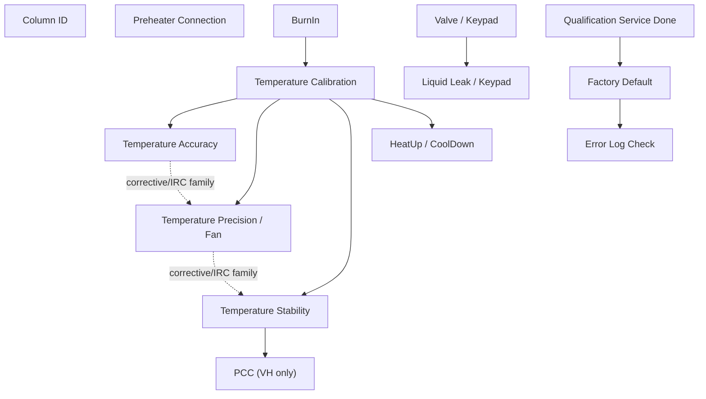

## Dependency Matrix

| Test | Hard dependencies | Soft dependencies / review points | Downstream impact |
|---|---|---|---|
| Column ID | `ColumnComp.ModelNo`, Column A-D audit descriptions | VA applicability is open because production VA sequence omitted ColumnIDs in observed branch | DB `RES_ColumnID_*`; report/page context |
| Preheater Connection | Preheater modules, heater/sensor channels, RetTimes 1-4 | VA sequence applicability open | Preheater status and noise/diff fields |
| Valve / Keypad | Valve hardware and keypad/manual interaction | VA lower-only valve branch | Confirms valve switching; can inform periodic-valve generation |
| BurnIn | CC temperature control, external thermometers, debug/leak channels | Can be omitted only if test intent explicitly allows skipping preconditioning | Affects thermal history for later temperature tests |
| Temperature Calibration | External thermometers, calibration variables, model ladder | Parameterization requires report/DB ladder change | Foundation for temperature family |
| Temperature Accuracy | Calibration context, external thermometers, RetTimes 1-5 | Can crop setpoints only with report/DB remapping | DB TempAcc fields, pass/fail |
| Temperature Precision / Fan | External thermometers, fan/state branch, RetTimes | Fan branch formula still partly open | Precision DB fields and stability insertion chain |
| Temperature Stability | Calibration context, external thermometers, stability windows | Merge/crop requires window and RetTime redesign | Stability DB fields; VH branch leads to PCC |
| PCC | VH hardware only | Not applicable to VA/VC | PCC DB fields and performance/cooldown |
| HeatUp / CoolDown | Calibration context, RetTimes 1/3/4/6 | Temperature range and hold subtraction can be parameterized after review | Dynamic timing DB fields |
| Liquid Leak | Leak sensor, manual water injection, alarm mute | Report pass/fail workbook cell open | Sensor workflow evidence |
| Qualification Service | Wellness/service commands | Report endpoint open | Writes service/qualification state |
| Factory Default | Service code, wellness properties, precond/audit metadata | Workbook-derived `ModelVariant` and `RES_SN_Check` formulas open | DB identity fields and final defaults |
| Error Log Check | Final reconnect and safe-state symbols | Pass/fail criterion open | Final audit/error-log report endpoint |

## Shared Resource Model

### Hardware / Configuration Resources

| Resource | Used by | Notes |
|---|---|---|
| `AUDIT.ColumnComp.ModelNo` | all branch-sensitive tests, Factory Default DB, upload table selection | Device source of truth. Never infer from filename. |
| External thermometers `ExtTemp_UpperCC`, `ExtTemp_LowerCC` | BurnIn guard, Calibration, Accuracy, Precision, Stability, HeatUp/CoolDown | Required Generic Device/channel configuration. |
| `ColumnComp.CC` temperature control | BurnIn, Calibration, Accuracy, Precision, Stability, HeatUp/CoolDown, Error Log cleanup | Main thermal actuator and report source. |
| PCC hardware/control | VH Stability/PCC, VH BurnIn PCC-off branch | VH-only; should be absent from VA/VC generation branch. |
| Preheater modules | Preheater Connection, Error Log cleanup on VH/VC | VA branch may omit preheater control. |
| Valve hardware/keypad | Valve / Keypad, Liquid Leak context, Factory Default operator check | VA lower-only branch must be respected. |
| Leak sensor / LEDBoard channels | BurnIn, Liquid Leak, Factory Default final state | BurnIn disables sensor; Factory Default turns it on; Liquid Leak tests it. |
| Wellness/service properties | Qualification Service, Factory Default | State-mutating; only include when intent requires full FOQ/final state. |
| Error/audit log | Factory Default, Error Log Check | Factory Default clears; Error Log Check displays final audit table. |

### Data / Formula Resources

| Data resource | Producers | Consumers |
|---|---|---|
| `RetTimes.RetTime1..8` calibration ladder | Temperature Calibration | Temp calibration report/DB fields |
| `RetTimes.RetTime1..5` accuracy ladder | Temperature Accuracy | Temp accuracy report/DB fields |
| Precision RetTimes/window cells | Temperature Precision / Fan | Precision report/DB fields |
| Stability RetTimes/window cells | Stability/PCC | Stability, noise, PCC report/DB fields |
| Heat/Cool RetTimes 1/3/4/6 | HeatUp/CoolDown | HeatUp/CoolDown report/DB fields |
| `precond.ColumnComp.*` metadata | injection preconditions / nearest audit fallback | Factory Default DB fields, Internal Use |
| `AUDIT.Column_A-D.Description` | Column ID method/audit | Column ID report/DB fields |
| `AUDIT.LiquidLeak` and leak calibration precond | Liquid Leak | Liquid Leak report source cells |
| `audittrail` table | Error Log Check | Error Log report table |

## Modifiability Rules

| Test | Modifiability | Editable points | Locked points |
|---|---|---|---|
| Column ID | review-required | column subset only with report/DB redesign | A-D pass/fail contract, `AUDIT.Column_* Description` source |
| Preheater Connection | review-required | port subset only if hardware/report branch is changed | ModulePresent/MemoryState and RetTime evidence |
| Valve / Keypad | editable after review | periodic valve cycle timing/positions for non-FOQ custom method | keypad/disconnect workflow for FOQ Valve test |
| BurnIn | review-required | omit or shorten only if test intent allows | model branch, external thermometer guard, leak sensor off |
| Temperature Calibration | high-risk edit | setpoint ladder only with report/DB redesign | model-specific ladder and calibration variables |
| Temperature Accuracy | editable after calibration/report review | setpoint subset such as 40 C only | RetTime-window formula shape and external thermometer source |
| Temperature Precision | review-required | window length/setpoint after dependency review | separate lower/upper sensor range rule |
| Temperature Stability | review-required | window length/setpoint after dependency review | separate lower/upper sensor range rule; VH PCC branch |
| HeatUp/CoolDown | editable after review | temperature range and hold-time constant | RetTime delta logic and `- 2.0 min` hold contract unless report changed |
| Liquid Leak | locked for FOQ | none for FOQ equivalent; custom diagnostic can be separate | physical water injection, mute alarm, cleanup prompts |
| Qualification Service | locked/finalization | include/exclude as finalization step | wellness state mutation semantics |
| Factory Default | locked/finalization | include/exclude as finalization step | service code/default mutation and DB identity source |
| Error Log Check | editable cleanup | include as final injection or translate to StopRun cleanup | report audit-table equivalence if report page required |

## Crop / Merge Impact Rules

| Intent | Required impact checks |
|---|---|
| Single Accuracy 40 C | Need Calibration/BurnIn decision, external thermometer config, report row/cell remapping, DB field subset, RetTime count reduction. |
| Accuracy + Stability merge | Must avoid RetTime/window collisions; report sheets expect different source rows/windows. |
| HeatUp/CoolDown custom range | Must update method setpoints, trigger thresholds, report labels, DB field name/meaning, and hold subtraction rule. |
| Periodic valve cycling | Can reuse `CurrentPosition` command knowledge; do not include keypad disconnect unless FOQ Valve test requested. |
| Full FOQ clone/select | Preserve canonical order and late finalization chain: Liquid Leak -> Qualification Service -> Factory Default -> Error Log Check. |
| DB-only upload from existing CMBX | Use Factory Default `AUDIT.ColumnComp.ModelNo` as device source of truth and report/DB mapping cells. |

## Failure Propagation

| Failure source | Likely affected tests | Reason |
|---|---|---|
| External thermometer missing/simulation | BurnIn, Calibration, Accuracy, Precision, Stability, HeatUp/CoolDown | Method/report depend on external thermometer channels. |
| Wrong `ColumnComp.ModelNo` | all branch-sensitive tests and DB upload | Wrong setpoint ladder, report template, PCC branch, or SQL target. |
| Calibration not run / invalid | Accuracy, Precision, Stability, HeatUp/CoolDown | Temperature family interpretation assumes calibrated thermal state. |
| BurnIn omitted without approval | downstream temperature tests | Thermal history assumption changes. |
| PCC hardware absent in VH branch | Stability/PCC | VH report has PCC fields; method expects PCC branch. |
| Preheater module absent | Preheater Connection | ModulePresent/MemoryState and heater sensor fields fail. |
| Leak sensor/alarm workflow skipped | Liquid Leak | Report can have evidence without physical sensor validation. |
| Factory Default skipped in full FOQ | DB metadata/final-state outputs | Model/serial/firmware/default state contract incomplete. |
| Error Log Check skipped in full FOQ | final report audit table | Final error-log endpoint missing. |

## Device Branch Summary

| Branch | Key differences |
|---|---|
| VH-C10-A | Uses 120 C high ladder in BurnIn/Calibration/Accuracy; includes PCC stability/performance branch; report template `Report_VTCC_V2_12`. |
| VC-C10-A | Uses 85 C high ladder for calibration/accuracy; no PCC; report template `Report_VTCC_V2_12`; several late injections bind corrective processing pattern. |
| VA-C10-A | Uses 85 C high ladder; report template `Report_VATCC_V1_01`; observed sequence omits some VC/VH-only front tests such as ColumnID/Preheater in some branches; valve/error-log cleanup is reduced. |

## Open Verification

| # | Open item | Why it matters |
|---|---|---|
| 1 | Exact processing-method pass-action behavior for `CORRECT_*` processing methods | Needed before automatically inserting/cropping IRC injections. |
| 2 | FormulaOne workbook dependencies for all workbook-derived fields | Needed before generated report templates can be claimed equivalent. |
| 3 | Live CM semantics for BurnIn trigger repeats and post-End guard | Needed before rewriting BurnIn parametrically. |
| 4 | Formal TD rule for when BurnIn can be skipped | Needed for safe single-test generation. |
| 5 | VA applicability for Column ID / Preheater in all production variants | Needed for generic VA branch generation. |

## Generation Readiness Implication

The current model supports:

```text
- explaining dependencies and modifiability in the UI
- warning when a requested crop/merge changes report/DB contracts
- selecting clone/reuse candidates from known CMBX evidence
- building a first impact preview for single-test intents
```

The current model does not yet support:

```text
- fully automatic parametric report-template generation
- safe automatic processing-method IRC rewriting
- claiming a new generated CMBX is runnable without live CM verification
```
<a id="tcc-stress-trigger-contract"></a>
## K004: TCC stress Trigger method contract

Build source name: `TCC_STRESS_TRIGGER_METHOD_CONTRACT.md`

# TCC Stress Trigger Method Contract

Status: Source-grounded execution contract  
Evidence: `Stress_VH_DVT013_20260529.cmbx`, especially `stress test_5s`

## Purpose

This contract explains the reusable CM mechanism used by the TCC stress
methods for periodic synchronous upper/lower valve switching. It is execution
evidence, not an FOQ acceptance criterion.

## Verified Module Roles

| Role | Source pattern | Meaning |
|---|---|---|
| Initial valve state | `UpperValve.CurrentPosition`, `LowerValve.CurrentPosition` | Establish a known complementary valve state before the run |
| Alternating gates | `Variables.GenericBool1`, `Variables.GenericBool2` | Exactly one Ping/Pong trigger is armed at a time |
| Next-switch time | `Variables.GenericFloat1` | Absolute next switch time in `System.Retention` minutes |
| Ping/Pong triggers | `System.Trigger` in `Start Run` | Alternately change both valves and hand control to the opposite trigger |
| Arm cycle | `Variables.GenericBool1 = 1` in `Run` | Starts periodic switching only after the run timeline begins |
| Stop cycle | Both Boolean gates reset to `0` | Prevents further trigger execution during cleanup |

## Period Encoding

`System.Retention` is expressed in minutes. The source method schedules the
next trigger edge by adding a minute fraction:

| Requested period | Source-grounded assignment |
|---:|---|
| 6 seconds | `Variables.GenericFloat1 = System.Retention+0.1` |
| 3 seconds | `Variables.GenericFloat1 = System.Retention+0.05` |

The period is **not** encoded as ordinary `Delay 0.1`. Trigger `TrueTime` and
trigger `Delay` are seconds and serve trigger qualification/execution timing;
they do not replace the absolute next-edge schedule.

## Source-Grounded 6-Second Skeleton

```text
Instrument Setup:
  GenericBool1 = 0
  GenericBool2 = 0
  GenericFloat1 = 0

Start Run:
  Trigger Ping when Bool1=1 and Retention>GenericFloat1 and inside window
    GenericFloat1 = System.Retention+0.1
    preserve source Delay/valve-set/Delay sequence
    Bool1 = 0
    Bool2 = 1

  Trigger Pong when Bool2=1 and Retention>GenericFloat1 and inside window
    GenericFloat1 = System.Retention+0.1
    preserve source Delay/valve-set/Delay sequence
    Bool1 = 1
    Bool2 = 0

Run:
  GenericBool1 = 1

Stop Run:
  GenericBool1 = 0
  GenericBool2 = 0
```

## Composition Guardrails

1. Copy the complete verified Ping/Pong module, including state handoff and
   the Delay rows around valve actuation. Do not retain only the valve-set rows.
2. Change the active time window and the `System.Retention` increment together.
3. Keep trigger names unique.
4. Keep upper/lower valve assignments paired as proven by the chosen source
   method and target plumbing configuration.
5. Log valve positions only with the exact configured symbols.
6. Preserve final Boolean reset and acquisition cleanup.
7. A script that uses `Delay 0.1` as "6 seconds" but does not update the
   absolute next-switch time does not implement the verified cycle mechanism.

## Open Verification Required

- Confirm target valve position labels against the actual CM instrument
  configuration.
- Confirm whether the requested physical test needs complementary positions or
  identical positions for upper/lower valves.
- Run Chromeleon Method Check before claiming runnable status.
<a id="tcc-calibration"></a>
## B005: Calibration black box

Build source name: `TCC_CALIBRATION_BLACK_BOX_DECOMPOSITION.md`

# TCC Temperature Calibration Black Box Decomposition

Extraction date: 2026-07-10

Scope: TCC FOQ Temperature Calibration for `VH-C10-A`, `VC-C10-A`, and `VA-C10-A`.

---
测试名称: Temperature Calibration
型号: VH-C10-A / VC-C10-A / VA-C10-A
状态: 已完成第一轮黑盒拆解，processing method business rows remain open verification
---

This document decomposes the Temperature Calibration test as a generation contract. It follows the same contract style as `TCC_ACCURACY_BLACK_BOX_DECOMPOSITION.md`, but the key distinction is important:

```text
Temperature Accuracy validates the controlled temperature.
Temperature Calibration changes the instrument's internal calibration variables.
```

The calibration method writes calibration point/deviation values into `ColumnComp.CC.TempCalibration...` audit/device properties. The report then checks that those values were transferred and that the low-temperature reach condition is acceptable.

## Evidence Sources

| Evidence | Source |
|---|---|
| Test intent node | `cmbx_data_explorer/docs/TCC_TEST_KNOWLEDGE_NODE_MODEL.md` |
| FOQ TD extracted text | `knowledge_base/foq_td_extracted/FOQ_Testdescription_VX-C10-A.text.txt` |
| Decoded method flow, VH | `knowledge_base/tcc_reverse_probe/VH/6000001/TEMPERATURE_CALIBRATION_embedded_method_flow.txt` |
| Decoded method flow, VC | `knowledge_base/tcc_reverse_probe/VC/3000004/TEMPERATURE_CALIBRATION_embedded_method_flow.txt` |
| Decoded method flow, VA | `knowledge_base/tcc_reverse_probe/VA/0000003/TEMPERATURE_CALIBRATION_embedded_method_flow.txt` |
| Method contract summary | `knowledge_base/tcc_method_contracts/*_method_contracts.tsv` |
| Processing method probe | `knowledge_base/tcc_processing_probe/*/*CORRECT_ACCURACY_INJ_INSERTION*_summary.txt`, `NO_INTEGRATION_summary.txt`, and `knowledge_base/tcc_processing_probe/README.md` |
| Report formula objects | `knowledge_base/tcc_report_formula_objects_vh_6000001_all_sheets.tsv` |
| Formula reverse notes | `cmbx_data_explorer/CM_FORMULA_REVERSE_ENGINEERING.md` |
| DB mapping | `foq/FOQResultLocations_V2.83.xls` |

## Executive Answer

1. Temperature Calibration uses eight calibration setpoints. `VH-C10-A` uses `120, 100, 80, 60, 40, 20, 10, 5 deg C`; `VC-C10-A` and `VA-C10-A` use `85, 70, 55, 40, 30, 20, 10, 5 deg C`.
2. It depends on both internal CC sensors and external calibrated thermometers. The method calculates deviation as `ExtTemp_UpperCC.Signal-CC.TempActual_Upper` and `ExtTemp_LowerCC.Signal-CC.TempActual_Lower`, then writes those values into `CCCalib.CalDevU/Lxx` and finally into `ColumnComp.CC.TempCalibrationDeviationUpper/LowerN`.
3. RetTimes are not used the same way as Accuracy. Accuracy RetTimes anchor stable external averaging windows; Calibration RetTimes mark when each calibration trigger fires and the internal/external calibration values are captured.
4. `VH-C10-A` and `VC-C10-A` sequence rows bind `Temperature Calibration` to `CORRECT_ACCURACY_INJ_INSERTION`; `VA-C10-A` binds it to `NO_INTEGRATION`. The current processing XML extractor exposes layout/context and comments, but not the full SST/IRC action rows, so exact pass-action behavior remains open verification.
5. The report sheet `Temp_Calib_Internal` reads calibration point/deviation audit properties, RetTime durations, external thermometer drift windows, environment temperature, and low external temperature minima. DB fields map mostly to `D27:D43`, `C15:C22`, `D15:D22`, and `E15:E22`.
6. Calibration is a practical prerequisite for later temperature tests because it updates the TCC internal upper/lower calibration variables. The FOQ TD explicitly says large calibration deviations abort and require repeated calibration or repair.

## Contract 1: Method Command

### 1.1 Test Intent

Temperature Calibration calibrates the internal upper and lower column-compartment temperature sensors with external calibrated thermometers at model-specific setpoints.

The FOQ TD states that the calibration parameter is determined for upper and lower compartments individually by comparing internal sensor readings with external calibrated thermometer readings. The decoded CMBX method implements this as:

```text
Upper deviation = ExtTemp_UpperCC.Signal - CC.TempActual_Upper
Lower deviation = ExtTemp_LowerCC.Signal - CC.TempActual_Lower
```

### 1.2 Method Binding

| Model | Injection | Instrument method | Method stages |
|---|---|---|---|
| `VH-C10-A` | `Temperature Calibration` | `TEMPERATURE_CALIBRATION` | `InstrumentSetup`, `Equilibration`, `StartRun`, `Run`, `StopRun` |
| `VC-C10-A` | `Temperature Calibration` | `TEMPERATURE_CALIBRATION` | `InstrumentSetup`, `Equilibration`, `StartRun`, `Run`, `StopRun` |
| `VA-C10-A` | `Temperature Calibration` | `TEMPERATURE_CALIBRATION` | `InstrumentSetup`, `Equilibration`, `StartRun`, `Run`, `StopRun` |

### 1.3 Global Setup

The decoded method initializes readiness, temperature control, acquisition, calibration values, and RetTimes.

| Area | Evidence | Meaning |
|---|---|---|
| Ready threshold | `ColumnComp.CC.ReadyTempDelta = 0.3 [deg C]` | Calibration trigger readiness threshold |
| Ready time | `ColumnComp.CC.EquilibrationTime = 0.1 [min]` | Initial ready timing |
| Temperature control | `ColumnComp.CC.TempCtrl = On` | Enables CC temperature control |
| VH PCC branch | `ColumnComp.CmdString Cmd="PCC.TempCtrl=0"` when `ColumnComp.ModelNo="VH-C10-A"` | Disables PCC temp control for VH calibration |
| Air mode | `ColumnComp.CC.Mode = StillAir` | Sets compartment operating mode |
| Leak sensor | `ColumnComp.LiquidLeakSensor = Off` | Avoids leak false alarms during large temperature swings |
| Calibration points reset | `ColumnComp.CC.TempCalibrationPointUpper1..10 = Off` and lower equivalents | Clears active calibration transfer slots before the run |
| Work variables reset | `CCCalib.CalPointU01..08`, `CalDevU01..08`, `CalPointL01..08`, `CalDevL01..08 = 0` | Clears generated calibration values |
| RetTime reset | `RetTimes.RetTime1..RetTime8 = 0` | Clears all calibration trigger anchors |

### 1.4 Model-Dependent Temperature Ladder

The method fills `Variables.GenericDouble0..8`. `GenericDouble0` is the pre-start temperature used to ensure the first trigger condition is initially false; `GenericDouble1..8` are the actual calibration points.

| Model branch | Pre-start `GenericDouble0` | Point 1 | Point 2 | Point 3 | Point 4 | Point 5 | Point 6 | Point 7 | Point 8 |
|---|---:|---:|---:|---:|---:|---:|---:|---:|---:|
| `VH-C10-A` | 115 | 120 | 100 | 80 | 60 | 40 | 20 | 10 | 5 |
| `VC-C10-A` / `VA-C10-A` | 80 | 85 | 70 | 55 | 40 | 30 | 20 | 10 | 5 |

The method sets `Variables.GenericBool0 = 1` for VH and `0` for VC/VA. The exact downstream use of `GenericBool0` in report/workbook logic is not fully decoded, but it is part of the method contract and appears in method coverage.

### 1.5 Acquisition Channels

The method turns on these key channels in `StartRun`.

| Channel | Role |
|---|---|
| `ColumnComp.CC_Temp` | Main CC temperature signal, used by report `chm.signalValue(...)` |
| `ColumnComp.CC_U_Temp_Actual` | Internal upper actual temperature evidence |
| `ColumnComp.CC_L_Temp_Actual` | Internal lower actual temperature evidence |
| `ColumnComp.CC_UCTL_TempRear_Actual` | Rear/control temperature debug evidence |
| `Thermometer1.ExtTemp_UpperCC` | External upper thermometer, used in calibration deviation and drift |
| `Thermometer1.ExtTemp_LowerCC` | External lower thermometer, used in calibration deviation and drift |
| `Thermometer.Environment_Temperature` | Ambient/environment reference, used by report |
| PWM/fan/leak debug channels | Operational evidence and diagnostic context |

### 1.6 Per-Point Trigger Logic

For each calibration point the method:

1. Sets `ColumnComp.CC.Temperature.Nominal` to the model-specific `Variables.GenericDoubleN`.
2. Waits for `ColumnComp.CC.TempReady`.
3. Runs a `System.Trigger` with point-specific `TrueTime`.
4. Captures internal upper/lower actual temperatures into `CCCalib.CalPointU/Lxx`.
5. Computes deviations using external minus internal temperature.
6. Writes `RetTimes.RetTimeN = System.Retention`.
7. Aborts if any captured deviation is outside the `-4 K` to `+4 K` range.

| Point | VH target | VC/VA target | Trigger name | Trigger true time | Captured RetTime | Calibration values |
|---|---:|---:|---|---:|---|---|
| 1 | 120 | 85 | `T120/85` | 850 s | `RetTimes.RetTime1` | `CCCalib.CalPointU01`, `CalDevU01`, `CalPointL01`, `CalDevL01` |
| 2 | 100 | 70 | `T100/70` | 850 s | `RetTimes.RetTime2` | `CCCalib.CalPointU02`, `CalDevU02`, `CalPointL02`, `CalDevL02` |
| 3 | 80 | 55 | `T80/55` | 850 s | `RetTimes.RetTime3` | `CCCalib.CalPointU03`, `CalDevU03`, `CalPointL03`, `CalDevL03` |
| 4 | 60 | 40 | `T60/40` | 850 s | `RetTimes.RetTime4` | `CCCalib.CalPointU04`, `CalDevU04`, `CalPointL04`, `CalDevL04` |
| 5 | 40 | 30 | `T40/30` | 1150 s | `RetTimes.RetTime5` | `CCCalib.CalPointU05`, `CalDevU05`, `CalPointL05`, `CalDevL05` |
| 6 | 20 | 20 | `T20` | 850 s | `RetTimes.RetTime6` | `CCCalib.CalPointU06`, `CalDevU06`, `CalPointL06`, `CalDevL06` |
| 7 | 10 | 10 | `T10` | 850 s | `RetTimes.RetTime7` | `CCCalib.CalPointU07`, `CalDevU07`, `CalPointL07`, `CalDevL07` |
| 8 | 5 | 5 | `T05` | 850 s | `RetTimes.RetTime8` | `CCCalib.CalPointU08`, `CalDevU08`, `CalPointL08`, `CalDevL08` |

The point-5 true time is longer. The FOQ TD explains this as 1150 s for `40 deg C` on VH or `30 deg C` on VC/VA.

### 1.7 Calibration Transfer and Fallback

After successful capture, the method transfers work variables into device calibration properties:

```text
ColumnComp.CC.TempCalibrationPointUpper1..8 = CCCalib.CalPointU01..08
ColumnComp.CC.TempCalibrationDeviationUpper1..8 = CCCalib.CalDevU01..08
ColumnComp.CC.TempCalibrationPointLower1..8 = CCCalib.CalPointL01..08
ColumnComp.CC.TempCalibrationDeviationLower1..8 = CCCalib.CalDevL01..08
```

The decoded flow includes a fallback block for missing 5 or 10 deg C triggers, most likely at high ambient temperature:

```text
If calibration points 1..6 exist:
  transfer points 1..6
Else:
  abort: "Column oven could not be calibrated at 20 deg C or higher."

If point 7 is missing:
  set point 7 to 10 deg C and reuse the 20 deg C deviation.

If point 8 is missing:
  set point 8 to 5 deg C and reuse the 20 deg C deviation.
```

This matches the FOQ TD statement that when low calibration setpoints cannot be measured directly, the 20 deg C calibration parameter is used because the below-20 deg C relationship is non-linear and should not be extrapolated.

### 1.8 Method Flow Diagram

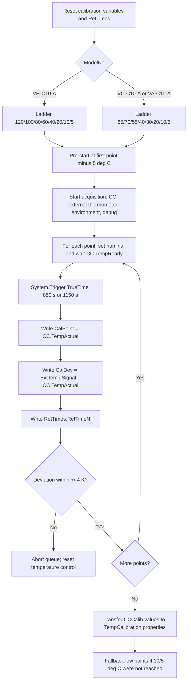

## Contract 2: Processing Method

### 2.1 Sequence Binding

| Model | Injection | Processing method | Observed meaning |
|---|---|---|---|
| `VH-C10-A` | `Temperature Calibration` | `CORRECT_ACCURACY_INJ_INSERTION` | Context links Calibration and Accuracy; integration inhibited |
| `VC-C10-A` | `Temperature Calibration` | `CORRECT_ACCURACY_INJ_INSERTION` | Context links Calibration and Accuracy; integration inhibited |
| `VA-C10-A` | `Temperature Calibration` | `NO_INTEGRATION` | No data integration; no observed correction-insertion binding on this row |

The `CORRECT_ACCURACY_INJ_INSERTION` summary contains readable context:

```text
Temperature Accuracy_H
ACCURACY_IRC_STOP_H
TEMPERATURE_ACCURACY
...
Temperature Calibration
CORRECT_ACCURACY_INJ_INSERTION
TEMPERATURE_CALIBRATION
Inhibits the integration for all channels
```

### 2.2 Processing Interpretation

The currently decoded evidence supports these statements:

| Statement | Status |
|---|---|
| `CORRECT_ACCURACY_INJ_INSERTION` is associated with `Temperature Calibration` in VH/VC sequence rows. | Verified |
| The processing method inhibits integration for all channels. | Verified from readable comment |
| The processing method is connected to accuracy/correction injection context. | Verified as sequence-context evidence |
| The exact pass-action row, insertion rule, and whether it inserts `Temperature Accuracy_H/C` automatically after Calibration are decoded. | Open Verification Required |
| `VA-C10-A` Calibration uses `NO_INTEGRATION` in TKN/sequence evidence. | Verified |

Generation implication:

```text
For cloning an existing FOQ flow, preserve the processing method payload as-is.
For generating a new method package, do not synthesize CORRECT_ACCURACY_INJ_INSERTION rules until the processing method row serialization is decoded or manually confirmed in CM.
```

## Contract 3: Report Formula

### 3.1 Report Binding

| Model | Report template | Sheet | Role |
|---|---|---|---|
| `VH-C10-A` | `Report_VTCC_V2_12` | `Temp_Calib_Internal` | Calibration report / internal diagnostic sheet |
| `VC-C10-A` | `Report_VTCC_V2_12` | `Temp_Calib_Internal` | Calibration report / internal diagnostic sheet |
| `VA-C10-A` | `Report_VATCC_V1_01` | `Temp_Calib_Internal` | Calibration report / internal diagnostic sheet |

### 3.2 Formula Families

The report formula objects from `Report_VTCC_V2_12` show the following formula families.

| Cell family | Formula pattern | Fixed channel | Meaning |
|---|---|---|---|
| `B15:B21` | `chm.signalValue(AUDIT.RetTimeN(1,"forward"))` | `CC_Temp` | CC temperature signal at RetTime1..7 |
| `J14` | `chm.signalValue(AUDIT.RetTime8(1,"forward")-1)` | `CC_Temp` | CC temperature signal near RetTime8 path |
| `C15:C21` | `AUDIT.RetTimeN - AUDIT.RetTime(N-1)` | none | Duration between calibration triggers; `C15` is absolute RetTime1 |
| `J15` | `AUDIT.RetTime8 - AUDIT.RetTime7` | none | RetTime8 duration |
| `D15:D21` | `chm.drift(AUDIT.RetTimeN-0.5,AUDIT.RetTimeN)` | `ExtTemp_UpperCC` | External upper thermometer drift over final 0.5 min before RetTime1..7 |
| `J16` | `chm.drift(AUDIT.RetTime8-0.5,AUDIT.RetTime8)` | `ExtTemp_UpperCC` | External upper drift before RetTime8 |
| `E15:E21` | same drift pattern | `ExtTemp_LowerCC` | External lower thermometer drift over final 0.5 min before RetTime1..7 |
| `J17` | same drift pattern | `ExtTemp_LowerCC` | External lower drift before RetTime8 |
| `B27:B34` | `audit.ColumnComp.CC.TempCalibrationPointUpperN(1000,"backward")` | mostly none / first object has `ExtTemp_UpperCC` fixed channel artifact | Upper calibration point transferred to device |
| `D27:D34` | `audit.ColumnComp.CC.TempCalibrationDeviationUpperN(1000,"backward")` | none | Upper calibration deviation transferred to device |
| `B36:B43` | `audit.ColumnComp.CC.TempCalibrationPointLowerN(1000,"backward")` | none | Lower calibration point transferred to device |
| `D36:D43` | `audit.ColumnComp.CC.TempCalibrationDeviationLowerN(1000,"backward")` | none | Lower calibration deviation transferred to device |
| `C45` | `chm.sig_value("average")` | `Environment_Temperature` | Average ambient/environment temperature |
| `K45` | `chm.sig_value("min")` | `ExtTemp_UpperCC` | Minimum external upper temperature across the run |
| `K46` | `chm.sig_value("min")` | `ExtTemp_LowerCC` | Minimum external lower temperature across the run |

### 3.3 Formula Meaning

Temperature Calibration report evaluation has three layers:

1. **Trigger timing evidence**: RetTimes and RetTime deltas prove each calibration point was reached and held for the expected trigger window.
2. **External stability evidence**: external upper/lower drift in the final half minute before each RetTime checks the reference thermometer behavior around each transfer.
3. **Transfer evidence**: audit reads of `TempCalibrationPoint...` and `TempCalibrationDeviation...` prove the method actually transferred calibration values into the TCC calibration properties.

The FOQ TD adds a low-temperature reach rule:

```text
The report passes calibration only if the lowest external measured compartment temperatures
are either 5.0 deg C or lower, or 18 deg C below ambient.
If the 5 deg C point was not skipped but deviations were positive, those deviations are
subtracted from the lowest external measured temperatures for this reach check.
```

Open verification: the workbook-derived pass/fail formula for that low-temperature reach rule is not fully normalized into a reusable formula ID yet. The direct SheetObject formulas above are verified.

### 3.4 Report Formula Flow

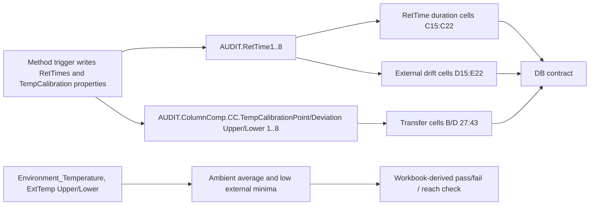

## Contract 4: DB Contract

### 4.1 VH-C10-A DB Mapping

| Field family | DB fields | Report cells | Source meaning |
|---|---|---|---|
| Calibration deviation, upper | `TempCal120_U`, `TempCal100_U`, `TempCal80_U`, `TempCal60_U`, `TempCal40_U`, `TempCal20_U`, `TempCal10_U`, `TempCal5_U` | `D27:D34` | `TempCalibrationDeviationUpper1..8` |
| Calibration deviation, lower | `TempCal120_L`, `TempCal100_L`, `TempCal80_L`, `TempCal60_L`, `TempCal40_L`, `TempCal20_L`, `TempCal10_L`, `TempCal5_L` | `D36:D43` | `TempCalibrationDeviationLower1..8` |
| Time between points | `TimeCal120`, `TimeCal100`, `TimeCal80`, `TimeCal60`, `TimeCal40`, `TimeCal20`, `TimeCal10`, `TimeCal05` | `C15:C22` | RetTime1 absolute and RetTime deltas through RetTime8 |
| External upper drift | `Slope_Cal120_U`, `Slope_Cal100_U`, `Slope_Cal80_U`, `Slope_Cal60_U`, `Slope_Cal40_U`, `Slope_Cal20_U`, `Slope_Cal10_U`, `Slope_Cal05_U` | `D15:D22` | `ExtTemp_UpperCC` drift windows |
| External lower drift | `Slope_Cal120_L`, `Slope_Cal100_L`, `Slope_Cal80_L`, `Slope_Cal60_L`, `Slope_Cal40_L`, `Slope_Cal20_L`, `Slope_Cal10_L`, `Slope_Cal05_L` | `E15:E22` | `ExtTemp_LowerCC` drift windows |

### 4.2 VC-C10-A / VA-C10-A DB Mapping

| Field family | DB fields | Report cells | Source meaning |
|---|---|---|---|
| Calibration deviation, upper | `TempCal85_U`, `TempCal70_U`, `TempCal55_U`, `TempCal40_U`, `TempCal30_U`, `TempCal20_U`, `TempCal10_U`, `TempCal5_U` | `D27:D34` | `TempCalibrationDeviationUpper1..8` |
| Calibration deviation, lower | `TempCal85_L`, `TempCal70_L`, `TempCal55_L`, `TempCal40_L`, `TempCal30_L`, `TempCal20_L`, `TempCal10_L`, `TempCal5_L` | `D36:D43` | `TempCalibrationDeviationLower1..8` |
| Time between points | `TimeCal85`, `TimeCal70`, `TimeCal55`, `TimeCal40`, `TimeCal30`, `TimeCal20`, `TimeCal10`, `TimeCal05` | `C15:C22` | RetTime1 absolute and RetTime deltas through RetTime8 |
| External upper drift | `Slope_Cal85_U`, `Slope_Cal70_U`, `Slope_Cal55_U`, `Slope_Cal40_U`, `Slope_Cal30_U`, `Slope_Cal20_U`, `Slope_Cal10_U`, `Slope_Cal05_U` | `D15:D22` | `ExtTemp_UpperCC` drift windows |
| External lower drift | `Slope_Cal85_L`, `Slope_Cal70_L`, `Slope_Cal55_L`, `Slope_Cal40_L`, `Slope_Cal30_L`, `Slope_Cal20_L`, `Slope_Cal10_L`, `Slope_Cal05_L` | `E15:E22` | `ExtTemp_LowerCC` drift windows |

### 4.3 DB Contract Interpretation

The `TempCal...` DB fields are deviation values, not the calibration point setpoints. For example:

```text
VH TempCal120_U -> Temp_Calib_Internal!D27
D27 -> audit.ColumnComp.CC.TempCalibrationDeviationUpper1(1000,"backward")
method writes TempCalibrationDeviationUpper1 from CCCalib.CalDevU01
CCCalib.CalDevU01 = ExtTemp_UpperCC.Signal - CC.TempActual_Upper
```

That is the critical source chain for upload validation:

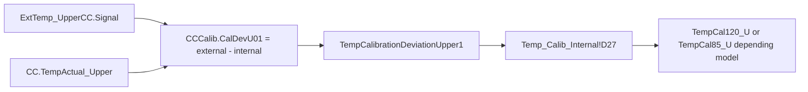

## Contract 5: Config Requirement

| Requirement | Required for | Evidence / reason |
|---|---|---|
| `ColumnComp` with `CC` temperature control | All models | Method sets `ColumnComp.CC.TempCtrl`, `Temperature.Nominal`, `TempReady`, actual upper/lower properties |
| External calibrated thermometers configured as `Thermometer1.ExtTemp_UpperCC` and `Thermometer1.ExtTemp_LowerCC` | All models | Method uses external signal minus internal actual temperature for calibration deviations |
| Environment thermometer channel `Thermometer.Environment_Temperature` | All models | Report reads ambient average; FOQ low-temperature reach rule uses ambient relationship |
| Debug/acquisition channels available | All models | Method starts CC, PWM, fan, leak/debug channels; report requires at least temperature/external channels for formulas |
| VH PCC command symbol | `VH-C10-A` | Method sends `PCC.TempCtrl=0` through `ColumnComp.CmdString` for VH |
| Calibration write access to `ColumnComp.CC.TempCalibrationPoint/Deviation...` | All models | Method transfers calibration values into device calibration properties |
| Valid ambient/thermal setup | All models | FOQ TD allows fallback for 10/5 deg C only under high ambient; low-temperature reach is report-checked |
| Processing method payload preservation | VH/VC first-phase clone/generation | `CORRECT_ACCURACY_INJ_INSERTION` business rows not fully decoded |

## Contract 6: Open Verification

| # | Uncertain point | Current evidence | Needed evidence | Likely source |
|---|---|---|---|---|
| 1 | Exact `CORRECT_ACCURACY_INJ_INSERTION` pass-action / insertion rule | Sequence context and comment are visible, but XML payload mostly exposes UI layout | Decode Processing Method SST/IRC rows or inspect in CM UI | `.procmeth` embedded XML, CM processing method editor |
| 2 | Whether VH/VC Calibration processing method automatically inserts Accuracy or only binds correction context | Names and context imply correction-insertion, but exact action row not parsed | Direct CM screenshot/export of Pass Action table | CM UI, serialized procmeth row model |
| 3 | Workbook-derived pass/fail formula for low-temperature reach | TD describes rule; direct cells `C45`, `K45`, `K46` are known | FormulaOne workbook extraction for pass/fail cells around `Temp_Calib_Internal` | Report `SpreadSheetData` |
| 4 | Display precision for all Calibration DB fields | DB cells and direct formulas are known | Number formats from workbook, or exported CM report samples | FormulaOne workbook, XLS export |
| 5 | `Variables.GenericBool0` downstream role | Method sets it by model branch and coverage captures it | Workbook or method branch reference that consumes it | decoded method/report workbook |
| 6 | VA-specific report differences in `Report_VATCC_V1_01` | TKN maps VA to same sheet name; VTCC formulas verified | Extract VA report formula objects and compare with VTCC formulas | VA CMBX report object |

## VH / VC / VA Comparison

| Topic | `VH-C10-A` | `VC-C10-A` | `VA-C10-A` |
|---|---|---|---|
| Calibration ladder | 120/100/80/60/40/20/10/5 | 85/70/55/40/30/20/10/5 | 85/70/55/40/30/20/10/5 |
| Pre-start temperature | 115 deg C | 80 deg C | 80 deg C |
| Point with 1150 s true time | 40 deg C | 30 deg C | 30 deg C |
| Processing method | `CORRECT_ACCURACY_INJ_INSERTION` | `CORRECT_ACCURACY_INJ_INSERTION` | `NO_INTEGRATION` |
| Report template | `Report_VTCC_V2_12` | `Report_VTCC_V2_12` | `Report_VATCC_V1_01` |
| DB high fields | `TempCal120`, `TempCal100`, `TempCal80`, `TempCal60` | `TempCal85`, `TempCal70`, `TempCal55`, `TempCal40` | `TempCal85`, `TempCal70`, `TempCal55`, `TempCal40` |
| VH-only behavior | Disables PCC temp control | Not applicable | Not applicable |

## Dependency and Generation Notes

### Relationship to Later Tests

Temperature Calibration is upstream of later temperature tests because it writes the module calibration variables that make internal upper/lower CC temperature signals meaningful.

| Later test | Dependency interpretation |
|---|---|
| Temperature Accuracy | Validates the corrected temperature behavior after Calibration; VH/VC processing context ties Calibration and Accuracy together |
| Temperature Stability | Uses corrected thermal control and external thermometer evidence; depends on trustworthy calibration state |
| Temperature Precision | Uses external thermometer repeatability at repeated setpoints; calibration state affects CC control quality |
| HeatUp / CoolDown | Uses CC readiness and RetTimes during thermal transitions; calibration affects readiness/control correctness |
| PCC, VH-only | Separate PCC channel, but same module environment and VH branch configuration matter |

### Generation Rules

For a future generated Calibration method:

1. Use model source of truth `AUDIT.ColumnComp.ModelNo`; do not infer model from filename.
2. Select ladder by `ModelNo` exactly.
3. Initialize and clear all `CCCalib` and `RetTimes.RetTime1..8`.
4. Acquire external upper/lower thermometer channels throughout the run.
5. Calculate deviation from external calibrated thermometer minus internal actual CC temperature.
6. Abort if any calibration deviation is outside `-4 K` to `+4 K`.
7. Transfer calibration points/deviations into `ColumnComp.CC.TempCalibrationPoint/DeviationUpper/Lower1..8`.
8. Preserve `CORRECT_ACCURACY_INJ_INSERTION` processing payload for VH/VC until its pass-action row format is decoded.
9. Use `Temp_Calib_Internal` report mapping and model-specific DB field family.

### Minimum Answer Checklist

| Question | Answer |
|---|---|
| Temperature Calibration 的温度阶梯是什么？ | VH: 120/100/80/60/40/20/10/5; VC/VA: 85/70/55/40/30/20/10/5 |
| VH / VC / VA 是否有差异？ | Yes: ladder, pre-start temperature, point-5 true time target, processing method, report template |
| Calibration 是否依赖外部温度计？ | Yes. It uses external upper/lower thermometer signal minus internal upper/lower CC actual temperature to calculate calibration deviations. |
| RetTime 锚定逻辑是否与 Accuracy 相同？ | No. Calibration RetTimes anchor trigger/capture moments for calibration transfer and report timing/drift checks; Accuracy RetTimes anchor external averaging windows for observed temperature. |
| Processing Method 是什么？ | VH/VC: `CORRECT_ACCURACY_INJ_INSERTION`; VA: `NO_INTEGRATION`. Exact insertion/pass action remains open verification. |
| Report 公式和 DB 字段映射是什么？ | `Temp_Calib_Internal`: deviations `D27:D43`, times `C15:C22`, slopes `D15:E22`, calibration points `B27:B43`, ambient/min cells `C45/K45/K46`. |
| Calibration 与后续测试的依赖是什么？ | It updates CC calibration variables and is therefore upstream of Accuracy, Stability, Precision, and thermal transition tests. |
<a id="tcc-accuracy"></a>
## B006: Accuracy black box

Build source name: `TCC_ACCURACY_BLACK_BOX_DECOMPOSITION.md`

# TCC Temperature Accuracy Black Box Decomposition

Extraction date: 2026-07-09

Scope: TCC FOQ Temperature Accuracy for `VH-C10-A`, `VC-C10-A`, and `VA-C10-A`.

This document decomposes the Temperature Accuracy test as a generation contract. The goal is not only to know which DB field is filled, but to understand what the method commands do, when the raw data becomes valid, how IRC/processing is bound, how the report formulas read raw/audit evidence, and what remains unverifiable.

## Evidence Sources

| Evidence | Source |
|---|---|
| Test intent node | `cmbx_data_explorer/docs/TCC_TEST_KNOWLEDGE_NODE_MODEL.md` |
| Decoded method flow, VH | `knowledge_base/tcc_reverse_probe/VH/6000001/TEMPERATURE_ACCURACY_embedded_method_flow.txt` |
| Decoded method flow, VC | `knowledge_base/tcc_reverse_probe/VC/3000004/TEMPERATURE_ACCURACY_embedded_method_flow.txt` |
| Decoded method flow, VA | `knowledge_base/tcc_reverse_probe/VA/0000003/TEMPERATURE_ACCURACY_embedded_method_flow.txt` |
| Method contract summary | `knowledge_base/tcc_method_contracts/*_TEMPERATURE_ACCURACY_contract.md` |
| Processing method probe | `knowledge_base/tcc_processing_probe/*/*ACCURACY_IRC_STOP*_summary.txt` and `knowledge_base/tcc_processing_probe/README.md` |
| Report formula objects | `knowledge_base/tcc_report_formula_objects_vh_6000001.tsv` |
| Formula reverse notes | `cmbx_data_explorer/CM_FORMULA_REVERSE_ENGINEERING.md` |
| DB mapping | `foq/FOQResultLocations_V2.83.xls` |

## Executive Answer

1. The method runs a five-point setpoint ladder. `VH-C10-A` uses `10, 20, 40, 80, 120 deg C`; `VC-C10-A` and `VA-C10-A` use `10, 20, 40, 60, 85 deg C`.
2. External thermometer data is continuously acquired from `Thermometer1.ExtTemp_LowerCC` and `Thermometer1.ExtTemp_UpperCC`. A RetTime is written only after `ColumnComp.CC.TempReady` and both external probes are stable.
3. The report does not read an instant value at the RetTime. It averages each external thermometer over `RetTimeN - 1.0` to `RetTimeN - 0.2` minutes, then derives the larger absolute deviation from the nominal setpoint.
4. The processing methods `ACCURACY_IRC_STOP_H` and `ACCURACY_IRC_STOP_C` are bound to the Accuracy injections and carry a comment that integration is inhibited and the sequence is stopped if the accuracy test fails. The exact SST/IRC row business rule is still not decoded from the current XML payloads.
5. The primary model difference is the high-temperature branch and report template: `VH-C10-A` uses `Temperature Accuracy_H` and `Report_VTCC_V2_12`; `VC-C10-A` uses `Temperature Accuracy_C` and `Report_VTCC_V2_12`; `VA-C10-A` uses `Temperature Accuracy_C` and `Report_VATCC_V1_01`.

## Contract 1: FOQ Test Intent

Temperature Accuracy verifies how far the real column-compartment temperature is from the requested nominal setpoint. The reference is the external thermometer, not only the TCC internal control temperature.

| Field | Value |
|---|---|
| TestKnowledgeNode | `TCC_ACC_01` |
| Test name | Temperature Accuracy |
| Formula ID | `FORMULA_TCC_TEMP_ACCURACY_MAX_DEVIATION` |
| Acceptance rule | External: max absolute temperature deviation <= `Definitions!Temperature Accuracy` |
| Core raw sources | `ExtTemp_LowerCC`, `ExtTemp_UpperCC` |
| Core audit sources | `AUDIT.RetTime1..5`, `AUDIT.ColumnComp.CC.Temperature.Nominal(...)` |

Knowledge interpretation:

```text
Accuracy is not "read the temperature after SET".
It is:
  set nominal target
  wait for controller readiness
  verify both external thermometer probes are stable
  write RetTime as a stable-window anchor
  let the report average the preceding settled raw window
  compare the worse external probe deviation against the acceptance limit
```

## Contract 2: Sequence and Injection Binding

| Model | Injection | Instrument method | Processing method | Report template | Report sheet | DB fields |
|---|---|---|---|---|---|---|
| `VH-C10-A` | `Temperature Accuracy_H` | `TEMPERATURE_ACCURACY` | `ACCURACY_IRC_STOP_H` | `Report_VTCC_V2_12` | `Temp Accuracy` | `TempAcc10`, `TempAcc20`, `TempAcc40`, `TempAcc80`, `TempAcc120`, `RES_TempAccuracy` |
| `VC-C10-A` | `Temperature Accuracy_C` | `TEMPERATURE_ACCURACY` | `ACCURACY_IRC_STOP_C` | `Report_VTCC_V2_12` | `Temp Accuracy` | `TempAcc10`, `TempAcc20`, `TempAcc40`, `TempAcc60`, `TempAcc85`, `RES_TempAccuracy` |
| `VA-C10-A` | `Temperature Accuracy_C` | `TEMPERATURE_ACCURACY` | `ACCURACY_IRC_STOP_C` | `Report_VATCC_V1_01` | `Temp Accuracy` | `TempAcc10`, `TempAcc20`, `TempAcc40`, `TempAcc60`, `TempAcc85`, `RES_TempAccuracy` |

Verified from TKN and sequence command link probes:

```text
VH 6000001 -> Temperature Accuracy_H / ACCURACY_IRC_STOP_H / TEMPERATURE_ACCURACY
VC 3000004 -> Temperature Accuracy_C / ACCURACY_IRC_STOP_C / TEMPERATURE_ACCURACY
VA 0000003 -> Temperature Accuracy_C / ACCURACY_IRC_STOP_C / TEMPERATURE_ACCURACY
```

## Contract 3: Instrument Method Command

### 3.1 Global Setup

The decoded `TEMPERATURE_ACCURACY` method uses these stages:

```text
InstrumentSetup
Equilibration
InjectPreparation
StartRun
Run
StopRun
```

Important setup commands and variables:

| Area | Evidence | Meaning |
|---|---|---|
| Page/model variable | `Variables.GenericLong9 = 12` for VH, `10` for non-VH branch | Used by report/page logic; logged as `GenericLong9` |
| Ready threshold, broad | `ColumnComp.CC.ReadyTempDelta = 1.0 deg C`, `EquilibrationTime = 0.5` | Initial readiness setup |
| Temperature control | `ColumnComp.CC.TempCtrl = On` | Enables CC temperature control |
| VH PCC branch | `ColumnComp.CmdString Cmd="PCC.TempCtrl=0"` when `ColumnComp.ModelNo="VH-C10-A"` | Disables PCC control for this accuracy test |
| Air mode | `ColumnComp.CC.Mode = StillAir` | Sets CC operating mode |
| Leak sensor | `ColumnComp.LiquidLeakSensor = Off` | Avoids false alarms during large temperature changes |
| Debug channels | Several `Data_Collection_Rate = 20` settings | Enables high-rate debug channel capture |

### 3.2 Model-Dependent Temperature Ladder

The method fills `Variables.GenericDouble1..5` with the target ladder.

| Model branch | GenericDouble1 | GenericDouble2 | GenericDouble3 | GenericDouble4 | GenericDouble5 | RetTime meaning |
|---|---:|---:|---:|---:|---:|---|
| `VH-C10-A` | 10 | 20 | 40 | 80 | 120 | `RetTime1..5` map to 10/20/40/80/120 |
| `VC-C10-A` / `VA-C10-A` | 10 | 20 | 40 | 60 | 85 | `RetTime1..5` map to 10/20/40/60/85 |

Ambient branch:

```text
SET TempVars.Ambient_Temp = Thermometer.Measure_1
IF TempVars.Ambient_Temp > 28.49:
  start at GenericDouble2, set GenericBool1 = 1
ELSE:
  start at GenericDouble1
```

Generation implication:

```text
The 10 deg C point can be skipped at high ambient temperature.
Reports and DB mappings must tolerate the missing/zero RetTime1 path or the generated sequence must force valid ambient conditions.
```

### 3.3 Stability Logic Before Each RetTime

The method first resets:

```text
RetTimes.RetTime1..RetTime5 = 0
StabVars.TriggerStab1 = 0
StabVars.TriggerStab2 = 0
StabVars.CounterUpper/CounterLower = 0
StabVars.UpperReady/LowerReady = 0
ColumnComp.CC.ReadyTempDelta = 0.2
ColumnComp.CC.EquilibrationTime = 3
```

Then it defines alternating triggers:

```text
Gradient_1:
  condition = (StabVars.TriggerStab1=1) AND CC.TempReady
  TrueTime = 30 s

Gradient_2:
  condition = StabVars.TriggerStab2=1
  TrueTime = 30 s

ExitRange_Upper:
  condition = external upper leaves +/-0.05 deg C window OR CC not ready
  TrueTime = 5 s

ExitRange_Lower:
  condition = external lower leaves +/-0.05 deg C window OR CC not ready
  TrueTime = 5 s
```

External probe readiness:

```text
UpperReady = 1 only if CounterUpper >= 4
LowerReady = 1 only if CounterLower >= 4
```

The working interpretation is that the method requires both external thermometers to remain within a narrow local stability band before writing each RetTime. The decoded flow shows `+/-0.05 deg C` upper/lower bands and a `Counter >= 4` condition.

### 3.4 Run Loop and RetTime Emission

The method starts acquisition:

```text
RUN ColumnComp.CC_Temp.AcqOn
RUN ColumnComp.CC_U_Temp_Actual.AcqOn
RUN ColumnComp.CC_L_Temp_Actual.AcqOn
RUN ColumnComp.CC_UCTL_TempRear_Actual.AcqOn
RUN ColumnComp.PWM_CCU_A.AcqOn
RUN ColumnComp.PWM_CCU_B.AcqOn
RUN ColumnComp.PWM_CCL_A.AcqOn
RUN ColumnComp.PWM_CCL_B.AcqOn
RUN ColumnComp.Fan_Rear_ActualRPM.AcqOn
RUN Thermometer1.ExtTemp_UpperCC.AcqOn
RUN Thermometer1.ExtTemp_LowerCC.AcqOn
RUN Thermometer.Environment_Temperature.AcqOn
RUN ColumnComp.LEDBoard_LeakDiff.AcqOn
RUN ColumnComp.LEDBoard_A13.AcqOn
RUN ColumnComp.LEDBoard_A14.AcqOn
RUN ColumnComp.Oven_Gas_MuteTimeRemain.AcqOn
```

Simplified command semantics:

```yaml
TEMPERATURE_ACCURACY_loop:
  precondition:
    - ColumnComp.CC.TempReady
    - StabVars.LowerReady
    - StabVars.UpperReady
  per_point:
    - wait: "ColumnComp.CC.TempReady AND StabVars.LowerReady AND StabVars.UpperReady"
      run_mode: Continue
    - log_anchor: "RetTimes.RetTimeN = System.Retention"
    - set_next_target: "ColumnComp.CC.Temperature.Nominal = Variables.GenericDouble(N+1)"
    - transition_delay_seconds: 60
  final:
    - set_nominal: "20.0 deg C"
    - stop_external_stability_triggers
    - stop_acquisition
```

Concrete RetTime mapping:

| RetTime | VH target | VC/VA target | Written after |
|---|---:|---:|---|
| `RetTime1` | 10 deg C | 10 deg C | controller ready and both external probes stable, unless skipped by high ambient |
| `RetTime2` | 20 deg C | 20 deg C | controller ready and both external probes stable |
| `RetTime3` | 40 deg C | 40 deg C | controller ready and both external probes stable |
| `RetTime4` | 80 deg C | 60 deg C | controller ready and both external probes stable |
| `RetTime5` | 120 deg C | 85 deg C | controller ready and both external probes stable |

Abort safety:

```text
If a point takes more than 40 min from the current point anchor and RetTime5 is still 0,
the method forces the LED bar, shows an abort message, and calls System.AbortQueue.
```

## Contract 4: Processing Method IRC

| Processing method | Bound model/injection | Evidence |
|---|---|---|
| `ACCURACY_IRC_STOP_H` | `VH-C10-A` / `Temperature Accuracy_H` | sequence context includes `Temperature Accuracy_H`, `ACCURACY_IRC_STOP_H`, `TEMPERATURE_ACCURACY` |
| `ACCURACY_IRC_STOP_C` | `VC-C10-A`, `VA-C10-A` / `Temperature Accuracy_C` | sequence context includes `Temperature Accuracy_C`, `ACCURACY_IRC_STOP_C`, `TEMPERATURE_ACCURACY` |
| `CORRECT_ACCURACY_INJ_INSERTION` | `Temperature Calibration` row, preceding corrective insertion logic | sequence context links it with `Temperature Calibration` and comment "Inhibits the integration for all channels" |

Known from decoded context:

```text
ACCURACY_IRC_STOP_H/C:
  "Inhibits the integration for all channels and stops the sequence,
   if the accuracy test fails"
```

Working model:

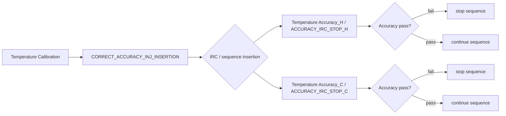

Open verification:

The processing probe README states that the exported XML contains the SST/IRC editor layout and columns such as `Injection Condition`, `Pass Actions`, and `Fail Actions`, but the currently decoded `SSTGrid` node does not contain actual business rows. Therefore the exact condition expression, insertion action, and stop action must be verified from the non-XML sequence-command serialization or inside Chromeleon UI.

## Contract 5: Report Formula

### 5.1 Direct ReportFormulaObject Evidence

`Report_VTCC_V2_12` sheet `Temp Accuracy` contains direct formula objects:

| Cell | Formula | Fixed channel | Meaning |
|---|---|---|---|
| `K66` | `AUDIT.RetTime1(1.000,"forward")` | | RetTime for point 1 |
| `K67` | `AUDIT.RetTime2(1.000,"forward")` | | RetTime for point 2 |
| `K68` | `AUDIT.RetTime3(1.000,"forward")` | | RetTime for point 3 |
| `K69` | `AUDIT.RetTime4(1.000,"forward")` | | RetTime for point 4 |
| `K70` | `AUDIT.RetTime5(1.000,"forward")` | | RetTime for point 5 |
| `L66:L70` | `chm.sig_value("average", AUDIT.RetTimeN - 1, AUDIT.RetTimeN - 0.2)` | `ExtTemp_LowerCC` | lower external thermometer average |
| `M66:M70` | `chm.sig_value("average", AUDIT.RetTimeN - 1, AUDIT.RetTimeN - 0.2)` | `ExtTemp_UpperCC` | upper external thermometer average |
| `I66:I70` | `AUDIT.ColumnComp.CC.Temperature.Nominal(AUDIT.RetTimeN - 0.1)` | | nominal temperature near anchor |
| `E45` | `chm.sig_value("average")` | `Environment_Temperature` | environment temperature summary |

### 5.2 Workbook-Derived Rules

The final deviation cells are workbook-derived rather than all being exposed as direct `ReportFormulaObject`.

Current verified evaluator rule:

```text
lower_avg_N = average(ExtTemp_LowerCC, RetTimeN - 1.0, RetTimeN - 0.2)
upper_avg_N = average(ExtTemp_UpperCC, RetTimeN - 1.0, RetTimeN - 0.2)
nominal_N = AUDIT.ColumnComp.CC.Temperature.Nominal(RetTimeN - 0.1)

observed_N =
  lower_avg_N if abs(lower_avg_N - nominal_N) >= abs(upper_avg_N - nominal_N)
  else upper_avg_N

deviation_N = observed_N - nominal_N
summary = max(abs(deviation_1..deviation_5))
result = Test passed if summary <= Definitions!Temperature Accuracy
```

Formula flow:

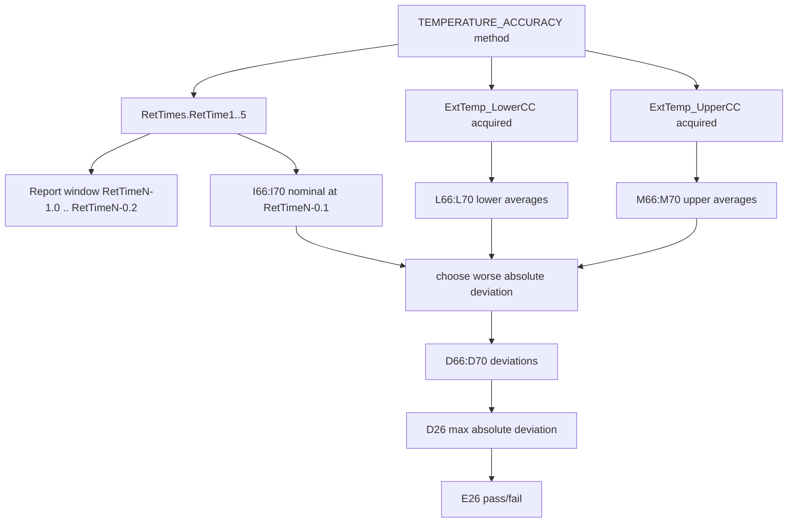

### 5.3 VA Template

`VA-C10-A` uses `Report_VATCC_V1_01` rather than `Report_VTCC_V2_12`. The TKN and DB mapping align the same `Temperature Accuracy_C.XLS` output and same field family, but the complete VA template formula-object row coverage still needs a template-specific formula trace before generation can claim equivalence.

## Contract 6: DB Contract and Configuration Requirement

### 6.1 DB Mapping as Leaf Contract

The DB mapping is a leaf validation target. It must not drive method generation by itself.

| Model | DB output file | Field-to-cell pattern |
|---|---|---|
| `VH-C10-A` | `Temperature Accuracy_H.XLS` | `TempAcc10/20/40/80/120 -> Temp Accuracy!D66:D70`, `RES_TempAccuracy -> E26` |
| `VC-C10-A` | `Temperature Accuracy_C.XLS` | `TempAcc10/20/40/60/85 -> Temp Accuracy!D66:D70`, `RES_TempAccuracy -> E26` |
| `VA-C10-A` | `Temperature Accuracy_C.XLS` | `TempAcc10/20/40/60/85 -> Temp Accuracy!D66:D70`, `RES_TempAccuracy -> E26` |

Display/typing rule:

```text
Temperature Accuracy observed/deviation cells display to 2 decimals.
Pass/fail compares the raw summary against Definitions!Temperature Accuracy.
SQL/DB output should preserve the mapped field type but avoid exposing binary float tails in user-facing preview/export.
```

### 6.2 Required Configuration

| Requirement | Why it is required | Evidence |
|---|---|---|
| `ColumnComp` with `CC` temperature control | Method sets `ColumnComp.CC.Temperature.Nominal`, readiness, mode, and TempCtrl | decoded method flow |
| Correct `ColumnComp.ModelNo` | Selects VH vs VC/VA setpoint branch and page-count variable | decoded method flow and report `Definitions!C15 = AUDIT.ColumnComp.ModelNo` |
| `Thermometer1.ExtTemp_UpperCC` | External upper thermometer source for report | method acquisition + report formulas |
| `Thermometer1.ExtTemp_LowerCC` | External lower thermometer source for report | method acquisition + report formulas |
| `Thermometer.Environment_Temperature` / `Thermometer.Measure_1` | Ambient check can skip 10 deg C point; report has environment formula | decoded method flow |
| Debug/signal channels | Method acquires CC actual temperatures, PWM, fan, leak board channels | decoded method flow |
| VH PCC command availability | VH branch runs `ColumnComp.CmdString Cmd="PCC.TempCtrl=0"` | decoded method flow |

Generation implication:

```text
A generated CMBX or method template must not only contain the script.
It must also declare the required CM instrument configuration symbols:
ColumnComp, Thermometer/Thermometer1, ExtTemp_UpperCC, ExtTemp_LowerCC,
Environment_Temperature, RetTimes, StabVars, and model-specific PCC command support.
```

## VH / VC / VA Comparison

| Aspect | `VH-C10-A` | `VC-C10-A` | `VA-C10-A` |
|---|---|---|---|
| Injection | `Temperature Accuracy_H` | `Temperature Accuracy_C` | `Temperature Accuracy_C` |
| Processing method | `ACCURACY_IRC_STOP_H` | `ACCURACY_IRC_STOP_C` | `ACCURACY_IRC_STOP_C` |
| Report template | `Report_VTCC_V2_12` | `Report_VTCC_V2_12` | `Report_VATCC_V1_01` |
| Temperature ladder | 10, 20, 40, 80, 120 deg C | 10, 20, 40, 60, 85 deg C | 10, 20, 40, 60, 85 deg C |
| PCC handling | Method disables PCC temp control by `CmdString` | no VH PCC branch | no VH PCC branch |
| Report output | `Temperature Accuracy_H.XLS` | `Temperature Accuracy_C.XLS` | `Temperature Accuracy_C.XLS` |
| DB fields | includes `TempAcc80`, `TempAcc120` | includes `TempAcc60`, `TempAcc85` | includes `TempAcc60`, `TempAcc85` |
| Open gap | exact IRC business rows | exact IRC business rows | VA template formula trace |

## Command Flow

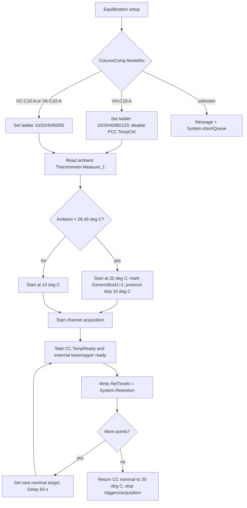

## Open Verification Required

| # | Uncertain point | Needed evidence | Likely source |
|---|---|---|---|
| 1 | Exact SST/IRC row expression for `ACCURACY_IRC_STOP_H/C` | Decoded processing method row data including condition, operator, pass/fail action | non-XML processing method serialization in sequence command, or Chromeleon Processing Method UI |
| 2 | Whether the corrective insertion PM checks `ColumnComp.ModelNo` directly or relies on preselected sequence branch | Human-readable pass action / injection condition | `CORRECT_ACCURACY_INJ_INSERTION` processing method row decode |
| 3 | Exact stop action implementation | Fail action payload, e.g. sequence stop/abort/action name | decoded SST/IRC row data |
| 4 | Complete VA `Report_VATCC_V1_01` formula-object trace for `Temp Accuracy` | Formula object TSV for VA report template | VA CMBX report extraction |
| 5 | How high-ambient skipped 10 deg C point is displayed in final workbook/DB | Reference CMBX where `GenericBool1=1` or synthetic verified run | real high-ambient data or CM simulation |
| 6 | Whether generated one-point Accuracy reports may remap RetTime anchors safely | Report template edit and CM validation | manual CM report-template experiment |

## Generation Readiness

| Layer | Status | Reason |
|---|---|---|
| Method command semantics | Partial to strong | Temperature ladder, stability logic, RetTime anchors, and acquisition channels are decoded from real method flow |
| Processing/IRC | Partial | Binding and intent are known; exact SST/IRC row business rule is not decoded |
| Report formulas | Strong for `Report_VTCC_V2_12`; partial for VA | Direct formula objects and workbook-derived rules are verified for VTCC; VA needs template-specific trace |
| DB contract | Strong | Field/cell mapping is aligned and treated as leaf validation |
| Config requirements | Partial | Required symbols are known; live CM hardware/profile validation still manual |

## Final Answers to Validation Questions

1. Temperature loop: `VH-C10-A` runs 10/20/40/80/120 deg C; `VC-C10-A` and `VA-C10-A` run 10/20/40/60/85 deg C. If ambient is greater than 28.49 deg C, 10 deg C can be skipped and the test starts at 20 deg C.
2. External thermometer data is sampled continuously after `Thermometer1.ExtTemp_UpperCC.AcqOn` and `Thermometer1.ExtTemp_LowerCC.AcqOn`. The report averages the stable window before each RetTime, specifically `RetTimeN-1.0..RetTimeN-0.2`.
3. IRC binding is visible through `ACCURACY_IRC_STOP_H/C` processing methods. The exact condition/action rows are not decoded yet; they require non-XML processing method business-rule evidence.
4. `TempAcc10` is the report-derived deviation for the first setpoint row. For VH it maps to `Temp Accuracy!D66`; source cells include nominal `I66`, RetTime `K66`, lower average `L66`, and upper average `M66`. The workbook chooses the upper/lower external thermometer value with the larger absolute deviation from nominal and stores/display-rounds the deviation.
5. VH differs from VC/VA by using the high-temperature 80/120 deg C branch, `Temperature Accuracy_H`, `ACCURACY_IRC_STOP_H`, and a VH PCC temp-control-off command. VC/VA use the 60/85 deg C branch and `ACCURACY_IRC_STOP_C`; VA additionally uses the `Report_VATCC_V1_01` template.
<a id="tcc-precision"></a>
## B007: Precision/fan black box

Build source name: `TCC_PRECISION_FAN_BLACK_BOX_DECOMPOSITION.md`

# TCC Temperature Precision and Fan Black Box Decomposition

Extraction date: 2026-07-10

Scope: TCC FOQ Temperature Precision and Fan for `VH-C10-A`, `VC-C10-A`, and `VA-C10-A`.

---
Test name: Temperature Precision and Fan
Models: VH-C10-A / VC-C10-A / VA-C10-A
Status: first black-box decomposition complete; processing method pass-action and Fan DB leaves remain open verification
---

This document decomposes Temperature Precision and Fan as a generation contract.
The core distinction is:

```text
Temperature Precision is report-derived from fixed external thermometer windows.
Fan behavior is method-driven by CC mode switching and CC_Temp statistics.
```

Unlike Temperature Accuracy, this test does not use RetTime anchors for the
main temperature precision result. The report uses fixed windows at
approximately 14, 36, and 58 minutes. Therefore the method duration and timing
are part of the calculation contract.

## Evidence Sources

| Evidence | Source |
|---|---|
| Test intent node | `cmbx_data_explorer/docs/TCC_TEST_KNOWLEDGE_NODE_MODEL.md` |
| FOQ TD extracted KB | `cmbx_data_explorer/docs/FOQ_TCC_VX_C10_A_TD_KNOWLEDGE_MANAGEMENT.md` |
| Injection workbench notes | `cmbx_data_explorer/docs/TCC_INJECTION_BY_INJECTION_REVERSE_WORKBENCH.md` |
| Method/report alignment | `cmbx_data_explorer/docs/TCC_METHOD_REPORT_ALIGNMENT.md` |
| Method flow, VH | `knowledge_base/tcc_reverse_probe/VH/6000001/TEMPERATURE_PRECISION_AND_FAN_embedded_method_flow.txt` |
| Method flow, VC | `knowledge_base/tcc_reverse_probe/VC/3000004/TEMPERATURE_PRECISION_AND_FAN_embedded_method_flow.txt` |
| Method flow, VA | `knowledge_base/tcc_reverse_probe/VA/0000003/TEMPERATURE_PRECISION_embedded_method_flow.txt` |
| Method contract summaries | `knowledge_base/tcc_method_contracts/*_method_contracts.tsv` |
| Processing method probe | `knowledge_base/tcc_processing_probe/*/*CORRECT_STABILITY_INJ_INSERTION*_summary.txt` |
| Report formula objects | `knowledge_base/tcc_report_formula_objects_vh_6000001_all_sheets.tsv` |
| Formula reverse notes | `cmbx_data_explorer/CM_FORMULA_REVERSE_ENGINEERING.md` |
| DB mapping | `foq/FOQResultLocations_V2.83.xls` |

## Executive Answer

1. `VH-C10-A` and `VC-C10-A` production CMBX rows use
   `Temperature Precision_and_Fan`, instrument method
   `TEMPERATURE_PRECISION_AND_FAN`, and processing method
   `CORRECT_STABILITY_INJ_INSERTION`.
2. `VA-C10-A` sample evidence uses `Temperature Precision`, instrument method
   `TEMPERATURE_PRECISION`, and `NO_INTEGRATION`, while the DB report file name
   still appears as `Temperature Precision_and_Fan.XLS`.
3. The method repeats a 45 C / 50 C thermal pattern. It first establishes the
   same starting condition before each 50 C segment, then acquires external
   upper and lower thermometer channels.
4. `Temp Precision` report formulas calculate three lower external averages and
   three upper external averages:

   ```text
   K65 = average ExtTemp_LowerCC from 14.0 to 14.8 min
   K66 = average ExtTemp_LowerCC from 36.0 to 36.8 min
   K67 = average ExtTemp_LowerCC from 58.0 to 58.8 min
   L65:L67 = same windows on ExtTemp_UpperCC
   ```

5. Workbook-derived precision rule:

   ```text
   LowerRange = max(K65:K67) - min(K65:K67)
   UpperRange = max(L65:L67) - min(L65:L67)
   RawPrecision = max(LowerRange, UpperRange)
   ```

6. The pass/fail cell compares `RawPrecision` to
   `Definitions!Temperature Precision`. The displayed summary uses two decimals,
   but pass/fail uses the raw range.
7. Fan behavior is checked by switching `ColumnComp.CC.Mode` from `StillAir` to
   `ForcedAir` and back to `StillAir`, logging `CC.TempReady`, and evaluating
   `CC_Temp` fixed windows on the `Fan` sheet. Current DB mapping exposes
   `TempPrecision` and `RES_TempPrecision`; Fan-specific DB field names remain
   open verification.

## Contract 1: Method Command

### 1.1 Device Branch Binding

| Device | Injection | Instrument Method | Processing Method | Report Template | Report Sheets |
|---|---|---|---|---|---|
| VH-C10-A | `Temperature Precision_and_Fan` | `TEMPERATURE_PRECISION_AND_FAN` | `CORRECT_STABILITY_INJ_INSERTION` | `Report_VTCC_V2_12` | `Temp Precision`, `Fan` |
| VC-C10-A | `Temperature Precision_and_Fan` | `TEMPERATURE_PRECISION_AND_FAN` | `CORRECT_STABILITY_INJ_INSERTION` | `Report_VTCC_V2_12` | `Temp Precision`, `Fan` |
| VA-C10-A | `Temperature Precision` | `TEMPERATURE_PRECISION` | `NO_INTEGRATION` | `Report_VATCC_V1_01` | `Temp Precision`, `Fan` |

### 1.2 Shared Precision Method Skeleton

Both `TEMPERATURE_PRECISION_AND_FAN` and `TEMPERATURE_PRECISION` share the same
temperature precision skeleton in current decoded method evidence:

```yaml
stages:
  - InstrumentSetup
  - Equilibration
  - StartRun
  - Run
  - StopRun
setpoints:
  - ColumnComp.CC.Temperature.Nominal: 45.0
  - ColumnComp.CC.Temperature.Nominal: 50.0
wait_conditions:
  - CC.TempReady
ret_times:
  emitted: []
logged_properties:
  - GenericLong9
  - Variables.GenericBool0
  - CC.TempReady
channels:
  - ColumnComp.CC_Temp
  - ColumnComp.CC_U_Temp_Actual
  - ColumnComp.CC_L_Temp_Actual
  - ColumnComp.CC_UCTL_TempRear_Actual
  - ColumnComp.PWM_CCU_A
  - ColumnComp.PWM_CCU_B
  - ColumnComp.PWM_CCL_A
  - ColumnComp.PWM_CCL_B
  - ColumnComp.Fan_Rear_ActualRPM
  - Thermometer1.ExtTemp_UpperCC
  - Thermometer1.ExtTemp_LowerCC
  - Thermometer.Environment_Temperature
  - ColumnComp.LEDBoard_LeakDiff
  - ColumnComp.LEDBoard_A13
  - ColumnComp.LEDBoard_A14
  - ColumnComp.Oven_Gas_MuteTimeRemain
```

Semantic command flow:

| Order | Command group | Meaning | Generation constraint |
|---:|---|---|---|
| 1 | Determine page/model context | Set `Variables.GenericLong9` by `ColumnComp.ModelNo`; abort if unknown. | Keeps report/page context aligned with model. |
| 2 | Determine stability branch flag | Set `Variables.GenericBool0` based on whether `ColumnComp.ModelNo` is `VH-C10-A`. | Feeds later stability branch selection. |
| 3 | Configure CC readiness | Set `ReadyTempDelta = 0.1 C`, `EquilibrationTime = 0.5 min`, `TempCtrl = On`. | Defines readiness for repeated 45/50 C transitions. |
| 4 | Set operating mode and leak sensor | Set `CC.Mode = StillAir`; set `LiquidLeakSensor = Off`. | Avoid false leak alarms during temperature changes. |
| 5 | Configure debug/data collection channels | Set data collection rate for CC actual/PWM/fan/leak channels. | Required for diagnostic evidence and Fan sheet. |
| 6 | Precondition at 45 C | Set CC nominal to 45 C and wait for `CC.TempReady`. | Ensures the same starting condition before 50 C segments. |
| 7 | Repeat 45/50 pattern | Toggle nominal values `50 -> 45 -> 50` before StartRun and again during Run. | Produces fixed report windows at 14, 36, and 58 minutes. |
| 8 | Start acquisition | Acquire CC, external thermometer, fan/PWM, environment and leak signals. | Required by `Temp Precision` and `Fan` sheets. |
| 9 | Re-enable and calibrate leak sensor | Set `LiquidLeakSensor = On` and run `LiquidLeakSensorCalibrate`. | Supports later leak logic and safe post-test state. |
| 10 | Stop acquisition | Turn all acquired channels off. | Required cleanup. |

### 1.3 Fan-Specific Method Branch

`TEMPERATURE_PRECISION_AND_FAN` includes an explicit Fan function block:

```text
SET ColumnComp.CC.ReadyTempDelta = 0.1 C
SET ColumnComp.CC.EquilibrationTime = 0.0 min
SET ColumnComp.CC.Mode = ForcedAir
RUN Log CC.TempReady
RUN Log CC.TempReady
RUN Log CC.TempReady
SET ColumnComp.CC.Mode = StillAir
RUN Log CC.TempReady
```

Current VA `TEMPERATURE_PRECISION` evidence does not include this block in the
decoded text. Therefore VA support for the Fan sheet must be treated as
template/report evidence, not confirmed Fan method behavior.

### 1.4 No RetTime Anchor

The decoded method summaries show no direct RetTime emissions for Precision/Fan.
This is important:

```text
Temperature Accuracy -> RetTime anchored report windows.
Temperature Precision -> fixed-time report windows.
```

For generated/cut-down methods, a shorter method cannot reuse the current
`Temp Precision` report unchanged.

## Contract 2: Processing Method

### 2.1 Known Bindings

| Device | Processing Method | Evidence | Interpretation |
|---|---|---|---|
| VH-C10-A | `CORRECT_STABILITY_INJ_INSERTION` | Sequence context and TKN binding. | Used by `Temperature Precision_and_Fan`; likely controls follow-up Stability branch selection. |
| VC-C10-A | `CORRECT_STABILITY_INJ_INSERTION` | Sequence context and TKN binding. | Same as VH, but later branch should be non-PCC stability. |
| VA-C10-A | `NO_INTEGRATION` for sample row | TKN binding and sequence package spec. | VA sample does not use the corrective stability processing method on the Precision row. |

### 2.2 Current Understanding

`CORRECT_STABILITY_INJ_INSERTION` appears near sequence context that references:

```text
Temperature Precision_and_Fan
TEMPERATURE_PRECISION_AND_FAN
Temperature Stability_and_PCC_H
```

The method also logs `Variables.GenericBool0`, which is set from ModelNo:

```text
VH-C10-A -> Variables.GenericBool0 = 1
other valid branch -> Variables.GenericBool0 = 0
```

Working interpretation:

```text
Temperature Precision determines the correct later Stability branch.
CORRECT_STABILITY_INJ_INSERTION likely enforces/inserts the appropriate
Temperature Stability injection, but the current XML probe does not expose a
complete action table.
```

Open verification:

| Item | Required evidence | Likely source |
|---|---|---|
| Exact `CORRECT_STABILITY_INJ_INSERTION` pass action | Full processing method business/action rows. | Processing method XML internals or Chromeleon UI. |
| Whether action uses `Variables.GenericBool0`, `ModelNo`, or sequence row names | Condition/action table. | Processing method editor view. |
| Why VA sample uses `NO_INTEGRATION` while still carrying `Temperature Precision_and_Fan.XLS` report file mapping | VA sequence/report binding evidence. | VA CMBX sequence row and report template. |

## Contract 3: Report Formula

### 3.1 `Temp Precision` Formula Objects

| Cell | Formula | Fixed channel / source | Meaning |
|---|---|---|---|
| `I65` | `AUDIT.ColumnComp.CC.Temperature.Nominal(14.9,"backward")` | Audit | Nominal value near first precision window. |
| `I66` | `AUDIT.ColumnComp.CC.Temperature.Nominal(36.9,"backward")` | Audit | Nominal value near second precision window. |
| `I67` | `AUDIT.ColumnComp.CC.Temperature.Nominal(58.9,"backward")` | Audit | Nominal value near third precision window. |
| `K65` | `chm.sig_value("average",14,14.8)` | `ExtTemp_LowerCC` | Lower external average, first repeat. |
| `K66` | `chm.sig_value("average",36,36.8)` | `ExtTemp_LowerCC` | Lower external average, second repeat. |
| `K67` | `chm.sig_value("average",58,58.8)` | `ExtTemp_LowerCC` | Lower external average, third repeat. |
| `L65` | `chm.sig_value("average",14,14.8)` | `ExtTemp_UpperCC` | Upper external average, first repeat. |
| `L66` | `chm.sig_value("average",36,36.8)` | `ExtTemp_UpperCC` | Upper external average, second repeat. |
| `L67` | `chm.sig_value("average",58,58.8)` | `ExtTemp_UpperCC` | Upper external average, third repeat. |

Workbook-derived precision rule:

```text
LowerRange = max(K65:K67) - min(K65:K67)
UpperRange = max(L65:L67) - min(L65:L67)
RawPrecision = max(LowerRange, UpperRange)
Displayed TempPrecision = RawPrecision displayed to 2 decimals
Pass/fail = RawPrecision <= Definitions!Temperature Precision
```

The source rule is the same family as Temperature Stability:

```text
Do not combine K65:L67 into one range.
Evaluate each external thermometer separately, then take the worse sensor.
```

### 3.2 `Fan` Formula Objects

Known formula objects on sheet `Fan`:

| Cell | Formula | Fixed channel | Meaning |
|---|---|---|---|
| `J49` | `chm.signalStatistic("average",63.1,64.1)` | `CC_Temp` | CC temperature average before/around fan mode response window. |
| `J50` | `chm.signalStatistic("min",64.1,74)` | `CC_Temp` | Minimum CC temperature in fan response interval. |
| `J51` | `chm.signalStatistic("average",74,75)` | `CC_Temp` | Average after fan response interval. |
| `J52` | `chm.signalStatistic("max",75,76)` | `CC_Temp` | Maximum after return/response interval. |
| `W57` | `chm.signalStatistic("min",63.1,64.1)` | `CC_Temp` | Fan diagnostic min value. |
| `X57` | `chm.signalStatistic("max",63.1,64.1)` | `CC_Temp` | Fan diagnostic max value. |
| `W58` | `chm.signalStatistic("min",74,75)` | `CC_Temp` | Fan diagnostic min value. |
| `X58` | `chm.signalStatistic("max",74,75)` | `CC_Temp` | Fan diagnostic max value. |

Open point:

```text
Current FOQResultLocations_V2.83 mapping exposes TempPrecision and
RES_TempPrecision, but no verified Fan-specific DB field names for this test.
Fan may be report-visible without being part of the current TCC DB contract.
```

### 3.3 Formula Flow

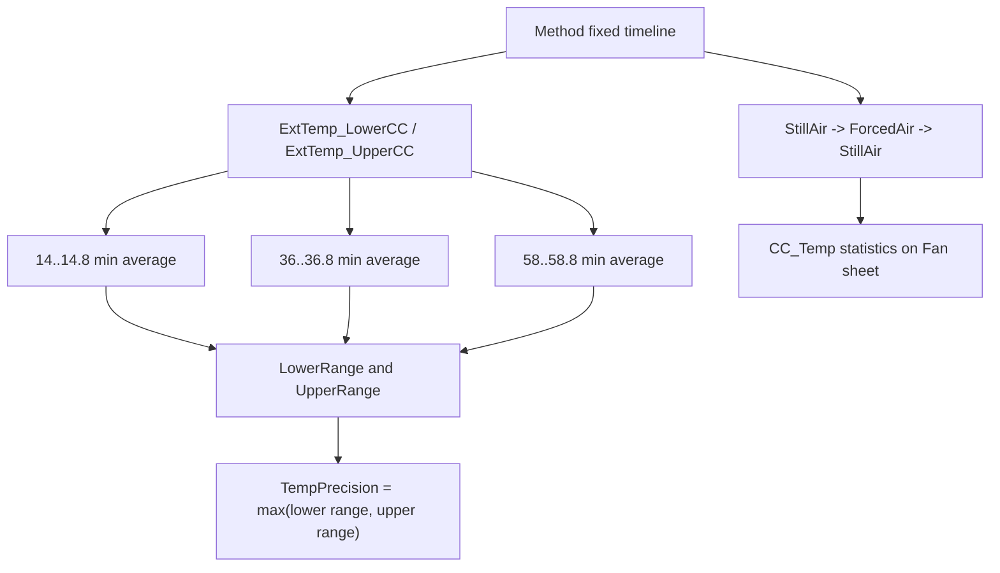

## Contract 4: DB Contract

### 4.1 DB Leaves

| Device | DB Field | Report file | Sheet | Cell | Rule |
|---|---|---|---|---|---|
| VH-C10-A | `TempPrecision` | `Temperature Precision_and_Fan.XLS` | `Temp Precision` | `D26` | Displayed max lower/upper sensor range. |
| VH-C10-A | `RES_TempPrecision` | `Temperature Precision_and_Fan.XLS` | `Temp Precision` | `E26` | Pass/fail versus Definitions. |
| VC-C10-A | `TempPrecision` | `Temperature Precision_and_Fan.XLS` | `Temp Precision` | `D26` | Displayed max lower/upper sensor range. |
| VC-C10-A | `RES_TempPrecision` | `Temperature Precision_and_Fan.XLS` | `Temp Precision` | `E26` | Pass/fail versus Definitions. |
| VA-C10-A | `TempPrecision` | `Temperature Precision_and_Fan.XLS` | `Temp Precision` | `D26` | Displayed max lower/upper sensor range. |
| VA-C10-A | `RES_TempPrecision` | `Temperature Precision_and_Fan.XLS` | `Temp Precision` | `E26` | Pass/fail versus Definitions. |

### 4.2 DB Boundary

`Noise_CC_Temp` belongs to the later Temperature Stability report in the current
mapping, not to Temperature Precision:

```text
Noise_CC_Temp -> Temperature Stability(_and_PCC)_*.XLS / Temp Stability_Noise / K86
```

Generation implication:

```text
Do not attach Noise_CC_Temp to a cut-down Precision-only package unless the
report/DB contract is deliberately changed.
```

## Contract 5: Config Requirement

| Requirement | VH-C10-A | VC-C10-A | VA-C10-A | Failure mode |
|---|---|---|---|---|
| `AUDIT.ColumnComp.ModelNo` source of truth | Required | Required | Required | Wrong page count, wrong branch, wrong follow-up stability injection. |
| Column compartment CC control | Required | Required | Required | 45/50 C transitions and `CC.TempReady` invalid. |
| External upper/lower thermometers | Required | Required | Required | `Temp Precision` report cannot evaluate. |
| `CC_Temp` raw channel | Required for Fan sheet | Required for Fan sheet | Report sheet lists Fan, method support not fully verified | Fan statistics cannot evaluate. |
| `Fan_Rear_ActualRPM` / fan debug channel | Required for method evidence | Required for method evidence | Acquired in VA precision method | Fan behavior evidence incomplete. |
| PWM/debug channels | Acquired | Acquired | Acquired | Diagnostic trace incomplete. |
| Current report timeline | Required | Required | Required | Fixed report windows miss data if method is shortened. |
| Processing action for Stability insertion | `CORRECT_STABILITY_INJ_INSERTION` | `CORRECT_STABILITY_INJ_INSERTION` | sample uses `NO_INTEGRATION` | Later Stability branch may be wrong or missing. |

Generation guardrails:

```text
1. Keep the three repeated precision windows unless regenerating the report.
2. Keep lower and upper external thermometer ranges separate.
3. Treat the Fan sheet as fixed-window CC_Temp diagnostics, not as a RetTime test.
4. For VH/VC, do not drop `Variables.GenericBool0` until the stability insertion
   processing method is fully understood.
5. For VA, confirm whether the intended production method should include Fan
   mode switching or match the observed `TEMPERATURE_PRECISION` method.
```

## Contract 6: Open Verification

Items below are marked Open Verification Required until the listed evidence is
captured.

| # | Uncertain point | Required evidence | Likely source |
|---:|---|---|---|
| 1 | Exact `CORRECT_STABILITY_INJ_INSERTION` pass-action structure. | Processing method condition/action table. | Chromeleon processing method editor or deeper XML decoder. |
| 2 | Whether the processing method inserts VH `Temperature Stability_and_PCC_H` and VC `Temperature Stability_C` based on `Variables.GenericBool0`. | Pass-action rows plus model-branch evaluation. | Processing method XML / UI. |
| 3 | Fan pass/fail workbook formula and whether it has any DB fields outside current mapping. | FormulaOne workbook extraction and DB mapping review. | Report template `SpreadSheetData` and FOQ mapping. |
| 4 | VA branch difference: `TEMPERATURE_PRECISION` lacks the decoded Fan mode-switch block but the report file still uses `Temperature Precision_and_Fan.XLS`. | VA CM sequence/report UI and report export. | Real VA CMBX loaded in CM. |
| 5 | Exact `Definitions!Temperature Precision` limits by template/model. | Definitions sheet values. | VTCC/VATCC report templates. |

## VH / VC / VA Comparison

| Question | VH-C10-A | VC-C10-A | VA-C10-A |
|---|---|---|---|
| Which injection is used? | `Temperature Precision_and_Fan` | `Temperature Precision_and_Fan` | `Temperature Precision` |
| Which method is used? | `TEMPERATURE_PRECISION_AND_FAN` | `TEMPERATURE_PRECISION_AND_FAN` | `TEMPERATURE_PRECISION` |
| Which processing method is used? | `CORRECT_STABILITY_INJ_INSERTION` | `CORRECT_STABILITY_INJ_INSERTION` | `NO_INTEGRATION` in current sample |
| Fan mode switch decoded? | Yes | Yes by method family | Not in current decoded VA method text |
| Temperature precision formula | Same fixed windows | Same fixed windows | Same fixed report mapping expected |
| Stability branch flag | `GenericBool0 = 1` | `GenericBool0 = 0` | `GenericBool0 = 0` |

## Command, Report, DB Flow

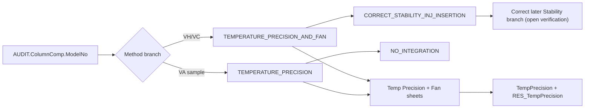

## Generation Readiness

| Use case | Readiness | Reason |
|---|---|---|
| Reuse full VH/VC Precision and Fan branch from existing CMBX | Medium-high | Method/report/DB chain is mostly closed; processing pass-action remains open. |
| Reuse VA Precision branch from existing CMBX | Medium | Precision formula is clear; Fan method/report mismatch needs confirmation. |
| Generate shorter precision-only test using current report | Not ready | Current report windows are fixed at 14, 36, and 58 minutes. |
| Generate a new single-window precision test | Not ready | The current report requires three repeated windows to compute a range. |
| Split Fan into a standalone test | Partial | Fan method commands and CC_Temp formulas are known, but DB/report pass/fail contract is not closed. |
<a id="tcc-stability"></a>
## B008: Stability/PCC black box

Build source name: `TCC_STABILITY_BLACK_BOX_DECOMPOSITION.md`

# TCC Temperature Stability and PCC Black Box Decomposition

Extraction date: 2026-07-10

Scope: TCC FOQ Temperature Stability for `VH-C10-A`, `VC-C10-A`, and `VA-C10-A`.

---
Test name: Temperature Stability / Temperature Stability and PCC
Models: VH-C10-A / VC-C10-A / VA-C10-A
Status: first black-box decomposition complete; workbook internals and exact non-PCC payload still need open verification
---

This document decomposes the Temperature Stability test as a generation contract.
The key branch is:

```text
VH-C10-A -> Temperature Stability_and_PCC_H -> TEMPERATURE_STABILITY_AND_PCC_70_H
VC-C10-A / VA-C10-A -> Temperature Stability_C -> TEMPERATURE_STABILITY_70_C
```

The VH branch is not only a longer version of the VC/VA branch. It combines two
test intents on one timeline:

```text
1. CC stability/noise at 70 C.
2. VH-only PCC performance, accuracy, drift, noise, and cool-down timing.
```

## Evidence Sources

| Evidence | Source |
|---|---|
| Test intent node | `cmbx_data_explorer/docs/TCC_TEST_KNOWLEDGE_NODE_MODEL.md` |
| FOQ TD extracted KB | `cmbx_data_explorer/docs/FOQ_TCC_VX_C10_A_TD_KNOWLEDGE_MANAGEMENT.md` |
| Injection workbench notes | `cmbx_data_explorer/docs/TCC_INJECTION_BY_INJECTION_REVERSE_WORKBENCH.md` |
| Method/report alignment | `cmbx_data_explorer/docs/TCC_METHOD_REPORT_ALIGNMENT.md` |
| Decoded method contract, VH | `knowledge_base/tcc_method_contracts/VH_6000001_TEMPERATURE_STABILITY_AND_PCC_70_H_contract.md` |
| Method contract summaries | `knowledge_base/tcc_method_contracts/*_method_contracts.tsv` |
| Report formula objects | `knowledge_base/tcc_report_formula_objects_vh_6000001_all_sheets.tsv` |
| Formula reverse notes | `cmbx_data_explorer/CM_FORMULA_REVERSE_ENGINEERING.md` |
| DB mapping | `foq/FOQResultLocations_V2.83.xls` |

## Executive Answer

1. The stability measurement is a 70 C long-window test. The report reads
   external lower and upper thermometer averages from one-minute windows between
   45 and 60 minutes.
2. Stability is evaluated separately for the lower and upper external
   thermometers:

   ```text
   LowerRange = max(K61:K75) - min(K61:K75)
   UpperRange = max(L61:L75) - min(L61:L75)
   RawStability = max(LowerRange, UpperRange)
   ```

   It must not be calculated as one combined range across K:L, because that
   would mix external thermometer offset into the stability result.
3. `Noise_CC_Temp` is calculated from `CC_Temp` with `chm.noise(59,60)`.
   VH additionally calculates `Noise_PCC_Temp` from `PCC_Temp` with the same
   one-minute window.
4. `VC-C10-A` and `VA-C10-A` use `TEMPERATURE_STABILITY_70_C`,
   `NO_INTEGRATION`, and the `Temp Stability_Noise` report sheet only.
5. `VH-C10-A` uses `TEMPERATURE_STABILITY_AND_PCC_70_H`,
   `NO_INTEGRATION`, and both `Temp Stability_Noise` and `PCC` report sheets.
   The method emits `RetTimes.RetTime2`, `RetTimes.RetTime3`, and
   `RetTimes.RetTime4` for the PCC heat/cool branch.
6. PCC cool-down performance is report-derived from `RetTime4 - RetTime3`.
   The report also calculates PCC averages at fixed windows, PCC drift from
   minute 19 to 24, and PCC noise at minute 59 to 60.

## Contract 1: Method Command

### 1.1 Device Branch Binding

| Device | Injection | Instrument Method | Processing Method | Report Template | Report Sheets |
|---|---|---|---|---|---|
| VH-C10-A | `Temperature Stability_and_PCC_H` | `TEMPERATURE_STABILITY_AND_PCC_70_H` | `NO_INTEGRATION` | `Report_VTCC_V2_12` | `Temp Stability_Noise`, `PCC` |
| VC-C10-A | `Temperature Stability_C` | `TEMPERATURE_STABILITY_70_C` | `NO_INTEGRATION` | `Report_VTCC_V2_12` | `Temp Stability_Noise` |
| VA-C10-A | `Temperature Stability_C` | `TEMPERATURE_STABILITY_70_C` | `NO_INTEGRATION` | `Report_VATCC_V1_01` | `Temp Stability_Noise` |

### 1.2 VC/VA Non-PCC Method Contract

Decoded summary evidence for `TEMPERATURE_STABILITY_70_C`:

```yaml
method: TEMPERATURE_STABILITY_70_C
models: [VC-C10-A, VA-C10-A]
stages:
  - InstrumentSetup
  - Equilibration
  - InjectPreparation
  - StartRun
  - Run
  - StopRun
  - PostRun
setpoints:
  - ColumnComp.CC.Temperature.Nominal: 70.0
wait_conditions:
  - CC.TempReady
ret_times:
  emitted: []
logged_properties:
  - GenericLong9
channels:
  - ColumnComp.CC_Temp
  - ColumnComp.CC_U_Temp_Actual
  - ColumnComp.CC_L_Temp_Actual
  - ColumnComp.CC_UCTL_TempRear_Actual
  - ColumnComp.PWM_CCU_A
  - ColumnComp.PWM_CCU_B
  - ColumnComp.PWM_CCL_A
  - ColumnComp.PWM_CCL_B
  - ColumnComp.Fan_Rear_ActualRPM
  - Thermometer1.ExtTemp_UpperCC
  - Thermometer1.ExtTemp_LowerCC
  - Thermometer.Environment_Temperature
  - ColumnComp.LEDBoard_LeakDiff
  - ColumnComp.LEDBoard_A13
  - ColumnComp.LEDBoard_A14
  - ColumnComp.Oven_Gas_MuteTimeRemain
```

Semantic command flow:

| Order | Command group | Meaning | Generation constraint |
|---:|---|---|---|
| 1 | Configure CC stability parameters | Set CC control parameters and nominal temperature to 70 C. | Required. The report expects a 70 C stability run. |
| 2 | Wait for readiness | Wait until `CC.TempReady`. | Required before the 45..60 min report window. |
| 3 | Start acquisition | Acquire internal CC channels, PWM/fan channels, external thermometers, environment and leak-related channels. | Required for `Temp Stability_Noise`. |
| 4 | Hold acquisition | Keep the timeline long enough to cover report windows 45..60 and 59..60. | Required unless the report formulas are rewritten. |
| 5 | Stop acquisition | Turn acquired channels off and finish run. | Required cleanup. |

### 1.3 VH PCC Method Contract

Decoded summary evidence for `TEMPERATURE_STABILITY_AND_PCC_70_H`:

```yaml
method: TEMPERATURE_STABILITY_AND_PCC_70_H
models: [VH-C10-A]
stages:
  - InstrumentSetup
  - Equilibration
  - InjectPreparation
  - StartRun
  - Run
  - StopRun
  - PostRun
setpoints:
  - ColumnComp.PCC.Temperature.Nominal: 40.00
  - ColumnComp.CC.Temperature.Nominal: 70.0
  - ColumnComp.PCC.Temperature.Nominal: 80.0
  - ColumnComp.PCC.Temperature.Nominal: 40.0
wait_conditions:
  - CC.TempReady AND PCC.TempReady
ret_times:
  initialized:
    - RetTimes.RetTime1
    - RetTimes.RetTime2
    - RetTimes.RetTime3
    - RetTimes.RetTime4
  emitted:
    - RetTimes.RetTime2
    - RetTimes.RetTime3
    - RetTimes.RetTime4
triggers:
  - T60UP: PCC.Temperature.Value >= 60.0
  - T50Down: PCC.Temperature.Value <= 50.0 AND Variables.GenericBool1
  - T40Down: PCC.Temperature.Value <= 40.0 AND Variables.GenericBool2
logged_properties:
  - GenericLong9
  - PCC.Temperature.Value
channels:
  - ColumnComp.CC_Temp
  - ColumnComp.PCC_Temp
  - ColumnComp.PWM_PCC_A
  - ColumnComp.PWM_PCC_B
  - Thermometer1.ExtTemp_UpperCC
  - Thermometer1.ExtTemp_LowerCC
  - Thermometer.Environment_Temperature
```

Semantic command flow:

| Order | Command group | Meaning | Required report dependency |
|---:|---|---|---|
| 1 | Enable CC and PCC temperature control | Prepare both compartments for stability/PCC run. | `CC.TempReady AND PCC.TempReady` must be meaningful. |
| 2 | Set CC nominal 70 C and PCC nominal 40 C | Establish the stability run and first PCC reference window. | PCC sheet reads nominal audit and averages `PCC_Temp` from 0..5 min. |
| 3 | Wait for readiness | Wait until both CC and PCC are ready. | Prevents report windows from covering unstable startup. |
| 4 | Acquire CC, PCC, external thermometer, PWM/fan and environment channels | Produce raw signals for stability, noise, PCC average/drift/noise. | Required by `Temp Stability_Noise` and `PCC` sheets. |
| 5 | Trigger `T60UP` and emit `RetTime2` | Detect PCC heat-up crossing 60 C. | Method evidence; not currently a DB leaf cell. |
| 6 | Set PCC nominal to 80 C | Drive the PCC high-temperature segment. | Supports PCC accuracy 80 C window. |
| 7 | Trigger `T50Down` and emit `RetTime3` | Detect cool-down crossing 50 C after heat event. | `PCC!K105 = AUDIT.RetTime3`. |
| 8 | Trigger `T40Down` and emit `RetTime4` | Detect cool-down crossing 40 C. | `PCC!L105 = AUDIT.RetTime4`. |
| 9 | Return PCC nominal to 40 C / stop acquisition | Close the PCC branch and finish run. | Required cleanup. |

### 1.4 Method Branch Difference

| Feature | VH-C10-A | VC-C10-A / VA-C10-A |
|---|---|---|
| CC stability at 70 C | Yes | Yes |
| PCC hardware dependency | Required | Not used |
| PCC_Temp channel | Required | Must not be required |
| RetTime emissions | RetTime2, RetTime3, RetTime4 | None in decoded summary |
| Report sheets | `Temp Stability_Noise`, `PCC` | `Temp Stability_Noise` |
| Main generation risk | Leaving PCC branch out breaks PCC DB fields | Leaving PCC branch in creates invalid hardware/report dependencies |

## Contract 2: Processing Method

All known branches bind to `NO_INTEGRATION`.

```yaml
processing_method: NO_INTEGRATION
used_by:
  - Temperature Stability_and_PCC_H
  - Temperature Stability_C
irc_injected: false
expected_behavior:
  - no chromatographic integration required
  - no Accuracy/Calibration corrective injection insertion is expected here
stop_condition: not identified in current evidence
```

Interpretation:

```text
Temperature Stability is selected by device-specific sequence/injection binding.
Unlike Temperature Accuracy, this decomposition does not currently show an IRC
Pass Action that inserts the stability branch.
```

Open verification:

| Item | Required evidence | Likely source |
|---|---|---|
| Whether the original production sequence can insert stability by IRC in some workflows | Full processing method business rows / CM UI view | Processing method XML or Chromeleon UI |
| Whether `NO_INTEGRATION` contains any non-obvious stop/pass behavior | Full processing method action table | Processing method payload |

## Contract 3: Report Formula

### 3.1 `Temp Stability_Noise` Formula Objects

| Cell(s) | Formula | Fixed channel | Meaning |
|---|---|---|---|
| `K61:K75` | `chm.sig_value("average", 45..60 one-minute windows)` | `ExtTemp_LowerCC` | Lower external thermometer one-minute averages. |
| `L61:L75` | `chm.sig_value("average", 45..60 one-minute windows)` | `ExtTemp_UpperCC` | Upper external thermometer one-minute averages. |
| `K86` | `chm.noise(59,60)` | `CC_Temp` | Internal CC temperature noise at the end of the run. |
| `K87` | `chm.noise(59,60)` | `PCC_Temp` | VH/PCC temperature noise at the end of the run. |

Workbook-derived stability rule:

```text
LowerRange = max(K61:K75) - min(K61:K75)
UpperRange = max(L61:L75) - min(L61:L75)
RawStability = max(LowerRange, UpperRange)
Displayed TempStability = RawStability displayed to 2 decimals
Pass/fail = RawStability <= Definitions!Temperature Stability
```

Generation implication:

```text
If a generated method keeps this report unchanged, the method must retain at
least a 60-minute acquisition timeline and must make minutes 45..60 meaningful.
A shortened stability run requires a new report template or rewritten formula
windows.
```

### 3.2 VH `PCC` Formula Objects

| Cell | Formula | Fixed channel / source | Meaning |
|---|---|---|---|
| `K89` | `AUDIT.PCC.Temperature.Nominal(4.000)` | Audit | PCC nominal value near the first 40 C window. |
| `K90` | `AUDIT.PCC.Temperature.Nominal(12.000)` | Audit | PCC nominal value near the 80 C window. |
| `K91` | `AUDIT.PCC.Temperature.Nominal(20.000)` | Audit | PCC nominal value near the second 40 C window. |
| `L89` | `chm.sig_value("average", 0, 5)` | `PCC_Temp` | First PCC 40 C average. |
| `L90` | `chm.sig_value("average", 10, 15)` | `PCC_Temp` | PCC 80 C average. |
| `L91` | `chm.sig_value("average", 19, 24)` | `PCC_Temp` | Second PCC 40 C average. |
| `K97` | `chm.sig_value("drift", 19, 24)` | `PCC_Temp` | PCC drift after return to 40 C. |
| `K105` | `AUDIT.RetTime3(1,"forward")` | Audit RetTime | PCC cool-down 50 C anchor. |
| `L105` | `AUDIT.RetTime4(1,"forward")` | Audit RetTime | PCC cool-down 40 C anchor. |

Workbook-derived PCC rules:

```text
Performance_PCC = L105 - K105
Pass/fail = Performance_PCC <= Definitions!PCC CoolDownTime
PCC average/deviation cells compare L89/L90/L91 to audit nominal values.
```

### 3.3 Formula Flow

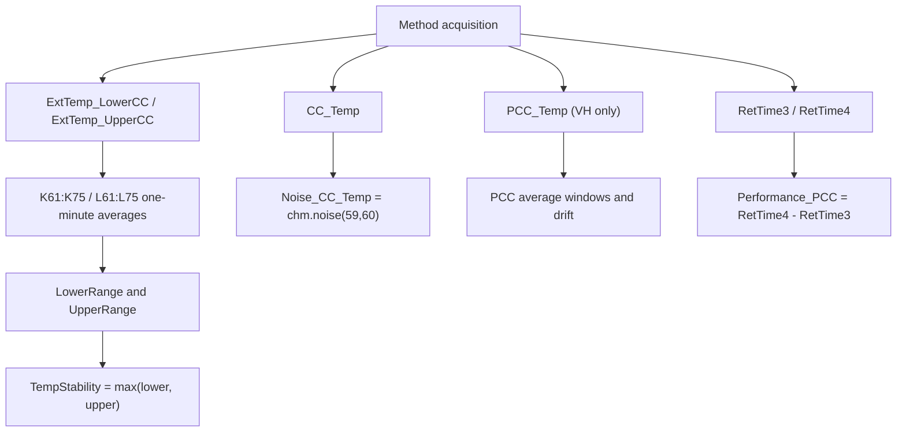

## Contract 4: DB Contract

### 4.1 VH-C10-A DB Leaves

| DB Field | Report file | Sheet | Cell / source | Rule |
|---|---|---|---|---|
| `TempStability` | `Temperature Stability_and_PCC_H.XLS` | `Temp Stability_Noise` | `D26` | Displayed max lower/upper sensor range. |
| `Noise_CC_Temp` | `Temperature Stability_and_PCC_H.XLS` | `Temp Stability_Noise` | `K86` | `CC_Temp chm.noise(59,60)`. |
| `Noise_PCC_Temp` | `Temperature Stability_and_PCC_H.XLS` | `Temp Stability_Noise` | `K87` | `PCC_Temp chm.noise(59,60)`. |
| `RES_TempStability` | `Temperature Stability_and_PCC_H.XLS` | `Temp Stability_Noise` | `E26` | Pass/fail versus Definitions. |
| `Performance_PCC` | `Temperature Stability_and_PCC_H.XLS` | `PCC` | `D26` | `RetTime4 - RetTime3`, displayed to 2 decimals. |
| `RES_PCC` | `Temperature Stability_and_PCC_H.XLS` | `PCC` | `E26` | Pass/fail versus PCC CoolDownTime. |
| `PCC_Acc_40_Step1` | `Temperature Stability_and_PCC_H.XLS` | `PCC` | `L89` | Average `PCC_Temp` 0..5 min. |
| `PCC_Acc_80` | `Temperature Stability_and_PCC_H.XLS` | `PCC` | `L90` | Average `PCC_Temp` 10..15 min. |
| `PCC_Acc_40_Step2` | `Temperature Stability_and_PCC_H.XLS` | `PCC` | `L91` | Average `PCC_Temp` 19..24 min. |
| `PCC_Drift` | `Temperature Stability_and_PCC_H.XLS` | `PCC` | `K97` | `PCC_Temp` drift over 19..24 min. |

### 4.2 VC/VA DB Leaves

| Device | DB Field | Report file | Sheet | Cell / source | Rule |
|---|---|---|---|---|---|
| VC-C10-A | `TempStability` | `Temperature Stability_C.XLS` | `Temp Stability_Noise` | `D26` | Displayed max lower/upper sensor range. |
| VC-C10-A | `Noise_CC_Temp` | `Temperature Stability_C.XLS` | `Temp Stability_Noise` | `K86` | `CC_Temp chm.noise(59,60)`. |
| VC-C10-A | `RES_TempStability` | `Temperature Stability_C.XLS` | `Temp Stability_Noise` | `E26` | Pass/fail versus Definitions. |
| VA-C10-A | `TempStability` | `Temperature Stability_C.XLS` | `Temp Stability_Noise` | `D26` | Displayed max lower/upper sensor range. |
| VA-C10-A | `Noise_CC_Temp` | `Temperature Stability_C.XLS` | `Temp Stability_Noise` | `K86` | `CC_Temp chm.noise(59,60)`. |
| VA-C10-A | `RES_TempStability` | `Temperature Stability_C.XLS` | `Temp Stability_Noise` | `E26` | Pass/fail versus Definitions. |

## Contract 5: Config Requirement

| Requirement | VH-C10-A | VC-C10-A | VA-C10-A | Failure mode |
|---|---|---|---|---|
| `AUDIT.ColumnComp.ModelNo` device source of truth | Required | Required | Required | Wrong branch/report selection. |
| Column compartment temperature control | Required | Required | Required | `CC.TempReady` never becomes valid. |
| External upper/lower thermometers | Required | Required | Required | Stability cells `K61:K75` / `L61:L75` cannot evaluate. |
| `CC_Temp` raw channel | Required | Required | Required | `Noise_CC_Temp` cannot evaluate. |
| PCC hardware/configuration | Required | Not applicable | Not applicable | VH PCC DB fields cannot evaluate, or non-VH method will fail if PCC commands remain. |
| `PCC_Temp` raw channel | Required | Not applicable | Not applicable | `Noise_PCC_Temp`, PCC accuracy, drift and performance fail. |
| RetTimes `RetTime3` and `RetTime4` | Required | Not applicable | Not applicable | `Performance_PCC` cannot evaluate. |
| Report template branch | `Report_VTCC_V2_12` | `Report_VTCC_V2_12` | `Report_VATCC_V1_01` | DB field mapping points to wrong sheets/cells. |

Generation guardrails:

```text
1. Do not generate the VH method for a non-PCC TCC configuration.
2. Do not generate the VC/VA method when VH PCC DB fields are requested.
3. Do not shorten the acquisition window unless `Temp Stability_Noise` formulas are also regenerated.
4. Keep external lower and upper thermometer ranges separate in report formulas.
```

## Contract 6: Open Verification

Items below are marked Open Verification Required until the listed evidence is
captured.

| # | Uncertain point | Required evidence | Likely source |
|---:|---|---|---|
| 1 | Full line-by-line command script for `TEMPERATURE_STABILITY_70_C` beyond the decoded summary. | Embedded method flow text for VC/VA non-PCC branch. | `knowledge_base/tcc_reverse_probe/VC/.../TEMPERATURE_STABILITY_70_C_embedded_method_flow.txt` or CM method editor. |
| 2 | Exact FormulaOne workbook formulas for `D26`, `E26`, and PCC summary/pass cells. | Workbook formula extraction or verified Excel open view. | Report template `SpreadSheetData` / Excel export. |
| 3 | Whether Stability has any hidden IRC insertion path in production workflows. | Full processing method action rows. | Processing method XML / Chromeleon UI. |
| 4 | Exact acceptance limits in `Definitions` for each template and model. | Definitions sheet values for VTCC and VATCC templates. | Report template workbook layer. |
| 5 | Whether VA `Report_VATCC_V1_01` has identical `Temp Stability_Noise` cell layout. | VA-specific report formula export. | Real VA CMBX report template. |

## VH / VC / VA Comparison

| Question | VH-C10-A | VC-C10-A | VA-C10-A |
|---|---|---|---|
| Which injection is used? | `Temperature Stability_and_PCC_H` | `Temperature Stability_C` | `Temperature Stability_C` |
| Which method is used? | `TEMPERATURE_STABILITY_AND_PCC_70_H` | `TEMPERATURE_STABILITY_70_C` | `TEMPERATURE_STABILITY_70_C` |
| Is PCC tested? | Yes | No | No |
| Does the method emit RetTimes for this test? | Yes, RetTime2/3/4 | No evidence in decoded summary | No evidence in decoded summary |
| Which raw channels drive stability? | `ExtTemp_LowerCC`, `ExtTemp_UpperCC` | Same | Same |
| Which raw channels drive noise? | `CC_Temp`, `PCC_Temp` | `CC_Temp` | `CC_Temp` |
| Which DB fields are unique? | PCC performance, PCC result, PCC accuracy/drift/noise | None | None |

## Command, Report, DB Flow

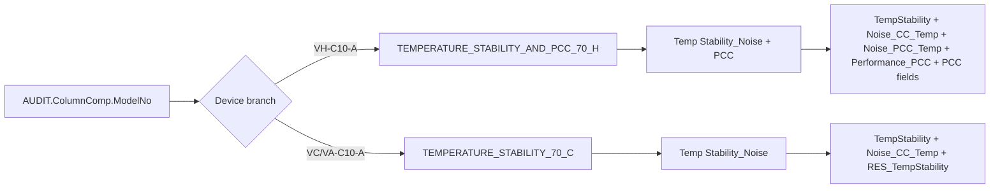

## Generation Readiness

| Use case | Readiness | Reason |
|---|---|---|
| Reuse full VH Stability/PCC branch from existing CMBX | High | Method/report/DB chain is mostly closed and RetTime semantics are known. |
| Reuse full VC/VA non-PCC stability branch from existing CMBX | Medium | DB/report chain is closed; line-level method flow still needs one more evidence pass. |
| Generate shortened stability test without changing report | Not ready | Report windows are hard-coded to 45..60 and 59..60 min. |
| Split VH PCC into a standalone test | Partial | PCC formulas and RetTimes are known, but report/template rewrite and sequence binding need verification. |
| Merge Stability with another temperature test | Partial | Shared external thermometer resources are clear; report windows and timing conflicts need a dependency model. |
<a id="tcc-heat-cool"></a>
## B009: Heat-up/cool-down black box

Build source name: `TCC_HEATUP_COOLDOWN_BLACK_BOX_DECOMPOSITION.md`

# TCC HeatUp and CoolDown Black Box Decomposition

Extraction date: 2026-07-10

Scope: TCC FOQ HeatUp and CoolDown Time for `VH-C10-A`, `VC-C10-A`, and `VA-C10-A`.

---
Test name: HeatUp and CoolDown
Models: VH-C10-A / VC-C10-A / VA-C10-A
Status: first black-box decomposition complete; row-65/row-66 workbook layout remains open verification
---

This document decomposes the HeatUp and CoolDown test as a generation contract.
The core of this test is RetTime event semantics:

```text
Heat-up performance = RetTime3 - RetTime1 - 2.0 min
Cool-down performance = RetTime6 - RetTime4 - 2.0 min
```

The `2.0 min` subtraction is not an arbitrary formatting correction. It removes
the stable-hold time that is intentionally included by the method triggers.

## Evidence Sources

| Evidence | Source |
|---|---|
| Test intent node | `cmbx_data_explorer/docs/TCC_TEST_KNOWLEDGE_NODE_MODEL.md` |
| FOQ TD extracted KB | `cmbx_data_explorer/docs/FOQ_TCC_VX_C10_A_TD_KNOWLEDGE_MANAGEMENT.md` |
| Injection workbench notes | `cmbx_data_explorer/docs/TCC_INJECTION_BY_INJECTION_REVERSE_WORKBENCH.md` |
| Method/report alignment | `cmbx_data_explorer/docs/TCC_METHOD_REPORT_ALIGNMENT.md` |
| Decoded method contract, VH | `knowledge_base/tcc_method_contracts/VH_6000001_TEMP_HEAT_UP_DOWN_20_50_20_contract.md` |
| Method flow, VH | `knowledge_base/tcc_reverse_probe/VH/6000001/TEMP_HEAT_UP_DOWN_20_50_20_embedded_method_flow.txt` |
| Method flow, VC | `knowledge_base/tcc_reverse_probe/VC/3000004/TEMP_HEAT_UP_DOWN_20_50_20_embedded_method_flow.txt` |
| Method flow, VA | `knowledge_base/tcc_reverse_probe/VA/0000003/TEMP_HEAT_UP_DOWN_20_50_20_embedded_method_flow.txt` |
| Report formula objects | `knowledge_base/tcc_report_formula_objects_vh_6000001_all_sheets.tsv` |
| Formula/evaluator rule | `cmbx_data_explorer/foq_alignment_catalog.py`, `cmbx_data_explorer/report_calculation_map.py`, `cmbx_data_explorer/CM_FORMULA_REVERSE_ENGINEERING.md` |
| DB mapping | `foq/FOQResultLocations_V2.83.xls` |

## Executive Answer

1. All three TCC variants use the same instrument method:
   `TEMP_HEAT_UP_DOWN_20_50_20`.
2. The method starts from a cold/preconditioned state, stabilizes near 20 C,
   heats to 50 C, then cools back to 20 C.
3. Both internal CC temperature and the external upper thermometer are used as
   guards. The report performance result uses the internal CC RetTime anchors:
   `RetTime3` and `RetTime6`.
4. `RetTime1` is the start of heat-up after both external and internal 20 C
   readiness conditions are satisfied.
5. `RetTime3` is the internal CC 50 C event after the required stable-hold
   period. The heat-up DB value is `RetTime3 - RetTime1 - 2.0`.
6. `RetTime4` is the start of cool-down after both 50 C conditions are
   satisfied.
7. `RetTime6` is the internal CC 20 C event after the required stable-hold
   period. The cool-down DB value is `RetTime6 - RetTime4 - 2.0`.
8. The report sheet exposes both row-65 and row-66 RetTime cells. The verified
   evaluator/DB rule uses `RetTime3/RetTime1` and `RetTime6/RetTime4`; the exact
   FormulaOne workbook route remains open verification until workbook formula
   parsing is complete.

## Contract 1: Method Command

### 1.1 Device Branch Binding

| Device | Injection | Instrument Method | Processing Method | Report Template | Report Sheets |
|---|---|---|---|---|---|
| VH-C10-A | `HeatUp and CoolDownTime` | `TEMP_HEAT_UP_DOWN_20_50_20` | `No_Integration` | `Report_VTCC_V2_12` | `HeatUp&CoolDown` |
| VC-C10-A | `HeatUp and CoolDownTime` | `TEMP_HEAT_UP_DOWN_20_50_20` | `CORRECT_ACCURACY_INJ_INSERTION` | `Report_VTCC_V2_12` | `HeatUp&CoolDown` |
| VA-C10-A | `HeatUp and CoolDownTime` | `TEMP_HEAT_UP_DOWN_20_50_20` | `No_Integration` | `Report_VATCC_V1_01` | `HeatUp&CoolDown` |

### 1.2 Method Contract Summary

Decoded method evidence:

```yaml
method: TEMP_HEAT_UP_DOWN_20_50_20
stages:
  - InstrumentSetup
  - Equilibration
  - InjectPreparation
  - StartRun
  - Run
  - StopRun
  - PostRun
setpoints:
  - ColumnComp.CC.Temperature.Nominal: 17.0
  - ColumnComp.CC.Temperature.Nominal: 20.0
  - ColumnComp.CC.Temperature.Nominal: 50.0
  - ColumnComp.CC.Temperature.Nominal: 20.0
wait_conditions:
  - CC.TempReady
ret_times:
  initialized:
    - RetTimes.RetTime1
    - RetTimes.RetTime2
    - RetTimes.RetTime3
    - RetTimes.RetTime4
    - RetTimes.RetTime5
    - RetTimes.RetTime6
  emitted:
    - RetTimes.RetTime1
    - RetTimes.RetTime2
    - RetTimes.RetTime3
    - RetTimes.RetTime4
    - RetTimes.RetTime5
    - RetTimes.RetTime6
logged_properties:
  - GenericLong9
channels:
  - ColumnComp.CC_Temp
  - ColumnComp.CC_U_Temp_Actual
  - ColumnComp.CC_L_Temp_Actual
  - ColumnComp.CC_UCTL_TempRear_Actual
  - ColumnComp.PWM_CCU_A
  - ColumnComp.PWM_CCU_B
  - ColumnComp.PWM_CCL_A
  - ColumnComp.PWM_CCL_B
  - ColumnComp.Fan_Rear_ActualRPM
  - Thermometer1.ExtTemp_UpperCC
  - Thermometer1.ExtTemp_LowerCC
  - Thermometer.Environment_Temperature
  - ColumnComp.LEDBoard_LeakDiff
  - ColumnComp.LEDBoard_A13
  - ColumnComp.LEDBoard_A14
  - ColumnComp.Oven_Gas_MuteTimeRemain
```

### 1.3 Trigger and RetTime Semantics

| RetTime | Trigger / command evidence | Physical meaning | Report role |
|---|---|---|---|
| `RetTime1` | `T_UP` fires after `T_Start_Ext` and `T_Start_Int`; then method sets nominal to 50 C and writes `RetTimes.RetTime1 = System.Retention`. | Start of heat-up after internal and external sensors have been stable around 20 C. | Heat-up start anchor. |
| `RetTime2` | `T_50_Ext`: external upper thermometer in 49..51 C for 120 s. | External upper thermometer reaches/holds 50 C. | Layout/intermediate evidence; not the verified DB heat-up endpoint. |
| `RetTime3` | `T_50_Int`: internal CC in 49..51 C for 120 s. | Internal CC reaches/holds 50 C. | Heat-up end anchor for DB rule. |
| `RetTime4` | `T_DOWN` fires after external and internal 50 C events; method writes RetTime4 and sets nominal to 20 C. | Start of cool-down after both 50 C conditions are satisfied. | Cool-down start anchor. |
| `RetTime5` | `T_20_Ext`: external upper thermometer in 19..21 C for 120 s after cool-down. | External upper thermometer returns/holds 20 C. | Layout/intermediate evidence; not the verified DB cool-down endpoint. |
| `RetTime6` | `T_20_Int`: internal CC in 19..21 C for 120 s after cool-down. | Internal CC returns/holds 20 C. | Cool-down end anchor for DB rule. |

### 1.4 Command Flow

| Order | Command group | Meaning | Generation constraint |
|---:|---|---|---|
| 1 | Determine page/model context | Set `Variables.GenericLong9` from `ColumnComp.ModelNo`; abort if unknown. | Keeps report/page context aligned with model. |
| 2 | Configure CC readiness | Set `ReadyTempDelta = 0.5 C`, `EquilibrationTime = 0.5 min`, `TempCtrl = On`, `CC.Mode = StillAir`. | Defines readiness and stable holds used by triggers. |
| 3 | Initialize state variables | Set `GenericLong0..3 = 0` and `RetTimes.RetTime1..6 = 0`. | Required for trigger state machine. |
| 4 | Precondition cold/start state | Set nominal to 17 C, then wait for `CC.TempReady`. | Ensures comparable start before moving to 20 C. |
| 5 | Start acquisition | Acquire CC internal/debug channels, external thermometers, environment and leak channels. | Required to evaluate triggers and report traces. |
| 6 | Stabilize around 20 C | Set nominal to 20 C; wait for external and internal 19..21 C true-time conditions. | Defines the initial stable state. |
| 7 | Start heat-up | Fire `T_UP`; set nominal to 50 C; emit `RetTime1`. | Heat-up start anchor. |
| 8 | Evaluate 50 C external/internal events | Emit `RetTime2` for external upper, `RetTime3` for internal CC. | `RetTime3` is report/DB heat-up endpoint. |
| 9 | Start cool-down | Fire `T_DOWN`; emit `RetTime4`; set nominal to 20 C. | Cool-down start anchor. |
| 10 | Evaluate 20 C external/internal events | Emit `RetTime5` for external upper, `RetTime6` for internal CC. | `RetTime6` is report/DB cool-down endpoint. |
| 11 | End run and stop acquisition | Fire `END_RUN`, turn channels off, run `End`. | Required cleanup. |

## Contract 2: Processing Method

Known sequence bindings:

| Device | Processing Method | Status |
|---|---|---|
| VH-C10-A | `No_Integration` | Current TKN/sample evidence. |
| VC-C10-A | `CORRECT_ACCURACY_INJ_INSERTION` | Current TKN/sample evidence; exact reason/action remains open. |
| VA-C10-A | `No_Integration` | Current TKN/sample evidence. |

Interpretation:

```text
The heat/cool calculation itself is method/report-driven and does not require
peak integration. The VC branch using CORRECT_ACCURACY_INJ_INSERTION is sequence
context evidence, not proof that heat/cool itself needs corrective IRC.
```

Open verification:

| Item | Required evidence | Likely source |
|---|---|---|
| Why VC binds `CORRECT_ACCURACY_INJ_INSERTION` on this row while VH/VA use `No_Integration`. | Full processing method action rows and loaded CM sequence UI. | Processing method XML / Chromeleon UI. |
| Whether any pass/fail action can stop later sequence execution based on HeatUp/CoolDown result. | Processing method business rows. | Processing method payload. |

## Contract 3: Report Formula

### 3.1 `HeatUp&CoolDown` Formula Objects

Known SheetObject formulas:

| Cell | Formula | Meaning |
|---|---|---|
| `J65` | `AUDIT.RetTime1(1.000,"forward")` | Heat-up start anchor in row 65 layout. |
| `K65` | `AUDIT.RetTime3(1.000,"forward")` | Internal 50 C endpoint in row 65 layout. |
| `L65` | `AUDIT.RetTime4(1.000,"forward")` | Cool-down start anchor in row 65 layout. |
| `M65` | `AUDIT.RetTime6(1.000,"forward")` | Internal 20 C endpoint in row 65 layout. |
| `J66` | `AUDIT.RetTime1(1.000,"forward")` | Heat-up start anchor in row 66 layout. |
| `K66` | `AUDIT.RetTime2(1.000,"forward")` | External 50 C endpoint in row 66 layout. |
| `L66` | `AUDIT.RetTime4(1.000,"forward")` | Cool-down start anchor in row 66 layout. |
| `M66` | `AUDIT.RetTime5(1.000,"forward")` | External 20 C endpoint in row 66 layout. |
| `L57` | `AUDIT.ColumnComp.CC.Temperature.Nominal(AUDIT.RetTime1(1,"forward")-0.1)` | Nominal before heat-up start. |
| `L58` | `AUDIT.ColumnComp.CC.Temperature.Nominal(AUDIT.RetTime2(1,"forward")-0.1)` | Nominal before external 50 C event. |

### 3.2 Verified Workbook/DB Rule

Current evaluator and DB mapping use the following final rule:

```text
HeatUp_Time_20to50 = RetTime3 - RetTime1 - 2.0 min
CoolDown_Time_50to20 = RetTime6 - RetTime4 - 2.0 min
```

Display rule:

```text
HeatUp_Time_20to50 displayed to 1 decimal
CoolDown_Time_50to20 displayed to 1 decimal
Pass/fail uses the resulting time <= Definitions!HeatUp & Cool Down
```

### 3.3 Row 65 / Row 66 Risk

The report layout exposes both internal and external endpoints:

```text
Row 65: RetTime1 / RetTime3 / RetTime4 / RetTime6
Row 66: RetTime1 / RetTime2 / RetTime4 / RetTime5
```

The currently verified DB/evaluator contract uses the internal endpoints
`RetTime3` and `RetTime6`. Until the FormulaOne workbook formula parser is
complete, generated reports should preserve all six RetTimes and both visible
row layouts rather than deleting the external endpoint RetTimes.

### 3.4 Formula Flow

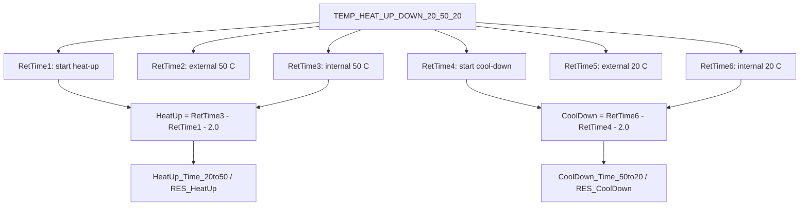

## Contract 4: DB Contract

### 4.1 DB Leaves

| Device | DB Field | Report file | Sheet | Cell | Rule |
|---|---|---|---|---|---|
| VH-C10-A | `HeatUp_Time_20to50` | `HeatUp and CoolDownTime.XLS` | `HeatUp&CoolDown` | `D26` | `RetTime3 - RetTime1 - 2.0`, displayed to 1 decimal. |
| VH-C10-A | `CoolDown_Time_50to20` | `HeatUp and CoolDownTime.XLS` | `HeatUp&CoolDown` | `D27` | `RetTime6 - RetTime4 - 2.0`, displayed to 1 decimal. |
| VH-C10-A | `RES_HeatUp` | `HeatUp and CoolDownTime.XLS` | `HeatUp&CoolDown` | `E26` | Pass if heat-up time <= Definitions. |
| VH-C10-A | `RES_CoolDown` | `HeatUp and CoolDownTime.XLS` | `HeatUp&CoolDown` | `E27` | Pass if cool-down time <= Definitions. |
| VC-C10-A | same four fields | `HeatUp and CoolDownTime.XLS` | `HeatUp&CoolDown` | `D26:D27`, `E26:E27` | Same rule. |
| VA-C10-A | same four fields | `HeatUp and CoolDownTime.XLS` | `HeatUp&CoolDown` | `D26:D27`, `E26:E27` | Same rule. |

### 4.2 DB Boundary

This test's DB contract is timing-only:

```text
No temperature accuracy, precision, stability or PCC DB fields should be
attached to this test unless the report/DB mapping is deliberately changed.
```

## Contract 5: Config Requirement

| Requirement | VH-C10-A | VC-C10-A | VA-C10-A | Failure mode |
|---|---|---|---|---|
| `AUDIT.ColumnComp.ModelNo` source of truth | Required | Required | Required | Wrong page/report context. |
| Column compartment CC control | Required | Required | Required | 20/50/20 transitions cannot execute. |
| `CC.TempReady` | Required | Required | Required | Start/equilibration readiness invalid. |
| `CC.Temperature.Value` / internal CC signal | Required | Required | Required | `RetTime3` and `RetTime6` cannot be emitted. |
| External upper thermometer | Required | Required | Required | `RetTime2` and `RetTime5` cannot be emitted; guards incomplete. |
| External lower thermometer | Acquired | Acquired | Acquired | Diagnostic/report trace incomplete, even if final DB timing uses upper/internal anchors. |
| Full RetTime1..6 contract | Required | Required | Required | Report layout and DB timing cannot be reconstructed. |
| Method timing / stable holds | Required | Required | Required | `-2.0 min` report correction becomes invalid. |

Generation guardrails:

```text
1. Do not remove RetTime2 or RetTime5 even though the final DB rule uses
   RetTime3 and RetTime6; the visible report layout still exposes them.
2. If the stable hold duration changes, the `-2.0 min` report rule must also
   change.
3. If using external endpoints instead of internal endpoints, the DB/report
   contract must be rewritten and explicitly validated.
4. A cut-down heat-only method can reuse only the heat-up half if the report and
   DB contract are also split or regenerated.
```

## Contract 6: Open Verification

Items below are marked Open Verification Required until the listed evidence is
captured.

| # | Uncertain point | Required evidence | Likely source |
|---:|---|---|---|
| 1 | Exact FormulaOne workbook route from row 65/66 cells to `D26:D27`. | Workbook formula extraction. | `SpreadSheetData` / FormulaOne parser. |
| 2 | Why VC uses `CORRECT_ACCURACY_INJ_INSERTION` while VH/VA use `No_Integration`. | Processing method action table and CM sequence view. | Processing method XML / Chromeleon UI. |
| 3 | Exact `Definitions!HeatUp & Cool Down` limit by report template. | Definitions sheet values. | VTCC/VATCC report template workbook layer. |
| 4 | Whether VA `Report_VATCC_V1_01` uses identical row 65/66 layout. | VA-specific report formula object export. | Real VA CMBX report template. |
| 5 | Whether external endpoint timing is used in any printed/internal report page even if DB uses internal endpoint timing. | Full exported report comparison. | CM report export / Excel workbook. |

## VH / VC / VA Comparison

| Question | VH-C10-A | VC-C10-A | VA-C10-A |
|---|---|---|---|
| Which injection is used? | `HeatUp and CoolDownTime` | `HeatUp and CoolDownTime` | `HeatUp and CoolDownTime` |
| Which method is used? | `TEMP_HEAT_UP_DOWN_20_50_20` | `TEMP_HEAT_UP_DOWN_20_50_20` | `TEMP_HEAT_UP_DOWN_20_50_20` |
| Which processing method is used? | `No_Integration` | `CORRECT_ACCURACY_INJ_INSERTION` | `No_Integration` |
| Which RetTimes are emitted? | `RetTime1..6` | `RetTime1..6` | `RetTime1..6` |
| Which report sheet is used? | `HeatUp&CoolDown` | `HeatUp&CoolDown` | `HeatUp&CoolDown` |
| Which template family is used? | `Report_VTCC_V2_12` | `Report_VTCC_V2_12` | `Report_VATCC_V1_01` |

## Command, Report, DB Flow

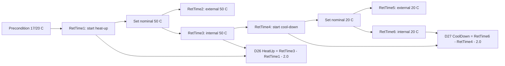

## Generation Readiness

| Use case | Readiness | Reason |
|---|---|---|
| Reuse full HeatUp/CoolDown branch from existing CMBX | High | Method/report/DB chain is closed enough for full reuse. |
| Generate heat-up-only package | Partial | Method half is clear, but report/DB must be split or regenerated. |
| Change stable hold duration | Not ready with existing report | The `-2.0 min` rule is hard-coded in evaluator/report contract. |
| Change temperature range, e.g. 25->45->25 | Partial | Method trigger thresholds and report field names/criteria must be regenerated. |
| Use external endpoint timing instead of internal endpoint timing | Not ready | Requires explicit report/DB contract change and CM export verification. |
