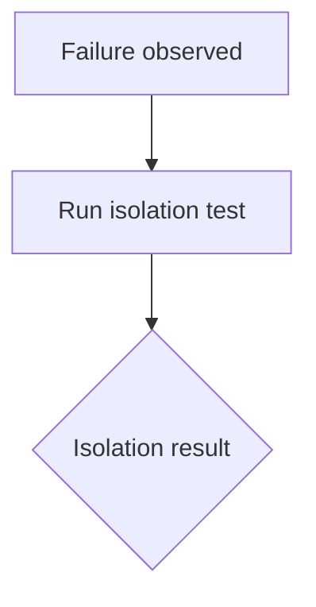
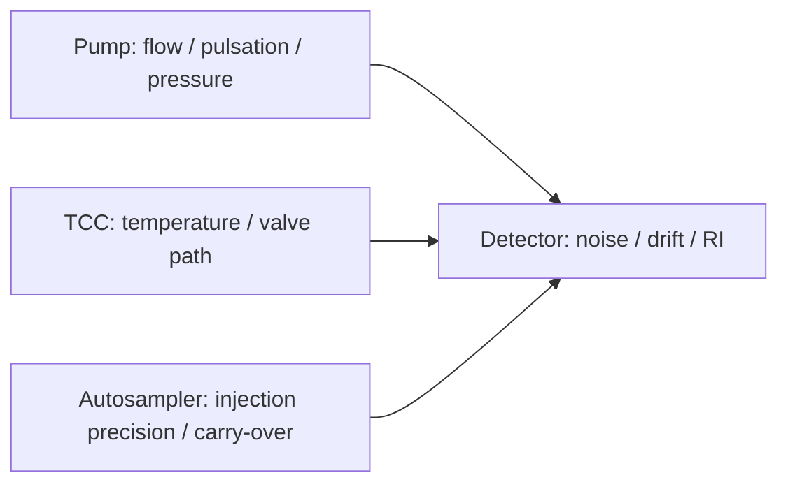

# FOQ / Technical Test Document Markdown Schema

Use this schema for Thermo Fisher / Dionex FOQ_TD, factory operational qualification, and HPLC module test-spec documents.

## Required Sections

```markdown
# <Document title>

## Knowledge File Metadata
## 文档元数据
## 核心术语与缩写
## 测试流程概览
## 关键测试条件汇总
## 详细测试知识卡
## 对比分析
## 故障排除知识库
## 测试逻辑解读
## 公式解读
## Cross-Module Dependency Mapping
## Executable Pseudocode
## Open Verification Required
## Final Knowledge Summary
```

## Knowledge File Metadata

| Field | Value |
|---|---|
| KB_Version | 1.0 |
| Source_Revision | |
| Extraction_Date | |
| Extractor | technical-document-knowledge-extractor |
| Source_Path | |

## 文档元数据

| Field | Value |
|---|---|
| 文档标题 | |
| 文档编号 / Agile Document ID | |
| 当前版本 | |
| 发布日期 / Current Revision Date | |
| 适用仪器型号 | |
| 文档负责人 / Document Owner | |
| 文件引用 | |
| 源文档类型 | |

## 核心术语与缩写

| Term | Meaning | Knowledge note |
|---|---|---|

Prefer terms such as:

```text
FOQ
DAD / MWD / UV / VIS
3D Field
Diagnostic Cell
Standard Cell / Fluidic Flow Cell
Response Time / Time Constant
DCR / RST
Stray Light
Dark Current Drift
HoFi
FWHM
RI
```

## 测试流程概览

| Order | Component | Test / Action | Configuration | Applicability |
|---:|---|---|---|---|

Explicitly separate diagnostic/internal optical tests, fluidic/chromatographic tests, and final service/default checks.

## 关键测试条件汇总

Create tables for:

```text
General chromatographic / method conditions
Hardware / configuration requirements
Solvents and standards
Chromeleon instrument configuration
```

Use:

| Parameter | General setting | Notes / applicability |
|---|---|---|

## 详细测试知识卡

For every source test section:

```markdown
### <section number> <test name>

**测试目的**

**测试步骤简述**

**关键参数**

| 参数 | 设定值 | 与通用条件的差异 |
|---|---|---|

**评估方法与接受标准**

| 判据 | 限值 | 类型 | 备注 |
|---|---:|---|---|

**相关性标注**
```

Acceptance criteria type vocabulary:

```text
External
Internal
Internal / For information only
External / validity check
Internal validity check
Type: not explicit in source
```

## 对比分析

Use comparison tables for model differences, fixture differences, lamp/signal configuration, and external vs internal criteria.

## 故障排除知识库

Prefer Mermaid and a problem-cause-action table:



| Problem | Diagnostic logic | Likely cause | Recommended action |
|---|---|---|---|

## 测试逻辑解读

Use explicit labels:

```markdown
### <topic>

🧠 Knowledge Interpretation
...

⚙️ Generation Implication
...

🔓 Open Verification Required
...
```

## 公式解读

For each important formula:

```markdown
### <Formula name>

Formula:
```text
formula
```

| Parameter | Meaning | How it is obtained |
|---|---|---|

🧠 Knowledge Interpretation
...
```

## Cross-Module Dependency Mapping

When multiple module KBs exist:



| Source module | Affected module/test | Dependency | Failure propagation |
|---|---|---|---|

## Executable Pseudocode

For parameterized tests:

```python
def run_test(params):
    equilibrate(params)
    inject(params)
    acquire_data(params)
    result = evaluate(params)
    return pass_fail(result)
```

Mark steps requiring manual intervention or CM command verification.

## Open Verification Required

| Item | Why unresolved | Required evidence |
|---|---|---|

## Final Knowledge Summary

End with:

```text
1. What the TD proves.
2. What configuration must be known before generation.
3. Which test branches depend on model.
4. Which formulas/report fields remain to be verified from CMBX/report templates.
```

